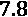

# 一、解释、可解释性、可说明性；为什么这些都很重要？

我们生活在一个规则和程序受数据和算法支配的世界。

例如，有规则规定谁可以获得信贷批准或保释，以及哪些社交媒体帖子可能会受到审查。还有一些程序来确定哪种营销策略是最有效的，以及哪些胸部 x 光特征可能诊断出肺炎阳性病例。

你希望这样，因为这不是什么新鲜事！

但是不久以前，诸如此类的规则和程序曾经被硬编码到软件、教科书和纸质表格中，而人类是最终的决策者。通常，这完全取决于人的判断力。决策取决于人的判断力，因为规则和程序是僵化的，因此并不总是适用的。总会有例外，所以需要人来制造例外。

例如，如果你想申请抵押贷款，你的批准取决于一个可接受的和合理的长期信用记录。反过来，这些数据将使用评分算法产生信用评分。然后，银行有规则来决定什么分数对你想要的抵押贷款是足够好的。你的信贷员可以跟踪它或者忽略它。

如今，金融机构用几十个变量对数千种抵押贷款结果进行模型训练。这些模型可以用来确定你违约的可能性，假设有很高的准确性。如果有一个信贷员来盖章批准或拒绝，这就不再仅仅是一个指导方针，而是一个算法决定。怎么会错呢？怎么可能是对的？

坚持这个想法，因为在这本书里，我们将会学到这些问题的答案以及更多！

解释由机器学习模型做出的决定是为了找到其中的意义，但此外，你可以追溯到它的来源和转变它的过程。本章介绍机器学习解释和相关概念，如可解释性、可解释性、黑盒模型和透明性。本章提供了这些术语的定义以避免歧义，并强调了机器学习可解释性的价值。这些是我们将要讨论的主要话题:

*   什么是机器学习解释？
*   理解解释和可解释性之间的区别
*   可解释性的商业案例

我们开始吧！

# 技术要求

按照本章的例子，你需要 Python 3，要么运行在 Jupyter 环境中，要么运行在你最喜欢的`requests`、`bs4`、`pandas`、`sklearn`、`matplotlib,`和`scipy` Python 库中。本章代码位于此处:[https://github . com/packt publishing/Interpretable-Machine-Learning-with-Python/tree/master/chapter 01](https://github.com/PacktPublishing/Interpretable-Machine-Learning-with-Python/tree/master/Chapter01)。

# 什么是机器学习解释？

解释某事就是解释它的意思。在机器学习的背景下，这个东西就是算法。更具体地说，该算法是一种数学算法，它接受输入数据并产生输出，就像任何公式一样。

让我们来看看最基本的模型，简单线性回归，如下式所示:


一旦与数据拟合，该模型的意义在于预测是特征与系数的加权和。在这种情况下，只有一个 **特征**或**预测**变量，而变量通常称为**响应**或**目标**变量。一个简单的线性回归公式单独地解释了转换，该转换在输入数据上执行以产生输出。下面的例子可以进一步详细说明这个概念。

## 了解简单的体重预测模型

如果你去加州大学维护的这个网页[http://wiki . stat . UCLA . edu/socr/index . PHP/SOCR _ Data _ Dinov _ 020108 _ HeightsWeights](http://wiki.stat.ucla.edu/socr/index.php/SOCR_Data_Dinov_020108_HeightsWeights)，你可以找到一个链接下载一个数据集，这个数据集是22 岁儿童体重和身高的综合记录。我们不会使用整个数据集，而只使用 web 页面上带有记录的样本表。我们从网页上抓取表格，并用线性回归模型拟合数据。该模型使用身高来预测体重。

换句话说，和，因此线性回归模型的公式如下:


你可以在这里找到这个例子的代码:[https://github . com/packt publishing/Interpretable-Machine-Learning-with-Python/blob/master/chapter 01/weight prediction . ipynb](https://github.com/PacktPublishing/Interpretable-Machine-Learning-with-Python/blob/master/Chapter01/WeightPrediction.ipynb)。

若要运行此示例，您需要安装以下库:

*   `requests`获取网页
*   `bs4`(美汤)从网页上刮下表格
*   `pandas`将表格加载到数据框中
*   `sklearn` (scikit-learn)拟合线性回归模型并计算其误差
*   `matplotlib`将模型可视化
*   `scipy`检验相关性

您应该首先加载它们，如下所示:

```
Import math
import requests
from bs4 import BeautifulSoup
import pandas as pd
from sklearn import linear_model
from sklearn.metrics import mean_absolute_error
import matplotlib.pyplot as plt
from scipy.stats import pearsonr
```

一旦所有的库都被加载，您就可以使用`requests`来获取网页的内容，就像这样:

```
url = \
'http://wiki.stat.ucla.edu/socr/index.php/SOCR_Data_Dinov_020108_HeightsWeights'
page = requests.get(url)
```

然后，取这些内容，用`BeautifulSoup`刮出表格的内容，如下所示:

```
soup = BeautifulSoup(page.content, 'html.parser')
tbl = soup.find("table",{"class":"wikitable"})
```

`pandas`可以将表格的原始**超文本标记语言** ( **HTML** )内容转换成 dataframe，如下图所示:

```
height_weight_df = pd.read_html(str(tbl))[0]\
[['Height(Inches)','Weight(Pounds)']]
```

瞧！我们现在有一个数据帧，其中一列是`Heights(Inches)`，另一列是`Weights(Pounds)`。作为健全性检查，我们可以计算记录的数量。这个应该是。代码如下所示:

```
num_records = height_weight_df.shape[0]
print(num_records)
```

既然我们已经确认我们有数据，我们必须转换它，使它符合模型的规范。`sklearn`需要它作为具有维度的 NumPy 数组，所以我们必须首先提取`Height(Inches)`和`Weight(Pounds)`熊猫系列。然后，我们将它们转换成 NumPy 数组，最后，将它们重塑成维。以下命令执行所有必要的转换操作:

```
x = height_weight_df['Height(Inches)'].values.\
                                       reshape(num_records, 1)
y = height_weight_df['Weight(Pounds)'].values.\
                                       reshape(num_records, 1)
```

然后，初始化 scikit-learn `LinearRegression`模型，并用训练数据对其进行`fit`处理，如下所示:

```
model = linear_model.LinearRegression()
_ = model.fit(x,y)
```

要在 scikit-learn 中输出拟合的线性回归模型公式，必须提取截距和系数。这是**公式**，解释了它是如何做出预测的:

```
print("ŷ =" + str(model.intercept_[0]) + " + " +\
                          str(model.coef_.T[0][0]) + " x₁")
```

以下是输出:

```
ŷ = -106.02770644878132 + 3.432676129271629 x1
```

这告诉我们，平均来说，每增加一磅，身高就会增加 3.4 英寸。

然而，*解释模型如何工作*只是解释这个线性回归模型的一种方式，而且这只是故事的一面。该模型并不完美，因为实际结果和预测结果的训练数据并不相同。两者的区别是**误差**或**残差**。

有许多方法可以理解模型中的错误。您可以使用误差函数，如`mean_absolute_error`来测量预测值和实际值之间的偏差，如以下代码片段所示:

```
y_pred = model.predict(x)
mae = mean_absolute_error(y, y_pred)
print(mae)
```

以下是输出:

```
7.7587373803882205
```

平均绝对误差意味着，平均而言，预测值与实际值相差磅，但这可能不直观或信息不丰富。可视化线性回归模型可以揭示这些预测的准确程度。

这可以通过使用`matplotlib`散点图并覆盖线性模型(蓝色)和*平均绝对误差*(两条平行的灰色带)来实现，如以下代码片段所示:

```
plt.scatter(x, y, color='black')
plt.plot(x, y_pred, color='blue', linewidth=3)
plt.plot(x, y_pred + mae, color='lightgray')
plt.plot(x, y_pred - mae, color='lightgray')
plt.xlabel('Height(Inches)')
plt.ylabel('Weight(Pounds)')
```

如果运行前面的代码片段，图 1.1 中显示的图就是您得到的输出:


图 1.1-根据身高预测体重的线性回归模型

从图 1.1 中的*图可以看出，很多时候实际值与预测值相差磅。然而，平均绝对误差可能会让你误以为误差总是更接近于。这就是为什么有必要将模型的误差可视化，以了解其分布。从该图判断，我们可以看出该分布没有突出的危险信号，例如一个高度范围的残差比其他高度范围的残差更分散。因为它或多或少地均匀分布，我们说它是同分布的。在线性回归的情况下，这个是您应该测试的许多模型假设中的一个，以及*线性*、*正态性*、*独立性*和缺乏*多重共线性*(如果有多个特征)。这些假设确保您在工作中使用正确的模型。换句话说，身高和体重*可以用线性关系来解释*，从统计学上来说这样做是个好主意。*

通过这个模型，我们试图在身高和体重之间建立线性关系。这个关联被称为来自`scipy`的`pearsonr`函数，如下图所示:

```
corr, pval = pearsonr(x[:,0], y[:,0])
print(corr)
```

以下是输出:

```
0.5568647346122992
```

这个数字是正的，这并不奇怪，因为随着身高的增加，体重也趋于增加，但它也更接近于而不是，这表明它是强相关的。由`pearsonr`函数产生的第二个数字是用于测试非相关性的值。如果我们测试它小于 5%的误差水平，我们可以说有足够的证据表明这种相关性，如下所示:

```
print(pval < 0.05)
```

以下是输出:

```
True
```

了解一个模型如何运行以及在什么情况下可以帮助我们**解释为什么它会做出某些预测**，以及什么时候不能。让我们想象一下，有人要求我们解释为什么一个 71 英寸高的人被预测有 134 磅的体重，但实际上却重了 18 磅。从我们对模型的了解来看，这个误差幅度并不罕见，尽管它并不理想。然而，在许多情况下，我们不能指望这个模型是可靠的。如果我们被要求在这个模型的帮助下预测一个 56 英寸高的人的体重会怎么样？我们能保证同样的准确性吗？肯定不是，因为我们在不短于 63 英寸的受试者的数据上拟合模型。如果我们被要求预测一个 9 岁孩子的体重，情况也是如此，因为训练数据是针对 18 岁的孩子的。

尽管结果可以接受，但这种体重预测模型并不是一个现实的例子。如果你想更准确，但更重要的是，忠实于真正影响个人体重的因素，你需要添加更多的变量。你可以添加——比如说——性别、年龄、饮食和活动水平。这就是有趣的地方，因为你必须确保**包含或不包含它们是公平的**。例如，如果包括性别，但我们的大部分数据集是由男性组成的，你如何确保女性的准确性？这就是所谓的**选择偏差**。如果体重与生活方式的选择以及贫困和怀孕等环境的关系比性别更大呢？如果不包括这些变量，这就是称为**省略变量偏差**。然后，冒着给模型增加偏见的风险，把敏感的性别变量包括进来有意义吗？

一旦你有了多个已经过公平审查的特征，你就可以找出并*解释哪些特征影响了模型性能*。我们称之为**特征重要性**。然而，随着我们添加更多的变量，我们增加了模型的复杂性。矛盾的是，这是一个解释的问题，我们将在接下来的章节中更详细地探讨这个问题。目前，关键的要点应该是模型解释与解释以下内容有很大关系:

1.  我们能解释预测是公平的吗？
2.  我们能可靠地将预测追溯到某事或某人吗？
3.  我们能解释预测是如何做出的吗？我们能解释这个模型是如何工作的吗？

最终，我们试图回答的问题是:

我们能相信这个模型吗？

可解释机器学习的三个主要概念与前面的三个问题直接相关，缩写为 **FAT** ，代表**公平**、**问责**和**透明**。如果你能解释预测是在没有明显偏见的情况下做出的，那么就有了**公平性**。如果你能解释为什么它会做出某些预测，那么就有了**责任**。如果你能解释预测是如何做出的，模型是如何工作的，那么就有了**透明度**。如*图 1.2* 所示，这些概念涉及许多伦理问题:


图 1.2–可解释机器学习的三个主要概念

一些研究人员和公司在一个更大的伦理人工智能 T21 的保护伞下扩张脂肪，从而将脂肪转化为命运。伦理人工智能是关于算法和数据治理的更大讨论的一部分。然而，这两个概念非常重叠，因为可解释的机器学习是如何在机器学习中实现 FAT 原则和伦理问题的。在本书中，我们将在这一背景下讨论伦理学。例如， [*第十三章*](B16383_13_ePub_RK.xhtml#_idTextAnchor284) ，*对抗性健壮性*与可靠性、安全性和安全性有关。 [*第十一章*](B16383_11_ePub_RK.xhtml#_idTextAnchor231) 、*减轻偏倚和因果推断方法*涉及公平。也就是说，可解释的机器学习可以在没有道德目标的情况下被利用，也可以出于不道德的原因。

# 理解可解释性和可解释性之间的区别

在阅读本书的前几页时，你可能已经注意到，动词*解释*和*解释*，以及名词*解释*和*解释*，已经被互换使用。这并不奇怪，因为解释就是解释事物的意义。尽管如此，相关术语*可解释性*和*可解释性*不应该互换使用，尽管它们经常被误认为同义词。

## 什么是可解释性？

可解释性是人类，包括非主题专家，能够理解机器学习模型的原因和效果，以及输入和输出的程度。说一个模型具有高水平的可解释性意味着你可以用人类可解释的方式描述它的推论。换句话说，为什么模型的输入会产生特定的输出？输入数据的要求和约束是什么？预测的置信界限是什么？或者说，为什么一个变量比另一个变量有更实质性的影响？对于可解释性来说，详细描述一个模型是如何工作的只有在它能够解释它的预测并证明它是用例的正确模型的范围内才是相关的。

在本章的例子中，你可以解释人类的身高和体重之间存在线性关系，因此使用线性回归而不是非线性模型是有意义的。你可以从统计学上证明这一点，因为涉及的变量不违反线性回归的假设。即使统计数据站在我们这边，您仍然应该咨询用例中涉及的领域知识领域。从生物学的角度来说，在这一点上，我们是放心的，因为我们对人类生理学的了解并不与身高和体重之间的联系相矛盾。

### 当心复杂性

许多机器学习模型天生就难以理解，仅仅是因为模型内部工作或特定模型架构中涉及的数学。除此之外，从数据集选择到特征选择和工程设计，再到模型训练和调整选择，许多选择都会增加复杂性并降低模型的可解释性。这种复杂性使得解释其工作原理成为一项挑战。机器学习的可解释性是一个非常活跃的研究领域，所以对它的精确定义仍有很多争论。辩论包括是否需要完全透明来证明机器学习模型具有足够的可解释性。这本书倾向于这样一种理解，可解释性的定义不一定排除不透明的模型，这些模型在很大程度上是复杂的，只要所做的选择不损害它们的可信度。这种妥协就是通常所说的 T2 事后可解释性。毕竟，就像复杂的机器学习模型一样，我们无法准确解释人脑如何做出选择，但我们经常相信它的决定，因为我们可以询问人类的推理。后特设机器学习解释是完全相同的事情，除了它是一个人代表模型解释推理。使用这种特殊的可解释性概念是有利的，因为我们可以解释不透明的模型，而不会牺牲我们预测的准确性。我们将在 [*第 3 章*](B16383_03_ePub_RK.xhtml#_idTextAnchor051) 、*解释挑战*中对此进行更详细的讨论。

### 什么时候可解释性很重要？

决策系统并不总是需要可解释性。在研究中，有两种情况作为例外提供，在此概述如下:

*   当不正确的结果没有重大后果时。例如，如果一个机器学习模型被训练来寻找和读取包裹中的邮政编码，偶尔会误读它，并将其发送到其他地方，会怎么样？歧视性偏见的可能性很小，错误分类的成本相对较低。将成本放大到可接受的阈值之外的情况并不经常发生。
*   虽然会有后果，但这些后果已经在现实世界中得到充分研究和验证,足以在没有人类参与的情况下做出决策。这就是**交通警报和防撞系统** ( **TCAS** )的情况，它提醒飞行员另一架飞机构成了空中碰撞的威胁。

另一方面，这些系统需要可解释性以具有以下属性:

*   科学知识的挖掘:气象学家可以从气候模型中学到很多东西，但前提是它很容易解释。
*   可靠安全:自动驾驶汽车做出的决定必须是可调试的，这样开发者才能理解故障点。
*   **伦理**:翻译模型可能会使用带有性别偏见的单词嵌入，导致歧视性的翻译，但是你必须能够很容易地找到这些例子来纠正它们。然而，系统必须以这样一种方式设计，即在向公众发布之前，你可以意识到一个问题。
*   **结论性和一致性**:有时，机器学习模型可能有不完整和相互排斥的目标——例如，胆固醇控制系统可能不会考虑患者遵守饮食或药物疗法的可能性，或者可能会在一个目标和另一个目标之间进行权衡，如安全和非歧视。

通过解释一个模型的决策，我们可以弥补我们对问题理解的不足——它的不完整性。最重要的问题之一是，鉴于我们的机器学习解决方案的高准确性，我们倾向于将我们的信心水平提高到我们认为我们完全理解问题的程度。然后，我们被误导，认为我们的解决方案涵盖了所有的内容！

在本书的开始，我们讨论了如何利用数据产生算法规则并不是什么新鲜事。然而，我们过去常常事后批评这些规则，现在我们不这样做了。因此，过去是人负责，现在是算法负责。在这种情况下，该算法是一个机器学习模型，负责这需要的所有道德分歧。这个开关跟精度有很大关系。问题是，尽管一个模型在总体上可能超过人类的准确性，但机器学习模型尚未像人类一样解释其结果。因此，它不会事后批评自己的决定，所以作为一个解决方案，它缺乏理想的完整性。这就是为什么我们需要解释模型，这样我们至少可以弥补一些差距。那么，为什么机器学习解释还没有成为标准的一部分呢？除了我们倾向于只关注准确性之外，最大的障碍之一是令人生畏的黑盒模型概念。

### 什么是黑箱模型？

这只是不透明模型的另一个术语。黑盒指的是一个系统，其中只有输入和输出是可观测的，你看不到是什么将输入转化为输出。在机器学习的情况下，可以打开一个黑盒模型，但它的机制不容易理解。

### 什么是白盒模型？

这些是与黑盒模型相对的(参见*图 1.3* )。它们也被称为透明，因为它们实现了完全或接近完全的解释透明。在这本书中，我们称它们为**内在可解释的**，我们将在 [*第 3 章*](B16383_03_ePub_RK.xhtml#_idTextAnchor051) 、*解释挑战*中更详细地介绍它们。

请看这里的模型对比:


图 1.3-白盒和黑盒模型的视觉对比

## 什么是可解释性？

可解释性包含了可解释性的一切。不同之处在于，它在透明度要求上比可解释性更深入，因为它要求对模型的内部工作和模型训练过程进行人性化的解释，而不仅仅是模型推断。根据应用的不同，这个需求可能扩展到不同程度的模型、设计和算法透明性。这里列出了三种类型的透明度:

*   **模型透明度**:能够解释一个模型是如何一步步被训练出来的。在我们的简单重量预测模型的情况下，我们可以解释称为**普通最小二乘法**的优化方法如何找到使模型中的误差最小化的系数。
*   **设计透明**:能够解释所做的选择，例如模型架构和超参数。例如，我们可以根据训练数据的大小或性质来证明这些选择的合理性。如果我们正在进行销售预测，并且我们知道我们的销售有 12 个月的季节性，这可能是一个合理的参数选择。如果我们有疑问，我们总是可以使用一些成熟的统计方法来找到正确的季节性。
*   **算法透明性**:能够解释自动优化，比如网格搜索超参数；但是请注意，那些由于其随机性质而无法再现的算法(如随机搜索超参数优化、早期停止和随机梯度下降)使算法变得不透明。

不透明模型之所以被称为不透明模型，仅仅是因为它们缺乏模型透明度，但是对于许多模型来说，这是不可避免的，无论模型选择是多么合理。在许多情况下，即使你输出了参与训练神经网络或随机森林的数学知识，它也会引起更多的怀疑，而不是产生信任。这至少有几个原因，概括如下:

*   **不“基于统计”**:不透明的模型训练过程将输入映射到最佳输出，留下看似任意的参数轨迹。这些参数针对成本函数进行了优化，但并不基于统计理论。
*   **不确定性和不可再现性**:当你用相同的数据拟合一个透明模型时，你总是得到相同的结果。另一方面，不透明模型不具有同等的可再现性，因为它们使用随机数来初始化它们的权重，或者调整或优化它们的超参数，或者利用随机鉴别(随机森林就是这种情况)。
*   **过度拟合和维数灾难**:这些模型中的许多都在高维空间中运行。这不会引起信任，因为在更多的维度上很难概括。毕竟，你添加的维度越多，就有越多的机会去过度拟合一个模型。
*   **人类认知和维数灾难**:透明模型通常用于维数较少的小型数据集，即使它们不是透明模型，也不要使用不必要的维数。他们也不会使这些维度之间的交互变得不必要的复杂。这种不必要的复杂性使得可视化模型正在做什么及其结果变得更加容易。人类不太擅长理解许多维度，因此使用透明模型往往会使这一点更容易理解。
*   **奥卡姆剃刀**:这就是所谓的简单或简约原则。它指出最简单的解决方案通常是正确的。不管是真是假，人类也偏爱简单，透明模型以简单著称。

### 为什么以及什么时候可解释性很重要？

可信赖和道德决策是可解释性的主要动机。可解释性有额外的动机，如因果性、可转移性和信息性。因此，在许多用例中，完全或几乎完全的透明性受到重视，这是理所当然的。其中一些概述如下:

*   **科学研究**:再现性对科学方法至关重要。此外，当需要证明因果关系时，使用基于统计的优化方法尤其可取。
*   **临床试验**:这些试验也必须产生可重复的结果，并有统计学依据。除此之外，考虑到过度拟合的潜在严重性，他们必须使用尽可能少的维度和不会使其复杂化的模型。
*   **消费品安全测试**:与临床试验一样，当生死攸关的安全成为关注点时，尽可能简单是首选。
*   **公共政策和法律**:这是一个更加微妙的讨论，作为所谓的法律学者**算法治理**的一部分，他们已经区分了**鱼缸透明**和**理性透明**。前者更接近于消费品安全测试所需的严格性，而后者则是事后可解释性就足够了。有一天，政府可以完全由算法来管理。当这种情况发生时，很难判断哪些政策将与哪种形式的透明度相一致，但在公共政策的许多领域，如刑事司法，绝对透明是必要的。然而，每当完全透明与隐私或安全目标相矛盾时，一种不那么严格的透明形式就不得不凑合了。
*   **刑事调查和法规合规性审计**:如果出现问题，比如机器人故障导致的化工厂事故或自动驾驶汽车的碰撞，调查人员需要跟踪**决策轨迹**。这个是为了“便于问责和法律责任的分配”。即使没有事故发生，这种审计也可以在当局授权时进行。合规性审计适用于受监管的行业，如金融服务、公用事业、运输和医疗保健。在许多情况下，鱼缸透明度是首选。

# 可解释性的商业案例

本节描述了机器学习可解释性的几个实际商业利益，例如更好的决策，以及更可信、更道德和更有利可图。

## 更好的决策

通常，机器学习模型被训练，然后对照期望的度量进行评估。如果他们通过了对拒不接受的数据集的质量控制，他们就会被部署。然而，一旦在现实世界中进行测试，事情就会变得疯狂，如以下假设场景所示:

*   一个高频交易算法就能让股市崩盘。
*   数百台智能家居设备可能会莫名其妙地爆发出自发的笑声，让用户感到恐惧。
*   车牌识别系统可能会错误地读取一种新的车牌，并对错误的司机进行罚款。
*   带有种族偏见的监控系统可能会错误地检测到入侵者，因此警卫会射杀一名无辜的办公室职员。
*   自动驾驶汽车可能会将雪误认为路面，撞上悬崖，并伤害乘客。

任何系统都容易出错，所以这并不是说可解释性是万灵药。然而，只关注优化指标可能会导致灾难。在实验室中，模型可能概括得很好，但是如果您不知道模型为什么做出决策，那么您可能会错过改进的机会。例如，知道自动驾驶汽车认为什么是道路是不够的，但知道 T2 为什么 T3 可以帮助改进模型。比方说，如果其中一个原因是道路像雪一样是浅色的，这可能是危险的。通过将冬季道路图像引入数据集或将实时天气数据输入模型，检查模型的假设和结论可以改进模型。此外，如果这不起作用，也许算法故障保险可以阻止它对自己不完全有信心的决定采取行动。

关注机器学习的可解释性导致更好的决策制定的主要原因之一，在我们之前谈论完整性时已经提到过。如果你认为一个模型是完整的，那么让它变得更好有什么意义呢？再者，如果你不质疑模型的推理，那么你对问题的理解一定是完整的。如果是这种情况，也许你一开始就不应该使用机器学习来解决问题！机器学习创造了一种算法，否则这种算法会太复杂，无法用 *if-else* 语句编程，恰恰可以用于我们对问题的理解不完整的情况！

事实证明，当我们预测或估计某事时，特别是高度准确地预测或估计时，我们认为我们控制了它。这就是所谓的**控制偏差**错觉。我们不能低估一个问题的复杂性，因为总的来说，这个模型几乎总是正确的。即使对一个人来说，雪和混凝土路面之间的区别也是模糊的，难以解释。你如何开始用一种总是准确的方式来描述这种差异呢？一个模型可以学习这些差异，但这并不会降低它的复杂性。检查模型的故障点并持续警惕异常值需要不同的观点，由此我们承认我们无法控制模型，但我们可以通过解释来试图理解它。

以下是一些可能对模型产生负面影响的额外决策偏差，也是可解释性能够带来更好决策的原因:

*   **保守主义偏见**:当我们获得新信息时，我们不会改变之前的信念。在这种偏见下，根深蒂固的既有信息胜过新信息，但模型应该会进化。因此，重视质疑先前的假设是一种健康的态度。
*   **突出偏见**:一些突出或更明显的事物可能比其他事物更突出，但从统计学上来说它们应该得到与其他事物同等的关注。这种偏见可能会影响我们对特征的选择，因此可解释性思维可以扩展我们对问题的理解，以包括其他较少被感知的特征。
*   **基本归因错误**:这种偏见导致我们将结果归因于行为而非环境、性格而非环境、先天而非后天。可解释性要求我们更深入地探索，寻找我们的变量之间不太明显的关系或那些可能丢失的关系。

模型解释的一个重要好处是定位*异常值*。这些异常值可能是潜在的新收入来源，也可能是即将发生的负债。了解这一点可以帮助我们做好相应的准备和制定战略。

## 更值得信赖的品牌

信任被定义为对某事或某人的可靠性、能力或可信度的信念。在组织中，信任是他们的声誉；在无情的舆论法庭上，一次事故、一场争论或一次惨败就足以让公众失去大量的信任。这反过来会导致投资者信心减弱。

让我们想想波音公司在 737 MAX 崩溃后发生了什么，或者脸书在 2016 年总统选举丑闻后发生了什么。在这两个案例中，都有一些短视的决策仅仅是为了优化一个指标，无论是预测的飞机销售还是数字广告销售。这些人低估了已知的潜在故障点，完全忽略了非常大的故障点。从那以后，当组织诉诸谬误来证明他们的推理是正确的，迷惑公众，或者分散媒体的叙述时，情况往往会变得更糟。这种行为可能会导致额外的公关失误。他们不仅因为第一次犯错而失去了对*他们所做的*的信任，而且他们试图愚弄人们，失去了对*他们所说的*的信任。

大部分情况下，这些都是人们做出决定的例子。在决策完全由机器学习模型做出的情况下，这可能会变得更糟，因为很容易丢球，并将责任留在模型的角落里。例如，如果你开始在你的脸书订阅中看到攻击性内容，脸书可以说这是因为它的模型是用你的数据*训练的*，比如你的评论和喜欢，所以它实际上是你想看到的*的反映*。不是他们的错，是你的错。如果警方因为使用 PredPol(一种预测犯罪将在何时何地发生的算法)而将你的社区作为积极警务的目标，它可能会责怪该算法。另一方面，这种算法的开发者可能会责怪警方，因为该软件是根据警方的报告进行训练的。这产生了一个潜在的令人不安的反馈循环，更不用说问责缺口了。如果一些恶作剧或黑客消除车道标志，这可能会导致特斯拉自动驾驶汽车转向错误的车道。这是特斯拉的错，他们没有预料到这种可能性，还是黑客的错，因为他们把一个活动扳手扔进了他们的模型？这就是所谓的**对抗性攻击**，我们在 [*第 13 章*](B16383_13_ePub_RK.xhtml#_idTextAnchor284) *【对抗性鲁棒性】中讨论这一点。*

让模型更好地做决策，无疑是机器学习可解释性的目标之一。但是即使他们失败了，你也可以表现出你努力过。信任的丧失并不完全是因为失败本身，而是因为缺乏问责，即使在接受所有指责不公平的情况下，一些问责也比没有问责好。例如，在前面的例子中，脸书可以寻找为什么攻击性材料更经常出现的线索，然后致力于寻找减少这种事情发生的方法，即使这意味着赚更少的钱。PredPol 可以找到其他潜在偏差较小的犯罪率数据来源，即使它们较小。他们还可以使用技术来减轻现有数据集中的偏差(这些将在第十一章 *、偏差减轻和因果推断方法*中讨论)。特斯拉可以对其系统进行恶意攻击审计，即使这会推迟其汽车的发货。所有这些都是可解释性解决方案。一旦成为一种普遍的做法，它们不仅可以增加公众的信任——无论是来自用户和客户，还可以增加内部利益相关者，如员工和投资者。

以下截图显示了过去几年发生的一些公关人工智能失误:


图 1.4-AI Now Institute 2019 年 AI 公关失误信息图

由于信任问题，许多人工智能驱动的技术正在失去公众的支持，这对将人工智能货币化的公司和可能从中受益的用户都不利(见*图 1.4* )。在某种程度上，这需要一个国家或全球层面的法律框架，在组织层面，对于部署这些技术的人来说，需要更多的问责制。

## 更合乎伦理

伦理学有三个学派:功利主义者关注结果，义务论者关注责任，目的论者对整体道德品质更感兴趣。所以，这意味着有不同的方法来研究伦理问题。例如，它们是可以从中吸取的有用的教训。有些情况下，尽管在这个过程中会产生一些伤害，你还是想制造出最大数量的“好”。其他时候，伦理界限必须被视为你不能跨越的底线。在其他时候，它是关于培养一种正直的性情，就像许多宗教渴望做的那样。不管我们认同哪种伦理学派，我们对它的概念都会随着时间的推移而演变，因为它反映了我们当前的价值观。此时此刻，在西方文化中，这些价值观包括以下几点:

*   人类福利
*   所有权和财产
*   隐私
*   不受偏见的影响
*   通用可用性
*   信任
*   自治
*   知情同意
*   有责任
*   礼貌
*   环境可持续性

道德越轨是指你越过这些价值观寻求维护的道德界限，无论是歧视某人还是污染他们的环境，无论这是否违反法律。当你在导致越轨的选项中做出选择时，伦理困境就会出现，所以你必须在两者之间做出选择。

机器学习与伦理相关的第一个原因是因为技术和伦理困境有着内在联系的历史。

自从人类制造的第一个被广泛采用的工具以来，它带来了进步，但也造成了伤害，如事故、战争和失业。这并不是说技术总是不好的，而是我们缺乏远见来衡量和控制其长期后果。在艾的案例中，还不清楚有害的长期影响是什么。我们可以预见的是，将会有大量的工作岗位流失，以及为我们的数据中心供电的巨大能源需求，这可能会给环境带来压力。有人猜测，人工智能可能会创造一个由算法运行的“算法”监控状态，侵犯隐私、自主和所有权等价值观。

第二个原因比第一个更重要。而是机器学习是人类的第一个技术:机器学习是一种可以为我们做出决定的技术，这些决定可能会产生难以追踪的个人道德越轨行为。这方面的问题是，问责对道德至关重要，因为你必须知道谁该为人类尊严、赎罪、了结或刑事起诉负责。然而，许多技术从一开始就有责任问题，因为道德责任在任何情况下都是共同的。例如，也许车祸的部分原因在于司机、机械师和汽车制造商。同样的事情也可能发生在机器学习模型上，只不过它变得更加棘手。毕竟，模型的编程没有程序员，因为“编程”是从数据中学习的，而且模型可以从数据中学习的一些东西可能会导致道德越轨。其中最大的偏见如下:

*   **样本偏差**:当你的数据，即样本，不能准确代表环境，也称为总体
*   **排除偏差**:当你忽略了原本可以用数据解释一个关键现象的特征或群体
*   偏见:当刻板印象直接或间接地影响你的数据时
*   **测量偏差**:当错误的测量扭曲了你的数据

可解释性对于减轻偏差很有用，如*第 11 章，偏差减轻和因果推断方法*所示，或者甚至在正确的特征上放置护栏，这可能是偏差的来源。这在 [*第十二章*](B16383_12_ePub_RK.xhtml#_idTextAnchor261) *中有所涉及，针对可解释性的单调约束和模型调整*。正如本章所解释的那样，解释对建立问责制大有帮助，而问责制是一种道德义务。此外，通过解释模型背后的推理，你可以在道德问题造成任何伤害之前发现它们。但是有更多的方法可以控制模型潜在的令人担忧的伦理分歧，这与可解释性关系不大，而与设计关系更大。有框架如**以人为中心的设计**、**价值敏感的设计**和**技术道德美德伦理**可用于将伦理考虑纳入每一项技术设计选择。柯尔斯顿·马丁([https://doi.org/10.1007/s10551-018-3921-3](https://doi.org/10.1007/s10551-018-3921-3))的一篇文章也提出了算法的具体框架。这本书不会过多地深入算法设计方面，但对于那些对道德人工智能的更大保护伞感兴趣的读者来说，这篇文章是一个极好的起点。你可以在*图 1.5* 这里看到马丁的算法道德模型:


图 1.5–马丁的算法道德模型

组织应该认真对待算法决策的伦理，因为违反伦理有金钱和声誉成本。但同时，人工智能放任自流可能会破坏支撑民主和经济的价值观，而经济又让企业蓬勃发展。

## 更有利可图

正如在本节中已经看到的，可解释性改进了算法决策，提高了信任度，减少了道德违规。

当你利用以前未知的机会，并通过更好的决策减轻意外失败等威胁时，你只能提高底线；如果你增加对人工智能技术的信任，你只能增加它的使用并提高整体品牌声誉，这也对利润产生有利影响。另一方面，至于违反道德的行为，它们可能是有意或无意的，但一旦被发现，它们就会对利润和声誉产生负面影响。

当企业将可解释性纳入他们的机器学习工作流程时，这是一个良性循环，并导致更高的盈利能力。对于非营利组织或政府来说，利润可能不是动机。尽管如此，财务无疑是其中的一部分，因为诉讼、糟糕的决策和受损的声誉代价高昂。归根结底，技术进步不仅取决于使之成为可能的工程和科学技能和材料，而且取决于公众的自愿采用。

# 总结

读完这一章，你现在应该对机器学习解释有一个清晰的理解，并认识到可解释性的重要性。在下一章中，我们将学习是什么让机器学习模型如此难以解释，以及你如何在类别和范围上对解释方法进行分类。

# 图片来源

*   瓦龙·马图尔(2019)。2019 年的人工智能:回顾的一年——对有害人工智能的日益抵制。艾现在通过媒介学会。
*   马丁，K. (2019)。*算法的伦理含义和责任*。商业伦理杂志 160。835–850.[https://doi.org/10.1007/s10551-018-3921-3](https://doi.org/10.1007/s10551-018-3921-3)

# 延伸阅读

*   微软(2019)。*微软负责任的人工智能原则*。从 https://www.microsoft.com/en-us/ai/responsible-ai[取回](https://www.microsoft.com/en-us/ai/responsible-ai)
*   利普顿，扎卡里(2017)。模型可解释性的神话。_ https://doi.org/10.1145/3236386.3241340 ICML 2016 机器学习中的人类可解释性研讨会 _
*   f .多希-维勒兹和 b .金(2017)。*迈向可解释机器学习的严谨科学*。[http://arxiv.org/abs/1702.08608](http://arxiv.org/abs/1702.08608)
*   r .罗舍尔、b .博恩、M.F .杜阿尔特和 j .加尔克(2020 年)。*科学见解和发现的可解释机器学习*。IEEE 接入，8，42200-42216。https://dx.doi.org/10.1109/ACCESS.2020.2976199
*   Coglianese，c .和 Lehr，D. (2019 年)。*透明度和算法治理*。行政法评论，71，1-4。[https://ssrn.com/abstract=3293008](https://ssrn.com/abstract=3293008

    )
*   韦勒艾德里安。(2019)*透明度:动机与挑战*。arXiv:1708.01870 [Cs]。[http://arxiv.org/abs/1708.01870](http://arxiv.org/abs/1708.01870)