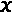
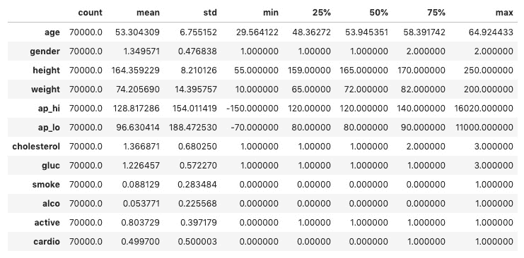
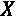
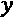
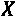
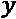
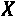
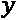
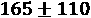
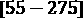

# *第二章*:可解释性的关键概念

这本书涵盖了许多模型解释方法:一些产生度量，其他的可视化，一些两者都有；有些人粗略地描述了你的模型，而有些人则描述得很细。在本章中，我们将学习两种方法，特征重要性和决策区域，以及用于描述这些方法的分类法。我们还将详细说明哪些因素阻碍了机器学习的可解释性，作为未来的初级读本。

以下是我们将在本章中涉及的主要话题:

*   了解解释方法的类型和范围
*   理解是什么阻碍了机器学习的可解释性

# 技术要求

尽管我们以一个“玩具例子”开始本书，我们将在本书中利用真实的数据集来用于具体的解释用例。这些来自许多不同的来源，通常只使用一次。

为了避免这种情况，读者花费大量时间下载、加载和准备单个示例的数据集；有一个名为`mldatasets`的库负责大部分工作。如何安装该库的说明位于*前言*中。除了`mldatasets`，本章的例子还使用了`pandas`、`numpy`、`statsmodel`、`sklearn`和`matplotlib`库。本章代码位于此处:[https://github . com/packt publishing/Interpretable-Machine-Learning-with-Python/tree/master/chapter 02](https://github.com/PacktPublishing/Interpretable-Machine-Learning-with-Python/tree/master/Chapter02)。

# 使命

想象一下，你是国家卫生部的一名分析师，有一种心血管疾病正在流行。部长已将扭转增长趋势和将案件数量降至 20 年来的最低点作为优先事项。为此，成立了一个工作队，在数据中寻找线索，以确定以下事项:

1.  可以解决哪些风险因素。
2.  如果可以预测未来的情况，则根据具体情况解释预测。

你是这个特遣队的一员！

## 关于 CVD 的细节

在我们深入研究数据之前，我们必须收集一些关于 CVD 的重要细节，以便进行以下工作:

*   理解问题的背景和相关性。
*   提取能够为我们的数据分析和模型解释提供信息的领域知识信息。
*   将专家知识背景与数据集的要素相关联。

心血管疾病是一组疾病，其中最常见的是冠心病(也称为缺血性心脏病)。根据世界卫生组织的统计，CVD 是全球死亡的主要原因，每年导致近 1800 万人死亡。冠心病和中风(在很大程度上是 CVD 的副产品)是最重要的原因。据估计，80%的 CVD 是由可改变的危险因素组成的。换句话说，导致 CVD 的一些可预防因素包括:

*   糟糕的饮食
*   吸烟和饮酒习惯
*   肥胖
*   缺乏体育活动
*   睡眠不好

此外，许多风险因素是不可更改的，因此是不可避免的，包括以下因素:

*   遗传倾向性
*   晚年
*   男性(随年龄变化)

我们不会深入到更多关于 CVD 的特定领域的细节，因为它不是理解这个例子所必需的。然而，核心领域知识对模型解释的重要性怎么强调都不为过。因此，如果这个例子是你的工作，许多人的生命取决于你的分析，那么阅读关于这个主题的最新科学研究或者咨询领域专家来告知你的解释是明智的。

# 走近

逻辑回归是在医疗用例中对风险因素进行排序的一种常用方法。与线性回归不同，它并不试图预测每个观测值的连续值，而是预测某个观测值属于某个特定类的概率得分。在这种情况下，我们试图预测的是，给定每个患者的数据，从 0 到 1，他们患有心血管疾病的概率是多少？

# 制剂

你可以在这里找到这个例子的代码:[https://github . com/packt publishing/Interpretable-Machine-Learning-with-Python/blob/master/chapter 02/CVD . ipynb](https://github.com/PacktPublishing/Interpretable-Machine-Learning-with-Python/blob/master/Chapter02/CVD.ipynb)。

## 加载库

若要运行此示例，您需要安装以下库:

*   `mldatasets`加载数据集
*   `pandas`和`numpy`来操纵它
*   `statsmodels`拟合 logistic 回归模型
*   `sklearn` (scikit-learn)拆分数据
*   `matplotlib`将解释形象化

您应该首先加载它们:

```
Import math
import mldatasets
import pandas as pd
import numpy as np
import statsmodels.api as sm
from sklearn.model_selection import train_test_split
import matplotlib.pyplot as plt
```

## 了解和准备数据

本例中使用的数据应该加载到一个数据帧中，我们称之为`cvd_df`:

```
cvd_df = mldatasets.load("cardiovascular-disease")
```

由此，您应该得到 70，000 条记录和 12 列。我们可以一窥`info()`装载了什么:

```
cvd_df.info()
```

前面的命令将输出每个列的名称、类型以及包含的非空记录的数量:

```
<class 'pandas.core.frame.DataFrame'>
RangeIndex: 70000 entries, 0 to 69999
Data columns (total 12 columns):
age            70000 non-null int64
gender         70000 non-null int64
height         70000 non-null int64
weight         70000 non-null float64
ap_hi          70000 non-null int64
ap_lo          70000 non-null int64
cholesterol    70000 non-null int64
gluc           70000 non-null int64
smoke          70000 non-null int64
alco           70000 non-null int64
active         70000 non-null int64
cardio         70000 non-null int64
dtypes: float64(1), int64(11)
memory usage: 6.4 MB
```

### 数据字典

为了理解加载了什么，下面是数据源中描述的数据字典:

*   `age`:患者天数(客观特征)
*   `height`:厘米(客观特征)
*   `weight`:公斤(客观特征)
*   `gender`:二进制，其中 1:女性，2:男性(客观特征)
*   `ap_hi`:收缩压，是心室收缩时喷出血液时所施加的动脉压。正常值:< 120 mmHg(检查特征)
*   `ap_lo`:舒张压，即两次心跳之间的动脉压。正常值:< 80 mmHg(检查特征)
*   `cholesterol`:序数，其中 1:正常，2:高于正常，3:远高于正常(检查特征)
*   `gluc`:序数，其中 1:正常，2:高于正常，3:远高于正常(检查特征)
*   `smoke`:二进制，其中 0:不吸烟，1:吸烟(主观特征)
*   `alco`:二进制，其中 0:不饮酒者，1:饮酒者(主观特征)
*   `active`:二进制，其中 0:无效，1:有效(主观特征)
*   `cardio`:二进制，其中 0:无 CVD，1:有 CVD(目标特征)

### 数据准备

出于可解释性和模型性能的考虑，我们可以处理几个数据准备任务，但是现在最突出的是`age`。年龄不是我们通常用天来衡量的。事实上，对于像这样与健康相关的预测，我们甚至想把它们分成不同的年龄组，因为人们变老的方式不同。现在，我们将把所有年龄转换成年:

```
cvd_df['age'] = cvd_df['age'] / 365.24
```

结果是一个更容易理解的列，因为我们期望年龄值在 0 到 120 之间。我们采用现有的数据并对其进行转换。这是`age`列的一个例子，它不能伤害它，因为我们没有降级数据。这是因为您仍然有表示日期的小数点。

现在，我们将使用`describe()`方法查看我们每个特性的汇总统计数据:

```
cvd_df.describe().transpose()
```

*图 2.1* 显示了前面代码输出的汇总统计数据。在*图 2.1* 中，`age`看起来不错，因为它的范围在 29 到 65 岁之间，这并不算异常，但是对于`ap_hi`和`ap_lo`来说有一些异常的异常值。血压不可能是负的，有记录的最高值是 370。这些记录必须删除，因为它们可能导致模型性能和可解释性较差:



图 2.1–数据集的汇总统计数据

为了更好地衡量，我们应该确保`ap_hi`总是高于`ap_lo`，所以任何有差异的记录都应该被删除:

```
cvd_df = cvd_df[(cvd_df['ap_lo'] <= 370) &\
                       (cvd_df['ap_lo'] > 0)].reset_index(drop=True)
cvd_df = cvd_df[(cvd_df['ap_hi'] <= 370) &\
                       (cvd_df['ap_hi'] > 0)].reset_index(drop=True)
cvd_df = cvd_df[cvd_df['ap_hi'] >=\
                             cvd_df['ap_lo']].reset_index(drop=True)
```

现在，为了拟合逻辑回归模型，我们必须将所有客观、检查和主观特征放在一起作为，并将目标特征单独作为。在此之后，您将和分成训练和测试数据集，但确保包括`random_state`以实现可再现性:

```
y = cvd_df['cardio']
X = cvd_df.drop(['cardio'], axis=1).copy()
X_train, X_test, y_train, y_test =\
              train_test_split(X, y, test_size=0.15, random_state=9)
```

# 了解解释方法的类型和范围

现在我们已经准备好数据并将分割成训练/测试数据集，我们可以使用训练数据拟合模型并打印结果摘要:

```
log_model = sm.Logit(y_train, sm.add_constant(X_train))
log_result = log_model.fit()
print(log_result.summary2())
```

在上打印`summary2`装配好的模型产生以下输出:

```
Optimization terminated successfully.
         Current function value: 0.561557
         Iterations 6
                         Results: Logit
=================================================================
Model:              Logit            Pseudo R-squared: 0.190     
Dependent Variable: cardio           AIC:              65618.3485
Date:               2020-06-10 09:10 BIC:              65726.0502
No. Observations:   58404            Log-Likelihood:   -32797\.   
Df Model:           11               LL-Null:          -40481\.   
Df Residuals:       58392            LLR p-value:      0.0000    
Converged:          1.0000           Scale:            1.0000    
No. Iterations:     6.0000                                       
-----------------------------------------------------------------
               Coef.   Std.Err.    z     P>|z|   [0.025   0.975] 
-----------------------------------------------------------------
const         -11.1730   0.2504 -44.6182 0.0000 -11.6638 -10.6822
age             0.0510   0.0015  34.7971 0.0000   0.0482   0.0539
gender         -0.0227   0.0238  -0.9568 0.3387  -0.0693   0.0238
height         -0.0036   0.0014  -2.6028 0.0092  -0.0063  -0.0009
weight          0.0111   0.0007  14.8567 0.0000   0.0096   0.0125
ap_hi           0.0561   0.0010  56.2824 0.0000   0.0541   0.0580
ap_lo           0.0105   0.0016   6.7670 0.0000   0.0075   0.0136
cholesterol     0.4931   0.0169  29.1612 0.0000   0.4600   0.5262
gluc           -0.1155   0.0192  -6.0138 0.0000  -0.1532  -0.0779
smoke          -0.1306   0.0376  -3.4717 0.0005  -0.2043  -0.0569
alco           -0.2050   0.0457  -4.4907 0.0000  -0.2945  -0.1155
active         -0.2151   0.0237  -9.0574 0.0000  -0.2616  -0.1685
=================================================================
```

前面的总结有助于我们理解哪些特征对使用模型系数的 CVD 诊断贡献最大(表中标为`Coef.`)。很像线性回归的，它们就像应用于每个预测值的权重。然而，线性组合指数是一个逻辑函数。这使得解释更加困难。我们将在第三章 、*解释挑战*中进一步解释这个函数。

你只能通过观察来判断具有绝对最高值的特征是`cholesterol`和`active`，但这并不十分直观。一旦你计算了这些系数的指数，一个更有解释力的看待这些值的方式就会显现出来:

```
np.exp(log_result.params).sort_values(ascending=False)
```

上述代码输出以下内容:

```
cholesterol    1.637374
ap_hi          1.057676
age            1.052357
weight         1.011129
ap_lo          1.010573
height         0.996389
gender         0.977519
gluc           0.890913
smoke          0.877576
alco           0.814627
active         0.806471
const          0.000014
dtype: float64
```

为什么是指数增长？系数是**对数赔率**，是*赔率的对数。*同样，*赔率*是一个正面案例的概率超过一个负面案例的概率，其中**正面案例**是我们试图预测的现象。并不一定说明什么人青睐什么。例如，如果我们试图预测今天下雨的几率，肯定的情况是下雨了，不管你是否预测下雨。赔率通常用比率来表示。新闻可能会说今天下雨的概率是 60%，或者说下雨的概率是 3:2 或 3/2 = 1.5。在对数比值形式中，这将是 0.176，它是 1.5 的对数。它们基本上是一样的东西，只是表达方式不同。指数函数是对数的倒数，因此它可以取任何*对数几率*并返回*几率*。

回到我们的心血管疾病病例。既然有了胜算，我们就可以解读它的含义了。例如，胆固醇的几率意味着什么？这意味着，假设其他特征保持不变，每增加一个单位的胆固醇，心血管疾病的几率增加 1.64 倍。能够用如此有形的术语解释一个特性对模型的影响是一个*内在可解释的*模型(如逻辑回归)的优势之一。

虽然*几率*为我们提供了有用的信息，但是它们并没有告诉我们什么是最重要的，因此，它们本身并不能用来衡量特性的重要性。但这怎么可能呢？如果某样东西有更高的可能性，那么它一定更重要，对吗？嗯，首先，它们都有不同的规模，所以差异很大。这是因为，如果你要衡量某种东西增加多少的可能性，你必须知道它通常增加多少，因为这提供了背景。例如，我们可以说某一特定种类的蝴蝶在第一个卵孵化后多活一天的几率是 0.66。这种说法对你来说毫无意义，除非你知道这个物种的寿命和繁殖周期。

为了给我们的赔率提供上下文，我们可以使用`np.std`函数轻松计算我们特征的标准偏差:

```
np.std(X_train, 0)
```

以下是`np.std`功能输出的序列:

```
age             6.757537
gender          0.476697
height          8.186987
weight         14.335173
ap_hi          16.703572
ap_lo           9.547583
cholesterol     0.678878
gluc            0.571231
smoke           0.283629
alco            0.225483
active          0.397215
dtype: float64
```

从输出中可以看出，二进制和序数特征通常最多只相差一个，但连续特征，如`weight`或`ap_hi`，可能相差 10-20 倍，这可以从特征的标准偏差中看出。

*赔率*不能用来衡量特征重要性的另一个原因是，尽管有有利的赔率，有时特征在统计上并不显著。它们与其他特性纠缠在一起，看起来很重要，但我们可以证明它们并不重要。这可以在该型号的汇总表中的`P>|z|`列下看到。这个值被称为`gender`，至少在这个数据集中是这样。

如果我们试图获得最重要的特征，一种近似的方法是将系数乘以特征的标准偏差。纳入标准偏差说明了特征之间方差的差异。因此，如果我们在做这件事的时候把`gender`也处理掉会更好:

```
coefs = log_result.params.drop(labels=['const','gender'])
stdv = np.std(X_train, 0).drop(labels='gender')abs(coefs * stdv).sort_values(ascending=False)
```

前面的代码产生了以下输出:

```
ap_hi          0.936632
age            0.344855
cholesterol    0.334750
weight         0.158651
ap_lo          0.100419
active         0.085436
gluc           0.065982
alco           0.046230
smoke          0.037040
height         0.029620
dtype: float64
```

前面的表可以解释为根据模型从高到低的风险因素的**近似值。它也是一种**特定模型**特征重要性方法，换句话说，是一种**全局模型(模块化)解释方法**。这里有许多新概念要解释，所以让我们把它们分解开来。**

## 模型可解释性方法类型

有两种模型可解释性方法类型:

*   特定于模型的:当该方法只能用于特定的模型类时，那么它就是特定于模型的。上例中详述的方法只能用于逻辑回归，因为它使用了它的系数。
*   **模型不可知的**:这些是可以用于任何模型类的方法。我们将在第 4 章 、*特性重要性和影响的基础*中讨论这些内容。

## 模型可解释性范围

有几个模型可解释性范围:

*   **全局整体解释**:你可以简单地解释一个模型如何做出预测，因为你可以在完全理解数据的情况下立刻理解整个模型，而且它是一个经过训练的模型。例如，*第一章*、*解释、可解释性、可说明性中的简单线性回归例子；为什么这些都很重要？，*可以用二维图形可视化。您可以在内存中对此进行概念化，但这是唯一可能的，因为模型的简单性允许您这样做，并且这不是很常见也不是预期的。
*   `ap_hi`(收缩压)`age``cholesterol``weight`是对整个影响最大的*部位*。特征重要性只是许多全局模块化解释方法中的一种，但可以说是最重要的一种。 [*第 4 章*](B16383_04_ePub_RK.xhtml#_idTextAnchor081) ，*特性重要性和影响的基础*，详细介绍了特性重要性。
*   **局部单预测解释**:你可以解释为什么要做单预测。下一个例子将说明这个概念。
*   **局部组预测解释**:与单一预测相同，除了适用于组预测。

恭喜你！你已经用**全球模型解释方法**确定了风险因素，但卫生部长还想知道该模型是否能用于解释个案。所以，让我们来研究一下。

## 用逻辑回归解释个体预测

如果您使用该模型来预测整个测试数据集的 CVD 会怎么样？你可以这样做:

```
y_pred = log_result.predict(sm.add_constant(X_test)).to_numpy()
print(y_pred)
```

得到的数组是每个测试用例对 CVD 呈阳性的概率:

```
[0.40629892 0.17003609 0.13405939 ... 0.95575283 0.94095239 0.91455717] 
```

让我们举一个正面案例；测试案例#2872:

```
print(y_pred[2872])
```

我们知道它预测 CVD 为阳性，因为分数超过 0.5:

```
0.5746680418975686
```

以下是测试案例#2872 的详细信息:

```
print(X_test.iloc[2872])
```

以下是输出:

```
age             60.521849
gender           1.000000
height         158.000000
weight          62.000000
ap_hi          130.000000
ap_lo           80.000000
cholesterol      1.000000
gluc             1.000000
smoke            0.000000
alco             0.000000
active           1.000000
Name: 46965, dtype: float64
```

因此，通过前面系列的介绍，我们知道以下内容适用于这个人:

*   临界高`ap_hi`(收缩压)。
*   正常`ap_lo`(舒张压)。收缩压高而舒张压正常就是所谓的*单纯收缩期高血压*。它可能导致阳性预测，但`ap_hi`处于临界状态(130 mmHg 为边界)，因此*单纯性收缩期高血压*的状况处于临界状态。
*   `age`不算太老，但在数据集中属于最老的。
*   `cholesterol`正常。
*   似乎也在健康范围内。

没有也没有其他风险因素:血糖正常，不吸烟，不喝酒，不久坐，因为个人是活跃的。尚不清楚为什么它是阳性的。年龄和临界*单纯收缩期高血压*是否足以扭转局面？如果不把所有的预测放在上下文中，很难理解预测的原因，所以让我们试着去做吧！

但是我们如何同时将所有的事情联系起来呢？我们不可能想象一个预测与其他一万个预测在每一个特征及其各自预测的 CVD 诊断方面的比较。不幸的是，人类无法处理这种程度的维度，即使有可能可视化一个十维的超平面！

但是，我们可以一次对两个特征执行此操作，从而生成一个图形来传达这些特征的模型决策边界。除此之外，我们可以根据所有特征叠加测试数据集的预测。这是为了形象化两个特征和所有 11 个特征的效果之间的差异。

这种图形化的解释方法被称为`cardio` = `0`和`cardio` = `1`，仅涉及我们正在比较的两个特征。

我们已经设法一次将两个基于决策的特征可视化，有一个大的假设，如果所有其他特征保持不变，我们只能孤立地观察两个。这也是众所周知的其他条件不变的假设，并且在科学调查中至关重要，允许我们控制一些变量，以便观察其他变量。一种方法是用不会影响结果的值填充它们。使用我们制作的几率表，我们可以判断某个特征是否会增加心血管疾病的几率。因此，总的来说，较低的数值对心血管疾病的风险较小。

对于实例，`age` = `30`是`age`的数据集中出现的风险最小的值。也可以反方向走，所以`active` = `1`已知比`active` = `0`风险小。我们可以得出其余特性的最佳值:

*   `height` = `165`。
*   `weight` = `57`(最适合那个`height`)。
*   `ap_hi` = `110`。
*   `ap_lo` = `70`。
*   `smoke` = `0`。
*   `cholesterol` = `1`(这是正常的意思)。
*   `gender`可以编码为男性或女性，这并不重要，因为性别的几率(`0.977519`)非常接近 1。

下面的`filler_feature_values`字典举例说明了应该如何处理将索引与最低风险值相匹配的特征:

```
filler_feature_values = {0: 1, 1: 30, 2: 1, 3: 165, 4: 57, 5: 110, 6: 70, 7: 1, 8: 1, 9: 0, 10:0, 11:1 }
```

在字典中，特征被编号而不被命名，因为我们将用于绘制决策区域的函数只接受 NumPy 数组。同样，因为在`statsmodels`中，你必须明确定义`0`特征，它总是等于`1`。

我们还打算为测试数据集绘制实际预测。为此，我们必须定义另一个类似于`filler_feature_values`的字典，但是要有一个范围，例如，`height`的`filler_feature_value`就是`165`。然后，我们可以将该范围设为 120，因此它包括所有高度为的情况，这意味着范围为，它包含测试数据集中所有可能的高度:

```
filler_feature_ranges = {0: 1, 1: 35, 2: 2, 3: 110, 4: 150, 5: 140, 6: 70, 7: 3, 8: 3, 9: 2, 10:2, 11:2 }
```

接下来要做的是用测试用例#2872 创建一个(1，12)形状的 NumPy 数组，以便绘图函数可以突出显示它。为此，我们首先将其转换为 NumPy，然后在前面加上*常量`1`的*，这必须是第一个特征，然后对其进行整形，使其满足(1，12)维:

```
X_highlight = np.reshape(\
       np.concatenate(([1], X_test.iloc[2872].to_numpy())), (1, 12))
print(X_highlight)
```

以下是输出:

```
[[  1\.       60.52184865   1\.         158\.          62\. 
  130\.       80\.           1\.           1\.           0\. 
    0\.        1\.        ]]
```

我们现在可以走了！让我们来看一些决策区域图！我们将比较被认为是最高风险因素、`ap_hi`的特征与以下四个最重要的风险因素:`age`、`cholesterol`、`weight`和`ap_lo`。

以下代码将生成*图 2.2* 中的图:

```
plt.rcParams.update({'font.size': 14})
fig, axarr = plt.subplots(2, 2, figsize=(12,8), sharex=True,\ 
                 sharey=False)
mldatasets.create_decision_plot(X_test, y_test, log_result, [5, 1],\
      ['ap_hi [mmHg]', 'age [years]'], X_highlight,\
      filler_feature_values, filler_feature_ranges,\
      ax=axarr.flat[0])
mldatasets.create_decision_plot(X_test, y_test, log_result, [5, 7], ['ap_hi [mmHg]', 'cholesterol [1-3]'], X_highlight,\ 
      filler_feature_values, filler_feature_ranges,\
      ax=axarr.flat[1])
mldatasets.create_decision_plot(X_test, y_test, log_result, [5, 6], ['ap_hi [mmHg]', 'ap_lo [mmHg]'], X_highlight,\
      filler_feature_values, filler_feature_ranges,\       
      ax=axarr.flat[2])
mldatasets.create_decision_plot(X_test, y_test, log_result, [5, 4], ['ap_hi [mmHg]', 'weight [kg]'], X_highlight,\ 
      filler_feature_values, filler_feature_ranges,\             
      ax=axarr.flat[3])
plt.subplots_adjust(top = 1, bottom=0, hspace=0.2, wspace=0.2)
plt.show()
```

在图 2.2 的图中，圆圈代表测试用例#2872。在所有图条 1 中，该测试案例位于否定(左侧)判定区域，代表`cardio` = `0`分类。在左上角的图表中，临界高`ap_hi`(收缩压)和相对较高的`age`几乎不足以做出积极的预测。然而，在任何情况下，对于测试用例#2872，我们已经预测了 57%的 CVD 得分，所以这可以很好地解释大部分情况。

不足为奇的是，`ap_hi`和健康的`cholesterol`本身不足以使天平倾向于根据该模型做出明确的 CVD 诊断，因为它明显处于否定决定区域，正常的`ap_lo`(舒张压)也是如此。你可以从这三个图表中看出，尽管正方形和三角形的分布有一些重叠，但是随着 *y* 轴的增加，更多的三角形倾向于向正的方向移动，而较少的正方形占据了这个区域:


图 2.2–AP _ hi 和其他主要风险因素的决策区域，测试案例#2872

跨越决策边界的重叠是意料之中的，因为毕竟，这些正方形和三角形是基于`ap_hi`对`weight`的影响，随着`weight`的增加，垂直方向上没有这种模式，这表明这个故事中缺少了一些东西……保持这种想法，因为我们将在下一节中对此进行调查！

恭喜你！你已经完成了部长要求的第二部分。

决定区域的标图，一个`ap_hi`和健康的`cholesterol`现在足以扭转局势了吗？这个问题我们后面会回答，但先来了解一下是什么能让机器学习解释变得这么难。

# 理解什么阻碍了机器学习的可解释性

在上一节中，我们想知道为什么带有`ap_hi`对`weight`的图表没有的结论性模式。尽管`weight`是一个风险因素，但很可能还有其他关键的中介变量*可以解释心血管疾病风险的增加。A `weight`和`height`因为这些变量之间有线性关系。在人类健康的背景下，`weight`远不如没有`height`的*有意义*，所以你需要两者兼顾。*

也许如果我们画出这两个变量的决策区域，我们会得到一些线索。我们可以用下面的代码来绘制它们:

```
fig, ax = plt.subplots(1,1, figsize=(12,8))
mldatasets.create_decision_plot(X_test, y_test, log_result, [3, 4], ['height [cm]', 'weight [kg]'], X_highlight,\ 
     filler_feature_values, filler_feature_ranges, ax=ax)
plt.show()
```

前面的代码片段将生成图 2.3 中的图:


图 2.3–体重和身高的决策区域，测试案例#2872

在*图 2.3* 中没有确定决策边界，因为如果所有其他变量保持不变(处于风险较小的值)，没有`height`和`weight`组合足以预测 CVD。然而，我们可以知道橙色三角形有一个模式，主要位于一个卵圆形区域。这提供了令人兴奋的见解，即使我们预期当`height`增加时`weight`也会增加，固有不健康的`weight`的概念并不是随着`height`线性增加的。

事实上，近两个世纪以来，这种关系在数学上被理解为身体质量指数(身体质量指数):


在我们进一步讨论身体质量指数之前，你必须考虑复杂性。撇开维度不谈，主要有三件事引入了复杂性，使得解释变得困难:

1.  非线性
2.  交互性
3.  非单调性

## 非线性

y = a + bx 等线性方程很好理解。它们是相加的，所以很容易从模型的结果( *y* )中分离和量化其每一项( *a* 和 *bx* )的效应。许多模型类在数学中包含了线性方程。这些方程既可用于将数据拟合到模型，也可用于描述模型。

然而，存在固有非线性的模型类，因为它们在其训练中引入了非线性。*深度学习*模型就是这种情况，因为它们有非线性激活函数，比如 *sigmoid* 。然而，逻辑回归被认为是**广义线性模型(GLM)** ，因为它是可加的。换句话说，结果是加权输入和参数的总和。我们将在第三章 、*可解释性挑战*中进一步讨论 GLMs。

然而，即使您的模型是线性的，变量之间的关系也可能不是线性的，这会导致较差的性能和可解释性。在这些情况下，您可以采用以下方法之一:

*   *使用非线性模型类*，这将更好地适应这些非线性特征关系，可能会提高模型性能。然而，正如我们将在下一章更详细地探讨的那样，这会使它更难解释。
*   *Use domain knowledge to engineer a feature that can help "linearize" it*. For instance, if you had a feature that increased exponentially against another, you can engineer a new variable with the logarithm of that feature. In the case of our CVD prediction, we know BMI is a better way to understand weight in the company of height. Best of all, it's not an *arbitrary* made-up feature, so it's easier to interpret. We can prove this point by making a copy of the dataset, engineering the BMI feature in it, training the model with this extra feature, and performing local model interpretation. The following code snippet does just that:

    ```
    X2 = cvd_df.drop(['cardio'], axis=1).copy()
    X2["bmi"] = X2["weight"] / (X2["height"]/100)**2
    X2_train, X2_test,__,_ = train_test_split(X2, y,\ 
                            test_size=0.15, random_state=9)
    ```

    为了说明这一新功能，让我们使用以下代码绘制身体质量指数与体重和身高的关系图:

    ```
    fig, axs = plt.subplots(1,3, figsize=(15,4))
    axs[0].scatter(X2["weight"], X2["bmi"], color='black', s=2) axs[0].set_xlabel('weight [kg]')
    axs[0].set_ylabel('bmi')
    axs[1].scatter(X2["height"], X2["weight"], color='black', s=2)
    axs[1].set_xlabel('height [cm]')
    axs[1].set_ylabel('weight [kg]')
    axs[2].scatter(X2["bmi"], X2["height"], color='black', s=2) axs[2].set_xlabel('bmi')
    axs[2].set_ylabel('height [cm]')
    plt.subplots_adjust(top = 1, bottom=0, hspace=0.2, wspace=0.3) plt.show()
    ```

    *图 2.4* 是用前面的代码生成的:


图 2.4–体重、身高和 bmi 之间的双变量比较

正如你从*图 2.4* 中的图可以体会到一样，`bmi`和`weight`之间的线性关系比`height`和`weight`之间的线性关系更明确，甚至`bmi`和`height`之间的线性关系也更明确。

让我们使用下面的代码片段为新模型添加额外的功能:

```
log_model2 = sm.Logit(y_train, sm.add_constant(X2_train))
log_result2 = log_model2.fit()
```

现在，当比较`ap_hi`和`bmi`时，让我们看看测试用例#2872 是否在肯定决策区域:

```
filler_feature_values2 = {0: 1, 1: 60, 2: 1, 3: 165, 4: 57, 5: 110, 6: 70, 7: 1, 8: 1, 9: 0, 10:0, 11:1, 12:20           
      }
filler_feature_ranges2 = {0: 1, 1: 35, 2: 2, 3: 120, 4: 150, 5: 140, 6: 70, 7: 3, 8: 3, 9: 2, 10:2, 11:2, 12:250
     }
X2_highlight = np.reshape(\
 np.concatenate(([1],X2_test.iloc[2872].to_numpy())), (1, 13))
fig, ax = plt.subplots(1,1, figsize=(12,8))
mldatasets.create_decision_plot(X2_test, y_test, log_result2, [5, 12], ['ap_hi [mmHg]', 'bmi'],\ X2_highlight, filler_feature_values2,\
                         filler_feature_ranges2, ax=ax)
plt.show()
```

前置码在下面的*图 2.5* 中绘制决策区域:


图 2.5–AP _ hi 和 bmi 的决策区域，测试用例#2872

*图 2.5* 显示`ap_hi`和`bmi`有助于解释 CVD 的阳性预测，因为圆圈位于阳性决策区域。请注意，可能存在一些异常的`bmi`异常值(有记录以来的最高身体质量指数是 204)，因此数据集中可能存在一些不正确的重量或高度。

离群值有什么问题？

离群值可能是**有影响力的**或**高杠杆**，因此在使用这些进行训练时会影响模型。即使他们不这样做，他们也能增加翻译的难度。如果它们是**异常**，那么你应该去除它们，就像我们在本章开始时对血压所做的那样。有时，他们可以隐藏在众目睽睽之下，因为他们只是在其他特征的背景下被视为异常的 T42。在任何情况下，异常值有问题都有实际的原因，例如，使像上一幅图那样的图“缩小”以适应它们，同时不让您了解重要的决策边界。还有更深刻的原因，例如对数据失去信任，从而损害了对基于该数据训练的模型的信任。这种问题在现实世界的数据中是可以预见的。尽管为了方便起见，我们没有在本章中这样做，但通过彻底探索数据、处理缺失值和异常值以及其他数据内务处理任务来开始每个项目是非常重要的。

## 交互性

当我们创建`bmi`时，我们不仅线性化了一个非线性关系，还创建了两个特征之间的交互。因此`bmi`是一个`height`和`width`，以及`ap_hi`和`ap_lo`。因此，将寻找它们的过程自动化并不总是一件坏事。事实上，这甚至是绝对必要的。这是许多深度学习问题的情况，其中数据是非结构化的，因此，训练模型的任务的一部分是寻找潜在的关系以理解它。

然而，对于结构化数据来说，尽管交互对模型性能很重要，但它们会给模型增加潜在的不必要的复杂性，还会发现**没有任何意义的潜在关系**(这被称为**虚假关系或相关性**)，从而损害可解释性。

## 非单调

通常，变量在特征和目标变量之间具有有意义且一致的关系。所以，我们知道随着`age`的增加，CVD ( `cardio`)的风险必然增加。不存在一个临界点，当你到了某个年龄，这种风险就会下降。也许风险会减缓，但不会下降。我们称之为**单调性**，而*单调性*的函数在其整个定义域内要么总是增加，要么总是减少。

请注意**所有的**线性关系都是单调的，但不是所有的单调关系都一定是线性的。这是因为它们不必是一条直线。机器学习中的一个常见问题是，由于我们的领域专业知识，模型不知道我们预期的单调关系。然后，由于数据中的噪声和遗漏，模型以这样一种方式训练，在你意想不到的地方有起伏。

我们来举一个假设的例子。让我们想象一下，由于缺乏 57-60 岁人群的数据，并且因为我们在这个范围内的少数病例对心血管疾病呈阴性，模型可以了解到这是你预期心血管疾病风险下降的地方。有些模型类天生就是单调的，比如 logistic 回归，所以不可能有这个问题，但是很多其他的都有。我们将在 [*第 12 章*](B16383_12_ePub_RK.xhtml#_idTextAnchor261) 、*单调性约束和可解释性模型调整*中对此进行更详细的研究:


图 2.6–目标变量(yhat)与单调和非单调模型预测值之间的部分相关图

*图 2.6* 就是所谓的一个`yhat`应该随着特征`quantity_indexes_for_real_gdp_by_state`的增加而减少。从曲线可以看出，在单调模型中，它持续下降，但在非单调模型中，随着下降，它会出现锯齿状峰值，最后会上升。

# 任务完成

任务的第一部分是了解心血管疾病的风险因素，根据逻辑回归模型，您已经确定前四个风险因素是收缩压(`ap_hi`)、`age`、`cholesterol`和`weight`，其中只有`age`是不可修改的。但是，您也意识到收缩压(`ap_hi`)本身并没有意义，因为它依赖舒张压(`ap_lo`)来解释。对于`weight`和`height`也是如此。我们了解到，特征的相互作用在解释中起着至关重要的作用，它们之间以及它们与目标变量之间的关系也是如此，无论是线性的还是单调的。此外，数据只是事实的一种表现，而事实可能是错误的。毕竟，我们发现*异常*如果不加以检查，会使我们的模型产生偏差。

偏见的另一个来源是数据的收集方式。毕竟，你可能想知道为什么模型的主要特征都是客观的和检查的特征。为什么抽烟喝酒不是更大的因素？为了验证是否存在样本偏差，你必须与其他更可信的数据集进行比较，以检查你的数据集是否没有充分代表饮酒者和吸烟者。或者，这种偏见可能是由询问他们现在是否吸烟，而不是他们是否曾经长期吸烟的问题引起的。

我们可以解决的另一种偏差是*排除偏差*——我们的数据可能缺少解释模型试图描述的事实的信息。例如，我们通过医学研究知道，增加 CVD 风险的单纯性收缩期高血压等血压问题是由糖尿病、甲状腺机能亢进、动脉硬化和肥胖等潜在疾病引起的。我们能从数据中得出的唯一一个条件是肥胖，而不是其他条件。如果我们希望能够很好地解释模型的预测，我们需要拥有所有相关的特征。否则，将会出现我们无法解释的差距。也许一旦我们添加了它们，它们就不会有太大的不同，但这就是我们将在 [*第 10 章*](B16383_10_ePub_RK.xhtml#_idTextAnchor205)*特征选择和可解释性工程*中学习的方法。

任务的第二部分是能够解释单个模型的预测。我们可以通过绘制决策区域来很好地做到这一点。这是一个简单的方法，但是它有很多限制，特别是在有很多特性的情况下，并且它们之间有很多交互。 [*、第 6 章*](B16383_06_ePub_RK.xhtml#_idTextAnchor125) 、*局部模型不可知解释方法*和 [*第 7 章*](B16383_07_ePub_RK.xhtml#_idTextAnchor143) 、*锚和反事实解释*，将涵盖更好的局部解释方法。然而，决策区域图方法有助于说明我们将在这些章节中讨论的决策边界的许多概念。

# 摘要

读完这一章，你应该知道两种模型解释方法:特征重要性和决策边界。您还了解了模型解释方法的类型和范围，以及在机器学习中影响可解释性的三个元素。我们将在随后的章节中不断提到这些基本概念。对于机器学习从业者来说，能够发现它们是至关重要的，这样你就可以知道利用什么工具来克服解释挑战。在下一章，我们将深入探讨这个话题。

# 延伸阅读

*   克里斯托弗·莫尔纳尔。*可解释的机器学习。黑匣子模型制作指南讲解*，2019:[https://christophm.github.io/interpretable-ml-book/](https://christophm.github.io/interpretable-ml-book/)。
*   *m 扩展文档。绘制决策区域。*[http://rasbt . github . io/mlx tend/user _ guide/plotting/plot _ decision _ regions/](http://rasbt.github.io/mlxtend/user_guide/plotting/plot_decision_regions/)。