# *第 5 章*:全局模型不可知解释方法

在上一章 [*第 4 章*](B16383_04_ePub_RK.xhtml#_idTextAnchor081) 、*特征重要性和影响的基础*中，我们展示了排列特征重要性如何更好地替代利用内在模型参数来根据特征对模型结果的影响对特征进行排序。我们还学习了如何使用部分依赖图和个体条件期望图来检查模型结果如何随着特征值和交互作用而变化。然而，尽管所有这些全局模型不可知的方法都非常流行，但它们有一些共同点——它们对共线特征敏感。

本章将继续关注全局模型无关的方法，其中两种方法旨在通过非常强大的统计基础来减轻多重共线性的影响。第一个是 **SHapley 加法解释** ( **SHAP** )，它在很大程度上遵循了源自联盟博弈论的 SHapley 值的数学原理。第二种是使用**累积局部效应** ( **ALE** )图，通过使用条件边际分布，为**部分******图** ( **PDPs** )提供了更好的替代方案。最后，解释黑盒模型的另一种常见方式是通过近似它们的白盒模型，因此我们将讨论**全局代理**的广泛主题，如果选择正确，它可以是非常准确和有效的解释工具。**

 **这些是我们将在本章中涉及的主要话题:

*   了解沙普利价值观
*   解读 SHAP 摘要和依赖图
*   探索 **ALE** 地块
*   用全局代理解释黑盒模型

# 技术要求

本章的示例使用了`mldatasets`、`pandas`、`numpy`、`sklearn`、`tensorflow`、`xgboost`、`rulefit`、`matplotlib`、`seaborn`、`scipy`、`shap`和`alepython`库。关于如何安装所有这些库的说明在前言中。本章代码位于此处:[https://github . com/packt publishing/Interpretable-Machine-Learning-with-Python/tree/master/chapter 05](https://github.com/PacktPublishing/Interpretable-Machine-Learning-with-Python/tree/master/Chapter05)。

# 使命

对于希望减少支出或污染的消费者来说，能效是一个重要问题。因此，它属于决策者、监管者、环境活动家、公共卫生官员和耗能技术制造商的权限范围。仅在美国，交通领域就占了 2019 年能源消耗总量的 28%(https://www . EIA . gov/energy explained/use-of-energy/transportation . PHP)，其中超过一半是轻型乘用车消耗的。尽管在过去的十年中，美国的电动汽车数量有所增加，但他们的大部分电力仍然来自化石燃料发电厂。最终，这意味着所有客运车辆都有碳足迹，无论其燃料类型如何。

在这个练习中，让我们假设你工作的美国消费者权益非盈利组织传统上关注汽车安全，而欺诈性销售行为正在将他们的注意力转移到能效上。过去几十年颁布的安全法通过改善质量控制和法规，极大地降低了制造商的责任。虽然安全仍然是一个问题，但这主要是由于鲁莽驾驶和恶劣的大气条件。机械故障是所有车祸中仅有 2-3%的原因。只有在极个别的情况下，这才是由车辆或零件制造商造成的，如制动器、悬架、变速器或轮胎。这家非营利组织夸口说，它在遏制汽车经销商的欺诈和歧视行为方面也非常成功。意识到年轻一代都有环保和资源意识，他们希望通过倡导燃料效率来保持相关性，这可以用每加仑**英里** ( **MPG** )来衡量。这个数字越高，效率越高。幸运的是，美国能源部(【https://www.fueleconomy.gov/feg/ws/】T21)从 1984 年开始记录这个国家所有车辆的数字。非营利组织希望在他们的小册子中解释过去几十年来所有不同的变量是如何影响 MPG 的。作为他们的常驻数据科学家，他们希望您找到最重要的燃油效率预测指标，并尽可能以人类可理解的方式加以说明。

# 走近

您已经获得了包含数千种车型的数据集。它包括一般，发动机，污染，传动系统，底盘，和每个模型的技术细节。为了找到 MPG 的预测因素，您可以利用经过试验和验证的统计方法，如假设检验、相关性分析和本质上可解释的模型，如 GLMs，以获得可靠的数据理解。然而，你必须确保在个案的基础上使用正确的统计方法，并检查你的数据是否符合它们的基本假设。即使在所有这些之后，你的内在模型将缺乏足够的预测准确性来支持任何发现。许多从业者信任这种经典的方法。然而，这本书倾向于认为黑盒模型可以从数据中提取更多的知识，并且比经典方法更可靠和有效。可解释的机器学习提供了这样做的工具集。

为此，我们来走一条应用统计学课上不教的七点捷径！

1.  准备好所有的特征，使它们没有空值，并且都是数字。
2.  确保有了这些特性，你就可以用黑盒模型很好的预测 MPG。对于这个例子，我们将使用神经网络和 XGBoost。
3.  对测试数据集进行评估，以确保它不会过度拟合。
4.  用 SHAP 来理解他们是如何得出结论的。
5.  进行一些统计测试，以进一步检查双变量关联，并排除任何虚假的相关性和系统性偏差。
6.  使用 ALE 图探索模型的特征效果。
7.  通过全局代理进一步了解模型的基本规则。

我们开始吧！

# 制剂

你可以在这里找到这个例子的代码:[https://github . com/packt publishing/Interpretable-Machine-Learning-with-Python/blob/master/chapter 05/fueleffeiciency . ipynb](https://github.com/PacktPublishing/Interpretable-Machine-Learning-with-Python/blob/master/Chapter05/FuelEfficiency.ipynb)。

## 加载库

为了遵循这个例子，你需要安装下面的库:

*   `mldatasets`加载数据集
*   `pandas`和`numpy`来操纵它
*   `sklearn` (scikit-learn)、`tensorflow`、`xgboost`和`rulefit`分割数据并拟合模型
*   `scipy`执行统计测试
*   `matplotlib`、`seaborn`、`shap`和`alepython`可视化解释

您应该首先加载它们:

```
import math
import os
import mldatasets
import pandas as pd
import numpy as np
from sklearn.model_selection import train_test_split
from sklearn import metrics, tree
import as tf
import tensorflow_docs as tfdocs
import tensorflow_docs.plots
import xgboost as xgb
from rulefit import RuleFit
from scipy import stats
import matplotlib.pyplot as plt
import seaborn as sns
import shap
from alepython import ale_plot
```

让我们用`print(tf.__version__)`命令检查 TensorFlow 是否加载了正确的版本。应该是 2.0 以上。

## 了解和准备数据

现在，我们将数据加载到我们称之为`fueleconomy_df`的数据帧中。请注意，我们使用的是`prepare=True`，它会自动为您准备功能，因此您不必:

```
fueleconomy_df = mldatasets.load("vehicle-fueleconomy",prepare=True)
```

应该有超过 43，000 条记录和 84 列。我们可以验证`info()`的情况是否如此:

```
fueleconomy_df.info()
```

输出应该是正确的。所有的特性都是数字的，没有缺失值，分类特性已经被一次性编码了，因为我们使用了`prepare=True`。

### 数据字典

只有25 个特征，但由于分类编码，它们变成了 84 列，其中 3 列是一般特征，6 列是发动机特征，3 列是污染特征，3 列是传动系统特征，7 列是底盘特征，2 列是电子特征，还有一列是数据集中的目标特征。我们可以勾勒出按这些类别细分的数据字典。

以下是来自**常规**类别的功能列表:

*   `make`:分类——车辆的品牌或制造商(来自几乎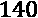不同的品牌或制造商)
*   `model`:分类——车辆的型号(超过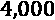种不同的型号)
*   `year`:模型的第几年(从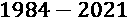开始)

以下特征是**发动机**的特征:

*   `fuelType`:分类——发动机使用的主要燃料类型。
*   `cylinders`:序数——发动机的缸数(从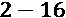开始)。一般气缸越多，马力越大。
*   `displ`:连续——发动机排量(从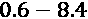以升为单位)。
*   `eng_dscr`:文本——由一个或多个连接在一起的代码组成的引擎描述(此处代码:[https://www.fueleconomy.gov/feg/findacarhelp.shtml#engine](https://www.fueleconomy.gov/feg/findacarhelp.shtml#engine))。
*   `phevBlended`:二进制—`Blended`表示车辆将由电池供电，仅由燃油补充。如果是真的，它使用这种操作模式，称为电量耗尽模式。
*   `atvType`:分类——发动机中使用的替代燃料类型或技术(在不同类型中)。

以下是数据集中的**污染**要素:

*   `co2TailpipeGpm`:连续-排气管二氧化碳，单位为克/英里。
*   `co2`:连续型——排气管二氧化碳，单位为克/英里。对于 2013 年以后的车型，则基于 EPA 测试。前几年，CO2 是使用 EPA 排放系数估算的(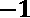=不可用)。
*   `ghgScore`:序数——美国环保署 GHG 评分(从，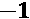=不可用)。

我们有以下**传动系统**特点:

*   `drive`:分类——车辆的驱动桥类型(来自不同的类型)
*   `trany`:分类——传输描述符，主要形式为“{type}、{speed}-spd”，其中类型只能是`Manual`或`Automatic`
*   `trans_dscr`:文本-由一个或多个连接在一起的代码组成的传输的更详细描述(此处代码:[https://www.fueleconomy.gov/feg/findacarhelp.shtml#trany](https://www.fueleconomy.gov/feg/findacarhelp.shtml#trany))

这里列出了**机箱**的特点:

*   `VClass`:分类——车辆的类型(与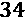不同)
*   `pv4`:连续-4 门乘客量(立方英尺)
*   `lv4`:连续-4 门行李体积(立方英尺)
*   `lv2`:连续-双门行李体积(立方英尺)
*   `pv2`:连续-双门乘客量(立方英尺)
*   `hlv`:连续-两厢乘客量(立方英尺)
*   `hpv`:连续式——两厢行李体积(立方英尺)

以下是**电子**的特点:

*   `startStop`:分类-车辆中包含的起停技术(`Y`:=是，`N`=否，空白=旧款车辆)
*   `tCharger`:分类–车辆是涡轮增压的(`T`=是，空白=否则)

以下是**目标**的特征:

*   `comb08`:连续-组合 MPG。对于电动和 CNG 汽车，这个数字是 **MPGe** ( **汽油当量英里每加仑**)。

现在我们已经看了一眼数据，可以简单的准备一下建模的数据，然后拟合一些模型！

### 数据准备

从`info()`摘要中可以看出，已经没有空值了；我们有许多分类编码的列，除了`make`和`model`之外，所有的列都是数字或布尔值，我们将删除它们。数据集差不多准备好了。我们现在需要做的就是将数据集分成训练、测试和验证数据集。为了实现这一点，我们首先将我们的目标特性单独放在`y`中，除了`make`和`model`之外的所有特性放在`X`中，然后将`X`和`y`分成训练(85%)和测试(15%)，然后将`X_train`和`Y_train`分成训练(80%)和验证(20%)。像往常一样，为我们的`random_state`定义一个我们称之为`rand`的种子以确保可重复性是很重要的:

```
rand = 9
y = fueleconomy_df['comb08']
X = fueleconomy_df.drop(['comb08','make','model'], axis=1).copy()
X_train, X_test, y_train, y_test =\
           train_test_split(X, y, test_size=0.15, random_state=rand)
X_train, X_val, y_train, y_val =\
           train_test_split(X_train, y_train,        test_size=0.2, random_state=rand)
```

好吧！我们现在可以开始建模和评估步骤了！

### 深度神经网络的建模与性能评估

模型结果的不一致性因解释困难而加剧，这也是再现性至关重要的原因。然而，众所周知，神经网络的可再现性很难保证，考虑到它们的随机性质，将种子设置为具有某种程度上一致的结果甚至更为关键。以下代码适用于 TensorFlow 2.0+:

```
os.environ['PYTHONHASHSEED']=str(rand)
tf.random.set_seed(rand)
np.random.seed(rand)
```

我们将创建一个前馈(`Sequential`)神经网络，它有两个隐藏层，每个层有 64 个隐藏节点。在 Keras 中，这可以通过添加`Input`、隐藏(`Dense(64)`)和输出(`Dense(1)`)层来实现。在`Input`和第一个隐藏层之间，我们还添加了一个`Normalization`层。该层将所有特征归一化，使其平均值为，标准差为。该步骤通常在单独的预处理阶段完成，但是让模型管道或模型本身处理该步骤有很多好处，包括更干净的代码和更高的可靠性。在我们构建了模型(`fitted_nn_model`)之后，我们可以使用`metrics=['mse']`进行编译。我们将使用学习率非常低的 Adam 优化器(`lr = 0.0005`)。这将使训练更慢，但它已经收敛于具有该超参数值的较低 MSE。您可以使用`summary()`打印所有带形状的层，以及每个层的参数:

```
fitted_nn_model = tf.keras.Sequential([
    tf.keras.Input(shape=[len(X_train.keys())]),
    tf.keras.layers.experimental.preprocessing.Normalization(),
    tf.keras.layers.Dense(64, activation='relu'),
    tf.keras.layers.Dense(64, activation='relu'),
    tf.keras.layers.Dense(1)
  ])
fitted_nn_model.compile(loss='mean_squared_error',\
                optimizer=tf.keras.optimizers.Adam(lr = 0.0005), metrics=['mse'])
fitted_nn_model.summary() 
```

网络应该在第 700 个纪元和第 1300 个纪元之间的某个地方汇合。我们可以将它设置为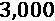,并在`fit`函数中将提前停止作为回调来实现，而不是针对固定数量的纪元。该`EarlyStopping`回调将监控验证损失，并查看它是否在最后的时期(`patience`)中没有得到改善，其极低的最小值符合改善的条件(`min_delta=0.0001`)。我们还确保恢复具有最佳验证损失的时期的权重(`restore_best_weights=True`)。当我们拟合模型时，我们可以存储训练历史(`nn_history`):

```
Model: "sequential"
_________________________________________________________________
Layer (type)                 Output Shape              Param #   
=================================================================
normalization (Normalization (None, 81)                163       
_________________________________________________________________
dense (Dense)                (None, 64)                5248      
_________________________________________________________________
dense_1 (Dense)              (None, 64)                4160      
_________________________________________________________________
dense_2 (Dense)              (None, 1)                 65        
=================================================================
Total params: 9,636
Trainable params: 9,473
Non-trainable params: 163
_________________________________________________________________
```

网络应该在第 700 和 1300 纪元之间的某个地方汇合。我们可以将其设置为 3，000，并在`fit`函数中实现提前停止作为回调，而不是针对固定数量的纪元。这个`EarlyStopping`回调将监控验证损失，并且查看它是否在最后 200 个时期(`patience`)中没有改善，具有极低的最小值以符合改善的资格(`min_delta=0.0001`)。我们还确保恢复具有最佳验证损失的历元的权重(`restore_best_weights=True`)。当我们拟合模型时，我们可以存储训练历史(`nn_history`):

```
es = \
tf.keras.callbacks.EarlyStopping(monitor='val_loss',mode='min',   
                                      verbose=1, patience=200,\
                                      min_delta=0.0001,\
                                      restore_best_weights=\
                                      True)
nn_history = fitted_nn_model.fit(\
                      X_train.astype(float), y_train.                      astype(float),\
                      epochs=3000, batch_size=128,\
                      validation_data=(X_val.astype(float),\
                      y_val.astype(float)), verbose=1,\
                      callbacks=[es]) 
```

`tensorflow_docs`库带有一个专门为训练历史(`HistoryPlotter`)设计的绘图仪，这很棒，因为你可以用一两行代码绘制历史:

```
nn_plotter = tfdocs.plots.HistoryPlotter(smoothing_std=2)
nn_plotter.plot({'Early Stopping': nn_history}, metric
"mse")
plt.show()
```

前码产生*图 5.1* 。它描述了在 750 个周期后，验证 MSE 如何在其最小值 0.75 附近徘徊，因此触发了提前停止:


图 5.1–训练和验证 MSE 的神经网络训练历史

现在让我们来评估预测性能。您总是可以使用`Model.evaluate`函数来查看拟合的模型预测测试数据集的效果，但它将使用损失函数和度量，两个`Model.predict`函数来获得对训练和测试数据集的预测，然后通过使用 scikit-learn 的`mean_squared_error`和`squared=False`，您可以获得两者的 RMSE。我们还将使用 R-squared，这是一种拟合优度度量，它告诉您模型解释了多大比例的可变性:

```
y_train_nn_pred =\
fitted_nn_model.predict(X_train.astype(float))
y_test_nn_pred =\
fitted_nn_model.predict(X_test.astype(float))
RMSE_nn_train = metrics.mean_squared_error(y_train,\
                                     y_train_nn_pred, \
                                     squared=False)
RMSE_nn_test = metrics.mean_squared_error(y_test,\
                                     y_test_nn_pred,\
squared=False)
R2_nn_test = metrics.r2_score(y_test, y_test_nn_pred)
print('RMSE_train: %.4f_test: %.4f: %.4f' %
                   (RMSE_nn_train, RMSE_nn_test,
                    R2_nn_test))
```

训练和测试的 RMSE 分数足够接近，这表明最小的过度拟合，并且任何低于 1 的 RMSE 都是优秀的，因为这意味着平均而言，预测的组合 MPG 不超过观察的组合 MPG 的。此外，99%的 R 平方意味着该模型解释了绝大多数的可变性:

```
RMSE_train: 0.7012  RMSE_test: 0.7878   r2: 0.9907
```

我们也可以通过用回归线绘制观察到的与预测的`y`(综合 MPG)来直观地了解模型的拟合程度。为此我们可以使用`seaborn`的`regplot`函数，它可以在一行中传递这个情节。我们将定制散点图，使每个数据点显示为 30%透明(`'alpha':0.3`)和绿色(`color="g"`)、轴标签和字体大小:

```
plt.ylabel('Predicted Combined MPG', fontsize=14)
sns.regplot(x=y_test, y=y_test_nn_pred, color="g",\
       scatter_kws={'alpha':0.3})
plt.xlabel('Observed Combined MPG (comb08)', fontsize=14)
```

前面的代码输出*图 5.2* :


图 5.2–神经网络模型的观察值与预测值的组合 MPG 图，带回归线

*图 5.2* 中的曲线传达了模型预测实际综合 MPG 的情况。这些点最接近左下象限中的回归线，这表明该值越低，模型对其的预测就越好，考虑到左下象限中的点比右上象限中的点多多少，这并不奇怪。我们可以继续训练 XGBoost 模型！

### XGBoost 的建模与性能评估

XGBoost 是一个库，实现了梯度增强决策树，很像 scikit-learn 的`GradientBoostingRegressor`，这是一种我们在前面章节中使用过的集成方法。然而，虽然 scikit-learn 遵循原始的梯度增强算法，但 XGBoost 实现了几项优化，使其更快、更具可扩展性，提高了预测性能，并可能使其更不容易过度拟合。

XGBoost 的正式实现要求将数据存储在 DMatrix 对象中，以进一步提高效率，如下所示:

```
dtrain = xgb.DMatrix(X_train, label=y_train)
dval = xgb.DMatrix(X_val, label=y_val)
dtest = xgb.DMatrix(X_test, label=y_test)
```

在本练习中，我们将使用 XGBoost 的 scikit-learn 包装器，它自动将数据转换为 DMatrix 对象。原因是许多模型不可知的解释方法希望您使用遵循 scikit-learn 推广的模板的函数，例如`fit(X, y)`和`predict(X)`，其中`X`和`y`是数组或稀疏矩阵，通常是 NumPy 数组或 pandas DataFrames。然而，XGBoost 不符合这种期望，因为 DMatrix 是一种完全不同的数据类型。尽管如此，解释方法在技术上仍然是模型不可知的，因为它们不依赖于模型的内在参数。然而，在实践中，您必须编写一个充当中介的类，就像 scikit-learn 包装器在这种情况下所做的那样。惟一的缺点是 XGBoost 库有许多包装器中没有的参数。幸运的是，在这种情况下，我们不需要使用很多。我们只需要将最大树深度设置为 ( `max_depth`)，学习率设置为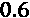 ( `learning_rate`)，我们的目标是回归最小化平方误差(`reg:squarederror`)，然后并行运行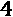作业(`n_jobs`)。使用训练数据集和验证数据集评估 RMSE 时，很容易拟合模型:

```
fitted_xgb_model = xgb.XGBRegressor(max_depth=7,\
learning_rate=0.6,\
                   n_jobs=4, objective='reg:squarederror',
                   random_state=rand, n_estimators=50).\
             fit(X_train, y_train, eval_metric='rmse',\
              eval_set=[(X_train, y_train),(X_val, y_val)])
```

一旦模型被拟合，我们可以用`matplotlib`绘制训练历史。可以使用`evals_result()`函数从拟合的 XGBoost 模型中检索该历史，函数返回一个字典。因为我们在`eval_set`中放置了两个验证数据集，所以这个字典有两个名为`validation_0`和`validation_1`的条目。第一个对应于培训评估，第二个对应于验证:

```
plt.plot(fitted_xgb_model.evals_result()['validation_0']['rmse'])
plt.plot(fitted_xgb_model.evals_result()['validation_1']['rmse'])
plt.ylabel('RMSE [Combined MPG]', fontsize=14)
plt.xlabel('Round', fontsize=14)
plt.legend(['Train', 'Val'], loc='upper right')
```

从图 5.3 的*中可以看出，模型在接近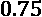验证 RMSE 时快速收敛。虽然训练和验证 RMSE 之间的差距可以通过调整超参数来缩小，但它仍然表明相对较小的过度拟合。对于我们不打算生产的模型来说，这不是主要问题，对于看不见的数据，误差仍然很低:*


图 5.3–培训和验证 RMSE 的 XGBoost 培训历史

让我们对照测试数据集进行评估，看看这是否像我们对神经网络所做的那样成立:

```
y_train_xgb_pred = fitted_xgb_model.predict(X_train)
y_test_xgb_pred = fitted_xgb_model.predict(X_test)
RMSE_xgb_train = metrics.mean_squared_error(y_train,\
                                    y_train_xgb_pred,                                    squared=False)
RMSE_xgb_test = metrics.mean_squared_error(y_test,\
                  y_test_xgb_pred, squared=False)
R2_xgb_test = metrics.r2_score(y_test, y_test_xgb_pred)
print('RMSE_train: %.4f_test: %.4f: %.4f' %\
               (RMSE_xgb_train, RMSE_xgb_test,\
                R2_xgb_test))
```

与神经网络相比，测试和训练 RMSE 现在甚至更低，R 平方甚至更高，而神经网络已经很好了。该模型的预测性能也足以用于全球模块化解释目的:

```
RMSE_train: 0.2974  RMSE_test: 0.6809   r2: 0.9930
```

关于解释，像大多数基于树的模型一样，XGBoost 带有特性重要性功能。XGBoost 有三种不同的算法来计算特征重要性:特征在树中出现的频率(`weight`)、由于特征导致的误差的平均减少量(`gain`)以及受涉及特征的分割影响的观察值的数量(`cover`)。默认为`importance_type="weight"`。使用下面的`plot_importance`代码，你可以尝试这三种方法，看看它们有多少不同:

```
sns.set()
fig, ax = plt.subplots(figsize=(12, 8))
xgb.plot_importance(fitted_xgb_model, max_num_features=12,\
ax=ax, importance_type="weight")
plt.show()
```

前面的代码生成了*图 5.4* ，它描述了计算 XGBoost 特性重要性的多种方法之一，但是您应该相信哪一种呢？如果您考虑所有这些方式的主要特性，您会发现一些共同的特性，并且这些特性很可能代表了真正在模型中产生最大差异的特性:


图 5.4-XGBoost 库使用权重计算的特征重要性

然而，我们仍然希望量化产生了多大的差异以及在什么情况下产生了差异，并且理想情况下使用基于统计和模型不可知的可靠方法…符合 Shapley 值！

# 了解沙普利价值观

这本书中的几个章节将特别重温一种方法: **SHAP** 。所以，现在我们最好对数学基础及其背后的性质有一个总体的了解。我们将通过一个篮球类比来做到这一点。

想象一下，你在一场篮球比赛中被蒙上眼睛，每当你的球队的一名球员进入或离开球场或球队得分时，扬声器都会宣布。扩音器不会告诉你谁进球了，你被蒙住了眼睛，所以你不知道谁进球了，甚至不知道谁助攻了！他们只是用数字来指代玩家，反正你也不知道他们是谁。他们可能是好球员，也可能是坏球员。在任何给定的时间，你最好的猜测是最后加入的人与最新的结果有关，无论是好是坏。因此，随着时间的推移，你开始意识到哪些球员与更好的结果最相关，哪些球员有相反的效果或根本没有。

如果我们能够模拟这个游戏，让每一种可能的玩家组合以不同的顺序到达很多次，并平均每个玩家加入时的所有分数差异，会怎么样？然后，即使对一场比赛来说不精确，对许多比赛来说，我们会更好地了解谁是最有价值的球员。在高层次上，在**联盟博弈论**中，也被称为**合作博弈论**，玩家的不同组合是**联盟**，分数的差异是**边际贡献**， **Shapley 值**是这些贡献在多次模拟中的平均值。对于一个模型来说，特征是参与者，不同的特征子集是参与者的联盟，预测误差的差异是边际贡献，你被蒙住眼睛是因为，当然，模型是一个黑盒，或者至少是这样对待的！

计算一个模型的 Shapley 值所涉及的数学比篮球类比可能暗示的更复杂，因为它涉及集合和阶乘，我们不会进入那些将 Shapley 值应用于机器学习的论文中描述的所有算法细节。不过可以简单直观的解释一下。您有一个包含所有功能的完整联盟，并且您有所有可能的功能子集，但不包括您正在评估的功能。一个特征的贡献，也称为收益，是预测误差的减少、回归或分类概率的增加。因此，要计算某个要素和特定子集的 Shapley 值，需要在将该要素添加到该子集时计算贡献。所有这些都通过在所有可能的子集上随机抽取特征子集的概率来加权。这些加权贡献在所有可能的子集上相加，瞧！你有你的沙普利值。本质上，它是一个特性对所有可能子集的平均边际贡献。

然而，在实践中，Shapley 值的计算时间必然会随着要素的增加而呈指数增长，因此强力方法会非常耗费资源。有几种策略可以最小化计算。最常见的一种方法是使用一种叫做**蒙特卡罗抽样**的方法，从一个概率分布中随机抽样，只对一些可能的特征子集进行抽样。此外，您可以将玩家从游戏中移除，但不能将某个功能从已训练的模型中移除，那么您如何表示模型在有功能和没有功能的情况下的表现呢？置换重要性通过改变特征来实现这一点，但是 Shapley 的算法计算的是整个数据集中特征的期望值。这是有意义的，因为这将是特性值的*最佳猜测*，这是一个合理的假设。它可能并不完美，但它只是作为比较特性贡献的基线。一致性是关键。

说到一致性，Shapley 值有几个源自联盟博弈论的属性，使其成为理想的特征重要性方法:

*   **虚拟**:如果一个特征从不贡献任何边际值，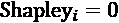。
*   **可替代性**:如果两个给定特征和对其所有可能子集的贡献，则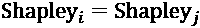。
*   **可加性**:如果一个模型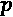是一个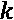子模型的集合，那么子模型中一个特征的贡献应该是可加的；。
*   **效率**:同样，所有 Shapley 值必须相加，作为预测值和期望值之间的差值。

在撰写本文时，还没有 Python 的“纯”Shapley 值实现。甚至 R 实现也使用采样来减少计算时间。然而，Python 最受欢迎的实现，SHAP，通过利用一些模型类的内在参数，即基于树和深度学习的模型，以及模型不可知方法的线性代理模型，走了更多的捷径。

# 解读 SHAP 摘要和依赖情节

**SHapley 加法解释** ( **SHAP** )是方法或解释器的集合，这些方法或解释器近似 Shapley 值，同时在很大程度上保持其数学特性。论文称这些价值观为 SHAP 价值观，但 SHAP 在本书中将与沙普利互换使用。然而，必须指出的是，SHAP 的作者们对这些属性做了一些改动。例如，一些解释器不遵守虚拟属性，并利用参考背景数据来模拟丢失的值。尽管存在这些问题，但由于 SHAP 以其他固体属性为基础，它仍然优于第 4 章 、*功能重要性和影响基础*中研究的替代方案。

它有三个大致基于 Shapley 的属性:

*   **局部精度**:相当于 Shapley 的效率性质。
*   一致性(Consistency):包含可加性和可替代性公理，并且在理论上也是哑的。
*   **缺失**:这意味着如果一个特征缺失，其 Shapley 值为零。这是一个健全检查属性，实际上，只有当特性不变时才需要它。

许多解释者结合其他解释方法来有效地执行近似。由于这个原因，四个解释者不是模型不可知的(见图 5.5)，因为方法统一调用利用模型的结构或参数。这些算法的细节在 SHAP 的主要论文“*解释模型预测的统一方法*”中讨论，以及在为基于树的模型编写的论文 TreeSHAP 中讨论，该论文后来被重命名为 TreeExplainer。除此之外，还有两种方法专门用于深度学习框架 TensorFlow/Keras 和 PyTorch，它们分别基于 **DeepLift** 和 **Expected Gradients** 方法。并且有一个只适用于 scikit-learn 的线性模型。除了那些特定于模型的解释器之外，KernelExplainer、SamplingExplainer 和其他各种解释器都是模型不可知的，但有一些注意事项:


图 5.5-SHAP 解释者总结

我们现在将简要介绍*图 5.5* 中的每个核心 SHAP 解释器:

*   **TreeExplainer** 是专门为有效地近似基于树的模型的 SHAP 值而设计的，比如像 XGBoost 或 Random Forest 或 CART 决策树这样的树集合。因为它使用条件期望值函数而不是边际期望，所以它可以将不同于零的值赋给无影响的特征，从而违反了 Shapley 哑属性。如 [*第 4 章*](B16383_04_ePub_RK.xhtml#_idTextAnchor081) 、*特征重要性和影响的基本原理*中所述，当特征共线时，会产生分歧。
*   **深度解释器**只对深度学习模型起作用，方法统一为**深度提升**。这种方法有一个简单的前提，即当提供一个参考“中性”输入或基线时，特征的重要性可以归因于输出的差异。这个基线输入可以是任何东西，但是它表示缺少一个特性。SHAP 图书馆选择的一条安全路线是使用数据集的要素均值。然后，一旦在反向传播期间扣除了基线( / )，它就将每层的乘数定义为输入/输出。链式法则适用于乘数，就像它适用于梯度一样。特定实例的特征重要性是输入和基线之间的差值乘以乘数反向传播期间产生的部分“斜率”。然后，SHAP 采用这些输出，并使其符合 SHAP 的特性。
*   **GradientExplainer** 在的一把伞下有几个统一的方法，但主要的是**期望梯度**，它是**综合梯度**和**平滑梯度**的分支。我们不会在这里详细解释这些，因为我们将在第 8 章 *【可视化卷积神经网络*中进行解释。我们将会了解到，像 **DeepLIFT** 一样，积分梯度使用一个基线来表示特征的缺失，它从输出和输入之间的基线开始积分。SHAP 图书馆使用了一个类似的概念，叫做期望梯度，它将积分重新表述为一个期望。然后，它使用背景数据集作为该期望的采样参考值，从而产生梯度的组合期望，该组合期望作为叠加的属性而收敛，就像 SHAP 值应该做的那样。
*   **LinearExplainer** 是一个非常基础的解释器，灵感来自于关于监督学习模型的第一篇论文。它仅限于 scikit-learn 线性模型。
*   **KernelExplainer** 是最流行的模型不可知方法，它基于 **LIME** ，我们将在 [*第 6 章*](B16383_06_ePub_RK.xhtml#_idTextAnchor125) *、局部模型不可知解释方法*中进一步讨论。它遵循与 LIME 相同的步骤，例如拟合加权线性模型，但它使用 Shapley 样本联盟并使用不同的内核，该内核返回 SHAP 值作为系数。此外，由于在建立样本联盟时，它会用随机数据替换缺失的要素，因此存在哑属性问题，从而导致要素共线。我们还将在第 6 章 *、局部模型不可知解释方法*中进一步讨论这一点。
*   **SamplingExpainer** 完全基于第一篇论文，该论文介绍了一种近似 Shapley 值的采样方法，并且也是模型不可知的，但它假设特征独立。例如，当您有大量背景数据集时，这是 KernelExplainer 的一个相当好的替代方法，稀疏数据就需要这种数据集。
*   **PermutationExplainer** 是你能得到的最接近蛮力 Shapley 值的近似值。它通过在向前和向后两个方向上置换所有特征来操作。如果只运行一次，它可以捕获高达二阶相互作用的 SHAP 值，但可以运行更多次以实现更高的保真度。
*   **PartitionExplainer** 在定义特征层次的树上计算 SHAP 值。当您的许多要素属于一个组或类别或者具有高度相关的要素时，建议使用此选项。
*   **addition explainer**将接受任何任意的预测函数，因此它是模型不可知的，但是如果模型不是**广义加法模型** ( **GAM** )，它将失败。

在本章中，我们将对 Keras 模型使用 GradientExplainer，对 XGBoost 模型使用 TreeExplainer。但是这些不是模型不可知的解释者。为什么我们要在名为*全局模型不可知解释方法*的章节中使用它们？因为 SHAP 作为一个整体是模型不可知的，因为所有的解释者可以共同涵盖任何模型类和用例，无论是表格、图像或文本数据集。更重要的是，它们可以或多或少地以相同的方式初始化，并具有一组可用于解释的一致的图。我们将在本章中学习如何解读其中的三个情节。在随后的章节中，我们将使用 KernelExplainer 和 DeepExplainer 并扩展到其他 SHAP 情节。

在我们开始解释之前，我们必须首先执行两个简单的步骤——在某些情况下，这可能会很棘手，因此我们将逐步完成它们:

1.  `TreeExplainer`只需要拟合的基于树的模型(`fitted_xgb_model` ):

    ```
    shap_xgb_explainer = shap.shap.kmeans(data, K). We will do a sample of 150 using np.choice. Now, print(background.shape) should confirm that we have selected 150 samples of the test dataset and, naturally, it has 81 features. Then, to initialize the explainer, we plug in our model (fitted_nn_model) and the background data. Please note that we are converting the pandas DataFrame to a NumPy array of floats to have it work with TensorFlow:

    ```
    background = \ X_train.iloc[np.random.choice(X_train.shape[0], 150,\                           replace=False)] print(background.shape) shap_nn_explainer = shap.GradientExplainer(fitted_nn_model,\                               background.astype(float).values)
    ```

     一旦我们初始化了 SHAP 解释器，我们就可以用它们来计算 SHAP 值。
    ```

2.  `shap_values`函数，该函数获取任意数量的观察值，只要它们与要素的尺寸相匹配，并为其计算 SHAP 值。我们将对 XGBoost 模型的训练和测试数据集这样做。正如在 [*第 4 章*](B16383_04_ePub_RK.xhtml#_idTextAnchor081) 、*特性重要性和影响的基础*中所讨论的，解释一个模型如何根据训练数据和测试数据执行会有不同的好处。尽管我们有兴趣了解模型在以前看不到的数据中发现了什么，但比较两者以确保它们几乎完全一致是一个很好的健全性检查:

    ```
    shap_xgb_values_train = \ shap_xgb_explainer.(29389, 81)) and test datasets ((6484, 81)). There should be one SHAP value for each feature for each observation. Unlike other model interpretation methods, the values derived by SHAP are granular enough to be used for all kinds of global and local interpretation, without subsequent fitting or postprocessing.
    ```

现在，让我们计算测试数据集的神经网络 SHAP 值，并输出由`shap_values`返回的对象的类型。注意，这是一个列表，而不是一个数组。理论上，只有多输出模型(如分类器)会产生一个列表，但单输出回归神经网络模型也会返回一个列表。在这种情况下，您要查找的 SHAP 值是列表中的第一项(`shap_nn_values_test[0]`):

```
shap_nn_values_test =\
          shap_nn_explainer.shap_values(X_test.astype(float).values)
print(type(shap_nn_values_test))
print(shap_nn_values_test[0].shape)
```

前面的代码片段应该输出神经网络模型和测试数据集的 SHAP 值的维度(`(6484, 81)`)。

## 生成 SHAP 摘要图

你可以用 SHAP 值做的第一件事是生成一个实例。第一个参数是数值，后面是用于产生这些数值的数据，以及可选的绘图类型(`plot_type`)。我们将为训练和测试绘制 XGBoost 汇总图，以便进行比较:

```
shap.summary_plot(shap_xgb_values_train, X_train,
plot_type="dot")
shap.summary_plot(shap_xgb_values_test, X_test,
plot_type="dot")
```

前面的代码产生了图 5.6 中的图。你可以看出它们非常相似，从上到下直到第九个特征都或多或少一致。这些功能按照重要性从上到下排列。一条线将这些特征的影响分开，将消极和积极分开。所有特征的两侧都有圆点，圆点的数量表示特征对模型的负面影响(左)或正面影响(右):


图 5.6–SHAP 的 XGBoost 模型的训练和测试数据汇总图

我们可以看出最左边的点属于`year`，因此它们与较低的综合 MPG 最相关。然而，它们也是异常值，因为`year`的大部分点都集中在中间区域。这些点是彩色编码的，因此您可以将它们归属于高、中或低特征值。例如，我们可以知道异常值都是中间值年份。换句话说，在 1984 年到 2021 年的 37 年间，中间的是 1996 年到 2009 年。这几年是有意义的，因为它们与油价最便宜、美国经济繁荣以金融危机和有史以来最高油价告终的一些年份相对应。大型耗油的运动型多用途车在这个时代很常见。

接下来，我们可以输出神经网络 SHAP 值的`summary_plot`,并将其与 XGBoost 进行比较:

```
shap.summary_plot(shap_nn_values_test[0], X_test,\
plot_type="dot")
```

前面的代码片段输出*图 5.7* 。第一个特性，`co2TailpipeGpm`，和 XGBoost 的一致。高值负相关，低值正相关，在两个极端之间产生几乎完美的梯度。大多数值分布在中间。除此之外，其他特性都不匹配相同的顺序也就不足为奇了。总体而言，甚至`year`不仅不如 XGBoost 模型重要，而且没有任何预测会受到`year`的负面影响:


图 5.7–仅用于测试数据的神经网络模型的 SHAP 总结图

*图 5.6* 和*图 5.7* 之间的差异可归因于模型学习关于预测变量的不同事情以预测结果。这就像让两个上过同一堂课的学生根据他们在那堂课中学到的知识来解释一个问题的答案。假设他们是好学生，他们的解释在连接问题和答案方面是有意义的。他们的推理中会包含许多相同的元素，但它们的优先级和相互联系会有所不同。毕竟这些学生的推理不同，因为他们是不同的人。我们在这个练习中使用了两个模型，因为向两个学生学习比向一个学生学习更好！

## 理解互动

黑盒模型中的特性交互是一件混乱的事情，但是如果你挖掘得足够深入，你可以找到一些关于它们如何以及为什么交互的答案。由于我们正在从两个机器学习模型中学习，因此从两个模型中获得洞察力是有意义的。在我们的 81 个特征之间有几千种可能的双变量相互作用。然而，绝大多数对模型输出的平均影响在于第一个特征。远远落在后面的是其他四、五大特色。而如果把`summary_plot`换成`plot_type="bar"`，就更容易观察到这一点。很有可能我们会在顶层特性中找到最显著的交互。

为此，让我们来看看 XGBoost 的前五个特性(`co2TailpipeGpm`、`fuelType_Diesel`、`year`、`cylinders`和`ghgScore`)与对神经网络第二重要的特性(`co2`)之间的交互。我们创建了一个包含这些特性的列表(`top_features_l`)，并将`comb08`响应变量添加到列表中。然后，我们根据这些特征对训练数据帧进行子集划分，并将其保存为`top_df`:

```
top_features_l = ['comb08'] + ['co2TailpipeGpm',\
'fuelType_Diesel','co2', 'year', 'ghgScore', 'cylinders']
top_df = fueleconomy_df.loc[X_train.index, top_features_l]
```

接下来，我们可以用热图可视化`top_df`。该方法测量两个特征之间的**单调性**。它输出一个介于-1 和 1 之间的数字，表示关系的强度和方向。最接近两个极端的值是最强的，无论是负的还是正的，而接近零的值是最弱的。Spearman 系数可以描述非线性关系，只要它们是单调的。虽然这种方法是一个很好的起点，可以优先考虑进一步检查哪些相互作用，但必须注意的是，这种方法不会认为非单调的非线性关系很强。抛物线将具有零斯皮尔曼系数，因为它是对称非单调的，尽管明显存在显著关系:

```
corrs = stats.spearmanr(top_df).correlation
mask = np.zeros_like(corrs)
mask[np.triu_indices_from(mask)] = True
ax = sns.heatmap(
corrs, vmin=-1, vmax=1, center=0, mask=mask, square=True,\
  cmap=sns.diverging_palette(20, 220, n=200),\
xticklabels=top_df.columns, yticklabels=top_df.columns
)
```

前面的代码片段产生了图 5.8 中描绘的情节。可以看出`cylinders`和`co2TailpipeGpm`与响应变量(`comb08`)的单调相关性最大，并且都是负的。其余特征具有较弱的正单调相关性:


图 5.8–两种模型的主要特性的 Spearman 相关图

使用`spearmanr`，我们还可以提取验证相关性的假设检验的 p 值。为了统计上的严谨，你可以用点双列代替`fuelType_Diesel`，因为它是一个二分法的特征。点-双列相关系数类似于 Spearman，但介于二分变量和连续变量之间。它没有假设单调性，但它做出了其他可以检验的假设。我们不会在这里讨论细节，但它通常是这种关系的一个更可靠的指标:

```
print('spearman2TailpipeGpm→comb08: %.3f-val: %.4f' %\
            (stats.spearmanr(X_train.co2TailpipeGpm.values,\  
             top_df.comb08.values)))
print('point-biserial_Diesel→comb08: %.3f-val: %.4f' %\
            (stats.pointbiserialr(top_df.fuelType_Diesel.values, top_df.comb08.values)))
print('spearman→comb08: %.3f-val: %.4f' %\
     (stats.spearmanr(X_train.co2.values,\
top_df.comb08.values)))
print('spearman→comb08: %.3f-val: %.4f' %\
     (stats.spearmanr(X_train.year.values,
top_df.comb08.values)))
print('spearman→comb08: %.3f-val: %.4f' %\
  (stats.spearmanr(top_df.ghgScore.values,
top_df.comb08.values)))
print('spearman→comb08: %.3f-val: %.4f' %
            (stats.spearmanr(X_train.cylinders.values,\
             top_df.comb08.values)))
```

前面的代码输出如下。低于 0.05 的 p 值验证了所有相关假设:

```
spearman    co2TailpipeGpm→comb08   corr: -0.994    p-val: 0.0000
point-biserial  fuelType_Diesel→comb08  corr: 0.062 p-val: 0.0000
spearman    co2→comb08      corr: 0.223 p-val: 0.0000
spearman    year→comb08     corr: 0.255 p-val: 0.0000
spearman    ghgScore→comb08     corr: 0.374 p-val: 0.0000
spearman    cylinders→comb08    corr: -0.785    p-val: 0.0000
```

斯皮尔曼热图帮助我们找到了一些有趣的方向:

*   根据 XGBoost 的 SHAP 值，`cylinders`只是第四个最重要的特征，但它似乎与目标变量和`co2TailpipeGpm`高度单调相关，与`ghgScore`的相关程度较低。
*   根据神经网络的 SHAP 值，`co2`特征仅在前五名，然而它比`fuelType_Diesel`具有更高的斯皮尔曼值。这是为什么呢？
*   神经网络似乎也更重视`ghgScore`，在关联热图中，它的`co2`和`year`值较高。这三个特征之间似乎存在某种联系。

检验这些特征相互作用的一个很好的方法是在测量与`scipy`的相关性时使用 SHAP 依赖图。我们还将绘制一些散点图，将我们的发现与基础数据进行比较。

## SHAP 依赖情节

SHAP 依赖图是在 y 轴上的特征的 SHAP 值和 x 轴上的特征值之间的。本质上，它显示了在 x 轴上表示的值上，对结果的影响如何在 y 轴上变化。

单个函数(`dependence_plot`)将绘制相关性图。它只需要特征的名称(`co2TailpipeGpm`)或索引，然后是 SHAP 值(`shap_xgb_values_test`和它们相应的数据(`X_test`)。或者，您可以指定一个交互术语(`interaction_index`)。我们没有立即显示这个图(`show=False`)，因为我们想把它放大(`fig.set_size_inches(12,8)`)，然后用`plt.show()`来显示。我们也使点半透明(`alpha=0.3`)，这样点少的区域更容易识别。之后，我们可以像之前一样打印 Spearman 的交互图，然后绘制另一个依赖图，但这次是针对`cylinders`和`ghgScore`。请注意，`cylinders`是一个顺序特征，因此`x_jitter=0.4`有助于更好地理解分布，因为，例如，如果没有抖动，所有 SHAP 值为零的六缸车辆将显示为一个点:

```
shap.dependence_plot("co2TailpipeGpm",shap_xgb_values_test,
                     X_test,interaction_index="cylinders",\
                     alpha=0.3)
print('spearman→co2TailpipeGpm: %.3f-val: %.4f' %
           (stats.spearmanr(X_train.cylinders.values,\
              X_train.co2TailpipeGpm.values)))
shap.dependence_plot("cylinders", shap_xgb_values_train,\
X_train, interaction_index="ghgScore", alpha=0.3,\
             x_jitter=0.4)
print('spearman→cylinders: %.3f-val: %.4f' %\
              (stats.spearmanr(top_df.ghgScore.values,\
                 top_df.cylinders.values)))
```

前面的代码生成了*图 5.9* 和*图 5.10* 中的输出。右边的颜色编码与交互项的值有关。第一个图告诉我们，`cylinders`的增加与`co2TailpipeGpm`的增加相关，反过来，`co2TailpipeGpm`的较高值与较低的 SHAP 值相关。斯皮尔曼证实了这种相互作用的单调性质。第二个图更难解释，但它表明较高的`ghgScore`与较少的气缸和略高的 SHAP 值相关:


图 5.9-XGBoost 模型的 SHAP 依赖图和描述二氧化碳与气缸相互作用的统计数据

*图 5.9* 中的曲线表明的`cylinders`与`co2TailpipeGpm`对齐得如此完美，以至于模型不需要它，尽管它有很强的相关性。换句话说，它在很大程度上是多余的，除非它可能被`ghgScore`用作一个交互术语:


图 5.10-XGBoost 模型的 SHAP 依赖图和描述气瓶与 ghgScore 相互作用的统计数据

注意在*图 5.10* 中有异常值，当`ghgScore`高时，SHAP 值很低或很高。当`cylinders`有特定值时，这些异常值被定位。例如，模型可能已经了解到，当`cylinders`为零而`ghgScore`大于五时，对结果的影响应该更高。

SHAP 的图是模型从我们的数据中学到的东西的可视化表示。然而，如果我们有任何疑问，我们总是可以直接找到来源:数据。在 [*第 4 章*](B16383_04_ePub_RK.xhtml#_idTextAnchor081) 、*特性重要性和影响的基础*中，我们并排生成了 ICE 图和散点图。在这个例子中，我们可以通过可视化地表示它从 ICE 图中学到的东西来判断模型在散点图中“连接了点”。

我们现在可以通过散点图`cylinders`对`co2TailpipeGpm`和目标`comb08`做同样的事情。这些图可能会告诉我们一些模型没有告诉我们的东西，或者证实它的故事。下面的代码创建了两个带有`regplot`散点图的支线剧情。Seaborn 的`regplot`旨在用线性回归线绘制数据。尽管我们不期望线性，但绘制直线来显示方向或趋势通常是有用的:

```
fig, axs = plt.subplots(1, 2, figsize = (13,6))
sns.regplot(x=X_train.cylinders, y=X_train.co2TailpipeGpm,\ 
            ax=axs[0], scatter_kws={'alpha':0.3},\
            line_kws={'color':'g'})
axs[0].set_ylabel('Tailpipe CO2 in grams/mile',
fontsize=13)
axs[0].set_xlabel('Cylinders', fontsize=13)
sns.regplot(x=X_train.cylinders, y=y_train, ax=axs[1],\
marker="+",\
       scatter_kws={'alpha':0.3}, line_kws={'color':'g'})
axs[1].set_ylabel('Combined MPG (comb08)', fontsize=13)
\axs[1].set_xlabel('Cylinders', fontsize=13)
```

前面的代码产生了*图 5.11* 。确认`cylinders`和`co2TailpipeGpm`正相关，而`cylinders`和`comb08`负相关:


图 5.11–散点图显示了气缸与 co2TailpipeGpm 和目标之间的关系

现在让我们为`co2TailpipeGpm`与`co2`的交互绘制`dependence_plot`，就像我们为`cylinders`所做的那样:

```
shap.dependence_plot("co2TailpipeGpm",
shap_nn_values_test[0],\
             X_test, alpha=0.3, interaction_index="co2")
print('spearman→co2TailpipeGpm: %.3f-val: %.4f' %\
                          (stats.spearmanr(X_train.co2.values,\  
                             X_train.co2TailpipeGpm.values)))
```

图 5.12 中的*之前的代码输出演示了`co2`的中值到高值如何与`co2TailpipeGpm`具有正单调关系，但奇怪的是，`co2`的低值没有关联。他们到处都是！因此，Spearman 系数显示了负单调相关性:*


图 5.12–神经网络模型的 SHAP 依赖图和描述 co2 与 CO2 相互作用的统计数据

同样，用`regplot`绘制数据可以揭示交互的进展。我们将策划`co2`对抗`co2TailpipeGpm`和`comb08`:

```
fig, axs = plt.subplots(1, 2, figsize = (13,6))
sns.regplot(x=X_train.co2, y=X_train.co2TailpipeGpm,\
ax=axs[0],\
       scatter_kws={'alpha':0.3}, line_kws={'color':'g'})
axs[0].set_ylabel('Tailpipe CO2 in grams/mile
(co2TailpipeGpm)', fontsize=13)
axs[0].set_xlabel('Tailpipe CO2 in grams/mile (co2)',\
fontsize=13)
sns.regplot(x=X_train.co2, y=y_train, ax=axs[1],
marker="+",\
       scatter_kws={'alpha':0.3}, line_kws={'color':'g'})
axs[1].set_ylabel('Combined MPG (comb08)', fontsize=13)
axs[1].set_xlabel('Tailpipe CO2 in grams/mile (co2)',
fontsize=13)
```

前面的代码片段输出*图 5.13* 。它描述了在大多数情况下，`co2`和`co2TailpipeGpm`如何相等，除了当`co2=-1`时。如果你想确认这一点，运行一个带有`X_train[X_train.co2TailpipeGpm != X_train.co2].co2`的单元格，当它们不相等时，它将输出一个`co2`的熊猫序列。如果你深究一下，你会发现所有的-1 都是 2013 年之前的数据。考虑到数据字典中的内容，这一发现并不令人惊讶！的确，`co2`是`co2TailpipeGpm`，但是缺少信息。它不应该是相关的，但神经网络似乎发现它很重要，因为它与目标密切相关——也就是说，当它可用时。换句话说，想象一下如果去掉-1，图 5.13 中两个图的回归线会发生什么:


图 5.13–散点图显示了 co2 和 co2TailpipeGpm 与目标之间的关系

但是如果`co2`是`co2TailpipeGpm`但是有缺失值，神经网络不应该认为它是不相关的吗？

也许`ghgScore`和`year`对这个问题有一些的答案，所以让我们像以前一样在这些特性之间绘制几个`dependence_plot`实例:

```
shap.dependence_plot("co2", shap_nn_values_test[0], X_test,\
                     alpha=0.3, interaction_index="ghgScore",\
             x_jitter=10)
print('spearman→co2: %.3f-val: %.4f' %\
     (stats.spearmanr(top_df.ghgScore.values,
top_df.co2.values)))
shap.dependence_plot("ghgScore", shap_nn_values_test[0],\
X_test, alpha=0.3, interaction_index="year",\
             x_jitter=0.4)
print('spearman→year: %.3f-val: %.4f' %
    (stats.spearmanr(top_df.ghgScore.values,\
top_df.year.values)))
```

前面的代码片段输出*图 5.14* 和*图 5.15* 。在第一幅图中，你可以看出随着`co2`的增加，`ghgScore`趋于减少，SHAP 值增加。与`cylinders`一样，存在离群值，因此`co2`成为相关的交互特征，当`co2=-1`:


图 5.14–神经网络模型的 SHAP 依赖图和描述二氧化碳与 ghgScore 相互作用的统计数据

另一方面，*图 5.15* 显示`year`的所有中低值的`ghgScore`值为-1。这个特性似乎充斥着“不可用”的值，就像`co2`。除此之外，随着它的增加， SHAP 值略微减小，但是它的方差也急剧减小:


图 5.15–神经网络模型和统计数据的 SHAP 依赖图，描述了 ghgScore 与年份的相互作用

我们可以对照最重要的特征(`co2TailpipeGpm`)和目标来绘制`ghgScore`，以便更好地理解正在发生的事情:

```
fig, axs = plt.subplots(1, 2, figsize = (13,6))
sns.regplot(x=X_train.ghgScore, y=X_train.co2TailpipeGpm, 
ax=axs[0],
        scatter_kws={'alpha':0.3}, line_kws={'color':'g'})
axs[0].set_ylabel('Tailpipe CO2 in grams/mile (co2TailpipeGpm)', fontsize=13)
axs[0].set_xlabel('EPA GHG Score (ghgScore)', fontsize=13)
sns.regplot(x=X_train.ghgScore, y=y_train, ax=axs[1],
marker="+",\
       scatter_kws={'alpha':0.3}, line_kws={'color':'g'})
axs[1].set_ylabel('Combined MPG (comb08)', fontsize=13)
axs[1].set_xlabel('EPA GHG Score (ghgScore)', fontsize=13)
```

前面的代码输出了*图 5.16* 中的一对图，显示了`ghgScore`如何与`co2TailpipeGpm`如此完美地对齐，除非它是-1。这个分数很可能是从尾气排放中得出的公式，除了在 2013 年之前它不可用，这意味着它与目标有一些可见的相关性。然而，模型中`ghgScore`的唯一目的是作为一个交互特征:


图 5.16-显示 ghgScore 与 co2TailpipeGpm 和 target 之间关系的散点图

接下来，我们将研究另一个图，它可用于检查特征之间的交互效应。

## SHAP 力策划案

在接下来的章、 [*章、第 6 章*](B16383_06_ePub_RK.xhtml#_idTextAnchor125) *、局部模型不可知的解释方法*中，我们将对此进行深入探讨，但现在知道力图通常用于解释单个预测就足够了。力图描绘了一个连续体，其中蓝色要素表示向负方向推动预测的力，红色要素表示向正方向推动预测的力。在这种情况下，正向力代表较高的综合 MPG ( `comb08`)，负向力代表较低的综合 MPG。

如果我们将局部解释垂直地并排堆叠，我们可以将这个概念用于全局解释。当你给`force_plot`提供不止一个 SHAP 值和观察值时，SHAP 的力图就是这么做的。渲染这个图比较慢，因为它不止一个图，而是一个动态仪表板。为了更快地生成它，您可以做的一件事是使用您的测试数据集样本。我们将在测试数据集中只选择 5% ( `sample_test_size`)的索引(`sample_test_idx`)。由于它是一个动态仪表板，您需要在运行`force_plot`之前用`shap.initjs()`命令初始化 JavaScript。力图需要`expected_value`，在这种情况下，T5 是目标变量的平均值，后面是 SHAP 值和测试数据:

```
sample_test_size = 0.05
sample_test_idx = np.random.choice(X_test.shape[0],
          math.ceil(X_test.shape[0]*sample_test_size),\
          replace=False)
shap.initjs()
shap.force_plot(shap_xgb_explainer.expected_value,\
         shap_xgb_values_test[sample_test_idx],\
         X_test.iloc[sample_test_idx])
```

前面的代码片段生成了一个仪表板。初始屏幕将所有通过相似性聚集的观察值聚集在一起，并以预期值(约 21 MPG)为中心。蓝色力量向下推动 MPG，红色力量向上推动。当然，力是特定的特征值。如果你悬停在图表上，它会告诉你这些是什么。在*图 5.17* 中，你可以在第一张截图中看到这一点。然而，这个初始屏幕经常太忙而没有用，所以你会想要按特征(用顶部的下拉菜单)过滤和排序平均效果，并可能看到它们如何与其他特征(用左侧的下拉菜单)交互。*图 5.17* 中的第二个截图显示了 2013 年之后，对`co2TailpipeGpm`的平均影响趋于更高。2001 年和 2012 年也出现了增长:


图 5.17-所有特征的 SHAP 力图，这些特征通过解释相似性进行聚类，然后是按年份过滤和排序的结果与 co2TailpipeGpm 效应

尽管 SHAP 的依赖图和交互可视化很漂亮，但它们可能比其他不太详细的图更难解释。有时，你想做的只是通过展示一个或两个特征如何与目标交互的大致方向来捕捉事物的本质。那就是我们可以使用麦芽酒的地方。

# 累积局部效应(ALE)图

`co2`和`ghgScore`都是从`co2TailPipeGpm`衍生出来的。因此，它们大多是冗余的——除非它们为-1(“不可用”)。那么，我们怎么能依赖一种混淆它们效果的解释方法呢？

由于其特性，SHAP 的属性有很多一致性，因为它基于合理的预期进行模拟——甚至在很大程度上考虑了共线特征。PDP 对所有特征值(和插值)进行平均预测，而不管它们在假设特征独立时是否有意义。

另一方面，ALE 图在计算特征的*影响*时，通过分解数据分布采取了合理的方法。他们通过将要素分割成大小相等的区间(通常为分位数)来实现这一点。然后，他们计算出在每一个区间内预测的平均变化量——因此有了*局部*。他们对所有区间的这些效应求和——换句话说，他们是*累加*。这些影响是相对于平均值的，因此它们以零为中心。他们的简单掩盖了他们的天才。区间差的平均值是导数，累加是隐藏在众目睽睽之下的积分。我们不会在这里进入数学细节，但这导致一个特征的效果与其他特征的效果隔离开来！

在撰写本文时，我们将用来制作 ALE 图([https://github.com/blent-ai/ALEPython](https://github.com/blent-ai/ALEPython))的软件包需要熊猫格式的数据。这个要求使得它与神经网络模型不兼容。无论如何，我们将使用 XGBoost 模型。但是如果您想使用神经网络模型，您可以通过创建一个包装类来解决这个问题，该类抽象模型并将 pandas 数据帧转换为 NumPy。许多模型不可知的解释库努力使它们与每个模型类兼容，所以你不得不求助于技巧使它们“适合”而且缺乏标准化，我们将在第 14 章 ，*中讨论，机器学习的可解释性下一步是什么？*，这阻碍了更容易的实现和广泛的采用。

我们现在将使用`for`循环`for`顶部连续特征，并绘制每个特征的 ALE 图。`ale_plot`功能非常简单。第一个参数是模型(`fitted_xgb_model`)。然后是熊猫数据帧(`X_test`)，接着是一系列要绘制的特征。可选地，您可以设置`bins`，它是用作间隔的四分位数。还有一个选项也是推荐的，但是会减慢进程，那就是使用`monte_carlo`。如果您将此设置为真，它将创建许多副本模拟(`monte_carlo_rep`)，从数据中随机抽取一定比例的样本，并对它们计算 ALE(`monte_carlo_ratio`)。你最终会得到代表每个复制品的蓝色细线。这背后的想法是看你的 ALE 图在一个从与测试数据集相似的分布中提取的验证数据集中会有多大的变化:

```
for feature_name in ['co2TailpipeGpm', 'co2', 'ghgScore',\
             'year', 'cylinders']:
ale_plot(
fitted_xgb_model, X_test, [feature_name], bins=10,\
monte_carlo=True, monte_carlo_rep=50, monte_carlo_ratio=0.4
)
plt.show()
```

上面的代码片段生成了五个 ALE 图。*图 5.18* 就是其中之一。它表示`co2`如何根据测试数据集影响 XGBoost 模型。完全隔绝，有-0.05-0.30 MPG 的微小冲击。请注意，图中甚至没有表示-1 的值，因为 ALE 认为它本身不携带任何信息:


图 5.18–根据 XGBoost 模型的温室气体分数 ALE 图

接下来，我们将一次为两个特征生成 ALE 图。计算方法相同，只是分位数在两个维度上起作用，并在这两个维度上累积效应，从而产生颜色编码的等值线图。我们将再次迭代，但这次是针对成对的要素。`ale_plot`可以在第三个参数中取两个特征，但是蒙特卡罗模拟对两个不可用:

```
for interaction in [['co2TailpipeGpm', 'co2'],\
                    ['co2TailpipeGpm', 'ghgScore'],\
                    ['cylinders', 'co2TailpipeGpm'],\
                    ['year', 'co2TailpipeGpm']]:
ale_plot(fitted_xgb_model, X_test, interaction,\
bins=[10,10])
plt.show()
```

前面的代码输出四个 ALE 交互图。前三种表现出可忽略的相互作用效应(小于 1 MPG)。最后一个如图*图 5.19* 所示。它显示了`year`和`co2TailpipeGpm`之间相当大的相互影响，特别是在 1985 年和 2004 年之间的负面影响，以及低于 300 的尾管 CO2 ( `co2TailpipeGpm`)。但是，等等，难道较低的二氧化碳排放量不意味着较高的油耗吗？


图 5.19-年份和 CO2 流量/分钟之间的 ALE 相互作用图

原来这个模型已经知道这些年它不能信任`co2TailpipeGpm`并且倾向于惩罚最低的值。很可能是数据质量问题，或者是`co2TailpipeGpm`的计算方式多年来发生了变化，导致数据不均衡。

如果你想从你的机器学习模型中提取一些难以用其他方法解释的见解，比如解释底层决策逻辑的一些规则，该怎么办？或者为模型捕捉特征的大小和方向的系数？本质上可解释的模型内置了这些元素，但我们更喜欢黑盒模型，因为它们性能更好。有一个折中的办法，那就是使用全局代理模型，我们将在接下来学习！

# 全球代理

代理模型是一个过载的术语。仅举几个例子，它被用于工程、统计、经济学和物理学，通常在元模型、数学优化或模拟的上下文中。

在机器学习解释方法的背景下，**全局代理模型**通常指的是你用黑盒模型的预测训练的白盒模型。我们这样做是为了从白盒模型的内在参数中提取洞察力，就像我们在 [*第 3 章*](B16383_03_ePub_RK.xhtml#_idTextAnchor051) *、解释挑战*中所做的那样。还有另一种使用代理模型的方法:使用一个黑盒模型来近似和评估另一个模型，您无法访问该模型，但是您有它的预测。我们将在 [*第七章*](B16383_07_ePub_RK.xhtml#_idTextAnchor143) *、锚和反事实解释*中这样做，但是我们更喜欢用这个术语**代理模型**来表示这种代理。

你不需要任何花哨的库来创建一个全局代理。你可以使用我们在 [*第 3 章*](B16383_03_ePub_RK.xhtml#_idTextAnchor051) *【解释挑战】中讨论的任何白盒模型。也就是说，有一些模型被设计用来作为替代品，如特雷潘。Skater 库有一个你可以使用的实现([https://Oracle . github . io/Skater/reference/Interpretation . html # tree-surrogates-using-decision-trees](https://oracle.github.io/Skater/reference/interpretation.html#tree-surrogates-using-decision-trees))和一个用于**贝叶斯规则列表分类器** ( **BRLC** )，非常类似于来自 [*第 3 章*](B16383_03_ePub_RK.xhtml#_idTextAnchor051) *解释挑战*的 RuleFit，除了它只对分类任务有效。*

我们想从这个练习的神经网络模型中提取一些规则和层次结构。因此，使用决策树和规则拟合是有意义的。决策树帮助我们理解层级，RuleFit 帮助我们理解规则。

### 合适的代理人

第一步是安装代理人；唯一的区别是，训练数据将神经网络模型的预测作为`y`。一旦我们拟合了`DecisionTreeRegressor,`，我们运行`predict`来获得训练和测试的预测:

```
fitted_dt_surrogate =\
tree.DecisionTreeRegressor(max_depth=7, random_state=rand).\
                      fit(X_train, y_train_nn_pred)
y_train_dt_pred = fitted_dt_surrogate.predict(X_train)
y_test_dt_pred = fitted_dt_surrogate.predict(X_test)
```

我们可以对`RuleFit`做同样的。注意，RuleFit 的`fit`函数需要 NumPy 浮点格式的数据:

```
fitted_rf_surrogate = RuleFit(max_rules=150,\
rfmode='regress', random_state=rand, tree_size=8).\
               fit(X_train.astype(float).values,\
                             np.array(y_train_nn_pred).squeeze(), X_train.columns)
y_train_rf_pred =\  
           fitted_rf_surrogate.predict(X_train.astype(float).values)
y_test_rf_pred =\
           fitted_rf_surrogate.predict(X_test.astype(float).values)
```

我们正在获得代理的预测，以衡量每个代理模型与神经网络模型的拟合程度，以及有多少过度拟合。

### 评估代理人

如果代理模型的预测与神经网络模型的预测相差太远，任何解释都没有用。此外，如果过度拟合，这意味着神经网络模型只能很好地近似训练数据，而不能很好地近似测试数据，当这种情况发生时，您也不应该使用代理。

首先，让我们通过计算 RMSE 和 R 平方值来评估决策树:

```
#Measure how well Decision Tree replicates Neural Network's 
# predictions
RMSE_dt_nn_train =\
metrics.mean_squared_error(y_train_nn_pred,\
                   y_train_dt_pred, squared=False)
RMSE_dt_nn_test =\
metrics.mean_squared_error(y_test_nn_pred,\
                    y_test_dt_pred, squared=False)
R2_dt_nn_test = metrics.r2_score(y_test_nn_pred,\
y_test_dt_pred)
#Print all metrics
print('RMSE_train: %.4f_test: %.4f: %.4f' %\
          (RMSE_dt_nn_train, RMSE_dt_nn_test,\
R2_dt_nn_test))
```

先前的代码输出如下:

```
RMSE_train: 0.5036  RMSE_test: 0.5518   r2: 0.9952
```

R 平方很高，RMSEs 的差异根本不表示过度拟合。现在让我们做规则拟合:

```
#Measure how well Rule Fit replicates Neural Network's predictions
RMSE_rf_nn_train =\
metrics.mean_squared_error(y_train_nn_pred,\
                   y_train_rf_pred, squared=False)
RMSE_rf_nn_test =\
metrics.mean_squared_error(y_test_nn_pred,\
                    y_test_rf_pred, squared=False)
R2_rf_nn_test = metrics.r2_score(y_test_nn_pred,\
y_test_rf_pred)
#Print all metrics
print('RMSE_train: %.4f_test: %.4f: %.4f' %\
          (RMSE_rf_nn_train, RMSE_rf_nn_test,\
R2_rf_nn_test))
```

前面的代码输出以下结果:

```
RMSE_train: 0.8211  RMSE_test: 0.6416   r2: 0.9935
```

RuleFit 通过测试。它有比决策树更差的指标，但仍然非常好。接下来，我们用全局代理人进行解读。

### 解释代理人

我们可以为决策树绘制树形图来可视化层次结构，正如我们在 [*第 3 章*](B16383_03_ePub_RK.xhtml#_idTextAnchor051) 中学到的那样:

sns.reset_orig()

```
fig, axes = plt.subplots(nrows = 1, ncols = 1, figsize =\
(16,8),\
                         dpi=600)
tree.plot_tree(fitted_dt_surrogate, filled = True,
max_depth=2,\ 
               feature_names=X_train.columns.values.tolist())
fig.show()
```

前面的代码片段生成了*图 5.20* 中的树形结构:


图 5.20-深度为 2 的决策树代理结构

神经网络模型没有类似的结构。然而，如果我们可以用它在很高程度上复制预测，那么这意味着即使`fuelType_Electricity`不是最重要的特征之一，但总的来说，它是一个关键的起点。事实上，决策树有助于理解如何最好地解决问题。例如，制造两种模型可能是有意义的:一种用于电动汽车，一种用于化石燃料汽车。为了更深入地挖掘，我们可以使用我们在第 3 章[](B16383_03_ePub_RK.xhtml#_idTextAnchor051)*、*解释挑战、*中提到的`tree.export_tree`，或者使用 scikit-learn 的 API 来探索该树。*

 *对于 RuleFit，我们可以用`get_rules()`提取规则，过滤掉系数为零的，然后按`importance`排序:

```
rulefit_df = fitted_rf_surrogate.get_rules()
rulefit_df = rulefit_df[rulefit_df.coef != 0]
rulefit_df.sort_values(by="importance", ascending=False)
```

前面的代码产生了图 5.21 中的数据帧。它显示了线性的`co2TailPipeGpm`是最重要的特性，而`fuelType_Electricity > 0.5`规则是第二位的，接下来是一个更长的规则，也包括`fuelType_Electricity > 0.5`！那么，为什么我们之前没有意识到`fuelType_Electricity`的重要性呢？

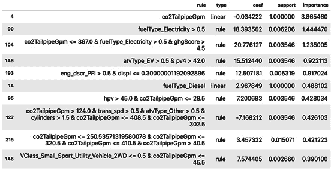

图 5.21-规则匹配代理前 10 大规则

SHAP 和 ALE 图向我们展示了一些关于特征以及它们如何与目标和彼此相关的有趣见解。然而，鉴于 XGBoost 和神经网络的复杂性，它们隐藏了可以用其他术语进行最佳提炼的简单事实，只有白盒模型才能通过黑盒模型的预测来展示这些事实。

注意

代理模型的发现只能对原始模型做出结论，而不能对用于训练模型的数据做出结论。

关于模型本身和它们的代理人的数据，还有很多需要了解的。例如，您可以使用 ALE 图检查规则列表顶部规则中的每个交互，或者在查看每个特性的相应依赖图时探索决策树，尤其是看起来很有希望的`fuelType_Electricity`。

# 任务完成

任务是了解数据集中的潜在预测因素是如何影响燃料效率的。我们确定，到目前为止，最重要的燃油效率预测指标是与污染相关的，而以克/英里(`co2TailpipeGpm`)为单位的排气管二氧化碳是最突出的指标。污染和燃料效率低下每年都在减少。同样，当它是一台柴油发动机时，它们随着气缸数量的增加而增加(`fuelType_Diesel`)。对于任何了解汽车在过去几十年中发展的人来说，这些都不足为奇。

然而，有一些发人深省的见解。例如，SHAP 依赖图(*图 5.12 和 5.14* )帮助我们理解为什么`co2`和`ghgScore`特征是多余的。如交互 ALE 图所示(*图 5.19* )，2004 年之前的`co2TailpipeGpm`可能存在一些数据质量问题，需要进一步调查。全局代理提取了一种在其他解释方法中看不到的层次感。尽管总的来说，电动发动机特性(`fuelType_Electricity`、`atvType_EV`)和变速器特性(`trany_Manual`、`trans_spd`)似乎并不重要，但它们在决策树(*图 5.20* )和 RuleFit 的规则(*图 5.21* )中显得很重要。等级揭示了它们是预测 MPG 的良好初始分裂点。

我们有一些出色的发现和激动人心的情节。我们可以称之为任务完成。然而，在口译中，有了好的答案，你也经常会得到好的问题！我们可以继续深入兔子洞，看看它会通向哪里。例如，一旦你删除了多余的功能，下一步可能是为化石燃料和电动汽车训练一个单独的模型，以了解哪些因素分别影响 MPG 和 MPGe(每加仑汽油相当的英里数)。您可以为两者生成 SHAP 图，将它们的主要特征并列在一起，也许这将有助于为您的组织创建一个更有说服力的故事！

# 总结

读完这一章，你应该理解沙普利价值观以及它们是如何与 SHAP 图书馆联系在一起的。您还了解了 ALE 图，以及它们如何成为 PDP 的更好替代方案。最后，您应该理解如何利用全局代理来更多地了解您的模型。

在下一章中，我们将使用一个**本地代理模型** ( **石灰**)和 SHAP 来研究本地解释方法。

# 延伸阅读

*   劳埃德·沙普利(1953)。“n 人游戏的一个值”。在库恩，H. W。塔克。).对博弈论的贡献。数学研究年鉴。28.普林斯顿大学出版社。第 307-317 页。https://doi.org/10.1515/9781400881970-018
*   Lundberg，s .，，Lee，S. (2017 年)。解释模型预测的统一方法。神经信息处理系统进展，30。https://arxiv.org/abs/1705.07874(https://github.com/slundberg/shap SHAP 的文件)
*   Lundberg，S.M .、Erion，g .、Lee，S. (2018 年)。树集成的一致个性化特征属性。ICML 工作室。https://arxiv.org/abs/1802.03888
*   Shrikumar，a .，Greenside，p .，和 Kundaje，A. (2017 年)。通过传播激活差异学习重要特征。https://arxiv.org/abs/1704.02685
*   Sturmfels，p .，Lundberg，s .，和 Lee，S. (2020 年)。可视化特征属性基线的影响。蒸馏。[https://www.doi.org/10.23915/distill.00022](https://www.doi.org/10.23915/distill.00022)
*   Apley，D.W .和朱，J. (2019)。可视化黑盒监督学习模型中预测变量的影响。arXiv:方法论。[https://arxiv.org/abs/1612.08468](https://arxiv.org/abs/1612.08468)。***