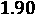

# 七、锚定和反事实解释

在前面的章节中，我们已经学习了如何将模型决策归因于特征及其与最新的全局和局部模型解释方法的交互。然而，用这些方法来定义或解释决策界限并不总是容易的。能够从模型解释方法中推导出人类可以解释的规则不是很好吗？在这一章中，我们将涵盖一些人类可解释的、局部的、仅分类的模型解释方法。我们将首先学习如何使用名为**锚**的作用域规则来解释复杂模型，并使用类似于*的语句:如果满足 X 条件，那么 Y 就是结果*。然后，我们将探索遵循形式*的**反事实**解释，如果 Z 条件不满足，那么 Y 不是结果*。最后，我们将解释**对比解释**如何将锚点和反事实结合起来，比如说*如果 X 条件满足而 Z 条件不满足，Y 就是结果*。

这些是我们将在本章中涉及的主要话题:

*   理解锚点解释
*   探索反事实的解释
*   与对比解释方法相比

# 技术要求

本章的示例使用了`mldatasets`、`pandas`、`numpy`、`sklearn`、`catboost`、`tensorflow`、`rulefit`、`matplotlib`、`seaborn`、`alibi`、`shap`和`witwidget`库。如何安装所有这些库的说明在*前言*中。本章代码位于此处:[https://github . com/packt publishing/Interpretable-Machine-Learning-with-Python/tree/master/chapter 07](https://github.com/PacktPublishing/Interpretable-Machine-Learning-with-Python/tree/master/Chapter07)。

# 使命

在美国，过去二十年来，私营公司和非营利组织一直在开发犯罪风险评估工具，其中大部分采用统计模型。由于许多州再也负担不起庞大的监狱人口，这些方法越来越受欢迎，引导法官和假释委员会通过监狱系统的每一步。然而，他们经常做比*更多的引导*的决定。他们让他们为司法系统的决策者，因为他们认为这是正确的。更糟糕的是，他们并不确切知道评估是如何进行的。风险通常用白盒模型来计算，但是在实践中，使用黑盒模型是因为它是专有的。预测性能也相对较低，9 种工具的 AUC 得分中位数在 0.57 到 0.74 之间。尽管如此，有效性和偏见很少检查，特别是由购买他们的刑事司法机构。

尽管传统的统计方法仍然是刑事司法模型的规范，但为了提高性能，一些研究人员已经提出利用更复杂的模型，如具有更大数据集的随机森林。在其他国家，利用大数据和机器学习，根据人们参与反社会甚至反人格行为的可能性对他们进行评分已经成为现实，这远远不是摘自*少数派报告*或*黑镜*的科幻小说。

随着越来越多的人工智能解决方案试图用我们的数据对我们做出改变生活的预测，必须正确评估公平性，并且必须充分讨论其所有的伦理和实践影响。*第一章*，*解释，可解释性，可说明性；为什么这些都很重要？*，涵盖了公平如何成为机器学习解释的一个不可或缺的概念。您可以在任何模型中评估公平性，但是当它涉及人类行为时，公平性尤其棘手。人类心理、神经和社会因素之间的动态关系极其复杂。在预测犯罪行为的背景下，它归结为哪些因素可能导致犯罪，因为在一个模型中包括任何其他东西都是不公平的，以及这些因素如何相互作用。

定量犯罪学家仍在争论犯罪的最佳预测指标及其根源。他们也在争论从这些因素开始指责罪犯是否道德。令人欣慰的是，种族、性别和国籍等人口统计特征不再用于犯罪风险评估。但这并不意味着这些方法不再有种族偏见。学者们认识到了这个问题，并提出了解决方案。

本章将在一个最广泛使用的风险评估工具中考察种族偏见。鉴于这一主题的敏感性和相关性，有必要提供一点关于犯罪风险评估工具以及机器学习和公平性如何与之相关的背景知识。我们不会进入更多的细节，但不能低估这种背景对于理解机器学习如何延续结构性不平等和不公平偏见的重要性。

现在，让我们向你介绍这一章的任务！

## 重复风险评估中的不公平偏见

一名调查记者正在写一篇关于一名非裔美国被告在等待审判时如何被拘留的文章。一个名为**的替代制裁罪犯管理档案工具** ( **COMPAS** )认为他有再犯的风险。**累犯**是指某人重新陷入犯罪行为。分数让法官相信他必须被审前拘留，以至于他们甚至没有考虑任何其他的论点或证词。他被关了好几个月，在审判中被判无罪。审判已经过去 5 年多了，他没有被指控任何罪行。你可以说对累犯的预测是假阳性。

记者联系了你，因为她想用数据科学来确定在这个特殊的案例中是否存在不公平的偏见。COMPAS 风险评估使用 137 个问题进行计算([https://www . document cloud . org/documents/2702103-Sample-Risk-Assessment-COMPAS-core . html](https://www.documentcloud.org/documents/2702103-Sample-Risk-Assessment-COMPAS-CORE.html))。它包括如下问题:

*   "根据安检人员的观察，这个人是被怀疑或承认的帮派成员吗？"
*   “在过去 12 个月中，您搬家的频率如何？”
*   "你经常有勉强够用的钱吗？"
*   心理测量学的李克特量表问题比如“我这辈子从没对事情感到难过过”，比如在 [*第四章*](B16383_04_ePub_RK.xhtml#_idTextAnchor081) 、*特征重要性和影响的基础*中看到的。

尽管种族不是问题之一，但其中许多问题可能与种族有关。更不用说，在某些情况下，它们更多的是观点问题，而不是事实问题，因此容易产生偏见。

记者无法向您提供 137 个已回答的问题或 COMPAS 模型，因为这些数据是不公开的。然而，佛罗里达州同一个县的所有被告的人口统计和累犯数据都是。

# 方法

您已决定执行以下操作:

*   **训练代理模型**:你没有原始特征或模型，但并没有失去一切，因为你有比较分数——标签。我们也有与问题相关的特征，我们可以将这些标签与模型联系起来。通过代理近似 COMPAS 模型，您可以评估其标签的不公平性。在本章中，我们将训练一个 CatBoost 模型和一个神经网络模型。
*   **锚点解释**:使用这种方法将揭示为什么代理模型使用一系列称为锚点的规则做出特定的预测，锚点告诉你决策边界在哪里。界限与我们的任务有关，因为我们想知道为什么被告被错误地预测会再次认罪。这是原始模型的近似边界，但仍有一些真实性。
*   **反事实解释**:与 anchors 相反的概念是关于理解为什么相似的数据点在决策边界的对面，这在讨论不公平的话题时特别值得注意。我们将使用一种不偏不倚的方法来寻找反事实，然后使用**假设分析工具(WIT)** 来进一步探索反事实和公平性。
*   **对比解释方法** ( **CEM** ):为了补充锚定和反事实方法，你将与 CEM 接触，这与两者都相似，并且可以提供对被告被视为具有高再犯风险的最低要求的理解，不仅阐明了公平性，而且阐明了可靠性，这是公平性可行所需要的。

# 准备工作

你可以在这里找到这个例子的代码:[https://github . com/packt publishing/Interpretable-Machine-Learning-with-Python/blob/master/chapter 07/Recidivism _ part 1 . ipynb](https://github.com/PacktPublishing/Interpretable-Machine-Learning-with-Python/blob/master/Chapter07/Recidivism_part1.ipynb)。

## 加载库

要运行这个例子，你需要安装下面的库:

*   `mldatasets`加载数据集
*   `pandas`和`numpy`来操纵数据集
*   `sklearn` (scikit-learn)、`catboost`和`tensorflow`分割数据并拟合模型
*   `matplotlib`、`seaborn`、`alibi`、`shap`和`witwidget`可视化解释

您应该首先加载它们:

```py
import math
import mldatasets
import pandas as pd
import numpy as np
from sklearn.model_selection import train_test_split
from sklearn import metrics
from catboost import CatBoostClassifier
import tensorflow as tf
from tensorflow import keras
from tensorflow.keras import layers
import matplotlib.pyplot as plt
import seaborn as sns
from alibi.utils.mapping import ohe_to_ord, ord_to_ohe
from alibi.explainers import AnchorTabular
from alibi.explainers import CEM
from alibi.explainers import CounterFactualProto
import shap
import witwidget
from witwidget.notebook.visualization import WitWidget,\
                 WitConfigBuilder
```

让我们用`print(tf.__version__)`检查一下 TensorFlow 是否加载了正确的版本。应该是 2.0 以上。我们还应该禁用急切执行，并验证它与该命令一起工作。输出应该是`False`:

```py
tf.compat.v1.disable_eager_execution()
print('Eager execution enabled:', tf.executing_eagerly()) 
```

## 了解和准备数据

我们像这样将数据加载到一个我们称之为`recidivism_df`的数据帧中:

```py
recidivism_df = mldatasets.load("recidivism-risk", prepare=True) 
```

应该有将近 15，000 条记录和 23 列。我们可以验证`info()`的情况:

```py
recidivism_df.info()
```

下面的输出是正确的。所有特征都是没有缺失值的数字，分类特征已经为我们进行了一次性编码:

```py
<class 'pandas.core.frame.DataFrame'>
Int64Index: 14788 entries, 0 to 18315
Data columns (total 23 columns):
 #   Column                 Non-Null Count  Dtype
---  ------                 --------------  -----
 0   age                    14788 non-null  int8 
 1   juv_fel_count          14788 non-null  int8 
 2   juv_misd_count         14788 non-null  int8 
 3   juv_other_count        14788 non-null  int64
 4   priors_count           14788 non-null  int8 
 5   is_recid               14788 non-null  int8 
 6   sex_Female             14788 non-null  uint8
 7   sex_Male               14788 non-null  uint8
 8   race_African-American  14788 non-null  uint8
 9   race_Asian             14788 non-null  uint8
 10  race_Caucasian         14788 non-null  uint8
 11  race_Hispanic          14788 non-null  uint8
 12  race_Native American   14788 non-null  uint8
 13  race_Other             14788 non-null  uint8
 14  c_charge_degree_(F1)   14788 non-null  uint8
 15  c_charge_degree_(F2)   14788 non-null  uint8
 16  c_charge_degree_(F3)   14788 non-null  uint8
 17  c_charge_degree_(F7)   14788 non-null  uint8
 18  c_charge_degree_(M1)   14788 non-null  uint8
 19  c_charge_degree_(M2)   14788 non-null  uint8
 20  c_charge_degree_(MO3)  14788 non-null  uint8
 21  c_charge_degree_Other  14788 non-null  uint8
 22  compas_score           14788 non-null  int64
dtypes: int64(2), int8(5), uint8(16)
memory usage: 649.9 KB
```

### 数据字典

只有 9 个特征，但由于分类编码，它们变成了 22 列:

*   `age`:连续，被告年龄(8 至 9 岁之间)。
*   `juv_fel_count`:连续，少年重罪犯数量(0-2 之间)。
*   `juv_misd_count`:连续，少年轻罪次数(0-1 之间)。
*   `juv_other_count`:连续的，既不是重罪也不是轻罪的少年定罪数(0 到 1 之间)。
*   `priors_count`:连续，之前犯罪的次数(0 到 13 之间)。
*   `is_recid`:二进制，被告是否在 2 年内再犯(1 表示是，0 表示否)？
*   `sex`:绝对的，被告的性别。
*   `race`:绝对的，被告的种族。
*   绝对的，被告目前被指控的程度。美国将刑事犯罪按照从最严重到最轻微的顺序分为重罪、轻罪和违法。这些罪行以等级的形式被细分，从第一级(最严重的罪行)到第三级或第五级(最不严重的罪行)。然而，尽管这是联邦犯罪的标准，但它是在州一级根据州法律量身定制的。对于重罪，佛罗里达州([http://www.dc.state.fl.us/pub/scoresheet/cpc_manual.pdf](http://www.dc.state.fl.us/pub/scoresheet/cpc_manual.pdf))有一个等级系统，决定犯罪的严重程度，从 10(最严重)到 1(最轻微)。这一特征的类别对于重罪以 *F* 为前缀，对于轻罪以 *M* 为前缀。它们后面是一个数字，这是重罪的一个级别和轻罪的一个学位。
*   `compas_score`:二元制，COMPAS 将被告分为“低”、“中”或“高”风险。在实践中，“中”常常被决策者视为“高”，因此该特征被转换为二进制以反映这种行为:1:高/中风险，0:低风险。

### 用混淆矩阵检验预测偏差

数据集中有两个二元要素。第一个是 COMPAS 做的再犯罪风险预测(`compas_score`)。第二个(`is_recid`)是*地面真相*，因为这是被告被捕后两年内发生的事情。就像你对任何模型的训练标签进行预测一样，你可以用这两个特征构建混淆矩阵。scikit-learn 可以用`confusion_matrix`函数(`cf_matrix`)生成一个，然后我们可以用它创建一个 Seaborn `heatmap`。而不是标绘`cf_matrix/np.sum(cf_matrix)`的数字)。`heatmap`的其他参数仅协助格式化:

```py
cf_matrix = metrics.confusion_matrix(recidivism_df.is_recid,\
                               recidivism_df.compas_score)
sns.heatmap(cf_matrix/np.sum(cf_matrix), annot=True,
   fmt='.2%', cmap='Blues', annot_kws={'size':16}) 
```

上述代码输出*图 7.1* 。右上角是 FPs，占所有预测的近五分之一，加上左下角的 fn，它们占了三分之二以上:


图 7.1–预测的累犯风险(compas_score)和基本事实(is_recid)之间的混淆矩阵

*图 7.1* 告诉我们，COMPAS 模型的预测性能并不是很好，尤其是如果我们假设刑事司法决策者在表面上接受中等或高风险评估。它还告诉我们，FP 和 FNs 以相似的速率发生。然而，简单的可视化，如混淆矩阵模糊了人口亚组之间的预测差异。我们可以很快比较两个分组之间的差异，这两个分组在历史上受到美国刑事司法系统的不同对待。为此，我们首先将我们的数据帧细分为两个数据帧:一个用于白种人(`recidivism_c_df`)，另一个用于非裔美国人(`recidivism_aa_df`)。然后，我们可以为每个数据帧生成混淆矩阵，并用以下代码并排绘制它们:

```py
recidivism_c_df =\
        recidivism_df[recidivism_df['race_Caucasian'] == 1] recidivism_aa_df =\
        recidivism_df[recidivism_df['race_African-American'] == 1]
_ = mldatasets.\
      compare_confusion_matrices(recidivism_c_df.is_recid,\ 
                                 recidivism_c_df.compas_score,\
                                 recidivism_aa_df.is_recid,\
                                 recidivism_aa_df.compas_score,\
                              'Caucasian', 'African-American',\
                                 compare_fpr=True)
```

前面的代码片段生成了*图 7.2* 。一眼就能看出来，这就像是白种人的困惑矩阵被翻转了 90 度，形成了非裔美国人的困惑矩阵，即便如此，依然不那么不公平。密切注意 FPs 和 TNs 的区别。作为一名白人被告，结果是 FP 的可能性比 TN 的可能性大一半以上，但作为一名非裔美国人，可能性高几个百分点。换句话说，一个没有再犯的黑人被告被预测有一半以上的几率会再犯:


图 7.2-数据集中非裔美国人和白种人之间预测再犯风险(compas_score)和基本事实(is_recid)的混淆矩阵比较

我们可以测量**假阳性率** ( **FPR** )，也就是这两个测量值的比值()，而不是通过看图来目测。然后，我们可以比较两组的 FPR，并在它们之间划分以检查相对差异。生育率之间的比率越高，不公平性就越大，因为这意味着一个群体被错误分类，从而更经常地再次分裂。

### 数据准备

在我们继续建模和解释之前，我们还有最后一步。

由于`prepare=True`用于数据加载，我们现在所做的就是训练/测试分割数据。像往常一样，设置你的随机状态是至关重要的，这样你所有的发现都是可重复的。然后，我们将把我们的`y`设置为我们的目标变量(`compas_score`)，并将`X`设置为除了`is_recid`之外的所有其他特征，因为这是基本事实。最后，我们将`y`和`X`分成个训练和测试数据集，就像之前一样:

```py
rand = 9
np.random.seed(rand)
tf.random.set_seed(rand) 
y = recidivism_df['compas_score']
X = recidivism_df.drop(['compas_score', 'is_recid'], axis=1).copy()
X_train, X_test, y_train, y_test = train_test_split(X, y,\
                                   test_size=0.2, random_state=rand)
```

现在，让我们开始吧！

### 建模

现在，让我们快速训练几个我们将在本章中用到的模型。

**代理模型**是一种模拟黑盒模型输出的手段，就像**全局代理模型**一样，我们在 [*第 5 章*](B16383_05_ePub_RK.xhtml#_idTextAnchor106) *、全局模型不可知解释方法*中讨论过。那么，它们是一回事吗？在机器学习中，代理和代理是经常互换使用的术语。然而，从语义上看，代孕与替代有关，而代理更多地与表示有关。所以，我们调用这些代理模型来区分我们没有确切的训练数据。因此，您只代表原始模型，因为您无法替换它。出于同样的原因，与更简单的模型最适合的代理解释不同，代理最适合于复杂的模型，可以弥补复杂训练数据的差异。

首先，一个 **CatBoost** 分类器。对于那些不熟悉 CatBoost 的人来说，这是一种高效的增强集成树方法。它类似于 **LightGBM** ，只不过它使用了一种叫做**最小方差采样** ( **MVS** )的新技术，而不是**基于梯度的单边采样** ( **高斯**)。与 LightGBM 不同，它以平衡的方式生长树。它被称为 CatBoost，因为它可以自动对分类特征进行编码，并且它特别擅长处理过度拟合，对分类特征和类不平衡进行无偏处理。我们不会涉及太多的细节，但出于这些原因，我们选择了它作为本次练习的主题。

作为一个基于树的模型类，你可以为`CatBoostClassifier`指定一个最大的`depth`值。我们正在设置一个相对较高的`learning_rate`值和一个较低的`iterations`值(默认为)。一旦我们在模型上使用了`fit`，我们就可以用`evaluate_class_mdl`来评估结果:

```py
cb_mdl = CatBoostClassifier(iterations=500, learning_rate=0.5,\  
                            depth=8)
fitted_cb_mdl = cb_mdl.fit(X_train, y_train, verbose=False) y_train_cb_pred, y_test_cb_prob, y_test_cb_pred =\
            mldatasets.evaluate_class_mdl(fitted_cb_mdl,\
 X_train, X_test, y_train, y_test)
```

您可以在*图 7.3* 中看到我们的 CatBoost 模型的`evaluate_class_mdl`输出:


图 7.3–我们的 CatBoost 模型的预测性能

从公平的角度来看，我们更关心 FPs 而不是 FNs，因为把一个无辜的人关进监狱比把一个有罪的人留在街上更不公平。因此，我们应该立志拥有比*召回*更高的*精度*。*图 7.3* 证实了这一点，以及健康的 ROC 曲线、ROC-AUC 和 MCC。

接下来，我们来拟合一个*前馈神经网络*。首先我们创建它(`keras.Sequential`)有一个隐层(`layers.Dense`)有七个节点，输出层有`sigmoid`，因为这是一个二分类问题。然后，我们在模型上使用`compile`和`fit`。最后，我们使用`evaluate_class_mdl`来评估预测:

```py
fitted_nn_mdl = keras.Sequential([
 tf.keras.Input(shape=[len(X_train.keys())]),
 layers.Dense(7, activation='relu'),
 layers.Dense(1, activation='sigmoid')
])
fitted_nn_mdl.compile(loss='mean_squared_error', optimizer='adam')
nn_history = fitted_nn_mdl.fit(X_train.values, y_train.values,\  
          epochs=12, batch_size=32, validation_split=0.2, verbose=0) y_train_nn_pred, y_test_nn_prob, y_test_nn_pred =\
             mldatasets.evaluate_class_mdl(fitted_nn_mdl,\
X_train, X_test, y_train, y_test) 
```

*图 7.4* 描述了前面代码的输出:


图 7.4–我们的神经网络模型的预测性能

两个模型的预测性能并不差，考虑到这些是*代理模型*只意味着用不同但相关的数据来近似真实的事情。

### 了解我们的“兴趣实例”

这位记者带着一个案例联系到了你:一名被错误预测会再次入狱的非裔美国被告。这个案例是# `5231`并且是您感兴趣的主要*实例*。由于我们关注的是种族偏见，我们希望将它与不同种族的类似案例进行比较。为此，我们找到了病例`#10127`(白种人)和`#2726`(西班牙人)。

我们可以看一下这三者的数据。因为我们将在本章中不断引用这些实例，所以让我们先保存非裔美国人(`idx1`)、西班牙裔(`idx2`)和白种人(`idx3`)案例的索引。然后，我们可以根据这些索引对测试数据集进行子集划分。由于我们必须确保我们的预测匹配，我们将把这个子集化的测试数据集连接到真实标签(`y_test`)和 CatBoost 预测(`y_test_cb_pred`):

```py
idx1 = 5231
idx2 = 2726
idx3 = 10127
eval_idxs = X_test.index.isin([idx1, idx2, idx3])
X_test_evals = X_test[eval_idxs]
eval_compare_df = pd.concat([
   pd.DataFrame({'y':y_test[eval_idxs]},
       index=[idx3, idx2, idx1]),
   pd.DataFrame({'y_pred':y_test_cb_pred[eval_idxs]},
       index=[idx3, idx2, idx1]),
   X_test_evals], axis=1).transpose()
eval_compare_df
```

前面的代码产生了图 7.5 中的数据帧。您可以看出预测与真实标签相匹配，我们感兴趣的主要*实例*是唯一一个被预测为中等或高再犯风险的实例。除了种族之外，唯一的不同是与`c_charge_degree`和一个小的年龄差异:


图 7.5–并排观察#5231、#10127 和#2726，突出显示特征差异

在本章中，我们将密切关注这些差异，看看它们是否在产生预测差异中发挥了重要作用。我们将介绍的所有方法将完成决定或改变代理模型的决策的画面，并且，潜在地，通过扩展完成 COMPAS 模型。现在我们已经完成了设置，我们将继续使用解释方法。

# 理解锚点解释

在 [*第 6 章*](B16383_06_ePub_RK.xhtml#_idTextAnchor125) 、*局部模型不可知解释方法*中，我们了解到 **LIME** 在感兴趣的*实例*的**邻域**中，对数据集的**扰动**版本训练一个局部代理模型(特别是一个**加权稀疏线性模型**)。结果是，您近似了一个**局部决策边界**，它可以帮助您解释模型对它的预测。

像 LIME 一样，**锚**也是从模型不可知的基于扰动的策略中导出的。然而，它们不是关于*决策边界*，而是关于**决策区域**。锚点也被称为**范围规则**，因为它们列出了一些**决策规则**，这些规则适用于您的实例及其*扰动的*邻域。这个邻域也被称为扰动空间。一个重要的细节是规则在多大程度上适用于它，即所谓的**精度**。

想象一下你的实例周围的邻居。你会期望越接近你的实例，这些点就有越多相似的预测，对吗？所以，如果你有定义这些预测的决策规则，你的实例周围的区域越小，你的规则就越精确。这个概念叫做**覆盖**，它是你的*扰动空间*产生特定*精度*的百分比。

与 LIME 不同，锚点不适合用局部代理模型来解释您选择的实例的预测。相反，他们使用一种叫做**库尔贝克-莱布勒散度置信下限和置信上限** ( **KL-LUCB** )的算法来探索可能的候选决策规则，这种算法是从一种**多臂老虎机** ( **MAB** )算法衍生而来的。

单克隆抗体是一系列*强化学习算法*，当你探索所有未知可能性的资源有限时，可以最大化回报。该算法源于对赌场老虎机玩家如何通过玩多台机器来最大化其回报的理解。之所以叫多臂老虎机，是因为吃角子老虎机玩家被称为独臂老虎机。然而，玩家不知道哪台机器会产生最高的回报，不能一次尝试所有的机器，而且资金有限。诀窍是学会如何平衡探索(尝试未知的老虎机)和开发(使用那些你已经有理由更喜欢的)。

在 anchors 案例中，每个老虎机都是一个潜在的决策规则，回报是它产生的精度。KL-LUCB 算法使用基于分布之间的 **Kullback-Leibler 散度**的置信区域来依次高效地找到具有最高精度的决策规则。

## 锚定的准备和带有不在场证明的反事实解释

需要执行几个小步骤来帮助`alibi`库产生人类友好的解释。第一个与预测有关，因为模型可能输出一个或，但是通过它的名字更容易理解预测。为了帮助我们，我们需要一个类名列表，其中位置匹配我们的负类名，而位置匹配正类名:

```py
class_names = ['Low Risk', 'Medium/High Risk']
```

接下来，让我们用我们感兴趣的主*实例*创建一个`numpy`数组，并将其打印出来。请注意，一维数组需要扩展(`np.expand_dims`)，以便被`alibi`理解:

```py
X_test_eval = np.expand_dims(X_test.values[X_test.\
           index.get_loc(idx1)], axis=0)
print(X_test_eval)
```

前面的代码输出一个包含 21 个特征的数组，其中 12 个是**一键编码** ( **OHE** )的结果:

```py
[[23  0  0  0  2  0  1  1  0  0  0  0  0  0  0  0  1  0  0   0  0]]
```

当你有 OHE 分类的时候，一个问题出现了。对于机器学习模型和解释者来说，每个 OHE 特征都是相互独立的。尽管如此，对于解释结果的人来说，它们作为其原始特征的类别聚集在一起。

`alibi`库有几个实用函数来处理这个问题，比如`ohe_to_ord`，它接受一个热编码的实例，并把它放入序号格式中。为了使用这个函数，我们首先定义一个字典(`cat_vars_ohe`)，它告诉`alibi`分类变量在我们的特征中的位置，以及每个分类变量有多少个类别。例如，在我们的数据中，性别从第 5 个索引开始，有两个类别，这就是为什么我们的`cat_vars_ohe`字典以`5: 2`开始。一旦您有了这个字典，`ohe_to_ord`就可以获取您的实例(`X_test_eval`)并以顺序格式输出，其中每个分类变量占用一个特征。这个效用函数将被证明对 Alibi 的反事实解释有用，解释者将需要这个字典来将分类特征映射在一起:

```py
cat_vars_ohe = {5: 2, 7: 6, 13: 8}
print(ohe_to_ord(X_test_eval, cat_vars_ohe)[0])
```

上述代码输出以下数组:

```py
[[23  0  0  0  2  1  0  3]]
```

因为当它是顺序格式时，Alibi 将需要一个字典，提供每个类别的名称和一个特征名称列表:

```py
category_map = {
 5: ['Female', 'Male'],\
 6: ['African-American', 'Asian', 'Caucasian',\
    'Hispanic', 'Native American', 'Other'],\
 7: ['Felony 1st Degree', 'Felony 2nd Degree',\
    'Felony 3rd Degree', 'Felony 7th Degree',\
    'Misdemeanor 1st Degree', 'Misdemeanor 2nd Degree',\
    'Misdemeanor 3rd Degree', 'Other Charge Degree'] }
feature_names = ['age', 'juv_fel_count', 'juv_misd_count',\
              'juv_other_count', 'priors_count',\
              'sex', 'race', 'c_charge_degree']
```

然而，Alibi 的锚定解释使用提供给我们的模型的数据。我们正在使用 OHE 数据，所以我们需要一个该格式的类别地图。当然，OHE 特征都是二进制的，所以它们每个只有两个“类别”:

```py
category_map_ohe = {5: ['Not Female', 'Female'],\ 
  6: ['Not Male', 'Male'],\
  7:['Not African American', 'African American'],\
  8:['Not Asian', 'Asian'], 9:['Not Caucasian', 'Caucasian'],\
  10:['Not Hispanic', 'Hispanic'],\
  11:['Not Native American', 'Native American'],\
  12:['Not Other Race', 'Other Race'],\
  13:['Not Felony 1st Level', 'Felony 1st Level'],\
  14:['Not Felony 2nd Level', 'Felony 2nd Level'],\
  15:['Not Felony 3rd Level', 'Felony 3rd Level'],\
  16:['Not Felony 7th Level', 'Felony 7th Level'],\
  17:['Not Misdemeanor 1st Deg', 'Misdemeanor 1st Deg'],\
  18:['Not Misdemeanor 2nd Deg', 'Misdemeanor 2nd Deg'],\
  19:['Not Misdemeanor 3rd Deg', 'Misdemeanor 3rd Deg'],\
  20:['Not Other Charge Degree', 'Other Charge Degree']}
```

## 主播解说的地方解说

所有 Alibi 解释器都需要一个 `predict`函数，所以我们为 CatBoost 模型创建了一个名为`predict_cb_fn`的`lambda`函数。请注意，我们将`predict_proba`用于分类器的概率。然后，为了初始化`AnchorTabular`，我们还为它提供了我们的特征的名称，因为它们在我们的 OHE 数据集中和类别映射中(`category_map_ohe`)。初始化后，我们用训练数据对其进行拟合:

```py
predict_cb_fn = lambda x: fitted_cb_mdl.predict_proba(x) anchor_cb_explainer = AnchorTabular(predict_cb_fn,\
X_train.columns,\
                                     categorical_names=category_map_ohe) anchor_cb_explainer.fit(X_train.values)
```

在我们利用解释者之前，检查锚是否“固定”是一个好习惯换句话说，我们应该检查 MAB 算法是否找到了有助于解释预测的决策规则。为了验证这一点，您使用`predictor`函数来检查预测是否与您对此实例的预期相同。现在，我们正在使用`idx1`，这是非裔美国人被告的案例:

```py
print('Prediction: %s' %  class_names[anchor_cb_explainer.\
                             predictor(X_test.loc[idx1].values)[0]])
```

上述代码输出以下内容:

```py
Prediction: Medium/High Risk
```

我们可以继续使用`explain`函数为我们的实例生成一个解释。我们可以将我们的精度阈值设置为`0.85`，这意味着我们期望锚定观测的预测至少在时间内与我们的实例相同。一旦我们有了解释，我们就可以打印锚点以及它们的精度和覆盖范围:

```py
anchor_cb_explanation =\
          anchor_cb_explainer.explain(X_test.loc[idx1].values,\     
                                      threshold=0.85,                                       seed=rand)
print('Anchor: %s' % (' AND'.join(anchor_cb_explanation.anchor))) 
print('Precision: %.3f' % anchor_cb_explanation.precision) 
print('Coverage: %.3f' % anchor_cb_explanation.coverage)
```

前面的代码生成了以下输出。可以看出`age`、`priors_count`和`race_African-American`是精度的因子。令人印象深刻的是，这条规则适用于几乎三分之一的扰动空间实例:

```py
Anchor: age <= 25.00 AND
    priors_count > 0.00 AND
    race_African-American = African American
Precision: 0.863
Coverage: 0.290
```

我们可以尝试相同的代码，但是在精度阈值上有一个凸起。它产生与使用较低精度阈值时相同的前三个锚，但现在用另外两个进行扩展:

```py
Anchor: age <= 25.00 AND
    priors_count > 0.00 AND
    race_African-American = African American AND
    c_charge_degree_(M1) = Not Misdemeanor 1st Deg AND
    c_charge_degree_(F3) = Not Felony 3rd Level AND
    race_Caucasian = Not Caucasian
Precision: 0.903
Coverage: 0.290
```

有趣的是，虽然的精度确实增加了几个百分点，但覆盖率保持不变，所以额外的锚应用于类似的扰动子集，精度提高了。在这个精确的水平上，我们可以确认种族是一个重要的因素，因为非裔美国人是一个锚，但不是白种人。另一个因素是`c_charge_degree`。这一解释表明，被指控犯有一级轻罪或三级重罪会更好。可以理解的是，第七级重罪是比这两项更严重的指控。

现在让我们为我们的神经网络创建一个黑盒锚点解释器。需要注意的一点是，`lambda`函数是不同的，因为网络`predict`函数输出的是正类的单组预测，但我们需要两组，其中一组是负类的。这很容易克服，因为两个类别的概率总和应该是，因此负概率应该与正概率互补。关于初始化和调整解释器的其他事情都是一样的:

```py
predict_nn_fn = lambda x: np.concatenate((1 -\ 
       fitted_nn_mdl.predict(x), fitted_nn_mdl.predict(x)), axis=1)
anchor_nn_explainer = AnchorTabular(predict_nn_fn, X_train.columns,\
                           categorical_names=category_map_ohe) anchor_nn_explainer.fit(X_train.values)
```

理解模型为什么做出特定预测的另一种方式是寻找具有相反预测的类似数据点，并找出它为什么做出那个预测。决策边界在两点之间交叉，因此对比边界两侧的决策解释很有帮助。这次我们将使用`idx3`，这是白人被告的情况:

```py
anchor_nn_explanation =\
                anchor_nn_explainer.explain(X_test.loc[idx3].values,\ 
                                     threshold=0.85, seed=rand)
print('Anchor: %s' % (' AND'.join(anchor_nn_explanation.anchor))) 
print('Precision: %.3f' % anchor_nn_explanation.precision) 
print('Coverage: %.3f' % anchor_nn_explanation.coverage)
```

前面的代码按如下方式输出锚点:

```py
Anchor: priors_count <= 2.00 AND
    race_African-American = Not African American AND
    c_charge_degree_(F3) = Not Felony 3rd Level
Precision: 0.911
Coverage: 0.578
```

第一个主播是`priors_count <= 2.00`，但是在边界的另一边，前两个主播是`age <= 25.00`和`priors_count > 0.00`。换句话说，对于 25 岁以下或等于 25 岁的非裔美国人来说，任何数量的前科都足以将他们归类为具有中等/高再犯风险的(当时的)。另一方面，对于一个白人来说，只要前科不超过两次，并且没有被指控犯有三级重罪，他们就会被预测为低风险(的时间和的覆盖范围)。这些裁决规则不仅通过`race`本身暗示了种族偏见，而且通过应用`priors_count`也暗示了种族偏见，并且`age`的缺失作为高加索人的一个因素构成了双重标准。

我们现在可以审判西班牙裔被告(`idx2`)，以观察在这种情况下是否也会发现双重标准。我们只是运行与之前相同的代码，但是用`idx2`替换`idx3`:

```py
Anchor: priors_count <= 2.00 AND
    race_African-American = Not African American AND
    race_Hispanic = Hispanic
Precision: 0.908
Coverage: 0.578
```

对西班牙裔被告的解释证实了对`priors_count`的双重标准，而`race`仍然是一个强有力的因素，因为有一个锚是非裔美国人，另一个锚是西班牙裔。

对于具体的模型决策，主播解说回答问题*为什么？*。然而，我们已经越过了决策界限，寻找为什么我们的观点不在那一边的答案。通过这样做，我们已经涉足了这个问题。。在下一节，我们将进一步阐述这个问题。

# 探索反事实的解释

反事实是人类推理不可或缺的一部分。我们中有多少人嘀咕过这样的话“如果我做了，我的结果将会不同”？总有一两件事情，如果以不同的方式去做，会导致我们想要的结果！

在机器学习结果中，你可以利用这种推理方式做出极其人性化的解释，我们可以根据需要改变什么来获得相反的结果来解释结果(反事实类)。毕竟，我们经常对如何让糟糕的结果变得更好感兴趣。例如，你如何让你被拒绝的贷款申请获得批准，或者降低你患心血管疾病的风险？然而，希望这些问题的答案不是一个巨大的变化列表。你期望改变你的结果所需的最小的变化。

关于公平，反事实是一种重要的解释方法，特别是当涉及到我们不能改变或不应该改变的元素时。例如，如果你和你的同事做完全相同的工作，有相同的经验，你希望有相同的薪水，对吗？如果你和你的配偶拥有相同的资产和信用记录，但却有不同的信用评分，你一定想知道为什么。这与性别、种族、年龄甚至政治派别有关吗？无论是赔偿、信用评级还是累犯风险模型，你都希望相似的点有相似的结果。

寻找反事实并不特别困难。我们所要做的就是稍微改变我们感兴趣的*实例*，直到它改变结果。也许数据集中已经有一个这样的实例了！

事实上，你可以说，我们在上一节中检查的锚的三个实例非常接近，足以成为彼此的反事实，除了高加索人和西班牙人的情况，他们有相同的结果。但是高加索人和西班牙人的案例是通过寻找与感兴趣的*案例*相比具有相同犯罪历史但不同种族的数据点而被*精选出来的*。也许通过比较相似的点，主要是除了种族，我们以这样一种方式限制了范围，我们证实了我们希望证实的，即种族对模型的决策至关重要。

这是*选择偏差*的一个例子。毕竟，反事实本质上是有选择性的，因为它们专注于少数特征变化。即使只有几个特征，也有如此多的可能排列改变结果，这意味着一个点可能有数百个反事实。并不是所有这些都会讲述一个一致的故事。这种现象被称为**罗生门效应**。它是以一部著名的日本电影命名的，这部电影讲述了一个神秘的谋杀案。正如我们对神秘谋杀案的期待，目击者对所发生的事情有不同的解释。但是就像很难依靠一个证人一样，你也不能依靠一个反事实。同样，就像伟大的侦探被训练在犯罪现场的任何地方寻找线索一样(即使这与他们的直觉相矛盾)，反事实不能被“精选”，因为他们很方便地讲述了我们希望他们讲述的故事。

幸运的是，有算法可以以一种不偏不倚的方式寻找反事实的例子。通常，这些包括寻找具有不同结果的最近点，但是有不同的方法来测量点之间的距离。首先，有**L1**距离(也被称为**曼哈顿距离**)和 **L2** 距离(也被称为**欧几里德距离**)，还有等等。但是还有归一化距离的问题，因为不是所有的特征都有相同的比例。否则，它们会偏向于较小比例的要素，例如一次性热编码要素。也有许多标准化方案可供选择。您可以使用**标准偏差**、**最小-最大比例**，甚至**中值绝对偏差**【9】。

在本节中，我们将解释并使用一种先进的反事实发现方法。然后，我们将探索谷歌的机智。它有一个简单的基于 L1 和 L2 的反事实查找器，它仅限于数据集，但用其他有用的解释功能来弥补它。

## 原型引导下的反事实解释

最复杂的反事实发现算法执行以下操作:

*   **损失**:这些利用了一个*损失函数*，帮助优化找到最接近我们感兴趣的*实例*的反事实。
*   **扰动**:这些倾向于用*扰动空间*操作，就像锚一样，尽可能少地改变特征。请注意，反事实不一定是数据集中的真实点。那会太局限了。反事实存在于可能的领域，而不是必然已知的领域。
*   仅这一点就足以使任何中/高风险的实例成为低风险的。这就是为什么反事实应该接近你的数据的统计分布，特别是*特定于类的分布*。他们也不应该对小规模的特征有偏见，即分类变量。
*   速度:这些运行速度足够快，在现实世界中非常有用。

Alibi 的**原型引导的反事实** ( *反事实原型*)具备所有这些属性。它有一个损失函数，包括作为线性组合的 ( *套索*)和 ( *脊*)正则化，就像**天真的弹性网**()一样的，但仅在项上有一个权重()。该算法的巧妙之处在于它可以(可选地)使用一个*自动编码器*来理解分布。我们不会重温这是如何工作的，因为我们在 [*第三章*](B16383_03_ePub_RK.xhtml#_idTextAnchor051) 、*解释挑战*中已经介绍过**变型自动编码器** ( **VAE** )。然而，这里需要注意的是，自动编码器通常是学习训练数据的压缩表示的神经网络。该方法结合了来自自动编码器的损失项，例如最接近原型的损失项。原型是反事实类的降维表示。

如果自动编码器不可用，算法会使用多维搜索常用的树( *k-d 树*)来代替。利用该树，算法可以有效地捕获类别分布，并且还可以选择最接近的原型。一旦有了原型，扰动就被它引导了。在损失函数中引入原型损失项确保了所产生的扰动将足够接近反事实类的分布中的原型。许多建模类和解释方法忽略了区别对待连续和分类特征的重要性。CounterFactualProto 可以使用两种不同的距离度量来计算分类变量的类别之间的成对距离:`feature_range`):

```py
feature_range =\
      (X_train.values.min(axis=0).reshape(1,21).astype(np.float32),\
       X_train.values.max(axis=0).reshape(1,21).astype(np.float32))
print(feature_range)
```

前面的代码输出两个数组——第一个包含所有特征的最小值，第二个包含所有特征的最大值:

```py
(array([[18.,  0.,  0.,  0.,  0.,  0.,  0.,  0.,  0.,  0.,  0.,  0.,  0.,
         0.,  0.,  0.,  0.,  0.,  0.,  0.,  0.]], dtype=float32), array([[96., 20., 13., 11., 38.,  1.,  1.,  1.,  1., 1.,  1.,  1.,  1.,  1.,  1.,  1.,  1.]], dtype=float32))
```

我们现在可以用`CounterFactualProto`实例化一个解释器。作为参数，它需要黑盒模型的预测函数(`predict_nn_fn`)、要解释的实例的形状(`X_test_eval.shape`)、要执行的最大优化迭代次数(`max_iterations`)以及受扰动实例的特征范围(`feature_range`)。许多超参数可以调整，包括应用于损失(`beta`)的权重和应用于原型损失(`theta`)的权重。此外，当没有提供自动编码器模型时，您必须指定是否使用 k-d 树(`use_kdtree`)。一旦解释器被实例化，您就可以使它适合测试数据集。我们将分类特征的距离度量(`d_type`)指定为 ABDM 和 MVDM 的组合:

```py
cf_nn_explainer = CounterFactualProto(predict_nn_fn,\
                       X_test_eval.shape, max_iterations=100,\
                       feature_range=feature_range, beta=.1,\
                       theta=5, use_kdtree=True )
cf_nn_explainer.fit(X_test.values, d_type='abdm-mvdm') 
```

用解释器创建解释类似于用锚。只需将实例(`X_test_eval`)传递给`explain`函数。然而，输出结果并不简单:主要是因为在一个热编码和序数之间转换特征，并在特征之间交互。不在场证明文件([https://docs.seldon.io/projects/alibi/](https://docs.seldon.io/projects/alibi/))有一个详细的例子说明这是如何做到的。我们将使用一个名为`describe_cf_instance`的实用函数，它使用感兴趣的*实例* ( `X_test_eval`)、解释(`cf_nn_explanation`)、类名(`class_names`)、one-hot.encoded 类别位置(`cat_vars_ohe`)、类别映射(`category_map`)和特征名(`feature_names`)来完成这项工作:

```py
cf_nn_explanation = cf_nn_explainer.explain(X_test_eval) mldatasets.describe_cf_instance(X_test_eval, cf_nn_explanation,\  
             class_names, cat_vars_ohe, category_map, feature_names)
```

前面的代码生成了以下输出:

```py
Instance Outcomes and Probabilities
------------------------------------------------
       original:  Medium/High Risk
                  [0.46732193 0.53267807]
 counterfactual:  Low Risk
                  [0.50025815 0.49974185]
Categorical Feature Counterfactual Perturbations
------------------------------------------------
                sex:  Male  -->  Female
               race:  African-American  -->  Asian
    c_charge_degree:  Felony 7th Degree  -->  Felony 1st Degree
Numerical Feature Counterfactual Perturbations
------------------------------------------------
       priors_count:  2.00  -->  1.90
```

您可以从输出中了解到，感兴趣的*实例*(“原始”)有 53.26%的概率是*中/高风险*，但反事实几乎是在*低风险*一侧，为 50.03%！稍微相反的反事实是我们希望看到的，因为这可能意味着它尽可能接近我们感兴趣的*实例*。它们之间有四个特征差异，其中三个是分类性的(`sex`、`race`和`c_charge_degree`)。第四个不同是`priors_count`数字特征，它被视为连续的，因为解释者不知道它是离散的。在任何情况下，它应该是*单调的*，因此更少的先验应该总是意味着更低的风险，这意味着我们可以将解释为，因为如果更少的先验有助于降低风险，那么整个先验也应该如此。

从反事实原型的输出中得出的一个更有力的见解是，两个人口统计学特征出现在与这个特征最接近的反事实中。其中一个是通过一种方法发现的，这种方法被设计成遵循我们的类的统计分布，并且不会对特定类型的特征产生偏见或支持。尽管在我们的反事实中看到亚裔女性令人惊讶，因为这不符合白人男性受到优待的说法，但意识到`race`出现在反事实中也令人不安。

## 反事实实例和更多假设分析工具(WIT)

谷歌的机智是一个非常通用的工具。它需要很少的输入或准备，并在您的 Jupyter 或 Colab 笔记本中打开，作为一个具有三个选项卡的交互式仪表板:

*   **数据点编辑器**:可视化你的数据点，编辑它们，并解释它们的预测。
*   **性能**:查看高级模型性能度量(针对所有回归和分类模型)。对于二进制分类，该选项卡称为**性能和公平性**，因为除了高级指标之外，还可以在数据集的基于特征的切片之间比较预测公平性。
*   **特征**:查看一般特征统计。

鉴于**特征**选项卡与模型解释无关，我们将在本节中只探讨前两个。

### 配置 WIT

可选地，我们可以通过创建属性来丰富我们在 WIT 中的解释，属性是解释每个特征对每个预测贡献多少的值。你可以使用任何方法来生成属性，但我们将使用 SHAP。我们在第五章 、*全局模型不可知解释方法*中首先介绍了 SHAP。因为我们将在 WIT 仪表板中解释我们的 CatBoost 模型，所以最合适的 SHAP 解释器是`TreeExplainer`，但是`DeepExplainer`也适用于神经网络(而`KernelExplainer`适用于两者)。要初始化`TreeExplainer`，我们只需要通过拟合模型(`fitted_cb_mdl`):

```py
shap_cb_explainer = shap.TreeExplainer(fitted_cb_mdl)
```

WIT 需要数据集中的所有要素(包括标注)。我们将使用测试数据集，所以您可以将`X_test`和`y_test`连接起来，但是即使这两个也不包括基本事实特征(`is_recid`)。获得所有这些的一种方法是用测试数据集索引(`y_test.index`)来子集化`recidivism_df`。WIT 还需要列表格式的数据和列，这样我们可以将它们保存为变量供以后使用(`test_np`和`cols_l`)。最后，对于预测和属性，我们将需要删除我们的基本事实(`is_recid`)和分类标签(`compas_score`)，所以让我们保存这些列的索引(`delcol_idx`):

```py
test_df = recidivism_df.loc[y_test.index] 
test_np = test_df.values
cols_l = test_df.columns
delcol_idx = [cols_l.get_loc("is_recid"),\
            cols_l.get_loc("compas_score")]
```

WIT 有几个用于定制仪表板的有用函数，比如设置一个定制的距离度量(`set_custom_distance_fn`)，显示类名而不是数字(`set_label_vocab`)，设置一个定制的预测函数(`set_custom_predict_fn`)，以及第二个用于比较两个模型的预测函数(`compare_custom_predict_fn`)。

除了`set_label_vocab`，我们将只使用一个定制的预测函数(`custom_predict_with_shap`)。它所需要做的就是用你的`examples_np`数据集取一个数组，并产生一些预测(`preds`)。然而，我们首先必须删除我们想要在仪表板中使用，但没有在训练中使用的功能(`delcol_idx`)。该函数所需的输出是一个字典，其中的预测存储在一个`predictions`键中。但是我们也想要一些属性，这就是为什么我们在字典中需要一个`attributions`键。因此，我们使用 SHAP 解释器并生成`shap_values`，这是一个 NumPy 数组。但是，属性需要是一个字典列表，才能被 WIT 仪表板理解。为此，我们迭代`shap_output`，将每个观察值的 SHAP 值数组转换为一个字典(`attrs`)，然后将其附加到一个列表(`attributions`):

```py
def custom_predict_with_shap(examples_np):
 #For shap values we only need same features
 #that were used for training
 inputs_np = np.delete(np.array(examples_np), delcol_idx, axis=1)
 #Get the model's class predictions
 preds = predict_cb_fn(inputs_np) 
 #With test data generate SHAP values which converted
 #to a list of dictionaries format
 keepcols_l = [c for i, c in enumerate(cols_l)\
             if i not in delcol_idx]
 shap_output = shap_cb_explainer.shap_values(inputs_np)
 attributions = []
 for shap in shap_output:
  attrs = {}
  for i, col in enumerate(keepcols_l):
   attrs[col] = shap[i]
  attributions.append(attrs)  
 #Prediction function must output predictions/attributions
 #in dictionary
 output = {'predictions': preds, 'attributions': attributions}
 return output
```

在我们构建 WIT 仪表板之前，需要注意的是，为了在仪表板中找到我们感兴趣的实例，我们需要知道它在提供给 WIT 的 NumPy 数组中的位置，因为这些数组不像 pandas DataFrames 那样有索引。为了找到位置，我们需要做的就是为`get_loc`函数提供索引:

```py
print(y_test.index.get_loc(5231))
```

前面的代码输出为`2910`，所以我们可以记下这个数字。构建 WIT 仪表板现在相当简单。我们首先用 NumPy 格式的测试数据集(`test_np`)和我们的特征列表(`cols_l`)初始化一个配置(`WitConfigBuilder`)。两者都用`tolist()`转换成列表。然后，我们用`set_custom_predict_fn`和我们的目标特征(`is_recid`)设置我们的自定义预测函数，并提供我们的类名。我们这次就用地面真相，从真实发生的角度来评价公平性。一旦配置被初始化，小部件(`WitWidget`)就用它构建仪表板。您可以选择提供一个高度(默认为像素):

```py
wit_config_builder = WitConfigBuilder(\
                 test_np.tolist(), feature_names=cols_l.tolist()
    ).set_custom_predict_fn(custom_predict_with_shap).\
    set_target_feature("is_recid").set_label_vocab(class_names)
WitWidget(wit_config_builder, height=800)
```

### 数据点编辑器

在*图 7.6* 中，您可以看到 WIT 仪表盘及其三个选项卡。我们将首先探索第一个选项卡(**数据点编辑器**)。左边有**可视化**和**编辑**窗格，右边可以显示**数据点**或**部分依赖图**。当您选择了**数据点**时，您可以使用右上角的控件以多种方式可视化数据点(高亮区域 *A* )。我们在*图 7.6* 中所做的设置如下:

*   `c_charge_degree_(F7)`。
*   `compas_score`。
*   `race_African-American`。
*   其他一切保持不变。

这些设置使得我们所有的数据点整齐地排列成 2 行 2 列，并由非裔美国人或不是非裔美国人进行颜色编码。右栏是收费等级为 7 级的人员，上面一行是*中/高风险* COMPAS 分数的人员。我们可以通过点击最右上方的项目在这个子组( *B* )中寻找数据点 2910。它应该出现在`age`而不是`race_African-American`中。但是，总的来说，种族的重要性仅次于年龄。另外，请注意，在**推断**窗格中，您会看到*中/高风险*的预测概率约为:


图 7.6–带有我们感兴趣的实例的 WIT 仪表板

WIT 可以使用 L1 或 L2 距离找到最近的反事实。并且它可以使用特征值或属性来计算距离。如前所述，如果将 WIT 添加到配置中，它还可以包含一个自定义的距离查找功能。现在，我们将选择具有特征值的 L2。在*图 7.7* 中，这些选项出现在突出显示的 *A* 区域。一旦您选择了一个距离度量并启用了**最近反事实**，它就会与我们感兴趣的实例*并排出现(区域 *B* )，并比较它们的预测，如下图所示( *C* )。您可以通过**绝对属性**对特征进行排序，以便更清楚地了解特征在局部级别上的重要性。这个反事实只存在了 3 年，但是没有前科，而不是两年，但这足以将**中/高风险**降低到接近:*


图 7.7-如何在 WIT 中找到最接近的反事实

当我们感兴趣的*实例*和反事实都保持选中时，我们可以将它们和所有其他点一起可视化。通过这样做，你可以从当地的解释中获得洞察力，并为全球的理解创造足够的背景。例如，让我们将可视化设置更改如下:

*   `Inference label`。
*   `(none)`。
*   `age`。
*   `priors_count`。
*   其他一切保持不变。

该可视化的结果在*图 7.8* 中描述。你可以告诉那个`priors_count`。两个条块都显示出`prior_count`和`age`有轻微的相关性，尽管这在 18-25 岁的`age`中更加明显，并且与`age`和更高的`priors_count`相比`prior_count`低于 3，对非裔美国人来说风险比其他人更大:


图 7.8–在 WIT 中可视化年龄与前科的关系

我们可以尝试通过编辑数据点来创建我们自己的反事实。当我们把`priors_count`减少到 1 时会发生什么？这个问题的答案在*图 7.9* 中描述。一旦您更改了并点击**推断**窗格中的**预测**按钮，它会在**推断**窗格中的最后一个预测历史中添加一个条目。您可以在**运行#2** 中看到，风险降低了近 33.5%，下降了近 50%！


图 7.9-编辑数据点以减少 WIT 中的 priors_count

现在，如果`age`只大两岁，但有两次前科，会发生什么？在*图 7.10* 中，**运行#3** 告诉您，它勉强在**低风险**分数内:


图 7.10-编辑数据点以增加 WIT 中的年龄

另一个特点是`age`和`priors_count`的变化最大。有趣的是，两者都不是单调的，这说不通。该模型应了解到`priors_count`的增加会持续增加风险。减少`age`应该也是一样。毕竟，学术研究表明，犯罪往往在 25 岁左右达到顶峰，更高的前科会增加再犯的可能性。这两个变量之间的关系也很好理解，所以也许一些数据工程和单调约束可以确保模型与已知现象一致，而不是学习导致不公平的数据中的不一致。我们将在 [*第 12 章*](B16383_12_ePub_RK.xhtml#_idTextAnchor261) *、单调性约束和可解释性模型调整*中介绍这一点:


图 7.11-年龄和既往病史计数的局部部分相关图

在一个已经训练好的模型中，有没有什么可以做的事情来提高公平性？确实有。**性能&公平性**标签可以帮助你做到这一点。

### 绩效与公平

当你点击**性能&公平性**选项卡时，会看到它左边有**配置**和**公平性**窗格。而在右边，你可以探究模型的整体性能(见*图 7.12* )。在此窗格的上部，有**假阳性(%)** 、**假阴性(%)** 、**准确度(%)** 和 **F1** 字段。如果您展开窗格，它会显示 ROC 曲线、PR 曲线、混淆矩阵和平均属性 Shapley 平均值。除了 PR 曲线之外，我们已经在本书中直接或间接地讨论了所有这些。**精确召回** ( **公关**)非常像 ROC 曲线，除了它绘制的是精确对召回，而不是 TPR 对 FPR。在该图中，随着召回率的降低，精确度预计会降低。与 ROC 不同，当直线靠近 *x* 轴时，它被认为比扔硬币更糟糕，它最适合不平衡的分类问题:


图 7.12–绩效与公平选项卡初始视图

分类模型将输出观察值属于某一类或另一类的概率。我们通常把每一个大于等于的观测值都归入正类。否则，我们预测它属于负类。这个阈值叫做**分类阈值**，你不一定要用标准的。

在许多情况下，适合执行**阈值调谐**。最令人信服的原因之一是不平衡的分类问题，因为模型通常仅在准确性上优化性能，但最终却具有糟糕的召回率或精确度。调整阈值将改善您最关心的指标:


图 7.13–按种族划分的绩效指标切片 _ 非裔美国人

调整阈值的另一个主要原因是为了公平。为此，您需要跨数据的不同部分检查您最关心的指标。在我们的案例中，`race_African-American`，在它的右侧，我们可以看到我们在本章开始时观察到的情况，即非裔美国人的 FPs 明显高于其他人群。解决这个问题的一种方法是通过自动优化方法，如人口统计均等或机会均等。如果您要使用其中的一个，最好调整**成本比率** (FP/FN)来告诉优化器 FPs 比 FN 更有价值:


图 7.14–调整按 race_African-American 划分的数据集的分类阈值

我们也可以使用默认的`race_African-American=1`手动调整阈值。缺点是该组的 FNs 将增加，而不是在那一端实现均等。成本比率将有助于确定 FPs 中的 14.7%是否证明 FNs 中的 24.4%是合理的，但要做到这一点，我们必须了解所涉及的平均成本。我们将在 [*第 11 章*](B16383_11_ePub_RK.xhtml#_idTextAnchor231) 、*偏差减轻和因果推断方法*中进一步检查赔率校准方法。

既然我们已经掌握了锚和反事实是如何被用来解释预测的，让我们尝试一种结合两者的方法。

# 与 CEM 相比

**对比解释方法** ( **CEM** )与锚和反事实类似，因为它使用存在(如锚)和不存在(如反事实)来解释预测。它调用存在的**相关肯定** ( **PPs** )和不存在的**相关否定** ( **PNs** )。然而，不同之处在于，PPs 被限定为最低限度地存在，并且足以预测相同的类别。同样，PNs 很少并且必然不存在来预测相反的类别。因此，CEM 最适用于连续和有序要素，因为它希望从要素中减去，直到达到所需的结果。由于这个原因，它不知道如何处理非单调连续、非序数、分类甚至二元特征，就此而言，我们的累犯数据集只有这种特征！不可否认，这一章的例子并不是一个理想的 CEM 用例。我们将在随后的章节中谈到 CEM。现在，重要的是将它连接到锚和反事实，并简要解释如何使用该方法。

CEM 有一个基于扰动的策略，一个基于 CEM 文件的策略。然而，CEM 并不依靠 **k-d 树**，因此强烈推荐可选的**自动编码器**，以便在数据集相对较小或有噪声时使解释更加真实。我们的数据集一点也不庞大或清晰。因此，引导可能会有所帮助，所以我们将创建一个简单的自动编码器。

如果你以前没有做过，训练一个*自动编码器*并不像听起来那么令人畏惧。它是一个形状像沙漏的神经网络，目标是使`input_layer`和`output_layer`匹配。在这两层之间，有`encoder`和`decoder`，它们汇聚在我们称之为`bottleneck`的一层。这一层既是编码器的输出，也是解码器的输入。重点是将数据压缩到降维后的`bottleneck`中，从而减少`input_layer`和`output_layer`之间的重建误差；

```py
input_layer = tf.keras.Input(shape=(21))
encoder = tf.keras.layers.Dense(10, activation='relu')(input_layer) 
bottleneck = tf.keras.layers.Dense(3, activation='relu')(encoder) 
decoder = tf.keras.layers.Dense(10, activation='relu')(bottleneck) 
output_layer = tf.keras.layers.Dense(21,\                                    
                              activation='linear')(decoder) 
autoencoder_mdl = tf.keras.Model(input_layer, output_layer) autoencoder_mdl.summary()
```

前面的代码逐层构建了一个自动编码器模型，这样更容易理解。如果你为它看`summary()`，你可以看到在编码过程中维度是如何从 21 到 10 再到 3 的。自然地，在解码时，他们从 3 到 10 再到 21:

```py
_________________________________________________________________
Layer (type)                 Output Shape              Param #   
=================================================================
input_29 (InputLayer)        [(None, 21)]              0         
_________________________________________________________________
dense_81 (Dense)             (None, 10)                220       
_________________________________________________________________
dense_82 (Dense)             (None, 3)                 33        
_________________________________________________________________
dense_83 (Dense)             (None, 10)                40        
_________________________________________________________________
dense_84 (Dense)             (None, 21)                231       
=================================================================
Total params: 524
Trainable params: 524
Non-trainable params: 0
_________________________________________________________________
```

然后，对自动编码器进行编译和拟合，就像对任何神经网络模型一样，除了`fit`函数中的第一个参数(`X`)和第二个参数(`y`)与相同:`X_train`。你期望网络产生的是尽可能接近的东西:

```py
autoencoder_mdl.compile(loss='mean_squared_error', optimizer='adam') 
autoencoder_history = autoencoder_mdl.fit(X_train.values,\   
                         X_train.values, epochs=16,\
                         batch_size=32,\
                         validation_split=0.2, verbose=0) 
```

为了生成 PN，我们使用以下必需参数运行`CEM`函数:

*   预测功能(`predict_nn_fn`)
*   模式(`'PN'`)
*   我们期待回来的形状(`X_test_eval.shape`)

除了这些参数，我们还指定了特征范围和最大迭代次数，就像我们在`CounterFactualProto`中做的那样。但是由于这次我们使用的是自动编码器(`ae_model`)，所以我们还包括了`gamma`，这是一个放大重建误差损失的超参数。一旦解释器被初始化，你就使它适合训练数据，并为我们感兴趣的 ( `X_test_eval`)的*实例创建一个带有`explain`的解释。然后，我们输出原始实例和 PN 类，随后是 PN 的特征值和预测概率:*

```py
cem_nn_explainer_pn = CEM(predict_nn_fn, 'PN',\
     X_test_eval.shape, feature_range=feature_range,\
     gamma=100,\
     max_iterations=100, ae_model=autoencoder_mdl)
cem_nn_explainer_pn.fit(X_train.values, no_info_type='median') 
cem_nn_explanation_pn = cem_nn_explainer_pn.explain(X_test_eval, verbose=False)
print("%s -> %s" % (class_names[cem_nn_explanation_pn.X_pred],\
                class_names[cem_nn_explanation_pn.PN_pred])) print("Probabilities: %s" %\
                   predict_nn_fn(cem_nn_explanation_pn.PN)[0]) print("Values: %s" % cem_nn_explanation_pn.PN[0])                       
```

下面的输出是由前面的代码产生的。可以看出，感兴趣的实例的 PN 被分类为`Low Risk`。PNs 类似于反事实，所以你会认为是这种情况。输出还包括 PN 的特征值，概率显示 PN 以概率勉强达到`Low Risk`:

```py
Medium/High Risk -> Low Risk
Probabilities: [0.50112426 0.49887577]
Values: [23\.    0\.    ...    0.45720586    ...    0\.  ]
```

PP 的生成与 PN 完全一样，因此我们可以使用相同的代码，并用 PP 替换 PN 的所有实例:

```py
cem_nn_explainer_pp = CEM(predict_nn_fn, 'PP',
      X_test_eval.shape, feature_range=feature_range,\
      gamma=100,\        
      max_iterations=100, ae_model=autoencoder_mdl)
cem_nn_explainer_pp.fit(X_train.values, no_info_type='median') 
cem_nn_explanation_pp = cem_nn_explainer_pp.explain(X_test_eval,\                                        
                                             verbose=False)
print("%s -> %s" % (class_names[cem_nn_explanation_pp.X_pred],\
                 class_names[cem_nn_explanation_pp.PP_pred])) print("Probabilities: %s" %\  
                    predict_nn_fn(cem_nn_explanation_pp.PP)[0]) print("Values: %s" % cem_nn_explanation_pp.PP[0])
```

前面的代码产生了以下输出:

```py
Medium/High Risk -> Medium/High Risk
Probabilities: [0.29793483 0.70206517]
Values: [0\. 0\. 0 ... 0\. 0\. 0.]
```

从输出中可以看出，正如您所料，PP 被归类为`Medium/High Risk`。而它这样做的概率是 70.2%。但是，工艺程序的特征值都为零。结果是 PP 寻找什么是*最小且充分存在的*，并发现全零仍将产生一个`Medium/High Risk`分类。对于这个用例，PP 值不是很直观。

为了便于理解，让我们为感兴趣的*实例* ( `x`)、PN、(`PN-x`)中缺少的*以及 PP 创建一个带有特征值的数据帧(`salients_df`)。然后我们确保只显示 PP 和 PN 中没有零的特征:*

```py
salients_df = pd.DataFrame({'Feature': X_test.columns,\
      'x': cem_nn_explanation_pn.X[0],\
      'PN': cem_nn_explanation_pn.PN[0],\
      'PN-x': cem_nn_explanation_pn.PN[0]-\        
                 cem_nn_explanation_pn.X[0],\
      'PP': cem_nn_explanation_pp.PP[0]})
salients_df = salients_df[(salients_df.PP != 0) |\
                      (salients_df.PN != 0)]
salients_df
```

前面的代码产生了*图 7.15* :


图 7.15–比较 PN、PP 和感兴趣的实例的数据帧

在*图 7.15* 中，`PN`可以被解释为你会反事实，但注意的是遗漏了什么。`PN-x`栏显示的正是:更多的`sex_Female`和更少的`race_African-American`。CEM 没有一个热编码特征的概念，所以它没有意识到`sex_Male`和`sex_Female`是互斥的，或者它们是二进制的。然而，根据 PN，这可以理解为种族和性别决定了我们感兴趣的*实例*的决定。

CEM 是对比的，因为你通常会通过陈述需要充分存在的东西来对比需要缺失的东西。但是我们的`PP`全零列毫无意义。这就好比说，一幅画要成为一幅画，至少要有一块空白的画布。说到绘画，由于 PP 的持续减法性质，我们的用例不适合 CEM。然而，图像是完美的用例。每一个特征都是一个连续值，一个像素，可以解释为有无光线或者一个原色。在 [*第八章*](B16383_08_ePub_RK.xhtml#_idTextAnchor162) 、*可视化卷积神经网络*中，我们将学习如何解读用图像训练的神经网络。

# 任务完成

这一章的任务是看看在预测一个特定的被告是否会再次认罪时是否存在不公平的偏见。我们证明了非裔美国人被告的 FPR 是白人被告的 1.87 倍。这种差异得到了 WIT 的证实，表明所讨论的模型更有可能基于种族错误地划分阳性类别。然而，这是一种全球解释方法，所以它没有回答我们关于特定被告的问题。顺带一提，在 [*第 11 章*](B16383_11_ePub_RK.xhtml#_idTextAnchor231) 、*偏倚减轻和因果推断方法*中，我们将涵盖其他针对不公平的全局解释方法。

为了确定该模型是否对被告有种族偏见，我们利用了锚定和反事实解释——它们都将种族作为其解释的主要特征。主播以相对较高的精度和覆盖率做到了这一点，由原型引导的*反事实*发现最接近的一个有不同的种族。也就是说，在这两种情况下，种族并不是解释中的唯一特征。这些特征通常包括以下任意或所有特征:`priors_count`、`age`、`charge_degree`和`sex`。关于`race`的前三个不一致的规则表明了双重标准，而`sex`的参与表明了交叉性。**双重标准**是指规则不公平地适用于不同群体。**交叉性**与重叠的身份如何创造不同系统的相互关联的歧视模式有关。然而，根据学术研究，我们知道所有种族的女性都不太可能再婚。然而，我们必须问自己，他们是否有结构性优势，使他们在这种情况下必然享有特权。有一个比看上去更复杂的动态在发生。底线是，尽管所有其他因素都与种族相互影响，如果没有我们遗漏的相关犯罪学信息，是的，在这个特定的预测中存在种族偏见。

# 总结

读完这一章后，你应该知道如何利用锚，理解影响分类的决策规则和反事实，掌握预测的类需要改变什么。您还学习了如何使用混淆矩阵和 Google WIT 来评估公平性。最后，我们谈到了 CEM，以解释什么是最少出现和不出现的决策。在下一章中，我们将研究**卷积神经网络**(**CNN**)的解释方法。

# 数据集来源

ProPublica 数据存储。(2019).COMPAS 累犯风险评分数据和分析。最初检索自[https://www . propublica . org/datastore/dataset/compas-recidivis-risk-score-data-and-analysis v](https://www.propublica.org/datastore/dataset/compas-recidivism-risk-score-data-and-analysisv)

# 延伸阅读

*   Desmarais，S.L .，Johnson，K.L .，& Singh，J.P. (2016 年)。美国教养机构中累犯风险评估工具的性能。心理服务；13(3):206-222.[https://doi.org/10.1037/ser0000075](https://doi.org/10.1037/ser0000075)
*   Berk，r .，Heidari，h .，Jabbari，s .，Kearns，m .，和 Roth，A. (2017 年)。刑事司法风险评估中的公平性:最先进的社会学方法与研究。
*   Angwin，j .，Larson，j .，Mattu，s .，和 Kirchner，L. (2016 年)。机器偏差。有一种软件可以在全县范围内用来预测未来的罪犯。[https://www . propublica . org/article/machine-bias-risk-assessments-in-criminal-pending](https://www.propublica.org/article/machine-bias-risk-assessments-in-criminal-sentencing)
*   里贝罗，麻省理工学院，辛格，s .，& Guestrin，C. (2018)。锚:高精度模型不可知的解释。AAAI/美国计算机学会人工智能、伦理和社会会议录。[https://doi.org/10.1145/3375627.3375830](https://doi.org/10.1145/3375627.3375830)
*   m .罗克、c .波西克和 j .霍伊尔(2015 年)。年龄和犯罪。罪与罚百科全书，1-8 页。[https://doi.org/10.1002/9781118519639.wbecpx275](https://doi.org/10.1002/9781118519639.wbecpx275)
*   Dhurandhar，a .，Chen，p .，Luss，r .，Tu，c .，Ting，p .，Shanmugam，k .，& Das，P. (2018 年)。基于缺失的解释:走向相关否定的对比解释。神经炎。[https://arxiv.org/abs/1802.07623](https://arxiv.org/abs/1802.07623)