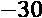
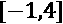

# 九、多元预测和敏感性分析的解释方法

通过这本书，我们已经了解了我们可以用来解释监督学习模型的各种方法。它们可以非常有效地评估模型，同时还能发现它们最有影响力的预测因素和隐藏的相互作用。但是正如监督学习这个术语所暗示的，这些方法只能利用已知的样本和基于这些已知样本分布的排列。然而，当这些样本代表过去时，事情就变得棘手了！正如诺贝尔物理学奖获得者尼尔斯·玻尔的一句名言所说，“预测是非常困难的，尤其是关于未来的预测。”

事实上，当你看到时间序列中的数据点波动时，它们可能会以一种可预测的模式有节奏地跳舞——至少在最好的情况下是这样。就像舞者随着节拍移动一样，每个重复的动作(或频率)都可以归因于季节模式，而音量(或振幅)的逐渐变化则归因于同样可预测的趋势。这种舞蹈不可避免地会产生误导，因为拼图中总有缺失的部分会略微改变数据点，比如某个供应商的供应链出现延迟，导致今天的销售数据出现意外下降。更糟糕的是，还有十年一遇、一代人一遇的不可预见的灾难性事件，或者简单地说，曾经发生过的事件，可以从根本上使时间序列中多少有些理解的运动变得无法识别，就像交际舞者癫痫发作一样。例如，在 2020 年，各地的销售预测，无论是好是坏，都被新冠肺炎弄得毫无用处！

我们可以称之为极端异常事件，但我们必须认识到，模型不是为了预测这些重大事件而建立的，因为它们是在几乎完全可能发生的情况下训练的。不预测这些不太可能但最重要的事件，是我们一开始就不应该如此信任预测模型的原因，尤其是在不讨论确定性或置信界限的情况下。

本章将用**长短期记忆** ( **LSTM** )模型检验一个多变量预测问题。我们将首先使用传统解释方法评估模型，然后使用我们在第 8 章[](B16383_08_ePub_RK.xhtml#_idTextAnchor162)**可视化卷积神经网络*中了解到的**积分梯度**方法，来生成我们模型的局部属性。但更重要的是，我们将更好地理解 LSTM 的学习过程和局限性。然后我们将采用一种预测近似法和 SHAP 的内核解释器来进行全局和局部解释。最后，*预测和不确定性在本质上是联系在一起的*，而*敏感性分析*是一系列旨在测量模型输出相对于其输入的不确定性的方法，因此它在预测场景中非常有用。我们还将研究两种这样的方法: **Morris** 用于*因素优先级*和 **Sobol** 用于*因素固定*，其中涉及到成本敏感性。*

 *以下是我们将要讨论的主要话题:

*   用传统解释方法评估时间序列模型
*   用综合梯度生成 LSTM 属性
*   用 SHAP 的内核解释器计算全局和局部属性
*   通过因素优先级确定有影响的特征
*   用固定因子量化不确定性和成本敏感性

# 技术要求

本章的示例使用了`mldatasets`、`pandas`、`numpy`、`sklearn`、`statsmodels`、`tensorflow`、`matplotlib`、`seaborn`、`alibi`、`distython`、`shap`和`SALib`库。关于如何安装所有这些库的说明可以在本书的前言中找到。本章的代码位于以下位置:https://github . com/packt publishing/Interpretable-Machine-Learning-with-Python/tree/master/chapter 09。

# 使命

公路交通拥堵是一个影响世界各地城市的问题。随着发展中国家的人均汽车数量稳步增长，但道路和停车基础设施却不足以跟上这一增长速度，交通拥堵一直在以惊人的速度增长。在美国，人均汽车统计数据是世界上最高的之一(2019 年每千人 838 辆)。因此，在全球 381 个城市中，美国城市占了 62 个。具有至少 15%的拥塞等级。

明尼阿波利斯就是这样一个城市(见下面的截图),那里的门槛最近被超过了，而且还在继续上升。将这个大都市地区放在上下文中，拥堵水平超过 50%是非常严重的，但中度拥堵(15-25%)已经是严重拥堵即将到来的警告信号。一旦拥堵率达到 25%，就很难逆转，因为如果不进一步中断交通，任何基础设施的改善都将耗资巨大。最严重的拥堵点之一是 94 号州际公路(I-94)上明尼阿波利斯和圣保罗这两座双城之间的路段，由于通勤者试图减少旅行时间，这些路段拥堵了备用路线。了解到这一点，这两个城市的市长都获得了一些联邦资金来扩建高速公路:


图 9.1-TomTom 2019 年明尼阿波利斯交通指数

市长们希望能够宣扬一个完整的扩张作为一个共同的成就，以获得连任。然而，他们很清楚，嘈杂、肮脏和阻碍性的扩建对通勤者来说可能是一个大麻烦，所以如果不将其变得几乎看不见，建设项目可能会在政治上适得其反。因此，他们规定建筑公司尽可能在其他地方预制，只在低产量时段组装。这些小时每小时不到 1500 辆车。他们一次只能在高速公路的一个方向上工作，并且在工作时只能阻挡不超过一半的车道。为了确保遵守这些规定，如果任何时候交通量超过这个阈值，他们将对公司处以罚款，每辆车的罚款率为。

除此之外，如果施工人员在现场时高速公路超过了一半的通行能力，他们将花费天。从这个角度来看，在典型的高峰时段堵塞可能会花费他们每小时的费用，外加的每日费用！地方当局将使用沿线的**自动交通记录仪** ( **ATR** )站来监控交通量，以及当地交警在车道因施工而受阻时进行登记。

它被规划为一个两年的建设项目；第一年将扩大 I-94 路线的西行车道，而第二年将扩大东行车道。施工的现场部分将只在 5 月至 10 月进行，因为在这几个月降雪不太可能延误施工。在今年剩下的时间里，他们将专注于预制。他们会试图在工作日工作，只是因为工会协商出了丰厚的周末加班费。因此，只有在出现重大延误的情况下，周末施工才会发生。然而，工会同意在 5 月到 10 月的假期中以同样的工资率工作。

建筑公司不想冒任何风险！因此，他们需要一个模型来预测 I-94 路线的交通，更重要的是，了解哪些因素会产生不确定性并可能增加成本。他们已经雇了一个机器学习专家来做这件事:你！

建筑公司提供的 ATR 数据包括截至 2018 年 9 月的每小时交通量，以及同一时间尺度的天气数据。它只包括向西的车道，因为扩建是第一位的。此外，自 2015 年以来，高峰时段的拥堵情况变得更加严重，这已经成为通勤者的新常态。因此，他们只对用 3 年的数据训练模型感兴趣。

# 走近

你用近两年半的数据(2015 年 10 月至 2018 年 3 月)训练了一个双向 LSTM 模型。您为测试预留了最后 13 周(2018 年 7 月至 9 月)，为验证预留了之前的 13 周(2018 年 4 月至 6 月)。这是有意义的，因为组合测试和验证数据集与公路扩建项目的预期条件(5 月至 10 月)非常吻合。您想知道如何使用仅利用代表这些条件的数据的其他拆分方案，但是您不想如此大幅度地减少训练数据，也许他们可能需要它来进行冬季预测。回顾窗口定义了时间序列模型可以访问多少过去的数据。您选择 672 小时(4 周)作为回顾窗口大小，因为随着模型向前发展，它可以了解每日和每周的季节性，以及一些只能在几周内观察到的趋势和模式。你还用 168 小时(1 周)的回顾训练了另一个模型作为备份。您概述了以下步骤来满足客户的期望:

1.  通过 *RMSE* 、*回归图*、*混淆矩阵*以及更多，您将访问模型的预测性能，更重要的是，误差是如何分布的。
2.  使用*集成梯度*，您将了解您是否采取了最佳建模策略，因为它可以帮助您可视化模型的每个决策路径，并帮助您基于此选择模型。
3.  使用 *SHAP 的内核解释器*和预测近似方法，您将获得对所选模型有影响的特征的全局和局部理解。
4.  通过*莫里斯敏感度分析*，您将确定*因素优先级*，该优先级根据因素(换句话说，特征)对输出可变性的影响程度对其进行排序。
5.  使用 *Sobol 敏感度分析*，您将计算*因子修正*，这有助于确定哪些因子没有影响。它通过量化输入因素对输出可变性的贡献和相互作用来做到这一点。这样，您可以了解哪些不确定因素可能对潜在罚款和成本影响最大，从而产生基于方差的成本敏感性分析。

# 筹建处

你可以在这里找到这个例子的代码:[https://github . com/packt publishing/Interpretable-Machine-Learning-with-Python/blob/master/chapter 09/traffic . ipynb](https://github.com/PacktPublishing/Interpretable-Machine-Learning-with-Python/blob/master/Chapter09/Traffic.ipynb)。

## 加载库

若要运行此示例，您需要安装以下库:

*   `mldatasets`加载数据集
*   `pandas`和`numpy`来操纵数据集
*   `tensorflow`加载模型
*   `statsmodels`、`sklearn` (scikit-learn)、`matplotlib`、`seaborn`、`alibi`、`distython`、`shap`和`SALib`创建并可视化解释

您应该首先加载它们:

```
import math
import os
import mldatasets
import pandas as pd
import numpy as np
import tensorflow as tf
from tensorflow import keras
from tensorflow.keras.preprocessing.sequence import TimeseriesGenerator
from keras.utils.data_utils import get_file
from sklearn.preprocessing import MinMaxScaler
from sklearn import metrics
from statsmodels.tsa.seasonal import seasonal_decompose
from statsmodels.tsa.stattools import acf
import matplotlib.pyplot as plt
import seaborn as sns
from alibi.explainers import IntegratedGradients
from distython import HEOM
import shap
from SALib.sample import morris as ms
from SALib.analyze import morris as ma
from SALib.plotting import morris as mp
from SALib.sample.saltelli import sample as ss
from SALib.analyze.sobol import analyze as sa
from SALib.plotting.bar import plot as barplot 
```

让我们使用`print(tf.__version__)`命令检查 TensorFlow 是否加载了正确的版本。应该是 2.0 以上。

## 了解和准备数据

在下面的代码片段中，我们将数据加载到名为`traffic_df`的 DataFrame 中。请注意，`prepare=True`参数很重要，因为它执行必要的任务，例如将其子集化到自 2015 年 10 月以来所需的时间范围、一些插值、校正假日以及执行一次性编码:

```
traffic_df = mldatasets.load("traffic-volume", prepare=True) 
```

应该有超过 25，000 条记录和 15 列。我们可以用`traffic_df.info()`来验证这一点:

```
<class 'pandas.core.frame.DataFrame'>
DatetimeIndex: 25656 entries, 2015-10-28 00:00:00 to 2018-09-30 23:00:00
Data columns (total 15 columns):
 #   Column           Non-Null Count  Dtype  
---  ------           --------------  -----  
 0   dow              25656 non-null  int64  
 1   hr               25656 non-null  int64  
 2   temp             25656 non-null  float64
 3   rain_1h          25656 non-null  float64
 4   cloud_coverage   25656 non-null  float64
 5   is_holiday       25656 non-null  int64  
 6   traffic_volume   25656 non-null  float64
 7   weather_Clear    25656 non-null  uint8  
 8   weather_Clouds   25656 non-null  uint8  
 9   weather_Haze     25656 non-null  uint8  
 10  weather_Mist     25656 non-null  uint8  
 11  weather_Other    25656 non-null  uint8  
 12  weather_Rain     25656 non-null  uint8  
 13  weather_Snow     25656 non-null  uint8  
 14  weather_Unknown  25656 non-null  uint8  
dtypes: float64(4), int64(3), uint8(8)
memory usage: 1.8 MB
```

前面的输出是正确的。所有的特征都是数字，没有缺失值，分类特征已经为我们一次性编码。

### 数据字典

只有八个特征，但由于分类编码，它们变成了 15 列:

*   `dow`:序数；从星期一开始的星期几(在之间)
*   `hr`:序数；一天中的小时(在之间)
*   `temp`:连续；以摄氏度表示的平均温度(在和之间)
*   `rain_1h`:连续；小时降雨量(在之间)
*   `cloud_coverage`:连续；云覆盖的百分比(在之间)
*   `is_holiday`:二进制；周一至周五是国家法定假日还是法定假日(表示是，表示否)？
*   `traffic_volume`:连续、目标、交通量
*   `weather`:绝对的；该小时天气的简短描述(晴|云|霾|雾|雨|雪|未知|其他)

### 理解数据

理解时间序列问题的第一步是理解目标变量。这是因为它决定了你如何处理其他事情，从数据准备到建模。目标变量很可能与时间有特殊关系，如季节性变化或趋势。

#### 了解周

首先，我们可以从每个季节抽取一个 168 小时的时间段，以便更好地理解一周中各天之间的差异，然后了解它们在不同季节和假期之间的变化情况:

```
fig, (ax0,ax1,ax2,ax3) = plt.subplots(4,1, figsize=(15,8))
plt.subplots_adjust(top = 0.99, bottom=0.01, hspace=0.4)
traffic_df[:168].traffic_volume.plot(ax=ax0)
traffic_df[(168*13):(168*14)].traffic_volume.plot(ax=ax1)
traffic_df[(168*26):(168*27)].traffic_volume.plot(ax=ax2)
traffic_df[(168*39):(168*40)].traffic_volume.plot(ax=ax3)
```

上述代码生成下图所示的地块。如果你从左往右看，你会发现它们都是从周三开始，到下一周的周二结束。一周的每一天都在低点开始和结束，中间有高点。工作日往往有两个高峰，分别对应上午和下午的高峰时间，而周末只有一个下午左右的高峰:


图 9.2–代表每个季节的交通流量的几个样本周时段

有一些主要的不一致，如 10 月 31 日星期六，这基本上是万圣节，不是官方假日。此外，2 月 2 日(星期二)是一场严重暴风雪的开始，8 月 27 日到 9 月 2 日这段时间比其他样本周更混乱。原来，在那一年，发生了国博会。像万圣节一样，它也不是联邦或地区性的节日，但值得注意的是，游乐场位于明尼阿波利斯和圣保罗之间。你还会注意到，在周五 29 日，有一个午夜交通高峰，这可以归因于这是明尼阿波利斯音乐会的大日子。

在比较时间序列中的时间段时，尝试解释这些不一致是一个很好的练习，因为它可以帮助您找出要添加到模型中的变量，或者至少知道缺少了什么。在我们的例子中，我们知道我们的`is_holiday`变量不包括万圣节或整个州博览会周，也没有大型音乐或体育赛事的变量。原始数据集有一个`snow_1h`变量，但是因为不可靠而被删除了。为了生成更健壮的模型，建议寻找可靠的外部数据源，并添加更多涵盖所有这些可能性的功能，更不用说验证现有变量了。目前，我们将利用现有资源。

#### 理解日

对于高速公路扩建项目来说，了解普通工作日的交通状况至关重要。施工人员将只在工作日(周一至周五)工作，除非他们遇到延误，在这种情况下，他们也将在周末工作。我们还必须区分假日和其他工作日，因为它们可能会有所不同。

为此，我们将创建一个 DataFrame ( `weekend_df`)并设计一个新列(`type_of_day`)，将小时编码为“假日”、“工作日”或“周末”的一部分然后，我们可以按此列和`hr`列进行分组，并用`mean`和标准差(`std`)进行聚合。然后我们可以`pivot`，这样我们就有一列显示每个`type_of_day`类别的平均和标准偏差流量，其中的行代表一天中的小时数(`hr`)。然后，我们可以绘制出最终的数据帧。我们可以用标准差来创建区间:

```
weekend_df =\
    traffic_df[['hr', 'dow', 'is_holiday', 'traffic_volume']].copy()
weekend_df['type_of_day'] = np.where(weekend_df.is_holiday == 1,\
    'Holiday', np.where(weekend_df.dow >= 5, 'Weekend', 'Weekday'))
weekend_df = weekend_df.groupby(['type_of_day','hr'])\
             ['traffic_volume'].agg(['mean','std']).\
             reset_index().pivot(index='hr', columns='type_of_day',\ 
                                 values=['mean', 'std'])
weekend_df.columns = [''.join(col).strip().replace('mean','')
                      for col in weekend_df.columns.values]
fig, ax = plt.subplots(figsize=(15,8))
weekend_df[['Holiday','Weekday','Weekend']].plot(ax=ax)
plt.fill_between(weekend_df.index,\
  np.maximum(weekend_df.Weekday - 2 * weekend_df.std_Weekday, 0),\
     weekend_df.Weekday + 2 * weekend_df.std_Weekday,\
     color='darkorange', alpha=0.2)
plt.fill_between(weekend_df.index,\
  np.maximum(weekend_df.Weekend - 2 * weekend_df.std_Weekend, 0),\
     weekend_df.Weekend + 2 * weekend_df.std_Weekend,
     color='green', alpha=0.1)
plt.fill_between(weekend_df.index,\
   np.maximum(weekend_df.Holiday - 2 * weekend_df.std_Holiday, 0),\
     weekend_df.Holiday + 2 * weekend_df.std_Holiday,
     color='cornflowerblue', alpha=0.1)
ax.axhline(y=5300, linewidth=3, color='red', dashes=(2,2))
ax.axhline(y=2650, linewidth=2, color='darkviolet', dashes=(2,2))
ax.axhline(y=1500, linewidth=2, color='teal', dashes=(2,2))
```

前面的代码片段产生了下面的图。它代表每小时的平均值，但是有相当多的变化，这就是为什么建筑公司要小心行事。绘制的水平线代表每个阈值:

*   满负荷 5300 英镑。
*   2，650 元的一半容量，之后，建筑公司将被罚款指定的每日金额。
*   1500 英镑是禁止施工的门槛，超过这个门槛，建筑公司将被处以规定的每小时罚款。

他们只想在周一至周五通常低于 1，500 的时段工作。这五个小时是晚上 11 点(前一天)到凌晨 4 点。如果他们必须在周末工作，该时间表通常会延迟到凌晨 1 点，并在早上 6 点结束。工作日期间的差异相当小，因此可以理解为什么建筑公司坚持只在工作日工作。在这些时间里，假期看起来与周末相似，但假期往往比周末变化更大，这可能会带来更多问题:


图 9.3-节假日、工作日和周末的平均每小时交通量，有时间间隔

通常，对于像这样的项目，您将探索预测变量到我们对目标所做的程度。这本书是关于模型解释的，所以我们将通过解释模型来了解预测因素。但是在我们进入模型之前，我们必须为它们准备数据。

### 数据准备

第一个数据准备步骤是将其分为训练集、验证集和测试集。请注意，测试数据集包含最后 13 周(`2184`小时)，而验证数据集包含之前的 13 周，因此它在数据帧最后一行之前的`4368`小时开始，在`2184`小时结束:

```
train = traffic_df[:-4368]
valid = traffic_df[-4368:-2184]
test = traffic_df[-2184:]
```

既然数据帧已经被分割，我们可以绘制它以确保它的各部分按照预期被分割。我们可以用下面的代码做到这一点:

```
plt.plot(train.index.values, train.traffic_volume.values,
        label='train')
plt.plot(valid.index.values, valid.traffic_volume.values,
        label='validation')
plt.plot(test.index.values, test.traffic_volume.values,
        label='test')
plt.ylabel('Traffic Volume')
plt.legend()
```

前面的代码产生了下面的图。它显示了为训练数据集分配了近 2 年的数据，以及大约 1/4 年的时间来验证和测试每个数据集。在本练习中，我们不会从这一点开始引用验证数据集，因为它仅在训练期间有助于在每个时期后评估模型的预测性能:


图 9.4–分为训练、验证和测试集的时间序列

下一步是最小-最大归一化数据。我们这样做是因为较大的值通常会导致所有神经网络的学习较慢，LSTMs 非常容易出现**爆炸和消失梯度**。相对统一和较小的数字有助于解决这些问题。我们将在本章后面讨论这一点，但基本上，网络要么在数值上变得不稳定，要么在达到全局最小值时变得无效。

我们可以用`scikit`包中的`MinMaxScaler`进行最小-最大归一化。现在，我们要做的就是`fit`缩放器，这样我们可以在需要的时候使用它们。我们将为我们的目标(`traffic_volume`)创建一个称为`y_scaler`的缩放器，并为整个数据集的其余变量(`X_scaler`)创建另一个缩放器，以便无论您使用的是哪一部分`train`、`valid`还是`test`，转换都是一致的。所有的`fit`过程所做的就是保存公式，使每个变量适合 0 和 1 之间的值:

```
y_scaler = MinMaxScaler()
y_scaler.fit(traffic_df[['traffic_volume']])
X_scaler = MinMaxScaler()
X_scaler.fit(traffic_df.drop(['traffic_volume'], axis=1)) 
```

现在，我们将使用我们的定标器`transform`训练和测试数据集，为每个数据集创建 *y* 和 *X* 对:

```
y_train = y_scaler.transform(train[['traffic_volume']])
X_train = X_scaler.transform(train.drop(['traffic_volume'], axis=1))
y_test = y_scaler.transform(test[['traffic_volume']])
X_test = X_scaler.transform(test.drop(['traffic_volume'], axis=1))
```

然而，对于时间序列模型，我们创建的 *y* 和 *X* 对没有用，因为每个观察都是一个时间步长。每个时间步长都比那个时间步长的变量多，但是之前的时间步长会有一定的滞后。因此，您必须为每个时间步长及其滞后生成一个数组。幸运的是，`keras`有一个名为`TimeseriesGenerator`的函数，它获取您的 *X* 和 *y* 并生成一个生成器，将数据提供给您的模型。您必须指定一个特定的`length`，这是滞后时间步长的数量(也称为`batch_size`是一个，但是我们使用 24，因为客户更喜欢一次获得 24 小时的预测，而且批量越大，训练和推断的速度也越快。

自然地，当你需要预测明天的时候，你将需要明天的天气，但是你可以用天气预报来完成时间步骤:

```
gen_train_672 = TimeseriesGenerator(X_train, y_train,\ 
                                    length=672,\
                                    batch_size=24)
gen_test_672 = TimeseriesGenerator(X_test, y_test, length=672,
                                   batch_size=24)
print("gen_train_672:%s×%s→%s" % (len(gen_train_672),
         gen_train_672[0][0].shape,
         gen_train_672[0][1].shape))
print("gen_test_672:%s×%s→%s" % (len(gen_test_672),
         gen_test_672[0][0].shape,
         gen_test_672[0][1].shape))
```

前面的代码片段输出训练生成器(`gen_train_672`)和测试生成器(`gen_test_672`)的维度，它们使用 672 的长度和 24 的批处理大小:

```
gen_train_672:  859 ×   (24, 672, 14)   →   (24, 1)
gen_test_672:   63  ×   (24, 672, 14)   →   (24, 1)
```

用 1 个月的回顾窗口训练的模型将需要这个生成器。每个生成器是对应于每个批次的元组列表。这个元组的索引 0 是`X`特征数组，而索引 1 是`y`标签数组。所以输出的第一个数字是列表的长度，也就是批次的数量。`X`和`y`阵列的尺寸如下。例如，`gen_train_672`有 859 个批次，每个批次有 24 个时间步长，长度为 672，有 14 个特征。从这 24 个时间步中预期的预测标签的形状是`(24,1)`。

现在，我们必须做同样的事情来为我们的 1 周回顾窗口模型准备发电机，它应该有 168 小时的`length`和相同的`batch_size`:

```
gen_train_168 = TimeseriesGenerator(X_train, y_train,\
                              length=168,
                              batch_size=24)
gen_test_168 = TimeseriesGenerator(X_test, y_test, length=168,
                              batch_size=24)
```

前面的代码为我们的 1 周回顾模型创建了生成器。最后，在继续处理模型和随机解释方法之前，让我们尝试通过初始化我们的随机种子来使事情更具可重复性:

```
rand = 9
os.environ['PYTHONHASHSEED']=str(rand)
tf.random.set_seed(rand)
np.random.seed(rand)
```

### 加载 LSTM 模型

我们可以快速加载第一个模型，并像这样输出它的摘要:

```
model_path = get_file('LSTM_traffic_672_final.hdf5',
   'https://github.com/PacktPublishing/Interpretable-Machine-Learning-with-Python/blob/master/models/LSTM_traffic_672_final.hdf5?raw=true')
lstm_traffic_672_mdl = keras.models.load_model(model_path)
lstm_traffic_672_mdl.summary()
```

正如您可以从前面代码片段生成的摘要中看出的，该模型以`(24, 672)`开始。24 对应于批量大小，而 672 意味着不是一个而是两个 336 单元的 LSTMs 以相反的方向在中间相遇。它有一个 10%的`dropout`，然后是一个带有单个 ReLu 激活单元的`dense`层。ReLu 确保所有预测都大于零，因为负流量没有意义:

```
Model: "Traffic_Bidirectional_LSTM_672"
_________________________________________________________________
Layer (type)                 Output Shape              Param #   
=================================================================
Bidir_LSTM (Bidirectional)   (24, 672)                 943488    
_________________________________________________________________
Dropout (Dropout)            (24, 672)                 0         
_________________________________________________________________
Dense (Dense)                (24, 1)                   673       
=================================================================
Total params: 944,161
Trainable params: 944,161
Non-trainable params: 0
_________________________________________________________________
```

然后，您可以用同样的方式加载第二个模型，并打印它的`summary()`:

```
model_path = get_file('LSTM_traffic_168_final.hdf5',
   'https://github.com/PacktPublishing/Interpretable-Machine-Learning-with-Python/blob/master/models/LSTM_traffic_168_final.hdf5?raw=true')
lstm_traffic_168_mdl = keras.models.load_model(model_path)
lstm_traffic_168_mdl.summary()
```

前面的代码生成的摘要是针对单向 LSTM 模型的，在对应于 168 小时回顾窗口的`LSTM`层中有 168 个单元。它有 15%的压降和一个带有单个 ReLu 激活单元的`dense`层。请注意，该模型比双向模型小近 8 倍，这是有意义的，因为它的参数几乎少了 8 倍:

```
Model: "Traffic_LSTM_168"
_________________________________________________________________
Layer (type)                 Output Shape              Param #   
=================================================================
LSTM (LSTM)                  (24, 168)                 122976    
_________________________________________________________________
Dropout (Dropout)            (24, 168)                 0         
_________________________________________________________________
Dense (Dense)                (24, 1)                   169       
=================================================================
Total params: 123,145
Trainable params: 123,145
Non-trainable params: 0
_________________________________________________________________
```

为了简单起见，从这一点开始，我们将把在 4 周回顾窗口上训练的双向 LSTM 称为“672 模型”另一方面，具有 1 周窗口的单向 LSTM 将是“168 模型”现在，让我们使用传统的解释方法来评估这两个模型。

# 用传统解释方法评估时间序列模型

时序回归器模型可以像评估任何回归模型一样进行评估；也就是说，使用从**均方误差**或 **r 平方**得分得出的指标。当然，在某些情况下，您需要使用带有中位数、对数、偏差或绝对值的指标。这些型号不需要这些。

### 使用标准回归指标

`evaluate_reg_mdl`函数可以评估模型，输出一些标准的回归度量，并绘制它们。该模型的参数为拟合模型(`lstm_traffic_672_mdl`)、`X_train` ( `gen_train_672`)、`X_test` ( `gen_test_672`)、`y_train`和`y_test`。

可选地，我们可以指定一个`y_scaler`,以便用逆变换的标签评估模型，这产生了图和`y_truncate=True`,因为我们的`y_train`和`y_test`比预测的标签具有更大的维度。出现这种差异的原因是，由于回望窗口，第一次预测发生在数据集中第一个时间步长之后的几个时间步长。因此，我们需要从`y_train`中减去这些时间步长，以匹配`gen_train_672`的长度。

我们现在将使用以下代码评估这两个模型。为了观察预测的进展，我们将使用`predopts={"verbose":1}`。请注意第一个模型的推断需要多长时间(`lstm_traffic_672_mdl`):

```
print(lstm_traffic_672_mdl.name)
y_train_pred_672, y_test_pred_672, y_train_672, y_test_672 =\
 mldatasets.evaluate_reg_mdl(lstm_traffic_672_mdl, gen_train_672,\ 
             gen_test_672, y_train, y_test, scaler=y_scaler,\
             y_truncate=True,  predopts={"verbose":1}) 
print(lstm_traffic_168_mdl.name)
y_train_pred_168, y_test_pred_168, y_train_168, y_test_168 =\   
  mldatasets.evaluate_reg_mdl(lstm_traffic_168_mdl, gen_train_168,\
             gen_test_168, y_train, y_test, scaler=y_scaler, 
             y_truncate=True, predopts={"verbose":1})
```

前面的代码片段生成了下图所示的图表和指标。它们都有相似的性能指标，除了 168 型过度拟合更多，因为训练 RMSE 明显更好。“回归图”本质上是观测交通量与预测交通量的散点图，符合线性回归模型，以显示它们的匹配程度。这些图表明，当模型 672 的流量明显较高时，它倾向于预测零流量。除此之外，模型 168 有更多极端的异常点，但模型 672 倾向于向最高交通量偏离更多一点:


图 9.5–两种模型的预测性能评估

我们还可以通过比较观测流量和预测流量来评估我们的模型。这将有助于按小时和日期类型分解错误。为此，我们可以用这些值创建数据框架，每个模型一个。但是首先，我们必须截断 DataFrame ( `-y_test_pred_672.shape[0]`)，使其与预测数组的长度相匹配，并且我们不需要所有的列，所以我们只为我们感兴趣的列提供索引:`traffic_volume`是第 6 个，但是我们也需要`dow` (#0)、`hr` (#1)和`is_holiday` (#5)。我们将把`traffic_volume`重命名为`actual_traffic`，并用我们的预测创建一个名为`predicted_traffic`的新列。然后，我们将设计一个`type_of_day`列，就像我们之前做的那样，它告诉我们今天是假日、工作日还是周末。最后，我们可以删除`dow`和`is_holiday`列，因为我们不需要它们:

```
evaluate_672_df = test.iloc[-y_test_pred_672.shape[0]:,[0,1,5,6]].\
            rename(columns={'traffic_volume':'actual_traffic'})
evaluate_672_df['predicted_traffic'] = y_test_pred_672
evaluate_672_df['type_of_day'] =\
          np.where(evaluate_672_df.is_holiday == 1, 'Holiday',\           np.where(evaluate_672_df.dow >= 5, 'Weekend', 'Weekday'))
evaluate_672_df.drop(['dow','is_holiday'], axis=1, inplace=True) 
```

我们将所有的672 替换为 168，并运行相同的代码，但用于另一个型号。您可以通过使用`evaluate_672_df`或`evaluate_168_df`运行单元格来快速查看数据帧的内容。两者都应该有 4 列。

#### 预测误差聚合

可能一天中的某些日子和时间更容易出现预测错误。为了更好地理解这些误差是如何在时间上分布的，我们可以以每小时为基础绘制 RMSE 图，并用`type_of_day`分割。为此，我们必须首先定义一个`rmse`函数，然后通过`type_of_day`和`hr`对每个模型的评估数据帧进行分组，并使用`apply`函数通过`rmse`函数进行聚合。然后我们可以旋转以确保每个`type_of_day`每小时都有一列 RMSEs。然后，我们可以对这些列进行平均，并将它们存储在一个`Series`中:

```
def rmse(g):
 rmse = np.sqrt(metrics.\
     mean_squared_error(g['actual_traffic'],
                    g['predicted_traffic']))
 return pd.Series({'rmse': rmse})|
evaluate_by_hr_672_df = evaluate_672_df.\
      groupby(['type_of_day', 'hr']).apply(rmse).reset_index().\
      pivot(index='hr', columns='type_of_day', values='rmse')
evaluate_by_hr_168_df = evaluate_168_df.\
      groupby(['type_of_day', 'hr']).apply(rmse).reset_index().\
      pivot(index='hr', columns='type_of_day', values='rmse')
mean_by_daytype_672_s = evaluate_by_hr_672_df.mean(axis=0)
mean_by_daytype_168_s = evaluate_by_hr_168_df.mean(axis=0)
```

现在我们已经有了数据帧，包括节假日、工作日和周末的每小时 RMSEs，以及这些“类型”日的平均值，我们可以绘制它们了。我们将创建两个`subplots`:一个用于 672 型，另一个用于 168 型。然后我们将在这些支线剧情上`plot`数据帧。我们还将使用`mean_by_daytype`熊猫系列中每个`type_of_day`的平均值创建水平虚线:

```
fig, (ax0,ax1) = plt.subplots(2, 1, figsize=(15,10))
plt.subplots_adjust(top = 0.99, bottom=0.01, hspace=0.2)
evaluate_by_hr_672_df.plot(ax=ax0)
ax0.set_title('672 model: Hourly RMSE distribution', fontsize=16)
ax0.set_ylim([0,2500])
ax0.axhline(y=mean_by_daytype_672_s.Holiday, linewidth=2,
          color='cornflowerblue', dashes=(2,2))
ax0.axhline(y=mean_by_daytype_672_s.Weekday, linewidth=2,
          color='darkorange', dashes=(2,2))
ax0.axhline(y=mean_by_daytype_672_s.Weekend, linewidth=2,
          color='green', dashes=(2,2)) 
evaluate_by_hr_168_df.plot(ax=ax1)
ax1.set_title('168 model: Hourly RMSE distribution', fontsize=16)
ax1.set_ylim([0,2500])
ax1.axhline(y=mean_by_daytype_168_s.Holiday, linewidth=2,
   color='cornflowerblue', dashes=(2,2))
ax1.axhline(y=mean_by_daytype_168_s.Weekday, linewidth=2,
   color='darkorange', dashes=(2,2))
ax1.axhline(y=mean_by_daytype_168_s.Weekend, linewidth=2,
   color='green', dashes=(2,2))
```

前面的代码生成了下图所示的图形。正如我们所看到的，模型 168 在一天中的所有类型和时间都具有持续较低的 RMSE，至少在测试数据集所代表的一年中的时间是如此。然而，这可能意味着一个模型高估了交通量，高估不如低估糟糕:


图 9.6–两种模式下按日类型划分的每小时 RMSE

#### 像评估分类问题一样评估它

事实上，就像分类问题可能有假阳性和假阴性，并且也意识到一个比另一个成本更高，您可以用低估和高估等概念来构建任何回归问题。当一个比另一个更昂贵时，这种框架特别有用。如果你有明确定义的阈值，就像我们在这个项目中所做的那样，你可以像评估一个分类问题一样评估任何回归问题。我们将使用具有一半容量和无建设阈值的混淆矩阵来评估这两个模型。为了实现这一点，我们可以`for`循环两个模型评估数据帧，并使用`np.where`获得实际值和预测值何时超过每个阈值的二进制数组。然后我们可以使用`compare_confusion_matrices`函数来比较每个模型的混淆矩阵:

```
evaluate_dfs = [evaluate_672_df, evaluate_168_df]
lookbacks = [672, 168] 
for e in range(2):
 evaluate_df = evaluate_dfs[e]
 lb = lookbacks[e] 
 actual_over_half_cap = np.where(evaluate_df['actual_traffic'] >\
         2650, 1, 0)
 pred_over_half_cap = np.where(evaluate_df['predicted_traffic'] >\
         2650, 1, 0)
 actual_over_nc_thresh = np.where(evaluate_df['actual_traffic'] >\
         1500, 1, 0)
 pred_over_nc_thresh = np.where(evaluate_df['predicted_traffic'] >\
         1500, 1, 0)
 mldatasets.\
  compare_confusion_matrices(actual_over_half_cap,\
     pred_over_half_cap, actual_over_nc_thresh, pred_over_nc_thresh,
     str(lb)+' model: Over Half-Capacity',\
   str(lb)+' model: Over No-Construction Threshold')
```

前面的代码片段生成了下图所示的混淆矩阵。我们最感兴趣的是假阴性的百分比，因为预测没有流量超过阈值，而事实上，流量确实超过了阈值，这将导致高额罚款。另一方面，误报的代价是在交通根本没有上升到阈值以上时先发制人地离开建筑工地。不过，安全总比后悔好！如果比较“不建设”门槛的假阴性，672 模型(1.32%)比 168 模型(0.64%)高一倍。对于半容量阈值，672 模型的假阴性百分比低于 162 模型。最终，最重要的是禁止建设的门槛:


图 9.7–两种模型的超过一半和无构造阈值的混淆矩阵

既然我们已经利用传统方法理解了模型的决策，让我们继续一些更高级的模型不可知的方法。

# 生成具有集成梯度的 LSTM 属性

我们首先在 [*第八章*](B16383_08_ePub_RK.xhtml#_idTextAnchor162) *中了解到**积分梯度** ( **IG** )，可视化卷积神经网络*。与该章中研究的其他基于梯度的属性方法不同，路径集成梯度不依赖于卷积层，也不限于分类问题。事实上，由于它计算的是输入沿路径的梯度平均值，输入和输出可以是任何值！通常使用具有 CNN 和**递归神经网络** ( **RNNs** )的集成梯度，就像我们在本章中解释的那样。坦率地说，当你在网上看到一个 IG LSTM 的例子时，它有一个嵌入层，是一个 NLP 分类器，但 IG 可以非常有效地用于 LSTM，甚至处理声音或基因数据！

集成的梯度解释器和我们将继续使用的解释器可以访问流量数据集的任何部分。首先，让我们为它和两个模型创建一个生成器:

```
y_all = y_scaler.transform(traffic_df[['traffic_volume']])
X_all = X_scaler.transform(traffic_df.drop(['traffic_volume'],\     
                           axis=1))
gen_all_672 = TimeseriesGenerator(X_all, y_all, length=672,\
                                  batch_size=24)
gen_all_168 = TimeseriesGenerator(X_all, y_all, length=168,\
                                  batch_size=24)
```

综合梯度是一种局部解释方法。因此，让我们来看几个我们可以解释的“感兴趣的实例”。我们知道假期是一个关注点，所以让我们看看我们的模型是否理解了`is_holiday`的重要性。此外，早上也是一个问题，尤其是因为天气原因，早上的高峰时间比平均时间长，所以我们有一个例子(`peak_morning_s`)。最后，热天可能会有更多的交通流量，尤其是在周末(`hot_saturday_s`):

```
X_df = traffic_df.drop(['traffic_volume'], axis=1).\
                                             reset_index(drop=True) 
holiday_afternoon_s = X_df[(X_df.index >= 23471) & (X_df.dow==0) &\
       (X_df.hr==16) & (X_df.is_holiday==1)]
peak_morning_s = X_df[(X_df.index >= 23471) & (X_df.dow==2) &\
      (X_df.hr==8) & (X_df.weather_Clouds==1) &\
      (X_df.temp<20)]
hot_saturday_s = X_df[(X_df.index >= 23471) & (X_df.dow==5) &\
      (X_df.hr==12) & (X_df.temp>29)]
```

现在我们已经创建了一些实例，让我们实例化我们的解释器。`alibi`包中的`IntegratedGradients`只需要深度学习模型，但建议设置若干步(`n_steps`)用于积分逼近和`internal_batch_size`。我们将为每个模型实例化一个解释器:

```
ig_672 = IntegratedGradients(lstm_traffic_672_mdl,
                         n_steps=25, internal_batch_size=24)
ig_168 = IntegratedGradients(lstm_traffic_168_mdl,
                         n_steps=25, internal_batch_size=24)
```

在我们迭代我们的样本和解释器之前，重要的是认识到我们需要如何将样本输入到解释器，因为它需要一批 24 个。为此，我们必须在扣除回看窗口(`nidx`)后得到样本的指数。然后，您可以从生成器(`gen_all_672`)获得该样本的批次。每个批次包括 24 个时间步长，因此您将`nidx`除以 24 ( `nidx//24`)以获得该样本的批次位置。一旦你得到了样品的批次(`batch_X`)并打印出形状`(24, 672, 14)`，你就不会对第一个数字是 24 感到惊讶了。当然，我们需要获取批次中样本的索引(`nidx%24`)以获得该样本的数据:

```
nidx = holiday_afternoon_s.index.tolist()[0] – 672
batch_X = gen_all_672[nidx//24][0]
print(batch_X.shape) 
```

IG 过程相当慢，所以我们将只迭代前两个示例实例。`for`循环将使用之前解释的方法定位样本批次(`batch_X`)。该`batch_X`被输入到`explain`功能中。这是因为这是一个回归问题，没有目标类；也就是`target=None`。一旦产生了解释，`attributions`属性将具有整批的属性。我们只能获得这个样本，然后用`transpose`产生一个形状为`(14, lb)`的图像。`for`循环中的其余代码只是简单地让获得用于刻度线的标签，然后绘制一个图像，该图像被拉伸以适合`figure`的尺寸，以及它的标签:

```
samples = [holiday_afternoon_s, peak_morning_s]
sample_names = ['Holiday Afternoon', 'Peak Morning']
igs = [ig_672, ig_168]
lbs = [672, 168] 
for s in range(len(samples)):
 for i in range(len(igs)): 
  nidx = samples[s].index.tolist()[0] – lb
  lb = lbs[i]
  if lb == 672:
   batch_X = gen_all_672[nidx//24][0]
   p = 5 #Create 5 tick marks…
   f = '7D' #seperated by 1 week periods
  else:
   batch_X = gen_all_168[nidx//24][0]
   p = 8 #Create 8 tick marks…
   f = '1D' #seperated by 1 day periods   
  explanation = igs[i].explain(batch_X, target=None)
  attributions = explanation.attributions
  attribution_img = np.transpose(attributions[nidx%24,:,:])  
  end_date = traffic_df.iloc[samples[s].index].\
        index.to_pydatetime()[0]
  date_range = pd.date_range(end=end_date, periods=p,\
                          freq=f).to_pydatetime().tolist()
  columns = samples[s].columns.tolist()  
  plt.title('Integrated Gradient Attribution Map for {} for the {} model'.\
     format(sample_names[s], lb), fontsize=16)
  plt.imshow(attribution_img, interpolation='nearest',\
         aspect='auto', cmap='plasma')
  plt.xticks(np.linspace(0,672,p).astype(int), labels=date_range)
  plt.yticks([*range(14)], labels=columns)
  plt.colorbar(pad=0.01,fraction=0.02,anchor=(1.0,0.0))
  plt.show()
```

前面的代码将生成如图*图 9.8* 和*图 9.9* 所示的图。在 y 轴上，您可以看到变量名，而在 x 轴上，您可以看到与相关样品的回顾窗口相对应的日期。x 轴最右边的部分是样本的日期，当你向左移动时，你就回到了过去。例如，假日下午样本是 9 月 3 日下午 4 点，对于 672 模型，有 4 周的回顾时间，因此每个向后的刻度标记是该日期之前的一周。168 型号只有一周的回顾时间，因此每个刻度线代表一天:


图 9.8–两种模型的假日下午带注释的综合梯度属性图

你可以通过*图 9.8* 中属性图的强度来判断哪个小时/变量对预测有影响。每个属性图右侧的颜色条可以作为一个键。负数对应较深的颜色和负相关，而正数对应较浅的颜色和正相关。然而，有一点非常明显，那就是随着时间的推移，强度会逐渐减弱。你可以看出，672 型号是双向的，两端都有这种情况，这是有道理的，因为它是双向的。令人惊讶的是这种情况发生得如此之快。

至于图 9.9 的*中的“高峰早晨”，归因是有意义的，因为两个模型都意识到在之前下雨和多云之后天气变晴，这导致高峰时间快速达到高峰，而不是缓慢增加。在一定程度上，LSTM 已经知道只有最近的天气才是重要的——不超过两三天的天气。然而，这并不是综合梯度消失的唯一原因。它们也会因为**消失渐变问题**而褪色。这个问题发生在反向传播期间，因为梯度值在每一步中都乘以权重矩阵，所以梯度可以指数下降到零:*


图 9.9–两种模型的峰值早晨的注释综合梯度属性图

我们的 LSTMs 被组织成一个非常长的序列，使得网络在捕获长期依赖关系时更加无效。幸运的是，这些 LSTMs 对于任何一个模型都是`is_holiday`。原来*图 9.9* 中的 9 月 3 日(劳动节)距离上一个节日(独立日)近 2 个月，是一个比较喜庆的节日。有没有可能模型没有发现这些模式？

我们可以尝试根据交通模式对假期进行细分，看看这是否有助于模型识别它们。我们还可以对以前的天气状况进行滚动汇总，使模型更容易获得最近的天气模式。天气模式跨越几个小时，因此汇总起来很直观，更不用说更容易解释了。解释方法可以为我们指出如何改进模型的正确方向，当然还有很大的改进空间。

鉴于我们从每小时 RMSE 分布、混淆矩阵和 IG 归因图中学到的东西，毫无疑问 168 模型是更好的模型。它在工作时间内具有较低的 RMSEs 和较低的超过无施工阈值的假阴性率。至于 IG 归因图，它们表明一周的回顾并不太短，因为 672 模型在超过 3 周的时间里除了空归因什么也没有。也就是说，我们将继续使用 672 模型，因为它有更多的缺陷，这是一个更有趣的用例！下面的代码将确保我们使用的是 672 型，但是您可以随时使用 168 重新运行所有代码并进行比较:

```
lookback = 672
gen_all = gen_all_672
lstm_traffic_mdl = lstm_traffic_672_mdl
```

接下来，我们将尝试基于排列的方法！

# 用 SHAP 的内核解释器计算全局和局部属性

置换方法对输入进行更改，以评估它们将对模型的输出产生多大的差异。我们首先在 [*第 4 章*](B16383_04_ePub_RK.xhtml#_idTextAnchor081) 、*功能重要性和影响的基础*中讨论了这一点，但是如果您还记得的话，有一个联盟框架来执行这些排列，这将在不同的功能联盟中产生每个功能的平均边际贡献。这个过程的结果是**匀称的值**，它具有基本的数学属性，如可加性和对称性。不幸的是，对于不小的数据集，计算 shapely 值的成本很高，因此 SHAP 图书馆有近似方法。其中一种方法是 **KernelExplainer** ，我们在 [*第 5 章*](B16383_05_ePub_RK.xhtml#_idTextAnchor106) *【全局模型不可知解释方法】中使用过。它用加权局部线性回归来逼近 Shapely 值，就像 LIME 一样。*

#### 为什么要使用 KernelExplainer？

我们有一个深度学习模型，那么我们为什么不使用 SHAP 的**深度解释器**就像我们在 [*第八章*](B16383_08_ePub_RK.xhtml#_idTextAnchor162) *中使用 CNN 一样，可视化卷积神经网络*？DeepExplainer 采用了 DeepLIFT 算法来逼近 Shapely 值。它可以很好地与任何用于表格数据、CNN 和带有嵌入层的 RNNs 的前馈网络配合使用，例如用于 NLP 分类器的网络，甚至用于检测基因组序列。对于多元时间序列来说，这变得更加棘手，因为 DeepExplainer 不知道如何处理输入的三维数组。即使有，它也包括以前时间步长的数据，因此您不能在不考虑以前时间步长的情况下改变一个时间步长。例如，如果排列指示温度低了 5 度，这难道不应该影响所有先前时间步的温度直到某个小时吗？如果低 20 度呢？难道这不意味着它很可能在一个完全不同的季节，有完全不同的天气——也许更多的云和雪？

SHAP 的 KernelExplainer 可以接收任何任意的黑盒预测函数。它还对输入维度进行假设。幸运的是，我们可以在输入数据被允许之前对其进行更改，这让 KernelExplainer 看起来像是在处理一个表格数据集。任意预测函数不必简单地调用模型的预测函数——它可以在输入和输出的过程中改变数据！

#### 定义策略以使其与多元时间序列模型一起工作

为了根据置换的输入数据模拟过去可能的天气模式，我们可以创建一个生成模型或类似的东西。这种策略将帮助我们生成适合置换时间步长的各种过去时间步长，以及为特定类生成图像。虽然这可能会导致更准确的预测，但我们不会使用这种策略，因为它非常耗时。

相反，我们将从我们的`gen_all`生成器中找到最适合置换输入的时间序列数据。我们可以使用距离度量来找到最接近置换输入的那个。然而，我们必须放置一些护栏，因为如果排列是在星期六早上 5 点，温度为 27 摄氏度，云覆盖率为 90%，那么最接近的观测可能是在星期五早上 7 点，但不管天气交通情况如何，这将是完全不同的。因此，我们可以实现一个过滤函数，确保它只为相同的`dow`、`is_holiday`和`hr`找到最接近的观察值。filter 函数还可以清理置换样本，以移除或修改模型中任何无意义的内容，例如分类特征的连续值:


图 9.10-排列近似策略

上图描述了该过程的其余部分，其中使用了一个距离函数来查找与修改的置换样本最接近的观察值。此函数返回最接近的观测值指数，但模型无法预测单个观测值(或时间步长)，因此它需要过去每小时的历史数据，直到回看窗口。出于这个原因，它从生成器中检索正确的批次，并对其进行预测，但预测将在不同的尺度上进行，因此需要用`y_scaler`进行逆变换。一旦 predict 函数遍历了所有样本并对其进行了预测和重新调整，它会将它们发送回 KernelExplainer，后者会输出它们的 SHAP 值。

#### 为置换近似策略奠定基础

您可以定义一个自定义过滤功能(`filt_fn`)。它需要一个`pandas`数据帧，其中包含您想要过滤的整个数据集(`X_df`)，以及用于过滤的置换样本(`x`)和`lookback`窗口的长度。该函数还可以修改置换样本。在这种情况下，我们必须这样做，因为模型的许多特征是离散的，但排列过程使它们连续。正如我们之前提到的，所有的过滤都是通过限制选项来防止距离函数找到与置换样本最接近的无意义样本:

```
def filt_fn(X_df, x, lookback):
 x_ = x.copy()
 x_[0] = round(x_[0])
 x_[1] = round(x_[1])
 x_[4] = round(x_[4])
 x_[5] = round(x_[5])
 if x_[1] < 0:
  x_[1] = 24 + x_[1]
  x_[0] = x_[0] – 1
 if x_[0] < 0:
  x_[0] = 7 + x_[0]
 X_filt_df = X_df[(X_df.index >= lookback) & (X_df.dow==x_[0]) & (X_df.hr==x_[1]) &
    (X_df.is_holiday==x_[5]) & (X_df.temp-5<=x_[2]) & (X_df.temp+5>=x_[2])]
 return X_filt_df, x_
```

如果你参考*图 9.10* ，在过滤函数之后，接下来我们应该定义的是距离函数。我们可以使用任何被`scipy.spatial.distance.cdist`接受的标准距离函数，比如“欧几里德”、“余弦”或“汉明”这些标准距离函数的问题在于，它们要么适用于连续变量，要么适用于离散变量，但不能同时适用于两者。我们在这个数据集中两者都有！

幸运的是，存在一些可以同时处理这两者的替代方法，比如**异构欧几里德重叠度量** ( **HEOM** )和**异构值差异度量** ( **HVDM** )。根据变量的性质，这两种方法应用不同的距离度量。HEOM 使用归一化欧几里得()表示连续距离，使用“重叠”距离表示离散距离；也就是说，如果相同则距离为零，否则距离为一。

HVDM 更复杂，因为对于连续变量，它是两个值之间的绝对距离除以问题要素的标准偏差乘以 4(| a-b |/4)，这是处理异常值的一个很好的距离度量。对于离散变量，它使用标准化的**值差异度量**，该度量基于两个值的条件概率之间的差异。

尽管对于有许多连续值的数据集，HVDM 比 HEOM 更好，但在这种情况下，它是大材小用了。一旦数据集按照星期几(`dow`)和小时(`hr`)进行过滤，剩余的离散特征都是二进制的，因此“重叠”距离是理想的，对于三个剩余的连续特征(`temp`、`rain_1h`和`cloud_coverage`)，欧几里德距离应该足够了。`distython`有一个`HEOM`距离方法，它只需要一个背景数据集(`X_df.values`)和分类特征的索引(`cat_idxs`)。我们可以用一个`np.where`命令有计划地识别这些特征。如果您想验证这些是正确的，请在单元格中运行`print(cat_idxs)`。只有索引 2、3 和 4 应该省略:

```
cat_idxs = np.where(traffic_df.drop(['traffic_volume'],\
                                    axis=1).dtypes != np.float64)[0]
heom_dist = HEOM(X_df.values, cat_idxs)
print(cat_idxs)
```

现在，我们可以创建一个`lambda`函数，将*图 9.10* 中描述的所有内容放在一起。它利用了一个名为`approx_predict_ts`的函数来管理整个管道。它将我们的过滤函数(`filt_fn`)、距离函数(`heom_dist.heom`)、生成器(`gen_all`)和拟合模型(`lstm_traffic_mdl`)链接在一起，如*图 9.10* 所示。它还使用我们的定标器(`X_scaler`和`y_scaler`)对数据进行定标。为获得更高的精度，对变换后的要素计算距离，并在输出时对预测进行反向变换:

```
predict_fn = lambda X: mldatasets.\
      approx_predict_ts(X, X_df, gen_all, lstm_traffic_mdl,\
        dist_metric=heom_dist.heom, lookback=lookback,\
        filt_fn=filt_fn, X_scaler=X_scaler, y_scaler=y_scaler)
```

我们现在可以将预测函数与`KernelExplainer`一起使用，但应在最能代表施工队预期工作条件的样本上进行；也就是说，他们计划只在 5 月到 10 月工作，最好是在工作日和交通流量少的时候。为此，让我们创建一个只包含这些月份的数据框架(`working_season_df`)，并用`predict_fn`和数据框架的 k 均值初始化一个`KernelExplainer`作为背景数据:

```
working_season_df =\
       traffic_df[lookback:].drop(['traffic_volume'], axis=1).copy()
working_season_df =\
       working_season_df[(working_season_df.index.month >= 5) &\
                   (working_season_df.index.month <= 10)]
explainer = shap.KernelExplainer(predict_fn,\
                     shap.kmeans(working_season_df.values, 10))
```

我们现在可以为`working_season_df`数据帧的一组随机观察值生成 SHAP 值。

#### 计算 SHAP 值

我们将从它那里进行`sample` 48 次观察。`KernelExplainer`相当慢，尤其是当它使用我们的近似方法时。为了获得最佳的全局解释，最好使用大量的观察值，但也要使用大量的`nsamples`，这是我们在解释每个预测时需要重新评估模型的次数。不幸的是，每种都有 50 个会导致解释器花费很多时间来运行，这取决于你可用的计算，所以我们将使用`nsamples=5`。你可以看看 SHAP 的进度条，并相应地进行调整。完成后，将生成包含 SHAP 值的要素重要性`summary_plot`:

```
X_samp_df = working_season_df.sample(48, random_state=rand)
shap_values = explainer.shap_values(X_samp_df, nsamples=5)
shap.summary_plot(shap_values, X_samp_df)
```

前面的代码绘制了下图所示的摘要。不出意外，`hr`和`dow`是最重要的特征，其次是一些天气特征。奇怪的是，温度和降雨似乎并没有在预测中占据重要地位，但晚春到秋季可能并不是一个重要因素。或者更多的观察和更高的`nsample`会产生更好的全局解释:


图 9.11-基于 48 个采样观测值产生的 SHAP 值的 SHAP 汇总图

我们可以对我们在上一节中为局部解释选择的感兴趣的实例做同样的事情。让我们遍历所有这些数据点。然后，我们可以生成一个单独的`shap_values`，但这次是用`nsamples=60`，然后为每个生成一个`force_plot`:

```
datapoints = [holiday_afternoon_s, peak_morning_s, hot_saturday_s]
datapoint_labels = ['Holiday Afternoon', 'Peak Morning',\
                    'Hot Saturday']
for i in range(len(datapoints)):
 print(datapoint_labels[i])
 shap_values_single = explainer.shap_values(datapoints[i],\
                                             nsamples=60)
 shap.force_plot(explainer.expected_value, shap_values_single[0],\
              datapoints[i], matplotlib=True)
 plt.show()
```

上述代码生成下图所示的地块。“假日午后”将小时(`hr=16`)推向更高的预测，而它是星期一(`dow=0`)和假日(`is_holiday=1`)的事实是相反方向的驱动力。另一方面，“早高峰”大多因小时而高峰(`hr=8.0`)，但有高的`cloud_coverage`、肯定的`weather_Clouds`，还没有下雨(`rain_1h=0.0`)。最后，“热星期六”有一周中的某一天(`dow=5`)推动较低的值，但异常高的值主要是因为它是中午，并且它有一系列天气特征，其中最重要的是`temp=29.42…` (85 华氏度):


图 9.12–在假日下午、高峰上午和炎热的星期六，使用 nsamples=60 的 SHAP 值生成的力图

利用 SHAP 基于博弈论的方法，我们可以衡量现有观察的多少排列略微改变了许多可能的特征联盟的预测结果。然而，这种方法可能非常有限，因为我们的背景数据的现有方差塑造了我们对结果方差的理解。

在现实世界中，*可变性通常是由你的数据中没有表现出来的东西决定的——但这种可能性极小*。例如，在明尼阿波利斯的夏天，早上 5 点前达到 25 摄氏度(77 华氏度)并不常见，但随着全球变暖，这种情况可能会变得频繁，因此我们希望模拟它如何影响交通模式。预测模型特别容易有风险，因此模拟是评估这种不确定性的一个重要解释部分。更好地理解不确定性可以产生更稳健的模型或直接为决策提供信息。接下来，我们将讨论如何使用灵敏度分析方法进行模拟。

# 通过因素优先级确定有影响的特征

从简单的**部分因子**到复杂的**蒙特卡罗滤波**的多种全局灵敏度分析方法中的**莫里斯方法**就是其中之一。莫里斯介于两者之间，分为两类。它使用**一次一个采样**，这意味着在连续模拟之间只有一个值发生变化。这也是也是**基本效应** ( **EE** )，这意味着它不量化模型中某个因素的确切影响，而是衡量其重要性以及与其他因素的关系。顺便说一下，**因子**只是应用统计学中常用的特征或变量的另一个词。为了与相关理论保持一致，我们将在本节和下一节使用这个词。

Morris 的另一个特征是它比我们接下来要研究的基于方差的方法计算量更少。与更简单、成本更低的方法(如基于回归、导数或因子的方法)相比，它可以提供更多的见解。它不能精确地量化影响，但可以识别那些可以忽略的或交互作用的影响，这使它成为在因子数量较少时筛选因子的理想方法。筛选也被称为**因素优先排序**，因为它可以根据因素的分类方式对其进行优先排序。

### 计算莫里斯敏感度指数

莫里斯方法得出一个基本效应分布，它与一个单独的因素相关联。每个 EE 分布都有一个均值()和一个标准差()。这两个统计数据有助于将这些因素映射到不同的分类中。当模型为非单调时，平均值可能为负，因此莫里斯方法变体使用绝对值()对此进行调整，以便更易于解释。我们将在这里使用这种变体。

现在，让我们限制这个问题的范围，使它更容易管理。施工人员将面临的交通不确定性将从 5 月持续到 10 月，从周一到周五，从晚上 11 点持续到凌晨 4 点。因此，我们可以将`working_season_df`数据帧进一步细分，以产生我们可以`describe`的工作时间 1(`working_hrs_df`)。我们将包括 2.5%、50%和 97.5%的百分位数，以了解中间值和异常值的位置:

```
working_hrs_df = working_season_df[(working_season_df.dow < 5) & ((working_season_df.hr < 5) | (working_season_df.hr > 22))]
working_hrs_df.describe(percentiles=[.025,.5,.975]).transpose()
```

前面的代码生成了下表。我们可以使用此表来提取我们将在模拟中用于我们的特征的范围。通常，我们会使用超过现有最大值或最小值的合理值。对于大多数模型来说，任何特征值都可以增加或减少到超出其已知极限，并且由于模型学习了单调关系，它可以推断出现实的结果。例如，它可能知道超过某一点的降雨量将逐渐减少交通流量。然后，假设你想模拟一场严重的洪水，比如说，每小时 30 毫米的降雨量；它可以准确预测无流量:


图 9.13–施工人员计划工作期间的汇总统计数据

但是，因为我们使用的是从历史值中取样的预测近似方法，所以我们受限于我们能把边界推到已知值之外多远。为此，我们将使用 2.5%和 97.5%的百分位值作为我们的限值。我们应该注意，对于任何发现，这都是一个重要的警告，特别是对于可能超出这些限制的功能，如`temp`、`rain_1h`和`cloud_coverage`。

从*图 9.13* 的总结中还有一点需要注意的是，很多与天气相关的二元特征都是非常稀疏的。你可以从他们极其卑劣的手段看出来。添加到敏感性分析模拟中的每个因素都会使它变慢，所以我们只取前三个；也就是`weather_Clear`、`weather_Clouds`、`weather_Rain`。这些因素与其他六个因素一起被指定到一个“问题”字典(`morris_problem`)中，该字典有它们相应的`names`、`bounds`和`groups`。现在，`bounds`很关键，因为它表示将为每个因子模拟什么范围的值。我们将使用(周一至周五)表示`dow`，使用(晚上 11 点至凌晨 4 点)表示`hr`。过滤功能会自动将负小时数转换为前一天的小时数，因此星期二的相当于星期一的。其余的界限由百分位数决定。注意`groups`除了三个天气因素外，所有因素都在同一组中:

```
morris_problem = {
 # There are nine variables
 'num_vars': 9,
 # These are their names
 'names': ['dow', 'hr', 'temp', 'rain_1h', 'cloud_coverage',\
           'is_holiday', 'weather_Clear', 'weather_Clouds',\
         'weather_Rain'],
 # Plausible ranges over which we'll move the variables
 'bounds': [[0, 4], # dow
           [-1, 4], # hr
           [3., 25.], # temp (C)
           [0., 1.5], # rain_1h
           [0., 90.], # cloud_coverage
           [0, 1], # is_holiday
           [0, 1], # weather_Clear
           [0, 1], # weather_Clouds
           [0, 1] # weather_Rain
    ],
 # Only weather is grouped together
 'groups': ['dow', 'hr', 'temp', 'rain_1h', 'cloud_coverage',\      
             'is_holiday', 'weather', 'weather', 'weather']
}
```

一旦定义了字典，我们就可以用 SALib 的`sample`方法生成 Morris 方法样本。除了字典之外，它还需要许多轨迹(`300`)和级别(`num_levels=4`)。该方法使用带有因子和级别的网格来构建轨迹，其中输入被随机移动`num_levels`匹配轨迹的数量，但是如果你有这么多可用的计算，你可以尝试`optimal_trajectories=True`。然而，考虑到我们有组，`local_optimization`必须是`False`。`sample`的输出是一个数组，每个因子一列，行(其中是组数，是轨迹数)。我们有 7 组 300 条轨迹，所以`print`应该输出 2400 行 9 列的形状:

```
morris_sample = ms.sample(morris_problem, 300,\        
                          num_levels=4, seed=rand)
print(morris_sample.shape) 
```

假设预测函数只能处理 14 个因子，我们应该修改样本，用零填充剩余的 5 个因子。我们使用零，因为这是这些特征的中间值。中间值最不可能增加流量，但是您应该根据具体情况定制您的默认值。如果你回忆一下我们的**心血管疾病** ( **CVD** )例子，来自 [*第 2 章*](B16383_02_ePub_RK.xhtml#_idTextAnchor031) *，可解释性的关键概念*，会增加 CVD 风险的特征值有时是最小的或最大的。

`np.hstack`函数可以水平连接数组，这样前八个因子的样本后面跟着三个零因子。然后，有一个孤独的第九个样本因子对应于`weather_Rain`，后面跟着两个零因子。得到的数组应该有和以前一样的行数，但是有 14 列:

```
morris_sample_mod = np.hstack((morris_sample[:,0:8],\
                           np.zeros((morris_sample.shape[0],3)),\
                           morris_sample[:,8:9],\
                           np.zeros((morris_sample.shape[0],2))))
print(morris_sample_mod.shape)
```

被称为`morris_sample_mod`的`numpy`数组现在拥有 Morris 样本，其形状可以被我们的 predict 函数理解。如果这是一个在表格数据集上训练的模型，我们可以利用模型的预测功能。然而，正如我们对 SHAP 所做的那样，我们必须使用近似方法。这一次，我们不使用`predict_fn`，因为我们想在`approx_predict_ts`中设置一个额外的选项`progress_bar=True`。其他一切都将保持不变。进度条会派上用场，因为这需要一段时间。运行手机，喝杯咖啡休息一下:

```
morris_preds = mldatasets.\
  approx_predict_ts(morris_sample_mod, X_df, gen_all,\
                      lstm_traffic_mdl, filt_fn=filt_fn,\
                      dist_metric=heom_dist.heom,\
                      lookback=lookback,\
                      X_scaler=X_scaler, y_scaler=y_scaler,\
                      progress_bar=True)
```

要使用 SALib 的`analyze`函数进行敏感性分析，您需要的只是您的问题字典(`morris_problem`)、原始的 Morris 样本(`morris_sample`)以及我们刚刚使用这些样本生成的预测(`morris_preds`)。有一个可选的置信区间水平参数(`conf_level`)，但默认的是好的。它使用重采样来计算置信度，默认为 1000。该设置也可通过可选的`num_resamples`参数进行更改:

```
morris_sensitivities = ma.analyze(morris_problem,\
morris_sample,\
                          morris_preds, print_to_console=False)
```

### 分析基本效应

`analyze`将返回一个包含莫里斯敏感度指数的字典，包括均值()和标准差()基本效应，以及均值的绝对值()。以表格的形式更容易理解这些值，这样我们就可以将它们放入数据帧中，并根据对它们进行排序和颜色编码，这可以解释为因素的整体重要性。另一方面，是因子与其他因子相互作用的程度:

```
morris_df = pd.DataFrame({'features':morris_sensitivities['names'],\
                      'μ':morris_sensitivities['mu'],\
                      'μ*':morris_sensitivities['mu_star'],\
                      'σ':morris_sensitivities['sigma']})
morris_df.sort_values('μ*', ascending=False).style.\
                  background_gradient(cmap='plasma', subset=['μ*'])
```

上述代码输出下图所示的数据帧。你可以看出`is_holiday`出人意料地成为第二重要的因素，尽管差距不是很大，至少在问题定义(`morris_problem`)中指定的范围内。另一件要注意的事情是`weather`确实有绝对平均的基本效应，但没有决定性的交互效应。组很难评估，尤其是当它们是稀疏的二元因素时:


图 9.14-因素的基本效应(EE)分解

上图中的数据帧并不是可视化基本效果的最佳方式。没有太多因素的时候，就比较容易出图了。`SALib`附带两种绘图方法。水平条形图(`horizontal_bar_plot`)和协方差图(`covariance_plot`)可以并排放置。协方差图非常好，但是它没有注释它描绘的区域。接下来我们将了解这些。因此，仅仅出于教学目的，我们将使用`text`来放置注释:

```
fig, (ax0, ax1) = plt.subplots(1,2, figsize=(12,8))
mp.horizontal_bar_plot(ax0, morris_sensitivities, {})
mp.covariance_plot(ax1, morris_sensitivities, {})
ax1.text(ax1.get_xlim()[1] * 0.45, ax1.get_ylim()[1] * 0.75,\
   'Non-linear and/or-monotonic',\
   horizontalalignment='center', color='gray')
ax1.text(ax1.get_xlim()[1] * 0.75, ax1.get_ylim()[1] * 0.5,\
          'Almost', horizontalalignment='center', color='gray')
ax1.text(ax1.get_xlim()[1] * 0.83, ax1.get_ylim()[1] * 0.2,\
   'Monotonic', horizontalalignment='center', color='gray')
ax1.text(ax1.get_xlim()[1] * 0.9, ax1.get_ylim()[1] * 0.025,
   'Linear', horizontalalignment='center', color='gray')
```

前面的代码生成了下图所示的图。左边的柱状图通过对因素进行排序，而从每个柱状图中伸出的线条表示其相应的置信区间。右边的协方差图是一个散点图，x 轴为，y 轴为。因此，点越靠右越重要，而在图中位置越高，它与其他因素的相互作用越多，越来越不单调。自然，这意味着交互不多且大多是单调的因素符合线性回归假设，如线性和多重共线性。然而，线性和非线性或非单调性之间的频谱由和之间的比率对角确定:


图 9.15-描述基本效应(EE)的条形图和协方差图

通过前面的协方差图可以看出，所有因素都是非线性或非单调的。到目前为止，`hr`是最重要的，随后的三个(`is_holiday`、`dow`和`temp`)相对集中在附近。`weather`组不在剧情中，因为互动性还没有定论，然而`rain_1h`和`cloud_coverage`本身的互动性更强。

基本效应帮助我们理解如何根据它们对模型结果的影响来分类我们的因素。然而，这不是一个可靠的方法来正确地量化它们的影响或那些来自因素相互作用的影响。为此，我们将不得不转向基于方差的全局方法，该方法使用概率框架来分解输出的方差，并将其追溯到输入。那些方法包括**傅立叶幅度灵敏度测试** ( **快速**)和 Sobol。我们接下来将研究后一种方法。

# 用固定因子量化不确定性和成本敏感性

有了莫里斯指数，很明显所有的因素都是非线性或非单调的。正如所料，它们之间有很高的交互性！毫不奇怪，气候因素(`temp`、`rain_1h`和`cloud_coverage`)很可能与`hr`多重共线。在`hr`、`is_holiday`和`dow`与目标之间也可以找到模式。这些因素中的许多肯定与目标没有单调的关系。我们已经知道了。例如，交通流量不会随着一天中时间的增加而持续增加。一周中的每一天也不是这样！

然而，我们不知道`is_holiday`和`temp`对模型的影响程度，尤其是在工作人员的工作时间，这是一个重要的洞察。也就是说，莫里斯指数的因素优先顺序通常被视为一个起点或“第一设置”，因为一旦你确定存在相互作用的影响，最好是把它们分开。为此，有一个叫做**因子固定**的“第二设置”。我们可以量化方差，通过这样做，可以量化所有因素带来的不确定性。

只有**基于方差的方法**能够以统计上严格的方式量化这些影响。 **Sobol 敏感度分析**就是这些方法中的一种，这意味着它将模型的输出方差分解成百分比，并将其归因于模型的输入和交互。像莫里斯，它有一个抽样步骤，以及一个敏感性指数估计步骤。

与 Morris 不同，采样不遵循一系列的级别，而是遵循输入数据的分布。它使用一种**准蒙特卡罗方法**，在那里它对超空间中遵循输入概率分布的点进行采样。**蒙特卡罗**方法是一系列执行随机抽样的算法，通常用于优化或模拟。他们试图在那些用蛮力或完全确定的方法无法解决的问题上走捷径。正是由于这个原因，蒙特卡罗方法在灵敏度分析中很常见。准蒙特卡罗方法有相同的目标。然而，它们收敛得更快，因为它们使用确定性的低差异序列，而不是使用伪随机序列。 Sobol 方法使用由同一位数学家设计的 **Sobol 序列**。我们将使用另一种源自 Sobol 的抽样方案，称为 Saltelli 的。

一旦样本产生，蒙特卡罗估计器计算基于方差的敏感性指数。这些指数能够量化非线性非加性效应和二阶指数，它们涉及两个因素之间的相互作用。莫里斯可以揭示你的模型中的交互性，但不能精确地说明它是如何表现出来的。Sobol 可以告诉你哪些因素在相互作用，作用到什么程度。

### Salteli 样本的生成和预测

要用`SALib`开始 Sobol 敏感度分析，我们必须首先定义一个问题。我们会像对莫里斯那样做。这一次，我们将减少因素，因为我们意识到`weather`分组导致了不确定的结果。我们应该包括所有天气因素中最不稀疏的因素；那就是，`weather_Clear`。由于 Sobol 使用概率框架，将`temp`、`rain_1h`和`cloud_coverage`的界限扩大到它们的最小和最大值没有坏处，如图*图 9.13* 所示:

```
sobol_problem = {
 'num_vars': 7,
 'names': ['dow', 'hr', 'temp', 'rain_1h', 'cloud_coverage',\
           'is_holiday', 'weather_Clear'],
 'bounds': [[0, 4], # dow
          [-1, 4], # hr
          [-3., 31.], # temp (C)
          [0., 11.], # rain_1h
          [0., 100.], # cloud_coverage
          [0, 1], # is_holiday
          [0, 1] # weather_Clear
    ],
 'groups': None
}
```

生成样本看起来也应该很熟悉。Saltelli `sample`函数需要以下内容:

*   问题陈述(`sobol_problem`)
*   每个因子产生的样本数量(`300`)
*   要计算的二阶指数(`calc_second_order=True`)

给定我们想要的交互，`sample`的输出是一个数组，每个因子有一列，行(其中是样本数，是因子数)。我们有七个因子，每个因子有 300 个样本，所以`print`应该输出一个 4800 行 7 列的形状。首先，我们将对其进行修改，就像之前的一样，用`hstack`添加进行预测所需的 7 个空因子，结果是 14 列:

```
saltelli_sample = ss.sample(sobol_problem, 300,\
                            calc_second_order=True, seed=rand)
saltelli_sample_mod = np.hstack((saltelli_sample,\
                         np.zeros((saltelli_sample.shape[0],7))))
print(saltelli_sample_mod.shape)
```

现在，让我们对这些样本进行预测。这需要一段时间，所以又到了喝咖啡的时间:

```
saltelli_preds = mldatasets.\
   approx_predict_ts(saltelli_sample_mod, X_df, gen_all,\
                lstm_traffic_mdl, filt_fn=filt_fn,\
                dist_metric=heom_dist.heom, lookback=lookback,\
                      X_scaler=X_scaler, y_scaler=y_scaler,\
                      progress_bar=True)
```

### 执行 Sobol 敏感度分析

对于 Sobol 敏感度分析(`analyze`)，您需要的只是一个问题陈述(`sobol_problem`)和模型输出(`saltelli_preds`)。但是这些预测并没有讲述不确定性的故事。当然，预测的流量会有变化，但是流量只有在超过 1500 的时候才会有问题。不确定性是你希望与风险或回报、成本或收入、损失或利润联系起来的东西，是你可以与你的问题联系起来的有形的东西。

首先，我们必须评估是否有任何风险。为了了解样本中的预测交通是否超过了工作时间内禁止施工的阈值，我们可以使用`print(max(saltelli_preds[:,0]))`。最大交通量应该在 1800-1900 左右，这意味着建筑公司至少有支付罚款的风险。不使用预测(`saltelli_preds`)作为模型的输出，我们可以创建一个简单的二进制数组，当它超过 1，500 时用 1 表示，否则用 0 表示。我们将调用这个`costs`，然后用它运行`analyze`函数。注意这里也设置了`calc_second_order=True`。如果`sample`和`analyze`的设置不一致，就会抛出错误。像 Morris 一样，有一个可选的置信区间水平参数(`conf_level`)，但默认的是好的:

```
costs = np.where(saltelli_preds > 1500, 1,0)[:,0]
factor_fixing_sa = sa.analyze(sobol_problem, costs,\
                   calc_second_order=True, print_to_console=False)
```

`analyze`将返回包含 Sobol 敏感度指数的字典，包括一阶(`S1`)、二阶(`S2`)和全阶(`ST`)指数，以及总置信界限(`ST_conf`)。指数对应于百分比，但总数不一定相加，除非模型是可加的。以表格的形式更容易理解这些值，这样我们就可以将它们放入数据框架中，并根据总数对它们进行排序和颜色编码，这可以解释为该因素的总体重要性。但是，我们将忽略二阶指数，因为它们是二维的，类似于相关图:

```
sobol_df = pd.DataFrame({'features':sobol_problem['names'],\
                 '1st':factor_fixing_sa['S1'],\
                 'Total':factor_fixing_sa['ST'],\
                 'Total Conf':factor_fixing_sa['ST_conf'],\
                 'Mean of Input':saltelli_sample.mean(axis=0)[0:7]})
sobol_df.sort_values('Total', ascending=False).style.\
              background_gradient(cmap='plasma', subset=['Total'])
```

上述代码输出下图所示的数据帧。你可以看出`temp`和`is_holiday`是前四，至少在问题定义(`sobol_problem`)规定的界限内。另一件需要注意的事情是`weather_Clear`本身确实有更大的影响，但是`rain_1h`和`cloud_coverage`似乎对潜在成本没有影响:


图 9.16–七个因素的 Sobol 全球敏感度指数

一阶值的有趣之处在于它们有多低，这表明交互作用占了模型输出方差的大部分。我们可以很容易地制作一个带有二阶指数的热图来证实这一点。这些指数和一阶指数的组合加起来就是总数:

```
sns.heatmap(factor_fixing_sa['S2'], cmap='Blues',\
               xticklabels=sobol_problem['names'],\
               yticklabels=sobol_problem['names'])
```

前面的代码输出以下热图:


图 9.17–七个因素的 Sobol 二阶指数

这里可以看出`is_holiday`和`hr`是对输出方差贡献最大的两个因素。`hr`与除了`temp`之外的所有因素都有相当大的交互作用，但是`dow`与`hr`和`temp`有相当大的交互作用。

### 结合现实的成本函数

现在，我们可以创建一个成本函数，它接受我们的输入(`saltelli_sample`)和输出(`saltelli_preds`)，并计算双城将对建筑公司罚款多少，加上额外交通可能产生的任何额外成本。如果输入和输出都在同一个数组中，这样做更好，因为我们需要两者的详细信息来计算成本。我们可以使用`hstack`连接样本和它们对应的预测，产生一个有八列的数组(`saltelli_sample_preds`)。然后，我们可以定义一个成本函数来计算成本(`cost_fn`)，给出一个包含这八列的数组:

```
#Join input and outputs into a sample+prediction array
saltelli_sample_preds = np.hstack((saltelli_sample, saltelli_preds))
```

我们知道，任何样本预测都没有超过半容量阈值，所以我们甚至不需要在函数中包含每日惩罚。除此之外，超过每小时禁止施工阈值的每辆车罚款。除了这些罚款之外，为了能够准时离开，建筑公司估计还有额外的成本:如果在凌晨 4 点超过阈值，将增加 1500 美元的额外工资，周五还要增加 4500 美元，以加快设备的移动，因为设备在周末不能停留在公路路肩上。一旦有了成本函数，我们就可以遍历组合数组(`saltelli_sample_preds`)，计算每个样本的成本。列表理解可以有效地做到这一点:

```
#Define cost function
def cost_fn(x):
 cost = 0
 if x[7] > 1500:
  cost = (x[7] - 1500) * 15
  if round(x[1]) == 4:
   cost = cost + 1500
   if round(x[0]) == 4: 
    cost = cost + 4500
 return cost 
#Use list comprehension to compute costs for sample+prediction array
costs2 = np.array([cost_fn(xi) for xi in saltelli_sample_preds]) 
#Print total fines for entire sample predictions
print(sum(costs2))
```

`print`语句输出的成本应该在 11 万到 13 万美元之间。但是不用担心！施工队仅计划每年在现场工作 180 天左右，每天工作 5 小时，共计 900 小时。然而，有 4800 个样本，这意味着由于过量的流量，有超过 5 年的预测成本。无论如何，计算这些成本的目的是找出它们与模型输入的关系。更多年份的样本意味着更紧密的置信区间。

我们现在可以使用`costs2`再次执行分析，并且我们可以将分析保存到`factor_fixing2_sa`字典中。最后，我们可以用这个字典的值生成一个新的排序和颜色编码的数据帧，就像我们之前对*图 9.16* 所做的那样，生成下图所示的输出:

```
factor_fixing2_sa = sa.analyze(sobol_problem, costs2,\
                  calc_second_order=True, print_to_console=False)
```

从下图可以看出，一旦实际成本被考虑在内，`is_holiday`成为风险最大的因素，`dow`也变得更加重要，而最后三个因素保留了它们在*图 9.16* 中的位置:


图 9.18–使用现实成本函数的七个因素的 Sobol 全球敏感度指数

用表格很难理解的一点是敏感度指数的置信区间。为此，我们可以使用条形图，但首先，我们必须将整个字典转换为 DataFrame，以便 SALib 的绘图函数可以绘制它:

```
factor_fixing2_df = factor_fixing2_sa.to_df()
fig, (ax) = plt.subplots(1,1, figsize=(15, 7))
sp.plot(factor_fixing2_df[0], ax=ax)
```

前面的代码生成了下面的条形图。`is_holiday`的 95%置信区间比其他重要因素的置信区间大得多，考虑到该模型是用较少的假日实例训练的(只有 3%的日子是假日)，这并不奇怪。另一个有趣的见解是`weather_Clear`如何具有负的一阶效应，因此正的全阶指数完全归因于二阶指数，这扩大了置信区间:


图 9.19-使用现实成本函数的 Sobol 敏感度总订单指数及其置信区间的柱状图

为了理解如何操作，让我们再次绘制*图 9.17* 所示的热图，但这次使用`factor_fixing2_sa`而不是`factor_fixing_sa`。以下热图应描述实际成本如何反映模型中的相互作用:


图 9.20–七个因素的 Sobol 二阶指数，同时分解一个更现实的成本函数

前面的热图显示了与图 9.17 中的*相似的显著交互，但它们更加微妙，因为有更多的阴影。很明显，`hr`和`temp`之间的相互作用可以忽略不计，`dow`和`hr`之间的二阶效应要小于`dow`和`temp`之间的二阶效应。同时，`hr`仍然与除`temp`之外的所有其他因素相互作用，但是`is_holiday`与其他因素之间的影响没有那么明显。*

# 任务完成

任务是训练一个交通预测模型，并了解哪些因素会产生不确定性并可能增加建筑公司的成本。我们可以得出结论，潜在的 20，000 美元/年罚款的很大一部分可以归因于`is_holiday`因素。因此，建筑公司应该重新考虑工作假期。五月和十月之间只有五六个假期，由于罚款，他们可能比在几个星期天工作花费更多。当然，这些结论是针对所选模型的——我们可以将其与其他更好的模型进行比较。有了这个警告，任务就成功了，但仍有很大的改进空间。

例如，有一件事可以深入探讨，那就是`temp`和`rain_1h`的真实影响，以及雪的特征。我们的预测近似方法排除了 Sobol 测试极端天气事件的影响。如果我们修改模型，在单个时间步长上训练聚合的天气特征，并内置一些护栏，我们就可以用 Sobol 模拟极端天气。灵敏度分析的“第三种设置”,称为因子映射，可以帮助查明某些因子值究竟如何影响预测结果，从而导致更可靠的成本效益分析，但我们不会在本章中讨论这一点。

在本书的第二部分，我们探索了一个解释方法的生态系统:全球的和本地的；模型特定的和模型不可知的；基于排列和基于灵敏度。对于任何机器学习用例，都不缺少可供选择的解释方法。然而，再怎么强调也不为过*没有完美的方法*。尽管如此，它们可以相互补充，以更好地理解你的机器学习解决方案和它要解决的问题。

本章对预测的确定性的关注旨在揭示机器学习社区中的一个特殊问题:过度自信。 [*第 1 章*](B16383_01_ePub_RK.xhtml#_idTextAnchor015) *，解释、可解释性、可解释性，以及为什么它如此重要，*在*认识到可解释性的商业重要性*一节中，描述了困扰人类决策的许多偏见。这些偏见通常是由对领域知识或我们的模型的令人印象深刻的结果的过度自信引起的。随着公众对人工智能的不信任增加，这些令人印象深刻的结果让我们无法理解我们模型的局限性。

正如我们在 [*第 1 章*](B16383_01_ePub_RK.xhtml#_idTextAnchor015) 、*解释、可解释性、可解释性以及为什么这一切都很重要中所讨论的，*机器学习只是为了处理*不完整的问题*。否则，我们还不如使用像闭环系统中那样的确定性和过程性编程。一个不完整的问题需要一个不完整的解决方案，应该对不完整的解决方案进行优化，以尽可能多地解决问题。无论是通过梯度下降，最小二乘估计，还是分裂和修剪决策树，机器学习都不会产生一个完美概括的模型。机器学习缺乏完整性正是我们需要解释方法的原因。一言以蔽之:模型从我们的数据中学习，我们可以从我们的模型中学到很多，但前提是我们要解读它们！

然而，可解释性并不止于此。模型解释可以推动决策，并帮助我们理解模型的优点和缺点。然而，通常情况下，数据或模型本身存在的问题会使它们更难解释。在本书的第三部分，我们将学习如何通过降低复杂性、减少偏差、放置护栏和增强可靠性来调整模型和训练数据的可解释性。

统计学家乔治 E.P 博克斯(George E.P. Box)有一句名言:“所有的模型都是错的，但有些是有用的。“也许他们并不总是错的，但机器学习从业者需要谦虚地接受，即使是高性能的模型也应该接受审查和我们对它们的假设。机器学习模型的不确定性是意料之中的，不应该成为羞耻或尴尬的来源。这让我们从这一章中得出另一个结论:不确定性伴随着后果，无论是成本还是利润的提升，我们都可以通过敏感性分析来衡量这些。

# 总结

阅读完本章后，您应该了解如何评估时间序列模型的预测性能，知道如何使用集成梯度对其进行局部解释，并知道如何使用 SHAP 生成局部和全局属性。您还应该知道如何为任何模型利用敏感性分析因子优先级和因子固定。

在下一章中，我们将学习如何降低模型的复杂性，并通过特征选择和工程使其更易理解。

# 数据集和图像来源

*   汤姆汤姆。(2019).交通指数:[https://www.tomtom.com/en_gb/traffic-index/ranking/?拥堵=最严重、糟糕、中等](https://www.tomtom.com/en_gb/traffic-index/ranking/?congestion=WORST,BAD,MODERATE)
*   UCI 机器学习知识库(2019)。地铁州际交通量数据集:[https://archive . ics . UCI . edu/ml/datasets/Metro+州际+交通量+交通量](https://archive.ics.uci.edu/ml/datasets/Metro+Interstate+Traffic+Volume)

# 参考文献

*   威尔逊博士和马丁内斯(1997 年)。改进的异质距离函数。j .阿提夫。里面的 https://arxiv.org/abs/cs/9701101
*   莫里斯，M. (1991 年)。初步计算实验的析因抽样计划。质量工程，37，307-310。[https://doi.org/10.2307%2F1269043](https://doi.org/10.2307%2F1269043)
*   Saltelli，a .，Tarantola，s .，Campolongo，f .，和 Ratto，M. (2007 年)。实践中的敏感性分析:科学模型评估指南。奇切斯特:约翰威利父子公司。
*   Sobol，I.M. (2001 年)，非线性数学模型的全球敏感性指数及其蒙特卡罗估计。数学计算模拟，55(1–3)，271-280[https://doi . org/10.1016/s 0378-4754(00)00270-6](https://doi.org/10.1016/S0378-4754(00)00270-6)
*   Saltelli，a .，P. Annoni，I. Azzini，F. Campolongo，M. Ratto 和 S. Tarantola (2010 年)。模型输出的基于方差的敏感性分析。总敏感性指数的设计和估计量计算机物理通信，181(2):259-270。[https://doi.org/10.1016/j.cpc.2009.09.018](https://doi.org/10.1016/j.cpc.2009.09.018)*