# 十、可解释性的特征选择和工程

在前三章中，我们讨论了复杂性如何阻碍**机器学习** ( **ML** )的可解释性。这是一种权衡，因为您希望有一些复杂性来最大化预测性能，但又不至于到不能依赖模型来满足可解释性原则的程度:公平性、可问责性和透明性。这一章是四章中的第一章，重点介绍如何针对可解释性进行调优。提高可解释性的最简单的方法之一是通过特征选择。它有许多好处，例如更快的训练和使模型更容易解释。但是如果这两个理由不能说服你，也许另一个理由可以。

一个常见的误解是，复杂的模型可以自行选择特征，并且仍然表现良好，那么为什么还要费心选择特征呢？是的，许多模型类都有处理无用特征的机制，但是它们并不完美。每剩下一个，过度拟合的可能性就会增加。过度拟合的模型是不可靠的，即使它们更加精确。因此，虽然仍然强烈建议使用正则化等模型机制来避免过度拟合，但特征选择是第一步。

在这一章中，你将理解不相关的特征是如何对模型的结果产生负面影响的，以及特征选择对于模型可解释性的重要性。然后，我们将回顾基于过滤器的特征选择方法，如 **Spearman 的相关性**，并了解嵌入方法，如 **LASSO 和 Ridge regression** 。然后，你会发现包装器方法如**顺序特征选择**和混合方法如**递归特征消除** ( **RFE** )，以及更高级的方法如**遗传算法** ( **GAs** )。最后，尽管特征工程通常是在选择之前进行的，但是在尘埃落定和特征被选择之后，由于许多原因，探索特征工程还是有价值的。

这些是我们将在本章中涉及的主要话题:

*   理解不相关特征的影响
*   查看基于过滤器的特征选择方法
*   探索嵌入式特征选择方法
*   发现包装器、混合和高级特征选择方法
*   考虑特征工程

# 技术要求

本章的示例使用了`mldatasets`、`pandas`、`numpy`、`scipy`、`mlxtend`、`genetic_selection`、`xgboost`、`sklearn`、`matplotlib`和`seaborn`库。关于如何安装所有这些库的说明在*前言*中。

本章的 GitHub 代码位于此处:[https://GitHub . com/packt publishing/Interpretable-Machine-Learning-with-Python/tree/master/chapter 10/](https://github.com/PacktPublishing/Interpretable-Machine-Learning-with-Python/tree/master/Chapter10/)。

# 使命

据估计，全世界有 1000 多万个非营利组织，虽然其中很大一部分有公共资金，但大多数主要依靠私人捐助者，包括公司和个人，来继续运作。因此，筹资至关重要，全年都在进行。

年复一年，捐赠收入在增长，但非营利组织面临着几个问题:捐赠人的兴趣在变化，所以一个慈善机构今年受欢迎，明年可能会被遗忘；非营利组织之间的竞争非常激烈；人口结构也在发生变化。在美国，普通捐赠者每年只捐赠两次慈善礼物，而且年龄在 64 岁以上。确定潜在的捐助者是一项挑战，争取他们的活动可能会很昂贵。

一个国家退伍军人组织的非营利部门有一个大约 190，000 名过去捐赠者的大型邮件列表，并希望发送一个特殊的邮件来请求捐赠。然而，即使有特殊的批量折扣率，每个地址也要花费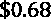美元。这些加起来超过了 38000 英镑。他们只有 1 万英镑的营销预算。鉴于他们已经将此列为重中之重，他们愿意延长预算，但前提是**投资回报** ( **ROI** )足够高以证明额外成本的合理性。

为了最大限度地减少有限预算的使用，他们想尝试直邮，而不是群发邮件，直邮的目的是利用已知的信息，如过去的捐赠、地理位置和人口统计数据，来确定潜在的捐赠者。他们将通过电子邮件联系其他捐赠者，这要便宜得多，整个名单每月花费不超过 14 英镑。他们希望这个混合营销计划会产生更好的效果。他们还认识到，高价值的捐赠者会更好地回应个性化的纸质邮件，而较小的捐赠者无论如何都会更好地回应电子邮件。

在任何特定的竞选活动中，不超过百分之六的邮件列表捐赠。使用 ML 来预测人类行为绝不是一件容易的事情，尤其是在如此不平衡的情况下。然而，成功不是以最高的预测准确度来衡量，而是以利润提升来衡量。换句话说，在测试数据集上评估的直接邮寄模式应该比批量邮寄整个数据集产生更多的利润。

他们寻求您的帮助，使用 ML 来生成一个模型，以确定最有可能的捐赠者，而且以一种保证 ROI 的方式。请注意，模型在产生 ROI 时必须是可靠的。

你从非盈利组织那里得到了数据集，这个数据集在训练和测试中大致平均分配。如果您将邮件发送给测试数据集中的所有人，您将获得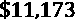的利润，但是如果您设法只识别那些愿意捐赠的人，将获得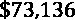的最大收益。你的目标是实现高利润和合理的投资回报率。当活动开始时，它将为整个邮件列表确定最可能的捐赠者，他们希望总共花费不超过 19，000 英镑。然而，数据集有 435 列，一些简单的统计测试和建模练习表明，由于过度拟合，数据噪音太大，无法识别潜在捐赠者的可靠性。

# 方法

您已经决定首先用所有特征拟合一个基本模型，并在不同的复杂程度上评估它，以了解拥有更多特征如何增加过度拟合的倾向。然后，您采用一系列功能选择方法，从简单的基于过滤器的方法到最先进的方法，来确定哪种方法可以实现客户所追求的盈利能力和可靠性目标。最后，一旦选择了最终特征的列表，在这个阶段，可以考虑特征工程来增强模型的可解释性。

考虑到问题的成本敏感性，阈值对于优化利润提升非常重要。我们稍后将讨论阈值的作用，但一个重要的影响是，尽管这是一个分类问题，但最好使用回归模型，然后使用预测进行分类，这样就只有一个阈值需要调整。也就是说，对于分类模型，你需要一个标签的阈值，比如捐款超过 1 美元的标签，然后是另一个预测概率的阈值。另一方面，回归预测捐赠，并且可以基于此优化阈值。

# 准备工作

你可以在这里找到这个例子的代码:[https://github . com/packt publishing/Interpretable-Machine-Learning-with-Python/tree/master/chapter 10/mailer . ipynb](https://github.com/PacktPublishing/Interpretable-Machine-Learning-with-Python/tree/master/Chapter10/Mailer.ipynb)。

## 加载库

要运行这个示例，您需要安装以下库:

*   `mldatasets`加载数据集
*   `pandas`、`numpy`和`scipy`来操纵它
*   `mlxtend`、`genetic_selection`、`xgboost`和`sklearn` (scikit-learn)以适应模型
*   `matplotlib`和`seaborn`创建和可视化解释

要加载库，请使用以下代码块:

```
import math
import os
import mldatasets
import pandas as pd
import numpy as np
import timeit
from tqdm.notebook import tqdm
from sklearn.feature_selection import VarianceThreshold,\
                                    mutual_info_classif, SelectKBest
from sklearn.feature_selection import SelectFromModel
from sklearn.linear_model import LogisticRegression,
LassoCV, LassoLarsCV, LassoLarsIC
from mlxtend.feature_selection import SequentialFeatureSelector
from sklearn.feature_selection import RFECV
from sklearn.decomposition import PCA import shap
from genetic_selection import GeneticSelectionCV
from scipy.stats import rankdata
from sklearn.discriminant_analysis import
LinearDiscriminantAnalysis
from sklearn.ensemble import ExtraTreesRegressor,\
RandomForestRegressor
import xgboost as xgb
import matplotlib.pyplot as plt
import seaborn as sns
```

接下来，我们将加载并准备数据集。

## 了解和准备数据

我们像这样将数据加载到两个带有特征的数据帧(`X_train`、`X_test`)和两个带有相应标签的 NumPy 数组(`y_train`、`y_test`)。请注意，这些数据帧已经预先为我们准备好，以删除稀疏或不必要的特征，处理缺失值，并对分类特征进行编码:

```
X_train, X_test, y_train, y_test =\
                   mldatasets.load("nonprofit-mailer",\
prepare=True)
y_train = y_train.squeeze()
y_test = y_test.squeeze() 
```

所有特征都是数字，没有缺失值，分类特征已经为我们进行了一次性编码。在训练和测试邮件列表之间，应该有超过 191，500 个记录和 435 个特征。你可以这样检查一下情况:

```
print(X_train.shape)
print(y_train.shape)
print(X_test.shape)
print(y_test.shape)
```

前面的代码应该输出以下内容:

```
(95485, 435)
(95485,)
(96017, 435)
(96017,)
```

接下来，我们可以验证测试标签具有正确的捐赠者数量(`test_donators`)、捐赠数量(`test_donations`)和利润范围(`test_min_profit`、`test_max_profit`)。我们可以打印这些，然后对训练数据集进行同样的操作:

```
var_cost = 0.68
y_test_donators = y_test[y_test > 0]
test_donators = len(y_test_donators)
test_donations = sum(y_test_donators)
test_min_profit = test_donations - (len(y_test)*var_cost)
test_max_profit = test_donations - (test_donators*var_cost)
print('%s test donators totaling $%.0f (min profit: $%.0f,
max profit: $%.0f)' %\
   (test_donators, test_donations, test_min_profit,\
    test_max_profit))
y_train_donators = y_train[y_train > 0]
train_donators = len(y_train_donators)
train_donations = sum(y_train_donators)
train_min_profit = train_donations –
(len(y_train)*var_cost)
train_max_profit = train_donations –
(train_donators*var_cost)
print('%s train donators totaling $%.0f (min profit: $%.0f,
max profit: $%.0f)' %\
  (train_donators, train_donations, train_min_profit,\
   train_max_profit))
```

前面的代码应该输出以下内容:

```
4894 test donators totaling $76464 (min profit: $11173, maxprofit: $73136)
4812 train donators totaling $75113 (min profit: $10183, max profit: $71841)
```

事实上，如果非营利组织群发邮件给测试邮件列表上的每个人，他们会获得大约 11，000 美元的利润，但要实现这一点必须大大超出预算。非营利组织认识到，通过识别和锁定捐赠者来获取最大利润几乎是不可能的。因此，他们会满足于生产一种模型，这种模型可以可靠地产生比最小利润更多的利润，但成本更低，最好在预算之内。

# 理解不相关特征的影响

**特征选择**也称为**变量或属性选择**。这是一种方法，通过这种方法，您可以自动或手动选择对构建 ML 模型有用的特定特征的子集。

更多的特征导致更好的模型并不一定是真的。不相关的特征会影响学习过程，导致过度拟合。因此，我们需要一些策略来消除任何可能对学习产生不利影响的特征。选择较小特征子集的一些优点包括:

*   更简单的模型更容易理解:例如，使用 15 个变量的模型比使用 150 个变量的模型更容易理解特征的重要性。
*   更短的训练时间:减少变量的数量降低了计算的成本，加快了模型训练，也许最值得注意的是，更简单的模型有更快的推理时间。
*   *通过减少过拟合提高泛化能力*:有时候，预测值很小，很多变量只是噪音。然而，ML 模型从这种噪声中学习并触发过度拟合，同时最小化泛化。我们可以通过去除这些不相关的噪声特征来显著增强 ML 模型的泛化能力。
*   *可变冗余*:数据集通常具有共线要素，这可能意味着它们是冗余的。在这种情况下，只要没有重要信息丢失，我们可以只保留一个变量，删除其他变量。

现在，我们将拟合一些模型来演示过多特征的效果。

### 创建基础模型

让我们为邮件列表数据集创建一个基本的模型，看看这是如何进行的。但首先，让我们为可重复性设置随机数:

```
rand = 9
os.environ['PYTHONHASHSEED']=str(rand)
np.random.seed(rand)
```

我们将在本章通篇使用 XGBoost 的`XGBRFRegressor`。它就像 scikit-learn 的一样，但是更快，因为它使用目标函数的二阶近似。它也有更多的选项，如设置学习率和单调约束，在第 12 章*中检查，*单调约束和模型可解释性调整*。我们用值为 4 的`max_depth`初始化`XGBRFRegressor`，并且为了一致性，总是使用 200 个估计值。然后，我们用训练数据来拟合它。我们将使用`timeit`来测量需要多长时间，我们将它保存在一个变量(`baseline_time`)中以供以后参考:*

```
stime = timeit.default_timer()
reg_mdl = xgb.XGBRFRegressor(max_depth=4,\
n_estimators=200, seed=rand)
fitted_mdl = reg_mdl.fit(X_train, y_train)
etime = timeit.default_timer()
baseline_time = etime-stime
```

现在我们有了一个基础模型，让我们来评估它。

### 评估模型

接下来，让我们创建一个字典(`reg_mdls`)来存放我们将在本章中使用的所有模型，以测试哪些特征子集产生最佳模型。这里，我们可以使用`evaluate_reg_mdl`评估具有所有特征且`max_depth`值为 4 ( `rf_4_all`)的 RF 模型。它会用回归线制作一个摘要和散点图:

```
reg_mdls = {}
reg_mdls['rf_4_all'] = mldatasets.evaluate_reg_mdl(fitted_mdl,\
                              X_train, X_test, y_train, y_test, plot_regplot=True, ret_eval_dict=True)
```

上述代码生成了图 10.1 中所示的指标和图表:


RMSE _ 火车:4.3210 RMSE _ 测试:4.6359 r2: -0.1084

图 10.1-基本模型预测性能

对于类似于*图 10.1* 中的图，通常会有一条对角线，所以看一眼这个图会告诉你这个模型是无用的。此外，RMSEs 可能看起来不坏，但在这样一个不平衡的问题背景下，它们是令人沮丧的。想想这个:只有 5%的人捐款，其中只有 20%超过了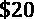，所以平均误差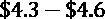是巨大的。

那么，这种模式没用吗？答案在于我们用什么阈值来用它分类。让我们从定义一组阈值(`threshs`)开始，范围从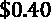到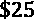。我们开始以 1 美分的间隔排列这些，直到它到达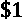，然后以 10 美分的间隔排列，直到它到达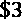，之后以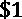的间隔排列:

```
threshs = np.hstack([np.linspace(0.40,1,61),
np.linspace(1.1,3,20), np.linspace(4,25,22)])
```

在`mldatasets`中有一个函数可以计算每个阈值的利润(`profits_by_thresh`)。它所需要的只是实际标签(`y_test`)和预测标签，然后是阈值(`threshs`)、可变成本(`var_costs`)和所需的`min_profit`。只要利润高于`min_profit`，它就会产生一个`pandas`数据框架，其中包含每个阈值的收入、成本、利润和 ROI。请记住，我们在本章开始时将这个最小值设定为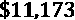,因为将目标捐赠者设定在这个金额以下是没有意义的。在我们为测试和训练数据集生成这些利润数据框架后，我们可以将最大和最小金额放入模型的字典中以备后用。然后，我们使用`compare_df_plots`来绘制测试和训练的成本、利润和 ROI 比率，其中每个阈值都超过了利润最小值:

```
y_formatter = plt.FuncFormatter(lambda x, loc:\
"${:,}K".format(x/1000))
profits_test = mldatasets.profits_by_thresh(y_test,\
                     reg_mdls['rf_4_all']['preds_test'],
threshs, var_costs=var_cost,\
min_profit=test_min_profit)
profits_train = mldatasets.profits_by_thresh(y_train,\
                    reg_mdls['rf_4_all']['preds_train'], threshs, var_costs=var_cost,\ min_profit=train_min_profit)
reg_mdls['rf_4_all']['max_profit_train'] =\
                                     profits_train.profit.max()
reg_mdls['rf_4_all']['max_profit_test'] = \
profits_test.profit.max()
reg_mdls['rf_4_all']['max_roi'] = profits_test.roi.max()
reg_mdls['rf_4_all']['min_costs'] = \
profits_test.costs.min()
reg_mdls['rf_4_all']['profits_train'] = profits_train
reg_mdls['rf_4_all']['profits_test'] = profits_test
mldatasets.compare_df_plots(\
               profits_test[['costs', 'profit', 'roi']],\
               profits_train[['costs', 'profit', 'roi']],\
              'Test', 'Train', y_formatter=y_formatter,\
               x_label='Threshold',\
plot_args={'secondary_y':'roi'})
```

前面的片段生成了*图 10.2* 中的情节。你可以看出**测试**和**训练**几乎是一样的。成本以较高的速度稳步下降，利润以较低的速度下降，而投资回报率稳步上升。然而，存在一些差异，例如 ROI，它最终变得有点高，尽管可行的阈值开始于同一点，但是**序列**确实结束于不同的阈值。事实证明这种模式可以盈利，所以尽管图 10.1 中的情节出现，这种模式远非无用:


图 10.2–跨阈值的基础模型的测试和训练数据集的利润、成本和 ROI 之间的比较

训练集和测试集的均方根差没有说谎。模型没有过度拟合。这主要是因为我们通过将`max_depth`值设置为 4 来使用相对较浅的树。通过计算有多少特征的`feature_importances_`值大于 0，我们可以很容易地看出使用浅树的效果:

```
reg_mdls['rf_4_all']['num_feat'] =\
        sum(reg_mdls['rf_4_all']['fitted'].feature_importances_ > 0)
print(reg_mdls['rf_4_all']['num_feat'])
```

前面的代码输出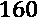。换句话说，在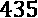中只使用了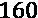——在这样一个浅树中只能容纳这么多特征！这自然会降低过拟合，但与此同时，与随机选择的特征相比，选择具有杂质测量的特征不一定是最佳的。

### 在不同的最大深度训练基础模型

那么，如果我们把树挖得更深会怎么样呢？让我们重复所有的步骤，除了最大深度在 5 到 12 之间:

```
for depth in tqdm(range(5, 13)):
 mdlname = 'rf_'+str(depth)+'_all'
 stime = timeit.default_timer()
 reg_mdl = xgb.XGBRFRegressor(max_depth=depth,\
n_estimators=200, seed=rand)
 fitted_mdl = reg_mdl.fit(X_train, y_train)
 etime = timeit.default_timer()
 reg_mdls[mdlname] =\
mldatasets.evaluate_reg_mdl(fitted_mdl,\
                            X_train, X_test, y_train,
y_test, plot_regplot=False, show_summary=False,\
                            ret_eval_dict=True)
 reg_mdls[mdlname]['speed'] = (etime-stime)/baseline_time
 reg_mdls[mdlname]['depth'] = depth
 reg_mdls[mdlname]['fs'] = 'all'
 profits_test = mldatasets.profits_by_thresh(y_test,\
                     reg_mdls[mdlname]['preds_test'],
threshs, var_costs=var_cost,\
min_profit=test_min_profit)
 profits_train = mldatasets.profits_by_thresh(y_train,  
                    reg_mdls[mdlname]['preds_train'],\
threshs, var_costs=var_cost,\
min_profit=train_min_profit)
 reg_mdls[mdlname]['max_profit_train'] =\
profits_train.profit.max()
 reg_mdls[mdlname]['max_profit_test'] =\
profits_test.profit.max()
 reg_mdls[mdlname]['max_roi'] = profits_test.roi.max()
 reg_mdls[mdlname]['min_costs'] = profits_test.costs.min()
 reg_mdls[mdlname]['profits_train'] = profits_train
 reg_mdls[mdlname]['profits_test'] = profits_test
 reg_mdls[mdlname]['total_feat'] =\
          reg_mdls[mdlname]['fitted'].feature_importances_.shape[0]
 reg_mdls[mdlname]['num_feat'] =\
           sum(reg_mdls[mdlname]['fitted'].feature_importances_ > 0) 
```

现在，让我们像之前对`compare_df_plots`所做的那样，在“最深”模型(最大深度为 12)的利润数据框中绘制细节，生成*图 10.3* :


图 10.3–跨阈值的“深度”基础模型的测试和训练数据集的利润、成本和 ROI 之间的比较

在图 10.3 的*中查看**测试**和**列车**这次有何不同。**测试**达到最大值约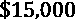且**列**超过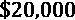。**训练**的成本大幅下降，使得投资回报率比**测试**高出几个数量级。此外，阈值的范围也大不相同。你会问，为什么会是个问题？如果我们必须猜测使用什么阈值来选择下一封邮件的目标，那么**训练**的最佳值高于**测试**——这意味着通过使用过度拟合模型，我们可能会错过标记，并在看不见的数据中表现不佳。*

接下来，让我们将模型字典(`reg_mdls`)转换成一个数据帧，并从中提取一些细节。然后，我们可以按深度分类，用颜色编码，然后输出:

```
reg_metrics_df = pd.DataFrame.from_dict(reg_mdls, 'index')\
                  [['depth', 'fs', 'rmse_train',
'rmse_test', 'max_profit_train',\
'max_profit_test', 'max_roi', 'min_costs', 'speed',
'num_feat']]
with pd.option_context('display.precision', 2):
 html = reg_metrics_df.sort_values(by='depth',\
                                   ascending=False).style.\
           background_gradient(cmap='plasma', low=0.3,
high=1, subset=['rmse_train', 'rmse_test']).\
           background_gradient(cmap='viridis', low=1,
high=0.3, subset=['max_profit_train',\
'max_profit_test'])
html
```

前面的代码片段输出如图*图 10.4* 所示的数据帧。一些应该立即可见的是 RMSE 火车和 RMSE 测试是如何逆转。一个急剧下降，另一个随着深度的增加略有增加。对于利润也可以这么说。ROI 往往会随着深度和训练速度以及使用的功能数量而增加:


图 10.4–比较不同深度的所有基础射频模型的指标

你可能会被诱惑使用收益最高的`rf_11_all`，但使用它会有风险！一个常见的误解是黑盒模型可以有效地删除任何数量的不相关特征。虽然它通常能够找到一些有价值的东西，并充分利用它，但太多的功能会因为更容易过度拟合而妨碍其可靠性。幸运的是，有一个最佳点，在这个点上你可以以最小的过度适应达到高利润，但是要达到这个点，你必须首先减少特征的数量！

# 回顾基于过滤器的特征选择方法

**基于过滤器的方法**独立地从数据集中挑选特征，而不使用任何 ML。这些方法仅依赖于变量的特征，相对有效，计算成本低，执行速度快。因此，作为特征选择方法中最容易实现的部分，它们通常是任何特征选择流程中的第一步。

有两种基于过滤器的方法:

*   **单变量**:独立于特征空间，他们一次评估和评价一个特征。单变量方法可能出现的一个问题是，由于它们没有考虑特征之间的关系，它们可能会过滤掉太多。
*   **多变量**:这些变量将考虑到整个特征空间以及其中的特征如何相互作用。

总体而言，对于去除过时、冗余、恒定、重复和不相关的特征，过滤方法非常有效。然而，由于没有考虑只有 ML 模型才能发现的复杂、非线性、非单调的相关性和相互作用，当这些关系在数据中突出时，它们是无效的。

我们将回顾三类基于过滤器的方法:

*   基础
*   相互关系
*   等级

我们将在各自的章节中进一步解释它们。

## 基于过滤器的基本方法

在任何建模之前，我们在数据准备阶段，特别是数据清理阶段使用**基本过滤方法**。这样做的原因是做出会对模型产生负面影响的特征选择决策的风险很低。它们涉及常识性操作，例如移除没有信息的要素或复制信息。

### 具有方差阈值的恒定特征

`VarianceThreshold`，过滤掉低方差的特征。我们将使用零阈值，因为我们想只过滤掉带有`get_support()`的特征，返回不恒定的特征列表，我们可以使用集合代数只返回恒定的特征(`num_const_cols`):

```
num_cols_l = X_train.select_dtypes([np.number]).columns
cat_cols_l = X_train.select_dtypes([np.bool,
np.object]).columns
num_const = VarianceThreshold(threshold=0)
num_const.fit(X_train[num_cols_l])
num_const_cols = list(set(X_train[num_cols_l].columns) -\
                          set(num_cols_l[num_const.get_support()])) 
```

前面的片段产生了一个常量数字特征的列表，但是分类特征呢？分类特征只有一个类别或唯一值。您可以通过对分类特征应用`nunique()`函数来轻松检查这一点。它将返回一个`pandas`序列，然后一个 lambda 函数可以只过滤掉那些具有唯一值的序列。然后，`.index.tolist()`以列表形式返回特征的名称。现在，你只需加入两个恒定特征列表，瞧！你拥有所有的常量(`all_const_cols`)。你可以打印它们；应该有三个:

```
cat_const_cols = X_train[cat_cols_l].nunique()[lambda x:\
                                                 x<2].index.tolist()
all_const_cols = num_const_cols + cat_const_cols
print(all_const_cols)
```

在大多数情况下，删除不变的特征是不够的。冗余特征可能是几乎恒定或**准恒定**。

### 具有值计数的准常数特征

`value_counts()`，返回每个值的行数。然后，将这些计数除以总行数，得到一个百分比，并按最高值排序。如果最大值高于预定的阈值(`thresh`)，我们将其添加到一个准常数列列表中(`quasi_const_cols`)。请注意，选择这个阈值必须非常小心并理解问题。例如，在这种情况下，我们知道这是不平衡的，因为只有 5%的人捐赠，其中大多数人捐赠的金额很低，所以即使很小一部分功能也可能产生影响，这就是为什么我们的阈值如此之高，达到 99.9%:

```
thresh = 0.999
quasi_const_cols = []
num_rows = X_train.shape[0]
for col in tqdm(X_train.columns):
 top_val = (X_train[col].value_counts() /
                  num_rows).sort_values(ascending=False).values[0]
 if top_val >= thresh:
  quasi_const_cols.append(col)
print(quasi_const_cols)
```

前面的代码应该打印了五个特征，其中包括之前获得的三个特征。接下来，我们将处理另一种形式的无关特征:重复！

### 复制特征

通常，当您讨论数据重复时，您会立即想到重复的行，但是`pandas` `duplicated()`功能，除了您会转置数据帧，首先反转列和行:

```
X_train_transposed = X_train.T
dup_cols =\
  X_train_transposed[X_train_transposed.duplicated()].index.tolist()
print(dup_cols) 
```

前面的代码片段输出了一个包含两个重复行的列表。

### 删除不必要的功能

与其他特征选择方法不同，您应该使用模型进行测试，您可以通过删除您认为无用的特征，立即应用基本的基于过滤器的特征选择方法。但是为了以防万一，制作原始数据的副本是一个很好的做法。请注意，我们没有在要删除的列(`drop_cols`)中包含常量列(`all_constant_cols`)，因为准常量列已经包含了它们:

```
X_train_orig = X_train.copy()
X_test_orig = X_test.copy()
drop_cols = quasi_const_cols + dup_cols
X_train.drop(labels=drop_cols, axis=1, inplace=True)
X_test.drop(labels=drop_cols, axis=1, inplace=True)
```

接下来，我们将对剩余的特征探索基于多元滤波器的方法。

## 基于相关滤波器的方法

**基于相关滤波器的方法**量化两个特征之间关系的强度。这对于特征选择很有用，因为我们可能想要过滤掉极其相关的特征或者那些与其他特征完全不相关的特征。无论哪种方式，它都是一种多变量特征选择方法——准确地说是双变量。

但首先，我们应该选择一种相关方法:

*   **皮尔逊相关系数**:测量如何将两个特征线性相关在-1(负)和 1 (正)之间，0 表示没有线性相关。像线性回归一样，它假设线性、正态和同方差。
*   **Spearman 等级相关系数**:测量两个特征的单调性强度，而不管它们是否线性相关。它也在-1 和 1 之间测量，0 表示没有单调相关性。它不做任何分布假设，可以处理连续和离散特征。然而，它的缺点是与非单调的关系。
*   **肯德尔τ相关系数**:衡量特征之间的有序关联。它的范围也在-1 和 1 之间，但它们分别表示低和高。这对于离散特征很有用。

数据集是连续和离散的混合，我们不能对它做任何线性假设，所以`spearman`是正确的选择。不过这三个都可以与`pandas` `corr`功能一起使用:

```
corrs = X_train.corr(method='spearman')
print(corrs.shape)
```

前面的代码应该输出相关矩阵的形状，也就是`(428, 428)`。这个维度是有意义的，因为还剩下 428 个特征，每个特征都与 428 个特征有关系，包括它本身。

我们现在可以在相关矩阵中寻找要移除的特征(`corrs`)。请注意，要做到这一点，我们必须建立阈值。例如，我们可以说，一个高度相关的特征的绝对值系数大于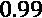，小于一个不相关的特征的绝对值系数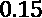。记住这些阈值，我们可以找到只与一个特征相关的特征，以及与多个特征高度相关的特征。为什么是一个功能？因为相关矩阵中的对角线总是 1，因为一个特征总是与自身完全相关。以下代码中的`lambda`函数确保我们考虑到了这一点:

```
extcorr_cols = (abs(corrs) > 0.99).sum(axis=1)[lambda x:\
 x>1].index.tolist()
print(extcorr_cols)
uncorr_cols = (abs(corrs) > 0.15).sum(axis=1)[lambda x:\
                                                x==1].index.tolist()
print(uncorr_cols)
```

前面的代码输出两个列表，如下所示:

```
['MAJOR', 'HHAGE1', 'HHAGE3', 'HHN3', 'HHP1', 'HV1', 'HV2', 'MDMAUD_R', 'MDMAUD_F', 'MDMAUD_A']
['TCODE', 'MAILCODE', 'NOEXCH', 'CHILD03', 'CHILD07', 'CHILD12', 'CHILD18', 'HC15', 'MAXADATE']
```

第一个列表是与其他特征高度相关的特征之一。虽然知道这一点很有用，但是如果不了解这些特征与什么相关、如何相关以及与目标相关，就不应该从列表中删除这些特征。然后，只有当发现冗余时，确保只删除其中一个。第二个是与其他人无关的特征，在这种情况下，考虑到特征的绝对数量，这是可疑的。也就是说，你也应该一个一个地检查它们，尤其是对照目标来衡量它们，看看它们是否多余。然而，我们将冒险创建一个排除不相关特征的特征子集(`corr_cols`):

```
corr_cols =\
        X_train.columns[~X_train.columns.isin(uncorr_cols)].tolist()
print(len(corr_cols))
```

前面的代码应该输出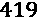。现在让我们仅用这些特征来拟合 RF 模型。鉴于还有 400 多个特征，我们将使用`11`的`max_depth`值。除了那个和一个不同的型号名称(`mdlname`，它和以前的代码一样:

```
mdlname = 'rf_11_f-corr'
stime = timeit.default_timer()
reg_mdl = xgb.XGBRFRegressor(max_depth=11,
n_estimators=200, seed=rand)
fitted_mdl = reg_mdl.fit(X_train[corr_cols], y_train)
:
reg_mdls[mdlname]['num_feat'] =\
           sum(reg_mdls[mdlname]['fitted'].feature_importances_ > 0)
```

在我们比较前面模型的结果之前，让我们了解一下排序过滤方法。

## 基于分级过滤的方法

**基于分级过滤的方法**基于统计单变量分级测试，评估特征相对于目标的强度。以下是一些最常用的方法:

*   `f_regression`和`f_classification`分别用于回归和分类，通过 f 检验得出的 F 值对特征进行排序。
*   `chi2`。
*   `mutual_info_regression`和`mutual_info_classif`分别用于回归和分类。

在提到的三个选项中，最适合该数据集的选项是 MI，因为我们不能假设我们的特征之间是线性的，并且它们中的大多数也不是分类的。我们可以尝试阈值为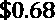的分类，这至少涵盖了发送邮件人的成本。为此，我们必须首先创建一个二进制分类目标(`y_train_class`)，其阈值为:

```
y_train_class = np.where(y_train > 0.68, 1, 0)
```

接下来，我们可以使用`SelectKBest`根据`get_support()`获得前 160 个特征，以获得一个布尔向量(或掩码)，它告诉我们哪些特征在前 160 个中，我们用这个掩码对特征列表进行子集化:

```
mic_selection = SelectKBest(mutual_info_classif, k=160).fit(X_train, y_train_class)
mic_cols =\
X_train.columns[mic_selection.get_support()].tolist()
print(len(mic_cols))
```

前面的代码应该确认在`mic_cols`列表中有 160 个特征。顺带一提，这是一个任意数。理想情况下，如果有时间，我们可以测试分类目标的不同阈值和 MI 的 *k* s，寻找实现最高利润提升同时拟合度最低的模型。接下来，我们可以像之前处理麦克风特征一样拟合 RF 模型。这一次，我们将使用最大深度`5`，因为这里的特征明显更少:

```
mdlname = 'rf_5_f-mic'
stime = timeit.default_timer()
reg_mdl = xgb.XGBRFRegressor(max_depth=5, n_estimators=200,\
                             seed=rand)
fitted_mdl = reg_mdl.fit(X_train[mic_cols], y_train)
:
reg_mdls[mdlname]['num_feat'] =\  
           sum(reg_mdls[mdlname]['fitted'].feature_importances_ > 0)
```

现在，让我们像在*图 10.3* 中所做的那样，绘制测试和训练的利润，但是是针对 MIC 模型。它将产生如图*图 10.5* 所示的内容:


图 10.5–具有跨阈值 MIC 特征的模型的测试和训练数据集的利润、成本和 ROI 之间的比较

在*图 10.5* 中，你可以告诉在**测试**和**序列**之间有相当大的差异，然而相似性表明最小的过度配合。例如，**系列**在 0.65 到 0.7 之间可以找到最高的盈利能力，而**测试**大多在 0.65 到 0.7 之间，之后才逐渐降低。

虽然我们已经直观地检查了 MIC 模型，但是通过查看原始指标来获得一些保证还是不错的。接下来，我们将使用一致的指标来比较我们迄今为止训练的所有模型。

## 比较基于过滤器的方法

我们已经将指标保存到一个字典(`reg_mdls`)中，我们可以像以前一样轻松地将它转换为数据帧并输出，但这次我们按`max_profit_test`排序:

```
reg_metrics_df = pd.DataFrame.from_dict(reg_mdls, 'index')\
                  [['depth', 'fs', 'rmse_train',\
'rmse_test', 'max_profit_train',\ 'max_profit_test',\
                       'max_roi', 'min_costs', 'speed', 'num_feat']]
with pd.option_context('display.precision', 2):
 html = reg_metrics_df.sort_values(by='max_profit_test',\
                                   ascending=False).style.\
           background_gradient(cmap='plasma', low=0.3,\
high=1, subset=['rmse_train',\
 'rmse_test']). background_gradient(cmap='viridis', low=1, \
high=0.3, subset=['max_profit_train', 'max_profit_test'])
html
```

前面的代码片段生成的如图*图 10.6* 所示。显然，滤波器 MIC 模型是所有模型中过拟合程度最低的。它比具有更多功能的更复杂的模型排名更高，并且比任何模型花费更少的训练时间。它的速度对于超参数调谐是一个优势。如果我们想要找到最佳的分类目标阈值或 MIC *k* s 呢？我们现在不会这样做，但如果我们运行每个组合，我们可能会得到一个更好的模型，但这需要时间，甚至需要更多的功能:


图 10.6-比较所有基本模型和基于过滤器的特征选择模型的指标

在*图 10.6* 中，您可以看出相关滤波器模型(`f-corr`)的性能比具有更多特征和等量`max_depth`的模型差，这表明我们一定是删除了一个重要特征。正如那一节中所警告的，盲目设置阈值并删除任何高于阈值的内容的问题是，您可能会无意中删除一些有用的内容。并非所有极度相关和不相关的特征都是无用的，因此需要进一步检查。接下来，我们将探索一些与交叉验证相结合的嵌入式方法，这些方法需要较少的监督。

# 探索嵌入式特征选择方法

**嵌入式方法**通过在训练期间自然选择特征而存在于模型本身中。您可以利用任何模型的固有属性来捕捉所选的特征:

*   `gain`默认情况下，这是使用该特征计算特征重要性的所有分割中误差的平均减少量。我们可以将阈值增加到 0 以上，以根据该相对贡献选择甚至更少的特征。然而，通过限制树的深度，我们迫使模型选择更少的特征。
*   **带系数的正则化模型**:我们将在 [*第 12 章*](B16383_12_ePub_RK.xhtml#_idTextAnchor261) 、*单调性约束和模型可解释性调整*中进一步研究这个问题，但是许多模型类可以包含基于惩罚的正则化，例如 L1、L2 和弹性网。然而，并不是所有的方法都有内在的参数，比如可以提取出来确定哪些特征被罚的系数。

鉴于我们已经在使用一个基于树的模型，本节将仅介绍正则化模型。最好利用不同的模型类来获得关于什么特征最重要的不同观点。

我们在 [*第 3 章*](B16383_03_ePub_RK.xhtml#_idTextAnchor051) 、*解释挑战*中介绍了其中的一些模型，但这些是一些包含基于惩罚的正则化和输出特征特定系数的模型类:

*   **最小绝对收缩和选择算子** ( **LASSO** ):由于在损失函数中使用了 L1 惩罚，LASSO 可以将系数设置为 0。
*   **最小角度回归** ( **LARS** ):类似于 LASSO ，但基于向量，更适合高维数据。它对同等相关的特征也更公平。
*   **岭回归**:在损失函数中使用 L2 罚函数，因此只能将不相关系数缩小到接近 0，而不能缩小到 0。
*   **弹性净回归**:使用 L1 和 L2 规范的混合作为惩罚。
*   **逻辑回归**:根据求解器的情况，它可以处理 L1、L2 或弹性网罚分。

还有几个前述模型的变体，例如**套索 LARS** ，它是使用 LARS 算法的套索拟合，或者甚至**套索 LARS IC** ，它与相同，但是使用 AIC 或 BIC 标准用于模型部分:

*   **赤池的信息准则** ( **AIC** ):建立在信息论基础上的相对拟合优度度量
*   贝叶斯信息准则 ( **BIC** ):与 AIC 有类似的公式，但有不同的惩罚条款

好，现在让我们使用`SelectFromModel`从套索模型中提取顶部特征。我们将使用`LassoCV`,因为它可以自动交叉验证以找到最佳惩罚强度。一旦你拟合好了，我们就可以得到带有`get_support()`的特征蒙版了。然后，我们可以打印功能数量和功能列表:

```
lasso_selection = SelectFromModel(LassoCV(n_jobs=-1,\
                                                 random_state=rand))
lasso_selection.fit(X_train, y_train)
lasso_cols =\
X_train.columns[lasso_selection.get_support()].tolist()
print(len(lasso_cols))
print(lasso_cols)
```

上述代码输出以下内容:

```
7
['ODATEDW', 'TCODE', 'POP901', 'POP902', 'HV2', 'RAMNTALL', 'MAXRDATE']
```

现在，让我们用`LassoLarsCV`做同样的尝试:

```
llars_selection = SelectFromModel(LassoLarsCV(n_jobs=-1))
llars_selection.fit(X_train, y_train)
llars_cols =\
X_train.columns[llars_selection.get_support()].tolist()
print(len(llars_cols))
print(llars_cols)
```

前面的代码片段产生以下输出:

```
8
['RECPGVG', 'MDMAUD', 'HVP3', 'RAMNTALL', 'LASTGIFT', 'AVGGIFT', 'MDMAUD_A', 'DOMAIN_SOCIALCLS']
```

Lasso 将除了七个特征之外的所有特征的系数缩减为 0，Lasso LARS 也做了同样的事情，但只缩减了八个特征。然而，请注意两个列表之间没有重叠！好了，让我们试着用`LassoLarsIC`将 AIC 模型选择合并到套索拉斯中:

```
llarsic_selection = \ SelectFromModel(LassoLarsIC(criterion='aic'))
llarsic_selection.fit(X_train, y_train)
llarsic_cols =\
           X_train.columns[llarsic_selection.get_support()].tolist()
print(len(llarsic_cols))
print(llarsic_cols)
```

上述代码片段生成以下输出:

```
111
['TCODE', 'STATE', 'MAILCODE', 'RECINHSE', 'RECP3', 'RECPGVG', 'RECSWEEP',..., 'DOMAIN_URBANICITY', 'DOMAIN_SOCIALCLS', 'ZIP_LON'] 
```

这是相同的算法，但选择正则化参数值的方法不同。请注意这种不太保守的方法是如何将特征的数量扩展到 111 个的。到目前为止，我们使用的所有方法都有 L1 范数。让我们试一试 L2——更具体地说，L2 惩罚逻辑回归。我们完全按照之前所做的来做，但是这一次我们符合二进制分类目标(`y_train_class`):

```
log_selection = SelectFromModel(LogisticRegression(C=0.0001,\  
                             solver='sag', penalty='l2', n_jobs=-1, random_state=rand))
log_selection.fit(X_train, y_train_class)
log_cols =\
X_train.columns[log_selection.get_support()].tolist()
print(len(log_cols))
print(log_cols)
```

上述代码产生以下输出:

```
87
['ODATEDW', 'TCODE', 'STATE', 'POP901', 'POP902', 'POP903', 'ETH1', 'ETH2', 'ETH5', 'CHIL1', 'HHN2',..., 'AMT_7', 'ZIP_LON'] 
```

既然我们已经有了一些要测试的特征子集，我们可以将它们的名字放入一个列表中(`fsnames`)，将特征子集列表放入另一个列表中(`fscols`):

```
fsnames = ['e-lasso', 'e-llars', 'e-llarsic', 'e-logl2']
fscols = [lasso_cols, llars_cols, llarsic_cols, log_cols]
```

然后，我们可以遍历所有列表名称，并像以前一样拟合和评估我们的`XGBRFRegressor`模型，但在每次迭代中增加`max_depth`:

```
for i, fsname in tqdm(enumerate(fsnames), total=len(fsnames)):
 depth = i + 3
 cols = fscols[i]
 mdlname = 'rf_'+str(depth)+'_'+fsname
 stime = timeit.default_timer()
 reg_mdl = xgb.XGBRFRegressor(max_depth=depth,\
n_estimators=200, seed=rand)
 fitted_mdl = reg_mdl.fit(X_train[cols], y_train)
 :
 reg_mdls[mdlname]['num_feat'] =\
           sum(reg_mdls[mdlname]['fitted'].feature_importances_ > 0)
```

现在，让我们看看我们的嵌入式特征选择模型与过滤模型相比表现如何。我们将重新运行我们运行的代码，以输出图 10.6 中显示的内容。这一次，我们将得到如图*图 10.7* 所示的内容:


图 10.7-比较所有基本模型、基于过滤器和嵌入式特征选择模型的指标

根据*图 10.7* ，我们尝试的四种嵌入方法中有三种产生了测试 RMSE 最低的模型。它们的训练速度也比其他任何型号都快，利润也比同等复杂程度的任何其他型号都高。其中一个(`rf_5_e-llarsic`)甚至利润极高。将其与具有类似测试盈利能力的`rf_9_all`进行比较，以查看性能与训练数据的差异。

# 发现包装器、混合和高级特征选择方法

迄今为止研究的特征选择方法在计算上是廉价的，因为它们不需要模型拟合或拟合更简单的白盒模型。在本节中，我们将了解其他更详尽的方法，这些方法有许多可能的调优选项。这里包括的方法类别如下:

*   **包装器**:通过使用一种搜索策略来拟合一个 ML 模型，彻底地寻找最好的特征子集，这种搜索策略测量度量的改进。
*   **Hybrid** :一种将嵌入和过滤方法与包装方法相结合的方法。
*   **高级**:一种不属于任何先前讨论的类别的方法。例子包括降维、模型不可知特征重要性和 GAs。

现在，让我们从包装方法开始！

## 包装方法

**包装器方法**背后的概念相当简单:评估 ML 模型上不同的特征子集，并选择在预定目标函数中获得最佳分数的一个。这里不同的是搜索策略:

*   **顺序向前选择** ( **SFS** ):该方法开始时没有特征，而一次添加一个特征。
*   **顺序向前浮动选择** ( **SFFS** ):与相同，除了每增加一个特征外，只要目标函数增加，就可以去掉一个。
*   **顺序向后选择** ( **SBS** ):该过程从所有出现的特征开始，一次消除一个特征。
*   **顺序浮动后向选择** ( **SFBS** ):除了它每去掉一个特征，只要目标函数增加，就可以加一个。
*   **详尽的特征选择** ( **EFS** ):这种方法寻找所有可能的特征组合。
*   **双向搜索** ( **BDS** ):最后一个同时允许向前和向后功能选择，以获得一个唯一的解决方案。

这些方法是贪婪的算法，因为它们一点一点地解决问题，根据它们的直接利益选择部分。尽管它们可能达到全局最大值，但它们采取了更适合于寻找局部最大值的方法。根据特征的数量，它们可能计算量太大而不实用，尤其是组合增长的 EFS。

为了缩短搜索时间，我们将做两件事:

1.  从通过其他方法集体选择的特征开始我们的搜索，以具有更小的特征空间供选择。为此，我们将几个方法的特征列表合并成一个单一的`top_cols`列表:

    ```
    top_cols =\ list(set(mic_cols).union(set(llarsic_cols)).\                 union(set(log_cols))) len(top_cols)
    ```

2.  对我们的数据集进行采样，以便 ML 模型加速。我们可以使用`np.random.choice`来随机选择行索引，而不需要替换:

    ```
    sample_size = 0.1 sample_train_idx = np.random.choice(X_train.shape[0],\                math.ceil(X_train.shape[0]*sample_size), replace=False) sample_test_idx = np.random.choice(X_test.shape[0],\                 math.ceil(X_test.shape[0]*sample_size),\                replace=False)
    ```

在给出的包装器方法中，我们将只执行 SFS 和 SBS，因为它们非常耗时。尽管如此，对于更小的数据集，您可以尝试其他选项，`mlextend`库也支持这些选项。

### 顺序向前选择

包装器方法的第一个参数是一个不合适的估计器(一个模型)。在`SequentialFeatureSelector`中，我们正在放置一个`LinearDiscriminantAnalysis`模型。其他参数包括方向(`forward=true`)、它是否是浮动的(`floating=False`)、我们希望选择的特征的数量(`k_features=27`)、交叉验证的数量(`cv=3`)以及要使用的损失函数(`scoring=f1`)。一些建议输入的可选参数是详细程度(`verbose=2`)和并行运行的作业数量(`n_jobs=-1`)。因为这可能需要一段时间，所以您肯定希望它输出一些东西，并使用尽可能多的处理器:

```
sfs_lda = SequentialFeatureSelector(\
               LinearDiscriminantAnalysis(n_components=1),
               forward=True, floating=False,
               k_features=27, cv=3,\
               scoring='f1', verbose=2, n_jobs=-1)
sfs_lda =\
sfs_lda.fit(X_train.iloc[sample_train_idx][top_cols],\
                   y_train_class[sample_train_idx])
sfs_lda_cols =\
             X_train.columns[list(sfs_lda.k_feature_idx_)].tolist()
```

一旦我们适应了 SFS，它将返回用`k_feature_idx_`选择的特征的索引，我们可以使用这些索引来划分列的子集并获得特征名称的列表。

### 顺序向后选择

对于 SBS，我们将使用`ExtraTreesRegressor`，它通过在数据集的子样本上训练极度随机的决策树来控制过度拟合。由于它的自然属性，它可能能够找到像 LDA 这样的模型不能找到的特征子集:

```
sbs_et = SequentialFeatureSelector(\
             ExtraTreesRegressor(max_depth=3,\
             random_state=rand),\
             floating=False, k_features=135,\
             forward=False, cv=2,\
             scoring='neg_root_mean_squared_error',\
             verbose=2,\
               n_jobs=-1)
sbs_et =\
sbs_et.fit(X_train.iloc[sample_train_idx][top_cols],\
              y_train[sample_train_idx])
sbs_et_cols =\
X_train.columns[list(sbs_et.k_feature_idx_)].tolist()
```

一旦 SBS 被安装，我们将像以前一样，保存选择的功能。

通常，包装器方法在寻找特征子集方面非常有效，这将减少过度拟合并提高预测性能，因为它们检测到过滤方法不能检测的重要特征交互。主要的限制是，我们必须对训练数据进行采样，以使它们适用于这个用例。

## 杂交方法

从 435 个特征开始，仅 27 个特征子集就有超过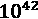种组合！所以，你可以看到 EFS 在如此大的特征空间上是如何不切实际的。因此，除了整个数据集上的 EFS，包装器方法总是会采取一些快捷方式来选择要素。无论你是前进，后退，还是两者兼而有之，只要你没有评估每一个单一的特征组合，你就很容易错过最好的一个。

然而，我们可以利用包装方法的更严格、更彻底的搜索方法，以及过滤器和嵌入式方法的效率。这样的结果就是**混合方法**。例如，您可以使用过滤或嵌入方法来只导出前 10 个特征，并只对这些特征执行 EFS 或 SBS。

### 递归特征消除

另一种更常见的方法是 SBS 之类的方法，但它不是只基于改进指标来删除功能，而是使用模型的内在参数来对功能进行排序，并且只删除排序最低的。这种方法的名称是`feature_importances_`或系数(`coef_`)，因为这是该方法知道要移除什么特征的方式。scikit-learn 中具有这些属性的模型类被分类在`linear_model`、`tree`和`ensemble`下。另外，兼容 scikit-learn 的 XGBoost、LightGBM 和 CatBoost 版本也有`feature_importances_`。

我们将使用 RFE 的交叉验证版本，因为它更可靠。`RFECV`先取估计量(`LinearDiscriminantAnalysis`)。然后我们可以定义`step`，它设置在每次迭代中应该删除多少特征，交叉验证的数量(`cv`，以及用于评估的度量(`scoring`)。最后，建议设置详细度(`verbose=2`)并利用尽可能多的处理器(`n_jobs=-1`)。为了加快速度，我们将再次使用一个样本进行训练，从 267 开始`top_cols`:

```
rfe_lda = RFECV(LinearDiscriminantAnalysis(n_components=1),\
step=2, cv=3, scoring='f1', verbose=2, n_jobs=-1)
rfe_lda.fit(X_train.iloc[sample_train_idx][top_cols],
         y_train_class[sample_train_idx])
rfe_lda_cols =\
 np.array(top_cols)[rfe_lda.support_].tolist()
```

我们可以尝试`RandomForestRegressor`，这一次使用更大的步长`0.05`，这意味着在每次迭代中，所有特征的 5%将被移除:

```
rfe_rf = RFECV(RandomForestRegressor(random_state=rand,\
                                     max_depth=4),\
               step=0.05, cv=3, verbose=2, n_jobs=-1,\
               scoring='neg_root_mean_squared_error')
rfe_rf.fit(X_train.iloc[sample_train_idx][top_cols],
        y_train[sample_train_idx])
rfe_rf_cols = np.array(top_cols)[rfe_rf.support_].tolist()
```

接下来，我们将尝试与主要的三个特征选择类别不相关的不同方法:过滤、嵌入和包装。

## 先进的方法

许多方法可以归类到高级特征选择方法下，包括以下子类别:

*   **降维**:一些降维方法，如如**主成分分析** ( **PCA** )，可以基于特征返回解释的方差。对于其他的，例如因子分析，它可以从其他输出中导出。解释方差可用于对特征进行分级。
*   **与模型无关的特征重要性**:在 [*第四章*](B16383_04_ePub_RK.xhtml#_idTextAnchor081) 、*特征重要性和影响的基础*、 [*第五章*](B16383_05_ePub_RK.xhtml#_idTextAnchor106) 、*全局与模型无关的解释方法*中涵盖的任何特征重要性方法，都可以用于获取模型的顶层特征，以用于特征选择。
*   **GA** :这是一个包装器方法，因为它“包装”了一个模型，该模型评估跨许多特征子集的预测性能。然而，与我们研究的包装器方法不同，它并不贪婪，而且更适合处理大的特征空间。之所以称之为遗传，是因为它受到了生物学的启发——特别是自然选择。
*   **自动编码器**:我们不会深究这一点，但深度学习可以用于自动编码器的功能选择。

我们将在本节中简要介绍前三个，以便您能够理解它们是如何实现的。让我们开始吧！

### 降维

我们在 [*第三章*](B16383_03_ePub_RK.xhtml#_idTextAnchor051) ，*解释挑战*中涉及到 PCA，但是我们并没有从中提取出解释的方差，实际上用它来降维。如下面的代码所示，这次我们将保持组件的数量(`n_components`)作为特征的数量，并利用其通过**奇异值分解** ( **SVD** )分解方差的能力:

```
pca = PCA(n_components=X_train.shape[1])
fitted_pca = pca.fit(X_train)
pca_evrs = pd.DataFrame({'col':X_train.columns,\
                     'evr':fitted_pca.explained_variance_ratio_}). sort_values(by='evr',ascending=False)
pca_cols = pca_evrs.head(150).col.tolist()
```

正如您在前面的片段中所看到的，您可以像拟合任何模型一样拟合 PCA，除了它不需要标签，因为它是一种无监督的方法。然后，我们提取`explained_variance_ratio_`(即`pca_cols`)。

### 与模型无关的特征重要性

我们在整本书中使用的一个流行的与模型无关的特征重要性方法是 SHAP，它有许多属性使它比其他方法更可靠。在下面的代码中，我们可以使用`TreeExplainer`提取我们的最佳模型并提取`shap_values`:

```
fitted_rf_mdl = reg_mdls['rf_11_all']['fitted']
shap_rf_explainer = shap.TreeExplainer(fitted_rf_mdl)
shap_rf_values =\
   shap_rf_explainer.shap_values(X_test_orig.iloc[sample_test_idx])
shap_imps = pd.DataFrame({'col':X_train_orig.columns,\
                          'imp':np.abs(shap_rf_values).mean(0)}). sort_values(by='imp',ascending=False)
shap_cols = shap_imps.head(150).col.tolist()
```

然后，我们对第一维度上的SHAP 值的绝对值进行平均，这为我们提供了每个特征的排名。我们将该值放入数据帧中，并像对 PCA 那样对其进行排序。最后，同样取前 150 名，并将它们放在一个列表中(`shap_cols`)。

### 遗传算法

遗传算法是一种受自然选择启发的随机全局优化技术，它像包装方法一样包装模型。然而，它们并不遵循一个循序渐进的顺序。遗传算法没有迭代，只有世代，包括染色体种群。每个染色体都是你的特征空间的二进制表示，其中 1 表示选择一个特征，0 表示不选择。每一代产品都通过以下操作生产:

*   **选择**:和自然选择一样，这部分是随机的(探索)，部分是基于已经起作用的(开发)。起作用的是它的适应性。健康是用一个“计分器”来评估的，很像包装器方法。不适合的染色体被移除，而适合的染色体通过“交叉”得以繁殖
*   **交叉**:随机地，每个父母的一些好的位(或特征)到一个孩子身上。
*   **突变**:即使染色体被证明是有效的，如果突变率很低，它也会偶尔发生突变或翻转其中的一个位，换句话说，就是特征。

我们将使用的 Python 实现有许多选项。我们不会在这里解释它们，但是如果你感兴趣的话，它们在代码中有很好的记录。第一个属性是估计量。我们还可以定义交叉验证迭代(`cv=3`)、`scoring`来确定染色体是否合适，以及它应该在每个染色体中选择的最大特征数(`max_features`)。有一些重要的概率属性，例如突变位的概率(`mutation_independent_proba`)和位将被交换的概率(`crossover_independent_proba`)。就代而言，`n_gen_no_change`提供了一种在代没有改善的情况下提前停止的方法，默认情况下，`n_generations`40 是一个硬停止点。您可以像安装任何型号一样安装`GeneticSelectionCV`。这可能需要一段时间，所以最好定义详细程度，并允许它使用所有的处理能力。完成后，我们可以使用布尔掩码(`support_`)来划分特征子集:

```
ga_rf = GeneticSelectionCV(RandomForestRegressor(random_state=rand, max_depth=3),\
               cv=3, scoring='neg_root_mean_squared_error',\
             max_features=90, crossover_independent_proba=0.5,\
           n_gen_no_change=5, mutation_independent_proba=0.05,\
                n_jobs=-1, verbose=2)
ga_rf = ga_rf.fit(X_train[top_cols], y_train)
ga_rf_cols = np.array(top_cols)[ga_rf.support_].tolist()
```

好了，既然我们已经在本节中介绍了各种各样的包装器、混合和高级特征选择方法，那么让我们一次评估所有这些方法并比较结果。

## 评估所有特征选择模型

正如我们对嵌入式方法所做的那样，我们可以将特征子集名称(`fsnames`)、列表(`fscols`)和相应的`depths`放在列表中:

```
fsnames = ['w-sfs-lda', 'w-sbs-et', 'h-rfe-lda','h-rfe-rf',\
           'a-pca', 'a-shap', 'a-ga-rf']
fscols = [sfs_lda_cols, sbs_et_cols, rfe_lda_cols,\
 rfe_rf_cols, pca_cols, shap_cols, ga_rf_cols]
depths = [5, 6, 6, 6, 6, 6, 5]
```

然后，我们可以遍历所有特征子集，用它们训练`XGBRFRegessor`，并将评估结果放入模型字典(`reg_mdls`):

```
for i, fsname in tqdm(enumerate(fsnames), total=len(fsnames)):
 depth = depths[i]
 cols = fscols[i]
 mdlname = 'rf_'+str(depth)+'_'+fsname
 stime = timeit.default_timer()
 reg_mdl = xgb.XGBRFRegressor(max_depth=depth,\
n_estimators=200, seed=rand)
 fitted_mdl = reg_mdl.fit(X_train[cols], y_train)
 etime = timeit.default_timer()
 reg_mdls[mdlname] =\
mldatasets.evaluate_reg_mdl(fitted_mdl,\
                             X_train[cols], X_test[cols], \
                             y_train,\
                             y_test, plot_regplot=False,\
                             show_summary=False, ret_eval_dict=True)
 :
 reg_mdls[mdlname]['num_feat'] =\
           sum(reg_mdls[mdlname]['fitted'].feature_importances_ > 0)
```

正如在本章中所做的，我们可以将`reg_mlds`转换成一个数据帧(`reg_metrics_df`)，但这次过滤它，只包括最大深度小于 7 ( `reg_metrics_df = reg_metrics_df[reg_metrics_df.depth < 7']`)的模型。然后，我们可以输出数据帧。其结果如图*图 10.8* 所示:


图 10.8–比较所有功能选择模型的指标

*图 10.8* 显示了特征选择模型如何比包含相同深度所有特征的模型更有利可图。此外，嵌入套索拉斯与 AIC ( `e-llarsic`)方法和 MIC ( `f-mic`)过滤方法优于所有包装，混合和先进的方法。尽管如此，我们还通过使用训练数据集的样本来阻止这些方法，这是加速该过程所必需的。否则，也许他们会超过顶尖的。然而，接下来的四种特征选择方法相当有竞争力:

*   RFE 与 LDA:混合方法(`h-rfe-lda`)
*   SHAP:先进的方法(`a-shap`
*   射频气体:高级方法(`a-ga-rf`)
*   具有 L2 正则化的嵌入式逻辑回归:嵌入式方法(`e-logl2`)

花很多天运行本书中回顾的方法的许多变体是有意义的。例如，也许 RFE 与 L1 正则化逻辑回归或遗传算法与支持向量机与额外的突变产生最好的模型。有这么多不同的可能性！然而，如果你被迫根据*图 10.8* 提出建议，单从利润来看，111 功能`e-llarsic`是最好的选择，但它也比任何顶级型号的最低成本更高，最高投资回报率更低。这是一种权衡。尽管它的测试 RMSE 最低，但 63 功能 GA RF 模型(`a-ga-rf`)具有相同的 RMSE，并在最大 ROI 和最小成本方面击败了它。因此，这是两个合理的选择。但在做出最终决定之前，必须在不同的阈值范围内并排比较盈利能力，以评估每个模型何时能够做出最可靠的预测，以及成本和投资回报率是多少。

# 考虑特征工程

让我们假设非营利组织已经选择使用其特征由 Lasso LARS 和 AIC ( `e-llarsic`)选择的模型，但是想要评估您是否可以进一步改进它。现在，您已经删除了 300 多个可能只是略微提高了预测性能，但主要增加了噪声的功能，剩下的是更相关的功能。然而，你也知道由 GAs ( `a-ga-rf`)选择的 63 个特征产生了与 111 个特征相同数量的 RMSE。这意味着，虽然这些额外的功能可以提高盈利能力，但并不能提高 RMSE。

从特征选择的角度来看，可以做许多事情来解决这个问题。例如，检查`e-llarsic`和`a-ga-rf`之间特征的重叠和差异，并对这些特征进行严格的特征选择变化，以查看 RMSE 是否在保持或改善当前盈利能力的同时降低了任何组合。然而，还有另一种可能性，那就是特征工程。有几个重要的原因使您希望在这个阶段执行特征工程:

*   **让模型解释更容易理解**:例如，有时特征有一个不直观的比例，或者比例是直观的，但分布却让人难以理解。只要对这些特征的变换不会降低模型性能，变换这些特征对于更好地理解解释方法的输出是有价值的。当您在更多工程化功能上训练模型时，您会意识到什么有效以及为什么有效。这将帮助您理解模型，更重要的是，理解数据。
*   **在单个特征上放置护栏**:有时，特征分布不均匀，模型倾向于在特征直方图的稀疏区域或存在有影响的异常值的地方过度拟合。
*   **清理违反直觉的交互**:模型发现的一些交互毫无意义，只因为特征相关而存在，但不是出于正确的原因。它们可能是混杂变量，甚至可能是多余的变量(比如我们在第 5 章*中发现的*[*)。你可以决定设计一个交互特征或者删除一个多余的特征。*](B16383_05_ePub_RK.xhtml#_idTextAnchor106)

关于最后两个原因，我们将在第 12 章 、*单调性约束和模型可解释性调整*中更详细地检查特征工程策略。这一部分将集中讨论第一个原因，特别是因为这是一个很好的起点，因为它将让你更好地理解数据，直到你足够了解它以做出更多的变革。

因此，我们剩下 111 个特征，但是不知道它们如何与目标或彼此相关。我们应该做的第一件事是运行特征重要性方法。我们可以在`e-llarsic`型号上使用 SHAP 的`TreeExplainer`。`TreeExplainer`的一个优点是它可以计算 SHAP 相互作用值`shap_interaction_values`，而不是像`shap_values`那样输出一个`(N, 111)`维的数组，其中 *N* 是观察值的数量；它将输出`(N, 111, 111)`。您可以用它生成一个`summary_plot`图，对单个特征和交互进行排名。交互值的唯一区别是您使用了`plot_type="compact_dot"`:

```
fitted_rf_mdl = reg_mdls['rf_5_e-llarsic']['fitted']
shap_rf_explainer = shap.TreeExplainer(fitted_rf_mdl)
shap_rf_interact_values = shap_rf_explainer.\

shap_interaction_values(X_test.\
                           iloc[sample_test_idx][llarsic_cols])
shap.summary_plot(shap_rf_interact_values,\
                  X_test.iloc[sample_test_idx][llarsic_cols],
               plot_type="compact_dot", sort=True)
```

前面的代码片段产生了如图*图 10.9* 所示的 SHAP 交互概要图:


图 10.9-SHAP 互动总结图

你可以像阅读任何汇总图一样阅读*图 10.9* ，除了它包括两次二元交互作用——首先是一个特征，然后是另一个特征。例如，`MDMAUD_A* - CLUSTER`是从`MDMAUD_A`的角度来看该交互的交互 SHAP 值，因此特征值仅对应于该特征，但是 SHAP 值是针对该交互的。另一个有趣的发现是，大多数特征的高值对应于较高的 SHAP 值。准确的说，`MDMAUD_A`和`CLUSTER`是例外。

在本书中，有表格数据的章节是从数据字典开始的。这是一个例外，因为一开始就有 435 个特征。现在，最起码了解一下顶级特征是什么是有意义的。完整的数据字典[1]可以在这里找到，[https://KDD . ics . UCI . edu/databases/KDD cup 98/epsilon _ mirror/cup 98 DIC . txt](https://kdd.ics.uci.edu/databases/kddcup98/epsilon_mirror/cup98dic.txt)，但是由于分类编码的原因，一些特征已经发生了变化，所以我们将在这里对它们进行更详细的解释:

*   **MAXRAMNT** :连续以来，美元金额最大的一笔礼物
*   **HVP2** :捐赠人社区中价值> = 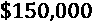的离散百分比(值在 0 到 100 之间)
*   **LASTGIFT** :连续，最近一次礼物的美元金额
*   **RAMNTALL** :连续，迄今为止一生礼物的美元金额
*   **AVGGIFT** :连续，迄今为止的平均礼品金额
*   **MDMAUD_A**: Ordinal, the donation amount code for donors who have given a 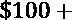 gift at any time in their giving history (values between 0 and 3, -1 for those who have never exceeded 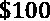). The amount code is the third byte of an **RFA** (**recency/frequency/amount**) major customer matrix code, which is the amount given. The categories are as follows:

    *0* :小于(低美元)

    *1* : 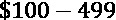(核心)

    *2* : 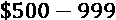(主要)

    *3*:43【zop】

*   **NGIFTALL** :离散，迄今为止的终身礼物的编号
*   **AMT_14**: Ordinal, donation amount code of the RFA for the 14th previous promotion (2 years prior), which corresponds to the last dollar amount given back then:

    *0* : 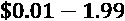

    *1* : 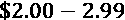

    *2* : 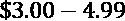

    *3* : 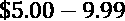

    *4* : 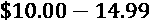

    *5* : 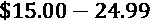

    *6* : 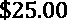及以上

*   `DOMAIN_URBANICITY` (0: Urban, 1: City, 2: Suburban, 3: Town, 4: Rural), meaning the following:

    *1* :最高 SES

    2 :平均社会经济地位，但城市社区高于平均水平

    3:最低的社会经济地位，但低于城市社区的平均水平

    *4* :仅针对城市社区的最低社会经济地位

*   **集群**:名义上，代码表示供体属于哪个集群组
*   MINRAMNT :迄今为止金额最小的连续、美元礼物
*   **LSC2** :捐助者所在社区讲西班牙语的家庭的离散百分比年龄(值在 0 到 100 之间)
*   **IC15** :捐助者所在社区收入<15，000 美元的离散家庭百分比(值在 0 到 100 之间)

从前面的字典和图 10.9 中可以提炼出以下观点:

*   `NGIFTALL`)，有八个特征涉及捐赠历史，完全说得通。那么，这有什么关系呢？因为他们很可能是高度相关的，并且了解如何改进模型。也许可以创建其他特征来更好地提取这些关系。
*   `plt.boxplot(X_test.MAXRAMNT)`，你会看到这些特征是多么的右倾。也许一种转换，例如将它们分成箱——称为“离散化”——或者使用不同的尺度，例如对数(try `plt.boxplot(np.log(X_test.MAXRAMNT))`)可以帮助解释这些特征，而且还有助于找到捐赠可能性显著增加的口袋。
*   **与之前第 14 次促销的关系**:在他们将该促销与数据集标签中指示的促销关联之前两年发生了什么？宣传材料相似吗？是否有季节性因素每隔几年在同一时间发生？也许你可以设计一个特征来更好地识别这种现象。
*   `DOMAIN_SOCIALCLS`根据`DOMAIN_URBANICITY`值有不同的类别。我们可以通过使用量表中的所有五个类别(最高、高于平均水平、一般、低于平均水平和最低)来保持一致，即使这意味着非城市捐赠者将只使用三个类别。这样做的好处是更容易解释，而且不太可能对模型的性能产生负面影响。

SHAP 互动总结图有助于确定功能和互动排名以及它们之间的一些共性。但是为了更深入地挖掘交互，你首先需要量化它们的影响。为此，让我们创建一个热图，其中仅包含按平均绝对 SHAP 值(`shap_rf_interact_avgs`)衡量的顶级相互作用。我们应该然后将所有的对角线值设置为 0 ( `shap_rf_interact_avgs_nodiag`)，因为这些不是交互，而是 SHAP 值，没有它们更容易观察交互。我们可以将这个矩阵放在一个数据帧中，但它是一个 111 列 111 行的数据帧，所以为了通过那些交互最多的特征来过滤它，我们将它们求和并用`scipy`的`rankdata`对它们进行排序。然后，我们使用排名来确定 12 个最具交互性的特征(`most_interact_cols`)，并根据它们对数据帧进行分组。最后，我们将数据框绘制成热图:

```
shap_rf_interact_avgs =\
np.abs(shap_rf_interact_values).mean(0)
shap_rf_interact_avgs_nodiag = shap_rf_interact_avgs.copy()
np.fill_diagonal(shap_rf_interact_avgs_nodiag, 0)
shap_rf_interact_df =\
pd.DataFrame(shap_rf_interact_avgs_nodiag)
shap_rf_interact_df.columns = X_test[llarsic_cols].columns
shap_rf_interact_df.index = X_test[llarsic_cols].columns
shap_rf_interact_ranks = 112 -\
              rankdata(np.sum(shap_rf_interact_avgs_nodiag, axis=0))
most_interact_cols =\
            shap_rf_interact_df.columns[shap_rf_interact_ranks < 13]
shap_rf_interact_df =\
      shap_rf_interact_df.loc[most_interact_cols,most_interact_cols]
sns.heatmap(shap_rf_interact_df, cmap='Blues', annot=True,\   
            annot_kws={'size':10}, fmt='.3f',\
linewidths=.5)
```

前面的代码片段输出的内容如图*图 10.10* 所示。它根据 SHAP 相互作用绝对平均值描绘了最显著的特征相互作用。请注意，这些都是平均值，因此考虑到这些特征的右偏程度，对于许多观测来说，它可能要高得多。然而，这仍然是相对影响的一个很好的指标:


图 10.10-SHAP 互动热图

我们可以通过 SHAP 的`dependence_plot`来逐一理解功能交互的一种方式。例如，我们可以将顶部的特征`MAXRAMNT`，用颜色编码与特征`RAMNTALL`、`LSC4`、`HVP2`和`AVGGIFT`进行交互。但是首先，我们需要计算`shap_values`。但是，我们前面提到过，有几个问题需要解决。它们与以下内容有关:

*   `plt.xlim`和`plt.ylim`。这实际上放大了位于第 1 个和第 99 个百分点之间的情况。
*   `matplotlib`，你可以用`plt.xscale('log')`来完成，而不需要转换特征。

以下代码解释了这两个问题。你可以试着把`xlim`、`ylim`或`xscale`注释掉，看看他们各自在理解`dependence_plot`上的巨大差异:

```
shap_rf_values =\
    shap_rf_explainer.shap_values(X_test.iloc[sample_test_idx]\
                                                [llarsic_cols])
maxramt_shap = shap_rf_values[:,llarsic_cols.index("MAXRAMNT")]
shap.dependence_plot("MAXRAMNT", shap_rf_values,\
                  X_test.iloc[sample_test_idx][llarsic_cols],\
              interaction_index="AVGGIFT", show=False, alpha=0.1)
plt.xlim(xmin=np.percentile(X_test.MAXRAMNT, 1),\
         xmax=np.percentile(X_test.MAXRAMNT, 99))
plt.ylim(ymin=np.percentile(maxramt_shap, 1),\
         ymax=np.percentile(maxramt_shap, 99))
plt.xscale('log')
```

前面的代码生成如图*图 10.11* 所示的内容。它显示了`MAXRAMNT`如何在 10 到 100 之间的某个位置存在一个临界点，此时对模型输出的平均影响开始显现，并且这些与更高的`AVGGIFT`值相关联:


图 10.11-MAXRAMNT 和 AVGGIFT 之间的 SHAP 相互作用图

你可以从*图 10.11* 中学到的一点是，一个聚类是由这些特征的某些值和可能是增加捐赠可能性的另外两个值组成的。从要素工程的角度来看，您可以采用无监督的方法来创建特殊的聚类要素，这些要素仅基于您已确定为相关的少数几个要素。或者，您可以采取更为人工的方式，比较不同的图，以了解如何最好地识别聚类。你可以从这个过程中得到二进制特征，甚至可以得到更清楚地描述相互作用或集群归属的特征之间的比率。

这里的想法不是重新发明轮子，试图做模型已经做得很好的事情，而是首先，旨在更直接的模型解释。希望通过整理特征，这甚至会对预测性能产生积极的影响，因为如果你更好地理解它们，也许模型也是如此！这就像平滑粒状图像；这可能会让你和模型不那么困惑(更多信息请见 [*第 13 章*](B16383_13_ePub_RK.xhtml#_idTextAnchor284) ，*对抗性鲁棒性*)！但是通过模型更好地理解数据还有其他积极的副作用。

事实上，这些课程并不仅限于特征工程或建模，而是可以直接应用于促销。如果识别出的临界点可以用来鼓励捐赠会怎么样？如果你捐款超过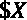，或许可以得到一个免费的杯子？或者设立一个的定期捐赠，并成为“白银”赞助人的专属名单？

我们将在那篇奇怪的笔记上结束这个主题，但希望这能启发你理解我们如何将模型解释的经验应用到特征选择、工程等等。

# 任务完成

为了完成这一任务，您主要使用特征选择工具集来减少过拟合。非营利组织对大约 30%的利润提升感到满意，总成本为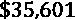，比给测试数据集中的每个人发送邮件的成本少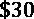000。然而，他们仍然希望确保他们可以安全地使用这种模式，而不用担心会遭受损失。

在这一章中，我们研究了过度拟合是如何导致盈利能力曲线不一致的。未对准是至关重要的，因为这可能意味着基于训练数据选择阈值对于样本外数据是不可靠的。因此，您可以像以前一样使用`compare_df_plots`来比较测试集和训练集之间的盈利能力，但这次是针对所选的模型(`rf_5_e-llarsic`):

```
profits_test = reg_mdls['rf_5_e-llarsic']['profits_test']
profits_train = reg_mdls['rf_5_e-llarsic']['profits_train']
mldatasets.compare_df_plots(\
             profits_test[['costs', 'profit', 'roi']],\
             profits_train[['costs', 'profit', 'roi']],              'Test',\  
             'Train', x_label='Threshold', \
             y_formatter=y_formatter,\
             plot_args={'secondary_y':'roi'})
```

前面的代码生成了如图*图 10.12* 所示的内容。你可以向非营利组织展示这一点，以证明在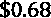有一个最佳点，这是在**测试**中可获得的第二高利润。这也在他们的预算范围内，实现了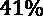的投资回报率。更重要的是，这些数字与**列车**的数字相差不远。另一件值得高兴的事情是，对于**训练**和**测试**来说，利润曲线缓慢下滑，而不是急剧下降。非营利组织可以确信，如果他们选择提高门槛，他们的业务仍然是盈利的。毕竟，他们想从整个邮件列表中锁定捐赠者，为了在经济上可行，他们必须更具排他性。假设他们在整个邮件列表上使用的阈值是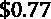;该活动将耗资约 27，000 英镑，但利润回报超过 28，000 英镑:


图 10.12–在不同阈值下，通过 AIC 功能使用套索拉斯的模型的测试和训练数据集的利润、成本和投资回报率之间的比较

恭喜你！你已经完成了这个任务！

但是有一个关键的细节如果我们不提出来，那就是我们的失职。

尽管我们在训练该模型时考虑到了下一次营销活动，但该模型可能会在未来的直接营销活动中使用，无需再训练。这种模型重用带来了一个问题。有一个概念叫做**数据漂移**，也被称为**特征漂移**，也就是随着时间的推移，模型所了解到的关于目标变量的特征不再成立。另一个**概念漂移**，是关于目标特征的定义如何随时间变化。例如，什么构成了一个有利可图的捐助者可以改变。这两种漂移可能同时发生，对于涉及人类行为的问题，这是可以预料的。行为是由文化、习惯、态度、技术和时尚塑造的，它们总是在进化。你可以提醒非营利组织，你只能保证模型在下一次活动中是可靠的，但他们不能每次都雇佣你进行模型再训练！

您可以建议客户创建一个脚本，直接在他们的邮件列表数据库上监控漂移。如果它发现模型所使用的功能有重大变化，它会提醒他们和您。此时，您可以触发模型的自动重新训练。然而，如果漂移是由于数据损坏，您将没有机会解决这个问题。即使完成了自动再训练，如果性能指标不符合预定的标准，也不能部署。无论哪种方式，您都应该密切关注预测性能，以便能够保证可靠性。可靠性是模型可解释性的一个基本主题，因为它与责任紧密相关。我们不会在本书中讨论漂移检测，但未来的章节将讨论数据增强( [*第 11 章*](B16383_11_ePub_RK.xhtml#_idTextAnchor231) 、*偏差减轻和因果推断方法*)和对抗性鲁棒性( [*第 13 章*](B16383_13_ePub_RK.xhtml#_idTextAnchor284) )，这些都与可靠性有关。

# 总结

在这一章中，我们已经了解了不相关的特征是如何影响模型结果的，以及特征选择是如何提供一个工具集来解决这个问题的。然后，我们在这个工具集中探索了许多不同的方法，从最基本的过滤方法到最高级的方法。最后，我们提出了可解释性的特征工程的主题。特征工程可以使模型更容易理解，性能更好。我们将在第 12 章[](B16383_12_ePub_RK.xhtml#_idTextAnchor261)*、*单调性约束和可解释性模型调整*中更详细地介绍这个主题。在下一章，我们将讨论偏差减轻和因果推断的方法。*

 *# 数据集来源

*   凌、李(1998)。*直接营销的数据挖掘:问题与解决方案*。《第四届知识发现和数据挖掘国际会议论文集》(KDD'98)。AAAI 出版社，73-79 年。[https://dl.acm.org/doi/10.5555/3000292.3000304](https://dl.acm.org/doi/10.5555/3000292.3000304)
*   UCI 机器学习知识库。(1998).KDD 杯 1998 数据数据集。[https://archive.ics.uci.edu/ml/datasets/KDD+Cup+1998+Data](https://archive.ics.uci.edu/ml/datasets/KDD+Cup+1998+Data)

# 延伸阅读

*   罗斯学士学位(2014 年)。*离散和连续数据集之间的互信息*。公共科学图书馆一，9。[https://journals.plos.org/plosone/article?id = 10.1371/journal . pone . 0087357](https://journals.plos.org/plosone/article?id=10.1371/journal.pone.0087357)
*   页（page 的缩写）恩斯特·吉尔茨。，& L .韦汉高。(2006).*极度随机化的树木*。机器学习，63(1)，第 3-42 页。[https://link.springer.com/article/10.1007/s10994-006-6226-1](https://link.springer.com/article/10.1007/s10994-006-6226-1)
*   Abid，a .，Balin，M.F .，& Zou，J. (2019)。*用于可区分特征选择和重建的具体自动编码器*。ICML。[https://arxiv.org/abs/1901.09346](https://arxiv.org/abs/1901.09346)
*   谭福芳，付晓霞，张玉英，张志勇，张志勇(2008)。*一种基于遗传算法的特征子集选择方法*。软计算，12，111-120。[https://link.springer.com/article/10.1007/s00500-007-0193-8](https://link.springer.com/article/10.1007/s00500-007-0193-8)
*   曼纽尔·卡尔佐拉里。(2020 年 10 月 12 日)。manuel-calzolari/sk learn-genetic:sk learn-genetic 0.3.0(版本 0 . 3 . 0)。芝诺多。[http://doi.org/10.5281/zenodo.4081754](http://doi.org/10.5281/zenodo.4081754)*