# 十二、单调性约束和可解释性模型调整

大多数模型类都有超参数，可以调整这些超参数以加快执行速度，提高预测性能并减少过度拟合。减少过度拟合的一种方法是将正则化引入模型训练。在 [*第 3 章*](B16383_03_ePub_RK.xhtml#_idTextAnchor051) ，*解释挑战*中，我们将正则化称为一种补救性可解释性属性，它通过惩罚或限制来降低复杂性，迫使模型学习输入的更稀疏表示。正则化模型概括得更好，这就是为什么强烈建议使用这种策略来调优模型。作为一个副作用，更少的特征和它们的相互作用对于正则化模型是必不可少的，使得模型更容易解释— *更少的噪声意味着更清晰的信号*！

尽管有许多超参数，我们将只关注那些通过控制过度拟合来提高可解释性的参数。此外，在一定程度上，我们将通过前几章探讨的与类别不平衡相关的超参数来重新审视偏差减轻。

[*第二章*](B16383_02_ePub_RK.xhtml#_idTextAnchor031) ，*可解释性的关键概念，*解释了影响可解释性的三个模型属性:非线性、交互性和非单调性。如果任其自生自灭，模型可以学习一些虚假的和违反直觉的非线性和交互作用。如第 10 章 、*特征选择和可解释性工程*中所述，可通过仔细的特征工程放置护栏来防止这种情况。然而，为了单调性，我们能做些什么来放置护栏呢？在本章中，我们将学习如何用单调约束来做到这一点。正如单调约束可以是特征工程的模型对应物，正则化可以是我们在第 10 章 T42[和*中讨论的特征选择方法的模型对应物！*](B16383_10_ePub_RK.xhtml#_idTextAnchor205)

这些是我们将在本章中涉及的主要话题:

*   使用特征工程放置护栏
*   针对可解释性调整模型
*   实现模型约束

# 技术要求

本章的示例使用了`mldatasets`、`pandas`、`numpy`、`sklearn`、`xgboost`、`lightgbm`、`catboost`、`tensorflow`、`bayes_opt`、`tensorflow_lattice`、`matplotlib`、`seaborn`、`scipy`、`xai`和`shap`库。关于如何安装所有这些库的说明在前言中。本章的代码位于以下位置:

[https://github . com/packt publishing/Interpretable-Machine-Learning-with-Python/tree/master/chapter 12](https://github.com/PacktPublishing/Interpretable-Machine-Learning-with-Python/tree/master/Chapter12)

# 使命

从福利资源的分配，到拯救生命的手术的优先顺序，再到工作申请的筛选，算法公平的问题具有巨大的社会影响。这些机器学习算法可以决定一个人的生计或生活，而最边缘化和最弱势的人群往往从这些算法中获得最差的待遇，因为它们使从数据中学习到的系统偏见永久化。因此，被错误归类为虐待儿童的是较贫困的家庭；少数种族的人在医疗上处于劣势；正是女性被排除在高薪技术工作之外。即使在涉及不太直接和个性化的风险的情况下，如在线搜索、Twitter 机器人和社交媒体档案，社会偏见，如精英主义、种族主义、性别歧视和 agism 也会得到加强。

本章将继续从 [*第七章*](B16383_07_ePub_RK.xhtml#_idTextAnchor143)*主播和反事实解释*开始的任务。如果你对此不熟悉，请回过头来，只阅读 [*第 7 章*](B16383_07_ePub_RK.xhtml#_idTextAnchor143) 的前几页，先对问题有个扎实的了解。第 7 章的*中的累犯案例是一个算法偏差案例。开发 **COMPAS 算法**(其中 **COMPAS** 代表**矫正罪犯管理概况替代制裁**)的公司联合创始人承认，如果没有与种族相关的问题，很难得分。这种相关性是分数对非裔美国人有偏见的主要原因之一。另一个原因是训练数据中黑人被告的比例可能过高。我们不能确定，因为我们没有原始的训练数据，但我们知道非白人少数群体是被监禁的大多数。我们还知道，黑人通常在逮捕中比例过高，因为在轻微的毒品相关犯罪和黑人社区过度警察化方面存在成文的歧视。*

那么，我们能做些什么来修复它呢？

在 [*第七章*](B16383_07_ePub_RK.xhtml#_idTextAnchor143) 、*主播和反事实解释*中，我们设法通过*代理模型*证明了 COMPAS 算法是有偏差的。对于这一章，假设记者发表了你的发现，一个算法正义倡导组织阅读了这篇文章并伸出了手。制作犯罪评估工具的公司不对偏见负责，并说他们的工具只是反映了现实。倡导组织雇佣你来证明机器学习模型可以被训练成明显不偏向黑人被告，同时确保该模型只反映经证明的刑事司法现实。

这些被证实的事实包括累犯风险随着年龄的增长而单调下降，并且与前科有很强的相关性，这种相关性随着年龄的增长而强烈增加。学术文献支持的另一个事实是，女性总体上不太容易再犯和犯罪。

在我们继续之前，我们必须认识到监督学习模型在从数据中获取领域知识时面临几个障碍。例如，考虑以下情况:

*   **样本、排除或偏见**:如果你的数据不能真实地代表你的模型想要概括的环境呢？如果是这样的话，领域知识将不会与您在数据中观察到的一致。如果产生数据的环境有一种内在的系统性或制度性偏见，那该怎么办？然后，数据将反映这些偏差。
*   **阶层失衡**:如 [*第 11 章*](B16383_11_ePub_RK.xhtml#_idTextAnchor231) 、*偏差减轻和因果推断方法*中所见，阶层失衡可能有利于某些群体。当采取最有效的途径达到高精度时，模型将从这种不平衡中学习，与领域知识相矛盾。
*   **非单调性**:当领域知识要求非单调性时，特征直方图中的稀疏区域或高杠杆异常值可能会导致模型学习非单调性，任何前面提到的问题也可能会导致这种情况。
*   **无影响的特征**:默认情况下，一个非规范化的模型会尝试从所有特征中学习，只要它们携带一些信息，但这阻碍了从相关特征中学习。一个更简洁的模型更有可能支持领域知识所支持的特征。
*   **违反直觉的交互**:正如在 [*第 10 章*](B16383_10_ePub_RK.xhtml#_idTextAnchor205) 、*可解释性的特征选择和工程*中提到的，可能有违反直觉的交互，模型比领域知识支持的交互更受青睐。作为副作用，这些可能最终有利于一些与他们相关的群体。在 [*第七章*](B16383_07_ePub_RK.xhtml#_idTextAnchor143) *、主播和反事实解释*中，我们通过对双重标准的理解看到了这一点的证明。
*   **例外**:我们的领域知识事实是基于总体的理解，但是当在更细的尺度上寻找模式时，模型会发现例外，比如女性累犯的风险高于男性的口袋。已知的现象可能不支持这些模型，但它们仍然是有效的，所以我们必须小心，不要在我们的调整工作中抹去它们。

倡导组织已经验证了这些数据只充分代表了佛罗里达州的一个县，他们为您提供了一个平衡的数据集。第一个障碍很难确定和控制。第二个已经解决了。现在轮到你来处理剩下的四个了！

# 方法

你决定采取三重方法，如下图:

*   **使用特征工程**放置护栏:利用在 [*第 7 章*](B16383_07_ePub_RK.xhtml#_idTextAnchor143) 中学到的经验，以及我们已经掌握的关于前科和年龄的领域知识，特别是，我们将设计一些特征。
*   **调整模型的可解释性**:一旦数据准备就绪，我们将使用不同的类权重和过拟合预防技术来调整许多模型。这些方法将确保模型不仅更好地概括，而且更容易解释。
*   **实现模型约束**:最后但同样重要的是，我们将对最佳模型实现单调和交互约束，以确保它们不会偏离可信和公平的交互。

在最后两个部分中，我们将确保模型准确、公平地运行。我们还将比较数据和模型之间的累犯风险分布，以确保它们一致。

# 制剂

您将在此处找到该示例的代码:

[https://github . com/packt publishing/Interpretable-Machine-Learning-with-Python/tree/master/chapter 12/recidivis _ part 2 . ipynb](https://github.com/PacktPublishing/Interpretable-Machine-Learning-with-Python/tree/master/Chapter12/Recidivism_part2.ipynb)

## 加载库

若要运行此示例，您需要安装以下库:

*   `mldatasets`加载数据集
*   `pandas`和`numpy`来操纵它
*   `sklearn`(sci kit-learn)`xgboost``lightgbm``catboost``tensorflow``bayes_opt``tensorflow_lattice`拆分数据，拟合模型
*   `matplotlib`、`seaborn`、`scipy`、`xai`和`shap`可视化解释

您应该首先加载它们，如下所示:

```
import math
import os
import copy
import mldatasets
import pandas as pd
import numpy as np
from sklearn import preprocessing, model_selection, metrics,\
     linear_model, svm, neural_network, ensemble
import xgboost as xgb
import lightgbm as lgb
import catboost as cb
import tensorflow as tf
from bayes_opt import BayesianOptimization
import tensorflow_lattice as tfl
from tensorflow.keras.wrappers.scikit_learn import KerasClassifier
import matplotlib.pyplot as plt
import seaborn as sns
import scipy
import xai
import shap
```

让我们检查一下`tensorflow`是否用`print(tf.__version__)`加载了正确的版本。这个应该是 2.0 及以上。

## 了解和准备数据

我们像这样将数据加载到一个我们称之为`recidivism_df`的数据帧中:

```
recidivism_df = mldatasets.load("recidivism-risk-balanced")
```

应该有超过 11，000 条记录和 11 个列。我们可以验证`info()`的情况，如下所示:

```
recidivism_df.info()
```

前面的代码输出如下内容:

```
<class 'pandas.core.frame.DataFrame'>
RangeIndex: 11142 entries, 0 to 11141
Data columns (total 12 columns):
 #   Column                   Non-Null Count  Dtype  
---  ------                   --------------  -----  
 0   sex                      11142 non-null  object 
 1   age                      11142 non-null  int64  
 2   race                     11142 non-null  object 
 3   juv_fel_count            11142 non-null  int64  
 4   juv_misd_count           11142 non-null  int64  
 5   juv_other_count          11142 non-null  int64  
 6   priors_count             11142 non-null  int64  
 7   c_charge_degree          11142 non-null  object 
 8   days_b_screening_arrest  11142 non-null  float64
 9   length_of_stay           11142 non-null  float64
 10  compas_score             11142 non-null  int64  
 11  is_recid                 11142 non-null  int64  
dtypes: float64(2), int64(7), object(3)
memory usage: 1.0+ MB
```

输出是正确的。没有缺失值，除了三个特征之外，所有特征都是数字(`sex`、`race`和`charge_degree`)。这是我们在 [*第七章*](B16383_07_ePub_RK.xhtml#_idTextAnchor143) 、*主播和反事实解说*中使用的相同数据，所以数据字典完全一样。然而，数据集已经用采样方法进行了平衡，这次它还没有为我们准备好，所以我们需要这样做，但在此之前，让我们了解一下平衡做了什么。

### 验证取样平衡

我们可以用 XAI 的`imbalance_plot`查一下`race`和`is_recid`是怎么分配的。换句话说，它将统计每个`race` - `is_recid`组合存在多少条记录。这个图将允许我们观察每个`race`的被告人数是否不平衡。代码可以在下面的代码片段中看到:

```
categorical_cols_l = ['sex', 'race', 'c_charge_degree',\
      'is_recid', 'compas_score']
xai.imbalance_plot(recidivism_df, 'race', 'is_recid',\
                categorical_cols=categorical_cols_l)
```

前面的代码输出*图 12.1* ，它描述了所有种族如何拥有相等数量的`is_recid=0`和`is_recid=1`。然而，`upsample` `downsample`另外两个种族之所以取得完全对等是因为它们在被告人口中所占比例较小。这种平衡选择是在这种情况下可以做的许多选择之一。从人口统计学的角度来看，这完全取决于你的数据应该代表什么:被告？囚犯？普通人群中的平民？在什么水平上？县里的？国家？国家？

这里可以看到输出:


图 12.1-按种族划分的 2 年累犯(is_recid)分布

接下来，让我们计算一下我们的每个特征与目标之间的单调相关性。我们在 [*第 5 章*](B16383_05_ePub_RK.xhtml#_idTextAnchor106) 、*全局模型不可知解释方法*中了解了 Spearman 的秩序相关性，但它在本章中会很有用，因为它衡量两个特征之间的单调性。毕竟，这一章的技术主题之一是单调约束，主要任务是产生一个明显更少偏差的模型。

我们首先创建一个没有`compas_score` ( `recidivism_corr_df`)的新`DataFrame`。使用该数据帧，我们输出一个颜色编码的数据帧，其中一个`feature`列包含前 10 个特征的名称，另一个包含所有 10 个特征的 Spearman 系数(`correlation_to_target`)，朝向第 11 个目标变量。代码可以在下面的代码片段中看到:

```
recidivism_corr_df = recidivism_df.drop(['compas_score'],\
 axis=1)
pd.DataFrame({'feature': recidivism_corr_df.columns[:-1],\
    'correlation_to_target':\
       scipy.stats.spearmanr(recidivism_corr_df).correlation[10,:-1]
 }).style.background_gradient(cmap='coolwarm')
```

前面的代码输出如图*图 12.2* 所示的数据帧。最相关的特征是`priors_count`，其次是`age`，三个少年计数，以及`sex`。`c_charge_degree`、`days_b_screening_arrest`、`length_of_stay`和`race`的系数可以忽略不计。

这里可以看到输出:


图 12.2-特征工程前所有特征对目标的 Spearman 系数

接下来，我们将学习如何使用特征工程将一些领域知识“烘焙”到特征中。

# 用特征工程放置护栏

在 [*第七章*](B16383_07_ePub_RK.xhtml#_idTextAnchor143) 、*主播和反事实解说*中，我们了解到除了`race`之外，我们解说中最突出的特征是`age`、`priors_count`、`c_charge_degree`。令人欣慰的是，数据现在已经平衡了，所以归因于这种不平衡的种族偏见现在已经没有了。然而，通过锚定和反事实的解释，我们发现了一些令人不安的不一致。在`age`和`priors_count`的例子中，这些不一致是由于这些特征是如何分布的。我们可以通过特征工程来纠正分布问题，这样可以确保模型不会从不均匀的分布中学习。在`c_charge_degree`的例子中，它是绝对的，缺乏可辨别的顺序，这种顺序的缺乏创造了不直观的解释。

在本节中，我们将研究**普通化**、**离散化**和**交互术语**，这是通过特征工程放置护栏的三种方式。

## 普通化

让我们首先在下面的代码片段中查看一下对于每个`c_charge_degree`类别我们有多少个观察值:

```
recidivism_df.c_charge_degree.value_counts()
```

前面的代码产生了以下输出:

```
(F3)     6555
(M1)     2632
(F2)      857
(M2)      768
(F1)      131
(F7)      104
(MO3)      76
(F5)        7
(F6)        5
(NI0)       4
(CO3)       2
(TCX)       1
Name: c_charge_degree, dtype: int64
```

每个电荷度数对应于电荷的重力。这些重力是有顺序的，但使用分类特征就失去了顺序。我们可以通过用相应的订单替换每个类别来轻松解决这个问题。

我们可以花很多心思来思考这个顺序应该是什么。例如，我们可以看看量刑法律或指导方针——不同程度的监禁有最低或最高年限。我们还可以查看这些人平均暴力程度的统计数据，并将这些信息分配到充电程度。像这样的每一个决定都有潜在的偏见，如果我们没有实质性的证据来支持它，最好使用整数序列。所以，这就是我们现在要做的。我们将创建一个字典(`charge_degree_code_rank`)，从低到高将度数映射到对应于重力等级的数字。然后，我们使用 pandas `replace`函数来使用字典执行替换。代码可以在下面的代码片段中看到:

```
charge_degree_code_rank = {'(F10)': 15, '(F9)':14, '(F8)':13,\
                 '(F7)':12, '(TCX)':11, '(F6)':10, '(F5)':9,\
             '(F4)':8, '(F3)':7, '(F2)':6, '(F1)':5, '(M1)':4,\    
                 '(NI0)':4, '(M2)':3, '(CO3)':2, '(MO3)':1, '(X)':0}
recidivism_df.c_charge_degree.replace(charge_degree_code_rank,\
                                      inplace=True)
```

评估这一顺序如何对应于累犯概率的一种方法是通过一个线形图，显示它如何随着收费程度的增加而变化。为此，我们可以使用一个名为`plot_prob_progression`的函数，它在第一个参数(`c_charge_degree`)中获取一个连续特征，然后在第二个参数(`is_recid`)中测量一个二元特征的概率。它可以按间隔(`x_intervals`)分割连续特征，甚至可以使用四分位数(`use_quartiles`)。最后，您可以定义轴标签和标题。代码可以在下面的代码片段中看到:

```
mldatasets.plot_prob_progression(recidivism_df.c_charge_degree, 
        recidivism_df.is_recid, x_intervals=12,\
        use_quartiles=False, xlabel='Relative Charge Degree',\
     title='Probability of Recidivism by Relative Charge Degree')
```

前面的代码生成图*12.3*中的图。随着现在排名的收费程度增加，趋势是 2 年累犯的概率降低，除了排名 1。在概率下面，有条形图显示每个等级的观察分布。因为它分布如此不均匀，你应该对这种趋势持保留态度。你会注意到一些等级如 0，8 和 13-15 没有出现在图中，因为在刑事司法系统中存在指控程度类别，但没有出现在数据中。

这里可以看到输出:


图 12.3–按充电程度绘制的概率级数图

从功能工程的角度来看，我们不能做更多的改进`c_charge_degree`，因为它已经代表了离散的类别，现在通过订单得到了增强。任何进一步的转换都可能导致大量的信息丢失，除非我们有证据表明并非如此。另一方面，连续要素本身具有一定的顺序，但它们所具有的精度可能会产生问题，因为微小的差异可能没有意义，但数据可能会告诉模型并非如此。不均匀的分布和违反直觉的相互作用只会加剧这个问题。

## 离散化

为了理解如何最好地离散化我们的`age`连续特征，让我们尝试两种不同的方法。我们可以使用大小相等的离散化，也称为固定宽度仓或区间，这意味着仓的大小由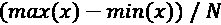决定，其中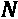是仓的数量。另一种方法是等频率离散化，也称为四分位数，它确保每个箱具有或多或少相同的观察值。尽管有时，考虑到直方图的偏斜性质，可能无法将它们分成 N 个四分位数，所以你可能会得到 N-1 个四分位数。

很容易用`plot_prob_progression`来比较这两种方法，但这次我们制作了两个图，一个是固定宽度的面元(`use_quartiles=False`)，另一个是四分位数(`use_quartiles=True`)。代码可以在下面的代码片段中看到:

```
mldatasets.plot_prob_progression(recidivism_df.age,\
      recidivism_df.is_recid, x_intervals=7,\
use_quartiles=False,\
      title='Probability of Recidivism by Age Discretized in Fix-Width Bins', xlabel='Age')
mldatasets.plot_prob_progression(recidivism_df.age,\
      recidivism_df.is_recid, x_intervals=7,\
use_quartiles=True,\
      title='Probability of Recidivism by Age Discretized\
in Quartiles', xlabel='Age')
```

前面的代码片段输出了*图 12.4* 。通过查看`age`特征是右偏的，这导致最后一个面元的概率上升。这是因为在这个箱中存在一些异常值。另一方面，固定频率(四分位数)图直方图更加均匀，概率持续下降。换句话说，它是单调的——根据我们对这个主题的领域知识，它应该是单调的。

这里可以看到输出:


图 12.4-比较年龄的两种离散化方法

很容易观察到为什么使用分位数对特征进行分类是更好的方法。我们可以用`age`设计一个叫做`age_group`的新特征。`qcut` pandas 函数可以执行基于分位数的离散化。代码可以在下面的代码片段中看到:

```
recidivism_df['age_group'] = pd.qcut(recidivism_df.age, 7,\
                                     precision=0).astype(str)
```

所以，我们现在把`age`离散化成了`age_group`。但必须注意的是，很多模型类都是自动离散化的，何苦呢？因为它允许你控制它的影响。否则，模型可能会决定不确保单调性的条柱。例如，模型可能总是尽可能使用 10 个四分位数。尽管如此，如果你在`age` ( `x_intervals=10`)上尝试这种级别的粒度，你最终会得到概率级数的峰值。我们的目标是确保模型将了解到`age`和`is_recid`的发生率具有单调关系，如果我们允许模型选择可能实现或可能不实现相同目标的箱，我们无法确定这一点。

我们将移除`age`，因为`age_group`拥有我们需要的一切。但是等等——你会问——去掉这个变量，我们不会失去一些重要的信息吗？有，但只是因为它和`priors_count`的互动。因此，在我们删除任何特征之前，让我们检查一下这种关系，并认识到如何通过创建一个交互术语，我们可以保留一些由于删除`age`而丢失的信息，同时保持交互。

## 相互作用项和非线性变换

从 [*第 7 章*](B16383_07_ePub_RK.xhtml#_idTextAnchor143) 、*锚定和反事实解释、*中我们已经知道`age`和`priors_count`是两个最重要的预测因素，我们可以很容易地看到它们如何与`plot_prob_contour_map`一起影响的累犯发生率(`is_recid`)。此函数生成带有颜色编码轮廓区域的等高线，表示不同的量级。它们在地形中很有用，可以显示海拔高度。在机器学习中，他们可以显示一个度量在两个维度的区域中如何变化。在这种情况下，我们的维度是`age`和`priors_count`，度量是累犯发生率。该函数接收的参数与`plot_prob_progression`相同，除了它采用两个对应于 *x* 轴和 *y* 轴的特征。代码可以在下面的代码片段中看到:

```
mldatasets.plot_prob_contour_map(recidivism_df.age,\
        recidivism_df.priors_count,\
        recidivism_df.is_recid,\
     use_quartiles=True, xlabel='Age', ylabel='Priors Count',\
     title='Probability of Recidivism by Age/Priors Discretized in Quartiles')
```

前面的代码片段生成了*图 12.5* ，它显示了当按四分位数离散时，2 年累犯的概率是如何增加的，`age`越低，`priors_count`越高。它还显示了两个特征的直方图。`priors_count`非常右偏，因此离散化是有挑战性的，并且等高线图不提供右下和左上之间完美的对角线级数。如果这个图看起来很熟悉，那是因为它就像我们在 [*第四章*](B16383_04_ePub_RK.xhtml#_idTextAnchor081) ，*特征重要性和影响的基本原理*中制作的部分依赖交互图，除了它不是根据模型的预测测量的，而是根据基础事实(`is_recid`)。我们必须区分数据可以直接告诉我们的东西和模型从数据中学到的东西。

这里可以看到输出:


图 12.5-年龄和前科的累犯概率等值线图

我们现在可以设计一个包含这两个特征的交互项。即使等值线图离散化了要素以观察更平滑的进展，我们也不需要离散化这种关系。有意义的是使它成为每年`priors_count`的比率。但是几年前的事了？当然，被告已经成年好几年了。但是为了获得年份，我们不能使用`age` - 18，因为这将导致零除，所以我们将使用 17 来代替。当然，有许多方法可以做到这一点。最好的方法是，假设我们有带小数的年龄，通过减去 18，我们可以计算出一个非常精确的每年前科比率。然而，不幸的是，我们没有。您可以在下面的代码片段中看到代码:

```
recidivism_df['priors_per_year'] =\
           recidivism_df['priors_count']/(recidivism_df['age'] - 17)
```

黑盒模型通常会自动找到交互术语。例如，神经网络中的隐藏层具有所有一阶相互作用，但是由于非线性激活，它不限于线性组合。然而,“手动”定义相互作用项甚至非线性变换允许我们在模型拟合后更好地解释它们。此外，我们还可以对它们使用单调约束，这正是我们稍后将对`priors_per_year`所做的。现在，让我们检查一下它的单调性是否对`plot_prob_progression`成立。看看下面的代码片段:

```
mldatasets.plot_prob_progression(recidivism_df.priors_per_year,  
   recidivism_df.is_recid, x_intervals=8, xlabel='Priors Per Year',\
  title='Probability of Recidivism by Priors per Year (according to data)')
```

前面的代码片段输出了下面屏幕截图中的进度，显示了新特征是如何近乎单调的:


图 12.6-每年先验概率级数

`priors_per_year`没有更单调的原因是每年超过 3.0 次的区间是多么稀疏。因此，对这几个被告强制执行单调性是非常不公平的，因为他们提出了 75%的风险下降。解决这个问题的一种方法是通过为这些观察设置`priors_per_year=-1`将它们向左移动，如下面的代码片段所示:

```
recidivism_df.loc[recidivism_df.priors_per_year > 3,\
                  'priors_per_year'] = -1
```

当然，这种转变稍微改变了对特征的解释，要知道-1 这几个值实际上意味着超过 3。现在，让我们生成另一个等高线图，但是这次是在`age_group`和`priors_per_year`之间。后者将以四分位数(`y_intervals=6, use_quartiles=True`)离散化，以便更容易观察到累犯的概率。代码如下面的代码片段所示:

```
mldatasets.plot_prob_contour_map(recidivism_df.age_group,   
           recidivism_df.priors_per_year, recidivism_df.is_recid,\
           y_intervals=6, use_quartiles=True, xlabel='Age Group',\
         title='Probability of Recidivism by Age/Priors per Year Discretized in Quartiles', ylabel='Priors Per Year')
```

前面的片段生成了*图 12.7* 中的轮廓。它表明，对于的大部分，情节朝一个方向发展。我们希望实现这一结果，因为它允许我们通过一个交互功能来控制过去涉及两个功能的单调性。

这里可以看到输出:


图 12.7-年龄组和前科的累犯概率等值线图

几乎所有的东西都准备好了，但是`age_group`仍然是绝对的，所以我们必须对它进行编码以获得一个数字形式。

## 分类编码

`age_group`的最佳分类编码方法是`sex`和`race`。对于`sex`，顺序编码将其转换为二进制形式——相当于`race`是一个更难的调用，因为它有三个类别，使用顺序编码可能会导致偏差。然而，是否要`race`，发生这种情况的风险较低，无论如何，我们稍后将删除此功能，因此我们将继续对其进行序号编码。

为了对这三个特征进行顺序编码，我们将使用 scikit-learn 的`OrdinalEncoder`。我们可以利用它的`fit_transform`功能，一举实现特征的拟合和变换。然后，我们还应该删除不必要的功能，而我们在它。看看下面的代码片段:

```
cat_feat_l = ['sex', 'race', 'age_group']
ordenc = preprocessing.OrdinalEncoder(dtype=np.int8)
recidivism_df[cat_feat_l] =\
                     ordenc.fit_transform(recidivism_df[cat_feat_l])
recidivism_df.drop(['age', 'priors_count', \
'compas_score'], axis=1,\
                    inplace=True)
```

现在，我们还没有完全完成。我们仍然应该初始化我们的随机种子，并训练/测试分割我们的数据。

## 其他制剂

接下来的准备工作相当简单。为了确保可再现性，让我们在任何需要的地方设置一个随机种子，然后将我们的`y`设置为`is_recid`并将`X`设置为其他特征。我们对那两个执行`train_test_split`。最后，我们用后跟`y`的`X`来重建`recidivism_df`数据帧。这样做的唯一原因是`is_recid`是最后一列，这将有助于下一步。代码可以在这里看到:

```
rand = 9
os.environ['PYTHONHASHSEED'] = str(rand)
tf.random.set_seed(rand)
np.random.seed(rand)
y = recidivism_df['is_recid']
X = recidivism_df.drop(['is_recid'], axis=1).copy()
X_train, X_test, y_train, y_test =\
            model_selection.train_test_split(X, y, test_size=0.2,\
                                              random_state=rand)
recidivism_df = X.join(y)
```

我们现在将验证斯皮尔曼的相关性在需要的地方得到了改善，否则保持不变。看看下面的代码片段:

```
pd.DataFrame({'feature': X.columns,\
         'correlation_to_target':\
            scipy.stats.spearmanr(recidivism_df).correlation[10,:-1]
        }).style.background_gradient(cmap='coolwarm')
```

前面的代码输出如图*图 12.8* 所示的数据帧。请与*图 12.2* 进行比较。注意，在四分位数中离散化，`age`甚至与目标更加单调相关。一旦普通化，`c_charge_degree`也更加相关，`priors_per_year`也比`priors_count`有所提升。其他特征都不会受到影响，包括那些系数最低的特征。

这里可以看到输出:


图 12.8-所有特征与目标的 Spearman 相关系数(特征工程后)

具有最低系数的特征在模型中也可能是不必要的，但是我们将通过正则化让模型决定它们是否有用。这就是我们接下来要做的。

# 调整模型的可解释性

传统上，正则化只能通过在系数或权重上施加惩罚项来实现，如 **L1** 、 **L2** 或**弹性网**，这缩小了最不相关特征的影响。如第 10 章 、*特征选择和可解释性工程*的*嵌入方法*部分所见，这种正则化形式导致特征选择，同时也减少过拟合。这给我们带来了正则化的另一个更广泛的定义，它不需要惩罚项。通常，这会强加一个限制，或者一个停止标准，迫使模型抑制其复杂性。

除了狭义(基于惩罚)和广义(*过拟合方法*)的正则化之外，还有其他方法来调整模型的可解释性，即通过调整训练过程来提高模型的公平性、可问责性和透明度。例如，我们在 [*第 10 章*](B16383_10_ePub_RK.xhtml#_idTextAnchor205) 、*特征选择和可解释性工程*中讨论的类不平衡超参数以及 [*第 11 章*](B16383_11_ePub_RK.xhtml#_idTextAnchor231) 、*偏见减轻和因果推理方法*中的对抗性去偏见增强了公平性。此外，我们将在本章中进一步研究的约束对公平性、责任性和透明度有潜在的好处。

有这么多不同的调谐可能性和这么多的模型类。正如本章开头所述，我们将重点关注与可解释性相关的选项，但也会将模型类限制在一个流行的深度学习库(Keras)、一些流行的树集成(XGBoost、RandomForest 等)、**支持向量机** ( **SVMs** )和逻辑回归。除了最后一个，这些都算黑箱模型。

## 调整一个 Keras 神经网络

对于 Keras 模型，我们将通过超参数调整和**分层 K-fold 交叉验证**来选择最佳的正则化参数。我们将通过以下步骤完成这项工作:

1.  首先，我们需要定义要调整的模型和参数。
2.  然后，我们运行调优。
3.  接下来，我们检查它的结果。
4.  最后，我们提取最佳模型并评估其预测性能。

让我们详细看一下这些步骤。

### 定义要调整的模型和参数

我们应该做的第一件事是创建一个函数(`build_nn_mdl`)来构建和编译一个可正则化的 Keras 模型。该函数接受有助于优化它的参数。它需要一个元组，其中包含隐藏层中的神经元数量(`hidden_layer_sizes`)，以及应用于层内核的 L1 ( `l1_reg`)和 L2 ( `l1_reg`)正则化的数量。最后，它需要一定量的`dropout`，与 L1 和 L2 的惩罚不同，它是一种**随机正则化方法**，因为它采用随机选择。看看下面的代码片段:

```
def build_nn_mdl(hidden_layer_sizes, l1_reg=0, l2_reg=0, dropout=0):
 nn_model = tf.keras.Sequential([
  tf.keras.Input(shape=[len(X_train.keys())]),
  tf.keras.layers.experimental.preprocessing.Normalization()
 ])
 reg_args = {}
 if (l1_reg > 0) or (l2_reg > 0):
  reg_args = {'kernel_regularizer':
     tf.keras.regularizers.l1_l2(l1=l1_reg, l2=l2_reg)}
 for hidden_layer_size in hidden_layer_sizes:
  nn_model.add(tf.keras.layers.Dense(hidden_layer_size,
          activation='relu', **reg_args))
 if dropout > 0:
  nn_model.add(tf.keras.layers.Dropout(dropout))
 nn_model.add(tf.keras.layers.Dense(1, \
activation='sigmoid')) 
 nn_model.compile(loss='binary_crossentropy',\
          optimizer=tf.keras.optimizers.Adam(lr=0.0004),\
          metrics=['accuracy',tf.keras.metrics.AUC(name='auc')])
  return nn_model
```

前面的函数将模型(`nn_model`)初始化为`Sequential`模型，该模型具有对应于训练数据中特征数量的输入层，以及标准化输入的`Normalization()`层。然后，如果任何一个惩罚项超过零，它将设置一个字典(`reg_args`)，将`kernel_regularizer`分配给用这些惩罚初始化的`tf.keras.regularizers.l1_l2`。一旦它用相应的`hidden_layer_size`添加了隐藏的(`Dense`)层，它将把`reg_args`字典作为额外的参数传递给每个层。添加完所有的隐藏层后，它将可选地添加`Dropout`层和最后的`Dense`层，并激活`sigmoid`以输出。然后用`binary_crossentropy`和一个学习速率慢的`Adam`优化器编译模型，并设置为监控`accuracy`和`auc`和`metrics`。

### 运行超参数调整

现在，我们已经定义了模型和要调整的参数，我们初始化`RepeatedStratifiedKFold`交叉验证器，它在每次重复中使用不同的随机化将训练数据分成五份(共三次)(`n_splits`)。然后，我们为网格搜索超参数调整创建一个网格(`nn_grid`)。它只测试三个参数(`l1_reg`、`l2_reg`和`dropout`)的两个可能选项，这将产生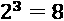组合。我们将使用一个 scikit-learn 包装器(`KerasClassifier`)来使我们的模型与 scikit-learn 网格搜索兼容。说到这里，我们接下来初始化`GridSearchCV`，它使用 Keras 模型(`estimator`)执行交叉验证(`cv`)网格搜索(`param_grid`)。我们希望它根据精度(`scoring`)选择最佳参数，并且在过程中不产生误差(`error_score=0`)。最后，我们通过`X_train`、`y_train`、`epochs`和`batch_size`，像对任何 Keras 模型一样拟合`GridSearchCV`。代码可以在下面的代码片段中看到:

```
cv = model_selection.RepeatedStratifiedKFold(n_splits=5,\
                                     n_repeats=3, random_state=rand)
nn_grid = {'hidden_layer_sizes':[(80,)], \
'l1_reg':[0,0.005],\
          'l2_reg':[0,0.01], 'dropout':[0,0.05]}
nn_model = KerasClassifier(build_fn=build_nn_mdl)
nn_grid_search = model_selection.GridSearchCV(estimator=nn_model,\ 
                      cv=cv, n_jobs=-1, param_grid=nn_grid,\
                      scoring='precision', error_score=0, verbose=0)
nn_grid_result = nn_grid_search.fit(X_train.astype(float), 
                                 y_train.astype(float),                                 epochs=400,\
                                 batch_size=128, verbose=0) 
```

### 检查结果

一旦网格搜索完成，你可以用这个命令`print(nn_grid_result.best_params_)`输出字典中的最佳参数。或者，您可以将所有结果放入一个`DataFrame`，按最高精度排序(`sort_values`，并输出如下:

```
pd.DataFrame(nn_grid_result.cv_results_)
      [['param_hidden_layer_sizes','param_l1_reg', 'param_l2_reg',\  
        'param_dropout', 'mean_test_score', 'std_test_score',\
        'rank_test_score']].\
 sort_values(by='rank_test_score')
```

前面的代码片段输出了图 12.9 中所示的数据帧。未规则化模型垫底，显示所有规则化模型组合表现更好。需要注意的一点是，假设标准偏差约为 1.5-2%(`std_test_score`)，并且表现最好的公司与表现最差的公司仅相差 2.2%，在这种情况下，从精确度的角度来看，收益是微不足道的，但由于其他收益，您仍应使用正则化模型。

这里可以看到输出:


图 12.9-神经网络模型的交叉验证网格搜索结果

### 评估最佳模型

网格搜索产生的另一个重要的元素是表现最好的模型(`nn_grid_result.best_estimator_`)。我们可以创建一个字典来存储我们将在本章中使用的所有模型(`fitted_class_mdls`)，然后使用`evaluate_class_mdl`，评估这个正则化的 Keras 模型，同时将评估保存在字典中。看看下面的代码片段:

```
fitted_class_mdls = {}
fitted_class_mdls['keras_reg'] =
  mldatasets.evaluate_class_mdl(nn_grid_result.best_estimator_,\
         X_train.astype(float), X_test.astype(float),\
         y_train.astype(float), y_test.astype(float),\
      plot_roc=False, plot_conf_matrix=True, ret_eval_dict=True)
```

前面的片段产生了图 12.10 中所示的混淆矩阵和指标。准确性比来自 [*第 7 章*](B16383_07_ePub_RK.xhtml#_idTextAnchor143) 、*锚和反事实解释*的原始 COMPAS 模型好一点，但在正则化的同时优化更高精度的策略产生了一个假阳性几乎一半但假阴性多 50%的模型。

这里可以看到输出:


图 12.10-正则化 Keras 模型的评估

校准等级平衡可以通过使用自定义损失函数或等级权重来进一步改进，我们将在后面进行介绍。接下来，我们将讨论如何调优其他模型类。

## 调优其他流行模型类

在这一部分，我们将适合许多不同的模型，包括非正规的和正规的。为此，我们将从广泛选择的参数中进行选择，这些参数执行惩罚正则化，通过其他方式控制过拟合，并考虑类不平衡。

### 相关模型参数的快速介绍

作为参考，这里有两个表，其中的参数用于调整许多流行的模型。这些被分成两部分。部分 A ( *图 12.11* )有五个带惩罚正则化的 scikit-learn 模型。B 部分(*图 12.12* )是所有的树集合，包括 scikit-learn 的 RandomForest 模型和来自最流行的 boosted-tree 库(XGBoost、LightGBM 和 CatBoost)的模型。

A 部分可以在这里看到:


图 12.11–调整惩罚正则化 scikit-learn 模型的参数

在*图 12.11* 中，您可以看到列中的模型和行中相应的参数名称，它们的默认值在右边。在参数名和缺省值之间，有一个加号或减号，表示在一个方向或另一个方向更改缺省值是否会使模型更保守。这些参数也按以下类别分组:

*   **算法**:一些训练算法不太容易过拟合，但通常这取决于数据。
*   **正规化**:仅在更严格的意义上。换句话说，控制基于惩罚的正则化的参数。
*   **迭代**:控制执行多少轮训练、迭代或时期。朝一个方向或另一个方向调整会影响过度拟合。在基于树的模型中，估值器或树的数量是相似的。
*   **学习速率**:控制学习的速度。它与迭代协同工作。学习率越低，优化目标函数的迭代次数越高。然而，你想在训练过度之前缩短训练，这就是为什么你需要提前停止。
*   **提前停止**:这些参数控制何时停止训练。
*   **类别不平衡**:对于大多数模型，这在损失函数中对较小类别的错误分类进行惩罚，特别是对于基于树的模型，它用于重新加权分裂标准。无论哪种方式，它只适用于分类器。
*   **样本权重**:我们利用了第 11 章*中的权重，偏差减轻和因果推断方法*，在样本基础上分配权重以减轻偏差。

标题中既有分类又有回归模型，它们共享相同的参数。请注意，scikit-learn 的`LinearRegression`不在`LogisticRegression`下，因为它没有内置的正则化功能。在任何情况下，我们将在本节中只使用分类模型。

B 部分可以在这里看到:

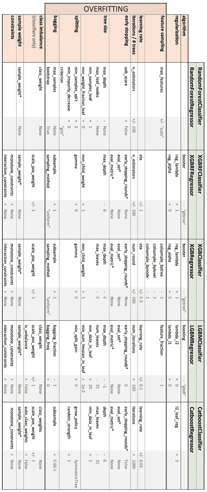

图 12.12-树集合模型的调整参数

*图 12.12* 与*图 12.11* 非常相似，除了它有几个仅在树集合中可用的参数类别，例如:

*   **特征采样**:这通过在节点分裂、节点或树训练中考虑较少的特征来工作。这是一种随机正则化方法，因为特征是随机选择的。
*   **树的大小**:限制树的最大深度或最大叶子数，或者其他一些限制其生长的参数，从而抑制过度拟合。
*   **分割**:任何控制如何分割树中节点的参数都会间接影响过度拟合。
*   **打包**:也称为**引导聚集**，这从引导开始，其中涉及从训练数据中随机抽取样本以适合弱学习者。这种方法减少了方差，有助于过拟合，通过扩展，相应的采样参数通常在超参数调整中很突出。
*   **约束**:我们将在下一节中进一步详细解释这些约束，但这映射了应该如何约束特征相对于输出减少或增加。它可以减少数据非常稀疏的区域中的过度拟合。然而，减少过度拟合通常不是主要目标，而交互约束可以限制允许哪些特征进行交互。

请注意，*图 12.12* 中带星号(`*`)的参数表示在`fit`函数中设置的参数，而不是用模型初始化的参数。此外，除了 scikit-learn 的`RandomForest`模型，所有其他参数通常都有许多别名。对于这些，我们使用 scikit-learn 包装器函数，但是所有参数也存在于本地版本中。我们不可能在这里解释每一个模型参数，但是建议您直接阅读文档，更深入地了解每一个参数的作用。这一节的目的是作为指南或参考。

接下来，我们将采取与 Keras 模型类似的步骤，但同时针对许多不同的模型，最后，我们将评估最佳模型的公平性。

### 批量超参数调整模型

好的——现在我们已经上了一堂快速速成课，学习了如何调节模型，让我们像在其他章节中一样，定义一个包含所有模型的字典。这一次，我们包含了一个带有一些参数值的`grid`，用于网格搜索。看看下面的代码片段:

```
class_mdls = {
 'logistic':{
       'model':linear_model.LogisticRegression(random_state=rand,\
                                               max_iter=1000),
    'grid':{'C':np.linspace(0.01, 0.49, 25),\
               'class_weight':[{0:6,1:5}],
           'solver':['lbfgs', 'liblinear', 'newton-cg']}},
 'svc':{'model':svm.SVC(probability=True,\
random_state=rand),
    'grid':{'C':[15,25,40], 'class_weight':[{0:6,1:5}]}},
 'nu-svc':{'model':svm.NuSVC(probability=True,\
random_state=rand),
    'grid':{'nu':[0.2,0.3], 'gamma':[0.6,0.7],\
    'class_weight':[{0:6,1:5}]}},
 'mlp':{'model':neural_network.MLPClassifier(random_state=rand,\
      hidden_layer_sizes=(80,), early_stopping=True),\
    'grid':{'alpha':np.linspace(0.05, 0.15, 11),
    'activation':['relu','tanh','logistic']}},
 'rf':{'model':ensemble.RandomForestClassifier(random_state=rand,
                  max_depth=7, oob_score=True,\
bootstrap=True),\
   'grid':{'max_features':[6,7,8],\
'max_samples':[0.75,0.9,1],
         'class_weight':[{0:6,1:5}]}},
 'xgb-rf':{'model':xgb.XGBRFClassifier(seed=rand, eta=1,\
                                     max_depth=7, n_estimators=200),
    'grid':{'scale_pos_weight':[0.85],\
'reg_lambda':[1,1.5,2],
           'reg_alpha':[0,0.5,0.75,1]}},
 'xgb':{'model':xgb.XGBClassifier(seed=rand, eta=1,\
max_depth=7),\
   'grid':{'scale_pos_weight':[0.7],\
'reg_lambda':[1,1.5,2],\
          'reg_alpha':[0.5,0.75,1]}},
 'lgbm':{'model':lgb.LGBMClassifier(random_seed=rand,\  
                                    learning_rate=0.7, max_depth=5),
   'grid':{'lambda_l2':[0,0.5,1], 'lambda_l1':[0,0.5,1],\
         'scale_pos_weight':[0.8]}},
 'catboost':{'model':cb.CatBoostClassifier(random_seed=rand,\ 
                             depth=5, learning_rate=0.5, verbose=0),
    'grid':{'l2_leaf_reg':[2,2.5,3], 'scale_pos_weight':[0.65]}}
}
```

下一步是给字典中的每个模型添加一个`for`循环，然后`deepcopy`它和`fit`它产生一个“基础”非正则化模型。接下来，我们用`evaluate_class_mdl`为它生成一个评估，并将其保存到我们之前为 Keras 模型创建的`fitted_class_mdls`字典中。现在，我们需要制作模型的正则化版本。因此，我们执行另一个`deepcopy`，并按照与 Keras 相同的步骤使用`GridSearchCV`执行`RepeatedStratifiedKFold`交叉验证网格搜索，我们也以相同的方式进行评估，将结果保存在拟合模型字典中。代码如下面的代码片段所示:

```
for mdl_name in class_mdls:
 print(mdl_name)
 base_mdl = copy.deepcopy(class_mdls[mdl_name]['model'])
 base_mdl = base_mdl.fit(X_train, y_train)
 fitted_class_mdls[mdl_name+'_base'] =
   mldatasets.evaluate_class_mdl(base_mdl, X_train, X_test,\
           y_train, y_test, plot_roc=False, plot_conf_matrix=False,\  
           show_summary=False, ret_eval_dict=True)
 reg_mdl = copy.deepcopy(class_mdls[mdl_name]['model'])
 grid = class_mdls[mdl_name]['grid']
 cv = model_selection.RepeatedStratifiedKFold(n_splits=5,\
                                n_repeats=3, random_state=rand)
 grid_search =\
model_selection.GridSearchCV(estimator=reg_mdl,\
                   cv=cv, param_grid=grid, scoring='precision',\
                   n_jobs=-1, error_score=0, verbose=0)
 grid_result = grid_search.fit(X_train, y_train)
 fitted_class_mdls[mdl_name+'_reg'] =\
   mldatasets.evaluate_class_mdl(grid_result.best_estimator_,\
           X_train, X_test, y_train, y_test, plot_roc=False,\
           plot_conf_matrix=False, show_summary=False,\
           ret_eval_dict=True)
 fitted_class_mdls[mdl_name+'_reg']['cv_best_params'] =\
                                    grid_result.best_params_
```

一旦代码完成，我们就可以根据精度对模型进行排序。

### 通过精度评估模型

我们可以提取适合的模型字典的指标，并将它们放入带有`from_dict`的`DataFrame`中。然后，我们可以根据最高测试精度对模型进行分类，并对最重要的两列进行颜色编码，这两列是`precision_test`和`recall_test`。代码可以在下面的代码片段中看到:

```
class_metrics = pd.DataFrame.from_dict(fitted_class_mdls,\
                'index')[['accuracy_train', 'accuracy_test',\
                         'precision_train', 'precision_test',\
                         'recall_train', 'recall_test',\
                         'roc-auc_test', 'f1_test', 'mcc_test']]
with pd.option_context('display.precision', 3):
 html = class_metrics.sort_values(by='precision_test',\
              ascending=False).\
  style.background_gradient(cmap='plasma',  
                             subset=['precision_test']).\
  background_gradient(cmap='viridis', subset=['recall_test'])
html
```

前面的代码将输出如图*图 12.13* 所示的数据帧。你可以看出，正则化的树集合模型统治着等级，紧随其后的是它们的非正则化的对应模型。唯一的例外是第二个正则化的 Nu-SVC，它的非正则化版本排在最后！

这里可以看到输出:


图 12.13-根据交叉验证网格搜索的顶级模型

Keras 正则化神经网络模型比 logistic 回归精度低，但召回率高。诚然，我们希望优化高精度，因为它会影响假阳性，我们希望将假阳性降至最低，但精度可以是 100%，召回率是 0%，如果是这样，您的模型就不好了。与此同时，还有公平，这是关于有一个低的假阳性率，但在种族之间平等分布。所以，这是一个平衡的行为，追逐一个指标不会让我们达到目的。

### 评估最高性能模型的公平性

为了首先确定如何继续，我们必须首先评估我们的最高性能模型在公平性方面的表现。我们可以用`compare_confusion_matrices`做到这一点。就像使用 scikit-learn 的`confusion_matrix`一样，第一个参数是基本事实或目标值(通常称为“`y_true`”)，第二个参数是模型的预测(通常称为“`y_pred`”)。这里的不同之处在于，它需要两组“`y_true`”和“`y_pred`”，一组对应于一个观察片段，另一组对应于另一个。在这前四个参数之后，你给每个段一个的名字，所以这是下面两个参数告诉你的。最后，`compare_fpr=True`确保它将比较两个混淆矩阵之间的**假阳性率** ( **FPR** )。看看下面的代码片段:

```
y_test_pred =\
fitted_class_mdls['catboost_reg']['preds_test']
_ = mldatasets.\
   compare_confusion_matrices(y_test[X_test.race==1],\
      y_test_pred[X_test.race==1], y_test[X_test.race==0],\
      y_test_pred[X_test.race==0], 'Caucasian', 'African-American',\   
      compare_fpr=True)
y_test_pred = \
fitted_class_mdls['catboost_base']['preds_test']
_ = mldatasets.\
   compare_confusion_matrices(y_test[X_test.race==1],\
      y_test_pred[X_test.race==1], y_test[X_test.race==0],\  
      y_test_pred[X_test.race==0], 'Caucasian', 'African-American',\
      compare_fpr=True)
```

前面的代码片段输出*图 12.14* 和*图 12.15，*分别对应于正则化和基模型。你可以在这里看到*图 12.14* :


图 12.14-正则化 CatBoost 模型的比赛间混淆矩阵

*图 12.15* 告诉我们正则化模型的 FPRs 更低。您可以在这里看到输出:


图 12.15-基本 CatBoost 模型的比赛间混淆矩阵

然而，*图 12.15* 中的基础模型的 FPR 比率为 1.08，相比之下，正则化模型的比率为 1.09，尽管总体指标更好，但这还是稍显不公平。这种差异不足以证明使用基本模型的合理性。但是，当试图同时实现几个目标时，很难客观地评估和比较模型，这就是我们将在下一节中做的。

## 使用贝叶斯超参数调整和自定义指标优化公平性

我们的任务是生产一个具有高精度和良好召回率的模型，同时保持不同种族之间的公平性。因此，保持整个任务的真实性需要设计一个定制的度量标准。

### 设计自定义指标

我们可以使用 F1 分数，但是它对精确度和召回率一视同仁，所以我们必须创建一个加权的指标。当我们这样做的时候，我们也可以考虑每个种族的精确度和召回率是如何分布的。一种方法是使用标准偏差，它量化了这种分布的变化。为此，我们将用精度的组间标准差的一半来惩罚精度，我们可以称之为惩罚精度，因为没有更好的术语。公式如下所示:

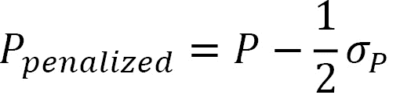

我们可以对召回进行同样的操作，如下所示:

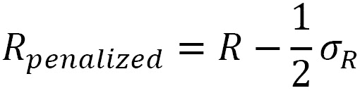

然后，我们对惩罚精度和召回率进行加权平均，其中精度是召回率的两倍，如下所示:

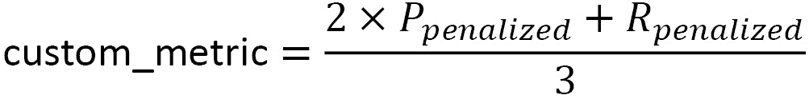

为了计算这个新的指标，我们需要创建一个函数，我们可以称之为`weighted_penalized_pr_average`。它将`y_true`和`y_pred`作为预测性能指标。然而，它还包括带有包含组值的熊猫系列或数组的`X_group`,以及带有值列表的`group_vals`,该列表将作为预测的子集。在这种情况下，组是`race`，可以是从 0 到 2 的值。该函数包括一个`for`循环，该循环遍历这些可能的值，按每个组对预测进行子集化。这样，它可以计算每组的精确度和召回率。在此之后，函数的其余部分简单地执行前面概述的三个数学运算。代码可以在下面的代码片段中看到:

```
def weighted_penalized_pr_average(y_true, y_pred, X_group,\
                    group_vals, penalty_mult=0.5,\
                    precision_mult=2,\  
                    recall_mult=1):
 precision_all = metrics.precision_score(y_true, y_pred,\
                                         zero_division=0)
 recall_all = metrics.recall_score(y_true, y_pred,\
zero_division=0)
 p_by_group = []
 r_by_group = []
 for group_val in group_vals:
   in_group = X_group==group_val
   p_by_group.append(metrics.precision_score(y_true[in_group],\
                          y_pred[in_group], zero_division=0))
   r_by_group.append(metrics.recall_score(y_true[in_group],\
                           y_pred[in_group], zero_division=0))
 precision_all = precision_all -\  
                           (np.array(p_by_group).std()*penalty_mult)
 recall_all = recall_all -\  
                           (np.array(r_by_group).std()*penalty_mult)
 return ((precision_allprecision_mult)+(recall_allrecall_mult))/\
        (precision_mult+recall_mult)
```

现在，为了让这个函数工作，我们需要运行调优。

### 运行贝叶斯超参数调整

**贝叶斯优化**是一种*全局优化方法*，利用黑箱目标函数及其连续参数的后验分布。换句话说，它根据过去的结果顺序地搜索最佳参数以测试下一个。与网格搜索不同，它不在网格上尝试固定的参数组合，而是利用已知的东西，探索未知的东西。

`bayesian-optimization`库是模型不可知的。它所需要的只是一个函数和参数以及它们的界限。它将在这些界限内探索这些参数的值。该函数接受这些参数并返回一个数字。这是贝叶斯优化算法将最大化的数字或目标。

下面的代码是针对`objective`函数的，它用四次分割和三次重复初始化一个`RepeatedStratifiedKFold`交叉验证。然后，它遍历拆分并使`CatBoostClassifier`适合它们。最后，它为每个模型训练计算`weighted_penalized_pr_average`定制度量，并将其附加到一个列表中。最后，该函数返回所有 12 个训练的定制指标的`median`。下面的代码片段显示了代码:

```
def hyp_catboost(l2_leaf_reg, scale_pos_weight):
 cv = model_selection.RepeatedStratifiedKFold(n_splits=4,\
                                     n_repeats=3, random_state=rand)
 metric_l = []
 for train_index, val_index in cv.split(X_train, y_train):
  X_train_cv, X_val_cv = X_train.iloc[train_index],\
                          X_train.iloc[val_index]
  y_train_cv, y_val_cv = y_train.iloc[train_index], 
                          y_train.iloc[val_index]
  mdl = cb.CatBoostClassifier(random_seed=rand,learning_rate=0.5,\
                       verbose=0, depth=5, l2_leaf_reg=l2_leaf_reg,\
                 scale_pos_weight=scale_pos_weight)
  mdl = mdl.fit(X_train_cv, y_train_cv)
  y_val_pred = mdl.predict(X_val_cv)
  metric = weighted_penalized_pr_average(y_val_cv, y_val_pred,\
                                 X_val_cv['race'], range(3))
  metric_l.append(metric)
 return np.median(np.array(metric_l))
```

既然已经定义了函数，运行贝叶斯优化过程就很简单了。首先设置参数界限字典(`pbounds`)，用`hyp_catboost`函数初始化`BayesianOptimization`，然后用`maximize`运行。`maximize`函数采用`init_points`，它使用随机探索设置最初应该运行多少次迭代。然后，`n_iter`是为了找到最大值应该执行的优化迭代次数。我们将把`init_points`和`n_iter`分别设置为`3`和`7`，因为这可能需要很长时间，但是这些数字越大越好。代码可以在下面的代码片段中看到:

```
pbounds = {
     'l2_leaf_reg': (2,4),
     'scale_pos_weight': (0.55,0.85)
   }
optimizer = BayesianOptimization(hyp_catboost, pbounds,\ 
                                 random_state=rand)
optimizer.maximize(init_points=3, n_iter=7) 
```

完成后，您可以访问最佳参数，如下所示:

```
print(optimizer.max['params'])
```

它将返回包含参数的字典，如下所示:

```
{'l2_leaf_reg': 2.0207483077713997, 'scale_pos_weight': 0.7005623776446217}
```

现在，让我们用这些参数拟合一个模型，并对其进行评估。

### 用最佳参数拟合和评估模型

用这些参数初始化`CatBoostClassifier`就像将`best_params`字典作为参数传递一样简单。然后，你需要做的就是`fit`模型并评估它(`evaluate_class_mdl`)。代码如下面的代码片段所示:

```
cb_opt = cb.CatBoostClassifier(random_seed=rand, depth=5,\
            learning_rate=0.5, verbose=0,\
**optimizer.max['params'])
cb_opt = cb_opt.fit(X_train, y_train)
fitted_class_mdls['catboost_opt'] =\
   mldatasets.evaluate_class_mdl(cb_opt, X_train, X_test,\
y_train,\     
                     y_test, plot_roc=False, plot_conf_matrix=True,\
                     ret_eval_dict=True)
```

前面的代码片段输出了以下预测性能指标:

```
Accuracy_train:  0.9721   Accuracy_test:   0.8282
Precision_test:  0.8354   Recall_test:     0.8244
ROC-AUC_test:    0.8815   F1_test:         0.8299   MCC_test: 0.6564
```

它们是迄今为止我们达到的最高的`Accuracy_test`、`Precision_test`和`Recall_test`指标。现在让我们使用`compare_confusion_matrices`来看看这个模型如何公平地运行。看看下面的代码片段:

```
y_test_pred = fitted_class_mdls['catboost_opt']['preds_test']
_ = mldatasets.
  compare_confusion_matrices(y_test[X_test.race==1],\   
      y_test_pred[X_test.race==1], y_test[X_test.race==0],\
      y_test_pred[X_test.race==0], 'Caucasian', 'African-American',\
      compare_fpr=True)
```

前面的代码输出了*图 12.16* ，它描绘了迄今为止我们获得的最佳公平性指标，正如您在此处看到的:


图 12.16–优化的 CatBoost 模型的比赛间混淆矩阵比较

这些结果很好，但是我们不能完全保证这个模型没有种族偏见，因为这个特征仍然存在。测量其影响的一种方法是通过特征重要性方法。

### 通过特征重要性检验种族偏见

尽管 CatBoost 是我们性能最好的模型，但我们正在推进 XGBoost，因为 CatBoost 不支持交互约束，我们将在下一节实现交互约束。但是首先，我们将从他们认为重要的方面对他们进行比较。此外，对每个模型使用`TreeExplainer`，然后使用`shap_values`为每个模型生成值，如下面的代码片段所示:

```
fitted_cb_mdl = fitted_class_mdls['catboost_opt']['fitted']
shap_cb_explainer = shap.TreeExplainer(fitted_cb_mdl)
shap_cb_values = shap_cb_explainer.shap_values(X_test) 
fitted_xgb_mdl = fitted_class_mdls['xgb_reg']['fitted']
shap_xgb_explainer = shap.TreeExplainer(fitted_xgb_mdl)
shap_xgb_values = shap_xgb_explainer.shap_values(X_test)
```

接下来，我们可以使用 Matplotlib 的`subplot`并排生成两个`summary_plot`图，如下:

```
ax0 = plt.subplot(1, 2, 1)
shap.summary_plot(shap_xgb_values, X_test,\
plot_type="dot",\
               plot_size=None, show=False)
ax0.set_title("XGBoost SHAP Summary", fontsize=15)
ax1 = plt.subplot(1, 2, 2)
shap.summary_plot(shap_cb_values, X_test, plot_type="dot",\
               plot_size=None, show=False)
ax1.set_title("Catboost SHAP Summary", fontsize=15)
```

前面的代码片段生成了*图 12.17* ，显示了 CatBoost 和 XGBoost 是多么的相似。这种相似性不应该令人惊讶，因为毕竟，它们都是梯度推进的决策树。坏消息是`race`两者都是第四。然而，对应于右侧较低特征值的阴影的流行表明非裔美国人(`race=0`)与累犯负相关。

这里可以看到输出:


图 12.17-正则化 XGBoost 和优化 CatBoost 模型的 SHAP 汇总图

无论如何，从训练数据中移除`race`是有意义的，但是我们必须首先确定为什么模型认为这是一个关键特征。看看下面的代码片段:

```
shap_xgb_interact_values =\
                  shap_xgb_explainer.shap_interaction_values(X_test)
```

在 [*第 5 章*](B16383_05_ePub_RK.xhtml#_idTextAnchor106) 、*全局模型不可知解释方法、*中，我们讨论了评估交互影响。是时候重温这个话题了，但这次我们将提取 SHAP 的交互值(`shap_interaction_values`)，而不是使用 SHAP 的依赖图。我们可以很容易地用一个`summary_plot`图来排列 SHAP 互动。SHAP 汇总图非常有信息量，但它远不如交互热图直观。要生成带标签的热图，我们必须将第一个轴上的`shap_xgb_interact_values`放在`DataFrame`中，然后用特征的名称命名`columns`和行(`index`)。剩下的就是简单地使用 Seaborn 的`heatmap`函数将数据帧绘制成热图。代码可以在下面的代码片段中看到:

```
shap_xgb_interact_avgs =\
np.abs(shap_xgb_interact_values).mean(0)
np.fill_diagonal(shap_xgb_interact_avgs, 0)
shap_xgb_interact_df = pd.DataFrame(shap_xgb_interact_avgs)
shap_xgb_interact_df.columns = X_test.columns
shap_xgb_interact_df.index = X_test.columns
sns.heatmap(shap_xgb_interact_df, cmap='Blues',\
 annot=True,\
            annot_kws={'size':13}, fmt='.2f',\
linewidths=.5) 
```

前面的代码产生了*图 12.18* 所示的热图。它展示了`race`如何与`length_of_stay`、`age_group`和`priors per year`进行最频繁的交互。当然，一旦我们移除了`race`，这些互动就会消失。然而，鉴于这一发现，如果这些特征没有种族偏见，就应该仔细考虑。研究支持对`age_group`和`priors_per_year`的需求，这使得`length_of_stay`成为审查的候选。我们不会在这一章这样做，但它肯定是值得思考的。


图 12.18-正则化 XGBoost 模型的 SHAP 相互作用值的热图

从*图 12.18* 中得到的另一个有趣的见解是如何对特征进行聚类。你几乎可以在`c_charge_degree`和`priors_per_year`之间的右下象限画一个方框，因为一旦我们移除`race`，大部分交互将位于这里。限制令人烦恼的互动有很多好处。例如，为什么所有的青少年犯罪特征如`juv_fel_count`都要和`age_group`互动？为什么`sex`要和`length_of_stay`互动？接下来，我们将学习如何在右下象限周围放置围栏，用`priors_per_year`和**单调约束**限制这些特征之间的交互。

# 实施模型约束

我们接下来将讨论如何首先用 XGBoost 和所有流行的树集合实现约束，因为参数被命名为相同的(参见*图 12.12* )。然后，我们用张量流晶格来做。但是在我们继续之前，让我们从数据中删除`race`，如下所示:

```
X_train_con = X_train.drop(['race'], axis=1).copy()
X_test_con = X_test.drop(['race'], axis=1).copy()
```

现在，随着`race`的退出，这种自行其是的模式可能仍然会有一些偏差。然而，鉴于我们在第 7 章 *、锚和反事实解释*中发现的双重标准，我们执行的特征工程和我们将放置的约束可以帮助模型与它们对齐。也就是说，生成的模型可能会比测试数据表现得更差。这里有两个原因:

*   **信息丢失**:种族，尤其是通过与其他特征的交互，影响了结果，所以不幸的是它携带了一些信息。
*   **现实和策略驱动的理想之间的不一致**:当强制这些约束的主要原因是确保模型不仅符合领域知识，而且符合理想，并且这些可能在数据中不明显时，就会出现这种情况。我们必须记住，一大堆制度上的种族主义可能已经玷污了真相。模型反映了数据，但数据反映了实地的现实，这本身就是不公平的。

记住这一点，让我们从约束实现开始吧！

### XGBoost 的约束

在这一部分，我们将采取三个简单的步骤。我们将首先定义我们的训练参数，然后训练和评估约束模型，最后，检查约束的效果。

#### 设置正则化和约束参数

我们用`print(fitted_class_mdls['xgb_reg']['cv_best_params'])`为我们的正则化 XGBoost 模型取最佳参数。它们与`eta`和`max_depth`一起在`best_xgb_params`字典中。那么，要对`priors_per_year`施加单调约束，首先要知道它的位置，以及在什么方向上是单调相关的。从*图 12.8* 中，我们知道这两个问题的答案。它是最后一个特征，相关性是正的，所以`mono_con`元组应该有 9 个条目，最后一个是 1，其余的是 0。至于交互约束，我们将只允许后五个特征相互交互，前四个也一样。`interact_con`元组是反映这些约束的列表列表。代码可以在下面的代码片段中看到:

```
best_xgb_params = {'eta': 1.3, 'max_depth': 8, 'reg_alpha': 0.4451,\
                'reg_lambda': 0.7168, 'scale_pos_weight': 0.9914}
mono_con = (0,0,0,0,0,0,0,0,1)
interact_con = [[4, 5, 6, 7, 8],[0, 1, 2, 3]]
```

接下来，我们将使用这些约束来训练和评估 XGBoost 模型。

#### 训练和评估约束模型

我们现在就来做训练和测评一举多得。首先，我们将使用我们的约束和正则化参数初始化`XGBClassifier`模型，然后使用缺少`race`特征的训练数据来拟合它(`X_train_con`)。然后我们用`evaluate_class_mdl`评估预测性能，用`compare_confusion_matrices`比较公平性，就像我们之前做的那样。代码可以在下面的代码片段中看到:

```
xgb_con = xgb.XGBClassifier(seed=rand,monotone_constraints=mono_con,
       interaction_constraints=interact_con,\
**best_xgb_params)
xgb_con = xgb_con.fit(X_train_con, y_train)
fitted_class_mdls['xgb_con'] =
  mldatasets.evaluate_class_mdl(xgb_con, X_train_con,\
 X_test_con,\
          y_train, y_test, plot_roc=False, ret_eval_dict=True)
y_test_pred = fitted_class_mdls['xgb_con']['preds_test']
_ = mldatasets.\
   compare_confusion_matrices(y_test[X_test.race==1],    
               y_test_pred[X_test.race==1],\
y_test[X_test.race==0],\    
               y_test_pred[X_test.race==0], 'Caucasian',\
               'African-American', compare_fpr=True)
```

前面的片段产生了*图 12.19* 中的混淆矩阵对和一些预测性能指标。如果我们将这些矩阵与图 12.16 中的矩阵进行比较，用我们的 FPR 比率来衡量，种族差异受到了冲击。此外，预测性能比优化的 CatBoost 模型低 2-4%。我们可以通过在这个模型上执行相同的*贝叶斯超参数调整*来增加这些指标。

这里可以看到混淆矩阵输出:


图 12.19–约束 XGBoost 模型的种族间混淆矩阵比较

需要考虑的一件事是，尽管种族不平等是本章主要关注的问题，但我们也想确保该模型在其他方面是最优的。如前所述，这是一个平衡的行为。例如，只有拥有最多`priors_per_year`的被告比拥有最少`priors_per_year`的被告风险更大才是合理的，我们用单调约束来确保这一点。让我们来验证这些结果！

#### 检查约束

观察运行中的约束的一个简单方法是绘制一个 SHAP `summary_plot`，正如我们在*图 12.17* 中所做的那样，但这次我们将只绘制一个。看看下面的代码片段:

```
fitted_xgb_con_mdl = fitted_class_mdls['xgb_con']['fitted']
shap_xgb_con_explainer =\
shap.TreeExplainer(fitted_xgb_con_mdl)
shap_xgb_con_values =\
shap_xgb_con_explainer.shap_values(X_test_con)
shap.summary_plot(shap_xgb_con_values, X_test_con,\
plot_type="dot")
```

前面的代码产生了*图 12.20* 。这展示了`priors_per_year`如何从左到右是一个更清晰的渐变，这意味着较低的值一直有负面影响，而较高的值有正面影响——这是应该的！

您可以在这里看到输出:


图 12.20–约束 XGBoost 模型的 SHAP 汇总图

接下来，让我们通过*图 12.7* 中的数据来检查一下`age_group`对`priors_per_year`的相互作用。我们还可以通过添加额外的参数将`plot_prob_contour_map`用于模型，如下所示:

*   拟合模型(`fitted_xgb_con_mdl`)
*   用于模型推理的数据框架(`X_test_con`)
*   要在每个轴上比较的 dataframe 中两列的名称(`x_col`、`y_col`)

结果是一个交互部分依赖图，类似于第 4 章 、*特征重要性和影响*中所示，除了它使用数据集(`recidivism_df`)为每个轴创建直方图。我们现在将创建两个这样的图来进行比较——一个用于正则化 XGBoost 模型，另一个用于约束模型。这方面的代码可以在下面的代码片段中看到:

```
mldatasets.plot_prob_contour_map(recidivism_df.age_group,\
          recidivism_df.priors_per_year,\
recidivism_df.is_recid,\
          x_intervals=ordenc.categories_[2],\
y_intervals=6,\
          use_quartiles=True, xlabel='Age Group',\
          ylabel='Priors Per Year', X_df=X_test,\
x_col='age_group',\
          y_col='priors_per_year', model=fitted_xgb_mdl,\
       title='Probability of Recidivism by Age/Priors per Year (according to XGBoost Regularized Model)')
mldatasets.plot_prob_contour_map(recidivism_df.age_group,\
      recidivism_df.priors_per_year,\
recidivism_df.is_recid,\
      x_intervals=ordenc.categories_[2], y_intervals=6,\
      use_quartiles=True, xlabel='Age Group',\
      ylabel='Priors Per Year', X_df=X_test_con,\
x_col='age_group',\  
      y_col='priors_per_year', model=fitted_xgb_con_mdl,\
      title='Probability of Recidivism by Age/Priors per Year (according to XGBoost Constrained Model)')
```

前面的代码产生如图*图 12.21* 所示的图。这表明正则化的 XGBoost 模型反映了数据(见*图 12.7* )。另一方面，约束 XGBoost 模型平滑并简化了轮廓，如下所示:


图 12.21-根据 XGBoost 正则化和约束模型，年龄组和每年前科的累犯概率等值线图

接下来，我们可以从*图 12.18* 中生成 SHAP 交互值热图，但是是针对受约束的模型。代码是相同的，但是使用了`shap_xgb_con_explainer` SHAP 解释器和`X_test_con`数据。代码可以在下面的代码片段中看到:

```
shap_xgb_interact_values =\
          shap_xgb_con_explainer.shap_interaction_values(X_test_con)
shap_xgb_interact_df =\
pd.DataFrame(np.sum(shap_xgb_interact_values,  
                                           axis=0))
shap_xgb_interact_df.columns = X_test_con.columns
shap_xgb_interact_df.index = X_test_con.columns
sns.heatmap(shap_xgb_interact_df, cmap='RdBu', annot=True,
          annot_kws={'size':13}, fmt='.0f', linewidths=.5)
```

前面的代码片段输出了图 12.22 中所示的热图。它显示了交互约束是如何有效的，因为左下和右下象限中的零对应于我们分离的两组特征之间的交互。如果你与*图 12.18* 相比较，你也可以看出约束是如何转移最显著的交互的，使得`age_group`和`length_of_stay`成为最重要的交互。

这里可以看到输出:


图 12.22–约束 XGBoost 模型的 SHAP 相互作用值热图

现在，让我们看看tensor flow 如何通过 TensorFlow Lattice 实现单调性和其他“形状约束”。

### 张量流晶格的约束

神经网络在寻找`loss`函数的最优方面非常有效。损失与我们希望预测的后果有关。在这种情况下，这将是两年的累犯。在伦理上，只要模型的训练数据没有偏差，T4 的功利主义者的公平观就没有问题。然而，义务论者认为伦理原则或政策驱动伦理问题并取代后果。受此启发，TensorFlow Lattice 可以将伦理原则作为模型形状约束体现到模型中。

点阵是一个**插值查找表**，它是一个网格，通过插值将输入近似为输出。在高维空间中，这些网格变成了超立方体。每个输入到输出的映射通过**校准层**被约束，并且这些支持多种约束——不仅仅是单调性。*图 12.23* 显示了这一点:


图 12.23–张量流晶格支持的一些约束

*图 12.23* 显示了几个形状约束。前三个应用于约束代表输出的线的单个特征(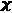)。最后两个应用于一对特征(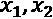)约束颜色编码轮廓图(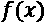)。下面是对每种方法的简要说明:

*   **单调性**:这使得函数(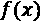)总是相对于输入(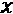)增加(1)或减少(-1)。
*   **凸性**:强制函数()相对于输入(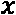)为凸性(1)或凹性(-1)。凸性可以与单调性混合，以产生类似于图 12.23 中的效果。
*   **单峰**:这类似于单调性，除了它是双向的，允许函数(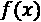)有一个单一的谷(1)或峰(-1)。
*   **信任**:这迫使一个单调的特征(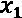)依赖另一个特征(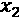)。*图 12.23* 中的示例是 **Edgeworth Trust** ，但也有一个具有不同形状约束的**梯形 Trust** 变体。
*   **优势**:单调优势约束一个单调(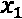)特征，以定义与另一个(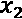)特征比较时的斜率或效果的方向。另一种选择，范围优势，是类似的，除了两个特征都是单调的。

神经网络特别容易过度拟合，控制它的杠杆也比较难操作。例如，隐藏节点、丢弃、权重正则化和纪元的确切组合将导致可接受的过度拟合水平，这很难判断。另一方面，在一个方向上移动基于树的模型中的单个参数(树深度)可能会将过度拟合降低到可接受的水平，尽管这可能需要许多不同的参数来使其达到最优。

强制实施形状约束不仅增加了可解释性，而且因为简化了功能而使模型规则化。TensorFlow Lattice 还支持基于每个特征或校准层内核的不同种类的基于惩罚的正则化，通过**拉普拉斯**、**黑森**、**扭转**和**褶皱**正则化器利用 L1 和 L2 惩罚。这些正则化函数具有使函数更平坦、更线性或更平滑的效果。我们不会解释它们，但可以说，正则化可以覆盖任何用例。

还有几种实现这个框架的方法——太多了，这里就不一一细说了！然而，重要的是要指出这个例子只是实现它的几种方式之一。TFL 带有内置的**固定估计器**来抽象一些配置。您还可以使用 TFL 层创建一个**自定义估算器**。对于 Keras，您可以使用**预制模型**或使用 TensorFlow 晶格层构建 Keras 模型。这最后一个就是我们接下来要做的！

#### 初始化模型和晶格输入

我们现在将创建一系列的*输入层*，每个输入层包含一个单独的特征。这些连接到*校准层*，使每个输入适合一个`sex`，它将使用分类校准。校准层全部送入多维*晶格层*，通过激活*s 形*的*致密层*产生输出。这种描述可能很难理解，所以请随意跳到*图 12.24* 以获得一些视觉帮助。

顺便提一下，有许多种层可用，您可以连接它们来产生一个**深度网格网络** ( **DLN** )，包括以下:

*   **线性**用于一个以上输入之间的线性函数，包括那些具有优势形状约束的函数。
*   **聚合**对多个输入执行聚合功能。
*   `Sequential`层层叠叠。

在这个例子中，我们不会使用这些层中的任何一个，但是知道这一点可能会进一步启发您进一步探索 TensorFlow 晶格库。反正回到这个例子！

首先要定义的是`lattice_sizes`，它是一个元组，对应于每个维度的顶点数。在所选的架构中，每个特征有一个维度，所以我们需要选择 9 个大于或等于 2 的数字。对于连续的分类或拐点，基数较小的要素保证折点较少。然而，我们可能还想通过故意选择更少的顶点来限制一个特征的表现力。例如，`juv_fel_count`有 10 个唯一值，但是我们只给它分配两个顶点。`lattice_sizes`这里显示的是:

```
lattice_sizes = [2, 2, 2, 2, 3, 5, 7, 7, 6]
```

接下来，我们将初始化两个列表，一个用于放置所有输入层(`model_inputs`)，另一个用于校准层(`lattice_inputs`)。然后，对于每个特征，我们用`tf.keras.layers.Input`逐一定义一个输入层，并用分类校准(`tfl.layers.CategoricalCalibration`或 PWL 校准(`tfl.layers.PWLCalibration`)定义一个校准层。对于每个要素，输入图层和校准图层都将被追加到各自的列表中。校准层内部发生的情况取决于该特征。所有 PWL 校准都使用`input_keypoints`，它询问 PWL 函数应该在哪里分段。有时，这最好用固定宽度(`np.linspace`)来回答，或者其他时候用固定频率(`np.quantile`)。分类校准使用与类别数量相对应的桶(`num_buckets`)。所有校准品都有以下参数:

*   `output_min`:校准器的最小输出
*   `output_max`:校准器的最大输出—必须始终与最小输出+网格尺寸- 1 相匹配
*   `monotonicity`:是否应该单调约束 PWL 函数，如果是，如何约束
*   `kernel_regularizer`:如何正则化函数

除了这些参数，`convexity`和`is_cyclic`(用于单调单峰)可以修改约束形状。看看下面的代码片段:

```
model_inputs = []
lattice_inputs = []

sex_input = tf.keras.layers.Input(shape=[1], name='sex')
lattice_inputs.append(tfl.layers.CategoricalCalibration(
  name='sex_calib', num_buckets=2, output_min=0.0,\
  output_max=lattice_sizes[0] - 1.0,\
  kernel_regularizer=tf.keras.regularizers.l1_l2(l1=0.001),\
  kernel_initializer='constant')(sex_input))
model_inputs.append(sex_input)
juvf_input = tf.keras.layers.Input(shape=[1],\
name='juv_fel_count')
lattice_inputs.append(tfl.layers.PWLCalibration(
  name='juvf_calib', monotonicity='none',\
  input_keypoints=np.linspace(0, 20, num=5,\
dtype=np.float32),\
  output_min=0.0, output_max=lattice_sizes[1] - 1.0,\
  kernel_regularizer=tf.keras.regularizers.l1_l2(l1=0.001),\
  kernel_initializer='equal_slopes')(juvf_input))
model_inputs.append(juvf_input)
: 
age_input = tf.keras.layers.Input(shape=[1], name='age_group')
lattice_inputs.append(tfl.layers.PWLCalibration(
  name='age_calib', monotonicity='none',\
  input_keypoints=np.linspace(0, 6, num=7,\
dtype=np.float32),\
  output_min=0.0, output_max=lattice_sizes[7] - 1.0,\
  kernel_regularizer=('hessian', 0.0, 1e-4))(age_input))
model_inputs.append(age_input)
priors_input = tf.keras.layers.Input(shape=[1],\
                                     name='priors_per_year')
lattice_inputs.append(tfl.layers.PWLCalibration(
  name='priors_calib', monotonicity='increasing',\
  input_keypoints=np.quantile(X_train_con['priors_per_year'],\
                         np.linspace(0, 1, num=7)),
  output_min=0.0, output_max=lattice_sizes[8] - 1.0)(priors_input))
model_inputs.append(priors_input)
```

所以，我们现在有一个带有`model_inputs`的列表和另一个带有校准层的列表，它们将作为点阵(`lattice_inputs`)的输入。我们现在要做的就是把这些绑在一个格子上。

#### 使用张量流网格层构建 Keras 模型

我们已经把这个模型的前两个构件连接起来了。现在，让我们创建最后两个构建块，从晶格(`tfl.layers.Lattice`)开始。作为参数，它采用`lattice_sizes`，最小和最大输出，以及它应该执行的`monotonicities`。注意最后一项`priors_per_year`，单调性设置为`increasing`。然后晶格层进入最后一块，也就是激活了`sigmoid`的`Dense`层。代码可以在下面的代码片段中看到:

```
lattice = tfl.layers.Lattice(
         name='lattice', lattice_sizes=lattice_sizes,\
         monotonicities=[
           'none', 'none', 'none', 'none', 'none',\
           'none', 'none', 'none', 'increasing'
         ],\
         output_min=0.0, output_max=1.0)(lattice_inputs)
model_output = tf.keras.layers.Dense(1, name='output',
                                activation='sigmoid')(lattice)
```

作为`input`的前两个构建模块现在可以通过`tf.keras.models.Model`将与作为`outputs`的后两个连接起来。瞧！我们现在有了一个完整的模型，代码如下所示:

```
tfl_mdl = tf.keras.models.Model(inputs=model_inputs,
                             outputs=model_output)
```

您总是可以运行`tfl_mdl.summary()`来了解所有层是如何连接的，但这不像使用`tf.keras.utils.plot_model`那样直观，如下面的代码片段所示:

```
tf.keras.utils.plot_model(tfl_mdl, rankdir='LR')
```

前面的代码生成了如图*图 12.24* 所示的模型图:


图 12.24–带有 TFL 层的 Keras 模型图

接下来，我们需要编译模型。我们将使用一个`binary_crossentropy`损失函数，一个`Adam`优化器，使用精确度和曲线下的**面积** ( **AUC** )作为度量，如下面的代码片段所示:

```
tfl_mdl.compile(loss='binary_crossentropy',\
            optimizer=tf.keras.optimizers.Adam(lr=0.004),\
           metrics=['accuracy',tf.keras.metrics.AUC(name='auc')])
```

我们现在几乎准备好出发了！接下来是最后一步。

#### 训练和评估模型

如果您仔细查看图 12.24 ，您会注意到该模型没有一个输入层，而是有九个输入层，因此这意味着我们必须将训练和测试数据分成九个部分。我们可以使用`np.split`来做到这一点，这将产生一个包含 9 个 NumPy 数组的列表。至于标签，TFL 不接受只有一个维度的数组。使用`expand_dims`，我们将其形状从`(N,)`转换为`(N,1)`，如以下代码片段所示:

```
X_train_expand = np.split(X_train_con.values.astype(np.float32),\
                      indices_or_sections=9, axis=1)
y_train_expand = np.expand_dims(y_train.values.astype(np.float32),\ 
                                axis=1)
X_test_expand = np.split(X_test_con.values.astype(np.float32),\
                         indices_or_sections=9, axis=1)
y_test_expand = np.expand_dims(y_test.values.astype(np.float32),\  
                               axis=1)
```

现在开始训练！为了防止过度拟合，我们可以通过监控验证 AUC ( `val_auc`)来使用`EarlyStopping`。考虑到类的不平衡，在`fit`函数中，我们使用`class_weight`，如下面的代码片段所示:

```
es = tf.keras.callbacks.EarlyStopping(monitor='val_auc', mode='max', 
                  verbose=1, patience=20, restore_best_weights=True)
tfl_history = tfl_mdl.fit(X_train_expand, y_train_expand,
                class_weight={0:18, 1:16}, batch_size=128,\
                    epochs=60, validation_split=0.2, shuffle=False,\
                    callbacks=[es], verbose=1)
```

一旦模型被训练，我们可以像以前一样使用`evaluate_class_mdl`输出预测性能的快速总结，然后像以前一样使用`compare_confusion_matrices`检查公平性。代码如下面的所示:

```
fitted_class_mdls['tfl_con'] =
 mldatasets.evaluate_class_mdl(tfl_mdl, X_train_expand,
             X_test_expand, y_train.values.astype(np.float32),\
             y_test.values.astype(np.float32), plot_roc=False,\ 
                  ret_eval_dict=True)
y_test_pred = fitted_class_mdls['tfl_con']['preds_test']
_ = mldatasets.\
   compare_confusion_matrices(y_test[X_test.race==1],\
               y_test_pred[X_test.race==1], y_test[X_test.race==0],\   
               y_test_pred[X_test.race==0], 'Caucasian',\
               'African-American', compare_fpr=True)
```

前面的片段产生了图 12.25 中的混淆矩阵。张量流点阵模型的总体性能比正则化的 Keras 模型好得多，但是 FPR 比比约束 XGBoost 模型差。必须注意的是，XGBoost 的参数是之前调好的。使用 TensorFlow Lattice，可以做很多事情来改善 FPR，包括使用自定义损失函数或更好的早期停止指标，以某种方式解决种族差异。

这里可以看到输出:


图 12.25–约束张量流晶格模型的种族间混淆矩阵比较

接下来，我们将根据本章所学做出一些结论，并确定我们是否完成了任务。

# 任务完成

通常是数据承担了表现不佳、无法解释或有偏见的模型的责任，这可能是真的，但是在准备和建模阶段可以做许多不同的事情来改进它。打个比方，这就像烤蛋糕。你需要高质量的原料，是的。但是，这些原料的准备和烘焙本身看似很小的差异——例如烘焙温度、使用的容器和时间——可能会产生巨大的差异。见鬼了。即使是你无法控制的事情，如大气压力或水分，也会影响烘焙！即使都做完了，你还能有多少种不同的方法来评估一个蛋糕的质量？

这一章是关于这些细节的，就像烘焙一样，它们是`fitted_class_mdls`。然后，正如我们之前所做的，我们将它放入一个`DataFrame`并输出它，但是这一次，按照定制的度量(`wppra_test`)进行排序。代码可以在下面的代码片段中看到:

```
for mdl_name in fitted_class_mdls:
 fitted_class_mdls[mdl_name]['wppra_test'] =\
   weighted_penalized_pr_average(y_test,\
           fitted_class_mdls[mdl_name]['preds_test'],
           X_test['race'], range(3))
class_metrics = pd.DataFrame.from_dict(fitted_class_mdls,
     'index')[['precision_test', 'recall_test', 'wppra_test']]
with pd.option_context('display.precision', 3):
  html = class_metrics.sort_values(by='wppra_test',\
                                   ascending=False).\
          style.background_gradient(cmap='plasma',\
                                      subset=['precision_test']).\ 
                  background_gradient(cmap='viridis',\
                                      subset=['recall_test'])
html
```

前面的代码产生了如图*图 12.26* 所示的数据帧:


图 12.26-本章中按加权惩罚精度-召回平均自定义指标排序的顶级模型

在*图 12.26* 中，人们很想在最顶端提出一个模型。然而，他们是以`race`为特征接受训练的，并没有考虑到已被证实的刑事司法*现实*。然而，性能最高的约束模型——XGBoost one(`xgb_con`)——缺乏种族，确保了`priors_per_year`是单调的，而`age_group`不允许与青少年犯罪特征进行交互，与原始模型相比，它在显著提高预测性能的同时做到了这一切。它也更加公平，因为它将特权和弱势群体之间的 FPR 比率从 1.84 倍(*图 7.2* )降至 1.17 倍(*图 12.19* )。它并不完美，但它是一个巨大的进步！

任务是证明准确性和领域知识可以与促进公平共存，我们已经成功地完成了。话虽如此，仍有改进的余地。因此，行动计划必须向客户展示受约束的 XGBoost 模型，并继续改进和构建更多受约束的模型。不受约束的应该只是作为一个基准。

如果将本章的方法与第 11 章 *中的 [*方法、偏差减轻和因果推断方法*结合起来，您可以做出实质性的公平性改进。我们没有将它们纳入本章，仅仅关注模型(或处理中)方法，这些方法通常不被视为偏差减轻工具包的一部分，但它们非常有助于实现这一目标，更不用说用于使模型更加可靠的模型调整方法了。](B16383_11_ePub_RK.xhtml#_idTextAnchor231)*

# 摘要

阅读完本章后，您应该理解如何利用数据工程来增强可解释性，如何利用正则化来减少过度拟合，以及如何利用约束来符合策略。主要的最终目标是设置防护栏并抑制阻碍可解释性的复杂性。

在下一章中，我们将研究通过对抗鲁棒性来增强模型可靠性的方法。

# 数据集来源

*   ProPublica 数据存储(2019)。 *COMPAS 累犯风险评分数据及分析*。最初检索自[https://www . propublica . org/datastore/dataset/compas-recidivis-risk-score-data-and-analysis](https://www.propublica.org/datastore/dataset/compas-recidivism-risk-score-data-and-analysis)。

# 延伸阅读

*   Hastie，T. J .，Tibshirani，R. J .和 Friedman，J. H. (2001 年)。*统计学习的要素*。美国纽约斯普林格出版社
*   王，s &古普塔，m(2020)。*义务论伦理受到单调性形态的约束*。AISTATS。https://arxiv.org/abs/2001.11990
*   Cotter，a .，Gupta，m .，Jiang，h .，Ilan，E. L .，Muller，j .，Narayan，t .，Wang，S. & Zhu，T. (2019)。*集合函数的形状约束*。ICML。http://proceedings.mlr.press/v97/cotter19a.html
*   Gupta，M. R .，Cotter A .，普费菲，j .，Voevodski，k .，Canini，k .，Mangylov，a .，Moczydlowski，w .和 van Esbroeck，A. (2016 年)。*单调校准的插值查找表。机器学习研究杂志*。17(109):1−47.https://arxiv.org/abs/1505.06378
*   诺布尔，S. (2018)。*压迫的算法:谷歌时代的数据歧视*。NYU 出版社。