<title>B16383_13_ePub_RK</title>

# *第十三章*:对抗性鲁棒性

机器学习解释有许多关注点，从知识发现到具有有形道德影响的高风险问题，如最后两章中检查的公平问题。在这一章中，我们将把注意力集中在可靠性、安全性和保安方面。

正如我们在第八章[](B16383_08_ePub_RK.xhtml#_idTextAnchor162)**可视化卷积神经网络*中使用**对比解释方法** ( **CEM** )所认识到的，我们可以很容易地欺骗图像分类器做出令人尴尬的错误预测。这种能力会带来严重的后果。例如，肇事者可以在让行标志上贴一张黑色贴纸，虽然大多数司机仍会识别这是让行标志，但自动驾驶汽车将不再识别它，因此会发生碰撞。一个银行抢劫犯可以穿上一套冷却服来欺骗银行金库的热成像系统，虽然任何人都会注意到它，但成像系统不会。*

 *它甚至不必是一个复杂的图像分类器。任何模特都可以被骗！**[*第七章*](B16383_07_ePub_RK.xhtml#_idTextAnchor143) 、*主播与反事实解释、*中产生的反事实例子**像是对抗性例子，除了以欺骗为目的。攻击者可以利用任何错误分类的例子，敌对地跨越决策边界，例如，垃圾邮件发送者可能意识到调整某些电子邮件属性会增加绕过垃圾邮件过滤器的可能性。

复杂的模型更容易受到对抗性攻击，那么我们为什么要相信它们呢？！我们当然可以使它们更加万无一失，这就是对抗性鲁棒性所要求的。对手可以通过多种方式故意破坏模型，但我们将重点关注规避攻击，并简要解释其他形式的攻击。然后，我们解释了两种防御方法:空间平滑预处理和对抗性训练。最后，我们将演示一种健壮性评估方法和一种认证方法。

这些是我们将在本章中涉及的主要话题:

*   了解规避攻击
*   通过预处理防御目标攻击
*   通过稳健分类器的对抗训练来屏蔽任何逃避攻击
*   评估和证明对抗性鲁棒性

# 技术要求

本章的例子使用了`mldatasets`、`numpy`、`sklearn`、`tensorflow`、`keras`、`adversarial-robustness-toolbox`、`matplotlib`和`seaborn`库。关于如何安装所有这些库的说明在本书的前言中。本章的代码位于以下位置:

[https://github . com/packt publishing/Interpretable-Machine-Learning-with-Python/tree/master/chapter 13](https://github.com/PacktPublishing/Interpretable-Machine-Learning-with-Python/tree/master/Chapter13)

# 使命

全球私人承包的安保服务行业市场价值超过 2500 亿美元，并且每年以大约 5%的速度增长。然而，它面临着许多挑战，如在许多管辖区缺乏训练有素的警卫和专业安全专家，以及一大堆意想不到的安全威胁。这些威胁包括广泛协调的网络安全攻击、大规模骚乱、社会动荡，以及——最后但并非最不重要的——流行病带来的健康风险。事实上，2020 年用一波勒索软件和错误信息攻击、抗议和新冠肺炎来测试该行业。

在此之后，美国最大的医院网络之一要求其签约安保公司监控整个医院的访客和工作人员是否正确使用口罩。安全公司努力满足这一要求，因为这将使安全人员无法处理其他威胁，如入侵者、好斗的病人和好战的访客。它在每个走廊、手术室、候诊室和医院入口都有视频监控。不可能每次都看到每个摄像头，所以他们认为可以通过深度学习模型来协助警卫。

这些模型已经提醒员工注意不寻常的活动，例如在走廊上奔跑和在场所的任何地方挥舞武器。他们向医院网络提出，他们希望添加一个新的模型来检测口罩的正确使用。在新冠肺炎之前，有政策规定在每个医院的特定区域强制使用口罩，而在新冠肺炎期间，所有地方都要求这样做。医院管理者希望根据疫情风险水平的发展来开启和关闭这种监测功能。他们意识到工作人员会疲劳并忘记戴上面罩，或者他们有时会部分脱落。许多来访者也对使用口罩持敌对态度，在进入医院时可能会戴口罩，但在没有警卫在场时会摘下来。这并不总是故意的，所以他们不会像其他威胁那样，每次警报都派警卫。相反，他们宁愿用意识和一点点羞耻来改变行为，只对屡犯者进行干预:


图 13.1-雷达速度标志有助于抑制超速

意识是一种非常有效的方法，例如雷达速度标志(见*图 13.1* )，它通过让驾驶员意识到他们开得太快来使道路更加安全。在交通繁忙的走廊尽头安装一个屏幕也同样有效，它可以显示那些最近错误地或故意不遵守强制性口罩使用规定的人的快照，这可能会给违法者带来一些尴尬。该系统将记录惯犯，这样保安人员就可以找到他们，要么让他们服从，要么要求他们离开。

有些人担心访问者试图欺骗模型来逃避合规性，所以安全公司雇佣了你来确保模型对这种对抗性攻击是健壮的。安全官员之前已经注意到一些低技术含量的欺骗行为，比如当人们意识到摄像头正在监视他们时，他们会立刻用手或毛衣的一部分遮住自己的脸。在一起令人不安的事件中，一名游客将灯光调暗，在相机上喷了一些凝胶，在另一起事件中，一个人在嘴上涂了颜色。然而，有人担心更高科技的攻击，如干扰相机的无线信号或直接向相机照射高功率激光。执行这些攻击的设备越来越容易获得，并可能在更大范围内影响其他监控功能，如防盗功能。安全公司希望这种稳健性练习可以为他们改进每个监控系统和模型的努力提供信息。

最终，该安全公司希望利用他们监控的医院的面部图像生成自己的数据集。与此同时，从外部来源合成掩盖的脸是他们在短期内生产模型所能做的最好的事情。为此，我们已经为您提供了一个大型数据集，其中包含合成的正确和不正确的蒙面人脸以及它们的未蒙面对应物。这两个数据集合并成一个数据集，原始尺寸为 1024 × 1024，缩小到缩略图尺寸 124 × 124。此外，为了提高效率，从这些数据集中发现的近 210，000 幅图像中抽取了 21，000 幅图像。

# 方法

您决定采用四重方法，如下所示:

*   探索几种可能的规避攻击，以了解模型对它们有多脆弱，以及它们作为威胁有多可信
*   使用预处理方法来保护模型免受这些攻击
*   利用对抗性再训练来产生健壮的分类器，该分类器本质上不太容易受到这些攻击
*   使用最先进的方法评估稳健性，以便能够向医院管理者保证该模型具有很强的稳健性

我们开始吧！

# 准备工作

您将在[https://github . com/packt publishing/Interpretable-Machine-Learning-with-Python/tree/master/chapter 13/Masks _ part 1 . ipynb](https://github.com/PacktPublishing/Interpretable-Machine-Learning-with-Python/tree/master/Chapter13/Masks_part1.ipynb)中找到该示例的大部分代码，直到在*使用随机平滑验证健壮性*一节中使用的代码。仅该部分的代码就位于[https://github . com/packt publishing/Interpretable-Machine-Learning-with-Python/tree/master/chapter 13/Masks _ part 2 . ipynb](https://github.com/PacktPublishing/Interpretable-Machine-Learning-with-Python/tree/master/Chapter13/Masks_part2.ipynb)。

## 加载库

若要运行此示例，您需要安装以下库:

*   `mldatasets`加载数据集
*   `numpy`和`sklearn` (scikit-learn)来操纵它
*   `tensorflow`适合模特
*   `matplotlib`和`seaborn`来可视化的解释

您应该首先加载它们，如下所示:

```
import math
import os
import warnings
warnings.filterwarnings("ignore")
import mldatasets
import numpy as np
from sklearn import preprocessing
import tensorflow as tf
from tensorflow.keras.utils import get_file
import matplotlib.pyplot as plt
import seaborn as sns 
#PART 1 only
from sklearn import metrics
from art.estimators.classification import KerasClassifier
from art.attacks.evasion import FastGradientMethod,\
                 ProjectedGradientDescent, BasicIterativeMethod
from art.attacks.evasion import CarliniLInfMethod
from art.attacks.evasion import AdversarialPatchNumpy
from art.defences.preprocessor import SpatialSmoothing
from art.defences.trainer import AdversarialTrainer
from tqdm.notebook import tqdm
#PART 2 only
from art.estimators.classification import TensorFlowV2Classifier
from art.estimators.certification.randomized_smoothing import\
                                TensorFlowV2RandomizedSmoothing
from art.utils import compute_accuracy
```

让我们用`print(tf.__version__)`检查一下 TensorFlow 是否加载了正确的版本。版本应该是 2.0 以上。

我们还应该禁用急切执行，并验证它与以下命令一起工作。输出应该是`False`:

```
tf.compat.v1.disable_eager_execution()
print('Eager execution enabled:', tf.executing_eagerly()) 
```

## 了解和准备数据

我们将数据加载到对应于训练/测试数据集的四个 NumPy 数组中。当我们这样做时，我们将`X`的面部图像除以 255，因为这样一来，它们的值将介于 0 和 1 之间，这对于深度学习模型来说更好。我们需要记录训练数据的`min_`和`max_`，因为我们以后会用到它们。

代码可以在下面的代码片段中看到:

```
X_train, X_test, y_train, y_test =\
 mldatasets.load("maskedface-net_thumbs_sampled", prepare=True)
X_train, X_test = X_train / 255.0, X_test / 255.0
min_ = X_train.min()
max_ = X_train.max() 
```

在加载数据时，验证数据以确保数据没有被破坏是非常重要的。您可以使用以下代码来实现这一点:

```
print('X_train dim:\t%s' % (X_train.shape,))
print('X_test dim:\t%s' % (X_test.shape,))
print('y_train dim:\t%s' % (y_train.shape,))
print('y_test dim:\t%s' % (y_test.shape,))
print('X_train min:\t%s' % (min_))
print('X_train max:\t%s' % (max_))
print('y_train labels:\t%s' % (np.unique(y_train)))
```

前面的代码片段将产生如下所示的输出，它告诉您图像的尺寸为 128 × 128 像素，有三个通道(颜色)。有 16，800 个训练图像和 4，200 个测试图像。标签的第二个值中只有一个 1，这表明它不是一次性编码的。实际上，通过打印唯一值(`np.unique(y_train)`，您可以看出标签被表示为文本— `Correct`表示正确屏蔽，`Incorrect`表示不正确屏蔽，`None`表示没有屏蔽。代码如下面的代码片段所示:

```
X_train dim:    (16800, 128, 128, 3)
X_test dim: (4200, 128, 128, 3)
y_train dim:    (16800, 1)
y_test dim: (4200, 1)
X_train min:    0.0
X_train max:    1.0
y_train labels: ['Correct' 'Incorrect' 'None']
```

因此，我们需要执行的预处理步骤是`y`标签，因为我们需要 OHE 形式来评估模型的预测性能。一旦我们初始化了`OneHotEncoder`，我们将需要`fit`它到训练数据(`y_train`)。我们还可以将编码器中的类别提取到一个列表中(`labels_l`)，以验证它是否包含所有三个类别。

看看下面的代码片段:

```
ohe = preprocessing.OneHotEncoder(sparse=False)
ohe.fit(y_train)
labels_l = ohe.categories_[0].tolist()
print(labels_l)
```

出于可再现性的考虑，总是像这样初始化你的随机种子:

```
rand = 9
os.environ['PYTHONHASHSEED'] = str(rand)
tf.random.set_seed(rand)
np.random.seed(rand)
```

诚然，深度学习的确定性非常困难，并且通常依赖于会话、平台和架构。如果你用的是 NVIDIA `tensorflow-determinism`。

我们将在本章中研究的许多对抗性攻击、防御和评估方法都是资源密集型的，所以如果我们对它们使用整个测试数据集，它们可能会在一个方法上花费很多时间！为了提高效率，强烈建议使用测试数据集的样本。因此，我们将使用`np.random.choice`创建一个 200 张图像的中型样本(`X_test_mdsample`、`y_test_mdsample`)和一个 20 张图像的小型样本(`X_test_smsample`、`y_test_smsample`)。代码如下面的代码片段所示:

```
sampl_md_idxs = np.random.choice(X_test.shape[0], 200,replace=False)
X_test_mdsample = X_test[sampl_md_idxs]
y_test_mdsample = y_test[sampl_md_idxs]
sampl_sm_idxs = np.random.choice(X_test.shape[0], 20, replace=False)
X_test_smsample = X_test[sampl_sm_idxs]
y_test_smsample = y_test[sampl_sm_idxs]
```

现在，让我们看一下数据集中的图像。在前面的代码中，我们选取了测试数据集的一个中样本和一个小样本。我们将小样本的每个图像放在一个 4 × 5 的网格中，上面有 class 标签，代码如下:

```
plt.subplots(figsize=(15,12))
for s in range(20):
 plt.subplot(4, 5, s+1)
 plt.title(y_test_smsample[s][0], fontsize=12)
 plt.imshow(X_test_smsample[s], interpolation='spline16')
 plt.axis('off')
```

前面的代码绘制了图 13.2 中所示的图像网格:


图 13.2-带面具和不带面具的小型测试数据集样本

*图 13.2* 描绘了不同年龄、性别和种族的各种正确和不正确的面具和非面具面孔。尽管存在这种多样性，但关于该数据集需要注意的一点是，它只呈现了浅蓝色的外科口罩，并且图像大多处于正面角度。理想情况下，我们会生成一个更大的数据集，包含所有颜色和所有类型的遮罩，并在训练前或训练过程中，通过随机旋转、剪切和亮度调整来进一步扩充它。这些扩充将使模型更加稳健。然而，我们必须区分这种一般类型的稳健性和对抗性稳健性，即使两者都是必不可少的，花时间在前者上会有损于后者。因此，让我们假设数据集已经被扩充。

## 加载 CNN 基本模型

你不必训练卷积神经网络 ( **CNN** )基本模型，但是 GitHub 库中仍然提供了这样做的代码。预先训练好的模型也已经存储在那里。我们可以快速加载模型并输出其摘要，如下所示:

```
model_path = get_file('CNN_Base_MaskedFace_Net.hdf5',\
      'https://github.com/PacktPublishing/Interpretable-Machine-Learning-with-Python/blob/master/models/CNN_Base_MaskedFace_Net.hdf5?raw=true')
base_model = tf.keras.models.load_model(model_path)
base_model.summary()
```

前面的代码片段输出了以下摘要:

```
Model: "CNN_Base_MaskedFaceNet_Model"
_______________________________________________________________
Layer (type)                 Output Shape              Param #   
===============================================================
conv2d_1 (Conv2D)            (None, 126, 126, 16)      448        _______________________________________________________________
maxpool2d_1 (MaxPooling2D)   (None, 63, 63, 16)        0         
_______________________________________________________________
conv2d_2 (Conv2D)            (None, 61, 61, 32)        4640      
_______________________________________________________________
maxpool2d_2 (MaxPooling2D)   (None, 30, 30, 32)        0         
_______________________________________________________________
conv2d_3 (Conv2D)            (None, 28, 28, 64)        18496     
_______________________________________________________________
maxpool2d_3 (MaxPooling2D)   (None, 14, 14, 64)        0         
_______________________________________________________________
conv2d_4 (Conv2D)            (None, 12, 12, 128)       73856     
_______________________________________________________________
maxpool2d_4 (MaxPooling2D)   (None, 6, 6, 128)         0         
_______________________________________________________________
flatten_6 (Flatten)          (None, 4608)              0         
_______________________________________________________________
dense_1 (Dense)              (None, 768)               3539712   
_______________________________________________________________
dropout_6 (Dropout)          (None, 768)               0         
_______________________________________________________________
dense_2 (Dense)              (None, 3)                 2307      
===============================================================
Total params: 3,639,459
Trainable params: 3,639,459
Non-trainable params: 0
_______________________________________________________________
```

摘要几乎包含了我们需要了解的关于该模型的所有信息。它有四个卷积层(`Conv2D`)，每个卷积层后面都有一个最大池层(`MaxPooling2D`)。然后它有一个`Flatten`层和一个全连接层(`Dense`)。然后，在第二层`Dense`之前还有更多`Dropout`。自然地，三个神经元在这最后一层，对应于每个类。

## 评估 CNN 基本分类器

我们可以使用带有`evaluate_multiclass_mdl`函数的测试数据集来评估模型。参数包括模型(`base_model`)、我们的测试数据(`X_test`)和相应的标签(`y_test`)，以及类名(`labels_l`)和编码器(`ohe`)。最后，我们不需要它来绘制`plot_roc=False`。这个函数返回预测的标签和概率，我们可以将它们存储到变量中以备后用。

代码可以在下面的代码片段中看到:

```
y_test_pred, y_test_prob =\
     mldatasets.evaluate_multiclass_mdl(base_model, X_test, y_test,\ 
       labels_l, ohe, plot_conf_matrix=True, predopts={"verbose":1})
```

前面的代码生成了*图 13.3* ，其中有一个混淆矩阵和每个类的性能指标。这可以从这里看出:


```
             precision    recall      f1-score      support
  Correct     0.998       0.998        0.998         1400
  Incorrect   0.999       0.995        0.997         1400
  None        0.996       0.999        0.998         1400
  accuracy                             0.997         4200
  macro avg  0.997        0.997        0.997         4200
weighted avg 0.997        0.997        0.997         4200
```

图 13.3–在测试数据集上评估的基础分类器的混淆矩阵和预测性能指标

尽管图 13.3 中的混淆矩阵似乎暗示了一个完美的分类，但是一旦你看到精度和召回的分类，你就可以知道这个模型存在错误分类的问题。

现在，我们可以开始攻击这个模型，以评估它实际上有多完美！

# 学习闪避攻击

敌对攻击有六大类，详述如下:

*   **规避**:这意味着设计一个输入，它会导致模型错误地预测，尤其是不会欺骗人类观察者。它可以是有目标的，也可以是无目标的，这取决于攻击者欺骗模型将一个类错误分类到另一个类的意图。如果攻击者对模型及其训练数据集具有完全访问权限，则攻击方法可以是白盒，或者只有推理访问权限的黑盒。灰色盒子在中间；黑盒总是模型不可知的；而白盒和灰盒方法可能是。
*   **中毒**:将错误的训练数据或参数注入到模型中可以以多种形式出现，这取决于攻击者的能力和访问权限。例如，对于具有用户生成数据的系统，攻击者可能能够添加错误的数据或标签。如果他们有更多的访问权限，他们也许可以修改大量的数据。他们还可以调整学习算法，或者只调整超参数或数据扩充方案。和逃避一样，投毒也可以是有针对性的，也可以是无针对性的。
*   **推理**:通过模型推理提取训练数据集。推理攻击也有多种形式，可以通过成员推理用于间谍活动(隐私攻击)，成员推理可以确认一个例子(例如，特定的人)是否在训练数据集中。属性推断确定示例类别(例如，种族)是否在训练数据中表示。输入推断(也称为模型反演)具有从模型中提取训练数据集的攻击方法，而不是猜测和确认。这些具有广泛的隐私和监管含义，特别是在医疗和法律应用中，在隐私保护更强的司法管辖区，如**通用数据保护条例** ( **GDPR** )欧盟 ( **欧盟**)，许多其他行业都会受到影响。
*   **特洛伊木马**:黑客攻击他人重新利用的现有模型，用于迁移学习或作为模型群的一部分，以改变模型的行为。
*   **后门**:类似于木马，但后门依然存在，即使从开始重新训练。
*   **重新编程**:远程通过潜入专门设计用于产生特定输出的示例，在训练期间破坏模型。例如，如果你提供足够多的标记为虎鲨的例子，其中四个小黑方块总是在同一个地方，模型将学习这是一条虎鲨，不管它是什么。

前三种方法是对抗性攻击最普遍的形式。一旦我们按照阶段和目标对攻击进行划分，就可以对攻击进行进一步的细分(参见*图 13.4* )。阶段指的是攻击实施的时间，因为它会影响模型训练或其推理，目标是攻击者希望从中获得什么。本章将只讨论规避破坏攻击，因为我们预计医院访客、患者和工作人员偶尔会破坏生产模型。

下表按阶段和目标提供了对抗性攻击类别方法的概述:


图 13.4–按阶段和目标划分的对抗性攻击类别方法表

即使我们使用白盒方法来攻击、防御和评估模型的健壮性，我们也不希望攻击者拥有这种级别的访问权限。我们将只使用白盒方法，因为我们对模型有完全的访问权，不值得麻烦去尝试黑盒或灰盒方法。在其他情况下，比如一个银行监控系统，它有一个热成像系统和一个相应的模型来检测攻击者，您可能会期望专业攻击者使用黑盒方法来找到漏洞！因此，作为这个系统的捍卫者，我们尝试完全相同的攻击方法将是明智的。

我们将用于对抗性健壮性的库在本章的大部分时间里被称为`KerasClassifier`，除了最后一节，我们在这里使用`TensorFlowV2Classifier`。初始化艺术分类器相当简单。您必须指定`model`属性，有时还有其他必需的属性。对于`KerasClassifier`,所有剩余的属性都是可选的，但是建议您使用`clip_values`来指定特性的范围。许多攻击都是输入置换，因此了解哪些输入值是允许的或可行的至关重要。

看看下面的代码片段:

```
base_classifier = KerasClassifier(model=base_model,\
                                  clip_values=(min_, max_))
y_test_mdsample_prob = np.max(y_test_prob[sampl_md_idxs], axis=1)
y_test_smsample_prob = np.max(y_test_prob[sampl_sm_idxs], axis=1)
```

在前面的代码中，我们还将准备两个数组，其中包含中样本和小样本的预测类的概率。这完全是可选的，但在绘制一些示例时，这些选项有助于将预测概率放在预测标签的旁边。

### 快速梯度符号方法攻击

最受欢迎的攻击方法之一是**快速渐变标志法** ( **FGSM** 或 **FGM** )。顾名思义，这利用了一个深度学习模型的梯度来寻找对立的例子。它对输入图像的像素执行小的扰动，或者增加或者减少，使用哪一个取决于梯度的符号，该符号根据像素的强度指示损失增加或者减少的方向。

与所有 ART 攻击方法一样，您首先通过提供 ART 估计器或分类器来初始化它。`FastGradientMethod`还需要一个`eps`攻击步长，这个步长会制约攻击强度。顺便提一下，`eps`代表ε(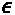，在数学上通常代表误差容限或无穷小的近似误差。步长越小，像素强度的变化越不明显，但错误分类的例子也越少。更大的步长将导致更多的示例被错误分类，具有更明显的变化。

这方面的代码可以在这里看到:

```
attack_fgsm = FastGradientMethod(base_classifier, eps=0.1)
```

初始化之后，下一步是`generate`对抗性的例子。唯一需要的属性是原始示例(`X_test_mdsample`)。请注意，FGSM 可以被定位，因此在初始化中有一个可选的`targeted`属性，但是您也需要在生成中提供相应的标签。这种攻击是无针对性的，因为攻击者的意图是破坏模型。

这方面的代码可以在这里看到:

```
X_test_fgsm = attack_fgsm.generate(X_test_mdsample)
```

使用 FGSM 生成对抗性示例很快，不像其他方法，因此得名“快”!

现在，我们要一举做两件事。首先，我们将使用`evaluate_multiclass_mdl`评估对抗示例(`X_test_fgsm`)与我们的基本分类器模型(`base_classifier.model`)。然后，我们可以使用`compare_image_predictions`来绘制图像网格，将随机选择的对立示例(`X_test_fgsm`)与原始示例(`X_test_mdsample`)以及它们对应的预测标签(`y_test_fgsm_pred`、`y_test_mdsample`)和概率(`y_test_fgsm_prob`、`y_test_mdsample_prob`)进行对比。我们正在定制标题并将网格限制为 4 个示例(`num_samples`)。默认情况下，`compare_image_predictions`只比较错误的分类，但是`use_misclass`可选属性可以设置为`false`来比较正确的分类。

代码可以在下面的代码片段中看到:

```
y_test_fgsm_pred, y_test_fgsm_prob =\
        mldatasets.evaluate_multiclass_mdl(base_classifier.model,\
                             X_test_fgsm, y_test_mdsample,\
                       labels_l, ohe, plot_conf_matrix=False,\
                             plot_roc=False)
y_test_fgsm_prob = np.max(y_test_fgsm_prob, axis=1)
mldatasets.compare_image_predictions(X_test_fgsm, X_test_mdsample,\ 
    y_test_fgsm_pred, y_test_mdsample.flatten(), y_test_fgsm_prob,\
    y_test_mdsample_prob, title_mod_prefix="Attacked:",\
    title_difference_prefix="FSGM Attack Average Perturbation:",\
    num_samples=4)
```

前面的代码首先输出这个表，它显示该模型在 FGSM 攻击的例子中只有 44%的准确率！尽管这不是一次有针对性的攻击，但它对正确伪装的面孔最为有效。因此，假设，如果肇事者设法造成这种程度的信号失真或干扰，他们将严重破坏安全公司监控面具合规性的能力。

代码还输出*图 13.5* ，显示了 FGSM 攻击导致的一些误分类。攻击几乎均匀地分布了图像中的噪声。它还显示图像仅被修改了 0.092 的平均绝对误差，并且由于像素值的范围在 0 和 1 之间，这意味着 9.2%。如果您要校准攻击，使它们不易被检测到，但仍然有影响，您必须注意到 0.1 的`eps`值会导致 9.2%的平均绝对扰动，这将准确性降低到 44%:


图 13.5–基本分类器的 FGSM 攻击图像与原始图像的比较图

说到不易察觉的攻击，我们现在将了解一下**卡里尼&瓦格纳** ( **C & W** )攻击。

### C&W 无穷范数攻击

2017 年，C&W 采用了三种*基于规范的距离度量* : 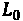、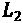和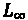，衡量原例与反例之间的差异。在其他论文中，这些指标已经讨论过了，包括 FGSM。C & W 引入的创新是如何利用这些指标，使用一种基于梯度下降的优化算法，旨在逼近损失函数最小值。具体来说，为了避免陷入困境，他们在梯度下降中使用多个起始点，因此该过程“产生有效的图像”，它评估三种方法来限制优化问题。在这种情况下，我们希望找到一个对立的例子，该例子和原始图像之间的距离最小，同时还保持现实。

所有三种 C&W 攻击(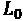、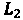和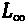)都使用 Adam 优化器来快速收敛。他们的主要区别是距离度量，其中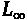可以说是最好的一个。它是这样定义的:

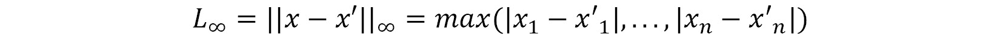

而且，因为它是到任何坐标的最大距离，所以你要确保对立的例子不仅仅是“平均”最小程度的不同，而且在特征空间的任何地方都不会太不同。这将使攻击更难被发现！

初始化 C&W 无穷范数攻击，并用它生成敌对的例子类似于 FGSM。为了初始化`CarliniLInfMethod`，我们定义了一个`eps`和一个`batch_size`(默认为 128)。然后，对于`generate`无目标的对抗性攻击，同样适用于 FGSM——无目标时只需要`X`,但有目标时需要`y`。

下面的代码片段显示在中:

```
attack_cw = CarliniLInfMethod(base_classifier, eps=0.3,\
                              batch_size=40)
X_test_cw = attack_cw.generate(X_test_mdsample)
```

我们现在将评估 C&W 对抗性例子(`X_test_cw`)，正如我们对 FGSM 所做的那样。这是完全相同的代码，但将`fsgm`替换为`cw`，并且`compare_image_predictions`中的标题不同。正如 FGSM 一样，下面的代码将产生一个分类报告和一个图像网格(如图*图 13.6* 所示):

```
y_test_cw_pred, y_test_cw_prob =\
     mldatasets.evaluate_multiclass_mdl(base_classifier.model,\ 
                    X_test_cw, y_test_mdsample, labels_l, ohe,\
                        plot_conf_matrix=False, plot_roc=False)
y_test_cw_prob = np.max(y_test_cw_prob, axis=1)
mldatasets.compare_image_predictions(X_test_cw, X_test_mdsample,\
    y_test_cw_pred, y_test_mdsample.flatten(), y_test_cw_prob,\
    y_test_mdsample_prob, title_mod_prefix="Attacked:",\
    title_difference_prefix="C&W Inf Attack Average Perturbation:",\
    num_samples=4)
```

如前面的代码所输出的，C & W 对抗示例对于我们的基本模型具有 92%的准确性。这一下降足以使模型无法达到预期目的。如果攻击者干扰一个摄像头的信号足够多，他们可以达到同样的结果。从图 13.6 中可以看出，与 FGSM 相比，0.3%的扰动很小，但足以错误分类 8%，包括网格中肉眼可见的四个:


图 13.6–基本分类器的 C&W 无穷范数攻击与原始图像的比较图

有时，攻击是否未被检测到并不重要。它的重点是发表声明，这就是**对抗性补丁** ( **APs** )所能做的。

### 定向 AP 攻击

AP 是一种健壮的、通用的、有针对性的方法。你生成一个补丁，你可以把它叠加在图像上，或者打印出来，放在场景中，欺骗分类器忽略场景中的其他一切。它被设计成在各种各样的条件和变换下工作。与其他对抗性的示例生成方法不同，没有隐藏攻击的意图，因为本质上，您是用补丁替换场景中可检测的部分。该方法通过利用对变换 ( **EOT** )的**期望的变型来工作，该变型通过图像的不同位置上的给定补丁的变换来训练图像。给定训练样本，它学习的是最容易欺骗分类器的补丁。**

这种方法比 FGSM 和 C&W 需要更多的参数和步骤。对于初学者，我们将使用`AdversarialPatchNumpy`，这是一种适用于任何神经网络图像或视频分类器的变体。TensorFlow v2 也有一个，但我们的基本分类器是`KerasClassifier`。第一个参数是分类器(`base_classifier`)，我们将定义的其他参数是可选的，但强烈建议使用。`scale_min`和`scale_max`缩放范围特别重要，因为它们定义了相对于图像的补丁有多大——在这种情况下，我们希望测试不小于 40%且不大于 70%的比例。除此之外，定义一个目标类(`target`)是有意义的。在这种情况下，我们希望补丁以“正确的”类为目标。对于`learning_rate`和最大迭代次数(`max_iter`)，我们使用默认值，但请注意，这些可以调整以提高补丁对抗的有效性。

这方面的代码可以在下面的代码片段中看到:

```
attack_ap = AdversarialPatchNumpy(base_classifier, scale_min=0.4,\ 
                     scale_max=0.7, learning_rate=5., max_iter=500,\
                     batch_size=40, target=0)
```

我们不希望补丁生成算法浪费时间测试图像中各处的补丁，所以我们可以通过使用布尔掩码来指导这项工作。这个遮罩会告诉它可以将补片居中的位置。为了制作掩码，我们首先创建一个大小为 128 × 128 的 0 数组。然后，我们在像素 80-93 和 45-84 之间的矩形区域中放置 1，这大致对应于在大多数图像中覆盖嘴部区域的中心。最后，我们扩展数组的维度，使其为`(1, W, H)`，并将其转换为布尔值。然后，我们可以继续使用小尺寸测试数据集样本和遮罩进行`generate`修补。

在下面的代码片段中显示了代码:

```
placement_mask = np.zeros((128,128))
placement_mask[80:93,45:83] = 1
placement_mask = np.expand_dims(placement_mask, axis=0).astype(bool)
patch, patch_mask = attack_ap.generate(x=X_test_smsample,\
         y=ohe.transform(y_test_smsample), mask=placement_mask)
```

我们现在可以用以下代码绘制补丁:

```
plt.imshow(patch * patch_mask)
```

前面的代码生成了图 13.7 中所示的图像。不出所料，它有很多面具中常见的蓝色。它还具有明亮的红色和黄色色调，这在训练样本中很少出现，这使分类器感到困惑:


图 13.7–生成的 AP 被错误分类为正确屏蔽

与其他方法不同的是，`generate`没有产生对立的例子，而是产生一个单独的补丁，这是一个我们可以放在图像上面来创建对立例子的图像。这个任务是用`apply_patch`执行的，它采用了原始的`X_test_smsample`示例和一个比例——我们使用的是 55%。还建议使用`mask`，这将确保补丁应用在更有意义的地方——在这种情况下，在嘴周围的区域。

这方面的代码是，如下面的代码片段所示:

```
X_test_ap = attack_ap.apply_patch(X_test_smsample, scale=0.55,\
                                  mask=placement_mask)
```

现在，是时候评估我们的攻击并检查一些错误分类了。我们将像以前一样，重用生成*图 13.5* 和*图 13.7* 的代码，只是我们替换了变量，使它们具有`ap`和相应的标题。

代码如下面的代码片段所示:

```
y_test_ap_pred, y_test_ap_prob =\
           mldatasets.evaluate_multiclass_mdl(base_classifier.model,\
                    X_test_ap, y_test_smsample, labels_l, ohe,\
                        plot_conf_matrix=False, plot_roc=False)
y_test_ap_prob = np.max(y_test_ap_prob, axis=1)
mldatasets.compare_image_predictions(X_test_ap, X_test_smsample,\
         y_test_ap_pred, y_test_smsample.flatten(), y_test_ap_prob,\
         y_test_smsample_prob, title_mod_prefix="Attacked:",\
         title_difference_prefix="AP Attack Average Perturbation:",\
      num_samples=4)
```

前面的代码产生了 65%的攻击准确率，考虑到训练的例子很少，这已经很不错了。AP 比其他方法更需要。一般来说，有针对性的攻击需要更多的例子来理解如何最好地针对一个类。前面的代码还生成了图 13.8 所示的图像网格，这演示了，假设，如果人们在脸前拿着一块纸板走来走去，他们可以很容易地欺骗模型:


图 13.8-基本分类器的 AP 攻击图像与原始图像的比较图

到目前为止，我们已经研究了三种攻击方法，但是还没有解决如何防御这些攻击。接下来，我们将探讨几个解决方案。

# 通过预处理防御目标攻击

对抗式辩护有五大类，详述如下:

*   **预处理**:改变模型的输入，使其更难被攻击。
*   **对抗性训练**:训练一个新的健壮模型，设计用来克服攻击。
*   **检测**:检测攻击——例如你可以训练一个模型来检测敌对的例子。
*   **Transformer** :修改模型架构和训练，使其更加健壮——这可能包括诸如提取、输入过滤器、神经元修剪和去学习等技术。
*   **后处理**:改变模型输出以克服生产推理或模型提取攻击。

只有前四种防御对闪避攻击起作用，在本章中我们只涉及前两种:**预处理**和**对抗训练**。FGSM 和 C & W 可以很容易地用这些防御，但是 AP 更难防御，所以它可能需要更强的**检测**或**变压器**方法。

在我们防御之前，我们必须制造一次有针对性的攻击。我们将采用**投影梯度下降** ( **PGD** )，这是一种强攻击，在输出上非常类似于 FGSM——也就是说，它产生噪声图像。我们不会在这里详细解释 PGD，但重要的是要注意，与 FGSM 一样，它被视为一阶对手*因为它利用了关于网络的一阶信息(由于梯度下降)。此外，PGD 在实验中证明了对 PGD 的鲁棒性确保了对任何一阶对手的鲁棒性。准确地说，PGD 是一个强大的攻击，所以它有助于确凿的基准。*

为了针对正确屏蔽的类创建有针对性的攻击，我们最好只选择没有正确屏蔽(`y_test_notmasked`)的示例，以及它们相应的标签(`y_test_notmasked`)和预测概率(`y_test_notmasked_prob`)。然后，我们想用类(`Correct`)创建一个数组，我们想为它生成对立的例子(`y_test_masked`)。

这方面的代码如下面的代码片段所示:

```
not_masked_idxs = np.where(y_test_smsample != 'Correct')[0]
X_test_notmasked = X_test_smsample[not_masked_idxs]
y_test_notmasked = y_test_smsample[not_masked_idxs]
y_test_notmasked_prob = y_test_smsample_prob[not_masked_idxs]
y_test_masked = np.array(['Correct'] *\  
                       X_test_notmasked.shape[0]).reshape(-1,1)
```

我们像 FGSM 一样初始化`ProjectedGradientDescent`，除了我们将要设置最大扰动(`eps`)、攻击步长(`eps_step`)、最大迭代(`max_iter`)和`targeted=True`。正因为有针对性，所以我们要同时设置`X`和`y`。

这方面的代码如下面的代码片段所示:

```
attack_pgd = ProjectedGradientDescent(base_classifier, eps=0.3,\
                          eps_step=0.01, max_iter=40, targeted=True)
X_test_pgd = attack_pgd.generate(X_test_notmasked,\
                                y=ohe.transform(y_test_masked))
```

现在，让我们像以前一样评估 PGD 攻击，但这次让我们绘制混淆矩阵(`plot_conf_matrix=True`)，如下所示:

```
y_test_pgd_pred, y_test_pgd_prob =\
         mldatasets.evaluate_multiclass_mdl(base_classifier.model,\ 
                       X_test_pgd, y_test_notmasked, labels_l, ohe,\
                       plot_conf_matrix=True, plot_roc=False)
y_test_pgd_prob = np.max(y_test_pgd_prob, axis=1)
```

前面的片段产生了图 13.9 所示的混淆矩阵。PGD 攻击非常有效，它产生了 0%的准确率，使所有未屏蔽和错误屏蔽的例子看起来都被屏蔽了。

这里可以看到输出:


图 13.9-根据基本分类器评估的 PGD 攻击示例的混淆矩阵

接下来，让我们运行`compare_image_prediction`来查看一些随机的错误分类，如下所示:

```
mldatasets.compare_image_predictions(X_test_pgd, X_test_notmasked,\ 
      y_test_pgd_pred, y_test_notmasked.flatten(), y_test_pgd_prob,\
      y_test_smsample_prob, title_mod_prefix="Attacked:",\
      title_difference_prefix="PGD Attack Average Perturbation:",\
      num_samples=4)
```

前面的代码绘制了*图 13.10* 中所示的图像网格。平均绝对扰动是迄今为止我们看到的最高值，为 14.7%，网格中所有未被掩盖的人脸都被分类为被正确掩盖。

这里可以看到输出:


图 13.10-基本分类器的 PGD 攻击图像与原始图像的比较图

精度不能再差了，图像颗粒无法修复。那么，我们如何对抗噪音呢？如果你记得的话，我们以前处理过这个问题。在 [*第八章*](B16383_08_ePub_RK.xhtml#_idTextAnchor162) *中，可视化卷积神经网络*、 **SmoothGrad** 通过平均梯度改进显著图。这是一个不同的应用，但原理相同——就像对人类来说，有噪声的显著图比平滑的显著图更难解释，而粒状图像对模型来说比平滑图像更难解释。

`SpatialSmoothing`)要求在滑动窗口中使用中间值而不是平均值。`window_size`值是可配置的，建议调整到最有用的地方作为防御。一旦辩护开始，你就插入对抗性的例子(`X_test_pgd`)。这将输出空间平滑的对立范例(`X_test_pgd_ss`)。

这方面的代码可以在下面的代码片段中看到:

```
defence_ss = SpatialSmoothing(window_size=11)
X_test_pgd_ss, _ = defence_ss(X_test_pgd)
```

现在，我们可以像以前一样对产生的模糊对立示例进行评估，首先使用`evaluate_multiclass_mdl`获得预测标签(`y_test_pgd_ss_pred`)和概率(`y_test_pgd_ss_prob`)，以及一些预测性能指标的输出。用`compare_image_predictions`来绘制图像网格，让我们用`use_misclass=False`来比较正确分类的图像——换句话说，就是成功辩护的敌对例子。

这个的代码可以在下面的代码片段中看到:

```
y_test_pgd_ss_pred, y_test_pgd_ss_prob =\
         mldatasets.evaluate_multiclass_mdl(base_classifier.model,\   
                    X_test_pgd_ss, y_test_notmasked, labels_l, ohe,\
                    plot_conf_matrix=False, plot_roc=False)
y_test_pgd_ss_prob = np.max(y_test_pgd_ss_prob, axis=1)

mldatasets.compare_image_predictions(X_test_pgd_ss,\
  X_test_notmasked, y_test_pgd_ss_pred, y_test_notmasked.flatten(),\ 
  y_test_pgd_ss_prob, y_test_notmasked_prob, use_misclass=False,\
  title_mod_prefix="Attacked+Defended:", num_samples=4,\
  title_difference_prefix="PGD Attack & Defended Average Perturbation:")
```

前面的代码产生了 54%的准确率，这比空间平滑防御之前的 0%好得多。它还生成了*图 13.11* ，展示了模糊如何有效地挫败了 PGD 的攻击。它甚至将平均绝对扰动减半！

这里可以看到输出:


图 13.11–空间平滑 PGD 攻击图像与基本分类器原始图像的比较图

接下来，我们将尝试工具箱中的另一种防御方法:对抗性训练！

# 通过鲁棒分类器的对抗性训练来屏蔽任何规避攻击

在 [*第 8 章*](B16383_08_ePub_RK.xhtml#_idTextAnchor162) *可视化卷积神经网络*中，我们面对了一个水果图像分类器，它可能在便利店自助结账的预期环境中表现不佳。在样本外数据上的糟糕表现是由于分类器是在每类一个或两个水果的许多图像上训练的，这些图像是在一致的照明下从完全不同的角度拍摄的。事实证明，角度的多样性没有水果和光照的多样性重要！这一章的结论呼吁用代表其预期环境的图像训练一个网络，以建立一个更健壮的模型。

对于模型的稳健性，训练数据的多样性至关重要，但前提是它代表了预期的环境。从统计学的角度来说，这是一个使用样本进行训练的问题，这些样本准确地描述了人口，以便模型能够正确地对他们进行分类。对于对抗性鲁棒性，同样的原则适用。如果你扩充数据，使之包含敌对攻击的可信例子，模型将学习对它们进行分类。简而言之:这就是对抗性训练。

机器学习研究人员认为这种形式的防御对任何类型的规避攻击都非常有效，本质上是屏蔽它。话虽如此，但也不是不可渗透的。它的有效性取决于在训练中使用正确的对立例子和使用最佳超参数，等等。研究人员概述了一些指导方针，例如增加隐藏层中的神经元数量，并使用 PGD 或`eps`属性来限制这一邻域。

训练一个健壮的模型可能非常耗费资源。这不是必需的，因为您可以下载一个已经为您培训过的模型，但了解如何使用 ART 执行此操作很重要。我们将解释这些步骤，如果您希望您使用 ART 完成模型培训，您可以这样做。否则，只需跳过这些步骤，下载训练好的模型。`robust_model`非常类似于`base_model`，除了我们在四个卷积(`Conv2D`)层中使用相同大小的滤波器。我们这样做是为了降低复杂性，以对抗我们通过将第一隐藏(`Dense`)层中的神经元增加四倍而增加的复杂性，正如机器学习研究人员所建议的那样。

这方面的代码可以在下面的代码片段中看到:

```
robust_model = tf.keras.models.Sequential([
 tf.keras.layers.InputLayer(input_shape=X_train.shape[1:]),
 tf.keras.layers.Conv2D(32, kernel_size=(3, 3), activation='relu'),
 tf.keras.layers.MaxPooling2D(pool_size=(2, 2)),
 tf.keras.layers.Conv2D(32, kernel_size=(3, 3), activation='relu'),
 tf.keras.layers.MaxPooling2D(pool_size=(2, 2)),
 tf.keras.layers.Conv2D(32, kernel_size=(3, 3), activation='relu'),
 tf.keras.layers.MaxPooling2D(pool_size=(2, 2)),
 tf.keras.layers.Conv2D(32, kernel_size=(3, 3), activation='relu'),
 tf.keras.layers.MaxPooling2D(pool_size=(2, 2)),
 tf.keras.layers.Flatten(),
 tf.keras.layers.Dense(3072, activation='relu'),
 tf.keras.layers.Dropout(0.2),
 tf.keras.layers.Dense(3, activation='softmax')
], name='CNN_Robust_MaskedFaceNet_Model')
robust_model.compile(optimizer=tf.keras.optimizers.Adam(lr=0.001),\
         loss='categorical_crossentropy', metrics=['accuracy'])
robust_model.summary()
```

前面的代码片段中的`summary()`命令输出以下代码。您可以看到，可训练参数总数约为 360 万，与基本模型相似:

```
Model: "CNN_Robust_MaskedFaceNet_Model"
_______________________________________________________________
Layer (type)                 Output Shape              Param #   
===============================================================
conv2d_1 (Conv2D)            (None, 126, 126, 32)      896       
_______________________________________________________________
maxpool2d_1 (MaxPooling2D)   (None, 63, 63, 32)        0         
_______________________________________________________________
conv2d_2 (Conv2D)            (None, 61, 61, 32)        9248      
_______________________________________________________________
maxpool2d_2 (MaxPooling2D)   (None, 30, 30, 32)        0         
_______________________________________________________________
conv2d_3 (Conv2D)            (None, 28, 28, 32)        9248      
_______________________________________________________________
maxpool2d_3 (MaxPooling2D)   (None, 14, 14, 32)        0         
_______________________________________________________________
conv2d_4 (Conv2D)            (None, 12, 12, 32)        9248      
_______________________________________________________________
maxpool2d_4 (MaxPooling2D)   (None, 6, 6, 32)          0         
_______________________________________________________________
flatten (Flatten)            (None, 1152)              0         
_______________________________________________________________
dense_1 (Dense)              (None, 3072)              3542016   
_______________________________________________________________
dropout (Dropout)            (None, 3072)              0         
_______________________________________________________________
dense_2 (Dense)              (None, 3)                 9219      
===============================================================
Total params: 3,579,875
Trainable params: 3,579,875
Non-trainable params: 0
_______________________________________________________________
```

接下来，我们可以通过首先用`robust_model`初始化一个新的`KerasClassifier`分类器来对模型进行对抗性训练。然后，我们对这个分类器发起一个`BasicIterativeMethod`攻击。最后，我们用`robust_classifier`和 BIM 攻击初始化`AdversarialTrainer`，然后`fit`它。请注意，我们将 BIM 攻击保存到一个名为`attacks`的变量中，因为这可能是 ART 攻击的列表，而不是单个攻击。另外，请注意`AdversarialTrainer`有一个名为`ratio`的属性。此属性决定了训练示例中对抗性示例的百分比。这个百分比极大地影响了对抗性攻击的有效性。如果太低，它可能不会很好地执行对抗性的例子，如果太高，它可能会执行非对抗性的例子效率较低。如果运行`trainer`，很可能需要几个小时才能完成，所以不要惊慌。

代码如下面的代码片段所示:

```
robust_classifier = KerasClassifier(model=robust_model,\
                                    clip_values=(min_, max_))
attacks = BasicIterativeMethod(robust_classifier, eps=0.3,\
                               eps_step=0.01, max_iter=20)
trainer = AdversarialTrainer(robust_classifier, attacks, ratio=0.5)
trainer.fit(X_train, ohe.transform(y_train), nb_epochs=30,\
            batch_size=128) 
```

如果没有训练`robust_classifier`，我们可以下载一个预训练的`robust_model`并用它初始化`robust_classifier`，就像这样:

```
model_path = get_file('CNN_Robust_MaskedFace_Net.hdf5',
      'https://github.com/PacktPublishing/Interpretable-Machine-Learning-with-Python/blob/master/models/CNN_Robust_MaskedFace_Net.hdf5?raw=true')
robust_model = tf.keras.models.load_model(model_path)
robust_classifier = KerasClassifier(model=robust_model,\
                                    clip_values=(min_, max_)) 
```

现在，让我们使用`evaluate_multiclass_mdl`针对原始测试数据集评估`robust_classifier`。我们设置`plot_conf_matrix=True`来查看混淆矩阵，如下所示:

```
y_test_robust_pred, y_test_robust_prob =\
      mldatasets.evaluate_multiclass_mdl(robust_classifier.model,\  
              X_test, y_test, labels_l, ohe, plot_conf_matrix=True,\
              predopts={"verbose":1})
```

前面的代码输出混淆矩阵和性能指标，如图*图 13.12* 所示。它的准确率比基本分类器低 1.8%。大多数错误分类都是正确屏蔽的人脸被归类为错误屏蔽。当选择 50%的对立示例比率时，肯定有一个权衡，或者我们可以对超参数或模型架构进行一些调整来改进这一点。

这里可以看到输出:


图 13.12–稳健的分类器混淆度量和性能度量

让我们看看这个健壮的模型如何抵抗对抗性攻击。让我们再次使用`FastGradientMethod`，但这次用`robust_classifier`替换`base_classifier`，如下所示:

```
attack_fgsm_robust = FastGradientMethod(robust_classifier, eps=0.1)
X_test_fgsm_robust = attack_fgsm_robust.generate(X_test_mdsample)
```

接下来，我们可以使用`evaluate_multiclass_mdl`和`compare_image_predictions`来测量和观察我们攻击的有效性，但是这次对`robust_classifier`，如下:

```
y_test_fgsm_robust_pred, y_test_fgsm_robust_prob =\
        mldatasets.evaluate_multiclass_mdl(robust_classifier.model,\
           X_test_fgsm_robust, y_test_mdsample, labels_l, ohe,\
                plot_conf_matrix=False, plot_roc=False)
y_test_fgsm_robust_prob = np.max(y_test_fgsm_robust_prob, axis=1)
mldatasets.compare_image_predictions(X_test_fgsm_robust,\
        X_test_mdsample, y_test_fgsm_robust_pred, num_samples=4,\
        y_test_mdsample.flatten(), y_test_fgsm_robust_prob,\
        y_test_mdsample_prob, title_mod_prefix="Attacked:",\
        title_difference_prefix="FSGM Attack Average Perturbation:")
```

前面的代码片段输出了一些性能指标，证明准确率为 95.5%。如果你比较同样加强的 FGSM 攻击如何对付`base_classifier`，它产生了 44%的准确率。那是相当大的进步！前面的代码还生成了图 13.13 中*所示的图像网格。你可以看出 FGSM 攻击健壮模型是如何使图像变得不那么粗糙，更不整齐的。平均来说，他们总体上比反对基本模型时更少受到干扰，因为他们中很少有人成功，但那些成功的人却被大大降级了。看起来好像它将它们的颜色深度从数百万种可能的颜色(24+位)减少到 256 种(8 位)或 16 种(4 位)颜色。当然，闪避攻击实际上不能做到这一点，但所发生的是 FGSM 算法收敛于蓝色、棕色、红色和橙色的相同色调，因为它们可以欺骗分类器！其他色调保持不变。*

这里可以看到输出:


图 13.13–鲁棒分类器的 FGSM 攻击图像与原始图像的比较图

到目前为止，我们已经评估了模型的健壮性，但只是针对一种攻击强度，没有以严格的交叉验证方式考虑可能的防御，因此证明了它的健壮性。在下一节中，我们将研究实现这一点的两种方法。

# 评估和认证对抗性鲁棒性

在任何工程努力中，测试你的系统都是必要的，看看它们在攻击或意外故障面前有多脆弱。然而，在安全领域，您必须对您的系统进行压力测试，以确定需要什么级别的攻击才能使您的系统崩溃到可接受的阈值之外。此外，计算出减少攻击所需的防御级别也是有用的信息。

## 比较模型鲁棒性和攻击强度

现在我们有两个分类器可以对比同等强度的攻击，我们可以尝试不同的攻击强度，看看它们在所有攻击中表现如何。我们将使用 FGSM，因为它很快，但你可以使用任何方法！

我们可以评估的第一个攻击强度是无攻击强度。换句话说，在没有攻击的情况下，针对测试数据集的分类准确率是多少？我们已经存储了基础(`y_test_pred`)和健壮(`y_test_robust_pred`)模型的预测标签，因此这很容易通过 scikit-learn 的`accuracy_score`指标获得，如以下代码片段所示:

```
accuracy_base_0 = metrics.accuracy_score(y_test, y_test_pred)
accuracy_robust_0 = metrics.accuracy_score(y_test,\
                                           y_test_robust_pred)
```

我们现在可以迭代 0.01 到 0.9 之间的攻击强度范围(`eps_range`)。使用`linspace`，我们可以生成 9 个介于 0.01 和 0.09 之间的值和 9 个介于 0.1 和 0.9 之间的值，并将它们`concatenate`到单个数组中。我们将通过`for`遍历所有这些值来测试对这 18 个`eps`值的攻击，然后攻击每个模型并用`evaluate`检索攻击后的准确性。相应的精度被附加到两个列表(`accuracy_base`和`accuracy_robust`)中，在`for`循环之后，我们在`eps_range`前面加上零，以说明任何攻击之前的精度，如以下代码片段所示:

```
eps_range = np.concatenate((np.linspace(0.01, 0.09, 9),\
                    np.linspace(0.1, 0.9, 9)), axis=0).tolist()
accuracy_base = [accuracy_base_0]
accuracy_robust = [accuracy_robust_0]
for eps in tqdm(eps_range, desc='EPS'):
 attack_fgsm.set_params(**{'eps': eps})
 X_test_fgsm_base_i = attack_fgsm.generate(X_test_mdsample)
 _, accuracy_base_i =\
      base_classifier.model.evaluate(X_test_fgsm_base_i,\
                                     ohe.transform(y_test_mdsample))
 attack_fgsm_robust.set_params(**{'eps': eps})
 X_test_fgsm_robust_i =attack_fgsm_robust.generate(X_test_mdsample) _, accuracy_robust_i =\
     robust_classifier.model.evaluate(X_test_fgsm_robust_i,\
                                     ohe.transform(y_test_mdsample))
 accuracy_base.append(accuracy_base_i)
 accuracy_robust.append(accuracy_robust_i) 
eps_range = [0] + eps_range 
```

现在，我们可以使用以下代码绘制两个分类器在所有攻击强度下的准确率:

```
fig, ax = plt.subplots(figsize=(14,7))
ax.plot(np.array(eps_range), np.array(accuracy_base), 'b–',\
        label='Base classifier')
ax.plot(np.array(eps_range), np.array(accuracy_robust), 'r–', 
        label='Robust classifier')
legend = ax.legend(loc='upper center', shadow=True, fontsize=15)
plt.xlabel('Attack strength (eps)', fontsize=17)
plt.ylabel('Accuracy', fontsize=17)
```

前面的代码生成了*图 13.14* ，它展示了健壮模型在 0.02 和 0.3 的攻击强度之间表现更好，但之后一直表现差大约 10%。

这里可以看到输出:


图 13.14–在不同 FGSM 攻击强度下，鲁棒分类器和基本分类器的测量精度

有一点*图 13.14* 没有考虑到，那就是防御。比如说，如果医院的摄像头经常被干扰或篡改，安保公司就没有为其模型辩护。对于这种攻击，最简单的方法是进行某种平滑处理。

对抗性训练也产生了一个经验上强大的分类器，你不能保证它在某些预先定义的环境下会工作，这就是为什么需要可证明的防御。如何将这些防御措施构建到模型本身中，并在此过程中验证健壮性呢？事实上，这就是我们接下来要讨论的内容——用随机平滑来证明稳健性！

## 用随机平滑证明稳健性

仅这一部分的代码就可以在[https://github . com/packt publishing/Interpretable-Machine-Learning-with-Python/tree/master/chapter 12/Masks _ part 2 . ipynb](https://github.com/PacktPublishing/Interpretable-Machine-Learning-with-Python/tree/master/Chapter12/Masks_part2.ipynb)找到。从开始重复所有准备步骤。然而，与其他方法不同的是，它使用 TensorFlow v2 ART 估计器，而不是 Keras ART 估计器，因为在撰写本文时，ART 的随机化平滑不可用于 Keras，并且之前解释的许多方法不可用于 TensorFlow v2。出于这个原因，我们没有像以前一样在这个笔记本中禁用急切执行(`tf.compat.v1.disable_eager_execution()`)。另外，默认的 float 类型被设置为`32` ( `tf.keras.backend.set_floatx('float32')`)，因为这个方法的实现对于 64 种 float 类型来说是不稳定的。

我们现在要研究的方法不仅仅是一种评估方法；这是一种鲁棒性认证方法。但它还不止这些，因为它还训练了一个健壮的模型。

之前，我们看到了平滑是如何消除敌对噪声的，但你必须在预处理阶段应用这一点，更不用说你必须计算出应用多少才能有效。**随机平滑**通过从基础分类器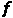构建“平滑”分类器来采用这种平滑原理。与任何分类器一样，预测类别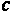是具有最高概率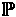的类别。

公式如下所示:

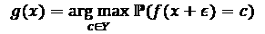

不同之处在于，它将随机*高斯噪声* 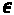应用于输入的副本。它是高斯型的，因为它遵循正态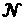分布，并且以方差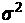为界。

公式如下所示:

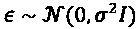

认证过程通过证明平滑的分类器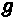在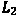半径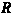内对于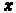是鲁棒的来保证这个结果，如下所示:

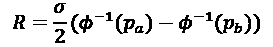

这里，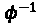是高斯函数的**累积分布函数**(**CDF**),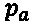和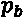分别代表最大概率和次大概率类的概率。重要的是要从中吸取的是，类预测在决策边界中操作，并且半径的作用是充当避免为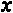验证平滑分类器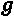的鲁棒性的阈值。

事实上，平滑分类器的一个吸引人的特性是它可以避免预测和验证。对于预测而言，如果它未能通过二项式假设测试(其中一个参数是阈值),则它可能“太近而无法预测”,这使得它容易受到敌对攻击。然而，随机化平滑实现可以选择不实施预测放弃，但是它们将无法证明预测。

为了训练一个平滑的分类器，我们必须首先定义一个基本分类器及其所有训练参数。为此，我们需要初始化一些标准参数，例如历元数(`nb_epochs`)、`batch_size`、梯度下降优化算法(`optimizer`)和损失函数(`loss_object`)。随机化平滑还需要知道类的数量(`nb_classes`)和样本大小(`sample_size)`)，即它应该为每个样本创建多少个扰动实例。接下来，我们必须将我们的训练和测试数据集改为`float32`而不是`float64`。制作标签的一次性编码版本也很有用，这样可以更容易地将它们插入到训练(`y_train_ohe`)和评估(`y_test_mdsample_ohe`)函数中，而不必每次都转换它们。

代码可以在下面的代码片段中看到:

```
nb_epochs = 10
batch_size = 128
optimizer = tf.keras.optimizers.Adam(lr=0.001)
loss_object = tf.keras.losses.CategoricalCrossentropy()
nb_classes = len(np.unique(y_train))
sample_size = 100
X_train, X_test_mdsample = X_train.astype(np.float32),\
                           X_test_mdsample.astype(np.float32)
y_train_ohe = ohe.transform(y_train).astype(np.float32)
y_test_mdsample_ohe =\
              ohe.transform(y_test_mdsample).astype(np.float32)
```

现在让我们做一个简单的函数`get_model`，它返回一个未经训练的基础模型。它具有与先前使用的基本模型相同的架构。

代码可以在这里看到:

```
def get_model(input_shape, min_, max_):
 test_model = Sequential([
  Conv2D(16, (3, 3), activation='relu', input_shape=input_shape),
  MaxPooling2D(pool_size=(2, 2)),
  Conv2D(32, (3, 3), activation='relu'),
  MaxPooling2D(pool_size=(2, 2)),
  Conv2D(64, (3, 3), activation='relu'),
  MaxPooling2D(pool_size=(2, 2)),
  Conv2D(128, (3, 3), activation='relu'),
  MaxPooling2D(pool_size=(2, 2)),
  Flatten(),
  Dense(768, activation='relu'),
  Dropout(0.35),
  Dense(3, activation='softmax')
 ])
 return test_model
```

接下来，我们定义一个`train_step`函数，在给定`model`、`images`和`labels`的情况下，该函数将渐变更新应用于`trainable_variables`。它利用之前定义的`loss_object`函数计算损失，利用`optimizer`应用渐变，如下面的代码片段所示:

```
def train_step(model, images, labels):  
 with tf.GradientTape() as tape:
  predictions = model(images, training=True)
  loss = loss_object(labels, predictions)
 gradients = tape.gradient(loss, model.trainable_variables)
 optimizer.apply_gradients(zip(gradients,\
                                model.trainable_variables))
```

下面的函数`train_rs_classifier`使用 ART 的`TensorFlowV2RandomizedSmoothing`估计器初始化并训练一个平滑分类器。如果`sigma` ( 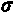)为零，意味着预期的高斯噪声没有方差，也可以用`TensorFlowV2Classifier`构造一个非平滑分类器，放在`TensorFlowV2RandomizedSmoothing`中，这样就可以用`sigma_cert`进行认证。该函数采用训练数据(`X_train`、`y_train`)和我们之前初始化的的所有参数。它还将用于放弃预测的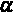阈值默认为 0.001。

代码可以在这里看到:

```
def train_rs_classifier(X_train, y_train, nb_epochs, batch_size,\
                        min_, max_, nb_classes, sample_size,\
                        loss_object, train_step, sigma=0,\
                        sigma_cert=0.5, alpha=0.001):
 input_shape = X_train.shape[1:]
 if sigma > 0:
  rs_classifier = TensorFlowV2RandomizedSmoothing(model=\
                           get_model(input_shape, min_, max_),\
                      input_shape=input_shape,\
                      clip_values=(min_, max_),\
                      nb_classes=nb_classes,\
                      sample_size=sample_size,\
                      loss_object=loss_object,\
                      train_step=train_step,\
                      scale=sigma, alpha=alpha,\
                      channels_first=False)
  rs_classifier.fit(X_train, y_train, nb_epochs=nb_epochs,|
                     batch_size=batch_size)
  return rs_classifier
 else:
  classifier = TensorFlowV2Classifier(model=\
                           get_model(input_shape, min_, max_),\
                        input_shape=input_shape,\
                        clip_values=(min_, max_),\
                        nb_classes=nb_classes,\
                        loss_object=loss_object,\
                        train_step=train_step,\
                        channels_first=False)  
  classifier.fit(X_train, y_train, nb_epochs=nb_epochs,\
                  batch_size=batch_size)
  rs_classifier = TensorFlowV2RandomizedSmoothing(model=\
                                classifier.model,\
                       input_shape=input_shape,\
                      clip_values=(min_, max_),\
                      nb_classes=nb_classes,\
                      sample_size=sample_size,\
                      loss_object=loss_object,\
                      train_step=train_step,\
                      scale=sigma_cert, alpha=alpha,\
                      channels_first=False)
  return classifier, rs_classifier
```

现在，让我们训练三个分类器，如下所示:

*   `classifier_0`:不平滑的分类器。请注意，当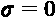时，`train_rs_classifier`函数也返回`rs_classifier_0`，它不是平滑的分类器，而是训练好的非平滑的可认证分类器。
*   `rs_classifier_1`:可认证的平滑分类器，带有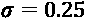。
*   `rs_classifier_2`:可认证的平滑分类器，带有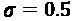。

以下代码片段使用`train_rs_classifier`函数训练前面列出的三个分类器:

```
sigma_0 = 0
classifier_0, rs_classifier_0 = train_rs_classifier(X_train,\ 
        y_train_ohe, nb_epochs, batch_size, min_, max_, nb_classes,\
        sample_size, loss_object, train_step, sigma_0)
sigma_1 = 0.25
rs_classifier_1 = train_rs_classifier(X_train, y_train_ohe,\  
        nb_epochs, batch_size, min_, max_, nb_classes, sample_size,\  
        loss_object, train_step, sigma_1)
sigma_2 = 0.5
rs_classifier_2 = train_rs_classifier(X_train, y_train_ohe,\
        nb_epochs, batch_size, min_, max_, nb_classes, sample_size,\
        loss_object, train_step, sigma_2)
```

一旦我们训练了三个分类器，我们就可以对所有的测试样本进行测试。这将花费比平时更多的时间，因为它需要确保预测是稳健的。

这方面的代码可以在这里看到:

```
y_preds_0 = classifier_0.predict(X_test_mdsample)
y_preds_rs_1 = rs_classifier_1.predict(X_test_mdsample)
y_preds_rs_2 = rs_classifier_2.predict(X_test_mdsample) 
```

有了预测，我们现在可以用`compute_accuracy`来衡量所有三个分类器的预测性能。这个函数的一个有用的特性是它返回精确度和覆盖率。覆盖率是做出预测的百分比——换句话说，没有弃权的百分比——并且准确性只根据它做出的预测来计算。

看看下面的代码片段:

```
acc_0, cov_0 = compute_accuracy(y_preds_0, y_test_mdsample_ohe)
acc_rs_1, cov_rs_1 = compute_accuracy(y_preds_rs_1,\
                                      y_test_mdsample_ohe)
acc_rs_2, cov_rs_2 = compute_accuracy(y_preds_rs_2,\
                                      y_test_mdsample_ohe)
print("Original Classifier")
print(": %.2f%%: %.2f%%" % (acc_0, cov_0))
print("Classifier (σ=%.2f)" % (sigma_1))
print(": %.2f%%: %.2f%%" % (acc_rs_1, cov_rs_1)) 
print("Classifier (σ=%.2f)" % (sigma_2))
print(": %.2f%%: %.2f%%" % (acc_rs_2, cov_rs_2))
```

上述代码输出以下内容:

```
Original Classifier
    Accuracy: 99.50%    Coverage: 100.00%
Smoothed Classifier (σ=0.25)
    Accuracy: 100.00%   Coverage: 99.50%
Smoothed Classifier (σ=0.50)
    Accuracy: 98.99%    Coverage: 99.50%
```

只有 100 个样本，对 200 张图像进行评估，所有三个分类器彼此相差不远。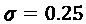平滑分类器报告了 100%的准确率，但只有 99.5%，这表明一幅图像特别难以分类。可能是同一台不平滑的分类器分类错误。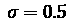平滑的分类器降低了准确性，这表明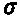噪声的增加将另一幅图像推入了错误分类。

这些结果似乎很有希望，但我们实际上还没有对分类器进行压力测试。我们用`certify`来做这件事，除了这次我们将样本数量增加到 500 ( `n`)。该函数返回预测和每个预测的相应半径，如以下代码片段所示:

```
predictions_0, radiuses_0 = rs_classifier_0.certify(X_test_mdsample, 
                                                    n=500)
predictions_1, radiuses_1 = rs_classifier_1.certify(X_test_mdsample, 
                                                    n=500)
predictions_2, radiuses_2 = rs_classifier_2.certify(X_test_mdsample, 
                                                    n=500)
```

我们如何利用半径来证明准确性？我们必须使用半径作为阈值，测量超过半径阈值的预测保持正确的百分比。我们可以为此创建一个函数(`calc_cert_accuracy`)。这需要测试半径阈值列表(`radius_list`)、模型认证过程的结果(`predictions`、`radiuses`)和标签(`y_test`)来测试预测。

这个的代码可以在下面的代码片段中看到:

```
def calc_cert_accuracy(radius_list, predictions, radiuses, y_test): 
 cert_accuracy = []
 nb_certs = len(radiuses) 
 for r in radius_list:
  r_idx = np.where(radiuses >= r)[0]
  y_test_subset = y_test[r_idx]
  cert_accuracy_r = np.sum(predictions[r_idx] ==\
                        np.argmax(y_test_subset, axis=1)) / nb_certs
  cert_accuracy.append(cert_accuracy_r)  
 return cert_accuracy
```

我们现在将绘制一个折线图，在 *x* 轴上测试半径阈值，在 *y* 轴上测试所有三个分类器的相应认证精度。我们将测试 0 和 1.5 之间的 151 个半径(`radius_list`)(以 0.01 均匀间隔)，然后使用`calc_cert_accuracy`计算三个分类器的认证精度。剩下的代码只是简单地将这些与`radius_list`函数对应起来，如下面的代码片段所示:

```
radius_list = np.linspace(0, 1.5, 151)
cert_accuracy_0 = calc_cert_accuracy(radius_list, predictions_0,\
                              radiuses_0, y_test_mdsample_ohe)
cert_accuracy_1 = calc_cert_accuracy(radius_list, predictions_1,\
                              radiuses_1, y_test_mdsample_ohe)
cert_accuracy_2 = calc_cert_accuracy(radius_list, predictions_2,\
                              radiuses_2, y_test_mdsample_ohe)
plt.figure(figsize=(14,9))
plt.plot(radius_list, cert_accuracy_0, 'r-', label='original')
plt.plot(radius_list, cert_accuracy_1, '-', color='green',\
         label='smoothed, =' + str(sigma_1))
plt.plot(radius_list, cert_accuracy_2, '-', color='blue',\
         label='smoothed, =' + str(sigma_2))
plt.xlabel('Radius', fontsize=14)
plt.ylabel('Certified Accuracy', fontsize=14)
plt.legend()
plt.show()
```

前面的代码产生图*图 13.15* 中所示的图:


图 13.15-原始非平滑分类器和两个平滑分类器的认证准确度

*图 13.15* 展示了两个平滑的模型最初都比未平滑的模型更健壮，但是使用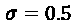的平滑总是更健壮，而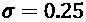没有超过大约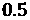的半径。当然，如果我们对超过 200 个测试图像进行评估，我们会有更结论性的结果，但是平滑分类器的优势可能会保持。

# 任务完成

任务是对面罩模型进行一些对抗性的鲁棒性测试，以确定医院访客和工作人员是否可以逃避强制的面罩依从性。基本模型在许多闪避攻击中表现非常差，从最具侵略性到最微妙的攻击。

您还研究了针对这些攻击的可能防御措施，比如空间平滑和对抗性再训练，然后探索了评估和证明您提出的防御措施的健壮性的方法。您现在可以提供一个端到端的框架来防御这种攻击。也就是说，你所做的只是一个**概念验证** ( **POC** )。

接下来，您可以提议训练一个可证明的健壮模型来抵御医院预计最常遇到的攻击，但首先您需要一个一般健壮模型的成分。为此，您需要获取原始数据集中的所有 210，000 张图像，对蒙版颜色和类型进行多种改变，并通过合理的亮度、剪切和旋转变换进一步增强它们。最后，健壮模型需要用几种攻击来训练，包括几种 AP。这些很重要，因为它们模仿了最常见的用身体部位或衣物隐藏面部的合规逃避行为。

# 总结

读完本章后，你应该明白如何对机器学习模型进行攻击，特别是通过规避攻击。你应该知道如何执行 FGSM、BIM、PGD、C&W 和 AP 攻击，并通过空间平滑、对抗性训练和随机化平滑来防御它们。最后但同样重要的是，你应该知道如何评估和证明对抗性的健壮性。下一章是最后一章，它概述了机器学习解释的一些想法。

# 数据集来源

*   Cabani，A .、Hammoudi，k .、Benhabiles，h .和 Melkemi，m .*“masked face-Net-新冠肺炎背景下正确/不正确掩蔽的人脸图像数据集”*，《智能健康》，ISSN 2352-6483，Elsevier，2020 年。【https://doi.org/10.1016/j.smhl.2020.100144 (英伟达公司的知识共享协议 BY-NC-SA 4.0 许可)
*   Karras，Laine，s .和 t . Aila(2019 年)。用于生成式对抗网络的基于风格的生成器架构。2019 年 IEEE/CVF 计算机视觉与模式识别大会(CVPR)，4396-4405。[https://arxiv.org/abs/1812.04948](https://arxiv.org/abs/1812.04948)(英伟达公司的知识共享协议 BY-NC-SA 4.0 许可)

# 延伸阅读

*   阿拉斯加州波利亚科夫(2019 年 8 月 6 日)。*如何攻击机器学习*(规避、中毒、推理、木马、后门)【博文】。[https://towards data science . com/how-to-attack-machine-learning-闪避-投毒-推理-木马-后门-a7cb5832595c](https://towardsdatascience.com/how-to-attack-machine-learning-evasion-poisoning-inference-trojans-backdoors-a7cb5832595c)
*   Carlini 和 d . Wagner(2017)。*评估神经网络的鲁棒性*。2017 年 IEEE 安全与隐私研讨会(SP)，39-57。[https://arxiv.org/abs/1608.04644](https://arxiv.org/abs/1608.04644)
*   t .布朗、d .曼内、a .罗伊、m .阿巴迪和 j .吉尔默(2017 年)。*对抗性补丁*。ArXiv。【https://arxiv.org/abs/1712.09665】
*   科恩，J. M .，罗森菲尔德，e .和科特，J. Z. (2019)。*通过随机平滑认证对抗鲁棒性*。ICML。[https://arxiv.org/abs/1902.02918](https://arxiv.org/abs/1902.02918)*