# 一、Julia 编程入门

Julia 是一种高级、高性能的动态编程语言，专注于数值计算和通用编程。它相对较新——四位创始人杰夫·贝赞森(Jeff Bezanson)、斯特凡·卡尔平斯基(Stefan Karpinski)、维尔拉·沙阿(Viral Shah)和艾伦·埃德尔曼(Alan Edelman)于 2009 年开始创建它，2012 年首次公开提及该语言，当时他们发表了一篇博文，解释了他们的愿景和目标。2012 年被认为是朱莉娅的正式出生年份，因此它只有六岁。自从其首次公开发布以来，Julia 已经收到了来自世界各地数百名科学家、程序员和工程师的代码贡献。它是开放开发的，源代码可以在 GitHub 上获得，是最受欢迎的库之一，拥有近 20，000 颗星(在编写和统计时)。备受期待的第一个稳定版本 Julia v1.0 于 2018 年 8 月在伦敦 Julia 会议期间发布，这是 700 多名开源贡献者和数千名包创作者和早期用户之间合作的辉煌成果。到那时，这种语言已经被下载了 200 多万次！

Julia 作为传统科学计算语言的新替代品出现，传统科学计算语言要么效率很高*要么速度很快*，但两者不可兼得。这就是所谓的**双语言问题**，最初的原型代码是用一种动态、高效的语言(如 R 或 Python)编写的，这允许探索性编码和快速迭代，跳过繁重的构建和编译时间。但是后来，开发人员将被迫使用满足科学计算的高性能要求的编译语言来重写他们的程序(或者至少是他们程序的性能关键部分)。

Julia 的创造者认为软件开发技术已经发展到足以支持一种结合了高生产率和高性能的语言。这是他们的宣言，强调了他们对朱莉娅的目标:

“我们想要一种开源的语言，拥有自由的许可。我们想要 C 的速度和 Ruby 的活力。我们想要一种同形异义的语言，既有像 Lisp 那样的真正的宏，又有像 MATLAB 那样明显、熟悉的数学符号。我们想要像 Python 一样可用于一般编程，像 R 一样易于统计，像 Perl 一样自然用于字符串处理，像 MATLAB 一样强大用于线性代数，像 shell 一样善于将程序粘合在一起。这种东西学习起来非常简单，却能让最严肃的黑客感到高兴。我们希望它是交互式的，我们希望它是经过编译的。”

(我们有没有提到应该和 C 一样快？)"

尽管看起来不可思议，Julia 已经设法满足了所有这些要求，创造了一种简单易学、直观、友好、高效和快速的独特语言。让我们仔细看看所有这些特性。

我们将在本章中讨论的主题有:

*   快速浏览一下 Julia——它是什么，主要特点和优势，以及为什么它可能是您下一个项目的最佳选择
*   如何在本地机器上设置 Julia 语言并与之交互
*   高效 Julia 开发的最佳 ide 和编辑器
*   通过了解 Julia 强大的 REPL 开始使用它
*   如何使用内置的包管理器`Pkg`来扩展第三方库的语言


# 技术要求

Julia 包生态系统正在不断发展，每天都有新的包版本发布。大多数时候这是好消息，因为新版本带来了新特性和错误修复。然而，由于许多软件包仍处于测试阶段(版本 0.x ),任何新版本都可能引入突破性的变化。因此，书中介绍的代码可能会停止工作。为了确保您的代码将产生与书中描述的相同的结果，建议使用相同的包版本。以下是本章中使用的外部软件包及其具体版本:

```
 IJulia@v1.14.1
OhMyREPL@v0.4.1
Revise@v0.7.14
```

为了安装软件包的特定版本，您需要运行:

```
pkg> add PackageName@vX.Y.Z 
```

例如:

```
pkg> add IJulia@v1.14.1
```

或者，你可以通过下载本章提供的`Project.toml`文件并使用`pkg>`实例化来安装所有使用的包，如下所示:

```
julia> download("https://raw.githubusercontent.com/PacktPublishing/Julia-Programming-Projects/master/Chapter01/Project.toml", "Project.toml")
pkg> activate . 
pkg> instantiate
```


# 为什么是朱莉娅？

简而言之，Julia 确实是一种新的编程语言，它成功地将编译语言的高性能与动态语言的灵活性结合起来，通过一种友好的语法，从一开始就感觉自然而直观。Julia 是*快速的*(程序在运行时被编译成适用于多种平台的高效本机代码)*通用的*(标准库支持开箱即用的强大编程任务，包括异步 I/O、过程控制、并行和分布式计算、日志记录、概要分析、包管理等等)*动态的和可选类型的*(它通过可选类型声明进行动态类型化，并带有强大的**读取-评估-打印循环** ( **REPL** )用于交互式和探索性的它也是*技术性的*(擅长数值计算)和*可组合的*(得益于其丰富的软件包生态系统，这些软件包被设计为无缝地协同工作并具有高性能)。

虽然最初它专注于解决高性能数值分析和计算科学的需求，但最近的版本已经将该语言定位于通用计算领域，许多类别的专门功能被移出核心到专用模块中。因此，它也非常适合客户端和服务器端编程，因为它具有强大的并发、并行和分布式计算能力。

Julia 实现了一个基于参数多态和多重调度的类型系统，它是垃圾收集的，使用了 eager 求值，打包了一个强大的正则表达式引擎，不用胶水代码就可以调用 C 和 Fortran 函数。

让我们来看看这门语言最重要的特征，也就是让 Julia 脱颖而出的部分。如果你在考虑让 Julia 做你的下一个项目，你可以用这个作为你需求的快速清单。


# 良好的性能

Julia 性能的关键是基于 LLVM 的**实时** ( **JIT** )编译器和一系列战略设计决策之间的结合，这些决策允许编译器生成接近并且在大多数情况下匹配 c 语言性能的代码

为了让你了解 Julia 在这方面的立场，官方网站提供了一系列针对其他主流语言(包括 C、Python、R、Java、JavaScript、Fortran、Go、Rust、MATLAB 和 Octave)的微基准测试，这些语言实现了一些计算 Fibonacci 序列、Mandelbrot 集合、`quicksort`和其他一些算法。它们旨在根据常见的代码模式(如函数调用、字符串解析、排序、迭代、递归等)来评估编译器的性能。这里有一个基准测试图，可以在[https://julialang.org/benchmarks/](https://julialang.org/benchmarks/)获得，它展示了 Julia 在所有测试中的持续最佳表现。下面的图描述了这一点:

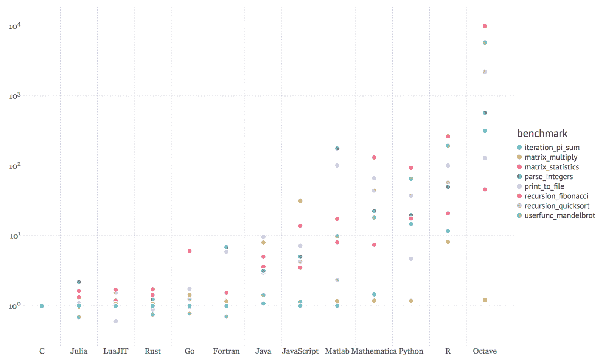

关于测试方法的更多细节，你可以访问 https://julialang.org/benchmarks/。 [](https://julialang.org/benchmarks/) 


# 简洁、易读、直观的语法

Julia 的创建者们从其他语言中精心挑选了最成功的语法元素，目的是生成富有表现力、简洁易读的代码。Julia 为高级数值计算提供了强大而富有表现力的语言结构，就像 R、MATLAB 和 Python 等语言一样。它基于现有数学编程语言带来的经验，但也借鉴了流行的动态语言，如 Lisp、Perl、Python、Lua 和 Ruby。

为了让您快速体验一下 Julia 的习惯用法，以下是如何打开文件、阅读文件、输出文件，然后让 Julia 自动关闭文件:

```
open(".viminfo") do io
    read(io, String) |> println
end  
.viminfo file for reading passing io, an IOStream instance, into the underlying code block. The stream is then read into a String that is finally displayed onto the console by piping it into the println function. The code is very readable and easy to understand if you have some coding experience, even if this is your first time looking at Julia code.
```

这种所谓的`do`语法(以`open`函数后的`do`部分命名)受到 Ruby 块的启发——事实上，它是将匿名函数作为方法参数传递的语法糖。在前面的例子中，它被有效地用来简洁地表达一个强大的安全处理文件的设计模式，保证资源不会被意外地打开。

这显示了语言的设计者为了让 Julia 变得安全、初学者友好、富于表现力、简洁、易读和直观而付出的努力。


# 强大而高效的动态类型系统

Julia 的类型系统是这种语言的一个关键特性，对它的性能和生产率都有重大影响。类型系统是动态的和可选的，这意味着开发人员可以(但不是必须)向编译器提供类型信息。如果没有提供，Julia 将执行类型推断，即从输入值的类型推断出后面值的类型的过程。这是一项非常强大的技术，因为它将程序员从对类型的担心中解放出来，使他们能够专注于应用程序逻辑，并形成一个更温和的学习曲线。当事先不知道约束和需求的完整集合时，这对于原型和探索性编程特别有用。

但是，理解并正确使用类型系统可以提供重要的性能优势。Julia 允许有选择地添加类型信息，使得表明某个值必须是特定类型成为可能。这是该语言的基石之一，允许执行方法调度，并有助于为不同的参数类型自动生成高效、专门的代码。类型系统允许定义丰富的类型层次结构，用户定义的类型与内置类型一样快速紧凑。


# 专为并行和分布式计算而设计

如果说 70 年代和 80 年代的语言是在有限的 CPU 和 RAM 资源的严格要求下设计的，那么 90 年代和 2000 年代的语言则乐观地认为这些资源会永远扩展。然而，在过去的十年里，随着向多 CPU、多核和分布式计算的转变，这方面出现了停滞。在这一点上，Julia 在 6 年前的诞生使它比旧语言更有优势，将并行和分布式计算作为其最重要的特性之一。


# 与其他语言的有效交流

采用一种新语言的最严重的障碍之一是，生态系统需要时间来赶上——并且在开始时，它不能提供已经建立的语言的质量和丰富性的库。现在，当 Julia 受益于一个庞大的、热情的、持续增长的开发者社区时，这已经不是问题了。但是能够与其他语言无缝交流是丰富现有功能和毫不费力地补充任何缺失功能的一种非常有效的方式。

Julia 能够直接调用 C 和 Fortran 函数(也就是说，不需要胶水代码)——这对科学计算尤其重要，这些语言在科学计算领域有着强大的影响力和悠久的历史。

可选包通过添加对调用用其他语言编写的函数的支持来扩展这种能力，最著名的是通过`PyCall`调用 Python。还有其他的，支持与 Java，C++，MATLAB，Rust 等等的交互。


# 强大的 REPL 和类似外壳的功能

REPL 代表一个语言外壳，一个命令行的交互式计算机编程环境。Julia 拥有出色的 REPL，支持复杂的代码输入和评估。它包括强大的编辑功能，如可搜索的历史，制表符完成，语法高亮，等等。

它还提供了三种特殊模式— *shell* *、*，可以像在操作系统终端一样执行命令； *help，*无需离开 REPL 即可访问文档；和 pkg，用于安装和管理应用程序依赖项。


# 更多...

Julia 自带强大的包管理器，可以解决依赖性，处理额外包的添加和删除。像大多数现代语言一样，Julia 完全支持 Unicode。最后，它是在麻省理工学院的许可下发布的——它是免费和开源的。


# 安装 Julia

如果上一节说服您在下一个项目中使用 Julia，或者至少让您好奇想了解更多，那么是时候设置您的 Julia 开发环境了。

Julia 有极好的跨平台支持，可以在所有主流操作系统上运行。安装过程很简单——可以在您的本地机器上，在一个**虚拟机** ( **VM** )中，在一个 Docker 容器中，或者在云中某个地方的服务器上设置该语言。

让我们从查看三大操作系统(Windows、Linux 和 macOS)的本地安装选项开始。请随意直接跳到适合您的页面。


# Windows 操作系统

Windows 作为一个开发平台已经走了很长的路，有一些很好的替代方法可以让 Julia 运行起来。


# 官方 Windows 安装程序

最简单的选择是从[https://julialang.org/downloads/](https://julialang.org/downloads/)下载与你的平台(32 或 64 位)相对应的 Windows installer。获取`.exe`并运行它。按照标准的安装过程，最后，你将 Julia 作为一个程序安装。双击`julia.exe`打开朱莉娅·REPL 的命令提示符，如下图所示:

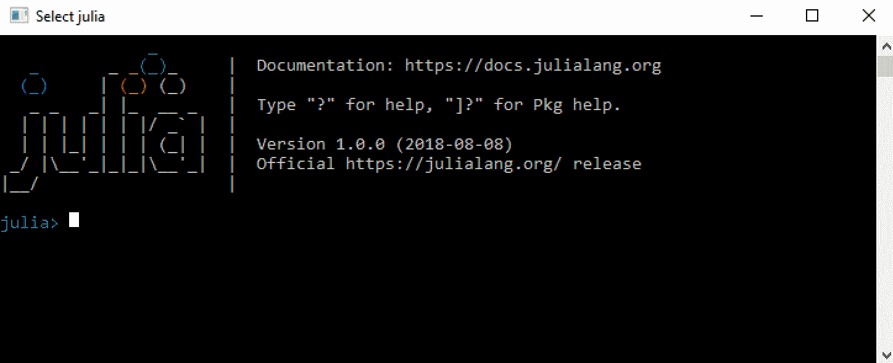


# 使用巧克力

Chocolatey 是 Windows 的一个包管理器，类似于 Linux 上的`apt`或`yum`，或者 Mac 上的`brew`。如果你没有，按照 https://chocolatey.org 的指示去拿。

Chocolatey 有最新版本的 Julia，可以通过搜索确认，如下所示:

```
$ choco search julia 
Chocolatey v0.10.11 
Julia 1.0.0 [Approved] 
1 packages found. 
```

安装就像这样简单:

```
$ choco install julia 
Chocolatey v0.10.11 
Installing the following packages: 
julia 
By installing you accept licenses for the packages. 
Progress: Downloading Julia 1.0.0... 100% 
Julia v1.0.0 [Approved] 
Chocolatey installed 1/1 packages. 
```


# 用于 Linux 的 Windows 子系统

Windows 10 最近增加的一个功能是 Linux 子系统。这允许设置 Linux 开发环境，包括大多数命令行工具、实用程序和应用程序——直接在 Windows 上，无需修改，并且没有运行 VM 的开销。

为了能够使用 Linux 子系统，您的 PC 必须运行 64 位版本的 Windows 10 周年更新或更高版本(内部版本 1607+)。还需要首先启用它，因此以管理员身份打开 PowerShell 并运行以下命令:

```
$ Enable-WindowsOptionalFeature -Online -FeatureName Microsoft-Windows-Subsystem-Linux 
```

启用子系统后(可能需要重启计算机)，您可以直接从 Windows 商店选择一个可用的 Linux 版本。在撰写本文时，有五个版本可用——Ubuntu、openSUSE、SLES、Debian 和 Kali。

Ubuntu 是 Windows 10 的默认选项，在 Windows 商店中拥有最好的用户评级，所以我们就用它吧。可以从[https://www.microsoft.com/en-us/store/p/ubuntu/9nblggh4msv6](https://www.microsoft.com/en-us/store/p/ubuntu/9nblggh4msv6)安装。或者，您可以打开一个命令提示符并键入`$ bash`。这将触发 Ubuntu Linux 子系统的安装。

一旦您发现自己处于 Linux 子系统的 shell 提示符下，您就可以继续执行并发出安装 Julia 的命令。对于 Ubuntu，您需要运行以下程序:

```
$ sudo apt-get install julia
```

确保确认所需的选择—几分钟后，Julia 就可以启动并运行了。


# 马科斯

在 macOS 上安装 Julia 很简单。有两个主要选项，这取决于您是更喜欢可视化安装程序还是更喜欢终端提示符。


# 官方形象

访问[https://julialang.org/downloads/](https://julialang.org/downloads/)，寻找 macOS 包(`.dmg`)。下载完成后，双击`.dmg`文件，将 Julia 应用程序拖放到`/Applications`文件夹中。现在，您只需打开 Julia 应用程序，它将启动一个新的终端会话，加载 Julia 环境，如下所示:

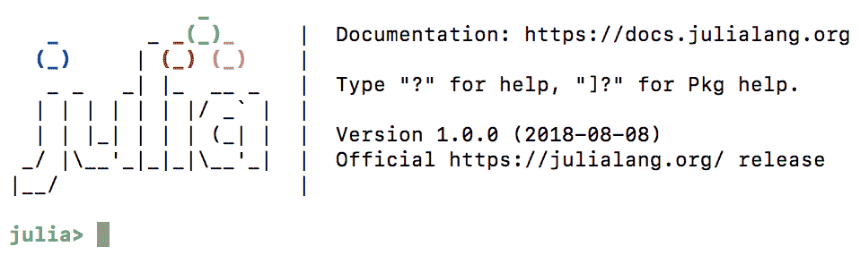


# 公司自产自用

`Homebrew`是 Linux 上`apt`和`yum`线内知名的 macOS 的包管理器。对于安装 Julia 来说，这并不是真正必要的，但是设置它是值得的，因为它可以在开发过程中非常有用，因为它可以无缝地为您的项目安装数据库服务器、库和其他组件。

根据 [https://brew.sh](https://brew.sh) 的说明，可以在终端窗口运行以下命令进行安装:

```
$ /usr/bin/ruby -e "$(curl -fsSL https://raw.githubusercontent.com/Homebrew/install/master/install)" 
```

这可能需要一段时间，但是一旦安装了`Homebrew`，一个新的命令行实用程序`brew`将变得可用。

最后，`$ brew cask install julia`会下载安装最新版本的 Julia。在这个过程中，它还会将`julia`二进制文件链接到`/usr/local/bin/julia`，这样您就可以通过简单地键入`$ julia`从命令行与该语言进行交互。

一旦确认安装成功，您就可以运行`$ julia`来启动新的 REPL 会话:

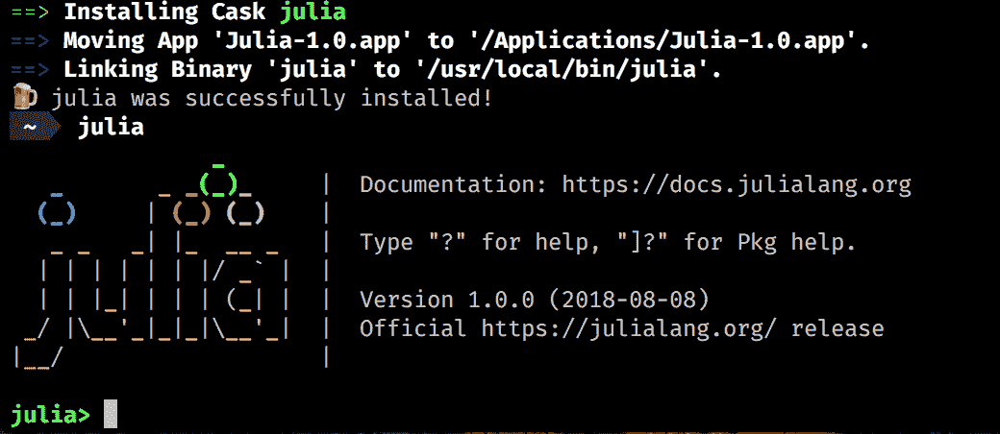


# Linux 和 FreeBSD

Julia 已经可以在主要的 Linux 发行版的软件仓库中获得，但是不幸的是，这些都不是最新的。例如，在撰写本文时，Ubuntu 正在提供 v0.4.5 和 Debian v0.4.7。最好的方法是使用 Julia 的下载页面上提供的通用 Linux 二进制文件，在[https://julialang.org/downloads/](https://julialang.org/downloads/)。

请遵循与您的 Linux 发行版相对应的说明，如[https://Julia lang . org/downloads/platform . html # generic-binaries](https://julialang.org/downloads/platform.html#generic-binaries)所示。


# 码头工人

Docker 是一种软件技术，它提供了操作系统级虚拟化的附加抽象层。用简单的英语来说，Docker 建立了行为类似于虚拟机的*容器*，但是没有启动和维护虚拟机的额外开销。你可以在所有主流操作系统上运行 Docker。

Docker 作为一种开发和部署策略被广泛使用，因此许多技术都以 Docker 映像的形式随时可用，Julia 也不例外。

首先为您的平台安装 Docker。官方的 Julia 容器可以在 https://store.docker.com/images/julia 的 Docker 商店找到。去拿吧。

如果你在设置码头或安装集装箱时需要帮助，请遵循 https://www.docker.com 的说明。

在命令提示符下，键入`$ docker pull julia`。一旦 Docker 配置了 Julia 映像，就用`$ docker exec -it --rm julia`运行它。这将启动容器并加载一个新的朱莉娅·REPL:

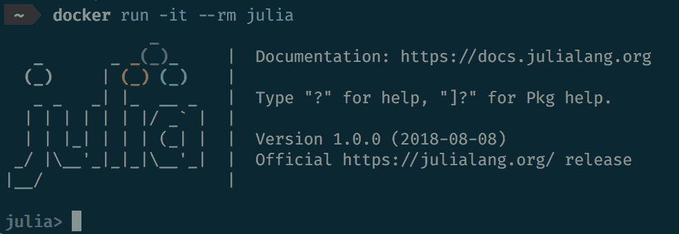


# 朱丽亚普罗

Julia 编程语言背后的公司 Julia Computing 提供了一个包含电池的分发版。它叫做 **JuliaPro** ，可以说这是最简单的直接与 Julia 开始的方法。它包括编译器、分析器、Juno IDE 和 160 多个高质量的策划包，用于绘图、数据可视化、机器学习、数据库等。

JuliaPro 可以在[https://shop.juliacomputing.com/Products/](https://shop.juliacomputing.com/Products/)免费下载(需要注册)。一旦您获得了它，请遵循特定于您的平台的安装过程。完成后，您将拥有开始有效使用 Julia 所需的一切。

付费企业版也是可用的，提供一些额外的功能，如 Excel 集成和 SLA 支持。


# JuliaBox

最后，还有 Julia box([https://www.juliabox.com](https://www.juliabox.com))，Julia Computing 的另一个免费产品。JuliaBox 允许在他们的云中动态运行 Julia Docker 容器。它提供对 IJulia Jupyter 笔记本([https://github.com/JuliaLang/IJulia.jl](https://github.com/JuliaLang/IJulia.jl))的访问，与 Google Drive 的文件同步，导入 GitHub 存储库，以及许多其他功能。

如果你对 Jupyter 笔记本不熟悉，你可以去 http://jupyter.org 了解更多。


# 选择 IDE

使用编程语言时，IDE 非常重要。一个强大的源代码编辑器、代码补全以及一个好的 linter 和调试器可以极大地影响学习曲线和使用语言的效率。你会很高兴地了解到有一些非常好的 IDE 和编辑器可供 Julia 选择——而且你很可能会在其中找到你最喜欢的一个。

IDE 的选择反映了语言作为一个整体的实用性。从选择 LLVM 作为编译器，到提供从其他语言调用函数的有效方法，再到使用`git`和 GitHub 来驱动包管理器，Julia core 团队采取了*不要重新发明轮子*的方法。按照同样的思路，Julia 社区已经在现有的行业编辑器上构建了强大的 ide，比如 Atom 和 Visual Studio Code。


# 朱诺(原子)

朱诺([http://junolab.org](http://junolab.org))是最高级的朱莉娅 IDE，也是朱莉娅专业人士事实上的首选编辑。它基于 Atom 编辑器，可以被认为是官方的开发工具，也和前面提到的 JuliaPro 发行版一起发布。

要获得它，要么从[https://juliacomputing.com/products/juliapro.html](https://juliacomputing.com/products/juliapro.html)下载并安装 JuliaPro，要么[手动安装 Atom 和所需的插件。](https://juliacomputing.com/products/juliapro.html)

如果选择手动安装，首先需要从 [https://atom.io](https://atom.io) 下载 Atom。一旦它启动并运行，进入设置面板(你可以使用快捷键 *Ctrl* / *cmd* 和*，*)，然后进入安装面板。在搜索框中输入`uber-juno`，按*进入*。接下来，单击同名软件包上的 install 按钮。Atom 将从这里开始，安装所有需要的 Atom 和 Julia 包。

配置完成后，IDE 选项将出现在 Atom 菜单中的 Packages > Julia 下。从这里还可以启用各种窗格，以列出变量、可视化绘图或搜索文档。

如需更多信息，请查看 http://junolab.org[和 https://github.com/JunoLab/uber-juno/blob/master/setup.md](http://junolab.org)[的](https://githubcom/JunoLab/uber-juno/blob/master/setup.md)。


# Visual Studio 代码

Visual Studio Code 是微软提供的跨平台可扩展编辑器。在[https://code.visualstudio.com](https://code.visualstudio.com)所有的*三大*平台都有。安装完成后，运行它并从菜单中点击查看>扩展或使用快捷键 *Shift* 和 *Ctrl* / *cmd* 和 *X* 。搜索`julia`并安装来自 *julialang* 的 Julia 扩展。

Visual Studio 代码中的 Julia 支持(还)不如 Juno 强大，但是如果您喜欢它，它可以提供很好的编码体验，提供语法突出显示、代码完成、悬停帮助、Julia 代码评估、林挺、代码导航等等。Visual Studio 代码也比 Atom 更快，使用的资源更少，这使得它在功能不太强大的工作站上运行时是一个有吸引力的选择(尽管 Atom 在最近的版本中在这方面有了很大的改进)。

该扩展可能需要一些帮助来确定在哪里可以找到 Julia 二进制文件。如果是这种情况，您将得到一条信息性的错误消息，要求您设置`julia.executablePath`配置选项。这应该指向 julia 二进制文件，并且取决于您的操作系统和您安装 Julia 的方式(有关安装的详细信息，请参见上一节)。

要设置配置，请转至首选项>设置( *Ctrl* / *cmd* 和*，*)，并在用于覆盖默认设置的右侧窗格中添加以下内容:

```
"julia.executablePath": "/path/to/your/julia/folder/bin/julia" 
```


# 伊朱利亚(朱利亚博克斯)

我们在上一节已经提到了 Julia box([https://www.juliabox.com](https://www.juliabox.com))，它允许在云中创建、编辑和运行 IJulia Jupyter 笔记本。IJulia 也可以安装在本地开发机器上。

IJulia 是 Jupyter 交互环境的 Julia 语言后端(IPython 也使用它)。它允许我们使用 Jupyter/IPython 强大的图形笔记本与 Julia 语言进行交互，该笔记本将代码、格式化文本、数学和多媒体结合在一个文档中。

虽然 IJulia/Jupyter 不是真正的 IDE，也不是经典的编辑器，但它是编辑和执行 Julia 脚本的强大环境，并且它在数据科学和科学计算领域特别受欢迎。让我们花一些时间来设置它。

启动一个新的朱莉娅·REPL 并执行以下命令:

```
julia> using Pkg
julia> Pkg.add("IJulia")
```

这将安装`IJulia`包，同时添加一个必需的最小 Python 和 Jupyter 发行版，名为 **Miniconda** 。这个 Python 发行版是 Julia 私有的(不在你的`PATH`)。完成后，继续执行以下操作:

```
julia> using IJulia
julia> notebook()
```

这将在默认浏览器中打开本地 Jupyter 安装的主页，位于[http://localhost:8888/tree](http://localhost:8888/tree)。从工具栏中选择`New > Julia 1.0.0`(或任何你当前运行的版本)来创建一个新的笔记本。现在，您可以使用嵌入的可执行 Julia 代码创建丰富的文档。

通过`Interact`，还有一种方式可以将 IJulia 作为桌面应用来运行。你可以在 https://nteract.io/desktop[下载试试。](https://nteract.io/desktop)

如果你是 Jupyter 的新手，那就值得多了解一下。去 http://jupyter.org[看看吧](http://jupyter.org)。

您还可以在本章的支持文件库中找到本书每一章的 IJulia 笔记本。笔记本将允许你一步一步地浏览我们正在编写的代码。例如，你可以在 https://github . com/packt publishing/Julia-Programming-Projects/blob/master/Chapter 01/Chapter % 201 . ipynb 找到这一章的代码。你可以下载到你的电脑上，用本地的 IJulia 安装打开，或者通过他们的 Google Drive 集成上传到 JuliaBox。


# 其他选项

前面的选择是 Julia 最常用的 IDE 和编辑器选项。但是外面还有一些。

对于`vim`爱好者来说，还有`julia-vim`([https://github.com/JuliaEditorSupport/julia-vim](https://github.com/JuliaEditorSupport/julia-vim))。

如果你喜欢 Emacs，你会很高兴知道茱莉亚也支持它[https://github.com/JuliaEditorSupport/julia-emacs](https://github.com/JuliaEditorSupport/julia-emacs)。

如果你想用 JetBrains 提供的 ide(比如 IntelliJ IDEA)，你会很高兴听到在 https://plugins.jetbrains.com/plugin/10413-julia 有一个插件

最后，还有对崇高文本的支持，可在[https://github.com/JuliaEditorSupport/Julia-sublime](https://github.com/JuliaEditorSupport/Julia-sublime)获得。该插件提供了良好的 Julia 编辑体验，支持语法高亮显示、代码完成和跳转到定义，等等。


# Julia 入门

如果你已经完成了本章的第一部分，现在你应该已经有了一个功能齐全的本地 Julia 安装，开始一个 Julia REPL 会话的知识，并且已经准备好了你的首选 IDE 来进行编码。如果不是这样，请参考前面的章节。从现在开始，我们进入正题——是时候写一些 Julia 代码了！


# 朱莉娅·REPL

我们首先需要了解的是如何使用强大的 REPL。作为一名 Julia 开发人员，您将花费大量时间进行探索性编程，与 shell 和文件系统交互，以及管理软件包。REPL 将是你值得信赖的伙伴。很好地了解它是值得的，它将为你节省大量时间。

首字母缩写词 REPL 代表读取-评估-打印循环。简单地说，它是一个特定于语言的外壳，一个交互式的编码环境，允许输入表达式，计算表达式，并输出结果。

REPLs 非常有用，因为它们提供了一种简单的方式来与语言交互，尝试想法和原型，促进探索性编程和调试。它在数据分析的环境中特别强大，可以快速连接到数据源，加载数据样本，然后切片，快速测试不同的假设。

Julia 提供了出色的 REPL 体验，其丰富的功能涵盖了 Julia 语句的快速评估、可搜索的历史、制表符补全、语法突出显示、专用帮助和外壳模式等等。

如果您没有安装 Julia，请参见*安装 Julia* 部分。


# 与 REPL 互动

根据您的操作系统和您的偏好，REPL 可以通过简单地调用没有参数的`$ julia`，或者双击`julia`可执行文件来启动。

你将会看到这样一个屏幕(Julia 版本可能与我的不同):

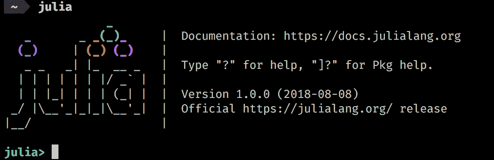

现在 Julia 正在等待我们输入代码，逐行评估。你可以通过检查终端提示来确认，提示上写着`julia>`。这被称为**朱利安**模式。让我们兜一圈。

您可以按照本章支持文件提供的 IJulia Jupyter 笔记本进行操作。如果不熟悉 Jupyter，不知道如何在本地运行，可以使用 Julia box([juliabox.com](http://juliabox.com))。你要做的就是创建一个账号，登录，然后从[https://github . com/packt publishing/Julia-Programming-Projects/blob/master/Chapter 01/Chapter % 201 . ipynb](https://github.com/PacktPublishing/Julia-Programming-Projects/blob/master/Chapter01/Chapter%201.ipynb)加载笔记本。

输入以下几行，每一行后按*回车*:

```
julia> 2+2 
julia> 2^3 
```

所以我们可以像使用简单的计算器一样使用 Julia。不是很有用，但这只是开始，并说明了当我们处理复杂计算时，这种快速输入和反馈循环是多么强大。

`println`是一个非常有用的函数，它打印接收到的任何值，并在后面追加新的一行。键入以下代码:

```
julia> println("Welcome to Julia") 
```

在每一行下面，您应该看到每个表达式生成的输出。你的窗口现在应该看起来像这样。

```
julia> 2+2 
4 
julia> 2^3 
8 
julia> println("Welcome to Julia") 
Welcome to Julia 
```

让我们再试一些。REPL 一次解释一行，但所有内容都在一个公共范围内进行评估。这意味着我们可以定义变量并在以后引用它们，如下所示:

```
julia> greeting = "Hello" 
"Hello" 
```

这看起来棒极了！让我们将`greeting`变量与`println`一起使用:

```
julia> println(greting) 
ERROR: UndefVarError: greting not defined 
```

哎呀！有一点打字错误，REPL 立即返回一个错误。不是`greting`，是`greeting`。这也告诉我们，Julia 不允许在没有正确初始化的情况下使用变量。它只是寻找了`greting`变量，但没有成功——并且抛出了一个未定义的变量错误。让我们再试一次，这次要更小心:

```
julia> println(greeting) 
Hello 
```

好，这样好多了！我们可以看到输出:我们存储在`greeting`变量中的`Hello`值。


# ans 变量

REPL 提供了一些特定于这种交互环境的帮助功能(在执行 Julia 脚本时这些功能不可用)。其中之一是`ans`变量，由 Julia 自动设置和更新。

如果你输入`julia> 2^3`——不出所料，你会得到`8`。现在输入`julia> ans`—你会再次得到`8`！那是怎么回事？`ans`是一个特殊变量，只存在于 REPL 中，自动存储最后一次返回值。在使用 REPL 时，它可能非常有用，但更重要的是，您需要知道它的存在，这样您就不会意外地用相同的名称声明一个变量。否则，你会遇到一些很难理解的错误，你的变量值经常被覆盖。


# 即时粘贴

REPL 有一个非常强大的功能叫做**提示粘贴**。这允许我们复制-粘贴-执行包含`julia>`提示和表达式输出的 Julia 代码和片段。粘贴以`julia>`开头的文本时激活。在这种情况下，只解析以`julia>`开头的表达式，其他的都被忽略。这使得粘贴从另一个 REPL 会话或文档中复制的代码块成为可能，而不必清除提示和输出。

即时粘贴在 IJulia Jupyter 笔记本中不起作用。

要查看实际效果，请原样复制并粘贴以下代码片段:

```
julia> using Dates 

julia> Dates.now() 
2018-09-02T21:13:03.122 
julia> ans 
2018-09-02T21:13:03.122 
```

如果一切顺利，两个表达式都应该输出您的当前时间，而不是代码片段中的时间，有效地用 Julia 会话中的结果替换代码片段中的结果。

由于其局限性，此功能不适用于默认的 Windows 命令提示符。


# 制表符结束

在 Julian、pkg 和 help 模式下，您可以在输入某个功能的前几个字符后按下*选项卡*键，以获得所有匹配项的列表:

```
julia> pri[TAB] 
primitive type   print             print_shortest    print_with_color  println           printstyled  
```

它还可以用来将 LaTeX 数学符号替换为它们的 Unicode 等效符号。为此，键入反斜杠作为第一个字符，然后是符号的前几个字符，然后是*制表符*。这将完成符号的名称，或者如果有多个匹配的名称，将显示一个选项列表。在符号的完整名称上再次按下*键*将执行替换:

```
julia> \pi[TAB] 
julia> π 
π = 3.1415926535897... 

julia> \om[TAB] \omega \ominus 
julia> \ome[TAB] 
julia> \omega[TAB] 
julia> ω 
```


# 清洁 REPL 镜

Julia 没有 null 的概念，所以你不能从内存中释放一个变量。然而，如果您需要释放一个由变量引用的昂贵资源，您可以用类似于`0`的内容替换它的值，之前的值将被自动垃圾收集。您甚至可以通过调用`gc()`直接调用垃圾收集器。


# 其他 REPL 模式

朱莉娅·REPL 有四种操作模式，还可以根据需要定义其他模式。当前激活的模式由其提示符指示。在前面的例子中，我们使用了 *julian* 模式`julia>`，它评估输入的表达式。另外三种可用模式是*帮助、*T1、 *shell、* `shell>`和包管理、`pkg>`。

可以通过在行首输入特定字符来切换活动模式。作为响应，提示将会改变，以指示当前模式。该模式将保持活动状态，直到评估完当前行，自动切换回 julian 模式(除了`pkg>`模式，它是 *sticky—* 也就是说，它保持活动状态，直到通过在行首键入 backspace 明确退出)。通过删除该行上的所有内容直到提示符变回`julia>`，或者按下 *Ctrl* + *C* ，可以退出替代模式，而无需评估表达式。


# 使用帮助模式访问文档

帮助模式提供对文档的访问，而无需离开 REPL。要访问它，只需在行首键入`?`。您应该会看到`help?>`提示符。现在您可以输入文本，Julia 将在文档中搜索匹配的条目，如下所示:

```
julia> ?  
help?> println 
search: println printstyled print_with_color print print_shortest sprint isprint 

  println([io::IO], xs...) 

  Print (using print) xs followed by a newline. If io is not supplied, prints to stdout. 

  Examples 
  ≡≡≡≡≡≡≡≡≡≡ 

  julia> println("Hello, world") 
  Hello, world 

  julia> io = IOBuffer(); 

  julia> println(io, "Hello, world") 

  julia> String(take!(io)) 
  "Hello, world\n"  
```

在 IJulia 中，通过在输入前添加所需的模式激活器来激活附加模式。例如，要访问前面`println`功能的帮助，我们需要输入`?println.`

通过降价，输出支持丰富的格式:

```
julia> using Profile 
help?> Profile.print 
```

产生丰富的输出，如下面的屏幕截图所示:

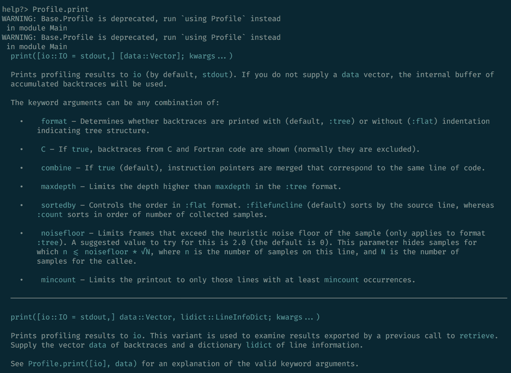

可以查询更复杂的表达式，包括宏、类型和变量。

例如，`help?> @time`:

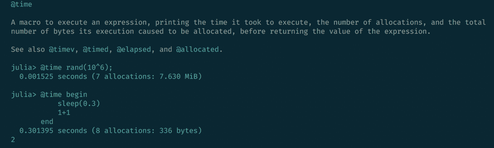

或者`help?> IO`:

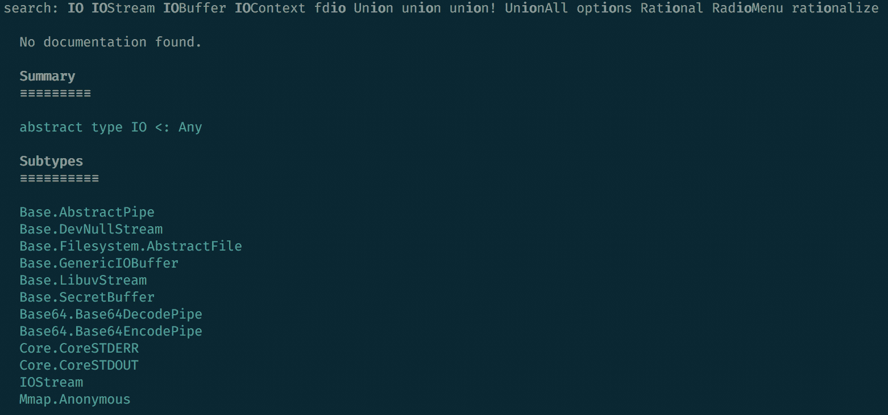


# 外壳模式

shell 模式用于切换到类似于系统 shell 的命令行界面，以便直接执行 OS 命令。要输入它，请在 julian 提示符的最开头输入分号`;`:

```
julia> ;  
```

输入`;`后，提示变为`shell>`:

要在 IJulia 中进入 shell 模式并执行 shell 命令，在命令前加上前缀`;`，例如`;ls`。

现在我们可以直接执行系统范围的命令，而不需要用 Julia 代码包装它们。这将列出您的`repl_history.jl`文件的最后十行。Julia 使用该文件来保存在 REPL 中执行的命令的历史记录，因此您的输出将与我的不同:

```
julia> using REPL
shell> tail -n 10 ~/.julia/logs/repl_history.jl
IO
# time: 2018-09-02 21:56:47 CEST
# mode: julia
REPL.find_hist_file()
# time: 2018-09-02 21:58:47 CEST
# mode: shell
tail -n 10 ~/.julia/logs/repl_history.jl 
```

在 REPL 模式下，我们可以访问 Julia 的 API，这是一个非常强大的组合。例如，为了以编程方式获得 REPL 历史文件的路径，我们可以使用`REPL.find_hist_file()`函数，如下所示:

```
julia> REPL.find_hist_file() 
"/Users/adrian/.julia/logs/repl_history.jl" 
```

文件的路径对您来说会有所不同。

我们可以在 shell 模式下通过将命令包装在`$()`中来使用它:

```
shell> tail -n 10 $(REPL.find_hist_file()) 
    REPL.find_hist_file() 
# time: 2018-09-02 21:58:47 CEST 
# mode: shell 
    tail -n 10 ~/.julia/logs/repl_history.jl 
# time: 2018-09-02 22:00:03 CEST 
# mode: shell 
    tail -n 10 $(REPL.find_hist_file()) 
```

与帮助模式类似，可以通过在行首按 backspace 或键入 *Ctrl* + *C* 来退出 shell 模式，而无需执行任何命令。

在 IJulia 中，可以通过在输入前加上前缀`;`来执行命令，如下所示:

```
;tail -n 10 ~/.julia/logs/repl_history.jl 
```


# 搜索模式

除了帮助和 shell 模式，还有两种搜索模式。这些不一定是 Julia 特有的，而是许多*nix 风格的编辑应用程序共有的。

同时按下 *Ctrl* 键和 *R* 键，以启动反向增量搜索。提示会变成`(reverse-i-search)`。开始输入你的查询，最近的结果就会显示出来。要查找更早的结果，请再次键入 *Ctrl* + *R* 。

*Ctrl* + *R* 对应的是 *Ctrl* + *S* ，发起增量搜索。这两者可以结合使用，分别浏览前一个或下一个匹配结果。


# startup.jl 文件

如果想在每次运行 Julia 时自动执行一些代码，可以把它添加到一个叫做`startup.jl`的特殊文件中。这个文件不是自动创建的，所以您必须自己将它添加到您的 Julia 配置目录中。每次启动时，你添加的任何代码都将由 Julia 运行。让我们找点乐子，用 Julia 来做这件事——并练习一下我们到目前为止学到的东西。

首先，进入 shell 模式并运行这三个命令:

```
shell> mkdir $(dirname(REPL.find_hist_file()))/../config 

shell> cd $(dirname(REPL.find_hist_file()))/../config 
/Users/adrian/.julia/config 

shell> touch startup.jl 
```

然后，在 julian 模式下，执行以下命令:

```
julia> write("startup.jl", "println(\"Welcome to Julia!\")") 
28 
```

我们刚刚做了什么？在 shell 模式下，我们创建了一个名为`config`的新目录，就在我们的历史文件所在位置的上一个文件夹。然后我们`cd`进入新创建的文件夹，在那里我们创建了一个名为`startup.jl`的新文件。最后，我们要求 Julia 将行`"println(\"Welcome to Julia!\")"`添加到`startup.jl`文件中。下一次我们开始朱莉娅·REPL 时，迎接我们的将是这条欢迎信息。看看这个:

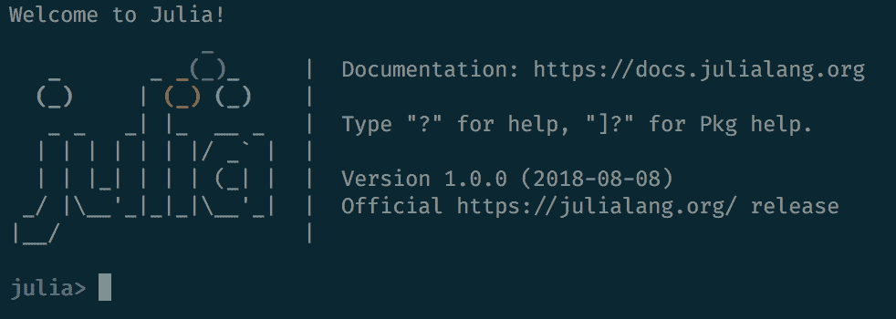


# REPL·胡克斯

还可以定义一个在启动 REPL 会话之前自动调用的函数。为了实现这一点，您需要使用`atreplinit(f)`函数，该函数注册了一个单参数函数`f`，在交互会话中初始化 REPL 接口之前调用这个函数。该函数应在`startup.jl`文件中调用。

假设我们编辑了我们的`startup.jl`文件，现在看起来像这样:

```
println("Welcome to Julia!") 

atreplinit() do (f) 
  println("And welcome to you too!") 
end 
```

我们的 REPL 现在会两次迎接我们:

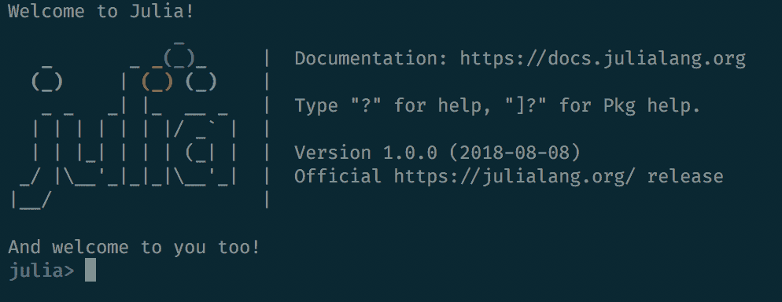

`atreplinit`函数可以与`isinteractive`一起使用，后者返回一个`Boolean true`或`false`值，告诉我们 Julia 是否正在运行一个交互式会话。


# 离开 REPL

为了退出 REPL，你可以键入`^ D` ( *Ctrl* + *D* )。然而，只有当你在行首时(当文本缓冲区为空时)，这种方法才有效。否则只需键入`^C` ( *Ctrl* + *C* )首先中断(或 *c* ancel)并清除该行。你也可以运行`exit()`，它将停止当前 Julia 进程的执行。

关于 REPL 上按键绑定的完整列表以及如何定制它们，你可以在[https://docs . Julia lang . org/en/v 1.0/stdlib/REPL/# Key-bindings-1](https://docs.julialang.org/en/v1.0/stdlib/REPL/#Key-bindings-1)上阅读官方文档。


# 包装系统

您的 Julia 安装附带了一个名为`Pkg`的强大的包管理器。它处理所有预期的操作，比如添加和删除包，解决依赖关系并保持已安装的包是最新的，运行测试，甚至帮助发布我们自己的包。

包通过提供广泛的功能，无缝扩展核心语言，扮演着关键的角色。让我们来看看最重要的包管理功能。


# 添加包

为了让`Pkg`知道，包必须被添加到 Julia 可用的注册表中。`Pkg`支持同时使用多个注册管理机构，包括托管在企业防火墙后的私有注册管理机构。默认情况下，`Pkg`被配置为使用 Julia 的通用注册表，这是一个由 Julia 社区维护的自由和开放源码包的存储库。

`Pkg`是一只非常强大的野兽，我们将在整本书中广泛使用它。使用 Julia 进行开发时，包管理是一项常见的任务，因此我们将有多次机会逐步深入。我们现在将迈出第一步，学习如何添加包——我们将通过在 Julia 设置中添加一些强大的新功能来完成。


# OhMyREPL

我最喜欢的包之一叫做`OhMyREPL`。它为朱莉娅·REPL 实现了一些超级高效的特性，最显著的是语法高亮和括号配对。这是一个很好的补充，使交互式编码体验更加愉快和高效。

朱莉娅的`Pkg`是围绕 GitHub 展开的。创建者以 git repos 的形式分发包，托管在 GitHub 上——甚至通用注册中心本身也是 GitHub 存储库。`OhMyREPL`也不例外。如果你想在安装它之前了解更多——使用第三方的代码总是一个好主意——你可以去 https://github.com/KristofferC/OhMyREPL.jl 查看

请记住，即使它是通用注册表的一部分，软件包也没有任何保证，而且它们不一定经过 Julia 社区的检查、验证或认可。然而，有一些常识性的指标提供了对软件包质量的洞察，最显著的是星的数量、测试的状态以及对最新 Julia 版本的支持。

为了添加包，我们需要做的第一件事是进入`Pkg` REPL 模式。我们通过在行首键入`]`来实现这一点:

```
julia>] 
```

光标将会改变，以反映我们现在已经准备好管理软件包:

```
(v1.0) pkg> 
```

IJulia(还)不支持`pkg>`模式，但是我们可以通过像在`pkg"add OhMyREPL"`中一样将`Pkg`命令包装在`pkg"..."`中来执行它们。

`Pkg`使用*环境*的概念，允许我们在每个项目的基础上定义不同的和独立的包集合。这是一个非常强大和有用的特性，因为它消除了依赖同一个包的不同版本的项目所导致的依赖冲突(所谓的**依赖地狱**)。

假设我们还没有创建任何项目，`Pkg`将使用默认项目`v1.0`，由括号中的值表示。这代表您正在运行的 Julia 版本——根据您自己的 Julia 版本，您可能会得到一个不同的默认项目。

现在我们可以继续进行`add OhMyREPL`:

```
(v1.0) pkg> add OhMyREPL 
  Updating registry at `~/.julia/registries/General` 
  Updating git-repo `https://github.com/JuliaRegistries/General.git` 
 Resolving package versions... 
  Updating `~/.julia/environments/v1.0/Project.toml` 
  [5fb14364] + OhMyREPL v0.3.0 
  Updating `~/.julia/environments/v1.0/Manifest.toml` 
  [a8cc5b0e] + Crayons v1.0.0 
  [5fb14364] + OhMyREPL v0.3.0 
  [0796e94c] + Tokenize v0.5.2 
  [2a0f44e3] + Base64 
  [ade2ca70] + Dates 
  [8ba89e20] + Distributed 
  [b77e0a4c] + InteractiveUtils 
  [76f85450] + LibGit2 
  [8f399da3] + Libdl 
  [37e2e46d] + LinearAlgebra 
  [56ddb016] + Logging 
  [d6f4376e] + Markdown 
  [44cfe95a] + Pkg 
  [de0858da] + Printf 
  [3fa0cd96] + REPL 
  [9a3f8284] + Random 
  [ea8e919c] + SHA 
  [9e88b42a] + Serialization 
  [6462fe0b] + Sockets 
  [8dfed614] + Test 
  [cf7118a7] + UUIDs 
  [4ec0a83e] + Unicode  
```

前一个命令的 IJulia 等价物是`pkg"add OhMyREPL"`。

当在全新的 Julia 安装上运行`pkg> add`时，`Pkg`将克隆 Julia 的通用注册表，并使用它来查找我们请求的包的名称。虽然我们只明确要求了`OhMyREPL`，但是大多数 Julia 包都有外部依赖项，也需要安装。正如我们所看到的，我们的包有很多——但是它们很快被`Pkg`安装了。


# 自定义软件包安装

有时我们可能想要使用没有添加到通用注册表中的包。这通常是处于(早期)开发阶段的包或者私有包的情况。对于这种情况，我们可以传递存储库的 URL，而不是包的名称:

```
(v1.0) pkg> add https://github.com/JuliaLang/Example.jl.git 
   Cloning git-repo `https://github.com/JuliaLang/Example.jl.git` 
  Updating git-repo `https://github.com/JuliaLang/Example.jl.git` 
 Resolving package versions... 
  Updating `~/.julia/environments/v1.0/Project.toml` 
  [7876af07] + Example v0.5.1+ #master (https://github.com/JuliaLang/Example.jl.git) 
  Updating `~/.julia/environments/v1.0/Manifest.toml` 
  [7876af07] + Example v0.5.1+ #master (https://github.com/JuliaLang/Example.jl.git) 
```

另一个常见的场景是当我们想要安装一个包的存储库的某个分支时。这可以通过在包名或 URL 的末尾添加`#name_of_the_branch`来轻松实现:

```
(v1.0) pkg> add OhMyREPL#master 
   Cloning git-repo `https://github.com/KristofferC/OhMyREPL.jl.git` 
  Updating git-repo `https://github.com/KristofferC/OhMyREPL.jl.git` 
 Resolving package versions... 
 Installed Crayons ─ v0.5.1 
  Updating `~/.julia/environments/v1.0/Project.toml` 
  [5fb14364] ~ OhMyREPL v0.3.0 ⇒ v0.3.0 #master (https://github.com/KristofferC/OhMyREPL.jl.git) 
  Updating `~/.julia/environments/v1.0/Manifest.toml`
```

```
  [a8cc5b0e] ↓ Crayons v1.0.0 ⇒ v0.5.1 
  [5fb14364] ~ OhMyREPL v0.3.0 ⇒ v0.3.0 #master (https://github.com/KristofferC/OhMyREPL.jl.git)
```

或者，对于未注册的软件包，请使用以下内容:

```
(v1.0) pkg> add https://github.com/JuliaLang/Example.jl.git#master 
```

如果我们想重新使用发布的分支，我们需要`free`这个包:

```
(v1.0) pkg> free OhMyREPL 
 Resolving package versions... 
  Updating `~/.julia/environments/v1.0/Project.toml` 
  [5fb14364] ~ OhMyREPL v0.3.0 #master (https://github.com/KristofferC/OhMyREPL.jl.git) ⇒ v0.3.0 
  Updating `~/.julia/environments/v1.0/Manifest.toml` 
  [a8cc5b0e] ↑ Crayons v0.5.1 ⇒ v1.0.0 
  [5fb14364] ~ OhMyREPL v0.3.0 #master (https://github.com/KristofferC/OhMyREPL.jl.git) ⇒ v0.3.0 
```


# 校订

那很容易，但是熟能生巧。再加一个吧！这一次我们将安装`Revise`，这是另一个必备的包，它通过监视和检测 Julia 文件中的变化并在需要时自动重新加载代码来简化开发工作流程。在`Revise`之前，众所周知，在当前的 Julia 流程中加载变更非常困难，开发人员通常被迫重启 REPL——这是一个耗时且低效的流程。`Revise`可以消除重启、加载包、等待代码编译的开销。

你可以通过阅读 https://timholy.github.io/Revise.jl/latest/[的文档来了解更多关于 Revise 的信息。](https://timholy.github.io/Revise.jl/latest/)

不出所料，我们只需再调用一次`add`，这次为包名传入`Revise`:

```
(v1.0) pkg> add Revise 
Resolving package versions... 
 Installed Revise ─ v0.7.5 
  Updating `~/.julia/environments/v1.0/Project.toml` 
  [295af30f] + Revise v0.7.5 
  Updating `~/.julia/environments/v1.0/Manifest.toml` 
  [bac558e1] + OrderedCollections v0.1.0
```

```
  [295af30f] + Revise v0.7.5 
  [7b1f6079] + FileWatching 
```

`add`命令也同时接受多个包。出于学习的目的，我们现在一个接一个地添加它们，否则，我们可以直接执行`(v1.0) pkg> add OhMyREPL Revise`。


# 检查包状态

我们可以通过使用名副其实的`status`命令检查我们项目的状态来确认操作是否成功:

```
 (v1.0) pkg> status 
    Status `~/.julia/environments/v1.0/Project.toml` 
  [7876af07] Example v0.5.1+ #master (https://github.com/JuliaLang/Example.jl.git) 
  [5fb14364] OhMyREPL v0.3.0 
  [295af30f] Revise v0.7.5 
```

`status`命令显示所有已安装的软件包，从左到右包括软件包 id 的简短版本(称为 **UUID** )、软件包名称和版本号。在适当的地方，它还会指出我们正在跟踪的分支，就像在`Example`的情况下，我们在`master`分支。

`Pkg` also supports a series of shortcuts, if you want to save a few keystrokes. In this case, `st` can be used instead of `status`.

# 使用包

一旦添加了一个包，为了访问它的功能，我们必须将它纳入范围。这就是我们如何告诉 Julia 我们打算使用它，请求编译器为我们提供它。为此，首先，我们需要退出 pkg 模式。一旦我们进入 julian 提示符，为了使用`OhMyREPL`，我们需要做的就是执行:

```
julia> using OhMyREPL
[ Info: Precompiling OhMyREPL [5fb14364-9ced-5910-84b2-373655c76a03]
```

这就是所需要的一切— `OhMyREPL`现在正在自动增强当前的 REPL 会话。为了看到它在行动，这里是什么样的*常规* REPL 看起来像:

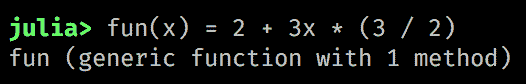

这里是相同的代码，通过`OhMyREPL`增强:

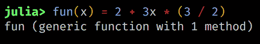

语法突出显示和括号匹配使代码可读性更好，减少了语法错误。看起来很棒，不是吗？

`OhMyREPL` has a few more cool features up its sleeve—you can learn about them by checking the official documentation at [https://kristofferc.github.io/OhMyREPL.jl/latest/index.html](https://kristofferc.github.io/OhMyREPL.jl/latest/index.html).

# 再走一步

`OhMyREPL`和`Revise`是优秀的开发工具，在所有的 Julia 会话中自动加载它们非常有用。这正是`startup.jl`文件存在的原因——现在我们有机会好好利用它(并不是说我们发自内心的欢迎问候不够令人印象深刻！).

让我们开始吧，这里有一个巧妙的技巧——Julia 提供了一个`edit`函数，它将在配置好的编辑器中打开一个文件。让我们用它来打开`startup.jl`文件:

```
julia> edit("~/.julia/config/startup.jl") 
```

这将在默认编辑器中打开文件。如果你还没有删除我们之前添加的欢迎信息，请现在就删除(除非你真的喜欢它们，在这种情况下，你可以尽一切办法保留它们)。现在，`Revise`需要在我们想要跟踪的任何其他模块之前使用——所以我们希望将它放在文件的顶部。至于`OhMyREPL`，接下来可以走了。您的`startup.jl`文件应该如下所示:

```
using Revise 
using OhMyREPL 
```

保存它并关闭编辑器。下次您启动 Julia 时，`Revise`和`OhMyREPL`都将被加载。


# 更新包

Julia 推动了一个蓬勃发展的生态系统，软件包更新速度很快。使用`pkg> update`定期检查更新是一个好习惯:

```
(v1.0) pkg> update 
```

当发出这个命令时，Julia 将首先检索通用存储库的最新版本，检查是否有任何包需要更新。

注意发出`update`命令将会更新所有可用的包。正如我们之前讨论的，当提到*依赖地狱*时，这可能不是最好的事情。在接下来的章节中，我们将看到如何处理单个项目和管理单个应用程序的依赖关系。但在此之前，重要的是要知道您可以通过传递名称来挑选您想要更新的包:

```
(v1.0) pkg> update OhMyREPL Revise 
```

`Pkg`还公开了一个预览模式，该模式将显示运行某个命令时会发生什么，而不实际进行任何更改:

```
(v1.0) pkg> preview update OhMyREPL 
(v1.0) pkg> preview add HTTP 
```

`pkg> update`的快捷方式是`pkg> up`。


# 固定包装

有时我们可能想确保某些包不会被更新。这时候我们`pin`他们:

```
(v1.0) pkg> pin OhMyREPL 
 Resolving package versions... 
  Updating `~/.julia/environments/v1.0/Project.toml` 
  [5fb14364] ~ OhMyREPL v0.3.0 ⇒ v0.3.0
  Updating `~/.julia/environments/v1.0/Manifest.toml` 
  [5fb14364] ~ OhMyREPL v0.3.0 ⇒ v0.3.0
```

固定封装标有`⚲`符号，现在检查状态时也会出现:

```
(v1.0) pkg> st 
    Status `~/.julia/environments/v1.0/Project.toml` 
  [5fb14364] OhMyREPL v0.3.0
  [295af30f] Revise v0.7.5 
```

如果我们想取消固定一个包，我们可以使用`pkg> free`:

```
(v1.0) pkg> free OhMyREPL 
  Updating `~/.julia/environments/v1.0/Project.toml` 
  [5fb14364] ~ OhMyREPL v0.3.0 ⇒ v0.3.0 
  Updating `~/.julia/environments/v1.0/Manifest.toml` 
  [5fb14364] ~ OhMyREPL v0.3.0 ⇒ v0.3.0 

(v1.0) pkg> st 
    Status `~/.julia/environments/v1.0/Project.toml` 
  [5fb14364] OhMyREPL v0.3.0 
  [295af30f] Revise v0.7.5 
```


# 移除包

如果你不再打算使用一些包，你可以用`pkg> remove`命令删除它们。例如，假设我们有以下配置:

```
(v1.0) pkg> st 
    Status `~/.julia/environments/v1.0/Project.toml` 
  [7876af07] Example v0.5.1+ #master (https://github.com/JuliaLang/Example.jl.git) 
  [5fb14364] OhMyREPL v0.3.0 
  [295af30f] Revise v0.7.5 
```

我们可以用下面的代码删除`Example`包:

```
(v1.0) pkg> remove Example 
  Updating `~/.julia/environments/v1.0/Project.toml` 
  [7876af07] - Example v0.5.1+ #master (https://github.com/JuliaLang/Example.jl.git) 
  Updating `~/.julia/environments/v1.0/Manifest.toml` 
  [7876af07] - Example v0.5.1+ #master ([https://github.com/JuliaLang/Example.jl.git](https://github.com/JuliaLang/Example.jl.git)) 
```

果然，它现在不见了:

```
(v1.0) pkg> st 
    Status `~/.julia/environments/v1.0/Project.toml` 
  [5fb14364] OhMyREPL v0.3.0 
  [295af30f] Revise v0.7.5 
```

`pkg> remove`的快捷方式是`pkg> rm`。

除了明确删除不需要的包，`Pkg`还有一个内置的自动清理功能。随着软件包版本的发展和软件包依赖关系的改变，一些已安装的软件包将会过时，并且不再用于任何现有的项目。`Pkg`保存所有使用过的项目的日志，这样它可以浏览日志，并准确地看到哪些项目仍然需要哪些包——从而识别出那些不再需要的包。这些可以用`pkg> gc`命令一次性删除:

```
(v1.0) pkg> gc Active manifests at: `/Users/adrian/.julia/environments/v1.0/Manifest.toml` `/Users/adrian/.julia/environments/v0.7/Manifest.toml` Deleted /Users/adrian/.julia/packages/Acorn/exWWb: 40.852 KiB Deleted /Users/adrian/.julia/packages/BufferedStreams/hCA7W: 102.235 KiB Deleted /Users/adrian/.julia/packages/Crayons/e1SsX: 49.133 KiB Deleted /Users/adrian/.julia/packages/Example/ljaU2: 4.625 KiB Deleted /Users/adrian/.julia/packages/Genie/XOia2: 2.031 MiB Deleted /Users/adrian/.julia/packages/HTTPClient/ZQR55: 37.669 KiB Deleted /Users/adrian/.julia/packages/Homebrew/l8kUw: 277.296 MiB Deleted /Users/adrian/.julia/packages/LibCURL/Qs5og: 11.599 MiB Deleted /Users/adrian/.julia/packages/LibExpat/6jLDP: 127.247 KiB Deleted /Users/adrian/.julia/packages/LibPQ/N7lDU: 134.734 KiB Deleted /Users/adrian/.julia/packages/Libz/zMAun: 80.744 KiB Deleted /Users/adrian/.julia/packages/Nettle/LMDZh: 50.371 KiB
```

```
   Deleted /Users/adrian/.julia/packages/OhMyREPL/limOC: 448.493 KiB 
   Deleted /Users/adrian/.julia/packages/WinRPM/rDDZz: 24.925 KiB 
   Deleted 14 package installations : 292.001 MiB 
```

除了专用的`Pkg` REPL 模式，Julia 还提供了一个强大的 API 来以编程方式管理包。我们就不赘述了，不过如果你想了解一下，可以去[https://docs . Julia lang . org/en/latest/stdlib/Pkg/# References-1](https://docs.julialang.org/en/latest/stdlib/Pkg/#References-1)查看官方文档。


# 发现包

包发现还没有想象中那么简单，但是有一些好的选择。我推荐从这个精选的朱莉娅套餐列表开始:[https://github.com/svaksha/Julia.jl](https://github.com/svaksha/Julia.jl)。它按领域对大量软件包进行分组，涵盖人工智能、生物、化学、数据库、图形、数据科学、物理、统计、超级计算等主题。

如果这还不够，你还可以去 https://discourse.julialang.org，在那里，Julia 社区讨论了大量与语言相关的话题。你可以搜索和浏览现有的主题，尤其是在[https://discourse.julialang.org/c/community/packages](https://discourse.julialang.org/c/community/packages)举办的包公告版块。

当然，你可以随时向社区寻求帮助——朱利安非常友好和热情，为了保持讨论的文明性和建设性，他们做出了很多努力。为了创建新的主题和张贴回复，需要一个免费的话语帐户。

最后，[https://juliaobserver.com/packages](https://juliaobserver.com/packages)是一个第三方网站，它提供了一种更好的方式来寻找软件包——它也执行 GitHub 搜索，因此也包括未注册的软件包。


# 注册与未注册

虽然我已经在前面几段提到了这个话题，但我想以一句谨慎的话来结束关于`Pkg`的讨论。一个包被注册的事实并不一定意味着它在功能或安全性方面已经过审查。它仅仅意味着创建者已经提交了这个包，并且它满足了添加到通用注册中心的某些技术要求。GitHub 上提供了软件包源代码，像任何开源软件一样，请确保您了解它的功能、使用方法，并接受许可条款。

这就结束了我们关于包管理的最初讨论。但是由于这是最常见的任务之一，我们将在以后的章节中一次又一次地回到它，在那里我们还将看到一些更高级用法的场景。


# 摘要

Julia 是一种新的编程语言，它利用编译器技术的最新创新，以 C 的速度提供动态编程语言的功能性、易用性和直观语法。如果它的目标是消除所谓的**两种语言问题**——当用户用高级语言(如 R 和 Python)编码时，但性能关键部分必须用 C 或 C++重写。Julia 感觉像是一种动态语言，并提供了与此相关的所有生产力特性。但与此同时，它消除了性能的折衷，证明对于原型开发和探索性编码来说足够高效，对于性能关键的应用程序来说足够高效。

它内置的包管理器提供了对 2，000 多个第三方库的访问，这些库通过强大的新功能无缝扩展了该语言——我们已经学会了如何利用这些功能。如果这还不够，Julia 还能够调用用其他语言编写的函数，比如 C、Fortran、Python 或 Java，等等。

Julia 是免费和开源的(MIT licensed ),可以部署在所有主要的操作系统上，包括 Windows、主要的 Linux 发行版和 macOS。它还带有一些非常好的 IDE 和编辑器选项。

既然我们已经成功地建立了我们的开发环境，现在是时候深入研究 Julia 的语法了。在下一章中，我们将看一下这门语言的一些基本构件——定义变量和常数，操作和使用`Strings`和数值类型，以及使用`Arrays`。为了对 Iris flowers 数据集执行强大的探索性数据分析，这就是我们所需要的全部内容(以及我们将添加的一些额外的包)。下一章再见！