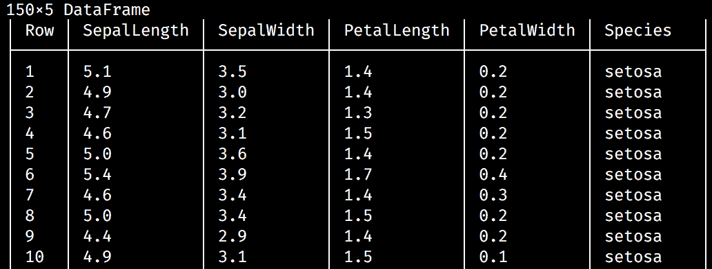

# 二、创建我们的第一个 Julia 应用

既然您已经有了一个可以工作的 Julia 安装，并且您选择的 IDE 已经准备好运行，那么是时候好好利用它们了。在这一章中，你将学习如何应用 Julia 进行数据分析——这是这门语言的核心领域，所以你会对它印象深刻的！

我们将与 Julia 一起学习执行探索性数据分析。在这个过程中，我们将看看`RDatasets`，一个提供超过 700 个学习数据集的包。我们将加载其中一个数据集，Iris flowers 数据集，并使用标准的数据分析函数对其进行操作。然后，我们将通过使用常见的可视化技术来更仔细地查看数据。最后，我们将看到如何保存和(重新)加载我们的数据。

但是，为了做到这一点，首先我们需要看一看这门语言的一些最重要的构件。

我们将在本章中讨论以下主题:

*   声明变量(和常量)
*   与`Strings`的人物和`regular expressions`一起工作
*   数字和数值类型
*   我们的第一个 Julia 数据结构— `Tuple`、`Range`和`Array`
*   `*`使用 Iris flower 数据集— `RDatasets`和 core `Statistics`进行探索性数据分析
*   使用`Gadfly`实现快速数据可视化
*   `*`用`CSV`和`Feather`保存和加载表格数据
*   与 MongoDB 数据库交互


# 技术要求

Julia 包生态系统正在不断发展，每天都有新的包版本发布。大多数时候这是好消息，因为新版本带来了新特性和错误修复。然而，由于许多软件包仍处于测试阶段(版本 0.x ),任何新版本都可能引入突破性的变化。因此，书中介绍的代码可能会停止工作。为了确保您的代码将产生与书中描述的相同的结果，建议使用相同的包版本。以下是本章中使用的外部软件包及其具体版本:

```jl
CSV@v0.4.3
DataFrames@v0.15.2
Feather@v0.5.1
Gadfly@v1.0.1
IJulia@v1.14.1
JSON@v0.20.0
RDatasets@v0.6.1
```

为了安装软件包的特定版本，您需要运行:

```jl
pkg> add PackageName@vX.Y.Z 
```

例如:

```jl
pkg> add IJulia@v1.14.1
```

或者，您可以通过下载本章提供的`Project.toml`文件并使用如下的`pkg>`实例化来安装所有使用的软件包:

```jl
julia> download("https://raw.githubusercontent.com/PacktPublishing/Julia-Programming-Projects/master/Chapter02/Project.toml", "Project.toml")
pkg> activate . 
pkg> instantiate
```


# 定义变量

在前一章中，我们已经了解了如何使用 REPL 来执行计算并将结果显示给我们。Julia 甚至通过设置`ans`变量来伸出援手，该变量自动保存最后一次计算的值。

但是，如果我们想写任何东西，除了最琐碎的程序，我们需要学习如何自己定义变量。在 Julia 中，变量只是一个与值相关联的名字。对命名变量的限制很少，名字本身也没有语义意义(语言不会根据名字来区别对待变量，不像 Ruby 那样，一个全是大写字母的名字被当作常量)。

让我们看一些例子:

```jl
julia> book = "Julia v1.0 By Example" 
julia> pi = 3.14 
julia> ANSWER = 42 
julia> my_first_name = "Adrian" 
```

通过加载本章支持文件附带的 Jupyter/IJulia 笔记本，您可以按照本章中的示例进行操作。

变量名称区分大小写，这意味着`ANSWER`和`answer`(以及`Answer`和`aNsWeR`)是完全不同的东西:

```jl
julia> answer 
ERROR: UndefVarError: answer not defined 

```

Unicode 名称(UTF 8 编码)也可以作为变量名:

```jl
julia> δ = 130 

```

请记住，您可以键入许多 Unicode 数学符号，方法是键入反斜杠(`\`)，然后键入符号的名称，然后键入*制表符*键。例如，\pi[ *Tab* ]会输出π。

如果你的终端支持，表情符号也可以使用:

```jl
julia>  = "apollo 11" 
```

唯一明确不允许的变量名称是内置 Julia 语句的名称(`do`、`end`、`try`、`catch`、`if`和`else`，以及更多):

```jl
julia> do = 3 
ERROR: syntax: invalid "do" syntax 
julia> end = "Paris" 
ERROR: syntax: unexpected end 

```

试图访问尚未定义的变量将导致错误:

```jl
julia> MysteryVar 
ERROR: UndefVarError: MysteryVar not defined 

```

诚然，这种语言没有强加很多限制，但是一套代码风格惯例总是有用的——对于开源语言来说更是如此。Julia 社区已经提炼出一套编写代码的最佳实践。关于命名变量，名称应该是小写的，并且只有一个单词；可以用下划线(`_`)来分隔单词，但前提是如果没有下划线，名字就很难读。例如，`myvar`对`total_length_horizontal`。

鉴于读一个名字的难度是一件主观的事情，我对这种命名方式有点分裂。我通常更喜欢清晰明了的单词分界。但是尽管如此，最好还是遵循这个建议，因为 Julia API 中的函数名都遵循这个建议。通过遵守相同的约定，您的代码将始终保持一致。


# 常数

常量是变量，一旦声明，就不能更改。通过在它们前面加上关键字`const`来声明它们:

```jl
julia> const firstmonth = "January" 

```

非常重要的是，在 Julia 中，常量与它们的值无关，而是与它们的类型有关。现在讨论 Julia 中的类型还为时过早，所以现在可以说类型代表了我们正在处理的值的类型。例如，`"abc"`(在双引号内)属于`String`类型，`'a'`(在单引号内)属于`Char`类型，`1000`属于`Int`类型(因为它是一个整数)。因此，在 Julia 中，与大多数其他语言不同，我们可以改变分配给常量的值，只要`type`保持不变。例如，我们可以首先决定鸡蛋和牛奶是可接受的膳食选择，然后继续:

```jl
julia> const mealoption = "vegetarian" 
```

如果我们决定去的话，我们可以稍后改变主意。朱莉娅会放过它，只给一个警告:

```jl
julia> mealoption = "vegan" 
WARNING: redefining constant mealoption 
"vegan" 

```

然而，试图说`mealoption = 2`会导致错误:

```jl
julia> mealoption = 2 
ERROR: invalid redefinition of constant mealoption 
```

这是有道理的吧？谁听说过那种饮食？

然而，细微的差别可能比这更微妙，尤其是在处理数字时:

```jl
julia> const amount = 10.25  
10.25 
julia> amount = 10 
ERROR: invalid redefinition of constant amount 
```

Julia 不允许这样做，因为在内部`10`和`10.00`尽管有相同的算术值，却是不同类型的值(`10`是整数，而`10.00`是`float`)。我们一会儿会更仔细地看一下数字类型，这样会更清楚:

```jl
julia> amount = 10.00 
WARNING: redefining constant amount 
10.0 

```

因此，我们需要将新值作为`10.00` —a `float`传递，以便遵守相同的类型要求。


# 常数为什么重要？

主要是性能的问题。常量作为全局值特别有用。因为全局变量是长期存在的，并且可以在代码中的任何位置随时修改，所以编译器很难对它们进行优化。如果我们告诉编译器该值是常量，因此该值的类型不会改变，那么性能问题就可以得到优化。

当然，常量缓解了全局变量带来的一些关键性能问题，并不意味着鼓励我们使用它们。与其他语言一样，Julia 中的全局值必须尽可能避免。除了性能问题，它们还会产生难以捕捉和理解的细微错误。此外，请记住，因为 Julia 允许更改常量的值，所以意外的修改是可能的。


# 评论

常见的编程智慧如下:

"代码被阅读的次数比它被编写的次数多得多，所以要相应地计划."

代码注释是一个强大的工具，它使程序在以后更容易理解。在 Julia 中，注释都标有 # 符号。单行注释用 `#` 表示，其后的所有内容，直到行尾，都被编译器忽略。多行注释被括在`#= ... =#`之间。编译器还会忽略开始和结束注释标记中的所有内容。这里有一个例子:

```jl
julia> #= 
           Our company charges a fixed  
           $10 fee per transaction. 
       =# 
const flatfee = 10 # flat fee, per transaction  

```

在前面的代码片段中，我们可以看到多行和单行注释在起作用。单行注释也可以放在行首。


# 用线串

一个字符串代表一个字符序列。我们可以通过将相应的字符序列括在双引号中来创建字符串，如下所示:

```jl
julia> "Measuring programming progress by lines of code is like measuring aircraft building progress by weight." 

```

如果字符串还包含引号，我们可以通过在它们前面加一个反斜杠`\`来转义它们:

```jl
julia> "Beta is Latin for \"still doesn't work\"." 
```


# 三重引号字符串

然而，转义会变得混乱，所以有一个更好的方法来处理这个问题——使用三重引号`"""..."""`。

```jl
julia> """Beta is Latin for "still doesn't work".""" 

```

在三重引号中，不再需要对单引号进行转义。但是，请确保单引号和三引号是分开的，否则编译器会感到困惑:

```jl
julia> """Beta is Latin for "still doesn't work"""" 
syntax: cannot juxtapose string literal 

```

三重引号在用于多行文本时有一些额外的特殊功能。首先，如果开始的`"""`后面跟了一个换行符，这个换行符将从字符串中去掉。此外，空格被保留，但字符串被定向到缩进量最小的行的级别:

```jl
julia> """ 
                  Hello 
           Look 
    Here"""

 julia> print(ans) 
Hello 
Look 
Here 
Here was removed).
```

这是它在 Jupyter/IJulia 的样子:


较长的箭头代表一个*标签*(在输出中由一个`\t`表示)，而较短的箭头是一个空格。注意，每一行都有一个空格作为第一个字符，但是它被删除了。缩进最少的一行，即最后一行，被移至左侧，删除其所有空白，并从**开始(此处为**)，同时保留其他行上的剩余空白(现在以*制表符*开始)。


# 串联字符串

通过使用星号`*`操作符，可以将两个或多个字符串连接在一起(串接)形成一个字符串:

```jl
julia> "Hello " * "world!" "Hello world!" 

```

或者，我们可以调用`string`函数，传入我们想要连接的所有单词:

```jl
julia> string("Itsy", " ", "Bitsy", " ", "Spider") 
"Itsy Bitsy Spider" 

```

串联也适用于变量:

```jl
julia> username = "Adrian" 
julia> greeting = "Good morning" 
julia> greeting * ", " * username 
"Good morning, Adrian" 
```

然而，同样，在处理类型时我们需要小心(类型是 Julia 的核心，所以这将是一个反复出现的话题)。串联仅适用于字符串:

```jl
julia> username = 9543794 
julia> greeting = "Good morning" 
julia> greeting * ", " * username 
MethodError: no method matching *(::String, ::Int64) 

```

即使不是所有的参数都是字符串，通过调用`string`函数来执行连接也是可行的:

```jl
julia> string(greeting, ", ", username)
 "Good morning, 9543794"

```

因此，`string`有一个额外的优点，那就是它会自动将其参数转换为字符串。下面的例子也适用:

```jl
julia> string(2, " and ", 3) 
"2 and 3"
```

但这并不:

```jl
julia> 2 * " and " * 3 
ERROR: MethodError: no method matching *(::Int64, ::String)
```

还有一个`String`方法(大写 S)。记住在 Julia 中名字是区分大小写的，所以`string`和`String`是两回事。大多数情况下，我们需要小写函数`string`。如果你想了解它，你可以使用 Julia 的帮助系统访问`String`的文档。


# 插值字符串

当创建更长、更复杂的字符串时，连接可能会产生噪音并且容易出错。对于这种情况，我们最好使用`$`符号对字符串进行变量插值:

```jl
julia> username = "Adrian" 
julia> greeting = "Good morning" 
julia> "$greeting, $username" 
"Good morning, Adrian" 

```

更复杂的表达式可以通过包装在`$(...)`中进行插值:

```jl
julia> "$(uppercase(greeting)), $(reverse(username))" 
"GOOD MORNING, nairdA" 

```

这里我们调用了`uppercase`函数，它将字符串中的所有字母转换成大写字母——以及`reverse`函数，它将单词中字母的顺序颠倒。它们的输出然后被插入到一个字符串中。在这些界限之间，我们可以使用任何我们想要的 Julia 代码。

就像`string`函数一样，插值负责将值转换成字符串:

```jl
julia> "The sum of 1 and 2 is $(1 + 2)" 
"The sum of 1 and 2 is 3"
```


# 操纵字符串

字符串可以被视为字符列表，因此我们可以对它们进行索引，也就是说，访问单词中特定位置的字符:

```jl
julia> str = "Nice to see you" 
julia> str[1] 
'N': ASCII/Unicode U+004e (category Lu: Letter, uppercase)
```

字符串`Nice to see you`的第一个字符是`N`。

Julia 中的索引是基于`1`的，这意味着列表的第一个元素是在索引 1 处找到的。考虑到大多数编程语言都使用基于`0`的索引，如果你以前编程过，这可能会令人惊讶。然而，我向您保证，基于`1`的索引会带来非常愉快和简单的编码体验。

Julia 支持任意索引的数组，例如，允许从`0`开始编号。然而，任意索引是一个更高级的特性，我们不会在这里讨论。如果你好奇，你可以在 https://docs.julialang.org/en/v1/devdocs/offset-arrays/[查阅官方文件。](https://docs.julialang.org/en/v1/devdocs/offset-arrays/)

我们还可以通过使用`range`进行索引来提取字符串的一部分(子串)，提供起始和结束位置:

```jl
julia> str[9:11] 
"see" 
```

需要注意的是，通过单值进行索引会返回一个`Char`，而通过`range`进行索引会返回一个`String`(记住，对于 Julia 来说，这是两件完全不同的事情):

```jl
julia> str[1:1] 
"N" 
```

`N`是一个只有一个字母的`String`，如双引号所示:

```jl
julia> str[1] 
'N': ASCII/Unicode U+004e (category Lu: Letter, uppercase)
```

`N`是一个`Char`，如单引号所示:

```jl
julia> str[1:1] == str[1] 
false 
```

他们不平等。


# Unicode 和 UTF-8

在 Julia 中，字符串使用 UTF-8 编码。UTF-8 是一种可变宽度编码，这意味着并非所有字符都使用相同数量的字节来表示。例如，ASCII 字符使用一个字节进行编码，但其他字符可以使用多达四个字节。这意味着 UTF-8 字符串中的每个字节索引并不一定是相应字符的有效索引。如果在这样一个无效的字节索引处对一个字符串进行索引，将会引发一个错误。我的意思是:

```jl
julia> str = "Søren Kierkegaard was a Danish Philosopher" 
julia> str[1] 
'S': ASCII/Unicode U+0053 (category Lu: Letter, uppercase) 
```

我们可以正确地检索索引`1`处的字符:

```jl
julia> str[2] 
'ø': Unicode U+00f8 (category Ll: Letter, lowercase) 
```

在索引`2`处，我们成功地得到了`ø`字符:

```jl
julia> str[3] 
StringIndexError("Søren Kierkegaard was a Danish Philosopher", 3) 
```

然而，`ø`有两个字节，所以索引`3`也被`ø`使用，我们不能访问这个位置的字符串:

```jl
 julia> str[4] 
'r': ASCII/Unicode U+0072 (category Ll: Letter, lowercase) 
```

第三个字母`r`位于`4`位置。

因此`ø`是一个双字节字符，占据了位置`2`和`3`—因此索引`3`无效，匹配`ø`的第二个字节。下一个有效的索引可以使用`nextind(str, 2)`来计算——但是推荐的方法是对字符使用迭代(我们将在本章稍后讨论`for`循环):

```jl
julia> for s in str 
           println(s) 
       end 
S 
ø 
r 
e 
n 

K 
... output truncated...

```

由于可变长度编码，字符串中的字符数不一定与最后一个索引相同(如您所见，第三个字母`r`位于索引`4`):

```jl
julia> length(str) 42 
julia> str[42] 'e': ASCII/Unicode U+0065 (category Ll: Letter, lowercase) 

```

对于这种情况，Julia 提供了`end`关键字，可以用作最后一个索引的简写。你可以用`end`进行算术等运算，就像一个普通值一样:

```jl
julia> str[end] 
'r': ASCII/Unicode U+0072 (category Ll: Letter, lowercase) 
julia> str[end-10:end] 
"Philosopher"

```

可以使用`endof(str)`函数以编程方式计算`end`值。试图在字符串边界之外进行索引将导致`BoundsError`:

```jl
julia> str[end+1] 
ERROR: BoundsError: attempt to access "Søren Kierkegaard was a Danish Philosopher" 
  at index [44]
```


# 正则表达式

正则表达式用于字符串中子字符串的强大模式匹配。它们可用于基于模式搜索字符串中的子字符串，然后提取或替换匹配项。Julia 提供了对 Perl 兼容正则表达式的支持。

输入正则表达式最常见的方式是使用所谓的**非标准字符串文字**。这些看起来像普通的双引号字符串，但是带有一个特殊的前缀。对于正则表达式，这个前缀是`"r"`。与普通的字符串文字相比，前缀提供了不同的行为。

例如，为了定义一个匹配所有字母的常规字符串，我们可以使用`r"[a-zA-Z]*".`

Julia 提供了相当多的非标准字符串——如果愿意，我们甚至可以定义自己的字符串。最广泛使用的是正则表达式(`r"..."`)、字节数组文字(`b"..."`)、版本号文字(`v"..."`)和包管理命令(`pkg"..."`)。

下面是我们如何在 Julia 中构建正则表达式——它匹配 0 到 9 之间的数字:

```jl
julia> reg = r"[0-9]+" 
r"[0-9]+" 
julia> match(reg, "It was 1970") 
RegexMatch("1970") 
```

我们的正则表达式匹配子串`1970`。

我们可以通过使用`typeof`函数检查其`type`来确认非标准字符串文字`reg`实际上是一个`Regex`而不是一个常规的`String`:

```jl
julia> typeof(reg) 
Regex 

```

这暴露了还有一个`Regex`构造函数可用的事实:

```jl
julia> Regex("[0-9]+") 
r"[0-9]+" 

```

这两种结构相似:

```jl
julia> Regex("[0-9]+") == reg 
true
```

当我们需要使用可能包含插值或连接的更复杂的字符串创建正则表达式时，使用构造函数会很方便。但一般来说，`r"..."`格式用的比较多。

使用标志`i`、`m`、`s`和`x.`的某种组合可以影响正则表达式的行为。这些修饰符必须放在右双引号之后:

```jl
julia> match(r"it was", "It was 1970") # case-sensitive no match 
julia> match(r"it was"i, "It was 1970") # case-insensitive match 
RegexMatch("It was") 

```

正如您所料，`i`执行不区分大小写的模式匹配。如果没有`i`修饰符，`match`将返回`nothing`——一个特殊的值，在交互提示符下不打印任何内容——以表明正则表达式与给定的字符串不匹配。

以下是可用的修改器:

*   `i`—不区分大小写的模式匹配。
*   `m`—将字符串视为多行。
*   `s`—将字符串视为单行。
*   `x`—告诉正则表达式解析器忽略大多数既不是反斜杠也不在字符类中的空白。您可以使用它将您的正则表达式分成(稍微)更易读的部分。与普通代码一样，字符`#`也被视为引入注释的元字符。

如果我们所需要的只是检查一个正则表达式或一个子串是否包含在一个字符串中，那么`occursin`函数会更简洁——如果我们不想提取或替换匹配项:

```jl
julia> occursin(r"hello", "It was 1970")  
false 
julia> occursin(r"19", "It was 1970") 
true 

```

当正则表达式匹配时，它返回一个`RegexMatch`对象。这些对象封装了表达式匹配的方式，包括模式匹配的子字符串和任何捕获的子字符串:

```jl
julia> alice_in_wonderland = "Why, sometimes I've believed as many as six impossible things before breakfast." 

julia> m = match(r"(\w+)+", alice_in_wonderland) 
RegexMatch("Why", 1="Why") 
```

```jl
Why.
```

我们还可以选择指定开始搜索的索引:

```jl
m = match(r"(\w+)+", alice_in_wonderland, 6) 
RegexMatch("sometimes", 1="sometimes") 

```

让我们尝试一些更复杂的东西:

```jl
julia> m = match(r"((\w+)(\s+|\W+))", alice_in_wonderland) 
RegexMatch("Why, ", 1="Why, ", 2="Why", 3=", ") 
```

得到的`RegexMatch`对象`m`公开了以下属性(或字段，用 Julia 的行话来说):

*   `m.match` ( `Why`，)包含匹配的整个子串。
*   `m.captures`(包含`Why`、`Why`和`,`的字符串数组)表示捕获的子字符串。
*   `m.offset`，整个匹配开始的偏移量(在我们的例子中是`1`)。
*   `m.offsets`，捕获的子字符串的偏移量，作为一个整数数组(我们的例子是`[1, 1, 4]`)。

Julia 没有为*贪婪*或*全局*匹配提供`g`修改器。如果您需要所有的匹配，您可以使用`eachmatch()`对它们进行迭代，构造如下:

```jl
julia> for m in eachmatch(r"((\w+)(\s+|\W+))", alice_in_wonderland) 
           println(m) 
end 
```

或者，我们可以使用`collect()`将所有匹配放在一个列表中:

```jl
julia> collect(eachmatch(r"((\w+)(\s+|\W+))", alice_in_wonderland))
 13-element Array{RegexMatch,1}: 
 RegexMatch("Why, ", 1="Why, ", 2="Why", 3=", ") 
 RegexMatch("sometimes ", 1="sometimes ", 2="sometimes", 3=" ") 
 RegexMatch("I'", 1="I'", 2="I", 3="'") 
 RegexMatch("ve ", 1="ve ", 2="ve", 3=" ") 
 RegexMatch("believed ", 1="believed ", 2="believed", 3=" ") 
 RegexMatch("as ", 1="as ", 2="as", 3=" ") 
 RegexMatch("many ", 1="many ", 2="many", 3=" ") 
 RegexMatch("as ", 1="as ", 2="as", 3=" ") 
 RegexMatch("six ", 1="six ", 2="six", 3=" ") 
 RegexMatch("impossible ", 1="impossible ", 2="impossible", 3=" ") 
 RegexMatch("things ", 1="things ", 2="things", 3=" ") 
 RegexMatch("before ", 1="before ", 2="before", 3=" ") 
 RegexMatch("breakfast.", 1="breakfast.", 2="breakfast", 3=".")
```

有关正则表达式的更多信息，请查看官方文档:https://docs . Julia lang . org/en/stable/manual/strings/# Regular-Expressions-1。


# 原始字符串文字

如果您需要定义一个不执行插值或转义的字符串，例如表示另一种语言的代码，它可能包含会干扰 Julia 解析器的`$`和`\`，那么您可以使用原始字符串。它们是用`raw"..."`构造的，并创建普通的`String`对象，这些对象包含输入的字符，没有插入或转义:

```jl
julia> "This $will error out" 
ERROR: UndefVarError: will not defined 
```

在字符串中放入一个`$`将导致 Julia 执行插值并寻找一个名为`will`的变量:

```jl
julia> raw"This $will work" 
"This \$will work" 
```

但是通过使用原始字符串，`$`符号将被忽略(或者更确切地说，自动转义，正如您在输出中看到的)。


# 数字

Julia 提供了广泛的原始数字类型，以及完整的算术和位运算符以及标准数学函数。我们拥有丰富的数字类型层次结构，其中最通用的是`Number`——它定义了两个子类型`Complex`和`Real`。相反，`Real`有四个子类型— `AbstractFloat`、`Integer`、`Irrational`和`Rational`。最后，`Integer`又分支成另外四个子类型——`BigInt`、`Bool`、`Signed`和`Unsigned`。

让我们来看看最重要的几类数字。


# 整数

文字整数简单表示如下:

```jl
julia> 42 
```

默认的整数类型称为`Int`，取决于代码执行的系统架构。可以是`Int32`也可以是`Int64`。在我的 64 位系统上，我得到如下结果:

```jl
julia> typeof(42) 
Int64 
```

`Int`类型将反映这一点，因为它只是`Int32`或`Int64`的别名:

```jl
julia> @show Int 
Int = Int64 

```


# 溢出行为

最小值和最大值由`typemin()`和`typemax()`功能给出:

```jl
julia> typemin(Int), typemax(Int) 
(-9223372036854775808, 9223372036854775807) 
```

尝试使用超出最小值和最大值定义的边界的值不会引发错误(甚至是警告)，反而会导致绕回行为(意味着它会跳过另一端):

```jl
julia> typemin(Int) - 1 
9223372036854775807 
julia> typemin(Int) - 1 == typemax(Int) 
true 
```

从最小值中减去`1`将返回最大值:

```jl
julia> typemax(Int) + 1 == typemin(Int) 
true
```

反过来也是`true`—最大值加`1`会返回最小值。

对于这些范围之外的值，我们将使用`BigInt`类型:

```jl
julia> BigInt(typemax(Int)) + 1 
9223372036854775808
```

这里没有环绕；结果是我们所期望的。


# 浮点数

浮点数由用点分隔的数值表示:

```jl
julia> 3.14 
3.14 
julia> -1.0 
-1.0 
julia> 0.25 
0.25 
julia> .5  
0.5  
```

默认情况下，它们是`Float64`值，但可以转换为`Float32`:

```jl
julia> typeof(1.) 
Float64 
julia> f32 = Float32(1.) 
1.0f0 
julia> typeof(f32) 
Float32 

```

为了提高可读性，下划线(`_`)分隔符可用于整数和浮点数:

```jl
julia> 1_000_000, 0.000_000_005 
(1000000, 5.0e-9)
```


# 有理数

Julia 还提供了一个有理数类型。这使我们能够处理精确的比率，而不是处理浮点数固有的精度损失。有理数表示为它们的分子和分母值，由两个正斜杠分隔`//`:

```jl
julia> 3//2 
3//2
```

如果没有数据丢失，有理数可以转换成其他类型:

```jl
julia> 1//2 + 2//4 
1//1 

julia> Int(1//1) 
1 

julia> float(1//3) 
0.3333333333333333 

julia> Int(1//3) 
ERROR: InexactError: Int64(Int64, 1//3) 

julia> float(1//3) == 1/3 
true 
```

Julia 还支持复数。我们不会讨论它们，但是你可以在官方文档中读到这个主题，网址是 https://docs . Julia lang . org/en/v1/manual/Complex-and-rational-Numbers/# Complex-Numbers-1。


# 数值运算符

Julia 支持数字类型的所有算术运算符:

*   `+`——(一元和二元加号)
*   `-`——(一元和二元减号)
*   `*`——(次)
*   `/`——(除)
*   `\`——(反除)
*   `^`——(电力)
*   `%`——(余数)

该语言还支持方便的更新操作符(`+=`、`-=`、`*=`、`/=`、`\=`、`÷=`、`%=`和`^=`)。这是它们在野外的样子:

```jl
julia> a = 2 
2 
julia> a *= 3 # equivalent of a = a * 3 
6 
julia> a ^= 2 # equivalent of a = a ^ 2 
36 
julia> a += 4 # equivalent of a = a + 4 
40  
```

可以使用以下一组运算符进行数值比较:

*   `==`——(相等)
*   `!=`或`≠`——(不等式)
*   `<`——(小于)
*   `<=`或`≤`——(小于或等于)
*   `>` —(大于)
*   `>=`或`≥`——(大于或等于)

在 Julia 中，这种比较也是连锁的:

```jl
julia> 10 > 5 < 6 == 6 >= 3 != 2 
true 
```


# 矢量化点运算符

Julia 为每个二元运算符定义了相应的*点*运算。这些被设计成以元素方式处理值的集合(称为**矢量化**)。也就是说，*点*的操作符应用于集合的每个元素。

在下面的例子中，我们将平方`first_five_fib`集合的每个元素:

```jl
julia> first_five_fib = [1, 1, 2, 3, 5] 
5-element Array{Int64,1}: 
 1 
 1 
 2 
 3 
 5 
julia> first_five_fib .^ 2 
5-element Array{Int64,1}: 
  1 
  1 
  4 
  9 
 25 

```

在前面的例子中，`first_five_fib`没有被触动，结果集合被返回，但是*点状的*更新操作符也是可用的，就地更新值。它们与之前讨论的更新操作符相匹配(添加了*点*)。例如，要更新`first_five_fib`,我们可以使用下面的代码:

```jl
julia> first_five_fib .^= 2 
```

由于其可读性和简明性，矢量化代码是该语言的重要组成部分，还因为它提供了重要的性能优化。更多详情请查看[https://docs . Julia lang . org/en/stable/manual/functions/# man-vectorized-1](https://docs.julialang.org/en/stable/manual/functions/#man-vectorized-1)。


# 还有更多的

这一部分仅仅触及了表面。要深入了解 Julia 的数字类型，请阅读位于[https://docs . Julia lang . org/en/stable/manual/mathematical-operations/](https://docs.julialang.org/en/stable/manual/mathematical-operations/)的官方文档。


# 元组

元组是 Julia 中最简单的数据类型和数据结构之一。它们可以有任何长度，可以包含任何类型的值，但是它们是不可变的。元组一旦创建，就不能修改。可以使用文字元组符号创建元组，方法是将逗号分隔的值放在括号`(...)`中:

```jl
(1, 2, 3)

julia> ("a", 4, 12.5) 
("a", 4, 12.5) 

```

为了定义一个单元素元组，我们不能忘记尾部的逗号:

```jl
julia> (1,) 
(1,) 

```

但是去掉括号也没关系:

```jl
julia> 'e', 2 
('e', 2) 

julia> 1, 
(1,) 

```

我们可以索引元组来访问它们的元素:

```jl
julia> lang = ("Julia", v"1.0") 
("Julia", v"1.0.0") 

julia> lang[2] 
v"1.0.0" 

```

矢量化*点*操作也适用于元组:

```jl
julia> (3,4) .+ (1,1) (4, 5)
```


# 命名元组

命名元组表示带有标记项的元组。我们可以通过标签或索引来访问各个组件:

```jl
julia> skills = (language = "Julia", version = v"1.0") 
(language = "Julia", version = v"1.0.0") 

julia> skills.language 
"Julia"

 julia> skills[1] 
"Julia" 
```

命名元组非常强大，因为它们类似于成熟的对象，但有一个限制，即它们是不可变的。


# 范围

在学习索引到`strings`的时候，我们已经看到了范围。它们可以像下面这样简单:

```jl
julia> r = 1:20 
1:20 

```

与之前的系列一样，我们可以按范围进行索引:

```jl
julia> abc = 'a':'z' 
'a':1:'z' 

julia> abc[10] 
'j': ASCII/Unicode U+006a (category Ll: Letter, lowercase) 

julia> abc[end] 
'z': ASCII/Unicode U+007a (category Ll: Letter, lowercase) 

```

通过使用 splat 运算符`"..."`，可以将范围扩展到其对应的值。例如，我们可以将它放入一个元组:

```jl
julia> (1:20...,) 
(1, 2, 3, 4, 5, 6, 7, 8, 9, 10, 11, 12, 13, 14, 15, 16, 17, 18, 19, 20) 

```

我们也可以把它放到一个列表中:

```jl
julia> [1:20...] 
20-element Array{Int64,1}

```

元组也是如此，它也可以被放入列表，等等:`[(1,2,3)...]`。

我们可以看到，默认情况下，范围以 1 为增量步进。我们可以通过给它传递一个可选的步长参数来改变它。以下是一个在`0`和`20`之间的范围示例，步长为 5:

```jl
julia> (0:5:20...,)  
(0, 5, 10, 15, 20) 
```

现在我们的值从`5`到`5`。

通过使用负步长，这也提供了降序排列的可能性:

```jl
julia> (20:-5:-20...,) 
(20, 15, 10, 5, 0, -5, -10, -15, -20) 

```

范围并不局限于整数——您之前已经看到了一个范围`chars`；这些是`floats`的范围:

```jl
julia> (0.5:10) 
0.5:1.0:9.5 
julia> (0.5:10...,) 
(0.5, 1.5, 2.5, 3.5, 4.5, 5.5, 6.5, 7.5, 8.5, 9.5)

```

我们也可以使用`collect`函数将范围扩展成一个列表(一个数组):

```jl
julia> collect(0.5:0.5:10) 
20-element Array{Float64,1} 
```


# 数组

数组是一种数据结构(以及相应的*类型*)，它表示元素的有序集合。更具体地说，在 Julia 中，数组是存储在多维网格中的对象的集合。

数组可以有任意数量的维度，并由它们的类型和维度数量定义— `Array{Type, Dimensions}`。

一维数组，也称为**向量**，可以使用数组文字符号、方括号`[...]`轻松定义:

```jl
julia> [1, 2, 3]  
3-element Array{Int64,1}: 
 1 
 2 
 3 

```

您还可以约束元素的类型:

```jl
julia> Float32[1, 2, 3, 4] 
4-element Array{Float32,1}: 
 1.0 
 2.0 
 3.0 
 4.0 

```

二维数组(也称为**矩阵**)可以使用相同的数组文字符号进行初始化，但这次不用逗号:

```jl
julia> [1 2 3 4] 
1×4 Array{Int64,2}: 
 1  2  3  4 

```

我们可以使用分号添加更多行:

```jl
julia> [1 2 3; 4 5 6; 7 8 9] 
3×3 Array{Int64,2}: 
 1  2  3 
 4  5  6 
 7  8  9 
```

Julia 提供了许多函数，可以用不同的值来构造和初始化数组，例如`zeroes`、`ones`、`trues`、`falses`、`similar`、`rand, fill`以及更多的`.`下面是其中的几个例子:

```jl
julia> zeros(Int, 2) 
2-element Array{Int64,1}: 
 0 
 0

 julia> zeros(Float64, 3) 
3-element Array{Float64,1}: 
 0.0 
 0.0 
 0.0 

julia> ones(2) 
2-element Array{Float64,1}: 
 1.0 
 1.0 

julia> ones(Int, 2) 
2-element Array{Int64,1}: 
 1 
 1 

julia> ones(Int, 3, 4) 
3×4 Array{Int64,2}: 
 1  1  1  1 
 1  1  1  1 
 1  1  1  1 

julia> trues(2) 
2-element BitArray{1}: 
 true 
 true 

julia> rand(Int, 4, 2) 
4×2 Array{Int64,2}: 
  9141724849782088627   6682031028895615978 
 -3827856130755187476  -1731760524632072533 
 -3369983903467340663  -7550830795386270701 
 -3159829068325670125   1153092130078644307 

julia> rand(Char, 3, 2) 
3×2 Array{Char,2}: 
 '\U63e7a'  '\Ub8723' 
 '\Uda56f'   
 '\U7b7fd'  '\U5f749' 

julia> fill(42, 2, 3) 
2×3 Array{Int64,2}: 
 42  42  42 
 42  42  42
```

`Array`可以通过索引访问元素，为每个维度传入一个值:

```jl
julia> arr1d = rand(5) 5-element Array{Float64,1}: 0.845359 0.0758361 0.379544 0.382333 0.240184 
julia> arr1d[5] 
 0.240184 
julia> arr2d = rand(5,2) 
5×2 Array{Float64,2}: 
 0.838952  0.312295 
 0.800917  0.253152 
 0.480604  0.49218 
 0.716717  0.889667 
 0.703998  0.773618 

julia> arr2d[4, 1] 
0.7167165812985592 
```

我们还可以传递一个冒号(`:`)来选择整个维度内的所有索引，或者传递一个范围来定义部分选择:

```jl
julia> arr2d = rand(5,5) 
5×5 Array{Float64,2}: 
 0.618041  0.887638   0.633995  0.868588  0.19461 
 0.400213  0.699705   0.719709  0.328922  0.326825 
 0.322572  0.807488   0.866489  0.960801  0.476889 
 0.716221  0.504356   0.206264  0.600758  0.843445 
 0.705491  0.0334613  0.240025  0.235351  0.740302 
```

这就是我们选择行`1`到`3`和列`3`到`5`的方式:

```jl
julia> arr2d[1:3, 3:5] 
3×3 Array{Float64,2}: 
 0.633995  0.868588  0.19461 
 0.719709  0.328922  0.326825 
 0.866489  0.960801  0.476889 
```

单独的冒号`:`代表所有——所以这里我们选择所有的行和列`3`到`5`:

```jl
julia> arr2d[:, 3:5] 
5×3 Array{Float64,2}: 
 0.633995  0.868588  0.19461 
 0.719709  0.328922  0.326825 
 0.866489  0.960801  0.476889 
 0.206264  0.600758  0.843445 
 0.240025  0.235351  0.740302
```

另一个选择是布尔的`Array`来选择其`true`索引处的元素。这里我们选择对应于`true`值的行和`3`到`5`列:

```jl
julia> arr2d[[true, false, true, true, false], 3:5] 
3×3 Array{Float64,2}: 
 0.633995  0.868588  0.19461 
 0.866489  0.960801  0.476889 
 0.206264  0.600758  0.843445

```

以类似于对数组进行索引的方式，我们也可以为选定的项赋值:

```jl
julia> arr2d[1, 1] = 0.0 

julia> arr2d[[true, false, true, true, false], 3:5] = ones(3, 3) 
julia> arr2d 
5×5 Array{Float64,2}: 
 0.0       0.641646  1.0       1.0        1.0      
 0.750895  0.842909  0.818378  0.484694   0.661247 
 0.938833  0.193142  1.0       1.0        1.0      
 0.195541  0.338319  1.0       1.0        1.0      
 0.546298  0.920886  0.720724  0.0529883  0.238986 
```


# 循环

迭代数组最简单的方法是使用`for`构造:

```jl
for element in yourarray 
    # do something with element 
end 

```

这里有一个例子:

```jl
julia> for person in ["Alison", "James", "Cohen"] 
           println("Hello $person") 
       end 

Hello Alison 
Hello James 
Hello Cohen 

```

如果在迭代时还需要索引，Julia 公开了`eachindex(yourarray)`迭代器:

```jl
julia> people = ["Alison", "James", "Cohen"] 
3-element Array{String,1}: 
 "Alison" 
 "James" 
 "Cohen" 

julia> for i in eachindex(people) 
           println("$i. $(people[i])") 
       end

 1\. Alison 
2\. James 
3\. Cohen 
```


# 变异数组

我们可以通过使用`push!`函数向集合的末尾添加更多元素:

```jl
julia> arr = [1, 2, 3] 
3-element Array{Int64,1}: 
 1 
 2 
 3

 julia> push!(arr, 4) 
4-element Array{Int64,1}: 
 1 
 2 
 3 
 4 

julia> push!(arr, 5, 6, 7) 
7-element Array{Int64,1}: 
  1 
  2 
  3 
  4 
  5 
  6 
  7 

```

注意`push!`函数的结尾感叹号`!`。这是 Julia 中一个完全合法的函数名。惯例是警告函数正在*变异，也就是说，它将修改作为参数传递给它的数据，而不是返回一个新值。*

我们可以使用`pop!`从`array`的末尾移除元素:

```jl
julia> pop!(arr) 
7 

julia> arr 
6-element Array{Int64,1}: 
 1 
 2 
 3 
 4 
 5 
 6 
```

对`pop!`函数的调用移除了`arr`的最后一个元素并将其返回。

如果我们想删除除最后一个元素之外的元素，我们可以使用`deleteat!`函数，指出我们想要删除的索引:

```jl
julia> deleteat!(arr, 3) 
5-element Array{Int64,1}: 
 1 
 2 
 4 
 5 
 6 

```

最后，在改变数组时要注意一点。在 Julia 中，数组通过引用传递给函数。这意味着原始数组作为参数被发送给各种变异函数，而不是它的副本。小心不要无意中做出不必要的修改。类似地，当将数组赋给变量时，会创建一个新的引用，但不会复制数据。比如说:

```jl
julia> arr = [1,2,3] 
3-element Array{Int64,1}: 
 1 
 2 
 3 

julia> arr2 = arr 
3-element Array{Int64,1}: 
 1 
 2 
 3
```

现在我们把`pop`的一个元素去掉`arr2`:

```jl
julia> pop!(arr2) 
3 
```

所以，`arr2`看起来是这样的:

```jl
julia> arr2 
2-element Array{Int64,1}: 
 1 
 2 
```

但是我们的原始数组也被修改了:

```jl
julia> arr 
2-element Array{Int64,1}: 
 1 
 2 

```

将`arr`赋值给`arr2`并不会将`arr`的值复制到`arr2`中，它只会创建一个指向原始`arr`数组的新绑定(新名称)。为了用相同的值创建一个单独的数组，我们需要使用`copy`函数:

```jl
julia> arr 
2-element Array{Int64,1}: 
 1 
 2 

julia> arr2 = copy(arr) 
2-element Array{Int64,1}: 
 1 
 2 
```

现在，如果我们从复制的数组中取出一个元素:

```jl
julia> pop!(arr2) 
2 
```

我们的原始阵列保持不变:

```jl
julia> arr 
2-element Array{Int64,1}: 
 1 
 2
```

只有副本被修改:

```jl
julia> arr2 
1-element Array{Int64,1}: 
 1 
```


# （听力或阅读）理解测试

数组理解提供了一种非常强大的构造数组的方法。它类似于前面讨论的数组文字符号，但是我们不是传入实际值，而是对一个 iterable 对象进行计算。

一个例子就能说明这一点:

```jl
julia> [x += 1 for x = 1:5] 
10-element Array{Int64,1}: 
  2 
  3 
  4 
  5 
  6

```

对于范围`1`*`5`*内的每个元素* `x` *可以读作— *，计算* `x+1` *并将结果值放入数组*。**

 *就像使用*普通*数组一样，我们可以约束类型:

```jl
julia> Float64[x+=1 for x = 1:5] 
5-element Array{Float64,1}: 
 2.0 
 3.0 
 4.0 
 5.0 
 6.0 

```

同样，我们可以创建多维数组:

```jl
julia> [x += y for x = 1:5, y = 11:15] 
5×5 Array{Int64,2}: 
 12  13  14  15  16 
 13  14  15  16  17 
 14  15  16  17  18 
 15  16  17  18  19 
 16  17  18  19  20 

```

可以使用`if`关键字过滤理解:

```jl
julia> [x += 1 for x = 1:10 if x/2 > 3] 
4-element Array{Int64,1}: 
  8 
  9 
 10 
 11 
```

在这种情况下，我们只保留了`x/2`大于`3`的值。


# 发电机

但是当它们被用来创造发生器时，理解的超能力就被激活了。生成器可以被迭代以按需产生值，而不是分配一个数组并预先存储所有的值。你马上就会明白这意味着什么。

生成器的定义就像数组理解一样，但是没有方括号:

```jl
julia> (x+=1 for x = 1:10) 
Base.Generator{UnitRange{Int64},##41#42}(#41, 1:10) 

```

它们允许我们处理潜在的无限集合。查看下面的例子，我们想用一个小于或等于`1_000`的立方体打印从 1 到 100 万的数字:

```jl
julia> for i in [x^3 for x=1:1_000_000] 
           i >= 1_000 && break 
           println(i) 
end 
1 
8 
27 
64 
125 
216 
343 
512 
729 

```

这个计算使用了大量的资源，因为尽管我们只迭代了它的前九个元素，但是理解创建了一百万个项目的完整数组。

我们可以看到，通过使用方便的`@time`结构对代码进行基准测试:

```jl
@time for i in [x^3 for x=1:1_000_000] 
   i >= 1_000 && break 
   println(i) 
end 

0.035739 seconds (58.46 k allocations: 10.493 MiB)

```

超过 10 MB 的内存和近 60，000 次分配。与使用发电机相比:

```jl
@time for i in (x^3 for x=1:1_000_000) 
   i >= 1_000 && break 
   println(i) 
end 

0.019681 seconds (16.63 k allocations: 898.414 KiB)  

```

少于 1 MB 和分配数的四分之一。如果我们从 100 万增加到 10 亿，这种差异将更加显著:

```jl
julia> @time for i in [x^3 for x=1:1_000_000_000] 
          i >= 1_000 && break 
          println(i) 
       end 
1 
8 
27 
64 
125 
216 
343 
512 
729

 10.405833 seconds (58.48 k allocations: 7.453 GiB, 3.41% gc time) 
```

超过 10 秒，使用了 7 GB 内存！

另一方面，发电机实际上以恒定的时间运行:

```jl
julia> @time for i in (x^3 for x=1:1_000_000_000) 
          i >= 1_000 && break 
          println(i) 
       end 
1 
8 
27 
64 
125 
216 
343 
512 
729 

  0.020068 seconds (16.63 k allocations: 897.945 KiB 
```


# 与 Julia 一起进行探索性数据分析

现在你对 Julia 的基础知识有了很好的理解，我们可以将这些知识应用到我们的第一个项目中。我们将从对鸢尾花数据集应用**探索性数据分析** ( **EDA** )开始。

如果您已经有了数据分析的经验，您可能以前使用过 Iris 数据集。如果是这样，那太好了！你将熟悉数据和你(以前)选择的语言中的做事方式，现在可以专注于 Julia 方式。

相反，如果这是你第一次听说鸢尾花数据集，没必要担心。这个数据集被认为是数据科学的`Hello World`——我们将使用 Julia 强大的工具箱来仔细研究它。尽情享受吧！


# 鸢尾花数据集

也被称为费希尔虹膜数据集，由英国统计学家和生物学家罗纳德·费雪于 1936 年首次提出。该数据集由来自三种鸢尾花(鸢尾、海滨鸢尾和杂色鸢尾)的每一种的 50 个样本组成。它有时被称为**安德森的虹膜数据集**，因为数据是埃德加·安德森收集的。测量了四个特征——萼片和花瓣的长度和宽度(以厘米为单位)。


# 使用 RDatasets 包

为学习、教学和统计软件开发寻找高质量的数据具有挑战性。这就是为什么行业实际上对 10，000 多个高质量数据集的使用进行了标准化。这些最初是与统计软件环境 r 一起发布的。因此，它们被恰当地命名为`RDatasets`。

鸢尾花数据集是这个集合的一部分。下载的方式有很多，但是最方便的是通过`RDatasets`包。这个包为 Julia 用户提供了一种简单的方法来试验 R 中可用的或包含在 R 最流行的包中的大多数标准数据集。听起来很棒；补充一下吧。

首先，切换到包管理模式:

```jl
 julia> ]
    pkg> add RDatasets 
```

一旦包被添加，让我们告诉 Julia 我们想要使用它:

```jl
 julia> using RDatasets 
```

我们可以通过调用`RDatasets.datasets()`来查看包含的数据集。它返回一个列表，列出了所有可用的 700 多个数据集。它包括关于数据包、数据集名称、标题(或信息)、行数和列数的详细信息。这是前 20 行:

```jl
julia> RDatasets.datasets() 
```

输出如下所示:


你可以看到数据集是`Package`的一部分——我们可以用它来过滤。Iris flower 数据集是*数据集*包的一部分。

我们现在要做的就是加载数据:

```jl
julia> iris = dataset("datasets", "iris") 
```

输出如下所示:



返回值是一个 150 行 5 列的`DataFrame`对象— `SepalLength`、`SepalWidth`、`PetalLength`、`PetalWidth`和`Species`，加上一个自动添加的 id 列`Row`。

Dataframes 是在 Julia 中处理表格数据的事实上的标准。它们是 Julia 的数据分析工具集的关键部分，我们将在接下来的章节中详细讨论它们。现在，可以说，正如您在前面的例子中看到的，它代表了一种看起来非常像表或电子表格的数据结构。

您可以使用以下代码以编程方式检索列名:

```jl
julia> names(iris) 
5-element Array{Symbol,1}: 
 :SepalLength 
 :SepalWidth 
 :PetalLength 
 :PetalWidth 
 :Species 

```

要检查大小，请使用以下方法:

```jl
julia> size(iris) 
(150, 5)
```

结果是一个匹配行数和列数的元组— `(rows, cols)`。是的，正如已经建立的，`150`行在`5`列之上。

我们来看看数据:

```jl
julia> head(iris) 
```

输出如下所示:


`head`函数显示前六行。可选地，它使用第二个参数来指示行数:`head(iris, 10)`。还有它的孪生兄弟`tail()`，它将显示`DataFrame`的底部行:

```jl
julia> tail(iris, 10) 
```

输出如下所示:


关于数据集中出现的物种，我们在标题行看到 *setosa* ，在底部看到 *virginica* 。根据数据描述，我们应该有三个物种。让我们询问按`Species`分组的行数:

```jl
julia> by(iris, :Species, nrow)
```

输出如下所示:


`by`函数有三个参数——数据集、列名和一个分组函数——在本例中是计算行数的`nrow`。我们可以看到第三个物种是*云芝*，对于每个物种我们都有`50`的记录。

我相信您一定想知道为什么在前面的例子中，列的名称以冒号“`:`”为前缀。是一个`Symbol`。当我们学习元编程时，我们将讨论更多关于符号的内容。现在，你可以把符号想象成标识符或标签。


# 使用简单的统计数据来更好地理解我们的数据

既然已经清楚了数据的结构以及集合中包含的内容，我们可以通过查看一些基本的统计数据来更好地理解。

为了让我们开始，让我们调用`describe`函数:

```jl
julia> describe(iris)
```

输出如下所示:


该功能汇总了`iris` `DataFrame`的栏目。如果列包含数字数据(如`SepalLength`，它将计算最小值、中值、平均值和最大值。还包括缺失值和唯一值的数量。最后一列报告存储在行中的数据类型。

其他一些统计数据也是可用的，包括第 25 个^(和第 75 个^(百分点，以及第一个和最后一个值。我们可以通过传递一个额外的`stats`参数来请求它们，以符号数组的形式:))

```jl
julia> describe(iris, stats=[:q25, :q75, :first, :last]) 
```

输出如下所示:


统计标签的任何组合都是可以接受的。这些都是选项— `:mean`、`:std`、`:min`、`:q25`、`:median`、`:q75`、`:max`、`:eltype`、`:nunique`、`:first`、`:last`和`:nmissing`。

为了获得所有的统计数据，接受特殊的`:all`值:

```jl
julia> describe(iris, stats=:all)
```

输出如下所示:


我们也可以使用 Julia 的`Statistics`软件包单独计算这些。例如，为了计算`SepalLength`列的平均值，我们将执行以下代码:

```jl
julia> using Statistics 
julia> mean(iris[:SepalLength]) 
5.843333333333334 

```

在这个例子中，我们使用`iris[:SepalLength]`来选择整列。毫不奇怪，结果与相应的`describe()`值返回的结果相同。

以类似的方式，我们可以计算出`median()`:

```jl
julia> median(iris[:SepalLength]) 
5.8 
```

还有(很多)更多，例如，标准差`std()`:

```jl
julia> std(iris[:SepalLength]) 
0.828066127977863 

```

或者，我们可以在一个简单的脚本中使用`Statistics`包中的另一个函数`cor(),`来帮助我们理解这些值是如何关联的:

```jl
julia> for x in names(iris)[1:end-1]    
        for y in names(iris)[1:end-1] 
          println("$x \t $y \t $(cor(iris[x], iris[y]))") 
        end 
        println("-------------------------------------------") 
      end

```

执行此代码片段将产生以下输出:

```jl
SepalLength       SepalLength    1.0 
SepalLength       SepalWidth     -0.11756978413300191 
SepalLength       PetalLength    0.8717537758865831 
SepalLength       PetalWidth     0.8179411262715759 
------------------------------------------------------------ 
SepalWidth         SepalLength    -0.11756978413300191 
SepalWidth         SepalWidth     1.0 
SepalWidth         PetalLength    -0.42844010433053953 
SepalWidth         PetalWidth     -0.3661259325364388 
------------------------------------------------------------ 
PetalLength       SepalLength    0.8717537758865831 
PetalLength       SepalWidth     -0.42844010433053953 
PetalLength       PetalLength    1.0 
PetalLength       PetalWidth     0.9628654314027963 
------------------------------------------------------------ 
PetalWidth         SepalLength    0.8179411262715759 
PetalWidth         SepalWidth     -0.3661259325364388 
PetalWidth         PetalLength    0.9628654314027963 
PetalWidth         PetalWidth     1.0 
------------------------------------------------------------ 

```

该脚本遍历数据集的每一列，除了`Species`(最后一列，不是数字)，并生成一个基本的关联表。从表中可以看出`SepalLength`与`PetalLength` (87.17%)、`SepalLength`与`PetalWidth` (81.79%)、以及`PetalLength`与`PetalWidth` (96.28%)之间有很强的正相关关系。`SepalLength`和`SepalWidth`没有很强的相关性。

我们可以使用相同的脚本，但是这次使用`cov()`函数来计算数据集中值的协方差:

```jl
julia> for x in names(iris)[1:end-1] 
         for y in names(iris)[1:end-1] 
           println("$x \t $y \t $(cov(iris[x], iris[y]))") 
         end 
         println("--------------------------------------------") 
       end 
```

该代码将生成以下输出:

```jl
SepalLength       SepalLength    0.6856935123042507 
SepalLength       SepalWidth     -0.04243400447427293 
SepalLength       PetalLength    1.2743154362416105 
SepalLength       PetalWidth     0.5162706935123043 
------------------------------------------------------- 
SepalWidth         SepalLength    -0.04243400447427293 
SepalWidth         SepalWidth     0.189979418344519 
SepalWidth         PetalLength    -0.3296563758389262 
SepalWidth         PetalWidth     -0.12163937360178968 
------------------------------------------------------- 
PetalLength       SepalLength    1.2743154362416105 
PetalLength       SepalWidth     -0.3296563758389262 
PetalLength       PetalLength    3.1162778523489933 
PetalLength       PetalWidth     1.2956093959731543 
------------------------------------------------------- 
PetalWidth         SepalLength    0.5162706935123043 
PetalWidth         SepalWidth     -0.12163937360178968 
PetalWidth         PetalLength    1.2956093959731543 
PetalWidth         PetalWidth     0.5810062639821031 
------------------------------------------------------- 
```

输出表明`SepalLength`与`PetalLength`和`PetalWidth`正相关，而与`SepalWidth`负相关。`SepalWidth`与所有其他值负相关。

接下来，如果我们想要一个随机的数据样本，我们可以这样要求:

```jl
julia> rand(iris[:SepalLength]) 
7.4
```

或者，我们可以传入要采样的值的数量:

```jl
julia> rand(iris[:SepalLength], 5) 
5-element Array{Float64,1}: 
 6.9 
 5.8 
 6.7 
 5.0 
 5.6 

```

我们可以使用以下方法将其中一列转换为数组:

```jl
julia> sepallength = Array(iris[:SepalLength]) 
150-element Array{Float64,1}: 
 5.1 
 4.9 
 4.7 
 4.6 
 5.0 
 # ... output truncated ... 

```

或者我们可以把整个`DataFrame`转换成一个矩阵:

```jl
julia> irisarr = convert(Array, iris[:,:]) 
150×5 Array{Any,2}: 
 5.1  3.5  1.4  0.2  CategoricalString{UInt8} "setosa"    
 4.9  3.0  1.4  0.2  CategoricalString{UInt8} "setosa"    
 4.7  3.2  1.3  0.2  CategoricalString{UInt8} "setosa"    
 4.6  3.1  1.5  0.2  CategoricalString{UInt8} "setosa"    
 5.0  3.6  1.4  0.2  CategoricalString{UInt8} "setosa"   
 # ... output truncated ... 
```


# 可视化鸢尾花数据

可视化是探索性数据分析中的一个强有力的工具，它帮助我们识别那些仅仅通过看数字很难发现的模式。Julia 提供了一些非常容易安装和使用的优秀绘图包。

我们将用牛虻创造的一些情节来说明。

我们将从添加牛虻和`pkg> add "Gadfly"`开始，然后继续添加`julia> using Gadfly`。这将把牛虻的`plot()`方法纳入范围。现在，让我们找到一些有趣的数据来可视化。

在上一节中，我们已经确定了`SepalLength`和`PetalLength`之间存在强协变关系。让我们绘制数据:

在撰写本文时，牛虻对 Julia v1 的支持还不完整。如果仍然是这种情况，可以使用`pkg> add Compose#master`、`Gadfly#master`、`Hexagon`安装不稳定但可以工作的版本。

执行`plot()`功能将生成如下图形:

```jl
julia> plot(iris, x=:SepalLength, y=:PetalLength, color=:Species) 
```


果然，该图将表明`SepalLength`和`PetalLength`对于杂色鸢尾和海滨鸢尾都一起变化。对于刚毛鸢尾来说，这并不明显，当萼片长度增加时`PetalLength`几乎保持不变。

箱线图将证实这一点；刚毛鸢尾的萼片长度变化很小:

绘制我们的价值观看起来像这样:


```jl
julia> plot(iris, x=:Species, y=:PetalLength, Geom.boxplot)

```

Plotting our values looks like this:


我有一种感觉，直方图会更好地说明`PetalLength`的分布:

使用`PetalLength`生成直方图会产生以下结果:


```jl
julia> plot(iris, x=:PetalLength, color=:Species, Geom.histogram) 
```

如果我们将`PetalWidth`值可视化为直方图，我们会注意到类似的模式:

输出如下所示:


```jl
julia> plot(iris, x=:PetalWidth, color=:Species, Geom.histogram)
```

绘制三个物种的花瓣宽度和高度现在应该提供了一个强有力的指示，例如，我们可以根据以下两个值成功地对鸢尾进行分类:


Plotting the petal width and height for the three species should now provide a strong indication that, for example, we can successfully classify Iris setosa based on the two values:

```jl
julia> plot(iris, x=:PetalWidth, y=:PetalLength, color=:Species)
```

输出如下所示:


加载和保存我们的数据

Julia 自带优秀的开箱即用数据读取和存储工具。鉴于其对数据科学和科学计算的关注，对表格文件格式(CSV，TSV)的支持是一流的。


# 让我们从初始数据集中提取一些数据，并使用它来练习持久性和从各种后端进行检索。

我们可以通过相应的列和行定义它的边界来引用一个`DataFrame`的一部分。例如，我们可以定义一个仅由`PetalLength`和`PetalWidth`列以及前三行组成的新`DataFrame`:

Let's extract some data from our initial dataset and use it to practice persistence and retrieval from various backends.

We can reference a section of a `DataFrame` by defining its bounds through the corresponding columns and rows. For example, we can define a new `DataFrame` composed only of the `PetalLength` and `PetalWidth` columns and the first three rows:

```jl
julia> iris[1:3, [:PetalLength, :PetalWidth]] 
3×2 DataFrames.DataFrame 
│ Row │ PetalLength │ PetalWidth │ 
├─────┼─────────────┼────────────┤ 
│ 1   │ 1.4         │ 0.2        │ 
│ 2   │ 1.4         │ 0.2        │ 
│ 3   │ 1.3         │ 0.2        │ 

```

通用的索引符号是`dataframe[rows, cols]`，其中`rows`可以是一个数字、一个范围或者是`boolean`值的`Array`，其中`true`表示应该包含该行:

有了这些知识，让我们从原始数据集中抽取一个样本。它将包括大约 10%的初始数据，并且只包括`PetalLength`、`PetalWidth`和`Species`栏:

这里刚刚发生了什么？这段代码中的秘密就是`rand(150) .<= 0.1`。它做了很多事情——首先，它生成一个 0 到 1 之间的随机值数组；然后，它将数组按元素与 0.1(表示 1 的 10%)进行比较；最后，使用得到的`Boolean`数组从数据集中过滤出相应的行。朱莉娅的力量和简洁真的令人印象深刻！

```jl
julia> iris[trues(150), [:PetalLength, :PetalWidth]] 
150 rows since trues(150) constructs an array of 150 elements that are all initialized as true. The same logic applies to cols, with the added benefit that they can also be accessed by name.
```

在我的例子中，结果是前面 10 行的`DataFrame`,但是您的数据会有所不同，因为我们选择的是随机的行(很可能您也不会正好有 10 行)。

```jl
julia> test_data = iris[rand(150) .<= 0.1, [:PetalLength, :PetalWidth, :Species]] 
10×3 DataFrames.DataFrame 
│ Row │ PetalLength │ PetalWidth │ Species      │ 
├─────┼─────────────┼────────────┼──────────────┤ 
│ 1   │ 1.1         │ 0.1        │ "setosa"     │ 
│ 2   │ 1.9         │ 0.4        │ "setosa"     │ 
│ 3   │ 4.6         │ 1.3        │ "versicolor" │ 
│ 4   │ 5.0         │ 1.7        │ "versicolor" │ 
│ 5   │ 3.7         │ 1.0        │ "versicolor" │ 
│ 6   │ 4.7         │ 1.5        │ "versicolor" │ 
│ 7   │ 4.6         │ 1.4        │ "versicolor" │ 
│ 8   │ 6.1         │ 2.5        │ "virginica"  │ 
│ 9   │ 6.9         │ 2.3        │ "virginica"  │ 
│ 10  │ 6.7         │ 2.0        │ "virginica"  │ 

```

What just happened here? The secret in this piece of code is `rand(150) .<= 0.1`. It does a lot—first, it generates an array of random `Float` values between 0 and 1; then, it compares the array, element-wise, against 0.1 (which represents 10% of 1); and finally, the resultant `Boolean` array is used to filter out the corresponding rows from the dataset. It's really impressive how powerful and succinct Julia can be!

In my case, the result is a `DataFrame` with the preceding 10 rows, but your data will be different since we're picking random rows (and it's quite possible you won't have exactly 10 rows either).

使用表格文件格式保存和加载

使用`CSV`包，我们可以很容易地将这些数据保存到一个表格文件格式的文件中(CSV、TSV 或其他格式)。我们必须先添加它，然后调用`write`方法:


# 同样简单的是，我们可以用相应的`CSV.read`函数从表格文件格式中读回数据:

只需指定文件扩展名就足以让 Julia 理解如何在读写时处理文档(CSV，TSV)。

```jl
pkg> add CSV 
julia> using CSV 
julia> CSV.write("test_data.csv", test_data)  
```

使用羽化文件

```jl
julia> td = CSV.read("test_data.csv") 
10×3 DataFrames.DataFrame 
│ Row │ PetalLength │ PetalWidth │ Species      │ 
├─────┼─────────────┼────────────┼──────────────┤ 
│ 1   │ 1.1         │ 0.1        │ "setosa"     │ 
│ 2   │ 1.9         │ 0.4        │ "setosa"     │ 
│ 3   │ 4.6         │ 1.3        │ "versicolor" │ 
│ 4   │ 5.0         │ 1.7        │ "versicolor" │ 
│ 5   │ 3.7         │ 1.0        │ "versicolor" │ 
│ 6   │ 4.7         │ 1.5        │ "versicolor" │ 
│ 7   │ 4.6         │ 1.4        │ "versicolor" │ 
│ 8   │ 6.1         │ 2.5        │ "virginica"  │ 
│ 9   │ 6.9         │ 2.3        │ "virginica"  │ 
│ 10  │ 6.7         │ 2.0        │ "virginica"  │ 
```

Feather 是一种二进制文件格式，专门用于存储数据帧。它是快速、轻量级的，并且是语言不可知的。这个项目最初是为了使 R 和 Python 之间交换数据帧成为可能。很快，其他语言也加入了对它的支持，包括 Julia。


# 对羽毛文件的支持不是现成的，而是通过同名的包提供的。让我们继续添加它，然后将其纳入范围:

Feather is a binary file format that was specially designed for storing data frames. It is fast, lightweight, and language-agnostic. The project was initially started in order to make it possible to exchange data frames between R and Python. Soon, other languages added support for it, including Julia.

Support for Feather files does not come out of the box, but is made available through the homonymous package. Let's go ahead and add it and then bring it into scope:

```jl
pkg> add Feather  
julia> using Feather
```

现在，保存我们的`DataFrame`只需要调用`Feather.write`:

接下来，让我们尝试相反的操作，加载回我们的羽毛文件。我们将使用对应的`read`功能:

是的，那是我们的样本数据！

```jl
julia> Feather.write("test_data.feather", test_data) 

```

为了提供与其他语言的兼容性，Feather 格式对列的数据类型施加了一些限制。你可以在 https://juliadata.github.io/Feather.jl/latest/index.html[的官方文档中了解更多关于羽毛的信息。](https://juliadata.github.io/Feather.jl/latest/index.html)

```jl
julia> Feather.read("test_data.feather") 
10×3 DataFrames.DataFrame 
│ Row │ PetalLength │ PetalWidth │ Species      │ 
├─────┼─────────────┼────────────┼──────────────┤ 
│ 1   │ 1.1         │ 0.1        │ "setosa"     │ 
│ 2   │ 1.9         │ 0.4        │ "setosa"     │ 
│ 3   │ 4.6         │ 1.3        │ "versicolor" │ 
│ 4   │ 5.0         │ 1.7        │ "versicolor" │ 
│ 5   │ 3.7         │ 1.0        │ "versicolor" │ 
│ 6   │ 4.7         │ 1.5        │ "versicolor" │ 
│ 7   │ 4.6         │ 1.4        │ "versicolor" │ 
│ 8   │ 6.1         │ 2.5        │ "virginica"  │ 
│ 9   │ 6.9         │ 2.3        │ "virginica"  │ 
│ 10  │ 6.7         │ 2.0        │ "virginica"  │ 

```

使用 MongoDB 保存和加载

在结束本章之前，让我们看看如何使用 NoSQL 后端来保存和检索我们的数据。不要担心，在接下来的章节中，我们也将广泛讨论与关系数据库的交互。


# 为了完成本章，您需要一个有效的 MongoDB 安装。你可以从官方网站[https://www.mongodb.com/download-center?jmp=nav#community](https://www.mongodb.com/download-center?jmp=nav#community)下载并安装适合你的操作系统的正确版本。我将使用我通过 Docker 的 Kitematic 安装并启动的 Docker 镜像(可以在[https://github.com/docker/kitematic/releases](https://github.com/docker/kitematic/releases)下载)。

Before closing this chapter, let's take a look at using a NoSQL backend for persisting and retrieving our data. Don't worry, we'll extensively cover interaction with relational databases in the upcoming chapters too.

In order to follow through this chapter, you'll need a working MongoDB installation. You can download and install the correct version for your operating system from the official website, at [https://www.mongodb.com/download-center?jmp=nav#community](https://www.mongodb.com/download-center?jmp=nav#community). I will use a Docker image which I installed and started up through Docker's Kitematic (available for download at [https://github.com/docker/kitematic/releases](https://github.com/docker/kitematic/releases)).

接下来，我们需要确保添加`Mongo`包。这个包还依赖于`LibBSON`，这是自动添加的。`LibBSON`用于处理`BSON`，T6 代表*二进制 JSON* ，一种类似 JSON 文档的二进制编码序列化。现在，让我们也添加`JSON`包；我们需要它。我相信你现在已经知道该怎么做了——如果还不知道，这里有一个提醒:

在撰写本文时，Mongo.jl 对 Julia v1 的支持仍在进行中。这段代码是用 Julia v0.6 测试的。

轻松点。让 Julia 知道我们将使用所有这些软件包:

```jl
pkg> add Mongo, JSON 
```

我们现在准备连接到 MongoDB:

成功连接后，我们可以引用`db`数据库中的`dataframes`集合:

```jl
julia> using Mongo, LibBSON, JSON 
```

Julia 的 MongoDB 接口使用字典(Julia 中称为`Dict`的数据结构)与服务器通信。我们将在下一章更详细地讨论`dicts`。现在，我们需要做的就是将我们的`DataFrame`转换成这样的`Dict`。最简单的方法是使用`JSON`包顺序序列化然后反序列化`DataFrame`。它生成了一个很好的结构，我们以后可以用它来重建我们的`DataFrame`:

```jl
julia> client = MongoClient() 
```

展望未来，为了使未来的数据检索更简单，让我们在字典中添加一个标识符:

```jl
julia> storage = MongoCollection(client, "db", "dataframes")  
```

现在我们可以将它插入 Mongo:

```jl
julia> datadict = JSON.parse(JSON.json(test_data)) 
```

Thinking ahead, to make any future data retrieval simpler, let's add an identifier to our dictionary:

```jl
julia> datadict["id"] = "iris_test_data" 
```

Now we can insert it into Mongo:

```jl
julia> insert(storage, datadict) 
```

为了检索它，我们所要做的就是使用我们之前配置的“id”字段查询 Mongo 数据库:

我们得到一个`BSONObject`，我们需要将它转换回一个`DataFrame`。别担心，很简单。首先，我们创建一个空的`DataFrame`:

然后我们用从 Mongo 中检索到的数据填充它:

```jl
Julia> data_from_mongo = first(find(storage, query("id" => "iris_test_data"))) 
```

就是这样！我们的数据已经被加载回一个`DataFrame`。

```jl
julia> df_from_mongo = DataFrame() 
0×0 DataFrames.DataFrame 

```

Then we populate it using the data we retrieved from Mongo:

```jl
for i in 1:length(data_from_mongo["columns"]) 
  df_from_mongo[Symbol(data_from_mongo["colindex"]["names"][i])] =  
Array(data_from_mongo["columns"][i]) 
end 
julia> df_from_mongo 
10×3 DataFrames.DataFrame 
│ Row │ PetalLength │ PetalWidth │ Species      │ 
├─────┼─────────────┼────────────┼──────────────┤ 
│ 1   │ 1.1         │ 0.1        │ "setosa"     │ 
│ 2   │ 1.9         │ 0.4        │ "setosa"     │ 
│ 3   │ 4.6         │ 1.3        │ "versicolor" │ 
│ 4   │ 5.0         │ 1.7        │ "versicolor" │ 
│ 5   │ 3.7         │ 1.0        │ "versicolor" │ 
│ 6   │ 4.7         │ 1.5        │ "versicolor" │ 
│ 7   │ 4.6         │ 1.4        │ "versicolor" │ 
│ 8   │ 6.1         │ 2.5        │ "virginica"  │ 
│ 9   │ 6.9         │ 2.3        │ "virginica"  │ 
│ 10  │ 6.7         │ 2.0        │ "virginica"  │ 

```

And that's it! Our data has been loaded back into a `DataFrame`.

摘要

Julia 直观的语法有助于学习。可选的类型和丰富的简写构造函数产生了可读的、无噪声的代码，而大量的第三方包使得访问、操作、可视化、绘制和保存数据变得轻而易举。


# 仅仅通过学习 Julia 的基本数据结构和一些相关函数，再加上其强大的数据操作工具集，我们就能够实现高效的数据分析工作流，并从 Iris flowers 数据集提取有价值的见解。为了对 Julia 进行有效的探索性数据分析，我们需要的就是这些。

在下一章，我们将继续我们的旅程，学习如何建立一个网络爬虫。Web 挖掘是从 web 中提取信息的过程，是数据挖掘的重要组成部分，也是一般数据获取的关键组成部分。在构建 web 挖掘软件时，Julia 是一个很好的选择，不仅因为它的内置性能和快速原型特性，还因为它提供了强大的库，涵盖了从 HTTP 客户端、DOM 解析到文本分析的所有内容。

Just by learning Julia's basic data structures and a few related functions, coupled with its powerful data manipulation toolset, we were able to implement an efficient data analysis workflow and extract valuable insight from the Iris flowers dataset. That was all we needed in order to perform efficient exploratory data analysis with Julia.

In the next chapter, we'll continue our journey by learning how to build a web crawler. Web mining, the process of extracting information from the web, is an important part of data mining and a key component of data acquisition in general. Julia is a great choice when building web mining software, given not only its built-in performance and its rapid prototyping features, but also the availability of powerful libraries that cover everything, from HTTP clients, to DOM parsing, to text analysis.*