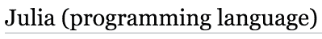
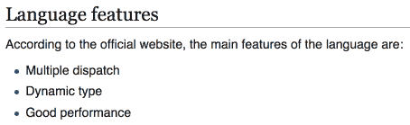
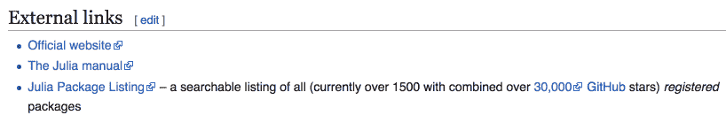
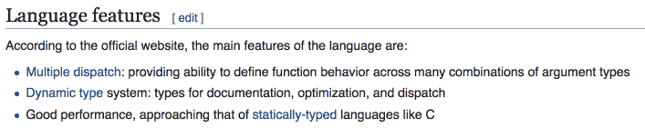
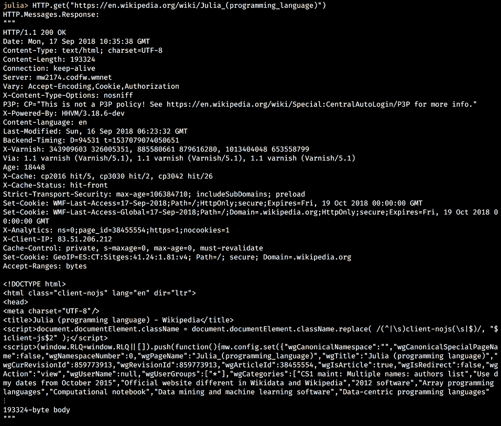
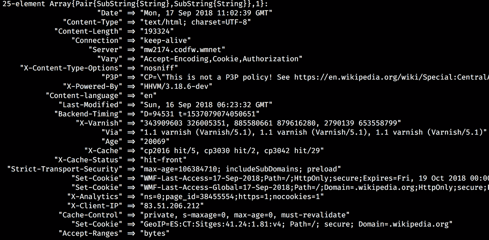
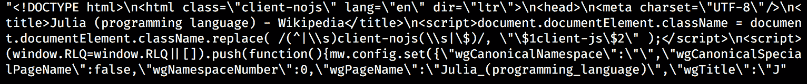
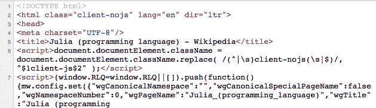
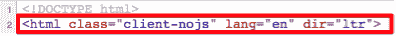
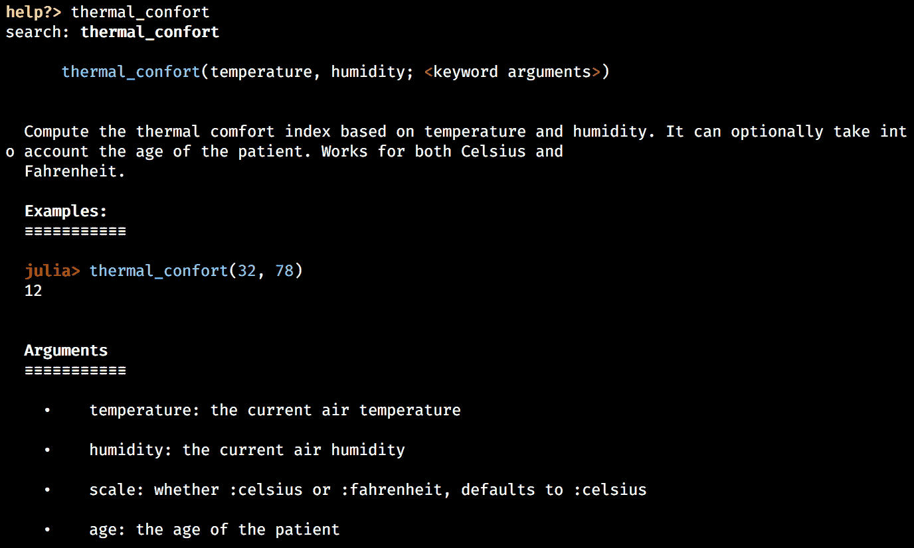

# 三、建立维基游戏

我希望你现在对朱莉娅很兴奋。友好的、富于表现力的、直观的语法、强大的**读取-评估-打印循环** ( **REPL** )、卓越的性能以及内置和第三方库的丰富性是一个改变游戏规则的组合，特别是对于数据科学，以及一般的编程。事实上，在仅仅两个介绍性章节中，我们就能够掌握这门语言的基础知识，并配置一个足够强大的数据科学设置来分析 Iris 数据集，这是非常惊人的——祝贺您，我们完成了一项伟大的工作！

但是我们才刚刚开始。我们已经打下的基础现在足够强大，允许我们使用 Julia 开发几乎任何类型的程序。难以置信？好吧，这就是证据——在接下来的三章中，我们将和 Julia 一起开发一个基于网络的游戏！

它将遵循互联网著名的*六度维基百科*的叙述。如果你从来没有听说过它，这个想法是，维基百科上的任何两篇文章都可以连接起来，只需使用页面上的链接，只需点击六次或更少。也叫**六度分离**。

如果你想知道这与 Julia 有什么关系，这是一个有趣的借口来学习数据挖掘和 web 抓取，并学习更多关于语言的知识，并将我们新获得的知识应用于构建 web 应用。

在这一章中，我们将为 web scraper 打下基础。我们将看看在客户机-服务器架构中如何通过 web 发出请求，以及如何使用`HTTP`包获取网页。我们将学习 HTML 文档、HTML 和 CSS 选择器，以及用于 Julia 的 HTML 解析器`Gumbo`。在这个过程中，我们将在 REPL 中试验更多的代码，我们将了解该语言的其他关键特性，如字典、错误处理、函数和条件语句。我们还将建立我们的第一个朱莉娅项目。

我们将在本章中讨论的主题包括以下内容:

*   什么是网络搜集，它是如何用于数据收集的
*   如何使用 Julia 发出请求并获取网页
*   了解`Pair`类型
*   了解字典，这是 Julia 的一种更通用的数据结构
*   异常处理，帮助我们捕获代码中的错误
*   函数是 Julia 中的基本构件和最重要的代码单元之一——我们将学习如何定义和使用它们来创建可重用的模块化代码
*   一些有用的 Julia 技巧，比如管道运算符和短路计算
*   使用`Pkg`建立 Julia 项目


# 技术要求

Julia 包生态系统正在不断发展，每天都有新的包版本发布。大多数时候这是好消息，因为新版本带来了新特性和错误修复。然而，由于许多软件包仍处于测试阶段(版本 0.x ),任何新版本都可能引入突破性的变化。因此，书中介绍的代码可能会停止工作。为了确保您的代码将产生与书中描述的相同的结果，建议使用相同的包版本。以下是本章中使用的外部软件包及其具体版本:

```jl
Gumbo@v0.5.1
HTTP@v0.7.1
IJulia@v1.14.1
OrderedCollections@v1.0.2
```

为了安装软件包的特定版本，您需要运行:

```jl
pkg> add PackageName@vX.Y.Z 
```

例如:

```jl
pkg> add IJulia@v1.14.1
```

或者，你可以通过下载本章提供的`Project.toml`文件并使用`pkg>`实例化来安装所有使用过的包，如下所示:

```jl
julia> download("https://raw.githubusercontent.com/PacktPublishing/Julia-Programming-Projects/master/Chapter03/Project.toml", "Project.toml")
pkg> activate . 
pkg> instantiate
```


# 通过网络搜集获取数据

使用软件从网页中提取数据的技术被称为**网络搜集**。它是数据收集的重要组成部分，通常通过名为**网络爬虫**的程序来实现。数据采集或数据挖掘是一项有用的技术，通常用于数据科学工作流中，从互联网(通常是网站，而不是 API)收集信息，然后使用各种算法处理这些数据以实现不同的目的。

在一个非常高的层次上，这个过程包括请求一个网页，获取其内容，解析其结构，然后提取所需的信息。例如，这可以是图像、文本段落或包含股票信息和价格的表格数据——几乎是网页上的任何内容。如果内容分布在多个网页上，爬行器还会提取链接，并自动跟随这些链接来拉动其余的页面，重复应用相同的爬行过程。

web 抓取器最常见的用途是用于 web 索引，如 Google 或 Bing 等搜索引擎。在线价格监控和价格比较、个人数据挖掘(或联系信息搜集)、在线信誉系统以及产品评论平台是 web 抓取工具的其他常见用例。


# 网络如何工作——速成班

在过去的十年里，互联网已经成为我们生活中不可或缺的一部分。我们大多数人每天都广泛使用它来获取大量信息。在谷歌上搜索一些事情，比如喧闹(喧闹且缺乏约束或纪律)，在社交网络上与朋友聊天，在 Instagram 上查看最新的美食餐厅，在网飞上观看大片，或者阅读维基百科关于阿蒂托贡(多哥的一个地方，他们在那里练习伏都教)的条目——它们都只是点击一下。所有这些，虽然性质不同，但功能几乎相同。

一台连接互联网的设备，无论是使用 Wi-Fi 的电脑还是连接到移动数据网络的智能手机，以及一个用于访问网络的应用(通常是 Chrome 或 Firefox 等网络浏览器，也有专用的，如脸书或网飞的移动应用)，都代表*客户端*。在另一端，我们有*服务器—* 一台存储信息的计算机，无论是网页、视频还是整个网络应用。

当客户机想要访问服务器上可用的信息时，它发起一个*请求*。如果服务器确定客户端具有访问资源的许可，则将信息的副本从服务器下载到客户端上以进行显示。


# 发出 HTTP 请求

**超文本传输协议** ( **HTTP** )是用于通过网络传输文档的通信协议。它是为 web 浏览器和 web 服务器之间的通信而设计的。HTTP 实现了标准的客户机-服务器模型，其中客户机打开一个连接并发出请求，然后等待响应。


# 了解 HTTP 方法

HTTP 定义了一组请求方法来指示对给定资源要执行的操作。最常见的方法是`GET`，这意味着从服务器检索数据。使用链接浏览互联网时会用到它。`POST`方法请求服务器接受一个封装的数据负载，这通常是提交 web 表单的结果。还有一些其他的方法，包括`HEAD`、`PUT`、`DELETE`、`PATCH`等等，但是它们很少被使用，也很少被客户端和 web 服务器支持。因为我们的网络爬虫不需要它们，所以不包括它们。

如果你感兴趣，你可以在 https://developer.mozilla.org/en-US/docs/Web/HTTP/Methods 阅读。


# 了解 HTTPS

HTTP Secure 基本上是通过加密连接的 HTTP。它最初是一种替代协议，主要用于处理网上支付和传输敏感的公司信息。但近年来，随着一些大公司推动它取代互联网上普通的 HTTP 连接，它开始被广泛使用。出于讨论的目的，HTTP 和 HTTPS 可以互换使用。


# 理解 HTML 文档

为了从获取的网页中提取数据，我们需要分离和操作包含所需信息的结构元素。这就是为什么在执行网络抓取时，对网页的一般结构有一个基本的了解是有帮助的。如果你以前做过网页抓取，可能使用不同的编程语言，或者如果你对 HTML 文档有足够的了解，可以跳过这一部分。另一方面，如果你是新手或者只是需要快速复习，请继续读下去。

超文本标记语言是创建网页和网络应用的黄金标准。HTML 与 HTTP 携手并进，HTTP 是通过互联网传输 HTML 文档的协议。

HTML 页面的构建块是 HTML 元素。它们提供了网页的内容和结构。它们可以嵌套在一起，以定义彼此之间的复杂关系(如父、子、兄弟姐妹、祖先等)。HTML 元素由写在尖括号(`<tag>...</tag>`)之间的*标签*表示。官方的 W3C 规范定义了大量这样的标签，代表了从标题和段落到列表、表单、链接、图像、引用等等的所有内容。

为了让你有个概念，下面是 Julia 的维基百科页面上的主标题是如何用 HTML 表示的，网址是[https://en . Wikipedia . org/wiki/Julia _(programming _ language)](https://en.wikipedia.org/wiki/Julia_(programming_language)):

```jl
<h1>Julia (programming language)</h1> 
```

此 HTML 代码在现代浏览器中呈现，如下所示:



一个更详细的示例可以呈现如下所示的嵌套结构:

```jl
<div> 
    <h2>Language features</h2> 
    <p>According to the official website, the main features of the language are:</p> 
    <ul> 
           <li>Multiple dispatch</li> 
           <li>Dynamic type sytem</li> 
           <li>Good performance</li> 
    </ul> 
</div> 
<h2>), a paragraph of text (<p>), and an unordered list (<ul>), with three list items (<li>), all within a page section (<div>):
```




# HTML 选择器

HTML 的目的是提供内容和结构。这就是我们传达任何信息所需要的，不管它有多复杂。然而，随着计算机和网络浏览器变得越来越强大，网页的使用越来越广泛，用户和开发者想要更多。他们寻求扩展 HTML 的方法，使其包含漂亮的格式(设计)和丰富的行为(交互性)。

这就是为什么**级联样式表** ( **CSS** )被创造出来——一种定义 HTML 文档设计的风格语言。此外，JavaScript 成为客户端的首选编程语言，增加了网页的交互性。

CSS 和 JavaScript 提供的样式规则和交互特性与定义良好的 HTML 元素相关联。也就是说，样式和交互性必须明确地以相关 HTML 文档中的元素为目标。例如，CSS 规则可以针对页面的主要标题，或者 JavaScript 验证规则可以针对登录表单中的文本输入。如果你认为一个网页是一个 HTML 元素的结构化集合，那么这个目标是通过*选择*(子集合)元素来实现的。

最简单的方法是通过类型和结构(层次结构)来识别 HTML 标签，从而选择元素。在前面的例子中，我们看到了一个 Julia 的特征列表，我们可以通过指示一个类似于`div > ul > li`的层次结构来选择所有的列表项(`<li>`元素)，表示所有的`li`项，嵌套在`ul`元素中，嵌套在`div`中。这些叫做 **HTML 选择器**。

然而，这种方法有局限性。一方面，当处理大型、复杂、深度嵌套的 HTML 文档时，我们必须处理同样复杂的层次结构，这是一项繁琐且容易出错的任务。另一方面，这种方法可能无法提供足够的特异性来允许我们选择想要作为目标的元素。例如，在同一个 Julia Wikipedia 页面上，我们如何区分功能列表和外部链接列表？它们都有相似的结构。

朱莉娅的维基百科页面上的外部链接列表如下:



**语言特性**部分也有类似的结构:



两个 HTML 元素在结构上完全相同的事实使得很难单独为语言特性选择列表项。


# 了解 HTML 属性

这就是 HTML 属性发挥作用的地方。这些是增强 HTML 标签的键值对，提供额外的信息。例如，为了定义一个链接，我们将使用`<a>`标签— `<a>This is a link</a>`。

但显然，这还不够。如果这是一个链接，它链接到什么？作为开发人员，我们需要提供关于链接位置的额外信息。这是通过添加带有相应值的`href`属性来实现的:

```jl
<a href="https://julialang.org/">This is a link to Julia's home page</a>
```

啊，是的，现在我们正在谈论！一个超级方便的链接到朱莉娅的主页。

通常，选择 HTML 元素时可以使用所有属性。但并不是所有的都同样有用。最重要的一个可以说是`id`属性。它允许我们给一个元素分配一个惟一的标识符，然后以一种非常有效的方式引用它。另一个重要的属性是`class`，广泛用于 CSS 样式规则。

这就是我们上一个带有额外属性的示例的样子:

```jl
<a href="https://julialang.org/" id="julia_link" class="external_link">This is a link to Julia's home page</a>
```


# 了解 CSS 和 JavaScript 选择器

从历史上看，JavaScript 开始使用基于`id`属性和 HTML 元素(标签)名称的选择器。后来，CSS 规范带来了一组更强大的选择器，不仅使用了`class`、`id`和标签，还使用了属性及其值、元素状态(如`focused`或`disabled`)以及考虑到关系的更具体的元素层次结构。

这里有几个 CSS 选择器的例子，可以用来定位前面讨论过的`<a>`标签:

*   `#julia_link`是`id`属性的选择器(`#`)
*   `.external_link`是`class`属性(`.`)的选择器
*   `a`是`<a>`标签的选择器
*   `a[href*="julialang.org"]`将选择所有具有包含`"julialang.org"`的`href`属性的`<a>`标签

你可以在[https://developer . Mozilla . org/en-US/docs/Web/CSS/CSS _ Selectors](https://developer.mozilla.org/en-US/docs/Web/CSS/CSS_Selectors)了解更多关于 CSS 选择器的信息。保持这个资源是值得的，因为网页抓取非常依赖 CSS 选择器，我们将在下一章看到。


# 了解链接的结构

链接，在技术术语中称为**统一资源定位符**(**URL**)，是在互联网上唯一标识资源的字符串。它们被非正式地称为**网址**。有时你可能会看到它们被称为**统一资源标识符** ( **URIs** )。

在我们之前的例子中，Julia 的维基百科网页可以通过 URL[https://en . Wikipedia . org/wiki/Julia _(programming _ language)](https://en.wikipedia.org/wiki/Julia_(programming_language))访问。该 URL 引用资源`/wiki/Julia_(programming_language)`，其表示为 HTML 文档，可以通过 HTTPS 协议(`https:`)从域名为`wikipedia.org`的网络主机请求。(哇，这有点拗口，但是现在你可以理解在互联网上请求一个网页的过程是多么复杂了)。

因此，一个普通的 URL 可以被分解成以下几个部分— `scheme://host/path?query#fragment`。

比如我们看一看[https://en . Wikipedia . org/wiki/Julia _(programming _ language)？uselang=en#Interaction](https://en.wikipedia.org/wiki/Julia_(programming_language)?uselang=en#Interaction) ，我们将`https`作为`scheme`，`en.wikipedia.org`作为`host`，`/wiki/Julia_(programming_language)`作为`path`，`?uselang=en`作为`query`，最后，`#Interaction`作为`fragment`。


# 从朱莉娅那里访问互联网

现在，您已经很好地理解了如何通过客户机-服务器交互来访问互联网上的网页，让我们看看如何用 Julia 来实现这一点。

最常见的网络客户端是网络浏览器，如 Chrome 或 Firefox。然而，这些是给人类用户使用的，用花哨的用户界面和复杂的交互来呈现网页。Web 抓取可以通过 web 浏览器手动完成，这是事实，但最有效和可扩展的方式是通过完全自动化的软件驱动的过程。尽管网络浏览器可以自动化(比如 https://www.seleniumhq.org[的 Selenium](https://www.seleniumhq.org))，但这是一项更困难、更容易出错、更耗费资源的任务。对于大多数用例，首选方法是使用专用的 HTTP 客户端。


# 使用 HTTP 包发出请求

`Pkg`，Julia 内置的包管理器，提供对优秀的`HTTP`包的访问。它展示了构建 web 客户端和服务器的强大功能——我们将广泛使用它。

正如您已经习惯的那样，额外的功能离`pkg> add HTTP`和`julia> using HTTP`只有两个命令之遥。

回想一下我们在上一节中关于 HTTP 方法的讨论；最重要的是`GET`，用于向服务器请求资源，以及`POST`，它向服务器发送数据负载并接受响应。`HTTP`包公开了一组匹配的函数——我们可以访问`HTTP.get`、`HTTP.post`、`HTTP.delete`、`HTTP.put`等等。

假设我们想要请求 Julia 的维基百科页面。我们只需要页面的 URL 和`HTTP.get`方法:

```jl
julia> HTTP.get("https://en.wikipedia.org/wiki/Julia_(programming_language)") 
```

结果将是一个代表 Julia 的维基百科页面的`Response`对象。REPL 显示标题和响应正文的第一行，截断其余部分:



截图显示了我们收到的`HTTP.Messages.Response`对象的详细信息 HTTP 头列表和响应体的第一部分。让我们确保将它保存在一个变量中，以便以后引用它。记住，Julia 将最后一次计算的结果临时存储在`ans` REPL 变量中，所以让我们从那里开始:

```jl
julia> resp = ans 
```


# 处理 HTTP 响应

在接收和处理请求后，服务器发回一条 HTTP 响应消息。这些消息具有标准化的结构。它们包含大量信息，其中最重要的部分是状态代码、标题和主体。


# HTTP 状态代码

状态代码是一个三位数的整数，其中第一个数字代表类别，接下来的两个数字用于定义子类别。它们如下:

*   **1XX -信息**:请求已收到。这表示临时响应。
*   **2XX - Success** :这是最重要的响应状态，表示请求已被成功接收、理解和接受。这就是我们在网络挖掘脚本中寻找的东西。
*   **3XX -重定向**:此类状态代码表示客户端必须采取额外的操作。这通常意味着必须发出额外的请求才能访问资源，因此我们的脚本必须处理这种情况。我们还需要积极防止周期性的重定向。我们不会在我们的项目中处理如此复杂的场景，但是在实际应用中，3XX 状态代码将需要基于子类别的特殊处理。

维基百科很好地描述了各种 3XX 状态代码，并说明了在每种情况下应该做什么:[https://en . Wikipedia . org/wiki/List _ of _ HTTP _ status _ codes # 3XX _ Redirection](https://en.wikipedia.org/wiki/List_of_HTTP_status_codes#3xx_Redirection)。

*   **4XX -客户端错误**:这意味着我们可能在发送请求时出错了。可能是 URL 错误，找不到资源(`404`)，也可能是不允许我们访问页面(`401`和`403`状态代码)。4XX 响应代码有一个很长的列表，类似于 3XX 响应代码，我们的程序应该处理各种场景以确保请求最终成功。
*   **5XX -服务器错误**:恭喜你，你在服务器上发现或导致了一个问题！根据实际状态代码，这可能是可操作的，也可能是不可操作的。`503`(服务不可用)或`504`(网关超时)是相关的，因为它们表示我们应该稍后再试。


# 了解 HTTP 头

HTTP 头允许客户端和服务器传递附加信息。我们不会深入头部传输的细节，因为 Julia 的`HTTP`库使我们不必处理原始头部。但是，有几个值得一提，因为它们对网络抓取很重要:

*   `Age`、`Cache-Control`、`Expires`表示页面的有效性，可以用来设置数据刷新次数
*   `Last-Modified`、`Etag`和`If-Modified-Since`可用于内容版本控制，以检查页面自上次检索以来是否发生了更改
*   必须使用`Cookie`和`Set-Cookie`来读取和写入与服务器正确通信所需的 cookies
*   标题的`Content-*`系列，比如`Content-Disposition`、`Content-Length`、`Content-Type`、`Content-Encoding`等等，有助于处理和验证响应消息

查看[https://developer.mozilla.org/en-US/docs/Web/HTTP/Headers](https://developer.mozilla.org/en-US/docs/Web/HTTP/Headers)和[https://en.wikipedia.org/wiki/List_of_HTTP_header_fields](https://en.wikipedia.org/wiki/List_of_HTTP_header_fields)了解关于 HTTP 报头字段的完整讨论。


# HTTP 消息正文

消息体是最重要的部分，也是 web 抓取的原因(网页本身的内容)，实际上是响应的可选部分。主体的存在、属性和大小由`Content-*`系列的头指定。


# 了解 HTTP 响应

`HTTP.get`调用的结果是一个对象，它很好地反映了原始 HTTP 响应。这个包通过提取原始的 HTTP 数据并把它整齐地设置在一个数据结构中，使我们的生活变得更容易，这使得操作它变得轻而易举。

让我们来看看它的属性(或者用 Julia 的行话来说是*字段*):

```jl
julia> fieldnames(typeof(resp)) 
(:version, :status, :headers, :body, :request) 
```

`fieldnames`函数接受一个类型作为它的参数，并返回一个包含参数的字段(或属性)名称的元组。为了获得值的类型，我们可以使用`typeof`函数，就像前面的例子一样。

对！现在，`status`、`headers`和`body`字段听起来应该很熟悉。`version`字段表示 HTTP 协议的版本(响应第一行的`HTTP/1.1`部分)。今天，互联网上的大多数 web 服务器都使用该协议的 1.1 版本，但一个新的主要版本 2.0 几乎可以广泛部署。最后，`request`字段保存对触发当前响应的`HTTP.Messages.Request`对象的引用。


# 状态代码

让我们仔细看看状态代码:

```jl
julia> resp.status 200 
```

果然，我们得到了一个有效的响应，在此通过`200`状态码确认。


# 标题

标题呢？如前所述，它们包含指示消息体是否存在的关键信息。让我们来看看:

```jl
julia> resp.headers 
```

输出如下所示:



对于某些值，您的输出会有所不同，但是应该很容易发现我们之前提到的关键 HTTP 头。`Content-Length`确认响应体的存在。`Content-Type`提供了关于如何解释消息体编码的信息(这是一个使用 UTF-8 字符编码的 HTML 文档)。我们可以使用`Last-Modified`值来优化缓存和网络爬虫的更新频率。


# 邮件正文

因为我们刚刚确认了我们有一个响应体，所以让我们来看看:

```jl
julia> resp.body 
193324-element Array{UInt8,1}: 
 0x3c 
 0x21 
 0x44  
# ... output truncated ...  
```

哎呀，这看起来不像我们期待的网页。不过不用担心，这些是原始响应的字节数——我们可以很容易地将其转换成人类可读的 HTML 字符串。还记得我在学习弦乐的时候提到过`String`方法吗？这就是它派上用场的地方:

```jl
julia> resp_body = String(resp.body) 
```

您的 REPL 现在应该输出一个表示 Julia 的 Wikipedia 页面的长 HTML 字符串。

如果我们看一看第一个`500`人物，我们会开始看到熟悉的模式:

```jl
julia> resp_body[1:500] 
```

输出如下所示:



果不其然，使用 Chrome 的查看页面源码会显示相同的 HTML:



这是肯定的——我们刚刚成功地迈出了构建网络爬虫的第一步！


# 学习配对

在查看响应头时，您可能已经注意到它的类型是`Pair`对象的`Array`:

```jl
julia> resp.headers 
25-element Array{Pair{SubString{String},SubString{String}},1} 
```

一个`Pair`代表一个 Julia 数据结构——以及相应的类型。`Pair`包含两个通常用于引用键值关系的值。这两个元素的类型决定了`Pair`的具体类型。

例如，我们可以用下面的代码构造一个`Pair`:

```jl
julia> Pair(:foo, "bar") 
:foo => "bar" 
```

如果我们检查它的类型，我们会看到它是`Symbol`和`String`的`Pair`:

```jl
julia> typeof(Pair(:foo, "bar")) 
Pair{Symbol,String} 
```

我们也可以通过使用`x => y`文字符号来创建`Pairs`:

```jl
julia> 3 => 'C' 
3 => 'C' 

julia> typeof(3 => 'C') 
Pair{Int64,Char} 

```

这个`=>`双箭应该看着眼熟。这就是我们在响应标头中看到的内容，例如:

```jl
"Content-Type" => "text/html; charset=UTF-8"
```

显然，一旦创建，就可以访问存储在`Pair`中的值。一种方法是对其进行索引:

```jl
julia> p = "one" => 1 
"one" => 1 

julia> p[1] 
"one" 

julia> p[2] 
1 

```

我们还可以访问`first`和`second`字段，以便分别获得`first`和`second`值:

```jl
julia> p.first 
"one" 

julia> p.second 
1 
```

就像元组一样，`Pairs`是不可变的，所以这是行不通的:

```jl
julia> p.first = "two" 
ERROR: type Pair is immutable 

julia> p[1] = "two" 
ERROR: MethodError: no method matching setindex!(::Pair{String,Int64} 
```

是 Julia 的构建模块之一，可以用来创建字典，这是最重要的类型和数据结构之一。


# 字典

这本名为`Dict`的字典是 Julia 最强大、最通用的数据结构之一。这是一个关联集合——它将*键与值关联起来。您可以将`Dict`看作一个查找表实现——给定一条信息，即键，它将返回相应的值。*


# 构建词典

创建一个`Dict`的空实例就像下面这样简单:

```jl
julia> d = Dict() 
Dict{Any,Any} with 0 entries 
```

花括号`{Any,Any}`之间的信息代表`Dict`的键和值的类型。因此，`Dict`本身的具体类型是由其键和值的类型定义的。编译器将尽力从集合各部分的类型中推断出集合的类型。在这种情况下，由于字典是空的，无法推断出任何信息，所以 Julia 默认为`Any`和`Any`。

一个`{Any,Any}`类型的`Dict`允许我们任意添加任何类型的数据。我们可以使用`setindex!`方法向集合中添加一个新的键值对:

```jl
julia> setindex!(d, "World", "Hello") 
Dict{Any,Any} with 1 entry: 
  "Hello" => "World" 
```

然而，向一个`Dict`添加值通常是使用方括号符号来完成的(这类似于对其进行索引，同时也执行赋值):

```jl
julia> d["Hola"] = "Mundo" 
"Mundo"  
```

到目前为止，我们只添加了`Strings`——但是就像我说的，因为我们的`Dict`接受任何种类的键和值，所以没有任何约束:

```jl
julia> d[:speed] = 6.4 
6.4 
```

现在我们的`Dict`在这里:

```jl
julia> d 
Dict{Any,Any} with 3 entries: 
  "Hello" => "World" 
  :speed  => 6.4 
  "Hola"  => "Mundo" 
```

请注意，键`=>`值对没有按照我们添加它们的顺序排列。`Dicts`不是在朱丽亚订购的收藏品。我们将在几个段落中详细讨论这一点。

如果该键已经存在，相应的值将被更新，返回新值:

```jl
julia> d["Hello"] = "Earth" "Earth" 
```

这是我们更新的`Dict`。注意`"Hello"`现在指向`"Earth"`而不是`"World"`:

```jl
julia> d 
Dict{Any,Any} with 3 entries: 
  "Hello" => "Earth" 
  :speed  => 6.4 
  "Hola"  => "Mundo"   
```

如果我们在实例化`Dict`时提供一些初始数据，编译器将能够更好地识别类型:

```jl
julia> dt = Dict("age" => 12) 
Dict{String,Int64} with 1 entry: 
  "age" => 12 
```

我们可以看到，`Dict`的类型现在将键约束为`String`，值约束为`Int`——这是我们用来实例化`Dict`的`Pair`的类型。现在，如果为键或值传递不同的类型，Julia 将尝试转换它—如果失败，将出现错误:

```jl
julia> dt[:price] = 9.99 
MethodError: Cannot `convert` an object of type Symbol to an object of type String 
```

在某些情况下，自动转换会起作用:

```jl
julia> dx = Dict(1 => 11) 
Dict{Int64,Int64} with 1 entry: 
  1 => 11 
julia> dx[2.0] = 12 
12

```

Julia 已经悄悄地将`2.0`转换为相应的`Int`值:

```jl
julia> dx 
Dict{Int64,Int64} with 2 entries: 
  2 => 12 
  1 => 11 
```

但这并不总是奏效:

```jl
julia> dx[2.4] = 12 
InexactError: Int64(Int64, 2.4) 
```

我们可以在一个`Dict`中存储随机的复杂数据，它的类型将被 Julia 正确地推断出来:

```jl
 julia> clients_purchases = Dict( 
       "John Roche" => ["soap", "wine", "apples", "bread"], 
       "Merry Lou"  => ["bottled water", "apples", "cereals", "milk"] 
       ) 
Dict{String,Array{String,1}} with 2 entries: 
  "John Roche" => ["soap", "wine", "apples", "bread"] 
  "Merry Lou"  => ["bottled water", "apples", "cereals", "milk"] 
```

您还可以在构造`Dict`时指定和约束它的类型，而不是留给 Julia:

```jl
julia> dd = Dict{String,Int}("" => 2.0) 
Dict{String,Int64} with 1 entry: 
  "x" => 2 
```

在这里，我们可以看到类型定义如何否决了`2.0`值的类型，它是一个`Float64`(当然，和前面的例子一样，Julia 已经将`2.0`转换为它的整数对应物)。

我们也可以使用`Pairs`来创建一个`Dict`:

```jl
julia> p1 = "a" => 1 
"a"=>1 
julia> p2 = Pair("b", 2) 
"b"=>2 
julia> Dict(p1, p2) 
Dict{String,Int64} with 2 entries: 
  "b" => 2 
  "a" => 1 
```

我们也可以使用`Pair`中的`Array`:

```jl
julia> Dict([p1, p2]) 
Dict{String,Int64} with 2 entries: 
  "b" => 2 
  "a" => 1 
```

我们可以对元组数组做同样的事情:

```jl
julia> Dict([("a", 5), ("b", 10)]) 
Dict{String,Int64} with 2 entries: 
  "b" => 10 
  "a" => 5 
```

最后，可以使用理解来构建`Dict`:

```jl
julia> using Dates 
julia> Dict([x => Dates.dayname(x) for x = (1:7)]) 
Dict{Int64,String} with 7 entries: 
  7 => "Sunday" 
  4 => "Thursday" 
  2 => "Tuesday" 
  3 => "Wednesday" 
  5 => "Friday" 
  6 => "Saturday" 
  1 => "Monday" 
```

您的输出将会不同，因为键很可能不会按从`1`到`7`的顺序排列。这是非常重要的一点——正如已经提到的，在《朱丽亚》,`Dict`是没有顺序的。


# 有序词典

如果你需要你的字典保持有序，你可以使用`OrderedCollections`包([https://github.com/JuliaCollections/有序集合. jl](https://github.com/JuliaCollections/%20OrderedCollections.jl) )，特别是`OrderedDict`:

```jl
pkg> add OrderedCollections 
julia> using OrderedCollections, Dates 
julia> OrderedDict(x => Dates.monthname(x) for x = (1:12)) 
DataStructures.OrderedDict{Any,Any} with 12 entries: 
  1  => "January" 
  2  => "February" 
  3  => "March" 
  4  => "April" 
  5  => "May" 
  6  => "June" 
  7  => "July" 
  8  => "August" 
  9  => "September" 
  10 => "October" 
  11 => "November" 
  12 => "December" 
```

现在，元素按照添加到集合中的顺序存储(从`1`到`12`)。


# 使用字典

正如我们已经看到的，我们可以使用方括号符号索引到一个`Dict`:

```jl
julia> d = Dict(:foo => 1, :bar => 2) 
Dict{Symbol,Int64} with 2 entries: 
  :bar => 2 
  :foo => 1 

julia> d[:bar] 
2 
```

试图访问尚未定义的密钥将导致`KeyError`，如下所示:

```jl
julia> d[:baz] 
ERROR: KeyError: key :baz not found 
```

为了避免这种情况，我们可以首先检查密钥是否存在:

```jl
julia> haskey(d, :baz) 
false 
```

另一种方法是，如果我们想在键不存在时也获得一个默认值，我们可以使用下面的方法:

```jl
julia> get(d, :baz, 0) 
0 
```

`get`函数有一个更强大的孪生函数`get!`，它也使用默认值将搜索到的关键字存储到`Dict`中:

```jl
julia> d 
Dict{Symbol,Int64} with 2 entries: 
  :bar => 2 
  :foo => 1 

julia> get!(d, :baz, 100) 
100 

julia> d 
Dict{Symbol,Int64} with 3 entries: 
  :baz => 100 
  :bar => 2 
  :foo => 1 

julia> haskey(d, :baz) 
true  
```

如果您想知道，函数名末尾的感叹号是有效的——表示一个重要的 Julia 命名约定。这应该被视为一个警告，使用该函数将修改其参数的数据。在这种情况下，`get!`功能会将`:baz = 100` `Pair`添加到`d` `Dict`中。

删除键值`Pair`只是调用`delete!`的问题(注意这里也有感叹号):

```jl
julia> delete!(d, :baz) 
Dict{Symbol,Int64} with 2 entries: 
  :bar => 2 
  :foo => 1 

julia> haskey(d, :baz) 
false 
```

按照要求，`:baz`键及其相应的值已经消失。

我们可以使用名副其实的函数`keys`和`values`来请求键和值的集合。它们将返回底层集合上的迭代器:

```jl
julia> keys(d) 
Base.KeySet for a Dict{Symbol,Int64} with 2 entries. Keys: 
  :bar 
  :foo 

julia> values(d) 
Base.ValueIterator for a Dict{Symbol,Int64} with 2 entries. Values: 
  2 
  1 
```

使用`collect`检索相应的数组:

```jl
julia> collect(keys(d)) 
2-element Array{Symbol,1}: 
 :bar 
 :foo 

julia> collect(values(d)) 
2-element Array{Int64,1}: 
 2 
 1 
```

我们可以将一个`Dict`与另一个`Dict`结合起来:

```jl
julia> d2 = Dict(:baz => 3) 
Dict{Symbol,Int64} with 1 entry: 
  :baz => 3 

julia> d3 = merge(d, d2) 
Dict{Symbol,Int64} with 3 entries: 
  :baz => 3 
  :bar => 2 
  :foo => 1 
```

如果某些键出现在多个字典中，将保留最后一个集合中的值:

```jl
julia> merge(d3, Dict(:baz => 10)) 
Dict{Symbol,Int64} with 3 entries: 
  :baz => 10 
  :bar => 2 
  :foo => 1 
```


# 使用 HTTP 响应

对 Julia 的字典数据结构有了很好的理解后，我们现在可以更仔细地看看我们的`HTTP`响应对象`resp`的`headers`属性。

为了更容易访问各种标题，首先让我们将数组`Pair`转换成一个`Dict`:

```jl
julia> headers = Dict(resp.headers) 
Dict{SubString{String},SubString{String}} with 23 entries: 
"Connection"     => "keep-alive" 
  "Via"          => "1.1 varnish (Varnish/5.1), 1.1 varnish (Varni... 
  "X-Analytics"  => "ns=0;page_id=38455554;https=1;nocookies=1" 
#... output truncated... #
```

我们可以检查`Content-Length`的值来确定我们是否有一个响应体。如果它大于`0`，这意味着我们得到了一个 HTML 消息:

```jl
julia> headers["Content-Length"] 
"193324" 
```

重要的是要记住`headers`字典中的所有值都是字符串，所以我们不能直接比较它们:

```jl
julia> headers["Content-Length"] > 0 
ERROR: MethodError: no method matching isless(::Int64, ::String) 
```

我们需要先把它解析成一个整数:

```jl
julia> parse(Int, headers["Content-Length"]) > 0 
true 
```


# 操纵响应体

之前，我们将响应体读入一个`String`并存储到`resp_body`变量中。这是一个很长的 HTML 字符串，理论上，我们可以使用`Regex`和其他字符串处理函数来查找和提取我们需要的数据。然而，这种方法非常复杂并且容易出错。在 HTML 文档中搜索内容的最佳方式是通过 HTML 和 CSS 选择器。唯一的问题是这些选择器不对字符串进行操作——它们只对一个**文档对象模型** ( **DOM** )进行操作。


# 构建页面的 DOM 表示

DOM 代表一个 HTML 文档的内存结构。它是一种数据结构，允许我们以编程方式操作底层的 HTML 元素。DOM 将文档表示为逻辑树，我们可以使用选择器来遍历和查询这个层次结构。


# 用 Gumbo 解析 HTML

Julia 的`Pkg`生态系统提供了对`Gumbo`的访问，这是一个 HTML 解析器库。提供一个 HTML 字符串，`Gumbo`将把它解析成一个文档和它对应的 DOM。这个包是和 Julia 一起做网页抓取的重要工具，我们来补充一下。

通常，使用以下内容进行安装:

```jl
pkg> add Gumbo 
julia> using Gumbo  
```

我们现在准备将 HTML 字符串解析成 DOM，如下所示:

```jl
julia> dom = parsehtml(resp_body)
 HTML Document
```

`dom`变量现在引用了一个`Gumbo.HTMLDocument`，一个网页的内存 Julia 表示。这是一个只有两个字段的简单对象:

```jl
julia> fieldnames(typeof(dom)) 
(:doctype, :root)  
```

`doctype`代表 HTML `<!DOCTYPE html>`元素，这是维基百科页面所使用的:

```jl
julia> dom.doctype 
"html" 
```

现在，让我们把注意力集中在`root`房产上。这实际上是 HTML 页面最外层的元素——包含其余元素的`<html>`标签。它为我们提供了进入 DOM 的入口点。我们可以问`Gumbo`关于它的属性:

```jl
julia> dom.root.attributes 
Dict{AbstractString,AbstractString} with 3 entries: 
  "class" => "client-nojs" 
  "lang"  => "en" 
  "dir"   => "ltr" 
```

这是一个`Dict`，键代表 HTML 属性和值——属性的值。果然，它们与页面的 HTML 相匹配:



还有一个类似的`attrs`方法，也是为了同样的目的:

```jl
julia> attrs(dom.root) 
Dict{AbstractString,AbstractString} with 3 entries: 
  "class" => "client-nojs" 
  "lang"  => "en" 
  "dir"   => "ltr" 
```

当有疑问时，我们可以使用`tag`方法询问元素的名称:

```jl
julia> tag(dom.root) 
:HTML 
```

`Gumbo`公开一个`children`方法，该方法返回一个包含所有嵌套`HTMLElement`的数组。如果你只是继续执行`julia> children(dom.root)`，REPL 的输出将很难跟上。一个`HTMLElement`的 REPL 表示是它的 HTML 代码，对于有许多子元素的顶级元素，它将填满许多终端屏幕。让我们使用一个`for`循环来遍历子元素并只显示它们的标签:

```jl
julia> for c in children(dom.root) 
           @show tag(c) 
       end 
tag(c) = :head 
tag(c) = :body 
```

好多了！

由于子元素是集合的一部分，我们可以对它们进行索引:

```jl
julia> body = children(dom.root)[2]; 
```

请注意结束分号(`;`)。当在表达式末尾的 REPL 中使用时，它将禁止输出(所以我们不会看到原本会输出的`<body>`的很长的 HTML 代码)。`body`变量现在将引用`HTMLElement{:body}`的一个实例:

```jl
HTMLElement{:body}: 
<body class="mediawiki ltr sitedir-ltr mw-hide-empty-elt ns-0 ns-subject page-Julia_programming_language rootpage-Julia_programming_language skin-vector action-view"> 
# ... output truncated ...
```

我们需要的最后一个方法是`getattr`，它返回属性名称的值。如果没有为元素定义属性，它会引发一个`KeyError`:

```jl
julia> getattr(dom.root, "class") 
"client-nojs" 

julia> getattr(dom.root, "href") # oops! 
ERROR: KeyError: key "href" not found 
```

询问一个`<html>`标签的`href`属性没有任何意义。果然，我们很快得到了一个`KeyError`，因为`href`不是这个`HTMLElement`的属性。


# 防御性编码

像前一个错误，当它是一个更大的脚本的一部分时，有可能完全改变程序的执行，导致不希望的和潜在的代价高昂的结果。一般来说，当程序执行过程中出现意外情况时，可能会使软件处于错误状态，从而无法返回正确的值。在这种情况下，最好通过抛出一个`Exception`来显式地通知调用代码这种情况，而不是将问题推到整个执行堆栈上并潜在地传播。

Julia 的核心和第三方包中的许多函数都很好地利用了错误抛出机制。检查您使用的函数的文档，看看它们抛出了什么类型的错误，这是一个很好的实践。在编程行话中，错误被称为异常。

与`getattr`的情况一样，`Gumbo`包的作者警告我们，试图读取一个未定义的属性会导致`KeyError`异常。我们将很快学习如何处理异常，方法是在代码中捕获它们，获取问题的相关信息，并阻止或允许异常在调用堆栈中进一步传播。有时这是最好的方法，但我们不想滥用这种技术，因为用这种方法处理错误会耗费大量资源。处理异常比执行简单的数据完整性检查和分支要慢得多。

对于我们的项目，第一道防线是简单地检查属性是否在元素中定义。我们可以通过检索属性`Dict`的键并检查我们想要的键是否是集合的一部分来做到这一点。这是一行程序:

```jl
julia> in("href", collect(keys(attrs(dom.root)))) 
false 
```

显然，`href`不是`<html>`标签的属性。

使用这种方法，我们可以轻松地编写逻辑，在尝试查找属性值之前检查属性是否存在。


# 管道操作员

读取多个嵌套函数可能会对大脑造成负担。可以使用 Julia 的管道操作符`|>`重写前面的示例`collect(keys(attrs(dom.root)))`，以提高可读性。

例如，以下代码段嵌套了三个函数调用，每个内部函数都成为最外层函数的参数:

```jl
julia> collect(keys(attrs(dom.root))) 
3-element Array{AbstractString,1}: 
 "class" 
 "lang" 
 "dir"
```

为了提高可读性，可以使用管道操作符将它重写为一个函数链。这段代码产生完全相同的结果:

```jl
julia> dom.root |> attrs |> keys |> collect 
3-element Array{AbstractString,1}: 
 "class" 
 "lang" 
 "dir" 
```

`|>`操作符所做的是将第一个值的输出作为下一个函数的参数。所以`dom.root |> attrs`和`attrs(dom.root)`是一样的。不幸的是，管道运算符只适用于单参数函数。但它对于清理代码仍然非常有用，大大提高了可读性。

对于更高级的管道功能，您可以查看`Lazy`包，特别是位于[https://github.com/MikeInnes/Lazy.jl#macros.](https://github.com/MikeInnes/Lazy.jl#macros)的`@>`和`@>>`


# 像专家一样处理错误

有时候，防御性编码并不是解决方案。也许你程序的关键部分需要读取网络上的文件或访问数据库。如果由于暂时的网络故障而无法访问资源，那么在没有数据的情况下，您真的无能为力。


# 尝试...catch 语句

如果您发现您认为由于超出您控制的条件(即*异常*条件——因此得名*异常*)执行可能会脱离轨道的代码部分，您可以使用 Julia 的`try...catch`语句。这正是它听起来的样子——你指示编译器*尝试*一段代码，如果作为一个问题的结果，一个异常被*抛出* *，*到*捕捉*它。一个异常被*捕获*的事实意味着它不会在整个应用中传播。

让我们来看看它的实际应用:

```jl
julia> try 
    getattr(dom.root, "href") 
catch 
    println("The $(tag(dom.root)) tag doesn't have a 'href' attribute.") 
end 
The HTML tag doesn't have a 'href' attribute. 
```

在这个例子中，一旦遇到错误，在`try`分支中的代码的执行正好在那个点停止，并且执行流立即在`catch`分支中继续。

如果我们将代码片段修改如下，它会变得更清楚:

```jl
julia> try 
    getattr(dom.root, "href") 
    println("I'm here too") 
catch 
    println("The $(tag(dom.root)) tag doesn't have a 'href' attribute.") 
end 
The HTML tag doesn't have a 'href' attribute. 
```

新添加的行`println("I'm here too")`没有被执行，消息没有被输出的事实证明了这一点。

当然，如果没有抛出异常，事情会发生变化:

```jl
julia> try 
getattr(dom.root, "class") 
    println("I'm here too") 
catch 
    println("The $(tag(dom.root)) tag doesn't have a 'href' attribute.") 
end 
I'm here too 
```

`catch`构造接受一个可选参数，即由`try`块抛出的`Exception`对象。这允许我们检查异常，并根据其属性分支我们的代码。

在我们的例子中，Julia 内置了`KeyError`异常。当我们试图访问或删除一个不存在的元素(比如一个`Dict`中的键或者一个`HTMLElement`的属性)时，它会被抛出。所有的`KeyError`实例都有一个 key 属性，它提供关于丢失数据的信息。因此，我们可以使我们的代码更加通用:

```jl
julia> try 
     getattr(dom.root, "href") 
catch ex 
    if isa(ex, KeyError)  
            println("The $(tag(dom.root)) tag doesn't have a '$(ex.key)' attribute.") 
    else  
           println("Some other exception has occurred") 
    end 
end 
The HTML tag doesn't have a 'href' attribute. 
```

这里，我们将异常作为`ex`变量传递到`catch`块中。然后我们检查我们是否正在处理一个`KeyError`异常——如果是，我们通过访问`ex.key`字段来检索丢失的键，使用这个信息来显示一个定制错误。如果是不同类型的异常，我们会显示一条一般的错误消息:

```jl
julia> try 
     error("Oh my!") 
catch ex 
    if isa(ex, KeyError)  
            println("The $(tag(dom.root)) tag doesn't have a '$(ex.key)' attribute.") 
    else  
           println("Some exception has occurred") 
    end 
end 
Some exception has occurred 
```


# finally 子句

在执行状态更改或使用文件或数据库等资源的代码中，通常需要在代码完成时进行一些清理工作(如关闭文件或数据库连接)。这段代码通常会进入`try`分支——但是如果抛出异常会发生什么呢？

在这种情况下，`finally`条款开始发挥作用。这可以添加在`try`或`catch`分支之后。`finally`块中的代码*保证*被执行，不管是否抛出异常:

```jl
julia> try 
    getattr(dom.root, "href") 
catch ex 
    println("The $(tag(dom.root)) tag doesn't have a '$(ex.key)' attribute.") 
finally 
    println("I always get called") 
end 
The HTML tag doesn't have a 'href' attribute. 
I always get called 
```

有`try`没有`catch`或者`finally`是违法的；

```jl
julia> try getattr(dom.root, "href") end syntax: try without catch or finally 
```

我们需要提供一个`catch`或者一个`finally`块(或者两个都提供)。

`try/catch/finally`块将返回最后一个求值的表达式，所以我们可以在一个变量中捕获它:

```jl
julia> result = try 
           error("Oh no!") 
       catch ex 
           "Everything is under control" 
        end 
"Everything is under control" 

julia> result 
"Everything is under control" 
```


# 出错时引发异常

作为开发人员，当我们的代码遇到问题并且不应该继续时，我们也可以选择创建和抛出异常。Julia 提供了一长串内置异常，涵盖了大量用例。你可以在[https://docs . Julia lang . org/en/stable/manual/control-flow/# Built-in-Exceptions-1](https://docs.julialang.org/en/stable/manual/control-flow/#Built-in-Exceptions-1)上了解它们。

为了抛出异常，我们使用了名副其实的`throw`函数。例如，如果我们想要复制由 Gumbo 的`getattr`方法引起的错误，我们所要做的就是调用以下代码:

```jl
julia> throw(KeyError("href")) 
ERROR: KeyError: key "href" not found 
```

如果 Julia 提供的内置异常与您的情况不太相关，该语言提供了一种通用的错误类型`ErrorException`。它需要一个额外的`msg`参数，该参数应该提供关于错误性质的更多细节:

```jl
julia> ex = ErrorException("To err is human, but to really foul things up you need a computer.") 
ErrorException("To err is human, but to really foul things up you need a computer.") 

julia> throw(ex) 
ERROR: To err is human, but to really foul things up you need a computer. 

julia> ex.msg 
"To err is human, but to really foul things up you need a computer." 
```

Julia 提供了抛出`ErrorException`的快捷方式，即`error`函数:

```jl
julia> error("To err is human - to blame it on a computer is even more so.") 
ERROR: To err is human - to blame it on a computer is even more so. 
```


# 再次引发异常

但是如果我们意识到我们捕获的异常不能(或者不应该)被我们的代码处理，我们该怎么办呢？例如，假设我们期望捕获一个可能丢失的属性，但是结果我们得到了一个`Gumbo`解析异常。这样的问题必须在执行栈的更高层处理，可能是通过再次尝试获取网页并重新解析它，或者通过为管理员记录错误消息。

如果我们自己`throw`这个异常，初始错误的来源`stacktrace`将会丢失。对于这种情况，Julia 提供了`rethrow`函数，其用法如下:

```jl
julia> try 
           Dict()[:foo] 
       catch ex 
           "nothing to see here" 
       end 
"nothing to see here" 
```

如果我们自己简单地抛出异常，就会发生这样的情况:

```jl
julia> try 
           Dict()[:foo] 
       catch ex 
           throw(ex) 
       end 
ERROR: KeyError: key :foo not found 
Stacktrace: 
 [1] top-level scope at REPL 
```

我们抛出了`KeyError`异常，但是异常的起源丢失了；它看起来好像源自我们在`catch`块中的代码。与下面的例子相比，我们使用了`rethrow`:

```jl
julia> try 
           Dict()[:foo] 
       catch ex 
            rethrow(ex) 
       end 
ERROR: KeyError: key :foo not found 
Stacktrace: 
 [1] getindex(::Dict{Any,Any}, ::Symbol) at ./dict.jl:474 
 [2] top-level scope at REPL[140]
```

原始异常被重新引发，而不改变堆栈跟踪。现在我们可以看到异常源自于`dict.jl`文件。


# 了解函数

在我们开始编写我们的第一个完整的 Julia 程序 web crawler 之前，我们需要走另一条重要的弯路。这是最后一个了，我保证。

随着我们的代码变得越来越复杂，我们应该开始使用函数。由于其快速的输入-输出反馈循环，REPL 非常适合探索性编程，但是对于任何重要的软件来说，使用函数是必由之路。函数是 Julia 不可或缺的一部分，可以提高可读性、代码重用性和性能。

在 Julia 中，函数是将一组值作为参数并返回值的对象:

```jl
julia> function add(x, y) 
           x + y 
       end 
add (generic function with 1 method) 
```

还有一个简洁的*赋值表*用于函数声明:

```jl
julia> add(x, y) = x + y 
add (generic function with 1 method) 
```

第二种形式非常适合简单的单行函数。

调用一个函数只是简单地调用它的名字并向它传递所需的参数:

```jl
julia> add(1, 2) 
3 
```


# return 关键字

如果你有以前的编程经验，你可能会惊讶地发现调用`add`函数正确地返回了预期的值，尽管我们没有在函数体中放入任何显式的`return`语句。在 Julia 中，函数会自动返回最后一次计算的表达式的结果。这通常是函数体中的最后一个表达式。

显式的`return`关键字也是可用的。使用它将导致函数立即退出，并将值传递给`return`语句:

```jl
julia> function add(x, y) 
           return "I don't feel like doing math today" 
           x + y 
       end 
add (generic function with 1 method) 

julia> add(1, 2) 
"I don't feel like doing math today" 
```


# 返回多个值

尽管 Julia 不支持返回多个值，但它确实提供了一个非常接近实际情况的巧妙技巧。任何函数都可以返回一个元组。因为构造和析构元组非常灵活，所以这种方法非常强大和易读:

```jl
julia> function addremove(x, y) 
           x+y, x-y 
       end 
addremove (generic function with 1 method) 

julia> a, b = addremove(10, 5) 
(15, 5) 

julia> a 
15 

julia> b 
5 
```

这里我们定义了一个函数，`addremove`，它返回两个整数的元组。我们可以通过简单地为每个元素分配一个对应的变量来提取元组中的值。


# 可选参数

函数参数可以有合理的默认值。对于这种情况，Julia 允许定义默认值。如果提供了相应的参数，则不必在每次调用时都显式传递这些参数:

```jl
julia> function addremove(x=100, y=10) 
           x+y, x-y 
       end 
addremove (generic function with 3 methods) 
```

该功能对`x`和`y`都有默认值。我们可以在不传递任何参数的情况下调用它:

```jl
julia> addremove() 
(110, 90) 
```

这个片段演示了当函数调用时没有提供默认值时，Julia 如何使用它们。

我们只能传递第一个参数，对于第二个参数，将使用默认值:

```jl
julia> addremove(5) 
(15, -5) 
```

最后，我们可以通过这两个参数；所有默认值都将被覆盖:

```jl
julia> addremove(5, 1) 
(6, 4) 
```


# 关键字参数

需要一长串参数的函数可能很难使用，因为程序员必须记住预期值的顺序和类型。对于这种情况，我们可以定义接受带标签参数的函数。这些被称为**关键字参数**。

为了定义接受关键字参数的函数，我们需要在函数的未标记参序列表后添加一个分号，并在其后跟随一个或多个`keyword=value`对。我们实际上在第二章、*创建我们的第一个 Julia 应用*中遇到了这样的函数，当时我们使用`Gadfly`来绘制鸢尾花数据集:

```jl
plot(iris, x=:SepalLength, y=:PetalLength, color=:Species) 
```

在这个例子中，`x`、`y`和`color`都是关键字自变量。

带有关键字参数的函数的定义如下:

```jl
function thermal_confort(temperature, humidity; scale = :celsius, age = 35) 
```

这里，我们定义了一个新函数`thermal_confort`，它有两个必需的参数`temperature`和`humidity`。该函数还接受两个关键字参数，`scale`和`age`，它们分别具有默认值`:celsius`和`35`。所有关键字参数都必须有默认值。

调用这样的函数意味着使用位置参数和关键字参数:

```jl
thermal_confort(27, 56, age = 72, scale = :fahrenheit)
```

如果没有提供关键字参数的值，则使用默认值。

关键字参数默认值从左到右计算，这意味着默认表达式可能引用前面的关键字参数:

```jl
function thermal_confort(temperature, humidity; scale = :celsius, age = 35, health_risk = age/100) 
```

注意，我们在默认值`health_risk`中引用了关键字参数`age`。


# 记录功能

Julia 自带强大的代码记录特性。用法很简单——任何出现在顶层的字符串，就在一个对象之前，都将被解释为文档(它被称为 **docstring** )。docstring 被解释为 markdown，因此我们可以使用标记进行丰富的格式化。

`thermal_confort`功能的文档如下:

```jl
""" 
        thermal_confort(temperature, humidity; <keyword arguments>) 
Compute the thermal comfort index based on temperature and humidity. It can optionally take into account the age of the patient. Works for both Celsius and Fahrenheit.  
# Examples: 
```julia-repl 
julia> thermal_confort(32, 78) 
12 
```jl 
# Arguments 
- temperature: the current air temperature 
- humidity: the current air humidity 
- scale: whether :celsius or :fahrenheit, defaults to :celsius 
- age: the age of the patient 
""" 
function thermal_confort(temperature, humidity; scale = :celsius, age = 35)
```

现在，我们可以通过使用 REPL 的帮助模式来访问我们函数的文档:

```jl
help?> thermal_confort 
```

输出如下所示:



很有用，不是吗？在外部包的帮助下，Docstrings 也可以用来为你的 Julia 项目生成完整的文档，这些外部包将完整的 API 文档构建为独立的网站、markdown 文档、PDF 文档等等。我们将在第 11 章、*创建 Julia 包*中看到如何做到这一点。


# 编写一个基本的网络爬虫——举一个例子

我们现在准备编写我们的第一个完整的 Julia 程序——一个简单的网络爬虫。第一次迭代将请求 Julia 的 Wikipedia 页面，解析它并提取所有内部 URL，将它们存储在一个`Array`中。


# 设置我们的项目

我们需要做的第一件事是建立一个专门的项目。这是通过使用`Pkg`完成的。这是非常重要的一步，因为它允许我们有效地管理和版本化我们程序所依赖的包。

首先，我们需要一个文件夹来存放我们的软件。创建一个——姑且称之为`WebCrawler`。我会用朱莉娅来做，但你爱怎么做就怎么做:

```jl
julia> mkdir("WebCrawler") 
"WebCrawler" 

julia> cd("WebCrawler/") 
```

现在我们可以使用`Pkg`来添加依赖项。当我们开始一个新项目时，我们需要初始化它。这是通过以下方式实现的:

```jl
pkg> activate .
```

这告诉`Pkg`我们想要管理当前项目中的依赖关系，而不是在全局范围内进行。您会注意到光标已经改变，指示激活项目的名称`WebCrawler`:

```jl
(WebCrawler) pkg> 
```

到目前为止，我们安装的所有其他包都在全局环境中，这由`(v1.0)`光标指示:

```jl
(v1.0) pkg> 
```

`(v1.0)` is the global environment, labeled with the currently installed Julia version. If you try the examples on a different Julia version, you'll get a different label.

如果我们检查状态，我们会看到项目环境中还没有安装任何包:

```jl
(WebCrawler) pkg> st 
    Status `Project.toml` 
```

我们的软件将有两个依赖项— `HTTP`和`Gumbo`。是时候添加它们了:

```jl
(WebCrawler) pkg> add HTTP 
(WebCrawler) pkg> add Gumbo 
```

现在我们可以创建一个新文件来存放我们的代码。姑且称之为`webcrawler.jl`。可以使用 Julia 创建它:

```jl
julia> touch("webcrawler.jl") 
"webcrawler.jl" 
```


# 写一个 Julia 程序

与我们之前在 REPL 和伊久利亚笔记本中的工作不同，这将是一个独立的程序:所有的逻辑都将放在这个`webcrawler.jl`文件中，当准备就绪时，我们将使用`julia`二进制文件来执行它。

Julia 文件是从上到下解析的，所以我们需要以正确的顺序提供所有必要的指令(使用语句、变量初始化、函数定义等等)。我们将在本章中浓缩到目前为止构建这个小程序的所有步骤。

为了使事情更简单，最好使用一个成熟的 Julia 编辑器。在 Atom/Juno 或 Visual Studio 代码(或者任何你喜欢的编辑器)中打开`webcrawler.jl`。

我们想做的第一件事是通知 Julia 我们计划使用`HTTP`和`Gumbo`包。我们可以编写一条`using`语句，列出多个依赖项，用逗号分隔:

```jl
using HTTP, Gumbo 
```

此外，我们决定使用 Julia 的维基百科页面来测试我们的爬虫。链接是[https://en . Wikipedia . org/wiki/Julia _(programming _ language)](https://en.wikipedia.org/wiki/Julia_(programming_language))。将这种类似配置的值存储在常量中是一种很好的做法，而不是将*魔法字符串*散布在整个代码库中:

```jl
const PAGE_URL = "https://en.wikipedia.org/wiki/Julia_(programming_language)" 
```

我们还说过，我们希望将所有链接存储在一个`Array`中——让我们也设置一下。请记住，Julia 中的常量主要与类型有关，所以如果我们在声明数组后将值推入数组，也没有问题:

```jl
const LINKS = String[] 
```

这里，我们将`LINKS`常量初始化为`String`的空`Array`。符号`String[]`产生与`Array{String,1}()`和`Vector{String}()`相同的结果。它基本上表示空的`Array`文字`[]`加上`Type`约束`String`——创建一个`String`值的`Vector`。

接下来的步骤是——获取页面，寻找成功的响应(状态`200`，然后检查标题以查看我们是否收到了消息体(`Content-Length`大于零)。在第一次迭代中，我们只需要做一次。但是提前考虑一下，对于我们游戏的最终版本，我们将不得不在每个游戏会话中重复这个过程多达六次(因为将会有多达六度的维基百科，所以我们将不得不爬行多达六页)。我们能做的最好的事情是编写一个通用函数，它将页面 URL 作为唯一的参数，获取页面，执行必要的检查，并返回消息体(如果有的话)。让我们称这个函数为`fetchpage`:

```jl
function fetchpage(url)
    response = HTTP.get(url)
    if response.status == 200 && parse(Int, Dict(response.headers)["Content-Length"]) > 0
        String(response.body)
    else
        ""
    end
end   
```

首先，我们调用`HTTP.get(url)`，将`HTTP.Messages.Response`对象存储在`response`变量中。然后我们检查响应状态是否为`200`以及`Content-Length`报头是否大于`0`。如果是，我们将消息体读入一个字符串。如果没有，我们返回一个空字符串`""`，来表示空的主体。这有很多*if*——看起来是时候让我们更仔细地看看条件语句`if/else`，因为它们真的很重要。


# if、elseif 和 else 语句的条件求值

除了最基本的程序之外，所有程序都必须能够计算变量，并根据变量的当前值执行不同的逻辑分支。条件求值允许根据布尔表达式的值执行(或不执行)部分代码。Julia 提供了用于编写条件表达式的`if`、`elseif`和`else`语句。它们是这样工作的:

```jl
julia> x = 5 
5 

julia> if x < 0 
           println("x is a negative number") 
      elseif x > 0 
           println("x is a positive number greater than 0") 
      else  
           println("x is 0") 
      end 
x is a positive number greater than 0 
```

如果条件`x < 0`为真，则评估其底层块。如果不是，表达式`x > 0`被求值，作为`elseif`分支的一部分。如果为真，则评估其对应的块。如果两个表达式都不成立，则评估`else`块。

`elseif`和`else`块是可选的，我们可以使用任意多的`elseif`块。评估`if`、`elseif`和`else`构造中的条件，直到第一个返回`true`。则评估相关块，并返回其最后计算的值，退出条件评估。因此，Julia 中的条件语句也返回值——所选分支中最后执行的语句。以下代码说明了这一点:

```jl
julia> status = if x < 0 
                         "x is a negative number" 
                  elseif x > 0 
                         "x is a positive number greater than 0" 
                   else  
                         "x is 0" 
                   end 
"x is a positive number greater than 0" 

julia> status 
"x is a positive number greater than 0" 
```

最后，记住`if`块不引入局部范围是非常重要的。也就是说，在退出代码块后，可以访问其中定义的变量(当然，前提是已经评估了相应的分支):

```jl
julia> status = if x < 0 
            "x is a negative number" 
       elseif x > 0 
            y = 20 
            "x is a positive number greater than 0" 
       else  
            "x is 0" 
       end 
"x is a positive number greater than 0" 

julia> y 
20 
```

我们可以看到在`elseif`块中初始化的`y`变量在条件表达式之外仍然是可访问的。

如果我们将变量声明为`local`，就可以避免这种情况:

```jl
julia> status = if x < 0 
            "x is a negative number" 
       elseif x > 0 
            local z = 20 
            "x is a positive number greater than 0" 
       else  
            "x is 0" 
       end 
"x is a positive number greater than 0" 

julia> z 
UndefVarError: z not defined
```

当声明`local`时，变量*不再泄漏*到`if`块之外。


# 三元运算符

使用三元运算符`? :`可以表达`if`、`then`和`else`类型的条件。其语法如下:

```jl
x ? y : z 
```

如果`x`为真，则表达式`y`被求值——否则，`z`被求值。例如，考虑下面的代码:

```jl
julia> x = 10 
10 

julia> x < 0 ? "negative" : "positive" 
"positive" 
```


# 短路评估

Julia 提供了一种更简洁的评估方式——短路评估。在由`&&`和`||`运算符连接的一系列布尔表达式中，只评估最小数量的表达式——确定整个链的最终布尔值所需的数量。我们可以利用这一点返回特定的值，这取决于要评估的内容。例如:

```jl
julia> x = 10 
10 

julia> x > 5 && "bigger than 5" "bigger than 5"
```

在表达式`A && B`中，仅当且仅当`A`的计算结果为`true`时，才计算第二个表达式`B`。在这种情况下，整个表达式具有子表达式`B`的返回值，在前面的例子中是`bigger than 5`。

相反，如果`A`评估为`false`，则`B`根本不会被评估。因此，要小心——整个表达式将返回一个`false`布尔值(不是字符串！):

```jl
julia> x > 15 && "bigger than 15" 
false 
```

同样的逻辑也适用于逻辑`or`运算符`||`:

```jl
julia> x < 5 || "greater than 5"
"greater than 5"
```

在表达式`A || B`中，只有当`A`的计算结果为`false`时，第二个表达式`B`才会被计算。当第一个子表达式被评估为`true`时，同样的逻辑适用；`true`将整个表达式的返回值:

```jl
julia> x > 5 || "less than 5" 
true 
```


# 注意运算符优先级

有时，短路表达式会使编译器困惑，导致错误或意外结果。例如，短路表达式通常用于赋值操作，如下所示:

```jl
julia> x > 15 || message = "That's a lot" 
```

由于`=`赋值操作符比逻辑`or`和`||`具有更高的优先级，因此该操作将因`syntax: invalid assignment location "(x > 15) || message"`错误而失败。通过使用括号显式控制求值顺序，可以很容易地解决这个问题:

```jl
julia> x > 15 || (message = "That's a lot") 
"That's a lot" 
```

这一点需要记住，因为这是初学者常见的错误来源。


# 继续爬虫的实现

到目前为止，您的代码应该如下所示:

```jl
using HTTP, Gumbo 

const PAGE_URL = "https://en.wikipedia.org/wiki/Julia_(programming_language)" 
const LINKS = String[] 

function fetchpage(url) 
  response = HTTP.get(url) 
  if response.status == 200 && parse(Int, Dict(response.headers)["Content-Length"]) > 0 
    String(response.body) 
  else 
    "" 
  end 
end 
```

现在应该清楚了，响应体或者空字符串是由`if/else`语句返回的。而且由于这是在`fetchpage`函数内部评估的最后一段代码，这个值也成为整个函数的返回值。

好了，我们现在可以使用`fetchpage`函数获取维基百科页面的 HTML 内容，并将其存储在`content`变量中:

```jl
content = fetchpage(PAGE_URL)  
```

如果获取操作成功并且`content`不是空字符串，我们可以将 HTML 字符串传递给`Gumbo`来构造 DOM。然后，我们可以遍历这个 DOM 的`root`元素的所有子元素并寻找链接(使用`a`标签选择器)。对于每个元素，我们希望检查`href`属性，并且只有当它指向另一个维基百科页面时才存储它的值:

```jl
if ! isempty(content) 
  dom = Gumbo.parsehtml(content) 
  extractlinks(dom.root) 
end
```

提取链接的功能是:

```jl
function extractlinks(elem) 
  if  isa(elem, HTMLElement) &&  
      tag(elem) == :a && in("href", collect(keys(attrs(elem)))) 
        url = getattr(elem, "href") 
        startswith(url, "/wiki/") && push!(LINKS, url) 
  end 

  for child in children(elem) 
    extractlinks(child) 
  end 
end 
```

这里，我们声明了一个`extractlinks`函数，它将一个叫做`elem`的`Gumbo`元素作为唯一的参数。然后我们检查`elem`是否是一个`HTMLElement`，如果是，我们检查它是否对应于一个链接标签(代表一个`<a>` HTML 标签的`:a` Julia `Symbol`)。然后我们检查元素是否定义了一个`href`属性，以避免得到一个`KeyError`。如果一切正常，我们将获得`href`元素的值。最后，如果`href`的值是一个内部 URL——也就是以`/wiki/`开头的 URL——我们将它添加到我们的`LINKS` `Array`中。

一旦我们检查完元素的链接，我们将检查它是否包含其他嵌套的 HTML 元素。如果是这样，我们希望对它的每个孩子重复同样的过程。这就是最后一个`for`循环的作用。

剩下唯一要做的就是在我们文件的最后显示填充的`LINKS` `Array`。由于一些链接可能会在页面中出现不止一次，所以让我们确保通过使用`unique`函数将`Array`减少到唯一的元素:

```jl
display(unique(LINKS))  
```

现在，我们可以通过在存储文件的文件夹中打开一个终端来执行这个脚本。然后运行— `$ julia webcrawler.jl`。

链接很多，所以输出会很长。这是最重要的:

```jl
 $ julia webcrawler.jl 
440-element Array{String,1}: 
 "/wiki/Programming_paradigm" 
 "/wiki/Multi-paradigm_programming_language" 
 "/wiki/Multiple_dispatch" 
 "/wiki/Object-oriented_programming" 
 "/wiki/Procedural_programming" 
# ... output truncated ... 
```

通过查看输出，我们会注意到，在第一次优化中，一些链接指向特殊的维基百科页面，这些页面包含诸如`/File:`、`/Category:`、`/Help:`、`/Special:`等部分。所以我们可以跳过所有包含列`:`的 URL，因为这些不是文章，对我们的游戏没有用。

为此，请查找这样一行内容:

```jl
startswith(url, "/wiki/") && push!(LINKS, url)
```

将前面一行替换为以下内容:

```jl
startswith(url, "/wiki/") && ! occursin(":", url) && push!(LINKS, url) 
```

如果你现在运行这个程序，你应该会看到 Julia 的维基百科页面上所有链接到其他维基百科文章的 URL 列表。

这是完整的代码:

```jl
using HTTP, Gumbo 

const PAGE_URL = "https://en.wikipedia.org/wiki/Julia_(programming_language)" 
const LINKS = String[] 

function fetchpage(url) 
  response = HTTP.get(url) 
  if response.status == 200 && parse(Int, Dict(response.headers)["Content-Length"]) > 0 
    String(response.body) 
  else 
    "" 
  end 
end 

function extractlinks(elem) 
  if  isa(elem, HTMLElement) && tag(elem) == :a && in("href", collect(keys(attrs(elem)))) 
        url = getattr(elem, "href") 
        startswith(url, "/wiki/") && ! occursin(":", url) && push!(LINKS, url) 
  end 

  for child in children(elem) 
    extractlinks(child) 
  end 
end 

content = fetchpage(PAGE_URL) 

if ! isempty(content) 
  dom = Gumbo.parsehtml(content)
  extractlinks(dom.root) 
end

display(unique(LINKS)) 
```


# 摘要

Web 抓取是数据挖掘的一个关键组成部分，Julia 为处理这些任务提供了一个强大的工具箱。在这一章中，我们讨论了构建网络爬虫的基础。我们学习了如何使用 Julia web 客户端请求网页以及如何读取响应，如何使用 Julia 强大的`Dict`数据结构来读取 HTTP 信息，如何通过处理错误使我们的软件更具弹性，如何通过编写函数并记录它们来更好地组织我们的代码，以及如何使用条件逻辑来做出决策。

有了这些知识，我们构建了第一个版本的网络爬虫。在下一章，我们将改进它，并用它来为我们即将到来的维基游戏提取数据。在这个过程中，我们将深入学习这门语言，了解类型、方法和模块，以及如何与关系数据库交互。