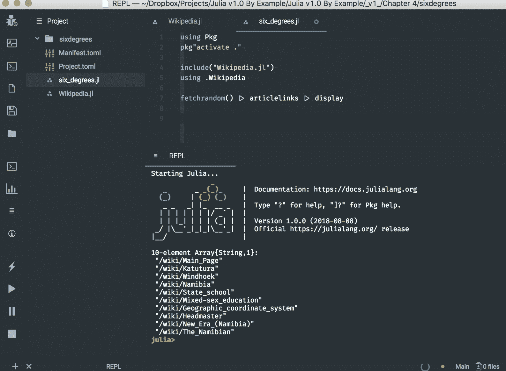
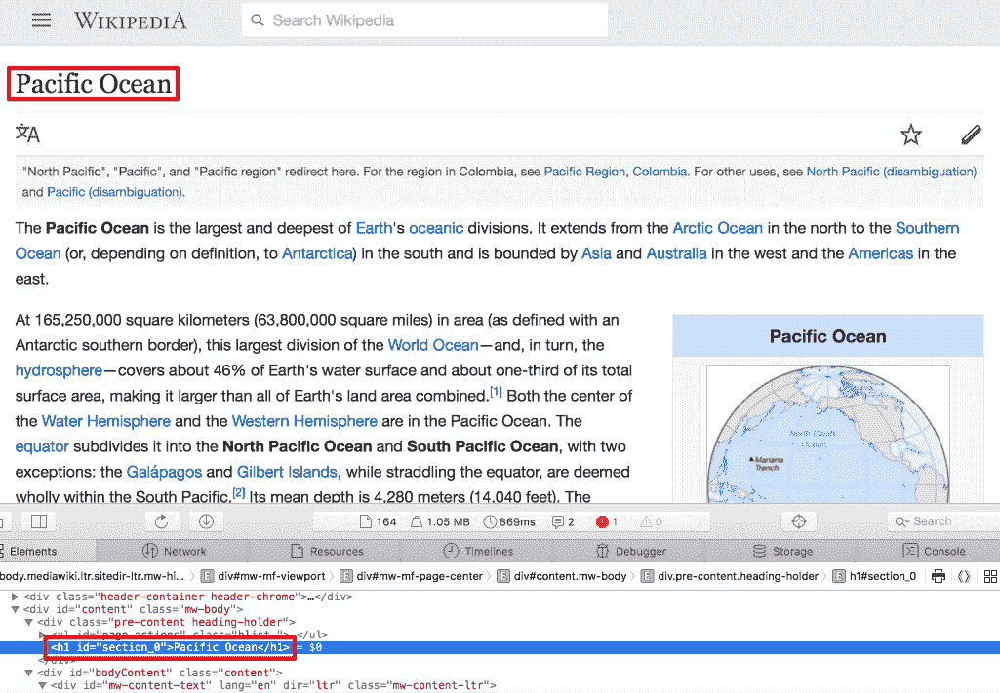
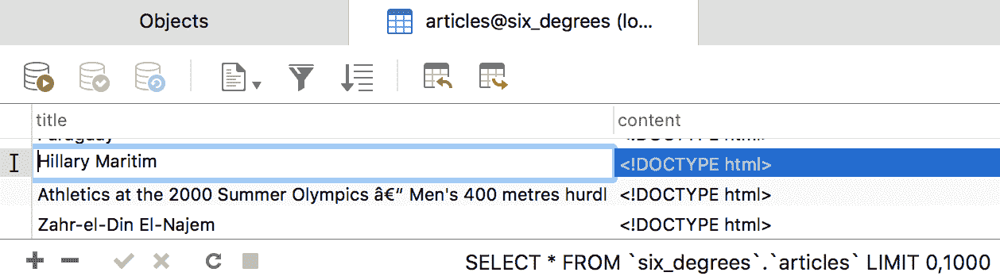

# 四、构建维基游戏网络爬虫

哇，[第三章](3184f173-ae3d-47f9-b7e9-f677947499f2.xhtml)，*设置维基游戏*，真是太棒了！为我们的维基百科游戏打下基础让我们真正学到了一门绝技。在快速复习了 web 和 web 页面是如何工作的之后，我们更深入地研究了语言的关键部分，研究了字典数据结构及其相应的数据类型、条件表达式、函数、异常处理，甚至非常方便的管道操作符(`|>`)。在这个过程中，我们构建了一个简短的脚本，使用两个强大的第三方包`HTTP`和`Gumbo`，从维基百科请求一个网页，将其解析为 HTML DOM，并从页面中提取所有内部链接。我们的脚本是一个适当的 Julia 项目的一部分，该项目使用`Pkg`来有效地管理依赖关系。

在这一章中，我们将继续开发我们的游戏，实现完整的工作流程和游戏性。即使你不是一个经验丰富的开发人员，也很容易想象，即使是这样一个简单的游戏，最终也会有多个逻辑部分。我们也许可以为维基百科页面爬虫设计一个模块，为游戏本身设计一个模块，为 UI 设计一个模块(我们将在下一章中创建的 web 应用)。将一个问题分解成更小的部分总是会带来更简单的解决方案。而且，在编写代码时尤其如此——拥有小的、专门的功能，按职责分组，使软件更容易推理、开发、扩展和维护。在这一章中，我们将学习 Julia 的代码结构，我们将讨论该语言的几个关键元素:类型系统、构造函数、方法和多重分派。

在本章中，我们将讨论以下主题:

*   *六度百科*，游戏玩法
*   使用模块组织我们的代码并从多个文件加载代码(所谓的 **mixin 行为**
*   类型和类型系统，它们是 Julia 的灵活性和性能的关键

*   构造函数，允许我们创建新类型实例的特殊函数
*   方法和多重分派，这是语言中最重要的一些方面
*   与关系数据库(特别是 MySQL)交互

我希望你已经准备好开始工作了。


# 技术要求

Julia 包生态系统正在不断发展，每天都有新的包版本发布。大多数时候这是好消息，因为新版本带来了新特性和错误修复。然而，由于许多软件包仍处于测试阶段(版本 0.x ),任何新版本都可能引入突破性的变化。因此，书中介绍的代码可能会停止工作。为了确保您的代码将产生与书中描述的相同的结果，建议使用相同的包版本。以下是本章中使用的外部软件包及其具体版本:

```
Cascadia@v0.4.0
Gumbo@v0.5.1
HTTP@v0.7.1
IJulia@v1.14.1
JSON@v0.20.0
MySQL@v0.7.0
```

为了安装软件包的特定版本，您需要运行:

```
pkg> add PackageName@vX.Y.Z 

```

例如:

```
pkg> add IJulia@v1.14.1
```

或者，你可以通过下载本章提供的 Project.toml 文件并使用`pkg>`实例化来安装所有使用的包，如下所示:

```
julia> download("https://raw.githubusercontent.com/PacktPublishing/Julia-Programming-Projects/master/Chapter04/Project.toml", "Project.toml")
pkg> activate . 
pkg> instantiate
```


# 维基百科的六度游戏

正如我们在前一章所看到的，维基百科游戏**六度游戏**是对*六度分离*理论概念的一种发挥，即所有生物(以及世界上几乎所有的东西)彼此之间的距离不超过六步。例如，一个朋友的朋友的朋友链最多可以通过六个步骤连接两个人。

对于我们自己的游戏，玩家的目标是链接任意两个给定的维基百科文章，通过六个或更少的其他维基百科页面。为了确保这个问题有一个解决方案(T21 的六度分离理论还没有被证明)，以及从我们的开始文章到结束文章确实有一条路径，我们将预抓取完整的路径。也就是说，我们将从一个随机的维基百科页面开始，这将是我们的起点，我们将通过许多页面链接到我们的目的地，即最终文章。选择下一个链接页面的算法是最简单的——我们只需选择任意一个内部链接。

为了让事情变得更有趣，我们还将提供一个难度设置——容易、中等或困难。这将影响起始页和结束页之间的距离。对于一个简单的游戏，他们将是两页之外，中等，四个，硬，六个。当然，这种逻辑并不超级严谨。是的，直觉上，我们可以说，相距较远的两篇文章，关联度会更小，更难链接。但是，也有可能玩家会找到一条更短的路径。不过，我们不担心这个。

如果玩家在最大数量的步骤中找不到解决方案，游戏还将允许他们返回。

最后，如果玩家放弃了，我们将添加一个选项来显示解决方案——从开始的文章到目的地的路径。

这听起来很令人兴奋——让我们写一些代码吧！


# 一些附加要求

为了完成本章，您需要以下内容:

*   一个工作的朱莉娅装置
*   互联网连接
*   文本编辑器


# 组织我们的代码

到目前为止，我们大部分时间都在 REPL 编码。最近，在前一章中，我们已经开始更多地依赖 IDE 来创建简短的 Julia 文件。

但是，随着我们技能的增长和我们开发越来越多的雄心勃勃的项目，我们项目的复杂性也会增加。反过来，这将导致更多的代码行、更多的逻辑和更多的文件——以及维护和理解所有这些的更多困难。正如著名的编码公理所说，代码被读的次数比它被写的次数多得多——所以我们需要相应地计划。

当涉及到代码组织时，每种语言都有自己的哲学和工具集。在 Julia 中，我们有文件、模块和包。接下来我们将了解所有这些。


# 使用模块驯服我们的代码

模块将相关的函数、变量和其他定义组合在一起。但是，它们不仅仅是组织单位——它们是可以理解为可变工作空间的语言结构。它们允许我们定义变量和函数，而不用担心名称冲突。Julia 的`Module`是该语言的基石之一——一个关键的结构和逻辑实体，有助于使代码更容易开发、理解和维护。我们将围绕模块来设计我们的游戏，从而很好地利用模块。

使用`module <<name>>...end`构造定义一个模块:

```
module MyModule 
# code here 
end
```

让我们开始一个新的 REPL 会议，看看几个例子。

假设我们想要编写一个函数来检索一个随机的维基百科页面——这是我们游戏的特性之一。我们可以称这个函数为`rand`。

正如你可能会怀疑的那样，创造随机的东西是一项非常普通的任务，所以我们不是第一个想到它的人。你可以自己去看。在 REPL 试试这个:

```
julia> rand 
rand (generic function with 56 methods) 
```

原来，已经定义了 56 个`rand`方法。

这将使我们难以添加自己的变体:

```
julia> function rand() 
           # code here 
       end 
error in method definition: function Base.rand must be explicitly imported to be extended 
```

我们尝试定义一个新的`rand`方法时出现了一个错误，因为它已经被定义和加载了。

在选择函数名时，很容易看到这会导致一个噩梦般的场景。如果所有已定义的名字都在同一个工作空间中，我们会陷入无尽的名字冲突，因为我们已经用完了函数和变量的相关名字。

Julia 的模块允许我们定义独立的工作空间，提供了一个将我们的变量和函数与其他人的分开的封装级别。通过使用模块，可以消除名称冲突。

模块在`module...end`语言结构中定义。试试这个例子(在 REPL)，我们在一个名为`MyModule`的模块中定义了我们的`rand`函数:

```
julia> module MyModule 

      function rand() 
           println("I'll get a random Wikipedia page") 
      end 

      end 
Main.MyModule 
MyModule—and within it, a function called rand. Here, MyModule effectively encapsulates the rand function, which no longer clashes with Julia's Base.rand.
```

正如您可以从它的全名中看到的，我们新创建的模块`Main.MyModule`实际上是添加在另一个名为`Main`的现有模块中。这个模块`Main`是默认模块，在这个模块中对 REPL 上执行的代码进行评估。

为了访问我们新定义的函数，我们需要在`MyModule`中引用它，通过*在*中打点:

```
julia> MyModule.rand() 
I'll get a random wikipedia page 
```


# 定义模块

由于模块被设计用于更大的代码库，它们不是 REPL 友好的。因为一旦它们被定义，我们就不能用额外的定义来扩展它们，我们被迫重新输入和重新定义整个模块，最好使用一个成熟的编辑器。

让我们创建一个新文件夹来存放我们的代码。在其中，我们想要创建一个名为`modules/`的新文件夹。然后，在`modules/`文件夹中，添加三个文件— `Letters.jl`、`Numbers.jl`和`module_name.jl`。

按照惯例，包含 Julia 代码的文件使用`.jl`文件扩展名。


# 与 Julia 进行富有成效的 REPL 会议

为什么不利用 Julia 的文件处理能力来建立这种文件结构呢？让我们来看看如何做到这一点，因为它将在我们的日常工作中派上用场。

记住，您可以在行首的 REPL 中键入`;`来触发 shell 模式。您的光标将从`julia>`变为`shell>`，以确认上下文的变化。在 IJulia/Jupyter 中，为了在 shell 模式下执行，必须在单元格中的代码前加上前缀`;`。

现在，我们可以执行以下操作:

```
shell> mkdir modules # create a new dir called "modules" 
shell> cd modules # switch to the "modules" directory 
```

不要忘记，Julia 的 shell 模式调用命令就像它们直接运行到操作系统终端一样——因此调用的二进制文件必须存在于该平台上。所有主流操作系统都支持`mkdir`和`cd`，所以我们在这里是安全的。但是，当涉及到创建文件时，我们就没那么幸运了——`touch`命令在 Windows 上不可用。不过没问题——在这种情况下，我们需要做的就是调用同名的 Julia 函数。这将以与平台无关的方式以编程方式创建文件:

```
julia> for f in ["Letters.jl", "Numbers.jl", "module_name.jl"] 
           touch(f) 
       end 
```

如果您想确保文件已经创建，请使用`readdir`:

```
julia> readdir() 
3-element Array{String,1}: 
 "Letters.jl" 
 "Numbers.jl" 
 "module_name.jl" 
```

请确保根据大小写准确命名文件。

```
Letters.jl in whatever default editor you have configured:
```

```
julia> edit("Letters.jl")  
```

如果缺省编辑器不是您最喜欢的 Julia IDE，您可以通过设置`JULIA_EDITOR`、`VISUAL`或`EDITOR`环境变量之一指向您选择的编辑器来更改它。例如，在我的 Mac 上，我可以使用以下命令来询问 Atom 编辑器的路径:

```
shell> which atom 
/usr/local/bin/atom 
```

然后，我可以如下设置`JULIA_EDITOR`:

```
julia> ENV["JULIA_EDITOR"] = "/usr/local/bin/atom" 
```

这三个变量的用途略有不同，但在这种情况下，设置其中任何一个都会产生相同的效果——更改当前 Julia 会话的默认编辑器。但是请记住，它们有不同的*权重*，其中`JULIA_EDITOR`优先于`VISUAL`，而`VISUAL`优先于`EDITOR`。


# 设置我们的模块

让我们从编辑`Letters.jl`开始，让它看起来像这样:

```
module Letters 

using Random 

export randstring 

const MY_NAME = "Letters" 

function rand() 
  Random.rand('A':'Z') 
end 

function randstring() 
  [rand() for _ in 1:10] |> join 
end 

include("module_name.jl") 

end 
```

这里，我们定义了一个名为`Letters`的模块。在其中，我们添加了一个`rand`函数，它使用 Julia 的`Random.rand`以一个`Char`的形式返回一个在`A`和`Z`之间的随机字母。接下来，我们添加了一个名为`Letters.randstring`的函数，它返回一个`10`随机字符的`String`。这个字符串是使用一个`Char[]`数组理解生成的(`_`变量名在 Julia 中是完全合法的，按照惯例，它指定一个其值没有被使用的变量),这个数组理解通过管道传递到`join`函数以返回字符串结果。

请注意，这是一种过于复杂的生成随机字符串的方式，因为 Julia 提供了`Random.randstring`函数。但是，在这一点上，利用每一个机会练习编写代码是很重要的，我只是不想浪费使用 Julia 的理解语法和管道操作符的机会。熟能生巧！

将我们的注意力转向第一行代码，我们声明我们将成为`using Random`——我们指示编译器通过`export randstring`将`randstring`公开。最后，我们还声明了一个名为`MY_NAME`的常量，它指向`Letters`字符串(这是模块本身的名称)。

模块的最后一行`include("module_name.jl")`，将`module_name.jl`的内容加载到`Letters`中。`include`函数通常用于交互式加载源代码，或者将文件合并到被分割成多个源文件的包中——我们很快就会看到这是如何工作的。

接下来，我们来编辑一下`Number.jl`。它将有一个类似的`rand`函数，在`1`和`1_000`之间返回一个随机的`Integer`。它导出`halfrand`，一个从`rand`获得一个值并除以`2`的函数。我们将除法的结果传递给`floor`函数，该函数会将其转换为最接近的小于或等于的值。而且，就像`Letters`一样，还包括`module_name.jl`:

```
module Numbers 

using Random

export halfrand

const MY_NAME = "Numbers"

function rand() 
  Random.rand(1:1_000) 
end
function halfrand() 
  floor(rand() / 2) 
end

include("module_name.jl")
end 
```

因此，对于这两个模块，我们定义了一个`MY_NAME`常量。我们将通过编辑`module_name.jl`文件来引用它，使它看起来像这样:

```
function myname() 
  MY_NAME 
end 
```

代码返回常量的相应值，这取决于我们包含`module_name.jl`文件的实际模块。这说明了 Julia 的 mixin 行为，其中包含的代码就像是直接写入包含文件一样。接下来我们将看到这是如何工作的。


# 引用模块

尽管我们现在才正式讨论模块，但我们一直都在使用它们。我们多次使用的`using`语句将模块名作为其参数。这是一个关键的语言构造，它告诉编译器将模块的定义带入当前范围。引用其他模块中定义的函数、变量和类型是 Julia 编程的一个常规部分——例如，访问第三方包提供的功能，围绕着通过`using`将其主模块纳入范围。但是，`using`并不是朱莉娅武器库中唯一的工具。我们还有一些命令可以使用，比如`import`、`include`和`export`。

指令允许我们引用其他模块导出的函数、变量、类型等等。这告诉 Julia 使模块的导出定义在当前工作区中可用。如果定义是由模块的作者导出的，我们可以调用它们，而不必在它们前面加上模块名(在函数名前面加上模块名代表完全限定名)。但是，要小心，因为这是一把双刃剑——如果两个使用的模块导出同名的函数，这些函数仍然必须使用完全限定名来访问——否则 Julia 将抛出一个异常，因为它不知道我们引用的是哪个函数。

至于`import`，有点类似，因为它也将另一个模块中的定义纳入范围。但是，它在两个重要方面有所不同。首先，调用`import MyModule`仍然需要用模块名作为定义的前缀，从而避免潜在的名称冲突。第二，如果我们想用新方法扩展其他模块中定义的函数，我们*有*来使用`import`。

另一方面，`include`在概念上是不同的。它用于在当前上下文中评估文件的内容(即，在当前模块的*全局*范围中)。正如我们已经看到的，这是一种通过提供类似 mixin 的行为来重用代码的方法。

事实上，包含的文件是在模块的全局范围内进行评估的，这是非常重要的一点。这意味着，即使我们在函数体中包含了一个文件，文件的内容也不会在函数的范围内进行计算，而是在模块的范围内进行计算。为了看到这一点，让我们在`modules/`文件夹中创建一个名为`testinclude.jl`的文件。编辑`testinclude.jl`并添加这行代码:

```
somevar = 10
```

现在，如果你在 REPL 或伊州运行下面的代码，你就会明白我的意思了:

```
julia> function testinclude() 
             include("testinclude.jl") 
             println(somevar) 
       end 

julia> testinclude() 
10 
```

显然，一切都很顺利。包含了`testinclude.jl`文件并定义了`somevar`变量。然而，`somevar`不是在`testinclude`函数中创建的，而是作为一个全局变量在`Main`模块中创建的。我们可以很容易地看到这一点，因为我们可以直接访问`somevar`变量:

```
julia> somevar 
10 
```

请记住这种行为，因为它会在全局范围内暴露变量，从而导致难以理解的错误。

最后，`export`被模块的作者用来公开定义，很像一个公共接口。正如我们已经看到的，导出的函数和变量由模块的用户通过`using`带入范围。


# 设置加载路径

让我们看一些例子来说明使用模块时的作用域规则。请打开一个新的朱莉娅·REPL。

在前面的章节中，我们已经多次看到了`using`语句，现在我们理解了它的作用——将另一个模块及其定义(变量、函数、类型)带入作用域。让我们用新创建的模块来尝试一下:

```
julia> using Letters 
ERROR: ArgumentError: Package Letters not found in current path: 
- Run `Pkg.add("Letters")` to install the Letters package. 
```

哎哟，例外！Julia 告诉我们它不知道在哪里可以找到`Letters`模块，并建议我们使用`Pkg.add("Letters")`来安装它。但是，因为`Pkg.add`只适用于注册的包，而且我们还没有将我们的模块发布到 Julia 的注册表中，所以这没有用。原来我们只需要告诉朱莉娅在哪里可以找到我们的代码。

当被要求通过`using`将模块引入范围时，Julia 检查一系列路径来查找相应的文件。这些查找路径存储在名为`LOAD_PATH`的`Vector`中，我们可以通过使用`push!`函数将`modules/`文件夹附加到这个集合中:

```
julia> push!(LOAD_PATH, "modules/") 
4-element Array{String,1}: 
 "@" 
 "@v#.#" 
 "@stdlib" 
 "modules/" 
```

您的输出可能会有所不同，但重要的是在调用了`push!`之后，`LOAD_PATH`集合现在有了一个额外的元素来指示到`modules/`文件夹的路径。

为了让 Julia 将一个模块的名称与其对应的文件匹配，*该文件必须具有与模块*完全相同的名称，加上扩展名`.jl`。一个文件可以包含多个模块，但是 Julia 不能通过文件名自动找到多余的模块。

关于模块本身的命名，约定是使用 CamelCase。因此，我们将在一个`Letters.jl`文件中定义一个名为`Letters`的模块，或者在一个名为`WebSockets.jl`的文件中定义一个`WebSockets`模块。


# 使用加载模块

既然我们已经将文件夹添加到了`LOAD_PATH`，我们就可以使用我们的模块了:

```
julia> using Letters 
```

此时，发生了两件事:

*   所有导出的定义现在都可以在 REPL 中直接调用，在我们的例子中是`randstring`
*   未导出的定义可通过*点入* `Letters`来访问——例如`Letters.rand()`

让我们来试试:

```
julia> randstring() # has been exported and is directly accessible 
"TCNXFLUOUU" 
julia> myname() # has not been exported so it's not available in the REPLERROR: UndefVarError: myname not defined
 julia> Letters.myname() # but we can access it under the Letters namespace 
"Letters"
 julia> Letters.rand() # does not conflict with Base.rand 
'L': ASCII/Unicode U+004c (category Lu: Letter, uppercase) 
```

我们可以看到一个模块用`names`函数输出了什么:

```
julia> names(Letters) 
2-element Array{Symbol,1}: 
 :Letters 
 :randstring 
```

如果我们想要得到一个模块的所有定义，无论是否导出，`names`需要第二个参数，`all`，一个`Boolean`:

```
julia> names(Letters, all = true) 
11-element Array{Symbol,1}: 
 # output truncated 
 :Letters 
 :MY_NAME 
 :eval 
 :myname 
 :rand 
 :randstring 
```

我们可以很容易地识别出我们定义的变量和函数。

例如，我们可以看到，`myname`没有被直接引入范围，因为它没有在`Letters`中导出。但是，事实证明，如果我们明确地告诉 Julia 使用该函数，我们仍然可以获得类似导出的行为:

```
julia> using Letters: myname
julia> myname() # we no longer need to "dot into" Letters.myname() 
"Letters" 
```

如果我们想将来自同一个模块的多个定义直接引入作用域，我们可以传递一个逗号分隔的名称列表:

```
julia> using Letters: myname, MY_NAME 
```


# 使用导入加载模块

现在，让我们使用`Numbers`来看看`import`函数的效果:

```
julia> import Numbers
julia> names(Numbers) 
2-element Array{Symbol,1}: 
 :Numbers 
 :halfrand
julia> halfrand() 
ERROR: UndefVarError: halfrand not defined 
```

这里我们可以看到，与`using`不同，`import`函数*没有将导出的定义纳入*的范围。

但是，显式导入定义本身会将它直接引入范围，而不管它是否被导出:

```
julia> import Numbers.halfrand, Numbers.MY_NAME 
```

此代码片段相当于以下内容:

```
julia> import Numbers: halfrand, MY_NAME 

julia> halfrand() 
271.0 
```


# 使用 include 加载模块

在开发独立应用时，操作`LOAD_PATH`非常有用，就像我们现在正在开发的这个。但是，这种方法不适用于包开发人员。对于这种情况——以及由于某种原因无法使用`LOAD_PATH`的所有情况——加载模块的常见方式是包含它们的文件。

例如，我们可以在 REPL 中包含我们的`Letters`模块，如下所示(开始新的 REPL 会话):

```
julia> include("modules/Letters.jl") 
Main.Letters 
```

这将在当前范围内读取并评估`modules/Letters.jl`文件的内容。因此，它将在我们当前的模块`Main`中定义`Letters`模块。但是，这还不够——此时，`Letters`中没有一个定义被导出:

```
julia> randstring() 
ERROR: UndefVarError: randstring not defined 
```

我们需要将它们纳入范围:

```
julia> using Letters 
ERROR: ArgumentError: Package Letters not found in current path: 
- Run `Pkg.add("Letters")` to install the Letters package.
```

又来了！刚刚发生了什么？当将`include`用于模块时，这是一个重要的区别。`Letters`模块，就像我们刚才说的，包含在当前模块`Main`中，所以我们需要相应地引用它:

```
julia> using Main.Letters 

julia> randstring() 
"QUPCDZKSAH" 
```

我们也可以通过使用相对的*路径*来引用这种嵌套的模块层次结构。例如，`.`点代表*当前模块*。因此，前面的`Main.Letters`嵌套可以表示为`.Letters`——这完全是一回事:

```
julia> using .Letters 
```

类似地，我们可以用两个点`..`来引用父模块，用三个点来引用父模块的父模块，依此类推。


# 嵌套模块

正如我们刚刚看到的，有时，我们程序的逻辑会规定一个模块必须是另一个模块的一部分，有效地嵌套它们。这是在开发我们自己的包时的偏好。组织一个包的最好方法是公开一个顶层模块，并在其中包含所有其他定义(函数、变量和其他模块)(以封装功能)。一个例子应该有助于澄清事情。

让我们做一个更改—在`Letters.jl`文件中，在`include("module_name.jl")`行下面，继续添加另一行— `include("Numbers.jl")`。

随着这一改变，`Numbers`模块将被有效地定义在`Letters`模块中。为了访问嵌套模块的功能，我们根据需要将*点进*:

```
julia> using .Letters 

julia> Letters.Numbers.halfrand() 
432.5 
```


# 设置我们游戏的架构

让我们为我们的游戏创建一个家——创建一个名为`sixdegrees/`的新文件夹。我们将使用它来组织我们的游戏文件。每个文件将包含一个模块，每个模块将封装相关的功能。我们将利用 Julia 的自动加载特性，这意味着每个模块的文件名将与模块名相同，加上`.jl`扩展名。

然而，一旦我们进入`sixdegrees/`文件夹，我们需要做的第一件事是通过`Pkg`初始化我们的项目——这样我们就可以使用 Julia 的依赖管理特性:

```
julia> mkdir("sixdegrees") 
"sixdegrees" 

julia> cd("sixdegrees/") 

julia> ] # go into pkg mode 

(v1.0) pkg> activate . 

(sixdegrees) pkg> 
```

我们将使用`HTTP`和`Gumbo`包，所以添加它们是个好主意，现在我们正在处理依赖关系:

```
(sixdegrees) pkg> add HTTP Gumbo 
```

我们需要的下一件事是维基百科相关代码的容器——一个封装了请求文章和提取内部 URL 的功能的模块。我们已经在[第 3 章](3184f173-ae3d-47f9-b7e9-f677947499f2.xhtml)、*设置维基游戏*中编写的`webcrawler.jl`文件中有了代码的第一次迭代。现在，我们需要做的就是创建一个`Wikipedia`模块，并用`webcrawler.jl`的内容填充它。

在`sixdegrees`文件夹中，创建一个名为`Wikipedia.jl`的新文件。使用以下代码进行设置:

```
module Wikipedia
using HTTP, Gumbo 

const RANDOM_PAGE_URL = "https://en.m.wikipedia.org/wiki/Special:Random" 

export fetchrandom, fetchpage, articlelinks 

function fetchpage(url) 
  response = HTTP.get(url) 
  if response.status == 200 && length(response.body) > 0 
    String(response.body) 
  else 
    "" 
  end 
end 

function extractlinks(elem, links = String[]) 
  if  isa(elem, HTMLElement) && tag(elem) == :a && in("href", collect(keys(attrs(elem)))) 
        url = getattr(elem, "href") 
        startswith(url, "/wiki/") && ! occursin(":", url) && push!(links, url) 
  end 
  for child in children(elem) 
    extractlinks(child, links) 
  end 
  unique(links) 
end 

function fetchrandom() 
  fetchpage(RANDOM_PAGE_URL) 
end 

function articlelinks(content) 
  if ! isempty(content) 
    dom = Gumbo.parsehtml(content) 

    links = extractlinks(dom.root) 
  end 
end

end
```

前面的代码应该看起来很熟悉，因为它与`webcrawler.jl`共享了很多逻辑。但是，有一些重要的变化。

首先，我们把所有东西都包装成一个`module`声明。

请注意一个非常重要的约定:在 Julia 中，我们不在模块内缩进代码，因为这会导致整个文件缩进，这会影响可读性。

在第三行，我们曾经链接到 Julia 的 Wikipedia 条目，现在我们定义了一个`String`常量`RANDOM_PAGE_URL`，它指向一个特殊的 Wikipedia URL，该 URL 返回一篇随机文章。此外，我们切换到维基百科网站的移动版本，如`en.m.`子域名所示。使用手机页面会让我们的生活更轻松，因为它们更简单，标记更少。

在`fetchpage`函数中，我们不再寻找`Content-Length`头，而是检查`response.body`属性的`length`。我们这样做是因为请求特殊的随机维基百科页面会执行重定向，在这个过程中，`Content-Length`头会被丢弃。

我们还替换了文件底部的一些逻辑。我们现在定义了另外两个函数:`fetchrandom`和`articlelinks`，而不是自动获取 Julia 的 Wikipedia 页面并将内部链接列表转储到屏幕上。这些函数将是`Wikipedia`模块的公共接口，它们是使用`export`语句公开的。`fetchrandom`函数确实如其名——它调用`fetchpage`函数并传入`RANDOM_PAGE_URL`常量，有效地获取一个随机的维基百科页面。`articlelinks`返回代表链接文章的字符串数组。

最后，我们删除了`LINKS`常量——应该避免使用全局变量。`extractlinks`函数已经被相应地重构，现在接受第二个参数`links`，一个`String`的`Vector`，用于在递归期间维护状态。


# 检查我们的代码

让我们确保，在这个重构之后，我们的代码仍然像预期的那样工作。Julia 自带单元测试功能，我们将在[第 11 章](8391f749-e95c-4ff9-ba40-d71c91b1d7fd.xhtml)、*创建 Julia 包*中讨论这些。现在，我们将使用传统的方法，手动运行代码并检查输出。

我们将在`sixdegrees/`文件夹中添加一个名为`six_degrees.jl`的新文件。看它的名字，你可以猜到它将是一个普通的 Julia 文件，而不是一个模块。我们将使用它来编排游戏的加载:

```
using Pkg 
pkg"activate ." 

include("Wikipedia.jl") 
using .Wikipedia 

fetchrandom() |> articlelinks |> display 
```

代码简单明了——我们使用`Pkg`来激活当前项目。然后，我们将`Wikipedia.jl`文件包含在当前模块中，然后我们要求编译器将`Wikipedia`模块纳入范围。最后，我们使用前面讨论的`fetchrandom`和`articlelinks`从一个随机的维基百科页面中检索文章 URL 列表并显示它。

是时候运行我们的代码了！在 REPL 中，确保将`cd`放入`sixdegrees`文件夹并执行:

```
julia> include("six_degrees.jl") 
21-element Array{String,1}: 
 "/wiki/Main_Page" 
 "/wiki/Arena" 
 "/wiki/Saskatoon,_Saskatchewan" 
 "/wiki/South_Saskatchewan_River" 
 "/wiki/New_York_Rangers" 
# ... output omitted ... #
Array{String,1} with entries that start with /wiki/.
```

或者，您可以在 Visual Studio 代码和 Atom 中使用运行代码或运行文件选项。下面是运行`six_degrees.jl`文件的 Atom:




# 构建我们的维基百科爬虫——第二次

我们的代码按预期运行，被重构并整齐地打包到一个模块中。然而，在继续之前，我希望我们再重构一件事。我不是特别喜欢我们的`extractlinks`功能。

首先，它天真地迭代了所有的 HTML 元素。例如，假设我们还想要提取页面的标题——每当我们想要处理不是链接的内容时，我们就必须再次迭代整个文档。这将是资源饥渴和运行缓慢。

其次，我们正在重新发明轮子。在[第三章](3184f173-ae3d-47f9-b7e9-f677947499f2.xhtml)、*设置维基游戏*中，我们说过 CSS 选择器是 DOM 解析的*通用语*。我们将从使用 CSS 选择器的简洁语法和专业库提供的底层优化中受益匪浅。

幸运的是，我们不需要为这种功能寻找太多。Julia 的`Pkg`系统提供了对`Cascadia`的访问，这是一个本地 CSS 选择器库。而且，它的伟大之处在于它与`Gumbo`携手合作。

为了使用 Cascadia，我们需要将它添加到我们项目的依赖列表中:

```
(sixdegrees) pkg> add Cascadia
```

接下来，告诉 Julia 我们将使用它——修改`Wikipedia.jl`,使第三行如下所示:

```
using HTTP, Gumbo, Cascadia
```

在`Cascadia`的帮助下，我们现在可以重构`extractlinks`函数，如下所示:

```
function extractlinks(elem) 
  map(eachmatch(Selector("a[href^='/wiki/']:not(a[href*=':'])"), elem)) do e 
    e.attributes["href"] 
  end |> unique 
end 
```

让我们仔细看看这里发生的一切。首先突出的是`Selector`函数。这是由`Cascadia`提供的，它构造了一个新的 CSS 选择器对象。作为唯一参数传递给它的字符串是一个 CSS 选择器，它读取所有具有一个属性的`href`元素，该属性的值以`'/wiki/'`开始，并且不包含列(`:`)。

`Cascadia`也导出了`eachmatch`方法。更准确地说，它*扩展了*现有的`Base.eachmatch`方法，我们之前已经在正则表达式中见过。这提供了一个熟悉的接口——我们将在本章后面的*方法*部分看到如何扩展方法。`Cascadia.eachmatch`函数返回一个与选择器匹配的`Vector`元素。

一旦我们检索到匹配元素的集合，我们就把它传递给`map`函数。`map`函数是函数编程工具箱中最常用的工具之一。它将一个函数`f`和一个集合`c`作为其参数，并通过将`f`应用于每个元素来转换集合`c`，返回修改后的集合作为结果。其定义如下:

```
map(f, c...) -> collection  
map function, it's true. But it is, in fact, the exact same function invocation, except with a more readable syntax, provided by Julia's blocks.
```


# 使用块

因为，在 Julia 中，函数是一级语言结构，它们可以像任何其他类型的变量一样被引用和操作。它们可以作为参数传递给其他函数，也可以作为其他函数调用的结果返回。以另一个函数作为自变量或返回另一个函数作为结果的函数称为**高阶函数**。

让我们看一个使用`map`的简单例子。我们将采用`Int`中的`Vector`，并且我们将对其集合中的每个元素应用一个使值翻倍的函数。您可以在新的 REPL 会议(或随附的 IJulia 笔记本)中继续学习:

```
julia> double(x) = x*2 
double (generic function with 1 method) 

julia> map(double, [1, 2, 3, 5, 8, 13]) 
6-element Array{Int64,1}: 
  2 
  4 
  6 
 10 
 16 
 26 
double function as the argument of the higher-order function map. As a result, we got back the Vector, which was passed as the second argument, but with all the elements doubled.
```

这些都很好，但是定义一个函数只是为了将它作为另一个函数的一次性参数是不方便的，而且有点浪费。正因如此，包括 Julia 在内的支持功能特性的编程语言通常都支持*匿名函数*。匿名函数，或称*λ*，是一个不绑定到标识符的函数定义。

我们可以重写前面的`map`调用来使用匿名函数，它是通过使用箭头`->`语法当场定义的:

```
julia> map(x -> x*2, [1, 2, 3, 5, 8, 13]) 
6-element Array{Int64,1}: 
  2 
  4 
  6 
 10 
 16 
 26
```

在定义`x -> x*2`中，箭头左边的`x`代表传入函数的参数，而`x*2`代表函数体。

太好了！我们不用单独定义`double`就达到了相同的最终结果。但是，如果我们需要使用更复杂的函数呢？例如，请注意以下内容:

```
julia> map(x -> 
           if x % 2 == 0 
                  x * 2 
           elseif x % 3 == 0 
                  x * 3 
           elseif x % 5 == 0 
                  x * 5 
           else 
                  x 
           end,  
      [1, 2, 3, 5, 8, 13]) 
```

这很难理解！因为 Julia 允许我们缩进代码，所以我们可以增强这个例子的可读性，使它更容易理解，但是结果仍然不太好。

因为这些情况经常发生，所以 Julia 提供了用于定义匿名函数的块语法。所有将另一个函数作为其第一个*参数的函数都可以与块语法一起使用。对这种调用的支持已经嵌入到语言中，所以您不需要做任何事情——只要函数是第一个位置参数，您的函数也会支持它。为了使用它，我们在调用高阶函数时跳过传递第一个参数——相反，在参序列表的末尾，在参数元组之外，我们添加了一个`do...end`块。在这个块中，我们定义了我们的 lambda。*

因此，我们可以将前面的示例重写如下:

```
map([1, 2, 3, 5, 8, 13]) do x 
       if x % 2 == 0 
              x * 2 
       elseif x % 3 == 0 
              x * 3 
       elseif x % 5 == 0 
              x * 5 
        else 
              x 
        end 
 end 
```

可读性强多了！


# 实现游戏性

我们的维基百科解析器现在非常健壮，添加了`Cascadia`大大简化了代码。是时候考虑实际的游戏玩法了。

最重要的是，游戏的核心是创造谜语——要求玩家找到一条从初始文章到结束文章的路径。我们之前决定，为了确保两篇文章之间的路径确实存在，我们将对所有页面进行预抓取，从第一页到最后一页。为了从一个页面导航到下一个页面，我们将简单地随机选取一个内部 URL。

我们还提到了包括难度设置。我们将使用常识性的假设，即开始文章和结束文章之间的链接越多，它们的主题就越不相关；因而，更难确定它们之间的路径，从而导致更具挑战性的水平。

好了，该编码了！首先，在`sixdegrees/`文件夹中创建一个新文件。将其命名为`Gameplay.jl`，复制并粘贴以下内容:

```
module Gameplay 

using ..Wikipedia 

export newgame 

const DIFFICULTY_EASY = 2 
const DIFFICULTY_MEDIUM = 4 
const DIFFICULTY_HARD = 6 

function newgame(difficulty = DIFFICULTY_HARD) 
  articles = [] 

  for i in 1:difficulty 
    article = if i == 1 
      fetchrandom() 
    else 
      rand(articles[i-1][:links]) |> Wikipedia.fetchpage 
    end 

article_data = Dict(:content => article, 
  :links => articlelinks(article)) 
    push!(articles, article_data) 
  end 

  articles 
end 

end 
```

`Gamplay.jl`定义了新的`module`并将`Wikipedia`纳入范围。在这里，您可以看到我们如何通过使用`..`在父作用域中引用`Wikipedia`模块。然后定义三个常量，将难度设置映射到分离度(名为`DIFFICULTY_EASY`、`DIFFICULTY_MEDIUM`和`DIFFICULTY_HARD`)。

然后定义一个函数`newgame`，它接受一个难度参数，默认设置为 hard。在函数体中，我们循环的次数等于难度值。在每次迭代中，我们检查当前的分离程度——如果是第一篇文章，我们调用`fetchrandom`开始爬行过程。如果不是第一篇文章，我们从之前抓取的文章的链接列表中随机选取一个链接(`rand(articles[i-1][:links])`)。然后我们将这个 URL 传递给`fetchpage`。当讨论条件语句时，我们了解到在 Julia `if/else`中，语句返回最后一次求值的表达式的值。我们可以看到它在这里得到了很好的利用，评估的结果存储在`article`变量中。

一旦我们获取了文章，我们就将其内容和链接存储在一个名为`article_data`的`Dict`中。并且，`article_data`被依次添加到`articles`数组中。在它的最后一行，`newgame`函数返回包含所有步骤的`articles`向量，从第一步到最后一步。这个函数也是导出的。

这并不难！但是，有一个小故障。如果您现在尝试运行代码，它将会失败。原因是文章链接是*相对*的。这意味着它们不是完全合格的 URLs 他们看起来像`/wiki/Some_Article_Title`。当`HTTP.jl`发出请求时，它需要包含完整的链接、协议和域名。不过不用担心，这在`Wikipedia.jl`中很容易修复。请将您的编辑器切换到`Wikipedia`模块，并将`const RANDOM_PAGE_URL`行替换为以下三行:

```
const PROTOCOL = "https://" 
const DOMAIN_NAME = "en.m.wikipedia.org" 
const RANDOM_PAGE_URL = PROTOCOL * DOMAIN_NAME * "/wiki/Special:Random" 
```

我们将随机页面 URL 分成几个部分——协议、域名和相对路径的其余部分。

在获取文章时，我们将使用类似的方法将相对 URL 转换为绝对 URL。为此，更改`fetchpage`的主体，并将其添加为第一行代码:

```
url = startswith(url, "/") ? PROTOCOL * DOMAIN_NAME * url : url 
```

在这里，我们检查`url`参数——如果它以`"/"`开头，这意味着它是一个相对 URL，因此我们需要将其转换为绝对 URL。正如你所看到的，我们使用了三元运算符。

我们的代码现在应该工作得很好，但是在我们的游戏中散布这个`PROTOCOL * DOMAIN_NAME * url`有点代码味道。让我们把它抽象成一个函数:

```
function buildurl(article_url) 
    PROTOCOL * DOMAIN_NAME * article_url 
end 
```

在编程术语中,*代码味道*指的是违反基本设计原则并对质量产生负面影响的实践。这不是一个*错误* *本身*，而是表明设计中的弱点，可能会增加将来出现错误或故障的风险。

`Wikipedia.jl`文件现在应该看起来像这样:

```
module Wikipedia 

using HTTP, Gumbo, Cascadia 

const PROTOCOL = "https://" 
const DOMAIN_NAME = "en.m.wikipedia.org" 
const RANDOM_PAGE_URL = PROTOCOL * DOMAIN_NAME * "/wiki/Special:Random" 

export fetchrandom, fetchpage, articlelinks 

function fetchpage(url) 
  url = startswith(url, "/") ? buildurl(url) : url 
  response = HTTP.get(url) 

  if response.status == 200 && length(response.body) > 0 
    String(response.body) 
  else  
    "" 
  end 
end 

function extractlinks(elem) 
  map(eachmatch(Selector("a[href^='/wiki/']:not(a[href*=':'])"), elem)) do e 
    e.attributes["href"] 
  end |> unique 
end 

function fetchrandom() 
  fetchpage(RANDOM_PAGE_URL) 
end 

function articlelinks(content) 
  if ! isempty(content) 
    dom = Gumbo.parsehtml(content) 

    links = extractlinks(dom.root) 
  end 
end 

function buildurl(article_url) 
  PROTOCOL * DOMAIN_NAME * article_url 
end 

end 
```


# 收尾

我们的游戏发展得很好。只剩下几块了。考虑到我们游戏的 UI，我们想要显示游戏的进程，指出玩家已经浏览的文章。为此，我们需要文章的标题。如果我们还可以包括一个图像，这将使我们的游戏更漂亮。

幸运的是，我们现在使用 CSS 选择器，所以提取缺失的数据应该是小菜一碟。我们需要做的就是将以下内容添加到`Wikipedia`模块中:

```
import Cascadia: matchFirst 

function extracttitle(elem) 
  matchFirst(Selector("#section_0"), elem) |> nodeText 
end 

function extractimage(elem) 
  e = matchFirst(Selector(".content a.image img"), elem) 
  isa(e, Void) ? "" : e.attributes["src"] 
end 
```

`extracttitle`和`extractimage`函数将从我们的文章页面中检索相应的内容。在这两种情况下，因为我们只想分别选择一个元素，即主页面标题和第一张图片，所以我们使用`Cascadia.matchFirst`。`matchFirst`功能没有被`Cascadia`公开——但是因为它非常有用，我们`import`了它。

`#section_0`选择器标识主页面标题，一个`<h1>`元素。而且，因为我们需要提取其`<h1>...</h1>`标签之间的文本，所以我们调用由`Cascadia`提供的`nodeText`方法。

你可以在下面的截图中看到，在 Safari 的 inspector 中显示了一个维基百科页面的主标题，如何识别所需的 HTML 元素，以及如何通过检查页面的源代码和相应的 DOM 元素来挑选它们的 CSS 选择器。HTML 属性`id="section_0"`对应于`#section_0` CSS 选择器:



至于`extractimage`，我们寻找主文章图像，由`".content a.image img"`选择器表示。因为不是所有的页面都有它，我们检查是否确实得到了一个有效的元素。如果页面没有图像，我们将得到一个名为`nothing`的`Nothing,`实例。这是一个重要的构造——`nothing`是`Nothing`的单例实例，表示没有对象，对应于其他语言中的`NULL`。如果我们得到了一个`img`元素，我们提取它的`src`属性的值，这是图像的 URL。

这是另一个维基百科截图，我在其中标记了我们的目标图像元素。这面旗帜是维基百科**澳洲**页面上的第一张图片——完全匹配:


接下来，我们可以扩展`Gameplay.newgame`函数，以处理新的函数和值。但是现在，这感觉不太对——太多的`Wikipedia`逻辑会泄漏到`Gameplay`模块中，耦合它们；危险的反模式。取而代之，让我们把数据的提取和文章的设置，`Dict`，全部由`Wikipedia`负责，完全封装逻辑。使`Gameplay.newgame`函数看起来如下面的代码所示:

```
function newgame(difficulty = DIFFICULTY_HARD) 
  articles = [] 

  for i in 1:difficulty  
    article = if i == 1 
                fetchrandom() 
              else  
                rand(articles[i-1][:links]) |> Wikipedia.fetchpage 
              end 
    push!(articles, articleinfo(article)) 
  end 

  articles 
end 
```

然后，更新`Wikipedia`模块，如下所示:

```
module Wikipedia 

using HTTP, Gumbo, Cascadia 
import Cascadia: matchFirst 

const PROTOCOL = "https://" 
const DOMAIN_NAME = "en.m.wikipedia.org" 
const RANDOM_PAGE_URL = PROTOCOL * DOMAIN_NAME * "/wiki/Special:Random" 

export fetchrandom, fetchpage, articleinfo 

function fetchpage(url) 
  url = startswith(url, "/") ? buildurl(url) : url 

  response = HTTP.get(url) 

  if response.status == 200 && length(response.body) > 0 
    String(response.body) 
  else  
    "" 
  end 
end 

function extractlinks(elem) 
  map(eachmatch(Selector("a[href^='/wiki/']:not(a[href*=':'])"), elem)) do e 
    e.attributes["href"] 
  end |> unique 
end 

function extracttitle(elem) 
  matchFirst(Selector("#section_0"), elem) |> nodeText 
end 

function extractimage(elem) 
  e = matchFirst(Selector(".content a.image img"), elem) 
  isa(e, Nothing) ? "" : e.attributes["src"] 
end 

function fetchrandom() 
  fetchpage(RANDOM_PAGE_URL) 
end 

function articledom(content) 
  if ! isempty(content) 
    return Gumbo.parsehtml(content) 
  end 

  error("Article content can not be parsed into DOM") 
end 

function articleinfo(content) 
  dom = articledom(content) 

  Dict( :content => content,  
        :links => extractlinks(dom.root),  
        :title => extracttitle(dom.root),  
        :image => extractimage(dom.root) 
  ) 
end 

function buildurl(article_url) 
  PROTOCOL * DOMAIN_NAME * article_url 
end 

end 
```

该文件有一些重要的变化。我们已经删除了`articlelinks`功能，并添加了`articleinfo`和`articledom`。新的`articledom`函数使用`Gumbo`解析 HTML 并生成 DOM，非常重要的是，它只被解析一次。我们不希望每次提取一种类型的元素时都将 HTML 解析成 DOM，如果我们保留前面的`articlelinks`函数就会出现这种情况。至于`articleinfo`，它负责创建一篇文章`Dict`，其中包含所有相关信息——内容、链接、标题和图片。

我们可以通过修改`six_degrees.jl`文件来测试我们的代码，如下所示:

```
using Pkg 
pkg"activate ." 

include("Wikipedia.jl") 
include("Gameplay.jl") 

using .Wikipedia, .Gameplay 

for article in newgame(Gameplay.DIFFICULTY_EASY) 
  println(article[:title]) 
end 
```

我们开始一个新游戏，它包含两篇文章(`Gameplay.DIFFICULTY_EASY`)，我们显示每篇文章的标题。我们可以通过`julia> include("six_degrees.jl")`在 REPL 会话中运行它，或者简单地在 Visual Studio 代码或 Atom 中运行该文件来查看它的运行情况。这是在 REPL:

```
julia> include("six_degrees.jl") 
Miracle Bell 
Indie pop  
```


# 还有一点

我们的测试运行表明，我们的难度设置有一个小故障。我们应该在起点之后抓取一定数量的文章*。我们的第一篇文章不算数。这个超级好修。在`Gameplay.newgame`中，我们需要用`for i in 1:difficulty+1`代替`for i in 1:difficulty`(注意末尾的`+1`)。现在，如果我们再试一次，它会像预期的那样工作:*

```
julia> include("six_degrees.jl") 
John O'Brien (Australian politician) 
Harlaxton, Queensland 
Ballard, Queensland 
```


# 了解 Julia 的类型系统

我们的游戏非常棒，但是有一点我们可以改进——将我们的文章信息存储为一个`Dict`。朱莉娅的字典非常灵活和强大，但它们并不是在所有情况下都适用。`Dict`是一种通用的数据结构，针对搜索、删除和插入操作进行了优化。这里不需要这些——我们的文章有固定的结构，包含一旦创建就不会改变的数据。这是对象和面向对象编程的完美用例。看来是时候学习一下类型了。

Julia 的类型系统是语言的面包和黄油——它无处不在，定义了语言的语法，是 Julia 的性能和灵活性背后的驱动力。Julia 的类型系统是动态的，这意味着直到运行时，当程序操作的实际值可用时，才知道什么是类型。然而，通过使用类型注释，我们可以从静态类型的优点中获益——表明某些值是特定的类型。这可以极大地提高代码的性能，同时增强可读性并简化调试。

谈论朱莉娅而不谈类型是不可能的。果然，到目前为止我们已经看到了许多原始类型— `Integer`、`Float64`、`Boolean`、`Char`等等。在学习各种数据结构时，我们也接触了类型，比如`Array`、`Dict,`或 tuple。这些都是语言中内置的，但事实证明，Julia 让我们创建自己的语言变得非常容易。


# 定义我们自己的类型

Julia 支持两种类型——基本类型和复合类型。原始类型是一种具体类型，其数据由普通的旧位组成。复合类型是命名字段的集合，其实例可被视为单个值。在许多语言中，复合类型是唯一一种用户可定义的类型，但是 Julia 也允许我们声明自己的基本类型，而不是只提供一组固定的内置类型。

我们不会在这里谈论定义基本类型，但是你可以在 https://docs.julialang.org/en/v1/manual/types/的官方文档中读到更多关于它们的内容。

为了表示我们的文章，我们最好使用不可变的复合类型。一旦我们的文章对象被创建，它的数据不会改变。不可变的复合类型由关键字`struct`引入，后跟一组字段名:

```
struct Article 
    content 
    links 
    title 
    image 
end 
```

因为我们没有为字段提供类型信息——也就是说，我们没有告诉 Julia 我们希望每个字段是什么类型——它们将默认为 any，允许保存任何类型的值。但是，因为我们已经知道我们想要存储什么数据，我们将从约束每个字段的类型中受益匪浅。`::`操作符可用于给表达式和变量附加类型注释。可以理解为*是*的一个实例。因此，我们将`Article`类型定义如下:

```
struct Article 
    content::String 
    links::Vector{String} 
    title::String 
    image::String 
end 
```

所有字段都是`String`类型，除了`links`，它是`String`的一维`Array`，也称为`Vector{String}`。

类型注释可以提供重要的性能优势，同时还消除了一整类与类型相关的错误。


# 构造类型

通过像函数一样应用`Article`类型名来创建`Article`类型的新对象。参数是其字段的值:

```
julia> julia = Article( 
           "Julia is a high-level dynamic programming language", 
           ["/wiki/Jeff_Bezanson", "/wiki/Stefan_Karpinski",  
            "/wiki/Viral_B._Shah", "/wiki/Alan_Edelman"], 
           "Julia (programming language)", 
           "/220px-Julia_prog_language.svg.png" 
       ) 
Article("Julia is a high-level dynamic programming language", ["/wiki/Jeff_Bezanson", "/wiki/Stefan_Karpinski", "/wiki/Viral_B._Shah", "/wiki/Alan_Edelman"], "Julia (programming language)", "/220px-Julia_prog_language.svg.png") 
```

可以使用标准的*点符号*访问新创建对象的字段:

```
julia> julia.title 
"Julia (programming language)" 
```

因为我们声明我们的类型是不可变的，所以值是只读的，所以它们不能被改变:

```
julia> julia.title = "The best programming language, period" 
ERROR: type Article is immutable 
```

我们的`Article`类型定义不允许我们改变`julia.title`属性。但是，根据 Julia 的官方文档，不变性不应该被忽略，因为它确实具有相当大的优势:

*   可以更有效率。一些结构可以有效地打包到数组中，在某些情况下，编译器可以完全避免分配不可变对象。
*   不可能违反由类型的构造函数提供的不变量。
*   使用不可变对象的代码更容易推理。

但是，这不是故事的全部。不可变对象可以具有引用可变对象的字段，例如指向`Array{String, 1}`的`links`。这个数组仍然是可变的:

```
julia> push!(julia.links, "/wiki/Multiple_dispatch") 
5-element Array{String,1}: 
 "/wiki/Jeff_Bezanson" 
 "/wiki/Stefan_Karpinski" 
 "/wiki/Viral_B._Shah" 
 "/wiki/Alan_Edelman" 
 "/wiki/Multiple_dispatch" 
```

我们可以看到，通过多推送一个指向底层集合的 URL 来改变`links`属性并没有错误。如果一个属性指向一个可变类型，只要它的类型保持不变，该类型就可以发生变异:

```
julia> julia.links = [1, 2, 3] 
MethodError: Cannot `convert` an object of type Int64 to an object of type String 
```

我们不允许更改`links`字段的类型——Julia 试图适应并将我们提供的值从`Int`转换为`String`,但是失败了。


# 可变复合类型

构造可变的复合类型也是可能的(也同样容易)。我们唯一需要做的就是使用`mutable struct`语句，而不仅仅是`struct`:

```
julia> mutable struct Player 
           username::String 
           score::Int 
       end 
```

我们的`Player`对象应该是可变的，因为我们需要在每次游戏后更新`score`属性:

```
julia> me = Player("adrian", 0) 
Player("adrian", 0) 

julia> me.score += 10 
10 

julia> me 
Player("adrian", 10) 
```


# 类型层次结构和继承

像所有实现 OOP 特性的编程语言一样，Julia 允许开发人员定义丰富且富有表现力的类型层次结构。然而，与大多数 OOP 语言不同，有一个非常重要的区别— *在 Julia* 中，只有层次结构中的最终(上层)类型可以被实例化。它的所有父节点只是类型图中的节点，我们不能创建它们的实例。它们是*抽象类型*，使用`abstract`类型关键字定义:

```
julia> abstract type Person end 
```

我们可以使用`<:`操作符来表示一个类型是现有*父*的子类型:

```
julia> abstract type Mammal end 
julia> abstract type Person <: Mammal end 
julia> mutable struct Player <: Person 
           username::String 
           score::Int 
       end 
```

或者，在另一个例子中，这是 Julia 的数字类型层次结构:

```
abstract type Number end 
abstract type Real     <: Number end 
abstract type AbstractFloat <: Real end 
abstract type Integer  <: Real end 
abstract type Signed   <: Integer end 
abstract type Unsigned <: Integer end 
```

超类型不能被实例化的事实看起来有局限性，但是它们有一个非常强大的角色。我们可以定义将超类型作为参数的函数，实际上接受它的所有子类型:

```
julia> struct User <: Person 
           username::String 
           password::String 
       end 

julia> sam = User("sam", "password") 
User("sam", "password") 

julia> function getusername(p::Person) 
           p.username 
      end 

julia> getusername(me) 
"adrian" 

julia> getusername(sam) 
"sam" 

julia> getusername(julia) 
ERROR: MethodError: no method matching getusername(::Article) 
Closest candidates are: 
  getusername(::Person) at REPL[25]:2 
```

在这里，我们可以看到如何定义一个`getusername`函数，它接受一个(抽象)类型的参数`Person`。由于`User`和`Player`都是`Person`的子类型，它们的实例作为参数被接受。


# 类型联合

有时，我们可能希望允许一个函数接受一组不一定属于同一类型层次结构的类型。当然，我们可以允许函数接受任何类型，但是根据用例，可能需要将参数严格限制在定义明确的类型子集内。对于这种情况，Julia 提供了*型接头*。

类型联合是一种特殊的抽象类型，它包括其任何参数类型的所有实例作为对象，使用特殊的`Union`函数构造:

```
julia> GameEntity = Union{Person,Article} 
Union{Article, Person} 
```

在这里，我们定义了一个新的类型 union，`GameEntity`，它包括两种类型——`Person`和`Article`。现在，我们可以定义知道如何处理`GameEntities`的函数:

```
julia> function entityname(e::GameEntity) 
           isa(e, Person) ? e.username : e.title 
       end 
entityname (generic function with 1 method) 

julia> entityname(julia) 
"Julia (programming language)" 

julia> entityname(me) 
"adrian" 
```


# 使用文章类型

我们可以重构我们的代码来消除通用的`Dict`数据结构，并用专门的`Article`复合类型来表示我们的文章。

让我们在`sixdegrees/`工作文件夹中创建一个新文件，并将其命名为`Articles.jl`。通过输入相应的`module`声明来编辑文件。然后，添加我们类型的定义并`export`它:

```
module Articles 

export Article 

struct Article 
  content::String 
  links::Vector{String} 
  title::String 
  image::String 
end 

end 
```

我们本可以将`Article`类型定义添加到`Wikipedia.jl`文件中，但是这很可能会增加，最好将它们分开。

另一件要注意的事情是，`module`和`type`都是加载在相同范围内的 Julia 实体。出于这个原因，我们不能同时使用`Article`和`type`这两个名字——我们会以名字冲突而告终。然而，复数名称`Articles`是模块的一个好名字，因为它将封装处理*文章*的逻辑，而`Article`类型表示一个*文章*实体——因此是单数形式。

然而，由于概念上一个`Article`对象引用了一个维基百科页面，它应该是`Wikipedia`名称空间的一部分。这很简单，我们只需要将它包含到`Wikipedia`模块中。在`import Cascadia: matchFirst`行后添加以下内容:

```
include("Articles.jl") 
using .Articles 
```

我们包含了`Articles`模块文件并将其纳入范围。

接下来，在同一个`Wikipedia.jl`文件中，我们需要修改`articleinfo`函数。请确保内容如下:

```
function articleinfo(content) 
  dom = articledom(content) 
  Article(content,  
          extractlinks(dom.root),  
          extracttitle(dom.root),  
          extractimage(dom.root)) 
end 
```

我们现在实例化了一个`Article`的实例，而不是创建一个通用的`Dict`对象。

我们还需要对`Gameplay.jl`做一些修改，以使用`Article`类型代替`Dict`。它现在应该是这样的:

```
module Gameplay 

using ..Wikipedia, ..Wikipedia.Articles 

export newgame 

const DIFFICULTY_EASY = 2 
const DIFFICULTY_MEDIUM = 4 
const DIFFICULTY_HARD = 6 

function newgame(difficulty = DIFFICULTY_HARD) 
  articles = Article[] 

  for i in 1:difficulty+1 
    article = if i == 1 
                fetchrandom() 
              else  
                rand(articles[i-1].links) |> fetchpage 
              end 
    push!(articles, articleinfo(article)) 
  end 

  articles 
end 

end 
```

请注意，在第三行，我们将`Wikipedia.Articles`纳入范围。然后，在`newgame`函数中，我们将`articles`数组初始化为`Vector{Article}`类型。然后，我们更新`for`循环中的代码来处理`Article`对象— `rand(articles[i-1].links)`。

最后一个变化在`six_degrees.jl`。由于`newgame`现在返回一个`Article`对象的向量，而不是一个`Dict`，我们通过访问`title`字段来打印标题:

```
using Pkg 
pkg"activate ." 

include("Wikipedia.jl") 
include("Gameplay.jl") 

using .Wikipedia, .Gameplay 

articles = newgame(Gameplay.DIFFICULTY_EASY) 

for article in articles 
  println(article.title) 
end 
```

新的测试运行应该确认所有的工作都如预期的那样(你的输出将会不同，因为，记住，我们是随机抽取的文章):

```
julia> include("six_degrees.jl") 
Sonpur Bazari 
Bengali language 
Diacritic 
```


# 内部构造函数

外部构造函数(我们调用`type`作为一个函数)是一个默认的构造函数，我们以正确的顺序为所有的字段提供值——并得到相应类型的一个实例。但是，如果我们想提供额外的构造函数，可能会强加某些约束，执行验证，或者只是更加用户友好呢？为此，Julia 提供了*内部构造函数*。我为它们找到了一个很好的用例。

我不太喜欢我们的`Article`构造函数——它需要太多的参数，这些参数需要以正确的顺序传递。很难记住如何实例化它。我们之前已经了解了关键字参数——如果能提供一个接受关键字参数的替代构造函数，那就太棒了。我们需要内部构造函数。

内部构造函数与外部构造函数非常相似，但有两个主要区别:

*   它们是在类型声明的块内声明的，而不是像普通方法那样在块外声明。
*   他们可以访问一个名为`new`的特殊本地函数，该函数可以创建相同类型的对象。

另一方面，外部构造函数有一个明显的限制(根据设计)——我们可以创建任意多的构造函数，但是它们只能通过调用现有的内部构造函数来实例化对象(它们没有访问`new`函数的权限)。这样，如果我们定义实现一些业务逻辑约束的内部构造函数， *Julia 保证外部构造函数不能绕过它们*。

我们带有关键字参数的内部构造函数如下所示:

```
Article(; content = "", links = String[], title = "", image = "") = new(content, links, title, image) 
```

注意`;`的使用，它将空的位置参序列表与关键字参序列表分开。

这个构造函数允许我们使用关键字参数实例化`Article`对象，我们可以以任何顺序提供关键字参数:

```
julia = Article( 
          title = "Julia (programming language)", 
          content = "Julia is a high-level dynamic programming language", 
          links = ["/wiki/Jeff_Bezanson", "/wiki/Stefan_Karpinski",  
                  "/wiki/Viral_B._Shah", "/wiki/Alan_Edelman"], 
          image = "/220px-Julia_prog_language.svg.png" 
        ) 
```

然而，有一个小问题。当我们不提供任何内部构造函数时，Julia 会提供默认的构造函数。但是，如果定义了任何内部构造函数，就不再提供默认的构造函数方法了——假设我们已经为自己提供了所有必需的内部构造函数。在这种情况下，如果我们想获得带有位置参数的默认构造函数，我们还必须自己将其定义为内部构造函数:

```
Article(content, links, title, image) = new(content, links, title, image) 
```

`Articles.jl`文件的最终版本应该如下所示，带有两个内部构造函数:

```
module Articles 

export Article 

struct Article 
  content::String 
  links::Vector{String} 
  title::String 
  image::String 

  Article(; content = "", links = String[], title = "", image = "") = new(content, links, title, image) 
  Article(content, links, title, image) = new(content, links, title, image) end 

end 
```

值得指出的是，在这种情况下，我们的关键字构造函数同样可以作为外部构造函数添加，并在`struct...end`主体之外定义。您使用哪种构造函数是一个架构决策，必须根据具体情况来决定，要考虑内部和外部构造函数之间的差异。


# 方法

如果你来自 OOP 背景，你可能已经注意到了我们讨论类型的一个非常有趣的方面。与其他语言不同，Julia 中的对象不定义行为。也就是说，Julia 的类型只定义字段(属性)而不封装函数。

原因是朱丽亚实现了*多重分派* *、*语言的一个显著特征。

官方文档中对多次派遣的解释如下:

当一个函数被应用时，选择执行哪个方法被称为分派。Julia 允许调度进程根据给定的参数数量和所有函数参数的类型来选择调用哪个函数的方法。这不同于传统的面向对象语言，在传统的面向对象语言中，调度只基于第一个参数[ `...` ]。使用函数的所有参数来选择应该调用哪个方法，而不仅仅是第一个方法，这就是所谓的多重分派。多重分派对数学代码特别有用，在数学代码中，人为地认为*的操作属于*一个参数而不是其他参数是没有意义的。

Julia 允许我们定义函数，为参数类型的特定组合提供特定的行为。函数的一种可能行为的定义被称为**方法**。方法定义的签名可以被注释以指示参数的类型，以及它们的数量，并且可以提供不止一个方法定义。举个例子会有帮助。

假设我们有先前定义的`Player`类型，如下所示:

```
julia> mutable struct Player 
           username::String 
           score::Int 
       end 
```

而在这里，我们看到了相应的`getscore`功能:

```
julia> function getscore(p) 
           p.score 
       end 
getscore (generic function with 1 method) 
```

到目前为止，一切顺利。但是，随着我们的游戏取得令人难以置信的成功，我们最终可能会增加一个应用商店来提供应用内购买。这将导致我们也定义一个`Customer`类型，它可能有一个同名的`credit_score`字段，存储他们的信用评分:

```
julia> mutable struct Customer 
           name::String 
           total_purchase_value::Float64 
           credit_score::Float64 
       end 
```

当然，我们需要一个相应的`getscore`函数:

```
julia> function getscore(c) 
           c.credit_score 
      end 
getscore (generic function with 1 method) 
```

朱莉娅怎么知道该用哪个函数呢？不会的。因为两个函数都被定义为接受任何类型的参数，所以最后定义的函数会覆盖前一个函数。我们需要将两个`getscore`声明专门化为它们的参数类型:

```
julia> function getscore(p::Player) 
           p.score 
       end 
getscore (generic function with 1 method) 

julia> function getscore(c::Customer) 
           c.credit_score 
       end 
getscore (generic function with 2 methods) 
```

如果仔细观察每个函数声明的输出，您会发现一些有趣的东西。在`getscore(p::Player)`定义之后，说的是`getscore (generic function with 1 method)`。但是，定义了`getscore(c::Customer)`之后，显示的是`getscore (generic function with 2 methods)`。所以现在，我们为`getscore`函数定义了两个方法，每个方法都专注于它的参数类型。

但是，如果我们添加以下内容呢？

```
julia> function getscore(t::Union{Player,Customer}) 
           isa(t, Player) ? t.score : t.credit_score 
       end 
getscore (generic function with 3 methods) 
```

或者，注意我们可能添加的以下内容:

```
julia> function getscore(s) 
            if in(:score, fieldnames(typeof(s))) 
            s.score 
       elseif in(:credit_score, fieldnames(typeof(s))) 
            s.credit_score 
       else 
            error("$(typeof(s)) does not have a score property") 
       end 
end 
getscore (generic function with 4 methods) 
```

你能猜出用`Player`、`Customer`和`Article`对象调用`getscore`时会用到哪些方法吗？我给你一个提示:当一个函数应用于一组特定的参数时，会调用适用于这些参数的最具体的方法。

如果我们想知道一组给定的参数调用了哪个方法，我们可以使用`@which`:

```
julia> me = Player("adrian", 10) 
Player("adrian", 10) 

julia> @which getscore(me) 
getscore(p::Player) in Main at REPL[58]:2
```

对于`Customer`类型也是如此:

```
julia> sam = Customer("Sam", 72.95, 100) 
Customer("Sam", 72.95, 100.0) 

julia> @which getscore(sam) 
getscore(c::Customer) in Main at REPL[59]:2 
```

我们可以看到最专门化的方法是如何被调用的— `getscore(t::Union{Player,Customer})`，它更通用，实际上从未被使用过。

但是，下面呢？

```
julia> @which getscore(julia) 
getscore(s) in Main at REPL[61]:2 
```

传递一个`Article`类型将调用`getscore`的最后一个定义，这个定义接受`Any`类型的参数:

```
julia> getscore(julia) 
ERROR: Article does not have a score property 
```

由于`Article`类型没有`score`或`credit_score`属性，我们定义的`ErrorException`被抛出。

要找出为一个函数定义了什么方法，使用`methods()`:

```
julia> methods(getscore) 
# 4 methods for generic function "get_score": 
getscore(c::Customer) in Main at REPL[59]:2 
getscore(p::Player) in Main at REPL[58]:2 
getscore(t::Union{Customer, Player}) in Main at REPL[60]:2 
getscore(s) in Main at REPL[61]:2 
```


# 使用关系数据库

我们的网络爬虫非常高效——使用 CSS 选择器非常有效。但是，就像现在这样，如果我们在不同的游戏会话中结束了相同的维基百科文章，我们将不得不多次获取它、解析它并提取它的内容。这是一个耗时且耗费资源的操作——更重要的是，如果我们只是在第一次获取文章信息时存储它，我们就可以很容易地消除这个操作。

我们可以使用 Julia 的序列化特性，我们已经看到了，但是由于我们正在构建一个相当复杂的游戏，我们将受益于添加一个数据库后端。除了存储文章的数据，我们还可以保存关于玩家、分数、偏好等等的信息。

我们已经看到了如何与 MongoDB 交互。不过，在这种情况下，关系数据库是更好的选择，因为我们将处理一系列相关的实体:文章、游戏(引用文章)、玩家(引用游戏)等等。

Julia 的包生态系统为与关系数据库交互提供了广泛的选择，从通用 ODBC 和 JDBC 库到主要后端的专用包——MySQL/Maria db、SQLite 和 Postgres，仅举几例。对于我们的游戏，我们将使用 MySQL。如果您的系统上还没有安装 MySQL，请按照 https://dev.mysql.com/downloads/mysql/的说明进行操作。或者，如果你使用 Docker，你可以从 https://hub.docker.com/r/library/mysql/获得官方的 MySQL Docker 图片。

在 Julia 这边，为了增加对 MySQL 的支持，`(sixdegrees) pkg>add MySQL`是我们所需要的。在添加 MySQL 之前，确保您在`sixdegrees/`项目中。您可以通过查看`pkg>`光标的前缀来确认这一点；应该是这样的:`(sixdegrees) pkg>`。如果不是这样，只需执行`pkg> activate .`，同时确保您在`sixdegrees/`文件夹中。


# 添加 MySQL 支持

当使用 SQL 数据库时，一个好的做法是抽象出与数据库相关的逻辑，并避免将所有代码库与 SQL 字符串和特定于数据库的命令混为一谈。它将使我们的代码更加可预测和可管理，并且如果我们需要改变或升级数据库系统，它将提供一个安全的抽象层次。我非常喜欢使用 ORM 系统，但是在这种情况下，作为一个学习设备，我们将自己添加这个功能。


# 连接到数据库

首先，让我们指示我们的应用连接到我们的 MySQL 数据库和从它断开连接。让我们通过在相应的文件中添加一个新的`Database`模块来扩展我们的游戏:

```
module Database 

using MySQL 

const HOST = "localhost" 
const USER = "root" 
const PASS = "" 
const DB = "six_degrees" 

const CONN = MySQL.connect(HOST, USER, PASS, db = DB) 

export CONN 

disconnect() = MySQL.disconnect(CONN) 

atexit(disconnect) 

end 
HOST, USER, and PASS constants with your correct MySQL connection info. Also, please don't forget to create a new, empty database called six_degrees—otherwise the connection will fail. I suggest using utf8 for the encoding and utf8_general_ci for the collation, in order to accommodate all the possible characters we might get from Wikipedia.
```

调用`MySQL.connect`返回一个连接对象。我们需要它来与数据库交互，所以我们将通过`CONN`常量来引用它:

```
julia> Main.Database.CONN 
MySQL Connection 
------------ 
Host: localhost 
Port: 3306 
User: root 
DB:   six_degrees 
```

因为我们代码的各个部分将访问这个连接对象，以便对数据库执行查询，所以我们`export`它。同样重要的是，我们需要建立一些清理机制，以便在完成后自动断开与数据库的连接。我们已经定义了一个可以手动调用的`disconnect`函数。但是，如果我们确保自动调用清理功能，会更安全。Julia 提供了一个`atexit`函数，它注册了一个在进程退出时调用的零参数函数`f`。按照**后进先出** ( **后进先出**)的顺序调用`atexit`挂钩。


# 设置我们的文章模块

下一步是向`Article`模块添加一些函数，以支持数据库持久性和检索功能。因为它需要访问我们的 DB 连接对象，所以让它访问`Database`模块。我们还想使用`MySQL`函数。所以，在`export Article`行下面，加上`using..Database, MySQL`。

接下来，我们将添加一个`createtable`方法。这将是一个一次性的功能，将创建相应的数据库表。我们使用这个而不是仅仅在 MySQL 客户端输入`CREATE TABLE`查询，以便有一个一致的和可重复的方式来(重新)创建表。总的来说，我更喜欢使用成熟的数据库迁移库，但是现在，最好保持简单(你可以在 https://en.wikipedia.org/wiki/Schema_migration[阅读模式迁移)。](https://en.wikipedia.org/wiki/Schema_migration)

事不宜迟，下面是我们的函数:

```
function createtable() 
  sql = """ 
    CREATE TABLE `articles` ( 
      `title` varchar(1000), 
      `content` text, 
      `links` text, 
      `image` varchar(500), 
      `url` varchar(500), 
      UNIQUE KEY `url` (`url`) 
    ) ENGINE=InnoDB DEFAULT CHARSET=utf8 
  """ 

  MySQL.execute!(CONN, sql) 
end 
```

这里，我们定义了一个`sql`变量，它以`String`的形式引用 MySQL `CREATE TABLE`查询。该表将有四列，对应于我们的`Article`类型的四个字段。然后，还有第五列`url`，它将存储文章的维基百科 URL。我们将通过 URL 来识别文章——因此，我们在`url`列添加了一个唯一的索引。

在函数的最后，我们将查询字符串传递给`MySQL.execute!`以针对 DB 连接运行。请将`createtable`定义附加到`Articles`模块的末尾(模块内，结束`end`上方)。

现在，让我们看看它是如何工作的。在`sixdegrees/`文件夹中打开一个新的 REPL 会话，并运行以下命令:

```
julia> using Pkg 
julia> pkg"activate ." 
julia> include("Database.jl") 
julia> include("Articles.jl") 
julia> using .Articles 
julia> Articles.createtable() 
```

好了，我们的桌子准备好了！

工作流程应该非常清晰——我们确保加载项目的依赖项，我们包含了`Database.jl`和`Articles.jl`文件，我们将`Articles`纳入范围，然后调用它的`createtable`方法。


# 添加持久性和检索方法

我们说过，当获取并解析一篇文章时，我们希望将它的数据存储在数据库中。因此，在获取文章之前，我们首先要检查我们的数据库。如果文章是以前持久化的，我们将检索它。如果没有，我们将执行原始的获取和解析工作流。我们使用`url`属性来惟一地标识文章。

让我们从添加用于持久化 article 对象的`Articles.save(a::Article)`方法开始:

```
function save(a::Article) 
  sql = "INSERT IGNORE INTO articles (title, content, links, image, url) VALUES (?, ?, ?, ?, ?)" 
  stmt = MySQL.Stmt(CONN, sql) 
  result = MySQL.execute!(stmt, [a.title, a.content, JSON.json(a.links), a.image, a.url]) 
end 
```

这里，我们使用`MySQL.Stmt`创建一个 MySQL 预准备语句。查询本身非常简单，使用 MySQL 的`INSERT IGNORE`语句，确保只有在没有相同`url`的文章时，才执行`INSERT`操作。如果已经存在具有相同`url`的文章，则查询被忽略。

准备好的语句接受一个特殊格式的查询字符串，其中的实际值被替换为占位符，用问号— `?`表示。然后，我们可以通过将准备好的语句传递给`MySQL.execute!`来执行它，同时传递的还有一个相应值的数组。除了`links`之外，这些值直接从`article`对象传递。由于这代表了一个更复杂的数据结构，一个`Vector{String}`，我们将首先使用`JSON`将其序列化，并作为字符串存储在 MySQL 中。要访问`JSON`包中的函数，我们必须将它添加到我们的项目中，所以请在 REPL 中执行`(sixdegrees) pkg> add JSON`。

预处理语句提供了一种安全的执行查询的方法，因为值会自动转义，从而消除了 MySQL 注入攻击的一个常见来源。在我们的例子中，MySQL 注入不太令人担心，因为我们不接受用户生成的输入。但是，这种方法仍然是有价值的，可以避免由不正确的转义导致的插入错误。

接下来，我们需要一个检索方法。我们就叫它`find`。作为它唯一的属性，它将以`String`的形式获取一个文章 URL。它将返回一个`Article`对象的`Array`。按照惯例，如果没有找到相应的文章，数组将为空:

```
function find(url) :: Vector{Article} 
  articles = Article[] 

  result = MySQL.query(CONN, "SELECT * FROM `articles` WHERE url = '$url'") 

  isempty(result.url) && return articles 

  for i in eachindex(result.url) 
    push!(articles, Article(result.content[i], JSON.parse(result.links[i]), result.title[i], 
                            result.image[i], result.url[i])) 
  end 

  articles 
end 
```

在这个函数的声明中，我们可以看到另一个 Julia 特性:返回值类型。在常规函数声明`function find(url)`之后，我们追加了`:: Vector{Article}`。这将`find`的返回值约束为一个数组`Article`。如果我们的函数不返回，就会抛出一个错误。

剩下的代码虽然非常紧凑，但功能却非常多。首先，我们创建`articles`，一个`Article`对象的向量，它将是我们函数的返回值。然后，我们通过`MySQL.query`方法对 MySQL 数据库执行一个`SELECT`查询，试图找到匹配`url`的行。查询的结果存储在`result`变量中，该变量是一个`NamedTuple`(`result``NamedTuple`中的每个字段引用一个与同名数据库列对应的值数组)。接下来，我们查看我们的查询`result`,看看我们是否得到了什么——我们选择对`result.url`字段进行采样——如果它是空的，这意味着我们的查询没有找到任何东西，我们可以退出函数，返回一个空的`articles`向量。

另一方面，如果`result.url`包含条目，这意味着我们的查询带来了至少一行；因此，我们使用`eachindex`迭代`result.url`数组，对于每次迭代，我们都用相应的值构造一个`Article`对象。最后，在循环结束时，我们将这个新的`Article`对象放到返回的`articles`向量中。


# 把所有的放在一起

我们需要做的最后一件事是更新剩余的代码，以处理我们到目前为止所做的更改。

首先，我们需要更新`Article`类型来添加额外的`url`字段。我们需要它出现在字段列表和两个构造函数中。下面是`Articles.jl`的最终版本:

```
module Articles 

export Article, save, find 

using ...Database, MySQL, JSON 

struct Article 
  content::String 
  links::Vector{String} 
  title::String 
  image::String 
  url::String 

  Article(; content = "", links = String[], title = "", image = "", url = "") = 
        new(content, links, title, image, url) 
  Article(content, links, title, image, url) = new(content, links, title, image, url) 
end 

function find(url) :: Vector{Article} 
  articles = Article[] 

  result = MySQL.query(CONN, "SELECT * FROM `articles` WHERE url = '$url'") 

  isempty(result.url) && return articles 

  for i in eachindex(result.url) 
    push!(articles, Article(result.content[i], JSON.parse(result.links[i]), result.title[i], 
                            result.image[i], result.url[i])) 
  end 

  articles 
end 

function save(a::Article) 
  sql = "INSERT IGNORE INTO articles (title, content, links, image, url) VALUES (?, ?, ?, ?, ?)" 
  stmt = MySQL.Stmt(CONN, sql) 
  result = MySQL.execute!(stmt, [ a.title, a.content, JSON.json(a.links), a.image, a.url]) 
end 

function createtable() 
  sql = """ 
    CREATE TABLE `articles` ( 
      `title` varchar(1000), 
      `content` text, 
      `links` text, 
      `image` varchar(500), 
      `url` varchar(500), 
      UNIQUE KEY `url` (`url`) 
    ) ENGINE=InnoDB DEFAULT CHARSET=utf8 
  """ 

  MySQL.execute!(CONN, sql) 
end 

end  
```

我们还需要对`Wikipedia.jl`做一些重要的修改。首先，我们将从`Wikipedia.articleinfo`中移除`Article`实例化，因为创建`Article`对象现在也应该考虑数据库持久性和检索。相反，我们将返回一个表示文章数据的元组:

```
function articleinfo(content) 
  dom = articledom(content) 
  (content, extractlinks(dom.root), extracttitle(dom.root), extractimage(dom.root)) 
end 
```

我们现在可以添加一个新函数`persistedarticle`，它将接受文章内容和文章 URL 作为参数。它将实例化一个新的`Article`对象，将其保存到数据库，并返回它。在某种程度上，`persistedarticle`可以被认为是一个数据库支持的构造函数，因此得名:

```
function persistedarticle(article_content, url) 
  article = Article(articleinfo(article_content)..., url) 
  save(article) 

  article 
end 
```

在这里，您可以看到 *splat* 操作符`...`的运行——它将`articleinfo`结果`Tuple`分解成相应的元素，这样它们就可以作为单独的参数传递给`Article`构造函数。

此外，我们还得处理一个小问题。当我们开始一个新游戏并调用`/wiki/Special:Random` URL 时，维基百科会自动重定向到一篇随机文章。当我们获取页面时，我们得到了重定向页面的内容——但是我们没有它的 URL。

所以，我们需要做两件事。首先，我们需要检查我们的请求是否被重定向，如果是，就获取重定向 URL。为此，我们可以检查`response`对象的`request.parent`字段。在重定向的情况下，`response.request.parent`对象将被设置，并将呈现一个`headers`集合。该系列将包括一个`"Location"`项目——这正是我们所追求的。

其次，我们还需要将 URL 与页面的 HTML 内容一起返回。这很简单——我们将返回一个元组。

下面是更新后的`fetchpage`功能:

```
function fetchpage(url) 
  url = startswith(url, "/") ? buildurl(url) : url 
  response = HTTP.get(url) 
  content = if response.status == 200 && length(response.body) > 0 
              String(response.body) 
            else 
              "" 
            end 
  relative_url = collect(eachmatch(r"/wiki/(.*)$",  
(response.request.parent == nothing ? url : Dict(response.request.parent.headers)["Location"])))[1].match 

  content, relative_url 
end 
```

注意，我们还使用`eachmatch`从绝对 URL 中提取出相对 URL 对应的部分。

以下是整个`Wikipedia.jl`文件:

```
module Wikipedia 
using HTTP, Gumbo, Cascadia 
import Cascadia: matchFirst 

include("Articles.jl") 
using .Articles 

const PROTOCOL = "https://" 
const DOMAIN_NAME = "en.m.wikipedia.org" 
const RANDOM_PAGE_URL = PROTOCOL * DOMAIN_NAME * "/wiki/Special:Random" 

export fetchrandom, fetchpage, articleinfo, persistedarticle 

function fetchpage(url) 
  url = startswith(url, "/") ? buildurl(url) : url 
  response = HTTP.get(url) 
  content = if response.status == 200 && length(response.body) > 0 
              String(response.body) 
            else 
              "" 
            end 
  relative_url = collect(eachmatch(r"/wiki/(.*)$", (response.request.parent == nothing ? url : Dict(response.request.parent.headers)["Location"])))[1].match 

  content, relative_url 
end 

function extractlinks(elem) 
  map(eachmatch(Selector("a[href^='/wiki/']:not(a[href*=':'])"), elem)) do e 
    e.attributes["href"] 
  end |> unique 
end 

function extracttitle(elem) 
  matchFirst(Selector("#section_0"), elem) |> nodeText 
end 

function extractimage(elem) 
  e = matchFirst(Selector(".content a.image img"), elem) 
  isa(e, Nothing) ? "" : e.attributes["src"] 
end 

function fetchrandom() 
  fetchpage(RANDOM_PAGE_URL) 
end 

function articledom(content) 
  if ! isempty(content) 
    return Gumbo.parsehtml(content) 
  end 

  error("Article content can not be parsed into DOM") 
end 

function articleinfo(content) 
  dom = articledom(content) 
  (content, extractlinks(dom.root), extracttitle(dom.root), extractimage(dom.root)) 
end 

function persistedarticle(article_content, url) 
  article = Article(articleinfo(article_content)..., url) 
  save(article) 

  article 
end 

function buildurl(article_url) 
  PROTOCOL * DOMAIN_NAME * article_url 
end 

end 

```

现在，我们来关注一下`Gameplay.jl`。我们需要更新`newgame`函数，以利用来自`Wikipedia`模块的新可用方法:

```
module Gameplay 

using ..Wikipedia, ..Wikipedia.Articles 

export newgame 

const DIFFICULTY_EASY = 2 
const DIFFICULTY_MEDIUM = 4 
const DIFFICULTY_HARD = 6 

function newgame(difficulty = DIFFICULTY_HARD) 
  articles = Article[] 

  for i in 1:difficulty+1 
    article = if i == 1 
                article = persistedarticle(fetchrandom()...) 
              else 
                url = rand(articles[i-1].links) 
                existing_articles = Articles.find(url) 

                article = isempty(existing_articles) ? persistedarticle(fetchpage(url)...) : existing_articles[1] 
              end 

    push!(articles, article) 
  end 

  articles 
end 

end 
```

如果是第一篇文章，我们获取一个随机页面并持久化它的数据。否则，我们从先前抓取的页面中随机选取一个 URL，并检查相应的文章是否已经存在。如果没有，我们获取页面，确保它也保存在数据库中。

最后，我们进入应用的入口点`six_degrees.jl`文件需要看起来像这样:

```
using Pkg 
pkg"activate ." 

include("Database.jl") 
include("Wikipedia.jl") 
include("Gameplay.jl") 

using .Wikipedia, .Gameplay 

articles = newgame(Gameplay.DIFFICULTY_EASY) 

for article in articles 
  println(article.title) 
end 
```

最终试运行应确认一切正常:

```
$ julia six_degrees.jl                                                                                                                                                               
Hillary Maritim 
Athletics at the 2000 Summer Olympics - Men's 400 metres hurdles 
Zahr-el-Din El-Najem 
```

在终端中运行带有`julia`二进制文件的`six_degrees.jl`文件将输出三个维基百科文章标题。我们可以检查数据库以确认数据已经保存:



三个先前被爬取的页面的数据已经被安全地持久化。


# 摘要

恭喜你，这是一次不平凡的旅程！我们已经学习了三个关键的 Julia 概念——模块、类型及其构造函数和方法。我们已经应用了所有这些知识来开发我们的*六度维基百科*游戏的后端，在这个过程中，我们看到了如何与 MySQL 数据库进行交互，持久化和检索我们的`Article`对象。

在下一章结束时，我们将有机会享受我们辛勤工作的成果:在我们为我们的*六度维基百科*后端添加了一个 web UI 之后，我们将通过玩几轮来放松一下。让我们看看你是否能打破我的最好成绩！