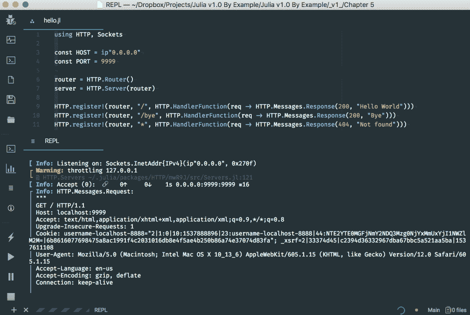
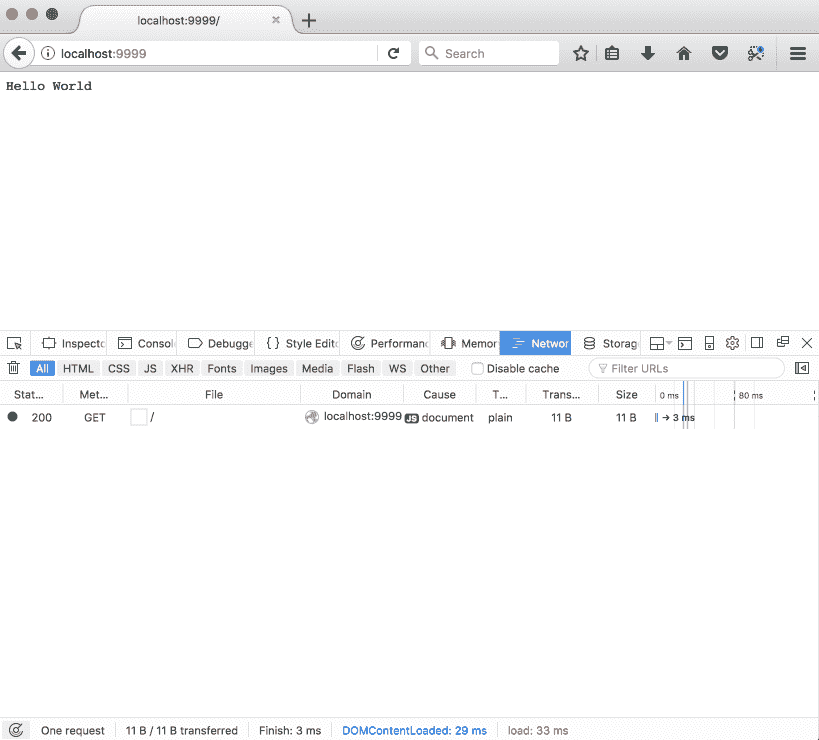
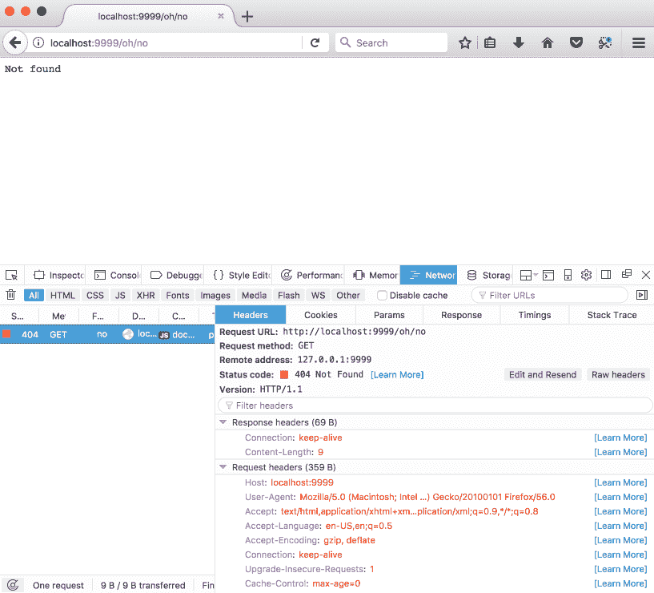
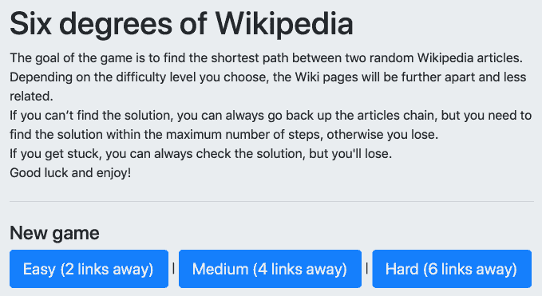
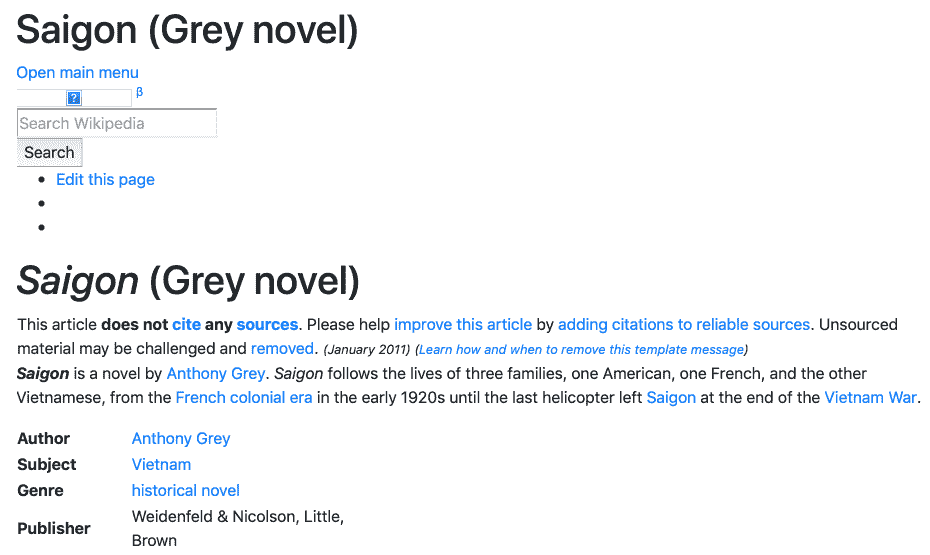
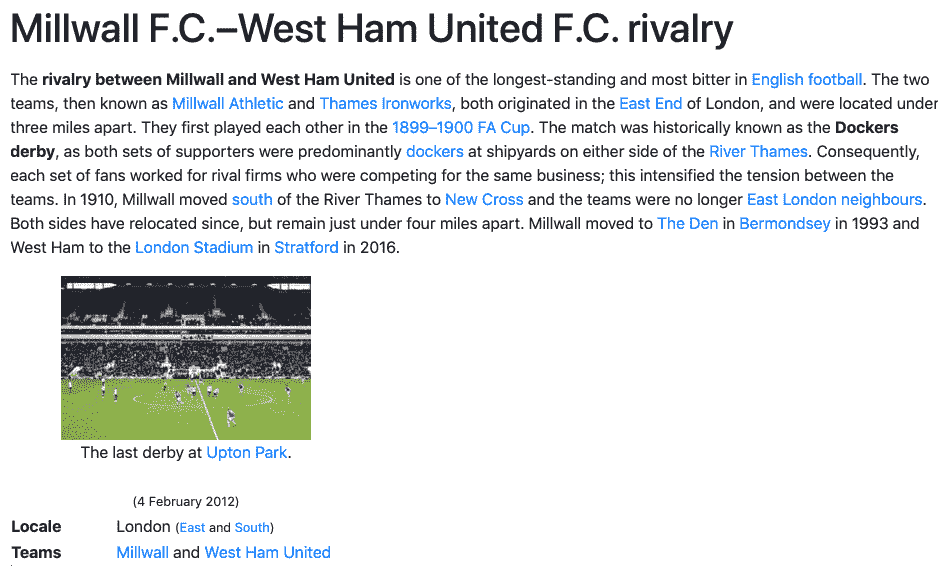
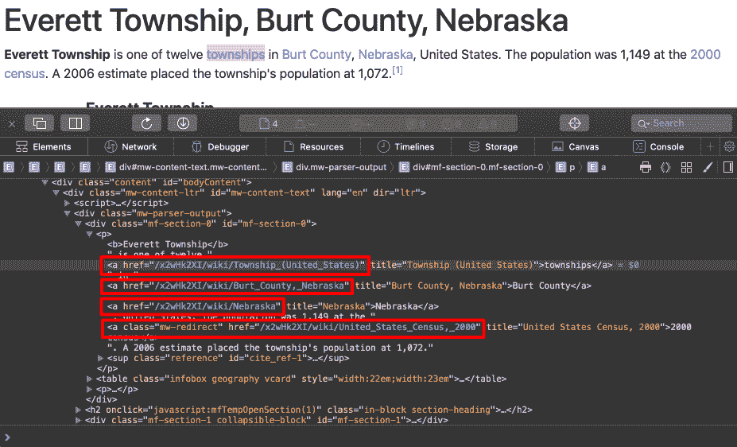
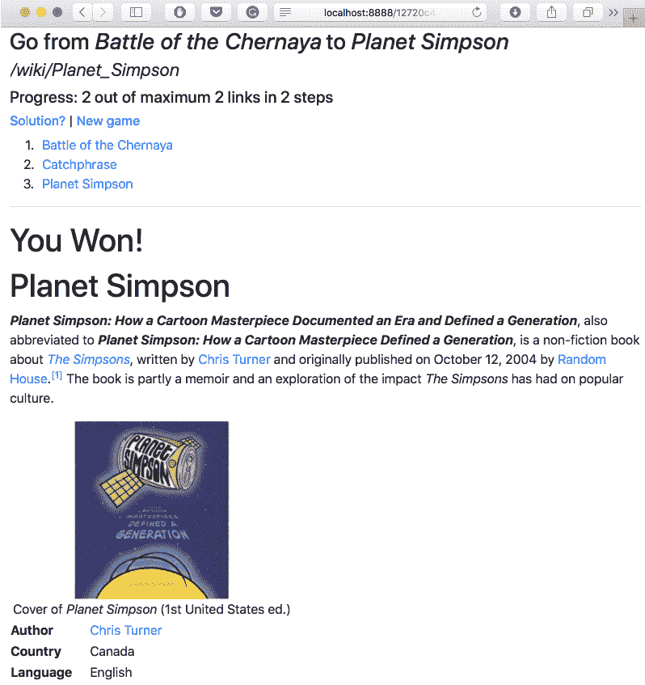
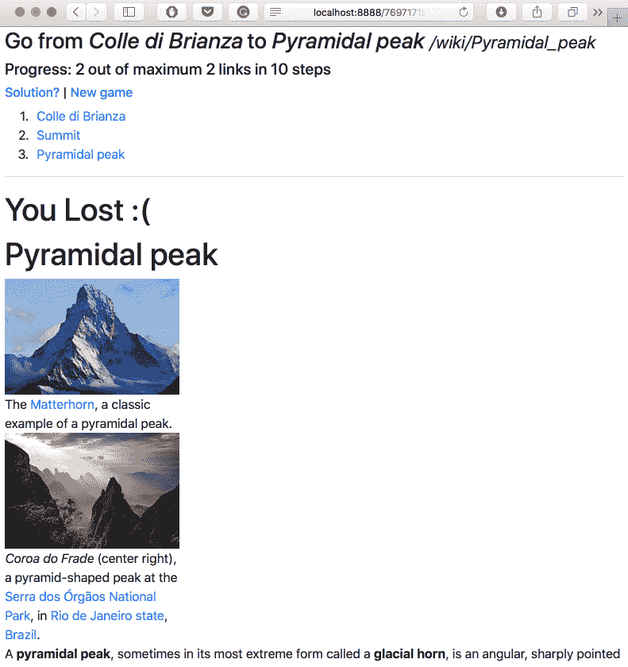
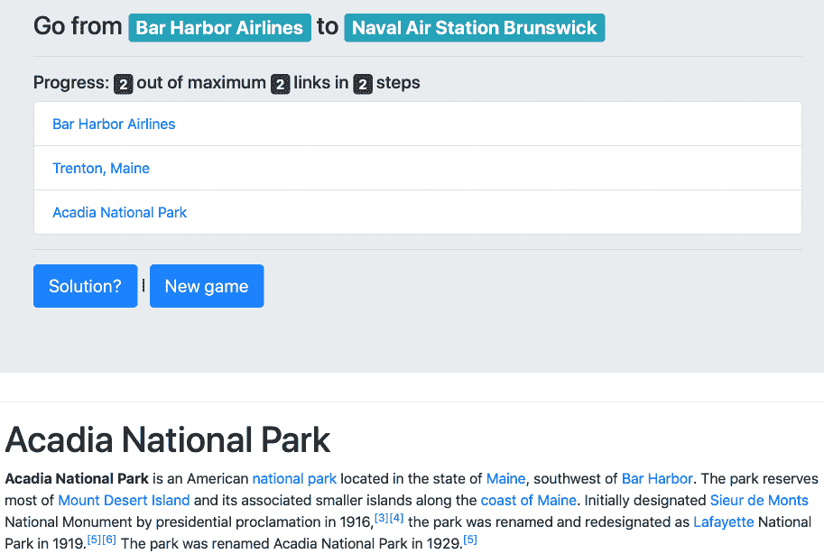

# 五、为 Wiki 游戏添加 Web 用户界面

开发我们游戏的后端是一次很好的学习经历。这个强大的基础将很好地为我们服务——模块化方法将允许我们轻松地将**读取-评估-打印循环** ( **REPL)** 应用转换为 web 应用，而当处理 Julia 的 web 堆栈及其丰富的分类法时，我们对类型的理解将被证明是无价的。

我们现在进入了游戏开发旅程的最后阶段——为维基百科的*六度空间*构建一个网络用户界面。因为构建一个全功能的 web 应用不是一件简单的事情，所以最后一部分将专门讨论这个任务。在此过程中，我们将了解以下主题:

*   朱莉娅的网络堆栈；即`HTTP`包及其主要组件— `Server`、`Router`、`HandlerFunction`和`Response`
*   设计一个 web 应用来利用`HTTP`并将其与现有的 Julia 模块集成
*   通过定义将 URL 映射到 Julia 函数的路由，在 web 上公开特性
*   生成一个 web 服务器来处理用户请求，并将正确的响应发送回客户端

这一章的结尾有一个很酷的奖励——我们的游戏已经准备好了，我们将玩几轮*维基百科的六度游戏*！


# 技术要求

Julia 包生态系统正在不断发展，每天都有新的包版本发布。大多数时候这是好消息，因为新版本带来了新特性和错误修复。然而，由于许多软件包仍处于测试阶段(版本 0.x ),任何新版本都可能引入突破性的变化。因此，书中介绍的代码可能会停止工作。为了确保您的代码将产生与书中描述的相同的结果，建议使用相同的包版本。以下是本章中使用的外部软件包及其具体版本:

```
Cascadia@v0.4.0
Gumbo@v0.5.1
HTTP@v0.7.1
IJulia@v1.14.1
```

为了安装软件包的特定版本，您需要运行:

```
pkg> add PackageName@vX.Y.Z 
```

例如:

```
pkg> add IJulia@v1.14.1
```

或者，您可以通过下载本章提供的`Project.toml`文件并使用`pkg>`实例化来安装所有使用的包，如下所示:

```
julia> download("https://raw.githubusercontent.com/PacktPublishing/Julia-Programming-Projects/master/Chapter05/Project.toml", "Project.toml")
pkg> activate . 
pkg> instantiate
```


# 游戏计划

我们进入了项目的最后一个阶段——网络用户界面。让我们从讨论规范开始；在开始实施之前，我们需要制定蓝图。

玩家将从登录页面开始。这将显示规则，并提供启动新游戏的选项，允许用户选择难度级别。在这个起点之后，玩家将被重定向到新的游戏页面。在这里，考虑到选择的难度级别，我们将通过用我们在前一章写的算法获取文章来引导一个新的游戏会话。一旦我们选择了代表维基百科的*六度的文章，我们将显示一个带有游戏目标的标题——开始和结束文章的标题。我们还将显示第一篇文章的内容，从而启动游戏。当玩家点击这篇文章中的链接时，我们必须相应地检查玩家是否找到了文章的结尾并赢得了游戏。如果没有，则呈现新文章并增加所采取的步骤数。*

我们还需要一个区域来显示游戏的进度——在当前会话中查看的文章，总共进行了多少步，以及一种导航形式，允许玩家在发现自己走错路时返回并重新思考他们的选择。因此，我们需要存储玩家的导航历史。最后，提供一个解决谜题的选项会很好——当然，结果是玩家会输掉游戏。

规范中非常重要的一点是，在无状态浏览器请求和服务器响应之间，在浏览 Wikipedia 文章时，我们需要某种机制来维护游戏的状态，也就是说，检索游戏及其相应的数据—难度、路径(文章)和进度、导航历史、采取的步骤数等等。这将通过在每个游戏会话开始时创建一个唯一的游戏标识符来实现，并将它作为 URL 的一部分与每个请求一起传递。


# 了解 Julia 的 web 堆栈

Julia 的包生态系统长期以来为构建 web 应用提供了各种各样的库。一些最成熟的是`HttpServer`、`Mux`、`WebSockets`和`JuliaWebAPI`(仅举几例；该列表并不详尽)。但是随着生态系统随着 Julia 版本 1 的出现而稳定下来，大量的社区努力被放入一个更新的包中，简称为`HTTP`。它提供了一个 web 服务器、一个 HTTP 客户端(我们已经在前面的章节中使用它从 Wikipedia 获取网页)，以及各种用于简化 web 开发的工具。我们将学习关键的`HTTP`模块，如`Server`、`Router`、`Request`、`Response`和`HandlerFunction`，我们将很好地使用它们。


# 从一个简单的例子开始——Hello World

让我们看一个使用`HTTP`服务器堆栈的简单例子。这将有助于我们理解在网络上展示我们的游戏这一更复杂的问题之前的基本构建模块。

如果您遵循上一章，您应该已经安装了`HTTP`包。如果没有，你知道茱莉亚的《REPL》中的演练。

现在，在您计算机的某个地方，创建一个名为`hello.jl`的新文件。因为这将是一个包含在一个文件中的简单软件，所以没有必要定义一个模块。这是完整的代码，整整八行，非常精彩。我们接下来会讨论它们:

```
using HTTP, Sockets
const HOST = ip"0.0.0.0"
const PORT = 9999
router = HTTP.Router()
server = HTTP.Server(router)
HTTP.register!(router, "/", HTTP.HandlerFunction(req -> HTTP.Messages.Response(200, "Hello World")))
HTTP.register!(router, "/bye", HTTP.HandlerFunction(req -> HTTP.Messages.Response(200, "Bye")))
HTTP.register!(router, "*", HTTP.HandlerFunction(req -> HTTP.Messages.Response(404, "Not found")))
HTTP.serve(server, HOST, PORT) 
```

使用`HTTP`处理 web 请求的工作流需要四个实体— `Server`、`Router`、`HandlerFunction`和`Response`。

我们从最简单的部分开始分析代码，在最后一行，我们通过调用`HTTP.serve`来启动我们的服务器。`serve`函数接受一个`server`，一个类型为`Server`的对象，加上`HOST`信息(一个 IP 字符串)和`PORT`(一个整数)作为参数，用于附加和监听请求。我们已经将文件顶部的`HOST`和`PORT`定义为常量。使用非标准的`ip""`字符串来定义`HOST`的值。在讨论`String`类型时，我们了解了非标准字符串文字。在这方面，`ip"..."`符号类似于正则表达式(`r"..."`)、版本字符串(`v"..."`)或`Pkg`命令(`pkg"..."`)。

实例化一个新的`Server`需要一个`Router`对象，我们将其命名为`router`。`Router`的工作是注册链接(URIs)和 Julia 函数(称为`HandlerFunctions`)之间的映射列表(称为 **routes** ),链接由我们的应用在互联网上公开，Julia 函数提供响应。我们已经使用`register!`函数设置了路线，传递了`router`对象、URI 结构(如`/`或`/bye`)和相应的`HandlerFunction`对象作为参数。

现在，如果你查看`HandlerFunction`的主体，你会看到根页面`/`将显示字符串`"Hello World"`；`/bye` URL 将显示字符串`"Bye"`；最后，每隔一个 URI，由星号`*`表示，将返回一个`"Not found"`文本，伴随着正确的`404 Not Found`头。

我确信你现在能认出箭头操作符，暗示了 lambdas 的使用。每个`HandlerFunction`构造函数接受一个匿名函数。该函数负责处理请求并生成适当的`Response`。作为它的参数，它接受`Request`对象(名为`req`)，并期望返回一个`Response`的实例。

在我们的示例代码中，我们使用两个可用的 HTTP 状态代码构建了三个`Response`对象(`200`表示`OK`和`404`表示未找到页面)，外加一些字符串作为响应的主体(分别是简单的字符串`"Hello World"`、`"Bye"`和`"Not found"`)。

最后，当服务器收到请求时，它将请求委托给路由器，路由器将请求的 URI 匹配到最合适的映射 URI 模式，并调用相应的`HandlerFunction`，将`Request`作为参数传入。处理函数返回一个`Response`对象，由服务器发送回客户端。

让我们看看它的实际效果。您可以在编辑器中使用`Run`功能，也可以在终端中执行`$ julia hello.jl`。或者，您可以运行本章附带的 IJulia 笔记本中的代码:



前面的屏幕截图显示了在 Juno 中运行的`hello.jl`文件。当接收和处理请求时,“REPL”窗格显示来自 web 服务器的调试信息。

一旦服务器准备就绪，您将收到一条日志消息，说明服务器正在监听指定的套接字。此时，您可以打开网络浏览器并导航至`http://localhost:9999`。你会收到著名的 **Hello World** 消息，如下所示:



祝贺您，我们刚刚与 Julia 一起开发了我们的第一个 web 应用！

不需要猜测导航到`http://localhost:9999/bye`时会发生什么。

最后，您可以通过尝试导航到`http://localhost:9999`下的任何其他链接来确认任何其他请求将导致一个`404 Not Found`页面——例如，`http://localhost:9999/oh/no`:



这里是**未找到**页面，正确返回`404`状态代码。


# 开发游戏的网络用户界面

请启动你最喜欢的 Julia 编辑器，打开我们在上一章用过的`sixdegrees/`文件夹。它应该包含我们已经处理过的所有文件— `six_degrees.jl`，加上`Articles`、`Database`、`Gameplay`和`Wikipedia`模块。

如果到目前为止您还没有完成代码，您可以下载本章附带的支持文件，这些文件可以从[https://github . com/packt publishing/Julia-Programming-Projects/tree/master/chapter 05](https://github.com/PacktPublishing/Julia-Programming-Projects/tree/master/Chapter05)获得。

为我们的 web 应用添加新文件。由于这次代码会更复杂，并且应该与我们的其余模块集成，让我们在一个新的`WebApp.jl`文件中定义一个`WebApp`模块。然后，我们可以添加前几行代码:

```
module WebApp 

using HTTP, Sockets 

const HOST = ip"0.0.0.0" 
const PORT = 8888 
const ROUTER = HTTP.Router() 
const SERVER = HTTP.Server(ROUTER) 

HTTP.serve(SERVER, HOST, PORT) 

end 
```

这并不奇怪——与前面的例子相似，我们为`HOST`和`PORT`定义了常数，然后实例化了一个`Router`和一个`Server`并开始监听请求。代码应该工作得很好，但是不值得运行它，因为它不会做任何有用的事情。我们需要定义和注册我们的路线，然后设置生成游戏页面的处理函数。


# 定义我们的路线

通过回顾我们在本章开始时定义的高级规范，我们可以确定以下几页:

*   **登陆页面**:我们的 web 应用的开始位置和主页，玩家可以在这里开始新游戏并选择难度。
*   新游戏页面:启动一个新游戏，考虑难度设置。
*   维基文章页面:这将显示与链中的链接相对应的维基文章，并将更新游戏的统计数据。在这里，我们还将检查当前文章是否是目标(结束)文章，即作为赢家完成游戏。如果没有，我们将检查是否已经达到文章的最大数量，如果是这样，以失败者的身份结束游戏。
*   后退一页:这将允许玩家在没有找到解决方案的情况下后退一步。我们将显示相应的维基百科文章，同时正确更新游戏的统计数据。
*   **解决页面**:如果玩家放弃，这个页面会显示链中的最后一篇文章，以及到它的路径。游戏以失败告终。
*   任何其他页面都应该以`Not Found`结尾。

考虑到路由处理程序会相当复杂，我们最好不要用路由定义来定义它们。相反，我们将使用单独定义的函数。我们的路线定义将如下所示——请将它们添加到`WebApp`模块，如下所示:

```
HTTP.register!(ROUTER, "/", landingpage) # root page 
HTTP.register!(ROUTER, "/new/*", newgamepage) # /new/$difficulty_level -- new game 
HTTP.register!(ROUTER, "/*/wiki/*", articlepage) # /$session_id/wiki/$wikipedia_article_url -- article page 
HTTP.register!(ROUTER, "/*/back/*", backpage) # /$session_id/back/$number_of_steps -- go back the navigation history 
HTTP.register!(ROUTER, "/*/solution", solutionpage) # /$session_id/solution -- display the solution 
HTTP.register!(ROUTER, "*", notfoundpage) # everything else -- not found
```

你可能想知道 URI 图案前面多出来的`*`是什么。我们说过，我们需要一种方法来识别无状态 web 请求之间正在运行的游戏会话。`articlepage`、`backpage`和`solutionpage`功能都需要现有的游戏会话。我们将传递这个会话 ID 作为 URL 的第一部分。实际上，它们的路径被解释为`/$session_id/wiki/*`、`/$session_id/back/*`和`/$session_id/solution`，其中`$session_id`变量代表唯一的游戏标识符。至于拖尾的`*`，对于不同的路线代表不同的东西——在`new`的情况下，就是游戏的难度等级；对于`articlepage`，它是实际的维基百科 URL，也是我们的文章标识符；对于`backpage`，它代表导航栈中的索引。类似于正则表达式，对于路径匹配，`*`将匹配任何内容。如果这听起来很复杂，不要担心——查看并运行代码会让事情变得清楚。

让我们为每个处理函数添加占位符定义—请将这些*添加到路线列表的*之前:

```
const landingpage = HTTP.HandlerFunction() do req 
end 
const newgamepage = HTTP.HandlerFunction() do req 
end 
const articlepage = HTTP.HandlerFunction() do req 
end 
const backpage = HTTP.HandlerFunction() do req  
end 
const solutionpage = HTTP.HandlerFunction() do req 
end 
const notfoundpage = HTTP.HandlerFunction() do req 
end 
```


# 准备登录页面

马上，我们可以解决登陆页面处理器。它需要做的只是显示一些描述游戏规则的静态内容，以及提供一种开始不同难度的新游戏的方法。记住游戏的难度决定了文章链的长度，我们在开始一个新游戏的时候需要这些信息。我们可以将它作为 URL 的一部分传递给新的游戏页面，格式为`/new/$difficulty_level`。难度等级已经在`Gameplay`模块中定义了，所以不要忘记声明我们是`using Gameplay`。

考虑到这一点，我们将以下面的代码结束我们的`WebApp`模块。我们把所有的东西放在一起，我们还添加了`landingpage` `HandlerFunction`。这与第一条路线——`HTTP.register!(ROUTER, "/",landingpage)`相关。这意味着当我们在浏览器中访问`/`路由时，将执行` landingpage` `HandlerFunction`并将其输出作为响应返回。在这种情况下，我们只是返回一堆 HTML 代码。如果你不熟悉 HTML，这里是标记的作用——我们包含了 Twitter Bootstrap CSS 主题以使我们的页面更漂亮，我们显示了几段解释游戏规则的文本，我们显示了三个开始新游戏的按钮——每个难度级别一个按钮。

代码如下:

```
module WebApp 

using HTTP, Sockets 
using ..Gameplay 

# Configuration 
const HOST = ip"0.0.0.0" 
const PORT = 8888 
const ROUTER = HTTP.Router() 
const SERVER = HTTP.Server(ROUTER) 

# Routes handlers 
const landingpage = HTTP.HandlerFunction() do req 
  html = """ 
  <!DOCTYPE html> 
  <html> 
  <head> 
    <meta charset="utf-8" /> 
    <link rel="stylesheet" href="https://stackpath.bootstrapcdn.com/bootstrap/4.1.3/css/bootstrap.min.css" integrity="sha384-MCw98/SFnGE8fJT3GXwEOngsV7Zt27NXFoaoApmYm81iuXoPkFOJwJ8ERdknLPMO" crossorigin="anonymous"> 
    
  </head> 

  <body> 
    <div class="jumbotron"> 
      <h1>Six degrees of Wikipedia</h1> 
      <p> 
        The goal of the game is to find the shortest path between two random Wikipedia articles.<br/> 
        Depending on the difficulty level you choose, the Wiki pages will be further apart and less related.<br/> 
        If you can't find the solution, you can always go back up the articles chain, but you need to find the solution within the maximum number of steps, otherwise you lose.<br/> 
        If you get stuck, you can always check the solution, but you'll lose.<br/> 
        Good luck and enjoy! 
      </p> 

      <hr class="my-4"> 

      <div> 
        <h4>New game</h4> 
          <a href="/new/$(Gameplay.DIFFICULTY_EASY)" class="btn btn-primary btn-lg">Easy ($(Gameplay.DIFFICULTY_EASY) links away)</a> | 
          <a href="/new/$(Gameplay.DIFFICULTY_MEDIUM)" class="btn btn-primary btn-lg">Medium ($(Gameplay.DIFFICULTY_MEDIUM) links away)</a> | 
          <a href="/new/$(Gameplay.DIFFICULTY_HARD)" class="btn btn-primary btn-lg">Hard ($(Gameplay.DIFFICULTY_HARD) links away)</a> 
        </div> 
    </div> 
  </body> 
  </html> 
  """ 

  HTTP.Messages.Response(200, html) 
end 

const newgamepage = HTTP.HandlerFunction() do req 
end 

const articlepage = HTTP.HandlerFunction() do req 
end 

const backpage = HTTP.HandlerFunction() do req 
end 

const solutionpage = HTTP.HandlerFunction() do req 
end 

const notfoundpage = HTTP.HandlerFunction() do req 
end 

# Routes definitions 
HTTP.register!(ROUTER, "/", landingpage) # root page 
HTTP.register!(ROUTER, "/new/*", newgamepage) # /new/$difficulty_level -- new game 
HTTP.register!(ROUTER, "/*/wiki/*", articlepage) # /$session_id/wiki/$wikipedia_article_url -- article page 
HTTP.register!(ROUTER, "/*/back/*", backpage) # /$session_id/back/$number_of_steps -- go back the navigation history 
HTTP.register!(ROUTER, "/*/solution", solutionpage) # /$session_id/solution -- display the solution 
HTTP.register!(ROUTER, "*", notfoundpage) # everything else -- not found 

# Start server 
HTTP.serve(SERVER, HOST, PORT) 

end 
```

让我们更新`six_degrees.jl`文件来引导我们的 web 应用。请确保它现在显示如下:

```
using Pkg 
pkg"activate ." 

include("Database.jl") 
include("Wikipedia.jl") 
include("Gameplay.jl") 
include("WebApp.jl") 

using .Wikipedia, .Gameplay, .WebApp 
```

在编辑器或终端(`$ julia six_degrees.jl`)中使用您喜欢的方法运行`six_degrees.jl`。寻找消息`Info: Listening on:...`，它通知我们 web 服务器已经启动。在您的浏览器中访问`http://localhost:8888/`，在我们的登录页面上尽情享受吧！我相信您会注意到包含 Twitter Bootstrap CSS 文件的效果——只需在我们的代码中添加几个 CSS 类就能产生巨大的视觉冲击！



前面的截图是我们的游戏在本地主机`8888`端口运行的登陆页面。


# 开始新游戏

太棒了。现在，让我们来关注开始一个新游戏的功能。这里，我们需要实现以下步骤:

1.  从 URL 中提取难度设置。
2.  开始新游戏。这个游戏应该有个 ID，会是我们的`session id`。另外，它应该跟踪文章列表、进度、导航历史、采取的步骤总数和难度。
3.  渲染第一篇维基百科文章。
4.  设置文章内导航。我们需要确保维基百科文章中的链接会正确地链接回我们的应用，而不是维基百科网站本身。
5.  显示关于游戏进程的信息，例如目标(开始和结束文章)、采取的步骤数等等。

接下来我们将看看所有这些步骤。


# 从页面 URL 提取难度设置

这是第一步。记住，在我们的`HandlerFunction`中，我们可以访问`Request`对象`req`。所有的`Request`对象都公开了一个名为`target`的字段，该字段引用请求的 URL。`target`不包含协议或域名，因此它将采用`/new/$difficulty_level`的形式。提取`$difficulty_level`值的一个快速方法是简单地用一个空字符串`""`替换 URI 的第一部分，有效地删除它。结果将在函数`newgamesession`中使用，以创建指定难度的新游戏。输入代码，它看起来像这样:

```
game = parse(UInt8, (replace(req.target, "/new/"=>""))) |> newgamesession 
```

因为我们用整数(文章的数量)来表示难度级别，所以在使用之前，我们将字符串解析为一个整数(特别是类型`UInt8`)。


# 开始新的游戏会话

开始新的游戏会话是第二步。游戏会话管理器，应该包括前面的`newgamesession`功能，已经完全消失了，所以是时候添加了。我们将游戏会话表示为相应类型的实例。让我们将`type`定义和操作它的方法打包到一个专用模块中。我们可以将模块命名为`GameSession`，将类型命名为`Game`。请在`"sixdegrees/"`文件夹中创建`GameSession.jl`文件。

我们的`Game`类型将需要一个定制的构造函数。我们将提供难度级别，构造函数将负责设置所有的内部内容——它将使用之前创建的`Gameplay.newgame`函数获取正确数量的维基百科文章；它将创建一个唯一的游戏 ID(这将是我们的会话 ID)；它会用默认值初始化其余的字段。

第一次尝试如下所示:

```
module GameSession 

using ..Gameplay, ..Wikipedia, ..Wikipedia.Articles 
using Random 

mutable struct Game 
  id::String 
  articles::Vector{Article} 
  history::Vector{Article} 
  steps_taken::UInt8 
  difficulty::UInt8 

  Game(game_difficulty) = 
    new(randstring(), newgame(game_difficulty), Article[], 0, game_difficulty) 
end 

const GAMES = Dict{String,Game}() 

end
```

`Random.randstring`函数创建一个随机字符串。这是我们游戏和会话的 ID。

我们还定义了一个`GAMES`字典，它将存储所有活动的游戏，并允许我们通过它们的`id`字段来查找它们。请记住，我们的游戏是在网络上公开的，所以我们将有多个游戏会话并行运行。

我们现在可以添加其余的功能。在模块关闭`end`前增加如下定义:

```
export newgamesession, gamesession, destroygamesession 

function newgamesession(difficulty) 
  game = Game(difficulty) 
  GAMES[game.id] = game 
  game 
end 

function gamesession(id) 
  GAMES[id] 
end 

function destroygamesession(id) 
  delete!(GAMES, id) 
end
newgamesession function, which creates a new Game of the indicated difficulty and stores it into the GAMES dict data structure. There's also a getter function, gamesession, which retrieves a Game by id. Finally, we add a destructor function, which removes the corresponding Game from the GAMES dict, effectively making it unavailable on the frontend and leaving it up for garbage collection. All of these functions are exported.
```

值得注意的是，在内存中存储我们的游戏对于这个学习项目来说是没问题的，但是在生产中，有很多玩家，你可能会很快耗尽内存。对于生产使用，我们最好将每个`Game`保存到数据库中，并在必要时检索它。


# 呈现链中的第一篇维基百科文章

这是第三步。回到我们的`WebApp`模块(在`WebApp.jl`中)，让我们继续讨论`newgamepage`处理程序的逻辑。实现将如下所示:

```
using ..GameSession, ..Wikipedia, ..Wikipedia.Articles 

const newgamepage = HTTP.HandlerFunction() do req 
  game = parse(UInt8, (replace(req.target, "/new/"=>""))) |> newgamesession 
  article = game.articles[1] 
  push!(game.history, article) 

  HTTP.Messages.Response(200, wikiarticle(article)) 
end
```

一旦我们创建了一个新游戏，我们需要引用它的第一篇文章。我们将起始文章添加到游戏历史中，然后使用下面的`wikiarticle`函数将其呈现为 HTML:

```
function wikiarticle(article) 
  html = """ 
  <!DOCTYPE html> 
  <html> 
  <head> 
    <meta charset="utf-8" /> 
    <link rel="stylesheet" href="https://stackpath.bootstrapcdn.com/bootstrap/4.1.3/css/bootstrap.min.css" integrity="sha384-MCw98/SFnGE8fJT3GXwEOngsV7Zt27NXFoaoApmYm81iuXoPkFOJwJ8ERdknLPMO" crossorigin="anonymous"> 
    
  </head> 

  <body> 
    <h1>$(article.title)</h1> 
    <div id="wiki-article"> 
      $(article.content) 
    </div> 
  </body> 
  </html> 
  """ 
end

```

我们只是将维基百科文章的标题显示为主要标题，然后是内容。

最后，不要忘记通过将`GameSession`添加到`"six_degrees.jl"`来将其加载到我们的应用中。请注意，它需要在`WebApp`之前加载，才能用于`WebApp`。完整的`"six_degrees.jl"`文件现在应该是这样的:

```
using Pkg pkg"activate ." include("Database.jl") include("Wikipedia.jl") include("Gameplay.jl") include("GameSession.jl") include("WebApp.jl") using .Wikipedia, .Gameplay, .GameSession, .WebApp 
```

如果您重新运行我们的代码并导航到`http://localhost:8888/new/2`，您将看到我们的应用呈现了一篇随机的维基百科文章:



这是一个好的开始，但也存在一些问题。首先，我们从维基百科获取内容时有点过于贪婪。它包括整个页面的 HTML，其中包含了我们并不真正需要的东西，比如看不见的`<head>`部分，以及文章正文上方非常明显的维基百科内容(搜索表单、菜单等等)。这很容易解决——我们所需要做的就是通过使用一个更好定义的 CSS 选择器来更具体地描述我们想要的内容。稍微摆弄一下浏览器的检查器，就会发现想要的选择器是`#bodyContent`。

有了这些知识，我们需要更新`Wikipedia`模块。请用此功能替换现有的`articleinfo`功能:

```
function articleinfo(content) 
  dom = articledom(content) 
  (extractcontent(dom.root), extractlinks(dom.root), extracttitle(dom.root), extractimage(dom.root)) 
end 
```

我们现在将只提取所需 CSS 选择器的内容，而不是使用整个 HTML:

```
function extractcontent(elem) 
  matchFirst(Selector("#bodyContent"), elem) |> string 
end 
```

请将`extractcontent`的定义添加到`Wikipedia.jl`文件中，在`extractimage`功能下。

通过在`http://localhost:8888/new/2`重新访问我们的页面，我们将看到我们的努力得到了更好看的替换:




# 设置文章内导航

好吧，这并不难！但是下一个问题更难。第四步是所有关于设置。我们确定，我们需要捕捉所有的内部维基百科链接，以便当玩家点击一个链接时，他们会被带到我们的应用，而不是去原始的维基百科文章。这项工作有一半是由维基百科的内容本身完成的，因为它使用了相对 URL。也就是说，它没有使用`https://en.wikipedia.org/wiki/Wikipedia:Six_degrees_of_Wikipedia`形式的绝对 URL，而是使用了相对形式`/wiki/Wikipedia:Six_degrees_of_Wikipedia`。这意味着当在浏览器中呈现时，这些链接将继承当前主机的域名(或*基 URL* )。也就是说，当在`http://localhost:8888/`呈现维基百科文章的内容时，其相对 URL 将被解释为`http://localhost:8888/wiki/Wikipedia:Six_degrees_of_Wikipedia`。因此，它们会自动指向我们的 web 应用。这很好，但是缺少了一大块拼图:我们说过要通过将会话 id 作为 URL 的一部分来维护游戏的状态。因此，我们的 URL 应该是`http://localhost:8888/ABCDEF/wiki/Wikipedia:Six_degrees_of_Wikipedia`的形式，其中`ABCDEF`代表游戏(或会话)ID。最简单的解决方法就是在渲染内容的时候用`/ABCDEF/wiki/`代替`/wiki/`——当然是用实际的游戏 ID 代替`ABCDEF`。

在`WebApp.wikiarticle`函数的定义中，请查找:

```
<div id="wiki-article"> 
     $(article.content) 
</div> 
```

将其替换为以下内容:

```
<div id="wiki-article"> 
    $(replace(article.content, "/wiki/"=>"/$(game.id)/wiki/")) 
</div> 
```

因为我们现在需要`game`对象，我们必须确保将它传递给函数，所以它的声明应该如下所示:

```
function wikiarticle(game, article) 
```

这意味着我们还需要更新`newgamepage`路由处理程序，以正确调用更新后的`wikiarticle`函数。`WebApp.newgamepage`函数的最后一行现在应该如下:

```
HTTP.Messages.Response(200, wikiarticle(game, article))  
```

如果您执行`six_degrees.jl`并打开浏览器`http://localhost:8888/new/2`，您应该会看到一篇很好的维基百科文章的渲染图，其中所有的内部链接都包含游戏 ID:



在前面的截图中，我们可以看到所有的网址都以`/x2wHk2XI`开头——我们的游戏 ID。


# 显示关于游戏会话的信息

对于规范的第五部分，也是最后一部分，我们需要显示关于游戏的信息，并提供一种导航回以前文章的方法。我们将定义以下函数:

```
function objective(game) 
  """ 
  <h3> 
    Go from <i>$(game.articles[1].title)</i>  
    to <i>$(game.articles[end].title)</i> 
  </h3> 
  <h5> 
    Progress: $(size(game.history, 1) - 1)  
    out of maximum $(size(game.articles, 1) - 1) links  
    in $(game.steps_taken) steps 
  </h5> 
  <h6> 
    <a href="/$(game.id)/solution">Solution?</a> |  
    <a href="/">New game</a> 
  </h6>""" 
end 
```

`objective`功能通知玩家文章的开始和结束以及当前的进度。它还提供了一个小菜单，以便您可以查看解决方案或开始一个新游戏。

为了向后导航，我们需要生成游戏历史链接:

```
function history(game) 
  html = "<ol>" 
  iter = 0 
  for a in game.history 
    html *= """ 
    <li><a href="/$(game.id)/back/$(iter + 1)">$(a.title)</a></li> 
    """ 
    iter += 1 
  end 

  html * "</ol>" 
end
```

最后，我们需要一些额外的逻辑来检查游戏是赢了还是输了:

```
function puzzlesolved(game, article) 
  article.url == game.articles[end].url 
end
```

如果当前文章的 URL 与游戏中最后一篇文章的 URL 相同，我们就有了赢家。

如果玩家用完了所有招式，游戏就输了:

```
function losinggame(game) 
  game.steps_taken >= Gameplay.MAX_NUMBER_OF_STEPS 
end
```

到目前为止，完整的代码应该是这样的:

```
module WebApp 

using HTTP, Sockets 
using ..Gameplay, ..GameSession, ..Wikipedia, ..Wikipedia.Articles 

# Configuration 
const HOST = ip"0.0.0.0" 
const PORT = 8888 
const ROUTER = HTTP.Router() 
const SERVER = HTTP.Server(ROUTER) 

# Functions 
function wikiarticle(game, article) 
  html = """ 
  <!DOCTYPE html> 
  <html> 
  $(head()) 

  <body> 
    $(objective(game)) 
    $(history(game)) 
    <hr/> 
    $( 
      if losinggame(game) 
        "<h1>You Lost :( </h1>" 
      else 
        puzzlesolved(game, article) ? "<h1>You Won!</h1>" : "" 
      end 
    ) 

    <h1>$(article.title)</h1> 
    <div id="wiki-article"> 
      $(replace(article.content, "/wiki/"=>"/$(game.id)/wiki/")) 
    </div> 
  </body> 
  </html> 
  """ 
end 

function history(game) 
  html = "<ol>" 
  iter = 0 
  for a in game.history 
    html *= """ 
    <li><a href="/$(game.id)/back/$(iter + 1)">$(a.title)</a></li> 
    """ 
    iter += 1 
  end 

  html * "</ol>" 
end 

function objective(game) 
  """ 
  <h3> 
    Go from <i>$(game.articles[1].title)</i>  
    to <i>$(game.articles[end].title)</i> 
  </h3> 
  <h5> 
    Progress: $(size(game.history, 1) - 1)  
    out of maximum $(size(game.articles, 1) - 1) links  
    in $(game.steps_taken) steps 
  </h5> 
  <h6> 
    <a href="/$(game.id)/solution">Solution?</a> |  
    <a href="/">New game</a> 
  </h6>""" 
end 

function head() 
  """ 
  <head> 
    <meta charset="utf-8" /> 
    <link rel="stylesheet" href="https://stackpath.bootstrapcdn.com/bootstrap/4.1.3/css/bootstrap.min.css" integrity="sha384-MCw98/SFnGE8fJT3GXwEOngsV7Zt27NXFoaoApmYm81iuXoPkFOJwJ8ERdknLPMO" crossorigin="anonymous"> 
    
  </head> 
  """ 
end 

function puzzlesolved(game, article) 
  article.url == game.articles[end].url 
end 

function losinggame(game) 
  game.steps_taken >= Gameplay.MAX_NUMBER_OF_STEPS 
end 

# Routes handlers 
const landingpage = HTTP.HandlerFunction() do req 
  html = """ 
  <!DOCTYPE html> 
  <html> 
  $(head()) 

  <body> 
    <div class="jumbotron"> 
      <h1>Six degrees of Wikipedia</h1> 
      <p> 
        The goal of the game is to find the shortest path between two random Wikipedia articles.<br/> 
        Depending on the difficulty level you choose, the Wiki pages will be further apart and less related.<br/> 
        If you can't find the solution, you can always go back up the articles chain, but you need to find the solution within the maximum number of steps, otherwise you lose.<br/> 
        If you get stuck, you can always check the solution, but you'll lose.<br/> 
        Good luck and enjoy! 
      </p> 

      <hr class="my-4"> 

      <div> 
        <h4>New game</h4> 
          <a href="/new/$(Gameplay.DIFFICULTY_EASY)" class="btn btn-primary btn-lg">Easy ($(Gameplay.DIFFICULTY_EASY) links away)</a> | 
          <a href="/new/$(Gameplay.DIFFICULTY_MEDIUM)" class="btn btn-primary btn-lg">Medium ($(Gameplay.DIFFICULTY_MEDIUM) links away)</a> | 
          <a href="/new/$(Gameplay.DIFFICULTY_HARD)" class="btn btn-primary btn-lg">Hard ($(Gameplay.DIFFICULTY_HARD) links away)</a> 
        </div> 
    </div> 
  </body> 
  </html> 
  """ 

  HTTP.Messages.Response(200, html) 
end 

const newgamepage = HTTP.HandlerFunction() do req 
  game = parse(UInt8, (replace(req.target, "/new/"=>""))) |> newgamesession 
  article = game.articles[1] 
  push!(game.history, article) 

  HTTP.Messages.Response(200, wikiarticle(game, article)) 
end 

const articlepage = HTTP.HandlerFunction() do req 
end 

const backpage = HTTP.HandlerFunction() do req 
end 

const solutionpage = HTTP.HandlerFunction() do req 
end 

const notfoundpage = HTTP.HandlerFunction() do req 
end 

# Routes definitions 
HTTP.register!(ROUTER, "/", landingpage) # root page 
HTTP.register!(ROUTER, "/new/*", newgamepage) # /new/$difficulty_level -- new game 
HTTP.register!(ROUTER, "/*/wiki/*", articlepage) # /$session_id/wiki/$wikipedia_article_url -- article page 
HTTP.register!(ROUTER, "/*/back/*", backpage) # /$session_id/back/$number_of_steps -- go back the navigation history 
HTTP.register!(ROUTER, "/*/solution", solutionpage) # /$session_id/solution -- display the solution HTTP.register!(ROUTER, "*", notfoundpage) # everything else -- not found # Start server HTTP.serve(SERVER, HOST, PORT) 

end
```

请注意，我们还重构了页面的`<head>`，将其抽象为`head`函数，由`landingpage`和`wikiarticle`共同使用。这样，我们保持代码干燥，避免相同的`<head>` HTML 元素的重复。

现在，让我们确保将`Gameplay.MAX_NUMBER_OF_STEPS`添加到`Gameplay.jl`中。把它加在顶部，难度常数下面:

```
const MAX_NUMBER_OF_STEPS = 10 
```


# 显示维基百科文章页面

玩家已经阅读了起始文章并点击了内容中的链接。我们需要添加呈现链接文章的逻辑。我们必须获取文章(如果已经获取，则从数据库中读取)，显示它，并更新游戏的状态。

代码如下:

```
const articlepage = HTTP.HandlerFunction() do req 
  uri_parts = parseuri(req.target) 
  game = gamesession(uri_parts[1]) 
  article_uri = "/wiki/$(uri_parts[end])" 
  existing_articles = Articles.find(article_uri) 
  article = isempty(existing_articles) ?  
    persistedarticle(fetchpage(article_uri)...) :  
    existing_articles[1] 
  push!(game.history, article) 
  game.steps_taken += 1 
  puzzlesolved(game, article) && destroygamesession(game.id) 
  HTTP.Messages.Response(200, wikiarticle(game, article)) 
end
```

我们从解析`Request` URI 开始，提取通过 GET 发送的所有值。格式为`/$session_id/wiki/$article_name`的字符串，例如`/c701b1b0b1/wiki/Buenos_Aires`。我们想把它分解成各个部分。由于这是一个我们需要多次执行的操作，我们将把这个功能抽象到`parseuri`函数中:

```
function parseuri(uri) 
  map(x -> String(x), split(uri, "/", keepempty = false)) 
end
```

这里，我们使用 Julia 的`split`函数将 URI 字符串分解成`SubString`的一个`Array`，对应于正斜杠`/`之间的段。然后，我们将得到的`SubString`的`Array`转换为`String`的`Array`，返回并存储在`uri_parts`变量中。

继续定义`articlepage`处理程序，我们使用`uri_parts`数组的第一个元素，对应于会话 ID，通过调用`gamesession(uri_parts[1])`来检索我们的游戏对象。使用最后一个元素，我们生成了维基百科文章的 URL。然后，我们通过 URL 查找文章，或者从数据库检索，或者从网站获取。

一旦我们有了文章，我们就把它添加到游戏的历史中，并增加`game.steps_taken`计数器。然后，我们检查我们是否应该以胜利结束游戏:



这是获奖文章页面截图。设计并不伟大，但胜利的甜蜜滋味绝对伟大！

最后，类似于新游戏页面，我们通过渲染文章和所有游戏信息来响应。


# 沿文章链向上导航

请记住，后退导航 URL 类似于`/c701b1b0b1/back/1`，其中第一部分是会话 ID，最后一部分是历史堆栈中该项目的索引。要实现它，工作流程类似于`articlepage`—我们解析`Request` URI，通过会话 ID 检索游戏，并从游戏的历史堆栈中获取文章。因为我们回到了游戏的历史，当前文章索引之外的所有内容都将从导航栈中移除。完成后，我们通过呈现相应的维基百科文章来响应。代码简短易读:

```
const backpage = HTTP.HandlerFunction() do req 
  uri_parts = parseuri(req.target) 
  game = gamesession(uri_parts[1]) 
  history_index = parse(UInt8, uri_parts[end]) 

  article = game.history[history_index] 
  game.history = game.history[1:history_index] 

  HTTP.Messages.Response(200, wikiarticle(game, article)) 
end 
```


# 展示解决方案

对于解决方案页面，我们从`Request` URI 中需要的唯一东西是会话 ID。然后，我们按照相同的工作流程获取当前的`Game`对象。一旦我们有了它，我们将文章列表复制到历史堆栈中，以使用现有的渲染逻辑显示游戏的解决方案。我们也将`steps_taken`计数器设置到最大，因为这个游戏被认为是失败的。最后，我们展示最后一篇文章:

```
const solutionpage = HTTP.HandlerFunction() do req 
  uri_parts = parseuri(req.target) 
  game = gamesession(uri_parts[1]) 
  game.history = game.articles 
  game.steps_taken = Gameplay.MAX_NUMBER_OF_STEPS 
  article = game.articles[end]
  HTTP.Messages.Response(200, wikiarticle(game, article)) 
end
```

解决方案页面显示如下，解决游戏失败:




# 处理任何其他请求

类似于我们的`Hello World`示例，我们将用`404 Not Found`响应来响应任何其他请求:

```
const notfoundpage = HTTP.HandlerFunction() do req 
  HTTP.Messages.Response(404, "Sorry, this can't be found") 
end 
```


# 包装它

我已经在`WebApp.jl`文件中添加了一些 UI 调整来增加一些趣味。以下是重要部分——请从[https://github . com/packt publishing/Julia-Programming-Projects/blob/master/chapter 05/six degrees/web app . JL](https://github.com/PacktPublishing/Julia-Programming-Projects/blob/master/Chapter05/sixdegrees/WebApp.jl)下载完整文件:

```
module WebApp 

# code truncated #

function history(game) 
  html = """<ol class="list-group">""" 
  iter = 0 
  for a in game.history 
    html *= """ 
      <li class="list-group-item"> 
        <a href="/$(game.id)/back/$(iter + 1)">$(a.title)</a> 
      </li> 
    """ 
    iter += 1 
  end 

  html * "</ol>" 
end 

function objective(game) 
  """ 
  <div class="jumbotron"> 
    <h3>Go from 
      <span class="badge badge-info">$(game.articles[1].title)</span> 
      to 
      <span class="badge badge-info">$(game.articles[end].title)</span> 
    </h3> 
    <hr/> 
    <h5> 
      Progress: 
      <span class="badge badge-dark">$(size(game.history, 1) - 1)</span> 
      out of maximum 
      <span class="badge badge-dark">$(size(game.articles, 1) - 1)</span> 
      links in 
      <span class="badge badge-dark">$(game.steps_taken)</span> 
      steps 
    </h5> 
    $(history(game)) 
    <hr/> 
    <h6> 
      <a href="/$(game.id)/solution" class="btn btn-primary btn-lg">Solution?</a> | 
      <a href="/" class="btn btn-primary btn-lg">New game</a> 
    </h6> 
  </div> 
  """ 
end 

# code truncated #

end 
```

你会看到我对布局进行了一些重新组织，并添加了一些额外的样式来使我们的 UI 更漂亮。这是我们更新后的游戏:



至于其余的文件，如果你需要的话，可以从本章的 GitHub 资源库下载，可以从[https://GitHub . com/packt publishing/Julia-Programming-Projects/tree/master/chapter 05/six degrees](https://github.com/PacktPublishing/Julia-Programming-Projects/tree/master/Chapter05/sixdegrees)访问。

这就是我们运行一个完整的*维基百科*六度游戏所需要做的一切。现在，是享受的时候了！


# 摘要

Julia 专注于科学计算和数据科学。但是由于它作为一种通用编程语言的优秀品质，它的本地并行计算特性，以及它的性能，我们在 web 开发领域有一个很好的 Julia 用例。

包生态系统提供了对一组强大的专用于 web 编程的库的访问。它们级别相对较低，但仍然抽象出了直接使用网络堆栈的大部分复杂性。`HTTP`包提供了可用性、性能和灵活性之间的良好平衡。

事实上，我们设法用这么少的代码构建了一个相当复杂(尽管很小)的 web 应用，这证明了该语言的能力和表现力以及第三方库的质量。我们的学习项目做得很好——现在是时候放松一下，享受一轮*维基百科*六度，朱莉娅风格！