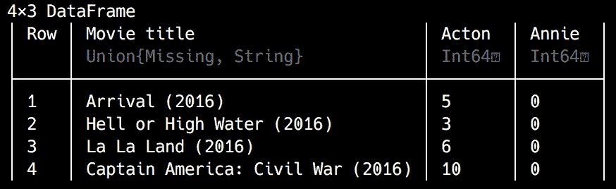

# 用 Julia 实现推荐系统

在前几章中，我们和 Julia 一起深入研究了数据挖掘和 web 开发。我希望你在发现一些有趣文章的同时，享受了几轮轻松的*六度维基百科*。作为游戏的一部分，随机浏览数百万维基百科文章是偶然发现有趣的新内容的一种非常有趣的方式。尽管我确信，有时，你已经注意到不是所有的文章都一样好——也许它们是存根，或者是主观的，或者写得不好，或者只是与你无关。如果我们能够了解每个玩家的个人兴趣，我们就可以过滤掉某些维基百科文章，这将把每个游戏环节变成一次美妙的发现之旅。

事实证明，我们并不是唯一在这方面挣扎的人——信息发现是一个价值数十亿美元的问题，不管它是文章、新闻、书籍、音乐、电影、酒店，还是任何可以在互联网上销售的产品或服务。作为消费者，我们面临着种类繁多的选择，而与此同时，我们审视这些选择的时间越来越少，我们的注意力持续时间也越来越短。从亚马逊、Booking.com、网飞、Spotify 到 Udemy，即时提供相关推荐是所有成功在线平台的关键特征。所有这些公司都投资建立了强大的推荐系统，实际上是发明了新的商业模式以及相应的数据收集和推荐算法。

在这一章中，我们将学习推荐系统——最常见和最成功的算法，广泛用于解决各种各样的业务需求。我们将了解以下主题:

*   什么是推荐系统，如何使用它们
*   基于内容与协同过滤推荐系统的比较
*   基于用户和基于项目的推荐系统

*   使用`DataFrames`和统计功能进行更高级的数据分析
*   如何使用基于内容和协同过滤算法推出我们自己的推荐系统


# 技术要求

Julia 包生态系统正在不断发展，每天都有新的包版本发布。大多数时候这是好消息，因为新版本带来了新特性和错误修复。然而，由于许多软件包仍处于测试阶段(版本 0.x ),任何新版本都可能引入突破性的变化。因此，书中介绍的代码可能会停止工作。为了确保您的代码将产生与书中描述的相同的结果，建议使用相同的包版本。以下是本章中使用的外部软件包及其具体版本:

```
CSV@v0.4.3
DataFrames@v0.15.2
Distances@v0.7.4
IJulia@v1.14.1
Plots@v0.22.0
StatPlots@v0.8.2
```

为了安装软件包的特定版本，您需要运行:

```
pkg> add PackageName@vX.Y.Z 
```

例如:

```
pkg> add IJulia@v1.14.1
```

或者，你可以通过下载本章提供的`Project.toml`文件并使用`pkg>`实例化来安装所有使用的包，如下所示:

```
julia> download("https://raw.githubusercontent.com/PacktPublishing/Julia-Programming-Projects/master/Chapter06/Project.toml", "Project.toml")
pkg> activate . 
pkg> instantiate
```


# 了解推荐系统

从最广泛的定义来看，**推荐系统** ( **RS** )是一种用于为对一个人有用的项目提供建议的技术。这些建议旨在帮助各种决策过程，通常与购买或消费某类产品或服务有关。它们可以是关于买一本书，听一首歌，看一部电影，在某个餐馆吃饭，阅读一篇新闻文章，或者为你的下一个假期选择一家酒店。

自从有史以来，人们就非常依赖推荐。一些遥感研究人员称第一次推荐是第一次口头传播关于危险植物、动物或地方的信息。其他人认为，推荐系统甚至在语言出现之前就已经发挥作用，只是通过观察食用植物或不明智地面对危险生物对其他人的影响(这可以算作隐含评级的一个极端且可能暴力的例子，我们将在下面的段落中看到)。

但是我们不必深入研究人类历史。在最近(也不那么危险)的时代，我们可以找到一些非常成功的推荐系统的伟大例子，如图书管理员根据你的口味和兴趣推荐书籍，屠夫为你的周日食谱提供肉类产品，你朋友对最新大片的看法，你邻居关于街对面幼儿园的故事，甚至你的医学博士建议采取什么治疗来减轻症状和消除疾病的原因。其他推荐系统更正式，但同样普遍和熟悉，如酒店的星级分类排名或全球顶级海滩的蓝色旗帜。

在很长一段时间里，各个领域的专家扮演着推荐者的角色，利用他们的专业知识，结合他们对我们的品味和兴趣的理解，巧妙地探索我们的细节。然而，互联网和在线平台(电子商务网站、在线电台、电影流媒体平台和社交网络)的兴起已经取代了传统模式，为潜在的非常庞大的消费者群体(现在称为**用户**)提供了庞大的商品目录。出于 24 小时可用性、语言障碍和绝对数量等考虑，个人推荐不再是一个可行的选择(尽管在过去几年中，从音乐、书籍到奢侈品，人工推荐有一定的重现性，但这是一个不同的讨论)。

选择数量的增加使得寻找合适的产品变得非常困难。那时，基于软件的推荐系统进入了舞台。

Amazon.com 被认为是第一家大规模部署软件推荐系统的在线企业，带来了非凡的商业效益。后来，网飞因为给提出比他们更好的推荐算法的团队颁发 100 万美元的奖金而出名。如今，自动推荐系统为所有主要平台提供支持，从 Spotify 的*发现周刊*播放列表到 Udemy 的推荐课程。


# 分类推荐系统

不同的业务需求——从购买新笔记本电脑后推荐相关产品，到编辑完美的驾驶播放列表，到帮助您重新联系失散多年的同学——导致了不同推荐算法的发展。推出推荐系统的一个关键部分是为手头的问题选择正确的方法，以充分利用可用的数据。我们将看看最常见和最成功的算法。


# 了解非个性化、模式化和个性化的推荐

从技术和算法的角度来看，最简单的推荐类型是非个性化的。也就是说，它们不是为考虑特定用户偏好而定制的。这种推荐可以包括最畅销的产品，各种前 10 名的歌曲，大片，或本周下载最多的应用程序。

非个性化推荐在技术上不那么具有挑战性，但功能也相当弱。在某些情况下，它们可能是很好的近似值，尤其是当产品目录不是很大时(例如，好莱坞发布的产品并不多)。但对于像亚马逊这样的电子商务零售商来说，在任何给定的时间都有数百万种产品可供选择，使用通用推荐的机会很小。

非个性化推荐的改进来自于将它们与分类策略相结合。通过定型，我们可以使推荐的项目更相关，特别是当我们可以识别出明显不同的用户统计数据时。这方面的一个很好的例子是应用商店推荐，它是按国家细分的。以下面推荐的新游戏列表为例。如果你是一个从美国访问 app store 的用户，它看起来是这样的:


这是罗马尼亚用户在同一时间看到的样子:


你可以很容易地注意到，最热门的选择变化很大。这既受文化差异和偏好的驱动，也受可用性(版权和发行)问题的驱动。

在本章中，我们不会关注非个性化的推荐，因为实现它们非常简单。做出这样的推荐所需要的只是确定相关的指标和表现最好的项目，比如应用的下载次数、一本书的销量、一首歌或一部电影的播放量等等。然而，作为一种商业解决方案，非个性化的推荐不应该被忽视，因为在处理没有任何相关个人偏好的用户(通常是新用户)时，它们会很有用。


# 了解个性化推荐

从商业和技术的角度来看，最有趣的推荐系统是那些考虑用户偏好(或用户排名)的系统。


# 显性和隐性评级

在寻找个性化功能时，我们必须考虑用户自愿提供的明确数据，以及他们在应用程序或网站上的行为产生的相关信息(或我们真正跟踪用户行为的任何其他地方，因为在线和物理领域之间的界限变得越来越模糊，例如，随着智能汽车和自动商店结账的引入，等等)。显式评级包括对产品或体验进行评级、为电影或购买授予明星以及转发或喜欢某个帖子等行为。另一方面，不返回搜索结果页面、不分享歌曲或不看完视频都是隐性正面评级的例子，而退回产品、取消订阅、不完成在线培训课程或电子书都是隐性负面评级的例子。


# 了解基于内容的推荐系统

基于内容的推荐是最常见和最成功的推荐类型之一。核心思想是，如果我表达了对某一组项目的偏好，我很可能会对更多具有相同属性的项目感兴趣。例如，我看了`Finding Nemo (2003)`这一事实可以作为我将对动画和喜剧类型的其他电影感兴趣的指示。

或者，观看《星球大战》原版电影之一可以被解释为一个信号，即我喜欢该系列的其他电影，或者哈里森·福特的电影，或者乔治·卢卡斯导演的电影，或者一般的科幻电影。事实上，网飞采用了这样的算法，只不过是在更精细的层面上。根据最近的一篇文章，网飞有一个庞大的团队，负责观看和标记电影的细节——后来，将电影功能与用户组匹配。用户本身被同样仔细地分成数千个类别。

更先进的基于内容的推荐系统也考虑了不同标签的相对权重。在前面提到的`Finding Nemo (2003)`的情况下，建议应该少一些关于鱼和鲨鱼的电影，多一些关于这是一部有趣、轻松的家庭电影的事实，所以希望推荐更多的`Finding Dory (2016)`而少一些*大白鲨*。

让我们看看如何使用基于内容的算法来构建一个基本的电影推荐器。为了简单起见，我建立了一个表格，列出了 2016 年十大电影及其流派。你可以在本书的 GitHub 资源库中找到这个文件，名为`top_10_movies.tsv`，位于[https://GitHub . com/packt publishing/Julia-Programming-Projects/blob/master/chapter 06/top _ 10 _ movies . tsv](https://github.com/PacktPublishing/Julia-Programming-Projects/blob/master/Chapter06/top_10_movies.tsv):


在前面的截图中，你可以看到我们如何使用二进制系统来表示一部电影是否属于一个流派(由一个`1`编码)或不属于一个`0`。

通过使用`readdlm`函数，我们可以很容易地从 CSV/TSV 文件中加载这样一个表到 Julia 中，这个函数在`DelimitedFiles`模块中可用。这个模块是默认的 Julia 安装自带的，所以不需要添加它:

```
julia> using DelimitedFiles 
Julia> movies = readdlm("top_10_movies.tsv", '\t', skipstart=1) 
skipstart=1 tells Julia to skip the first line when reading the *Tab* separated top_10_movies.tsv file—otherwise, Julia would interpret the header row as a data row as well.
```

还有让`readdlm`知道第一行是表头的选项，传递`header = true`。然而，这会将函数调用的返回类型更改为一个元组`(data_cells, header_cells)`，这在交互环境中并不美观。在这个探索阶段，我们最好使用类似表格的数据表示。结果是一个表格数据结构，其中包含我们的电影标题及其类型:

```
 10×9 Array{Any,2}: 
 "Moonlight (2016)"                   0  0  0  1  0  0  0  0 
 "Zootopia (2016)"                    1  1  1  0  0  0  0  0 
 "Arrival (2016)"                     0  0  0  1  0  1  0  1 
 "Hell or High Water (2016)"          0  0  0  1  0  1  0  0 
 "La La Land (2016)"                  0  0  1  1  0  0  1  0 
 "The Jungle Book (2016)"             1  0  0  0  1  0  0  0 
 "Manchester by the Sea (2016)"       0  0  0  1  0  0  0  0 
 "Finding Dory (2016)"                0  1  0  0  0  0  0  0 
 "Captain America: Civil War (2016)"  1  0  0  0  0  0  0  1 
 "Moana (2016)"                       1  1  0  0  0  0  0  0 
```

让我们看看我们可以向观看过上述电影的用户推荐哪部电影。烂番茄将`Finding Nemo (2003)`归为*动画*、*喜剧*和*儿童*类型。我们可以这样编码:

```
julia> nemo = ["Finding Nemo (2003)", 0, 1, 1, 0, 1, 0, 0, 0] 9-element Array{Any,1}: 
  "Finding Nemo (2003)" 
 0 
 1 
 1 
 0 
 1 
 0 
 0 
 0 
```

要做一个基于流派的电影推荐，我们要做的就是找到最相似的，也就是和我们`Finding Nemo (2003)`分享流派最多的电影。

有许多算法可以计算项目之间的相似性(或者相反，距离)——在我们的例子中，由于我们只处理二进制值，汉明距离看起来是一个不错的选择。汉明距离是一个数字，用来表示两个二进制字符串之间的差异。这个距离是通过比较两个二进制值并考虑相应位不同的位置数量来计算的。我们将连续比较每个位并记录`1`或`0`，这取决于这些位是相同还是不同。如果它们是相同的，我们记录一个`0`。对于不同的位，我们记录一个`1`。然后，我们将记录中的所有 1 和 0 相加，以获得汉明距离。

在`Distances`包中有一个计算汉明距离的函数。这是一个第三方的 Julia 包，它提供了许多计算向量之间距离的函数，包括欧几里德、雅克卡、Hemming、余弦等等。要访问这个功能宝库，我们只需运行以下命令:

```
julia> using Pkg 
pkg> add Distances  
julia> using Distances 
```

然后，我们需要迭代我们的电影矩阵，并计算每部电影和`Finding Nemo (2003)`之间的汉明距离:

```
julia> distances = Dict{String,Int}() 
Dict{String,Int64} with 0 entries 

julia> for i in 1:size(movies, 1) 
            distances[movies[i,:][1]] = hamming(Int[movies[i,2:end]...], Int[nemo[2:end]...]) 
       end 
Finding Nemo (2003). To do this, we only extracted the genres (leaving off the name of the movie) and converted the list of values into an array of Int. Finally, we placed the result of the computation into the distances Dict we defined previously, which uses the name of the movie as the key, and the distance as the value.
```

这是最终结果:

```
julia> distances 
Dict{String,Int64} with 10 entries: 
  "The Jungle Book (2016)"            => 3 
  "Hell or High Water (2016)"         => 5 
  "Arrival (2016)"                    => 6 
  "La La Land (2016)"                 => 4 
  "Moana (2016)"                      => 3 
  "Captain America: Civil War (2016)" => 5 
  "Moonlight (2016)"                  => 4 
  "Finding Dory (2016)"               => 2 
  "Zootopia (2016)"                   => 2 
  "Manchester by the Sea (2016)"      => 4
```

因为我们在计算距离，所以最相似的电影是在最短距离内的。因此，根据我们的推荐器，观看了`Finding Nemo (2003)`的用户应该接着观看`Finding Dory (2016)`或`Zootopia (2016)`(距离`2`)，并且当完成时，应该继续观看`The Jungle Book (2016)`和`Moana (2016)`(两者的距离都是`3`)。如果你还没有看完所有这些推荐的电影，我可以告诉你这些建议非常合适。同样，最不推荐的电影是`Arrival (2016)`，虽然是一部优秀的科幻剧，但与可爱的尼莫和健忘的多莉毫无共同之处。


# 从基于关联的推荐开始

虽然基于内容的推荐系统可以产生很好的结果，但它们也有局限性。首先，它们不能用来推荐新商品。仅仅根据我最初的排名，我将会被困在单独获得动画电影的建议中，我将永远没有机会听到任何我有时喜欢的新纪录片或汽车或烹饪节目。

此外，它最适合可以重复购买的物品类别，如书籍、应用程序、歌曲或电影等。但是，如果我在亚马逊上从*家庭和厨房*类别中购买了一台新的洗碗机，那么获得同一组产品的推荐就没有太大意义了，比如冰箱或洗衣机，因为我很可能不会同时更换所有昂贵的厨房电器。然而，我很可能需要相应的接头、水龙头和管道，以及安装洗碗机所需的任何东西，还有推荐的清洁剂，也许还有其他附件。由于电子商务平台也销售所有这些产品，所以一起订购并同时收到它们是有益的，也节省了运输费用。

这些产品包可以构成基于产品关联的 RS 的基础。这类推荐相当常见，通常在电商平台上呈现为*经常一起买*。对于实体店来说，这种类型的数据分析——也称为**市场购物篮分析**——用于将一起购买的产品放置在物理上接近的位置。例如，想想意大利面和调味汁放在一起，或者洗发水和护发素放在一起。

用于基于关联的推荐的最流行的算法之一是`Apriori`算法。它用于标识在不同场景(购物篮、网页浏览、药物不良反应等)中经常一起出现的项目。`Apriori`算法通过使用关联规则进行数据挖掘来帮助我们识别相关性。

篇幅限制不允许我们深入系统等构建细节，但是如果您想深入这个主题，有许多免费资源可以帮助您入门。我推荐从*电影推荐和购物篮分析*([https://rpubs.com/vitidN/203264](https://rpubs.com/vitidN/203264))开始，因为它构建了一个与我们非常相似的电影推荐器。


# 了解协作过滤

**协同过滤** ( **CF** )是另一种非常成功且应用广泛的推荐算法。它基于这样一种想法，即有相似偏好的人会有相似的兴趣。如果两个客户，让我们称他们为安妮和鲍勃，给`Finding Nemo (2003)`一个好的评价，安妮也高度评价`Finding Dory (2016)`，那么鲍勃很可能也会喜欢`Finding Dory (2016)`。当然，比较两个用户和两个产品可能看起来没什么，但是应用于代表用户和产品的非常大的数据集，推荐变得高度相关。

如果你对 CF 和内容过滤之间的区别感到困惑，因为两者都可以用来根据`Finding Nemo (2003)`推断`Finding Dory (2016)`，关键是 CF 不关心项目属性。事实上，在使用 CF 时，我们不需要电影类型信息，也不需要任何其他标签。该算法与项目的分类无关。它很好地说明了，不管出于什么原因，如果某个用户子集对这些项目进行了高排名，那么同一用户子集对其他项目进行了高排名，这些项目将与我们的目标用户相关，因此是一个很好的推荐。


# 了解用户项目 CF

这是基本的想法，随着大数据的出现，CF 技术变得非常强大。随着它被应用于不同的业务需求和使用场景，该算法被改进以更好地解决它试图解决的问题。结果，出现了一些其他的方法，最初的方法被称为**用户条目 CF** 。

它之所以有这个名字，是因为它接受用户数据(用户偏好、排名)作为输入，输出商品数据(商品推荐)。也被称为**基于用户的 CF** 。

您可以在下图中看到它:


上图显示**安妮**喜欢 **A** 、 **B** 和 **E** ，而**鲍勃**喜欢 **A** 、 **B** 、 **C** 和 **D** 。

`recommender`算法确定在 **Annie** 和 **Bob** 之间有很高的相似度，因为他们都喜欢项目 **A** 和 **B** 。接下来，它将假设**安妮**也会喜欢鲍勃偏好列表中她还没有发现的其他项目，而**鲍勃**则相反——他会喜欢安妮列表中他还没有发现的项目。因此，既然 Annie 也喜欢 E 项，我们可以向 **Bob** 推荐，既然 Bob 非常喜欢 **C** 和 **D** 而 Annie 对这些还一无所知，我们可以自信地建议她检查一下。

让我们举另一个非常简单的例子，也是来自电影推荐领域。坚持我们之前的 2016 年烂番茄十大电影名单，这一次，让我们忽略流派分类，想象我们有用户评级数据:


前面的屏幕截图显示了电影标题和用户及其相应评级的表格。正如在现实生活中发生的那样，并非所有的用户都对所有的动作进行了评级——没有评级是由一个空单元格来表示的。

你会在前面的截图中注意到，出于一种奇怪的信念，用户的名字提供了他们更喜欢哪种电影的暗示。阿克顿非常喜欢动作片，而安妮喜欢动画。科米最喜欢喜剧，而迪安喜欢好的戏剧。基特的最高排名是儿童电影，米西喜欢神秘电影，而音乐剧是疯狂观看的理由。最后，山姆是个科幻迷。

该数据集在本章的文件中以名称`top_10_movies_user_rankings.csv`提供。请从[https://github . com/packt publishing/Julia-Programming-Projects/blob/master/chapter 06/top _ 10 _ movies _ user _ rankings . CSV](https://github.com/PacktPublishing/Julia-Programming-Projects/blob/master/Chapter06/top_10_movies_user_rankings.csv)下载它，并将其放在您硬盘上的某个位置，以便您可以从 Julia 的 REPL 中轻松访问它。

我们可以像以前一样使用相同的`readdlm` Julia 函数将它加载到内存中:

```
movies = readdlm("/path/to/top_10_movies_user_rankings.csv", ';') 
```

这个文件使用`;`字符作为列分隔符，所以我们需要将它传递给`readdlm`函数调用。请记住，在《朱丽亚》中，`";"`不同于`':'`。第一个是长度为 1 的`String`，而第二个是`Char`。

这是正在读取的`.csv`文件的结果——该矩阵包含行上的电影和列上的人，每个人的评级位于行和列之间的相应交叉点:


有效，但是数据看起来不太好。正如现实生活中的数据经常发生的那样，我们并不总是有所有用户的评级。`missing`值作为空字符串`""`导入，标题被解释为矩阵中的条目。Julia 的`readdlm`非常适合快速数据导入，但是对于更高级的数据争论，我们可以从使用 Julia 强大的`DataFrames`包中受益匪浅。

`DataFrames`是一个第三方的 Julia 包，它公开了一组丰富的操作表格数据的函数。你应该记得我们在[第一章](90a7f09d-d63b-45d7-baf5-576470d0910f.xhtml)、【Julia 编程入门中的介绍——如果没有，请花几分钟回顾一下那部分。我们接下来的讨论将假设您对`DataFrames`有一个基本的了解，这样我们现在可以专注于更高级的特性和用例。

如果由于某种原因，您不再拥有`DataFrames`包，我们只需要`pkg> add DataFrames`。当我们这样做的时候，让我们也安装`CSV`包——它是一个强大的实用程序库，用于处理带分隔符的文本文件。我们可以一步添加两者:

```
pkg> add DataFrames CSV 
```

我们将使用`CSV`加载逗号分隔的文件并生成一个`DataFrame`:

```
julia> movies = CSV.read("top_10_movies_user_rankings.csv", delim = ';') 
```

产生的`DataFrame`应该是这样的:


我们得到了一个漂亮的表格数据结构，缺失的评级被正确地表示为`missing`数据。

我们可以通过使用`describe`功能快速汇总我们的数据:

```
julia> describe(movies) 
```

其输出如下所示:


多个列有`missing`值。`missing`值表示数据集中不存在的值。它在`Missings`包([https://github.com/JuliaData/Missings.jl](https://github.com/JuliaData/Missings.jl))中定义，是`Missing`类型的单例实例。如果你熟悉 SQL 中的`NULL`或者 R 中的`NA`，那么`missing`在 Julia 中也是一样的。

在处理现实生活中的数据集时，缺失值会带来问题，因为它们会影响计算的准确性。因此，涉及`missing`值的常见操作通常会传播`missing`。比如`1 + missing`和`cos(missing)`都会返回`missing`。

我们可以通过使用`ismissing`功能来检查某个值是否丢失:

```
julia> movies[1,2] 
missing

julia> ismissing(movies[1, 2]) 
true 
```

在许多情况下，`missing`值必须被跳过或替换为有效值。对于替换`missing`来说，什么值是合适的将取决于具体情况，这由业务逻辑决定。在我们的例子中，对于缺失的评级，我们可以使用值`0`。按照惯例，我们可以同意有效评级的范围是从`1`到`10`，评级为`0`对应于没有评级。

进行替换的一种方法是迭代除`Movie title`之外的每一列，然后迭代每一个单元格，如果相应的值缺失，就用`0`替换它。代码如下:

```
julia> for c in names(movies)[2:end] 
           movies[ismissing.(movies[c]), c] = 0 
       end 
```

我们都完成了—我们的数据现在是干净的，零替换了所有以前丢失的值:


如果您将我们数据的这个干净版本保存为一个*标签*分隔的文件，以供将来参考，会有所帮助，代码如下:

```
julia> CSV.write("top_10_movies_user_rankings.tsv", movies, delim='\t') 
```

既然我们已经将评级加载到了 Julia 中，下一步就是计算不同用户之间的相似性。我们在计算基于内容的推荐时使用的公式——海明距离，对于数字数据来说并不是一个好的选择。一个更好的选择是皮尔逊相关系数。这个系数也称为 ***皮尔逊 r* 或双变量相关性**，是两个变量之间线性相关性的度量。它的值在`+1`和`−1`之间。值`1`表示总正线性相关(两个值一起增加)，而`-1`表示总负线性相关(一个值减少，另一个值增加)。值`0`意味着没有线性相关性。

下面是一些散点图的例子，这些散点图对相关系数进行了不同的可视化处理(作者 Kiatdd——自己的工作，CC BY-SA 3.0，[https://commons.wikimedia.org/w/index.php?curid=37108966](https://commons.wikimedia.org/w/index.php?curid=37108966)):


让我们看看如何根据他们提供的电影评级来计算`Acton`和`Annie`之间的相似度。让我们简化一下，通过提取`Movie title`列以及`Acton`和`Annie`列，将注意力严格集中在他们的数据上:

```
julia> acton_and_annie = movies[:, 1:3] 
```

输出如下所示:


这将返回另一个`DataFrame`，引用为`acton_and_annie`，它对应于`movies` `DataFrame`的第一到第三列，代表 Acton 和 Annie 对每部电影的评级。

这很好，但是我们只对两个用户评价的电影感兴趣。如果你还记得我们在[第一章](90a7f09d-d63b-45d7-baf5-576470d0910f.xhtml)、【Julia 编程入门、中对`DataFrame`的讨论，我们可以通过传递一个布尔值来选择行(和列)——`true`选择它，`false`跳过它。我们可以将它与点语法结合起来用于元素操作，以检查`:Acton`和`:Annie`列中的值是否大于`0`。代码将如下所示:

```
julia> acton_and_annie_in_common = acton_and_annie[(acton_and_annie[:Acton] .> 0) .& (acton_and_annie[:Annie] .> 0), :] 
(acton_and_annie[:Acton] .> 0) .& (acton_and_annie[:Annie] .> 0) expression to check element-wise if the values in the Acton and Annie columns are greater than 0. Each comparison will return an array of true/false values—more exactly two 10-element BitArrays, as follows:
```

```
julia> acton_and_annie[:Acton] .> 0 
10-element BitArray{1}: 
 false 
  true 
  true 
  true 
  true 
  true 
 false 
  true 
  true 
  true 

julia> acton_and_annie[:Annie] .> 0 
10-element BitArray{1}: 
  true 
  true 
 false 
 false 
 false 
  true 
 false 
  true 
 false 
  true 
```

接下来，我们对生成的数组应用按位`&`运算符，这也是基于元素的:

```
julia> (acton_and_annie[:Acton] .> 0) .& (acton_and_annie[:Annie] .> 0) 
10-element BitArray{1}: 
 false 
  true 
 false 
 false 
 false 
  true 
 false 
  true 
 false 
  true 
DataFrame that contains only the movies that have been rated by both Acton and Annie:
```

输出如下所示:


让我们画出收视率。Julia 提供了相当多的绘图选项。我们在[第 1 章](90a7f09d-d63b-45d7-baf5-576470d0910f.xhtml)、【Julia 编程入门中看到了一些，我们将在[第 9 章](11df7c94-2e9a-4cc5-aba1-b9c9c93800a0.xhtml)、*中更详细地了解绘图，使用日期、时间和时间序列*。现在，我们将使用适当命名的`Plots`库来快速可视化我们的数据。

`Plots`被设计为其他绘图库(用`Plots`语言命名为*后端*)的高级接口，如`GR`或`PyPlot`。它基本上在一个公共 API 下统一了多个较低级别的绘图包(后端)。

一如既往，从`pkg> add Plots`开始，继续`using Plots`。

我们现在准备生成可视化:

```
julia> plot(acton_and_annie_in_common[:,2], acton_and_annie_in_common[:,3], seriestype=:scatter, xticks=0:10, yticks=0:10, lims=(0,11), label="")
plot function, passing it Acton's and Annie's ratings. As options, we ask it to produce a scatter plot. We also want to make sure that the axes start at 0 and end at 11 (so that value 10 is fully visible), with ticks at each unit. We'll end up with the following plot:
```


从表面上看，用户的电影偏好之间有很好的相关性。但是我们可以做得更好。

Julia 的生态系统提供了另一个强大的软件包，它结合了绘图和统计功能。它被称为`StatPlots`，实际上工作在`Plots`包之上，为`Plots`提供统计绘图配方。它还支持开箱即用的`DataFrame`可视化，因此它完全符合我们的需求。

让我们用`pkg> add StatPlots`加上，把它纳入范围(`using StatPlots`)。我们现在可以使用由`StatPlots`公开的`@df`宏来生成我们数据的散点图:

```
julia> @df acton_and_annie_in_common scatter([:Acton], [:Annie], smooth = true, line = :red, linewidth = 2, title = "Acton and Annie", legend = false, xlimits = (5, 11), ylimits = (5, 11)) 
```

上述代码将产生以下可视化效果:


这个新的情节显示了电影之间的相关性，尽管有离群值。

让我们计算一下阿克顿和安妮的评分之间的皮尔逊相关性:

```
julia> using Statistics 
julia> cor(acton_and_annie_in_common[:Acton], acton_and_annie_in_common[:Annie]) 

0.6324555320336759 
```

几乎任何超过`0.6`的值都表示良好的相似性，所以看起来我们有所发现。

现在，我们可以给安妮推荐一些她没看过的阿克顿的最爱，如下:

```
julia> annies_recommendations = acton_and_annie[(acton_and_annie[:Annie] .== 0) .&  (acton_and_annie[:Acton] .> 0), :]
acton_and_annie DataFrame, we only select the rows where Annie's score is 0 (she hasn't rated the movie) and Acton's is greater than 0 (he has rated the movie).
```

我们将得到一个有四行的`DataFrame`:



然而，有一个小故障。我们假设所有的评级都表明强烈的偏好，但是在这种情况下，Acton 的许多评级都表明不喜欢。除了`Captain America: Civil War (2016)`，所有可能的推荐都有差评。幸运的是，这很容易解决——我们只需要推荐评级高的电影，比如说，至少是`7`:

```
julia> annies_recommendations = acton_and_annie[(acton_and_annie[:Annie] .== 0) .&(acton_and_annie[:Acton] .>= 7 ), :] 
```

这让我们只剩下一部电影，`Captain America: Civil War (2016)`:


现在我们已经理解了基于用户的推荐系统的逻辑，让我们把所有这些步骤放在一起创建一个简单的推荐脚本。

我们将在一个脚本中分析我们用户的评分矩阵，该脚本将利用所有可用的数据为我们的所有用户生成推荐。

下面是一个可能的实现——请用下面的代码创建一个 u `ser_based_movie_recommendations.jl`文件。务必确保`top_10_movies_user_rankings.tsv`文件在同一个文件夹中(或者更新代码中的路径以匹配您的位置)。代码如下:

```
using CSV, DataFrames, Statistics

const minimum_similarity = 0.8
const movies = CSV.read("top_10_movies_user_rankings.tsv", delim = '\t')

function user_similarity(target_user)
    similarity = Dict{Symbol,Float64}()
    for user in names(movies[:, 2:end])
        user == target_user && continue
        ratings = movies[:, [user, target_user]]
        common_movies = ratings[(ratings[user] .> 0) .& (ratings[target_user] .> 0), :]

        correlation = try
            cor(common_movies[user], common_movies[target_user])
        catch
            0.0
        end

        similarity[user] = correlation
    end

    similarity
end

function recommendations(target_user)
    recommended = Dict{String,Float64}()
    for (user,similarity) in user_similarity(target_user)
        similarity > minimum_similarity || continue
        ratings = movies[:, [Symbol("Movie title"), user, target_user]]
        recommended_movies = ratings[(ratings[user] .>= 7) .& (ratings[target_user] .== 0), :]

        for movie in eachrow(recommended_movies)
            recommended[movie[Symbol("Movie title")]] = movie[user] * similarity
        end
    end

    recommended
end

for user in names(movies)[2:end]
    println("Recommendations for $user: $(recommendations(user))")
end
user_similarity and recommendations. They both take, as their single argument, a user's name in the form of a Symbol. This argument matches the column name in our movies DataFrame.
```

`user_similarity`函数计算我们的目标用户(作为参数传递给函数的用户)与所有其他用户的相似性，并返回如下形式的字典:

```
Dict(
    :Comey => 1.0,
    :Dean => 0.907841,
    :Missie => NaN,
    :Kit => 0.774597,
    :Musk => 0.797512,
    :Sam => 0.0,
    :Acton => 0.632456
)
```

`dict`代表 Annie 与所有其他用户的相似性。

我们使用推荐功能中的相似性来挑选相关用户，并根据他们最喜欢的电影进行推荐，这些电影还没有被我们的目标用户评级。

我还添加了一个权重因子，让推荐更有针对性。这是通过将用户的评级乘以用户的相似性来计算的。比如说，`Comey`给一部电影打了 8 分，和`Missie`100%相似(相关系数等于 1)，那么推荐的权重也会是 *8 (8 * 1)* 。但如果科米和马斯克只有 50%的相似度(0.5 相关系数)，那么推荐的权重(对应于预估评分)就刚好是 *4 (8 * 0.5)* 。

在文件的最后，我们通过遍历所有用户的数组来引导整个过程，并为每个用户生成和打印电影推荐。

运行它将输出电影推荐，以及每个用户的权重:

```
Recommendations for Acton: Dict("Moonlight (2016)"=>9.0)
Recommendations for Annie: Dict("La La Land (2016)"=>8.0)
Recommendations for Comey: Dict("The Jungle Book (2016)"=>7.0,"Moana (2016)"=>7.0,"Moonlight (2016)"=>9.0)
Recommendations for Dean: Dict("Moana (2016)"=>10.0,"Zootopia (2016)"=>10.0)
Recommendations for Kit: Dict("Hell or High Water (2016)"=>10.0,"Arrival (2016)"=>10.0,"La La Land (2016)"=>9.0,"Moonlight (2016)"=>10.0,"Manchester by the Sea (2016)"=>8.0)
Recommendations for Missie: Dict("The Jungle Book (2016)"=>8.0,
"Moana (2016)"=>8.0, "La La Land (2016)"=>8.0,"Captain America: Civil War (2016)"=>10.0,"Finding Dory (2016)"=>7.0,"Zootopia (2016)"=>9.0)
Recommendations for Musk: Dict{String,Float64}()
Recommendations for Sam: Dict("Hell or High Water (2016)"=>10.0,
"La La Land (2016)"=>9.0,"Moonlight (2016)"=>10.0,"Zootopia (2016)"=>7.0,"Manchester by the Sea (2016)"=>8.0)
```

考虑到这是一个玩具示例，数据看起来相当不错。一个产品质量推荐系统应该基于数百万个这样的评级。

然而，如果你仔细观察，你可能会注意到有些事情不太对劲——那就是`Recommendations for Kit`。基特喜欢儿童电影——轻松的动画喜剧。我们系统推荐他，分量相当大，剧很多！怎么回事？如果我们看看基特的相似性数据，我们会发现他和迪安有很好的相关性，而迪安喜欢戏剧。这听起来可能很奇怪，但如果我们检查数据，这实际上是正确的:

```
julia> movies[:, [Symbol("Movie title"), :Dean, :Kit]] 
```

输出如下所示:


请注意他们两人唯一观看的电影是《T1》和《T2》，以及评分是如何相互关联的，因为两人都给了《T3》更高的评分。所以 Dean 和 Kit 有很强的正相关关系。但我们的算法没有考虑到的是，即使迪安喜欢`Finding Dory (2016)`多于`The Jungle Book (2016)`，他仍然不喜欢两者，正如分别由`4`和`2`的低收视率所表明的那样。

不过，解决方案很简单——我们只需要删除没有强烈正面偏好的评级。同样，我们可以使用一个等于或大于`7`的评分来算作喜欢。所以，在`user_similarity`函数中，请寻找下面一行:

```
common_movies = ratings[(ratings[user] .> 0) .& (ratings[target_user] .> 0), :]
```

将`ratings[user] .> 0`替换为`ratings[user] .> 7`，这样整行内容如下:

```
common_movies = ratings[Array(ratings[user] .> 7) .& Array(ratings[target_user] .> 0), :]
```

这样做的目的是只根据喜好来计算相似度。结果，`Kit`不再与`Dean`相似(相关系数为`0`)。

我们的建议更有针对性的另一个结果是，我们不再有针对所有用户的建议，但这也是因为我们正在处理一个非常小的示例数据集。以下是最终建议:

```
Recommendations for Acton: Dict("Moonlight (2016)"=>9.0) 
Recommendations for Annie: Dict{String,Float64}() 
Recommendations for Comey: Dict( 
"Moana (2016)"=>9.0, 
"Moonlight (2016)"=>9.0) 
Recommendations for Dean: Dict( 
"Moana (2016)"=>8.0, 
"Zootopia (2016)"=>9.0) 
Recommendations for Kit: Dict{String,Float64}() 
Recommendations for Missie: Dict{String,Float64}() 
Recommendations for Musk: Dict{String,Float64}() 
Recommendations for Sam: Dict{String,Float64}() 
```

我们只有对阿克顿、科米和迪恩的建议，但他们现在准确多了。


# 项目-项目 CF

基于用户的 CF 工作得很好，并广泛用于野外生产，但它也有一些相当大的缺点。首先，很难从用户那里获得足够的偏好信息，这使得他们中的许多人没有坚实的基础来进行相关的推荐。第二，随着平台和底层业务的增长，用户数量的增长会远远快于商品数量的增长。以网飞为例，为了将讨论保持在熟悉的电影领域，它通过向新国家扩张来大规模增加用户群，而电影产量每年基本保持不变。最后，用户的数据确实变化很大，因此评级矩阵必须经常更新，这是一个资源密集型和耗时的过程。

大约 10 年前，这些问题在亚马逊变得非常明显。他们意识到，由于产品数量的增长速度比用户数量的增长速度慢得多，他们可以计算项目相似性，并根据相关项目的列表提出建议，而不是计算用户相似性。

下图有助于您理解基于项目(或项目-项目)和基于用户(或用户-项目)的 CF 之间的区别:


上图显示**安妮**购买了 **A** 、 **B** 和 **E** 、**鲍勃**购买了 **A** 、 **B** 和 **D** 、**查理**购买了 **A** 和 **C** 。**安妮**和**鲍勃**的购买行为将表明 **A** 和 **B** 之间的关联，并且由于**查理**已经购买了 **A** 而没有购买 **B** ，我们可以推荐**查理**看一下 **B** 。

从实现的角度来看，它与用户项 CF 有相似之处，但是它更复杂，因为它包含了一个额外的分析层。让我们用想象中的电影排名来试试吧。让我们创建一个名为`item_based_recommendations.jl`的新文件来存放我们的代码。

下面是完整的实现:

```
using CSV, DataFrames, DelimitedFiles, Statistics

const minimum_similarity = 0.8

function setup_data()
    movies = readdlm("top_10_movies_user_rankings.tsv", '\t')
    movies = permutedims(movies, (2,1))
    movies = convert(DataFrame, movies)

    names = convert(Array, movies[1, :])[1,:]
    names!(movies, [Symbol(name) for name in names])
    deleterows!(movies, 1)
    rename!(movies, [Symbol("Movie title") => :User])
end

function movie_similarity(target_movie)
    similarity = Dict{Symbol,Float64}()
    for movie in names(movies[:, 2:end])
        movie == target_movie && continue
        ratings = movies[:, [movie, target_movie]]
        common_users = ratings[(ratings[movie] .>= 0) .& (ratings[target_movie] .> 0), :]

        correlation = try
            cor(common_users[movie], common_users[target_movie])
        catch
            0.0
        end

        similarity[movie] = correlation
    end

    # println("The movie $target_movie is similar to $similarity")
    similarity
end

function recommendations(target_movie)
    recommended = Dict{String,Vector{Tuple{String,Float64}}}()
    # @show target_movie
    # @show movie_similarity(target_movie)

    for (movie, similarity) in movie_similarity(target_movie)
        movie == target_movie && continue
        similarity > minimum_similarity || continue
        # println("Checking to which users we can recommend $movie")
        recommended["$movie"] = Vector{Tuple{String,Float64}}()

        for user_row in eachrow(movies)
            if user_row[target_movie] >= 5
                # println("$(user_row[:User]) has watched $target_movie so we can recommend similar movies")
                if user_row[movie] == 0
                    # println("$(user_row[:User]) has not watched $movie so we can recommend it")
                    # println("Recommending $(user_row[:User]) the movie $movie")
                    push!(recommended["$movie"], (user_row[:User], user_row[target_movie] * similarity))
                end
            end
        end
    end

    recommended
end

const movies = setup_data()
println("Recommendations for users that watched Finding Dory (2016): $(recommendations(Symbol("Finding Dory (2016)")))")
```

为了使代码更简单，我们只为一部电影生成推荐——但是扩展它来为列表中的每部电影生成推荐应该是相对简单的(您可以将此作为练习)。我们只会给看过`Finding Dory (2016)`的用户推荐类似的电影。

我们把它拆开，看看脚本是如何工作的。

如您所见，我添加了一些输出额外调试信息的`println`和`@show`调用——它们被注释掉了，但是在运行文件时可以随意取消注释，以帮助您更好地理解每个部分的作用以及代码的工作流程。

现在建立我们的数据矩阵更加困难了。我们需要转置我们的初始数据集，也就是旋转它。`setup_data`函数专门用于这项任务——加载数据文件、转置矩阵，并将数据设置到`DataFrame`中。这是一个合适的**提取、转换、加载** ( **ETL** )过程，只需要几行代码，非常酷！让我们仔细看看这一点，这是一项非常常见的日常数据科学任务。

在函数的第一行，我们将数据加载到一个 Julia 矩阵中。`readdlm`函数不像`DataFrames`那么强大，所以它不知道头文件，将所有内容都放入`Array`:

```
julia> movies = readdlm("top_10_movies_user_rankings.tsv", '\t') 
```

我们将以下面的矩阵结束:


正如我们所见，标题与实际数据混在一起。

现在，我们需要转置矩阵。不幸的是，在 Julia 中，转置还不能对所有类型的矩阵顺利工作，推荐的方法是通过`permutedims`来完成:

```
julia> movies = permutedims(movies, (2,1)) 
```

输出如下所示:


我们越来越近了！

接下来，我们将它转换成一个`DataFrame`:

```
julia> movies = convert(DataFrame, movies) 
```

输出如下所示:


如果您自己运行前面的代码，您可能会注意到 REPL 将省略一些`DataFrame`列，因为输出太宽了。要让 Julia 显示所有的列，如这个代码片段所示，可以使用`showall`函数，如`showall(movies)`所示。

看起来不错，但是我们需要使用第一行中的数据给列起一个合适的名字。让我们将所有的列名提取到一个`Vector`中:

```
julia> movie_names = convert(Array, movies[1, :])[1,:] 
11-element Array{Any,1}: 
 "Movie title" 
 "Moonlight (2016)" 
 "Zootopia (2016)" 
 "Arrival (2016)" 
 "Hell or High Water (2016)" 
 "La La Land (2016)" 
 "The Jungle Book (2016)" 
 "Manchester by the Sea (2016)" 
 "Finding Dory (2016)" 
 "Captain America: Civil War (2016)" 
 "Moana (2016)" 
```

现在，我们可以用它来命名列:

```
julia> names!(movies, [Symbol(name) for name in movie_names]) 
```

输出如下所示:


我们的`DataFrame`已经好看多了。剩下唯一要做的事情就是删除带有标题的额外行，并将`Movie title`标题改为`User`:

```
julia> deleterows!(movies, 1) julia> rename!(movies, Symbol("Movie title") => :User) 
```

输出如下所示:


全部完成——我们的 ETL 过程完成了！

我们通过调用`recommendations`函数启动推荐器，将电影的名字`Finding Dory (2016)`作为`Symbol`传入。这个函数做的第一件事是调用`movie_similarity`函数，它根据用户的评分计算出哪些电影与`Finding Dory (2016)`相似。对于我们的目标电影，我们将得到以下结果:

```
Dict( 
Symbol("La La Land (2016)")=>-0.927374, 
Symbol("Captain America: Civil War (2016)")=>-0.584176, 
Symbol("The Jungle Book (2016)")=>0.877386, 
Symbol("Manchester by the Sea (2016)")=>-0.785933, 
Symbol("Arrival (2016)")=>-0.927809, 
Symbol("Zootopia (2016)")=>0.826331, 
Symbol("Moonlight (2016)")=>-0.589269, 
Symbol("Hell or High Water (2016)")=>-0.840462, 
Symbol("Moana (2016)")=>0.933598
) 
```

我们在这里可以看到与`La La Land (2016)`有一个近乎完美的负相关关系(所以喜欢`La La Land (2016)`的用户不喜欢`Finding Dory (2016)`)。与`The Jungle Book (2016)`、`Zootopia (2016)`和`Moana (2016)`也有很强的正相关性，这很有意义，因为它们都是动画。

这就是逻辑变得有点复杂的地方。现在，我们有了一个类似于`Finding Dory (2016)`的电影列表。为了进行推荐，我们希望查看所有看过`Finding Dory (2016)`(并给了足够好的评价)的用户，并建议他们还没有看过的类似电影(评价为 0 的电影)。这一次，我们将使用最低评级 5，而不是之前的 7，因为考虑到我们非常有限的数据集，7 将过于严格，不会产生任何建议。我们将把建议的权重计算为用户对`Finding Dory (2016)`的评分和`Finding Dory (2016)`与推荐电影之间的相关系数的乘积。有道理？让我们看看它的实际效果吧！

如果我们运行该脚本，我们会得到以下输出:

```
Recommendations for users that watched Finding Dory (2016): 
Dict( 
    "The Jungle Book (2016)"=> Tuple{String,Float64}[("Comey", 4.38693)], 
    "Moana (2016)"=> Tuple{String,Float64}[("Comey", 4.66799)], 
    "Zootopia (2016)"=> Tuple{String,Float64}[]
)
```

在我们的小数据集中，唯一(有点)有兴趣看类似于`Finding Dory (2016)`的电影的用户是`Comey`——但推荐不会很好。该算法估计`The Jungle Book (2016)`的权重`4.38693`和`Moana (2016)`的权重`4.66799`。


# 摘要

这就结束了我们的推荐系统之旅的第一部分。它们是当今在线商业模式中极其重要的一部分，而且它们的用处越来越大，这与我们连接的软件和硬件所产生的数据的指数级增长直接相关。推荐系统是解决信息过载问题——或者更确切地说，是信息过滤问题——的一个非常有效的解决方案。推荐者提供适合每个用户的过滤级别，将信息再次转化为客户授权的载体。

尽管了解各种类型的推荐系统的工作方式至关重要，但为了能够为您作为数据科学家在工作中将要解决的问题类型选择正确的算法，大多数人不会手动实现生产级系统。如同软件开发领域的几乎所有事情一样，最好使用稳定、强大和成熟的现有库，如果它们可用的话。

在下一章，我们将学习如何使用现有的 Julia 库建立一个更强大的推荐系统。我们将利用公开的和匿名的约会数据，为约会网站提供推荐。在这个过程中，我们将了解另一种类型的推荐系统，称为基于模型的推荐系统(顺便提一下，本章中讨论的所有算法都是基于内存的，但是不要担心，我马上会解释一切)。