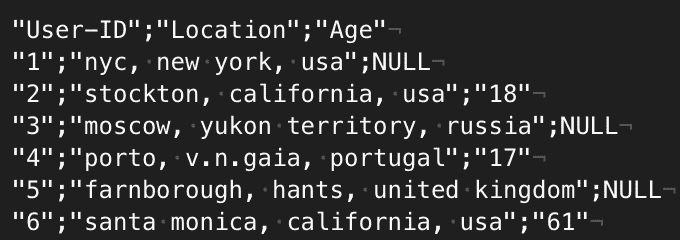
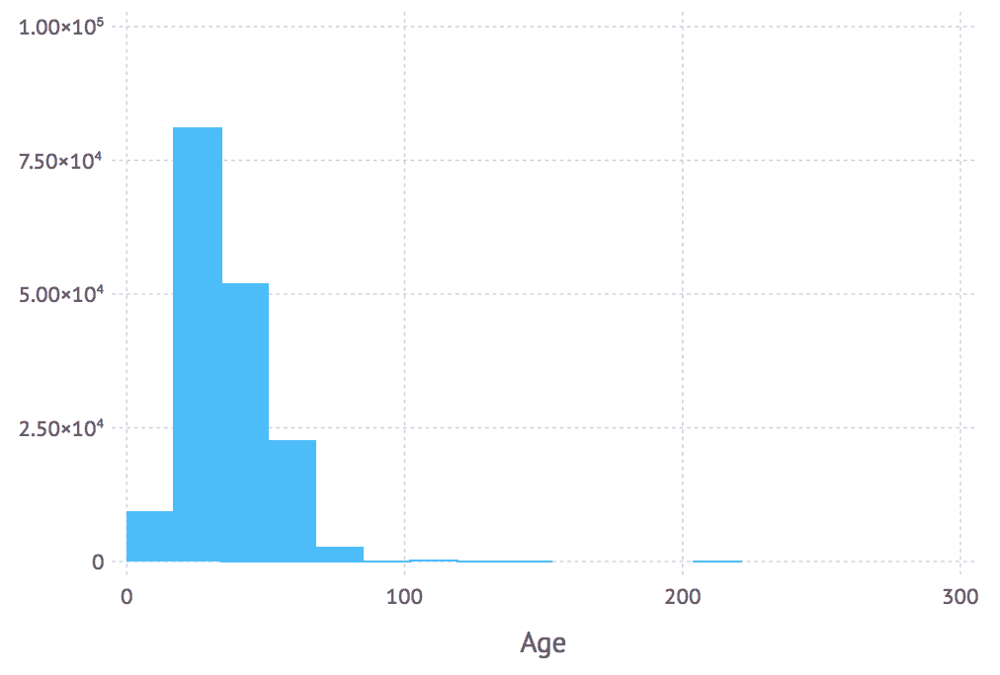
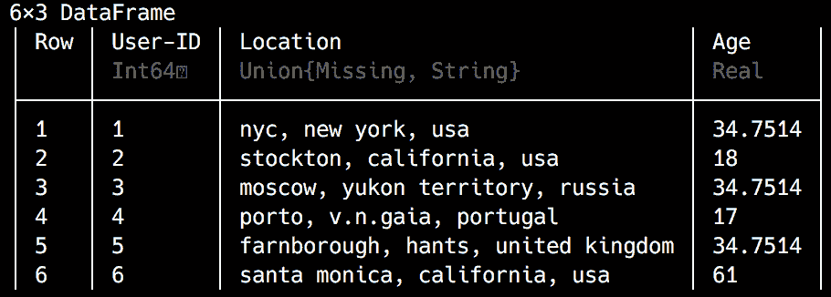
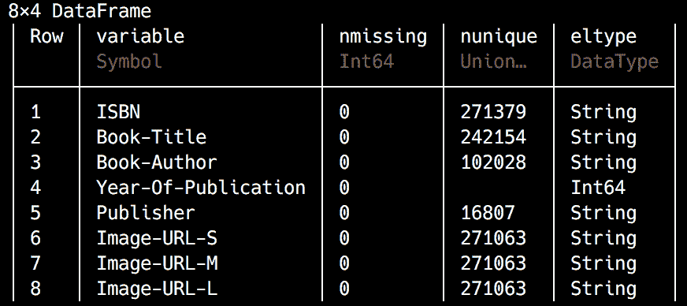
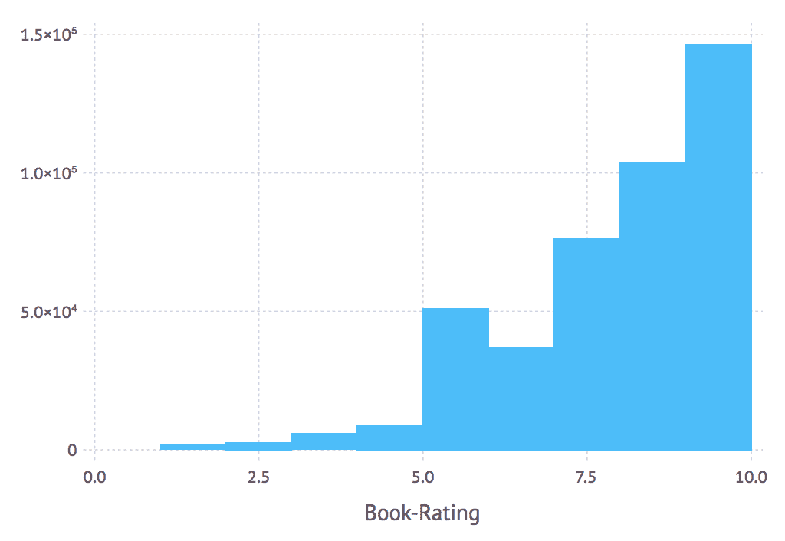
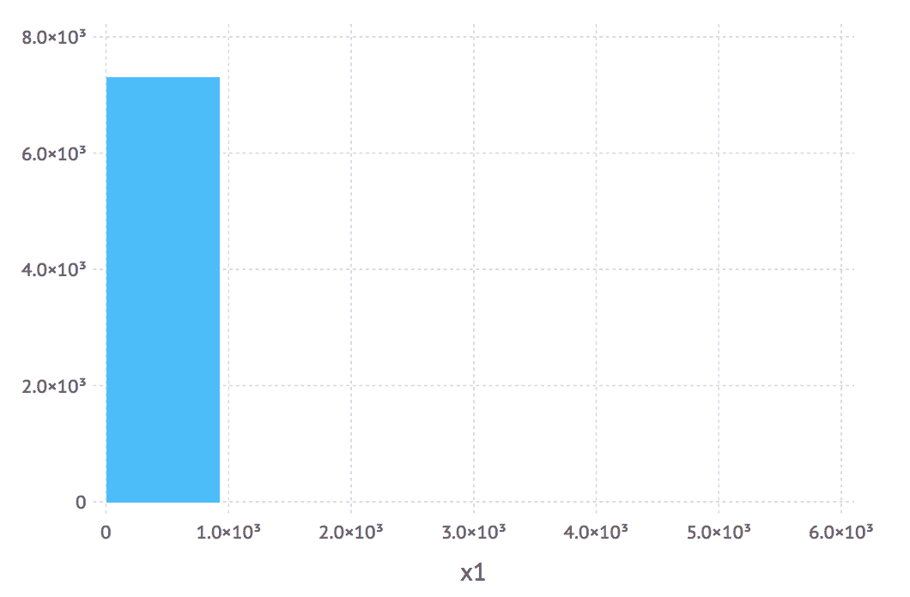
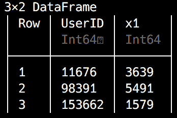
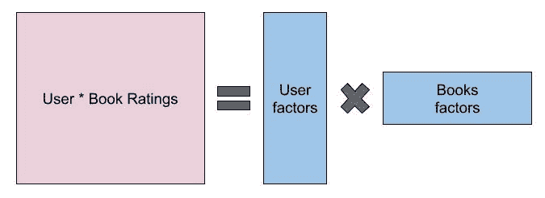
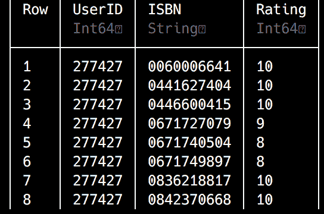

# 七、推荐系统的机器学习

我希望你现在对我们建立的推荐系统提供的惊人的可能性感到兴奋。我们所学的技术将为您提供大量的数据驯服能力和实践能力，您已经可以在您的项目中应用它们了。

然而，推荐系统远不止于此。由于其近年来的大规模应用，推荐器作为一种有效解决在线平台上产品丰富所导致的信息过载的方法，受到了很多关注，新的算法也在快速发展。事实上，我们在前一章研究的所有算法都属于一个类别，叫做**基于记忆的** **推荐器**。除此之外，还有另一个非常重要的类或推荐器，称为基于模型的**。**

 **在这一章中，我们将学习它们。我们将讨论以下主题:

*   基于记忆和基于模型的推荐系统
*   用于训练基于模型的推荐器的数据处理
*   构建基于模型的推荐器
*   混合推荐系统


# 技术要求

Julia 包生态系统正在不断发展，每天都有新的包版本发布。大多数时候这是好消息，因为新版本带来了新特性和错误修复。然而，由于许多软件包仍处于测试阶段(版本 0.x ),任何新版本都可能引入突破性的变化。因此，书中介绍的代码可能会停止工作。为了确保您的代码将产生与书中描述的相同的结果，建议使用相同的包版本。以下是本章中使用的外部软件包及其具体版本:

```
CSV@v.0.4.3
DataFrames@v0.15.2
Gadfly@v1.0.1
IJulia@v1.14.1
Recommendation@v0.1.0+
```

为了安装软件包的特定版本，您需要运行:

```
pkg> add PackageName@vX.Y.Z 
```

例如:

```
pkg> add IJulia@v1.14.1
```

或者，您可以通过下载本章提供的`Project.toml`文件并使用如下的`pkg>`实例化来安装所有使用的包:

```
julia> download("https://raw.githubusercontent.com/PacktPublishing/Julia-Projects/master/Chapter07/Project.toml", "Project.toml")
pkg> activate . 
pkg> instantiate
```


# 比较基于内存和基于模型的推荐器

了解基于内存和基于模型的推荐器的优缺点非常重要，这样我们就可以根据可用的数据和业务需求做出正确的选择。正如我们在前一章中看到的，我们可以根据推荐系统使用的数据和算法对它们进行分类。

首先，我们可以谈谈非个性化与个性化推荐。非个性化的推荐器不会考虑用户的偏好，但这并不会降低它们的用处。当相关数据丢失时，例如，对于系统的新用户或刚刚未登录的用户，它们被成功地使用。这种推荐可以包括苹果应用商店上的本周最佳应用、网飞上的热门电影、Spotify 上的每日歌曲、纽约时报畅销书、Billboard Top 10 等等。

转到个性化推荐系统，这些系统可以进一步分为基于内容的系统和协作系统。基于内容的系统通过匹配项目、规格来做出推荐。这一类的一个著名例子是潘多拉和它的音乐基因组计划。为潘多拉提供动力的音乐基因组计划是有史以来对音乐进行的最全面的分析。他们与训练有素的音乐学家一起工作，这些音乐学家聆听所有流派和年代的音乐，研究和收集每个曲目的音乐细节——总共 450 个音乐属性。Pandora 通过从其目录中挑选与用户先前喜欢的歌曲的特征(*特征*是数据科学语言，表示属性、特性或标签)紧密匹配的其他歌曲来进行推荐。

至于协同过滤，其背后的想法是，我们可以确定一个正确反映用户口味的指标，然后结合其他用户的数据集来利用它，这些用户的偏好已经被收集。潜在的假设是，如果我们有一群喜欢许多相同东西的用户，我们可以向他们中的一个人推荐另一个人的用户列表中的一些项目，这些项目还没有被目标用户发现。选项列表中不属于目标用户列表的任何项目都可以容易地作为推荐提供，因为相似的偏好将导致其他相似的选择。

这种特定类型的协同过滤被命名为基于用户的，因为该算法的主要焦点是目标用户和其他用户之间的相似性。

协作算法的另一个变体是**基于项目的过滤**。这与基于用户的过滤的主要区别在于关注的是相似的项目。哪种方法是最好的取决于具体的使用案例——当产品目录相对较小，并且比用户数量和他们的偏好更少变化时，基于项目的推荐更有效。

最后一种普遍接受的类型将推荐系统分为基于记忆的和基于模型的。*基于内存*是指系统需要将整个数据集加载到工作内存(RAM)中。这些算法依赖于与内存之间的映射，从而计算两个用户或项目之间的相似性，并通过对所有评级进行加权平均来为用户生成预测。可以使用一些计算相关性的方法，例如*皮尔森的 r* 。这种方法有一定的优势，如实现的简单性、新数据的简易性，或者结果易于解释的事实。但是，不出所料，它确实带来了显著的性能下降，当数据稀疏而数据集很大时会产生问题。

由于基于记忆的推荐系统的局限性，需要替代的解决方案，这主要是由在线业务及其底层数据的持续增长所驱动的。其特点是用户量大，产品数量越来越多。最著名的例子是网飞的百万美元竞赛——2006 年，网飞向能够将他们现有的推荐算法(名为 **Cinematch** )提高至少 10%的个人或团队提供了一百万美元的奖励。这一壮举花了三年时间才得以实现，并且是由最初的竞争者组成的联合团队完成的，他们最终决定联合起来争夺奖金。


# 了解基于模型的方法

这种推荐系统的创新方法被命名为*基于模型的*，它广泛使用了矩阵分解技术。在这种方法中，使用不同的机器学习算法来开发模型，以预测用户的评级。在某种程度上，基于模型的方法可以被视为改进基于记忆的推荐的补充技术。他们通过猜测用户有多喜欢一个新项目来解决矩阵稀疏性问题。机器学习算法用于在特定用户的现有评级向量上进行训练，然后建立一个模型，该模型可以预测用户对用户尚未尝试的某个项目的分数。流行的基于模型的技术有贝叶斯网络、**奇异值分解** ( **SVD** )、**概率潜在语义分析** ( **PLSA** )或**概率潜在语义索引** ( **PLSI** )。

有许多构建模型的流行方法:

*   **概率**:提出一个推荐被框架化为一个预测一个评级具有特定值的概率的问题。贝叶斯网络通常用于这种实现。

*   **增强型** **基于记忆的**:这是用一个模型来表示用户或物品之间的相似性，然后预测评分。获得网飞奖的 ALS-WR 算法代表了这种类型的实现。
*   **线性代数**:最后可以通过对用户和评分的矩阵进行线性代数运算来进行推荐。一种常用的算法是 SVD。

在接下来的章节中，我们将实现一个基于模型的推荐器。我们将使用第三方 Julia 包，并围绕它编写我们的业务逻辑。


# 了解我们的数据

为了从我们的**机器学习** ( **ML** )模型中得到结论性的结果，我们需要数据——而且是大量的数据。网上有许多开源数据集。例如，Kaggle 提供了大量高质量的匿名数据转储，可用于训练和实验，并可在 https://www.kaggle.com/datasets[下载。另一个著名的数据仓库是由位于 https://github.com/fivethirtyeight/data 的 FiveThirtyEight 提供的。Buzzfeed 还在 https://github.com/BuzzFeedNews 公开了大量数据。](https://www.kaggle.com/datasets)

对于我们的项目，我们将创建一个图书推荐系统。我们将使用*图书交叉数据集*，可以在[http://www2.informatik.uni-freiburg.de/~cziegler/BX/](http://www2.informatik.uni-freiburg.de/~cziegler/BX/)下载。这些数据是在 2004 年 8 月和 9 月期间，经许可，从图书交叉社区([https://www.bookcrossing.com/](https://www.bookcrossing.com/))收集的。它包括来自 278，000 个用户的超过 270，000 本书的超过 110 万个书籍评级。用户数据是匿名的，但仍然包括人口统计信息(位置和年龄，如果有的话)。我们将使用这些数据来训练我们的推荐系统，然后要求它为我们的用户提供有趣的新书。


# 首先看一下数据

数据集由三个表组成—一个用于用户，一个用于图书，一个用于评级。`BX-Users`表包含用户的数据。`User-ID`是一个连续的整数值，因为原始用户 ID 已经被匿名化。`Location`和`Age`列包含相应的人口统计信息。这并不适用于所有用户，在这些情况下，我们会遇到`NULL`值(作为`NULL`字符串)。

`BX-Books`表存储关于书籍的信息。对于唯一标识符，我们有标准的 ISBN 图书代码。除此之外，还向我们提供了书名(`Book-Title`栏)、作者(`Book-Author`)、出版年份(`Year-of-Publication`)和出版商(`Publisher`)。还提供了缩略图封面图像的 URL，对应于三种尺寸——小(`Image-URL-S`)、中(`Image-URL-M`)和大(`Image-URL-L`)。

最后，`BX-Book-Ratings`表包含实际评级。该表结构简单，有三列— `User-ID`，供用户评级；书的国际标准书号；还有`Book-Rating`，就是分数。等级用 1 到 10 来表示，越高越好。值`0`表示隐含评级。

该数据集以 SQL 和 CSV 格式提供，打包为 ZIP 存档。请从[http://www2 . informatik . uni-freiburg . de/~ cziegler/BX/BX-CSV-dump . zip](http://www2.informatik.uni-freiburg.de/~cziegler/BX/BX-CSV-Dump.zip)下载 CSV 版本。

将文件解压到你电脑上的某个地方。


# 加载数据

加载这个数据集将会更有挑战性，因为我们必须处理三个不同的文件，并且由于数据本身的特殊性。这里是`BX-Users.csv`文件的头，在一个纯文本编辑器中:



我们必须显式处理以下格式特征，否则会导致导入失败:

*   各列由`;`分隔，而不是更常用的逗号或*制表符*
*   缺少的值由字符串`NULL`表示
*   第一行是标题，代表列名
*   数据用双引号括起来`" "`，数据内部的双引号用反斜杠转义，例如`"1273";"valladolid, \"n/a\", spain";"27"`

幸运的是，CSV 包提供了额外的选项，用于在读取文件时传递所有这些信息:

```
julia> users = CSV.read("BX-Users.csv", header = 1, delim = ';', missingstring = "NULL", escapechar = '\\') 
```

加载表可能需要一点时间，但最终，我们会尝到成功的甜头——行被加载到内存中！


我们将使用相同的方法加载书籍和排名表:

```
julia> books = CSV.read("BX-Books.csv", header = 1, delim = ';', missingstring = "NULL", escapechar = '\\') 
271379×8 DataFrames.DataFrame 
# output omitted # 

julia> books_ratings = CSV.read("BX-Book-Ratings.csv", header = 1, delim = ';', missingstring = "NULL", escapechar = '\\') 
1149780×3 DataFrames.DataFrame 
# output omitted # 
```

太棒了。我们现在已经将所有三个表作为`DataFrames`加载到内存中。


# 处理缺失数据

在数据科学中，当没有为记录中的字段存储数据值时，就会出现缺失值，换句话说，就是当我们在一行中的一列没有值时。这是一个常见的场景，但尽管如此，它可能对数据的有用性产生显著的负面影响，因此需要明确地处理它。

`DataFrames`中的方法是使用`Missing`类型标记缺失值。默认行为是丢失值的传播，因此*毒害*涉及`missing`的数据操作——即涉及有效输入的操作，并且`missing`将返回`missing`或`fail`。因此，在大多数情况下，丢失的值需要在数据清理阶段解决。

处理缺失值的最常用技术如下:

*   **删除**:删除包含缺失变量的行(也称为**列表式删除**)。这种方法的缺点是会导致信息丢失。然而，如果我们有大量的数据，并且没有很多不完整的记录(比如说，不到 10%)，这是最简单的方法，也是最常用的方法。
*   **插补**:使用某种技术推断出`missing`值，通常是`mean`、`median`或`mode`。但是，您需要小心，因为这人为地减少了数据集的变化。作为替代方案，可以通过应用统计方法，使用预测模型来推断缺失值。

你可以在[https://docs.julialang.org/en/v1.0/manual/missing/](https://docs.julialang.org/en/v1.0/manual/missing/)的文档中了解更多关于 Julia 对缺失值的处理，而关于处理缺失数据的理论方面的更高级讨论可以在[https://data science . IBM . com/blog/missing-data-conundrum-exploration-and-attribute-techniques/](https://datascience.ibm.com/blog/missing-data-conundrum-exploration-and-imputation-techniques/)找到。


# 数据分析和准备

让我们感受一下数据，从用户开始:

```
julia> using DataFrames 
julia> describe(users, stats = [:min, :max, :nmissing, :nunique, :eltype]) 
```

输出如下所示:


我们选择了一些关键的统计数据——最小值和最大值、缺失值和唯一值的数量，以及数据的类型。不出所料，`User-ID`列是表的主键，从`1`开始一直到`278858`，没有丢失任何值。然而，`Age`列显示了数据错误的明显迹象——最大年龄为`244`岁！让我们通过用`Gadfly`绘制数据来看看我们有什么:

```
julia> using Gadfly 
julia> plot(users, x = :Age, Geom.histogram(bincount = 15)) 
```

输出如下所示:



我们绘制了年龄直方图，将数据分成 15 个区间。我们有一些异常值表明年龄不正确，但大多数数据分布在预期范围内，最长可达 80-90 岁。既然任何超过 100 岁的东西都不太可能是正确的，那我们就把它去掉吧。最简单的方法是过滤掉年龄大于 **100** 的所有行:

```
julia> users = users[users[:Age] .< 100, :] 
ERROR: ArgumentError: unable to check bounds for indices of type Missing 
```

哎呀！我们的`Age`列有无法比较的`missing`值。我们也可以删除这些，但在这种情况下，缺少年龄似乎更像是用户没有披露信息的症状，而不是数据错误。因此，我更倾向于保留行，同时用有效值替换丢失的数据。问题是，什么价值观？使用`mean`进行插补似乎是一个不错的选择。让我们来计算一下:

```
julia> using Statistics 
julia> mean(skipmissing(users[:Age])) 
34.75143370454978 
```

我们使用`skipmissing`函数迭代所有非缺失的`Age`值，并计算`mean`。现在，我们可以将其与`coalesce`结合使用来替换丢失的值:

```
julia> users[:Age] = coalesce.(users[:Age], mean(skipmissing(users[:Age]))) 
278858-element Array{Real,1}: 
 34.75143370454978 
 18 
 34.75143370454978 
 17 
 34.75143370454978 
# output omitted # 
```

我们用一个新的数组有效地替换了`users` `DataFrame`的`Age`列，这是将`coalesce`应用于同一个`Age`列的结果。请注意`coalesce`调用中的点，这表示它是按元素方式应用的。

很好——最后，我们需要摆脱那些错误的年龄:

```
julia> users = users[users[:Age] .< 100, :] 
278485×3 DataFrame
 # output omitted # 

julia> head(users) 
```

输出如下所示:



看起来不错！

我们已经讨论完了用户，现在让我们继续讨论图书数据:

```
julia> describe(books, stats = [:nmissing, :nunique, :eltype]) 
```

输出如下所示:



数据看起来干净多了——首先，没有丢失值。然后，看一下`nunique`的计数，我们可以知道一些书有相同的书名，并且有相当多的作者出版了不止一本书。最后，这些书来自近 17000 家出版商。

到目前为止，一切顺利，但是让我们来看看`Year-Of-Publication`:

```
julia> maximum(skipmissing(books[Symbol("Year-Of-Publication")])) 
2050 

julia> minimum(skipmissing(books[Symbol("Year-Of-Publication")])) 
0 
```

这里有些不对劲——我们有一些不合理的出版年份。有些是遥远的过去，有些是遥远的未来。我想知道分布是什么样的。让我们渲染另一个直方图:

```
julia> plot(books, x = Symbol("Year-Of-Publication"), Geom.histogram) 
```

输出如下所示:


大多数数据似乎是正确的，但也有一些错误的异常值。我们可以看看价值观:

```
julia> unique(books[Symbol("Year-Of-Publication")]) |> sort 
116-element Array{Union{Missing, Int64},1}: 
    0 
 1376 
 1378 
# output omitted # 
 2037 
 2038 
 2050 
```

乍一看，我们可以去掉出版年份等于`0`的行。我们还可以有把握地假设，发布日期大于数据收集年份(`2004`)的所有行也是错误的，因此可以删除它们。很难说接下来该怎么办，但仍然很难相信人们会对中世纪出版的书籍进行排名。让我们只保留在`1970`和`2004`之间出版的书籍:

```
julia> books = books[books[Symbol("Year-Of-Publication")] .>= 1970, :] 
264071×8 DataFrame 
# output omitted # 

julia> books = books[books[Symbol("Year-Of-Publication")] .<= 2004, :] 
263999×8 DataFrame 
# output omitted # 

julia> plot(books, x = Symbol("Year-Of-Publication"), Geom.histogram) 
```

输出如下所示:


这要好得多，而且完全合理。

最后，让我们来看看收视率:

```
julia> describe(books_ratings) 
```

输出如下所示:


没有丢失值，这很好。`Book-Rating`值介于`0`(隐式评级)和`10`之间，其中`1`至`10`代表显式评级。虽然`0.0`的中值有点令人担忧，但我们还是来看看:

```
julia> plot(books_ratings, x = Symbol("Book-Rating"), Geom.histogram) 
```

输出如下所示:


原来大部分评级都是隐性的，因此设置为`0`。这些与我们的推荐器无关，所以让我们去掉它们:

```
julia> books_ratings = books_ratings[books_ratings[Symbol("Book-Rating")] .> 0, :] 
433671×3 DataFrame 
# output omitted # 

julia> plot(books_ratings, x = Symbol("Book-Rating"), Geom.histogram) 
```

以下是输出:



我们做得很好！在我们的**提取、转换、加载** ( **ETL** )过程中还有一个步骤——让我们通过将三个`DataFrames`连接到匹配的列上来将它们放在一起，从而移除各种孤立条目(在所有其他表中没有对应行的条目)。

首先，我们将加入图书评级和图书:

```
julia> books_ratings_books = join(books_ratings, books, on = :ISBN, kind = :inner) 
374896×10 DataFrame 
# output omitted # 
```

我们使用的是`join`方法，表示我们想要连接的两个`DataFrames`，加上连接列和我们想要的连接类型。内部连接要求结果包含存在于第一个和第二个`DataFrame`中的键值行。

现在，让我们加入用户的数据:

```
julia> books_ratings_books_users = join(books_ratings_books, users, on = Symbol("User-ID"), kind = :inner) 
374120×12 DataFrame 
# output omitted # 
```

我们的数据集现在只包含有效数据，很好地打包在单个`DataFrame`中。

由于我们的评分在`1`和`10`之间，并非所有这些评分都可以被视为对该书的认可。诚然，绝大多数排名都在`5`以上，但一个`5`仍然不足以成为一个有用的推荐。假设任何以`8`开头的排名都代表一个积极的评价，并且会成为一个强有力的推荐，让我们稍微简化一下我们的数据，以使计算更快。因此，我们将只保留这些行，而丢弃其余的行:

```
julia> top_ratings = books_ratings_books_users[books_ratings_books_users[Symbol("Book-Rating")] .>= 8, :] 
217991×12 DataFrame 
# output omitted # 
```

这看起来不错，但是如果稍微调整一下，使列名对 Julia 更友好，看起来会更好:

```
julia> for n in names(top_ratings) rename!(top_ratings, n => Symbol(replace(string(n), "-"=>""))) end 
```

我们将遍历每个列名并删除破折号。这样，我们将能够使用名称，而不必每次都显式地使用`Symbol`构造函数。我们将以下列名称结束:

```
julia> names(top_ratings) 
12-element Array{Symbol,1}: 
 :UserID 
 :ISBN 
 :BookRating 
 :BookTitle 
 :BookAuthor 
 :YearOfPublication 
 :Publisher 
 :ImageURLS 
 :ImageURLM 
 :ImageURLL 
 :Location 
 :Age 
```

我们越来越接近了——我们数据处理工作流程的最后一步是检查每个用户的评论数量。我们从用户那里获得的评论越多，我们就能创建更好的偏好配置文件，从而产生更相关、更高质量的推荐。基本上，我们希望获得每个用户的评级计数，然后获得每个计数的计数(也就是说，一、二、三等的评级有多少，我们有十个评级):

```
julia> ratings_count = by(top_ratings, :UserID, df -> size(df[:UserID])[1]) 
```

这里，我们将`top_ratings`数据按`UserID`分组，并将`size`函数用作我们的`aggregation`函数，该函数返回一个维度元组——从中我们只检索它的第一个维度。我们将得到以下结果，其中`x1`列包含相应用户提供的评分数:

输出如下所示:


想知道这些数据会揭示什么？让我们来看看:

```
julia> describe(ratings_count) 
```

以下是输出:


最低评分数为`1`，而最高生产率的用户提供了不少于`5491`的评分，平均每个用户有大约`5`条评论。考虑到对评论少于`5`的用户的推荐无论如何都很弱，我们最好删除没有足够数据的用户:

```
julia> ratings_count = ratings_count[ratings_count[:x1] .>= 5, :] 
7296×2 DataFrame 
# output omitted # 
```

我们只保留至少有`5`评分的用户。现在我们来看看收视率的数字是如何分布的:

```
julia> plot(ratings_count, x = :x1, Geom.histogram(maxbincount = 6)) 
```

输出如下所示:



貌似绝大多数用户都有高达`1000`的评分。评论多的离群值怎么办？

```
julia> ratings_count[ratings_count[:x1] .> 1000, :] 
```

输出如下所示:



只有`3`个用户。我们最好删除它们，这样它们就不会影响我们的结果:

```
julia> ratings_count = ratings_count[ratings_count[:x1] .<= 1000, :] 
7293×2 DataFrame 
# output omitted # 
```

现在我们有了最终用户的列表，下一步是从`top_ratings` `DataFrame`中删除所有其他用户。同样，让我们使用内部连接—这非常简单:

```
julia> top_ratings = join(top_ratings, ratings_count, on = :UserID, kind = :inner) 
150888×13 DataFrame 
# output omitted # 
```

就这样，我们的数据准备好了。干得好！

如果需要，您可以使用`CSV.write`将这些数据保存到文件中:

```
julia> CSV.write("top_ratings.csv", top_ratings) 
```

如果你跟不上，不要担心。在几个段落中，我将解释如何加载一个现成的数据集，它在本章的支持文件中提供。


# 训练我们的数据模型

根据使用的方法和数据类型，机器学习可以分为四种主要类型:

*   监督
*   无人监督的
*   半监督的
*   加强

在监督学习中，我们从包含训练(或教学)数据的数据集开始，其中每个记录都被标记，表示输入值(姑且称之为 *X* )和输出值(名为 *Y* )。然后，算法的工作就是从输入到输出识别一个函数 *f* ，使得 *Y = f(X)* 。一旦确定了此函数，就可以对新数据(即未标记的新输入)使用它来预测输出。根据需要计算的输出类型，如果必须将输出分配给某一类实体(如所示，它表示分类数据)，那么将使用分类算法。或者，如果输出的类型是一个数值，我们将处理一个回归问题。

在无监督的机器学习中，我们有输入，但没有输出。在这种情况下，一旦我们使用学习数据集来训练我们的系统，主要目标将是数据聚类，即生成不同的输入聚类，并能够将新数据分配给最合适的聚类。

半监督，顾名思义，代表了前面描述的两种方法的混合，这两种方法都适用于我们的数据包含标记和未标记记录的情况。

在强化学习中，算法被告知其先前决策的成功。基于此，该算法修改其策略以最大化结果。

根据学习风格和要解决的具体问题，有许多算法可以应用。对于监督学习，我们可以使用回归(线性或逻辑)，决策树，或神经网络，仅举几例。有了无监督学习，我们可以选择 k 均值聚类或`Apriori`算法。

由于我们的数据被标记(我们有每个用户的评级)，我们正在处理一个有监督的机器学习问题。对于我们的测试用例，由于我们的数据被表示为一个矩阵，我们将使用一个叫做**矩阵分解** ( **MF** )的算法。

你可以在以下链接阅读更多关于各种类型的 ML 算法以及如何选择它们的内容:
[https://docs . Microsoft . com/en-us/azure/machine-learning/studio/algorithm-choice](https://docs.microsoft.com/en-us/azure/machine-learning/studio/algorithm-choice) [https://blog . statsbot . co/machine-learning-algorithms-183 cc 73197 c](https://blog.statsbot.co/machine-learning-algorithms-183cc73197c) [https://elitedatascience.com/machine-learning-algorithms](https://elitedatascience.com/machine-learning-algorithms) [https://machinelingmentmastery . com/a-tour-of](https://machinelearningmastery.com/a-tour-of-machine-learning-algorithms/)


# 缩小我们的数据集

大规模训练机器学习模型通常需要(大量)功能强大的计算机和大量时间。如果你在阅读这本书的时候这两个都没有，我准备了一个更小的数据集，这样你就可以浏览我们的项目了。

在我的四核 16 GB RAM 笔记本电脑上，对推荐者进行完整的`top_ratings`数据训练花了 24 个多小时。如果你愿意，请随意尝试。也可以在[https://github . com/packt publishing/Julia-Projects/blob/master/chapter 07/data/large/top _ ratings . CSV . zip](https://github.com/PacktPublishing/Julia-Projects/blob/master/Chapter07/data/large/top_ratings.csv.zip)下载。

但是，如果您想在阅读本章时遵循代码，请下载本章支持文件提供的`top_ratings.csv`文件，网址为[https://github . com/packt publishing/Julia-Projects/blob/master/chapter 07/data/top _ ratings . CSV](https://github.com/PacktPublishing/Julia-Projects/blob/master/Chapter07/data/top_ratings.csv)。在本章的剩余部分，我将使用这个小文件中的数据。

一旦你下载了文件，你可以通过使用`CSV.read`函数将它的内容加载到`top_ratings`变量中:

```
julia> top_ratings = CSV.read("top_ratings.csv")  
11061×13 DataFrame 
# output omitted # 
```


# 训练与测试数据

机器学习实现中的一个常见策略是将数据分成训练(大约 80-90%)和测试(剩余的 10-20%)数据集。首先，我们将初始化两个空的`DataFrames`来存储这些数据:

```
julia> training_data = DataFrame(UserID = Int[], ISBN = String[], Rating = Int[]) 
0×3 DataFrame 

julia> test_data = DataFrame(UserID = Int[], ISBN = String[], Rating = Int[]) 
0×3 DataFrame 
```

接下来，我们将遍历我们的`top_ratings`，并将内容放入相应的`DataFrame`。我们将使用 10%的数据进行测试——因此在每次迭代中，我们将在`1`和`10`之间生成一个随机整数。显然，得到一个`10`的机会是十分之一，所以当我们得到它时，我们将相应的行放入测试数据集中。否则，它进入训练模式，如下所示:

```
julia> for row in eachrow(top_ratings)
 rand(1:10) == 10 ? 
 push!(test_data, convert(Array, row[[:UserID, :ISBN, :BookRating]])) :
 push!(training_data, convert(Array, row[[:UserID, :ISBN, :BookRating]]))
 end 
```

没有规范的方法将一个`DataFrameRow`推到另一个`DataFrame`上，所以我们使用一种推荐的方法，即将行转换成一个`Array`并将`push!`转换成`DataFrame`。我们的训练和测试数据集现已准备就绪。

对我来说，它们看起来像这样，但是因为数据是随机生成的，所以对你来说会有所不同:

```
julia> test_data 
1056×3 DataFrame
 # output omitted # 

julia> training_data 
10005×3 DataFrame 
# output omitted # 
```

如果您希望我们使用相同的数据集，您可以从本章的支持文件(分别位于[https://github . com/packt publishing/Julia-Projects/blob/master/chapter 07/data/training _ data . CSV](https://github.com/PacktPublishing/Julia-Projects/blob/master/Chapter07/data/training_data.csv)和[https://github . com/packt publishing/Julia-Projects/blob/master/chapter 07/data/test _ data . CSV](https://github.com/PacktPublishing/Julia-Projects/blob/master/Chapter07/data/test_data.csv))下载数据转储，并按如下方式读取它们:

```
julia> test_data = CSV.read("data/test_data.csv") 
julia> training_data = CSV.read("data/training_data.csv") 
```


# 基于机器学习的推荐

Julia 的生态系统提供了对`Recommendation.jl`的访问，这是一个实现了大量个性化和非个性化推荐算法的包。对于基于模型的推荐器，它支持 SVD、MF 和使用 TF-IDF 评分算法的基于内容的推荐。

还有另一个非常好的选择——套餐([https://github.com/cstjean/ScikitLearn.jl](https://github.com/cstjean/ScikitLearn.jl))。这在 Julia 中实现了 Python 非常流行的 scikit-learn 接口和算法，支持来自 Julia 生态系统的模型和 scikit-learn 库的模型(通过`PyCall.jl`)。Scikit 网站和文档可在 http://scikit-learn.org/stable/[找到。它非常强大，绝对值得记住，尤其是对于构建高效的产品级推荐器。出于学习目的，我们将坚持使用`Recommendation`，因为它提供了一个更简单的实现。](http://scikit-learn.org/stable/)


# 提出带有建议的建议

对于我们的学习示例，我们将使用`Recommendation`。它是可用选项中最简单的，也是一个很好的教学设备，因为它将允许我们进一步试验它的即插即用算法和可配置的模型生成器。

在我们做任何有趣的事情之前，我们需要确保我们已经安装了这个包:

```
 pkg> add Recommendation#master  
 julia> using Recommendation 
```

请注意，我使用的是`#master`版本，因为在我写这本书的时候，标记的版本还没有完全更新到 Julia 1.0。

使用`Recommendation`设置推荐器的工作流程包括三个步骤:

1.  设置训练数据

2.  使用可用算法之一来实例化和训练推荐器

3.  训练完成后，征求建议

让我们实现这些步骤。


# 设置训练数据

`Recommendation`使用一个`DataAccessor`对象来设置训练数据。这可以用一组`Event`对象来实例化。`Recommendation.Event`是一个表示用户-项目交互的对象。它是这样定义的:

```
struct Event 
    user::Int 
    item::Int 
    value::Float64 
end 
```

在我们的例子中，`user`字段将代表`UserID`,`item`字段将映射到 ISBN，而`value`字段将存储`Rating`。然而，还需要做一些工作来使我们的数据符合`Recommendation`所要求的格式:

1.  首先，我们的 ISBN 数据存储为字符串，而不是整数。
2.  第二，在内部，`Recommendation`构建一个稀疏矩阵`user` * ` item`并存储相应的值，使用顺序 id 设置矩阵。然而，我们实际的用户 id 是很大的数字，`Recommendation`将建立一个非常大的稀疏矩阵，从最小到最大的用户 id。

这意味着，例如，我们的数据集中只有 69 个用户(由`unique(training_data[:UserID]) |> size`确认)，最大的 ID 是 277，427，而对于书籍，我们有 9，055 个唯一的 ISBNs。如果我们这样做，`Recommendation`将创建一个 277，427 x 9，055 的矩阵，而不是一个 69 x 9，055 的矩阵。这个矩阵将会非常大、稀疏且低效。

因此，我们需要做更多的数据处理来将原始的用户 id 和 ISBNs 映射到连续的整数 id，从 1 开始。

我们将使用两个`Dict`对象来存储从`UserID`和`ISBN`列到推荐者的顺序用户和图书 id 的映射。每个条目将采用`dict[original_id] = sequential_id`的形式:

```
julia> user_mappings, book_mappings = Dict{Int,Int}(), Dict{String,Int}() 
```

我们还需要两个计数器来跟踪和递增顺序 id:

```
julia> user_counter, book_counter = 0, 0 
```

我们现在可以为我们的训练数据准备`Event`对象了:

```
julia> events = Event[] 
julia> for row in eachrow(training_data) 
 global user_counter, book_counter user_id, book_id, rating = row[:UserID], row[:ISBN], row[:Rating] haskey(user_mappings, user_id) || (user_mappings[user_id] = (user_counter += 1)) haskey(book_mappings, book_id) || (book_mappings[book_id] = (book_counter += 1)) push!(events, Event(user_mappings[user_id], book_mappings[book_id], rating)) end
```

这将用`Recommendation.Event`的实例填充 events 数组，这些实例代表唯一的`UserID`、`ISBN`和`Rating`组合。给你一个概念，它看起来像这样:

```
julia> events 
10005-element Array{Event,1}: 
 Event(1, 1, 10.0) 
 Event(1, 2, 8.0) 
 Event(1, 3, 9.0) 
 Event(1, 4, 8.0) 
 Event(1, 5, 8.0) 
 # output omitted #
```

请记住这个非常重要的方面——在 Julia 中，`for`循环定义了一个新的作用域。这意味着在`for`循环外定义的变量在循环内是不可访问的。为了使它们在循环体中可见，我们需要将它们声明为`global`。

现在，我们准备设置我们的`DataAccessor`:

```
julia> da = DataAccessor(events, user_counter, book_counter) 
```


# 建立和训练推荐器

至此，我们已经拥有了实例化推荐器所需的所有东西。一个非常有效和常见的实现使用 MF——不出所料，这是`Recommendation`包提供的选项之一，所以我们将使用它。


# 矩阵分解

MF 背后的想法是，如果我们从一个大的稀疏矩阵开始，就像用于表示*用户 x 简档*评级的矩阵，那么我们可以将其表示为多个更小更密集的矩阵的乘积。挑战在于找到这些更小的矩阵，使它们的乘积尽可能接近我们的原始矩阵。一旦我们有了这些，我们可以填充原始矩阵中的空白，以便预测值将与矩阵中的现有评级一致:



我们的*用户 x 图书*评级矩阵可以表示为更小和更密集的用户和图书矩阵之间的乘积。

为了执行矩阵分解，我们可以使用一些算法，其中最流行的是 SVD 和**随机梯度下降** ( **SGD** )。`Recommendation`使用 SGD 进行矩阵分解。

其代码如下所示:

```
julia> recommender = MF(da) 
julia> build(recommender) 
```

我们实例化一个新的 MF 推荐器，然后构建它——也就是训练它。构建步骤可能需要一段时间(在使用本章支持文件中提供的小型数据集的高端计算机上需要几分钟)。

如果我们想调整训练过程，因为 SGD 实现了矩阵分解的迭代方法，我们可以向 build 函数传递一个`max_iter`参数，询问它最大迭代次数。理论上，我们做的迭代越多，推荐就越好——但是训练模型的时间就越长。如果想加快速度，可以用`30`或更少的`build(recommender, max_iter = 30)`调用构建函数。

我们可以为学习率传递另一个可选参数，例如`build (recommender, learning_rate=15e-4, max_iter=100)`。学习率指定了优化技术在每次迭代之间应该如何积极地变化。如果学习率太小，优化将需要运行很多次。如果它太大，那么优化可能会失败，产生比以前的迭代更差的结果。


# 提出建议

既然我们已经成功地构建并训练了我们的模型，我们可以向它寻求建议了。这些是由`recommend`函数提供的，该函数接受一个推荐者的实例、一个用户 ID(来自训练矩阵中可用的用户 ID)、推荐的数量和一个图书 ID 数组(从中可以做出推荐)作为其参数:

```
julia> recommend(recommender, 1, 20, [1:book_counter...]) 
```

使用这行代码，我们检索推荐者 ID 为`1`的用户的推荐，它对应于原始数据集中的`UserID` `277427`。我们要求从所有可获得的书籍中挑选出最多`20`本推荐。

我们得到一个由图书 id 和推荐分数组成的`Pair`数组:

```
20-element Array{Pair{Int64,Float64},1}: 
 5081 => 19.1974 
 5079 => 19.1948 
 5078 => 19.1946 
 5077 => 17.1253 
 5080 => 17.1246 
 # output omitted # 
```


# 测试建议

最后，我们的基于机器学习的推荐系统已经完成。毫无疑问，这将极大地提升任何书店的用户体验。但是在我们开始宣传它之前，我们应该确保它是可靠的。请记住，我们留出 10%的数据集用于测试。想法是将推荐与来自测试数据的实际评级进行比较，以查看两者之间存在的相似程度；也就是说，来自数据集的实际评级中有多少实际上是被推荐的。根据用于训练的数据，您可能希望测试是否给出了正确的推荐，以及是否不包括不好的推荐(也就是说，推荐者不推荐评分低的项目，表示不喜欢)。因为我们只使用了 8、9 和 10 的评级，所以我们不会检查是否提供了排名较低的推荐。我们将只关注检查有多少推荐实际上是用户数据的一部分。

因为测试数据使用原始的用户和配置文件 id，而我们的推荐器使用规范化的顺序 id，所以我们需要一种方法在两者之间转换数据。我们已经有了`user_mappings`和`book_mappings`字典，它们从原始 id 映射到推荐者 id。然而，我们也需要反过来。因此，让我们从定义一个用于反转字典的辅助函数开始:

```
julia> function reverse_dict(d) Dict(value => key for (key, value) in d) end 
```

这很简单，但是非常有用——我们现在可以使用这个函数根据推荐者 id 来查找原始 id。例如，如果我们想测试用户`1`的推荐，我们需要检索这个用户的实际评分，所以我们需要原始的 ID。我们可以用下面的代码很容易地得到它:

```
julia> reverse_dict(user_mappings)[1] 
277427 
```

这同样适用于图书映射——例如，ID 为`5081`的推荐对应于原始数据集中的 ISBN `981013004X`:

```
julia> reverse_dict(book_mappings)[5081] 
"981013004X" 
```

好了，让我们检查一下我们为`UserID` `277427`(推荐用户`1`)预留的测试数据:

```
julia> user_testing_data = test_data[test_data[:UserID] .== reverse_dict(user_mappings)[1], :] 
8×3 DataFrame 
```

输出如下所示:



```
testing_data DataFrame by doing an element-wise comparison—for each row, it checks if the UserID column equals 277427 (which is the ID returned by reverse_dict(user_mappings)[1], remember?). If yes, then the  whole row is added to user_testing_data.
```

为了检查推荐的和实际评价的简档，最简单的方法是将推荐向量和评价向量相交。所以，首先要做的是把测试评级放入一个向量，从`DataFrame`中取出:

```
julia> test_profile_ids = user_testing_data[:, :ISBN] 
8-element Array{Union{Missing, String},1}: 
 "0060006641" 
 "0441627404" 
 "0446600415" 
 "0671727079" 
 "0671740504" 
 "0671749897" 
 "0836218817" 
 "0842370668" 
```

我们只选择所有行的 ISBN 列数据作为`Array`。

对推荐做同样的事情要复杂一些。此外，由于我预计我们会希望使用各种推荐器设置和不同数量的推荐进行测试，因此最好定义一个函数，将推荐转换为 ISBNs 的向量，以便我们可以轻松地重用代码:

```
julia> function recommendations_to_books(recommendations) 
           [reverse_dict(book_mappings)[r[1]] for r in recommendations] 
       end 
```

`recommendations_to_books`函数将推荐器生成的`id => score`对的向量作为其唯一的参数，并将其转换为原始 ISBNs 的向量:

```
julia> recommendations_to_books(recommend(recommender, 1, 20, [1:book_counter...])) 
20-element Array{String,1}: 
 "981013004X" 
 "1856972097" 
 "1853263656" 
 "1853263133" 
 "1857231791"
 # output omitted #
```

`recommendations_to_books`函数输出`20`推荐书籍的 ISBNs。

现在，我们有了检查推荐和评级的所有要素:

```
julia> intersect(test_profile_ids, recommendations_to_books(recommend(recommender, 1, 500, [1:book_counter...]))) 
1-element Array{Union{Missing, String},1}: 
 "0441627404"  
```

我们使用 intersect 函数来检查第一个向量中的哪些元素——我们放在一边进行测试的书籍列表——也出现在第二个向量中，即推荐。我们不得不寻求`500`的建议，因为在 9055 本书中找到 8 本书中的一本的可能性非常小。这是因为我们处理的数据非常少，但是在生产环境中，可能会有数十亿行，我们会得到更多的重叠数据。

让我们看看前五大推荐是什么:

```
julia> for i in recommendations_to_books(recommend(recommender, 1, 20, [1:book_counter...])) top_ratings[top_ratings.ISBN .== i, :BookTitle] |> println end  

Union{Missing, String}["Fun With Chinese Characters Volume 1"] 
Union{Missing, String}["Fantasy Stories (Story Library)"] 
Union{Missing, String}["The Wordsworth Complete Guide to Heraldry (Wordsworth Reference)"] 
Union{Missing, String}["The Savoy Operas (Wordsworth Collection)"] 
Union{Missing, String}["Against a Dark Background"] 
```

在 IJulia 笔记本中，我们甚至可以查看封面，从而使用封面的 URL 呈现一小段 HTML:

```
thumbs = DataFrame(Thumb = String[]) 

for i in recommendations_to_profiles(recommend(recommender, 1, 20, [1:book_counter...])) 
    push!(thumbs, top_ratings[top_ratings.ISBN .== i, :ImageURLL]) 
end 

for img in thumbs[:, :Thumb] 
    HTML("""""") |> display 
end 
```

输出如下所示:


太棒了。我们做得很好。我们驯服了一个非常复杂的数据集，执行了高级分析，然后针对我们的推荐器对其进行了优化。然后，我们成功地训练了我们的推荐器，并使用它为我们的用户生成图书推荐。

部署和使用`Recommendation`包是非常简单的，我相信您已经意识到这一点。同样，在大多数数据科学项目中，ETL 步骤是最复杂的。


# 了解混合推荐系统

使用基于模型的推荐器有一些明显的优势。如前所述，可伸缩性是最重要的因素之一。通常，模型比初始数据集小得多，因此即使对于非常大的数据样本，模型也足够小，可以有效地使用。另一个好处是速度。与查询整个数据集相比，查询模型所需的时间通常要少得多。

这些优势源于模型通常是离线准备的，允许几乎即时的推荐。但是由于没有免费的性能，这种方法也有一些明显的缺点——一方面，它不太灵活，因为构建模型需要相当多的时间和资源，使得更新困难且成本高；另一方面，因为它不使用整个数据集，所以预测可能不太准确。

和所有事情一样，没有灵丹妙药，最佳方法取决于您手头的数据和您需要解决的问题。然而，它并不总是基于内存而不是基于模型。更重要的是，它不一定只是一个推荐系统。事实证明，多种算法和方法可以有效地结合起来，以弥补一种类型的推荐器的局限性。这样的架构被称为**混合**。由于篇幅的限制，我们不会讨论混合推荐系统的任何实现，但是我想给你一些可能的方法。我将向你推荐罗宾·伯克的分类，来自*自适应网络*的第 12 章，标题为*混合网络推荐系统*。整个章节可在[https://www . researchgate . net/publication/20012 10 24 _ Hybrid _ Web _ Recommender _ Systems](https://www.researchgate.net/publication/200121024_Hybrid_Web_Recommender_Systems)上免费在线下载。如果你对这个话题感兴趣，我强烈推荐。


# 摘要

推荐系统代表了一个非常活跃和动态的研究领域。它们最初是作为机器学习算法和技术的边缘应用而开始的，但由于它们的实际商业价值，近年来它们已经成为主流。如今，几乎所有主要的编程语言都提供了强大的推荐系统库——所有主要的在线企业都以这样或那样的形式雇佣推荐者。

由于其出色的性能，Julia 是构建推荐器的绝佳语言。尽管这种语言还很年轻，但我们已经有了几个有趣的包可供选择。

现在，您已经对基于模型的推荐系统及其实现工作流有了坚实的理解——在理论和实践层面上都是如此。此外，在我们的旅程中，我们还接触到了使用`DataFrames`的更高级的数据争论，这是 Julia 数据科学武库中的一个无价工具。

在下一章中，我们将进一步提高对`DataFrames`的掌握，因为我们将在 Julia 中学习元编程的秘密，同时开发一个无监督的机器学习系统。**