<title>Leveraging Unsupervised Learning Techniques</title>  

# 利用无监督学习技术

我们的监督机器学习项目是成功的，我们正在成为推荐系统的专家。现在是时候将我们整洁标记的数据的安全性抛在身后，进入未知领域了。是的，我说的是无监督的机器学习。在这一章中，我们将训练一个模型，帮助我们在堆积如山的数据中找到隐藏的模式。既然我们已经在学习 Julia 的旅程中走了这么远，是时候放下训练的车轮，接受我们的第一个客户了。

开个玩笑——现在，我们将玩假装，但我们确实会解决机器学习问题，这很可能是初级数据科学家的首要任务之一。我们将帮助我们的假想客户发现支持其广告战略的关键见解，这是他们在旧金山开展业务的一个非常重要的组成部分。

在此过程中，我们将了解以下内容:

*   什么是无监督机器学习，何时以及如何使用它
*   聚类的基础，最重要的无监督学习任务之一
*   如何借助查询进行高效的数据管理
*   Julia 中的元编程
*   通过聚类训练和运行无监督机器学习模型

<title>Technical requirements</title>  

# 技术要求

Julia 包生态系统正在不断发展，每天都有新的包版本发布。大多数时候这是好消息，因为新版本带来了新特性和错误修复。然而，由于许多软件包仍处于测试阶段(版本 0.x ),任何新版本都可能引入突破性的变化。因此，书中介绍的代码可能会停止工作。为了确保您的代码将产生与书中描述的相同的结果，建议使用相同的包版本。以下是本章中使用的外部软件包及其具体版本:

```
CSV@v.0.4.3
DataFrames@v0.15.2
DataValues@v0.4.5
Gadfly@v1.0.1
IJulia@v1.14.1
Query@v0.10.1
```

为了安装软件包的特定版本，您需要运行:

```
pkg> add PackageName@vX.Y.Z 
```

例如:

```
pkg> add IJulia@v1.14.1
```

或者，您可以通过下载本章提供的`Project.toml`文件并使用如下的`pkg>`实例化来安装所有使用的包:

```
julia> download("https://raw.githubusercontent.com/PacktPublishing/Julia-Programming-Projects/master/Chapter08/Project.toml", "Project.toml")
pkg> activate . 
pkg> instantiate
```

<title>Unsupervised machine learning</title>  

# 无监督机器学习

在[第 7 章](a3fe07c4-b551-4573-ba72-edba84b1041a.xhtml)、*推荐系统的机器学习*中，我们学习了有监督的机器学习。我们使用数据中的各种特征(比如用户的评分)来执行分类任务。在监督机器学习中，我们的行为有点像老师——我们为我们的算法提供大量例子，一旦它获得足够的数据(因此它的训练完成)，它就能够对新项目进行归纳，并推断出它们的类别或类别。

但是并不是所有的数据都适合这些任务。有时我们的数据没有任何标记。想象一下各种各样的项目，如网站的流量日志或客户在牙科诊所的预约。这些只是原始的观察，没有以任何方式分类，也不包含任何意义。在这种情况下，数据分析师采用无监督的机器学习算法。

无监督机器学习用于发现未标记数据中的隐藏结构和模式。这是一项非常强大的机器学习任务，已成功应用于多个领域，如营销(识别具有相似购买偏好的客户群)、医学(用于发现肿瘤)、It 安全(通过标记异常用户行为或网络流量)、税收(对可能的逃税发出警报)等等。

如果我们简单地忽略提供数据分类的特征，任何有监督的机器学习任务都可以被视为无监督的。例如，如果我们不想考虑物种列，我们可以使用著名的 Iris flower 数据集来执行无监督学习。这将给我们留下未标记的萼片和花瓣的长度和宽度，这可能形成有趣的簇。

正如我们在[第 1 章](90a7f09d-d63b-45d7-baf5-576470d0910f.xhtml)、【Julia 编程入门中看到的， **setosa** 可以被可靠地识别，因为它始终具有较低的花瓣长度和宽度。但是**云芝**和**海滨锦葵**？没有那么多。您可以在下图中看到这一点:

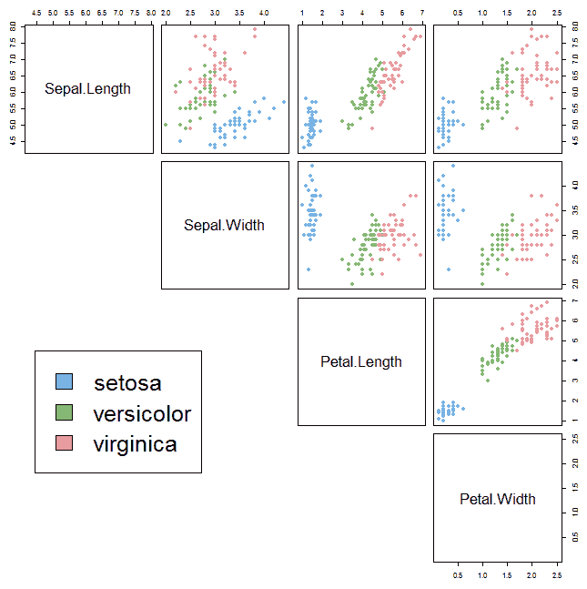

该图展示了 **setosa** 如何在几乎所有的情节中形成独特的集群——但是 **versicolor** 和 **virginica** 没有。这就是无监督学习。很简单，对吧？

不完全是这样——事情会变得更棘手。在我们的鸢尾花的例子中，当我们根据物种对图进行颜色编码时，我们做了一点手脚。所以，数据并不是真的没有标注。在一个真实的无监督学习场景中，图看起来像这样，所有的物种信息都被删除了:

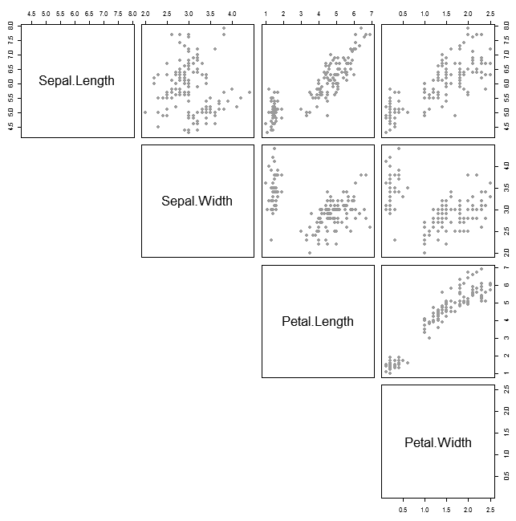

即使没有颜色和标签，由于点的分布是相同的，我们仍然可以很容易地识别出 **setosa** 星团。除此之外，很明显，如果没有物种标签，我们完全不知道它代表什么。而且这是非常重要的一点——*算法不能自己标记聚类*。它可以识别各种数据点之间的相似程度，但它不能说出那个*意味着什么*(它不会知道它是 **setosa** )。由此得出的推论是，没有定义集群的正确方法。它们是探索性数据挖掘技术的结果，就像探索未知领域一样，采取稍微不同的途径(从不同的角度看数据)会导致不同的结果。套用一句名言，集群存在于观察者的眼中。

无监督机器学习最常见的任务定义如下:

*   **聚类(或聚类分析)**:聚类用于识别和分组与其他潜在组或聚类中的项目相比彼此更相似的对象。通过使用数据特征中存在的一些度量来进行比较。
*   **异常检测**:用于标记不符合预期模式的实体，如数据集中其他项目所定义的。它们很重要，因为一般来说，异常表示某种问题，如银行或税务欺诈、软件错误或医疗状况。

在本章的剩余部分，我们将专门关注聚类——一项非常有用和有价值的无监督机器学习任务。我们将仔细研究聚类背后的理论，然后我们将使用旧金山的商业数据实现一个无监督的机器学习项目。

<title>Clustering</title>  

# 使聚集

您现在可能已经意识到，对于数据科学，几乎总是有多种途径来解决问题。在算法层面，根据数据的特殊性和我们试图解决的特定问题，我们通常会有不止一个选择。丰富的选择通常是好消息，因为根据具体情况，一些算法可以产生比其他算法更好的结果。聚类也不例外——有一些众所周知的算法可用，但我们必须了解它们的优势和局限性，以避免最终出现不相关的聚类。

著名的 Python 机器学习库 Scikit-learn 通过使用几个玩具数据集来说明这一点。数据集产生容易识别的图，使人类很容易识别聚类。然而，应用无监督学习算法将导致截然不同的结果——其中一些与我们人类模式识别能力告诉我们的明显矛盾:

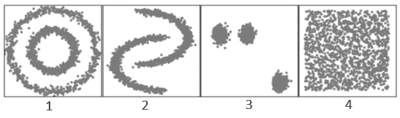

前面的四幅图说明了以下情况:

1.  两个同心圆形星团
2.  两条曲线
3.  三个斑点
4.  由均匀分布的值组成的正方形，形成一个簇

对分类进行颜色编码将产生下图:

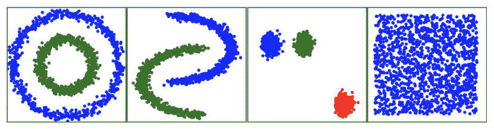

利用我们天生的模式识别能力，我们可以很容易地看到定义良好的集群。

如果集群对你来说足够明显，你可能会惊讶地发现，当谈到机器学习时，事情并不是那么明确。下面是一些最常见的算法如何解释数据(下图和所有测试细节可在 Scikit-learn 网站[http://scikit-learn.org](http://scikit-learn.org)获得):

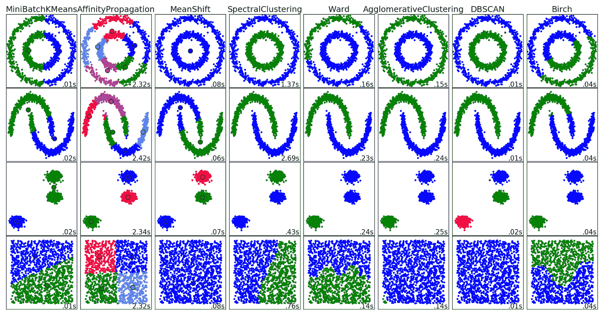

该图显示了颜色编码的聚类以及八种著名算法的计算时间，这八种算法是:MiniBatchKMeans、Affinity Propagation、Mean Shift、Spectral Clustering、Ward、aggregated Clustering、DBSCAN 和 Birch。

<title>Data analysis of the San Francisco business</title>  

# 旧金山商业的数据分析

作为本章的学习项目，假设我们被一个新客户雇佣了，这个客户就是著名的 ACME Recruiting。他们是一家大型人力资源公司，想在旧金山新开一家办事处。他们正在制定一个非常雄心勃勃的营销策略来配合他们的发布。ACME 希望通过广告牌开展户外活动；在公共汽车、出租车和自行车上使用带有海报的交通广告；使用直邮，通过蜗牛邮件发送传单。

他们以商业客户为目标，来找我们帮助他们做两件事:

*   他们想知道开展活动的最佳区域，在哪里放置广告牌，在什么公交线路上放置广告，以及将传单发送到什么邮件地址。
*   他们希望了解市场的招聘需求，以便与具备所需资格的专业人士取得联系。

我们的计划是使用一个包含在旧金山注册的公司信息的数据库，并采用聚类形式的无监督学习，来检测公司密度最高的区域。这是 ACME 应该花广告费的地方。一旦我们确定了他们的目标公司，我们就能知道他们的活动领域。我们的客户将使用这些信息来评估他们的招聘需求。

在数据方面，我们有了一个良好的开端，因为旧金山市在 https://data.sfgov.org 公开了许多有趣的数据。浏览网站，我们可以找到一个注册纳税企业的数据库。它提供了大量的信息，包括名称、地址、开业和关门日期(如果商店关门了)、地理位置坐标(有时还有邻居的名字)等等。

您可以点击工具栏中的导出按钮在[https://data . SF gov . org/Economy-and-Community/Map-of-Registered-Business-Locations/ednt-jx6u](https://data.sfgov.org/Economy-and-Community/Map-of-Registered-Business-Locations/ednt-jx6u)下载该文件，或者使用直接下载网址:[https://data.sfgov.org/api/views/ednt-jx6u/rows.csv?accessType =下载](https://data.sfgov.org/api/views/ednt-jx6u/rows.csv?accessType=DOWNLOAD)。

然而，我强烈建议使用本章的支持文件中提供的文件，只是为了确保我们使用完全相同的数据，并且如果您继续操作，会得到相同的结果。请从[https://github . com/packt publishing/Julia-Programming-Projects/blob/master/chapter 08/data/Map _ of _ Registered _ Business _ locations . CSV . zip](https://github.com/PacktPublishing/Julia-Programming-Projects/blob/master/Chapter08/data/Map_of_Registered_Business_Locations.csv.zip)下载。

对于每个条目，我们还会得到**北美行业分类系统** ( **NAICS** )代码，这是(联邦统计机构在对商业机构进行分类时使用的标准，目的是收集、分析和发布与美国商业经济相关的统计数据)。这很重要，因为我们将使用它来确定最常见的业务类型，这将有助于我们的客户吸引相关的候选人。

在我们的数据集中，NAICS 代码表示为一个范围，例如 4400–4599。幸运的是，我们还得到相应活动部门的名称。在本例中，4400–4599 代表*零售贸易*。

是时候加载数据并切片了！现在，我相信你已经知道该怎么做了:

```
julia> using CSV, DataFrames  
julia> df = CSV.read("Map_of_Registered_Business_Locations.csv") 
```

使用`describe(df)`为我们提供了关于每一列的信息宝库。为了简洁起见，我在下一张截图中只包括了`nunique`和`nmissing`，但是作为练习，您可以随意检查更详细的数据:

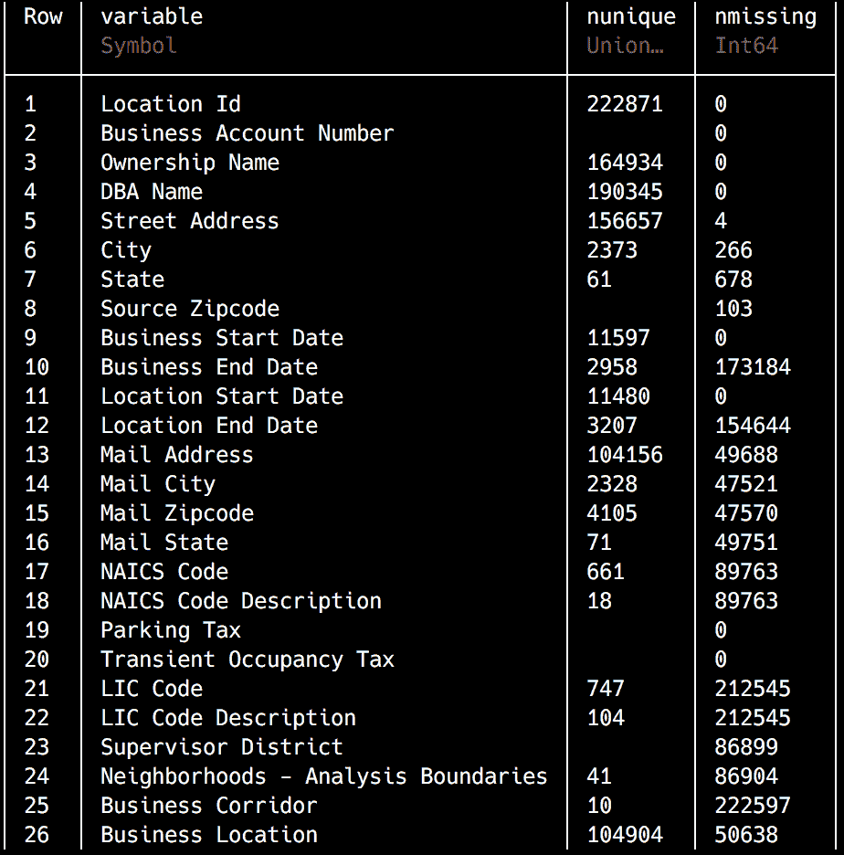

检查缺失值的数量和百分比(在`nmissing`栏下)以及唯一值的数量(如`nunique`)。我们可以看到，对于`Location Id`列，我们得到了`222871`唯一值和零个缺失条目。唯一位置 id 的数量等于数据集中的行数:

```
julia> size(df, 1) 
222871  
```

继续，`Ownership Name`代表注册企业的实体(一个人或另一家公司)，而`DBA Name`代表企业本身的名称。对于这两者，我们可以看到`Number Unique`比`Location Id`小，这意味着一些公司由相同的实体所有，并且一些公司将具有相同的名称。进一步观察`Street Address`，发现大量公司与其他企业共享该位置(156，658 个`222871`公司的唯一地址)。最后，我们可以看到几乎所有记录都有`City`、`State`和`Zipcode`信息。

该数据集还提供了关于企业注册日期(`Business Start Date`)、关闭日期(`Business End Date`)以及在该地点开始和结束经营的日期(分别为`Location Start Date`和`Location End Date`)的信息。还有更多细节，但它们大多与我们的分析无关，例如`Parking Tax`、`Transient Occupancy Tax`、`LIC Code`数据(超过 95%的记录缺失)以及`Supervisor District`、`Neighborhoods Analysis Boundaries`、`Business Corridor`信息(尽管 99.87%的情况下缺失业务走廊数据)。

是时候清理我们的数据并为分析做好准备了！

<title>Data wrangling with query</title>  

# 数据与查询的争论

到目前为止，我们已经看到了如何使用`DataFrames` API 操作`DataFrame`实例。我相信你现在已经意识到我们可以通过使用`delete!(df::DataFrame, column_name::Symbol)`来删除不感兴趣的列。您可能还记得上一章，您可以使用方括号符号结合*点*元素操作来过滤`DataFrame`实例，如下例所示:

```
julia> df[df[Symbol("Parking Tax")] .== true, :][1:10, [Symbol("DBA Name"), Symbol("Parking Tax")]] 
DBA Name and Parking Tax columns only) where the business pays parking tax:
```

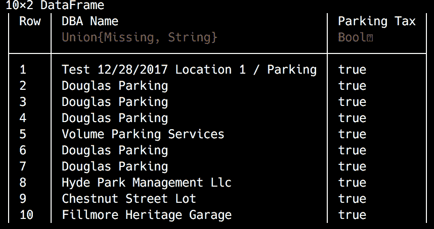

现在，如果你认为 Julia 用漂亮的语法和良好的可读性宠坏了我们，而前面的两者都没有——那么，你就对了！前面的语法虽然可用，但肯定可以改进。我敢打赌，当你听到朱莉娅的包装生态系统已经提供了更好的争论方式时，你不会太惊讶。输入`Query`！

Query 是一个查询 Julia 数据的包。它可以处理多种数据源，包括 Array、DataFrame、CSV、SQLite、ODBC 等等。它提供了过滤器、项目、连接和分组功能，并且受到了微软**语言集成查询** ( **LINQ** )的极大启发。如果这对你来说意义不大，不要担心；你马上就能看到它的效果。

下面是如何重构前面的操作以使用 query 来过滤出支付停车费的企业:

```
julia> @from i in df begin 
           @where i[Symbol("Parking Tax")] == true 
           @select i 
           @collect DataFrame 
       end
```

如果您熟悉 SQL，您可以很容易地认出熟悉的语言查询结构，`from`、`where`和`select`。那就是厉害！

然而，为了访问我们的数据，必须使用这种冗长的语法来将列名(如`Parking Tax`转换成符号，这是不方便的。在我们开始之前，我们最好重新命名这些列，使其更加符号友好，并用下划线替换空格。我们将结合理解使用`DataFrames.rename!`函数:

```
julia> rename!(df, [n => replace(string(n), " "=>"_") |> Symbol for n in names(df)]) 
```

`rename!`函数以`:current_column_name => :new_current_name`的形式接受一个`DataFrame`和一个`Array{Pair}`。我们使用理解来构建数组，我们通过迭代每个当前的列名(由`names(df)`返回)，将结果符号转换为字符串，用`"_"`替换`" "`，然后将字符串转换回符号来实现。

现在，我们可以在 query 中使用更简洁的点符号，因此前面的代码片段如下所示:

```
@from i in df begin 
    @where i.Parking_Tax == true 
    @select i 
    @collect DataFrame 
end 
```

<title>Metaprogramming in Julia</title>  

# Julia 中的元编程

```
@ prefix represents a macro—which introduces a very powerful programming technique called metaprogramming.
```

如果你以前没有听说过，它基本上意味着一个程序有能力阅读、分析和转换，甚至在运行时修改自己。一些被称为**同音符号**的语言带有非常强大的元编程工具。在同形异义语言中，程序本身在内部被表示为程序可用的数据结构，并且可以被操纵。Lisp 是典型的同构编程语言，因此，这种元编程是通过 Lisp 风格的宏来完成的。它们处理代码的表示，与 C 和 C++框架中的预处理器宏不同，在 C 和 c++框架中，包含代码的文本文件在解析和评估之前被处理。

Julia 在一定程度上受到 Lisp 的启发，也是一种同形异义语言。因此，对于 Julia 中的元编程，我们需要理解两个关键方面——通过表达式和符号表示代码，以及使用宏操作代码。如果我们将 Julia 程序的执行视为一系列步骤，那么元编程会在解析步骤之后、编译器评估代码之前介入并修改代码。

<title>Learning about symbols and expressions in metaprogramming</title>  

# 了解元编程中的符号和表达式

理解元编程并不容易，所以如果它不是从一开始就自然产生的，也不要惊慌。我认为其中一个原因是，它发生在比我们习惯的常规编程更高的抽象层次上。我希望用符号来开始讨论会使介绍不那么抽象。我们在本书中广泛使用了符号，尤其是作为各种函数的参数。它们看起来像这样— `:x`或`:scientific`或`:Celsius`。你可能已经注意到，一个符号代表一个标识符，我们使用它非常像一个常数。然而，还不止这些。它表示一段代码，这段代码不是作为变量进行计算，而是用于引用变量本身。

理解符号和变量之间关系的一个很好的类比是短语中的单词。以这个句子为例:理查德很高。在这里，我们理解为*理查德*是一个人的名字，很可能是一个男人。理查德，这个人，很高。然而，在句子中:*理查德有七个字母*、*、*很明显，现在我们谈论的不是理查德这个人。假设理查德这个人有七个字母是没有太大意义的。我们说的是*理查德*这个词本身。

在茱莉亚的句子中，第一句话(*理查德很高*)的对应词是`julia> x`。在这里，`x`被立即评价以便产生它的价值。如果它没有被定义，它将导致一个错误，如下所示:

```
julia> x 
ERROR: UndefVarError: x not defined 
```

朱莉娅的符号模仿了第二句话，我们在这里谈论单词本身。在英语中，我们用单引号将单词“Richard”括起来，以表明我们不是指一个人而是指单词本身。同样，在 Julia 中，我们在变量名前面加上一个列`:x`:

```
julia> :x 
:x 
```

```
julia> typeof(:x) 
Symbol 
```

因此，列前缀`:`是一个停止求值的操作符。通过使用`eval()`函数或`@eval`宏，可以根据需要对未求值的表达式求值，如下所示:

```
julia> eval(:x) 
ERROR: UndefVarError: x not defined 
```

但是我们可以超越符号。我们可以编写更复杂的类似符号的语句，例如`:(x = 2)`。这很像一个符号，但事实上，它是一个`Expr`类型，代表表达。像任何其他类型一样，表达式可以通过变量名引用，并且像符号一样，可以对其求值:

```
julia> assign = :(x = 2) 
:(x = 2) 
julia> eval(assign) 
2 
julia> x 
2 
Expr type with the assign variable and then eval it. Evaluation produces side effects, the actual value of the variable x now being 2.
```

更强大的是，由于`Expr`是一个类型，它具有公开其内部结构的属性:

```
julia> fieldnames(typeof(assign)) 
(:head, :args) 
```

每个`Expr`对象都有两个字段——`head`代表它的种类,`args`代表参数。我们可以通过使用`dump()`函数来查看`Expr`的内部:

```
julia> dump(assign)
Expr
head: Symbol =
args: Array{Any}((2,))
1: Symbol x
2: Int64 2  
```

这让我们有了更重要的发现。首先，这意味着我们可以通过属性以编程方式操作`Expr`:

```
julia> assign.args[2] = 3 
3 
julia> eval(assign) 
3 
julia> x 
3 
```

我们的表情不再是`:(x = 2)`；现在是`:(x = 3)`。通过操作`assign`表达式的`args`，现在`x`的值就是`3`。

其次，我们可以使用类型的构造函数以编程方式创建新的`Expr`实例:

```
julia> assign4 = Expr(:(=), :x, 4) :(x = 4) 
julia> eval(assign4) 4
 julia> x 4 
```

请注意这里我们用圆括号括起了等号(`=`)来表示一个表达式，否则 Julia 会感到困惑，以为我们想在这里执行赋值。

<title>Quoting expressions</title>  

# 引用表达式

前一个过程被称为**引用**，在该过程中，我们将一个表达式包装在`:(...)`中以创建`Expr`对象。也可以使用报价块来完成。引用块使引用变得更加容易，因为我们可以将*普通的*代码传递给它们(而不是将所有东西都转换成符号)，并且支持引用多行代码，以便构建随机的复杂表达式:

```
julia> quote 
           y = 42 
           x = 10 
       end
 julia> eval(ans) 
10
 julia> y 
42
 julia> x 
10 
```

<title>Interpolating strings</title>  

# 插值字符串

就像字符串插值一样，我们可以在表达式中引用变量:

```
julia> name = "Dan" 
"Dan" 

julia> greet = :("Hello " * $name) 
:("Hello " * "Dan") 

julia> eval(greet) 
"Hello Dan" 
```

<title>Macros</title>  

# 宏指令

现在，我们终于有了理解宏的知识。它们是语言构造，在代码被解析之后，但在它被评估之前执行。它可以选择接受一组参数，但必须返回一个`Expr`。产生的`Expression`是直接编译的，所以我们不需要在上面调用`eval()`。

例如，我们可以将前面的`greet`表达式的可配置版本实现为一个宏:

```
julia> macro greet(name) 
           :("Hello " * $name) 
       end 
@greet (macro with 1 method)
julia> @greet("Adrian") 
"Hello Adrian" 
macro keyword and are invoked using the @... syntax. The brackets are optional when invoking macros, so we could also use @greet "Adrian".
```

宏是非常强大的语言结构，它允许在整个程序运行之前定制部分代码。Julia 的官方文档有一个很好的例子来说明这种行为:

```
julia> macro twostep(arg) 
         println("I execute at parse time. The argument is: ", arg) 
         return :(println("I execute at runtime. The argument is: ", $arg)) 
       end 
@twostep (macro with 1 method) 
```

我们定义了一个名为`twostep`的宏，它有一个调用`println`函数向控制台输出文本的主体。它返回一个表达式，该表达式在求值时也将通过同一个`println`函数输出一段文本。

现在我们可以看到它的作用:

```
julia> ex = macroexpand(@__MODULE__, :(@twostep :(1, 2, 3))); 
I execute at parse time. The argument is: $(Expr(:quote, :((1, 2, 3)))) 
macroexpand, which takes as an argument the module in which to expand the expression (in our case, @__MODULE__ stands for the current module) and an expression that represents a macro invocation. The call to macroexpand converts (expands) the macro into its resulting expressions. The output of the macroexpand call is suppressed by appending ; at the end of the line, but the resulting expression is still safely stored in ex. Then, we can see that the expanding of the macro (its parsing) takes place because the I execute at parse time message is output. Now look what happens when we evaluate the expression, ex:
```

```
julia> eval(ex) 
I execute at runtime. The argument is: (1, 2, 3) 
```

输出`I execute at runtime`消息，但不输出`I execute at parse time`消息。这是一个非常强大的东西。想象一下，如果我们有一些计算量非常大或非常耗时的操作，那么输出将不是简单的文本输出。在一个简单的函数中，我们必须每次都运行这段代码，但是对于一个宏来说，只需要在解析时运行一次。

<title>Closing words about macros</title>  

# 关于宏的结束语

除了功能强大之外，宏也非常方便。它们可以以最小的开销提供大量的功能，并且可以简化以表达式作为参数的函数的调用。例如，`@time`是一个非常有用的宏，它在测量执行时间的同时执行一个`Expression`。最棒的是，我们可以将参数表达式作为常规的*代码传递，而不是手工构建`Expr`:*

```
julia> @time rand(1000); 
  0.000007 seconds (5 allocations: 8.094 KiB) 
```

宏——以及一般的元编程——是强大的概念，需要整本书详细讨论。我们必须在这里停下来，以便回到我们的机器学习项目。ACME Recruiting 急切地等待着我们的调查结果。我推荐在[https://docs . Julia lang . org/en/stable/manual/meta programming/](https://docs.julialang.org/en/stable/manual/metaprogramming/)查阅官方文档。

<title>Beginning with Query.jl basics</title>  

# 从 Query.jl 基础开始

`Query`包可以以标准方式添加— `pkg> add Query`。一旦您使用`Query`将它纳入范围，它就为查询 Julia 数据源提供了一个丰富的 API，`DataFrames`是最常见的数据源。使用`@from`宏启动查询。

<title>@from</title>  

# @来自

查询的一般结构如下:

```
@from var in data_source begin 
    # query statements here 
end 
```

在`begin...end`块中，`var`代表`data_source`中的一行。每行给出一个查询语句，可以包括可用查询命令的任意组合，例如`@select`、`@orderby`、`@join`、`@group`和`@collect`。让我们仔细看看最重要的几个。

<title>@select</title>  

# @选择

`@select`查询命令，类似于它的`SQL SELECT`对应物，指示哪些值将被返回。它的通用语法是`@select condition`，其中`condition`可以是任意的`Julia`表达式。最常见的情况是，我们希望返回整行，在这种情况下，我们只需传递`var`本身。例如，让我们创建一个新的`DataFrame`来保存购物清单:

```
julia> shopping_list = DataFrame(produce=["Apples", "Milk", "Bread"], qty=[5, 2, 1]) 
```

输出如下所示:

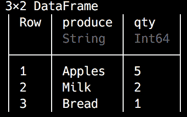

一个酷酷的(极客！)和随手可得的购物清单。

我们可以用下面的`@select`整行:

```
@from p in shopping_list begin 
    @select p 
end 
```

这不是很有用，因为这基本上返回整个`DataFrame`，但是我们也可以使用`dot`符号引用一个列，例如，`p.produce`:

```
julia> @from p in shopping_list begin 
           @select p.produce 
       end 
3-element query result 
 "Apples" 
 "Milk" 
 "Bread" 
```

鉴于`@select`接受任何随机的`Julia`表达式，我们可以自由地按照我们认为合适的方式操纵数据:

```
julia> @from p in shopping_list begin 
           @select uppercase(p.produce), 2p.qty 
       end 
3-element query result 
 ("APPLES", 10) 
 ("MILK", 4) 
 ("BREAD", 2) 
produce and two times the qty.
```

然而，更好的方法是使用特殊的查询花括号语法返回`NamedTuple`:

```
julia> @from p in shopping_list begin 
           @select { produce = uppercase(p.produce), qty = 2p.qty } 
       end 
```

输出如下所示:

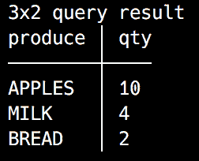

这里，我们为`NamedTuple`传递键和值，但它们不是强制性的。然而，如果我们想要正确命名的列(谁不想呢，对吗？):

```
julia> @from p in shopping_list begin 
           @select { uppercase(p.produce), 2p.qty } 
       end 
```

输出如下所示:

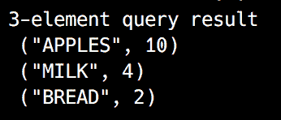

如果没有显式标签，`query`将分配列名，如`__1__`、`__2__`等等。可读性不是很好！

<title>@collect</title>  

# @收藏

在前面的截图中，您可能已经注意到返回值的类型是`query result`。一个查询将返回一个迭代器，这个迭代器可以进一步用于遍历结果集的单个元素。但是我们可以使用`@collect`语句将结果具体化为特定的数据结构，最常见的是`Array`或`DataFrame`。这显示如下:

```
julia> @from p in shopping_list begin 
           @select { PRODUCE = uppercase(p.produce), double_qty = 2p.qty } 
           @collect 
       end 
```

我们得到以下结果:

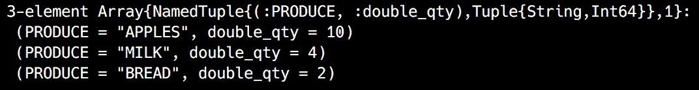

默认情况下，`@collect`会产生一个`NamedTuple`元素的`Array`。但是我们可以为我们想要的数据类型传递一个额外的参数:

```
julia> @from p in shopping_list begin 
           @select {PRODUCE = uppercase(p.produce), double_qty = 2p.qty} 
           @collect DataFrame 
       end 
```

输出如下所示:

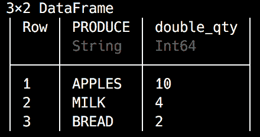

我们现在的结果是一个`DataFrame`。

<title>@where</title>  

# @哪里

最有用的命令之一是`@where`，它允许我们过滤数据源，以便只返回满足条件的元素。与`@select`类似，条件可以是任意的`Julia`表达式:

```
julia> @from p in shopping_list begin 
           @where p.qty < 2 
           @select p 
           @collect DataFrame 
       end 
```

我们得到以下输出:

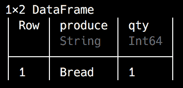

只有面包的`qty`比`2`小。

通过范围变量，过滤可以变得更加强大。这些就像属于`query`表达式的新变量，可以使用`@let`宏引入:

```
julia> @from p in shopping_list begin 
           @let weekly_qty = 7p.qty 
           @where weekly_qty > 10 
           @select { p.produce, week_qty=weekly_qty } 
           @collect DataFrame 
       end 
```

输出如下所示:

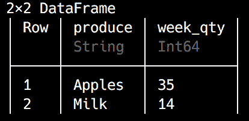

在这里，您可以看到在`begin...end`块中，我们如何定义一个名为`weekly_qty`的局部变量，其值等于`7 * p.qty`。我们使用了`@let`宏来引入新的变量。在下一行中，我们用它来过滤掉那些`weekly_qty`比`10`小的行。最后，我们选择了它，并将其收集到一个`DataFrame`中。

<title>@join</title>  

# @加入

让我们让事情变得更有趣:

```
julia> products_info = DataFrame(produce = ["Apples", "Milk", "Bread"], price = [2.20, 0.45, 0.79], allergenic = [false, true, true]) 
```

输出如下所示:

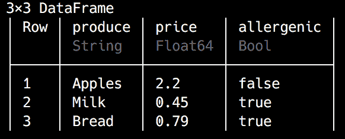

我们实例化了一个新的`DataFrame`，名为`products_info`，它包含了我们购物清单中物品的重要信息——它们的价格以及它们是否会引起过敏。我们可以使用`DataFrames.hcat!`从`products_info`到`shopping_list`添加一些列，但是语法不是很好，方法也不是很灵活。我们被朱莉娅宠坏了，我们喜欢这样！幸运的是，Query 提供了一个`@join`宏:

```
shopping_info = @from p in shopping_list begin 
    @join pinfo in products_info on p.produce equals pinfo.produce 
    @select { p.produce, p.qty, pinfo.price, pinfo.allergenic } 
    @collect DataFrame 
end 
shopping_list as p, adding an inner join, @join, with products_info as pinfo, on the condition that p.produce equals pinfo.produce. We basically put together the produce and qty columns from shopping_list DataFrame with the price and allergenic columns from products_info. The resulting DataFrame can now be referenced as shopping_info:
```

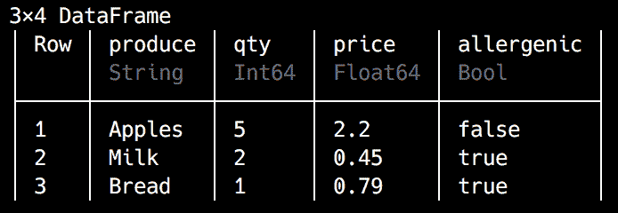

`@join`命令的一般语法如下:

```
@from var1 in datasource1 begin 
    @join var2 in datasource2 on var1.column equals var2.column  
end 
```

Query 提供了`@join`的另外两种变体:组连接和左外连接。如果你想了解它们，请查阅官方文档，网址是 http://www . query verse . org/query . JL/stable/query commands . html # Joining-1。

<title>@group</title>  

# @组

`@group`语句通过一些属性对元素进行分组:

```
julia> @from p in shopping_info begin 
           @group p.produce by p.allergenic 
           @collect 
       end 
2-element Array{Grouping{Bool,String},1}: 
 ["Apples"] 
 ["Milk", "Bread"]  
```

不错，但是我们真正想要的是总结数据。Query 在名称`split-apply-combine`(也称为`dplyr`)下提供这个。这需要一个聚合函数，用于根据`Grouping`变量折叠数据集。如果这太抽象了，一个例子肯定会把事情弄清楚。

假设我们想要获得过敏物品的数量以及它们的逗号分隔的名称列表，这样我们就知道应该远离什么:

```
@from p in shopping_info begin
    @group p by p.allergenic into q
    @select { allergenic = key(q),
    count = length(q.allergenic),
    produce = join(q.produce, ", ") }
    @collect DataFrame
end  
q variable and then pass the aggregation function, length, to get a count of the values of the allergenic column. We then use the join function to concatenate the values in the produce column.
```

结果将是两行`DataFrame`:

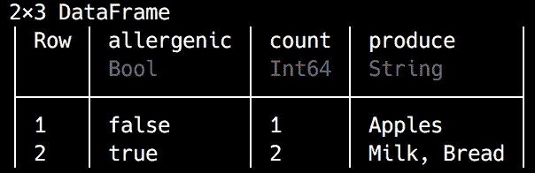

<title>@orderby</title>  

# @orderby

Query 还提供了一个名为`@orderby`的排序宏。它接受一个属性列表，在这个列表上应用排序。类似于 SQL，默认情况下顺序是升序的，但是我们可以通过使用`descending`函数来改变。

给定我们之前定义的`products_info` `DataFrame`，我们可以根据需要轻松地对其进行排序，例如，首先排序最贵的产品，然后按产品名称排序:

```
julia> @from p in products_info begin 
           @orderby descending(p.price), p.produce 
           @select p 
           @collect DataFrame 
        end 
@orderby to sort the values in the source. Unsurprisingly, the resulting DataFrame will be properly sorted with the most expensive products on top:
```

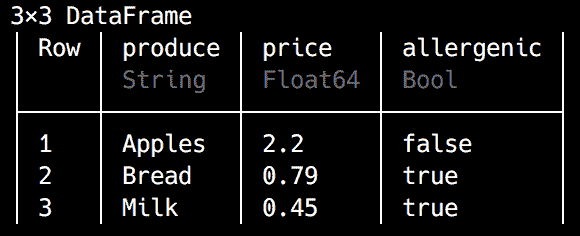

好吧，绕了一大圈！但是现在我们已经了解了伟大的`Query`包，我们已经准备好高效地分割我们的数据。我们走吧！

<title>Preparing our data</title>  

# 准备我们的数据

我们的数据清理计划是只保留在加利福尼亚州三藩市注册的企业，我们有其地址、邮政编码、NAICS 编码和营业地点，并且这些企业尚未关闭(因此它们没有营业结束日期)，也没有搬走(没有营业结束日期)。

使用`DataFrame` API 来应用过滤器将是乏味的。但是使用 Query，就像在公园散步一样简单:

```
pkg> add DataValues 
julia> using DataValues 
julia> clean_df = @from b in df begin 
 @where lowercase(b.City) == "san francisco" && b.State == "CA" &&
 ! isna(b.Street_Address) && ! isna(b.Source_Zipcode) &&
 ! isna(b.NAICS_Code) && ! isna(b.NAICS_Code_Description) &&
 ! isna(b.Business_Location) &&
 occursin(r"\((.*), (.*)\)", get(b.Business_Location)) &&
 isna(b.Business_End_Date) && isna(b.Location_End_Date)
 @select { b.DBA_Name, b.Source_Zipcode, b.NAICS_Code, 
 b.NAICS_Code_Description, b.Business_Location }
 @collect DataFrame
end 
```

我们可以看到如何应用`@where`滤波器，要求`lowercase(b.City)`等于`"san francisco"`并且`b.State`等于`"CA"`。然后，我们使用`! isna`来确保我们只保留`b.Street_Address`、`b.Source_Zipcode`、`b.NAICS_Code`、`b.NAICS_Code_Description`和`b.Business_Location`没有丢失的行。`isna`函数是由`DataValues`包提供的(由查询本身使用),这就是我们添加和使用它的原因。

我们还确保`b.Business_Location`匹配对应于地理位置坐标的特定格式。最后，我们确定，相反，`b.Business_End_Date`和`b.Location_End_Date`实际上是缺失的。

执行该查询会产生一个新的`DataFrame`,它有将近 57，000 行。

下一步是获取我们的`clean_df`数据，并从`Business_Location`列中提取地理坐标。再次，查询来拯救:

```
clean_df_geo = @from b in clean_df begin
 @let geo = split(match(r"(\-?\d+(\.\d+)?),\s*(\-?\d+(\.\d+)?)", 
 get(b.Business_Location)).match, ", ")
 @select {b.DBA_Name, b.Source_Zipcode, b.NAICS_Code,
 b.NAICS_Code_Description,
 lat = parse(Float64, geo[1]), long = parse(Float64, geo[2])}
 @collect DataFrame
end 
```

我们很好地利用了范围变量特性(由`@let`定义)来引入一个`geo`变量，它使用`match`从`Business_Location`数据中提取纬度和经度对。接下来，在`@select`块中，geo 数组中的两个值被转换成适当的浮点值，并添加到结果`DataFrame`:

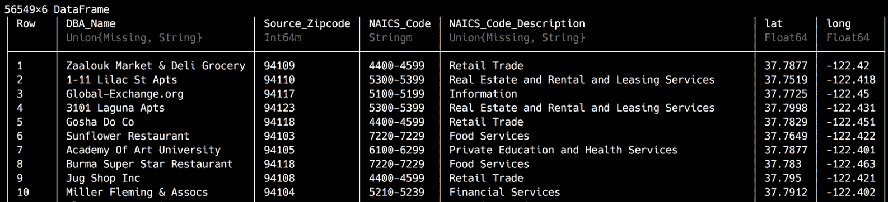

我们完了！我们的数据现在整齐地显示在我们的`clean_df_geo` `DataFrame`中，包含企业名称、邮政编码、NAICS 代码、NAICS 代码描述、纬度和经度。

如果我们运行`describe(clean_df_geo)`，我们将看到 56，549 家企业有 53，285 个唯一名称，只有 18 个 NAICS 代码描述。我们不知道这些公司分布在多少个邮政编码，但很容易找到:

```
julia> unique(clean_df_geo[:, :Source_Zipcode]) |> length 
79 
```

我们的企业在旧金山市的`79`邮政编码范围内注册。

<title>Unsupervised machine learning with clustering</title>  

# 聚类的无监督机器学习

Julia 的包生态系统为集群提供了一个专用库。不出所料，它叫做**集群**。我们可以简单地执行`pkg> add Clustering`来安装它。`Clustering`包实现了一些常见的聚类算法——k-means、affinity propagation、DBSCAN 和 kmedoids。

<title>The k-means algorithm</title>  

# k 均值算法

k-means 算法是最受欢迎的算法之一，在广泛的应用中提供了良好结果和良好性能的平衡组合。然而，一个复杂的问题是，我们需要预先给它集群的数量。更准确地说，这个数字叫做 **k** (因此是算法名称的第一个字母)，代表质心的数量。一个**形心**是代表每个集群的一个点。

k-means 算法应用了一种迭代方法，它使用播种过程定义的算法来放置质心，然后将每个点分配给其对应的质心，其平均值最接近质心。该算法在收敛时停止，也就是说，当新的迭代不改变点分配时。

<title>Algorithm seeding</title>  

# 算法播种

有几种方法可以选择质心。聚类提供了三个，其中一个是 random(聚类中标记为`:rand`选项)，随机选择一个点的子集作为种子(所以所有的质心都是随机的)。这是经典 k-means 中的默认播种策略。还有 k-means++，这是 David Arthur 和 Sergei Vassilvitskii 在 2007 年提出的一个更好的变体(标记为`:kmpp`，它随机选取一个聚类中心，然后搜索与第一个中心相关的其他中心。最后一种可用的方法是中心性播种(`:kmcen`)，它挑选具有最高中心性的样本。

<title>Finding the areas with the most businesses</title>  

# 寻找商业最多的地区

在前面的部分中，我们成功地清理了我们的数据，现在可以在`clean_df_geo` `DataFrame`中方便地访问了。如果您在数据清理过程中遇到任何问题，您可以使用本章支持文件中提供的`clean_df_geo.tsv`文件([https://github . com/packt publishing/Julia-Programming-Projects/blob/master/chapter 08/data/clean _ df _ geo . tsv . zip](https://github.com/PacktPublishing/Julia-Programming-Projects/blob/master/Chapter08/data/clean_df_geo.tsv.zip))从头开始加载数据集。为了加载它，您只需运行以下命令:

```
julia> using CSV 
julia> clean_df_geo = CSV.read("clean_df_geo.tsv", delim = '\t', nullable = false) 
```

所以我们想找出商业密度最高的地区。一种方法是使用无监督的机器学习，通过邮政编码和注册的企业数量来识别地区。

我们将使用`:zipcode`列中的数据加上该地区注册的企业数量来训练我们的模型。我们需要每个邮政编码的企业数量:

```
julia> model_data = @from b in clean_df_geo begin 
    @group b by b.Source_Zipcode into g 
    @let bcount = Float64(length(g)) 
    @orderby descending(bcount) 
    @select { zipcode = Float64(get(key(g))), businesses_count = bcount } 
    @collect DataFrame 
end 
```

我们对`clean_df_geo` `DataFrame`执行一个查询，通过`:Source_Zipcode`将它分组到`g`。我们将来自当前邮政编码的企业数量存储在`bcount`范围变量中，由`length(g)`返回，但不是在将数量转换为`Float64`之前。我们这样做的原因是，正如我们马上会看到的，集群期望输入是`Float64`，因此这将为我们节省稍后的另一个处理步骤。回到我们的问题。我们还通过`bcount`应用排序，以允许我们人类更好地理解数据(不需要训练模型)。最后，我们实例化一个新的`DataFrame`，它有两列，一个邮政编码和`businesses_count`，出于与前面相同的原因，不要忘记将邮政编码也转换成`Float64`。当转换`key(g)`时，请注意我们首先调用的是`get`函数。这是因为，在一个查询块中，计算的值被表示为`DataValues`，为了访问包装的值，我们需要调用`get`:

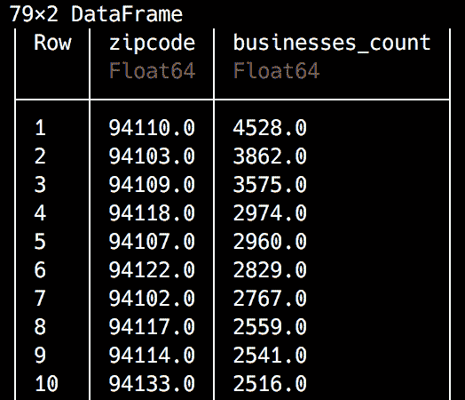

我们的培训数据由邮政编码和它们对应的商业计数组成。排名前 22 位的地区每个都有超过 1000 家企业，其余地区的企业数量急剧下降:

```
julia> last(model_data) 
```

输出如下所示:

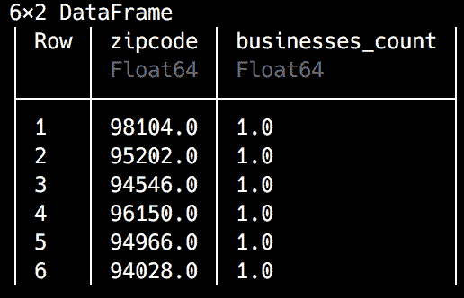

你可能还记得`Gadfly`，我们在[第 1 章](90a7f09d-d63b-45d7-baf5-576470d0910f.xhtml)、*Julia 编程入门*中使用的 Julia 绘图库，用来可视化 Iris flowers 数据集。让我们用它来快速浏览一下我们的数据:

```
julia> using Gadfly 
julia> plot(model_data, x=:businesses_count, Geom.histogram) 
```

这将呈现以下直方图:

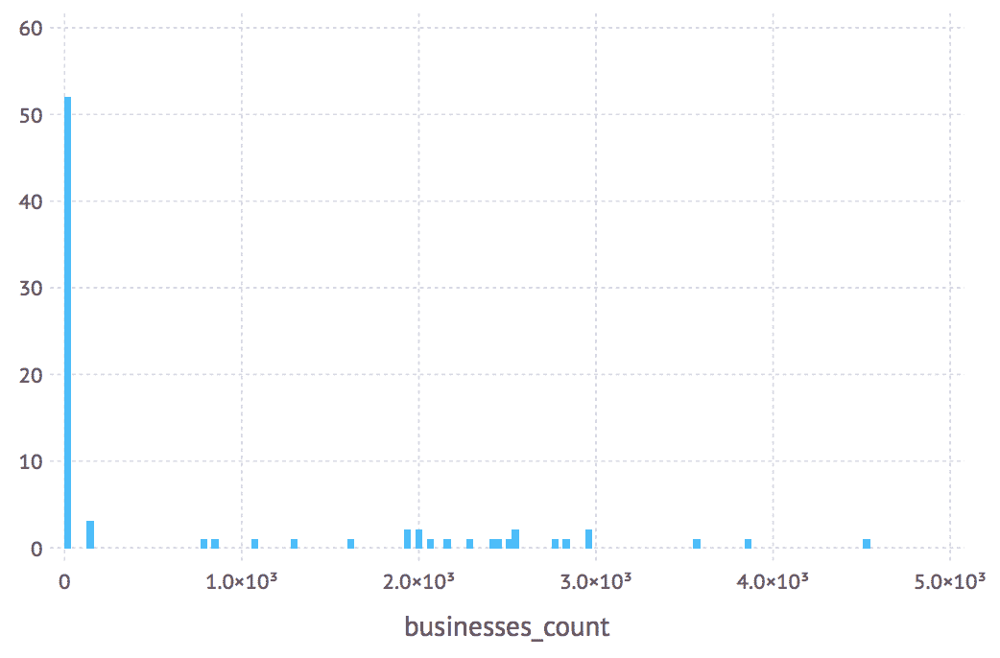

我们很容易看到，大部分地区只有一家注册企业，其次是少数其他地区，它们只有几家。我们可以安全地将它们从我们的训练数据集中删除，因为它们对我们的客户没有用处。我们唯一需要做的就是在查询中添加`@where bcount > 10`过滤器来计算`model_data`，在`@let`和`@orderby`语句之间:

```
model_data = @from b in clean_df_geo begin 
    @group b by b.Source_Zipcode into g 
    @let bcount = Float64(length(g)) 
    @where bcount > 10 
    @orderby descending(bcount) 
    @select { zipcode = Float64(get(key(g))), businesses_count = bcount } 
    @collect DataFrame 
end 
```

一旦我们删除所有拥有不到`10`家公司的地区，我们只剩下`28`个邮政编码。

<title>Training our model</title>  

# 训练我们的模型

只需一小步，我们就可以开始训练我们的模型了。我们需要将`DataFrame`转换成一个数组，并改变数组的维数，使`DataFrame`列变成行。在新结构中，每一列(邮政编码和计数对)都被视为一个训练样本。让我们开始吧:

```
julia> training_data = permutedims(convert(Array, model_data), [2, 1]) 
```

我们的训练数据准备好了！是时候好好利用它了:

```
julia> using Clustering
julia> result = kmeans(training_data, 3, init=:kmpp, display=:iter)

 Iters               objv        objv-change | affected  
------------------------------------------------------------- 
      0       6.726516e+06 
      1       4.730363e+06      -1.996153e+06 |        0 
      2       4.730363e+06       0.000000e+00 |        0 
K-means converged with 2 iterations (objv = 4.73036279655838e6) 
```

我们通过调用同名函数来使用 k-means 算法。作为参数，我们提供了`training_data`数组，并给它三个集群。我们希望将这些区域分成三层—低、中和高密度。训练不会超过几秒钟。因为我们给了它`display=:iter`参数，所以我们在每次迭代中都得到了渐进的调试信息。对于播种算法，我们使用了 k-means++ ( `:kmpp`)。

<title>Interpreting the results</title>  

# 解释结果

现在我们可以看看这些点是如何分配的:

```
julia> result.assignments 
28-element Array{Int64,1}: 
 3 
 3 
 3 
 1 
 1 
 # some 1 values omitted from the output for brevity 
 1 
 1 
 2 
 2 
 # some 2 values omitted from the output for brevity 
 2 
 2 
```

数组中的每个元素对应于`model_data`中相同索引处的元素。让我们将数据结合起来，这样更容易理解:

```
julia> model_data[:cluster_id] = result.assignments 
28-element Array{Int64,1}: 
# output truncated #
```

现在让我们看看我们最终得到了什么:

```
julia> model_data
```

输出如下所示:

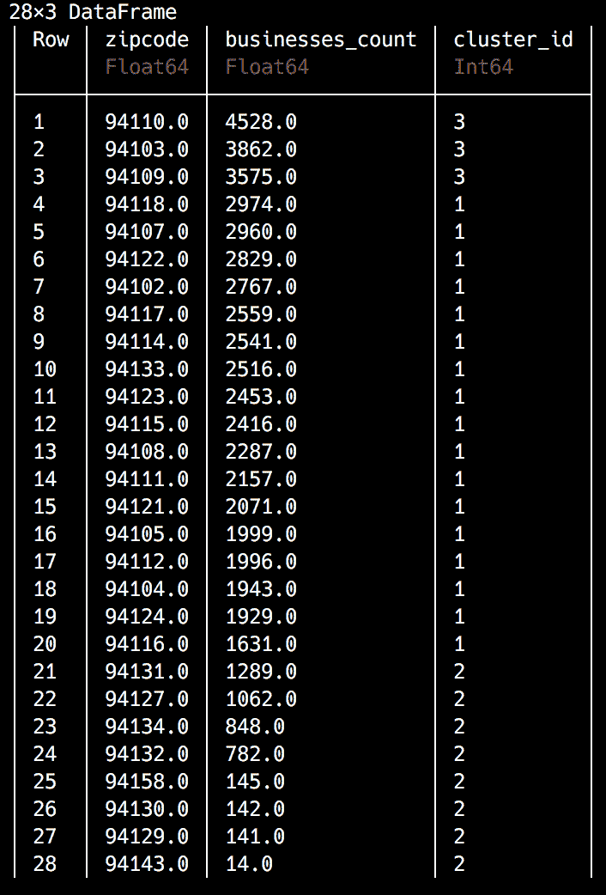

我们可以看到，前三个邮政编码被分配给集群`3`，后八个被分配给集群`2`，其余的被分配给集群`1`。您可能已经注意到，聚类的 id 并不遵循实际的计数值，这是正常的，因为数据是未标记的。我们必须解释集群的意义。我们的算法已经决定，商业密度最高的区域将留在聚类`3`中，密度较低的区域留在聚类`2`中，而平均密度的区域留在聚类`1`中。用`Gadfly`绘制数据将证实我们的发现:

```
julia> plot(model_data, y = :zipcode, x = :businesses_count, color = result.assignments, Geom.point, Scale.x_continuous(minvalue=0, maxvalue=5000), Scale.y_continuous(minvalue=94050, maxvalue=94200), Scale.x_continuous(format=:plain)) 
```

它产生了这个情节:

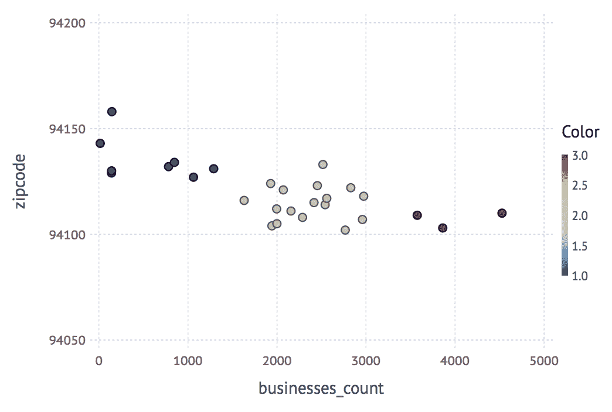

太棒了。我们现在可以通知我们的客户，最好的目标区域是邮政编码为 94110、94103 和 94109 的地区，这样他们就可以接触到城市中这些密集地区的 11，965 家企业。他们还想知道这些公司是哪些，所以让我们准备一份清单:

```
companies_in_top_areas = @from c in clean_df_geo begin 
       @where in(c.Source_Zipcode, [94110, 94103, 94109]) 
       @select c 
       @collect DataFrame 
end 
```

我们使用在聚类步骤中提取的邮政编码来过滤`clean_df_geo`数据集:

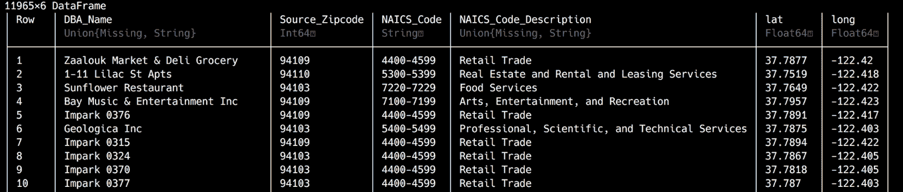

我们最终有 11，965 家公司集中在三个区号。让我们使用`geo`坐标来绘制这些点:

```
julia> plot(companies_in_top_areas, y = :long, x = :lat, Geom.point, Scale.x_continuous(minvalue=36, maxvalue=40), Scale.y_continuous(minvalue=-125, maxvalue=-120), color=:Source_Zipcode) 
```

输出如下所示:

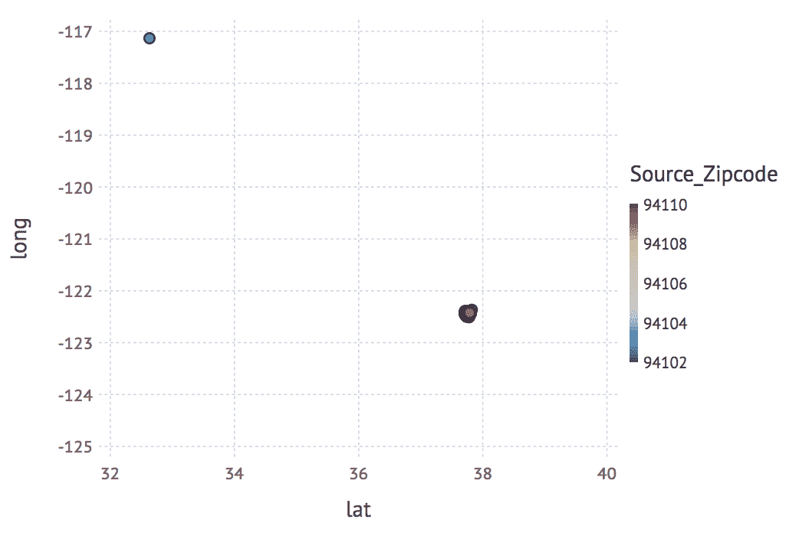

正如预期的那样，这两个位置非常接近，但是有一个异常值的坐标相差很大。也许我们的数据有错误。使用查询，我们可以很容易地删除罪魁祸首:

```
julia> companies_in_top_areas = @from c in companies_in_top_areas begin 
           @where c.lat != minimum(companies_in_top_areas[:lat]) 
           @select c 
           @collect DataFrame 
      end 
```

有了清理后的列表，我们现在可以探索这些公司的活动领域。这将有助于我们的客户找到符合市场需求的候选人，具体如下:

```
julia> activities = @from c in companies_in_top_areas begin 
           @group c by c.NAICS_Code_Description into g 
           @orderby descending(length(g)) 
           @select { activity = key(g), number_of_companies = length(g) } 
           @collect DataFrame 
       end 
```

这很简单:

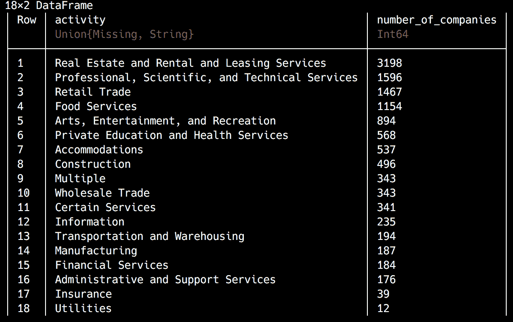

目标区域内的所有公司都活跃在某个领域，其中房地产是最常见的领域。当然，我们客户的主管会喜欢一张图表:

```
julia> plot(activities, y=:number_of_companies, Geom.bar, color=:activity, Scale.y_continuous(format=:plain), Guide.XLabel("Activities"), Guide.YLabel("Number of companies")) 
```

这是我们得到的结果:

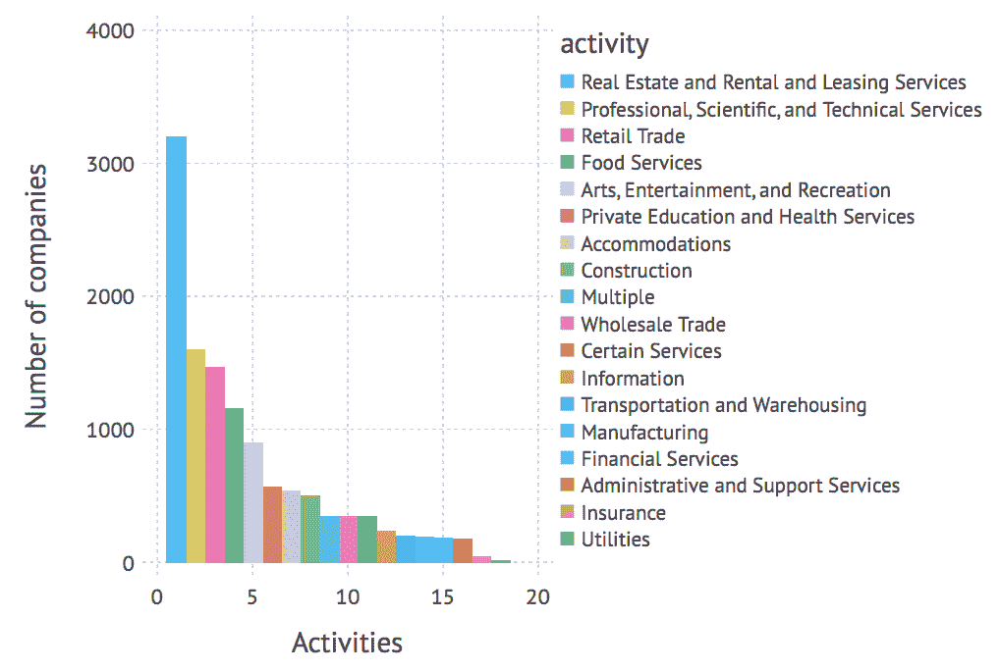

是的，图表清楚地显示，房地产是大多数企业参与的活动，其次是科技和零售。

<title>Refining our findings</title>  

# 完善我们的发现

到目前为止已经取得了很大的进步，但是几乎有 12，000 家公司的名单仍然很难处理。我们可以帮助我们的客户，把它分解成位于附近的企业集群。和之前的工作流程一样。首先，我们提取训练数据:

```
julia> model_data = @from c in companies_in_top_areas begin 
           @select { latitude = c.lat, longitude = c.long } 
           @collect DataFrame 
       end 
```

输出如下所示:

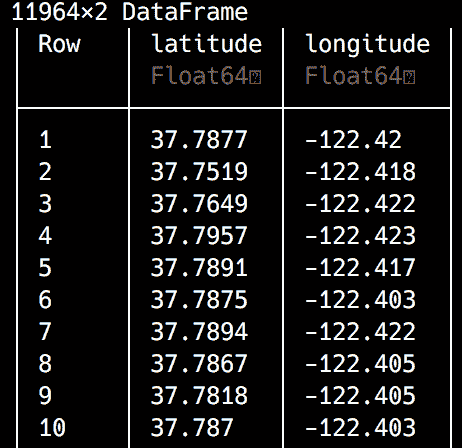

现在，我们排列维度，将数据设置为聚类所期望的格式(就像我们之前所做的一样):

```
julia> training_data = permutedims(convert(Array{Float64}, model_data), [2, 1]) 
```

我们的训练阵列准备好了！

我们将对 k-means++播种使用相同的 k-means 算法。

请注意，k-means 通常不是地理位置数据聚类的最佳选择。DBSCAN 通常更适合，我建议您将它用于生产应用程序。例如，当处理环绕超过 180 度的接近点时，k-means 算法将会失败。对于我们的示例项目和我们正在处理的数据，k-means 工作得很好，但是要记住这个限制。

训练也是如此。我们将采用`12`集群，以便每组大约有 1000 家公司:

```
julia> result = kmeans(training_data, 12, init=:kmpp, display=:iter) 
  # output truncated 
K-means converged with 24 iterations (objv = 0.28192820139520336) 
```

这一次需要`24`次迭代才能达到收敛。让我们看看我们有什么:

```
julia> result.counts 
12-element Array{Int64,1}: 
 1076 
 1247 
  569 
 1180 
 1711 
 1191 
  695 
    1 
 1188 
   29 
 1928 
 1149 
```

大多数数据是均匀分布的，但是我们可以发现几个没有得到那么多业务的集群。绘制数字给我们一个清晰的画面:

```
julia> plot(result.counts, Geom.bar, y=result.counts, Guide.YLabel("Number of businesses"), Guide.XLabel("Cluster ID"), color=result.counts) 
```

剧情是这样的:

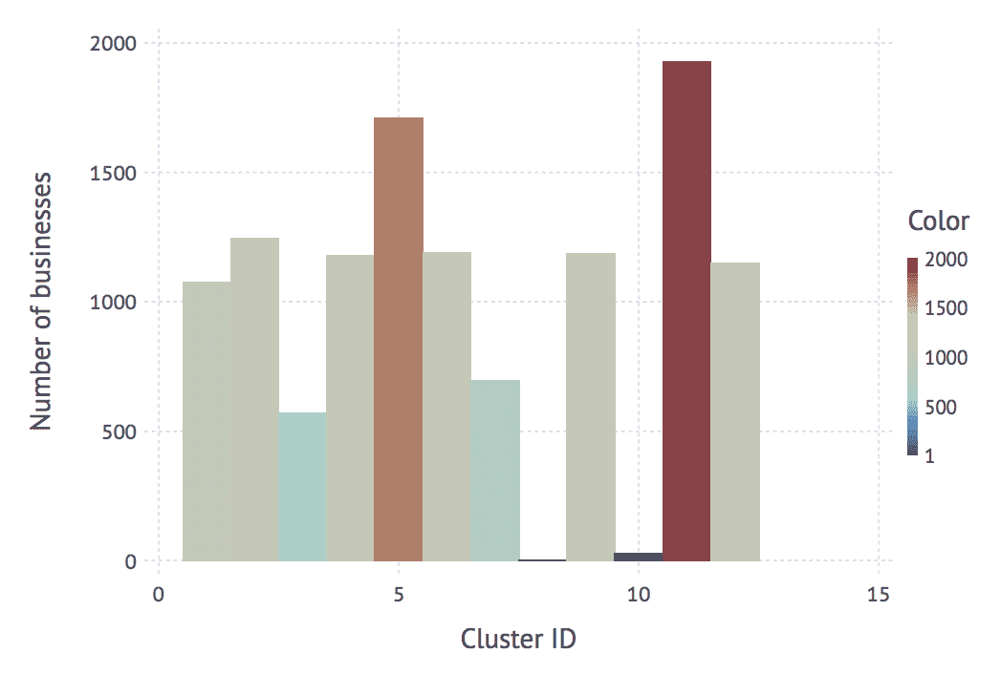

现在我们可以*将*集群分配粘贴到`companies_in_top_areas` `DataFrame`上:

```
julia> companies_in_top_areas[:cluster_id] = result.assignments 
```

<title>Visualizing our clusters on the map</title>  

# 在地图上可视化我们的集群

为了更好地理解我们的数据，在点密度和位置接近度方面，我们可以用`Gadfly`渲染一个图:

```
julia> plot(companies_in_top_areas, color=:cluster_id, x=:lat, y=:long) 
```

输出如下所示:

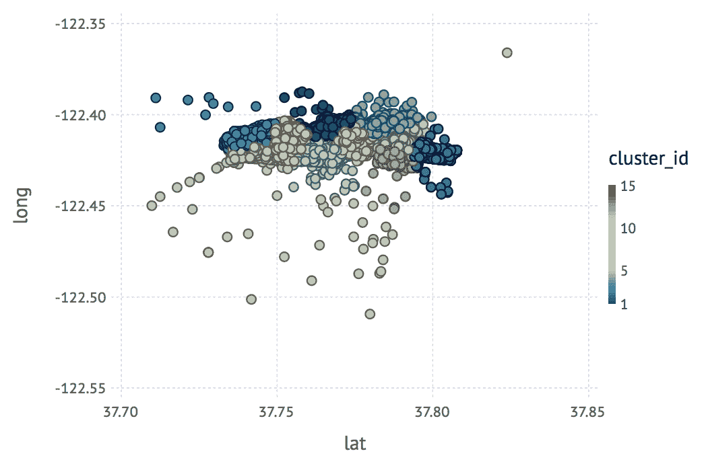

我们可以看到一个非常好的集群分布，所以我们的方法有效！

然而，如果我们能在地图上显示集群，那就更好了。不幸的是，目前在 Julia 中没有简单的方法来做到这一点，所以我们将使用第三方工具。

PlotlyJS([https://github.com/sglyon/PlotlyJS.jl](https://github.com/sglyon/PlotlyJS.jl))提供了相关的功能，但是我的测试没有产生好的结果，因为坐标在三藩市地区非常密集。

<title>Using BatchGeo to quickly build maps of our data</title>  

# 使用 BatchGeo 快速构建数据地图

batch geo([https://batchgeo.com](https://batchgeo.com))是一款流行的网络应用，用于创建基于地图的数据可视化。它使用谷歌的高清地图，并提供免登录(尽管有限)的免费版本，我们可以马上试用。

BatchGeo 需要一个包含一系列列的 CSV 文件，所以我们的第一项工作是设置它。使用查询再简单不过了:

```
julia> export_data = @from c in companies_in_top_areas begin 
                           @select { Name = c.DBA_Name, 
 Zip = c.Source_Zipcode, 
                                     Group = string("Cluster $(c.cluster_id)"), 
                                     Latitude = c.lat, Longitude = c.long,  
                                     City = "San Francisco", State = "CA" } 
                           @collect DataFrame 
                     end 
```

输出如下所示:

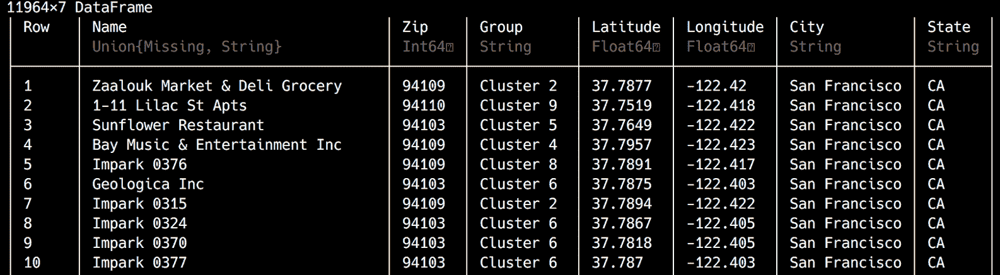

结构化数据可以在一个名为`export_data`的新`DataFrame`中获得。不幸的是，BatchGeo 为免费帐户增加了 250 行的限制，所以我们只能导出前 250 行。

我们可以这样导出它:

```
julia> CSV.write("businesses.csv", head(export_data, 250)) 
```

成功！剩下唯一要做的就是在你最喜欢的网络浏览器中打开[https://batchgeo.com](https://batchgeo.com)并将`business.csv`文件拖放到指定位置:

1.  这是通过执行以下步骤来完成的，如下面的屏幕截图所示:

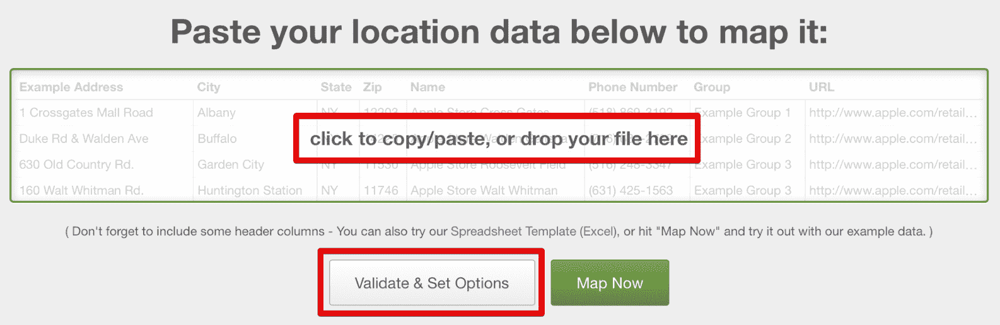

2.  单击验证和设置选项。您将会看到这些列被正确地选择，并且默认值是好的:

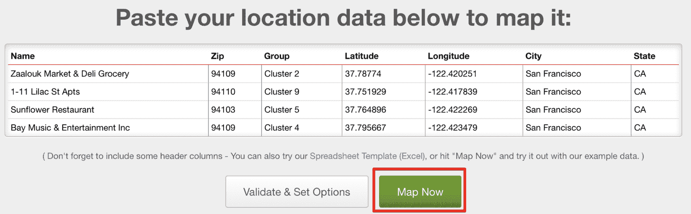

3.  单击“制作地图”会将我们的集群呈现在旧金山地图的顶部:

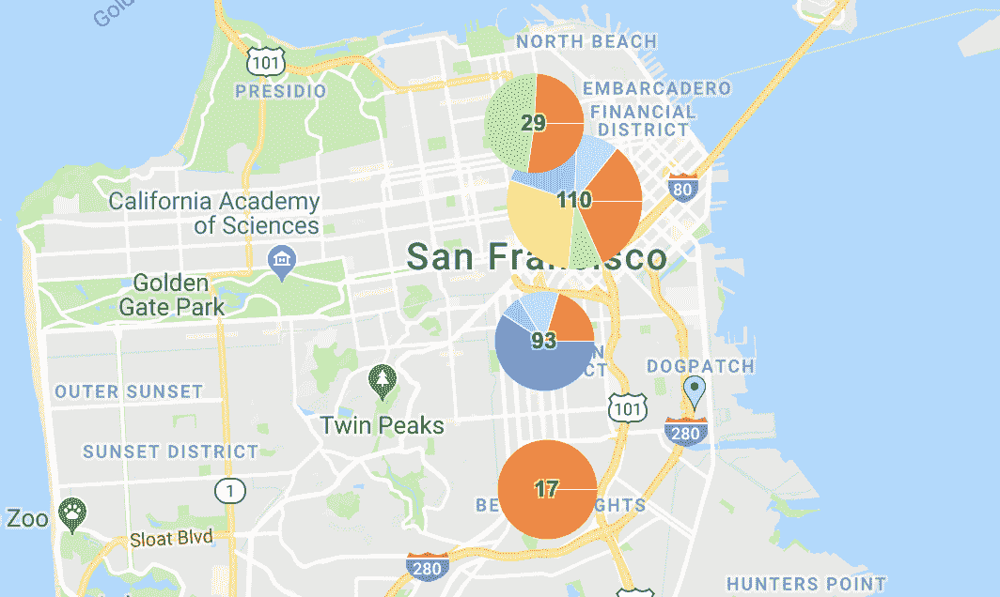

胜利——我们数据的完美呈现！

我们还可以禁用聚类，以便绘制每个单独的业务:

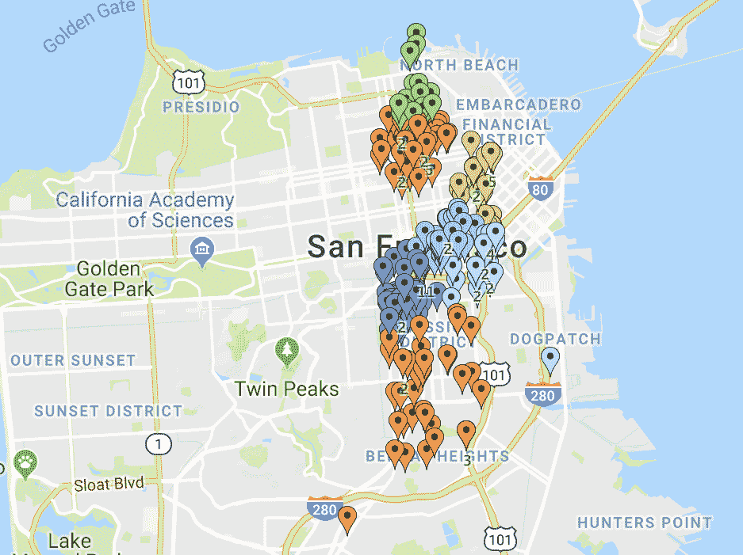

最后，我们可以保存地图，按照说明进行操作，并为我们的可视化获得一个唯一的 URL。在 https://batchgeo.com/map/7475bf3c362eb66f37ab8ddbbb718b87 可以找到我的矿。

太好了，正好赶上和我们客户的会面！

<title>Choosing the optimal number of clusters for k-means (and other algorithms)</title>  

# 为 k-means(和其他算法)选择最佳聚类数

根据数据的性质和您希望解决的问题，集群的数量可能是业务需求，也可能是显而易见的选择(在我们的案例中，我们希望确定低、中和高业务密度区域，因此最终有三个集群)。然而，在某些情况下，答案可能不是那么明显。在这种情况下，我们需要应用不同的算法来评估最佳的集群数量。

其中最常见的是肘法。这是一种迭代方法，其中我们使用不同的 k 值运行聚类算法，例如在 1 和 10 之间。我们的目标是通过绘制每个点与其类的平均值之间的误差平方和作为 k 的函数来比较总的类内变化。使用可视化，我们识别出*肘状*拐点，如下所示:

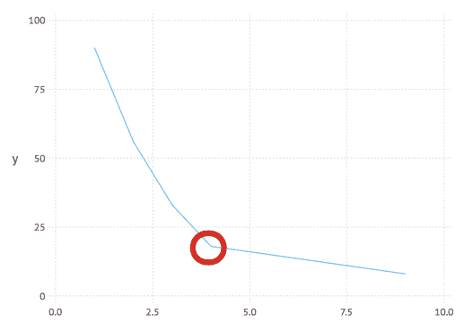

这是肘部。

您可以在 http://www . sth da . com/English/articles/29-cluster-validation-essentials/96-determining-the-optimal-number-of-clusters-3-must-know-methods/上了解更多信息。

<title>Clustering validation</title>  

# 聚类验证

除了选择最佳的分类数之外，另一个方面是分类验证，也就是说，确定项目与所分配的分类有多匹配。这可以用来确认模式确实存在，并比较竞争的聚类算法。

Clustering 提供了一个小型 API，用于使用三种技术进行聚类验证，其中包括最常用的一种技术——轮廓技术。你可以在[http://clusteringjl.readthedocs.io/en/latest/validate.html](http://clusteringjl.readthedocs.io/en/latest/validate.html)找到文档，也可以在[http://www . sth da . com/English/articles/29-cluster-validation-essentials/97-cluster-validation-statistics-must-know-methods/](http://www.sthda.com/english/articles/29-cluster-validation-essentials/97-cluster-validation-statistics-must-know-methods/)阅读更多关于验证理论的内容。

<title>Summary</title>  

# 摘要

在这一章中，我们和 Julia 一起研究了无监督机器学习技术。我们关注聚类，这是无监督学习最广泛的应用之一。从一个关于在旧金山注册的企业的数据集开始，我们执行了复杂但不复杂的数据清理，这要感谢 Query。在这个过程中，我们还学习了元编程，这是一种非常强大的编码技术，也是 Julia 最强大和最具定义性的特性之一。

一旦我们的数据处于最佳状态，并掌握了聚类理论的基础，使用 k-means 算法，我们就进入正题。我们执行聚类来确定公司密度最高的区域，以帮助我们的假想客户 ACME Recruiting 锁定最佳广告区域。在确定了能够为 ACME 提供最佳服务的城市区域后，我们进行了数据分析，以获取客户所需的顶级活动领域，以便他们能够建立相关候选人的数据库。

最后，我们对目标区域的企业地理位置数据进行聚类，然后将这些数据呈现在地图上。我们的客户对我们的发现感到非常兴奋，他们的营销人员现在有了所有必要的信息来开始计划他们的活动。恭喜你！

在下一章，我们将离开机器学习的迷人世界，去发现数据科学中的另一个关键概念——时间序列。我们将学习如何在 Julia 中处理日期和时间，如何处理时间序列数据，以及如何进行预测。令人兴奋，不是吗？