# 九、使用日期、时间和时间序列

我们在机器学习领域经历了一段非常令人惊奇和有意义的旅程。我们已经学会了如何使用算法对标记的数据进行分类，并应用我们的发现提出建议。我们已经看到了如何通过使用无监督的机器学习和聚类算法从原始的、未标记的信息中提取商业价值。然而，到目前为止，我们的分析中还缺少一个关键要素——时间维度。

*时间就是金钱，*常言道——因此，各种规模的组织，从小企业到大公司，到政府，再到欧盟等复杂的跨国机构，都会随着时间的推移不断测量和监控大量的经济指标。为了有意义，定期收集数据，使分析师能够识别隐藏的结构和模式，并根据过去和现在的情况预测未来的发展。这些值在时间尺度上定期测量，代表一个时间序列。时间序列分析和预测可以提供非常有价值的洞察力，让市场参与者了解趋势，并根据准确的历史数据做出明智的决策。

我们将用两章，这一章和下一章，来学习时间序列和进行分析和预测。在本章中，我们将通过了解以下内容来奠定基础:

*   在 Julia 中处理日期和时间
*   处理时区信息
*   用`TimeSeries`处理时间序列数据
*   用强大的`Plots`包绘制时间序列数据
*   `TimeArray`数据结构


# 技术要求

Julia 包生态系统正在不断发展，每天都有新的包版本发布。大多数时候这是好消息，因为新版本带来了新特性和错误修复。然而，由于许多软件包仍处于测试阶段(版本 0.x ),任何新版本都可能引入突破性的变化。因此，书中介绍的代码可能会停止工作。为了确保您的代码将产生与书中描述的相同的结果，建议使用相同的包版本。以下是本章中使用的外部软件包及其具体版本:

```
IJulia@v1.14.1
MarketData@v0.11.0
Plots@v0.22.0
TimeZones@v0.8.2
```

为了安装软件包的特定版本，您需要运行:

```
pkg> add PackageName@vX.Y.Z 
```

例如:

```
pkg> add IJulia@v1.14.1
```

或者，你可以通过下载本章提供的`Project.toml`文件并使用`pkg>`实例化来安装所有使用的包，如下所示:

```
julia> download("https://raw.githubusercontent.com/PacktPublishing/Julia-Programming-Projects/master/Chapter09/Project.toml", "Project.toml")
pkg> activate . 
pkg> instantiate
```


# 使用日期和时间

Julia 提供了一个非常丰富的 API 来处理日期和时间信息。所有功能都被打包到`Dates`模块中。该模块内置于语言中，因此不需要额外的软件包安装。为了访问它的功能，我们所要做的就是声明我们将成为`using Dates`。

日期模块公开了三种主要类型— `Date`、`DateTime`和`Time`。它们都是抽象类型`TimeType`的子类型，分别代表日、毫秒和纳秒精度。

Julia 试图尽可能简单地处理日期和时间。这就是为什么，一方面，它提供了三种不同的类型，每种类型都有自己的时间表示:

*   一个`Date`对象映射到一个日期——一个由日、月和年定义的时间实体
*   `Time`的一个实例是一个时刻——小时、分钟、秒和毫秒，但是绝对没有关于日期本身的信息
*   正如你可能从名字中猜到的那样，`DateTime`是一个将`Date`和`Time`放在一起的对象，指定了一个准确的时间点

另一方面，默认情况下，所有这些类型都有一种简单的方法来表示日期和时间，也就是说，它们没有考虑时区、夏令时或闰秒等因素。它是您的计算机的本地日期和时间的写照，没有任何额外的信息。


# 构建日期和时间

为了构造表示当前日期或时间的新日期/时间对象，Julia 提供了两个助手函数，`now`和`today`。让我们看看**读取-评估-打印循环** ( **REPL** )中的一些例子:

```
julia> using Dates 

julia> d = today() 
2018-11-08 

julia> typeof(d) 
Date 

julia> dt = now() 
2018-11-08T16:33:34.868 

julia> dt |> typeof 
DateTime 

julia> t = Dates.Time(now()) 
16:34:13.065 

julia> typeof(t) 
Time 
```

`now`函数还可以接受一个额外的参数来返回 UTC 时间(没有根据夏令时进行本地调整):

```
julia> now(UTC) 
2018-11-08T15:35:08.776 
```

在内部，所有类型都包装了一个可以通过`instant`字段访问的`Int64`值:

```
julia> dt.instant 
Dates.UTInstant{Millisecond}(63677378014868 milliseconds) 

julia> t.instant 
75147529000000 nanoseconds 

julia> d.instant 
Dates.UTInstant{Day}(737006 days) 
```

对象的`instant`属性反映了每种类型的精度级别。

当然，我们也可以使用专用的构造函数实例化表示任意随机时刻的对象:

```
julia> DateTime(2018) # we can pass just the year as a single argument 
2018-01-01T00:00:00 

julia> DateTime(2018, 6) # passing the year and the month 
2018-06-01T00:00:00 

julia> DateTime(2018, 6, 15) # year, month and day 
2018-06-15T00:00:00 

julia> DateTime(2018, 6, 15, 10) # year, month, day and hour (10 AM) 
2018-06-15T10:00:00 

julia> DateTime(2018, 6, 15, 10, 30) # 15th of June 2018, 10:30 AM  
2018-06-15T10:30:00 

julia> DateTime(2018, 6, 15, 10, 30, 45) # ...and 45 seconds 
2018-06-15T10:30:45 

julia> DateTime(2018, 06, 15, 10, 30, 45, 123) # ... and finally, milliseconds  
2018-06-15T10:30:45.123 
```

对于`Date`和`Time`，构造函数以类似的方式工作——下面是几个例子:

```
julia> Date(2019) # January 1st 2019 
2019-01-01 

julia> Date(2018, 12, 31) # December 31st 2018 
2018-12-31 

julia> Time(22, 05) # 5 past 10 PM 
22:05:00 

julia> Time(22, 05, 25, 456) # 5 past 10 PM, 25s and 456 milliseconds 
22:05:25.456  
```

构造函数将防止我们传递错误的值，从而导致错误。这与其他自动执行日期时间运算的语言不同，例如，2018 年 12 月 22 日会自动转换为 2019 年 1 月 1 日。这不会发生在朱莉娅身上:

```
julia> Date(2018, 12, 32) 
ERROR: ArgumentError: Day: 32 out of range (1:31) 
Stacktrace: 
 [1] Date(::Int64, ::Int64, ::Int64) at ./dates/types.jl:204 
```

还有用于各个日期和时间组件(年、月、日、小时、分钟、秒和毫秒)的构造函数。它们返回相应的`Period`类型的实例(稍后我们将详细研究句点)。周期可用于创建日期/时间对象:

```
julia> eleven_hours = Hour(11) 
11 hours 

julia> half_hour = Minute(30) 
30 minutes 

julia> brunch_time = Time(eleven_hours, half_hour) 
11:30:00 

julia> this_year = "2018" 
julia> xmas_month = "12" 
julia> xmas_day = "25" 
julia> Date(Year(this_year), Month(xmas_month), Day(xmas_day)) 
2018-12-25 
```


# 将字符串解析为日期和时间

一个常见的需求是将来自外部输入(数据库、文件、用户输入等)的格式正确的字符串解析为相应的日期和时间对象:

```
julia> Date("25/12/2019", "dd/mm/yyyy") # Christmas day in 2019 
2019-12-25 

julia> DateTime("25/12/2019 14,30", "dd/mm/yyyy HH,MM") # xmas day in 2019, at 2:30 PM 
2019-12-25T14:30:00 
```

这些是 Julia 识别的特殊日期时间字符及其含义:

*   `y`:年份数字，例`yyyy`为`2015`，`yy`为`15`
*   `m`:月份数字，例如`m => 3`或`03`
*   `u`:短月份名称，示例`Jan`
*   `U`:长月份名称，示例`January`
*   `e`:一周中较短的一天，例如`Tue`
*   `E`:一周中的长日，例如`Tuesday`
*   `d`:日、例`3`或`03`
*   `H`:小时数字，例`HH` = `00`
*   `M`:分位数，例`MM` = `00`
*   `S`:第二位数字，例`s` = `00`
*   `s`:毫秒数字，例子`.000`

有了这些，我们可以将任何日期/时间字符串解析成正确的对象:

```
julia> DateTime("Thursday, 1 of February 2018 at 12.35", "E, d of U yyyy at HH.MM") 
2018-02-01T12:35:00 
```

我们也可以一次解析多个字符串，作为一个数组的元素。首先，我们创建一个表示有效日期的字符串数组，格式为`yyyy-mm-dd`。我们用一个理解来创建这个数组，并将其命名为`d`:

```
julia> d = ["$(rand(2000:2020))-$(rand(1:12))-$(rand(1:28))" for _ in 1:100] 
100-element Array{String,1}:  
 "2001-7-1" 
 "2005-9-4"
```

```
 "2018-3-3" 
# output truncated 
```

接下来，我们可以使用点标记法，通过使用`Date`构造函数来逐元素处理数组:

```
julia> Date.(d, "yyyy-mm-dd") 
100-element Array{Date,1}: 
 2001-07-01 
 2005-09-04 
 2018-03-03 
# output truncated  
```

或者，我们可以使用专门的`DateFormat`类型，而不是使用字符串来表示日期的格式:

```
julia> date_format = DateFormat("yyyy-mm-dd") 
dateformat"yyyy-mm-dd" 

julia> Date.(d, date_format) 
100-element Array{Date,1}: 
2001-07-01 
2005-09-04 
2018-03-03 
# output truncated  
```

为了获得更好的性能，建议在解析大量字符串时使用`DateFormat`。Julia 提供了一些格式作为标准库的一部分，例如，`ISODateTimeFormat`和`RFC1123Format`:

```
julia> DateTime("2018-12-25", ISODateTimeFormat) 
2018-12-25T00:00:00 
```


# 格式化日期

如果我们可以将日期格式的字符串解析成日期/时间对象，我们也可以反过来做。我们可以使用各种格式将日期和时间输出为字符串。例如，请参见以下内容:

```
julia> Dates.format(now(), RFC1123Format) 
"Thu, 08 Nov 2018 20:04:35"  
```


# 定义其他语言环境

默认情况下，Julia 将使用`english`地区，这意味着日期和月份的名称将是英文的。但是，我们可以通过定义其他地区来国际化我们的日期:

```
julia> spanish_months = ["enero", "febrero", "marzo", "abril", "mayo", "junio", "julio", "agosto", "septiembre", "octubre", "noviembre", "diciembre"] 
12-element Array{String,1} # output truncated 

julia> spanish_days = ["lunes", "martes", "miércoles", "jueves", "viernes", "sábado", "domingo"] 
7-element Array{String,1} # output truncated 

julia> Dates.LOCALES["es"] = Dates.DateLocale(spanish_months, String[], spanish_days, String[]) 
Dates.DateLocale # output truncated 
```

`Dates.DateLocale`函数需要四个数组，分别对应于月份名称、月份缩写名称、日期名称和日期缩写名称。如您所见，我们没有提供名称的缩写版本。只要我们不试图使用它们，我们就不会有事:

```
julia> Dates.format(now(), "E, d U yyyy", locale = "es") 
"jueves, 8 noviembre 2018" 
```

但是，尝试使用缩写的日期名称会导致错误:

```
julia> Dates.format(now(), "e, d U yyyy", locale = "es") 
ERROR: BoundsError: attempt to access 0-element Array{String,1} at index [4] 
```


# 使用日期和时间访问器

如果我们想要访问日期的各个部分(年、月、日)，我们可以通过可用的访问器函数来检索各个部分:

```
julia> earth_day = Date(2018, 4, 22) 
2018-04-22 

julia>year(earth_day) # the year 
2018 

julia> month(earth_day) # the month  
4 
```

为了简洁起见，API 还公开了复合方法:

```
julia> monthday(earth_day) # month and day 
(4, 22) 

julia> yearmonthday(earth_day) # year month and day 
(2018, 4, 22) 
```

类似的访问器也可用于`DateTime`——但是没有提供复合方法:

```
julia> earth_hour = DateTime(2018, 4, 22, 22, 00) 
2018-04-22T22:00:00 

julia> hour(earth_hour) # the hour 
22 

julia> minute(earth_hour) # the minute 
0 
```

还定义了返回`Period`对象的可选访问器——它们有大写名称:

```
julia> Hour(earth_hour) # a period of 22 hours 
22 hours 

julia> Month(earth_hour) # a period of 4 months 
4 months 

julia> Month(earth_hour) |> typeof |> supertype
 DatePeriod 

julia> supertype(DatePeriod) 
Period 
```


# 查询日期

一旦我们有了一个日期对象，我们就可以获得大量关于它的额外信息，比如星期几、闰年、一年中的哪一天等等。我们可以使用`Dates` API 来提取关于日期/时间对象的这类信息。

考虑一下这个:

```
julia> yoga_day = Date(2019, 6, 21) # Really, the International Yoga Day does exist! 
2019-06-21 
```

你很好奇 2019 年瑜伽日是什么时候吗？让我们用我们的朱莉娅技能来弄清楚:

```
julia> dayname(yoga_day) 
"Friday" 
```

如果您需要一天(一周内)的数值，还有`dayofweek(yoga_day)`，它显然会返回`5`，因为星期五是一周的第五天。

当然，我们也可以在这里使用本地化名称:

```
julia> dayname(yoga_day, locale="es") 
"viernes" 
```

我们可以调用的另一个有用的函数是`dayofweekofmonth(yoga_day)`，它会告诉我们今天是哪个月的星期五——2019 年 6 月的第三个星期五。

如果你不确定这如何有用，举个例子，事件总是有规律地在一个月的某一天发生。一个很好的例子是我参加的聚会，它总是在每个月的第三个星期四举行。

我们还可以获得大量关于月份和年份的信息:

```
julia> monthname(yoga_day, locale="es") # June, with the Spanish locale  
"junio" 

julia> isleapyear(yoga_day) # 2019 is not a leap year 
false 

julia> dayofyear(yoga_day) # It's the 172nd day of 2019 
172 

julia> quarterofyear(yoga_day) # 2nd quarter of 2019 
2  
```

API 非常丰富，包括了比这里介绍的更多的方法。请访问位于[https://docs . Julia lang . org/en/v1/stdlib/Dates/index . html # stdlib-Dates-API-1](https://docs.julialang.org/en/v1/stdlib/Dates/index.html#stdlib-dates-api-1)的文档页面。


# 定义日期范围

Julia 允许我们定义日期范围来表示连续的时间段。例如，我们可以将全年表示为 1 月 1 日到 12 月 31 日之间的天数范围:

```
julia> year_2019 = Date(2019, 1, 1):Day(1):Date(2019,12,31) 
2019-01-01:1 day:2019-12-31 
```

我们创建了一个以一天为步长的日期范围，因此`365`项，因为 2019 年不是闰年:

```
julia> typeof(year_2019) 
StepRange{Date,Day} 

julia> size(year_2019) 
(365,) 
```

我们可以使用名副其实的`collect`函数实例化实际的`Date`对象:

```
julia> collect(year_2019) 
365-element Array{Date,1}: 
 2019-01-01 
 2019-01-02 
 2019-01-03 
# output truncated 
```

当然，我们也可以通过索引来访问元素，如下所示:

```
julia> year_2019[100] # day 100 
2019-04-10 
```

也可以用其他步骤来定义范围，例如每月间隔:

```
julia> year_2019 = Date(2019, 1, 1):Month(1):Date(2019,12,31) 
2019-01-01:1 month:2019-12-01 

julia> collect(year_2019) # First day of each of the 12 months 
12-element Array{Date,1}: 
 2019-01-01 
 2019-02-01 
 2019-03-01 
# output truncated 
```

我们可以为该步骤传递任何`Period`对象，例如:

```
julia> year_2019 = Date(2019, 1, 1):Month(3):Date(2019,12,31) # Quarterly 
2019-01-01:3 months:2019-10-01 

julia> collect(year_2019) # The first of each of the 4 quarters 
4-element Array{Date,1}: 
 2019-01-01 
 2019-04-01 
 2019-07-01 
 2019-10-01 

julia> year_2019 = Date(2019, 1, 1):Week(2):Date(2019,12,31) # Bi weekly 
2019-01-01:2 weeks:2019-12-31 

julia> collect(year_2019) 
27-element Array{Date,1}: 
 2019-01-01 
 2019-01-15 
 2019-01-29 
# output truncated 
```


# 期间类型和期间算法

我们已经看到了一些`Period`建造者。这些都是可用的— `Day`、`Week`、`Month`、`Year`、`Hour`、`Minute`、`Second`、`Millisecond`、`Microsecond`、`Nanosecond`。`Period`类型是一个抽象类型，有两个具体的子类型`DatePeriod`和`TimePeriod`:

```
julia> subtypes(Period) 
2-element Array{Any,1}: 
 DatePeriod 
 TimePeriod 
```

`Period`在朱丽亚代表一段持续时间。这是一个非常有用的抽象概念，代表了人们日常使用的模糊时间概念。想想一个月——一个月有多少天——30 天还是 31 天？28 呢？还是 29？

很多时候，在提供更多信息之前，使用模糊的抽象概念而不切换到实际日期是很有用的。以假设的火星之旅为例。根据[https://image.gsfc.nasa.gov/poetry/venus/q2811.html](https://image.gsfc.nasa.gov/poetry/venus/q2811.html)[的说法，返回火星需要`21 months` — `9`到达那里，`3`停留在那里，`9`再返回:](https://image.gsfc.nasa.gov/poetry/venus/q2811.html)

```
julia> duration_of_trip_to_mars = Month(9) * 2 + Month(3) 
21 months 
```

这 21 个月到底要花多长时间还不确定，直到我们真正决定何时开始旅行:

```
julia> take_off_day = Date(2020, 1, 15) 
2020-01-15 
```

现在我们可以计算宇航员将离开多久:

```
julia> return_day = take_off_day + duration_of_trip_to_mars 
2021-10-15 

julia> time_diff = return_day - take_off_day 
639 days 
```

然而，如果由于技术原因，发射日期将推迟五个月，结果将会不同:

```
julia> take_off_day += Month(5) 
2020-06-15 

julia> return_day = take_off_day + duration_of_trip_to_mars 
2022-03-15 

julia> time_diff = return_day - take_off_day 
638 days 
```

重要的是要记住，与其他编程语言不同，它们对一个月的默认长度做出假设——例如 JavaScript 中的 31 天或 PHP 中的 30 天——Julia 采用了不同的方法。关于`Period`算术的详细解释，可以阅读官方文档在[https://docs . Julia lang . org/en/v1/stdlib/Dates/index . html # time type-Period-algorithm-1。](https://docs.julialang.org/en/v1/stdlib/Dates/index.html#TimeType-Period-Arithmetic-1)

一段时间不一定是一段完整的时间。Julia 允许我们表达不规则的时间间隔，如`1`月和`2`周。然而，不规则的时间量(组合了不同类型的时段)将在内部由不同的类型表示——不是`Period`，而是`CompoundPeriod`。这是如何工作的:

```
julia> isa(Month(3), Period) 
true 

julia> isa(Month(3) + Month(1), Period) 
true 

julia> isa(Month(1) + Week(2), Period)  
false 

julia> isa(Month(1) + Week(2), Dates.CompoundPeriod)  
true 
```


# 日期调整

算术非常强大，但有时我们需要表达依赖于其他日期的更灵活的规则。我在考虑下个月的*最后一天*，*下周二*，或者*每个月的第三个星期一*。

对于这种情况，`Dates`模块公开了调整器 API。首先，我们有`firstdayof*`和`lastdayof*`系列的函数— `firstdayofweek`、`firstdayofmonth`、`firstdayofquarter`和`firstdayofyear`；分别加上`lastdayofweek`、`lastdayofmonth`、`lastdayofquarter`、`lastdayofyear`。它们将日期/时间对象作为输入，然后*将*调整到指定的时间点:

```
julia> firstdayofweek(Date(2019, 1, 31)) 
2019-01-28 
```

2019 年，一周包括 1 月 31 日的第一天是 28 日星期一。

`lastdayof*`系列功能的工作方式类似。尽管它们很有用，但是它们没有提供足够的灵活性。幸运的是，我们有保险。如果我们需要第一天或最后一天之外的其他日期，我们必须使用`tonext`和`toprev`对函数。它们有两种口味。第一种方法采用子类型`TimeType`(即任意`Time`、`Date`、`DateTime`)和一周中的某一天:

```
julia> tonext(Date(2019, 4, 1), Saturday) 
2019-04-06 
```

愚人节后的下一个周六是 2019 年 4 月 7 日。

`tonext`的另一个方法更加强大——它接受一个类似的`TimeType`和一个函数。它将调整日期，直到函数返回`true`。为了理解这有多有用，让我们回到之前的 meetup 例子，我每个月第三个星期四参加的会议。要知道下一次会议什么时候举行，我所要做的就是问朱莉娅:

```
julia> tonext(today()) do d  # today is Thu 8th of November, 2019 
         dayofweek(d) == Thursday && dayofweekofmonth(d) == 3 
       end 
2018-11-15 
```

`toprev`功能的工作方式类似。

另一个函数`filter`，允许我们获得所有匹配的日期作为一个`Iterator`。跟进我们的 meetups 日程，让我们试着找出 2019 年所有会议的日期。但我们还必须考虑到，在 5 月的下半月，组织者将参加一次商务旅行，而 8 月是一个假期月。所以，在这段时间里不会有会议。我们该如何表达呢？事实证明，对于 Julia 来说，这非常简单(并且可读性很强):

```
julia> filter(Date(2019):Day(1):Date(2020)) do d 
           ! in(d, Date(2019, 5, 15):Day(1):Date(2019, 5, 31)) &&  
           month(d) != August &&  
           dayofweek(d) == Thursday &&  
           dayofweekofmonth(d) == 3 
   end |> collect  
10-element Array{Date,1}: 
 2019-01-17 
 2019-02-21 
 2019-03-21 
 2019-04-18 
 2019-06-20 
 2019-07-18 
 2019-09-19 
 2019-10-17 
 2019-11-21 
 2019-12-19 
```


# 日期的舍入

可能存在这样的情况，我们有一个日期/时间，并且需要计算前一个或下一个完整的时间间隔，例如，下一个小时或前一天。`Dates` API 公开了一些对`Date`和`DateTime`对象进行舍入的方法— `floor`、`ceil`和`time`。它们非常直观，非常强大:

```
julia> now() 
2018-11-08T21:13:20.605 

# round down to the nearest hour 
julia> floor(now(), Hour) 
2018-11-08T21:00:00 

# or to the nearest 30 minutes increment 
julia> floor(now(), Minute(30))  
2018-11-08T21:00:00 

# it also works with dates  
julia> floor(today(), Month) # today() is the 8th of Nov 2018 
2018-11-01 
```

`ceil`函数的工作方式类似，但它不是向下舍入，而是向上舍入。至于`round`函数，它将根据最接近的值向上或向下取整:

```
julia> round(today(), Month) 
2018-11-01 # today is the 11th so beginning of month is closer 

julia> round(today() + Day(10), Month) 
2018-12-01 # end of month is closer 
```

在一些边缘情况下，舍入可能会出现意外行为——有关更多详细信息，请查看官方文档，网址为[https://docs . Julia lang . org/en/v1/stdlib/Dates/index . html # Rounding-1](https://docs.julialang.org/en/v1/stdlib/Dates/index.html#Rounding-1)。


# 添加对时区的支持

如前所述，默认情况下，Julia 的日期/时间对象以本地时间操作，完全忽略时区。然而，我们可以使用`TimeZones`包轻松地扩展它们，使其具有时区意识。请按常规方式安装:

```
julia> using Pkg
pkg> add TimeZones
```

一旦我们通知编译器我们将使用`TimeZones`，大量与时区相关的功能就唾手可得了。

我们可以从探索可用时区开始:

```
julia> timezone_names() 
439-element Array{AbstractString,1}: 
 "Africa/Abidjan" 
 "Africa/Accra" 
# output truncated 
```

让我们为`Amsterdam`创建一个时区对象:

```
julia> amstz = TimeZone("Europe/Amsterdam") 
Europe/Amsterdam (UTC+1/UTC+2) 
```

在 Julia 中，`TimeZone`是一个抽象类型，表示关于特定时区的信息，这意味着它不能被实例化——我们不能创建这种类型的对象。相反，将自动使用它的两个子类型之一— `VariableTimeZone`或`FixedTimeZone`。`VariableTimeZone`代表一个时区，其偏移量根据一年中的时间而变化，以考虑夏令时/夏令时。`FixedTimeZone`有一个不变的偏移量。

`Europe/Amsterdam (UTC+1/UTC+2)`就是这样一个`VariableTimeZone`。这由圆括号内的信息表示，表示该时区的两个偏移量。检查类型将确认它:

```
julia> typeof(amstz) 
TimeZones.VariableTimeZone 
```

不改变偏移量的时区是`FixedTimeZone`的实例。这样的例子有`UTC`和`GMT`:

```
julia> typeof(TimeZone("GMT")) 
TimeZones.FixedTimeZone 
```

`TimeZones`包还提供了一个特殊的字符串文字，`tz"..."`。它公开了与`TimeZone(...)`相同的功能，但输入更少:

```
julia> tz"Europe/Bucharest" 
Europe/Bucharest (UTC+2/UTC+3) 
```

有了这些知识，我们现在可以创建时区相关的日期/时间值。这些以`ZonedDateTime`对象的形式出现，顾名思义，代表了`DateTime`和`TimeZone`的混合:

```
# 8 PM, Christmas Day in Vienna, 2018 
julia> ZonedDateTime(DateTime(2018, 12, 25, 20), tz"Europe/Vienna") 
2018-12-25T20:00:00+01:00 
```

这可以通过跳过对`DateTime`的显式调用写得更简洁一点:

```
julia> ZonedDateTime(2018, 12, 25, 20, tz"Europe/Vienna") 
2018-12-25T20:00:00+01:00 
```

`TimeZones`模块还提供了一系列的实用方法。首先，我们可以通过使用恰当命名的`localzone`来检索本地时区:

```
julia> localzone() 
Europe/Madrid (UTC+1/UTC+2) 
```

我住在巴塞罗那，因此这是我的当前时区-您的输出将与您的实际时区相对应。

`now`和`today`有两种延伸方式，分别以`now(::TimeZone)`和`today(::TimeZone)`的形式出现:

```
julia> now() 
2018-11-08T22:32:59.336 

julia> now(tz"Europe/Moscow") 
2018-11-09T00:33:23.138+03:00 

julia> today() 
2018-11-08 

julia> today(tz"Europe/Moscow") 
2018-11-09 
```

代替`today(::TimeZone)`，另一个函数`todayat`可以使用两个参数——一天中的时间作为`Time`对象和一个`TimeZone`:

```
julia> todayat(Time(22, 30), tz"Europe/Moscow") 
2018-11-09T22:30:00+03:00 
```

这次我们得到`Moscow`时间晚上 10 点 30 分。


# 转换时区

我们想要做的最基本的事情之一是将一个`DateTime`从一个时区转换到另一个时区。使用`astimezone`函数很简单:

```
julia> xmas_day = ZonedDateTime(2018, 12, 25, 20, tz"Europe/Vienna") 
2018-12-25T20:00:00+01:00 

julia> astimezone(xmas_day, tz"Australia/Sydney") 
2018-12-26T06:00:00+11:00 
```

当你晚上 8 点在维也纳庆祝圣诞节时，在澳大利亚的悉尼，第二天已经是早上 6 点了。


# 解析日期字符串

我们已经看到了如何使用 Julia 的`Dates` API 解析日期和日期/时间字符串。`TimeZones`包将这一功能向前推进了一步，允许我们解析包含时区的日期/时间字符串:

```
julia> ZonedDateTime("2018-12-25T20:00:00+01:00", "yyyy-mm-ddTHH:MM:SSzzzz") 
2018-12-25T20:00:00+01:00 
```


# ZonedDateTime 周期算法

您会很高兴地听到，带时区感知对象的算术就像它的常规`TimeType`对应物一样工作。但是，在处理开始于一个偏移(如冬季)而结束于另一个偏移(如夏季)的时间段时，您必须格外小心。例如，让我们看看当欧洲切换到夏令时的时候会发生什么。

时钟在三月的最后一个星期天改变。花一分钟，试着找出 2019 年 3 月最后一个星期天的日期。

这是我的解决方案:

```
julia> last_day_of_winter = tonext(today()) do d 
           dayofweek(d) == Sunday && 
           month(d) == March && 
           dayofmonth(d) > dayofmonth(lastdayofmonth(d) - Day(7)) 
       end 
2019-03-31 
```

现在，让我们给它一个时区，比如说，伦敦的:

```
london_time = ZonedDateTime(DateTime(last_day_of_winter), tz"Europe/London") 
2019-03-31T00:00:00+00:00 
```

向其中添加一天将导致时区改变:

```
julia> next_day = london_time + Day(1) 
2019-04-01T00:00:00+01:00 
```

但是如果我们现在把相当于一天的时间去掉，而是以小时为单位，会怎么样呢？我们应该再次得到`london_time`的值，对吧？看一看:

```
julia> next_day - Hour(24) 
2019-03-30T23:00:00+00:00 
```

哎呀，不完全是！减去`24`小时其实比`london_time`早推了我们一个小时。其原因是时差的改变(切换到夏令时)实际上导致 25 日凌晨 2 点整整一个小时被跳过，使得这一天只有 23 小时长。


# 支持时区的日期范围

在处理时区问题时，需要记住的另一件重要事情是日期范围。如果范围的起始物料位于某个时区，但最终物料位于不同的时区，则最终物料对应的结果值将自动转换为起始物料的时区。一个例子可以说明这一点:

```
julia> interval = ZonedDateTime(2019, 8, 1, tz"Europe/London"):Hour(1):ZonedDateTime(2019, 8, 2, tz"Australia/Sydney") 
2019-08-01T00:00:00+01:00:1 hour:2019-08-02T00:00:00+10:00 

julia> collect(interval) 
16-element Array{TimeZones.ZonedDateTime,1}: 
2019-08-01T00:00:00+01:00 
# output truncated 
2019-08-01T15:00:00+01:00 
```

数组中的最后一项`2018-08-01T15:00:00+01:00`表示与间隔中的最后一项`2018-08-02T00:00:00+10:00`相同的时间，但是它使用的是伦敦时区，而不是悉尼时区:

```
julia> astimezone(ZonedDateTime("2019-08-01T00:00:00+01:00", "yyyy-mm-ddTHH:MM:SSzzzz"), tz"Australia/Sydney" ) 
2019-08-01T09:00:00+10:00 
```

同样的时间，但是不同的时区。


# Julia 中的时间序列数据

时间序列是通过一段时间内的重复测量获得的定义明确的数据项的观察值的集合。这个定量观察的集合是有序的，允许我们理解底层结构。此类数据的示例包括公司股票的每日收盘价、零售商的季度销售额、对个人血糖水平的持续监控或每小时的气温。

Julia 的包生态系统通过`TimeSeries`包提供了处理时间序列的强大功能。该软件包提供了一个广泛的 API，涵盖了所有的任务，从读取和写入带有时态数据的 CSV 文件，到过滤和分割时间序列，到数学和逻辑运算符，以及绘图。让我们将它添加到工具箱中:

```
julia> using Pkg 
pkg> add TimeSeries  
```

现在，让我们得到一些时间序列数据。我们能做的最简单的事情就是使用`MarketData`包，它为研究和测试提供开源财务数据，并与`TimeSeries`完美配合。一旦你以通常的方式(`pkg> add MarketData`)安装它，该模块将暴露一系列对应于不同数据集的变量。有些是小型测试数据库，叫做`cl`、`ohcl`、`ohlcv`等等。例如，`ohcl`数据集包含 500 行市场数据，从 2000 年 1 月 3 日到 2001 年 12 月 31 日—每行包含一个`Date`，加上`Open`、`High`、`Low`和`Close`值。它看起来是这样的:

```
julia> using MarketData 
julia> MarketData.ohlc 
500x4 TimeSeries.TimeArray{Float64,2,Date,Array{Float64,2}} 2000-01-03 to 2001-12-31 
```

您可以看到它属于`TimeArray`类型，并且它跨越了我刚才提到的时间间隔:

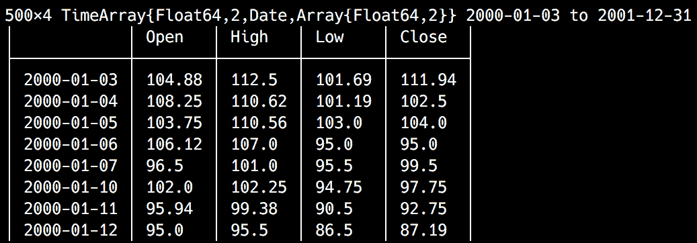

`MarketData`模块还公开了三大公司更大的历史价格和数量数据——苹果(`AAPL`)、波音(`BA`)和卡特彼勒(`CAT`)。


# 用图和 PyPlot 快速浏览我们的数据

老话说得好，一张*图抵得上千言万语*，下面就让我们通过作图来快速感受一下我们的数据吧。这是一个很好的机会来介绍最好的 Julia 数据可视化包之一— `Plots`。与我们之前使用的`Gadfly`不同，`Plots`采用了不同的方法——它是许多不同绘图库的接口。基本上，它就像中间件一样，为其他绘图包提供一个通用的、统一的 API(称为**后端**)。在 Julia 中，不同的绘图包具有不同的特性和优势，根据用户的特定需求，他们可能被迫学习另一个库、更改代码等等，以便交替使用不同的绘图包。通过一个统一的 API 和一个允许动态交换后端的简单机制来解决这个问题。

`Plots`包支持以下后端— `PyPlot`、`Plotly`或`PlotlyJS`、`GR`、`UnicodePlots`、`PGFPlots`、`InspectDR`和`HDFS5`。你应该用哪一个？这取决于实际的用例，但作为一般规则，用`Plots`作者的话来说——*GR 代表速度，Plotly(JS)代表交互性，PyPlot 否则*。

请阅读 http://docs.juliaplots.org/latest/backends/[的官方文档，了解每个后端的优缺点。](http://docs.juliaplots.org/latest/backends/)

我们将使用`PyPlot`，一个流行的同名 Python 包的 Julia 包装器。让我们安装`Plots`和`PyPlot`。运行`pkg> add Plots`应该很简单。接下来，`pkg> add PyPlot`将会更加投入。由于`PyPlot`使用`PyCall.jl`来调用 Python 代码，根据您当前的 Julia 安装，`Pkg`可能也必须安装`miniconda` Python 发行版。所以可能需要几分钟。

要开始将`Plots`与`PyPlot`一起使用，请确保运行以下程序:

```
julia> using Plots 
julia> pyplot() 
Plots.PyPlotBackend() 
```

`pyplot`函数配置`PyPlot`后端供`Plots`使用。

安装`PyPlot`后，当试图运行`pyplot()`时，可能会出现错误。请按照软件包提供的说明，并重新启动朱莉娅 REPL，如果这样建议。

我们现在准备好出发了！该模块公开了`plot`函数，最简单的方法是用两个值集合调用，对应于 x 和 y 坐标:

```
julia> plot(1:10, rand(10))
```

您应该会看到一个绘图在新窗口中呈现——我的窗口看起来是这样的，但是因为我们是可视化随机值，所以您的窗口会有所不同:

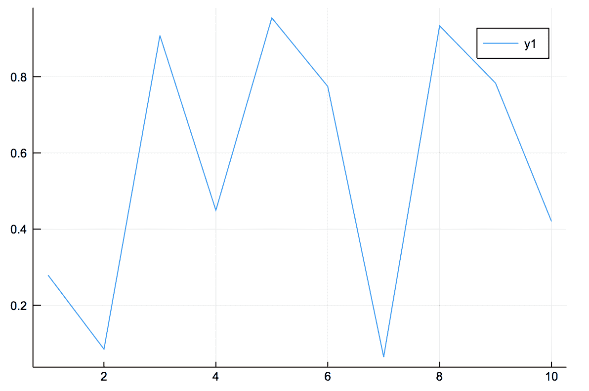

这是由`PyPlot`渲染的十个随机值的图。

这些图很酷的一点是它们可以使用`plot!`函数进行变异。例如，我们可以通过绘制矩阵向它添加两条线:

```
julia> plot!(rand(10, 2)) 
```

结果输出如下:


可以使用属性增强绘图。它们允许我们添加标签、标题，以及设计可视化样式等等。例如，下面是我们如何使用额外的属性来渲染之前的绘图:

```
julia> plot(1:10, rand(10,3), title="Three Lines",label=["First" "2nd" "Third Line"],lw=3) # lw stands for line width 
```

输出如下所示:


API 还公开了用于在绘制之后修改绘图的函数:

```
julia> xlabel!("Beautiful lines") 
julia> ylabel!("Small lines") 
```

输出如下所示:


回到我们的市场数据，您会很高兴听到`TimeSeries`提供了与`Plots`的现成集成。我们所要做的就是运行以下命令:

```
julia> plot(MarketData.ohlc) 
```

这是我们得到的结果:


我们可以看到市场一直在增长，在 2000 年 3 月达到顶峰，然后突然下降到 50-60 左右。它在那里停留了几个月，然后在 9 月底再次下降，并一直保持在 30 岁以下，直到 2001 年底。这四个值，`Open`、`Close`、`High`和`Low`似乎高度相关。我们可以分别绘制它们:

```
julia> plot(MarketData.ohlc[:High]) 
```

我们得到以下结果:


我们可以像这样追加额外的值:

```
julia> plot!(MarketData.ohlc[:Low]) 
```

输出如下所示:


将高值与低值可视化，我们可以看到在市场崩溃之前的时期中有更大的变化。


# TimeArray 类型

那么，你可能会想，这是怎么回事呢？它看起来确实很有趣，因为我们可以使用方括号和列名对它进行索引。我们可以使用`fieldnames`函数来查看它公开了哪些属性:

```
julia> fieldnames(typeof(MarketData.ohlc)) 
(:timestamp, :values, :colnames, :meta) 
```

事实上，一个`TimeArray`是一个复合类型——用 Julia 的说法是一个`struct`——有四个字段。

`timestamp`字段代表一个时间值的向量——保存我们的时间序列的时间坐标。所以如果我们看一下我们的`TimeArray`对象，我们会在第一行看到这个:

```
julia> MarketData.ohlc |> head 
6×4 TimeArray{Float64,2,Date,Array{Float64,2}} 2000-01-03 to 2000-01-10  
```

看起来是这样的:


在这个输出中，`2000-01-03`是`timestamp`数组中的第一个值。我们可以使用`timestamp` getter 来访问数组:

```
julia> timestamp(MarketData.ohlc) 
500-element Array{Date,1}: 
 2000-01-03 
 2000-01-04 
 2000-01-05 
# output truncated 

julia> timestamp(MarketData.ohlc)[1]  
2000-01-03 
```

根据数据集中的实际信息，它的类型可以是`Date`(在我们的例子中)、`Time`或`DateTime`—`TimeType`的任何子类型。

当构造一个`TimeArray`时，你必须小心，因为`timestamp`数据必须被排序——否则，构造函数将出错。

以此类推，有了`timestamp`字段，你大概就能猜出`values`属性是怎么回事了。它保存时间序列的数字数据:

```
julia> values(MarketData.ohlc) 
500×4 Array{Float64,2} 
```

输出如下所示:

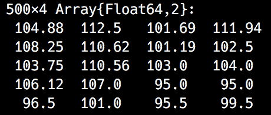

显然，`values`数组的行数必须与`timestamp`集合的长度相匹配。不太明显的是，`values`数组中的所有值必须是同一类型。

因此，`TimeArray`中的每一行都由来自`timestamp`集合的一个项目和来自`values`数组的相应行组成:


`colnames`函数返回值字段中每一列的列名数组。它们作为符号返回:

```
julia> colnames(MarketData.ohlc)  
4-element Array{Symbol,1}: 
 :Open 
 :High 
 :Low 
 :Close  
```

这里唯一的硬性约束是,`colnames`向量中的项目数必须与`values`集合中的列数相匹配。由于`TimeArrays`可以通过列名索引，构造函数将自动修改`colnames`向量中的重复字符串。随后的每个重复名称都将附加 *n、*，其中 *n* 从`1`开始。

如果您对列名不满意，可以使用`rename`方法更改它们，传入`TimeArray`对象和一组列名作为符号:

```
julia> rename(MarketData.ohlc, [:Opening, :Maximum, :Minimum, :Closing]) 
```

最后，`meta`字段应该用于将元信息附加到对象上。默认情况下，它是空的，可以由程序员根据需要进行设置。


# 索引 TimeArray 对象

`TimeSeries`库公开了一个强大的 API，用于访问结构化为`TimeArray`数据的信息。我们已经看到，我们可以通过按列名建立索引来访问各个列:

```
julia> MarketData.ohlc[:High] 
500×1 TimeArray{Float64,1,Date,Array{Float64,1}} 2000-01-03 to 2001-12-31 
```

其结果是:


我们甚至可以使用多种色谱柱的组合:

```
julia> MarketData.ohlc[:High, :Low] 
```

输出如下所示:


我们还可以使用行 id 和日期/时间(对应于`timestamp`值)来索引数组。让我们尝试选择具有最高`Close`值的行。首先，让我们找到它:

```
julia> maximum(values(MarketData.ohlc[:Close])) 
144.19 
```

最高收盘价是`144.19`。请注意，按列名进行索引会返回另一个`TimeArray`实例，因此要获得它的底层数值，我们需要使用`values`函数。

现在我们可以找到它对应的索引。我们可以通过使用`findall`快速获得所有等于`144.19`的值的索引数组:

```
julia> findall(values(MarketData.ohlc[:Close]) .== 144.19) 
1-element Array{Int64,1}: 
 56 
```

那将是第`56`行。我们可以使用这些信息来索引时间序列:

```
julia> MarketData.ohlc[56] 
1×4 TimeArray{Float64,2,Date,Array{Float64,2}} 2000-03-22 to 2000-03-22 
```

输出如下所示:


这是 2000 年 3 月 22 日。如果我们想查看前后的行，我们可以很容易地做到:

```
julia> MarketData.ohlc[50:60] 
11×4 TimeArray{Float64,2,Date,Array{Float64,2}} 2000-03-14 to 2000-03-28 
```

这就是产生的`TimeArray`:

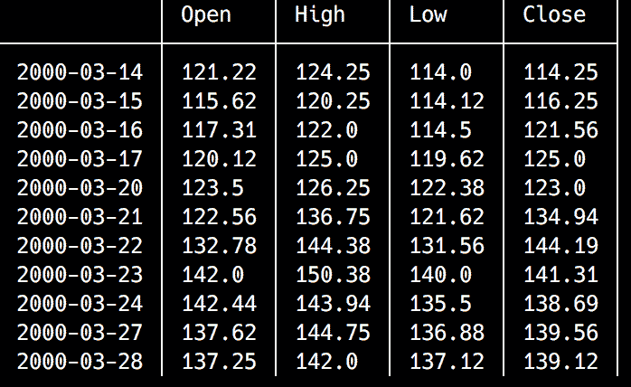

如果我们想检查日期前后一周中同一天的值，按范围索引支持一个步长参数。我们可以如下使用它:

```
julia> MarketData.ohlc[7:7:70] 
```

我们每七天过滤一次，从第七行开始，一直到第七十行；即每个`Wednesday`，如`Dates.dayname`所示:

```
julia> dayname(timestamp(MarketData.ohlc)[56]) 
"Wednesday" 
```

如果我们想检索所有的星期三，我们当然可以使用关键字`end`，就像在`MarketData.ohlc[7:7:end]`中一样。

假设我们对此很满意，但我们希望在约会中得到更多的背景信息。所以，我们想要所有的星期三加上我们约会的前一天和后一天。我们也可以通过索引数组来实现这一点:

```
julia> MarketData.ohlc[[7:7:49; 54;55;56;57; 63:7:70]] 
13×4 TimeArray{Float64,2,Date,Array{Float64,2}} 2000-01-11 to 2000-04-11 
```

输出如下所示:

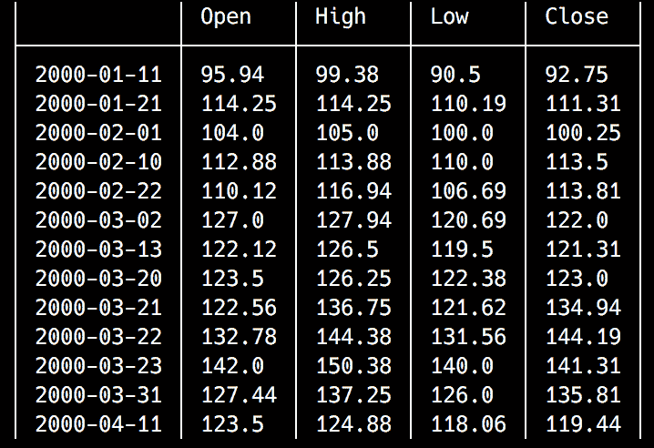

在这里，我们在 7 和 49 之间拉动第七行，然后是第 54、55、56 和 57 行，然后是 63 和 70 之间的第七行。

`TimeArray` indexing is very flexible, but keep in mind that the rows must always be ordered by date. This is the reason why we can't say, for instance, [`7:7:70`; `54;55;56;57`]—the elements would be out of order. And speaking of errors, including duplicate rows will also result in an error.

我们还可以使用日期/时间对象进行索引:

```
julia> MarketData.ohlc[Date(2000, 03, 22)] 
1×4 TimeArray{Float64,2,Date,Array{Float64,2}} 2000-03-22 to 2000-03-22 
```

这会产生以下结果:

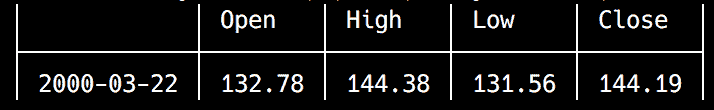

是的，我们也可以使用日期/时间范围:

```
julia> MarketData.ohlc[Date(2000, 03, 20):Day(1):Date(2000, 04,30)] 
29×4 TimeArray{Float64,2,Date,Array{Float64,2}} 2000-03-20 to 2000-04-28 
```

输出如下所示:

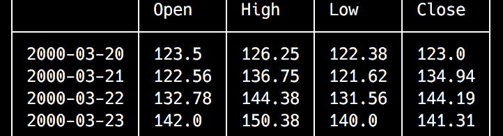

使用其他日期范围步骤也同样有效:

```
julia> MarketData.ohlc[Date(2000, 03, 20):Dates.Week(1):Date(2000, 04,30)] 
6×4 TimeArray{Float64,2,Date,Array{Float64,2}} 2000-03-20 to 2000-04-24 
# output truncated 
```

组合多个指数也是可行的:

```
julia> MarketData.ohlc[[Date(2000, 03, 20):Day(1):Date(2000, 04,30); Date(2000, 05, 01)]] 
30×4 TimeArray{Float64,2,Date,Array{Float64,2}} 2000-03-20 to 2000-05-01 
```

最后，我们可以想出我们可以想象的任何列和行的组合:

```
julia> MarketData.ohlc[:High, :Low][Date(2000, 03, 20):Day(1):Date(2000, 03,25)] 
5×2 TimeArray{Float64,2,Date,Array{Float64,2}} 2000-03-20 to 2000-03-24 
```

这是结果:


# 查询 TimeArray 对象

`TimeSeries`模块公开了一个强大的类似查询的 API，用于过滤时间序列数据。让我们来看看每一个。


# when()方法

`when`方法允许将来自`TimeArray`的元素聚合到特定的时间段中。例如，我们可以使用这个函数以更简洁的方式在数据集中挑选星期三:

```
julia> when(MarketData.ohlc[1:70], Dates.dayname, "Wednesday") 
14x4 TimeArray{Float64,2,Date,Array{Float64,2}} 2000-01-05 to 2000-04-05 
# output truncated 
```

我们不仅仅局限于`Dates.dayname`；我们可以使用上一节中提到的许多`Dates`函数— `day`、`dayname`、`week`、`month`、`monthname`、`year`、`dayofweek`、`dayofweekofmonth`、`dayofyear`、`quarterofyear`和`dayofquarter`:

```
julia> when(MarketData.ohlc, Dates.monthname, "August") 
46x4 TimeArray{Float64,2,Date,Array{Float64,2}} 2000-08-01 to 2001-08-31 
# output truncated 
```


# from()方法

该函数从传递给该方法的日期开始截断一个`TimeArray`。对应于过去日期的行包含在结果中:

```
julia> from(MarketData.ohlc, Date(2000, 3, 22)) 
445x4 TimeArray{Float64,2,Date,Array{Float64,2}} 2000-03-22 to 2001-12-31 
```

输出如下所示:

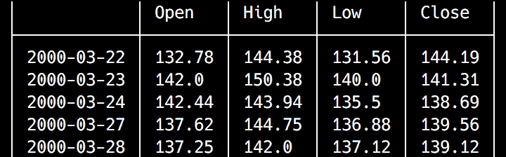


# to()方法

`to()`方法返回截止到作为参数传递的日期的行:

```
julia> to(MarketData.ohlc, Date(2000, 3, 22)) 
56x4 TimeArray{Float64,2,Date,Array{Float64,2}} 2000-01-03 to 2000-03-22 
# output truncated 
```


# findall()和 findwhen()方法

这个函数族测试一个条件，并返回条件为真的结果。唯一的区别是`findall()`返回一个包含行数的数组，而`findwhen()`返回一个日期/时间对象的向量。例如，如果我们想找到收盘值至少比开盘值高 10%的所有行，我们可以运行以下命令:

```
julia> findall(MarketData.ohlc[:Close] .>= MarketData.ohlc[:Open] .+ MarketData.ohlc[:Open] .* 0.1) 
7-element Array{Int64,1}: 
  55 
  74 
 119 
 254 
 260 
 271 
 302 
```

`findwhen`将产生类似的输出，但是对于日期:

```
julia> findwhen(MarketData.ohlc[:Close] .>= MarketData.ohlc[:Open] .+ MarketData.ohlc[:Open] .* 0.1) 
7-element Array{Date,1}: 
 2000-03-21 
 2000-04-17 
 2000-06-21 
 2001-01-03
```

```
 2001-01-11 
 2001-01-29 
 2001-03-14 
```


# 操纵时间序列对象

`TimeSeries`公开了一组极简但有效的修改`TimeArray`对象的方法。


# 合并()

首先，我们可以结合两个`TimeArrays`的数据。`merge`方法使用时间戳作为连接列——默认情况下，它执行内部连接。但是也可以执行左连接、右连接和外连接。让我们生成一些随机数据进行实验。我们将从创建一个包含随机值的时间序列开始，时间跨度为一周，从今天开始:

```
julia> d1 = today():Day(1):today() + Week(1) |> collect 
8-element Array{Date,1}: 
 2018-11-08 
 2018-11-09 
 2018-11-10 
 2018-11-11 
 2018-11-12 
 2018-11-13 
 2018-11-14 
 2018-11-15 

julia> t1 = TimeArray(d1, rand(length(d1)), [:V1]) 
8×1 TimeArray{Float64,1,Date,Array{Float64,1}} 2018-11-08 to 2018-11-15 
```

输出如下所示:


接下来，我们将创建另一个分布在十天内的时间序列对象:

```
julia> d2 = today():Day(1):today() + Day(10) |> collect 
11-element Array{Date,1}: 
 2018-11-08 
 2018-11-09 
 2018-11-10 
 2018-11-11 
 2018-11-12 
 2018-11-13 
 2018-11-14 
 2018-11-15 
 2018-11-16 
 2018-11-17 
 2018-11-18 

julia> t2 = TimeArray(d2, rand(length(d2)), [:V2]) 
11×1 TimeArray{Float64,1,Date,Array{Float64,1}} 2018-11-08 to 2018-11-18  
```

这将导致以下结果:


所以现在我们有两个`TimeArray`实例，`t1`和`t2`。`t2`对象包含`t1`中所有日期加上另外三天的值。常规(内部连接)`merge`将只使用时间戳同时出现在`t1`和`t2`中的行:

```
julia> merge(t1, t2) 
8×2 TimeArray{Float64,2,Date,Array{Float64,2}} 2018-11-08 to 2018-11-15 
```

这是输出:


右连接、左连接和外连接将为不对应的行引入`NaN`值:

```
julia> merge(t1, t2, :right) 
11×2 TimeArray{Float64,2,Date,Array{Float64,2}} 2018-11-08 to 2018-11-18 
```

输出如下所示:


# vcat()方法

`vcat()`方法可以认为是`merge`的对应物。如果`merge`连接两个时间序列的列，`vcat`则合并它们的行。它最明显的用例是将拆分成多个文件的数据集中的数据放在一起。让我们来看看它的实际应用:

```
julia> d3 = today() + Week(2):Day(1):today() + Week(3) |> collect  
8-element Array{Date,1}: 
 2018-11-22 
 2018-11-23 
 2018-11-24 
 2018-11-25 
 2018-11-26 
 2018-11-27
```

```
 2018-11-28 
 2018-11-29 

julia> t3 = TimeArray(d3, rand(length(d3)), [:V1]) 
8×1 TimeArray{Float64,1,Date,Array{Float64,1}} 2018-11-22 to 2018-11-29 
```

输出如下所示:

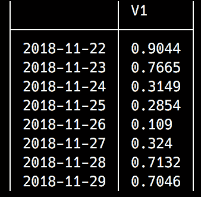

我们已经创建了一个新的`TimeArray`，涵盖从今天开始的两周到三周的时间段:

```
julia> vcat(t1, t3) 
16×1 TimeArray{Float64,1,Date,Array{Float64,1}} 2018-11-08 to 2018-11-29 
```

这就是产生的`TimeArray`:


产生的时间序列结合了来自`t1`和`t3`的数据。


# collapse()方法

这种方法允许将数据压缩到更长的时间范围内，例如将每日数据转换为每周数据:

```
julia> january = TimeArray(Date(2018, 1, 1):Day(1):Date(2018, 1, 31) |> collect, rand(31), [:values]) 
31×1 TimeArray{Float64,1,Date,Array{Float64,1}} 2018-01-01 to 2018-01-31 
```

它产生以下输出:


如果我们想要`collapse`时间序列，我们需要决定如何处理被折叠的数据。这是通过传递函数参数实现的。该方法的一般形式如下:

```
collapse(<time series>, <time function>, <time filtering function>, <value collapsing function>) 
```

例如，我们可以通过保留周期的最后一天(`<time filtering function>`)和计算值的平均值(`<value collapsing function>`)将一月的数据`collapse`到一个周周期(`<time function>`):

```
julia> using Statistics 
julia> collapse(january, week, last, mean) 
5×1 TimeArray{Float64,1,Date,Array{Float64,1}} 2018-01-07 to 2018-01-31 
```

输出如下所示:


`<value collapsing function>`是可选的，如果没有提供，将使用对应于时间戳的值:

```
julia> collapse(january, week, first) 
5×1 TimeArray{Float64,1,Date,Array{Float64,1}} 2018-01-01 to 2018-01-29 
```

这是我们得到的结果:

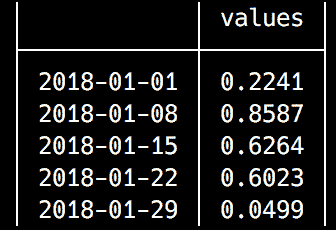


# map()方法

最后，`map()`函数允许我们遍历时间序列中的每一行，并将函数应用于时间戳和值。我们可以轻松地将`january`时间序列中的第一周推迟一年，如下所示:

```
julia> map(january[1:7]) do ts, values 
           ts += Year(1) 
           (ts, values) 
       end 
7×1 TimeArray{Float64,1,Date,Array{Float64,1}} 2019-01-01 to 2019-01-07 
```

输出如下所示:

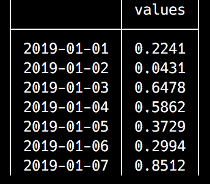

关于`TimeSeries`还有更多要说的。但是现在，我们就此打住。我们将在下一章回到`TimeArray`，在那里我们将使用它对欧盟的失业数字进行时间序列分析和预测。


# 摘要

在这一章中，我们学习了在 Julia 中处理日期和时间。这种语言提供了一个强大的、可访问的 API，它遵循了 Julia 的总体理念——您可以从简单开始，随着您的知识越来越丰富，可以扩充您的代码。因此，默认情况下，日期/时间对象使用本地时间，忽略时区等复杂细节。然而，时区支持只差一个包。我们已经看到了如何通过使用`TimeZones`提供的功能来扩展 Julia 的`Dates` API。

利用我们对时态数据的理解，我们能够朝着成为熟练的 Julia 程序员又迈进了一步，并了解了时间序列和强大的`TimeArray`。我们已经看到了如何使用`Plots`绘制时间序列，这是一个非常通用的 Julia 绘图库——事实上，它是一个中间件，为一系列可视化包提供了一个公共 API，允许我们根据需要交换后端。

在下一章中，我们将通过对欧盟的失业水平进行分析和预测来继续我们对时间序列的讨论。在这个过程中，我们将学习时间序列分析最重要的模式——趋势、季节性和不规则性，并且我们将通过执行各种时间序列转换来扩展我们对`TimeSeries`的了解。