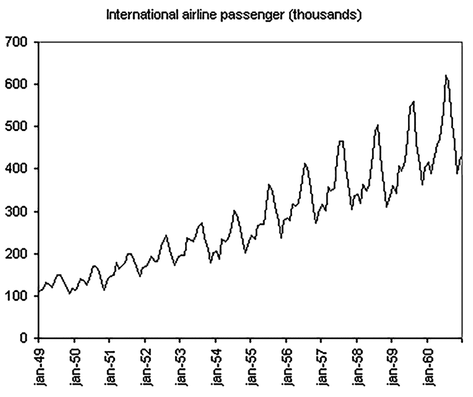
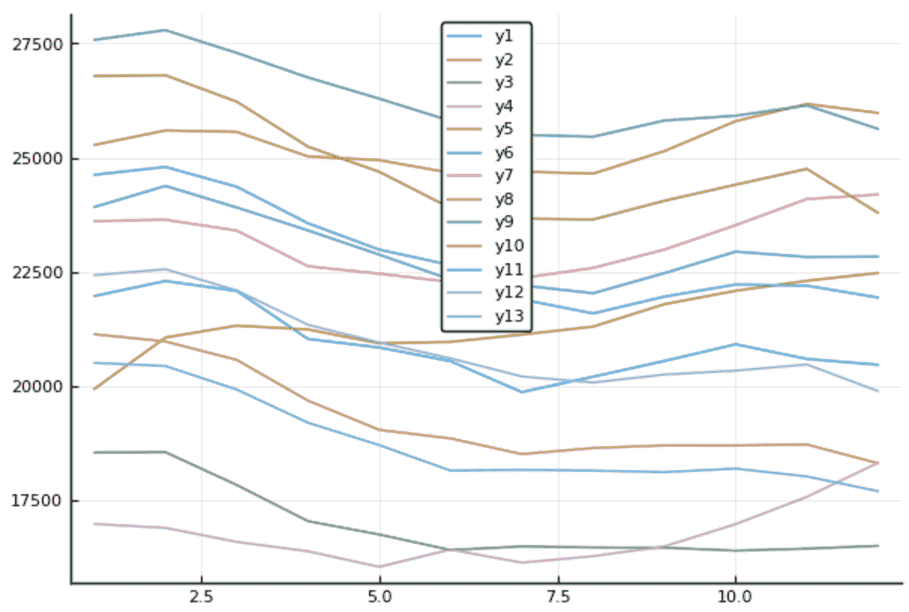
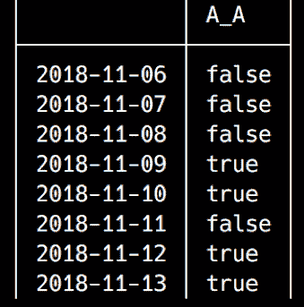

# 时间数列预测法

在前一章中，我们学习了如何处理 Julia 的日期和时间。这让我们理解了时间序列数据这个非常重要的概念。现在，我们准备讨论另一个非常重要的数据科学主题——时间序列分析。

时间序列分析和预测是任何组织的关键战略和决定性组成部分，从了解销售旺季到季末间隔和折扣，安排员工休假，预算，财政年度，产品发布周期，原材料需求的增加，以及许多许多其他方面。理解和预测各种业务指标随时间的演变是做生意的必要组成部分，无论我们谈论的是学校、十亿美元的公司、酒店、超市还是政府。

然而，时间序列数据分析是数据科学中最复杂的任务之一。时序事件的性质和特殊性导致了专门算法和方法的发展。

在这一章中，我们将学习使用 Julia 进行时间序列分析和预测的基础知识。尽管 Julia 是一门相当年轻的语言，但它已经为处理与时间相关的数据提供了很好的支持。在前一章中，我们已经了解了日期模块和`TimeSeries`包。在这一章中，我们将深入研究并应用我们以前学过的知识。我们还将了解更高级的`TimeSeries`方法以及其他一些处理时态数据的包。我们将讨论以下主题:

*   **欧盟** ( **欧盟**)失业数字的探索性数据分析
*   趋势、周期、季节性和误差-时间序列的组成部分
*   时间序列分解
*   时间序列数据的平稳性、差分和自相关
*   学习应用简单的预测技术


# 技术要求

Julia 包生态系统正在不断发展，每天都有新的包版本发布。大多数时候这是好消息，因为新版本带来了新特性和错误修复。然而，由于许多软件包仍处于测试阶段(版本 0.x ),任何新版本都可能引入突破性的变化。因此，书中介绍的代码可能会停止工作。为了确保您的代码将产生与书中描述的相同的结果，建议使用相同的包版本。以下是本章中使用的外部软件包及其具体版本:

```
CSV@v0.4.3
DataFrames@v0.15.2
IJulia@v1.14.1
Plots@v0.22.0
TimeSeries@v0.14.0
```

为了安装软件包的特定版本，您需要运行:

```
pkg> add PackageName@vX.Y.Z 
```

例如:

```
pkg> add IJulia@v1.14.1
```

或者，你可以通过下载本章提供的`Project.toml`文件并使用`pkg>`实例化来安装所有使用的包，如下所示:

```
julia> download("https://raw.githubusercontent.com/PacktPublishing/Julia-Programming-Projects/master/Chapter10/Project.toml", "Project.toml")
pkg> activate . 
pkg> instantiate
```


# 快速浏览一下我们的数据

在这一章中，我们将使用欧盟统计局(Eurostat)提供的一些真实数据。欧统局网站上有丰富的数据库。对于我们的学习项目，我们将看看失业数字——随着欧盟经济在长期衰退后的增长，这些统计数据应该很有趣。各种欧盟就业和失业数据可以从 http://ec.europa.eu/eurostat/web/lfs/data/database 下载。我们将使用按性别和年龄分类的**失业数据——月平均**数据集。

您不需要下载它，因为本章的支持文件中提供了更好的结构化数据集。然而，如果你很好奇，想看一看，你可以从就业和失业(劳动力调查)类别| LFS 主要指标子类别|失业- LFS 调整系列文件夹下获得原始数据。

我还定制了数据，使用*千人*作为测量单位(默认为*活跃人口的百分比*)，以及未经调整的数据(既不是季节性的，也不是日历)。我也只保留了欧盟的数据(没有单个国家)。最后，我把 2005 年 1 月到 2017 年 12 月的所有数据都纳入进来了。您可以在数据浏览器中进行所有这些调整，然后将表格下载为 TSV 文件。至于 TSV 格式，我选择了这些选项:


在欧统局数据浏览器工具中可视化后，数据如下所示:


我们可以在第一列中看到地理区域的列表，在其余的列中可以看到每月的失业人数。该数据集的结构与我们要求的不同。首先，`TimeSeries`要求矩阵被转置(如，日期应该变成行而不是列)。此外，日期的格式是非标准的，例如，`2017M01`表示 2017 年 1 月。最后，数字被格式化为字符串，并带有千位分隔符。您可以从本章的支持文件下载这个原始数据文件，这些文件位于[https://github . com/packt publishing/Julia-Programming-Projects/blob/master/chapter 10/data/une _ rt _ m _ 1 . tsv](https://github.com/PacktPublishing/Julia-Programming-Projects/blob/master/Chapter10/data/une_rt_m_1.tsv)。

在处理现实生活中的数据时，这种问题是常见的—在任何数据科学项目中，关于结构和格式的标准差异使得数据清理和转换成为关键的第一步，并且通常也是耗时的一步。为了简洁起见，我准备了一个简化的数据集，它已经被转换成可以与`TimeSeries`无缝使用，你可以从本章的支持文件中下载。


# 数据处理

如果你想继续，下面是我如何使用 Julia 处理原始数据:

```
# load the raw data file as a DataFrame 
julia> using CSV, DataFrames 
julia> df = CSV.read("une_rt_m_1.tsv", header = true, delim = '\t') 
1×157 DataFrames.DataFrame. Omitted printing of 148 columns 
```

这是它在 Jupyter 笔记本上的样子:


在下一步中，我们将通过选择一个由 1 行和 2 列组成的`DataFrame`到`end`并将其转换为`Array`来提取值:

```
julia> values = convert(Array, df[1, 2:end]) 1×156 Array{Union{Missing, String},2}: "21 974" "22 303" "22 085" "21 036" "20 849" ... # output omitted 
```

现在，我们可以解析之前提取的字符串值，并将它们转换为整数。新的整数值也存储在向量中:

```
julia> values = map(x -> parse(Int, replace(x, " "=>"")), values)[:] 
156-element Array{Int64,1}: 
 21974 
 22303 
 22085 
 21036 
# output omitted 
```

太好了—我们的价值观已经准备好了！我们现在可以专注于标题。我们的目标是提取标签中包含的日期信息。第一步，我们将列名放入一个向量中，如下所示:

```
julia> dates = names(df)[2:end] 
156-element Array{Symbol,1}: 
 Symbol("2005M01") 
 Symbol("2005M02") 
 Symbol("2005M03") 
 Symbol("2005M04") 
 Symbol("2005M05") 
# output omitted 
```

现在，让我们转换符号，使它们更接近我们所需要的——也就是说，类似于标准的日期格式。我们将用破折号替换“`M`”，在此过程中，我们将把符号转换成`String`，因为替换对符号不起作用:

```
julia> dates = map(x -> replace(string(x), "M"=>"-"), dates) 
156-element Array{String,1}: 
 "2005-01" 
 "2005-02" 
 "2005-03" 
 "2005-04" 
 "2005-05" 
# output omitted 
```

太棒了。现在，我们可以定义一个`DateFormat`来匹配我们的字符串——year 加破折号加 month，其中 month 是一个带前导零的数值。我们将使用它将字符串转换成适当的日期对象:

```
julia> using Dates 
julia> dateformat = DateFormat("y-m") 
dateformat"y-m" 

julia> dates = map(x -> Date(x, dateformat), dates) 
156-element Array{Date,1}: 
 2005-01-01 
 2005-02-01 
 2005-03-01 
 2005-04-01 
 2005-05-01 
# output omitted 
```

我们越来越近了！为了安全地将数据保存到文件中，我创建了一个新的`DataFrame`，这次使用正确的日期和原始值，如下所示:

```
# store the extracted data in a new DataFrame 
julia> df2 = DataFrame(Dates = dates, Values = values) 
156×2 DataFrames.DataFrame 
│ Row │ Dates      │ Values │ 
│ 1   │ 2005-01-01 │ 21974  │ 
│ 2   │ 2005-02-01 │ 22303  │ 
│ 3   │ 2005-03-01 │ 22085  │ 
│ 4   │ 2005-04-01 │ 21036  │ 
│ 5   │ 2005-05-01 │ 20849  │ 
# output omitted 
```

我们可以使用下面的代码使用`CSV.write`将数据的快照存储到文件中:

```
# write DataFrame to file 
julia> CSV.write("UE-unemployment.tsv", df2) 
```

我们现在可以从 TSV 文件中加载数据作为`TimeArray`:

```
julia> using TimeSeries
julia> unemployment_data = readtimearray("UE-unemployment.tsv")
156x1 TimeArray{Float64,2,Date,Array{Float64,2}} 2005-01-01 to 2017-12-01
```

如果您想直接从`DataFrame`转换到`TimeSeries`数据，而不需要加载 TSV 文件，您可以使用`IterableTables`包。`IterableTables`在 Julia 中提供了丰富的不同表类型之间的转换方法。你可以在 https://github.com/davidanthoff/IterableTables.jl 阅读更多关于这个包的自述。

我们的时间序列数据被正确加载-在 2005 年 1 月到 2017 年 12 月之间有 156 个条目。它看起来会像这样:

```
julia> TimeSeries.head(unemployment_data, 10) 
10x1 TimeArray{Float64,2,Date,Array{Float64,2}} 2005-01-01 to 2005-10-01 
```

输出如下所示:


我们必须使用 head 函数的完全限定名`TimeSeries.head`，因为`TimeSeries`和`DataFrames`都导出了一个`head`方法，并且两个包都被加载到当前作用域中。

试图在没有模块名称的情况下调用 head 函数会导致错误:

```
julia> head(unemployment_data, 10) 
WARNING: both TimeSeries and DataFrames export "head"; uses of it in module Main must be qualified 
ERROR: UndefVarError: head not defined 
```

快速了解数据的最佳方式是绘制图表。我们将使用带有`PyPlot`后端的`Plots`包——我们在[第 9 章](11df7c94-2e9a-4cc5-aba1-b9c9c93800a0.xhtml)、*中安装了它们，处理日期、时间和时间序列*:

```
julia> using Plots 
julia> pyplot() 
```

`PyPlot`后端具有复杂的依赖关系，因此如果您在执行指定代码时遇到问题，请遵循警告和错误提供的说明。

例如，在某些时候，我不得不手工安装两个额外的包:

```
julia> using Pkg 
julia> pkg"add PyCall LaTeXStrings"
```

现在，我们可以绘制失业数字:

```
julia> plot(unemployment_data) 
```

茱莉亚会渲染以下情节:


我们不难看出，自 2005 年以来，失业人数一直在稳步下降，2008 年下半年达到历史最低水平。从那里开始，几个月后，价格飙升至 2005 年以来的最高水平。这是衰退打击欧盟经济的时刻。从那时起，失业人数持续增长，直到 2013 年初达到顶峰。失业人数在 2013 年 2 月达到最大值，此后欧洲经济开始复苏，失业人数迅速下降，接近衰退前水平。


# 了解时间序列组件

时间序列有三个组成部分，它们是理解时间相关数据的关键。分别是*趋势*、*季节性*和*噪音*。让我们在欧盟失业数据的背景下来看看它们。


# 趋势

趋势可以定义为时间序列数据的长期趋势，即平均而言，值在一段时间内趋于增加或减少。查看我们的图表，我们可以发现三个明显的趋势:


从 2005 年到 2008 年呈下降趋势(失业人数逐年减少)；从 2008 年开始并持续到 2013 年的上升趋势(平均失业率上升)；同样，从 2013 年到 2017 年底一直呈下降趋势(失业人数不断减少)。


# 季节性

季节性是与日历时间相关的有规律的反复出现的高点和低点；也就是说，它直接受到季节、季度、月份等因素的影响。例如，考虑一下一个城市的用电量——我们可能会看到，由于空调，夏天的用电量会增加，而在冬天，由于需要给房子供暖，用电量会增加。同样，通过观察海边的一家酒店，我们会发现夏季的预订量显著增加，随后在冬季有所下降。

因此，季节性产生的影响在时间、方向和程度上相当稳定。最常见的与日历相关的影响是自然条件(天气)、商业和行政程序(财政年度)以及社会和文化行为(因国家和宗教节日而导致的银行假日、圣诞节、情人节等关键日期)。它还包括由日历事件引起的影响，这些事件重复发生，但日期不固定(如复活节，其日期落在每年的某个星期日，但实际日期有所不同)。

失业数据受到强烈的季节性影响——在夏季，更多的人被雇用。这些似乎是临时工作，可能是在旅游业，帮助酒店和餐馆应对假日游客的涌入——但也可能是在办公室和零售部门，以弥补正式员工的休假。我们可以在我们的图上清楚地看出这一点——夏季月份带来了一年中最低的失业数字，而这些数字在秋季又开始上升:


在年中的三个夏季月份，失业率达到最低水平。一旦旺季过去，失业率会再次急剧上升。


# 不规则噪声

分析时间序列数据时的默认假设是，我们可以识别潜在的模式(由趋势和季节性组件定义)。然而，当数据中存在这种系统模式时(一些时间序列数据完全是随机的，例如，地震发生率)，它也将伴随着方差，即被归类为随机噪声、误差或不规则性的数据波动。它们使得识别模式的任务更加困难，为此，数据科学家将使用某种形式的噪声过滤。

换句话说，这种不规则成分是在季节和趋势成分被计算和去除之后剩下的。它们是短期波动，既不系统也不可预测。


# 周期性

周期性在某种程度上类似于季节性，正因如此，两者经常被混淆。然而，它们是两回事，区别很重要。周期性周期代表更大的时间段，我们可以在其中识别数据中重复出现的模式(增长或下降的周期),这不能用日历模式来解释。它们通常更大，跨越几年，并且不与日历事件重叠。这种周期性元素可以通过产品发布周期(汽车模型的发布，或操作系统的新版本，或笔记本电脑系列的升级)，选举周期(政府预算或与政府合同合作的公司)等引入。


# 时间序列分解

因此，我们可以说，时间序列中的任何值都可以通过我们之前讨论的四个组成部分的函数来表示——趋势、季节性、误差和周期。四个分量之间的关系可以是*加法*或*乘法*。

当季节变化在一段时间内保持不变时，使用加法模型。趋势可能会上升或下降，但季节性或多或少保持不变。此类数据的图表看起来与此非常相似:


如果我们在年最大值和年最小值之间画两条假想的线，这两条线将非常平行。

对于加法时间序列模型，将四个组成部分相加以产生序列中的值。这样，一个时间序列 *Y* 就可以分解为 *Y* = *趋势* + *周期* + *季节性* + *噪声*。

对于季节性变化随时间增加的时间序列，应使用乘法模型。例如，1949 年 1 月到 1960 年 1 月之间的国际航班乘客数据代表了一个典型的乘法时间序列:



我们可以看到季节模式的变化是如何与时间序列的水平相关联的:我们的乘客越多，变化就越大。一个乘法时间序列 *Y* 可以表示为 *Y* = *趋势* * *周期* * *季节性* * *噪声*。

顺便提一下，我们可以通过转换数据将乘法模型转换为加法模型，直到它随着时间的推移变得稳定，例如，通过对数转换— *Y* = *趋势* * *周期* * *季节性* * *噪声*相当于 *log Y* = *对数趋势* + *对数周期* + *对数季节性*

将一个时间序列分割成多个部分是时间数据分析中广泛采用的一种技术。这就是所谓的**时间序列分解**，它也代表了时间序列预测的基础。


# 解释数据——加法还是乘法？

这是一个问题——这两种方法中哪一种能更好地解释我们的数据？回答这个问题的一个方法是查看每个周期的值，看是否有显著的变化。当我们处理年度周期时，让我们提取并绘制年度值，如下所示:

```
julia> plot() 
julia> for y in 2005:2017 
           TimeSeries.values(when(unemployment_data, year, y))[:] |> plot! 
           gui() 
       end 
```

首先，我们渲染一个空的情节。然后，我们迭代一个与我们的年份对应的范围，在 2005 年到 2017 年之间，然后我们使用`TimeSeries.when`方法按年份过滤我们的数据。我们提取得到的`TimeArray`值，并通过使用`plot!`函数将它们添加到绘图中。然而，这还不够——我们还必须调用`Plots.gui`方法来实际呈现更新后的绘图。根据官方文件，这是非常重要的一点:

"一个绘图只有在返回时才显示(分号将抑制返回)，或者如果用`display(plt)`、`gui()`显式显示，或者通过在你的绘图命令中添加`show = true`。"

你可以在[http://docs.juliaplots.org/latest/output/](http://docs.juliaplots.org/latest/output/)了解更多关于输出剧情的信息。

以下是我们得到的结果:



我们可以看到每年都有一致的变化，这意味着我们应该使用乘法模型。

使用`plots`目测组件是识别时序模式的一种常见方式。在我们的例子中，很容易看出趋势和季节性。此外，我们可以推断数据没有显示任何循环模式。

记住乘法模型认为 *Y =趋势*周期性*季节性*噪声*。我们可以把它写得更短，比如 Y = TCSN。因为我们刚刚确定我们的数据不存在任何周期，所以我们将忽略周期成分，因此 *Y = TSN* 。


# 提取趋势

分解时间序列的第一步是提取趋势分量。一种广泛使用的计算趋势的技术叫做**平滑**。顾名思义，它*通过去除噪声和模糊季节性来平滑*值，以便我们可以识别趋势。

执行平滑的一种方式是通过移动平均。在金融应用中，简单移动平均是前 *n* 个数据点的未加权平均值。这就像在我们的时间序列上应用一个移动窗口，并使用可见数据进行计算。然后，我们将窗口滑动一个位置，重复计算。为了平滑季节性数据，窗口应该是季节性周期的大小——在我们的例子中，是 12 个月。因此，为了对我们的数据进行简单的移动平均平滑，我们将从第一个 12 个月(2005 年)开始，对这些值求和，然后除以 12 得到它们的平均值。然后，我们将滑动窗口一个月，重复计算。因此，我们消除了季节性成分的影响，并抵消了噪声的影响。

`TimeSeries`包提供了一系列*应用方法*，实现了时间序列数据的通用转换。其中一种是`moving`方法，可以用来计算一个数列的移动平均值。让我们计算 12 个月间隔的移动平均值，以消除季节性因素:

```
julia> using Statistics 
julia> moving_avg = moving(mean, unemployment_data, 12) 
145×1 TimeArray{Float64,2,Date,Array{Float64,2}} 2005-12-01 to 2017-12-01 
```

结果如下:


正如我们所看到的，结果是一个新的时间序列，它包含了原始时间序列中 12 个月周期的平均值。原始系列的前 12 个值被该操作消耗，因此我们的新系列从 2005 年 12 月开始。如果您希望保留初始值，`moving`函数采用一个额外的关键字参数`padding`。默认情况下，`padding`为`false`，但如果设置为`true`，则消耗的时间戳将被保留，其值将被设置为`NaN`:

```
 julia> moving(mean, unemployment_data, 12, padding = true)
 156×1 TimeArray{Float64,2,Date,Array{Float64,2}} 2005-01-01 to 2017-12-01
```

这将产生以下输出:


在原始数据上绘制平滑值表明了趋势:

```
julia> plot(unemployment_data) 
julia> plot!(moving_avg) 
```

这是我们的情节:


对`plot`方法的第一次调用呈现原始的欧盟失业数字，而对`plot!`方法的后续调用改变了图形，覆盖了对应于趋势的移动平均值。


# 计算季节性

现在我们已经提取了趋势，我们可以将它从初始时间序列中移除。这是由组织完成的。我们将只剩下季节和噪声分量的乘积。由此， *SN = Y/T* 。

为了计算`TimeArray`对象之间的分数，我们将使用基于元素的除法运算符`./`:

```
julia> sn = unemployment_data ./ moving_avg 
145×1 TimeArray{Float64,2,Date,Array{Float64,2}} 2005-12-01 to 2017-12-01  
```

我们将得到以下结果:


绘制得到的`TimeArray`将为我们提供季节性和噪声成分乘积的更清晰图像:

```
julia> plot(sn) 
```

这导致了下面的图:


下一步是计算同一个月这些值的年总和。也就是说，我们将对所有年份中一月的所有月份的值求和；然后，我们将对二月、三月等进行同样的操作。我们将得到所有年份、每个日历月的平均值。这将导致噪声最小化:

```
julia> month_avg = Float64[] 
0-element Array{Float64,1} 

julia> for m in 1:12 
            md = when(sn, month, m) 
            push!(month_avg, mean(TimeSeries.values(md)[:]))  
       end 
```

首先，我们实例化一个`Float64`值的`Vector`。然后，我们在代表月份的`1`和`12`之间的范围内迭代。在循环中，我们应用`when`方法过滤当前迭代月份的值(所有年份的所有一月值，所有年份的所有二月值，然后是三月，依此类推)，然后我们将这些值的平均值放入`month_avg`数组。在循环结束时，我们在`month_avg`中收集这些值，其中第一个值是所有年份中一月份的平均值，第二个值是二月份的平均值，然后是三月份的平均值，依此类推。它看起来会像这样:

```
julia> month_avg 
12-element Array{Float64,1}: 
 1.0376512639850295 
 1.0466377033754193 
 1.0301198608484736 
 1.0014842494206564 
 0.9830320492870818 
 0.9705256323692862 
 0.9630153389575429 
 0.9634443756458616 
 0.9763782494700372 
 0.9893785521401298 
 0.9987100016253194 
 0.9913489915307253 
```

理论上，这些值加起来应该是`12`。实际上，这种情况不会发生(尽管我们已经很接近了)。我们可以使用`sum`函数很容易地将一个数组的所有元素相加:

```
julia> s = sum(month_avg) 
11.951726268655563 
```

因此，我们需要将平均值标准化，这样它们的总和*就会*达到`12`。这是通过将每个季节因子乘以`12`，然后将每个因子除以它们的总和来实现的:

```
julia> norm_month_avg = map(m -> 12m/s, month_avg) 
```

我们使用了`map`函数来迭代`month_avg`中的每一项，就像`m`一样，并应用了一个匿名函数，这样`m = 12m/s`:

```
12-element Array{Float64,1}: 
 1.0418423989910408 
 1.0508651351431808 
 1.0342805760704734 
 1.0055293037095092 
 0.9870025740450584 
 0.9744456429674838 
 0.9669050150351592 
 0.9673357846281114 
 0.9803218991358666 
 0.993374710799588  
 1.0027438505627655 
 0.9953531089117633 
```

让我们再核对一下总数:

```
julia> sum(norm_month_avg) 
12.0 
```

完美！

现在我们已经计算了每月的季节因素，我们可以通过将原始时间序列除以季节因素来对其进行季节调整。这样我们就得到提醒，代表趋势和噪音的乘积— *Y/S = TN* 。为了在 Julia 中计算这一点，我们必须用相应的每月季节系数除`unemployment_data`的每个值。

为了保持整洁，让我们将原始时间序列复制到不同的对象中:

```
julia> adj_unemployment_data = deepcopy(unemployment_data) 
156×1 TimeArray{Float64,2,Date,Array{Float64,2}} 2005-01-01 to 2017-12-01 
```

`deepcopy`函数创建对象的深层副本，作为参数给出。深度复制意味着递归地复制所有内容，从而产生一个完全独立的对象。

接下来，我们可以使用`map`函数，通过递归应用将原始值除以季节性的函数来修改`TimeArray`:

```
julia> map(adj_unemployment_data) do d,v 
           v[1] /= norm_month_avg[month(d)] 
           d,v 
       end 
156×1 TimeArray{Float64,2,Date,Array{Float64,2}} 2005-01-01 to 2017-12-01 
```

结果如下:


`adj_unemployment_data`变量代表经季节性调整的时间序列。


# 时间序列运算符

在时间序列分析中，在`TimeArray`对象之间——或者更确切地说，在对象中包含的元素之间——执行操作是常见的事情。`TimeSeries`包公开了一整套用于数学、比较和逻辑运算的元素操作符。

正如我们已经看到的，当在两个`TimeArray`对象之间进行除法运算时，数学运算符通过使用具有公共时间戳的值来创建一个新的`TimeArray`实例。也支持单个`TimeArray`与`Int`或`Float`之间的操作。以下是可用的运算符:

*   `.+`:算术元素式加法
*   `.-`:算术元素式减法
*   `.*`:算术元素式乘法
*   `./`:算术元素式除法
*   `.^`:算术元素取幂
*   `.%`:算术元素式余数

与数学运算符类似，在比较运算符的情况下，当提供两个`TimeArray`实例时，也会在共享时间戳上比较这些值。然而，在这种情况下，不同之处在于结果将是一个类型为`Bool`的时间数组。

以下是可用的比较运算符:

*   `.>`:基于元素的大于比较
*   `.<`:元素式小于比较
*   `.==`:元素方面的等价比较

*   `.>=`:基于元素的大于或等于比较
*   `.<=`:逐元素小于或等于比较
*   `.!=`:元素间不等价比较

让我们看一个例子。首先，让我们创建一个从一周前到今天的`TimeArray`分布，并用随机值填充它。您的时间戳会有所不同，因为您将在未来的某个时间运行代码，因此输出会与我的不同，但逻辑是相同的。如果模块不在范围内，不要忘记执行`using Dates`:

```
julia> using Dates 
julia> ts1 = TimeArray(Date(today()) - Week(1):Day(1):Date(today()) |> collect, rand(8)) 
8×1 TimeArray{Float64,1,Date,Array{Float64,1}} 2018-11-06 to 2018-11-13 
```

这是我们得到的结果:


现在，我们将对第二个阵列进行同样的操作:

```
julia> ts2 = TimeArray(Date(today()) - Week(1):Day(1):Date(today()) |> collect, rand(8)) 
8x1 TimeSeries.TimeArray{Float64,1,Date,Array{Float64,1}} 2018-01-31 to 2018-02-07 
```

这是我们得到的结果:


现在，我们可以比较这两个对象，例如:

```
julia> tsc = ts1 .> ts2 
8×1 TimeArray{Bool,1,Date,BitArray{1}} 2018-11-06 to 2018-11-13 
```

输出如下所示:


也支持单个`TimeArray`与`Int`、`Float`或`Bool`值之间的比较:

```
julia> tsc .== false 
8×1 TimeArray{Bool,1,Date,BitArray{1}} 2018-11-06 to 2018-11-13  
```

现在，输出如下:



最后，我们可以使用以下逻辑运算符:

*   `.&`基于元素的逻辑`AND`
*   `.|`元素式逻辑`OR`
*   `.!`、`.~`元素式逻辑`NOT`
*   `.` `⊻`元素式逻辑`XOR`

它们是为类型`Bool`的`TimeArrays`定义的，并返回类型`Bool`的`TimeArray`。当两个`TimeArray`对象是操作数并且支持单个`TimeArray`和一个`Bool`之间的操作时，在公共时间戳上计算值。


# 时间序列平稳性

如果时间序列的统计属性(如均值、方差、自相关等)在一段时间内保持不变，则认为该时间序列是平稳的。**平稳性**很重要，因为大多数预测模型都假设时间序列是平稳的，或者可以通过变换使其(近似)平稳。这种方法的原因是平稳时间序列中的值更容易预测——如果它的属性是恒定的，我们可以简单地说它们在未来会像在过去一样。一旦我们根据稳定的时间序列预测了未来的值，我们就可以反转这个过程和转换来计算与原始序列相匹配的值。

因此，平稳时间序列的性质不依赖于观察该序列的时间。含蓄地说，这意味着表示季节性或趋势的时间序列不是静态的。在这种情况下，我们必须再次注意季节性和周期性之间的差异——不显示季节性或趋势模式的周期性时间序列*是*平稳的。


# 差分时间序列

使时间序列平稳的一种方法是通过*求差*。这意味着计算连续值之间的差异。在这种技术中，我们计算某个时间点的值与前一时刻的值之间的差异。

这可以通过使用由`TimeSeries`提供的`diff`方法很容易地计算出来。对时间序列进行微分计算时间序列中两个连续点之间的有限差。默认情况下，相差一天。例如，考虑以下情况:

```
julia> diffts = diff(unemployment_data) 
155×1 TimeArray{Float64,2,Date,Array{Float64,2}} 2005-02-01 to 2017-12-01 
```

作为操作的一部分，原始系列中的一天丢失，结果`TimeArray`从 2005 年 1 月 2 日开始，结果如下:


我们可以将结果呈现为条形图:

```
julia> bar(diffts)
```

我们得到以下结果:


值的变化在整个数据集中清晰可见，这意味着方差相对恒定。


# 自相关

自相关表示时间序列与其自身在连续时间间隔内的滞后版本的相似程度。这是一个非常重要的概念，因为它衡量当前值和相应的过去值之间的关系。因此，它在时间序列预测中有许多有价值的应用；例如，匹配价格、股票、回报等方面的趋势和关系。

我们希望使用自相关来确定我们是否能够可靠地识别因果关系和趋势，或者相反，我们是否正在处理一个随机行走模型。随机游走意味着时间序列中的值是随机定义的，这意味着过去和现在的值之间没有关系。随机游走模型很常见，尤其是对于金融和经济数据。对于随机游走模型，通过获取序列中的最后一个值来预测下一个值。这是因为未来的变动是不可预测的——它们同样可能增加或减少。因此，随机游走模型支持了天真的预测。

我们可以通过使用两个函数的组合来计算自相关性— `TimeSeries.lag`和`xcorr`。`lag`方法的工作原理是移动时间序列的值。例如，让我们使用之前定义的`ts1`:

```
julia> ts1 
8×1 TimeArray{Float64,1,Date,Array{Float64,1}} 2018-11-06 to 2018-11-13 
```

我们得到以下结果:


我们可以如下应用`lag`功能:

```
julia> lag(ts1) 
7×1 TimeArray{Float64,1,Date,Array{Float64,1}} 2018-11-07 to 2018-11-13 
```

这将导致第一个值被分配给下一个时间戳。在我的例子中，最初对应于`2018-11-06`的值`0.3903`现在对应于`2018-11-07`:


请记住，如果您并行运行代码，您的数据将会不同(实际的日期和值是不同的，因为我们使用的是随机值)，但行为将是相同的。

我们可以尝试将失业数据延迟`12`个时间间隔(12 个月),以说明每年的季节性:

```
julia> lagged = lag(unemployment_data, 12) 
144×1 TimeArray{Float64,2,Date,Array{Float64,2}} 2006-01-01 to 2017-12-01 
```

输出如下所示:


这些值已经被改变，并且产生的`TimeArray`开始于 2006 年 1 月 1 日。我们现在可以用`TimeSeries.merge`来联结这两个系列上的共同时间戳:

```
julia> common = merge(unemployment_data, lagged) 
144×2 TimeArray{Float64,2,Date,Array{Float64,2}} 2006-01-01 to 2017-12-01 
```

这会产生以下输出:


如果我们将原始失业数据与一年的滞后序列一起绘制，我们可以看到数据是正相关的，表明年度季节性很强:

```
julia> plot(unemployment_data) julia> plot!(lagged) 
```

输出如下所示:


# 时间数列预测法

预测意味着识别符合历史数据的模型，并使用它们来预测未来值。在预测时间序列数据时，分解起着非常重要的作用，有助于使预测更加准确。潜在的假设是，如果我们使用最适合的方法单独预测每个组成部分，然后将各部分相加或相乘(取决于模型是加法还是乘法)来计算最终值，我们可以更加精确。


# 天真

这是最简单的方法，说明预测值等于序列中的最后一个值。如前所述，这用于随机行走模型，其中未来的运动是不可预测的。例如，要使用 nave 模型预测第一个未知月份(2018 年 1 月)的值，我们可以采用 2017 年 12 月的季节性调整值，并加上(乘以)1 月的季节性部分:

```
julia> update(unemployment_data, Date(2018, 1, 1), 
 TimeSeries.values(adj_unemployment_data[end])[:][end] * norm_month_avg[1] |> round) 
157×1 TimeArray{Float64,2,Date,Array{Float64,2}} 2005-01-01 to 2018-01-01 
```

我们使用`TimeSeries.update`方法为 2018 年 1 月追加一个新项目。其值是 2017 年 12 月的季节性调整值乘以 1 月的标准化季节性:


请注意，我们还假设季节性成分不变，这意味着我们对季节性成分使用了季节性的简单方法。


# 简单平均数

一种稍微高级一点的方法是计算先前数据点的平均值来预测下一个值。这是一种基本的方法，但在某些情况下，它可能非常适合。为了计算它，我们可以将`mean`函数应用于底层的值数组:

```
julia> mean(TimeSeries.values(adj_unemployment_data)[:]) 
21589.641025641027 
```


# 移动平均数

在提取时间序列的趋势成分时，我们详细讨论了移动平均线。它还可以用于预测，使用计算结果来填充下一个值。通过了解序列的季节性来选择合适的窗口大小是很重要的，例如，通过使用自相关图。


# 线性回归

我们可以对季节性调整的时间序列使用线性回归来预测下一个值。让我们仔细看看这个，因为它提供了一些深入有趣的 Julia 代码的好机会。由于我们的数据呈现三种趋势(下降、上升和再次下降)，因此让我们只关注最后一个部分，在这里可以观察到当前的下降趋势:


我们可以看到，当前趋势始于失业高峰，因此我们要做的就是寻找序列中的最大值:

```
julia> findall(adj_unemployment_data[:Values] .== 
 maximum(TimeSeries.values(adj_unemployment_data)[:])) 
1-element Array{Int64,1}: 
 98 

julia> adj_unemployment_data[98] 
1×1 TimeArray{Float64,2,Date,Array{Float64,2}} 2013-02-01 to 2013-02-01 
```

我们得到以下值:


下降趋势始于 2013 年 2 月。让我们提取从那一刻开始的所有数据，一直到系列的结尾:

```
julia> last_trend = from(adj_unemployment_data, Date(2013, 2, 1)) 
59×1 TimeArray{Float64,2,Date,Array{Float64,2}} 2013-02-01 to 2017-12-01 
```

结果如下:


我们现在可以计算线性回归，它将总结失业数字和时间流逝之间的关系，允许我们预测序列中的下一个值。我们在图的 y 轴上显示失业人数，在 x 轴上显示时间。在这种情况下，我们可以用公式`y = a+b*x`来表示`y`，其中`a`和`b`对应的是线性回归。我们将计算趋势序列的线性回归以获得`a`和`b`，我们将计算`y`(失业预测)的下一个值，对应于`x`(2018 年 1 月)的下一个值。让我们一步一步来。

我们需要做的第一件事是将时间序列中的时间戳转换成一个简单的整数序列，以便在等式中使用:

```
julia> x = 1:length(last_trend) 
1:59 

julia> y = values(last_trend)[:] 
59-element Array{Float64,1}: 
 27790.0 
 27292.0 
# output truncated 

julia> linreg(x, y) = reverse([x ones(length(x))]\y) 

julia> a, b = linreg(x, y) 
2-element Array{Float64,1}: 
 27522.02805376972 
  -161.58229105786072  
```

在 *x* 轴上，我们使用从`1`到`59`的整数值，而不是实际日期。按照这个思路，下一个值，也就是我们要预测的值，会是`x = 60`，也就是说我们下一个`y`(预测的失业值)会是*27608.61+(-167.13 * 60)*:

```
julia> y = a+b*60 
17827.09059029808 
```

像以前一样，我们需要添加一月份的季节性:

```
julia> y = y * norm_month_avg[1] |> round 
18573.0 
```

现在，我们可以将它附加到失业数据中，并绘制它:

```
julia> update(unemployment_data, Date(2018, 1, 1), y) |> plot 
julia> plot!(unemployment_data) 
```

结果是如下的情节:


我们的预测值已经显示在图上了。


# 结束语

应该提到的是，前面几节只介绍了几种最简单的预测方法。我们着重于获得对时间序列分解的良好理解，时间序列分解是分析和预测的关键工具。然而，更强大和更复杂的预测算法是可用的，例如，**自回归综合移动平均** ( **ARIMA** )，**人工神经网络** ( **ANN** )，以及 Holt-Winters。这些建议用于关键业务预测。我们现在已经为理解它们奠定了基础，但是它们的实现更加复杂，并且会超出本章所假设的技术专长——特别是在撰写本文时，Julia 的包生态系统没有提供任何实现这些算法的库，我们必须从头开始编写它们。

例如，一种常用的时间序列预测技术是 Holt-Winters 方法，也称为**三重指数平滑**。它基于加权移动平均和指数平滑法，这两种方法我们已经讨论过了。你可以在 https://www.otexts.org/fpp/7/2[和 https://www.otexts.org/fpp/7/5](https://www.otexts.org/fpp/7/2)和[了解更多。](https://www.otexts.org/fpp/7/5)

ARIMA 模型是另一种非常流行的预测算法。他们不使用趋势和季节性因素，而是关注数据的自相关性。如果你很好奇，了解 ARIMA 模型的一个很好的起点是 https://www.otexts.org/fpp/8。


# 摘要

时间序列是一种非常常见的数据类型，它们可以用来表示关键的业务指标，如金融价格、资源使用(能源、水、原材料等)、天气模式或宏观经济趋势，这个列表还可以继续下去。时间序列的特殊性在于必须定期收集数据，时间序列分析的关键方面是探索让我们了解过去值的方法，以便我们可以预测未来值。

一种强有力的方法是将时间序列分解成趋势、周期、季节性和不规则性的组合(也称为**误差**或**噪声**)。在本章中，我们在分析欧盟的失业数据时学会了如何做到这一点。我们从学习用移动平均线计算趋势分量开始。然后，我们应用乘法序列分解公式来计算季节性和误差，我们还应用基本预测方法来预测未来值。在这个过程中，我们了解了更先进的`TimeSeries`方法，并进一步用`Plots`进行了实验。那真是一次难忘的旅行——祝贺你！

在下一章中，我们将探讨一些更高级的主题，包括包开发、测量和改进性能的基准技术、生成文档和注册包。太令人兴奋了——下一章见！