# 十一、创建 Julia 包

自从我们开始学习朱莉娅的旅程以来，我们已经走过了漫长的道路。我希望你和我一样喜欢这个发现的过程！我们已经覆盖了很多领域，在开发一套功能齐全的应用的同时，学习了许多关键主题。然而，要完全赢得我们的 Julia 开发者徽章，还有一件事要做。每一个精通 Julia 程序员的签名——(请击鼓！)—创建、发布和注册我们自己的*官方* Julia 包！

在本章中，我们将构建一个 REPL 应用，并将其打包成一个包。我们的产品将帮助 Julia 开发者容易地报告他们在其他 Julia 包中遇到的错误。一旦用户安装并配置了我们的包，他们将能够在相应的 repo 中打开 GitHub 问题，而不必离开他们的 REPL 或 IDE。在这个过程中，我们将了解使用 Julia 编程的许多其他非常重要的方面，例如:

*   使用 Pkg 搭建包装
*   包版本和依赖关系
*   Julia 中的测试驱动开发以及如何对我们的代码进行单元测试
*   基准测试和性能优化
*   与 GitHub API 交互
*   记录代码库并生成文档
*   发布软件包(在 Julia 的机器人的帮助下！)

准备好了吗？我当然希望如此。我们走吧！


# 技术要求

Julia 包生态系统正在不断发展，每天都有新的包版本发布。大多数时候这是好消息，因为新版本带来了新特性和错误修复。然而，由于许多软件包仍处于测试阶段(版本 0.x ),任何新版本都可能引入突破性的变化。因此，书中介绍的代码可能会停止工作。为了确保您的代码将产生与书中描述的相同的结果，建议使用相同的包版本。以下是本章中使用的外部软件包及其具体版本:

```
BenchmarkTools@v0.4.1
DocStringExtensions@v0.6.0
Documenter@v0.21.0
GitHub@v5.0.2
IJulia@v1.14.1
Traceur@v0.2.0
URIParser@v0.4.0
```

为了安装软件包的特定版本，您需要运行:

```
pkg> add PackageName@vX.Y.Z 
```

例如:

```
pkg> add IJulia@v1.14.1
```

或者，您可以通过下载本章提供的`Project.toml`文件并使用如下的`pkg>`实例化来安装所有使用的包:

```
julia> download("https://raw.githubusercontent.com/PacktPublishing/Julia-Programming-Projects/master/Chapter11/Project.toml", "Project.toml")
pkg> activate . 
pkg> instantiate
```


# 创建新的 Julia 包

为了创建一个新的包，我们必须首先满足一些先决条件。首先，我们需要在开发机器上安装和配置`git`。显而易见的原因是，默认情况下，Julia 使用`git`和 GitHub([https://github.com/](https://github.com/))来托管包(尽管也可以使用第三方注册表，包括私有包)。如果你当前选择的操作系统没有预装`git`，请访问[https://git-scm.com/downloads](https://git-scm.com/downloads)获取官方下载页面。为您的操作系统选择正确的版本，并按照安装说明进行操作。

第二，如果你还没有 GitHub 账户，你需要一个。请访问[https://github.com](https://github.com)并建立一个免费账户。

现在我们已经安装了`git`和一个 GitHub 帐户，让我们设置一些全局配置选项，因为它们会派上用场。打开一个新的终端窗口并执行以下操作——请确保用您的实际信息替换`<...>`中的占位符文本:

```
$ git config --global user.name "<FULL_NAME>" 
$ git config --global user.email "<EMAIL>" 
$ git config --global github.user "<GITHUB_USERNAME>" 
```

例如，在我的例子中，第一个命令如下:

```
$ git config --global user.name "Adrian Salceanu" 
```

请通过运行`git config -l`检查是否一切顺利。您应该得到类似于我的输出:

```
$ git config -l 
user.name=Adrian Salceanu 
user.email=**@**  
github.user=essenciary 
```

太棒了。我们现在准备开始设置我们的包。


# 生成包

Julia 的包管理器`Pkg`需要一个特定的文件结构来管理依赖项、运行测试、构建二进制文件、生成文档等等。谢天谢地，我们不必手动创建所有这些:我们将使用`Pkg`本身，即`generate`命令。我们需要做的就是把我们的包的名字传递给它。姑且称之为`IssueReporter`:

```
julia> ] # enter Pkg mode pkg> generate IssueReporter Generating project IssueReporter: IssueReporter/Project.toml IssueReporter/src/IssueReporter.jl 
```

为我们创建了一个新文件夹，名为`IssueReporter/`。在其中，我们可以找到一个`Project.toml`文件和一个子文件夹`src/`，其中包含一个`IssueReporter.jl`文件。


# Project.toml 文件

`Project.toml`文件对于`Pkg`来说非常特殊，因为它用于管理包及其依赖项。它意味着包含元信息，比如包的名称、它的唯一标识符(称为 **UUID** )、版本号、作者的名字和依赖列表。`Pkg`已经预装了，让我们开始吧:

```
authors = ["Adrian Salceanu <*@*.com>"] # actual email truncated 
name = "IssueReporter" 
uuid = "7b29c13e-f3eb-11e8-2be5-fb20b77ad364" 
version = "0.1.0" 

[deps] 
```

如您所见，`Pkg`已经根据我的 Git 设置拾取了正确的作者信息；它已经填充了包名并生成了一个新的 UUID，并分配了版本号`0.1.0`。


# src 文件夹和主模块

`src/`文件夹也起着特殊的作用。Julia 使用形式为`<Package Name>/src/<Package Name>.jl`的路径来标识包的入口点——也就是它的主模块。当我们调用`using IssueReporter`时，将搜索这个路径。为了让我们有一个好的开始，`IssueReporter.jl`文件已经填充了几行代码，只够引导相应的模块:

```
module IssueReporter 

greet() = print("Hello World!") 

end # module 
```


# 使用我们的新包装

我们现在可以激活项目并加载我们的包:

```
julia> ; # enter shell mode 
shell> cd IssueReporter 
julia> ] # enter pkg mode 
pkg> activate . 
(IssueReporter) pkg>  
```

此时，我们的包的环境已经激活，包含的模块可用:

```
julia> using IssueReporter 
[ Info: Precompiling IssueReporter [7b29c13e-f3eb-11e8-2be5-fb20b77ad364] 

julia> IssueReporter.greet() 
Hello World! 
```

非常好——一切都准备好了，我们可以添加逻辑、测试和文档了。


# 定义我们的包的需求

我们项目的目标是创建一个 Julia 包，使得报告其他 Julia 包中的错误变得非常容易。我们希望允许我们库的用户访问一个简单的 API 来编程报告问题，而不需要去 GitHub([https://github.com/](https://github.com/))手动创建一个新问题。

为了做到这一点，我们需要实现以下两个特性—一种找出注册包的 GitHub URL 的方法；以及访问 GitHub API 以在找到的 repo 上注册新问题的方法。鉴于`Pkg`能够仅使用包的名称从 GitHub 克隆一个包，我们可以有把握地假设该信息在我们的 Julia 安装中是可用的，并且我们自己也能够以某种方式访问该信息。然后，名副其实的`GitHub`包将帮助我们与 GitHub 的 API 接口。我们可以从添加开始。请确保当前激活的项目是`IssueReporter`。这应该由位于`pkg>`光标前面的`(IssuerReporter)`前缀表示。如果不是这样，如前所述，您需要`cd`进入我们的包的目录，然后如下运行`pkg> activate .`:

```
(IssueReporter) pkg> add GitHub  
```

现在，我们还要添加`URIParser`包——我们将大量使用 repo URLs，该功能将会派上用场:

```
 (IssueReporter) pkg> add URIParser 
```

还有一件事——我们将使用**测试驱动开发** ( **TDD** )来构建我们的项目，所以我们还需要 Julia 的`Test`模块:

```
 (IssueReporter) pkg> add Test
```

至此，所有的包都已经被添加到依赖项列表中。您可以通过检查`Project.toml`文件来确认这一点，该文件在`[deps]`部分下，现在应该显示以下内容:

```
[deps] 
GitHub = "bc5e4493-9b4d-5f90-b8aa-2b2bcaad7a26" 
Test = "8dfed614-e22c-5e08-85e1-65c5234f0b40" 
URIParser = "30578b45-9adc-5946-b283-645ec420af67" 
```

现在我们有了添加我们的逻辑的所有先决条件，TDD 方式。


# 从测试驱动的 Julia 开发开始

测试驱动开发是一种基于简单工作流程的软件开发实践，它将自动化测试放在中心位置。基本思想是将需求转化为非常具体的、定义良好的、有针对性的测试用例。每个测试应该只处理一部分功能。一旦测试准备好了，我们运行整个测试套件。显然，当我们第一次编写测试时，它最初会失败。接下来，我们添加最小实现来通过测试。就是这样——我们需要做的就是重复相同的过程，直到所有的需求都被实现。这种方法确保了我们的代码库得到彻底的测试，并且我们专注于交付需求，避免特性蔓延。

Julia 在`Test`模块下提供了内置的单元测试能力。它非常简单易用，提供了足够的方法来覆盖所有基本的测试场景:值和异常检查、近似值、类型等等。

最重要的是`@test`、`@test_throws`和`@testset`宏。`@test`宏检查作为参数传递的`expression`评估为真，返回一个`PassResult`。如果测试没有通过，当表达式求值为`false`时，它将返回一个`FailResult`——或者如果表达式根本不能求值，它将返回一个`ErrorResult`。`@test_throws`宏检查被评估的表达式是否抛出异常。最后，`@testset`用于将测试分组到集合中。测试集中的所有测试都将运行，在测试集结束时，将显示结果摘要。如果任何一个测试失败，或者由于错误而不能被评估，测试集将抛出一个`TestSetException`。

例如，考虑以下情况:

```
julia> using Test 

julia> @test 1 == 1 
Test Passed 

julia> @test 'A' == 'a' 
Test Failed 
  Expression: 'A' == 'a' 
   Evaluated: 'A' == 'a' 
ERROR: There was an error during testing 
# output omitted # 
```

前面的代码片段显示了通过和失败测试的输出。下面的例子说明了测试集的使用，一个测试通过，一个测试失败:

```
julia> @testset "Example" begin 
           @test :a == :a 
           @test 'x' == 'y' 
       end 
Example: Test Failed 
  Expression: 'x' == 'y' 
   Evaluated: 'x' == 'y' 

Test Summary: | Pass  Fail  Total 
Example       |    1     1      2 
ERROR: Some tests did not pass: 1 passed, 1 failed, 0 errored, 0 broken. 
# output omitted # 
```

最后，这是异常的处理方式:

```
julia> @testset "Example" begin 
           error("Oh no!") 
       end 
Example: Error During Test 
  Got an exception of type ErrorException outside of a @test 
  Oh no! 

Test Summary: | Error  Total 
Example       |     1      1 
ERROR: Some tests did not pass: 0 passed, 0 failed, 1 errored, 0 broken. 
# output omitted # 
```

现在我们已经讨论了测试理论，让我们继续编写我们的第一个测试。我们需要一个方法，该方法将接受一个包名并返回相应的 GitHub repo URL。该 URL 将用于稍后与 GitHub API 的交互，并将问题打开到相应的 repo 中。现在，我们将检查返回值是否是有效的 URL。我们将使用`URIParser`包来检查有效性。

Julia 通过`test`命令下的`Pkg`提供的功能，使得为我们的包添加和运行测试变得容易。当我们运行`(IssueReporter) pkg> test`时，`Pkg`库将在`test/`文件夹中寻找一个名为`runtests.jl`的文件。

是时候添加它们了——来自朱莉娅·REPL:

```
julia> mkdir("test") 
"test" 

julia> touch("test/runtests.jl") 
"test/runtests.jl" 
```

现在，在编辑器中打开新创建的`runtests.jl`文件，例如，通过运行以下命令:

```
julia> edit("test/runtests.jl") 
```

请确保您的`runtests.jl`文件如下所示:

```
using IssueReporter 
using Test, URIParser, GitHub 

@testset "Basic features" begin 
  @testset "Looking up an existing package returns a proper repo URI" begin 
    @test IssueReporter.packageuri("DataFrames") |> URIParser.isvalid 
  end 
end 
"Basic features". Within it, we have yet another test set, which contains the actual test. Finally, the test invokes a function called packageuri from the IssueReporter module, passing it the  DataFrames string as its argument. What we're trying to do here is get the GitHub URI for a package that we know exists and is registered, namely DataFrames. Then, we make sure that the URI is valid by passing it into the URIParser.isvalid method.
```

由`@testset`宏定义的测试集块将多个测试和/或其他测试集分组。使用测试集的原因是，当测试失败时，会抛出异常，导致脚本停止执行。然而，当我们有一个大批量的测试时，我们通常更愿意让所有的测试都运行，并得到一个关于什么失败了，什么成功了的完整报告。对于一个测试集，测试集中的所有测试都将被运行，并且在测试集的末尾会显示一个摘要。如果任何一个测试失败，或者由于错误而不能被评估，那么测试集将抛出一个`TestSetException`。

测试集应该有与它们所代表的测试批次相关的自我解释的名称，因为这些标签是在测试运行时输出的。

我们可以如下运行测试:

```
 (IssueReporter) pkg> test
```

它将失败，并显示一条信息性消息:

```
(IssueReporter) pkg> test 
   Testing IssueReporter 
 Resolving package versions... 
Looking up an existing package returns a proper repo URI: Error During Test at IssueReporter/test/runtests.jl:7 
  Test threw exception 
  Expression: IssueReporter.packageuri("DataFrames") |> URIParser.isvalid 
  UndefVarError: packageuri not defined 
Test Summary:                                              | Error  Total 
Basic features                                             |     1      1 
  Looking up an existing package returns a proper repo URI |     1      1 
ERROR: LoadError: Some tests did not pass: 0 passed, 0 failed, 1 errored, 0 broken. 
ERROR: Package IssueReporter errored during testing 
# output omitted # 
```

重要的位是`UndefVarError: packageuri not defined`。这并不奇怪，因为我们还没有定义`IssueReporter.packageuri`函数。


# 偷看朱莉娅的注册表

正如我们所说的，我们需要一种基于包名来检索包的 GitHub URI 的方法。现在，假设我们能够用`Pkg`成功地执行`add`和`develop`等操作，而不需要提供 GitHub URI，我们可以假设有一种方法可以将包名转换成包 URL。

事实上，Julia 管理着所有已知包的存储库。这些软件包被分组到复制到您的计算机的多个注册表中。默认情况下，Julia 自带所谓的`General`注册表，可以在您主目录的`.julia/`文件夹中找到。`General`注册表本身只是一个文件夹，其中包含以英文字母命名的子文件夹(因此，从`A`到`Z`)。在这些文件夹中，我们可以找到名称以该字母开头的所有包:

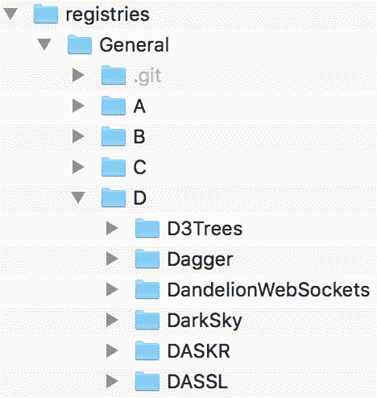

这张截图显示了`General`注册表的一部分，以及它的一些文件夹(从`A`到`D`)和一些以字母`D`开头的包。

为了使包检索更有效，一个特殊的索引文件叫做`Registry.toml`，也放在`General`文件夹中。这个文件定义了一个基于散列的索引，将包 UUIDs 映射到一个由`name`和`path`值组成的字典中——路径是相对的，指向`General`注册表中的一个文件夹。例如，这是对应于字母`D`下第一个`D3Trees`包的条目:

```
e3df1716-f71e-5df9-9e2d-98e193103c45 = { name = "D3Trees", path = "D/D3Trees" } 
```

接下来，如果我们查看`D3Trees/`文件夹本身，我们会看到它包含四个文件，每个文件都包含重要的元数据:

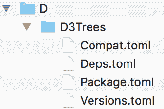

截图显示了属于`D3Trees`包的四个`Pkg`元数据文件。

`Deps.toml`文件包括依赖项列表(那些`D3Trees`本身需要的包)。`Compat.toml`文件存储了依赖项和 Julia 版本的兼容性要求。`Package.toml`定义了名称、UUID 和回购 URL 等信息，最后，`Versions.toml`显示了`D3Trees`的所有已知版本及其对应的 Git 引用。看起来我们需要`Package.toml`文件中的信息。

工作流程如下:

1.  获取 Julia 的`General`注册表的路径
2.  读取`Registry.toml`文件
3.  查找具有我们正在搜索的名称的包
4.  如果包存在，在`General`注册表中获取它的路径
5.  读取相应的`Package.toml`文件
6.  提取包的 GitHub URL


# 使用 TOML 文件

**Tom 的显而易见的极简语言** ( **TOML** )是由 Tom Preston-Werner 创建的极简配置文件格式。TOML 文件的用途与其他配置格式相同，例如著名的 INI——尽管 TOML 的目标是更易于阅读和解析。YAML 和 JSON 是您可能遇到过的其他非常流行的配置格式。`Pkg`广泛使用 TOML 来存储包元数据。

你可以在 https://github.com/toml-lang/toml[阅读更多关于 TOML 的内容，包括完整的规范。](https://github.com/toml-lang/toml)

在[https://github.com/wildart/TOML.jl](https://github.com/wildart/TOML.jl)有一个针对 Julia 的 TOML 解析器，但是我们不需要明确地添加它，因为`Pkg`捆绑了一个我们将使用的 TOML 解析器。但是，这意味着我们必须将`Pkg`声明为`IssueReporter`的依赖项:

```
(IssueReporter) pkg> add Pkg 
```

现在，要实现前面的工作流。首先，到`General`注册表的路径。

Julia 记录了存储重要信息的位置列表。这些信息包括配置文件、环境、已安装的软件包和注册表。在 Julia 的行话中，这些被称为**仓库**，并存储在`DEPOT_PATH`全局变量中:

```
julia> DEPOT_PATH 3-element Array{String,1}: "/Users/adrian/.julia" "/Applications/Julia-1.0.app/Contents/Resources/julia/local/share/julia" "/Applications/Julia-1.0.app/Contents/Resources/julia/share/julia" 
```

我电脑上的`DEPOT_PATH`数组的内容显示在这里。您的输出将会不同，但相似。

第一个条目是用户仓库，在这里克隆注册表、安装新的软件包版本、克隆软件包仓库、写入日志文件、默认签出开发软件包以及保存全局配置数据。软件仓库路径中的后续条目是只读的，用于系统管理员执行的操作。

让我们添加一个新的(失败的)测试来获取`General`注册表路径:

```
@testset "Interacting with the registry" begin 
  @testset "The General registry is accessible" begin 
    IssueReporter.generalregistrypath() |> Base.Filesystem.isdir 
  end 
end 
```

至于实现，我们将想要遍历`DEPOT_PATH`中的每个条目，并检查它是否包含目录的`registries/General`路径。这些应该在用户库中，但是更广泛的查找将使我们的代码更健壮:

```
function generalregistrypath() 
  for i in DEPOT_PATH 
    if isdir(joinpath(i, "registries", "General")) 
      return joinpath(i, "registries", "General") 
    end 
  end 
end 
```

一旦我们有了`General`注册表的路径，我们将需要解析`Registry.toml`文件并提取与我们要搜索的包相对应的信息。一旦被解析，`Registry.toml`文件在一个字典中产生五个条目:

```
Dict{String,Any} with 5 entries: 
  "name"        => "General" 
  "repo"        => "https://github.com/JuliaRegistries/General.git" 
  "packages"    => Dict{String,Any}("c786d6c3-4fbc-59fc-968c-e848efb65d2d"=>Dict{String,Any}("name"=>"ScHoLP","path"=>"S/ScHoLP"),"88634af6-177f-5301-88b8-7819386cfa38"=>Dict{String,Any}("name"=>"SaferIntegers","path"=>"S/SaferIntegers")... 
  "uuid"        => "23338594-aafe-5451-b93e-139f81909106" 
  "description" => "Official general Julia package registry where people  
# output omitted #  
```

我们只对*包*数据感兴趣，它看起来像这样:

```
Dict{String,Any} with 2358 entries: 
  "c786d6c3-4fbc-59fc-968c-e848efb65d2d" => Dict{String,Any}("name"=>"ScHoLP","path"=>"S/ScHoLP") 
  "88634af6-177f-5301-88b8-7819386cfa38" => Dict{String,Any}("name"=>"SaferIntegers","path"=>"S/SaferIntegers") 
  "aa65fe97-06da-5843-b5b1-d5d13cad87d2" => Dict{String,Any}("name"=>"SnoopCompile","path"=>"S/SnoopCompile") 
# output truncated # 
```

实际上，我们不想要所有这些，因为我们不关心 UUID；只有名字和路径。让我们给`IssueReporter`模块添加一个新函数，以反映这个规范:

```
function generalregistry() 
    TOML.parsefile(joinpath(generalregistrypath(), "Registry.toml"))["packages"] |> values |> collect 
end 
```

该函数的输出与此类似，一个由`Dict`元素组成的数组:

```
2358-element Array{Any,1}: 
 Dict{String,Any}("name"=>"ScHoLP","path"=>"S/ScHoLP") 
 Dict{String,Any}("name"=>"SaferIntegers","path"=>"S/SaferIntegers") 
 Dict{String,Any}("name"=>"SnoopCompile","path"=>"S/SnoopCompile") 
# output truncated # 
```

一旦我们有了这个，就很容易通过名称来执行包查找。我们简单地遍历每个条目，并将`"name"`值与搜索字符串进行比较:

```
function searchregistry(pkgname::String) 
  for item in generalregistry() 
    item["name"] == pkgname && return item 
  end 
end 
```

在我们通过名称识别包之后，我们可以使用 path 值来构建包含包的元数据信息的文件夹的路径。请记住，我们在寻找`Package.toml`文件，因为它包含回购 URI。

将所有这些放在一起，我们最终可以编写我们的`IssueReporter.packageuri`函数:

```
function packageuri(pkgname::String) 
  TOML.parsefile(joinpath(generalregistrypath(), searchregistry(pkgname)["path"], "Package.toml"))["repo"] 
end 
```

您的`IssueReporter.jl`文件应该是这样的:

```
module IssueReporter 

using Pkg, Pkg.TOML 

function generalregistrypath() 
  for i in DEPOT_PATH 
    if isdir(joinpath(i, "registries", "General")) 
      return joinpath(i, "registries", "General") 
    end 
  end 
end 

function generalregistry() 
    TOML.parsefile(joinpath(generalregistrypath(), "Registry.toml"))["packages"] |> values |> collect 
end 

function searchregistry(pkgname::String) 
  for item in generalregistry() 
    item["name"] == pkgname && return item 
  end 
end 

function packageuri(pkgname::String) 
  TOML.parsefile(joinpath(generalregistrypath(), searchregistry(pkgname)["path"], "Package.toml"))["repo"] 
end 

end # module 
```


# IssueReporter.jl 包

再次运行测试将会成功:

```
(IssueReporter) pkg> test 
```

输出如下所示:

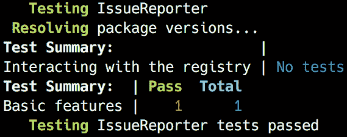

如果你很好奇，根据`IssueReporter`，GitHub 回购 URI 为`DataFrames`如下:

```
julia> IssueReporter.packageuri("DataFrames") 
https://github.com/JuliaData/DataFrames.jl.git
```

如果你愿意，你可以在网络浏览器中自己检查，以确认它确实是正确的 URI。


# 性能试验

到目前为止，我们的代码工作正常，但是它的性能如何呢？除了可读的语法、自由的许可、丰富的软件包生态系统和受欢迎的社区，性能是数据科学家和软件开发人员选择 Julia 的主要原因之一。编译器在提供开箱即用的出色性能方面做得很好，但是作为开发人员，我们必须牢记某些最佳实践，以确保我们基本上不会妨碍编译器。在运行一些基准测试时，我们将通过查看几个示例来回顾最重要的问题。


# 基准工具

鉴于其对性能的关注，core Julia 和生态系统都提供了各种工具来检查我们的代码，寻找瓶颈并测量运行时和内存使用情况，这应该不足为奇。其中最简单的就是`@time`宏。它接受一个表达式，然后打印它的执行时间、分配数和执行导致分配的总字节数，然后返回表达式的结果。例如，请注意以下内容:

```
julia> @time [x for x in 1:1_000_000]; 
  0.031727 seconds (55.85 k allocations: 10.387 MiB) 
```

通过从 1 到 100 万的迭代生成一个 100 万整数的数组需要 0.03 秒。不错，但是如果我告诉你我们可以做得更好——好得多，会怎么样？我们刚刚犯了 Julia 的一个大罪——代码不应该在全局范围内运行(也不应该进行基准测试)。所以，规则一——总是把你的代码包装成函数。

前面的代码片段很容易重构，如下所示:

```
julia> function onetomil() 
 [x for x in 1:1_000_000]
 end 
onetomil (generic function with 1 method) 
```

现在，基准测试如下:

```
julia> @time onetomil();
  0.027002 seconds (65.04 k allocations: 10.914 MiB) 
```

好吧，这显然更快了——但也快不了多少。但是，如果我们再运行一次基准呢？

```
julia> @time onetomil();
  0.002413 seconds (6 allocations: 7.630 MiB) 
```

哇，快了一个数量级！那么，怎么回事？

如果您还记得我们对函数和方法的介绍，Julia 使用了一个**实时** ( **JIT** )编译器；也就是说，函数在第一次被调用时是实时编译的。所以，我们最初的基准测试也包括了编译时间。这就引出了第二条规则——不要对第一次运行进行基准测试。

因此，准确测量一段代码性能的最佳方法是多次执行它，然后计算平均值。有一个很棒的工具，专门为这个用例设计的，叫做`BenchmarkTools`。我们来补充一下，试一试:

```
(IssueReporter) pkg> add BenchmarkTools 
julia> using BenchmarkTools 
julia> @benchmark onetomil() 
BenchmarkTools.Trial: 
  memory estimate:  7.63 MiB 
  allocs estimate:  2 
  -------------- 
  minimum time:     1.373 ms (0.00% GC) 
  median time:      1.972 ms (0.00% GC) 
  mean time:        2.788 ms (34.06% GC) 
  maximum time:     55.129 ms (96.23% GC) 
  -------------- 
  samples:          1788 
  evals/sample:     1 
```

`BenchmarkTools`采集`1788`样本，评估与样本比率为`1`。这里，一个样本代表一个度量，而一个评估是基准表达式的执行。我们得到的最大时间为 55 毫秒，由垃圾收集驱动，最小时间为 1.3 毫秒，平均时间为 2.7 毫秒。这与第二次`@time`执行显示的结果一致，为 2.4 毫秒——但是这个基准要精确得多。我们还可以使用更紧凑的`@btime`宏，它的输出类似于`@time`，但是执行同样全面的基准测试:

```
julia> @btime onetomil(); 
  1.363 ms (2 allocations: 7.63 MiB) 
```

`BenchmarkTools` exposes a very rich API and it's worth getting to know it well. You can read more about it at [https://github.com/JuliaCI/BenchmarkTools.jl/blob/master/doc/manual.md](https://github.com/JuliaCI/BenchmarkTools.jl/blob/master/doc/manual.md).

# 类型稳定性是关键

如果有一件事对 Julia 代码的性能有直接和巨大的影响，那就是类型系统。最重要的是编写类型稳定的代码。类型稳定性是指变量的类型(包括函数的返回值)不得随时间或在不同的输入下变化。理解如何利用类型稳定性是编写快速软件的关键。现在我们知道了如何测量代码的执行时间，我们可以通过几个例子来看看类型不稳定性的影响。

让我们以这个看似无辜的函数为例:

```
julia> function f1() 
           x = 0 

           for i in 1:10 
               x += sin(i) 
           end 

           x 
       end 
f1 (generic function with 1 method) 
```

没什么花哨的。我们有一个变量`x`，它被初始化为`0`——然后是一个从`1`到`10`的循环，在这里我们将一个数字的`sin`加到`x`。然后我们返回`x`。没什么好看的，对吧？事实上，恰恰相反——在性能方面，这里发生了一些不好的事情。它们都与类型不稳定性有关。

Julia 提供了一个很好的工具来检查和诊断代码的类型相关问题——`@code_warntype`宏。下面是我们将它与我们的`f1`函数一起使用时得到的结果:

```
julia> @code_warntype f1() 
```

输出如下所示:

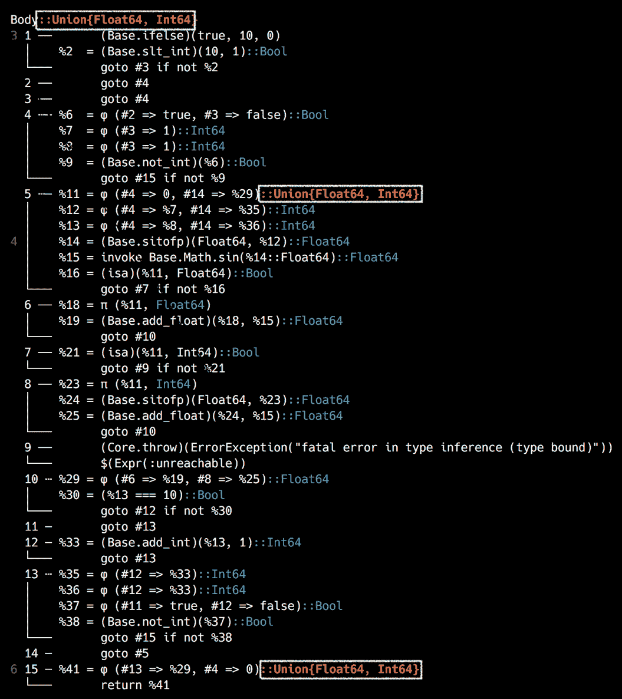

这一次，为了说明颜色编码，我使用了一个输出截图。正如你所料，绿色是好的，红色是坏的。我还用一个矩形标记了红旗。问题出在第一行的`Body::Union{Float64, Int64}`，第`12`行的`(#4 => 0, #14 => %29)::Union{Float64, Int64}`，倒数第二行的`(#13 => %29, #4 => 0)::Union{Float64, Int64}`。

在第一行`Body::Union{Float64, Int64}`，以及倒数第二行`::Union{Float64, Int64}`，告诉我们同样的事情——函数返回一个`Union{Float64, Int64}`，这意味着函数可以返回一个`Float`或者一个`Integer`。这是教科书式的不稳定，对性能来说是个坏消息。接下来，在第`12`行上，*某物*的类型为`Union{Float64, Int64}`，然后该值作为函数的结果返回。如果你想知道，那个*东西*就是`x`。

问题是我们意外地将`x`初始化为`0`，一个`Integer`。然而，`sin`函数将返回一个`Float`。在`Integer`上加一个`Float`会产生一个`Float`，导致`x`的类型也随之改变。因此，`x`在函数执行期间有两种类型，由于我们返回了`x`，所以我们的函数也是类型不稳定的。

诚然，理解`@code_warntype`的输出并不容易，尽管随着时间的推移会变得更容易。然而，我们可以通过使用超级有用的`Traceur`包来简化我们的工作。它提供了一个`@trace`宏，可以生成人性化的信息。我们来补充一下，试用一下；我肯定你会喜欢的:

```
(IssueReporter) pkg> add Traceur 
julia> using Traceur 
julia> @trace f1() 
┌ Warning: x is assigned as Int64 
└ @ REPL[94]:2 
┌ Warning: x is assigned as Float64 
└ @ REPL[94]:4 
┌ Warning: f1 returns Union{Float64, Int64} 
└ @ REPL[94]:2 
1.4111883712180104 
```

多酷啊。晶莹剔透！

记住这个反馈，我们可以将代码重构为一个新的`f2`函数:

```
julia> function f2() 
           x = 0.0 

           for i in 1:10 
                  x += sin(i) 
           end 

           x 
       end 
f2 (generic function with 1 method) 

julia> @trace f2() 
1.4111883712180104
```

厉害了，没啥好报的！没有消息就是好消息！

现在，我们可以对`f1`和`f2`进行基准测试，以查看我们重构的结果:

```
julia> @btime f1() 
  129.413 ns (0 allocations: 0 bytes) 
1.4111883712180104 

julia> @btime f2() 
  79.241 ns (0 allocations: 0 bytes) 
1.4111883712180104 
```

很好——79 对 129 纳秒！如果你认为*只是 50 纳秒，有什么大惊小怪的？*，你需要这么看——`f2`，类型稳定的变种，速度几乎是`f1`的两倍！这真的是一件大事！


# 对我们的代码进行基准测试

是时候将我们所学的应用到我们自己的代码库中了。注意，我故意偷偷加了几个问题，来增加一点趣味。让我们一起解决它们:

```
julia> @code_warntype IssueReporter.packageuri("DataFrames") 
```

输出如下所示:

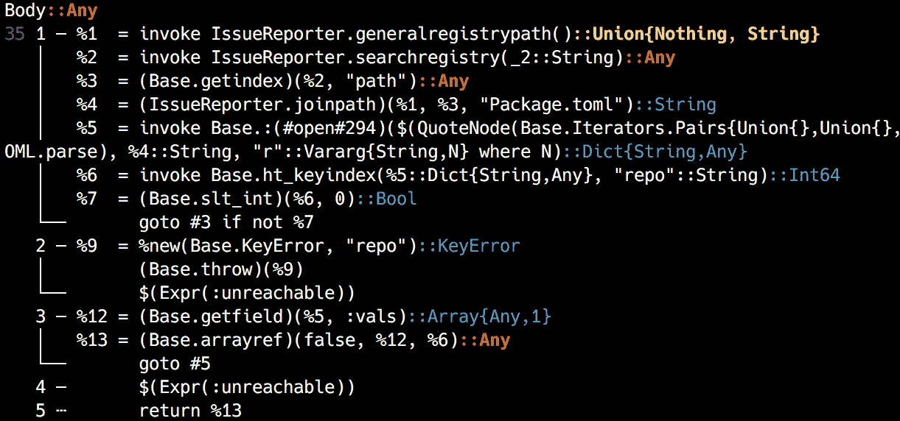

这非常有趣——让我们看看能从中学到什么。

从第`1`行开始，`IssueReporter.generalregistrypath`函数返回一个`Union{Nothing, String}`。原因是我们的函数不处理没有进入`for`循环，或者没有执行`if`语句的情况。我们应该确保我们的函数总是返回一个值，并且这个返回值的类型不会改变。为了确保万无一失，我们还可以向函数定义本身添加一个类型断言。如果我们不小心返回了错误的类型，Julia 会尝试将其转换为声明的类型——如果这不起作用，就会抛出一个错误。

我们需要如下重新定义该函数:

```
function generalregistrypath() :: String 
  for i in DEPOT_PATH 
    if isdir(joinpath(i, "registries", "General")) 
      return joinpath(i, "registries", "General") 
    end 
  end 

  "" 
end 
```

现在，在以`%2`(第三行)开始的行上，`searchregistry`函数返回一个类型为`Any`的值。这里的问题是我们返回了一个来自调用`generalregistry`的条目，所以我们需要首先查看它。我们将为`generalregistrypath`的返回值添加一个检查，并添加一个默认返回值，一个空的`Vector{Dict{String,Any}}`。然后，对于`searchregistry`，我们还将添加一个默认返回值——因为它从这个`Vector`返回一个项目，所以它的类型将是`Dict{String,Any}`。

接下来，关于`packageuri`函数，在以`%9`开始的行中(在第`11`行)，我们可以看到关于 a `KeyError`和`repo`的一些内容。Julia 警告我们，我们可能没有一个名为`repo`的键，从而导致一个`KeyError`。此外，该函数返回一个类型为`Any`的对象。

下面是重构后的三个函数:

```
function generalregistry() :: Vector{Dict{String,Any}} 
  if ! isempty(generalregistrypath()) 
    TOML.parsefile(joinpath(generalregistrypath(), "Registry.toml"))["packages"] |> values |> collect 
  else 
     Dict{String,Any}[] 
   end 
end 

function searchregistry(pkgname::String) :: Dict{String,Any} 
  for item in generalregistry() 
    item["name"] == pkgname && return item 
  end 

  Dict{String,Any}() 
end 

function packageuri(pkgname::String) :: String 
  pkg = searchregistry(pkgname) 
  isempty(pkg) && return "" 
  get!(TOML.parsefile(joinpath(generalregistrypath(), pkg["path"], "Package.toml")), "repo", "") 
end 
```

我们现在可以重新检查我们的代码:

```
julia> @code_warntype IssueReporter.packageuri("DataFrames") 
```

输出如下所示:

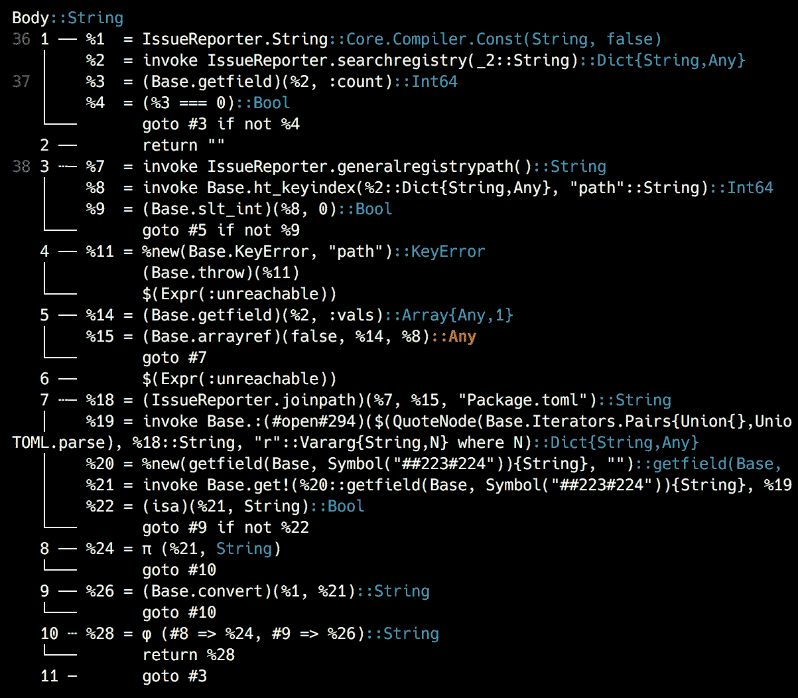

太棒了，几乎所有的东西都是绿色的！只有一个红色的`Any`，来自`TOML.parsefile`函数本身，但是不值得优化掉它；额外的工作会抵消收益。

花些时间浏览一下官方的性能推荐绝对是值得的，这些推荐可以在 https://docs.julialang.org/en/v1/manual/performance-tips/网站上找到。


# 与 GitHub API 交互

现在我们可以在`General`注册表中检索任何包的 GitHub URI，我们可以用它与 GitHub API 交互。Julia 开发者可以访问 GitHub 包提供的强大的 GitHub 库。这是我们用来在软件包的 GitHub repos 上创建新问题的工具。


# 使用 GitHub API 进行认证

为了被允许与 GitHub API 交互，我们必须进行身份验证。这将允许我们的包在用户帐户下在 GitHub 上执行操作，就像直接通过网站一样。请访问[https://github.com/settings/tokens/new](https://github.com/settings/tokens)来设置新的 GitHub 访问令牌。如果您不熟悉这个概念，并希望了解更多相关信息，请阅读并遵循[https://help . github . com/articles/creating-a-personal-access-token-for-the-command-line/](https://help.github.com/articles/creating-a-personal-access-token-for-the-command-line/)上的官方说明。给令牌一个好的描述，非常重要的是，确保您检查了回购范围，正如您在这个屏幕截图中看到的:

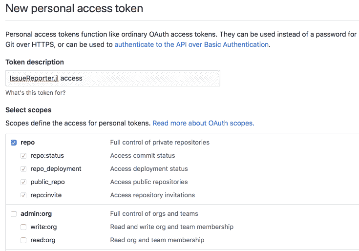

一旦生成，记下令牌——一旦您离开该页面，您将不会再看到它。

必须小心操作访问令牌——并且不能提交给 git 或其他源代码控制系统，因为其他用户可以在那里访问它们。任何获得您的访问令牌的人都可以用它在 GitHub 上冒充您。为了安全起见，请确保对于这个项目，您只检查回购范围。

让我们添加一点逻辑，使访问令牌可用于我们的包，而不损害安全性。它应该如下工作——首先，我们检查访问令牌是否作为一个命令行参数提供给 Julia 进程——这意味着它将在`ENV`集合中可用。如果不是，我们将在包的根文件夹中寻找一个名为`secrets.jl`的文件并包含它。该文件将包含访问令牌，因此我们将把它添加到`.gitignore`，以确保它不会意外地提交给 git。

所以，让我们来写测试。在`runtests.jl`的末尾添加以下内容:

```
@testset "GitHub integration" begin 
  delete!(ENV, "GITHUB_ACCESS_TOKEN") 

  @testset "An undefined token should return false" begin 
    @test ! IssueReporter.tokenisdefined() 
  end 
  @testset "Attempting to access a token that is not set will error" begin 
    @test_throws ErrorException IssueReporter.token() 
  end 
  # setup a mock token 
  ENV["GITHUB_ACCESS_TOKEN"] = "1234" 
  @testset "Token is defined" begin 
    @test IssueReporter.tokenisdefined() 
  end 
 @testset "A valid token is a non empty string and has the set value" begin 
    token = IssueReporter.token() 
    @test isa(token, String) && ! isempty(token) 
    @test token == "1234" 
  end 
end 

```

当然，测试会失败，所以让我们让他们通过。

将这些功能定义添加到`IssueReporter.jl`:

```
function tokenisdefined() :: Bool 
    if ! haskey(ENV, "GITHUB_ACCESS_TOKEN") 
        secrets_path = joinpath(@__DIR__, "secrets.jl") 
        isfile(secrets_path) && include(secrets_path) 
        haskey(ENV, "GITHUB_ACCESS_TOKEN") || return false 
    end 

    true 
end 

function token() :: String 
    tokenisdefined() && return ENV["GITHUB_ACCESS_TOKEN"] 
    error("""ENV["GITHUB_ACCESS_TOKEN"] is not set -- please make sure it's passed as a command line argument or defined in the `secrets.jl` file.""") 
end 
```

在`tokenisdefined`函数中，我们检查是否已经定义了`GITHUB_ACCESS_TOKEN`环境变量——如果没有，我们检查`secrets.jl`文件，如果它存在，我们就包含它。一旦包含进来，`secrets.jl`文件应该定义变量，所以最后，我们再次检查`GITHUB_ACCESS_TOKEN`的存在。如果令牌仍未定义，函数返回`false`—否则返回`true`。我们还添加了一个调用`tokenisdefined`的令牌函数，让模块有机会设置`GITHUB_ACCESS_TOKEN`。如果令牌可用，它将返回它—如果不可用，这次将抛出一个错误。我们的测试现在应该通过了:

```
pkg> test 
```

就是这个，如下图所示:

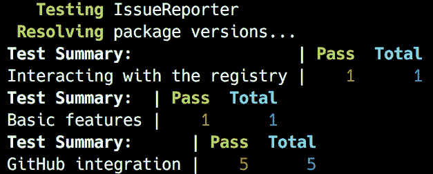

成功！

在继续之前，我们需要将`secrets.jl`文件添加到`.gitignore`——将它提交给一个公共的 GitHub repo 将是一个巨大的安全错误。从朱丽亚·REPL 那里，注意到了以下几点:

```
julia> write(".gitignore", "secrets.jl") 
```

现在，您需要创建`secrets.jl`文件本身，并确保它包含类似于下一个代码片段的内容，但是添加您自己的 GitHub 访问令牌:

```
ENV["GITHUB_ACCESS_TOKEN"] = "0cdf8672e66***" # token truncated 
```

太好了，我们准备好报告问题了！


# 报告 GitHub 问题

我们现在进入最后一步——使用 GitHub API 报告问题。为了注册一个问题，我们需要两条信息——标题和正文。因此，我们必须定义一个名为`report`的新函数，它将接受*三个*字符串参数——包的名称，再加上两个标题和问题的主体。在内部，该函数将通过 GitHub 包对相应的 GitHub API 进行认证调用。

根据文档，对`GitHub.create_issue`方法的调用如下所示:

```
GitHub.create_issue("<username>/<repo>", auth = <GitHub.OAuth2>, params...) 
```

这意味着我们需要做以下工作:

1.  使用 GitHub 令牌进行认证并生成所需的`GitHub.OAuth2`认证对象
2.  从 Julia 包名开始，计算 GitHub 用户名和 repo 信息——为此，我们将使用已经实现的`IssueReporter.packageurl`，加上一些额外的处理，从 URL 中删除不需要的部分
3.  调用`GitHub.create_issue`，传入所有需要的参数

既然我们正在进行 TDD，让我们从将这些规格转换成测试开始。在`runtests.jl`文件的最底部添加以下内容:

```
@testset "Adding GitHub issues" begin 
  delete!(ENV, "GITHUB_ACCESS_TOKEN") 

  @testset "Successful authentication should return a GitHub.OAuth2 instance" begin 
    @test isa(IssueReporter.githubauth(), GitHub.OAuth2) 
  end 
  @testset "Converting package name to GitHub id" begin 
    @test IssueReporter.repoid("IssueReporter") == "essenciary/IssueReporter.jl" 
  end 
  @testset "Submitting an issue should result in a GitHub.Issue object" begin 
    @test isa(IssueReporter.report("IssueReporter", "I found a bug", "Here is how you can reproduce the problem: ..."), GitHub.Issue) 
  end 
end 
```

这些测试以完全相同的顺序反映了我们之前用简单英语表达的需求。第一个调用一个我们必须编写的函数，名为`IssueReporter.githubauth`，它将执行 GitHub 认证，如果成功将返回一个`GitHub.OAuth2`对象。接下来，我们需要一个新的`repoid`函数，它将接受包的名称，并返回 GitHub 用户名和 repo 名称。请注意，我们使用我对`IssueReporter`包的回购作为我们测试的试验品。最后，我们测试问题的创建，这将通过`IssueReporter.report`方法完成——如果成功，我们将得到一个`GitHub.Issue`对象。

不要利用朱莉娅做任何邪恶的事！我们正在编写的代码实际上会在实时 GitHub repos 上注册新问题。请尊重开源贡献者的辛勤工作，不要给他们过多的虚假问题。

是时候通过编写实现来通过测试了。确保`IssueReporter`模块的`using`指令如下所示:

```
using Pkg, Pkg.TOML, GitHub, URIParser  # we've added URIParser and GitHub 
```

然后，在`IssueReporter`模块的底部添加以下功能:

```
function githubauth() 
  token() |> GitHub.authenticate 
end 

function repoid(package_name::String) 
  pkg_url = packageuri(package_name) |> URIParser.parse_url 
  repo_info = endswith(pkg_url.path, ".git") ? 
                replace(pkg_url.path, r".git$"=>"") : 
                pkg_url.path 
  repo_info[2:end] 
end 

function report(package_name::String, title::String, body::String) 
  GitHub.create_issue(repoid(package_name), auth = githubauth(), 
                        params = Dict(:title => title, :body => body)) 
end 
```

很简单。`githubauth`函数调用`GitHub.authenticate`方法，通过调用 token 函数向其传递 auth token。

`repoid`方法接受一个字符串参数作为回购协议的名称，然后调用`packageuri`和`URIParse.parse_url`来生成一个对应于 GitHub 回购协议的 URI 对象。然后，我们提取 URI 的路径组件，并对其进行处理，只保留 GitHub 用户名和 repo 名称。换句话说，从名为`IssueReporter`的包开始，我们检索 GitHub repo URL，即`git://github.com/essenciary/IssueReporter.jl.git`。路径组件是`/essenciary/IssueReporter.jl.git`。在返回从第二个字母开始的子字符串之前，我们使用 replace with`r".git$"`regex 来删除`.git`结尾。最后，我们得到了我们需要的东西— `essenciary/IssueReporter.jl`。

最后，report 函数通过调用`GitHub.create_issue`方法并向其传递`repoid`、身份验证对象和标题以及`Dict`中的问题主体，将所有这些放在一起。现在所有的测试都应该通过了，问题已经成功地在 Github.com([https://github.com/](https://github.com/))上创建了:

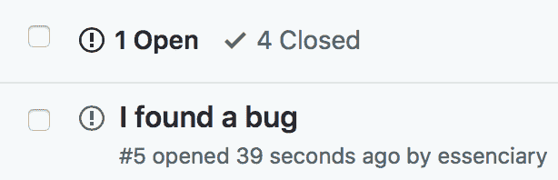

请注意，本章提供的示例代码将`create issue`功能注释掉了——相反，它硬编码了一个虚拟存储库。再次，出于对真实回购的贡献者和追随者的尊重，实际问题将在我为此专门创建的虚拟存储库上创建。


# 记录我们的包裹

我们的包现在完成了！让我们的用户更容易利用`IssueReporter`提供的惊人便利——我们将为他们提供信息丰富的文档。我们已经知道如何通过使用`DocStrings`来记录我们的代码——这可以被我们自己和其他开发者用来理解我们的源代码。它也被 REPL 的帮助系统所使用(记得从[第一章](90a7f09d-d63b-45d7-baf5-576470d0910f.xhtml)、【Julia 编程入门中你可以在行首键入`?`来切换 REPL 到帮助模式)。你会很高兴地听到，在一个叫做`Documenter`的包的帮助下，我们也可以使用同样的`DocStrings`生成包文档。请加上`(IssueReporter) pkg> add Documenter`。

所以，首先要做的是给我们的函数添加一些`DocStrings`。请记住，*官方*的建议是包括函数的签名以及一个小描述和几个例子。例如，`IssueReporter.packageuri`函数的文档可能是这样的:

```
""" packageuri(pkgname::String) :: String 
Takes the name of a registered Julia package and returns the associated repo git URL. 
Examples ``` jldoctest julia> IssueReporter.packageuri("IssueReporter") "git://github.com/essenciary/IssueReporter.jl.git" ``` """ function packageuri(pkgname::String) :: String # output truncated # end 
```


# 高级文档提示

```
packageuri function in the DocString. The problem here is that the documentation can get out of sync if we change the function declaration, but omit to update the documentation. Julia's package ecosystem provides a library that extends the default documentation functionality, named DocStringExtensions. It's a registered package, so it can be added with (IssueReporter) pkg> add DocStringExtensions. It provides a series of methods that can be used to automatically generate some of the repetitive parts of the documentation process. For example, once we add using DocStringExtensions to the IssueReporter module, we can replace the function declaration from the docstring with the $(SIGNATURES) *abbreviation*. We'll see how to do that right away.
```

`DocStrings`的另一个有价值的特点是例子也可以作为测试。这种测试被称为**文档测试**。基本上，当我们提供一个 REPL 示例以及相应的输出时，如果我们将它标记为 *jldoctest* ，用于生成文档的`Documenter`包也将运行这些示例，并将结果与提供的输出进行比较，从而测试这些示例，并隐含地测试我们的代码。查看下一个代码片段，看看在我们应用这些优化后，前面的例子是什么样子的。

我给所有代表`IssueReporter`的*公共* API 的函数都添加了注释。以下是更新后的函数定义(你可以在[https://github . com/packt publishing/Julia-Programming-Projects/blob/master/chapter 11/issuer report/src/issuer report . JL](https://github.com/PacktPublishing/Julia-Programming-Projects/blob/master/Chapter11/IssueReporter/src/IssueReporter.jl)获得本章报告的完整文件):

```
module IssueReporter 

using Pkg, Pkg.TOML, GitHub, URIParser, Documenter, DocStringExtensions 

# ... some functions omitted ... #

""" 
$(SIGNATURES) 

Takes the name of a registered Julia package and returns the associated repo git URL. 

#Examples 
```julia-repl 
julia> IssueReporter.packageuri("IssueReporter") 
"git://github.com/essenciary/IssueReporter.jl.git" 
``` 
""" 
function packageuri(pkgname::String) :: String 
    # ... function body omitted ... # 
end 

""" 
$(SIGNATURES) 

Checks if the required GitHub authentication token is defined. 
""" 
function tokenisdefined() :: Bool 
  # ... function body omitted ... # 
end 

# ... some functions omitted ... #

""" 
$(SIGNATURES) 

Converts a registered Julia package name to the corresponding GitHub "username/repo_name" string. 

#Examples 
```jldoctest 
julia> IssueReporter.repo_id("IssueReporter") 
"essenciary/IssueReporter.jl" 
``` 
""" 
function repoid(package_name::String) 
    # ... function body omitted ... # 
end 

# ... some functions omitted ... #

end # module  
```


# 生成文档

为了创建我们的文档，我们需要首先在我们的`IssueReporter`根目录中创建一个`docs/`文件夹。

在`docs/`文件夹中，我们还需要两样东西——首先，一个`src/`文件夹，它将包含用于构建文档的 markdown 模板，即`index.md`文件；第二，一个`make.jl`文件，它将控制文档构建过程。以下是我们软件包的完整文件结构，供参考:

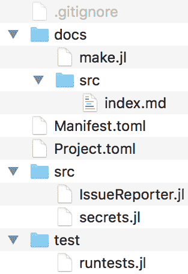

现在，在编辑器中打开`docs/make.jl`文件并添加以下内容:

```
using Pkg 
pkg"activate .." 
push!(LOAD_PATH,"../src/") 
using Documenter, IssueReporter 

makedocs(sitename = "IssueReporter Documentation") 
```

接下来，在编辑器中打开`index.md`文件，并添加以下内容:

```
# IssueReporter.jl Documentation 
```@meta 
CurrentModule = IssueReporter 
``` 
```@contents 
``` 
## Functions 
```@docs 
packageuri(pkgname::String) 
tokenisdefined() 
token() 
githubauth() 
repoid(package_name::String) 
report(package_name::String, title::String, body::String) 
``` 
## Index 
```@index 
``` 
```

这是我们文档的降价模板。在顶部，我们有页面的标题。然后，`@meta`块包含`Documenter`的信息，传入模块的名称。`@contents`块将被替换为目录。`@docs`模块将包含所包含的每个功能的文档。在底部，`@index`块将被一个链接列表所取代，该列表指向每个已记录的函数。

仅此而已。为了生成文档，我们需要从操作系统终端的`docs/`文件夹中运行`$ julia --color make.jl`。

该命令的输出将显示构建文档的进度:

```
Documenter: setting up build directory. 
Documenter: expanding markdown templates. 
Documenter: building cross-references. 
Documenter: running document checks. 
 > checking for missing docstrings. 
 > running doctests. 
 > checking footnote links. 
Documenter: populating indices. 
Documenter: rendering document. 
```

生成的文档可以在`docs/build/index.html`找到，如下所示:

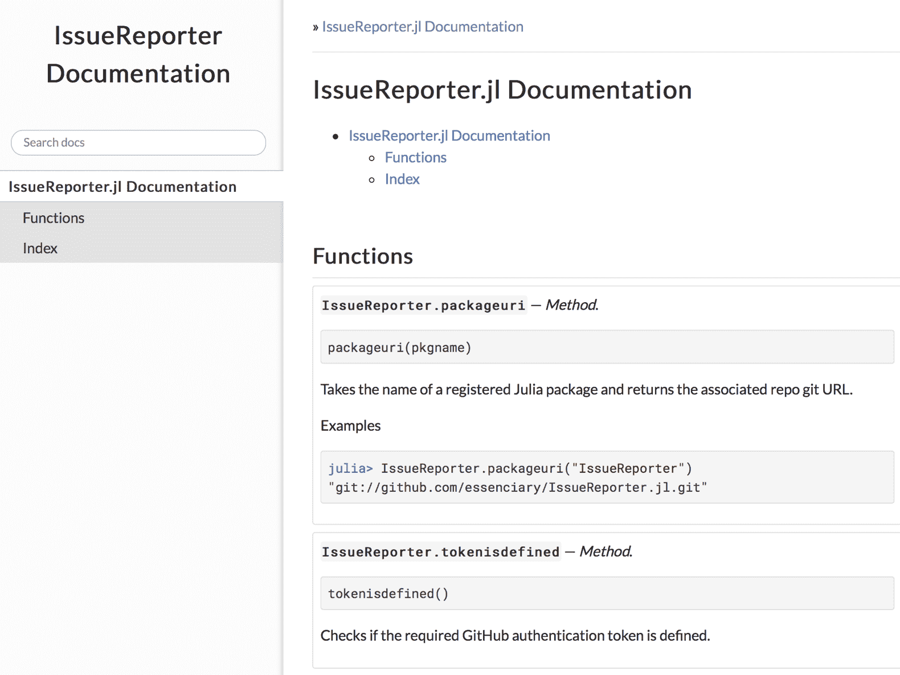


# 注册我们的包裹

现在，到了最后一步——让我们的产品包面向全世界！首先，我们需要创建远程 GitHub 存储库，并将我们的代码推送到那里。最简单的方法是使用 GitHub 提供的`hub`二进制文件。请遵循您平台的安装说明，如[https://github.com/github/hub](https://github.com/github/hub)所述。一旦准备好，我们需要在`IssueReporter`文件夹的根目录下运行`hub create`。我们可以在朱丽娅的《REPL》中这样做:

```
julia> cd(Pkg.dir("IssueReporter")) 
julia> run(`hub create IssueReporter.jl`) 
```

系统会提示您输入 GitHub 用户名和密码——如果一切顺利，您会看到确认 repo 已创建的输出。


# 收尾

接下来，我们需要提交并推送我们的更改——但在此之前，让我们对`.gitignore`进行最后一次更改，以便将`docs/build`添加到忽略文件列表中。将构建的文档包含到 GitHub 提交中是一种不好的做法——有关在 GitHub 上托管文档的更多信息，请阅读位于[https://Julia docs . GitHub . io/documenter . JL/latest/man/guide/# Usage-1](https://juliadocs.github.io/Documenter.jl/latest/man/guide/#Usage-1)和[https://Julia docs . GitHub . io/documenter . JL/latest/man/Hosting/# Hosting-Documentation-1](https://juliadocs.github.io/Documenter.jl/latest/man/hosting/#Hosting-Documentation-1)的官方`Documenter`信息。

当我们这样做的时候，让我们也添加一个`README.md`文件到`IssueReporter`的根文件夹中，以包含一些信息:

```
# IssueReporter.jl  
`IssueReporter.jl` is a Julia package which makes it easy to report a new issue with a registered package. 
In order to use it, it needs to be configured with a valid GitHub authentication token. Follow the instructions at 
https://help.github.com/articles/creating-a-personal-access-token-for-the-command-line/ to generate a new token -- make sure 
that it has the `repo` access. 
Once you have the token, add it to the secrets.jl file. 
You can now open issues by invoking: 
`IssueReporter.report("Julia package name", "issue title", "issue body")` 
```


# 设置存储库

使用您最喜欢的 git 客户端，`add`、`commit`和`push`代码库。我将使用终端:

```
$ git add . $ git commit -m "initial commit" $ git push origin master 
```


# 释放朱莉娅的机器人大军

我们的包看起来很棒——现在是时候标记一个发布并注册它了。

Julia 贡献者开发了一系列非常有用的 GitHub 集成，即 *bots* 。这些机器人帮助我们人类自动化一系列无聊的任务，以便我们可以专注于真正重要的事情(嗯，披萨！).

其中一个是 Attobot，这是一个为 Julia 设计的包发布机器人。当发布在 GitHub 中被标记时，它创建对 Julia 的`General`注册表的 pull 请求。尝试以下方法:

1.  要设置 Attobot，请打开您的`IssueReporter` GitHub repo，然后前往[https://github.com/integration/attobot](https://github.com/integration/attobot)。请确保您已登录 GitHub 帐户。
2.  然后，单击“配置”选择要添加的存储库。
3.  选择仅选择存储库，然后选择`IssueReporter`并点击保存。现在，Attobot 被配置为监控带有标准`.jl`扩展的包——并在标记新发布时将它们发布到`Global`注册表上。

有关 Attobot 的更多详情，请访问[https://github.com/attobot/attobot](https://github.com/attobot/attobot)。

4.  现在，我们需要转到我们的 repo 的 GitHub 页面，并点击 releases 链接:

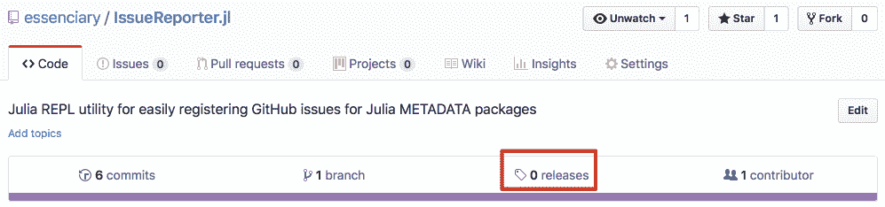

5.  接下来，我们可以选择创建一个新版本:

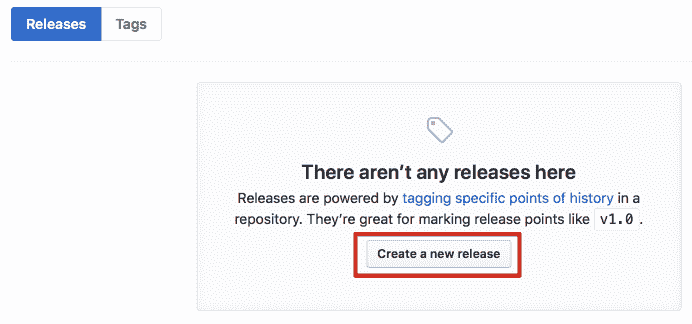

6.  在下一个屏幕上，我们将能够标记我们的版本。Julia 使用语义版本化(看起来像 vX。Y.Z)并建议从`v0.0.1`开始。让我们就这么做吧:

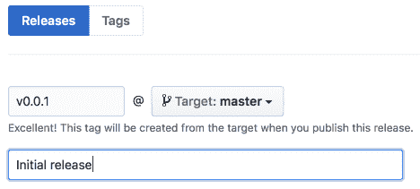

7.  然后，单击发布发布。

如果有任何问题，Attobot 将在回购中公开问题，确保您解决了这些问题。一旦完成，包将被注册！胜利！


# 摘要

看到我们的包裹终于准备好了，真是令人兴奋！

在开发它的过程中，我们还学习了 Julia 强大的工具箱，以及一些最重要的软件开发最佳实践——TDD、单元测试、基准测试、记录我们的代码库并发布结果文档。

我们学习朱莉娅语言的旅程也到此结束。自从 REPL 首次开放以来，我们已经走过了漫长的道路，你们已经取得了一些令人印象深刻的成就！数据分析，绘图，网页抓取，推荐器，监督和非监督机器学习，以及时间序列分析和预测！你现在可以使用 Julia 做所有这些事情。哇！那确实是一个相当惊人的记录！而且，如果做这些看起来很容易，这都要归功于朱莉娅令人难以置信的特点。高效的 REPL、简单的包安装、方便的绘图包或可读的语法；它们都让编程变得简单有趣。

Julia 确实是一种新型的编程语言。由于它是新的，它能够通过借鉴最成功的编程语言的长处来学习它们，并避免它们的错误。Julia 是专门为有效解决我们这一代人的需求而设计的——机器学习、人工智能、高性能、并行、GPU 和分布式云计算——这些都是该语言擅长的领域。

但是，Julia 不仅为编写高性能代码提供了有效的语言结构，还带来了富有成效的开发体验。强大的 REPL(所有现有编程语言中最好的复制器之一，句号！)和 JIT 编译使快速构建解决方案原型、分割大量数据或动态试验数据模型变得容易。集成的帮助模式和强大的 shell 模式增强了开发人员的能力，提高了工作效率。

然后是通过 IJulia 与 Jupyter 笔记本的无缝集成，以及与 Python 和 r 等成熟编程语言的令人难以置信的跨语言集成。如果您使用过这些技术，切换到 Julia 应该很简单。

但是 Julia 是新的，刚刚达到版本 1，并不意味着 Julia 不是一种成熟的语言。它经过了六年多的精心制作，得到了成千上万开发人员的贡献。所以，我鼓励你开始用 Julia 来解决实际问题。你将加入成千上万专业使用这种语言的开发人员，用于科学计算、数据科学、人工智能、金融科技、web 开发、教学等等。苹果、亚马逊、脸书和甲骨文等家喻户晓的公司都希望在 2017 年雇佣 Julia 程序员。

我希望你喜欢读这本书，就像我喜欢写它一样。你现在准备——我希望是渴望——在你的项目中使用 Julia。所以，与其说*再见*，我想说——*欢迎来到 Julia 编程的精彩世界！*