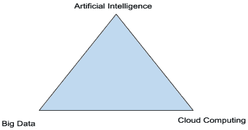

# 零、前言

自从 1946 年第一台名为 ENIAC 的可编程数字计算机问世以来，计算机得到了广泛的应用，已经成为我们生活中不可或缺的一部分。无法想象没有电脑的世界。

进入 21 世纪，所谓的 *ABC 三角形*在计算机世界中脱颖而出，它的三个顶点代表了当今最先进的计算机技术——A 代表人工智能，B 代表大数据，C 代表云计算，如下图所示。这些技术每天都在重塑我们的世界，改变我们的生活。



从历史的角度来看这些先进的计算机技术，了解它们是什么以及它们是如何相互发展的，这是非常有趣的。

*   **人工智能** ( **AI** )是一种让机器(计算机)模拟人类行为的技术。**机器学习** ( **ML** )是人工智能的一个子集，它让机器自动从过去的数据中学习，并根据数据进行预测。1956 年左右，在 ENIAC 发明后不久，AI 被引入世界，但近年来，因为大数据的积累和云计算的发展，AI 获得了动力。
*   **大数据**是指在过去的几年中产生和存储的稳定的指数级增长的数据。2018 年，全球范围内创建和消耗的数据总量约为 33 zetta bytes(1 ZB = 80 亿比特)。这个数字在 2020 年增长到 59 个 ZB，预计到 2025 年将达到令人难以置信的 175 个 ZB。为了处理这些大数据集，需要巨大的计算能力。在商用电脑上处理这些庞大的数据集是不可想象的，更不用说一个公司部署传统数据中心放置这些电脑所需要的时间了。大数据处理需要新的方法来提供计算能力。
*   云计算于 2006 年来到我们的世界，比人工智能的想法晚了大约半个世纪。云计算提供具有弹性、自我供应和按需服务的计算能力。在传统计算模型中，基础架构被视为硬件。硬件解决方案是物理性的，它们需要空间、人员、规划、物理安全性和资本支出，因此硬件采购周期很长，包括采购、供应和维护。云计算模式将基础架构作为软件，选择最符合您业务需求的云计算服务，按需供应和终止这些资源，根据需求以自动化方式灵活地扩展和缩减资源，将基础架构/资源部署为通过版本控制管理的不可变代码，并为您使用的资源付费。有了云计算模型，计算资源被视为临时的和可任意使用的:它们可以被更快、更容易、更经济地使用。云计算模式使人工智能计算变得可行。

AI、大数据和云计算相互配合，蓬勃发展——更多的数据导致更多的 AI/ML 应用，更多的应用需要更多的云计算能力，更多的应用将产生更多的数据。

谷歌以其创新导向的思维模式和引领行业潮流的产品而闻名，是 ABC 三角技术的领导者。作为 ML 的先驱，谷歌在 2017 年开发了 AlphaGo，这是第一个击败职业人类围棋世界冠军的计算机程序。AlphaGo 在数以千计的人类业余和职业比赛中接受训练，以学习如何玩围棋。AlphaZero 跳过这一步，学习与自己对弈——它很快超越了人类的对弈水平，以 100 局比 0 战胜了 AlphaGo。除了传说中的 AlphaGo 和 AlphaZero，Google 还在许多领域开发了许多 ML 模型和应用程序，包括视觉、语音和语言处理。在云计算领域，谷歌是世界上最大的云计算服务提供商之一。**谷歌云平台** ( **GCP** )提供地球上最好的云服务，尤其是在大数据和 ML 领域。许多公司热衷于使用谷歌云，并在他们的业务用例中利用 GCP ML 服务。这就是我们这本书的目的。我们的目标是了解和掌握谷歌云中的精英中的精英(T21)。

# 这本书是给谁的

这本书不仅适合那些想要更好地理解云中 ML 概念的人，也适合那些已经有了不错的理解并且想要深入学习成为一名专业的 Google 认证的云 ML 工程师的人。

# 这本书涵盖了什么

[*第 1 章*](B18333_01.xhtml#_idTextAnchor015) 、*理解谷歌云服务*，提供了 GCP 服务的概述，实践示例详见 [*附录 1*](B18333_11.xhtml#_idTextAnchor184) 。

[*第二章*](B18333_02.xhtml#_idTextAnchor054) ，*学习 Python 编程*，钻研 Python 基础知识和编程技巧。探索 Python 数据科学库，实践示例详见 [*附录 2*](B18333_12.xhtml#_idTextAnchor195) 。

[*第 3 章*](B18333_03.xhtml#_idTextAnchor072) ，*为 ML 开发做准备*，涵盖了 ML 流程的准备工作，包括 ML 问题定义和数据准备。

[*第四章*](B18333_04.xhtml#_idTextAnchor094) ，*开发和部署 ML 模型*，深入 ML 流程，包括平台准备、数据集拆分、模型训练、验证、测试和部署，实践示例详见 [*附录 3*](B18333_13.xhtml#_idTextAnchor209) 。

[*第五章*](B18333_05.xhtml#_idTextAnchor116) ，*了解神经网络和深度学习*，用神经网络建模介绍深度学习的现代 AI 方法。

[*第六章*](B18333_06.xhtml#_idTextAnchor133) ，*学习 BQML，TensorFlow，和 Keras* ，发现 Google 针对结构化数据的 BigQuery 机器学习，以及 Google 的 TensorFlow 和 Keras 的 ML 框架。

[*第七章*](B18333_07.xhtml#_idTextAnchor143) ，*探索 Google 云顶点 AI* ，考察 Google 端到端的顶点 AI ML 套件及其 ML 服务，实践示例详见 [*附录 4*](B18333_14.xhtml#_idTextAnchor218) 。

[*第 8 章*](B18333_08.xhtml#_idTextAnchor159) ，*发现 Google Cloud ML API* ，通过 [*附录 5*](B18333_15.xhtml#_idTextAnchor233) 中详细介绍的实践示例，探讨如何利用 Google 预先训练好的 ML 开发模型 API。

[*第九章*](B18333_09.xhtml#_idTextAnchor168) ，*使用 Google Cloud ML 最佳实践*，总结了 Google Cloud 中 ML 开发的最佳实践。

[*第 10 章*](B18333_10.xhtml#_idTextAnchor179) ，*考取 GCP ML 认证*，综合前几章学到的知识和技能，研究 GCP ML 认证考试题型。

[*附录 1*](B18333_11.xhtml#_idTextAnchor184) ，*基本 GCP 服务实践*，提供了提供基本 GCP 服务的示例。

[*附录 2*](B18333_12.xhtml#_idTextAnchor195) ，*用 Python 数据库练习*，提供 Python 数据库练习的例子，包括 NumPy、Pandas、Matpotlib、Seaborn。

[*附录 3*](B18333_13.xhtml#_idTextAnchor209) ，*使用 ScikitLearn* 练习，提供了 scikit-learn 库练习的示例。

[*附录 4*](B18333_14.xhtml#_idTextAnchor218) 、*用 Google Vertex AI 练习*，提供练习 Google Cloud Vertex AI 服务的例子。

[*附录 5*](B18333_15.xhtml#_idTextAnchor233) 、*用 Google Cloud ML API* 练习，提供了 Google Cloud ML API 练习的例子。

# 充分利用这本书

在 Google Cloud 中学习机器学习的最佳实践分为两部分:学习章节以掌握基本概念，通过做章节中的所有实验示例来学习，尤其是附录中的实验。

虽然一些基本的计算机技术知识有望开始，但成为云开发人员或云工程师并不是必须的。你可以从头到尾读完这本书，或者你可以跳到看起来与你最相关的章节。

**如果你使用的是这本书的数字版，我们建议你自己输入代码或者从这本书的 GitHub 库获取代码(下一节有链接)。这样做将帮助您避免任何与复制和粘贴代码相关的潜在错误。**

# 下载示例代码文件

你可以从 GitHub 的[https://GitHub . com/packt publishing/Journey-to-a-Google-Cloud-Professional-Machine-Learning-Engineer](https://github.com/PacktPublishing/Journey-to-a-Google-Cloud-Professional-Machine-Learning-Engineer)下载本书的示例代码文件。如果代码有更新，它会在 GitHub 库中更新。

我们在 https://github.com/PacktPublishing/的[也有丰富的书籍和视频目录中的其他代码包。看看他们！](https://github.com/PacktPublishing/)

# 下载彩色图像

我们还提供了一个 PDF 文件，其中有本书中使用的截图和图表的彩色图像。你可以在这里下载:[https://packt.link/ugTOg](https://packt.link/ugTOg)。

# 习惯用法

本书通篇使用了许多文本约定。

`Code in text`:表示文本中的码字、数据库表名、文件夹名、文件名、文件扩展名、路径名、伪 URL、用户输入和 Twitter 句柄。下面是一个例子:“将下载的`WebStorm-10*.dmg`磁盘镜像文件挂载为系统中的另一个磁盘。”

代码块设置如下:

```
html, body, #map {

 height: 100%; 

 margin: 0;

 padding: 0

}
```

当我们希望将您的注意力吸引到代码块的特定部分时，相关的行或项目以粗体显示:

```
[default]

exten => s,1,Dial(Zap/1|30)

exten => s,2,Voicemail(u100)

exten => s,102,Voicemail(b100)

exten => i,1,Voicemail(s0)
```

任何命令行输入或输出都按如下方式编写:

```
$ mkdir css
$ cd css
```

**粗体**:表示新术语、重要单词或您在屏幕上看到的单词。例如，菜单或对话框中的单词以**粗体**显示。下面是一个例子:“从**管理**面板中选择**系统信息**”

提示或重要注意事项

像这样出现。

# 取得联系

我们随时欢迎读者的反馈。

**总体反馈**:如果您对本书的任何方面有疑问，请发邮件至 customercare@packtpub.com[并在邮件主题中提及书名。](mailto:customercare@packtpub.com)

**勘误表**:虽然我们已经尽力确保内容的准确性，但错误还是会发生。如果你在这本书里发现了一个错误，请告诉我们，我们将不胜感激。请参观 www.packtpub.com/support/errata 并填写表格。

盗版:如果您在互联网上发现我们作品的任何形式的非法拷贝，如果您能提供我们的地址或网站名称，我们将不胜感激。请通过[copyright@packt.com](mailto:copyright@packt.com)联系我们，并提供材料链接。

**如果你有兴趣成为一名作家**:如果有一个你擅长的主题，并且你有兴趣写书或投稿，请访问[authors.packtpub.com。](http://authors.packtpub.com.)

# 分享你的想法

一旦你阅读了成为谷歌云机器学习工程师的旅程，我们很想听听你的想法！请[点击此处，直接进入该书的亚马逊评论页面](https://packt.link/r/1-803-23372-9)，并分享您的反馈。

您的评论对我们和技术社区非常重要，将有助于我们确保提供高质量的内容。