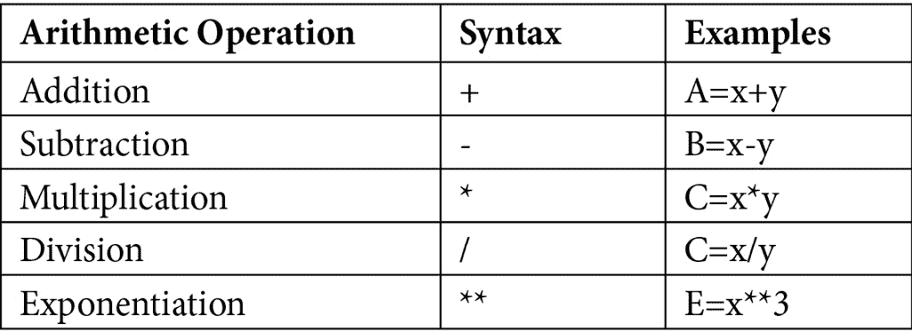

<title>Chapter 2: Mastering Python Programming</title>

# 2

# 掌握 Python 编程

在我们训练机器学习之前，我们需要教它一门语言。计算机非常擅长二进制编码，因为它们被创造出来是用来进行 0 和 1 的运算的。人类发明了一种语言编译器，将高级语言(如 Python)程序编译成二进制代码，以便计算机运行。Python 是一种直观的高级语言——它有非常类似于自然语言的简化语法。Python 广泛应用于利用计算机编程解决问题，尤其是在**机器学习** ( **ML** )中。

在这一章中，我们将从一个简单的数学问题开始，展示 Python 如何直接而简洁地解决它。理解解决方案将有助于我们理解 Python 基础，包括变量、数据结构、条件和控制。然后，我们将介绍 Python 的数据处理包，包括用于数据操作的 NumPy 和 Pandas 以及用于数据可视化的 Matplotlib 和 Seaborn。

Python 是一门编程语言，练习是掌握这门语言的重要部分。在本书的 [*附录 1*](B18333_11.xhtml#_idTextAnchor184) 中，我们提供了使用 Python 数据处理包的分步指南。练习这些步骤对于掌握 Python 技能至关重要。

在本章中，我们将讨论以下主题:

*   Python 的基础知识
*   Python 数据库和包

在我们开始之前，让我们看看本章的先决条件。

# 技术要求

要遵循本章中的说明，请确保您已经安装了 Google Colab，这是 Google Research 的一款产品，允许程序员通过浏览器([https://colab.research.google.com](https://colab.research.google.com))编写和执行 Python 代码。Colab 非常适合 ML 和数据分析，我们将在本章中使用它来运行基本的 Python 代码。我们开始吧！

# Python 的基础知识

我们将从一个简单的鸡蛋计数问题开始，讲述 Python 编程的基础知识。

一大筐鸡蛋不到 2000 个。假设我们每次把鸡蛋分成两个一组拿出来，这样最后篮子里会剩下一个鸡蛋。在这里，我们有以下内容:

*   如果使用 3 个一组，则剩下 0 个。
*   如果使用 4 个一组，则剩下 1 个。
*   如果使用 5 个一组，则剩下 4 个。
*   如果使用 6 个一组，则剩下 3 个。
*   如果使用 7 个一组，则剩下 0 个。
*   如果使用 8 个一组，则剩下 1 个。
*   如果使用 9 个一组，则剩下 0 个。

那么，桶里有多少鸡蛋？

让我们来看看使用 Python 编程解决这个问题的方法:

```
for i in range (1, 2001, 2):

      if ( ((i % 3) == 0) and ((i % 4) == 1) and ((i % 5) == 4) and ((i % 6) == 3) and ((i % 7) == 0) and ((i % 8) == 1) and  ((i % 9) == 0) ):

      print("Total number of eggs in the bucket can be %d" %i)
```

如你所见，我们告诉计算机尝试每个奇数(为什么？)在 1 到 2，000 之间，并针对问题中指定的所有条件进行测试。如果对于某个数字，所有的条件都满足，那么我们打印出这个数字。当所有的奇数都被检查完，符合条件的数字就被打印出来。太棒了！

在 Colab 上执行上述程序会产生以下输出:

```
Total number of eggs in the bucket can be 1449
```

如果我们更仔细地检查 Python 程序，我们可以观察到以下情况:我们使用`i`作为一个变量，它每次被分配一个奇数，在`1`和`2000`之间，我们使用一个`for`子句来构造一个循环，该循环反复检查`i`的值是否满足条件(T5 子句)，如果满足，则打印该值。变量及其操作、`if`子句和`for`子句是 Python 的基础。接下来，我们将研究 Python 中的这些基本概念。

## 基本 Python 变量和操作

编程语言使用变量。Python 变量是计算机中存储值的保留内存位置，也就是说，Python 程序中的变量将数据提供给计算机进行处理。Python 中的每个值都有一个数据类型。将数据放入变量的动作叫做赋值。创建变量后调用变量的动作是使用变量调用**。**

例如，以下动作是*分配*:


表 2.1–Python 变量赋值

以下动作是使用变量的*:*


表 2.2–使用变量的 Python

为了进一步理解变量的数据类型及其操作，让我们使用 Colab 运行一些小的 Python 代码片段:

```
x = int(2.8)        

print(x) 

2 

z = str(3.0)    

z = float(z) 

z = int(z/2)       

z = z * 4.5

print(z)

4.5

z = z ** x

print (z)

20.25

y = float("3")     

a = (x==y)

print (a)

False

b = ((z==z) and (a != x))

print (b)

True
```

请在这里花一点时间，确保您理解前面的代码片段是如何执行以获得结果的。

对于 Python 变量，我们可以使用数学运算对它们进行操作。下表列出了 Python 变量的算术运算:



表 2.3–Python 算术运算

下表列出了 Python 变量的布尔运算:


表 2.4–Python 布尔运算

下表列出了 Python 变量的逻辑运算:


表 2.5–Python 逻辑运算

现在我们已经介绍了 Python 变量和它们的基本操作，让我们看看 Python 的基本数据结构和控制操作。

## 基本 Python 数据结构

Python 有五种基本数据类型:

*   数字
*   用线串
*   列表
*   元组
*   字典

由于我们已经介绍了数字和字符串，我们将在这里介绍**列表**、**元组**和**字典**:

*   一个`[ ]`。下面是一个例子:

    ```
    ints = [10, 20, 30, 40] words = ["flower", "soil", "water"] mix = ["flower", -3.2, True, 6]   empty_list = [] floats = [4.7, -6.0, 0.22, 1.6]
    ```

列表的基本操作如下表所示:


表 2.6–Python 列表操作

*   一个`()`。下面是一个例子:

    ```
    coordinates = (1, 2, 3)
    ```

*   一个`{}`，字典中的键值对用逗号分隔(`,`)。每个键都用冒号(`:`)与其值隔开。下面的就是一个例子:

    ```
    person = {'name': 'Lini', 'year': 1989, 'expertise': 'data analytics'}
    ```

## Python 条件和循环

Python 程序需要根据条件做出决策，比如如下:

*   **如果**(条件)**否则**(动作)
*   **同时**(条件)**做**(动作循环)
*   **为**(条件)**做**(动作循环)

正如您在鸡蛋计数程序中看到的，它包含一个`for`循环和`if`语句:

```
for i in range (1, 2001, 2):

    if ( ((i %for  3) == 0) and ((i % 4) == 1) and ((i % 5) == 4) and ((i % 6) == 3) and ((i % 7) == 0) and ((i % 8) == 1) and  ((i % 9) == 0) ):

    print («Total number of eggs is %d» %i)
```

通过`for`循环和`if`语句，问题得到了解决。这些控制语句管理 Python 程序中的逻辑流程。

## Python 函数

Python 函数在程序中有两个部分:函数定义**和函数调用**两部分。首先，定义一个函数，然后调用定义的函数。让我们看一个例子来解释函数定义和调用:****

*   **问题**:求 1 到 100 之间的所有质数
*   **解决方案**:使用 Python 函数

下面是如何使用函数定义和调用来解决给定的问题:

1.  *函数 1* 接受一个数并检查它是否是质数:

    ```
    def Prime(Number): for i in range(2, (int(math.sqrt(Number))+1)):            if(Number % i == 0):                   return 0            else:                   continue            return 1
    ```

2.  *函数 2* 查找并返回`a`和`b`整数之间的所有质数。对于`a`和`b`之间的每个整数，它通过调用*函数 1* 来检查它是否是质数。如果是，则将其添加到列表中。最终，列表返回:

    ```
    def PNlist(a,b):            list=[]           for Number in range (a, b):              if (Prime(Number)==1):                  list.append(Number)           return list
    ```

3.  `main()`程序查找并返回`1`和`100`之间的所有素数:

    ```
    list1=PNlist(1,100) print(list1)
    ```

你可以看到，当计算机执行主程序时，它会调用*函数 2* 、`PNlist(1,100)`，检查`1`和`100`之间的数字:对于每个数字，它会调用*函数 1* 、`Prime(number)`，看它是否是素数——如果是，就放入列表。最后，`main()`程序打印出素数列表。

## 在 Python 中打开和关闭文件

以下 Python 代码打开一个输入文件，并从用户输入中读取它:

1.  打开一个名为`“lifeguards.in”`的只读文件。
2.  读取文件中的一行。
3.  将读取的文本转换成整数:

    ```
     f1=open("lifeguards.in", "r")  n1=f1.readline()  n=int(n1)  f1.close
    ```

以下 Python 代码块计算答案，将其写入输出文件，然后关闭文件:

```
  answer=n*(n+1)/2
  f2=open("lifeguards.out", "w")
  f2.write(str(answer))
  f2.close
```

既然我们已经学习了 Python 的基础知识，那么让我们用目前为止所学的知识和技能来解决一个有趣的问题。

## 一个有趣的问题

在本节中，我们将使用我们目前所学的基本 Python 知识和技能来解决美国计算机奥林匹克竞赛问题(来源:[http://www.usaco.org/index.php?page=viewproblem2&cpid = 784](http://www.usaco.org/index.php?page=viewproblem2&cpid=784))。

农场主约翰开了一个游泳池，并雇佣了 N 头奶牛作为救生员，每头奶牛在一天中连续的一段时间内轮班。为简单起见，游泳池每天从时间`t=0`开放到时间`t=1000`，每个班次可以用两个整数来描述——开始和结束时间。例如，从时间`t=4`开始到时间`t=7`结束的救生员覆盖三个时间单位。不幸的是，约翰超出预算，必须解雇一名救生员。剩下的救生员轮班还能覆盖的最大时间是多少？如果至少有一名救生员在场，则时间间隔有效。让我们来看看:

*   **输入**

第一行输入包含 *N (1≤N≤100)* 。接下来的 *N* 行中的每一行都用`0`和`1000`之间的两个整数来描述救生员，以提供救生员轮班的开始/结束点。所有这些端点都是不同的。不同救生员的轮班可能会重叠。

*   **输出**

写一个数字，说明如果农民约翰解雇了`1`救生员，仍然可以覆盖的最大时间:

```
SAMPLE INPUT:
3
5 9
1 4
3 7
SAMPLE OUTPUT:
7
```

让我们看看下面的图表来理解这个问题:


图 2.7-了解样本输入和输出

上图显示了示例输入和输出。在这里，我们可以看到有三个后卫，他们的时间范围分别是 5-9，1-4 和 3-7。如果我们去掉第一个守卫，剩下的覆盖范围就是 1-7，也就是 6。如果我们去掉第二个守卫，剩下的覆盖范围就是 3-9，等于 6。如果我们去掉第三个守卫，剩下的覆盖范围就是 1-4 和 5-9，等于 7。因此，一次移除一个防护装置时的最大覆盖范围是 *max(6，6，7)=7* 。

理解这个例子有助于我们思考解决方案。我们需要通过比较一次移除一个守卫后剩余的覆盖范围来找出最大的覆盖范围。最简单的方法是使用蛮力和 Python 列表。以下是使用 Python 的解决方案:

1.  声明/初始化变量和数组:

    ```
    start=[0 for i in range(1001)] end=[0 for i in range(1001)] cover=[0 for i in range(1001)] cover1=[0 for i in range(1001)]
    ```

2.  打开输入文件，读取输入数据:

    ```
    f1 = open("lifeguards.in", "r") n=f1.readline() n=int(n)
    ```

3.  读取数据并将其分配给变量(`start[i]`和`end[i]`是保护`i`的开始/结束时间):

    ```
    for i in range(1, n+1):   a,b=f1.readline().split()   a=int(a)   b=int(b)   start[i]=a   end[i]=b
    ```

4.  使用新列表记录`j` :

    ```
     for j in range (a, b):      cover[j] += 1  f1.close()
    ```

    时刻的总保护范围
5.  一次移除一个防护装置，比较最大覆盖范围，得到最大值:

    ```
    answer=0 for i in range (1, n+1):      for j in range (1, 1000):      cover1[j]=cover[j]      max = 0      for j in range (int(start[i]), int(end[i])):       cover1[j] -= 1  for k in range (1, 1000):           if (cover1[k] > 0): max=max+1       if (answer < max):       answer = max
    ```

6.  打开输出文件，写入输出数据，关闭文件:

    ```
    f2 = open("lifeguards.out", "w") f2.write(str(answer)) F2.close()
    ```

虽然这个问题有许多解决方案，但这个解决方案展示了一个简单而合理的解决问题的方法。它帮助 Python 初学者遵循和学习所需的解决问题的逻辑和技巧。

# Python 数据库和包

正如我们前面提到的，Python 有五种标准数据类型:数字、字符串、列表、元组和字典。使用这些数据结构，Python 可以处理许多任务。为了扩展其数据操作和可视化的能力，创建了 Python 库和包。我们简单介绍四个库: **NumPy** 、 **Pandas** 、 **Matplotlib** 、 **Seaborn** 。

## NumPy

NumPy 是对**数字蟒**的简称。它是 Python 中的一个基础库，是一个通用的数组处理包。NumPy 非常擅长基础和高级数组操作。它用于处理存储相同数据类型值的数组。

## 熊猫

`Pandas`被认为是可用的最强大和灵活的开源数据分析和操作工具。这是一个为数据操作和分析而优化的 Python 库。特别是，它提供了用于操作多维数据数组的数据结构和操作。Pandas 包含系列和 DataFrame 数据结构。Series 数据结构用于存储数据元素的 1D 数组(或向量)，而 DataFrame 是用于存储和操作 2D 数组的 Pandas 数据结构。在实践中，我们通常认为它是一个 Excel 电子表格。Pandas 还有一套强大的绘图功能，我们也将使用它来实现数据集可视化。熊猫的绘图特征可以在`plotting`模块中找到。

## Matplotlib

Matplotlib 是一个用于 Python 中数据可视化的图形包。它是 Python 编程语言及其数字数学扩展 NumPy 的绘图库，并且与 NumPy 和 Pandas 很好地集成在一起。

## 海风

在 Matplotlib 之上，Seaborn 是一个开源的 Python 库，用于数据可视化和探索性数据分析。Seaborn 使用 Pandas 数据框架，并支持内置的 Python 类型，如列表和字典。大多数 Seaborn 函数支持来自 Pandas 和 NumPy 库的对象。

# 总结

在本章中，我们回顾了 Python 基础知识，包括变量、数据结构、条件和循环子句，以及各种 Python 数据库。理解本章中的 Python 代码片段并浏览 [*附录 2*](B18333_12.xhtml#_idTextAnchor195) 、*使用 Python 数据库*中的示例是非常重要的，在这些示例中，我们提供了示例来帮助您逐步练习使用 Python 数据库。这样做，你就可以用 Google Colab 开发 Python 代码。

现在我们已经建立了 GCP 和 Python 的基础，是时候结束本书的第一部分了。在*第 2 部分*中，我们将探索 ML 流程，包括问题框架、数据准备和特征工程、ML 模型开发、神经网络和深度学习。在下一章，我们将研究 ML 问题框架。

# 延伸阅读

要了解本章中涵盖的主题的更多信息，请查看以下资源:

*   [https://colab.research.google.com/?utm_source=scs-index](https://colab.research.google.com/?utm_source=scs-index)
*   [https://colab . research . Google . com/github/cs 231n/cs 231n . github . io/blob/master/python-colab . ipynb](https://colab.research.google.com/github/cs231n/cs231n.github.io/blob/master/python-colab.ipynb)
*   [https://www.geeksforgeeks.org/python-programming-language/](https://www.geeksforgeeks.org/python-programming-language/)
*   [https://www . geeks forgeeks . org/top-10-python-libraries-for-data-science-in-2021/](https://www.geeksforgeeks.org/top-10-python-libraries-for-data-science-in-2021/)
*   [*附录 2*](B18333_12.xhtml#_idTextAnchor195) ，*用 Python 练习数据库*