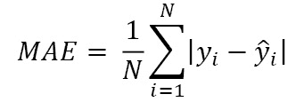
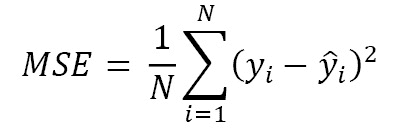
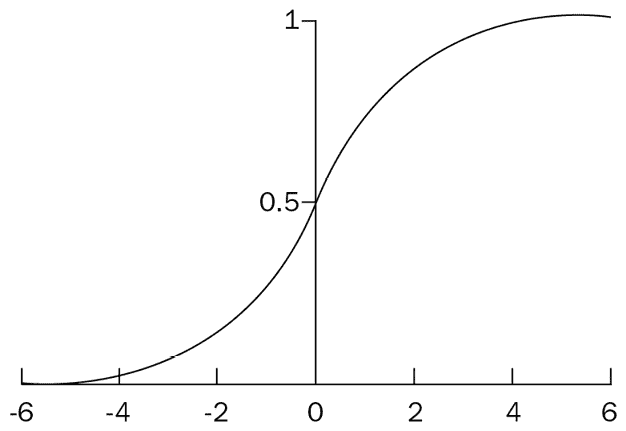
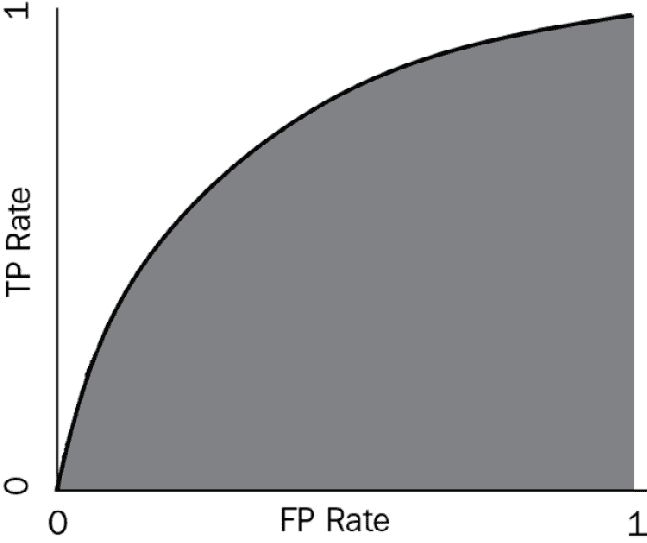
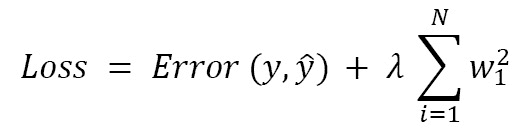
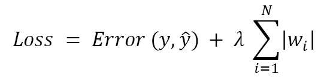

# 四、开发和部署 ML 模型

在前一章中，我们讨论了 ML 过程的准备阶段，包括问题框架和数据准备。在我们框定了问题并有了一个干净的数据集之后，是时候开发和部署 ML 模型了。在本章中，我们将讨论模型开发过程。我们将从模型数据输入和硬件/软件平台设置开始，然后关注模型开发管道，包括模型训练、验证、测试，最后部署到生产。我们的重点是理解基本概念及其背后的思维过程，并通过实践来强化知识和技能。本章包括以下主题:

*   分割数据集
*   搭建平台
*   训练模型
*   验证模型
*   调整模型
*   测试和部署模型
*   使用 scikit 练习-学习

在 [*附录 3*](B18333_13.xhtml#_idTextAnchor209) 中，我们提供了使用 Python 数据科学包 scikit-learn 开发 ML 模型的实践示例。

# 分割数据集

通过数据准备过程，我们已经获得了一个准备好用于模型开发的数据集。为了避免模型欠拟合和过拟合，最佳做法是根据模型开发过程将数据集随机但按比例地分成独立的子集:训练数据集、验证数据集和测试数据集:

*   **训练数据集**:用于训练模型的数据子集。该模型将从训练数据集中学习。
*   **验证数据集**:用于验证训练模型的数据子集。模型超参数将根据验证进行优化。
*   **测试数据集**:数据子集，用于在最终模型部署到生产之前对其进行评估。

常见的做法是将 80%的数据用于训练子集，10%用于验证，10%用于测试。当您拥有大量数据时，您可以将它分成 70%的训练、15%的验证和 15%的测试。

# 准备平台

虽然数据输入对模型质量有很大的影响，但是我们训练/验证/测试模型的硬件/软件平台也会影响模型和开发过程。选择合适的平台对 ML 流程非常重要。

当然，您可以选择使用台式机或笔记本电脑进行 ML 模型开发，但是推荐使用云平台，因为云计算提供了巨大的优势:在全球范围内的自供应、按需、弹性和可伸缩性。云计算中提供了许多工具来帮助数据科学家进行数据准备和模型开发。

在云服务提供商中，谷歌云平台为数据科学家提供了出色的 ML 平台:灵活、有弹性、高性能，端到端。我们将在本书的第三部分讨论 Google Cloud ML 平台的更多细节。

现在我们已经准备好了数据集和 ML 平台，让我们直接进入 ML 模型开发过程，从模型训练开始。

# 训练模型

使用训练数据子集，在平台上，我们训练 ML 模型来学习目标和特征之间的关系。ML 模型训练是一个迭代过程:它从具有初始参数的假设模型开始，并继续学习过程，直到它适合训练数据集。*图 4.1* 显示了一个样本 ML 模型训练过程，其中我们选择了一个线性回归模型( *z=wx+b* )并选择了初始参数( *w* 和 *b* )。我们计算模型预测误差——模型输出和实际数据标签之间的差距——这一步称为正向传播。如果误差没有优化(精度不在规定范围内)，我们将需要回移并调整模型的参数( *w* 和*b*)——这一步称为反向传播。然后，我们将再次重新计算误差。这个模型训练过程重复*前向传播*、*后向传播*和*前向传播*的步骤，直到我们得到一个模型，该模型产生预期范围内的预测误差，即满足商业目标定义的精度。然后，模型训练过程完成。


图 4.1–ML 模型训练流程

您可能已经注意到，在前面的例子中，我们选择了一个线性模型( *z=wx+b* )。在现实生活中，当选择一个 ML 模型时，我们经常使用领域知识和某些假设。它可以是线性的、多项式的，甚至是只能用神经网络表达的东西。

接下来我们来看上一章框定的样本 ML 问题(*例 1* 、*例 2* 、*例 3* )，讨论线性回归和二元分类，然后扩展到高级模型和算法。

## 线性回归

在 [*第三章*](B18333_03.xhtml#_idTextAnchor072) *准备 ML 开发*中，我们谈到了*例 1* : Zeellow 需要从自己的历史数据集准确预测房价。由于问题的输入被标记，它是一个监督学习问题，并且由于输出是一个连续值，它是一个回归问题。

从数学的角度来看，这是一个典型的寻找目标和特征之间的函数(关系)的问题，我们唯一拥有的就是样本数据集。那么，我们如何计算这个函数呢？让我们检查一个简单的数据集*例 1* :某个时间段，某个地点的 10 套房子的销售价格。样本数据集如*表 4.2* 所示。


表 4.2–示例 1 住房数据集

与目标(房价)相关的特征有多个。我们将从研究房价和房子的一个特征之间的关系开始。让我们看看房屋销售价格(目标，用 *y* 表示)和房屋面积(特征，用 *x* 表示)，引出一元回归的话题。

### 一元回归

正如您可以从*表 4.2* 中看到的，样本训练数据集中有 10 行，我们需要找到一个函数 *y=f(x)* 来最好地描述目标 *y* 和特征 *x* 之间的关系。自然，我们会用一个图表来形象化它们的关系。如果我们把数据集中的 10 个项目放到一个坐标系中，我们得到*图 4.3* 。如您所见，第一象限中分布有 10 个点，我们需要对房价( *y* )和房屋面积( *x* )之间的关系进行假设。代表 *y* 和 *x* 关系的是一次函数(如直线 l1 和 l2 所示)还是二次函数(曲线 d1 所示)？显然，d1 不起作用，因为直观上我们知道当 *x* 增加时 *y* 将增加。现在，在 l1 和 l2 线中，我们选择哪一条？这就变成了一元线性回归问题:找到最符合训练数据集的最佳直线 *y=w*x+b** (带参数 *w** 和 *b** )。


图 4.3–线性回归

我们的目标是找到最适合现有数据的函数，并预测新数据的最佳目标值(最接近实际值)。你如何定义最适合的*？为了回答这个问题，我们提出了一个*成本函数*的数学概念来衡量模型的性能:预测值和实际值之间的差异或距离。*

 *有几种方法可以测量预测值和实际值之间的差异。用第 *i* 个数据点的坐标表示( *x* i，*y*I)；也就是说， *y* i 是 *x* i 的实际值，是 *x* i 的预测值。成本函数可以定义为以下函数之一(这里 *N* 是样本数， *N=10* 是我们的*示例 1* ):

*   **平均绝对误差** ( **MAE** )是预测值和真实值之间的绝对差值之和:



*   **均方误差** ( **MSE** )是预测值和真实值之间的平方差之和:

虽然 MSE 和 MAE 都可以用作成本函数，但它们之间存在一些差异:最小化 MAE 往往会减少每个点的差距，并可能导致一些为零(从而移除一些特征并使模型变得稀缺)。最小化 MSE 将避免大的间隙，但不会导致零间隙。

现在问题变成了:我们如何选择正确的参数( *w，b* )使得 MSE 或 MAE 最小化？我们将使用 MSE 作为成本函数，我们的重点是找到正确的参数( *w，b* )，以便针对训练数据集最小化成本函数 MSE。为此，我们引入了**梯度下降**的概念。

### 梯度下降

从数学的角度来看，如果我们将 MSE 函数简化为只有一个变量 *w* ，那么图表将类似于*图 4.4。*数学上，我们可以通过使用导数找到使 *f(w)* 最小的值 *w** ，因为 *f(w)* 的导数在 *w** 处为零。

从计算机编程的角度来看，我们将需要使用一种叫做梯度下降的算法来寻找最佳点 *w** 。对于一个变量，梯度是成本函数的导数。从一个初始点( *w* 0， *f* 0)开始，我们想在( *w* 1， *f* 1)处找到下一个点，其中*f*1*= f(w*1*)*小于*f*0*= f(w*0*)*由于 *f(w)* 在 *w* 0 处的导数为负，并且我们想要使 *f* 最小化，所以从 *w* 0 到 *w* 1 的移动方向将会增加，并且移动幅度(也称为步长或学习率)需要调整，使得它既不会太小而导致许多步到达 *w** 也不会太大而导致偏离


图 4.4–梯度下降

*图 4.4* 也显示了梯度下降算法的步骤:将从初始点 *(w* 0 *，f* 0 *)* 移动到 *(w* 1 *，f* 1 *)* ，到 *(w* 2 请注意，起点对于非凸成本函数非常重要，因为对于 *w* 存在多个最小值，如图*图 4.5* 所示。


图 4.5–非凸成本函数

梯度下降算法让我们通过从 *(w* i *，f* i *)* 到 *(w* i *+1* *，f*I*+1**)*的重复移动，找到最小的 *f* 值否则，将向减小 *w* 的方向移动。经过一定的移动后，如果我们能在点 *(w* f*)* 找到最小值 *f** ，我们称模型收敛于权重 *w** ，我们就找到了参数 *w** 。否则，模型是不收敛的。在我们找到收敛的 *w** 之后，找到参数 *b** 就相对容易了，我们找到了最佳拟合线: *f(x) = w*x + b** ，可以用来预测 *x* 新值的房价。

### 扩展到多个特征(变量)

使用梯度下降算法，我们能够找到适合样本数据集的最佳模型。我们将使用它根据新数据预测销售价格(目标 *y* )。在现实生活中，有很多因素会影响房子的售价，比如房龄、卧室和卫生间的数量，当然还有房子的位置。因此，我们需要将我们的模型扩展到多个特征(变量)。

扩展到多个特征时，我们用一个向量 *X=(x* 1 *，x* 2 *，x* 3 *，…，x* n *)* T 来表示多个特征值 *x* 1 *，x* 2 *，x* 3 *，…，x* n，线性函数会变成这样:

```
Y=WX+B
```

其中 *W* 是一个矩阵， *B* 是一个向量。

那么，成本函数可以写成如下:

```
F(W)=WTAW/2 
```

其中 *A* 是从数据集构建的矩阵。

数学上，我们可以利用多元的偏导数求出使 *F(W)* 最小的值 *W* 。相应地，我们还可以将梯度下降算法从一维扩展到多维，以通过最小化成本函数 *F(W)* 来找到最适合数据集的矩阵 *W* 。

### 扩展到非线性回归

在之前的讨论中，我们假设销售价格(目标 *y* )和房屋面积 *x* 之间的关系是线性的。在许多现实生活中的 ML 模型中，总是存在非线性关系，例如，多项式关系(这里有一个特征/变量 *x* ):

```
y = w1x + w2x2 + w3x3 + …. + wnxn
```

从线性到非线性，数理逻辑是一样的——我们需要找到模型参数 *(w* 1 *，w* 2 *，...w* n *)* 通过最小化成本函数。

通过从线性单变量解决方案扩展到非线性和多变量，回归模型解决了预测连续值的 ML 问题类型。由于问题的数学复杂性，我们将不在此进一步讨论。在下一节中，我们将看看另一种类型的 ML 问题，**分类**，我们将从二进制分类的最简单情况开始。

## 二元分类

在前一章中，我们还谈到了另一个 ML 问题示例(*示例 2*)—Zeellow Lender 正在尝试自动化新贷款申请的批准或拒绝的决策过程。由于模型输出是*是*还是*否*，这是一个二元分类问题。另一类分类问题是多类别分类。例如，给定一幅图像，我们需要判断它是一只狗、一只猫还是一头牛。

对于分类问题，我们总是使用*概率*的概念。对于*例 2* ，ML 模型将根据客户的贷款违约概率输出*是*或*否*:如果违约概率高于阈值，我们将拒绝申请。对于图像分类的例子，我们会说图像是猫、狗或牛的可能性有多大。先说*例 2* 的二元问题。

### 逻辑回归

从数学的角度来看，*例 2* 是一个寻找目标(*是* / *否*)与应用特征之间的函数(关系)的问题，而我们唯一拥有的就是样本数据集。那么，我们如何计算这个函数呢？让我们用*示例 2* 来检查一个简单的数据集:在某个地点的某个时间段，10 个申请的贷款申请决策。样本数据集如*表 4.6 所示。*


表 4.6–示例 2 贷款数据集

从*表 4.6* 中，我们可以看到申请人有许多特征会影响其贷款申请的批准或拒绝。为了简化，我们选择申请人的收入 *x* 作为单一特征/变量，并使用 *z* 作为 *x* 的线性函数:

*z = wx + b*

由于最终的输出目标是 yes ( *1* 或 no ( *0* )，我们需要一个函数将上面的 *z* 值映射到一个概率 *p* ，该概率的值在 *0* 和 *1* 之间:批准贷款的概率(目标变量 *y=1* )。

从统计数据来看，我们有以下几点:

```
p=ez/(1+ez)=1/(1+e-z)
```

而这就是所谓的 **sigmoid 函数** *(图 4.7)* ，用 *z* 的值来映射贷款审批 *p* 的概率。



图 4.7–Sigmoid 函数

使用 sigmoid 函数，输出将实际值 *z* 转换为概率值 *p* ，该概率值在 *0* 和 *1* 之间。这就引入了*逻辑回归*的概念，一种用于预测目标值为 yes 的概率的分类算法( *1* )。简单来说，logistic 回归可以认为是以目标的概率为 *1* 的线性回归，范围在( *0，1* )。

### 二元分类的阈值

正如我们从前面的二元分类模型中看到的，逻辑回归返回一个在 *0* 和 *1* 之间的概率值。要把一个概率值转换成一个分类，我们需要确定阈值——当概率在阈值以上时，这个分类就是 *1* (是)；否则为 *0* (否)。对于*例 2* ，如果你设置门槛为 *0.9* ，那么你会在概率高于 90%的情况下批准贷款申请；否则，你会拒绝申请。但是我们如何定义门槛呢？答案与业务案例和称为**混淆矩阵**的模型度量有关。我们将在模型验证部分详细讨论它们。

### 扩展到多类分类

我们可以将二元分类问题推广到多类分类问题。从二进制到多类有不同的方法。给定一个多分类模型，我们可以将其分解为多个二元分类问题。请参考以下链接了解更多详情:

[https://svivek . com/teaching/lessons/slides/multi class/multi class-full . pdf](https://svivek.com/teaching/lectures/slides/multiclass/multiclass-full.pdf)

到目前为止，我们已经讨论了回归和分类问题，并介绍了梯度下降算法。现在我们来看看一些高级算法。

## 支持向量机

一种流行的高级 ML 算法被称为**支持向量机**，或 **SVM** 。这是一个通常用于分类问题的模型。SVM 的想法很简单:算法找到一条线(二维)或一个超平面(三维或更多维)将数据分成不同的类。

让我们用一个二维分离问题来说明 SVM。如图*图 4.8* 所示，我们试图找到一条线，将点分成两组:一组圆和一组正方形。这两点之间有三条线隔开。三条线中，哪一条是最佳选择？


图 4.8-SVM 图解

让我们仔细看看这张图。对于每条线，都有最接近两个类中的线的点，我们称这些点为支持向量，线和支持向量之间的距离为边距。SVM 的目标是使利润最大化。在*图 4.8* 中的三条线中，您可以看到线 1 是我们的选择，因为它在三条线中具有最大的余量。


图 4.9–分离数据的非线性曲线

如果我们将这个二维问题扩展到三维，那么边缘最大的超平面就是最优的超平面。尽管如此，两者仍然是线性模型。然而，在现实生活中，分离往往不是线性的。*图 4.9* 显示了一个分离为圆形(非线性)的例子。

## 决策树和随机森林

对于具有多个特征的分类 ML 问题，自然想到要做的事情是对特征值进行分类——对每个特征进行二元分类。另一种流行的 ML 算法，决策树模型，使用这种逻辑来构建决策树，其中每个内部节点代表对一个特性的测试，每个叶节点代表一个类标签，而分支代表导致叶节点的特性组合——类标签。从根到叶，路径代表分类规则。构建决策树是为了根据每个特征的不同条件来分割数据集。

决策树是监督学习中使用最广泛的方法之一。*图 4.10* 展示了前面讨论的*例 2* 的决策树逻辑流程:贷款申请决策流程。决策树从信用历史开始:

*   如果信用记录(分数)良好，它将检查申请人的收入和贷款金额——如果收入低，贷款金额大，它将拒绝申请。否则，贷款申请将被批准。
*   如果信用记录不良，它将检查申请人的收入和贷款额——如果收入高，贷款额小，它将批准申请。否则，贷款申请将被拒绝:


图 4.10–示例 2 的决策树

使用决策树模型，您可以基于新的特性数据预测结果，例如新的应用的特性值。然而，在数据集规模很大的情况下，决策树可能会很复杂，并可能导致过度拟合。为了解决这个问题，我们经常使用随机森林，它由许多决策树组成。随机森林从这些单独的决策树中获得预测，并通过将决策树预测值与投票或平均过程相结合来进行最终优化。随机森林通常比单一决策树更好，因为它避免了使用平均或投票机制的过度拟合。

在本节中，我们讨论了各种 ML 模型训练算法:从单变量线性回归到多变量非线性回归；从二元分类到多类分类；从支持向量机到决策树和随机森林。ML 训练的结果是很好地符合训练数据集的模型。这样的模型会对新的生产数据做出好的预测吗？答案是，在部署模型来测试和预测生产数据之前，我们需要使用验证数据集来验证模型。

# 验证模型

训练完模型后，您需要确定它在预测未来新数据的目标时是否表现良好，这就是验证过程:您必须在训练中未使用的带标签数据集(在数据集拆分阶段构建的验证数据集)上验证模型性能。

## 模型验证

回想一下我们在第 3 章 中讨论的内容:在 ML 问题框架阶段，您定义业务问题，并设计一个业务指标来衡量模型的成功。现在，在这个模型验证阶段，模型验证度量需要尽可能紧密地链接到业务度量。

在本章的前面，我们已经定义了成本函数，该函数用于找到优化的模型。成本函数也用于 ML 模型验证。对于回归问题，成本函数(模型值和实际值之间的差距)通常是 MSE，这在上一节已经讨论过了。对于二进制分类，成本函数通常用称为混淆矩阵的度量来表示。让我们仔细看看混淆矩阵，以及改变分类阈值对混淆矩阵的影响。

## 混淆矩阵

混淆矩阵用于衡量二元分类模型的预测，如图*图 4.11 所示。*


图 4.11-混淆矩阵

根据模型是否预测实际类别，有四种情况:

*   **真正** ( **TP** )就是模型*正确*预测*正*类的地方。
*   **真负** ( **TN** )就是模型*正确*预测*负*类的地方。
*   **假阳性** ( **FP** )是模型*错误地*预测*阳性*类的地方。
*   **假阴性** ( **FN** )是其中模型*错误地*预测了*阴性*类。

让我们来看一个计算机视觉 ML 问题:你训练了两个图像识别模型——来将一张图像分类为是否是猫。您已经在验证数据集上运行了两个模型，并将结果与标签进行了比较，*图 4.12* 显示了两个 ML 模型的混淆矩阵。我们如何衡量哪个模型表现更好？


图 4.12-两个 ML 模型的混淆矩阵

为了帮助我们比较分类模型的性能，我们需要定义更多的指标:

*   `Recall` ( `sensitivity`)测量被正确识别的实际阳性的比例:

    ```
    Recall =TP/(TP+FN)
    ```

*   `Specificity`测量被正确识别的实际否定的比例:

    ```
    Specificity =TN/(FP+TN)
    ```

将上述指标应用于这两个模型，我们得出了下表:


表 4.13-两种 ML 模型的召回率和特异性

根据业务目标，这两种模式的绩效可以从不同的角度进行衡量和解释。如果目标是识别尽可能多的猫，并且假阳性的数量并不重要，那么模型 2 表现得更好，因为它具有高召回指标。然而，如果您的目标是识别非猫，那么模型一可能是一个更好的选择，因为它具有高特异性指标。

您可以使用更多的指标来帮助您做出决策。接下来，我们介绍接收机工作特性曲线和曲线下面积的概念。

## ROC 曲线和 AUC

在之前的章节中，我们讨论了将概率转换为 a 类的截止时间。阈值将影响混淆矩阵。

一条**受试者工作特性** ( **ROC** )曲线是一个曲线图显示在所有阈值下**真阳性率** ( **TPR** )和**假阳性率** ( **FPR** )为二维。

TPR 是召回的同义词，因此定义如下:

```
TPR =TP/(TP+FN) (Of all the positive cases, the proportion of cases identified as positive)
```

FPR 的定义如下:

```
FPR =FP/(FP+TN) (Of all the native cases, the proportion of cases identified as positive)
```


图 4.14–ROC 曲线

要构建 ROC 曲线，您需要针对每个阈值计算 TPR(或召回)与 FPR，并将其绘制在图表上。*图 4.14* 显示了一个样本 ROC。如果我们仔细观察图表，我们会发现( *0，0* )处的点表示零真阳性和零假阳性。( *1，1* )处的点表示所有阳性都被正确识别，但所有阴性也都被错误识别。从( *0，0* )到( *1，1* )的虚线称为**随机分类器**，代表 *TPR=FPR* 。在图中，理想线是*完美分类器*，它代表 *TPR=1* ，没有*误报*:



图 4.15-AUC:曲线下的面积

由于分类问题的目标是具有高 TPR 和低 FPR 的模型——尽可能接近*完美分类器*——我们经常使用曲线 ( **AUC** )-ROC 下的**面积作为分类模型性能的度量:AUC-ROC 越大越好。AUC-ROC 样本如图 4.15 所示。**

## 更多分类指标

如您所见，利用混淆矩阵中的四个数字，您可以计算模型的召回率和特异性，这里我们介绍准确度、精确度和 F1 分数:

*   `Accuracy`测量案例总数中正确预测的比例:

    ```
    Accuracy=(TP+TN)/(TP+TN+FP+FN)
    ```

*   `Precision`测量实际上正确的肯定识别的比例:

    ```
    Precision=TP/(TP+FP)
    ```

*   `F1-score`结合精度和灵敏度，测量整体性能:

    ```
    F1-score =2 X Precision X Recall/(Precision + Recall)
    ```

到目前为止，我们已经介绍了许多分类指标，您应该选择哪一个？这实际上取决于业务环境和目标。对于识别电子邮件是垃圾邮件还是非垃圾邮件的分类模型，虽然精确度有助于识别垃圾邮件，但您也希望避免将合法的电子邮件标记为垃圾邮件。对于识别患者是否患有晚期疾病的分类模型来说，识别实际患有该疾病的患者的疾病是至关重要的。在这种情况下，灵敏度是比精度更好的度量标准。

F1 分数结合了精确度和召回率，给你一个量化整体表现的数字。当类别不平衡时，您可能希望使用 F1 分数，但是您希望保持精确度和灵敏度之间的平衡。

# 调整模型

在模型验证过程中，我们评估模型的性能，有时模型不符合验证数据集。让我们检查不同的情况。

## 过度拟合和欠拟合

虽然欠拟合描述了预测误差没有被最小化的情况，但是过拟合是指模型非常适合训练数据集，但是不适合验证数据集的情况。过度拟合模型在训练期间获得非常低的成本函数值，但是对新数据的预测很差。*图 4.16* 描述了欠拟合、稳健和过拟合的情况。


图 4.16–模型配件

当我们试图最小化成本函数并避免欠拟合时，我们需要确保我们的模型是通用的，不容易过拟合。从我们的 ML 实践中，我们知道过度拟合通常是由于使模型比必要的更复杂而引起的。在*图 4.16* 中可以看到，过拟合使一个训练模型记忆数据。ML 的基本原则是在不失一般性的情况下使模型很好地适应数据。为了避免过度拟合，我们引入正则化来降低模型复杂度。

## 正规化

为了避免过度拟合，我们需要降低模型的复杂性。模型复杂性可以从两个方面来考虑:

*   作为具有非零权重的特征总数的函数的模型复杂度
*   作为模型中所有特征的*权重*的函数的模型复杂度

引入正则化的思想，增加一个惩罚模型复杂度的因子，增强模型的泛化能力。对应于前面的两种复杂性，我们有两种正则化/一般化:

*   使用 *L2 正则化*公式量化复杂性，该公式将正则化项定义为所有要素权重的平方和——接近于零的权重对模型复杂性几乎没有影响，而异常值权重会产生巨大影响。*岭回归*使用 L2 正则化:通过添加一个等价于权重平方的惩罚来改变成本函数。设 *p* 为特征个数，第 *i* 个特征的系数(权重)为*w*I；然后，成本函数被写成如下:



*   使用 *L1 正则化*公式量化复杂性，该公式将正则化项定义为所有特征权重的绝对值之和——接近零的权重对模型复杂性有很大影响，而异常值权重影响较小。Lasso 回归使用 L1 正则化:通过添加一个等价于权重绝对值的惩罚来改变成本函数:



对于前面的公式，应该如何选择参数 lambda？如果 lambda 值太高，模型将会很简单，并且存在数据拟合不足的风险。如果 lambda 值太低，模型将会更复杂，存在过度拟合数据并导致新数据泛化的风险。lambda 的理想值会生成一个模型，该模型符合训练数据并能很好地推广到新数据。模型调优的一个目标是平衡模型的复杂性和泛化能力。

除了正则化，我们可以使用早期停止来避免过度拟合。早期停止是一种正则化形式，用于在使用迭代方法(如梯度下降)训练学习者时避免过度拟合。这意味着当训练结果足够好时，并且在模型完全达到收敛之前，结束训练。

## 超参数调谐

超参数调整是通过在数据集上运行许多训练作业来寻找模型的最佳版本的过程。它使用您指定的算法和超参数范围，然后选择产生最佳模型的超参数值，该模型由您选择的度量进行测量。

有两种基本类型的超参数。第一类是模型超参数。它们与所选的型号直接相关，因此对该型号的性能有直接影响。它们有助于定义模型本身，例如，神经网络模型中的层数和使用的激活函数。

第二类是算法超参数。它们不直接影响算法的性能，但是影响模型训练的效率和速度。例如，梯度下降算法的学习速率可能影响 ML 模型收敛的速度。

调整超参数的过程包括改变超参数值，并试图找到产生最佳结果的。经常调整的常见超参数包括:

*   **批量大小**:在模型更新之前，训练期间处理的样本数量
*   **训练时期数**:在模型训练期间，我们运行全套训练数据的次数
*   **学习率**:当我们试图找到一个参数的最佳值时所走过的距离

通过 ML 模型训练、验证和超参数调整，我们已经提出了一个可以部署用于测试的模型。

# 测试和部署模型

为了测试并从您的模型中获得性能指标，您必须从模型中做出推论或预测——这通常需要部署。部署阶段的目标是提供一个托管环境来安全且低延迟地托管推理模型。您可以通过以下两种方式之一部署您的模型:

*   **单一预测**:使用永久端点在线部署您的模型。例如，我们可以部署带有在线端点的住房模型(价格预测)。
*   `.csv`文件或多组记录一次被发送，模型将返回一批预测。

在将一个模型部署到测试中之后，您评估该模型以查看它是否满足性能需求和业务需求，这是任何 ML 问题的最终目标。所有利益相关者都需要评估 ML 解决方案的优势并批准将模型部署到生产中。请记住，最准确的模型可能不是 ML 问题的最佳解决方案。

在所有的涉众批准了模型之后，我们将模型部署到生产中。否则，我们需要回到模型训练、验证和调整、重新测试和重新评估的过程。

在将模型部署到生产中之后，您仍然需要监视生产数据，因为新数据会随着时间的推移而积累，并且可能会发现替代的或新的结果。因此，部署模型是一个持续的过程，而不是一次性的练习。

# 使用 scikit-learn 练习模型开发

Scikit-learn 是 Python 中最有用的 ML 库之一。scikit-learn 库包含许多用于 ML 的工具，包括用于分类和回归的工具。

在本书的 [*附录 3*](B18333_13.xhtml#_idTextAnchor209) 中，我们提供了一个使用 scikit 的分步练习练习——学习开发 ML 模型。练习这些步骤对于掌握 scikit-learn 技能至关重要。请参考 [*附录 3*](B18333_13.xhtml#_idTextAnchor209) 、*使用 scikit-learn 练习*，学习并练习使用 Scikit-Learn 进行 ML 模型训练、验证和测试的示例。

# 总结

在这一章中，我们讨论了 ML 模型开发过程的基本概念:数据分割、平台设置、ML 模型训练、验证、测试和部署。

自 20 世纪 50 年代人工智能的概念出现以来，一直没有大的突破，直到 2012 年使用神经网络发明了**深度学习** ( **DL** )。DL 极大地提高了 ML 模型的性能，并为将 ML 应用于许多业务用例开辟了一条巨大的途径。在下一章，我们将讨论神经网络和 DL。

# 延伸阅读

要进一步了解本章的主题，您可以参考以下内容:

*   [https://sci kit-learn . org/stable/tutorial/basic/tutorial . XHTML](https://scikit-learn.org/stable/tutorial/basic/tutorial.xhtml)
*   https://scikit-learn.org/stable/tutorial/index.xhtml
*   [*附录 3*](B18333_13.xhtml#_idTextAnchor209) *，用 ScikitLearn* 练习*