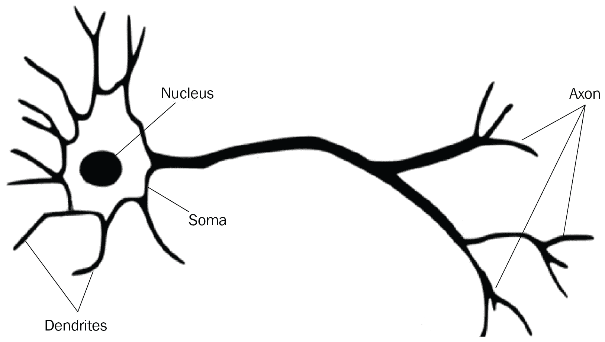

# 五、了解神经网络和深度学习

自 2012 年首次亮相以来，**深度学习** ( **DL** )取得了巨大的突破，并在包括计算机视觉、**自然语言处理** ( **NLP** )等多个研究和工业领域得到应用。在本章中，我们将介绍基本概念，包括以下内容:

*   神经网络和数字逻辑
*   成本函数
*   优化算法
*   激活功能

掌握这些概念后，我们将讨论几种神经网络模型及其业务用例，包括以下内容:

*   **卷积神经网络**(**CNN**)
*   **递归神经网络** ( **RNNs** )
*   **L** **ong 短期记忆** ( **LSTM** )网络
*   **生成对抗网络** ( **甘斯**)

理解神经网络和 DL 概念、公共模型和业务用例在我们的云 ML 之旅中极其重要。让我们开始吧。

# 神经网络和 DL

在我们人类的历史上，有许多有趣的里程碑，从视觉发展和语言发展到制造和使用工具。人类是如何进化的，我们怎样才能训练一台计算机让*看*，*说话*，*使用*工具？寻找这些问题的答案将我们带到了现代人工智能领域。

我们的大脑是如何工作的？现代科学揭示，在大脑中，有一个由一组神经元组成的分层神经网络。一个典型的神经元通过一个叫做**树突**的精细结构从其他神经元收集电信号，并通过一个叫做**轴突**的传导结构发出信号尖峰，轴突分裂成许多分支。在每个分支的末端，突触将来自轴突的信号转化为电效应，以刺激目标神经元的活动。*图 5.1* 显示了一个生物神经元的工作机制:

图 5.1-生物神经元如何工作

受生物神经网络模型的启发，**人工神经网络** ( **ANN** )模型由被称为**感知器**的人工神经元组成。一个感知器从其他感知器接收加权输入，应用传递函数(加权输入之和)和激活函数(将非线性激活添加到和中)，并输出以激励下一个感知器。*图 5.2* 显示了人工神经元(感知器)的工作机制:

图 5.2-人工神经元(感知器)如何工作

人工神经网络由通过层一起工作的感知器组成。图 5.3 显示了多层人工神经网络的结构，其中每个圆形节点代表一个感知器，一条线代表从一个感知器的输出到另一个感知器的输入的连接。神经网络中有三种类型的层:输入层、一个或多个隐藏层和输出层。*图 5.3* 中的神经网络有一个输入层、两个隐含层和一个输出层:

图 5.3-多层人工神经网络

使用神经网络执行 ML 模型训练，数据在网络中流动如下:

1.  一个数据集( *x* 1 *，x* 2 *，x* 3 *，...，x* n)准备好并发送到输入层，输入层的感知器数量与数据集的特征数量相同。
2.  然后数据移动到隐藏层。在每个隐藏层，感知器处理加权输入(如前所述，求和并激活)，并将输出发送到下一个隐藏层的神经元。
3.  在隐藏层之后，数据最终移动到提供输出的输出层。

神经网络的目标是确定最小化成本函数(数据集的平均预测误差)的权重。类似于我们在前面章节中讨论的回归模型训练过程，DL 模型训练通过两部分过程的迭代来实现，向前传播和向后传播，如下所示:

*   **正向传播**是信息通过隐藏层从输入层流向输出层的路径。在训练过程开始时，数据到达输入层，在那里与随机初始化的权重相乘，然后传递到第一个隐藏层。由于输入层有多个节点，每个节点都连接到第一个隐藏层中的每个节点；隐藏层中的节点对其加权值求和，并应用激活函数(增加非线性)。然后，它将输出发送到下一层的节点，在下一层的节点也这样做，直到最后一个隐藏层的输出乘以权重，并成为最终输出层的输入，在最终输出层，应用进一步的函数来生成输出。
*   **反向传播**是信息从输出层一直流回输入层的路径。在此过程中，作为反向传播的第一步，神经网络将预测输出与实际输出进行比较，并计算成本函数或预测误差。如果成本函数不够好，它返回以基于算法如**梯度下降** ( **GD** )调整权重，然后用新的权重再次开始前向传播。

前向传播和后向传播重复多次——每次网络调整权重，试图获得更好的成本函数值——直到网络在输出层获得良好的成本函数(可接受的精度)。此时模型训练完成，我们得到了优化的权重，这就是训练的结果。

DL 正在用神经网络训练 ML 模型。如果您将前面使用神经网络的 DL 模型训练过程与我们在 [*第 4 章*](B18333_04.xhtml#_idTextAnchor094) 、*开发和部署 ML 模型*的*训练模型*部分中讨论的 ML 模型训练过程进行比较，您会发现 ML 和 DL 的概念非常相似。通过迭代的前向传播和后向传播，两者都试图最小化模型的成本函数——ML 更多地是关于计算机利用传统算法从数据中学习，而 DL 更多地是关于计算机从模拟人脑和神经网络的数据中学习。相对来说，ML 需要的计算能力更少，DL 需要的人工干预更少。在接下来的部分中，我们将仔细研究用于具有神经网络的 DL 的成本函数、优化器算法和激活函数。

# 成本函数

我们在第 4 章 的 [*中的*线性回归*部分介绍了成本函数的概念。成本函数为我们提供了一种确定当前模型有多大误差的数学方法——它为做出不正确的预测分配了成本，并提供了一种测量模型性能的方法。成本函数是 ML 模型训练中的关键指标，选择正确的成本函数可以显著提高模型性能。*](B18333_04.xhtml#_idTextAnchor094)

回归模型的常见成本函数是 MAE 和 MSE。正如我们在前面章节中所讨论的，MAE 定义了预测值和标签值之间的绝对差值的总和。MSE 定义了预测值和标签值之间的差的平方和。

分类模型的成本函数非常不同。从概念上讲，分类模型的成本函数是不同类别的概率分布之间的差异。对于二进制分类模型，其中模型输出是二进制的，1 表示是，0 表示否，我们使用**二进制交叉熵**。对于多类分类模型，根据数据集标签上的，我们使用**分类交叉熵**和**稀疏分类交叉熵**如下:

*   如果标签是整数，例如，对一幅狗、猫或牛的图像进行分类，那么我们使用稀疏分类交叉熵，因为输出是一个唯一的类。
*   否则，如果标签被编码为每个类的一系列 0 和 1(对于我们在前面章节中讨论的一次热编码格式也是如此)，我们将使用分类交叉熵。例如，给定一幅图像，您需要检测是否存在驾照、护照或社会保障卡，我们将使用分类交叉熵作为成本函数，因为输出包含多个类。

成本函数是一种测量模型的方法，因此我们可以调整模型参数以最小化它们——模型优化过程。在下一节中，我们将讨论最小化成本函数的优化器算法。

# 优化器算法

在第四章 的 [*中的*线性回归*部分，我们讨论了 **GD** 算法，其中优化了线性回归代价函数。在神经网络中，优化器是一种用于在模型训练中最小化成本函数的算法。常用的优化器有**随机梯度下降** ( **SGD** )、 **RMSprop** 和 **Adam** 如下:*](B18333_04.xhtml#_idTextAnchor094)

*   SGD 对于非常大的数据集非常有用。与 GD 不同，SGD 使用一个训练样本或训练样本的子集，而 GD 会遍历训练数据集中的所有样本来更新参数。
*   RMSprop 通过引入可变学习率来改进 SGD。正如我们在 [*第 4 章*](B18333_04.xhtml#_idTextAnchor094) 中所讨论的，学习率会影响模型性能——较大的学习率可以减少训练时间，但可能导致模型振荡，并可能错过最佳模型参数值。较低的学习率会使训练过程变得更长。在 SGD 中，学习率是固定的。RMSprop 随着训练的进行调整学习率，因此当模型具有高成本函数时，它允许您以大的学习率开始，但是当成本函数降低时，它逐渐降低学习率。
*   **Adam** 代表**自适应矩估计**，是应用最广泛的优化器之一。Adam 为 RMSprop 的自适应学习率增加了动力，因此它允许模型的变化加速，同时在训练期间沿同一方向移动，使模型训练过程更快更好。

选择正确的成本函数和优化算法对于模型性能和训练速度非常重要。Google 的 TensorFlow 框架提供了很多优化器算法。详情请参考[https://www . tensor flow . org/API _ docs/python/TF/keras/optimizer](https://www.tensorflow.org/api_docs/python/tf/keras/optimizers)。

神经网络的其他重要特征是非线性和输出标准化，这是由激活函数提供的。我们将在下一节中研究它们。

# 激活功能

从上一节可以看出，激活功能是训练过程的一部分。激活功能的目的是将加权和输入转换到节点:非线性化并改变输出范围。神经网络中有许多激活函数。我们将讨论一些最常用的函数:sigmoid 函数、tanh 激活函数、ReLu 函数和 LeakyReLU 函数。*图 5.4* 显示了这些函数的曲线:

图 5.4–激活功能

让我们按如下方式检查前面的每个激活功能:

*   前面在成本函数章节中讨论了 sigmoid 激活函数。我们使用 sigmoid 函数将连续值更改为 0 到 1 之间的范围，这符合模型预测概率的输出。
*   双曲正切激活函数与 sigmoid 非常相似，但输出范围为-1 至+1，因此优于 sigmoid，因为输出以零为中心。
*   ReLU 激活功能代表整流线性单元。它被广泛使用，因为它将负值转换为 0，并保持正值不变。它的范围在 0 到无穷大之间。因为负区域中的梯度值为 0，所以在训练过程中，一些神经元的权重和偏差可能不会更新，从而导致死神经元永远不会被激活。
*   LeakyReLU 是 ReLU 函数的改进版本，用于解决垂死的 ReLU 问题，因为它在负区域有一个小的正斜率。LeakyReLU 的优势与 ReLU 的优势相同，此外，它甚至可以针对负输入值进行训练。

另一个激活函数是 *softmax* 函数，常用于多类分类的输出层。softmax 激活函数将输出层值转换为总和为 1 的概率，从而输出多类分类问题中每个类的概率。

在所有这些激活功能中，我们应该选择哪一个？答案取决于预测类型、网络架构、层数、网络中的当前层等因素。例如，sigmoid 更多地用于二元分类用例，而 softmax 通常用于多分类，回归问题可能使用也可能不使用激活函数。虽然开始时会有尝试和错误，但经验会建立良好的实践。

现在我们已经介绍了神经网络和激活函数的概念，让我们来考察一些常用于计算机视觉、**自然语言处理** ( **NLP** )和其他领域的神经网络。

# 卷积神经网络

现在我们已经了解了神经网络和 DL，让我们来看看一些业务用例。

第一种情况是图像识别。我们如何教会计算机识别图像？这对人类来说是一件容易的事，但对计算机来说却是一件非常困难的事。由于计算机只擅长处理 1 和 0，我们需要做的第一件事是使用像素将图像转换成数字矩阵。例如，*图 5.5* 显示了一个单位数字 *8* 的黑白图像，由 28x28 像素矩阵表示。虽然人类可以通过我们眼中的一些*魔法传感器*轻松地将图像识别为数字 *8* ，但计算机需要输入所有 28×28 = 784 个像素，每个像素都有一个**像素值——一个代表像素亮度的**单一数字。像素值有从 0 到 255 的可能值，0 为黑色，255 为白色。介于两者之间的值构成了不同的灰度。如果我们有一个彩色图像，像素将有三个数值 RGB 值(红色、绿色和蓝色)来代表它的颜色，而不是一个黑色值。

图 5.5–用像素值表示数字 8

在我们有了图像的像素矩阵表示之后，我们可以开始开发一个用于训练的**多层感知器** ( **MLP** )网络。我们将用 784 个节点和输入 784 个像素值构建输入层，每个节点一个像素值。输入层的每个节点将输出到下一层(隐藏层)的每个节点，依此类推。当层数增加时，整个网络的总计算量将是巨大的。为了减少总计算量，特征过滤的想法开始发挥作用，并导致了 **CNN** 的概念。

细胞神经网络广泛应用于计算机视觉，尤其是图像识别和处理。CNN 由三层组成:卷积层、池层和全连接层。卷积层卷积输入并过滤图像特征，汇集层压缩过滤后的特征，全连接层(基本上是 MLP)进行模型训练。让我们详细检查一下每一层。

## 卷积层

一个**卷积层**执行卷积，该卷积应用于输入数据以过滤信息并且产生特征图。该滤波器用作滑动窗口来扫描整个图像，并自主识别图像中的特征。如图*图 5.6* 所示，一个 3x3 的滤波器，也就是 也被称为**内核** ( **K** )，扫描整个**图像** ( **I** )并生成一个特征图，由于其元素来自于 *I* 和 *K* 的乘积(在*的例子中)*

图 5.6–卷积运算

通过卷积过程提取图像特征，并生成仍然具有大量数据的特征图，这使得训练神经网络变得困难。为了压缩数据，我们要经过池层。

## 汇集层

**池层**接收来自卷积层的结果，即特征图，并且使用过滤器对其进行压缩。根据用于计算的函数，它可以是最大池或平均池。如图*图 5.7* 所示，一个 2x2 的滤镜面片扫描特征图并压缩。使用最大池，它从扫描窗口中获取最大值， *max(15，8，20，9) = 20* ，依此类推。用平均池，取平均值， *average(15，8，20，9) = 13* 。如您所见，池化图层的过滤器始终小于要素地图。

图 5.7–池层

从输入图像开始，卷积和汇集的过程迭代，最终结果被输入到全连接层(MLP)进行处理。

## 全连接层

在卷积和合并层之后，我们需要将结果扁平化，并将其传递给 MLP，一个完全连接的神经网络，用于分类。最终结果将通过 softmax 激活功能激活，以产生最终输出——对图像的理解。

# 递归神经网络

第二种类型的神经网络是 RNN。rnn 广泛用于时间序列分析，如 NLP。RNN 的概念出现在 20 世纪 80 年代，但直到最近它才在 DL 中获得动力。

我们可以看到，在传统的前向神经网络(如 CNN)中，神经网络中的一个节点只对当前输入进行计数，而不会记住宝贵的输入。因此，它不能处理需要先前输入的时间序列数据。例如，要预测一个句子的下一个单词，将需要前面的单词来做推理。通过引入一个隐藏状态，它可以记住序列的一些信息，RNNs 解决了这个问题。

与前馈网络不同，RNNs 是一种神经网络，其中来自前一步骤的输出作为当前步骤的输入；使用循环结构来保存信息允许神经网络接受输入序列。如*图 5.8* 所示，展开节点 *A* 的一个循环来说明其过程；首先，节点 *A* 从输入序列中取出 *X* 0，然后输出 *h* 0，与 *X* 1 一起作为下一步的输入。同样， *h* 1 和 *X* 2 是下一步的输入，以此类推。使用循环，网络在训练时保持记忆上下文:

图 5.8-https://colah.github.io/posts/2015-08-Understanding-LSTMs/ RNN 展开的环

简单的 RNN 模型的缺点是消失梯度问题，这是由于在训练期间和反向传播期间，在每个时间步长使用相同的权重来计算节点的输出。当我们进一步向后移动时，错误信号变得更大或更小，从而导致记忆序列中更远的上下文的困难。为了克服这个缺点，开发了 **LSTM** 神经网络。

# 长短期记忆网络

一个 LSTM 网络被设计用来克服消失梯度问题。lstm 有反馈连接，lstm 的关键是单元状态——贯穿整个链的水平线，只有很小的线性交互，它保存上下文信息。LSTM 通过门向单元状态添加或移除信息，门由激活函数(如 sigmoid 或 tanh)和逐点乘法操作组成。

图 5.9-一个 LSTM 模型(来源:https://colah.github.io/posts/2015-08-Understanding-LSTMs/)

*图 5.9* 显示了一个具有保护和控制单元状态的门的 LSTM。利用细胞状态，LSTM 解决了梯度消失的问题，因此特别擅长处理时间序列数据，如文本和语音推理。

# 生成性对抗网络

**GANs** 是算法架构，用于生成新的数据合成实例，可以冒充真实数据。如图*图 5.10* 所示，GAN 是一个创成式模型，同时训练以下两个模型:

*   一个**生成** ( **G** )模型，捕捉数据分布以生成可信数据。潜在的空间输入和随机噪声可以被采样并馈入生成器网络，以生成成为鉴别器的负训练样本的样本。
*   **鉴别** ( **D** )模型，将生成的图像与真实图像进行比较，并尝试识别给定图像是假的还是真实的。它估计样本来自训练数据而不是真实数据的概率，以区分生成器的假数据和真实数据。鉴别器对产生不可信结果的发生器进行处罚。

图 5.10–GAN(来源:https://developers . Google . com/machine-learning/recommendation)

模型训练从生成器生成假数据开始，鉴别器通过与真实样本进行比较来学习辨别假数据。然后，GAN 将结果发送给生成器和鉴别器，以更新模型。这个微调训练过程迭代，最终产生一些看起来极其真实的数据。GANs 可用于生成文本、图像、和视频，并对图像进行着色或去噪。

# 总结

神经网络和 DL 为传统的 ML 光谱增添了现代色彩。在这一章中，我们首先通过检查成本函数、优化算法和激活函数来学习神经网络和 DL 的概念。然后，我们介绍了先进的神经网络，包括 CNN，，，和甘。正如我们所看到的，通过引入神经网络，DL 扩展了 ML 概念，并在许多应用中取得了突破，如计算机视觉、NLP 等。

本章总结了本书的第二部分:*机器学习和深度学习*。在第三部分，我们将关注*机器学习谷歌方式*，我们将讨论谷歌如何在谷歌云中进行 ML 和 DL。我们将在下一章从学习 BQML、Google TensorFlow 和 Keras 开始第三部分。

# 延伸阅读

有关本章所学主题的更多信息，您可以参考以下链接:

*   [https://developers . Google . com/machine-learning/crash-course/introduction-to-neural-networks/anatomy](https://developers.google.com/machine-learning/crash-course/introduction-to-neural-networks/anatomy)
*   [https://www . IBM . com/cloud/blog/ai-vs-machine-learning-vs-deep-learning-vs-neural-networks](https://www.ibm.com/cloud/blog/ai-vs-machine-learning-vs-deep-learning-vs-neural-networks)
*   [https://aws.amazon.com/what-is/neural-network/](https://aws.amazon.com/what-is/neural-network/)
*   [https://developers.google.com/machine-learning/gan](https://developers.google.com/machine-learning/gan)