# 附录一：练习使用基本 GCP 服务

在本附录中，我们将展示一些使用 Google Cloud console 和 Cloud Shell 的 GCP 资源供应示例。我们将使用以下架构来练习使用谷歌云控制台，如图*图 11.1* 所示:

*   一个 VPC 网络，VPC1，以及其中的两个子网:一个公有`subnet1`和一个私有`subnet2`
*   具有外部 IP 地址并且可以从互联网访问的`subnet1`
*   私有`subnet2`中的虚拟机没有外部 IP 地址，因此只能从控制台浏览器或同一 VPC 中的虚拟机进行访问
*   另一个 VPC 网络 VPC2 和 VPC2 中的一个子网:一个私有`subnet8`
*   私有虚拟机`subnet8`
*   VPC1 和 VPC2 之间的对等

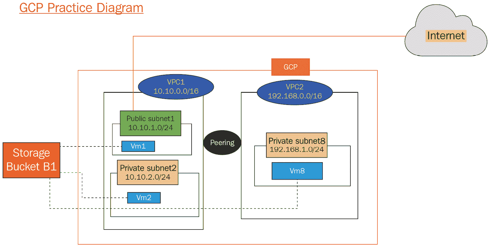

图 11.1-GCP 控制台实践的示例架构

在*图 11.1* 中的 GCP 练习图中，`public subnet1`可从互联网上访问。有一个 Google 云存储桶叫做`B1`。如果我们想让 VM1、VM2 和 VM8 访问`B1`，我们需要做什么？在进一步阅读之前，这是一个值得思考的问题。

# 通过云控制台练习使用 GCP 服务

在 GCP，项目是资源提供的基本单位。你可以使用以下步骤开始一个项目:

1.  在您从浏览器登录到 GCP 控制台([https://console.cloud.google.com](https://console.cloud.google.com))后，您将看到以下开始页面:

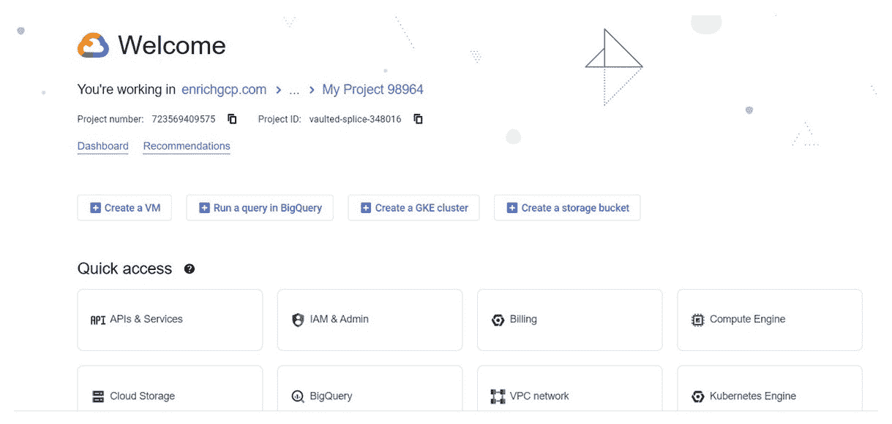

1.  您可以通过点击**我的第一个项目**旁边的下拉按钮来创建新项目。


在**我的第一个项目**项目中，我们现在将创建网络 VPC、子网和虚拟机。

## 使用 GCP 控制台创建网络 VPC

使用以下步骤在 GCP 控制台中创建一个 VPC :

1.  在窗口的左上角，有一个导航下拉菜单，您可以使用它来选择 GCP 服务。


1.  从左侧的导航菜单中，转到 **VPC 网络**并从下拉菜单中选择 **VPC 网络**。它会提示您启用**计算引擎 API** 。继续并启用它。

你将被带到 **VPC 网络**页面，在这里你可以创建一个 VPC 网络。

1.  点击**创建 VPC 网络**。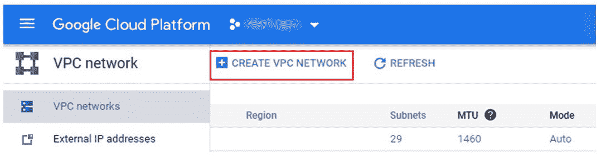

1.  然后，在网络细节中填写并创建 VPC1:
    *   `subnet1`
    *   `10.10.1.0/24`
    *   `us-east1`
    *   `subnet2`
    *   `10.10.2.0/24`
    *   `asia-east1`

然后，`vpc1`创建了两个子网:

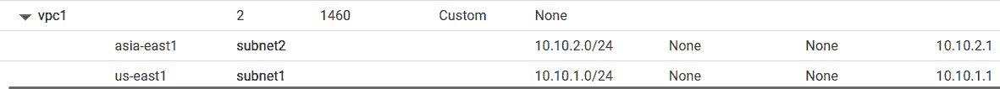

1.  重复*步骤 3* 和*步骤 4* 创建`vpc2`:
    *   `subnet8`
    *   `192.168.1.0/24`
    *   `europe-central2`

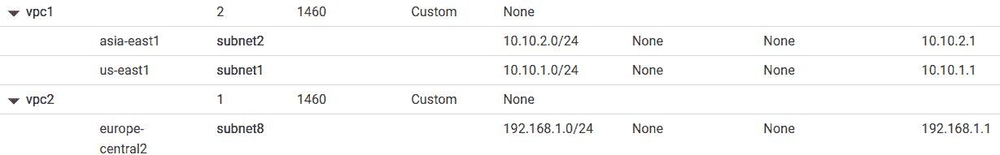

现在已经创建了两个 VPC:带有两个子网的`vpc1`和带有一个子网的`vpc2`。

## 使用 GCP 控制台在 vpc1/subnet1 中创建公共虚拟机 vm1

使用以下步骤在 GCP 控制台中创建一个虚拟机:

1.  从左侧的导航菜单，转到**计算引擎**，然后转到**虚拟机实例**。点击**创建实例**按钮。

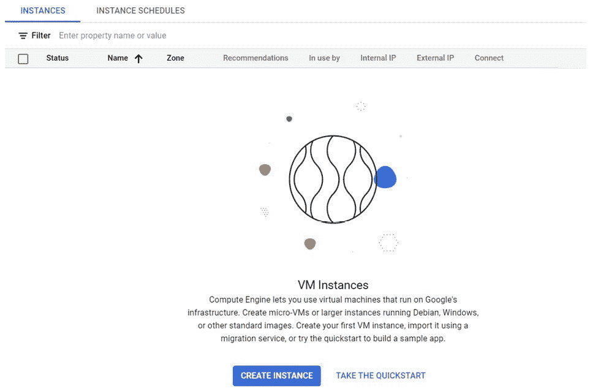

然后，填写虚拟机实例的详细信息:

*   `vm1`
*   `us-east1`
*   `us-east1-b`
*   **机器配置** : **通用**， **N1** 系列
*   `f1-micro`
*   `subnet1`

这在下面的截图中显示:

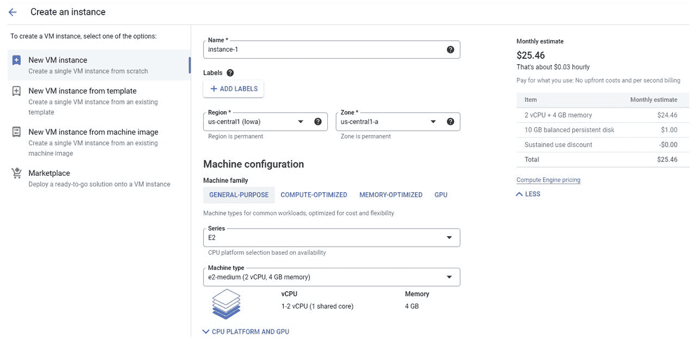

1.  选择其他选项的默认值，然后单击**网络、磁盘、安全性、管理、单独租赁**。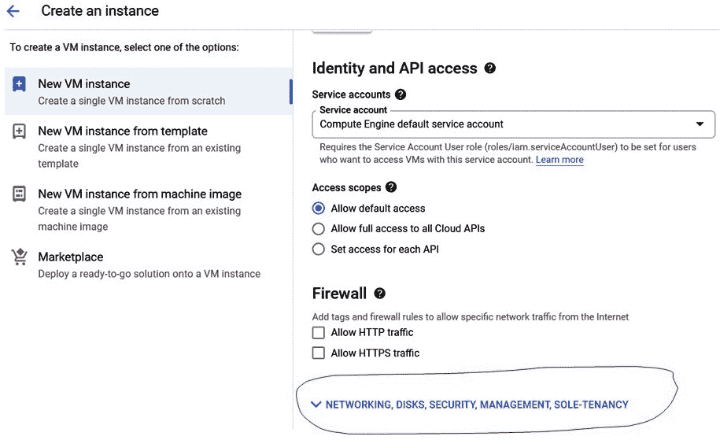

1.  展开网络选项，然后转到**网络接口**。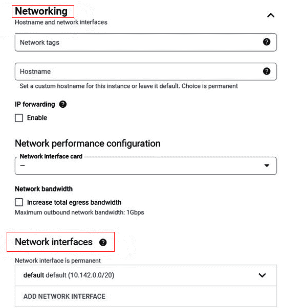

1.  在`vpc1`中为 `subnet1 Ipv4 (10.10.1.0/24)`为**子网**，并将其他一切保留为默认。T57

1.  点击**完成**和然后创建。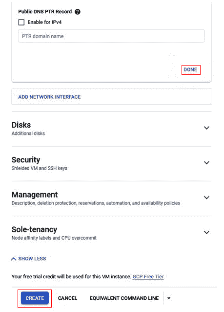

在这个时间，VM1 在`vpc1`和`subnet1` ( `10.10.1.0/24`创建，内部 IP 地址为`10.10.1.2`，外部 IP 地址为`34.148.1.115`。

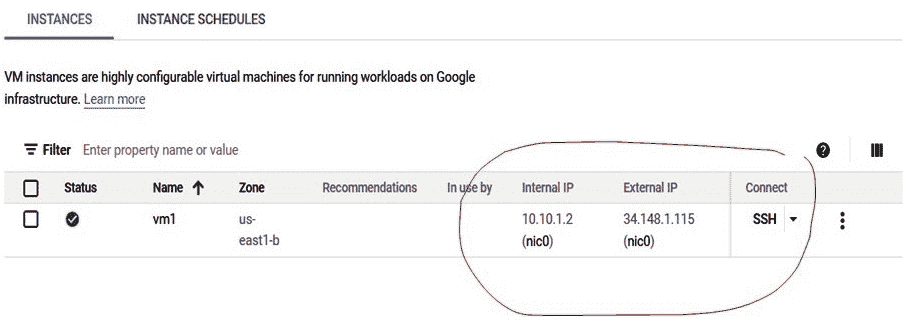

要允许**安全 Shell** ( **SSH** )进入这个 Linux VM，您需要创建一个防火墙规则来允许入站 SSH 流量。

1.  从三点下拉菜单中选择**查看网络详情**。T80

1.  选择**防火墙**，然后**创建防火墙规则**。

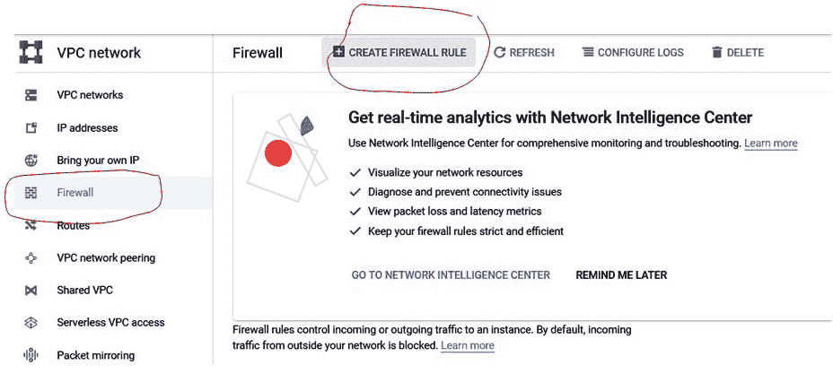

1.  填写防火墙规则详细信息:
    *   `vpc1-firewall-rule2`
    *   `vpc1`

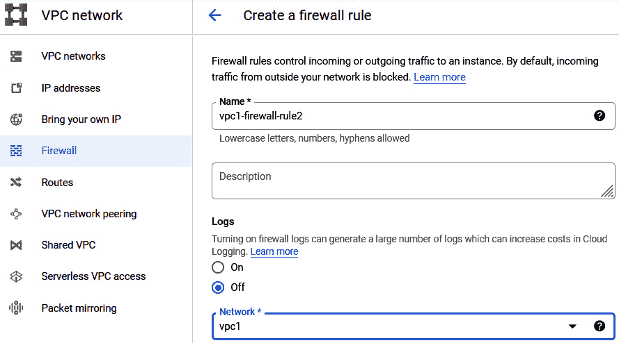

1.  选择`22`的`0.0.0.0/0`作为端口号(SSH 使用端口`22`)。然后，点击**创建**。

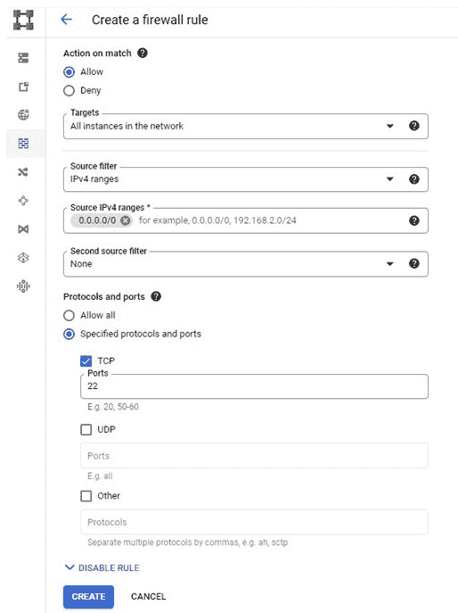

1.  成功创建防火墙规则后，返回到**虚拟机实例**页面。从 **SSH** 下拉菜单中选择**在浏览器窗口**中打开(确保允许浏览器弹出窗口)。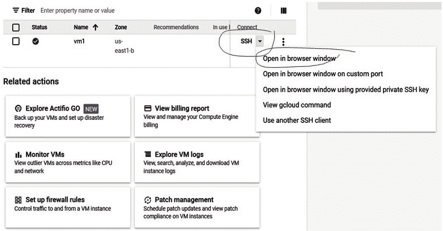

现在，您能够 SSH 到 VM 实例。

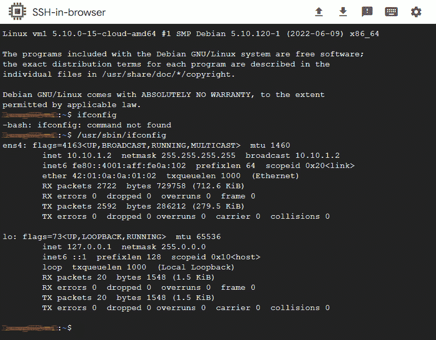

你现在有了一个 GCP 虚拟机，名为`vm1`，创建于`vpc1`的`subnet1`中。

## 使用 GCP 控制台在 vpc1/subnet2 中创建专用虚拟机 vm2

1.  重复上一节中*的步骤，在`vpc1/subnet2`中创建一个虚拟机。唯一的变化如下:*
    *   选择`asia-east1`作为`subnet2`所在的区域。
    *   选择`subnet2`作为子网。
    *   为**外部 IPv4 地址**选择**无**，因为这是一个私有虚拟机，没有分配外部 IP 地址。

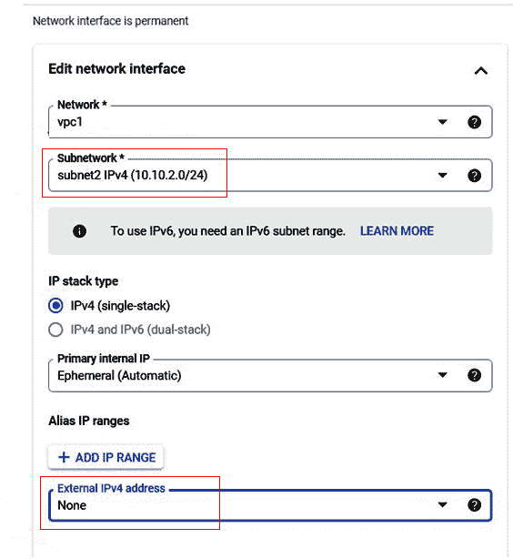

现在，`vm2`在`vpc1/subnet2`中被配置了`10.10.2.2`的 IP 地址。

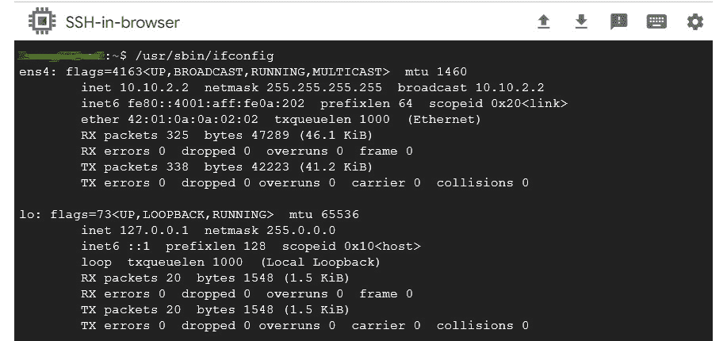

1.  重复*中的步骤，使用 GCP 控制台*在 vpc1/subnet1 内创建一个公共虚拟机 vm1，以创建一个防火墙规则，允许`vpc1` ( `10.10.0.0/16`)内的`ping`，这样`vm1`和`vm2`可以相互 ping 通，因为它们在同一个 vpc 中。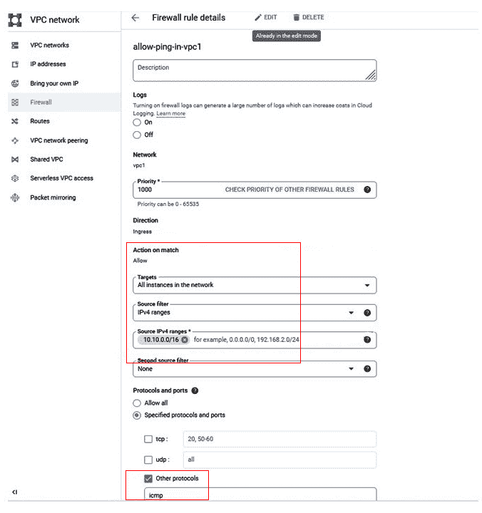

1.  从`vm1`平`vm2` ( `10.10.1.2`)。

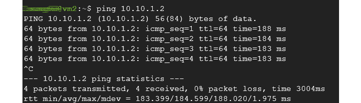

这时，你有了一个 GCP VM，`vm2`，在`vpc1`的`subnet2`中创建了，`vm1`可以 ping `vm2`。

## 使用 GCP 控制台在 vpc2/subnet8 内创建一个专用虚拟机 vm8

使用 GCP 控制台重复*在 vpc1/subnet2 内创建私有虚拟机 vm2 中的步骤，在`vpc2/subnet8` ( `192.168.1.0/24`)中创建一个没有公共 IP 地址的虚拟机。唯一的变化如下:*

*   选择`europe-central2`作为`subnet3`所在的区域。
*   选择`subnet8`作为子网。

注意`vm1/vm2`不能 ping `vm8`，即使你创建了允许从`vpc1`ping 到`vpc2`的防火墙规则，因为在`vpc1`和`vpc2`之间没有路由。这就是为什么我们需要在`vpc1`和`vpc2`之间创建对等关系。

## 使用 GCP 控制台在 vpc1 和 vpc2 之间创建对等关系

使用以下步骤在`vpc1`和`vpc2`之间创建 VPC 网络对等:

1.  从导航菜单中，进入 **VPC 网络**，然后进入 **VPC 网络对等**。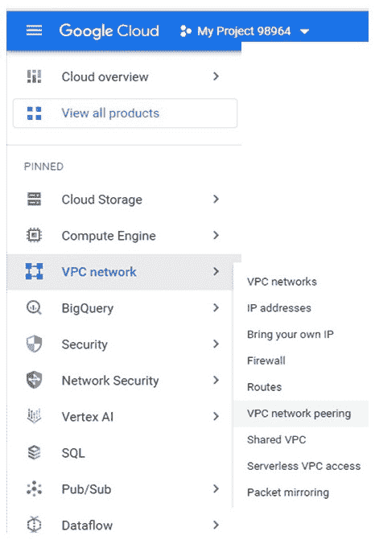

1.  从`vpc1`到`vpc2`创建`vpc12-peering`。

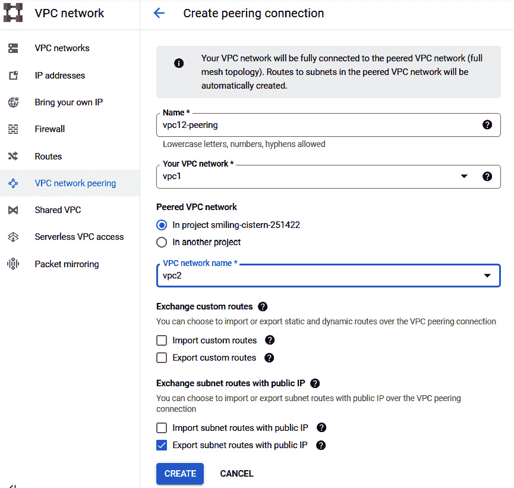

1.  对`vpc2`到`vpc1`对等做同样的，这样两个对等现在都将被激活。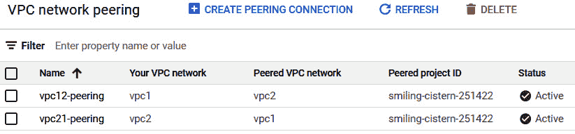

1.  来自`vm1`的平`vm8` ( `192.168.1.2`)。

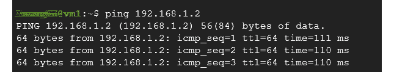

你现在有了一个 GCP 虚拟机，在`vpc2`的`subnet8`中创建的`vm8`，并且`vm1`可以 ping `vm8`。

## 从 GCP 控制台创建 GCS 存储桶

使用以下步骤创建一个 GCS 铲斗:

1.  从导航菜单中，转到**云存储**，然后转到**存储桶**。

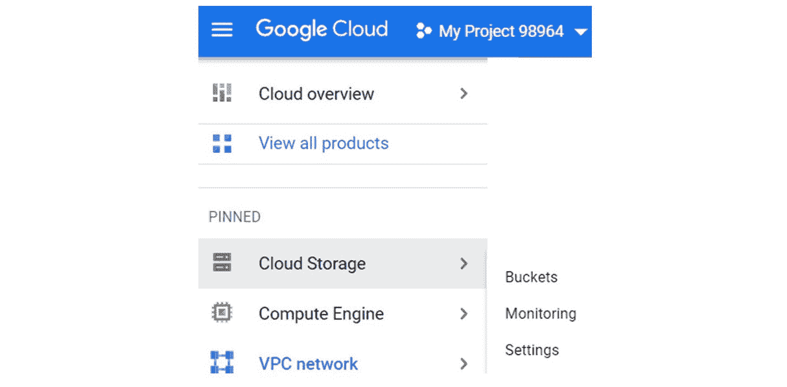

1.  在新窗口中，点击**创建桶**。

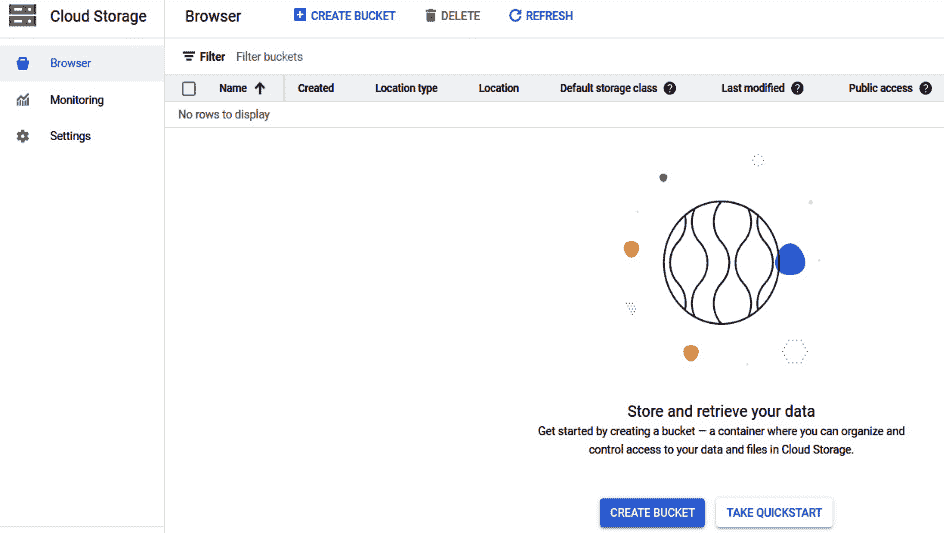

1.  为 GCP 存储桶选择一个全局唯一的名称。这里我们用`bucket-08282022`。选择**下的**区域**选择存储您数据的位置**，选择 **us-east1** 作为存储桶区域。点击**创建**按钮。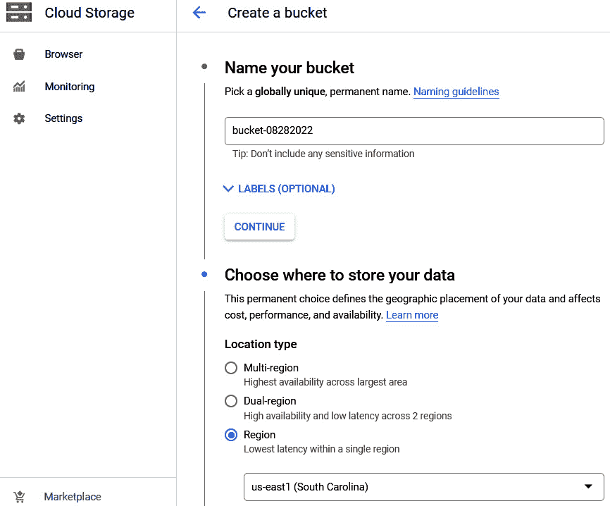

它会将您带到 bucket 页面，在这里您可以创建一个子文件夹、上传文件，或者在之前创建的 bucket 下上传一个文件夹。

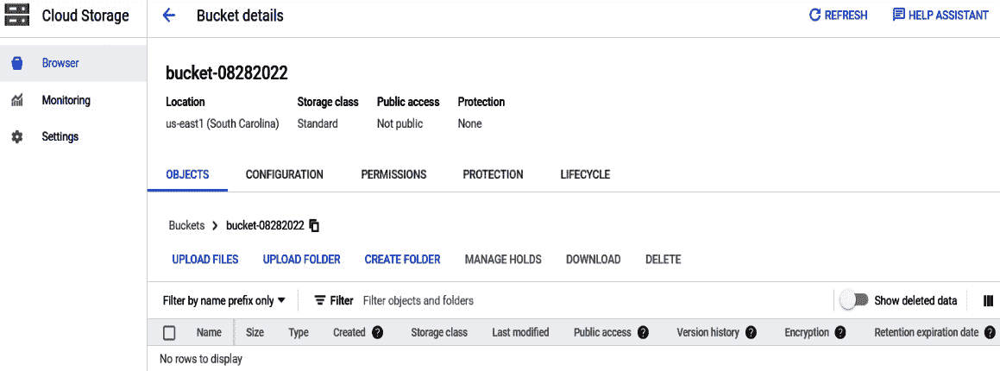

到目前为止，我们已经从控制台配置了 GCP 资源(虚拟专用网络/子网、VPC 对等、虚拟机和存储)。所有这些供应都可以使用云外壳来完成。在下一节中，我们将提供用于 GCP 资源供应的云 Shell 命令/脚本。

# 使用谷歌云外壳提供 GCP 资源

我们可以使用谷歌云外壳来供应所有资源，而不是使用 GCP 控制台。在下面的示例中，GCP 架构如图*图 11.2* 所示，我们使用云 Shell 命令来配置 GCP 资源，包括网络 VPCs 子网、虚拟机和 VPC 对等。请在云壳中练习使用它们，并确保您理解每个步骤。

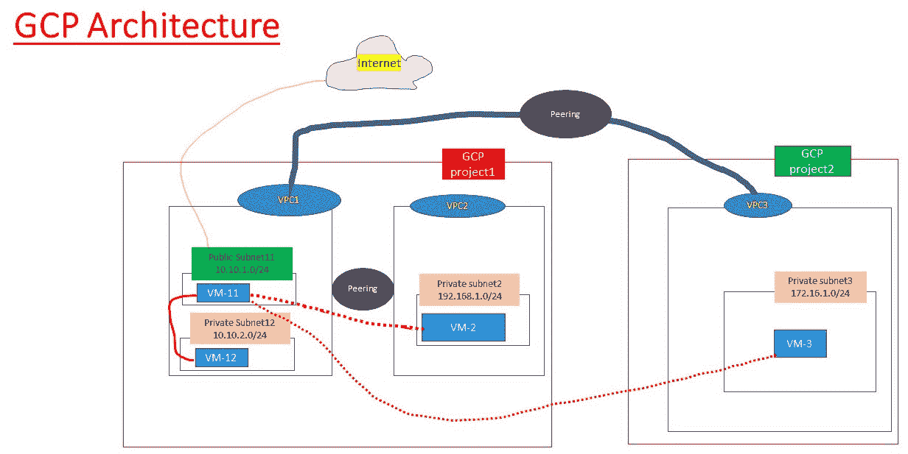

图 11.2–GCP 云外壳实践的示例架构

1.  创建一个项目，VPC 和子网:

    ```
    gcloud projects create test10122021 --folder 464105225938 gcloud compute networks create vpc1 --project corvel-032021  --subnet-mode=custom gcloud compute networks subnets create subnet11 --network=vpc1 --range=10.10.1.0/24 --project corvel-032021 --region us-west1 gcloud compute networks subnets create subnet12 --network=vpc1 --range=10.10.2.0/24 --project corvel-032021 --region us-east1 gcloud compute networks create vpc2 --project corvel-032021  --subnet-mode=custom gcloud compute networks subnets create subnet2 --network=vpc2 --range=192.168.1.0/24 --project corvel-032021 --region us-central1 gcloud compute networks create vpc3 --project test10122021  --subnet-mode=custom gcloud compute networks subnets create subnet3 --network=vpc3 --range=172.16.1.0/24 --project test10122021 --region us-central1
    ```

2.  创建虚拟机:

    ```
    gcloud compute instances create myvm11 --project corvel-032021 --machine-type=f1-micro --zone=us-west1-a  --subnet=subnet11 gcloud compute instances create myvm12 --project corvel-032021 --machine-type=f1-micro --network-interface=subnet=subnet12,no-address  --zone=us-east1-b gcloud compute instances create myvm2 --project corvel-032021 --machine-type=f1-micro --network-interface=subnet=subnet2,no-address  --zone=us-central1-b gcloud compute instances create myvm3 --project test10122021 --machine-type=f1-micro --network-interface=subnet=subnet3,no-address --zone=us-central1-b
    ```

3.  列出所有虚拟机并记下它们的 IP 地址:

    ```
    gcloud compute instances list --project corvel-032021     gcloud compute instances list --project test10122021
    ```

4.  打开`VPC1`的防火墙:

    ```
    gcloud compute firewall-rules create fw1 --network vpc1 --allow tcp:22,icmp --source-ranges 0.0.0.0/0 --project corvel-032021
    ```

5.  从控制台 SSH 到`myvm11`，您应该能够从`vm11`ping`vm12`。
6.  但是我们如何从`myvm11`ping 到`myvm2`？您需要来创建`VPC1`和`VPC2`(它们在同一个项目中)之间的 VPC 对等关系:

    ```
    gcloud compute networks peerings create peer12 --project=corvel-032021  --network=vpc1 --peer-project=corvel-032021 --peer-network=vpc2 gcloud compute networks peerings create peer21 --peer-project=corvel-032021  --network=vpc2 --project=corvel-032021 --peer-network=vpc1 gcloud compute networks peerings list --project=corvel-032021
    ```

7.  为`vpc2` :

    ```
    gcloud compute firewall-rules create fw2 --network vpc2 --allow tcp:22,icmp --source-ranges 0.0.0.0/0 --project corvel-032021
    ```

    打开防火墙
8.  现在你应该可以从`vm11`ping`vm2`了。但是我们如何从`myvm11`ping 到`myvm3`？您需要在`vpc1`和`vpc3`(它们在不同的项目中)之间创建 VPC 对等关系:

    ```
    gcloud compute networks peerings create peer13 --project=corvel-032021  --network=vpc1 --peer-project=test10122021 --peer-network=vpc3 gcloud compute networks peerings create peer31 --project=test10122021 --network=vpc3 --peer-project=corvel-032021 --peer-network=vpc1 gcloud compute networks peerings list --project=corvel-032021
    ```

9.  为`vpc3` :

    ```
    gcloud compute firewall-rules create fw3 --network vpc3 --allow tcp:22,icmp --source-ranges 10.10.1.0/24 --project test10122021
    ```

    打开防火墙

现在你应该可以从`vm11`ping 了。

# 总结

在本附录中，我们提供了从 GCP 控制台供应 GCP 服务/资源的实践示例。我们还展示了如何使用 Google Cloud Shell 创建这些基本资源。