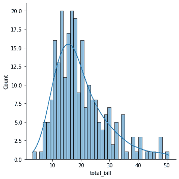

# 附录二：练习使用 Python 数据库

在 [*第二章*](B18333_02.xhtml#_idTextAnchor054) 、*掌握 Python 编程*中，我们介绍了 Python 数据库，包括 NumPy、Pandas、Matpotlib 和 Seaborn。在本附录中，我们将通过在 Google Colab 平台([colab.research.google.com](http://colab.research.google.com))上练习使用这些库来继续学习。

通过一步一步的方法，我们将展示如何使用这些库来管理和可视化数据。对于 NumPy 库，我们将讨论如何生成和操作 NumPy 数组。对于 Pandas 库，我们将介绍包括系列、数据帧、缺失数据处理、分组和操作在内的特性。对于 Matpotlib 和 Seaborn 库，我们将通过探索多个数据可视化示例来展示它们的特性。

遵循这些例子，并确保你理解每一个例子。在 Google Colab 上练习每个例子会产生最好的结果。

# NumPy

NumPy 是 Python 的一个库，增加了对大型多维数组和矩阵的支持，以及对这些数组进行操作的大量高级数学函数。

在本节中，我们将讨论以下主题:

*   生成 NumPy 数组
*   操作 NumPy 阵列

我们将从如何生成 NumPy 数组开始。

## 生成 NumPy 数组

在这一节中，我们将演示创建 NumPy 数组的各种方法。数组可能是一维的，也可能是二维的。

让我们使用下面的代码将一个列表转换成一维数组(第一行导入 NumPy 库和，并给它赋予别名`np`):

```
import numpy as np

my_list = [1,2,3]

my_list

[1, 2, 3]

import numpy as np

my_list = [1,2,3]

arr = np.array(my_list)

arr

array([1, 2, 3])
```

现在，让用下面的代码让我们的列表稍微复杂一点:

```
import numpy as np

my_mat =[[10,20,30],[40,50,60],[70,80,90]]

np.array(my_mat)

array([[10, 20, 30],

 [40, 50, 60],

 [70, 80, 90]])
```

请注意，有两组括号表示二维数组。

NumPy 中的一个基本功能是`arange()`，在这里可以提供开始和停止值。例如，`0`为起始值，`10`为终止值，`np.arange()`会生成一个一维数组，数组中的值从`0`到`10`(不包括函数中提供的最后一个值):

```
import numpy as np

np.arange(0,10)

array([0, 1, 2, 3, 4, 5, 6, 7, 8, 9])
```

让我们使用带有其他值/参数的相同函数。在下面的例子中，我们添加了一个名为**步长**的附加参数来创建一个偶数的一维数组:

```
import numpy as np

np.arange(0,11,2)

array([ 0, 2, 4, 6, 8, 10])
```

`arange`函数中第一个参数是`start`值，第二个是`stop`值，最后一个是步长。

NumPy 的另一个内置函数是生成一个全零的数组。我们需要为参数提供我们希望在数组中生成多少个零，如下面的代码片段所示:

```
import numpy as np

np.zeros(5)

array([0., 0., 0., 0., 0.])
```

您还可以提供一个元组作为参数:

```
import numpy as np

np.zeros((4,4))

array([[0., 0., 0., 0.],

 [0., 0., 0., 0.],

 [0., 0., 0., 0.],

 [0., 0., 0., 0.]])
```

类似地，如果我们需要生成一个纯 1 的数组，我们可以使用`ones`函数并提供一个数字作为参数，如下所示:

```
import numpy as np

np.ones((3,4))

array([[1., 1., 1., 1.],

 [1., 1., 1., 1.],

 [1., 1., 1., 1.]])
```

另一个有用的内置函数是`linspace`，在这里我们输入参数作为第一个数字和最后一个数字，在指定的区间内均匀分布。记住，`arange`函数返回起点和终点之间的所有整数，但是`linspace`接受第三个参数，即我们想要的点数:

```
import numpy as np

np.linspace(0,5,10)

array([0\.        , 0.55555556, 1.11111111, 1.66666667, 2.22222222,

 2.77777778, 3.33333333, 3.88888889, 4.44444444, 5\.        ])
```

在之前的例子中，有一个一维数组(用单括号指定)，在`0`和`5`之间有 10 个均匀间隔的点:

```
import numpy as np

np.linspace(0,5,25)

array([0\.        , 0.20833333, 0.41666667, 0.625     , 0.83333333,

 1.04166667, 1.25      , 1.45833333, 1.66666667, 1.875     ,

 2.08333333, 2.29166667, 2.5       , 2.70833333, 2.91666667,

 3.125     , 3.33333333, 3.54166667, 3.75      , 3.95833333,

 4.16666667, 4.375     , 4.58333333, 4.79166667, 5.
```

请注意，使用具有不同空间点的相同示例(`25`)，数组看起来像二维数组，但它是一维的，通过数组前面只有一个括号来证明。

如果你在处理线性代数问题，它基本上是一个二维方阵(行数和列数相同)，其中我们有一个 1 的对角线，其他都是 0。这就是为什么它采用一个位数作为参数:

```
import numpy as np

np.eye(5)

array([[1., 0., 0., 0., 0.],

 [0., 1., 0., 0., 0.],

 [0., 0., 1., 0., 0.],

 [0., 0., 0., 1., 0.],

 [0., 0., 0., 0., 1.]])
```

此处将使用的最常用函数之一生成一个包含随机数的数组，如下所示:

```
import numpy as np

np.random.rand(4,5)

array([[0.44698983, 0.46938684, 0.66609426, 0.95168835, 0.48775195],

 [0.17627195, 0.98549358, 0.69526343, 0.44981183, 0.11574242],

 [0.09377203, 0.35856856, 0.38228733, 0.6129268 , 0.16385609],

 [0.79041234, 0.9281485 , 0.72570369, 0.46438003, 0.3159711 ]])
```

如果我们需要从标准正态分布返回，而不是`rand`，我们可以使用`randn`函数:

```
import numpy as np

np.random.randn(4)

array([ 1.57461921, -1.47658163, 0.38070033, -1.43224982])
```

另一个函数是`randint`，它返回最低和最高整数值之间的随机单个整数，作为参数提供(最低包含值和最高排除值):

```
import numpy as np

np.random.randint(1,100)

29
```

如果我们需要一个特定数量的随机整数在提供的区间内，我们需要提供第三个参数:

```
import numpy as np

np.random.randint(1,100,10)

array([29, 7, 33, 85, 83, 34, 5, 50, 53, 39])
```

现在，让我们做一些转换。在下面的例子中，我们已经生成了一个包含 25 个值的一维数组，将其保存在一个`array`变量中，然后将其重塑为一个二维数组:

```
import numpy as np

array = np.arange(25)

array

array([ 0, 1, 2, 3, 4, 5, 6, 7, 8, 9, 10, 11, 12, 13, 14, 15, 16, 17, 18, 19, 20, 21, 22, 23, 24])

array.reshape(5,5)

array([[ 0,  1,  2,  3,  4],

 [ 5,  6,  7,  8,  9],

 [10, 11, 12, 13, 14],

 [15, 16, 17, 18, 19],

 [20, 21, 22, 23, 24]])
```

如果我们想得到随机生成的数组中的最大值或最小值，可以分别使用`array.max()`或`array.min()`函数:

```
import numpy as np

array = np.random.randint(0,50,10)

array

array([ 2, 8, 31, 2, 25, 34, 49, 8, 49, 42])

array.max()

49

array.min()

2
```

如果我们想让从前面例子提供的数组中选取一个值(或一组值),我们可以用括号指定，如下所示:

```
import numpy as np

array = np.random.randint(0,50,10)

array

array([42, 38, 43, 22, 39, 4, 20, 30, 49, 13])

array[3]

22

array[0:4]

array([42, 38, 43, 22])
```

如果我们想要替换数组中的单个值或一组值，我们需要如下所示设置这些值:

```
import numpy as np

array = np.random.randint(0,50,100)

array

array([42, 10, 14, 34, 45, 18, 21, 11, 33, 32, 22, 13, 11, 42, 16, 20, 10,

 1, 36, 41, 45, 21, 45, 45, 41,  0, 38, 39, 16, 10, 18, 45, 43, 42,

 23, 31, 20, 14,  9, 46, 44, 33, 24, 35,  6,  6, 26, 13, 20, 20, 28,

 23, 46, 40, 15, 43, 17, 31, 15, 48,  9, 17, 46, 28, 48, 41, 30, 28,

 32, 40, 35,  8, 10,  5, 33, 30,  4, 38, 47, 22, 13, 14, 29,  1, 15,

 48, 18, 48, 18, 21, 45,  9,  6,  1, 31, 28,  5, 42,  8, 28])

array[0:3] = 100

array

array([100, 100, 100,  34,  45,  18,  21,  11,  33,  32,  22,  13,  11,

 42,  16,  20,  10,   1,  36,  41,  45,  21,  45,  45,  41,   0,

 38,  39,  16,  10,  18,  45,  43,  42,  23,  31,  20,  14,   9,

 46,  44,  33,  24,  35,   6,   6,  26,  13,  20,  20,  28,  23,

 46,  40,  15,  43,  17,  31,  15,  48,   9,  17,  46,  28,  48,

 41,  30,  28,  32,  40,  35,   8,  10,   5,  33,  30,   4,  38,

 47,  22,  13,  14,  29,   1,  15,  48,  18,  48,  18,  21,  45,

 9,   6,   1,  31,  28,   5,  42,   8,  28])
```

正如您所见，`0`、`1`和`2`索引中的值被替换为`100`的值。

## 操作 NumPy 数组

现在，我们更深入一点，使用二维数组。在下面的例子中，我们生成了一个包含 25 个随机数的数组，并将其重塑为一个二维数组。然后，它显示一个值，该值位于第 1 行第 1 列:

```
import numpy as np

array = np.random.randint(0,50,25).reshape(5,5)

array

array([[15, 21, 34, 39, 18],

 [42, 41, 28, 24,  2],

 [43, 25, 38, 42, 35],

 [ 3,  4, 27,  2, 49],

 [17,  5, 33, 11, 30]])

array[0:3]

array([[15, 21, 34, 39, 18],

 [42, 41, 28, 24,  2],

 [43, 25, 38, 42, 35]])
```

以下是根据特定条件返回数组的布尔值(`True`或`False`)的函数:

```
import numpy as np

array = np.random.randint(0,50,25).reshape(5,5)

array

array([[47, 25,  1, 33,  7],

       [31, 18,  9, 13, 41],

       [28, 33, 34, 19,  2],

       [ 1, 32, 45, 34, 48],

       [27, 34, 38, 18,  9]])

array > 25

array([[ True, False, False,  True, False],

 [ True, False, False, False,  True],

 [ True,  True,  True, False, False],

 [False,  True,  True,  True,  True],

 [ True,  True,  True, False, False]])
```

我们还可以对数组应用一些数学运算，比如加法、减法、乘法和除法运算，以及应用一些函数，比如`sin`、`cos`和`log`:

```
import numpy as np

array = np.arange(10)

array

array([0, 1, 2, 3, 4, 5, 6, 7, 8, 9])

array + array

array([ 0, 2, 4, 6, 8, 10, 12, 14, 16, 18])

array * 2

array([ 0, 2, 4, 6, 8, 10, 12, 14, 16, 18])

np.sin(array)

array([ 0\.        ,  0.84147098,  0.90929743,  0.14112001, -0.7568025 ,

 -0.95892427, -0.2794155 ,  0.6569866 ,  0.98935825,  0.41211849])
```

我们已经展示了一些使用 NumPy 库的例子；有关该库的更多信息，请参考[https://numpy.org/](https://numpy.org/)。

# 熊猫

Pandas 是一个构建在 NumPy 之上的开源库。Pandas 允许快速数据分析和数据准备。它在性能和生产力方面表现出色。

在本节中，我们将讨论以下主题:

*   系列
*   数据帧
*   缺失数据处理
*   分组依据
*   操作

根据环境的不同，您可能需要首先通过命令行或终端运行以下命令来安装 Pandas:

```
conda install pandas
pip install pandas
```

我们将从查看 Series 数据类型开始。

## 系列

Series 是我们将在 Pandas 中使用的第一个主要数据类型。系列几乎与 NumPy 数组相同。不同之处在于，对于系列，一系列轴标签可以由一个标签来索引。

我们将制作四个不同的 Python 对象并形成一个列表:

```
import numpy as np

import pandas as pd

labels = ['A', 'B','C']

my_data = [100,200,300]

array = np.array(my_data)

d = {'A':100, 'B':200, 'C':300}

pd.Series(data = my_data)

A    100

B    200

C    300

dtype: int64
```

默认情况下，如果我们不指定索引值，它将分配`0, 1, 2, ….`因此，我们可以将这些标签更改为我们之前创建的标签(`labels`):

```
pd.Series(my_data, labels)

A    100

B    200

C    300

dtype: int64
```

如果您想提供一个系列中的字典，您不需要提供索引，因为字典已经有了它的键和值:

```
pd.Series(d)

A    100

B    200

C    300

dtype: int64
```

系列可以包含任何数据类型，我们也可以提供标签:

```
pd.Series(labels, my_data)

100    A

200    B

300    C

dtype: object

Next we will examine Dataframes.
```

## 数据帧

DataFrame 是一个带有不同类型列的二维标签数据结构。在这一节中，我们将开始使用 Pandas 构建我们的第一个数据框架。在下面的例子中，我们创建了一个由 NumPy 生成的随机数，并构建了一个带有熊猫标签(行和列)的漂亮视图:

```
import numpy as np

import pandas as pd 

from numpy.random import randn

np.random.seed(101)

df = pd.DataFrame(randn(5,4),['a','b','c','d','e'],['x','y','z','t'])

df

 x         y          z         t

a     2.706850  0.628133    0.907969  0.503826

b     0.651118  -0.319318  -0.848077  0.605965

c     -2.018168  0.740122    0.528813 -0.589001

d     0.188695  -0.758872  -0.933237  0.955057

e     0.190794  1.978757    2.605967  0.683509
```

如果要显示数据帧的特定行，请在括号中指定该行的名称:

```
df['x']

a    2.706850

b    0.651118

c   -2.018168

d    0.188695

e    0.190794

Name: x, dtype: float64
```

注意输出是一个系列，我们之前已经介绍过。如果您想要检查输出的类型，使用`type`语法，如下所示:

```
type(df['x']) 

pandas.core.series.Series
```

如果要显示数据框架中的多列，可以在括号中将其指定为列表:

```
df[['x','y']]

 x         y

a     2.706850    0.628133

b     0.651118   -0.319318

c    -2.018168    0.740122

d    0.188695    -0.758872

e    0.190794     1.978757
```

DataFrame 的另一个特性是能够向它添加新列。当添加新列时，我们需要指定新列的值。在下面的例子中，我们正在创建一个新列`new`，我们将对`x`和`y`中的所有值求和，并将它们添加到该列中:

```
df['new'] = df['x'] + df['y']

df

 x            y         z        t         new

a    2.706850    0.628133  0.907969   0.503826   3.334983

b    0.651118   -0.319318  -0.848077  0.605965   0.331800

c    -2.018168   0.740122  0.528813  -0.589001   -1.278046

d     0.188695  -0.758872  -0.933237  0.955057   -0.570177

e   0.190794    1.978757    2.605967   0.683509  2.169552
```

如果您想要删除特定的列或行，您可以使用内置的`drop`功能:

```
df.drop('new', axis=1)

 x           y          z        t

a     2.706850   0.628133   0.907969   0.503826

b     0.651118   -0.319318  -0.848077  0.605965

c     -2.018168  0.740122   0.528813   -0.589001

d     0.188695   -0.758872  -0.933237  0.955057

e     0.190794    1.978757   2.605967  0.683509
```

如果需要从特定的行获得输出，可以使用代表`location`的`loc`语法，并且需要指定一个行名作为参数:

```
df

         x         y           z          t        new

a    2.706850   0.628133   0.907969   0.503826   3.334983

b    0.651118   -0.319318  -0.848077  0.605965   0.331800

c    -2.018168  0.740122   0.528813  -0.589001   -1.278046

d    0.188695   -0.758872  -0.933237  0.955057   -0.570177

e    0.190794   1.978757   2.605967   0.683509   2.169552

df.loc['a']

x      2.706850

y      0.628133

z      0.907969

t      0.503826

new    3.334983

Name: a, dtype: float64
```

有条件的选择也是 Pandas 的一个特性，你可以在 DataFrame 中调用数据作为一个布尔值(`True`或`False`):

```
df 

 x           y         z          t         new

a   2.706850   0.628133    0.907969   0.503826   3.334983

b   0.651118   -0.319318   -0.848077  0.605965   0.331800

c   -2.018168   0.740122   0.528813   0.589001   -1.278046

d   0.188695   -0.758872   -0.933237  0.955057   -0.570177

e   0.190794   1.978757    2.605967   0.683509   2.169552

df > 0

       x      y     z      t     new

a    True   True   True   True   True

b    True   False  False  True   True

c    False  True   True   False  False

d    True   False  False  True   False

e    True   True   True   True   True 
```

## 缺失数据处理

在我们之前创建的 DataFrame 中，如果我们应用一些条件(比如大于零)，小于零的数据将显示为`NaN`(空数据)。如果您只需要显示没有`null`数据的行和列，使用`dropna`语法，如下所示:

```
df

 x         y          z          t        new

a    2.706850   0.628133   0.907969   0.503826   3.334983

b    0.651118   -0.319318  -0.848077  0.605965   0.331800

c    -2.018168   0.740122  0.528813  -0.589001   -1.278046

d    0.188695   -0.758872  -0.933237  0.955057   -0.570177

e    0.190794   1.978757   2.605967   0.683509    2.169552

df[df > 0].dropna()

 x           y        z           t         new

a     2.706850   0.628133  0.907969   0.503826   3.334983

e     0.190794   1.978757  2.605967   0.683509   2.169552
```

现在，我们将应用一个条件，并用大于零的值保存一个新的数据帧(`new_df`)，如下所示:

```
new_df = df[df > 0]

new_df

 x         y           z         t        new

a    2.706850   0.628133   0.907969   0.503826  3.334983

b    0.651118      NaN        NaN     0.605965  0.331800

c       NaN     0.740122   0.528813    NaN         NaN

d    0.188695      NaN       NaN      0.955057     NaN

e    0.190794   1.978757    2.605967  0.683509  2.169552
```

对于没有任何值(`NaN`)的单元格，我们将用该列中所有值的平均值来替换它们:

```
new_df['x'].fillna(value=new_df['x'].mean())

a    2.706850

b    0.651118

c    0.934364

d    0.188695

e    0.190794

Name: x, dtype: float64
```

注意在`x`列和`c`行中的值不为空，而是用一个值替换。

## 分组依据

GroupBy 允许您根据列将行分组，并对它们执行聚合函数。

在下一个示例中，我们将使用字典创建一个新的数据帧，如下所示:

```
import numpy as np

import pandas as pd

data = {'Country': ['USA', 'USA', 'France', 'France','Germany','Germany'],

        'Person': ['Sam','Amy','Carhile','Richard','John','Frank'],

        'Sales': [250, 300, 125, 500, 350, 200]}

df = pd.DataFrame(data)

df

 Country    Person     Sales

0    USA        Sam       250

1    USA        Amy       300

2    France     Carhile   125

3    France     Richard   500

4    Germany    John      350

5    Germany    Frank     200
```

如果您正在处理一个大型数据框架，并且想要打印每个国家的销售额总和，请使用`groupby`内置函数，如下所示:

```
df.groupby('Country').sum()

Country    Sales

France     625

Germany    550

USA        550
```

## 操作

在这个部分，我们将展示一些现实生活中的数据操作。在接下来的示例中，我们将使用一个 CSV 文件`Salaries.csv`(取自[https://www.kaggle.com/kaggle/sf-salaries?select = salary . CSV](https://www.kaggle.com/kaggle/sf-salaries?select=Salaries.csv))。

将文件下载到本地计算机并上传到 Google Colab 后，您可以可视化数据框架并使用 Pandas 库浏览数据。

使用`read_csv`功能读取 CSV 文件，如下所示:

```
import pandas as pd

df = pd.read_csv('Salaries.csv')

df
```


```
df.info()

<class 'pandas.core.frame.DataFrame'>

RangeIndex: 148654 entries, 0 to 148653

Data columns (total 13 columns):

#   Column            Non-Null Count   Dtype 

---  ------            --------------   ----- 

0   Id                148654 non-null  int64 

1   EmployeeName      148654 non-null  object 

2   JobTitle          148654 non-null  object 

3   BasePay           148049 non-null  object 

4   OvertimePay       148654 non-null  object 

5   OtherPay          148654 non-null  object 

6   Benefits          112495 non-null  object 

7   TotalPay          148654 non-null  float64

8   TotalPayBenefits  148654 non-null  float64

9   Year              148654 non-null  int64 

10  Notes             0 non-null       float64

11  Agency            148654 non-null  object 

12  Status            38119 non-null   object 

dtypes: float64(3), int64(2), object(8)

memory usage: 14.7+ MB

df["TotalPay"].mean()

74768.32197169267

df[df["EmployeeName"] == "Joseph Driscoll"]["JobTitle"]

36198    Captain, Fire Suppression

Name: JobTitle, dtype: object
```

在前面的小节中，我们已经展示了 Pandas 库的基本特性。关于熊猫特征的更多信息，请参见 https://pandas.pydata.org。

# Matplotlib

Matplotlib 是 Python 中数据可视化的基本库之一。这是一个优秀的二维和三维图形库，用于生成科学图形。

Matplotlib 的一些主要优点如下:

*   一般容易从简单的情节开始
*   支持自定义标签和文本
*   对图形中每个元素的出色控制
*   多种格式的高质量输出
*   大体上非常可定制

我们将从 NumPy 库生成的简单数据开始:

```
import matplotlib.pyplot as plt

import numpy as np

a = np.linspace(1,10,15)

a

array([ 1\.        ,  1.64285714,  2.28571429,  2.92857143,  3.57142857,

 4.21428571,  4.85714286,  5.5       ,  6.14285714,  6.78571429,

 7.42857143,  8.07142857,  8.71428571,  9.35714286, 10.
```

我们已经使用 NumPy 库中的`linspace`函数生成了数据。我们还可以处理所有的数据(在我们的例子中，它是一个数组)，比如取数组中的每个数字，然后平方它:

```
b = a ** 2

b

array([  1\.        ,   2.69897959,   5.2244898 ,   8.57653061,

 12.75510204,  17.76020408,  23.59183673,  30.25      ,

 37.73469388,  46.04591837,  55.18367347,  65.14795918,

 75.93877551,  87.55612245, 100\.        ])
```

我们可以用 Matplotlib 中的一个简单函数将数据绘制成图表:

```
plt.plot(a,b)
```


您可以用`a`和`b`值重新排列`x`和`y`轴，如下图所示:

```
plt.subplot(1,2,1) 

plt.plot(a,b)

plt.title("Dito training 1")

plt.subplot(1,2,2)

plt.plot(b,a,"r")

plt.title("Dito training 2")
```


到目前为止，我们已经演示了如何使用`plot`和`subplot`方法绘图。现在，我们将深入面向对象的方法，在这里我们将对进行分解，这是对`matplotlib`面向对象 API 方法的更正式的介绍。在下面的例子中，我们运行了一个内置的`figure`函数，它构建了一个假想的空白画布，稍后，我们将向这个画布添加一个集合，这样它将更加灵活地工作:

```
import matplotlib.pyplot as plt

fig = plt.figure()

<Figure size 432x288 with 0 Axes>

import matplotlib.pyplot as plt

fig = plt.figure()

axes = fig.add_axes([0.1,0.1,0.8,0.8])
```


第一步是使用`add_axes`函数向画布添加轴。括号中的数字代表轴的左侧、按钮、宽度和高度。

每个数字应该在零和一之间，代表一个百分比，数字表示:

*   第一个数字(0.1)代表画布左侧的 10%。
*   第二个数字(0.1)代表倒数第 10%。
*   第三个数字(0.8)表示轴占画布的百分比(宽度)。
*   第四个数字(0.8)表示轴占画布的百分比(高度)。

在前面的例子中，我们使用 NumPy 生成了`a`和`b`值，并使用面向对象的方法在我们的自定义画布/轴中绘制它们，这给了我们更多的控制。使用一些其他函数，我们可以为每个轴和标题设置名称，如下所示:

```
import matplotlib.pyplot as plt

import numpy as np

a = np.linspace(1,10,15)

b = a ** 2

fig = plt.figure()

axes = fig.add_axes([0.1,0.1,0.8,0.8])

axes.plot(a,b)
```


现在，让我们将两组数字放在同一块画布上:

```
import matplotlib.pyplot as plt

import numpy as np

a = np.linspace(1,10,15)

b = a ** 2

fig = plt.figure()

axes1 = fig.add_axes([0.1,0.1,0.8,0.8])

axes2 = fig.add_axes([0.2,0.5,0.4,0.3])

axes1.plot(a,b)

axes2.plot(b,a)

axes1.set_xlabel("X1 Label")

axes1.set_ylabel("Y1 Label")

axes1.set_title("Title 1")

axes2.set_xlabel("X2 Label")

axes2.set_ylabel("Y2 Label")

axes2.set_title("Title 2")
```


在下一个例子中，我们在同一个图中绘制了两个集合，并使用`label`和`legend`方法添加了一些标签:

```
import matplotlib.pyplot as plt

import numpy as np

a = np.linspace(1,10,15)

b = a ** 2

fig = plt.figure()

ax = fig.add_axes([0,0,1,1])

ax.plot(a, a**2, label = 'a squared')

ax.plot(a, a**3, label = 'a cubed')

ax.legend()
```


我们已经展示了一些使用 Matplotlib 库的例子；更多详细信息，请参考[https://matplotlib.org](https://matplotlib.org)。

# 海风

Seaborn 是建立在 Matplotlib 库之上的统计库，我们所学的所有 Matplotlib 知识都可以应用到 Seaborn 上。

我们将从一个简单的导入库开始。Seaborn 的一个有用特性是它内置的数据集。在我们的例子中，我们将使用`tips`数据集:

```
import seaborn as sns

tips = sns.load_dataset('tips')

tips.head()
```

您还可以使用`.info()`函数通过检查一些其他的细节(比如列数和行数，以及数据类型)，如下所示:

```
    total_bill   tip    sex    smoker  day    time    size

0   16.99       1.01    Female   No    Sun   Dinner    2

1   10.34       1.66    Male     No    Sun   Dinner    3

2   21.01       3.50    Male     No    Sun   Dinner    3

3   23.68       3.31    Male     No    Sun   Dinner    2

4   24.59       3.61    Female   No    Sun   Dinner    4

tips.info()

<class 'pandas.core.frame.DataFrame'>

RangeIndex: 244 entries, 0 to 243

Data columns (total 7 columns):

#   Column      Non-Null Count  Dtype   

---  ------      --------------  -----   

0   total_bill  244 non-null    float64 

1   tip         244 non-null    float64 

2   sex         244 non-null    category

3   smoker      244 non-null    category

4   day         244 non-null    category

5   time        244 non-null    category

6   size        244 non-null    int64 

dtypes: category(4), float64(2), int64(1)

memory usage: 7.4 KB
```

这里的例子显示了一个非常基本的直方图，其中我们将数据集名称设置为`tips`和`total_bill`数据(数据集的一列):

```
sns.displot(tips['total_bill']) 
```


```
sns.displot(tips['total_bill'], kde=True, bins = 40)
```



之前描述的`displot`函数有不同的参数，你可以设置这些参数来修改你的图形/直方图。注意，我们已经输入了两个参数，`kde`和`bins`。

接下来，我们将使用`jointplot`函数探索不同类型的图形。您需要提供`x`值、`y`值和数据名称作为参数，如下所示:

```
sns.jointplot('total_bill', 'tip', data=tips)
```


注意，我们提供的参数(`total_bill`和`tips`)来自我们导入的数据，它们是列名。这是一个双分布图，在两者之间，我们有一个散点图。随着账单值在图上增加，小费值也增加。`jointplot`也有其他参数可以帮助你修改图形(默认情况下，它是散点图，但是你也可以传递十六进制参数)，如下所示:

```
sns.jointplot('total_bill', 'tip', data=tips, kind = 'hex')
```


我们将介绍的下一个 Seaborn 特性/功能是盒图和小提琴图。这些类型的图用于显示分类数据的分布。它们以一种便于变量之间比较的方式显示定量数据的分布:

```
sns.boxplot(x='day', y='total_bill', data=tips)
```


与箱线图不同，violin 图允许您实际绘制与实际数据点对应的所有组件，它本质上显示了基础分布的核密度估计:

```
sns.violinplot(x='day', y='total_bill', data=tips)
```


通过向`violinplot`函数添加更多参数，您可以向图表添加不同的特性和细节，如下所示。

```
sns.violinplot(x='day', y='total_bill', data=tips,

               hue = 'sex', split=True)
```


到目前为止，我们已经通过几个例子展示了 Seaborn 库的特性。Python 中有许多使用 Seaborn 库的不同可视化表示。查看 Seaborn 网站([https://seaborn.pydata.org/index.xhtml](https://seaborn.pydata.org/index.xhtml))了解更多详情

# 总结

在本附录中，我们练习使用 Python 数据库，包括 NumPy、Pandas、Matpotlib 和 Seaborn。彻底理解这些例子将有助于你理解数据库和掌握 Python 编程技巧。