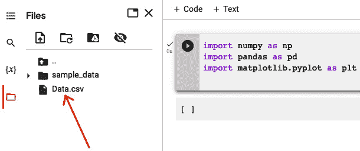

# 附录 3:使用 Scikit 练习-学习

在 [*第三章*](B18333_03.xhtml#_idTextAnchor072) 、*准备 ML 开发*和 [*第四章*](B18333_04.xhtml#_idTextAnchor094) 、*开发和部署 ML 模型*中，我们讨论了数据准备和 ML 模型开发流程。在本附录中，我们将通过在 Google 协作平台([colab.research.google.com](http://colab.research.google.com))上练习使用 scikit-learn 包来继续学习 ML 建模技巧。

通过一步一步的方法，我们将向您展示如何利用 scikit-learn 库开发 ML 模型。我们将涵盖以下实践:

*   数据准备
*   回归
*   分类

最佳实践是遵循这些示例，并确保您理解其中的每一个示例。在 Google Colab 上练习每个例子会产生最好的结果。

# 数据准备

在前几章中，我们讨论了用于处理和可视化数据的 Python 库，如 NumPy、Pandas、Matplotlib 和 Seaborn。让我们从简单地导入库开始:

```
import numpy as np

import pandas as pd

import matplotlib.pyplot as plt
```

我们将使用一个只有 4 列 10 行的简单数据集。


请注意，有些列是分类的，有些是数字的，其中有些缺少值，我们需要修复。数据集`.csv`文件被上传到 Google Colab。



使用`pandas`库和`read_csv`函数，我们读取数据并将其保存到变量数据集中，分配前三列(`X`，并将最后一列数据集分配给`y`，如预测:

```
dataset = pd.read_csv('Data.csv')

X = dataset.iloc[:,:-1].values

y = dataset.iloc[:, -1].values

print(X)

[['France' 44.0 72000.0]

['Spain' 27.0 48000.0]

['Germany' 30.0 54000.0]

['Spain' 38.0 61000.0]

['Germany' 40.0 nan]

['France' 35.0 58000.0]

['Spain' nan 52000.0]

['France' 48.0 79000.0]

['Germany' 50.0 83000.0]

['France' 37.0 67000.0]]
```

请注意，它有一些丢失的值。在 ML 训练过程中，我们需要最小化缺失值的数量，因此您可以删除包含缺失数据单元格的行，或者用输入值替换缺失值，例如，该列中所有值的平均值。以下示例是用该特定列的平均值填充缺失值:

```
from sklearn.impute import SimpleImputer

imputer = SimpleImputer(missing_values=np.nan, strategy='mean')

imputer.fit(X[:, 1:3])

X[:, 1:3] = imputer.transform(X[:,1:3])

print(X)

[['France' 44.0 72000.0]

['Spain' 27.0 48000.0]

['Germany' 30.0 54000.0]

['Spain' 38.0 61000.0]

['Germany' 40.0 63777.77777777778]

['France' 35.0 58000.0]

['Spain' 38.77777777777778 52000.0]

['France' 48.0 79000.0]

['Germany' 50.0 83000.0]

['France' 37.0 67000.0]]
```

下一步是将分类值转换成数值。在我们加载的数据集(`‘data.cvs’`)中，列的名称是`Country`，它有三个不同的值(`France`、`Spain`和`Germany`)。我们将使用 one-hot 编码将其转换为三列二进制值:

```
from sklearn.compose import ColumnTransformer

from sklearn.preprocessing import OneHotEncoder

ct = ColumnTransformer(transformers=[('encoder', OneHotEncoder(), [0])],

remainder = 'passthrough')

X = np.array(ct.fit_transform(X))

print(X)

[[1.0 0.0 0.0 44.0 72000.0]

[0.0 0.0 1.0 27.0 48000.0]

[0.0 1.0 0.0 30.0 54000.0]

[0.0 0.0 1.0 38.0 61000.0]

[0.0 1.0 0.0 40.0 63777.77777777778]

[1.0 0.0 0.0 35.0 58000.0]

[0.0 0.0 1.0 38.77777777777778 52000.0]

[1.0 0.0 0.0 48.0 79000.0]

[0.0 1.0 0.0 50.0 83000.0]

[1.0 0.0 0.0 37.0 67000.0]]
```

我们还需要将数据集的最后一列(其中值仅为`Yes`或`No`)编码为 0 和 1:

```
from sklearn.preprocessing import LabelEncoder

le = LabelEncoder()

y = le.fit_transform(y)

print(y)

[0 1 0 0 1 1 0 1 0 1]
```

下一步是将它们分成训练和测试数据集:

```
from sklearn.model_selection import train_test_split

X_train, X_test, y_train, y_test = train_test_split(X, y , test_size = 0.2, random_state = 1)

print(X_train)

[[0.0 0.0 1.0 38.77777777777778 52000.0]

[0.0 1.0 0.0 40.0 63777.77777777778]

[1.0 0.0 0.0 44.0 72000.0]

[0.0 0.0 1.0 38.0 61000.0]

[0.0 0.0 1.0 27.0 48000.0]

[1.0 0.0 0.0 48.0 79000.0]

[0.0 1.0 0.0 50.0 83000.0]

[1.0 0.0 0.0 35.0 58000.0]]

print(X_test)

[[0.0 1.0 0.0 30.0 54000.0]

[1.0 0.0 0.0 37.0 67000.0]]

print(y_train)

[0 1 0 0 1 1 0 1]

print(y_test)

[0 1]
```

现在我们已经练习了基本的数据处理技能，让我们在开始训练 ML 模型之前进入特征缩放。有两种类型的特征缩放:标准化和规范化。目标是使特性的所有值都在同一范围内。让我们检查一下训练数据:


我们发现前三行是先前编码的，因此我们将仅对第 4 行和第 5 行应用特征缩放:

```
from sklearn.preprocessing import StandardScaler

sc  = StandardScaler()

X_train[:, 3:] = sc.fit_transform(X_train[:, 3:])

X_test[:, 3:] = sc.transform(X_test[:, 3:])

print(X_train)

[[0.0 0.0 1.0 -0.1915918438457856 -1.0781259408412427]

[0.0 1.0 0.0 -0.014117293757057902 -0.07013167641635401]

[1.0 0.0 0.0 0.5667085065333239 0.6335624327104546]

[0.0 0.0 1.0 -0.3045301939022488 -0.30786617274297895]

[0.0 0.0 1.0 -1.901801144700799 -1.4204636155515822]

[1.0 0.0 0.0 1.1475343068237056 1.2326533634535488]

[0.0 1.0 0.0 1.4379472069688966 1.5749910381638883]

[1.0 0.0 0.0 -0.7401495441200352 -0.5646194287757336]]
```

注意`X_train`的结果在-2 和+2 之间(非常短的范围)。

# 回归

现在我们已经分割了数据集并转换了数据，我们将向您展示如何使用 scikit-learn 库来构建 ML 模型。我们将从回归开始，并向您展示以下示例:

*   简单线性回归
*   多元线性回归
*   多项式/非线性回归

## 简单线性回归

首要任务首先，我们需要准备数据集:

```
import numpy as pd

import pandas as pd

import matplotlib.pyplot as plt

dataset = pd.read_csv('Salary_Data.csv')

X = dataset.iloc[:,:-1].values

y = dataset.iloc[:, -1].values

from sklearn.model_selection import train_test_split

X_train, X_test, y_train, y_test = train_test_split(X, y , test_size = 0.2, random_state = 1)
```

现在我们可以开始训练我们的回归模型了。我们需要导入一个类并输入我们的训练数据:

```
from sklearn.linear_model import LinearRegression

regressor = LinearRegression()

regressor.fit(X_train, y_train)
```

接下来，我们将预测测试集中的观察结果:

```
y_pred = regressor.predict(X_test)
```

让我们把我们的预测和真实数据画出来，看看它们有多接近:

```
plt.scatter(X_train, y_train, color = 'red')

plt.plot(X_train, regressor.predict(X_train), color='blue')

plt.title("Salary vs Experiment (Training Set")

plt.xlabel("Years of Experience")

plt.ylabel("Salary")

plt.show()
```


```
plt.scatter(X_test, y_test, color = 'red')

plt.plot(X_train, regressor.predict(X_train), color='blue')

plt.title("Salary vs Experiment (Training Set")

plt.xlabel("Years of Experience")

plt.ylabel("Salary")

plt.show()
```


如您所见，简单线性回归模型与的数据集非常吻合。

## 多元线性回归

在本节中，我们将使用另一个数据集，它有多个列作为数据特征，一个列用于预测值:


首先，我们执行数据准备:

1.  导入必要的库和/或类。
2.  将数据集分为`X`(特征)和`y`(预测)。
3.  对列索引 3 进行编码(州名已被转换为二进制值并保存为三个附加列)。
4.  将数据分为培训和测试:

```
import numpy as np

import pandas as pd

import matplotlib.pyplot as plt

dataset = pd.read_csv('50_Startups.csv')

X = dataset.iloc[:,:-1].values

y = dataset.iloc[:, -1].values

from sklearn.compose import ColumnTransformer

from sklearn.preprocessing import OneHotEncoder

ct = ColumnTransformer(transformers=[('encoder', OneHotEncoder(), [3])], remainder='passthrough')

X = np.array(ct.fit_transform(X))

from sklearn.model_selection import train_test_split

X_train, X_test, y_train, y_test = train_test_split(X, y , test_size = 0.2, random_state=1)
```

我们现在可以开始训练我们的模型了:

```
from sklearn.linear_model import LinearRegression

regressor = LinearRegression()

regressor.fit(X_train, y_train)
```

现在是验证/测试我们模型的时候了。我们不能像在简单线性回归中那样将可视化，因为我们有四个不同的特征，并且不能在五维图中绘制它们。然而，我们可以显示两个向量:测试集中的*实际利润*的向量，以及*预测利润*的向量:

```
y_pred = regressor.predict(X_test)

np.set_printoptions(precision=2)

print(np.concatenate((y_pred.reshape(len(y_pred),1), y_test.reshape(len(y_test),1)),1))

[[114664.42 105008.31]

[ 90593.16  96479.51]

[ 75692.84  78239.91]

[ 70221.89  81229.06]

[179790.26 191050.39]

[171576.92 182901.99]

[ 49753.59  35673.41]

[102276.66 101004.64]

[ 58649.38  49490.75]

[ 98272.03  97483.56]]
```

输出的左边表示预测利润，右边表示实际利润。

## 多项式/非线性回归

在本节中，我们将展示非线性回归的示例，其中目标和特征之间的关系不是线性的，即它是多项式的。我们将使用线性模型和非线性模型，并比较它们与真实数据集的拟合程度。

我们将从数据准备开始:

```
import numpy as np

import pandas as pd 

import matplotlib.pyplot as plt

dataset = pd.read_csv('Position_Salaries.csv')

X = dataset.iloc[:, 1:-1].values

y = dataset.iloc[:, -1].values
```

现在，我们要训练两个模型:线性回归和多项式回归。以下示例显示了两种回归模型:

```
from sklearn.linear_model import LinearRegression

lin_reg = LinearRegression()

lin_reg.fit(X,y)

from sklearn.preprocessing import PolynomialFeatures

poly_reg = PolynomialFeatures(degree = 2)

X_poly = poly_reg.fit_transform(X)

lin_reg_2 = LinearRegression()

lin_reg_2.fit(X_poly, y)
```

接下来，我们将可视化两个回归。

这是线性回归:

```
plt.scatter(X, y, color = 'red')

plt.plot(X, lin_reg.predict(X), color = 'blue')

plt.title("Linear Regression")

plt.xlabel("Position Level")

plt.ylabel("Salary")

plt.show()
```


然后，这是多项式回归:

```
plt.scatter(X, y, color = 'red')

plt.plot(X, lin_reg_2.predict(X_poly), color = 'blue')

plt.title("Linear Regression")

plt.xlabel("Position Level")

plt.ylabel("Salary")

plt.show()
```


正如我们所见，多项式回归(我们使用了`2`的幂)产生了精确的预测。如果我们带着更高的力量去，我们会收获更好的结果。在下面的例子中，我们将把功率改为`4`(见第 2 行)，结果将更好地符合数据集:

```
from sklearn.linear_model import LinearRegression

lin_reg = LinearRegression()

lin_reg.fit(X,y)

from sklearn.preprocessing import PolynomialFeatures

poly_reg = PolynomialFeatures(degree = 4)

X_poly = poly_reg.fit_transform(X)

lin_reg_2 = LinearRegression()

lin_reg_2.fit(X_poly, y)

plt.scatter(X, y, color = 'red')

plt.plot(X, lin_reg_2.predict(X_poly), color = 'blue')

plt.title("Linear Regression")

plt.xlabel("Position Level")

plt.ylabel("Salary")

plt.show()
```


到目前为止，我们已经通过练习简单线性回归、多重线性回归和非线性回归介绍了回归建模过程。在下一节中，我们将讨论分类模型。

# 分类

与预测连续数字的回归不同，您使用分类来预测类别。我们将在这里讨论逻辑回归。

我们将使用 iPhone 购买历史数据的数据集，基于购买者的年龄和工资，来预测新的潜在购买者是否会购买 iPhone。


先做准备:

```
import numpy as np

import pandas as pd

import matplotlib.pyplot as plt

dataset = pd.read_csv('Social_Network_Ads.csv')

X = dataset.iloc[:,:-1].values

y = dataset.iloc[:, -1].values

from sklearn.model_selection import train_test_split

X_train, X_test, y_train, y_test = train_test_split(X, y , test_size = 0.2, random_state=1)

from sklearn.preprocessing import StandardScaler

sc = StandardScaler()

X_train = sc.fit_transform(X_train)

X_test = sc.transform(X_test)

print(X_train)

[[-0.8  -1.19]

[ 0.76 -1.37]

[ 0.85  1.44]

[-0.51 -1.49]

[-1.49  0.38]

[-1.19  0.55]

[ 1.05 -1.04]

[-0.22 -0.3 ]

[ 0.95 -1.34]

[-1.1  -1.07]

[-0.51  1.97]

[ 2.22 -1.01]

[ 1.44 -1.4 ]

[ 0.07 -0.39]

[-1.19  0.64]

[ 2.02 -0.9 ]

[ 1.15  0.58]

[-0.02  0.29]

[-0.22  0.26]

[-0.32 -0.75]

[-1.68 -0.57]

[ 0.85  0.58]

[-0.61 -1.01]

[ 0.95 -1.13]

[-0.22 -0.54]

[ 0.17  0.82]

[-0.41  1.32]

[ 1.15  0.52]

[ 0.76  0.32]

[ 0.66 -0.87]

[ 0.37 -0.27]

[ 0.46 -0.45]

[-0.22  0.14]

[ 0.37  0.11]

[-1\.    0.82]

[-0.71  1.41]

[ 0.37 -0.48]

[ 0.37 -0.48]

[-1.68  0.41]

[ 0.85 -0.81]

[-1\.   -1.1 ]

[...]
```

请注意，所有值都在-3 和+3 之间。

接下来，我们训练逻辑回归模型:

```
from sklearn.linear_model import LogisticRegression

classifier = LogisticRegression()

classifier.fit(X_train, y_train)
```

让我们预测一个新的结果。在运行预测脚本之前，让我们看看我们的原始数据集，并选取一个随机特征集(在我们的例子中，是`30`的年龄和`87000`的薪水)，结果是`0`。

运行预测函数后，结果也是一样的:

```
print(classifier.predict(sc.transform([[30, 87000]])))

[0]
```

以下示例演示了测试数据集的实际结果和预测结果的比较，以便我们可以比较训练模型的准确性/效率:

```
y_pred = classifier.predict(X_test)

print(np.concatenate((y_pred.reshape(len(y_pred),1), y_test.reshape(len(y_test),1)),1))

[[0 0]

[0 0]

[1 1]

[1 1]

[0 0]

[0 0]

[0 0]

[1 1]

[0 0]

[1 0]

[0 0]

[0 0]

[0 0]

[1 1]

[1 1]

[1 1]

[1 1]

[0 0]

[0 0]

[1 1]

[0 0]

[1 1]

[1 1]

[1 0]

[0 1]

[0 0]

[...]]
```

我们在前面的代码中的输出显示了比较结果:第一列是预测值，第二列是真实值。为了计算模型的准确性/效率，我们可以将预测中正确数字的总数除以测试数据集中实际数字的总数，并构建其混淆矩阵:

```
from sklearn.metrics import confusion_matrix, accuracy_score

cm = confusion_matrix(y_test, y_pred)

print(cm)

accuracy_score(y_test, y_pred)

[[41  7]

[ 6 26]]

0.8375
```

输出显示以下内容:

```
TP=41

FP=6

FN=7

TN=26
```

模型的准确率/效率为 83%。

# 总结

在本附录中，我们展示了使用 scikit-learn 库进行数据准备和模型开发(回归和分类)的示例。浏览这些例子并理解过程将有助于你理解 ML 的概念和过程。