# 附录 4

# 用 Google Vertex AI 练习

在 [*第七章*](B18333_07.xhtml#_idTextAnchor143) 、*探索谷歌云顶点 AI* 中，我们讨论了谷歌云顶点 AI。本附录包含谷歌云控制台中谷歌顶点人工智能的一些实践教程，循序渐进。我们将涵盖以下实验:

*   vertex AI–启用其 API
*   顶点人工智能-数据集
*   顶点人工智能-标记任务
*   顶点人工智能–训练
*   顶点 AI–预测(顶点 AI 端点)
*   顶点人工智能–预测(顶点人工智能批量预测)
*   顶点人工智能-工作台
*   顶点人工智能–特征库
*   顶点人工智能——管道和元数据
*   顶点人工智能–模型监控

希望您跟随这些实验练习 Vertex AI 并获得实现技能。

# Vertex AI–启用其 API

要开始在谷歌云控制台中使用 Vertex AI，您需要设置一个计费帐户并创建一个项目。一旦您创建了一个项目(*Vertex AI–演示文档*)，您将位于以下项目主页仪表板上:

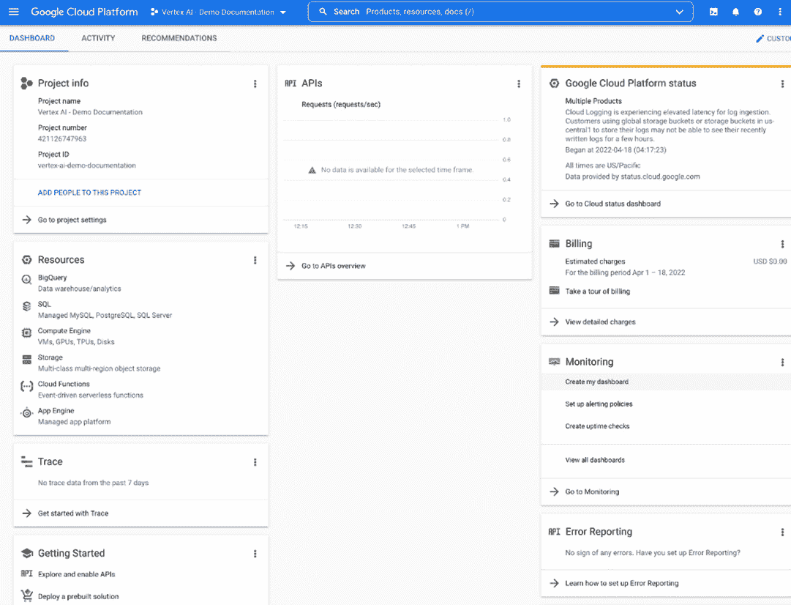

通过左上角菜单导航启动顶点 AI:

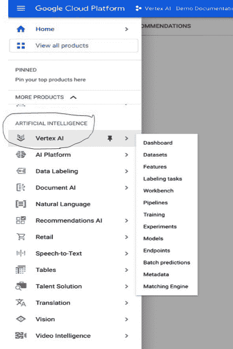

第一次启动 Vertex AI，需要启用 Vertex AI API。为此，选择一个**区域**并点击蓝色**启用顶点 AI API** 按钮:

f

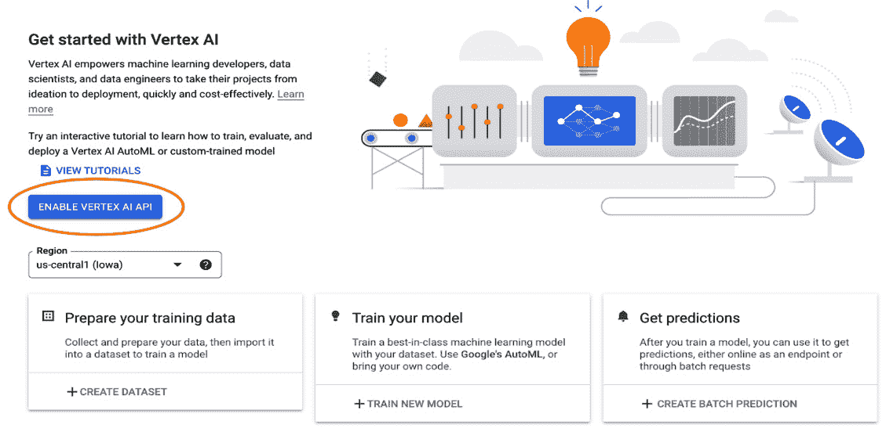

默认情况下，启用顶点 AI API 后，你将登陆顶点 AI API 仪表盘。

# 顶点人工智能–数据集

我们将在 Vertex AI 中使用的第一个工具是**数据集**。点击**数据集**后，您将被带到相应的页面。由于我们正在进行一个全新的项目，因此没有要显示的数据集。点击**创建数据集**开始:

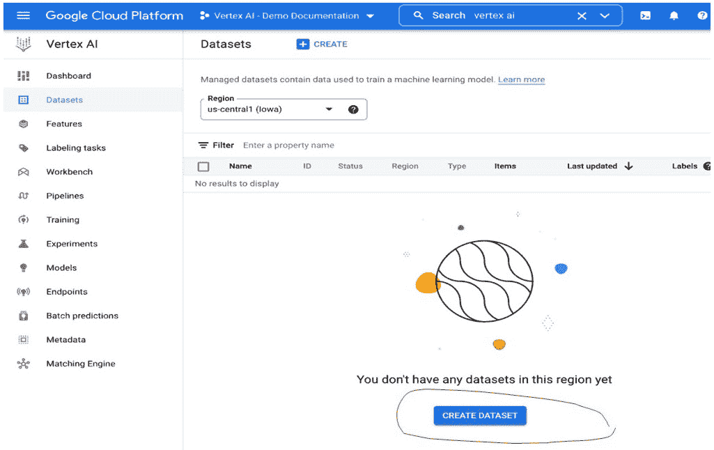

输入数据集的名称，并从以下四个主要类别中选择要使用的数据集类型:

*   **图片**:
    *   **图像分类(单标签)**
    *   **图像分类(多标签)**
    *   **图像物体检测**
    *   **图像分割**
*   **表格**:
    *   **回归/分类**
    *   **预测**
*   **正文**:
    *   **文本分类(单标签)**
    *   **文本分类(多标签)**
    *   **文本实体提取**
    *   **文本情感分析**
*   **视频**:
    *   **视频动作识别**
    *   **视频分类**
    *   **视频对象跟踪**

选择数据集类型后，将在 Google 云存储中创建一个 bucket 作为默认数据集存储库。在这里，您可以指定将创建存储桶的区域:

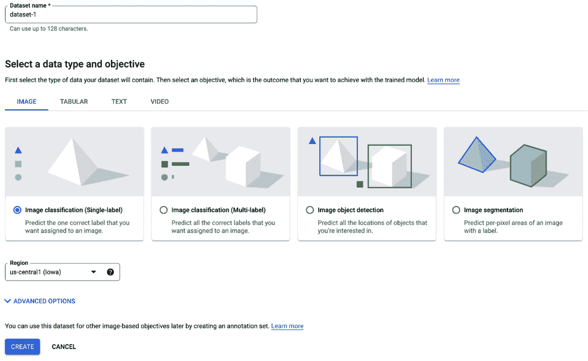

点击**创建**按钮。您将进入下一页，在这里您需要指定导入方法。导入数据有三个选项:

*   **从您的电脑上传图像**
*   **从电脑上传导入文件**
*   **选择从云存储中导入文件**

要从本地计算机选择文件，点击**选择文件**按钮:

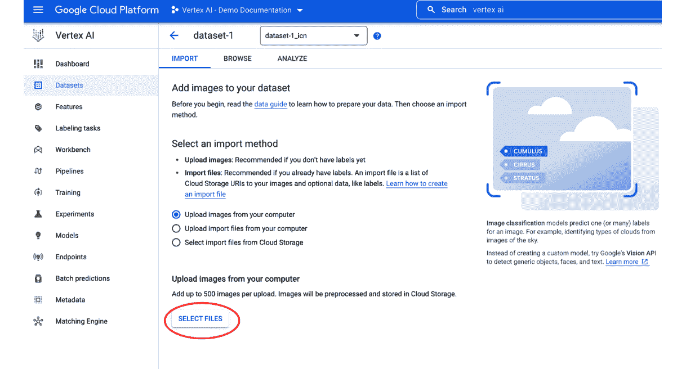

在出现的页面上，导航到本地计算机上包含您的图片的文件夹，然后选择一张或多张您想要上传到数据集的图片。请注意，每次上传最多可以上传 500 张图片。您上传的图片应采用以下格式之一:

*   联合图像专家组
*   GIF 格式
*   PNG
*   位图文件的扩展名(Bitmap)
*   图标

如果您需要上传更多图片，您需要点击**选择文件**按钮，并指定您想要为您的数据集使用哪个 Google Cloud bucket。

图片上传后，您可以浏览数据集中的所有图像并检查它们的状态(它们将被标记为或**未标记为**)。如下面的截图所示，我们总共有 20 张图像，并且所有图像都没有标记(标记任务将在下一节中介绍):

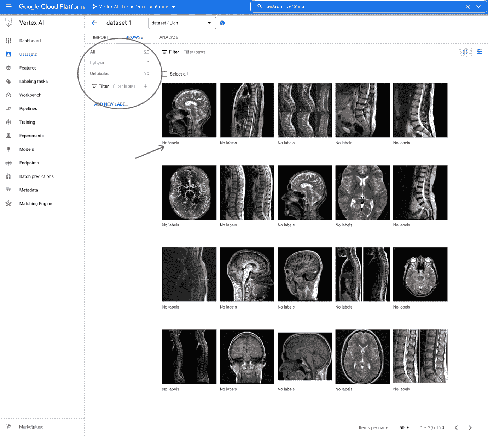

如果您希望使用其他两个选项将图像添加到数据集，即**从您的计算机上传导入文件**和**选择从云存储导入文件**，您只需提供一个云存储的链接，如下图所示:

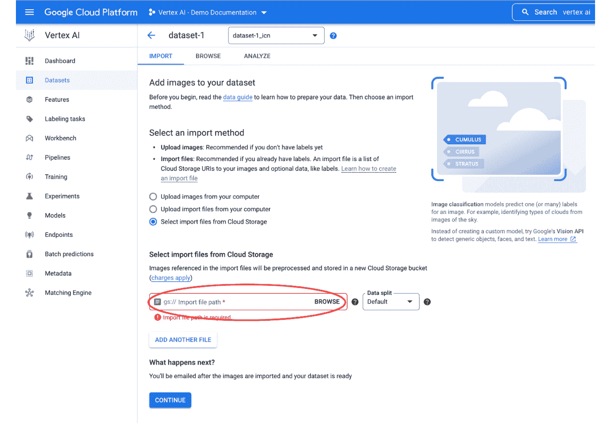

其他三个类别(**表格**、**文本**和**视频**)遵循相同的过程，因为您必须创建数据集，并从您的本地计算机或谷歌云存储中上传文件。您还必须输入数据集名称，并从提供的选项中选择一个区域。

顶点人工智能–标记任务

# 在本节中，您将学习如何在 Vertex AI 中标记数据。有几种方法可以在创建的数据集中标记数据。如果使用小型数据集，可以手动标记每个数据集。默认情况下，数据集每页仅显示 10 幅图像。如果您想在同一页上查看所有图片，您可以从**每页项目**选项中选择一个数字。有三种选择——**10**、 **50** 和 **100** :

因为我们还没有创建标签，所以我们需要定义/创建一个标签名。点击`Brain`和`Spine`:

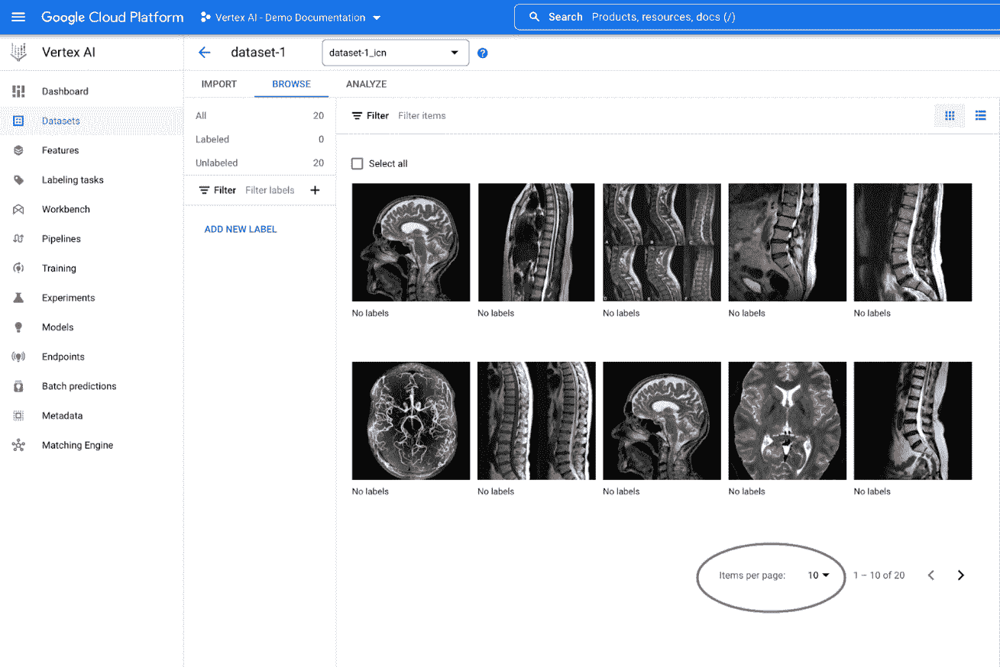

创建/添加新标签后，您可以选择每张图像并对其进行标记，也可以选择多张图像并对其进行分组标记(遵循从*步骤 1* 到 *4* 的每个步骤):

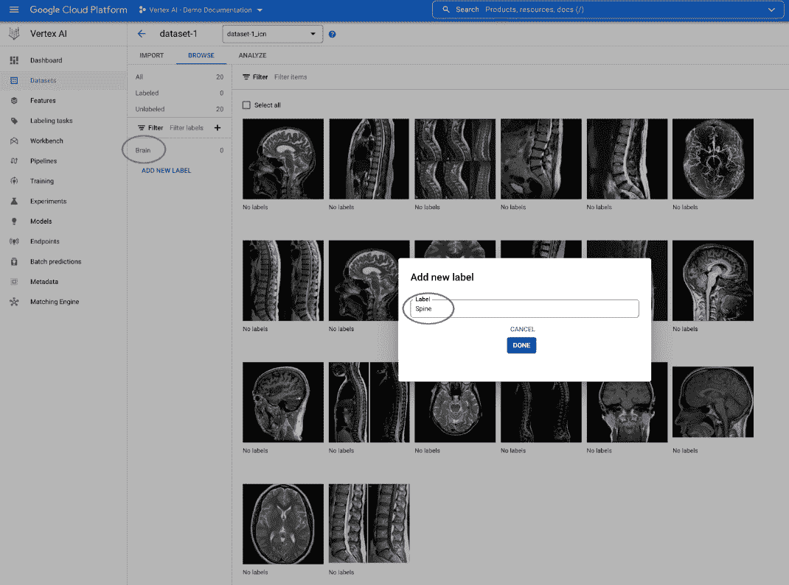

标记完所有的图像后，您可以转到摘要页面检查是否有任何图像未被标记:

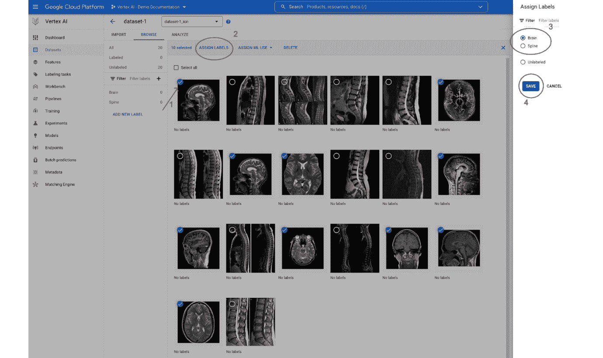

如果您有一个非常大的数据集，您可以创建一个标记任务，并将其分配给一个团队来标记数据集。

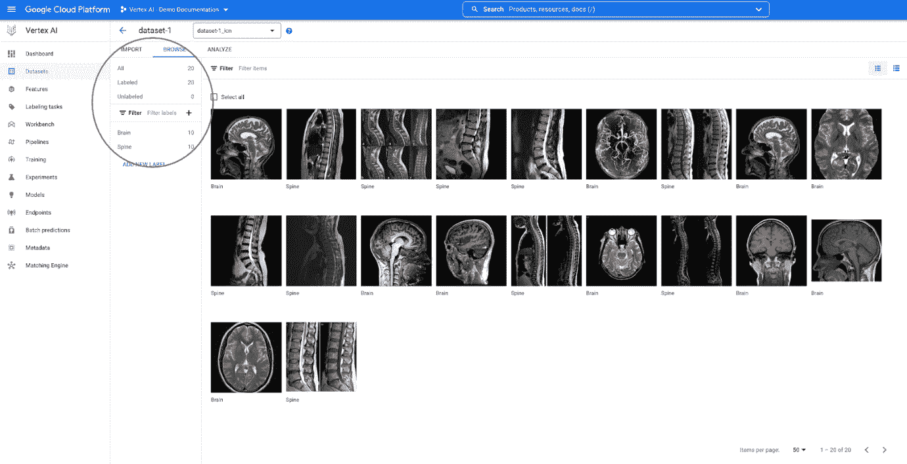

顶点人工智能–训练

# 既然您已经有了一个标记的数据集，就可以进行模型训练了。Vertex AI 为训练模型提供了不同的方法:

AutoML

*   定制训练(高级)
*   要开始 AutoML 训练，在 Vertex AI 控制台中，单击位于页面顶部的**训练**，然后单击**创建**按钮(在我们的示例中，我们将使用我们在上一节中创建的 MRI 图像数据集来执行 AutoML 训练):

在出现的页面上，您需要为您尝试训练的模型定义一些规范:

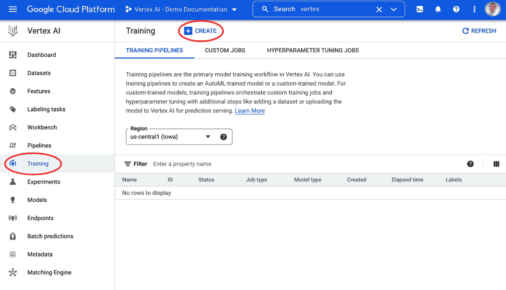

**选择数据集**:在这里，您可以看到您之前创建的所有数据集。

*   **注释集**:标签保存在称为注释的集合中。您可以更改注记集以将不同的标注组应用于同一数据集。
*   在**训练方法**页面，选择 **AutoML** (默认情况下会被选中)。然后，点击**继续**:

由于我们正在训练一个新的 ML 模型，我们需要选择**训练新模型**。但是如果您已经有一个训练过的模型，并且想要重新训练*或*训练一个模型作为现有模型的版本，选择**训练新版本**。

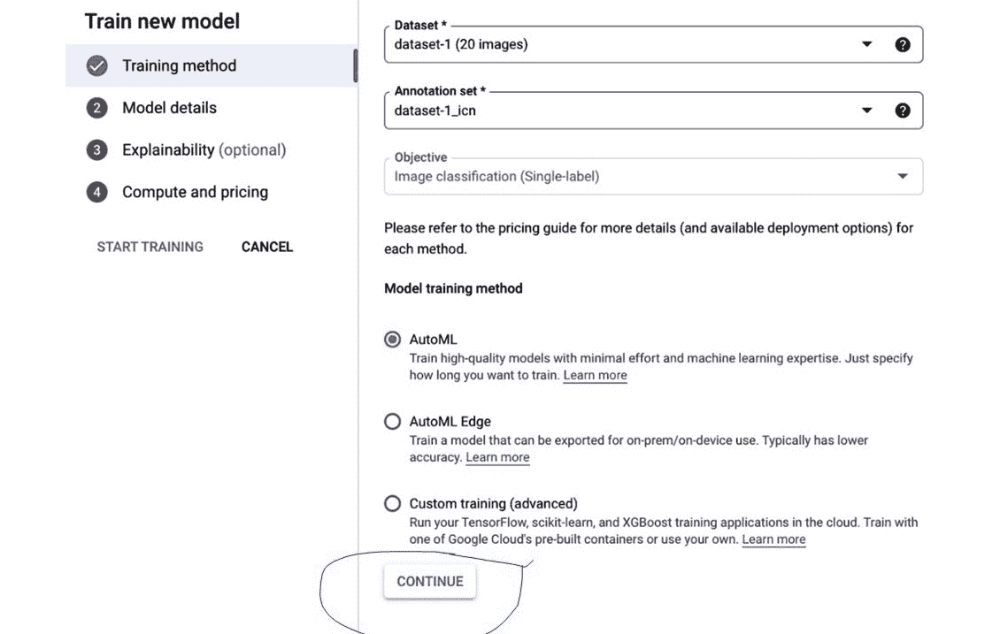

接下来，输入型号的名称并提供描述(描述是可选的)。

在**高级选项**部分，会给出两个数据拆分选项:**随机分配**和**手动(高级)**。根据**随机分配的**，您的数据集将被自动随机化，并使用以下比率分成训练集、验证集和测试集:

`80%`

*   `10%`
*   `10%`
*   您可以根据训练模式的需要更改值。更多细节，请查看 https://cloud.google.com/vertex-ai/docs/general/ml-use?的谷歌文档 _ga=2.140326960。-2030104523.1635276817&_ GAC = 1.58794719.1650385127 . cjwkcajwu _ msbhayeiwa 5 bbmf 84 zvxwfepx-vaejrusjfgq 8 rvneovnlhj 3 vlygmk 3 eao 6 yjhry 5 bocdkgqavd _ BwE:

点击**继续**。

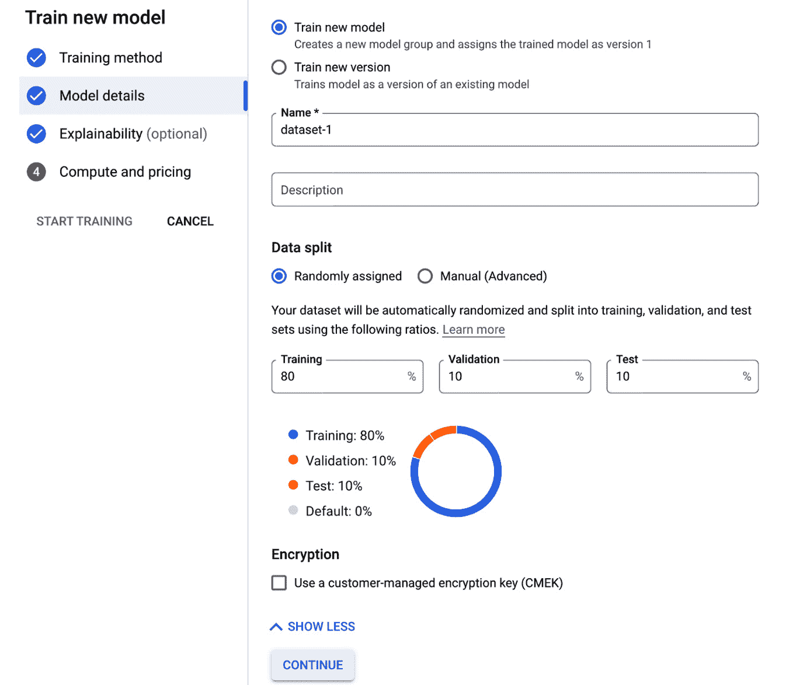

在下一页也是最后一页，系统会提示您在**预算**部分输入金额。在这里，您需要指定用于训练特定模型的最大时间。点击**开始训练**选项:

训练完成后，您将会收到一封确认邮件，并且可以看到其状态。现在，您可以从训练页面(我们训练模型的同一个页面)分析已训练的模型，或者从左侧菜单中点击**模型**，然后点击您想要分析的模型:

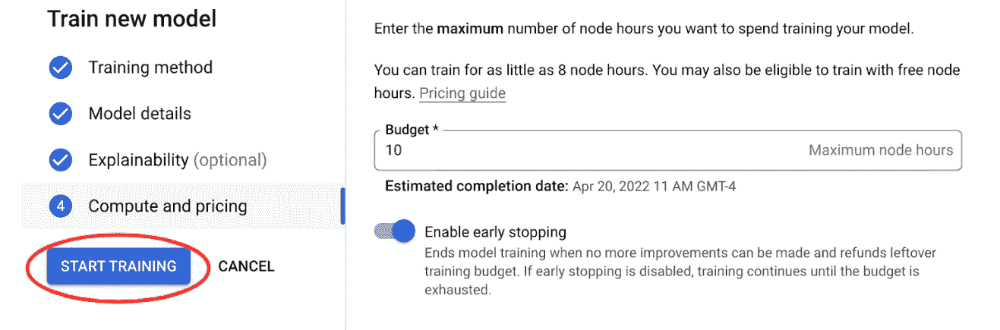

当您点击您想要分析的模型时，您将被提示选择模型的版本。因为我们训练了一个全新的模型，所以我们只有一个版本。下面的屏幕截图显示了我们的表格数据集的训练模型的摘要:

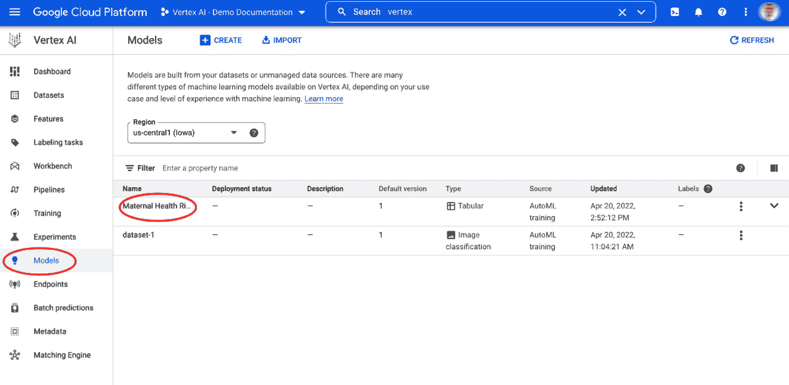

从这个图表中，您可以看到训练模型的性能，以及我们的分类模型的混淆矩阵。

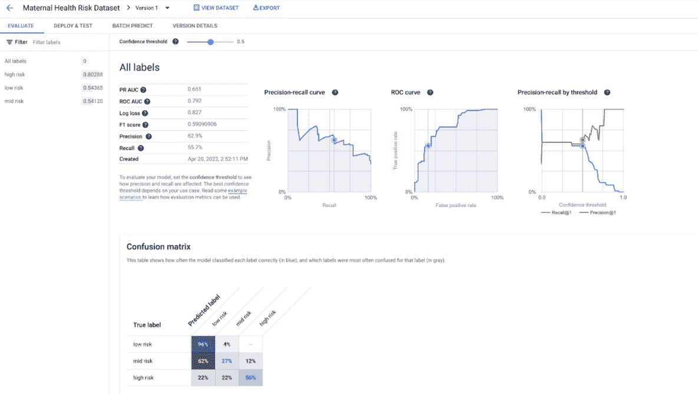

模型训练后，是时候部署模型进行预测了。部署模型有两种方式:

顶点 AI 端点

*   顶点人工智能批量预测
*   我们将在接下来的几节中更详细地讨论这些。

顶点人工智能–预测(顶点人工智能端点)

# 在本节中，我们将通过 Vertex AI 端点部署我们的模型。部署模型有两种方式:

来自**车型**

*   从**端点**
*   让我们详细看看这些选项。

通过模型部署模型

## 从左侧菜单进入**模型**部分，选择您想要部署的模型，并选择您想要部署的版本(记住，我们只有一个版本，因为我们已经构建/训练了一个全新的模型)。然后，在页面顶部，点击**部署&测试**:

点击**部署&测试**后，您将进入下一页。在这里，单击蓝色的**部署到端点**按钮:

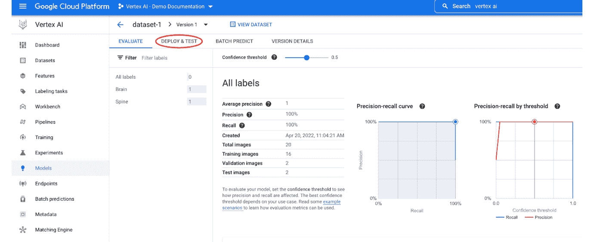

通过端点部署模型

## 从左侧菜单进入的**端点**部分。通过这样做，您将被导航到一个弹出页面，在这里您需要定义您的端点:

在下一页上，您需要指定要部署到端点的模型，并选择模型的版本:

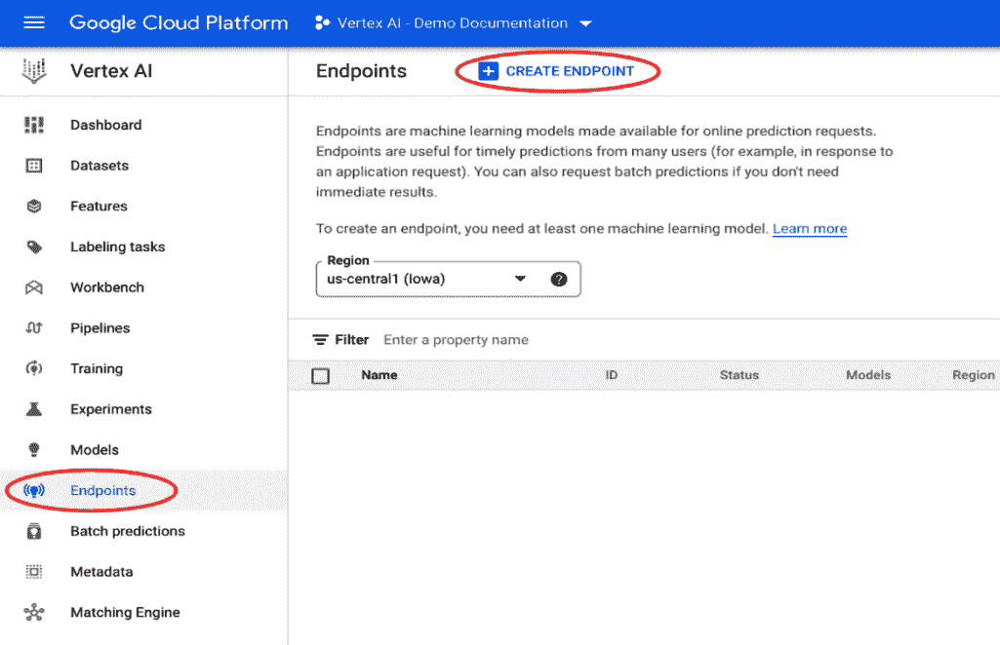

指定计算节点的数量，其他设置保持不变。然后，点击**完成**然后**创建**:

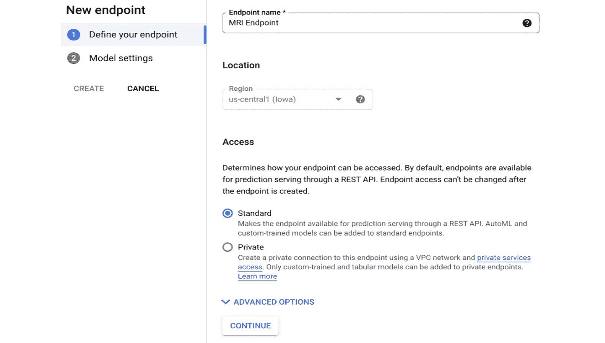

在完成部署后，您将收到一封电子邮件，说明端点部署的状态。现在，我们可以开始预测了:

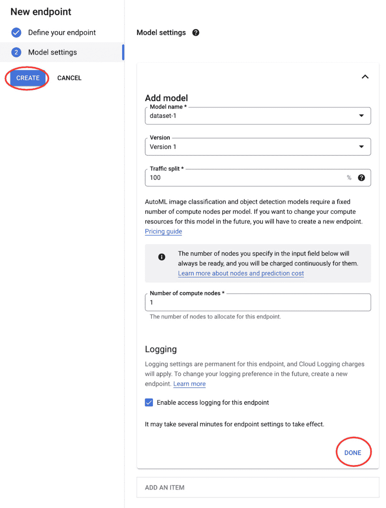

转到**型号**。

1.  选择您希望使用的型号。
2.  选择模型的版本。
3.  在页面顶部，点击**部署&测试**。
4.  您将到达一个页面，在这里您可以开始尝试/测试您部署的模型。点击蓝色**上传图像**按钮:

从本地驱动器中选择一个图像。该图像将被上传到端点；在页面的右侧，您将看到预测的结果。在我们的例子中，我们上传了一个随机图像(`spine MARI`)，预测的准确率几乎达到了 99%:

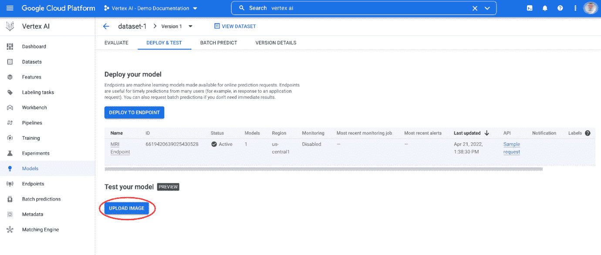

如果您需要在移动/web 应用程序中使用您的端点，您可以请求一个示例 API。在同一页面中，点击**样品请求**:

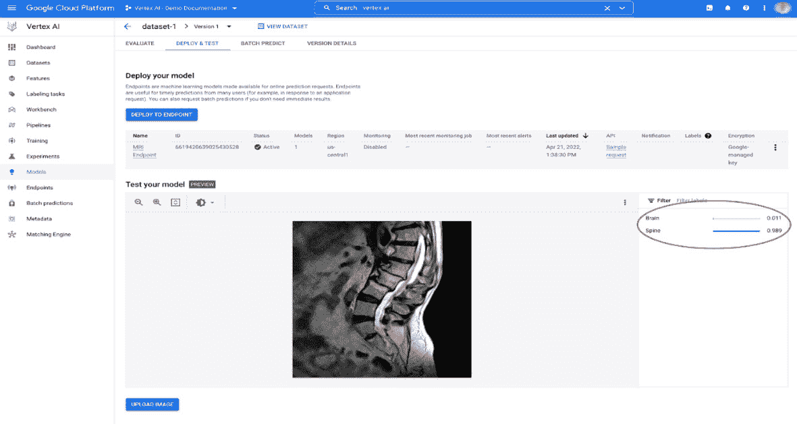

从出现的菜单中，您可以根据需要从 **REST** 或 **PYTHON** 部分复制脚本:

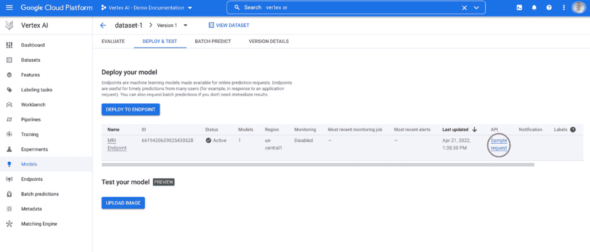

From the menu that appears, you can copy the script from the **REST** or **PYTHON** section based on your needs:

在几次尝试之后，系统将开始根据从端点收集的日志生成图形:

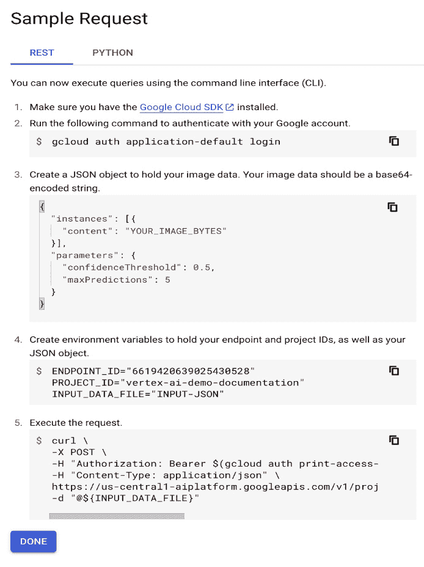

到目前为止，我们已经将我们的模型部署到 Vertex AI 端点。现在，我们来学习一下如何使用批量预测。

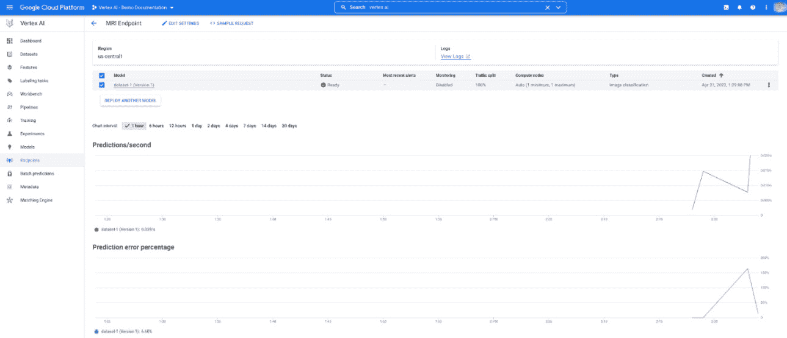

顶点 AI–预测(批量预测)

# 当您不需要立即响应并且希望通过单个请求从累积的数据中获得预测时，使用批量预测。按照以下步骤为我们之前训练的模型执行批量预测:

从控制台的左侧菜单进入**型号**。

1.  单击您想要使用的模型。
2.  单击您想要使用的模型版本。
3.  从顶部菜单中，点击**批量预测**。
4.  点击蓝色**创建批量预测**按钮:
5.  点击**创建批量预测**后，需要定义一些参数，如批量预测的名称、来源、输出等。让我们逐一分析一下:

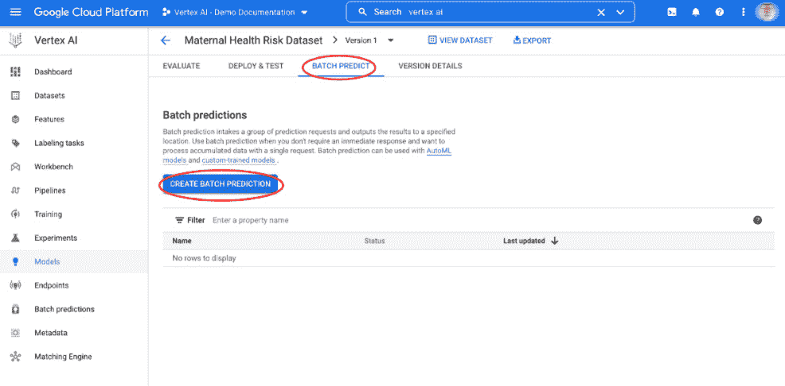

**批次预测名称**:输入批次预测的名称。

*   **选择来源**:在这里，您需要指定将用于批量预测的值的来源。您可以从云存储中获取大查询表*或*文件。请记住，因为我们使用的是表格数据集，所以格式必须是 CSV、JSONL 或 TFRecord。
*   **批量预测输出**:选择输出的格式(BigQuery table、CSV、TFRecord 或 JSONL)并提供路径(BigQuery *或*云存储)。
*   **可解释性选项**:可选地，您可以选择**为该模型启用特性属性**，以获得特性属性作为输出的一部分。
*   使用 BigQuery 数据集和我们创建的表，我们可以创建一个新的批量预测来预测**风险级别**列:

Using a BigQuery dataset and the table we have created, we can create a new batch prediction to predict the **Risk Level** column:

定义完所有的参数后，点击**创建**；批量预测将开始处理。完成此过程需要一些时间，完成后您会收到一封电子邮件。

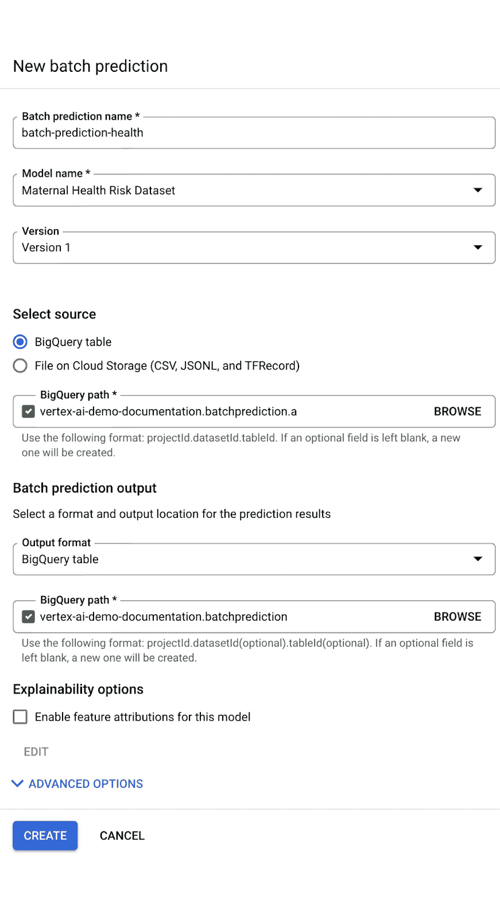

顶点人工智能-工作台

# Vertex AI Workbench 是整个数据科学工作流程的单一开发环境。你可以使用 Vertex AI Workbench 基于笔记本的环境来查询和探索数据，开发和训练模型，并作为流水线的部分运行你的代码。Vertex AI workbench 提供以下功能:

**托管笔记本电脑**是 Google 托管的环境，其集成和功能可帮助您在基于笔记本电脑的端到端生产环境中进行设置和工作。

*   **用户管理的笔记本电脑**是深度学习虚拟机映像实例，可高度定制，因此非常适合需要对其环境进行大量控制的用户。
*   要启动顶点人工智能工作台，导航到顶点人工智能控制台并点击**工作台**:

如果是第一次使用 Vertex AI Workbench，需要启用笔记本 API，点击 **Workbench** 后会有提示。点击**启用**:

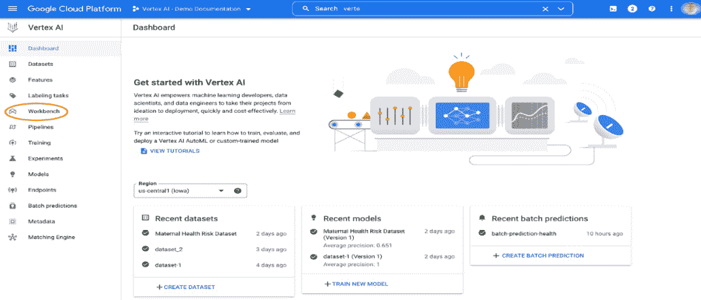

If you are using Vertex AI Workbench for the first time, you will need to enable Notebook API, which you will be prompted for after you click on **Workbench**. Click on **ENABLE**:

在本实验中，我们将创建一个用户管理的笔记本。Vertex AI 提供不同类型的 Jupyter 笔记本，具有各种预装库和依赖关系。在这个例子中，我们将创建一个简单的 Python 3 笔记本。请遵循以下步骤:

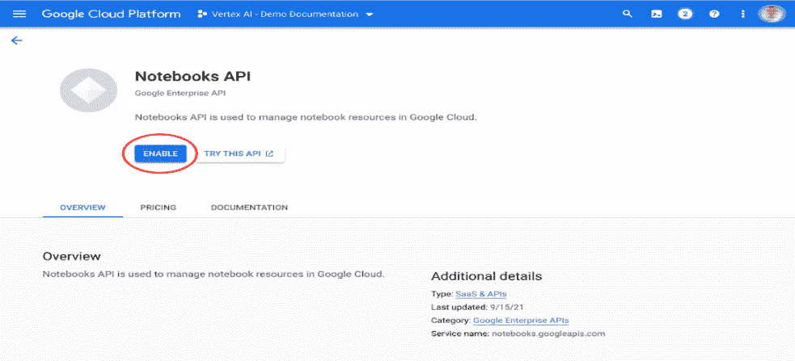

从控制台的左侧菜单中，点击**工作台**。

1.  点击页面顶部的**新笔记本**。
2.  从下拉菜单中，点击 **Python 3** :
3.  在弹出菜单中，您需要通过提供笔记本名称**、**区域**、**区域**等来识别笔记本。然后，点击**创建**:**

**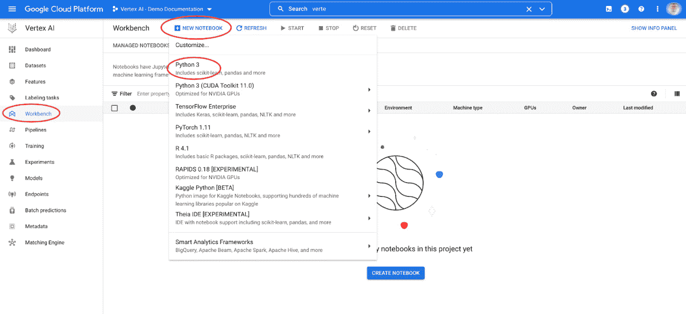

现在，让我们检查并分析我们之前创建的笔记本，以及 Vertex AI 笔记本中有哪些功能。Vertex AI 提供了一个 Jupyter 笔记本环境。点击**打开 JUPYTERLAB** ，如以下截图所示:

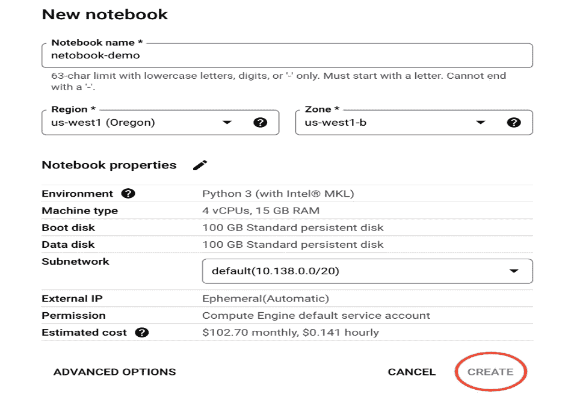

您将导航到包含 JupyterLab 环境的新选项卡。在页面的左侧，您会看到所有的文件夹。默认情况下，有两个文件夹，但是您可以从不同的来源(如 GitHub)创建、上传或克隆一个文件夹。在页面的右侧有**笔记本**、**控制台**和**其他**，包括**终端**、**文本文件**等选项。点击笔记本下的 **Python 3** 。您将被带到一个空白笔记本，在那里您可以开始使用 Python 编程:

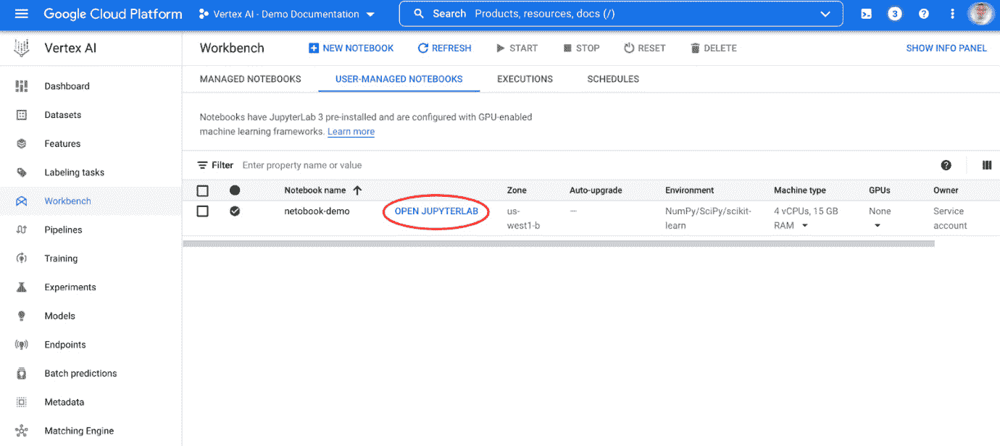

点击`.ipynb`文件(左侧)后，您可以开始输入右侧的脚本:

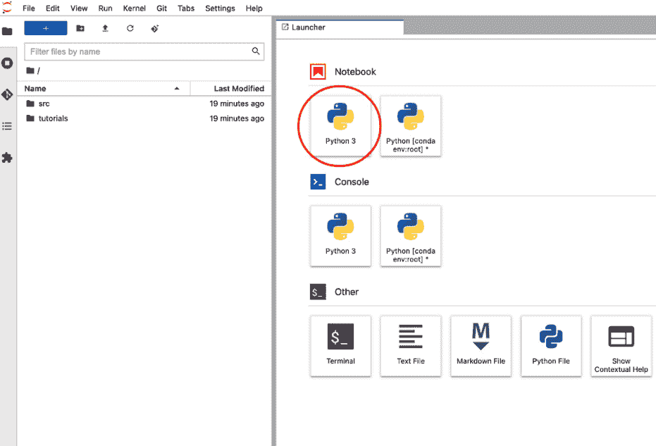

至此，您已经创建了训练平台，并准备开始运行 Jupyter 笔记本电脑。

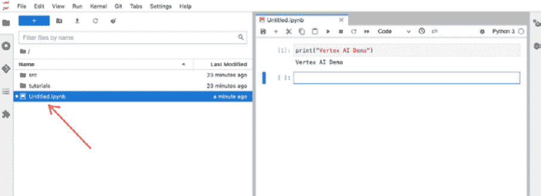

顶点人工智能–特征库

# Vertex AI 中的特征库是您可以创建实体和特征，并根据需要添加可在以后使用的值。在本演示中，我们将通过运行一些 Python 脚本，探索在 Jupyter 笔记本中创建包含实体和要素的要素存储。在进入笔记本之前，让我们通过 Google Cloud 控制台创建一个功能商店和实体。从控制台的左侧菜单中，点击**功能**:

由于我们尚未创建任何功能存储，因此此部分将为空。要创建新实体，点击页面顶部的**创建实体类型**:

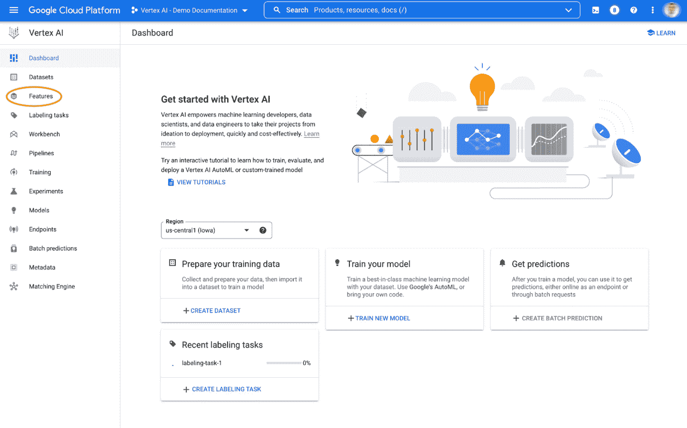

从弹出的菜单中，输入所有必要的信息并点击**创建**按钮，如下所示:

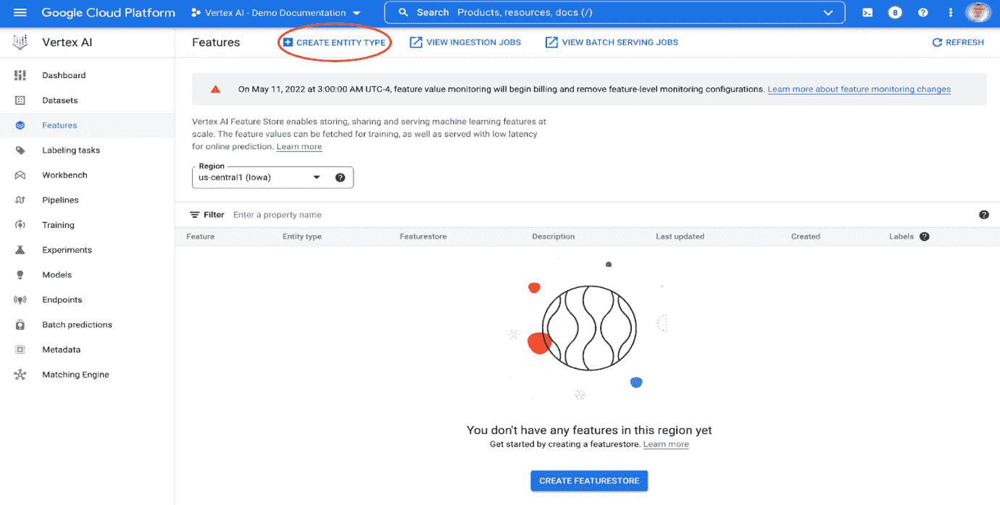

接下来，我们将创建一个新的笔记本，并从 GitHub([https://github.com/GoogleCloudPlatform/vertex-ai-samples](https://github.com/GoogleCloudPlatform/vertex-ai-samples))克隆一个存储库。在创建了一个笔记本并克隆了前面提到的存储库之后，从`cloned`文件夹，进入`Vertex-ai-samples` | `notebooks` | `official` | `feature_store`并点击`gapic-feature-store.ipynb`:

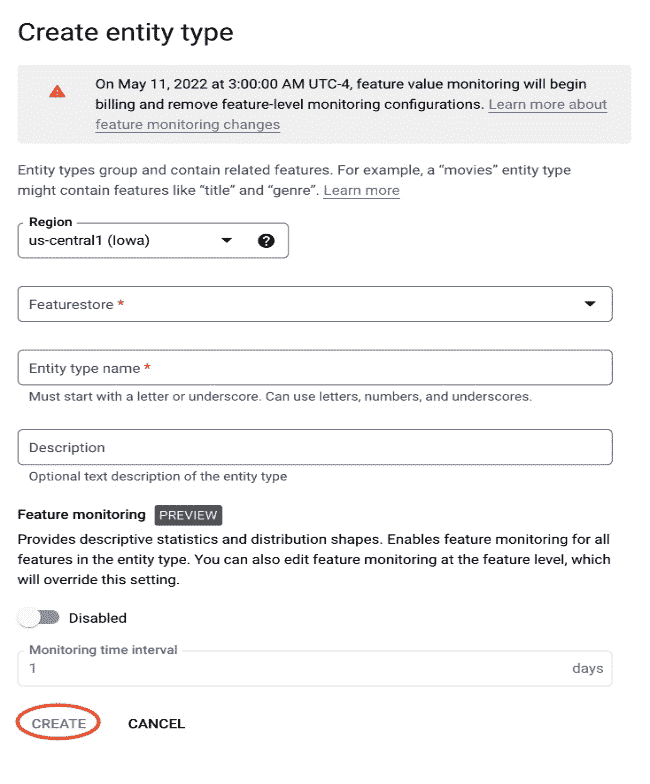

安装所有附加的软件包，并输入您的项目 ID，如下面的屏幕截图所示:

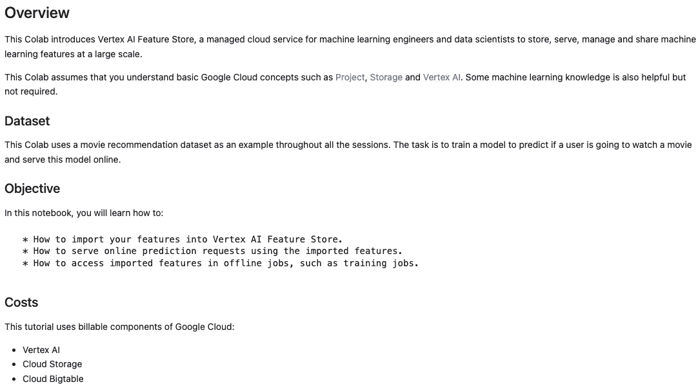

运行所有的脚本(在这个演示文档中，我们不会检查每一行，但我们会强调与 Vertex AI 特性库相关的要点)。

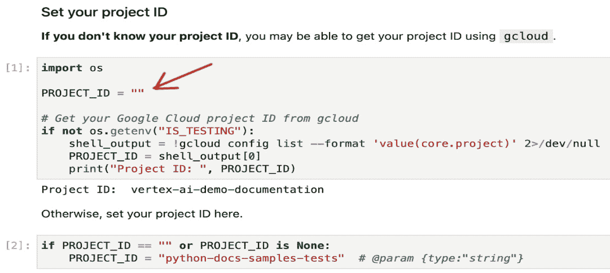

这些脚本将执行以下操作:

为输出准备数据集。它将在 BigQuery 中创建一个数据集来存放输出。

1.  导入库并定义常数。
2.  创建特征库及其实体和特征。
3.  导入值。
4.  运行完所有脚本后，您可以在 Google 控制台中检查创建的特性库(及其实体和特性)。从控制台，转到**顶点 AI** 并点击左侧菜单中的**特征**:

您会注意到我们已经创建了一个包含两个实体(`movies`和`users`)的特性库。每个实体都有三个特征。如果您单击提供的任何实体，您将看到关于该特定实体的一些详细信息(在我们的示例中，实体是`movies`):

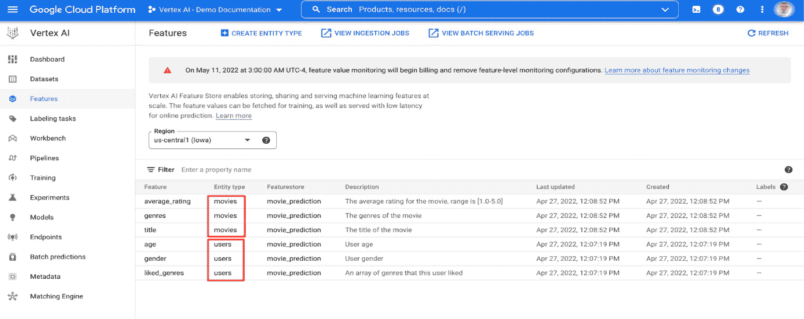

作为一个完全托管的解决方案，Vertex AI 特征库为您提供了一个集中的存储库来组织、存储和服务 ML 特征，并为您的团队提供了一个在规模上共享、发现和重用 ML 特征的存储库。它对开发和部署新的 ML 应用程序有很大的帮助。关于功能商店的更多详细信息，请查看 https://cloud.google.com/vertex-ai/docs/featurestore。

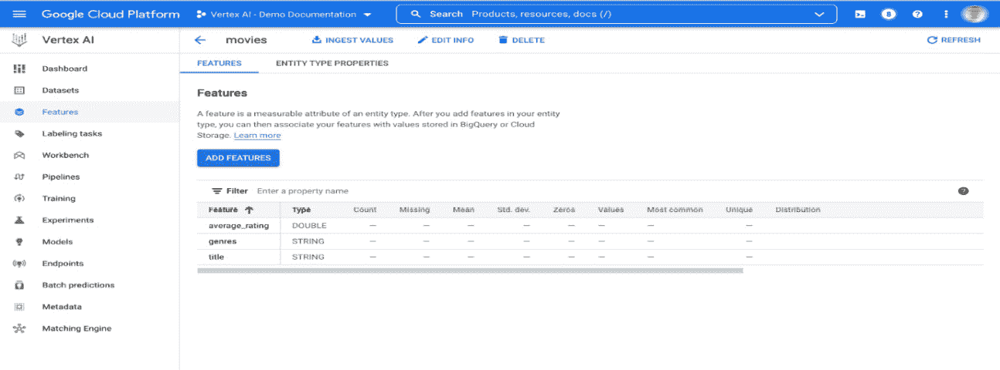

顶点人工智能–管道和元数据

# 管道帮助你自动化和复制你的 ML 工作流程。Vertex AI 将其跨谷歌云的 ML 产品整合到一个无缝的开发体验中。以前，通过 AutoML 和定制模型训练的模型可以通过单独的服务访问。Vertex AI 将两者结合成一个 API，还有其他新产品。在这个演示中，我们将使用顶点管道创建和运行 ML 管道。

我们将使用 Vertex AI SDK 并创建一个 Jupyter 笔记本。创建好笔记本后，点击**打开 JUPYTERLAB** ，如下截图所示:

新笔记本将在新标签页中打开。克隆存储库([https://github.com/GoogleCloudPlatform/vertex-ai-samples](https://github.com/GoogleCloudPlatform/vertex-ai-samples))。

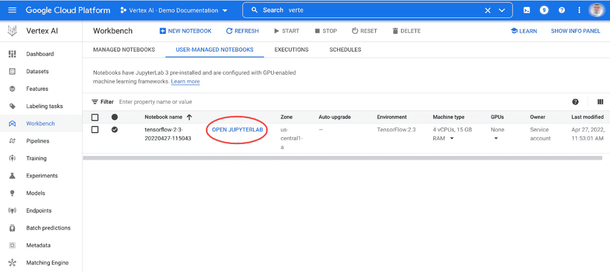

从克隆的文件夹，转到`Vertex-ai-samples` | `notebooks` | `official` | `pipelines`。点击`automl_tabular_classification_beans.ipynb`文件后，笔记本会在左侧打开，如下图所示:

从给定的笔记本中，阅读概述并查看特定演示的数据集、目标和成本。运行所有的命令(我们不会描述每一个脚本，但将重点放在与顶点人工智能管道相关的主要部分)。

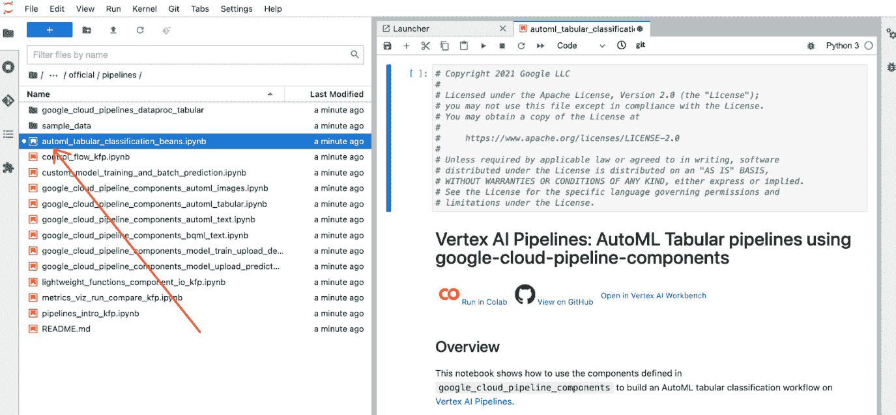

您将要运行的脚本将执行以下操作:

设置项目 ID 和存储桶(存储所有数据的位置)。

1.  导入必要的库。
2.  定义常数并创建必要的组件。
3.  创建一个端到端的 ML 管道。该过程将花费 2 个多小时，因为它将执行以下任务:
4.  在 Vertex AI 中创建数据集。
    1.  用 AutoML 训练一个表格分类模型。
    2.  获取此模型的评估指标。
    3.  根据评估指标，它将决定是否在顶点管道中使用条件逻辑部署模型。
    4.  使用顶点预测将模型部署到端点。
    5.  创建管道后，要查看和分析它，在顶点 AI 的左侧菜单中，点击**管道**，如下图所示:

点击**管道**后，您将带到一个页面，在此您可以选择您想要查看的管道。您将看到以下管道图:

如果您单击`dataset`工件，您将看到关于创建的顶点 AI 数据集的详细信息。您可以点击 **URI** 旁边指定的链接，转到该数据集的页面:

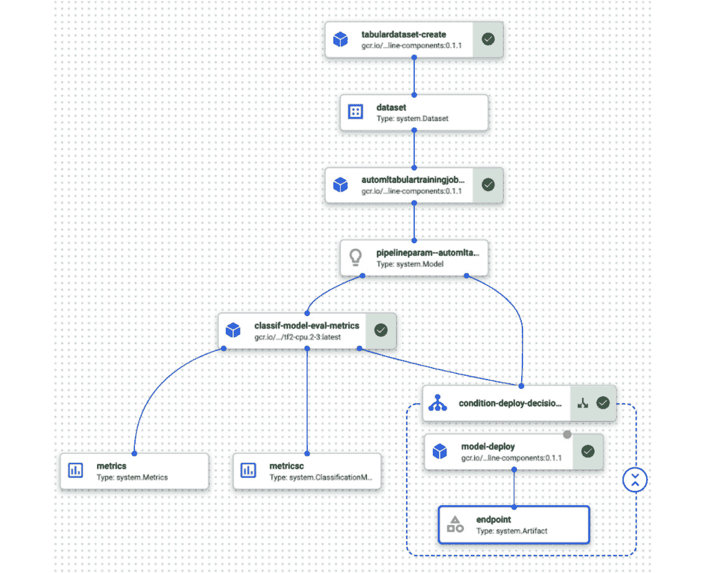

要检查来自定制评估组件的结果度量可视化，单击`metrics`工件。在仪表盘的右侧，您将能够看到该型号的混淆矩阵:

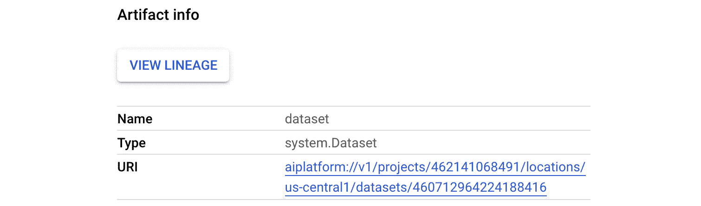

要检查从这个管道运行中创建的模型和端点，请转到`automl-beans`模型。在那里，您应该看到这个模型部署到一个端点:

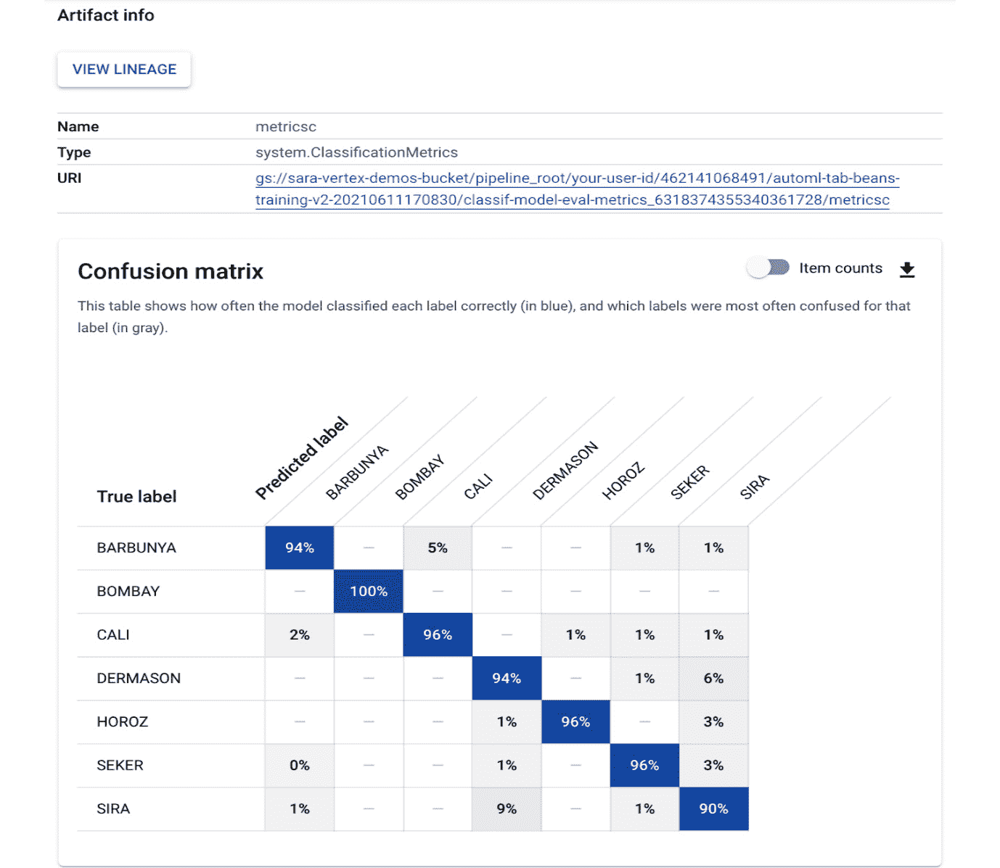

请记住，管道中的每个部分将产生输出，该输出将用作下一部分的输入。稍后，如果需要修改这些输出/输入，点击左侧菜单中的**元数据**按钮:

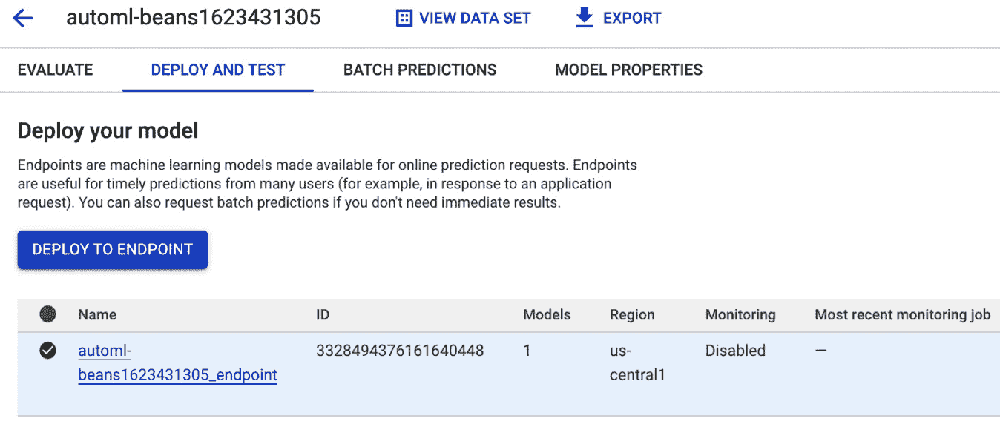

这样，我们就有了覆盖的顶点人工智能管道和元数据。在下一个部分，我们将讨论顶点人工智能的模型监控。

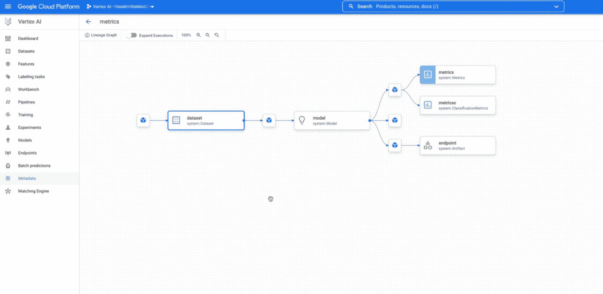

顶点人工智能——模型监控

# 在模型部署之后，我们需要监控它，因为数据和环境可能会随着时间的推移而改变并导致模型恶化。需要考虑监控的两个概念:**特征偏斜**和**漂移检测**。

在我们的演示文档中，我们将构建一个全新的表格数据集并训练该模型。在本例中，我们将使用*女子国际足球比赛结果*([https://www . ka ggle . com/datasets/martj 42/Women-International-Football-Results](https://www.kaggle.com/datasets/martj42/womens-international-football-results))数据集。

我们已经创建了一个表格数据集，并上传了一个从 Kaggle 下载的 CSV 文件。以下屏幕截图显示了数据集的摘要:

我们还使用 AutoML 方法训练了一个模型，作为目标，我们使用了`neutral`列，它有两个值(或者是`False`或者是`True`)。下面的屏幕截图显示了已训练模型的摘要:

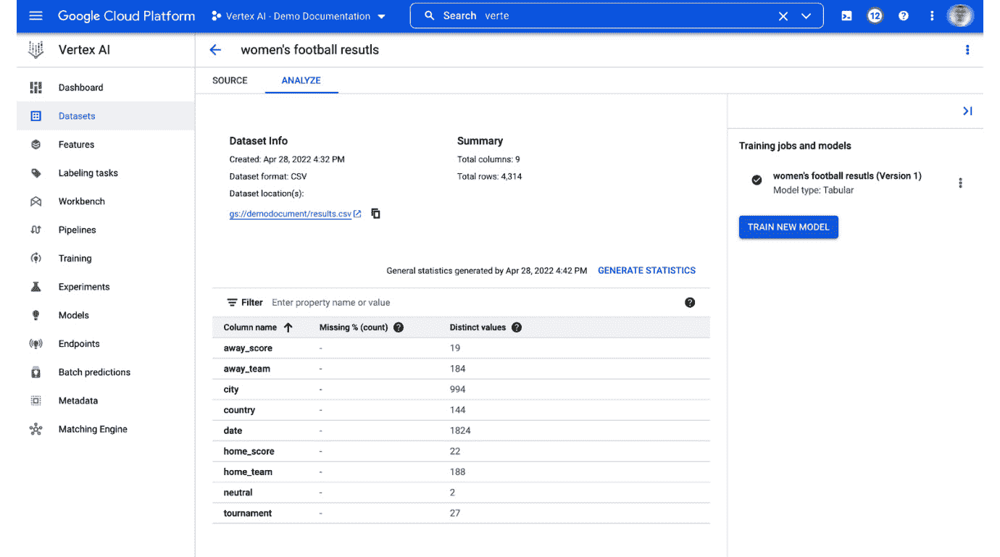

有了可解释的 AI，我们可以看到`tournament`列对我们的模型影响最大:

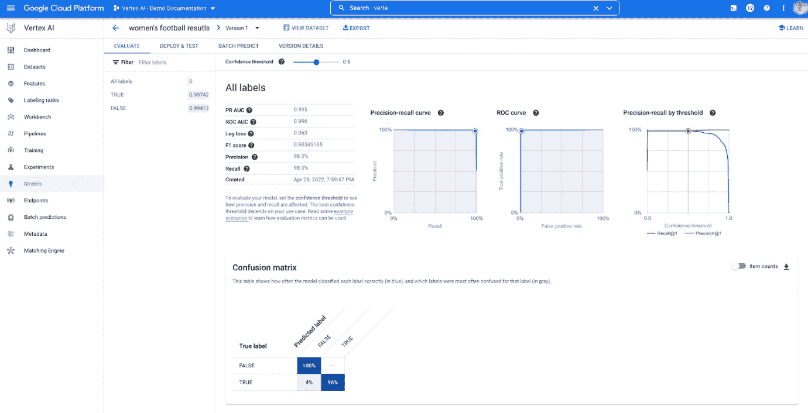

接下来，我们需要将我们的模型部署到端点。点击**部署到端点**按钮，如下图所示:

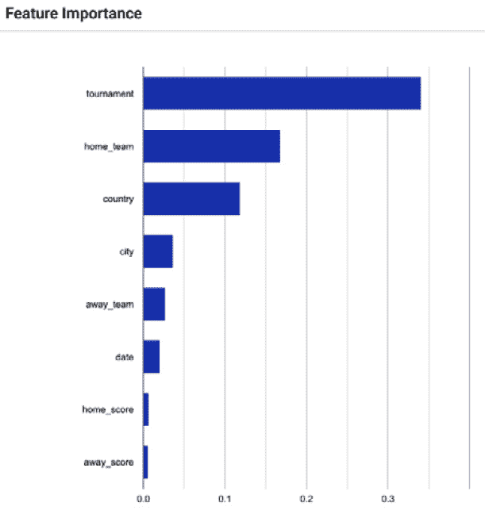

在出现的弹出菜单中(在右侧)，填写所有字段:

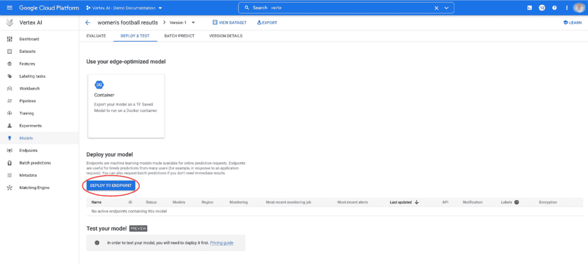

**监控作业显示名称**:监控作业的名称。

*   **监视窗口长度**:监视模型的时间。
*   **提醒邮件**:输入至少一个将要收到提醒的邮件(可以输入多个邮件地址)。
*   **抽样率**:抽样的百分比。
*   保持其余字段不变，点击**继续**:

在下一个也是最后一个部分，您需要指定监控目标(偏斜检测或漂移检测)。如果您选择**训练服务偏斜检测**选项，您需要指定训练数据源和目标列。但是，如果您选择**预测漂移检测**选项，您需要指定警报阈值。在我们的例子中，我们将选择**预测漂移检测**。接下来，点击**部署**按钮:

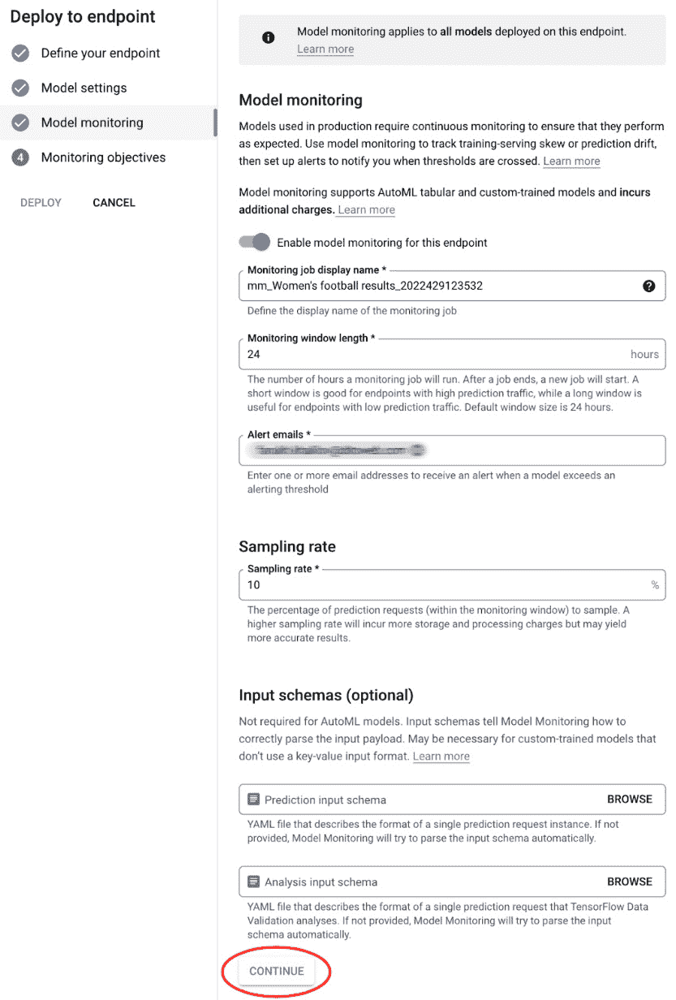

将部署处理到端点需要一段时间。部署完成后，您将收到关于*通知和部署状态*以及正在创建的*监控作业*的电子邮件(在两封单独的电子邮件中):

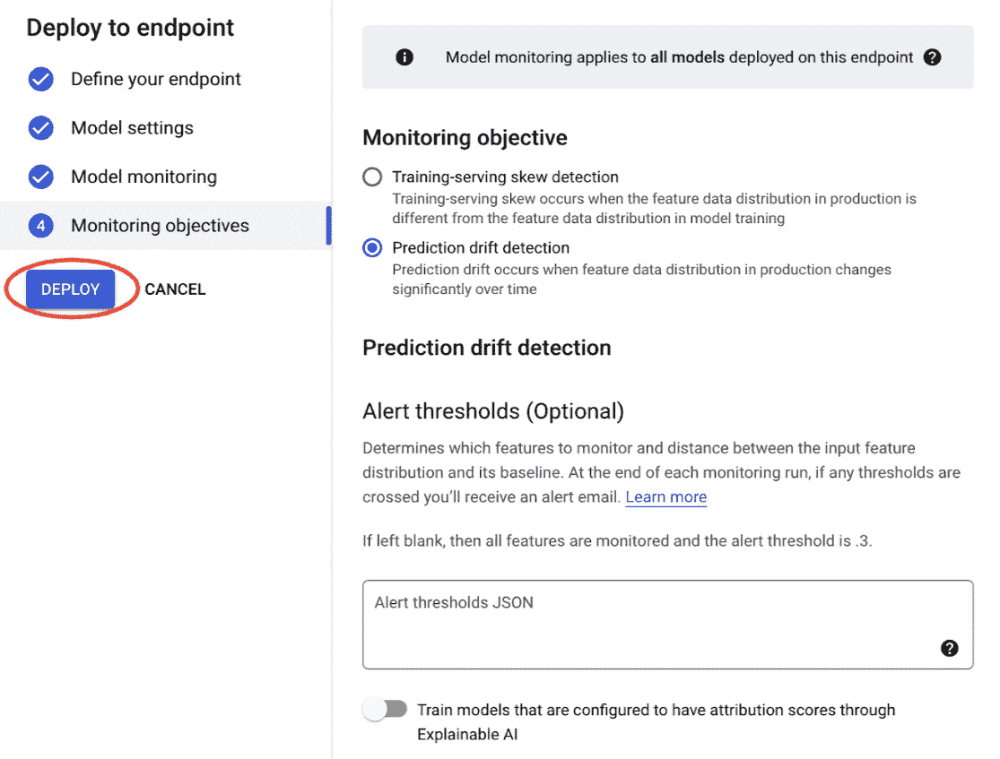

前面的屏幕截图显示了监控作业请求电子邮件通知的模型。请注意，请求已经提交，并且基于传入的预测请求。将对其进行采样和记录以供分析。

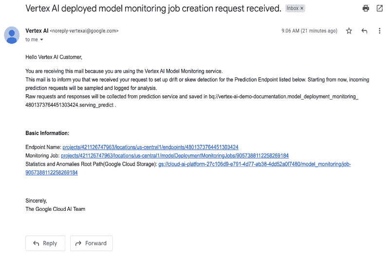

总结

# 在本附录中，我们查看了基于 Google Cloud Vertex AI 套件的示例，该套件为数据科学家提供端到端服务。我们讨论了顶点 AI 数据集、标记任务、训练、预测、工作台、特征存储、管道、元数据和模型监控。

在下一个附录中，我们将讨论如何使用各种 Google Cloud ML APIs，包括 Vision API、NLP API、语音到文本 API、文本到语音 API、翻译 API 和 Dialogflow API。

In the next appendix, we will discuss how to use various Google Cloud ML APIs, including the Vision API, NLP API, Speech-to-Text API, Text-to-Speech API, Translation API, and Dialogflow API.**