# 附录五：练习使用 Google Cloud ML API 

在 [*第八章*](B18333_08.xhtml#_idTextAnchor159) ，*发现 Google Cloud ML API* 中，我们探索了 Google Cloud ML API，这是 Google 提供的 API 接口，基于预先训练好的模型。Google Cloud ML API 包括以下 API，所有这些 API 都将作为本附录中的主题:

*   谷歌云视觉 API
*   谷歌云 NLP API
*   谷歌云语音转文本 API
*   谷歌云文本到语音转换 API
*   谷歌云翻译 API
*   Google Cloud Dialogflow API

在本附录中，我们将提供每个 API 的实现示例。让我们开始吧。

# 谷歌云视觉 API

在本附录中，我们将向您展示如何通过 Google Cloud Shell 和 Python SDK 使用 Vision API。

在开始使用 Vision API 之前，我们需要从 Google 控制台启用 Vision API。从控制台的左侧菜单，导航至`Vision API`。点击**视觉 API** 后，会提示您启用 API。在我们的例子中，API 已经启用，如下所示:

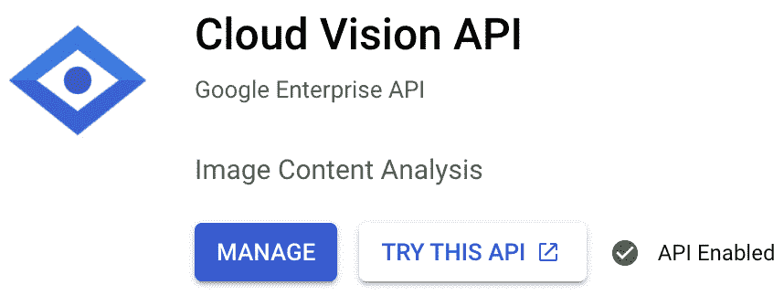

我们将从通过 Google Cloud Shell 使用 Vision API 开始。在 Google 控制台的右上角，单击云壳图标，如下所示:

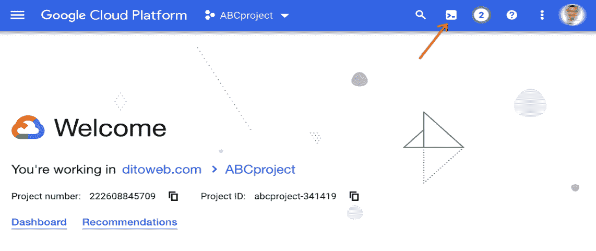

点击云 Shell 图标后，Shell 终端会出现在控制台的底部，如下图所示:

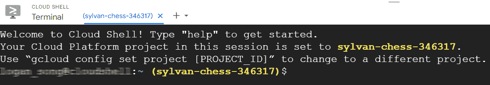

现在，让我们看一些例子来展示 Vision API 在 Google Cloud Shell 中是如何工作的:

*   **例 1** 是一棵树的图像:


要将文件上传到 Google Cloud Shell，请点击下图中高亮显示的三个圆点图标，然后点击**上传**:

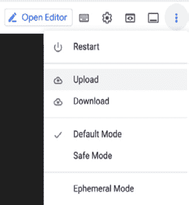

在出现的页面上，将提示您上传文件或文件夹。导航到您的浏览器并选择您想要上传的图像——在我们的例子中是`tree.jpeg`。在 Google Cloud Shell 中运行以下命令:

```
gcloud ml vision detect-objects tree.jpeg 
```

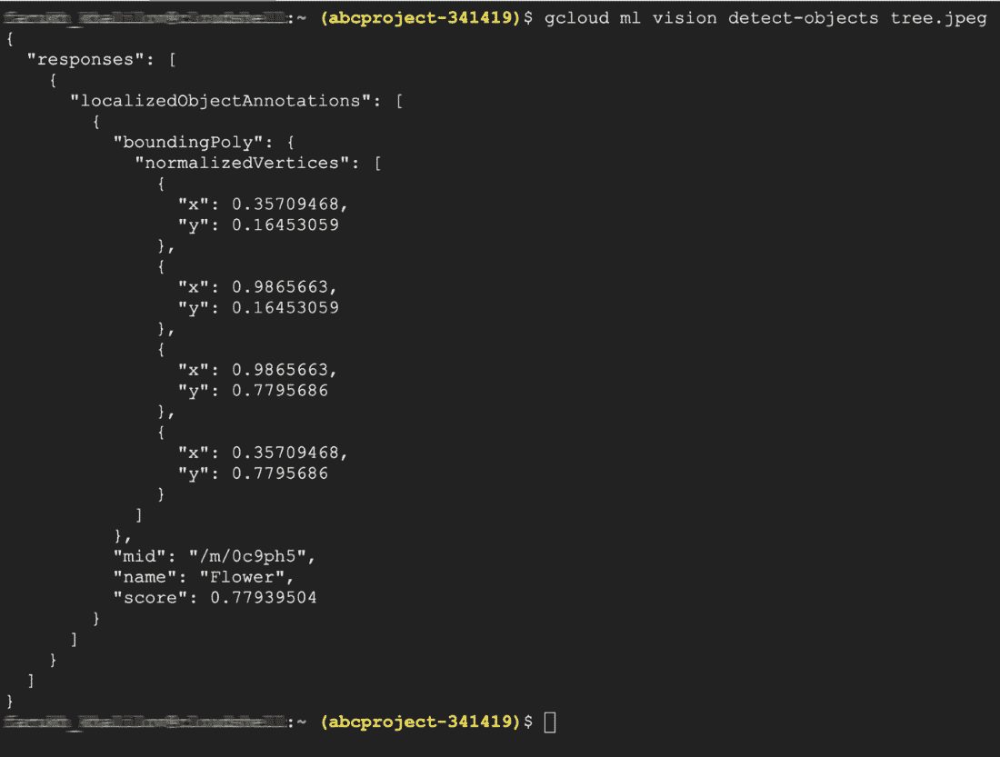

在前面的截图中，我们可以看到 *X* 和 *Y* 的值。这些表示对象的角，该对象被检测为具有 78%置信度的花。

*   **示例 2** 是谷歌标志的图像:


现在，我们将尝试 Vision API 中的另一个选项，并检测一个徽标。上传 Google 徽标的图像，并在 Google Cloud Shell 中键入以下命令:

```
gcloud ml vision detect-logos glogo.jpeg
```

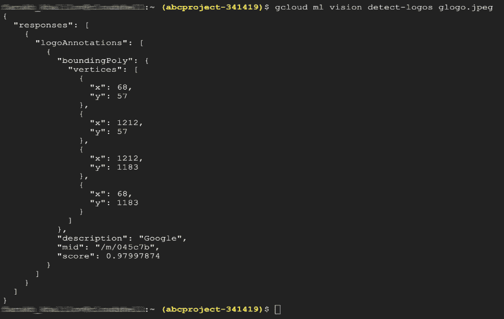

您也可以尝试使用其他选项，例如检测*同一*图像上的文本。它将显示结果，例如每个字符和每个字符在图像上的位置:

```
gcloud ml vision detect-text glogo.jpeg
```

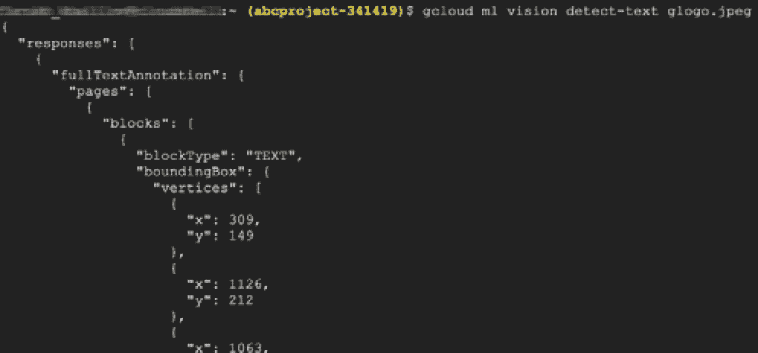

请注意，前面的屏幕截图只显示了部分结果，因为输出很长。

现在，让我们与 Python SDK 和 Vision API 进行交互:

1.  首先，你必须安装 Python 的 Google Cloud Vision API。在 Google Cloud Shell 中使用以下命令:

    ```
    pip3 install - -upgrade google-cloud-vision
    ```

2.  接下来，我们将需要一些 Python 代码。下面是一个简单的 Python 脚本，它检测图像中的 Google 徽标:

    ```
    import io   import os # import the Google client library from google.cloud import vision # instantiates a client client = vision.ImageAnnotatorClient() # provide the name of the image file to annotate file_name = os.path.abspath('glogo.jpeg') # load the image into memoryview with io.open(file_name, 'rb') as image_file:      content = image_file.read() image = vision.Image(content = content) # Performs label detection on the image file response = client.logo_detection(image=image) logos = response.logo_annotations for logo in logos:      print(logo.description + " : " + str(logo.score))
    ```

在这里，我们已经导入了所有必需的库，然后定义了一个图像名称(与我们之前使用的徽标图像相同)，使用 Vision API 检测徽标，并打印结果和分数。

现在，我们需要将 Python 脚本上传到云壳。上传 Python 脚本后，我们可以执行它，如下所示:

```
python3 main.py

Google: 0.979978402153015 
```

结果表示 logo 为 **Google** ，得分为 0.98，表示其置信度约为 98%。

# 谷歌云 NLP API

谷歌云 NLP API 使用模型来分析文本。有几种方法可以使用 NLP API。在这里，我们将向您展示如何通过 Google Cloud Shell 和 Python SDK 使用 NLP API。

在使用 NLP API 之前，您需要启用它。只需从控制台*的左侧菜单中导航到自然语言 API，或者在页面顶部的搜索栏中键入`Natural Language API`。登陆 NLP API 网页后，会要求你**启用 API** (如果你已经这样做了，可以跳过这个)。*

现在，让我们开始使用 Google Cloud Shell 的 NLP API。单击云壳图标将其激活，并键入以下命令:

```
gcloud ml language classify-text --content =

'If Roe is overturne, legislatures in 26 states have pending laws indicating that they intent to ban abortions, according to the Guttmacher Institure, a research organization that supports abortion rights. That could leave many women in need of abortion services hunders or thousands of miles away from access to procedure - unaffordable for many.

Corporate America is increasingly being drawn from the political sidelines on the abortion issue in response to pressure from inverstors, customer and employees. Companies are also struggling to attract and retain talent and worry about the impact these states anti-abortion laws could have on their workers.'
```

作为输出，您将看到基于所提供文本的分类结果:

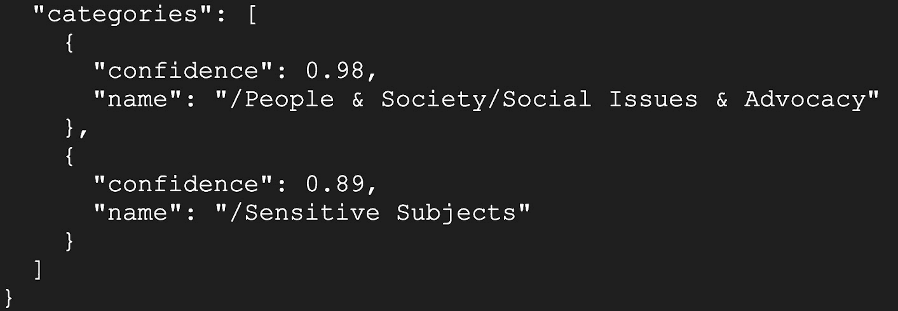

前面的输出显示，它以 98%的置信度成功识别了`People & Society / Social Issues & Advocacy`中的文本，以 89%的置信度成功识别了`Sensitive Subjects`中的文本。

让我们试试另一个选择——那就是`analyze-sentiment`。在这里，我们可以提供一些文本来分析情绪。在这个例子中，我们将使用 Google Maps 中的餐馆评论:

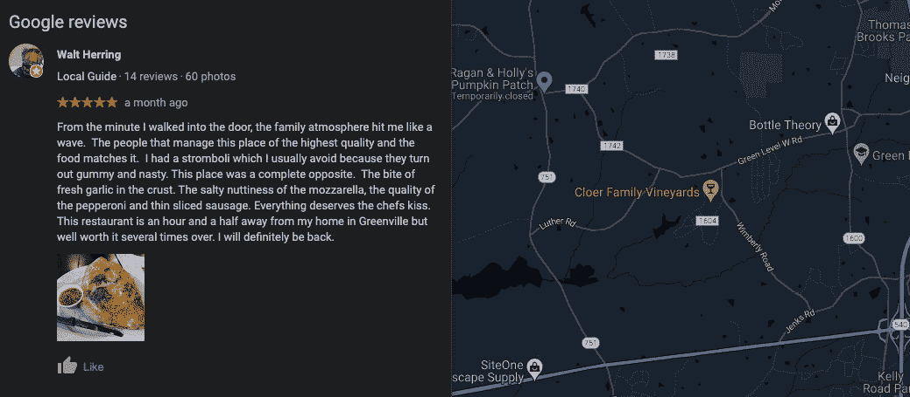

在 Google Cloud Shell 中输入以下命令:

```
gcloud ml language analyze-sentiment - - content =

"From the minute I walked into the door, the family atmosphere hit me like a wave. The people that manage this place of the highest quality and the food matches it. I had a stromboli which I usually avoid because they turn out gummy and nasty. This place was a complete opposite. The bite of fresh garlic in the crust. The salty nuttiness of the mozzarella, the quality of the pepperoni and thin sliced sausage. Everything deserves the chefs kiss. This restaurant is an hour and half away from my home Greensville but well worth it several time over. I will definitely be back."
```

将显示分析。以下截图显示了部分结果:

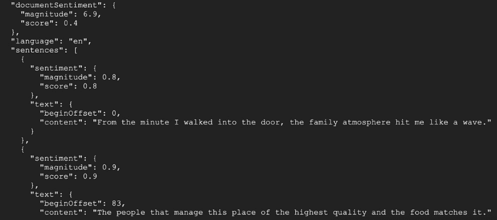

您可以滚动浏览结果以查看其详细信息。我们需要理解两个主要概念:量级(情感的整体强度——即积极或消极)和分数(文本的整体情感倾向)。

现在，让我们用 Python SDK 来研究 NLP API。还有一些其他可用的 SDK，如 Java、PHP、Go 等:

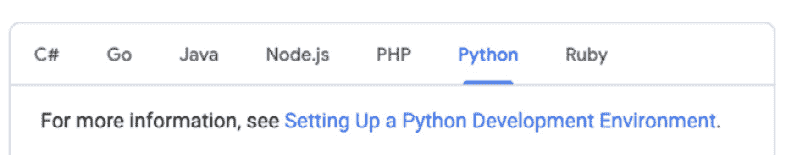

首先，我们需要安装 SDK。键入以下命令:

```
pip install google-cloud-language
```

您需要有凭据才能与 Google Cloud 交互。因此，创建一个服务帐户，生成并上传密钥，然后激活它。我们将在这里跳过这一步。

接下来，我们将需要一些 Python 代码。以下是一个简单的 Python 脚本，用于分析给定文本中的情感:

```
# Import ghe Google Cloud client library

from google.com import language_v1

#set a client variable

client = language_v1.LanguageServiceClient()

# The text to analyze

text = "We heard great review and thought we finally found a Authentic Classy Italiant Restaurant... WRONG!"

document = language_v1.Document(content=text, type_ = language_v1.Document.Type.PLAIN_TEXT)

#Detects the sentiment of the text

sentiment = client.analyze_sentiment(request={'document':document}).document_sentiment

print("Text: {}".format(text))

print("Sentiment:{}".format(sentiment.score, sentiment.magnitude))
```

将脚本保存在本地计算机上，并上传到 Google Cloud Shell，文件名为`analyze_sentiment.py`。当所有文件上传完毕后，您可以运行`.py`文件来执行脚本并开始分析过程:

```
python3 analyze_sentiment.py
```

使用`analyze-sentiment`方法，我们可以检索情绪和大小的值。我们会让你执行它并得到结果。

NLP API 也可以用来与其他 API 集成，比如**语音转文本** ( **STT** ) API。通过使用 STT API，我们可以将声音/语音文件转换成文本，并应用 NLP API 以及各种方法来分析文本的情感/实体/语法。

# 谷歌云语音转文本 API

Google Cloud 语音转文本 API 用于将音频转换为文本。该服务基于深度学习技术，支持 120 种语言和变体。该服务可用于转录音频文件，并支持声控界面。云语音转文本会自动检测所讲的语言。

首先，我们需要启用语音转文本 API。从左侧菜单中，向下滚动并点击页面顶部搜索栏中的`speech to text`。

您将被带到一个页面，要求您启用 API。如果您之前启用了它，您将看到以下页面:

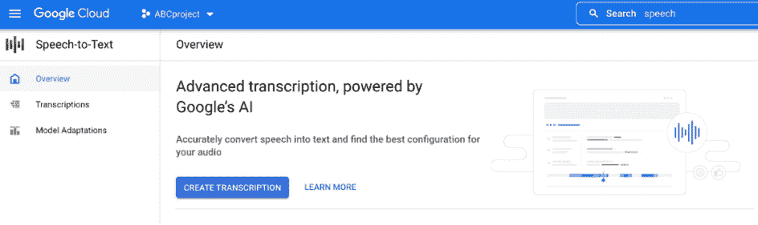

因为我们将使用`curl`向语音到文本 API 发送一个请求，我们将需要生成一个 API 键来传递我们的请求 URL。

创建一个名为`request.json`的请求文件:

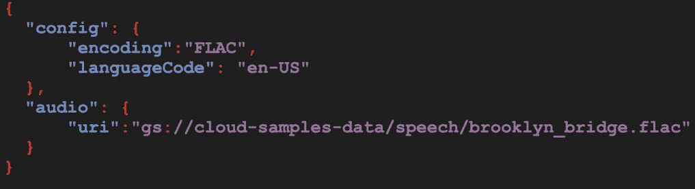

然后，运行以下命令(注意，我们跳过了密钥创建步骤):

```
curl -s -X POST -H "Content-Type: application/json" -- data-binay @request.json \ "http://speech.googleapis.com/v1/speech:recognize?key=${API_KEY} > result.json
```

前面的命令调用语音到文本 API，从`request.json`文件获取所有变量，使用我们生成的密钥，并将所有结果发送/保存到`result.json`文件。要查看`result.json`文件，键入以下命令:

```
cat result.json
```

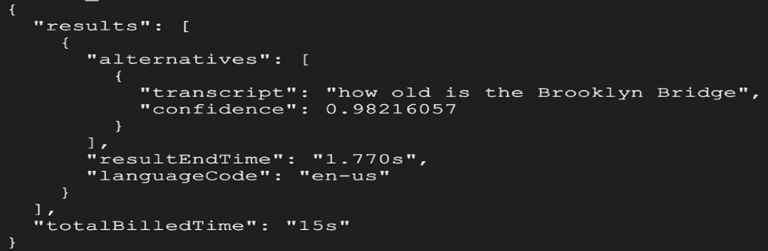

前面的截图显示了给定音频文件的转换文本、置信度(98%)、处理时间和文本语言。

语音到文本也支持不同的语言。查看[https://cloud.google.com/speech-to-text/docs/languages](https://cloud.google.com/speech-to-text/docs/languages)了解更多关于支持语言的细节。

# 谷歌云文本到语音转换 API

谷歌云文本到语音 API 将自然语言文本映射到类似人类的语音。第一步是启用文本到语音转换 API:

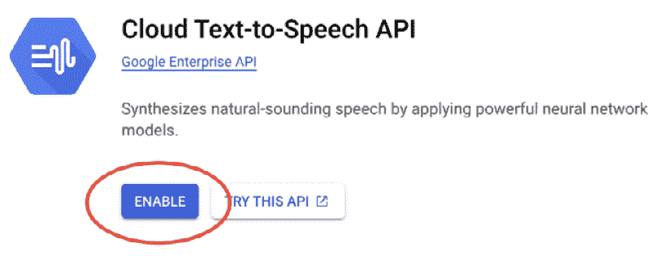

通过单击外壳图标转到云外壳。在进入 API 之前，检查支持的声音和语言列表。您可以使用以下命令通过 Google Cloud Shell 检查可用的语言和语音:

```
curl -H "Authorization: Bearer "$(gcloud auth application-default print-access-token) \

     -H "Content-Type: application/json; charset=utf-8" \

     "https://texttospeech.googleapis.com/v1/voices"
```

前面的命令将列出*所有可能的语言和声音，以及它们相应的代码。下面的截图只显示了列表的一小部分:*

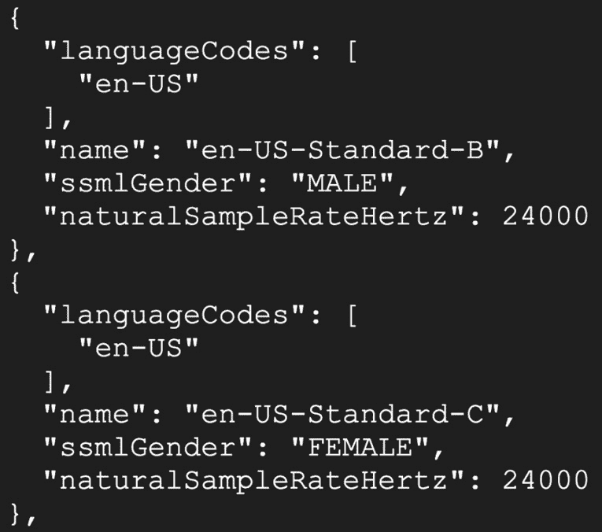

接下来，我们需要创建一个名为`synthesize-text.json`的 JSON 文件，在这里我们将指定语言和语音代码，并提供一些我们想要转换成音频的完整文本:

```
{

     'input':{

     'text':'This is a demo documentation for the Cloud Text-to-Speech API. In this demo documentation we are using the United States English language. The code of the language is: "en-US-Standard-A". Thank you.'

     },

     'voice':{

     'languageCode':'en-us',

     'name':'en-US-Standard-A',

     'ssmlGender':'MALE'

     },

     'audioConfig':{

     'audioEncoding':'MP3'

     }

}
```

使用下面的代码通过`curl`命令调用文本到语音转换 API:

```
curl -H "Authorization: Bearer "$(gcloud auth application-default print-access-token) \

  -H "Content-Type: application/json; charset=utf-8" \

  -d @synthesize-text.json "https://texttospeech.googleapis.com/v1/text:synthesize" \

  > synthesize-text.txt
```

运行前面的命令后，结果将被保存到一个名为`synthesize-text.txt`的文件中。

打开`synthesize-text.txt`文件。您会注意到，文本到语音 API 以 base64 编码的文本提供音频输出，并被分配给`audioContent`字段，如下所示:

```
{

  "audioContent": "//NExAASGoHwABhGudEACdzqFXfRE4EY3AACkD/zX4ADf/6J/[...]"

}
```

现在，创建一个名为`tts_decode.py`的 Python 文件:

```
import argparse

from base64 import decodebytes

import json

"""

Usage:

     python tts_decode.py --input "synthesize-text.txt" \

     --output "synthesize-text-audio.mp3"

"""

def decode_tts_output(input_file, output_file):

     """ Decode output from Cloud Text-to-Speech.

     input_file: the response from Cloud Text-to-Speech

     output_file: the name of the audio file to create

     """

     with open(input_file) as input:

     response = json.load(input)

     audio_data = response['audioContent']

     with open(output_file, "wb") as new_file:

     new_file.write(decodebytes(audio_data.encode('utf-8')))

if __name__ == '__main__':

     parser = argparse.ArgumentParser(

     description="Decode output from Cloud Text-to-Speech",

     formatter_class=argparse.RawDescriptionHelpFormatter)

     parser.add_argument('--input',

                     help='The response from the Text-to-Speech API.',

                     required=True)

    parser.add_argument('--output',

                     help='The name of the audio file to create',

                     required=True)

     args = parser.parse_args()

     decode_tts_output(args.input, args.output)
```

最后，从云 Shell 运行下面的命令:

```
python tts_decode.py --input "synthesize-text.txt" --output "synthesize-text-audio.mp3"
```

现在，我们的 MP3 文件准备好了。

# 谷歌云翻译 API

谷歌的云翻译 API 允许你翻译超过 100 种语言的文本。有两种方法可以使用翻译 API。从谷歌云控制台的主菜单中，点击`Translation API`进入搜索栏(位于页面顶部):

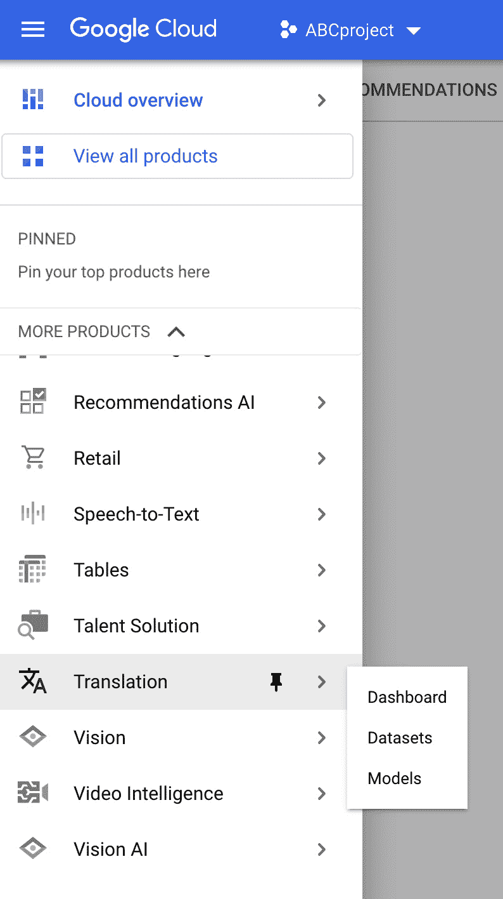

点击仪表板上的后，系统会提示您选择三个选项之一:

*   **自动翻译**
*   **云翻译 API**
*   **翻译中心**

由于我们将使用`curl`向翻译 API 发送一个请求，我们将需要生成一个 API 键来传递我们的请求 URL。

首先，让我们定义我们的文本。键入`TEXT=`并键入任何句子。记住单词之间的空格应该*而不是*留白；相反，在每个空格中，键入`%20`。在我们的示例中，我们将键入`This is a demo documentation`，如下所示:

```
TEXT = "This%20is%20a%20demo%20documentation"
```

现在我们已经定义了我们的`TEXT`变量，键入下面的命令，该命令用红色下划线标出:

```
curl "https://translation.googleapis.com/language/translate/v2?target=ru&key=${API_KEY}&q=${TEXT}"
```

这是对 API 的一个`curl`调用，其中我们指定了一个目标语言(在我们的例子中，它是`ru`，代表俄语)。检查[https://cloud.google.com/translate/docs/languages](https://cloud.google.com/translate/docs/languages)查看所有支持的语言和 ISO-639-1 代码。

运行提供的命令后，您将看到以下输出:

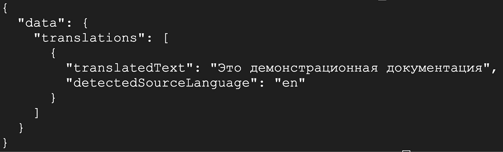

谷歌云翻译 API 还有一个功能，可以检测一种语言，并将其翻译成任何 T42 支持的语言。

在本例中，我们将提供两种不同语言的不同文本，如下所示:

```
TEXT_ONE = "Merhaba%20Dostlar"

TEXT_TWO = "привет%20друзья"
```

我们需要键入`%20`，而不是在单词之间使用空格。

定义`TEXT_ONE`和`TEXT_TWO`后，运行以下命令调用翻译 API 来检测语言:

```
Curl "https://translation.googleapis.com/language/translate/v2/detect?key=${API_KEY}&q=$"TEXT_TWO}"
```

这将返回检测到的置信度在 0 到 1 之间的语言(其中 0 代表 0%，1 代表 100%):

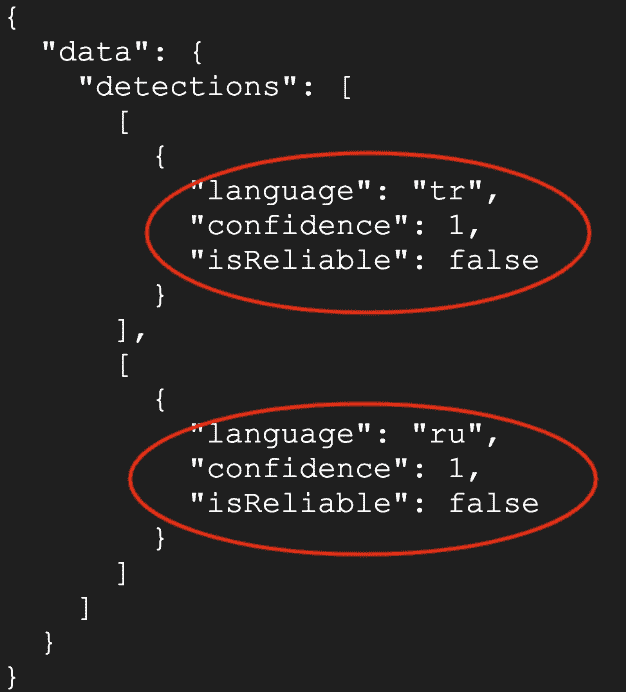

如我们所见，`TEXT_ONE`的语言是土耳其语(`tr`)，置信度为 100%，而`TEXT_TWO`的语言是俄语(`ru`)，置信度也为 100%。

# 谷歌云 Dialogflow API

dialog flow API用于聊天机器人，**交互式语音响应** ( **IVR** )，以及其他基于对话的人类语音交互。首先，我们需要启用 Dialogflow API:

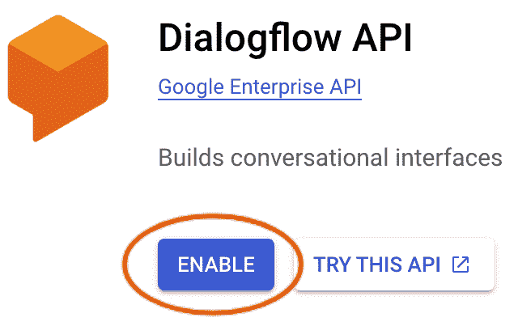

要开始使用平台，请打开一个新标签，在浏览器中键入[https://dialog flow . cloud . Google . com/#/logindialogflow . cloud . Google . com](https://dialogflow.cloud.google.com/#/logindialogflow.cloud.google.com)。您可能会被要求使用您的 Google 帐户登录。

您将被带到dialog flow 平台。这是 Dialogflow ES(基本)版本。这里，我们将主要使用它的**用户界面** ( **UI** )。有一个部分你可以输入脚本(比如 Google 函数)，这将在演示文档中介绍。

现在，让我们熟悉一下 Dialogflow UI。以下屏幕截图显示了您首次启动 Dialogflow 平台时将看到的页面:

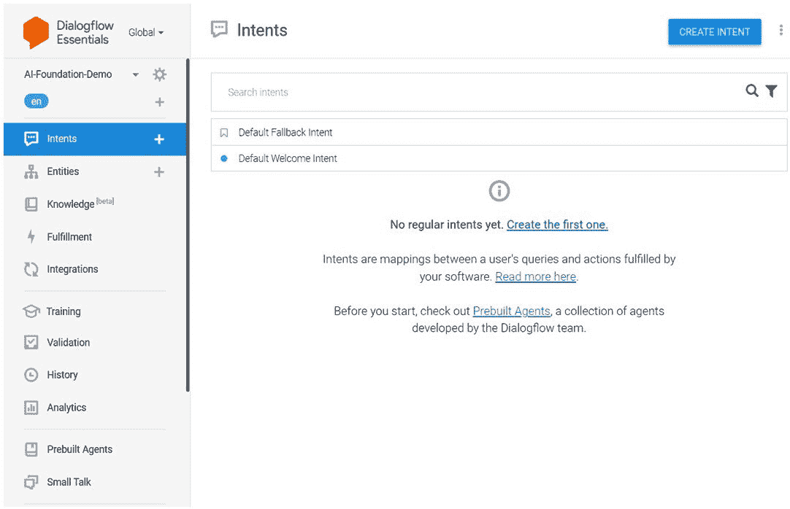

在 Dialogflow 中，你可以有多个代理。如果您之前已经创建了代理，您可以通过单击下面屏幕截图中显示的向下箭头来检查它们:

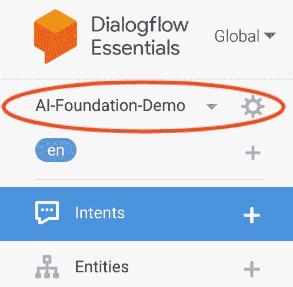

在这里，您可以查看所有已创建代理的列表和/或创建新代理。要创建新代理，向下滚动到底部并点击**创建新代理**，如下所示:

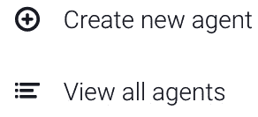

您将被带到以下页面:

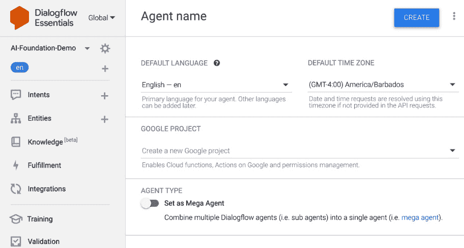

在我们的例子中，我们将命名我们的新代理`Test-Chatbot`，并保持其他设置不变。现在，点击**创建**:

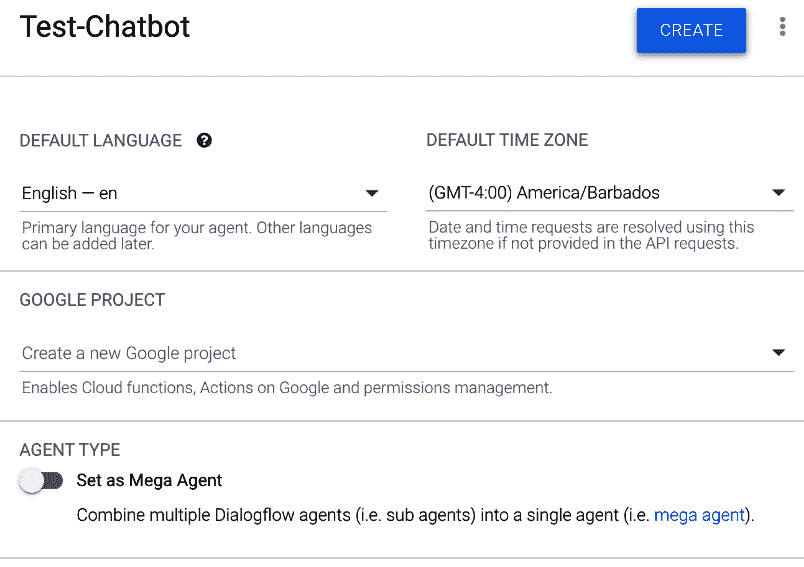

一旦您的代理被创建，您将在左侧看到**意图**:

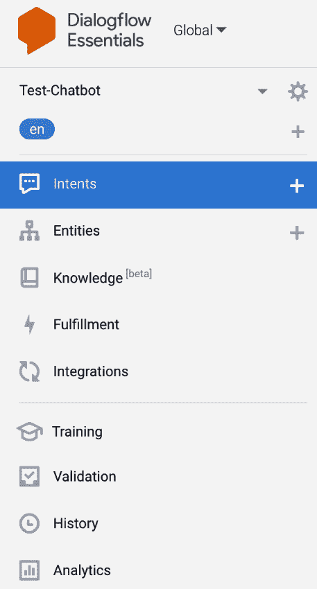

这个选项帮助你理解用户的意图。然后，我们有**实体**，它允许你从用户那里抓取有用的信息。例如，当有人说“我想要一个素食披萨”，聊天机器人可以理解他们想要一个素食披萨，而不是普通的披萨。

在撰写本文时，**知识**是一个测试版功能。您可以使用此功能在 Dialogflow 中创建知识库。

**Fulfillment** 是您可以将 Dialogflow 与其他系统(如您的客户管理系统)集成的地方。下面的屏幕截图显示了一个由 Google 函数支持的示例脚本:

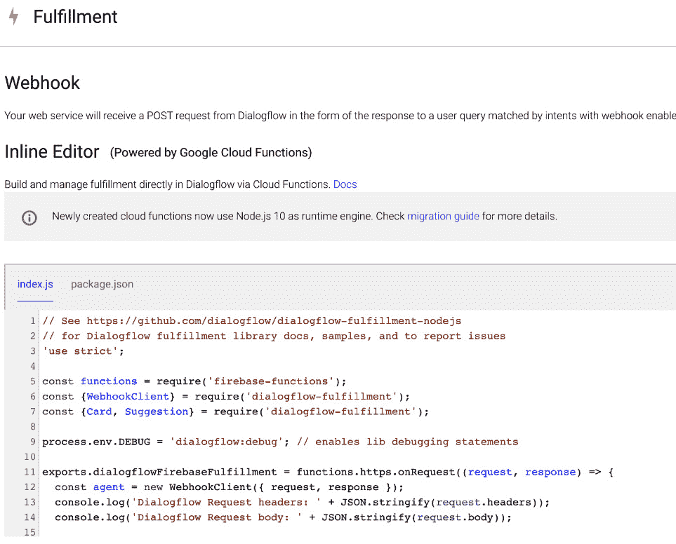

现在，让我们学习如何在 Dialogflow 中使用意图。意图是用户想要执行的动作或用户提出的问题。例如，假设他们想订一份比萨饼、预约或想了解更多关于贵公司的信息。在 Dialogflow 中，我们可以创建一个能够理解用户意图并自动回复的代理。

当您创建一个新代理时(正如我们在这里所做的)，Dialogflow 默认创建两个意图:

*   **默认欢迎意向**
*   **默认回退意图**

这些可以在下面的截图中看到:

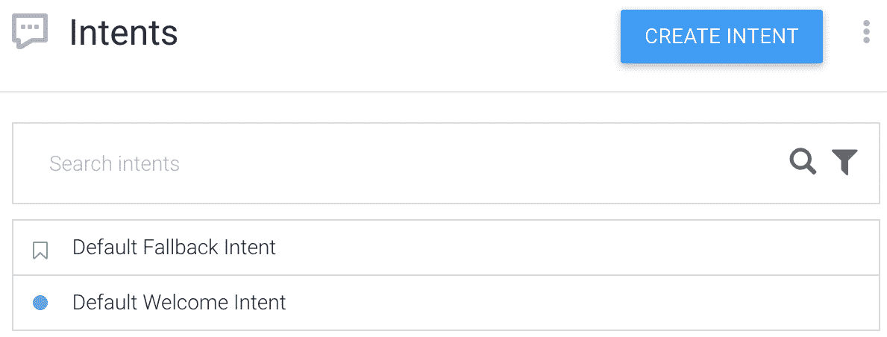

让我们看看**默认欢迎意图**里面的是什么。为此，点击**默认欢迎意图**上的。这个目的是为了理解问候，如你好，嗨，和其他:

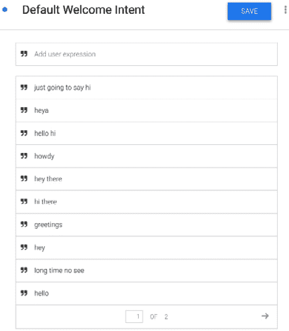

每个意图包括两个主要部分:

*   训练阶段
*   响应阶段

训练阶段帮助 Dialogflow 理解用户的意图，而响应阶段涉及 Dialogflow 理解问候。如果是这样，它会用一些文本进行响应，这些文本将在**响应**部分提供:

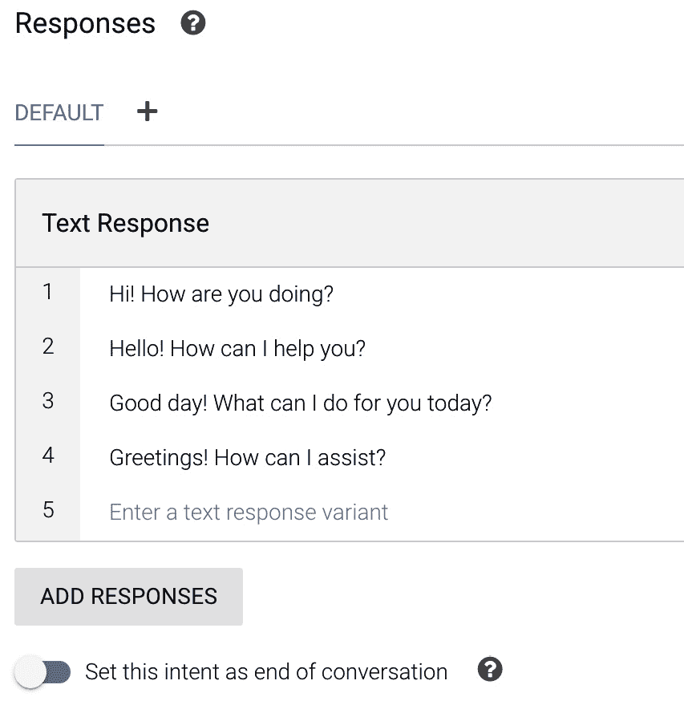

Dialogflow 提供的另一个默认意图是**默认回退意图**。这里，当 Dialogflow 不理解用户时，它将使用在**默认回退意图**中作为文本响应提供的一段文本进行响应:

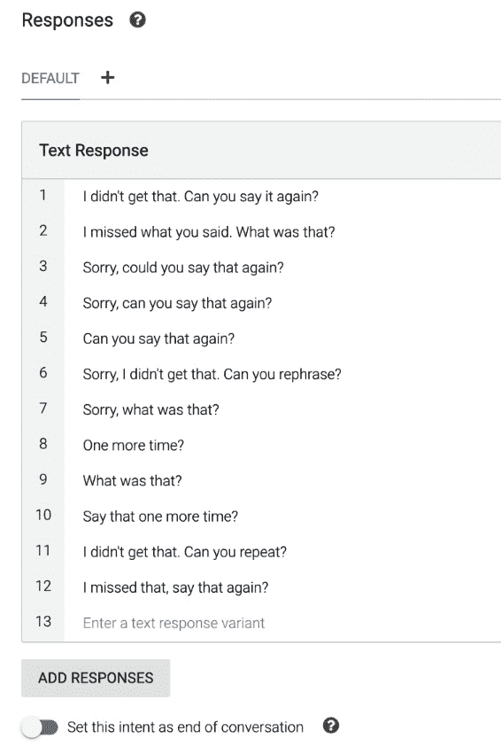

现在，让我们深入创建一个意图(如前所述，我们将构建一个聊天机器人，用户将在其中订购披萨)。

要创建一个新意图，点击**创建意图**，如下图所示:

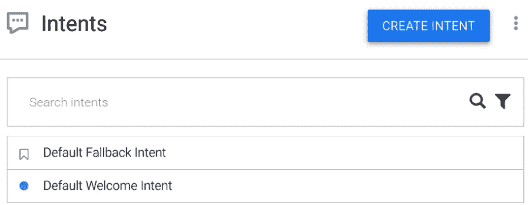

我们将第一个意图命名为`opening_times`，如下所示:

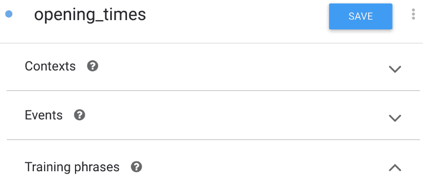

点击**添加训练短语**。在这里，我们将提供用户如何表达其意图的示例:

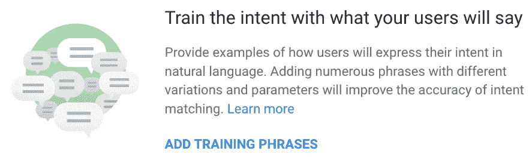

让我们添加几个训练短语，如下面截图中的所示:

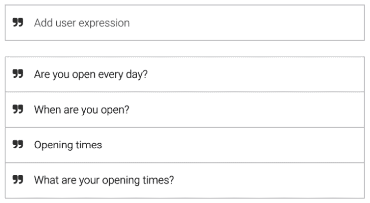

接下来，我们需要添加一些响应。点击**添加响应**，如下图所示:

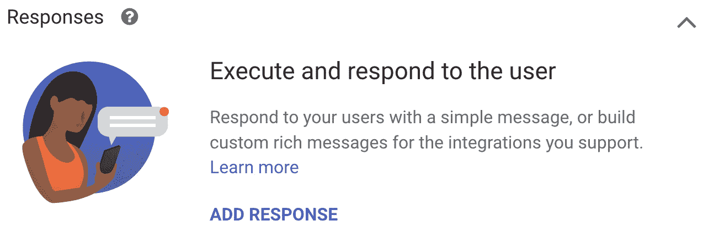

我们将在此仅添加一个回答，但请记住，您可以针对特定意图添加多个回答:

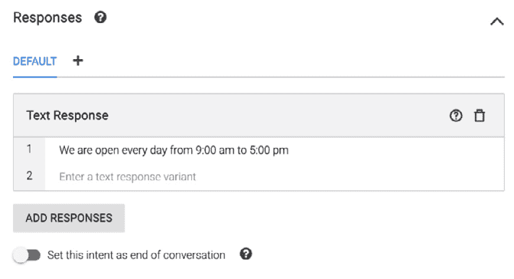

当你完成训练短语和回答后，保存它们；他们将自动开始训练代理。Dialogflow 需要训练代理回答问题。这将花费几秒钟(或者几分钟，如果你有一个长的输入)；训练完成后会通知你。

现在，让我们试试我们训练有素的特工。在页面的右侧，您会看到一个小区域，您可以在这里尝试您的训练代理。

让我们为我们的代理打一个问题。让我们问问他们今天是否营业，看看我们会得到什么样的回应:

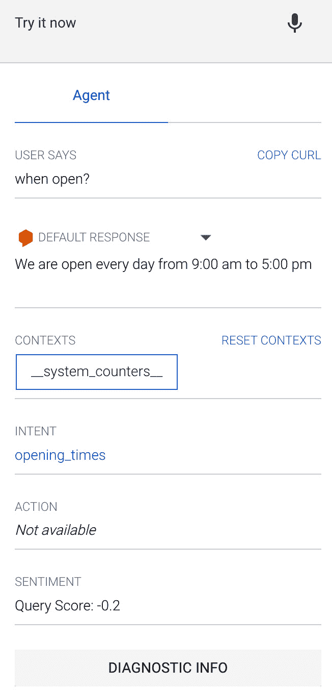

在这个代理中，我们可以创建多个意图。Dialogflow 将理解使用哪些意图，并响应用户的问题。

现在，让我们为订购比萨饼创建一个新的意图。从左侧菜单中点击**意图**，并点击**创建意图**。下面的屏幕截图显示了一些您可以使用的表达式:

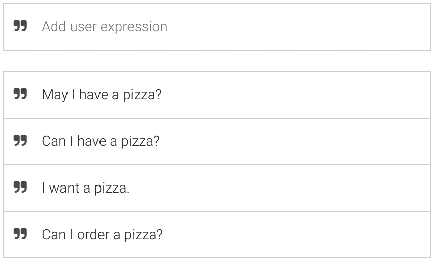

现在，对该问题提供一个答案(如果您愿意，可以添加更多答案):

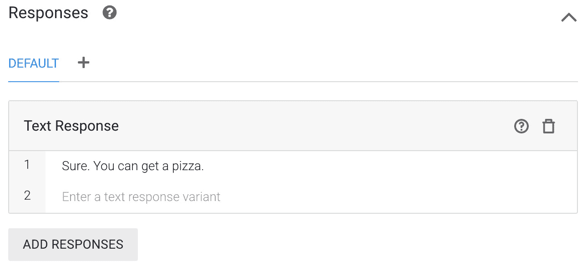

保存您的意图后，您的代理将接受重新训练。让我们测试一下我们的代理:

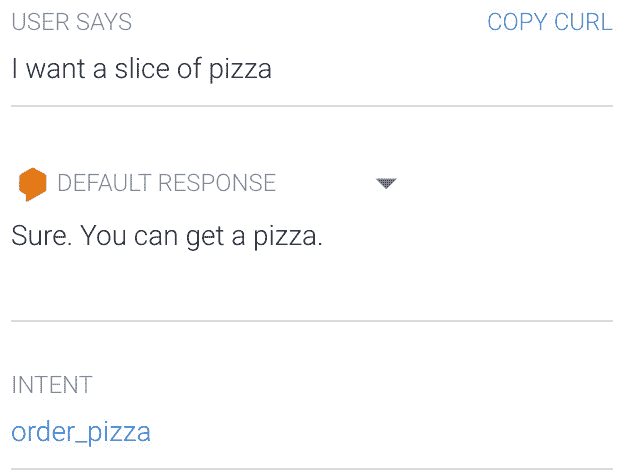

请注意，用户的短语与训练阶段不同，但 Dialogflow 仍然理解其意图并给出正确的响应。

如果用户需要提供更多的细节，比如比萨饼的不同浇头，那么 Dialogflow 将需要使用尚未创建的实体。因此，我们需要创建一个实体。

从左侧菜单中，点击**实体**，然后点击**创建实体**，如下图所示:

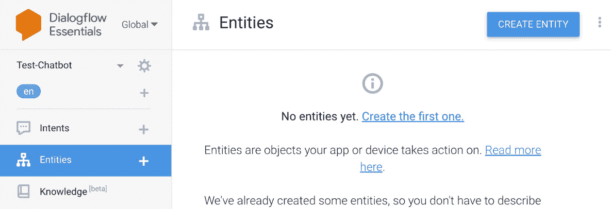

我们将使用`topping`作为实体的名称。检查`topping`:

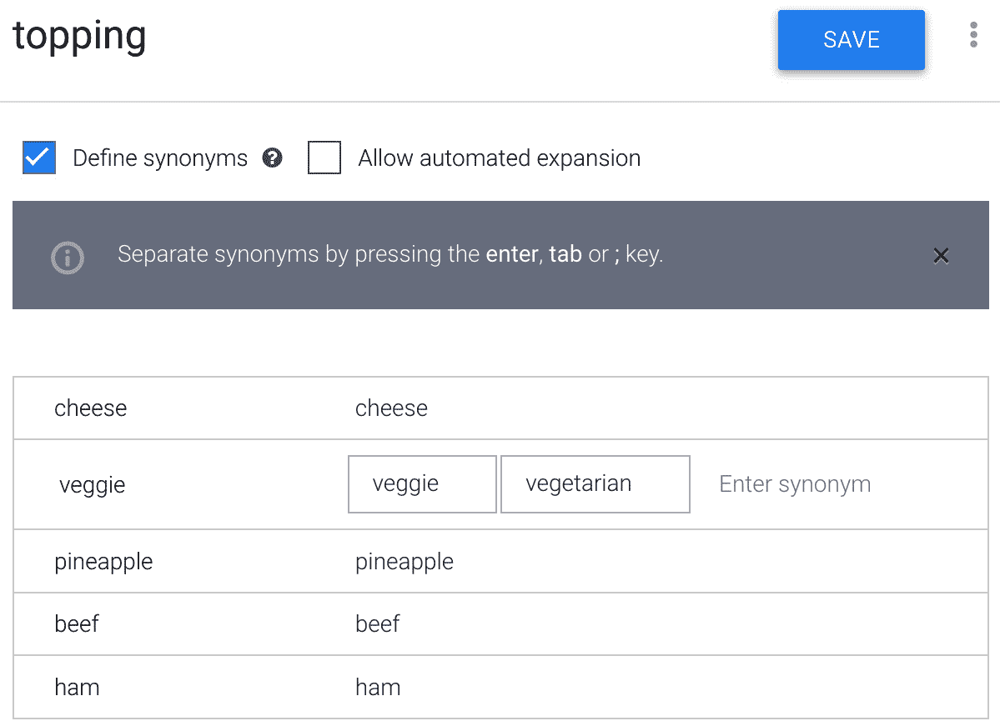

点击**保存**。

让我们回到我们点披萨的意图，用一些点披萨的细节创建一个新的训练短语，比如“我想点奶酪披萨。”

以下是订购比萨饼的一些附加表达:

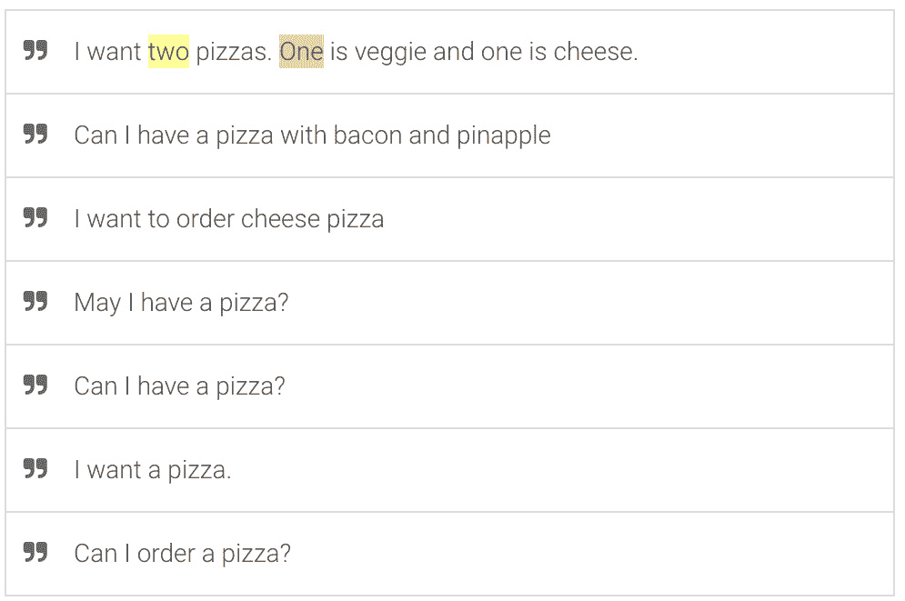

注意，当我们键入`two`时，它会自动检测实体:

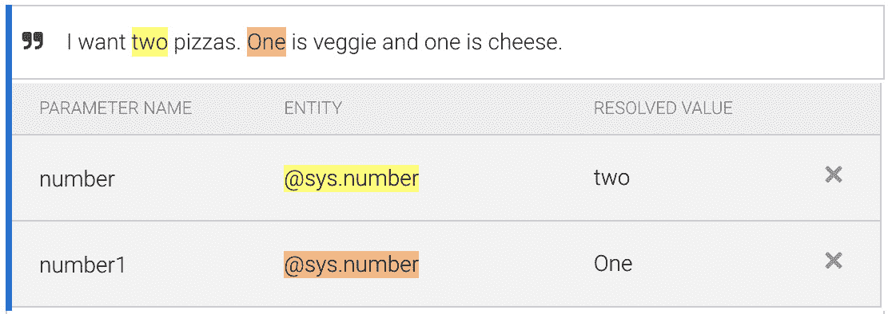

`@sys.number`是 Dialogflow 中的内置实体，它捕获/识别对话框中的数字。还有其他内置实体可以识别电子邮件、地址、电话号码和其他细节。查看[https://cloud . Google . com/dialog flow/es/docs/reference/system-entities](https://cloud.google.com/dialogflow/es/docs/reference/system-entities)了解更多内置实体。以下是一些例子:

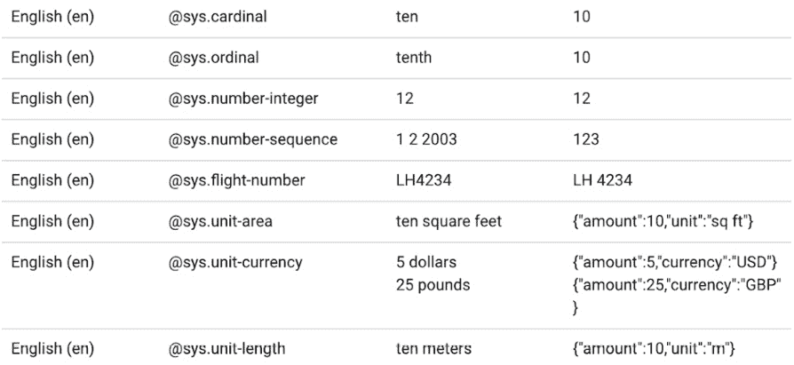

在我们的例子中，我们正在构建实体，所以我们需要将一些单词映射到一个实体。这将让我们看到句子的哪个部分与哪个实体相关。只需从我们在 **Intents** 部分使用的表达式中选择一个单词或短语，并将其分配给已创建的实体，如下所示:

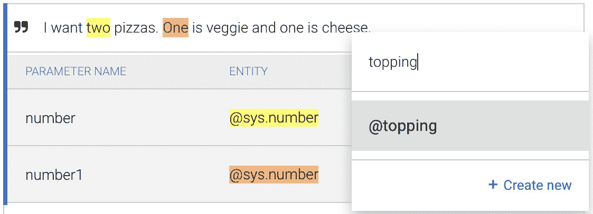

选择实体后，您可以从训练表达式中选择其他单词或短语，并将其映射到该实体:

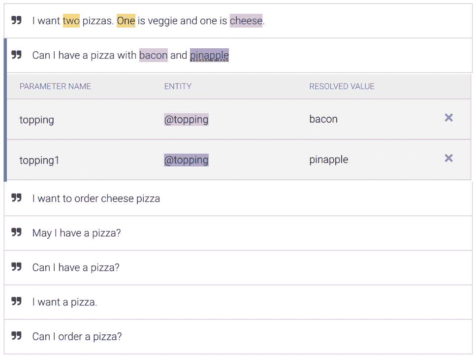

在这个例子中，我们有两个不同的实体——`@sys.number`和`@topping`:

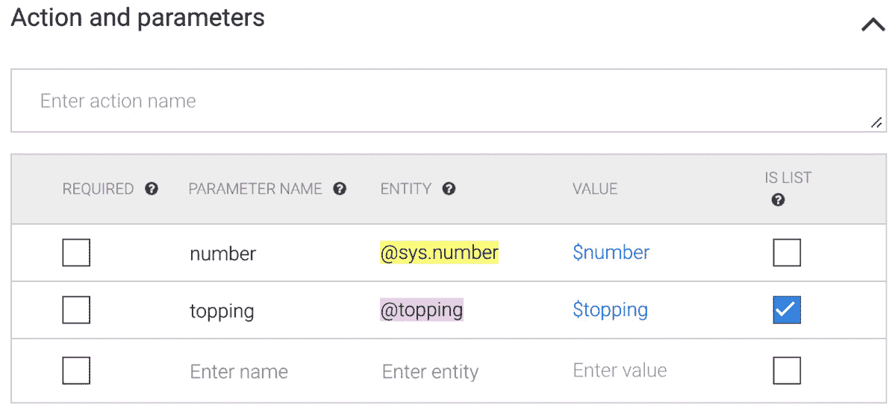

我们还可以用更动态的答案来改变或修改回应:

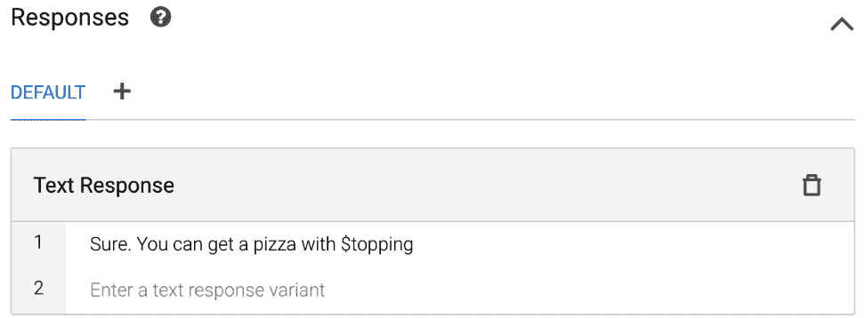

点击**保存**按钮训练代理并测试/试用聊天机器人:


如果用户提供关于比萨饼配料的信息，我们需要加强额外的问题来收集特定的信息。在**必填**部分点击**套料**旁边的复选框，点击**定义提示**，如下图所示:


添加用户将被询问的问题，如下所示:


点击**关闭**并保存代理。请注意，您也可以添加更多提示。现在，让我们测试代理，它对浇头一无所知:


这样，我们就有了一个具有基本功能的非常简单的聊天机器人。但在现实生活中，我们会不断询问用户是否有任何其他问题*或*他们是否想在当前订单中添加一些其他项目。在我们的例子中，我们有一个聊天机器人，用户可以在这里订购比萨饼。除了询问比萨饼及其配料，我们还可以问他们是否想再吃一个比萨饼*或者*是否想加点饮料。这个特征被称为**后续意图**。要启用此功能，点击**订单 _ 披萨**意向旁边的**添加跟进意向**，如下所示:


因此，如果用户想要继续添加另一个披萨，他们可以简单地回答 **YES** 。点击**是**添加跟进意向:


点击**订单 _ 披萨-是**部分；您将被带到一个页面，在那里您可以修改该部分的内容。

在我们的例子中，我们将更改 intent 的名称，保持所有训练短语不变(它们在我们的例子中已经足够好了)，并添加一个声明为`Great! What topping do you want on your pizza?`的响应。然后，点击**保存**:


但是如果用户对这个后续问题回答**否**(要不要再加点披萨？)?在这种情况下，我们想问他们是否要在他们的订单中添加一种饮料。正如我们之前对所做的那样，从跟进意图中，选择**否**，点击子意图并更改其标题(可选)，保留所有训练短语不变，并键入答案，如以下截图所示:


保存代理后，可以尝试和 bot 聊天。您可以根据您设计的对话架构不断添加跟进问题或新意图。

# 总结

在本附录中，我们提供了如何使用各种 Google Cloud ML APIs 的示例，包括 Vision API、NLP API、语音到文本 API、文本到语音 API、翻译 API 和 Dialogflow API。