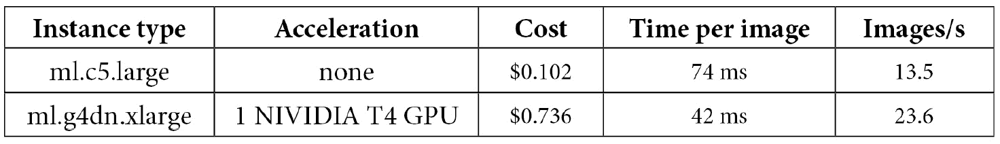
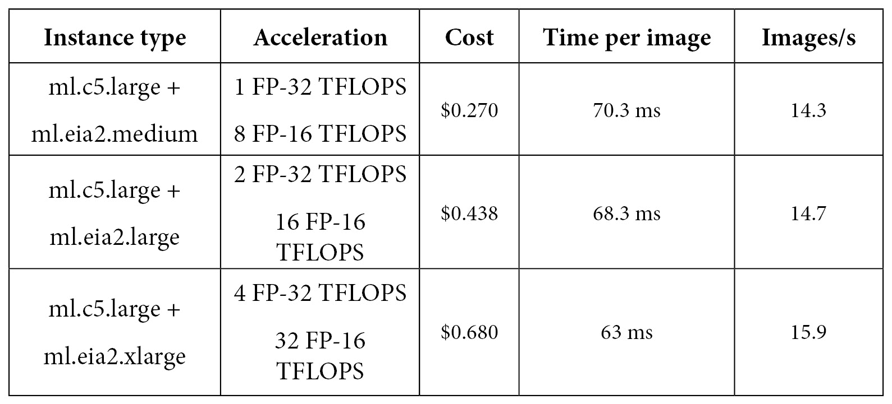
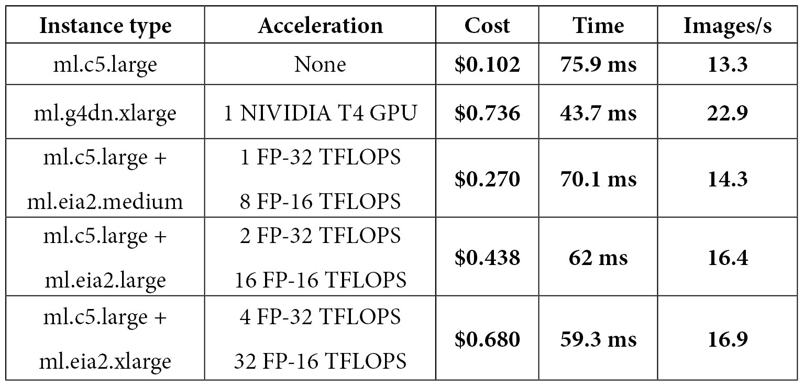

# 第十三章:优化预测成本和性能

在前一章中，您学习了如何自动化培训和部署工作流。

在这最后一章中，我们将重点关注优化预测基础设施的成本和性能，这通常占 AWS 客户机器学习支出的 90%。这个数字可能会令人惊讶，直到我们意识到由单个培训工作构建的模型可能会在大规模 24/7 运行的多个端点上结束。

因此，必须非常小心地优化您的预测基础设施，以确保您获得最大的回报！

本章包含以下主题:

*   自动缩放端点
*   部署多模型端点
*   使用 Amazon 弹性推理部署模型
*   使用 Amazon SageMaker Neo 编译模型

# 技术要求

您将需要一个 AWS 帐户来运行本章中包含的示例。如果您还没有，请将浏览器指向[https://aws.amazon.com/getting-started/](https://aws.amazon.com/getting-started/)来创建它。您还应该熟悉 AWS 免费层([https://aws.amazon.com/free/](https://aws.amazon.com/free/))，它允许您在一定的使用限制内免费使用许多 AWS 服务。

您需要为您的帐户([https://aws.amazon.com/cli/](https://aws.amazon.com/cli/))安装和配置 AWS **命令行界面** ( **CLI** )。

您将需要一个工作的 Python 3.x 环境。安装 Anaconda 发行版([https://www.anaconda.com/](https://www.anaconda.com/))不是强制性的，但是强烈建议安装，因为它包含了我们将需要的许多项目(Jupyter、`pandas`、`numpy`等等)。

书中包含的代码示例可在 GitHub 上获得，网址为[https://GitHub . com/packt publishing/Learn-Amazon-sage maker-second-edition](https://github.com/PacktPublishing/Learn-Amazon-SageMaker-second-edition)。你需要安装一个 Git 客户端来访问它们(【https://git-scm.com/】T21)。

# 自动缩放端点

长期以来，自动缩放一直是为输入流量调整基础设施规模的最重要技术，它可用于 SageMaker 端点。然而，它是基于**应用程序自动缩放**而不是基于 **EC2 自动缩放**([https://docs . AWS . Amazon . com/Auto Scaling/Application/user guide/what-is-Application-Auto-Scaling . html](https://docs.aws.amazon.com/autoscaling/application/userguide/what-is-application-auto-scaling.html))，尽管概念极其相似。

让我们为我们在波士顿住房数据集上训练的 **XGBoost** 模型设置自动缩放:

1.  我们首先创建一个**端点配置**，并使用它来构建端点。这里，我们使用 m5 实例族；不建议将 t2 和 t3 用于自动扩展，因为它们的突发行为使得测量它们的实际负载更加困难:

    ```
    model_name = 'sagemaker-xgboost-2020-06-09-08-33-24-782' endpoint_config_name = 'xgboost-one-model-epc' endpoint_name = 'xgboost-one-model-ep' production_variants = [{     'VariantName': 'variant-1',     'ModelName': model_name,     'InitialInstanceCount': 2,     'InitialVariantWeight': 1,     'InstanceType': 'ml.m5.large'}] sm.create_endpoint_config(     EndpointConfigName=endpoint_config_name,     ProductionVariants=production_variants) sm.create_endpoint(     EndpointName=endpoint_name,     EndpointConfigName=endpoint_config_name)
    ```

2.  一旦端点在服务中，我们定义想要缩放的目标值，即支持端点的实例数量:

    ```
    app = boto3.client('application-autoscaling') app.register_scalable_target(  ServiceNamespace='sagemaker',  ResourceId=      'endpoint/xgboost-one-model-ep/variant/variant-1',  ScalableDimension=     'sagemaker:variant:DesiredInstanceCount',  MinCapacity=2,  MaxCapacity=10)
    ```

3.  然后，我们为这个目标值应用一个缩放策略:

    ```
    policy_name = 'xgboost-scaling-policy' app.put_scaling_policy(  PolicyName=policy_name,  ServiceNamespace='sagemaker',  ResourceId=    'endpoint/xgboost-one-model-ep/variant/variant-1',  ScalableDimension=    'sagemaker:variant:DesiredInstanceCount',  PolicyType='TargetTrackingScaling',
    ```

4.  我们使用 SageMaker 中唯一可用的内置指标`SageMakerVariantInvocationsPerInstance`。如果我们愿意，我们也可以定义一个定制的指标。我们将指标阈值设置为每分钟 1，000 次调用。这是一个任意值。在现实生活中，我们会在单个实例上运行负载测试，并监控模型延迟，以便找到应该触发自动伸缩的实际值。你可以在[https://docs . AWS . Amazon . com/sage maker/latest/DG/endpoint-scaling-load test . html](https://docs.aws.amazon.com/sagemaker/latest/dg/endpoint-scaling-loadtest.html)找到更多信息。我们还为缩放定义了 60 秒的冷却时间，这是平滑瞬时流量下降和峰值的好方法:

    ```
     TargetTrackingScalingPolicyConfiguration={    'TargetValue': 1000.0,    'PredefinedMetricSpecification': {        'PredefinedMetricType':         'SageMakerVariantInvocationsPerInstance'     },    'ScaleInCooldown': 60,    'ScaleOutCooldown': 60  } )
    ```

5.  As shown in the following screenshot, autoscaling is now configured on the endpoint:

    图 13.1–查看自动缩放

6.  使用无限循环，我们向端点

    ```
    test_sample = '0.00632, 18.00, 2.310, 0, 0.5380, 6.5750, 65.20, 4.0900, 1, 296.0, 15.30, 396.90, 4.98' smrt=boto3.Session().client(service_name='runtime.sagemaker')  while True:     smrt.invoke_endpoint(EndpointName=endpoint_name,                          ContentType='text/csv',                          Body=test_sample)
    ```

    发送一些流量
7.  Looking at the **CloudWatch** metrics for the endpoints, as shown in the following screenshot, we see that invocations per instance exceed the threshold we defined: 1.42k versus 1k:

    图 13.2–查看云观察指标

8.  Autoscaling quickly kicks in and decides to add another instance, as visible in the following screenshot. If the load was even higher, it could decide to add several instances at once:

    图 13.3–查看自动缩放

9.  A few minutes later, the extra instance is in service, and invocations per instance are now below the threshold (935 versus 1,000):

    图 13.4–查看云观察指标

    当交通流量减少时，类似的过程发生。

10.  一旦我们完成，我们删除一切:

    ```
    app.delete_scaling_policy(  PolicyName=policy_name,  ServiceNamespace='sagemaker',  ScalableDimension='sagemaker:variant :DesiredInstanceCount',  ResourceId='endpoint/xgboost-one-model-ep/variant/variant-1') sm.delete_endpoint(EndpointName=endpoint_name) sm.delete_endpoint_config(   EndpointConfigName=endpoint_config_name)
    ```

设置自动缩放很容易。它帮助您自动调整预测基础设施和相关成本，以适应不断变化的业务环境。

现在，让我们研究另一种技术，当您处理大量模型时，您会发现这种技术非常有用:**多模型端点**。

# 部署多模型端点

当您处理大量模型时，多模型端点是有用的,因为部署到单个端点是没有意义的。例如，假设一家 SaaS 公司为他们的 10，000 名客户中的每一位构建了一个回归模型。当然，他们不想管理(并支付)10，000 个终端！

## 了解多模型端点

一个多模型端点可以根据存储在 S3 的任意数量的模型提供基于 CPU 的预测(在撰写本文时不支持 GPU)。要使用的模型工件的路径在每个预测请求中传递。根据端点上的使用情况和可用内存量，动态地加载和卸载模型。通过简单地复制或删除 S3 中的工件，还可以在端点中添加或删除模型。

为了服务于多个模型，您的推理容器必须实现端点将调用的一组特定的 API:加载模型、列表模型、获取模型、卸载模型和调用模型。详情可以在[https://docs . AWS . Amazon . com/sage maker/latest/DG/MMS-container-APIs . html](https://docs.aws.amazon.com/sagemaker/latest/dg/mms-container-apis.html)找到。

在撰写本文时， **scikit-learn** 、 **TensorFlow** 、 **Apache MXNet** 和 **PyTorch** 的最新内置容器原生支持这些 API。 **XGBoost** 、 **kNN** 、**线性学习器**、**随机切割森林**内置算法也支持。

对于其他算法和框架，你最好的选择是构建一个包含 **SageMaker 推理工具包**的定制容器，因为它已经实现了所需的 API([https://github.com/aws/sagemaker-inference-toolkit](https://github.com/aws/sagemaker-inference-toolkit))。

这个工具包基于多模型服务器([https://github.com/awslabs/multi-model-server](https://github.com/awslabs/multi-model-server))，您也可以从 CLI 直接使用它来提供来自多个模型的预测。你可以在[https://docs . AWS . Amazon . com/sage maker/latest/DG/build-multi-model-build-container . html](https://docs.aws.amazon.com/sagemaker/latest/dg/build-multi-model-build-container.html)找到更多信息。

## 使用 scikit-learn 构建多模型端点

让我们用 **scikit-learn** 构建一个多模型端点，托管在 Boston Housing 数据集上训练的模型。这仅在 scikit-learn 0.23-1 及更高版本上受支持:

1.  我们将数据集上传到 S3:

    ```
    import sagemaker, boto3 sess = sagemaker.Session() bucket = sess.default_bucket() prefix = 'sklearn-boston-housing-mme' training = sess.upload_data(path='housing.csv',                              key_prefix=prefix +                              '/training') output = 's3://{}/{}/output/'.format(bucket,prefix)
    ```

2.  我们用不同的测试规模训练三个模型，将它们的名字存储在字典中。这里，我们使用最新版本的 scikit-learn，它是第一个支持多模型端点的版本:

    ```
    from sagemaker.sklearn import SKLearn jobs = {} for test_size in [0.2, 0.1, 0.05]:     sk = SKLearn(entry_point=                 'sklearn-boston-housing.py',         role=sagemaker.get_execution_role(),         framework_version='0.23-1',         instance_count=1,         instance_type='ml.m5.large',         output_path=output,         hyperparameters={ 'normalize': True,                           'test-size': test_size }     )     sk.fit({'training':training}, wait=False)     jobs[sk.latest_training_job.name] = {}     jobs[sk.latest_training_job.name]['test-size'] =            test_size
    ```

3.  我们找到了模型艺术品的 S3·URI 以及它的前缀:

    ```
    import boto3 sm = boto3.client('sagemaker') for j in jobs.keys():     job = sm.describe_training_job(TrainingJobName=j)     jobs[j]['artifact'] =         job['ModelArtifacts']['S3ModelArtifacts']     jobs[j]['key'] = '/'.join(         job['ModelArtifacts']['S3ModelArtifacts']         .split('/')[3:])
    ```

4.  我们删除存储在 S3 的任何以前的模型:

    ```
    %%sh -s "$bucket" "$prefix" aws s3 rm --recursive s3://$1/$2/models
    ```

5.  We copy the three model artifacts to this location:

    ```
    s3 = boto3.client('s3')
    for j in jobs.keys():
        copy_source = { 'Bucket': bucket, 
                        'Key': jobs[j]['key'] }
        s3.copy_object(CopySource=copy_source,  
                       Bucket=bucket, 
                       Key=prefix+'/models/'+j+'.tar.gz')
    response = s3.list_objects(Bucket=bucket, 
                               Prefix=prefix+'/models/')
    for o in response['Contents']:
        print(o['Key'])
    ```

    这列出了型号工件:

    ```
    sklearn-boston-housing-mme/models/sagemaker-scikit-learn-2021-09-01-07-52-22-679
    sklearn-boston-housing-mme/models/sagemaker-scikit-learn-2021-09-01-07-52-26-399
    sklearn-boston-housing-mme/models/sagemaker-scikit-learn-2021-09-01-08-05-33-229
    ```

6.  我们定义脚本的名称和我们将上传代码存档的 S3 位置。在这里，我将传递训练脚本，它包括一个用于加载模型的`model_fn()`函数。这是唯一用于预测的函数:

    ```
    script = 'sklearn-boston-housing.py' script_archive = 's3://{}/{}/source/source.tar.gz'.                  format(bucket, prefix)
    ```

7.  我们创建代码档案，并上传到 S3:

    ```
    %%sh -s "$script" "$script_archive" tar cvfz source.tar.gz $1 aws s3 cp source.tar.gz $2
    ```

8.  我们用`create_model()` API 创建了多模型端点，并相应地设置了`Mode`参数:

    ```
    import time model_name = prefix+'-'+time.strftime("%Y-%m-%d-%H-%M-%S", time.gmtime()) response = sm.create_model(   ModelName = model_name,   ExecutionRoleArn = role,   Containers = [{     'Image': sk.image_uri,     'ModelDataUrl':'s3://{}/{}/models/'.format(bucket,                      prefix),     'Mode': 'MultiModel',     'Environment': {         'SAGEMAKER_PROGRAM' : script,         'SAGEMAKER_SUBMIT_DIRECTORY' : script_archive     }   }] )
    ```

9.  我们像往常一样创建端点配置:

    ```
    epc_name = prefix+'-epc'+time.strftime("%Y-%m-%d-%H-%M-%S", time.gmtime()) response = sm.create_endpoint_config(     EndpointConfigName = epc_name,     ProductionVariants=[{         'InstanceType': 'ml.m5.large',         'InitialInstanceCount': 1,         'InitialVariantWeight': 1,         'ModelName': model_name,         'VariantName': 'variant-1'}] )
    ```

10.  我们照常创建端点:

    ```
    ep_name = prefix+'-ep'+time.strftime("%Y-%m-%d-%H-%M-%S", time.gmtime()) response = sm.create_endpoint(     EndpointName=ep_name,     EndpointConfigName=epc_name)
    ```

11.  一旦端点投入使用，我们就从数据集加载样本，并将它们转换成一个`numpy`数组:

    ```
    import pandas as pd import numpy as np from io import BytesIO data = pd.read_csv('housing.csv') payload = data[:10].drop(['medv'], axis=1) buffer = BytesIO() np.save(buffer, payload.values)
    ```

12.  我们使用所有三个模型来预测这些样本，传递模型的名称以用于每个预测请求，例如**sagemaker-scikit-learn-2021-09-01-08-05-33-229**:

    ```
    smrt = boto3.client('runtime.sagemaker') for j in jobs.keys():     model_name=j+'.tar.gz'     response = smrt.invoke_endpoint(         EndpointName=ep_name,         TargetModel=model_name,         Body=buffer.getvalue(),         ContentType='application/x-npy')     print(response['Body'].read())
    ```

13.  我们可以训练更多的模型，将它们的工件复制到相同的 S3 位置，并直接使用它们，而无需重新创建端点。我们也可以删除那些我们不需要的模型。
14.  完成后，我们删除端点:

    ```
    sm.delete_endpoint(EndpointName=ep_name) sm.delete_endpoint_config(EndpointConfigName=epc_name)
    ```

正如您所看到的，多模型端点是从单个端点服务任意多个模型的好方法，并且设置它们并不困难。

在下一节中，我们将研究另一种成本优化技术，它可以帮助您在 GPU 预测上节省大量资金:**亚马逊弹性推理**。

# 使用亚马逊弹性推理部署模型

当部署一个模型时，您必须决定它应该在 CPU 实例上运行还是在 GPU 实例上运行。在某些情况下，没有太多的争论。例如，一些算法根本无法从 GPU 加速中受益，因此应该将其部署到 CPU 实例中。另一方面，计算机视觉或自然语言处理的复杂深度学习模型在 GPU 上运行得最好。

在许多情况下，情况并不那么明朗。首先，您应该知道您的应用程序的最大预测延迟是多少。如果你预测一个实时广告技术应用的点击率，每一毫秒都很重要；如果你预测后台应用程序中的客户流失，那就没那么多了。

此外，即使是能够受益于 GPU 加速的模型也可能不够大和复杂，无法充分利用现代 GPU 上的数千个内核。在这种情况下，您陷入了进退两难的境地:在 CPU 上部署对于您的需求来说有点慢，而在 GPU 上部署又不划算。

这就是亚马逊弹性推理旨在解决的问题([https://aws.amazon.com/machine-learning/elastic-inference/](https://aws.amazon.com/machine-learning/elastic-inference/))。它允许您将分数 GPU 加速附加到任何 EC2 实例，包括笔记本实例和端点实例。**加速器**有三种不同的尺寸(中号、大号和特大号)，让您找到最适合您应用的性价比。

**TensorFlow** 、 **PyTorch** 和 **Apache MXNet** 都有弹性推理。由于在**深度学习 AMI** 中可用的 AWS 扩展，您可以在运行于 EC2 实例上的自己的代码中使用它。也可以配合**深度学习容器**使用。更多信息请访问[https://docs . AWS . Amazon . com/elastic-inference/latest/developer guide/working-with-ei . html](https://docs.aws.amazon.com/elastic-inference/latest/developerguide/working-with-ei.html)。

当然**弹性推断**在 SageMaker 上是有的。您可以在创建时将加速器附加到**笔记本实例**，并使用内置的 **conda** 环境。您还可以将一个加速器附加到一个端点上，我们将在下一个例子中向您展示如何实现这一点。

## 使用亚马逊弹性推理部署模型

让我们重复使用第五章 、*训练计算机视觉模型*中的关于狗和猫的图像的**图像分类**模型。这是基于一个 18 层 **ResNet** 模型，就卷积神经网络而言，这个模型非常小:

1.  一旦模型被训练好，我们照常在两个端点上部署它:一个由一个`ml.c5.large`实例支持，另一个由一个`ml.g4dn.xlarge`实例支持，这是 SageMaker:

    ```
    import time endpoint_name = 'c5-'+time.strftime("%Y-%m-%d-%H-%M-%S", time.gmtime()) c5_predictor = ic.deploy(initial_instance_count=1,                          instance_type='ml.c5.large',                          endpoint_name=endpoint_name,                          wait=False) endpoint_name = 'g4-'+time.strftime("%Y-%m-%d-%H-%M-%S", time.gmtime()) g4_predictor = ic.deploy(     initial_instance_count=1,     instance_type='ml.g4dn.xlarge',     endpoint_name=endpoint_name,     wait=False)
    ```

    上最具成本效益的 GPU 实例
2.  然后，我们下载一个测试图像，预测 1000 次，并测量花费的总时间:

    ```
    with open(file_name, 'rb') as f:     payload = f.read()     payload = bytearray(payload) def predict_images(predictor, iterations=1000):     total = 0     for i in range(0, iterations):         tick = time.time()         response = runtime.invoke_endpoint(             EndpointName=predictor.endpoint_name,                                              ContentType='application/x-image',             Body=payload)         tock = time.time()         total += tock-tick     return total/iterations predict_images(c5_predictor) predict_images(g4_predictor)
    ```

3.  The results are shown in the next table (us-east-1 prices):

    不出所料，GPU 实例的速度大约是两倍。然而，CPU 实例更具成本效益，因为它便宜四倍多。换句话说，您可以用四个 CPU 实例而不是一个 GPU 实例运行您的端点，并以相同的成本获得更多的吞吐量。这说明了为什么理解应用程序的延迟需求如此重要。“快”和“慢”是非常相对的概念！

4.  We then deploy the same model on three more endpoints backed by `ml.c5.large` instances, accelerated by a medium, large, and extra-large `deploy()` API. Here's the code for the medium endpoint:

    ```
    endpoint_name = 'c5-medium-'
       +time.strftime("%Y-%m-%d-%H-%M-%S", time.gmtime())
    c5_medium_predictor = ic.deploy(
        initial_instance_count=1,
        instance_type='ml.c5.large',
        accelerator_type='ml.eia2.medium',
        endpoint_name=endpoint_name,
        wait=False)
    predict_images(c5_medium_predictor)
    ```

    您可以在下表中看到结果:

    

    与裸 CPU 端点相比，我们获得了高达 20%的速度提升，并且成本低于使用 GPU 实例的情况。让我们继续调整:

5.  细心的读者会注意到前面的表包括 32 位和 16 位浮点值的万亿次浮点值。实际上，这些数据类型中的任何一种都可以用来存储模型参数。查看图像分类算法的文档，我们看到我们实际上可以用`precision_dtype`参数选择数据类型，默认值是`float32`。这就引出了一个问题:如果我们在`float16`模式下训练我们的模型，结果会不同吗？只有一个方法知道，不是吗？

    ```
    ic.set_hyperparameters(     num_layers=18,                            use_pretrained_model=0,     num_classes=2     num_training_samples=22500,     mini_batch_size=128,     precision_dtype='float16',     epochs=10)                   
    ```

6.  再次训练，我们达到了与`float32`模式相同的模型精度。再次部署基准测试，我们得到以下结果:



在裸实例上看不到有意义的差异。与 **FP-32** 模型相比，在大型和超大加速器上使用 **FP-16** 模型进行预测可以帮助我们将预测速度提高约 10%。相当不错！与裸 CPU 实例相比，这种性能水平绝对是一种不错的升级，与 GPU 实例相比，这种性能水平也很划算。

事实上，将单个端点实例从`ml.g4dn.xlarge`切换到`ml.c5.large+ml.eia2.large`将为您每月节省$ 0.736–0.438 x 24x 30 = 214 美元。那可是一大笔钱！

正如您所看到的，Amazon Elastic Inference 非常容易使用，它为您提供了额外的部署选项。一旦您定义了应用程序的预测延迟需求，您就可以快速试验并找到最佳性价比。

现在，让我们谈谈另一个 SageMaker 功能，它可以让你为特定的硬件架构编译模型: **Amazon Neo** 。

# 使用亚马逊 SageMaker Neo 编译模型

嵌入式软件开发人员早就学会了如何编写高度优化的代码，既能快速运行，又能节省硬件资源。理论上，同样的技术也可以应用于优化机器学习预测。实际上，考虑到机器学习库和模型的复杂性，这是一项艰巨的任务。

这就是亚马逊 SageMaker Neo 旨在解决的问题。

## 了解亚马逊 SageMaker Neo

亚马逊 Neo 有两个组件:一个为底层硬件优化模型的模型编译器，和一个名为**深度学习运行时** ( **DLR** )的小型运行时，用于加载优化模型和运行预测([https://aws.amazon.com/sagemaker/neo](https://aws.amazon.com/sagemaker/neo))。

Amazon SageMaker Neo 可以编译经过以下训练的模型:

*   **两个内置算法** : XGBoost 和图像分类。
*   **内置框架** : TensorFlow、PyTorch、Apache MXNet，以及 **ONNX** 格式的模型。支持很多操作符，你可以在[https://AWS . Amazon . com/release notes/sage maker-neo-supported-frameworks-and-operators](https://aws.amazon.com/releasenotes/sagemaker-neo-supported-frameworks-and-operators)找到完整的列表。

训练照常进行，使用您选择的评估者。然后，使用`compile_model()` API，我们可以轻松地为这些硬件目标之一编译模型:

*   以下家族的 Amazon EC2 实例:`c4`、`c5`、`m4`、`m5`、`p2`、`p3`和`inf1`(我们将在本章后面讨论)，以及 Lambda
*   人工智能相机:AWS DeepLens 和 Acer aiSage
*   NVIDIA Jetson 平台:TX1、TX2、Nano 和 Xavier
*   树莓派
*   来自 Rockchip、高通、Ambarella 等公司的片上系统平台

模型编译执行架构优化(如融合层)和代码优化(用硬件优化版本替换机器学习运算符)。最终的工件存储在 S3，包含原始模型及其优化形式。

然后，DLR 用于加载模型并使用它进行预测。当然，它可以以独立的方式使用，比如在 Raspberry Pi 上。你可以在[https://neo-ai-DLR . readthedocs . io](https://neo-ai-dlr.readthedocs.io)找到安装说明。由于 DLR 是开源的([https://github.com/neo-ai/neo-ai-dlr](https://github.com/neo-ai/neo-ai-dlr))，您也可以从源代码构建它，为什么不呢？–针对您自己的硬件平台进行定制！

当使用带有 SageMaker 的 DLR 时，事情就简单多了。SageMaker 提供了支持 Neo 的内置容器，您应该使用这些容器来部署用 Neo 编译的模型(如前所述，培训容器保持不变)。您可以在[https://docs . AWS . Amazon . com/sage maker/latest/DG/Neo-deployment-hosting-services-CLI . html](https://docs.aws.amazon.com/sagemaker/latest/dg/neo-deployment-hosting-services-cli.html)中找到启用 Neo 的容器列表。

最后，但同样重要的是，DLR 的一个好处是它的体积小。例如，p2 和 p3 实例的 Python 包大小仅为 5.4 MB，比典型的深度学习库及其依赖项小几个数量级。这显然对嵌入式环境至关重要，而且在 SageMaker 上也很受欢迎，因为容器也会变得更小。

让我们重复使用我们的图像分类示例，看看 Neo 是否可以加快它的速度。

## 在 SageMaker 上编译和部署图像分类模型

为了给尼奥多一点工作，我们这次训练了一个 50 层的 ResNet。然后，我们将对其进行编译，将其部署到一个端点，并将其与普通的模型进行比较:

1.  将`num_layers`设置为`50`，我们对模型进行 30 个时期的训练。然后，我们照常将它部署到一个`ml.c5.4xlarge`实例:

    ```
    ic_predictor = ic.deploy(initial_instance_count=1,     instance_type='ml.c5.4xlarge',                              endpoint_name=ic_endpoint_name)
    ```

2.  我们用 Neo 编译模型，目标是 EC2 c5 实例族。我们还定义了模型的输入形状:一个图像、三个通道(红、绿、蓝)和 224 x 224 像素(图像分类算法的默认值)。因为内置算法是用 Apache MXNet 实现的，所以我们相应地设置框架:

    ```
    output_path = 's3://{}/{}/output-neo/'               .format(bucket, prefix) ic_neo_model = ic.compile_model(     target_instance_family='ml_c5',     input_shape={'data':[1, 3, 224, 224]},     role=role,     framework='mxnet',     framework_version='1.5.1',     output_path=output_path)
    ```

3.  然后像往常一样部署编译后的模型，显式地将预测容器设置为图像分类的新启用的版本:

    ```
    ic_neo_model.image = get_image_uri(     session.boto_region_name,      'image-classification-neo',      repo_version='latest') ic_neo_predictor = ic_neo_model.deploy(     endpoint_name=ic_neo_endpoint_name,     initial_instance_count=1,     instance_type='ml.c5.4xlarge')
    ```

4.  Downloading a test image, and using the same benchmarking function that we used for Amazon Elastic Inference, we measure the time required to predict 1,000 images:

    ```
    predict_images(ic_predictor)
    predict_images(ic_neo_predictor)
    ```

    普通模型的预测需要 87 秒。使用新优化的模型进行预测需要 28.5 秒，快了三倍！这个编译步骤肯定是有回报的。你也会很高兴地得知编译近地天体模型是免费的，所以没有理由不尝试一下。

让我们来看看这些编译好的模型。

## 探索用 Neo 编译的模型

查看传递给`compile_model()` API 的输出位置，我们看到由 Neo 生成的模型工件:

```
$ aws s3 ls s3://sagemaker-eu-west-1-123456789012/dogscats/output-neo/
model-ml_c5.tar.gz
```

在本地复制并提取它，我们看到它包含了原始模型和它的编译版本:

```
$ aws s3 cp s3://sagemaker-eu-west-1-123456789012/dogscats/output-neo/model-ml_c5.tar.gz .
$ tar xvfz model-ml_c5.tar.gz
compiled.meta
model-shapes.json
compiled.params
compiled_model.json
compiled.so
```

特别是，`compiled.so`文件是一个本地文件，包含模型操作符的硬件优化版本:

```
$ file compiled.so
compiled.so: ELF 64-bit LSB shared object, x86-64
$ nm compiled.so | grep conv | head -3
0000000000005880 T fused_nn_contrib_conv2d_NCHWc
00000000000347a0 T fused_nn_contrib_conv2d_NCHWc_1
0000000000032630 T fused_nn_contrib_conv2d_NCHWc_2
```

我们可以看看这些的汇编代码，但是我觉得你们大多数人不会特别喜欢它。玩笑归玩笑，这完全没有必要。我们只需要知道如何用 Neo 编译和部署模型。

现在，我们把我们的模型部署在一个**树莓派**上怎么样？

## 在树莓 Pi 上部署图像分类模型

Raspberry Pi 是一个神奇的设备，尽管它的计算和存储能力有限，但它能够很好地用复杂的深度学习模型预测图像。在这里，我使用的是树莓 Pi 3 型号 B，1.2 GHz 四核 ARM 处理器和 1 GB 内存。这肯定不多，但它可以运行一个普通的 Apache MXNet 模型。

令人费解的是，没有用于 Raspberry Pi 的 MXNet 预打包版本，从源代码构建它是一个痛苦漫长且不可预测的过程。(我在看你，OOM 错误！)幸运的是，多亏了 DLR，我们可以摆脱这一切！

1.  在我们的 SageMaker 笔记本中，我们为树莓 Pi 编译了模型:

    ```
    output_path = 's3://{}/{}/output-neo/'               .format(bucket, prefix) ic_neo_model = ic.compile_model(     target_instance_family='rasp3b',     input_shape={'data':[1, 3, 224, 224]},     role=role,     framework='mxnet',     framework_version='1.5.1',     output_path=output_path)
    ```

2.  在我们本地的机器上，我们从 S3 获取编译好的模型工件，并将其复制到树莓 Pi:

    ```
    $ aws s3 cp s3://sagemaker-eu-west-1-123456789012/dogscats/output-neo/model-rasp3b.tar.gz . $ scp model-rasp3b.tar.gz pi@raspberrypi:~
    ```

3.  转到 Raspberry Pi，我们将编译后的模型提取到`resnet50`目录:

    ```
    $ mkdir resnet50 $ tar xvfz model-rasp3b.tar.gz -C resnet50
    ```

4.  安装 DLR 非常容易。我们在[https://github.com/neo-ai/neo-ai-dlr/releases](https://github.com/neo-ai/neo-ai-dlr/releases)找到合适的包，下载它，并使用`pip`安装它:

    ```
    $ wget https://neo-ai-dlr-release.s3-us-west-2.amazonaws.com/v1.9.0/rasp3b/dlr-1.9.0-py3-none-any.whl  $ pip3 install dlr-1.9.0-py3-none-any.whl
    ```

5.  我们首先编写一个函数，从文件中加载一个图像，将其大小调整为 224 x 224 像素，并将其整形为(1，3，224，224) `numpy`数组，这是我们模型的正确输入形状:

    ```
    import numpy as np from PIL import Image def process_image(filename):     image = Image.open(filename)     image = image.resize((224,224))        image = np.asarray(image)         # (224,224,3)     image = np.moveaxis(image, 2, 0). # (3,224,224)     image = image[np.newaxis, :].     # (1,3,224,224)     return image
    ```

6.  然后，我们导入 DLR 并从`resnet50`目录:

    ```
    from dlr import DLRModel model = DLRModel('resnet50')
    ```

    加载编译后的模型
7.  然后，我们加载一张狗的图片…或者一张猫的图片。你的选择！

    ```
    image = process_image('dog.jpg') #image = process_image('cat.png') input_data = {'data': image}
    ```

8.  最后，我们对图像进行 100 次预测，打印预测以击败 MXNet 可能实现的任何懒惰评估:

    ```
    import time total = 0 for i in range(0,100):     tick = time.time()     out = model.run(input_data)     print(out[0])     tock = time.time()     total+= tock-tick print(total)
    ```

下面的狗和猫的图像分别预测为[2.554065e-09 1.000000e+00]和[9.9967313e-01 3.2689856e-04]，考虑到我们模型的验证精度(约 84%)，这是非常不错的:


图 13.5–测试图像(来源:维基媒体)

每幅图像的预测时间约为 1.2 秒，这是的速度，但对于大量的嵌入式应用来说已经足够好了。用普通模型进行预测大约需要 6-7 秒，因此加速非常显著。

正如您所看到的，编译模型是一种非常有效的技术。在下一部分中，我们将关注 Neo 的目标之一， **AWS 推理**。

## 在 AWS 推理上部署模型

AWS Inferentia 是一款定制芯片，专门为高通量低成本预测设计([https://aws.amazon.com/machine-learning/inferentia](https://aws.amazon.com/machine-learning/inferentia))。推理芯片托管在 **EC2 inf1** 实例上。这些有不同的尺寸，有 1、4 或 16 个芯片。每个芯片包含四个**神经内核**，实现高性能矩阵乘法引擎，加速卷积等典型的深度学习操作。NeuronCores 还包含大型缓存，用于保存外部内存访问。

为了在推理上运行，模型需要用神经元 SDK([https://github.com/aws/aws-neuron-sdk](https://github.com/aws/aws-neuron-sdk))进行编译和部署。这个 SDK 允许您使用 TensorFlow、PyTorch 和 Apache MXNet 模型。

您可以在 EC2 实例上使用 Neuron SDK，自己编译和部署模型。SageMaker 再次简化了整个过程，因为 inf1 实例是 Neo 可以为其编译模型的目标架构的一部分。

你可以在[https://github . com/aw slabs/Amazon-sage maker-examples/tree/master/sage maker _ neo _ compilation _ jobs/deploy _ tensor flow _ model _ on _ in f1 _ instance](https://github.com/awslabs/amazon-sagemaker-examples/tree/master/sagemaker_neo_compilation_jobs/deploy_tensorflow_model_on_Inf1_instance)找到一个例子。

为了结束这一章，让我们总结一下我们在整本书中讨论的所有成本优化技术。

# 建立成本优化清单

你应该持续关注成本，即使是在你的机器学习项目的早期阶段。即使你没有支付 AWS 账单，也有人在支付，我相信如果你花费太多，你会很快发现那个人是谁。

定期检查以下清单将帮助你尽可能少地花费，让你的钱获得最大的机器学习快乐，并希望让财务团队远离你！

## 优化数据准备的成本

如此关注优化培训和部署，很容易忽略数据准备。然而，机器学习工作流的这一关键部分可能会产生非常大的成本。

提示#1

抵制在基于实例的服务上构建特定 ETL 工具的冲动。

显然，您的工作流将需要以定制的方式处理数据，例如应用特定领域的特征工程。使用托管服务，如 **Amazon Glue** 、 **Amazon Athena** 或**Amazon sage maker Data Wrangler**，您将永远不会有来供应任何基础设施，您将只需为您使用的付费。

作为第二选择，**亚马逊 EMR** 是一项不错的服务，前提是你明白如何优化其成本。尽可能避免运行长寿命、低使用率的集群。相反，您应该运行瞬态集群，并大量依赖**点实例**作为任务节点。您可以在以下网站找到更多信息:

*   [https://docs . AWS . Amazon . com/EMR/latest/management guide/EMR-plan-long running-transient . html](https://docs.aws.amazon.com/emr/latest/ManagementGuide/emr-plan-longrunning-transient.html)
*   [https://docs . AWS . Amazon . com/EMR/latest/management guide/EMR-instance-purchasing-options . html](https://docs.aws.amazon.com/emr/latest/ManagementGuide/emr-instance-purchasing-options.html)

同样的建议也适用于亚马逊 EC2 T4 的实例。

提示#2

使用 SageMaker Ground Truth 和自动贴标来削减数据贴标成本。

如果您需要标记大型非结构化数据集，与手动标记所有内容相比，在 **SageMaker Ground Truth** 中启用自动标记可以为您节省大量时间和金钱。可以在[https://docs . AWS . Amazon . com/sage maker/latest/DG/SMS-automated-labeling . html](https://docs.aws.amazon.com/sagemaker/latest/dg/sms-automated-labeling.html)上了解。

## 优化实验成本

实验是另一个经常被忽视的领域，你应该应用下面的技巧来最小化相关的花费。

技巧 3

不一定要用 SageMaker Studio。

正如第 1 章 、*介绍 Amazon SageMaker* 中所解释的，您可以在本地机器或本地开发服务器上轻松使用 SageMaker Python SDK。

提示#4

不需要 Studio 实例时停止它们。

这听起来是显而易见的，但是你真的这么做了吗？确实没有理由运行空闲实例；提交您的工作，停止它们，然后在需要时重新启动它们。存储是持久的。

技巧 5

用正确大小的实例进行小规模实验。

您真的需要完整的数据集来开始可视化数据和评估算法吗？大概不会。通过处理数据集的一小部分，您将能够使用更小的笔记本实例。这里有一个例子:想象 5 个开发人员在他们自己的`ml.c5.2xlarge`笔记本实例上每天工作 10 个小时。每日费用为 5 x 10 x 0.557 美元= 27.85 美元。

调整到`ml.t3.xlarge`(更少的 RAM，突发行为)，每日成本将减少到 5 x 10 x 0.233 美元= 11.65 美元。你每个月可以节省 486 美元，你当然可以花在更多的实验、更多的培训和更多的自动模型调整(T21)上。

如果您需要执行大规模的清理和处理，请花时间将这项工作迁移到托管服务(参见技巧 1 ),而不是整天处理一个庞大的实例。不要说“我？绝不！”我知道你在做！

提示 6

使用本地模式。

我们在 [*第 7 章*](B17705_07_Final_JM_ePub.xhtml#_idTextAnchor130)*中看到，用内置框架扩展机器学习服务*，如何使用**本地模式**来避免启动 AWS 云中的托管基础设施。这是一个很棒的技术，可以在实验阶段免费快速迭代！

## 优化模型培训的成本

你可以使用很多技术，我们已经讨论了大部分。

技巧 7

不要在工作室实例上训练。

这里我要重复一遍，但这是很重要的一点。不幸的是，这种反模式似乎很常见。人们挑选一个大型实例(比如`ml.p3.2xlarge`)，在笔记本上启动一个大型任务，让它运行，然后忘记它，一旦任务完成，他们会为一个闲置数小时的实例支付一大笔钱。

相反，请在**托管实例**上运行您的培训作业。由于**分布式** **训练**，你将更快地得到你的结果，并且由于训练一完成实例就被终止，你将永远不会为训练多付钱。

作为一个额外的好处，你不会在半夜被清除脚本(或过分热心的管理员)杀死所有笔记本实例(“因为它们什么也没做，对吗？”).

技巧 8

将数据集打包到 RecordIO/TFRecord 文件中。

这使得移动数据集并将其分发到训练实例变得更加容易和快速。我们在第五章*训练计算机视觉模型*[*第六章*](B17705_06_Final_JM_ePub.xhtml#_idTextAnchor108)*训练自然语言处理模型*中详细讨论了这一点。

技巧 9

使用管道模式。

**管道模式**将你的数据集直接从亚马逊 S3 传输到你的训练实例。不涉及复制，节省了启动时间。我们在 [*第 9 章*](B17705_09_Final_JM_ePub.xhtml#_idTextAnchor168) 、*扩展您的培训工作*中详细讨论了这一特性。

提示#10

规模合适的培训实例。

我们在 [*第九章*](B17705_09_Final_JM_ePub.xhtml#_idTextAnchor168) ，*调整你的培训工作*中看到了如何做。一个字: **CloudWatch** 度量。

提示#11

使用有管理的现场培训。

我们在 [*第 10 章*](B17705_10_Final_JM_ePub.xhtml#_idTextAnchor206) 、*高级训练技巧*中详细介绍了这一点。如果这还不能说服你，没有什么可以！说真的，很少有不应该使用**管理的现场培训**的情况，它应该是您笔记本中的默认设置。

提示#12

使用 AWS 提供的 TensorFlow、Apache MXNet 等版本。

我们有整个团队致力于从 AWS 上的深度学习库中提取最后一点性能。无意冒犯，但是如果你认为你可以`pip install`走得更快，你的时间投资在其他地方可能会更好。您可以在以下链接中找到更多信息:

*   [https://AWS . Amazon . com/blogs/machine-learning/faster-training-with-optimized-tensor flow-1-6-on-Amazon-ec2-C5-and-P3-instances/](https://aws.amazon.com/blogs/machine-learning/faster-training-with-optimized-tensorflow-1-6-on-amazon-ec2-c5-and-p3-instances/)，
*   [https://AWS . Amazon . com/about-AWS/whats-new/2018/11/tensor flow-scalability-to-256-GPU/](https://aws.amazon.com/about-aws/whats-new/2018/11/tensorflow-scalability-to-256-gpus/)
*   [https://AWS . Amazon . com/blogs/machine-learning/Amazon-web-services-aSchieves-fast-training-times-for-Bert-and-mask-r-CNN/](https://aws.amazon.com/blogs/machine-learning/amazon-web-services-aSchieves-fastest-training-times-for-bert-and-mask-r-cnn/)

## 优化模型部署的成本

这一章专门讲述了这些技术中的几种。我会添加一些想法来进一步削减成本。

提示#13

如果不需要在线预测，请使用批量转换。

一些应用程序不需要活动端点。它们与**批量转换**完全一样，我们在 [*第 11 章*](B17705_11_Final_JM_ePub.xhtml#_idTextAnchor237) 、*部署机器学习模型*中研究过。额外的好处是，当批处理作业完成时，底层实例会自动终止，这意味着您永远不会因为无缘无故地让一个端点运行一周而为预测付出过多代价。

提示#14

删除不必要的端点。

这不需要解释，我已经在这本书里写了几十遍“完成后删除端点”。然而，这仍然是一个常见的错误。

提示#15

调整端点大小并使用自动缩放。

提示#16

使用多模型端点来合并模型。

提示#17

用 Amazon Neo 编译模型，使用更少的硬件资源。

提示#18

在大规模下，使用 AWS 推理而不是 GPU 实例。

当然，AWS 是所有事情的所有技巧之母，这也是为什么我们专门为它写了一整章( [*第 12 章*](B17705_12_Final_JM_ePub.xhtml#_idTextAnchor260) ，*自动化机器学习工作流*)。

提示#19

自动化，自动化，自动化！

提示#20

亚马逊 SageMaker 的购买储蓄计划。

【https://aws.amazon.com/savingsplans/】储蓄计划是一种灵活的定价模式，为 AWS 的使用提供低价，以换取一年或三年期限内使用量一致的承诺。

储蓄计划现在对 SageMaker 可用，你会在 https://console.aws.amazon.com/cost-management/home?的控制台中找到它/储蓄-计划/ 。

内置的建议帮助您选择正确的承诺，并在几分钟内购买计划。根据期限和承诺，您可以节省高达 72% (!)的所有基于实例的 SageMaker 成本。你可以在[https://AWS . Amazon . com/blogs/AWS/slash-your-machine-learning-costs-with-instance-price-reduction-and-saving-plans-for-Amazon-sage maker/](https://aws.amazon.com/blogs/aws/slash-your-machine-learning-costs-with-instance-price-reductions-and-savings-plans-for-amazon-sagemaker/)找到一个演示。

有了这份清单，你不仅可以削减机器学习预算，还可以构建更健壮、更敏捷的工作流程。冰冻三尺，非一日之寒，所以请慢慢来，运用常识，应用当下最重要的技术，然后迭代。

# 总结

在最后一章中，您学习了不同的技术，这些技术有助于使用 SageMaker 降低预测成本。首先，您了解了如何根据传入流量使用自动伸缩来扩展预测基础架构。然后，您学习了如何在同一个端点上部署任意数量的模型，这要归功于多模型端点。

我们还与 Amazon Elastic Inference 合作，它允许您将分数 GPU 加速添加到基于 CPU 的实例中，并为您的应用程序找到正确的性价比。然后我们转向 Amazon SageMaker Neo，这是一项创新功能，可以为给定的硬件架构编译模型，包括 EC2 实例和嵌入式设备。最后，我们建立了一个成本优化清单，这对您即将到来的 SageMaker 项目会很有用。

你已经坚持到最后了。恭喜你！你现在很了解 SageMaker 了。现在，去拿一个数据集，构建一些很酷的东西，然后让我知道它！