# 二、分析图像以识别人脸

“我们可以使用计算机视觉 API 向我们的客户证明数据的可靠性，这样他们就可以放心地根据这些信息做出重要的商业决策。”

-维吉尔洛贝首席执行官李恩德特·德·沃格

在前一章中，您已经简要了解了微软认知服务。在本章中，我们将从 Vision API 深入探讨基于图像的 API。我们将学习如何进行图像分析。接下来，我们将更深入地研究 Face API，这是我们在前一章中简要介绍过的。我们将通过查看如何识别人来结束这一章。

在本章中，我们将讨论以下主题:

*   分析图像以识别内容、元数据和成人分级
*   在图像中识别名人，在图像中阅读文本
*   潜水面对 API:
    1.  学习找出两张脸属于同一个人的可能性
    2.  基于视觉相似性对面部分组并搜索相似的面部
    3.  从面部识别一个人


# 使用计算机视觉 API 了解什么是图像

计算机视觉 API 允许我们处理一幅图像并检索关于它的信息。它依靠先进的算法，根据我们的需求，以不同的方式分析图像的内容。

在本节中，我们将学习如何利用这个 API。我们将通过独立的例子来看看分析图像的不同方法。我们将涉及的一些特性也将在后面的章节中被合并到我们的端到端应用中。

调用任何 API 都将返回以下响应代码之一:

| **代码** | **描述** |
| `200` | JSON 格式的提取特征信息 |
| `400` | 通常，这意味着错误的请求。这可能是无效的图像 URL、太小或太大的图像、无效的图像格式或请求正文中的其他错误 |
| `415` | 不支持的媒体类型 |
| `500` | 可能的错误是图像处理失败、图像处理超时或内部服务器错误 |


# 设置章节示例项目

在我们进入 API 细节之前，我们需要为本章创建一个示例项目。该项目将包含所有示例，这些示例在此阶段不会被放入端到端应用:

如果您还没有注册，请访问[https://portal.azure.com](https://portal.azure.com)注册一个计算机视觉 API 密钥。

1.  使用我们在第 1 章、*微软认知服务入门*中创建的模板，在 Visual Studio 中创建新项目。

2.  右键单击项目并选择“管理 NuGet 包”。搜索`Microsoft.ProjectOxford.Vision`包并安装到项目中，如下截图所示:

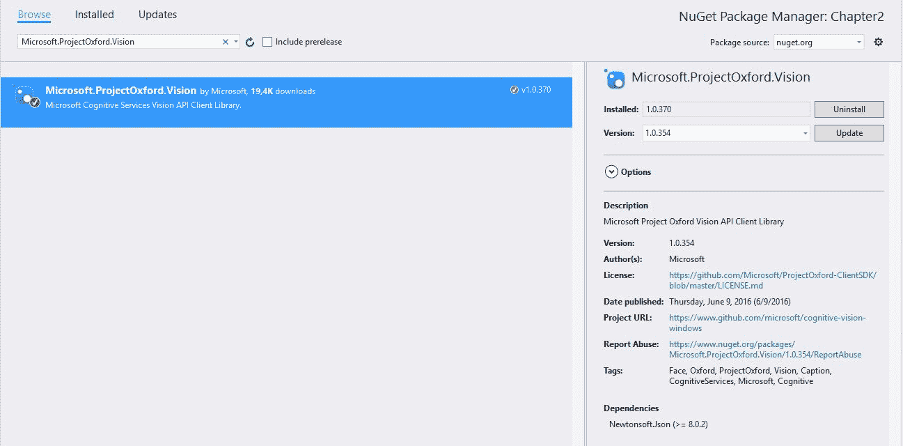

3.  创建以下`UserControls`文件，并将其添加到`ViewModel`文件夹中:

*   `CelebrityView.xaml`
*   `DescriptionView.xaml`
*   `ImageAnalysisView.xaml`
*   `OcrView.xaml`
*   `ThumbnailView.xaml`

另外，将相应的视图模型添加到`ViewModel`文件夹中:

*   `CelebrityViewModel.cs`
*   `DescriptionViewModel.cs`
*   `ImageAnalysisViewModel.cs`
*   `OcrViewModel.cs`
*   `ThumbnailViewModel.cs`

仔细检查新创建的视图模型，确保所有的类都是公共的。

我们将使用一个`TabControl`标签在不同的视图之间切换。打开`MainView.xaml`文件，在预先创建的`Grid`标签中添加以下内容:

```
    <TabControl x: Name = "tabControl" 
                   HorizontalAlignment = "Left"
                   VerticalAlignment = "Top" 
                   Width = "810" Height = "520"> 
        <TabItem Header="Analysis" Width="100"> 
            <controls:ImageAnalysisView /> 
        </TabItem> 
        <TabItem Header="Description" Width="100"> 
            <controls:DescriptionView /> 
        </TabItem> 
        <TabItem Header="Celebs" Width="100"> 
            <controls:CelebrityView /> 
        </TabItem> 
        <TabItem Header="OCR" Width="100"> 
            <controls:OcrView /> 
        </TabItem> 
        <TabItem Header="Thumbnail" Width="100"> 
            <controls:ThumbnailView /> 
        </TabItem> 
    </TabControl> 
```

这将在应用的顶部添加一个标签栏，并允许您在不同的视图之间导航。

接下来，我们将在我们的`MainViewModel.cs`文件中添加所需的属性和成员，如下所示:

```
    private IVisionServiceClient _visionClient; 
```

以下是用于访问计算机视觉 API 的变量:

```
    private CelebrityViewModel _celebrityVm; 
    public CelebrityViewModel CelebrityVm 
    { 
        get { return _celebrityVm; } 
        set 
        { 
            _celebrityVm = value; 
            RaisePropertyChangedEvent("CelebrityVm"); 
        } 
    } 
```

这声明了一个保存`CelebrityViewModel`对象的私有变量。它还声明了我们用来访问视图中的视图模型的`public`属性。按照相同的模式，为创建的视图模型的其余部分添加属性，如下所示:

```
    public MainViewModel() 
    { 
        _visionClient = new VisionServiceClient("VISION_API_KEY_HERE", "ROOT_URI"); 

        CelebrityVm = new CelebrityViewModel(_visionClient); 
        DescriptionVm = new DescriptionViewModel(_visionClient); 
        ImageAnalysisVm= new ImageAnalysisViewModel(_visionClient); 
        OcrVm = new OcrViewModel(_visionClient); 
        ThumbnailVm = new ThumbnailViewModel(_visionClient); 
    } 
```

所有属性就绪后，我们在构造函数中创建视图模型。注意我们是如何首先创建`VisionServiceClient`对象的，使用我们之前注册的 API 密钥和根 URI，如[第 1 章](part0024.html#MSDG0-747158f676dc47cd8e179786efb4ebe5)、*微软认知服务入门*中所述。然后将它注入到所有要在那里使用的视图模型中。

这应该会编译并向您呈现以下应用:

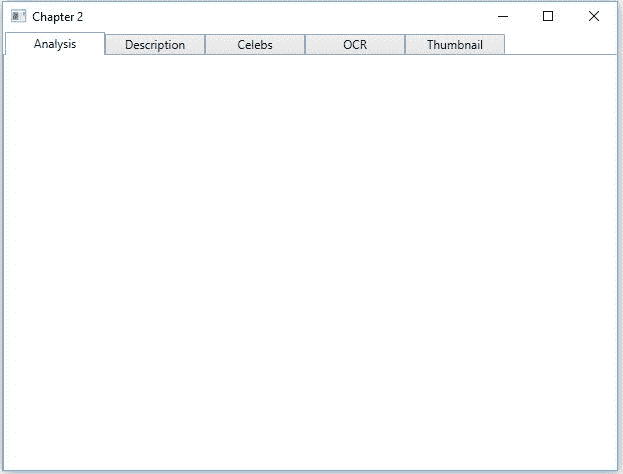

# 通用图像分析

我们首先向`ImageAnalysis.xaml`文件添加一些 UI。所有计算机视觉示例用户界面都将以相同的方式构建:

```
    <Grid.ColumnDefinitions> 
        <ColumnDefinition Width="*" /> 
        <ColumnDefinition Width="*" /> 
    </Grid.ColumnDefinitions> 
```

用户界面应该有两列。第一个将包含图像选择，而第二个将显示我们的结果。

在左栏中，我们创建了一个垂直方向的`StackPanel`标签。在这里，我们添加一个标签和一个`ListBox`标签。列表框将显示我们可以添加到分析查询中的可视化特性的列表。注意我们如何在`ListBox`标签中挂接了一个`SelectionChanged`事件。这将添加到代码后面，稍后将会介绍:

```
    <StackPanel Orientation="Vertical"Grid.Column="0"> 

    <TextBlock Text="Visual Features:"
               FontWeight="Bold"
               FontSize="15" 
               Margin="5, 5" Height="20" /> 

    <ListBox: Name = "VisualFeatures" 
          ItemsSource = "{Binding ImageAnalysisVm.Features}" 
          SelectionMode = "Multiple" Height="150" Margin="5, 0, 5, 0" 
          SelectionChanged = "VisualFeatures_SelectionChanged" /> 
```

listbox 将能够选择多个项目，并且这些项目被收集在 ViewModel 中。

在同一个堆栈面板中，我们还添加了一个按钮元素和一个图像元素。这些将允许我们浏览图像，显示它，并分析它。`Button`命令和图像源都绑定到 ViewModel 中的相应属性:

```
    <Button Content = "Browse and analyze" 
            Command = "{Binding ImageAnalysisVm.BrowseAndAnalyzeImageCommand}" 
            Margin="5, 10, 5, 10" Height="20" Width="120"
            HorizontalAlignment="Right" /> 

    <Image Stretch = "Uniform" 
           Source="{Binding ImageAnalysisVm.ImageSource}" 
           Height="280" Width="395" /> 
    </StackPanel> 
```

我们还添加了另一个垂直方向的堆栈面板。这将放在右边一栏。它包含一个标题标签和一个文本框，绑定到我们的视图模型中的分析结果:

```
    <StackPanel Orientation= "Vertical"Grid.Column="1"> 
        <TextBlock Text="Analysis Results:"
                   FontWeight = "Bold" 
                   FontSize="15" Margin="5, 5" Height="20" /> 
        <TextBox Text = "{Binding ImageAnalysisVm.AnalysisResult}" 
                 Margin="5, 0, 5, 5" Height="485" /> 
    </StackPanel> 
```

接下来，我们想将我们的`SelectionChanged`事件处理程序添加到代码隐藏中。打开`ImageAnalysisView.xaml.cs`文件并添加以下内容:

```
    private void VisualFeatures_SelectionChanged(object sender, SelectionChangedEventArgs e) { 
        var vm = (MainViewModel) DataContext; 
        vm.ImageAnalysisVm.SelectedFeatures.Clear(); 
```

函数的第一行会给我们当前的`DataContext`，也就是`MainViewModel`类。我们访问`ImageAnalysisVm`属性，这是我们的 ViewModel，并清除选择的视觉特性列表。

从那里，我们循环通过我们的列表框中选定的项目。所有项目都将被添加到我们的视图模型中的`SelectedFeatures`列表:

```
        foreach(VisualFeature feature in VisualFeatures.SelectedItems) 
        { 
            vm.ImageAnalysisVm.SelectedFeatures.Add(feature); 
        } 
    }
```

打开`ImageAnalysisViewModel.cs`文件。确保该类继承了`ObservableObject`类。

声明一个`private`变量，如下所示:

```
    private IVisionServiceClient _visionClient; 
```

这将用于访问计算机视觉 API，并通过构造函数进行初始化。

接下来，我们为我们的可视特性列表声明一个私有变量和相应的属性，如下所示:

```
    private List<VisualFeature> _features=new List<VisualFeature>(); 
    public List<VisualFeature> Features { 
        get { return _features; } 
        set { 
            _features = value; 
            RaisePropertyChangedEvent("Features"); 
        } 
    } 
```

以类似的方式，创建一个名为`ImageSource`的`BitmapImage`变量和属性。创建一个名为`SelectedFeatures`的`VisualFeature`类型列表和一个名为`AnalysisResult`的字符串。

我们还需要声明按钮的属性，如下所示:

```
    public ICommandBrowseAndAnalyzeImageCommand {get; private set;} 
```

有了它，我们创建我们的构造函数，如下所示:

```
    public ImageAnalysisViewModel(IVisionServiceClientvisionClient) { 
        _visionClient = visionClient; 
        Initialize(); 
    } 
```

构造函数接受一个参数，即我们在`MainViewModel`文件中创建的`IVisionServiceClient`对象。它将该参数赋给我们之前创建的变量。然后我们调用一个`Initialize`函数，如下所示:

```
    private void Initialize() { 
        Features = Enum.GetValues(typeof(VisualFeature)) 
                       .Cast<VisualFeature>().ToList(); 

        BrowseAndAnalyzeImageCommand = new DelegateCommand(BrowseAndAnalyze); 
    } 
```

在`Initialize`函数中，我们从`enum`类型的`VisualFeature`变量中获取所有值。这些值被添加到显示在用户界面中的功能列表中。我们还创建了按钮，现在我们需要创建相应的动作，如下所示:

```
    private async void BrowseAndAnalyze(object obj) 
    { 
        var openDialog = new Microsoft.Win32.OpenFileDialog();

        openDialog.Filter = "JPEG Image(*.jpg)|*.jpg";
        bool? result = openDialog.ShowDialog();

        if (!(bool)result) return;

        string filePath = openDialog.FileName;

        Uri fileUri = new Uri(filePath);
        BitmapImage image = new BitmapImage(fileUri);

        image.CacheOption = BitmapCacheOption.None;
        image.UriSource = fileUri;

        ImageSource = image; 
```

前面的第一行类似于我们在第一章、*微软认知服务入门*中所做的。我们打开一个文件浏览器，得到选中的图像。

选择图像后，我们希望对其进行分析，如下所示:

```
    try { 
        using (StreamfileStream = File.OpenRead(filePath)) { 
            AnalysisResult analysisResult = await  _visionClient.AnalyzeImageAsync(fileStream, SelectedFeatures); 
```

我们调用我们的`_visionClient`的`AnalyzeImageAsync`函数。这个函数有四个重载，它们都非常相似。在我们的例子中，我们将图像作为一个`Stream`类型传递，并将包含要分析的`VisualFeatures`变量的`SelectedFeatures`列表传递。

请求参数如下:

| **参数** | **描述** |
| **图像(必需)** |  |
| **视觉特性(可选)** | 指示要返回的视觉特征类型的列表。它可以包括类别、标签、描述、面孔、图像类型、颜色和成人。 |
| **详细信息(可选)** | 指示要返回的特定于域的详细信息的列表。 |

对这个请求的响应是`AnalysisResult`字符串。

我们检查结果是否为空。如果不是，我们调用一个函数来解析它，并将结果赋给我们的`AnalysisResult`字符串，如下所示:

```
    if (analysisResult != null) 
        AnalysisResult = PrintAnalysisResult(analysisResult); 
```

记住关闭`try`子句，并用相应的`catch`子句结束该方法。

`AnalysisResult`字符串包含根据 API 调用中请求的可视特征的数据。

下表描述了`AnalysisResult`变量中的数据:

| **视觉特征** | **描述** |
| **类别** | 根据定义的分类法对图像进行分类。这包括从动物、建筑、户外到人的一切。 |
| **标签** | 图像用与内容相关的单词列表来标记。 |
| **描述** | 这包含了描述图像的完整句子。 |
| **面孔** | 这可以检测图像中的人脸，并包含人脸坐标、性别和年龄。 |
| **图像类型** | 这将检测图像是剪贴画还是线条画。 |
| **颜色** | 这包含有关主色、强调色以及图像是否为黑白的信息。 |
| **成年** | 这可以检测一个图像是否是色情的，以及它是否是色情的。 |

要检索数据，如第一个描述，您可以执行以下操作:

```
    if (analysisResult.Description != null) { 
        result.AppendFormat("Description: {0}\n", analysisResult.Description.Captions[0].Text); 
        result.AppendFormat("Probability: {0}\n\n", 
analysisResult.Description.Captions[0].Confidence); 
        } 
```

一次成功的通话会给我们带来以下结果:

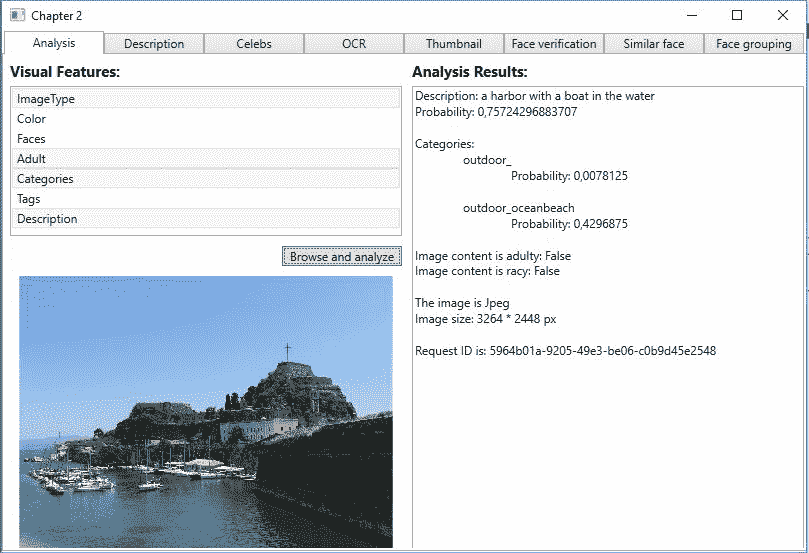

有时候，你可能只对图像描述感兴趣。在这种情况下，要求我们刚刚完成的全面分析是浪费。通过调用以下函数，您将获得一组描述:

```
    AnalysisResultdescriptionResult = await _visionClient.DescribeAsync(ImageUrl, NumberOfDescriptions); 
```

在这个调用中，我们指定了图像的 URL 和要返回的描述的数量。第一个参数必须始终包括在内，但它可能是图像上传而不是 URL。第二个参数是可选的，如果没有提供，则默认为一个。

成功的查询将产生一个`AnalysisResult`对象，这与前面代码中描述的相同。在这种情况下，它将只包含请求 ID、图像元数据和标题数组。每个标题包含一个图像描述和该描述的可信度。

在后面的章节中，我们将把这种形式的图像分析添加到我们的智能房屋应用中。


# 使用领域模型识别名人

计算机视觉 API 的特性之一是能够识别特定领域的内容。在撰写本文时，该 API 仅支持名人识别，能够识别大约 200，000 名名人。

对于这个例子，我们选择使用来自互联网的图像。然后，UI 需要一个文本框来输入 URL。它需要一个按钮来加载图像并进行域分析。应该有一个图像元素来查看图像，还有一个文本框来输出结果。

相应的 ViewModel 应该有两个`string`属性，分别用于 URL 和分析结果。它应该有一个用于图像的`BitmapImage`属性和一个用于按钮的`ICommand`属性。

在 ViewModel 的开头为`IVisionServiceClient`类型添加一个私有变量，如下所示:

```
    private IVisionServiceClient _visionClient; 
```

这应该在构造函数中赋值，它将接受一个`IVisionServiceClient`类型的参数。

因为我们需要一个 URL 来从互联网上获取图像，所以我们需要用一个动作和一个谓词来初始化`Icommand`属性。后者检查是否设置了 URL 属性:

```
    public CelebrityViewModel(IVisionServiceClient visionClient) { 
        _visionClient = visionClient; 
        LoadAndFindCelebrityCommand = new DelegateCommand(LoadAndFindCelebrity, CanFindCelebrity); 
    } 
```

`LoadAndFindCelebrity` load 用给定的 URL 创建一个`Uri`。使用这个，它创建一个`BitmapImage`并将它分配给`ImageSource`，即`BitmapImage`属性。图像应该在用户界面中可见:

```
    private async void LoadAndFindCelebrity(object obj) { 
        UrifileUri = new Uri(ImageUrl); 
        BitmapImage image = new BitmapImage(fileUri); 

        image.CacheOption = BitmapCacheOption.None; 
        image.UriSource = fileUri; 

        ImageSource = image; 
```

我们用给定的 URL 调用`AnalyzeImageInDomainAsync`类型。我们传入的第一个参数是图像 URL。或者，这可能是以`Stream`类型打开的图像:

```
    try { 
        AnalysisInDomainResultcelebrityResult = await _visionClient.AnalyzeImageInDomainAsync(ImageUrl, "celebrities"); 

        if (celebrityResult != null) 
            Celebrity = celebrityResult.Result.ToString(); 
    } 
```

第二个参数是域模型名，格式是`string`。或者，我们可以使用一个特定的`Model`对象，可以通过调用以下内容来检索:

```
    VisionClient.ListModelsAsync();
```

这将返回一个数组`Models`，我们可以显示并从中选择。因为现在只有一个，所以这样做没有意义。

来自`AnalyzeImageInDomainAsync`的结果是一个类型为`AnalysisInDomainResult`的对象。该对象将包含请求 ID、图像的元数据和包含名人数组的结果。在我们的例子中，我们简单地输出整个结果数组。这个数组中的每一项都包含名人的名字、匹配的可信度和图像中的面部矩形。请在提供的示例代码中尝试一下。


# 利用光学字符识别

对于某些任务来说，**光学字符识别** ( **OCR** )可能非常有用。你可以想象拍一张收据的照片。使用 OCR，您可以获得金额并将其自动添加到会计中。

OCR 将检测图像中的文本，并提取机器可读的字符。它会自动检测语言。可选地，API 将检测图像方向并在读取文本之前纠正它。

要指定语言，您需要使用 **BCP-47** 语言代码。在撰写本文时，支持以下语言:简体中文、繁体中文、捷克语、丹麦语、荷兰语、英语、芬兰语、法语、德语、希腊语、匈牙利语、意大利语、日语、韩语、挪威语、波兰语、葡萄牙语、俄语、西班牙语、瑞典语和土耳其语。

在代码示例中，用户界面将有一个图像元素。它还将有一个按钮来加载图像和检测文本。结果将被打印到 textbox 元素中。

ViewModel 需要一个用于结果的`string`属性、一个用于图像的`BitmapImage`属性和一个用于按钮的`ICommand`属性。

将私有变量添加到计算机视觉 API 的 ViewModel 中，如下所示:

```
    private IVisionServiceClient _visionClient; 
```

构造函数应该有一个`IVisionServiceClient`类型的参数，该参数应该赋给前面的变量。

创建一个函数作为按钮的命令。调用它`BrowseAndAnalyze`并让它接受`object`作为参数。我们打开一个文件浏览器，找到一个图像进行分析。选择图像后，我们运行 OCR 分析，如下所示:

```
    using (StreamfileStream = File.OpenRead(filePath)) { 
        OcrResultsanalysisResult = await _visionClient.RecognizeTextAsync (fileStream); 

        if(analysisResult != null) 
            OcrResult = PrintOcrResult(analysisResult); 
    } 
```

随着图像作为`Stream`类型打开，我们调用`RecognizeTextAsync`方法。在这种情况下，我们将图像作为一个`Stream`类型传递，但是我们也可以很容易地传递一个图像的 URL。

在这个调用中还可以指定两个参数。首先，您可以指定文本的语言。默认值是 unknown，这意味着 API 将尝试自动检测语言。其次，您可以指定 API 是否应该检测图像的方向。默认设置为`false`。

如果调用成功，它将以`OcrResults`对象的形式返回数据。我们将这个结果发送给一个函数，即`PrintOcrResult`函数，在这里我们将解析它并打印文本:

```
    private string PrintOcrResult(OcrResultsocrResult) 
    { 
        StringBuilder result = new StringBuilder(); 

        result.AppendFormat("Language is {0}\n", ocrResult.Language); 
        result.Append("The words are:\n\n"); 
```

首先，我们创建一个`StringBuilder`对象，它将保存所有文本。我们添加的第一个内容是图像中文本的语言，如下所示:

```
        foreach(var region in ocrResult.Regions) {  
            foreach(var line in region.Lines) {  
                foreach(var text in line.Words) {  
                    result.AppendFormat("{0} ", text.Text); 
                } 
                result.Append("\n"); 
            } 
            result.Append("\n\n"); 
        } 
```

结果有一个数组，包含`Regions`属性。每个项目代表已识别的文本，每个区域包含多行。`line`变量是数组，其中每一项代表可识别的文本。每行包含一个`Words`属性的数组。这个数组中的每一项都代表一个可识别的单词。

将所有单词追加到`StringBuilder`函数后，我们将其作为字符串返回。这将在 UI 中打印出来，如下面的屏幕截图所示:

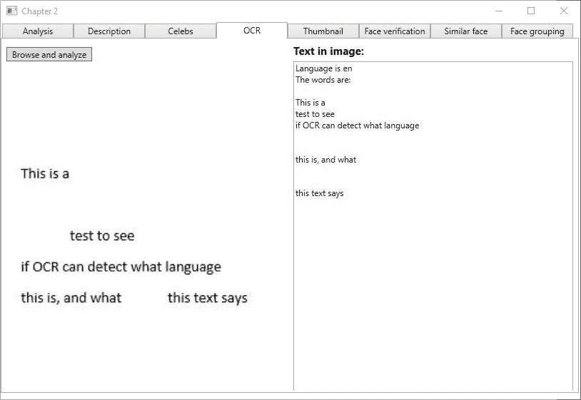

结果还包含文本的方向和角度。将它与也包括在内的边界框结合起来，您可以标记原始图像中的每个单词。


# 生成图像缩略图

在当今世界，作为开发人员，我们在显示图像时必须考虑不同的屏幕尺寸。计算机视觉 API 提供了一些帮助，因为它可以生成缩略图。

缩略图生成本身没什么大不了的。API 的巧妙之处在于它分析图像并确定感兴趣的区域。

它还会生成智能裁剪坐标。这意味着，如果指定的长宽比与原始的不同，它将裁剪图像，重点放在感兴趣的区域。

在示例代码中，UI 由两个图像元素和一个按钮组成。第一个图像是原始大小的图像。第二个是生成的缩略图，我们指定其大小为 250x250 像素。

视图模型需要相应的属性、两个用作图像源的`BitmapImages`方法和一个按钮命令的`ICommand`属性。

在视图模型中定义一个私有变量，如下所示:

```
    private IVisionServiceClient _visionClient; 
```

这将是我们的 API 访问点。构造函数应该接受一个`IVisionServiceClient`对象，这个对象应该赋给前面的变量。

对于`ICommand`属性，我们创建一个函数`BrowseAndAnalyze`，接受一个`object`参数。我们不需要检查我们是否能执行命令。我们将每次浏览一幅图像。

在`BrowseAndAnalyze`功能中，我们打开一个文件对话框并选择一幅图像。当我们有了图像文件的路径，我们可以生成我们的缩略图，如下所示:

```
    using (StreamfileStream = File.OpenRead(filePath)) 
    { 
        byte[] thumbnailResult = await _visionClient.GetThumbnailAsync(fileStream, 250, 250); 

        if(thumbnailResult != null &&thumbnailResult.Length != 0) 
            CreateThumbnail(thumbnailResult); 
    } 
```

我们打开图像文件，这样我们就有了一个`Stream`类型。这个流是我们调用`GetThumbnailAsync`方法的第一个参数。接下来的两个参数表示我们想要的缩略图的宽度和高度。

默认情况下，API 调用将使用智能裁剪，因此我们不必指定它。如果我们不想要智能裁剪，我们可以添加一个`bool`变量作为第四个参数。

如果调用成功，我们将获得一个`byte`数组。这是图像数据。如果它包含数据，我们将它传递给一个新函数`CreateThumbnail`，从它创建一个`BitmapImage`对象，如下所示:

```
    private void CreateThumbnail(byte[] thumbnailResult) 
    { 
        try { 
            MemoryStreamms = new MemoryStream(thumbnailResult); 
            ms.Seek(0, SeekOrigin.Begin); 
```

为了从一个`byte`数组创建一个图像，我们从它创建一个`MemoryStream`对象。我们确保从头开始。

接下来，我们创建一个`BitmapImage`对象并开始初始化它。我们指定`CacheOption`并将`StreamSource`设置为我们之前创建的`MemoryStream`变量。最后，我们停止`BitmapImage`初始化，并将图像分配给我们的`Thumbnail`属性:

```
        BitmapImage image = new BitmapImage(); 
        image.BeginInit(); 
        image.CacheOption = BitmapCacheOption.None; 
        image.StreamSource = ms; 
        image.EndInit(); 

        Thumbnail = image;    
```

关闭`try`子句并添加相应的`catch`子句，您应该能够生成缩略图。


# 深入面部 API

Face API 有两个主要特性。第一个是人脸检测，第二个是人脸识别。

人脸检测允许在一幅图像中检测多达 64 张人脸。我们已经看到了基本用法。人脸识别的特点就隐含在它的名字里。利用它，我们可以检测两张脸是否属于同一个人。我们可以找到相似的脸，或者特定的一张，我们可以把相似的脸分组。在接下来的几页中，我们将学习如何做到这一切。

当调用任何 API 时，它将响应以下响应之一:

| **代码** | **描述** |
| `200` | 通话成功。返回包含与 API 调用相关的数据的数组。 |
| `400` | 请求正文无效。可能有许多错误，这取决于 API 调用。通常，请求代码是无效的。 |
| `401` | 由于订阅密钥无效，访问被拒绝。密钥可能错误，或者帐户/订购计划被阻止。 |
| `403` | 呼叫量数据不足。您已经调用了本月所有可用的 API。 |
| `415` | 无效的媒体类型。 |
| `429` | 超过了速率限制。你需要等待一段时间(<1 minute in the free preview) before you try again. |


# Retrieving more information from the detected faces

In 第一章，*微软认知服务入门*，我们学习了非常基本的人脸检测形式。在这个例子中，我们检索了一个`Face`数组。它包含了图像中所有人脸的信息。在这个特定的例子中，我们获得了关于面部矩形、面部 ID、面部标志和年龄的信息。

调用 API 时，有四个请求参数:

| **参数** | **描述** |
| `image` |  |
| `return FaceId`(可选) | 布尔值。指定响应是否应包含面 ID。 |
| `return FaceLandmarks`(可选) | 布尔值。指定响应是否应在检测到的人脸中包含`FaceLandmarks`。 |
| `return FaceAttributes`(可选) |  |

如果一张脸被成功发现，它将在 24 小时内过期。当调用 Face API 的其他部分时，通常需要有一个 face ID 作为输入。在这些情况下，我们需要首先检测一张脸，然后是我们应该执行的实际 API 调用。

利用这些知识，我要求你使用第 1 章、*微软认知服务入门*中的例子。在脸部周围画一个矩形。标记图像中的眼睛。


# 判断两张脸是否属于同一个人

为了判断两张脸是否属于同一个人，我们将调用 API 的`Verify`函数。API 允许我们检测两张脸是同一个人的时候，称为面对面验证。检测一张脸是否属于一个特定的人被称为**面对面验证**。

UI 将由三个按钮元素、两个图像元素和一个文本块元素组成。其中两个按钮将用于浏览图像，然后显示在每个图像元素中。最后一个按钮将运行验证。文本块将输出结果。

按照您想要的方式布置 UI，并将不同的元素绑定到 ViewModel 中的属性，就像我们之前所做的那样。在 ViewModel 中，图像元素应该有两个`BitmapImage`属性。应该有一个`string`属性，包含验证结果。最后，应该有三个`ICommand`属性，每个按钮一个。

记得将 UI 作为新的`TabItem`添加到`MainView.xaml`文件中。另外，将 ViewModel 添加到`MainViewModel.cs`文件中，您还需要为`FaceServiceClient`变量添加一个新变量。这应该是用 Face API key 创建的，我们在第 1 章、*微软认知服务入门*中注册了这个。

在 ViewModel 中，我们需要声明以下三个私有变量:

```
    private FaceServiceClient _faceServiceClient; 
    private Guid _faceId1 = Guid.Empty; 
    private Guid _faceId2 = Guid.Empty; 
```

我们以前见过第一个；它将访问 Face API。两个`Guid`变量将在我们运行面部检测时被赋值。

构造函数接受一个参数，就是我们的`FaceServiceClient`对象。这被赋给先前创建的变量:

```
    public FaceVerificationViewModel (FaceServiceClientfaceServiceClient) 
    {     
        _faceServiceClient = faceServiceClient;
        Initialize(); 
    } 
```

从构造函数中，我们调用`Initialize`函数来创建`DelegateCommand`属性，如下所示:

```
    private void Initialize() 
    { 
        BrowseImage1Command = new DelegateCommand(BrowseImage1); 
        BrowseImage2Command = new DelegateCommand(BrowseImage2); 
        VerifyImageCommand = new DelegateCommand(VerifyFace, CanVerifyFace); 
    } 
```

任何时候都不需要禁用浏览命令，所以我们只传递命令功能，如下所示:

```
    private async void BrowseImage1(object obj) { 
        Image1Source = await BrowseImageAsync(1); 
    } 
```

这两个函数看起来很相似。我们调用另一个函数来浏览图像并检测人脸。为了分离每个图像，我们传递图像编号。

`BrowseImageAsync`函数将接受一个`int`类型作为参数。它返回一个`BitmapImage`对象，我们将其分配给绑定到 UI 的`BitmapImage`属性。第一部分打开一个浏览对话框并返回选中的图像。当我们有了图像和通向图像的路径时，我们将投入进去。

我们将图像作为`Stream`对象打开。在 API 调用中使用`Stream`对象来检测人脸。当我们调用 API 时，我们可以使用默认调用，因为它将返回我们感兴趣的值:

```
    try { 
        using (Stream fileStream = File.OpenRead(filePath)) { 
            Face[] detectedFaces = await  _faceServiceClient.DetectAsync(fileStream); 
```

当检测完成时，我们检查这是哪幅图像，并将`FaceId`参数赋给正确的`Guid`变量。对于这个例子，我们假设每个图像只有一张脸:

```
            if (imagenumber == 1) 
                _faceId1 = detectedFaces[0].FaceId; 
            else 
                _faceId2 = detectedFaces[0].FaceId; 
        } 
    } 
```

通过添加您认为合适的 catch 子句来结束该函数。此外，您需要从所选图像创建并返回一个`BitmapImage`参数。

在启用人脸验证按钮之前，我们会检查两个人脸 id 是否都已设置:

```
    private bool CanVerifyFace(object obj) 
    { 
        return !_faceId1.Equals(Guid.Empty) &&! _faceId2.Equals(Guid.Empty); 
    } 
```

`VerifyFace`功能并不复杂:

```
    private async void VerifyFace(object obj) { 
        try { 
            VerifyResultverificationResult = await  _faceServiceClient.VerifyAsync(_faceId1, _faceId2); 
```

设置了 face IDs 后，我们可以调用 API 的`VerifyAsync`函数。我们将人脸 id 作为参数传递，并得到一个`VerifyResult`对象作为回报。我们使用这个对象来提供输出，如下所示:

```
            FaceVerificationResult = $"The two provided faces is identical: {verificationResult.IsIdentical}, with confidence: {verificationResult.Confidence}"; 
        } 
```

成功的调用将返回代码为 200 的响应。响应数据是一个`bool`类型变量`isIdentical`和一个数字`confidence`:

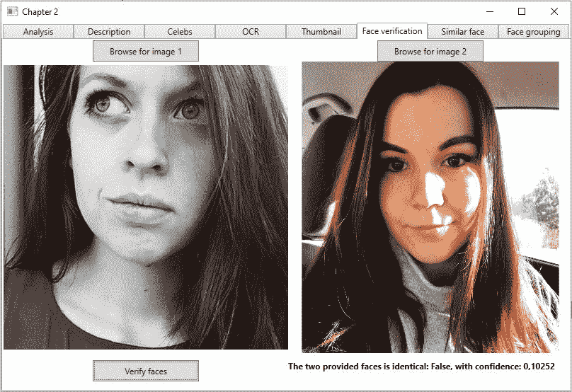

在撰写本文时，Face API 的`NuGet`包只允许面对面的验证。如果我们直接调用 REST API，我们也可以利用面对面的验证。

要使用面对面验证，只需要一张图像。您需要传递该图像的面部 ID。您还需要传递一个人-组 ID 和一个人 ID。这些用于指定要搜索的特定人员组以及该组中的特定人员。我们将在本章后面讨论人员组和人员。


# 寻找相似的面孔

使用 Face API，您可以找到与提供的面孔相似的面孔。API 允许两种搜索模式。匹配的人是默认的。这将根据内部的同一个人阈值，将人脸与同一个人进行匹配。另一个是火柴脸，会忽略同人门槛。这将返回相似的匹配项，但相似度可能很低。

在提供的示例代码中，我们的 UI 中有三个按钮:一个用于生成人脸列表，另一个用于向列表中添加人脸，最后一个用于查找相似人脸。我们需要一个文本框来指定面孔列表的名称。为了方便起见，我们添加了一个 listbox，从 face 列表中输出持久化的 face IDs。此外，我们还添加了一个图像元素来显示我们正在检查的图像，以及一个输出结果的文本框。

在相应的 ViewModel 中，我们需要为图像元素添加一个`BitmapImage`属性。我们需要两个`string`属性:一个用于我们的 face-list 名称，一个用于 API 调用结果。为了让数据进入我们的列表框，我们需要一个包含`Guids`的`ObservableCollection`属性。按钮需要连接到个人`ICommand`属性。

我们在视图模型的开始声明了两个私有变量。第一个是一个`bool`变量，用于指示面部列表是否已经存在。另一个用于访问 Face API:

```
    private bool _faceListExists = false; 
    private FaceServiceClient _faceServiceClient; 
```

构造函数应该接受`FaceServiceClient`参数，并将其赋给前面的变量。然后它将调用一个`Initialize`函数，如下所示:

```
    private async void Initialize() 
    { 
        FaceListName = "Chapter2"; 

        CreateFaceListCommand = new DelegateCommand(CreateFaceListAsync, CanCreateFaceList); 
        FindSimilarFaceCommand = new DelegateCommand(FindSimilarFace); 
        AddExampleFacesToListCommand = new DelegateCommand(AddExampleFacesToList, CanAddExampleFaces); 
```

首先，我们将`FaceListName`属性初始化为`Chapter2`。接下来，我们创建命令对象，指定操作和谓词，如下所示:

```
        await DoesFaceListExistAsync(); 
        UpdateFaceGuidsAsync(); 
    } 
```

我们通过调用两个函数来完成`Initialize`函数。第一个检查面孔列表是否存在，而第二个更新面孔 id 列表:

```
    private async Task DoesFaceListExistAsync() 
    { 
        FaceListMetadata[] faceLists = await _faceServiceClient.ListFaceListsAsync(); 
```

为了检查给定的人脸列表是否存在，我们首先需要获得所有人脸列表的列表。我们通过调用`ListFaceListsAsync`方法来实现，该方法将返回一个`FaceListMetadata`数组。在遍历数组之前，我们确保结果中有数据:

```
    foreach (FaceListMetadatafaceList in faceLists) { 
        if (faceList.Name.Equals(FaceListName)) { 
            _faceListExists = true; 
            break; 
        } 
    } 
```

结果数组中的每个`FaceListMetadata`数组包含一个面部列表 ID、面部列表名称和用户提供的数据。对于这个例子，我们只对名称感兴趣。如果我们指定的面部列表名称是返回的任何面部列表的名称，我们将`_faceListExists`参数设置为 true。如果面部列表存在，我们可以更新面部 id 列表。

要获得人脸列表中的人脸，我们需要先获得人脸列表。这是通过调用 Face API 的函数`GetFaceListAsync`方法来完成的。这需要将 face-list ID 作为参数传递。face-list ID 必须为小写或数字，最多可包含 64 个字符。为了简单起见，我们使用面部列表名称作为面部 ID，如下所示:

```
    private async void UpdateFaceGuidsAsync() { 
        if (!_faceListExists) return; 

        try {  
            FaceListfaceList = await _faceServiceClient.GetFaceListAsync(FaceListName.ToLower()); 
```

这个 API 调用的结果是一个`FaceList`对象，包含了 face-list ID 和 face-list name。它还包含用户提供的数据和一组持久化的面孔:

```
        if (faceList == null) return; 

        PersonFace[] faces = faceList.PersistedFaces; 

        foreach (PersonFace face in faces) { 
            FaceIds.Add(face.PersistedFaceId); 
        } 
```

我们检查是否有任何数据，然后获取持久化面孔的数组。通过循环这个数组，我们能够获得`PersistedFaceId`参数(作为一个`guid`变量)和用户提供的每个项目的数据。持久化的面部 ID 被添加到`FaceIds ObservableCollection`。通过添加相应的`catch`子句来完成该功能。

如果面列表不存在，并且我们已经指定了面列表名称，我们可以创建一个新的面列表，如下所示:

```
    private async void CreateFaceListAsync(object obj) { 
        try { 
            if (!_faceListExists) { 
                await _faceServiceClient.CreateFaceListAsync ( 
FaceListName.ToLower(), FaceListName, string.Empty); 
                await DoesFaceListExistAsync(); 
            } 
        } 
```

首先，我们检查面部列表是否不存在。使用`_faceServiceClient`参数，您需要传递一个面部列表 ID、一个面部列表名称和用户数据。如前所述，face-list ID 必须是小写字符或数字。

使用 REST API，用户参数是可选的，因此，您不必提供它。

在我们创建了一个面孔列表后，我们希望确保它存在。我们通过调用之前创建的`DoesFaceListExistAsync`函数来实现这一点。添加`catch`子句来完成该功能。

如果命名的面孔列表存在，我们可以将面孔添加到该列表中。增加`AddExampleFacesToList`功能。它应该接受`object`作为参数。我将把添加图像的细节留给你。在提供的例子中，我们从给定的目录中获取一个图像列表，并遍历它。对于给定图像的文件路径，我们执行以下操作。

我们将图像作为`Stream`打开。为了优化我们的相似性操作，我们在图像中找到了`FaceRectangle`参数。由于面部列表中的每个图像应该只有一个面部，我们选择了`Face`数组中的第一个元素，如下所示:

```
    using (StreamfileStream = File.OpenRead(image)) 
    { 
        Face[] faces = await _faceServiceClient.DetectAsync(fileStream); 
        FaceRectanglefaceRectangle = faces[0].FaceRectangle; 
```

将人脸添加到人脸列表中就像调用`AddFaceToFaceListAsync`函数一样简单。我们需要指定面部列表 ID 和图像。图像可能来自一个`Stream`(就像我们的例子)或者一个 URL。或者，我们可以添加用户数据和图像的面部矩形，如下所示:

```
        AddPersistedFaceResult addFacesResult = await _faceServiceClient.AddFaceToFaceListAsync(FaceListName.ToLower(), fileStream, null, faceRectangle); 
        UpdateFaceGuidsAsync(); 
```

API 调用的结果是一个`AddPersistedFaceResult`变量。这包含持久化的 face ID，它不同于`DetectAsync`调用中的 face ID。添加到面孔列表的面孔在被删除之前不会过期。

我们通过调用`UpdateFaceGuidsAsync`方法来完成这个功能。

最后，我们创建我们的`FindSimilarFace`函数，也接受`object`作为参数。为了能够搜索相似的脸，我们需要一个来自`DetectAsync`方法的脸 ID(变量`Guid`)。这可以通过本地图像或 URL 来调用。该示例代码打开一个文件浏览器，并允许用户浏览图像。

有了面孔 ID，我们可以搜索相似的面孔:

```
    try { 
        SimilarPersistedFace[] similarFaces = await _faceServiceClient.FindSimilarAsync (findFaceGuid, FaceListName.ToLower(), 3); 
```

我们调用`FindSimilarAsync`函数。第一个参数是我们指定的面的面 ID。下一个参数是面孔列表 ID，最后一个参数是返回的候选面孔的数量。默认值为 20，因此最好指定一个数字。

您可以使用`Guid`变量的数组，而不是使用面部列表来查找相似的面部。该数组应该包含从`DetectAsync`方法中检索到的 face IDs。

在撰写本文时，NuGet API 包只支持，匹配人模式。如果直接使用 REST API，可以将模式指定为参数。

根据选择的模式，结果将包含人脸 ID 或相似人脸的持久人脸 ID。它还将包含给定人脸的相似性的置信度。

要从面部列表中删除面部，请在面部 API 中调用以下函数:

```
    DeleteFaceFromFaceListAsync(FACELISTID, PERSISTEDFACEID) 
```

要删除面孔列表，请在面孔 API 中调用以下函数:

```
    DeleteFaceListAsync(FACELISTID) 
```

要更新面孔列表，请在面孔 API 中调用以下函数:

```
    UpdateFaceListAsync(FACELISTID, FACELISTNAME, USERDATA) 
```


# 将相似的面分组

如果你有几张面孔的图片，你可能要做的一件事就是把这些面孔分组。通常，您会希望根据相似性对人脸进行分组，这是 Face API 提供的一个特性。

通过向 API 提供一个 face IDs 列表，它将响应一个或多个组。一组由看起来相似的脸组成。通常，这意味着这些面孔属于同一个人。找不到任何相似对应物的脸被放在一个组中，我们称之为`MessyGroup`。

创建一个名为`FaceGroupingView.xaml`的新视图。该视图应该有六个图像元素，以及相应的标题和文字框。它还应该有一个 group 命令按钮和一个输出分组结果的文本框。

在相应的`FaceGroupingViewModel.xaml`视图模型中，您应该为所有图像添加`BitmapImage`属性。您还应该为面部标识添加`string`属性，并为结果添加一个属性。还需要一个`ICommand`属性。

在视图模型的开始，我们声明了一些私有变量，如下所示:

```
    private FaceServiceClient _faceServiceClient; 
    private List<string> _imageFiles = new List<string>(); 
    private List<Guid> _faceIds = new List<Guid>(); 
```

第一个用于访问 Face API。其次，我们有一个包含图像位置的字符串列表。最后一个列表包含检测到的面部 id。

构造函数接受一个`FaceServiceClient`类型的参数。它将它赋给相应的变量并调用`Initialize`函数。这创建了我们的`ICommand`对象，并调用一个函数将我们的图像添加到应用中。

在添加图像的函数中，我们将硬编码的图像路径添加到我们的`_imageFiles`列表中。在这个例子中，我们增加了六个。使用一个`for`循环，我们生成每个`BitmapImage`属性。当我们有一幅图像时，我们想检测其中的人脸:

```
    try { 
        using (Stream fileStream = File.OpenRead(_imageFiles[i])) { 
            Face[] faces = await 
            _faceServiceClient.DetectAsync(fileStream); 
```

我们不需要比生成的人脸 ID 更多的数据，我们知道人脸 ID 在检测后会存储 24 小时:

```
            _faceIds.Add(faces[0].FaceId); 
            CreateImageSources(image, i, faces[0].FaceId); 
        } 
    } 
```

假设每张图片只有一个人脸，我们将这个人脸 ID 添加到我们的`_faceIds`列表中。循环中的图像、人脸 ID 和当前迭代次数被传递给一个新函数`CreateImageSources`。该函数包含一个基于迭代次数的`switch`案例。基于该编号，我们将图像和面部 ID 分配给相应的图像和图像 ID 属性。这将显示在用户界面中。

我们有一个按钮来分组图像。为了对图像进行分组，我们调用 Face API 的`GroupAsync`方法，传递一个 face IDs 数组。face IDs 数组必须包含至少两个元素，并且不能包含超过 1，000 个元素:

```
    private async void GroupFaces(object obj) { 
        try { 
            GroupResultfaceGroups = await _faceServiceClient.GroupAsync(_faceIds.ToArray()); 
```

响应是一个`GroupResult`类型，可能包含一个或多个组，以及混乱组:

```
            if (faceGroups != null) 
                FaceGroupingResult = ParseGroupResult(faceGroups); 
        } 
```

我们检查是否有响应，然后解析它。在查看`ParseGroupResult`方法之前，添加相应的`catch`子句和特写`GroupFaces`函数，如下所示:

```
        private string ParseGroupResult(GroupResultfaceGroups) { 
            StringBuilder result = new StringBuilder(); 
            List<Guid[]>groups = faceGroups.Groups; 
            result.AppendFormat("There are {0} group(s)\n", groups.Count); 
```

当解析结果时，我们首先创建一个`StringBuilder`类来保存我们的文本。然后我们从结果中得到`groups`。组是该组中图像的脸部 id 的数组。所有的组都存储在一个列表中，我们将组的数量添加到`StringBuilder`类中。

我们遍历组列表。在这个循环中，我们遍历组中的每个项目。为了可读性，我们有一个助手函数来从 ID 中查找图像名称。它在我们的`_faceIds`列表中找到索引。然后在图像名称中使用它，所以如果索引是 2，图像名称将是`Image 3`。为了达到预期的效果，您必须按照逻辑顺序放置图像，如下所示:

```
            result.Append("Groups:\t"); 

            foreach(Guid[] guid in groups) 
            { 
                foreach(Guid id in guid) 
                { 
                    result.AppendFormat("{0} - ", GetImageName(id)); 
                } 
                result.Append("\n"); 
            } 
```

`GroupResult`方法也可能包含一个`MessyGroup`数组。这是一个包含该组人脸 id 的`Guid`变量数组。我们遍历这个数组并添加图像名，就像我们处理常规组一样:

```
            result.Append("Messy group:\t"); 

            Guid[] messyGroup = faceGroups.MessyGroup; 
            foreach(Guidguid in messyGroup) 
            { 
                result.AppendFormat("{0} - ", GetImageName(guid)); 
            } 
```

我们通过返回`StringBuilder`函数的文本来结束该函数，文本将输出到屏幕上，如下所示:

```
            return result.ToString(); 
        } 
```

确保视图模型已经在`MainViewModel.cs`文件中创建。另外，确保视图已经作为一个属性添加到了`MainView.xaml`文件中。编译并测试应用。

如果您使用提供的示例图像，您可能会得到如下结果:

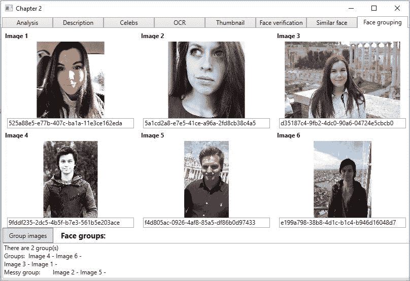

# 向我们的智能房屋应用添加标识

作为智能房屋应用的一部分，我们希望应用能够识别我们是谁。这样做就有机会从应用获得为您量身定制的响应和操作。


# 创建我们的智能房屋应用

基于我们之前创建的 MVVM 模板，为智能房屋应用创建一个新项目。

随着新项目的创建，添加`Microsoft.ProjectOxford.Face` NuGet 包。

由于我们将在本书中构建这个应用，我们将从小处着手。在`MainView.xaml`文件中，添加一个包含两个项目的`TabControl`属性。这两个项目应该是两个用户控件，一个称为`AdministrationView.xaml`文件，另一个称为`HomeView.xaml`文件。

管理控件是我们管理应用不同部分的地方。home 控件将是起点，也是要使用的主要控件。

向视图添加相应的视图模型。确保它们是在`MainViewModel.cs`中声明和创建的，正如我们在本章中所看到的。在继续之前，确保应用已经编译并运行。


# 添加要识别的人员

在我们继续辨认一个人之前，我们需要有一些东西来辨认他们。为了识别一个人，我们需要一个`PersonGroup`属性。这是一个包含几个`Persons`属性的组。

在管理控件中，我们将在这方面执行几个操作。UI 应该包含两个 textbox 元素、两个 listbox 元素和六个按钮。这两个 textbox 元素将允许我们输入人员组的名称和人员的名称。一个列表框将列出我们所有可用的人员组。另一个将列出任何给定组中的所有人。

对于我们想要执行的每个操作，我们都有按钮，如下所示:

*   添加人员组
*   删除人员组
*   训练人员组
*   添加人员
*   删除人员
*   添加人脸

视图模型应该有两个`ObservableCollection`属性:一个是`PersonGroup`类型，另一个是`Person`类型。我们还应该添加三个`string`属性。一个是我们的人组名，另一个是我们的人名。最后一个将保存一些状态文本。我们还希望为选定的人员组设置一个`PersonGroup`属性。最后，我们想要一个持有所选人员的`Person`属性。

在我们的视图模型中，我们想为`FaceServiceClient`方法添加一个私有变量:

```
    private FaceServiceClient _faceServiceClient; 
```

这应该在构造函数中赋值，它应该接受一个`FaceServiceClient`类型的参数。它还应该调用一个初始化函数，这将是我们应该添加的六个`ICommand`属性。初始化函数应该调用`GetPersonGroups`函数来列出所有可用的人员组:

```
    private async void GetPersonGroups() { 
        try { 
            PersonGroup[] personGroups = await 
            _faceServiceClient.ListPersonGroupsAsync(); 
```

`ListPersonGroupsAsync`函数不接受任何参数，如果成功执行，则返回一个`PersonGroup`数组的数组:

```
            if(personGroups == null || personGroups.Length == 0) 
            { 
                StatusText = "No person groups found."; 
                return; 
            } 

            PersonGroups.Clear(); 

            foreach (PersonGrouppersonGroup in personGroups) 
            { 
                PersonGroups.Add(personGroup);  
            } 
        } 
```

我们检查数组是否包含任何元素。如果是，我们清除现有的`PersonGroups`列表。然后我们遍历`PersonGroup`数组的每一项，并将它们添加到`PersonGroups`列表中。

如果不存在人员组，我们可以通过填写名称来添加一个新组。您在此处填写的姓名也将用作人员组 ID。这意味着它可以包含数字和英文小写字母，“-”(连字符)和“_”(下划线)。最大长度为 64 个字符。填写后，我们可以添加一个人员组:

```
    private async void AddPersonGroup(object obj) { 
        try { 
            if(await DoesPersonGroupExistAsync(PersonGroupName.ToLower())) { 
                StatusText = $"Person group {PersonGroupName} already exist"; 
                return; 
            } 
```

首先，我们调用`DoesPersonGroupExistAsync`函数，将`PersonGroupName`指定为参数。如果这是真的，我们给的名字已经存在，因此我们不允许添加它。注意我们如何在名字上调用`ToLower`函数。这是为了确保 ID 是小写的:

```
            await _faceServiceClient.CreatePersonGroupAsync (PersonGroupName.ToLower(), PersonGroupName); 
            StatusText = $"Person group {PersonGroupName} added"; 
            GetPersonGroups(); 
        } 
```

如果 person 组不存在，我们调用`CreatePersonGroupAsync`函数。同样，我们在第一个参数中将`PersonGroupName`指定为小写。这表示组的 ID。第二个参数表示我们想要的名称。我们通过再次调用`GetPersonGroups`函数来结束函数，因此我们在列表中获得了新添加的组。

`DoesPersonGroupExistAsync`函数进行一次 API 调用。它试图调用`GetPersonGroupAsync`函数，将 person-group ID 指定为一个参数。如果得到的`PersonGroup`列表不是 null，我们返回`true`。

要删除人员组，必须按如下方式选择组:

```
    private async void DeletePersonGroup(object obj) 
    { 
        try 
        { 
            await _faceServiceClient.DeletePersonGroupAsync (SelectedPersonGroup.PersonGroupId); 
            StatusText = $"Deleted person group {SelectedPersonGroup.Name}"; 

            GetPersonGroups(); 
        } 
```

对`DeletePersonGroupAsync`函数的 API 调用需要一个 person-group ID 作为参数。我们从被选择的人群中得到这个。如果没有捕获到异常，则调用成功完成，我们调用`GetPersonGroups`函数来更新我们的列表。

当从列表中选择一个人组时，我们确保调用`GetPersons`功能。这将更新人员列表，如下所示:

```
    private async void GetPersons() 
    { 
        if (SelectedPersonGroup == null) 
            return; 

        Persons.Clear(); 

        try 
        { 
            Person[] persons = await _faceServiceClient.GetPersonsAsync (SelectedPersonGroup.PersonGroupId); 
```

我们确保选择的人员组不为空。如果不是，我们清除我们的`persons`列表。对`GetPersonsAsync`函数的 API 调用需要一个 person-group ID 作为参数。成功的调用将产生一个`Person`数组:

```
            if (persons == null || persons.Length == 0) 
            { 
                StatusText = $"No persons found in {SelectedPersonGroup.Name}."; 
                return; 
            } 

            foreach (Person person in persons) 
            { 
                Persons.Add(person); 
            } 
        } 
```

如果得到的数组包含任何元素，我们就遍历它。每个`Person`对象都被添加到我们的`persons`列表中。

如果没有人存在，我们可以添加新的人。要添加新组，必须选择人员组，并且必须填写人员的姓名。准备就绪后，我们可以单击“add”按钮:

```
    private async void AddPerson(object obj) 
    { 
        try 
        { 
            CreatePersonResultpersonId = await _faceServiceClient.CreatePersonAsync(SelectedPersonGroup.PersonGroupId, PersonName); 
            StatusText = $"Added person {PersonName} got ID: {personId.PersonId.ToString()}"; 

            GetPersons(); 
        } 
```

对`CreatePersonAsync`函数的 API 调用需要一个 person-group ID 作为第一个参数。下一个参数是人名。可选地，我们可以添加用户数据作为第三个参数。那样的话，应该是字符串。当一个新的人被创建时，我们通过再次调用`GetPersons`函数来更新`persons`列表。

如果我们选择了一个人员组和一个人员，我们可以删除该人员:

```
    private async void DeletePerson(object obj) 
    { 
        try 
        { 
            await _faceServiceClient.DeletePersonAsync (SelectedPersonGroup.PersonGroupId, SelectedPerson.PersonId); 

            StatusText = $"Deleted {SelectedPerson.Name} from {SelectedPersonGroup.Name}"; 

            GetPersons(); 
        } 
```

要删除一个人，我们调用`DeletePersonAsync`函数。这需要该人员所在的人员组的人员组 ID。它还需要我们要删除的人的 ID。如果没有捕获到异常，调用就成功了，我们调用`GetPersons`函数来更新我们的人员列表。

我们的管理控件现在看起来如下所示:

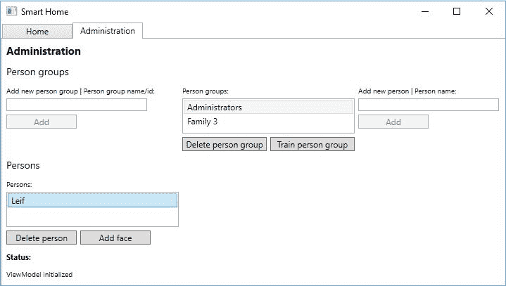

在我们能识别一个人之前，我们需要把脸和那个人联系起来。有了给定的人组和选定的人，我们可以添加面孔。为此，我们打开一个文件对话框。当我们有一个图像文件时，我们可以将人脸添加到人物中，如下所示:

```
        using (StreamimageFile = File.OpenRead(filePath)) 
        { 
            AddPersistedFaceResultaddFaceResult = await _faceServiceClient.AddPersonFaceAsync( 
            SelectedPersonGroup.PersonGroupId, 
            SelectedPerson.PersonId, imageFile); 

            if (addFaceResult != null) 
            { 
                StatusText = $"Face added for {SelectedPerson.Name}. Remember to train the person group!"; 
            } 
        } 
```

我们将图像文件作为`Stream`打开。这个文件作为我们调用`AddPersonFaceAsync`函数的第三个参数传递。我们可以将 URL 传递给图像，而不是流。

调用中的第一个参数是这个人所在的组的 person-group ID。下一个参数是人员 ID。

可选参数是字符串形式的用户数据和图像的`FaceRectangle`参数。如果图像中有多张脸，则需要`FaceRectangle`参数。

成功的调用将产生一个`AddPersistedFaceResult`对象。它包含这个人的持久化的面孔 ID。

每个人最多可以关联 248 张面孔。您可以添加的面孔越多，您以后就越有可能获得可靠的身份证明。此外，您应该从稍微不同的角度添加面。

有了足够多的相关人脸，我们需要训练人组。这是对人员或人员组进行任何更改后需要执行的任务。

我们可以在选定一个人组后对其进行训练:

```
    private async void TrainPersonGroup(object obj) 
    { 
        try 
        { 
            await _faceServiceClient.TrainPersonGroupAsync( 
SelectedPersonGroup.PersonGroupId); 
```

对`TrainPersonGroupAsync`函数的调用将人员-组 ID 作为参数。它不返回任何内容，可能需要一段时间来执行:

```
            while(true) 
            { 
                TrainingStatustrainingStatus = await _faceServiceClient.GetPersonGroupTrainingStatusAsync (SelectedPersonGroup.PersonGroupId); 
```

我们希望确保训练成功完成。为此，我们在一个`while`循环中调用`GetPersonGroupTrainingStatusAsync`函数。这个调用需要一个人-组 ID，一个成功的调用会产生一个`TrainingStatus`对象:

```
                if(trainingStatus.Status != Status.Running) 
                { 
                    StatusText = $"Person group finished with status: {trainingStatus.Status}"; 
                    break; 
                } 

                StatusText = "Training person group..."; 
                await Task.Delay(1000); 
            } 
        } 
```

我们检查状态，如果它没有运行，我们就显示结果。如果训练仍在运行，我们等待一秒钟，然后再次运行检查。

当训练成功后，我们就可以识别人员了。

有几个 API 调用我们还没有看到，这里将简单介绍一下:

*   要更新人员组，请调用以下函数，该函数不返回任何内容:

```
        UpdatePersonGroupAsync(PERSONGROUPID, NEWNAME, USERDATA) 
```

*   要得到一个人的脸，调用以下:

```
        GetPersonFaceAsync(PERSONGROUPID, PERSONID, PERSISTEDFACEID) 
```

成功的调用返回持久化的 face ID 和用户提供的数据。

*   要删除一个人的脸，调用以下；该调用不返回任何内容:

```
        DeletePersonFaceAsync(PERSONGROUPID, PERSONID, PERSISTEDFACeID) 
```

*   要更新一个人，请拨打以下电话:该调用不返回任何内容:

```
        UpdatePersonAsync(PERSONGROUPID, PERSONID, NEWNAME, USERDATA) 
```

*   要更新一个人的脸，调用以下；该调用不返回任何内容:

```
        UpdatePersonFaceAsync(PERSONGROUID, PERSONID, PERSISTEDFACEID, USERDATA) 
```


# 识别一个人

为了识别一个人，我们将上传一张图片。打开`HomeView.xaml`文件，向 UI 添加一个`ListBox`元素。这将包含在识别人员时可供选择的人员组。我们将需要添加一个按钮元素来查找图像，上传它，并识别人。增加了一个`TextBox`元素来显示工作响应。为了方便起见，我们还添加了一个图像元素来显示我们正在使用的图像。

在视图模型中，添加一个`PersonGroup`类型的`ObservableCollection`属性。我们需要为选择的`PersonGroup`类型添加一个属性。另外，为我们的图像添加一个`BitmapImage`属性，为响应添加一个字符串属性。我们还需要一个按钮的`ICommand`属性。

为`FaceServiceClient`类型添加一个私有变量，如下所示:

```
    private FaceServiceClient _faceServiceClient; 
```

这将在我们的构造函数中赋值，它应该接受一个`FaceServiceClient`类型的参数。从构造函数中，调用`Initialize`函数来初始化所有内容:

```
    private void Initialize() 
    { 
        GetPersonGroups(); 
        UploadOwnerImageCommand = new DelegateCommand(UploadOwnerImage,CanUploadOwnerImage); 
    } 
```

首先，我们调用`GetPersonGroups`函数来检索所有的人组。这个函数调用了我们前面看到的`ListPersonGroupsAsync` API。结果被添加到我们的`PersonGroup`列表的`ObservableCollection`参数中。

接下来，我们创建我们的`ICommand`对象。如果我们从`PersonGroup`列表中选择了一个项目,`CanUploadOwnerImage`函数将返回`true`。如果我们没有，它将返回`false`，我们将无法识别任何人。

在`UploadOwnerImage`函数中，我们首先浏览到一个图像，然后加载它。有了加载的图像和可用的文件路径，我们可以开始识别图像中的人:

```
    using (StreamimageFile = File.OpenRead(filePath)) 
    { 
        Face[] faces = await _faceServiceClient.DetectAsync(imageFile); 
        Guid[] faceIds = faces.Select(face =>face.FaceId).ToArray(); 
```

我们以`Stream`类型打开图像。利用这一点，我们检测图像中的人脸。从检测到的人脸中，我们得到一个数组中的所有人脸 id:

```
        IdentifyResult[] personsIdentified = await _faceServiceClient.IdentifyAsync (SelectedPersonGroup.PersonGroupId, 
faceIds, 1); 
```

face IDs 数组将作为第二个参数发送给`IdentifyAsync` API 调用。请记住，当我们检测到一张脸时，它会存储 24 小时。继续使用相应的面部 ID 将确保服务知道使用哪个面部进行识别。

使用的第一个参数是我们选择的人员组的 ID。调用中的最后一个参数是返回的候选人数量。因为我们不希望一次识别多个人员，所以我们指定一个。正因为如此，我们要确保上传的图像中只有一张人脸。

成功的 API 调用将产生一个`IdentifyResult`参数数组。该数组中的每个项目都包含候选项:

```
    foreach(IdentifyResultpersonIdentified in personsIdentified) {  
        if(personIdentified.Candidates.Length == 0) { 
            SystemResponse = "Failed to identify you."; 
            break; 
        } 
        GuidpersonId = personIdentified.Candidates[0].PersonId; 
```

我们遍历结果数组。如果我们没有任何候选人，我们就跳出这个循环。然而，如果我们有候选人，我们得到第一个候选人的`PersonId`参数(我们之前只要求一个候选人，所以这没问题):

```
        Person person = await faceServiceClient.GetPersonAsync( 
SelectedPersonGroup.PersonGroupId, personId); 

        if(person != null) { 
            SystemResponse = $"Welcome home, {person.Name}"; 
            break; 
        } 
    } 
} 
```

使用`personId`参数，我们得到一个单独的`Person`对象，使用 API 调用`GetPersonAsync`函数。如果呼叫成功，我们将向正确的人打印一条欢迎消息，并退出循环:

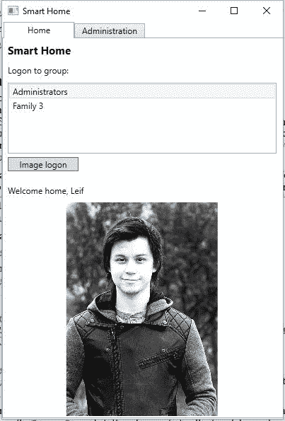

# 自动调节用户内容

使用**内容调节器** API，我们可以对用户生成的内容进行监控。创建 API 是为了帮助标记，并评估和过滤攻击性和不想要的内容。


# 内容要适度

在这一节中，我们将快速浏览一下审核 API 的关键特性。

所有 api 的文档参考可以在[https://docs . Microsoft . com/n b-no/azure/cognitive-services/content-moderator/API-reference](https://docs.microsoft.com/nb-no/azure/cognitive-services/content-moderator/api-reference)找到。


# 图像调节

**图像调节** API 允许你调节成人和色情内容的图像。它还可以提取文本内容并检测图像中的人脸。

当使用 API 评估成人和色情内容时，API 会将图像作为输入。基于该图像，它将返回一个布尔值，表明该图像是成人还是色情。它还将包含一个介于 0 和 1 之间的相应置信度得分。布尔值是基于一组默认阈值设置的。

如果图像包含任何文本，API 将使用 OCR 提取文本。然后，它将检测相同的信息，如文本审核，我们将很快得到。

一些基于内容的应用可能不想显示任何个人身份信息，在这种情况下，检测图像中的人脸可能是明智的。基于在面部检测评估中检索的信息，您可以确保没有用户内容包含人的图像。


# 文本审核

使用文本审核 API，您可以根据自定义和共享的文本列表筛选文本。它能够检测文本中的个人身份信息和脏话。在这种情况下，个人身份信息是电子邮件、电话和邮寄地址等信息的存在。

当你提交一个需要审核的文本时，如果没有声明，API 可以检测所使用的语言。屏蔽文本将自动纠正任何拼写错误的单词(以捕捉故意拼错的单词)。结果将包含文本中亵渎的位置和个人可识别信息，以及原始文本、自动更正的文本和语言。使用这些结果，您可以适当地调节内容。


# 审核工具

有三种方法可以通过内容审核者来审核内容:

*   **人工审核**:使用团队和社区来人工审核所有内容。
*   **自动调节**:利用机器学习和人工智能在没有人类互动的情况下进行大规模调节
*   混合审核:前两者的结合，人们通常会偶尔进行审核

常用的场景是最后一种。这是使用机器学习来自动化审核过程的地方，团队成员可以审查审核。微软已经创建了一个审查工具来简化这一过程。这允许您在应用中使用 API 时，在 web 浏览器中查看所有要审阅的项目。我们现在来看看这个工具。


# 使用审阅工具

要开始使用审查工具，前往[https://contentmoderator.cognitive.microsoft.com/](https://contentmoderator.cognitive.microsoft.com/)。在这里，您可以使用您的 Microsoft 帐户登录。首次登录时，您需要将您的名字添加到帐户中进行注册。然后，您将继续创建一个*审查团队*，如下面的屏幕截图所示:

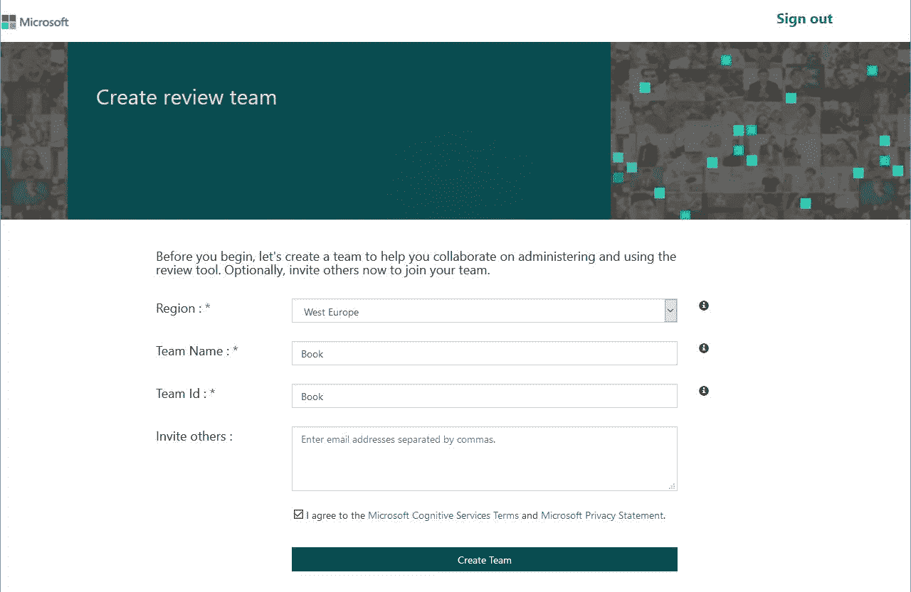

为此，请选择地区并输入团队名称。或者，您可以输入团队中其他成员的电子邮件地址。点击创建团队。

进入后，您将看到以下控制面板:

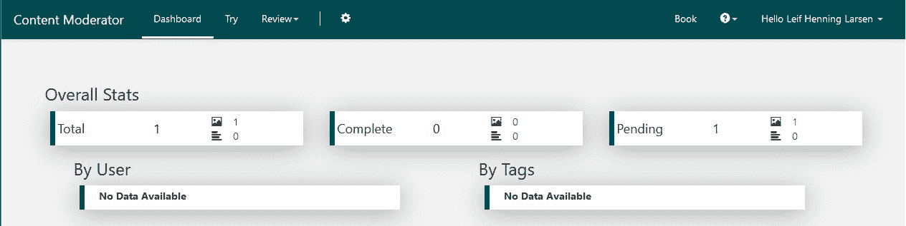

您将看到供审查的图像和文本内容的总数。您还会看到已完成和待完成的审核总数。仪表板还列出了已完成审阅的用户，以及用于内容的任何标签。

通过选择菜单中的“尝试”选项，您可以选择上传图像或文本来执行在线审核。通过上传图像或在文本框中输入示例文本来实现。完成后，您可以选择查看选项，您将看到以下内容:

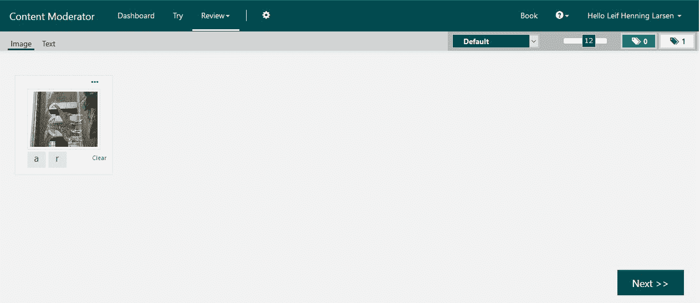

如果给定内容是成人内容或种族主义内容，您可以分别点击 a 或 r 按钮。对于文本，将显示任何亵渎。完成点评标记后，点击下一步。这将经历一个给定内容的调节过程。


# 其他工具

除了 API 和 review 工具之外，您还可以使用另外两个工具:

*   **列表管理器 API** :使用定制的图像和文本列表来控制预先确定的内容，避免重复扫描
*   **工作流 API** :使用这个 API，您可以定义条件逻辑和动作来指定您的特定内容所使用的策略

要使用这些 API 中的任何一个，或者使用仲裁 API，您可以调用特定的 REST APIs。为此，您需要使用一个 API 密钥和一个基本 URL。这些设置可以在查看工具网站的设置|凭证中找到，如下面的屏幕截图所示:

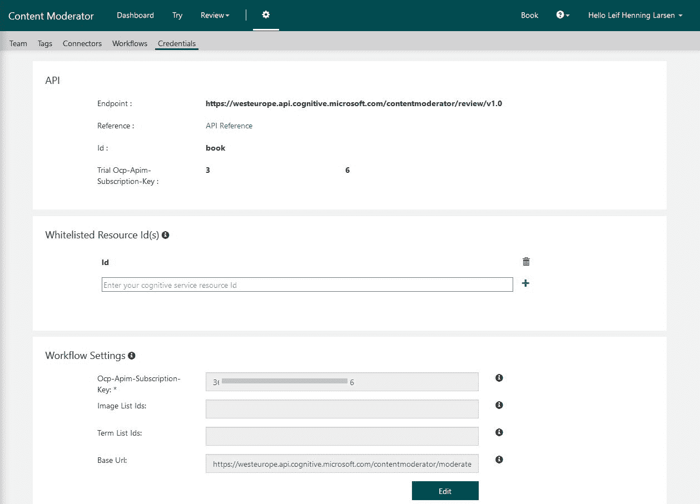

# 摘要

在本章中，我们深入探讨了 Vision APIs 的大部分内容。你学会了如何获得图像的良好描述。接下来，您学习了如何在图像中识别名人和文本。我们看到了如何生成缩略图。接下来，我们继续讨论 Face API，在这里我们获得了更多关于检测到的人脸的信息。我们发现了如何验证两张脸是否相同。在这之后，你学会了如何找到相似的脸和分组相似的脸。然后，我们在智能房屋应用中添加了身份识别功能，让它知道我们是谁。最后，我们快速浏览了一下内容审核器，看看如何为用户生成的内容添加自动审核功能。

下一章将继续最后两个 Vision APIs。你将学习如何检测图像和视频中的情感。从这里开始，我们将更加关注视频，发现视频 API 所能提供的东西。