# 三、分析视频

在前一章中，我们研究了处理图像的不同 API。在这一章中，我们将介绍两个新的 API:情感 API 和视频 API。通过本章的学习，我们将在智能房屋应用中加入情感识别。我们还将学习如何检测视频中的情绪。此外，我们将学习如何使用视频 API 的不同操作。

在本章中，我们将讨论以下主题:

*   识别图像中的情感
*   从视频中检索情感的汇总摘要
*   稳定和平滑抖动的视频
*   检测和跟踪视频中的人脸
*   在具有静止背景的视频中检测运动
*   自动生成视频缩略图摘要


# 使用 Emotion API 了解您的心情

Emotion API 允许你从图像和视频中的人脸识别情绪。

研究表明，有一些关键的情绪可以被归类为跨文化的。这些是快乐、悲伤、惊讶、愤怒、恐惧、轻蔑、厌恶和中性。所有这些都被 API 检测到，通过了解用户的心情，允许您的应用以更个性化的方式做出响应。

我们将首先学习如何从图像中识别情绪，这样我们的智能房屋应用就可以知道我们的情绪。


# 从网络摄像头获取图像

想象一下，你家周围有几个摄像头。智能房屋应用可以随时了解你的心情。通过了解这一点，它可以利用情绪来更好地预测你的需求。

我们将为我们的应用添加网络摄像头功能。如果你没有网络摄像机，你可以跟着做，但是使用我们已经看到的技术来加载图像。

首先，我们需要向我们的智能房屋应用添加一个 NuGet 包。通过 **shimat** 搜索`OpenCvSharp3-AnyCPU`并安装包。这是一个允许处理图像的包，我们将要添加的下一个依赖项会用到它。

在提供的示例代码中，有一个名为`VideoFrameAnalyzer`的项目。这是一个由微软编写的项目，它允许我们从网络摄像机中一帧一帧地抓取图像。利用这一点，我们能够在应用中分析情感。我们将执行的用例如下:

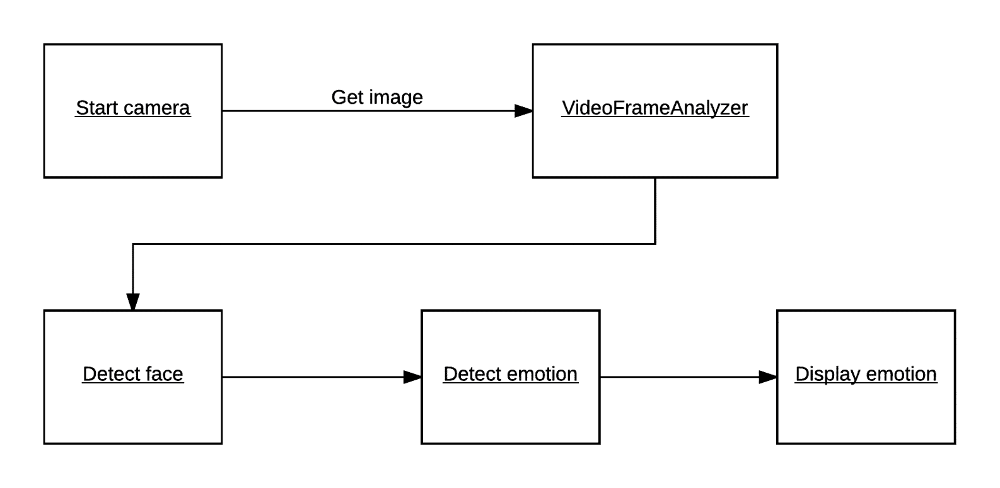

在我们的`HomeView.xaml`文件中，添加两个新按钮。一个是启动网络摄像机，另一个是停止它。

在相应的视图模型中，为每个按钮添加两个`ICommand`属性。还要添加以下私有成员:

```py
    private FrameGrabber<CameraResult> _frameGrabber; 
    private static readonly ImageEncodingParam[] s_jpegParams = { 
        new ImageEncodingParam(ImwriteFlags.JpegQuality, 60) 
    }; 
```

第一个是`FrameGrabber`对象，来自`VideoFrameAnalyzer`项目。静态成员是图像的参数数组，在获取网络摄像机图像时使用。此外，我们需要添加一个`CameraResult`类，它应该在视图模型文件内部:

```py
    internal class CameraResult { 
        public EmotionScores[] EmotionScores { get; set; } = null; 
    } 
```

我们将数组`EmotionScores`初始化为空。这样做是因为我们总是会从分析结果中获得情感分数。

在构造函数中添加`_frameGrabber`成员的初始化，并在`Initialization`函数中添加以下内容:

```py
    _frameGrabber.NewFrameProvided += OnNewFrameProvided; 
```

每次从摄像机提供新帧时，都会引发一个事件:

```py
    private void OnNewFrameProvided(object sender, FrameGrabber<CameraResult>.NewFrameEventArgs e) {           
        Application.Current.Dispatcher.Invoke(() => { 
            BitmapSource bitmapSource = e.Frame.Image.ToBitmapSource(); 

            JpegBitmapEncoder encoder = new JpegBitmapEncoder(); 
            MemoryStream memoryStream = new MemoryStream(); 
            BitmapImage image = new BitmapImage(); 
```

当我们收到新的帧时，我们想从它创建一个`BitmapImage`来在 UI 中显示它。这样做需要我们从当前调度程序调用动作，因为事件是从后台线程触发的。

我们得到`Frame`的`BitmapSource`并创建一些需要的变量，如下:

```py
    encoder.Frames.Add(BitmapFrame.Create(bitmapSource)); 
    encoder.Save(memoryStream); 
```

使用我们创建的*编码器*，我们添加`bitmapSource`并保存到`memoryStream`，如下所示:

```py
    memoryStream.Position = 0; 
    image.BeginInit();  
    image.CacheOption = BitmapCacheOption.OnLoad; 
    image.StreamSource = memoryStream; 
    image.EndInit(); 

    memoryStream.Close();  
    ImageSource = image; 
```

这个`memoryStream`然后被分配给我们创建的`BitmapImage`。这又被分配给`ImageSource`，它将在 UI 中显示框架。

由于这个事件将被触发很多，我们将在用户界面中获得一个流畅的流，它将看起来像是一个直接的视频馈送。

在我们的`Initialization`函数中，我们还需要为按钮创建我们的`ICommand`，如下所示:

```py
    StopCameraCommand = new DelegateCommand(StopCamera); 
    StartCameraCommand = new DelegateCommand(StartCamera, CanStartCamera); 
```

为了能够启动摄像机，我们需要选择一个人组，并且我们需要至少有一台摄像机可用:

```py
    private bool CanStartCamera(object obj) { 
        return _frameGrabber.GetNumCameras() > 0 && SelectedPersonGroup != null; 
    } 
```

要启动摄像机，我们需要指定要使用的摄像机，以及我们希望触发分析的频率:

```py
    private async void StartCamera(object obj) { 
        _frameGrabber.TriggerAnalysisOnInterval
(TimeSpan.FromSeconds(5)); 
        await _frameGrabber.StartProcessingCameraAsync(); 
    } 
```

如果在`StartProcessingCameraAsync`中没有指定摄像机，默认选择第一个可用的摄像机。

我们将很快回到分析部分。

要停止摄像机，我们运行以下命令:

```py
    private async void StopCamera(object obj) { 
        await _frameGrabber.StopProcessingAsync(); 
    } 
```


# 让智能屋知道你的心情

我们现在有一个来自网络摄像机的视频供我们使用。为了能够从中分析情感，我们首先需要添加情感 API NuGet 客户端包。找到并安装`Microsoft.ProjectOxford.Emotion` NuGet 客户端包到应用中。

如果你还没有这样做，在这里注册一个情感 API 的 API 密匙:[https://portal.azure.com](https://portal.azure.com)。

接下来，我们要添加一个新的私有成员，它将用于访问 API 特性:

```py
    private EmotionServiceClient _emotionServiceClient; 
```

这应该在构造函数中赋值。与`FaceServiceClient`一样，我们在`MainViewModel.cs`中创建了一个这种类型的新对象，并通过构造函数将其传入。

在`FrameGrabber`类中，有一个`Func`，将用于分析函数。我们需要创造一种功能，在这种功能中，情感会被识别。

创建一个新函数`EmotionAnalysisAsync`，接受一个`VideoFrame`作为参数。返回类型应为`Task<CameraResult>`，函数标记为`async`:

```py
    private async Task<CameraResult> EmotionAnalysisAsync (VideoFrame frame) { 
        MemoryStream jpg = frame.Image.ToMemoryStream(".jpg", s_jpegParams);  
        try { 
            Emotion[] emotions = await _emotionServiceClient.RecognizeAsync(jpg); 
```

我们作为参数得到的`frame`用于创建包含当前帧的`MemoryStream`。这将是 JPG 文件格式，并将被传递给`RecognizeAsync` API 函数。

`RecognizeAsync`有三种重载。我们可以传递一个 URL 来代替指定一个流。对于流和 URL，我们可以传递一个`FaceRectangle`作为第二个参数。这将指导服务使用哪一个面。添加`FaceRectangle`参数将要求您首先从 Face API 调用`DetectAsync`。

如果成功，调用`RecognizeAsync`将返回一个`Emotion`类型的数组。每一项都包含了`FaceRectangle`参数和每种情绪的当前分数。分数是我们想要返回的:

```py
    return new CameraResult { 
        EmotionScores = emotions.Select(e => e.Scores).ToArray() 
    }; 
```

捕捉任何可能抛出的异常，并在这种情况下返回 null。

在我们的`Initialize`函数中，我们需要将这个函数分配给`Func`。我们还需要在每次有新结果时添加一个事件处理程序:

```py
    _frameGrabber.NewResultAvailable += OnResultAvailable; 
    _frameGrabber.AnalysisFunction = EmotionAnalysisAsync; 
    private void OnResultAvailable(object sender, FrameGrabber<CameraResult>.NewResultEventArgs e) 
    { 
        var analysisResult = e.Analysis.EmotionScores;  
        if (analysisResult == null || analysisResult.Length == 0) 
            return; 
```

当一个新的结果进来时，我们获取收到的`EmotionScore`。如果它为空，或者不包含任何元素，我们不想做任何其他事情:

```py
        string emotion = AnalyseEmotions(analysisResult[0]); 

        Application.Current.Dispatcher.Invoke(() => { 
            SystemResponse = $"You seem to be {emotion} today."; 
        }); 
    } 
```

因为我们只期望每帧中有一张人脸，所以我们选择第一个要分析的情感分数。我们在`AnalyseEmotions`中解析它，稍后我们会看到。

使用来自`AnalyseEmotions`的结果，我们在结果中打印一个字符串来表示当前的情绪。这将需要从当前的调度程序调用，因为该事件已经在另一个线程中被触发。

为了获得可读格式的当前情绪，我们解析`AnalyseEmotions`中的情绪得分如下:

```py
    private string AnalyseEmotions(Scores analysisResult) { 
        string emotion = string.Empty; 
        var sortedEmotions = analysisResult.ToRankedList(); 
        string currentEmotion = sortedEmotions.First().Key; 
```

利用我们得到的`Scores`，我们调用一个`ToRankedList`函数。这将返回一个列表`KeyValuePair`，包含每种情绪，并带有相应的置信度。第一个是最有可能的，以此类推。我们只关心最上面的一个，所以我们选择它。

选择了最高情感分数后，我们通过`switch`语句找到正确的情感。这将被返回并打印到结果中:

```py
        switch(currentEmotion) 
        {  
            case "Anger": 
                emotion = "angry"; 
                break; 
            case "Contempt": 
                emotion = "contempt"; 
                break; 
            case "Disgust": 
                emotion = "disgusted"; 
                break; 
            case "Fear": 
                emotion = "scared"; 
                break; 
            case "Happiness": 
                emotion = "happy"; 
                break; 
            case "Neutral": 
                default: 
                emotion = "neutral"; 
                break; 
            case "Sadness": 
                emotion = "sad"; 
                break; 
            case "Suprise": 
                emotion = "suprised"; 
                break; 
            } 
            return emotion; 
        } 
```

难题的最后一部分是确保在指定的时间间隔执行分析。在`StartCamera`函数中，在调用`StartProcessingCamera`之前添加以下代码行:

```py
    _frameGrabber.TriggerAnalysisOnInterval(TimeSpan.FromSeconds(5)); 
```

这将触发每五秒调用一次情绪分析。

我脸上带着开心的微笑，应用现在知道我很开心，可以相应地提供进一步的交互。如果我们编译并运行该示例，我们应该会得到如下截图所示的结果:

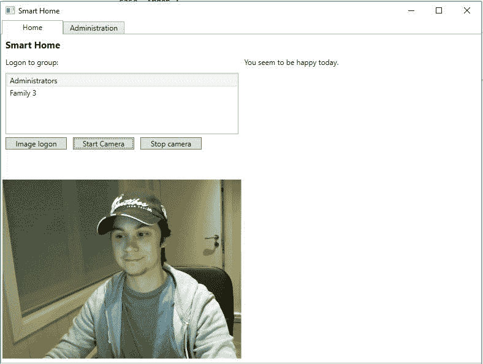

当我的情绪变为中性时，应用也会检测到这一点:

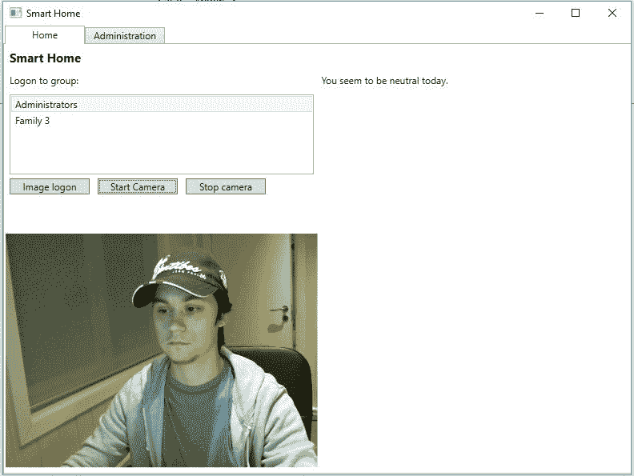

# 深入视频 API

视频 API 为视频处理提供了高级算法。使用这个 API，您可以构建更加个性化和智能化的应用。

这个 API 有四个主要特性，我们将对此进行研究。它们如下:

*   人脸检测和跟踪
*   运动检测
*   稳定抖动的视频
*   生成智能视频缩略图

如果您还没有这样做，请在[https://azure.microsoft.com/en-us/try/cognitive-services/](https://azure.microsoft.com/en-us/try/cognitive-services/)注册视频 API 的 API 密钥。点击视频 API 旁边的获取 API 键。

微软已经创建了一个 NuGet 包，包含视频 API，允许我们利用所有可用的功能。让我们从在 Visual Studio 中基于我们的 MVVM 模板创建一个新项目开始。

在新创建的项目中，通过 NuGet 包管理器添加`Microsoft.ProjectOxford.Video`。

由于这个示例项目将有许多共同的功能，我们只需要一个视图。提供的示例代码向`View`文件夹添加了一个视图`VideoView.xaml`，以及一个相应的视图模型。但是，如果您愿意，您可以使用`MainView.xaml`。

将视图分成两列，在每列中添加一个`StackPanel`。左边的应该有一个浏览视频文件的按钮。它应该有一个用于选择视频操作的`ComboBox`元素。此外，它应该有一个用于执行所选操作的按钮，以及一个用于显示所选视频的`MediaElement`。

右边的`StackPanel`应该有一个`TextBox`元素来显示状态和文本响应。它还应该有一个`MediaElement`能够显示结果视频。

相应的视图模型应该有两个`Uri`属性作为每个`MediaElement`的源。对于文本结果，它应该有一个`string`属性。它将需要一个`IEnumerable`属性，从一个`enum`返回值，我们将在稍后定义它，以及要执行的选定视频操作。最后但同样重要的是，我们的每个按钮需要两个`ICommand`属性。

在`Interface`文件夹中，添加名为`AvailableOperations.cs`的新文件。添加以下内容:

```py
    namespace Chapter3.Interface 
    { 
        public enum AvailableOperations 
        { 
            FaceDetection, 
            MotionDetection, 
            Stabilization, 
            Thumbnail 
        } 
    } 
```

这里我们定义了一个名为`AvailableOperations`的`enum`类型变量。它保存了我们可以执行的所有视频操作，包括人脸检测、运动检测、视频稳定和视频缩略图生成。

回到视图模型，我们定义的`IEnumerable`变量应该返回来自`AvailableOperations`的值:

```py
    public IEnumerable<AvailableOperations> VideoOperations { 
        get {  
            return Enum.GetValues(typeof(AvailableOperations)) .Cast<AvailableOperations>();  
        } 
    } 
```

在`Model`文件夹中创建一个名为`VideoOperations.cs`的新文件。我们稍后将回到这一点。现在，您需要知道的是，这是我们收集所有 API 调用的地方。

ViewModel 应该定义三个私有成员，如下所示:

```py
    private string _videoExtension = ".mp4"; 
    private string _filePath; 
    private VideoOperations _videoOperations; 
```

第一个是字符串，包含输入视频的文件格式。稍后你会明白为什么。第二个字符串只包含我们输入视频的文件路径。最后一个将允许我们调用各种视频操作。

根据您是否创建了新的视图和视图模型，视图模型的构造函数可能会有所不同。在示例代码中，我们有一个独立于`MainViewModel.cs`文件的视图模型，因此，我们在构造函数中传递`VideoOperations`对象。然后，构造函数将其分配给之前创建的成员，并创建`ICommand`属性，如下所示:

```py
    public VideoViewModel(VideoOperations videoOperations) { 
        _videoOperations = videoOperations; 

        BrowseVideoCommand = new DelegateCommand(BrowseVideo); 
        ExecuteVideoOperationCommand = new DelegateCommand(ExecuteVideoOperation,  
        CanExecuteVideoCommand); 
    } 
```

当我们学习本章的其余部分时，我们将看到`BrowseVideoCommand`和`ExecuteVideoOperationCommand`的命令动作。

编译和运行这个应用应该会向您呈现类似于下面的内容:

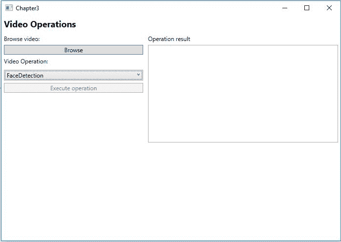

# 作为通用代码的视频操作

在我们深入研究 API 的不同特性之前，我们将编写一些可以被所有四种特性使用的代码。使用 NuGet 客户端包，我们能够使用相同的功能来执行所有的视频操作。区别在于我们指定了哪种操作类型。

打开`VideoOperations.cs`文件，在`VideoOperations`类下添加以下类:

```py
    public class VideoOperationStatusEventArgs : EventArgs { 
        public string Status { get; private set; } 
        public string Message { get; private set; } 

        public VideoOperationStatusEventArgs(string status, string message) { 
            Status = status; 
            Message = message; 
        } 
    } 
```

万一任何操作抛出异常或失败，我们希望能够引发一个事件。该事件应该包含一个`Status`，和一个`Message`，解释这种情况。

回到`VideoOperations`类，定义下面的成员和事件:

```py
    private VideoServiceClient _videoServiceClient; 
    public event EventHandler<VideoOperationStatusEventArgs> OnVideoOperationStatus; 
```

第一个是视频 API 客户端对象，第二个是事件，如前所述。

在构造函数中，我们创建了一个新的`VideoServiceClient`对象，如下所示:

```py
    public VideoOperations() { 
        _videoServiceClient = new VideoServiceClient("API_KEY_HERE"); 
    } 
```

当我们想要执行视频操作时，我们需要指定要使用的视频操作设置。为此，我们创建一个函数`CreateVideoOperationSettings`，接受一个`AvailableOperations`对象作为参数。返回类型应该是类型`VideoOperationSettings`，它是所有操作设置的基类:

在前面的函数中，我们创建了一个局部变量`videoOperationSettings`，它将作为返回对象。基于`AvailableOperations`对象，我们将`videoOperationSettings`分配给正确的类型，如下所示:

```py
    public VideoOperationSettings CreateVideoOperationSettings(AvailableOperations operation) { 
        VideoOperationSettings videoOperationSettings = null; 
        switch (operation) { 
```

第一种情况是面部检测和/或面部跟踪。在这种情况下，我们需要一个`FaceDetectionOperationSettings`对象。这不包含任何要设置的属性:

```py
        case AvailableOperations.FaceDetection: 
        videoOperationSettings = new FaceDetectionOperationSettings(); 
        break; 
```

下一个案例是视频稳定。这里我们创建一个新的`VideoStabilizationOperationSettings`，它同样不包含任何要设置的属性:

```py
        case AvailableOperations.Stabilization: 
        videoOperationSettings = new VideoStabilizationOperationSettings(); 
        break; 
```

The next case is for video stabilization. Here we create a new `VideoStabilizationOperationSettings`, which again does not contain any properties to set:

```py
        case AvailableOperations.MotionDetection: 
        videoOperationSettings = new MotionDetectionOperationSettings() 
        { 
            DetectLightChange = true, 
            FrameSamplingValue = 10, 
            MergeTimeThreshold = 10, 
            SensitivityLevel = MotionDetectionOperationSettings. SensitivityLevels.Medium 
        }; 
        break; 
```

对于运动检测，我们创建了一个`MotionDetectionOperationSettings`对象，这有点有趣。在这里，我们可以指定几个值，如下表所示:

For motion detection, we create a `MotionDetectionOperationSettings` object, which is a bit more interesting. Here we can specify several values, which are explained in the following table:

**属性**

| **描述** | `DetectLightChange` |
| 这指定了是否应该在帧与帧之间的光线变化时触发运动检测。 | `FrameSamplingValue` |
| 这指定了要检测哪些帧。在我们的例子中，我们希望从每第 10 帧开始检测。 | `MergeTimeThreshold` |
| 这指定了连续的运动是否应该合并为一个。 | `SensitivityLevel` |
| 这指定了低、中、高范围内的灵敏度级别。更高的灵敏度会导致更多的假警报。 | `DetectionZones` |
| 一个`MotionPolygon`数组，允许您指定视频中的某些区域，在这些区域中应该检测到运动。 | An array of `MotionPolygon`, which allows you to specify certain regions in the video, where motion should be detected. |

最后一种情况是针对`VideoThumbnailOperationSettings`，它允许我们生成智能视频缩略图:

这又有点有趣，因为我们可以指定对象的属性。下表对此进行了解释:

```py
        case AvailableOperations.Thumbnail: 
        videoOperationSettings = new VideoThumbnailOperationSettings() 
        { 
            FadeInFadeOut = true, 
            MaxMotionThumbnailDurationInSecs = 10, 
            OutputAudio = true, 
            OutputType = VideoThumbnailOperationSettings .OutputTypes.Video 
        }; 
        break; 
```

**属性**

| **描述** | `FadeInFadeOut` |
| 这指定了不同场景之间是否淡入和淡出。 | `MaxMotionThumbnailDurationInSecs` |
| 这指定缩略图的最大长度。如果未指定，算法默认为优化的持续时间。 | `OutputAudio` |
| 这指定视频中出现的音频是否应该出现在缩略图中。 | `OutputType` |
| 这指定了输出类型。目前，只有视频可用。 | This specifies the output type. Currently, only video is available. |

如果没有输入有效的`AvailableOperations`，我们返回`null`作为`videoOperationSettings`:

创建了该函数后，我们将添加一个助手函数来引发状态事件:

```py
            default: 
            break; 
        }  
        return videoOperationSettings; 
    } 
```

所有这些都是为了接收事件参数`VideoOperationStatusEventArgs`，如果有人听到，就触发事件。

```py
    private void RaiseVideoOperationStatus (VideoOperationStatusEventArgs args) { 
        OnVideoOperationStatus?.Invoke(this, args); 
    } 
```

接下来，我们添加一个实际创建和执行视频操作的函数。调用它`ExecuteVideoOperations`，让它接受一个`Stream`对象和一个`VideoOperationSettings`对象。这个函数应该是`async`，返回类型应该是`Task`:

在`try`子句中，我们使用`_videoServiceClient`调用`CreateOperationAsync`函数。该函数接受函数参数中给出的`Stream`和`VideoOperationSettings`。调用的响应是一个类型为`Operation`的对象。这包含 URL，我们可以在其中获得操作状态。

```py
    public async Task ExecuteVideoOperation(Stream stream, VideoOperationSettings videoOperationSettings) { 
        try { 
            Operation operation = await _videoServiceClient.CreateOperationAsync (stream, videoOperationSettings); 
```

执行任一 API 调用都会产生一个`202`状态代码。这包含操作位置的 URL，您可以使用它来查询操作状态。

`CreateOperationAsync`函数有两个重载。其中一个接受一个字符串作为在线视频的 URL。另一个包含视频的字节数组。无论您调用哪个函数，以下代码都适用:

如果产生的`operation`对象为空，我们将引发状态事件，因为操作失败了。我们也懒得在函数中做更多的事情，因为这是没有意义的。

```py
            if (operation == null) { 
                RaiseVideoOperationStatus(new VideoOperationStatusEventArgs("Failed", "Failed to create video operation")); 
                return; 
            } 
            await Task.Run(() => GetVideoOperationResultAsync(operation));   
        } 
```

如果 API 调用成功，我们启动一个新线程，它将检查操作状态。我们将`operation`对象指定为参数，因为我们需要它提供的 URL。

在我们查看它之前，确保您捕捉到任何异常，并在这种情况下引发状态事件。

获取操作结果


# 在我们检查操作状态之前，我们想要添加一个新的`EventArgs`类。在文件底部添加以下内容:

该类将包含状态、消息以及处理结果或资源位置。随着我们的进展，我们将对后两者了解更多。

```py
    public class VideoOperationResultEventArgs : EventArgs { 
        public string Status { get; set; } 
        public string Message { get; set; } 
        public string ProcessingResult { get; set; } 
        public string ResourceLocation { get; set; } 
    } 
```

此外，我们想向`VideoOperations`类添加另一个事件，如下所示:

添加一个 helper 函数来引发此事件，如下所示:

```py
    public event EventHandler<VideoOperationResultEventArgs> OnVideoOperationCompleted; 
```

这将接受新创建的`VideoOperationResultEventArgs`作为参数，并在有人监听时引发事件。

```py
    private void RaiseVideoOperationCompleted (VideoOperationResultEventArgs args) { 
        OnVideoOperationCompleted?.Invoke(this, args); 
    } 
```

现在让我们创建`GetVideoOperationResultAsync`函数。这是我们之前看到的函数，在它自己的线程中启动:

这个函数必须标记为`async`，它接受一个类型为`Operation`的对象。我们开始了一个`while`循环，它将一直运行，直到我们打破它。

```py
    private async void GetVideoOperationResultAsync (Operation videoOperation) 
    { 
        try 
        { 
            while(true) 
            {  
                OperationResult operationResult = await _videoServiceClient.GetOperationResultAsync (videoOperation); 
```

我们在这个循环中做的第一件事是请求操作状态，调用`GetOperationResultAsync`，指定`videoOperation`。该调用将产生一个`OperationResult`对象，包含创建和上次动作时间、状态消息、操作状态、处理结果和资源位置等数据:

使用`operationResult`对象中的`Status`字段，我们可以使用`switch`语句来检查状态。如果状态是`Failed`，我们将引发一个状态事件，指定失败的原因。在这种情况下，我们将把`bool`、`IsCompleted`设置为`true`，这样我们就可以跳出`while`循环。

```py
    bool isCompleted = false;  
    switch(operationResult.Status) 
    { 
        case OperationStatus.Failed:RaiseVideoOperationStatus(new VideoOperationStatusEventArgs("Failed", $"Video operation failed: {operationResult.Message}")); 
        isCompleted = true; 
        break; 
```

如果状态为`NotStarted`、`Uploading`或`Running`，我们将引发一个事件，并声明如下。我们还将后者定义为`default`状态。这些状态都不会脱离`while`循环:

如果状态为`Succeeded`，我们将引发完成视频操作事件。我们确保指定处理结果和资源位置，如下所示:

如果我们正在执行面部检测/跟踪或运动检测操作，处理结果将包含数据。在这些情况下，这将是字符串格式的 JSON 数据。

```py
    case OperationStatus.NotStarted: RaiseVideoOperationStatus(new VideoOperationStatusEventArgs("Not started", "Video operation has not started yet")); 
        break; 

    case OperationStatus.Running: default: RaiseVideoOperationStatus(new VideoOperationStatusEventArgs("Running", "Video operation is running")); 
        break;  

    case OperationStatus.Uploading: RaiseVideoOperationStatus(new VideoOperationStatusEventArgs("Uploading", "Video is uploading")); 
        break; 
```

如果我们正在执行稳定或生成缩略图操作，资源位置将包含数据。在这些情况下，这将包含到结果视频的链接。

```py
    case OperationStatus.Succeeded: RaiseVideoOperationCompleted (new VideoOperationResultEventArgs 
    { 
        Status = "Succeeded", 
        Message = "Video operation completed successfully", 
        ProcessingResult = operationResult.ProcessingResult, 
        ResourceLocation = operationResult.ResourceLocation, 
    }); 
    isCompleted = true; 
    break; 
```

当我们从`switch`语句中出来时，我们检查操作是否已经完成。如果有，我们就跳出`while`循环。如果没有，我们将等待 20 秒，然后再次尝试:

我们等 20 秒有几个原因。首先是我们目前使用的是预览版。这个 API 键每分钟只允许五次调用`GetOperationResultAsync`。第二个原因是视频处理自然要花一段时间。因此，发送垃圾邮件来检查操作是否完成是没有意义的。

确保在继续之前捕捉到任何异常。如果捕获到任何异常，则引发状态事件，指定异常。

```py
        if (isCompleted) 
            break; 
        else 
            await Task.Delay(TimeSpan.FromSeconds(20)); 
        } 
    } 
```

我们想在`VideoOperations`类中添加的最后一个函数是检索结果视频的函数。调用这个函数`GetResultVideoAsync`，让它接受一个`string`作为参数。这将是视频 URL。该函数应返回一个`Task<Stream>`对象，并应标记为`async`:

在这个函数中，我们调用`GetResultVideoAsync`，指定`url`作为参数。一个成功的调用将产生一个包含结果视频的`Stream`对象。然后将它返回给调用者。如果抛出任何异常，我们会捕捉它并返回 null。

我们进行的所有 API 调用都会导致不同的错误。下表对这些进行了描述:

```py
    public async Task<Stream> GetResultVideoAsync(string url) { 
        try { 
            Stream resultStream = await _videoServiceClient.GetResultVideoAsync(url); 
            return resultStream; 
        } 
```

**代码**

**描述**

| `400` | 这个可以是`InvalidVideoSize`也可以是`BadArgument`。第一种意味着视频太小或太大。后者意味着 JSON 请求无法序列化。 |
| `401` | 未经授权。订阅密钥无效。 |
| `403` | `QuotaLimitExceeded`。已超出批量报价。 |
| `415` | 内容类型错误。使用 NuGet 客户端包时不应出现这种情况。 |
| `429` | `RateLimitExceeded`。已超过速率限制，请稍等片刻，然后重试。 |
| 在视图模型中连接执行 | 随着`VideoOperations`类的完成，是时候在我们的视图模型中连接动作了。 |


# 之前，我们创建了`ICommand`对象。让我们从查看`BrowseVideo`功能开始:

这些代码都不应该是新的，因为我们在前面的章节中已经做了同样的事情。我们创建一个`OpenFileDialog`，只过滤允许的视频文件。所有操作允许的视频文件是。`mp4`，。`mov`，和。`wmv`。

如果我们选择了一个文件，我们将文件路径分配给我们的`_filePath`成员。我们还找到文件扩展名，并将其分配给`_videoExtension`成员。

```py
    private void BrowseVideo(object obj) 
    { 
        Microsoft.Win32.OpenFileDialog openDialog = new Microsoft.Win32.OpenFileDialog(); 
        openDialog.Filter = "Video files (*.mp4, *.mov, *.wmv)|*.mp4;*.mov;*.wmv"; 

        bool? result = openDialog.ShowDialog(); 
        if (!(bool)result) return; 

        _filePath = openDialog.FileName; 
        _videoExtension = Path.GetExtension(_filePath); 
    } 
```

我们拥有的另一个`ICommand`，`ExecuteVideoOperationCommand`，需要在允许执行之前确保我们已经选择了一个文件:

我们通过简单地检查`_filePath`成员不为 null 或空来做到这一点。

为了执行视频操作，我们有一个异步函数，`ExecuteVideoOperation`:

```py
    private bool CanExecuteVideoCommand(object obj) { 
        return !string.IsNullOrEmpty(_filePath); 
    } 
```

我们要做的第一件事是创建`VideoOperationSettings`。我们通过调用前面创建的`CreateVideoOperationSettings`来实现，指定`SelectedVideoOperation`:

创建视频操作设置后，我们从视频中创建新的`FileStream`。如果流是空的，我们离开函数。

```py
    private async void ExecuteVideoOperation(object obj) 
    { 
        VideoOperationSettings operationSettings = _videoOperations.CreateVideoOperationSettings (SelectedVideoOperation); 
```

如果流中有数据，我们称之为`ExecuteVideoOperation`。我们传递视频流和操作设置:

```py
    using (FileStream originalVideo = new FileStream (_filePath, FileMode.Open, FileAccess.Read)) 
    { 
        if (operationSettings == null) return;
        await _videoOperations.ExecuteVideoOperation (originalVideo, operationSettings); 
    } 
```

为了结束这个函数，我们想用`_filePath`更新`VideoSource`属性。这将在视图中设置`MediaElement`的来源并播放视频。

在我们测试任何东西之前，我们需要挂钩到`VideoOperations`类中的事件。在构造函数中，在`_videoOperations`的赋值或创建下面添加以下内容:

```py
        VideoSource = new Uri(_filePath); 
    } 
```

现在，让我们来创建`OnVideoOperationStatus`:

这是一个相当简单的函数，它将状态和状态消息打印到 UI。由于事件是在另一个线程中引发的，我们需要从当前的 dispatcher 调用一个操作。

```py
    _videoOperations.OnVideoOperationCompleted += OnVideoOperationCompleted; 
    _videoOperations.OnVideoOperationStatus += OnVideoOperationStatus; 
```

另一个事件处理程序`OnVideoOperationCompleted`与此类似，但增加了一些代码:

```py
    private void OnVideoOperationStatus(object sender, VideoOperationStatusEventArgs e) 
    { 
        Application.Current.Dispatcher.Invoke(() => 
        { 
            StringBuilder sb = new StringBuilder(); 
            sb.AppendFormat("{0}\n", e.Status); 
            sb.AppendFormat("{0}\n", e.Message); 
            Result = sb.ToString(); 
        }); 
    } 
```

同样，我们需要调用当前调度程序上的一个操作。这样，我们希望将状态和消息添加到结果视图中。

接下来，我们检查在`ProcessingResult`字段中是否有数据。如果有，我们将字符串格式化为 JSON 并打印到结果视图中。`JsonFormatter`是一个可以在示例项目的`Model`文件夹中找到的类:

```py
    private async void OnVideoOperationCompleted(object sender, VideoOperationResultEventArgs e) 
    { 
        await Application.Current.Dispatcher.Invoke(async () => 
        { 
            StringBuilder sb = new StringBuilder(); 
            sb.AppendFormat("{0}\n", e.Status); 
            sb.AppendFormat("{0}\n", e.Message); 
```

接下来，我们使用`ResourceLocation`检查是否有结果视频。如果有，我们打印出结果视图的 URL 并调用`GetResultVideoAsync`来获取视频。如果我们没有视频，我们离开该功能:

如果我们有一个结果视频，我们会生成一个新的临时文件，并将其作为`FileStream`打开。使用`resultVideo`流，我们写入临时文件，该文件与原始视频文件的格式相同:

```py
    if (!string.IsNullOrEmpty(e.ProcessingResult)) 
    { 
        sb.Append("Results: \n"); 
        sb.AppendFormat("{0}\n", 
        JsonFormatter.FormatJson(e.ProcessingResult)); 
    } 
```

当我们写入临时文件时，我们创建一个新的`Uri`，并将其分配给`ResultVideoSource`。这将使结果视频`MediaElement`在右侧`StackPanel`播放结果视频。我们还确保在关闭视频之前，所有生成的文本都打印到用户界面上:

```py
    if (!string.IsNullOrEmpty(e.ResourceLocation)) 
    { 
        sb.AppendFormat("Video can be fetched at: {0}\n", e.ResourceLocation); 
        Stream resultVideo = await 
        _videoOperations.GetResultVideoAsync(e.ResourceLocation);
        if (resultVideo == null) return; 
```

使用视频进行测试时，以下要点描述了您需要对视频文件进行的一些考虑:

```py
        string tempFilePath = Path.GetTempFileName() + _videoExtension;  
        using (FileStream stream = new FileStream(tempFilePath, FileMode.Create)) 
        { 
            byte[] b = new byte[2048]; 
            int lenght = 0; 
            while((lenght = await resultVideo.ReadAsync(b, 0, b.Length)) > 0) { 
                await stream.WriteAsync(b, 0, lenght); 
            } 
        } 
```

它们不能大于 100 MB

```py
        Uri fileUri = new Uri(tempFilePath); 
        ResultVideoSource = fileUri; 
        } 
        Result = sb.ToString(); 
    }); 
```

他们必须是 MP4，MOV 或 WMV

*   分辨率应小于或等于 4K
*   可检测的人脸在 24x24 到 2，048x2，048 像素的范围内
*   每个视频最多可检测 64 张人脸
*   带有结果视频的测试运行将类似于下面的屏幕截图:
*   上传视频后，处理过程将会运行:

所有产生的视频和输出文件将在 24 小时后被删除。

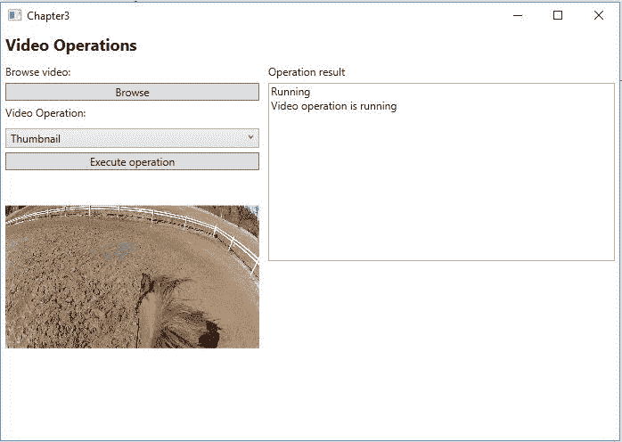

检测和跟踪视频中的人脸

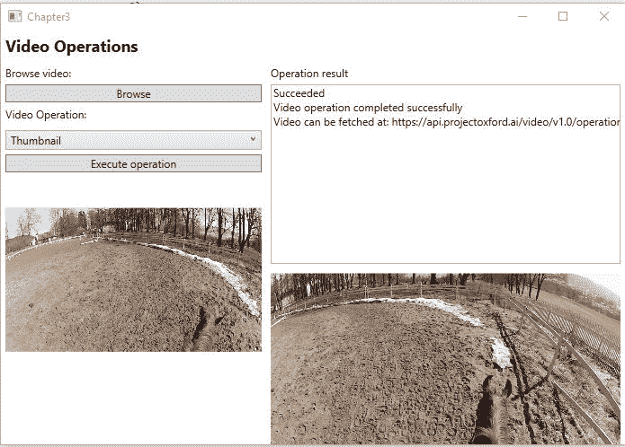

当检测和跟踪人脸时，您将获得包含 JSON 数据的响应。这将包括检测到的面部、它们被检测到的时间以及在每一帧中的位置。


# 正面和接近正面的面部会给出最好的结果，而大的面部角度可能更难检测。

结果将如下所示:

返回的 JSON 的基本信息如下:

从 JSON 上可以看到检测到的人脸，用`faceId`。每张脸在视频中都会有一个位置，每个事件，宽度和高度。这允许你用一个矩形来映射每个面。

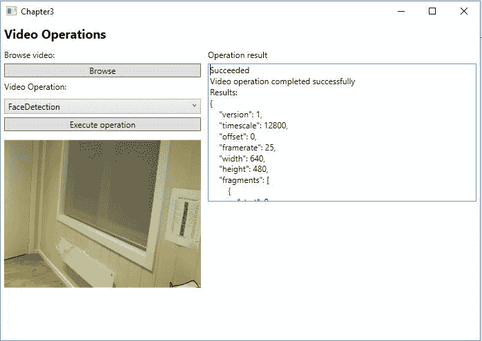

检测运动

```py
    { 
        "version": 1, 
        "timescale": 12800, 
        "offset": 0, 
        "framerate": 25, 
        "width": 640, 
        "height": 480, 
        "fragments": [{ 
            "start": 0, 
            "duration": 48640 
        }, { 
              "start": 48640, 
              "duration": 25600, 
              "interval": 512, 
              "events": [[{ 
                  "id": 0, 
                  "x": 0, 
                  "y": 0.14375, 
                  "width": 0.16875, 
                  "height": 0.225 
                }], 
            },], 
            "facesDetected": [{ 
            "faceId": 0 
        }] 
    } 
```

当检测视频中的运动时，响应将包含检测到的运动的帧和持续时间。如果在视频中的几个地方检测到运动，结果将指定每个检测区域。


# 结果将如下所示:

返回的 JSON 的基本信息如下:

在前面的代码中，你可以清楚地看到你得到了定义的运动区域。您还可以找到动作的开始、动作在视频中的位置以及每个动作所在的区域。

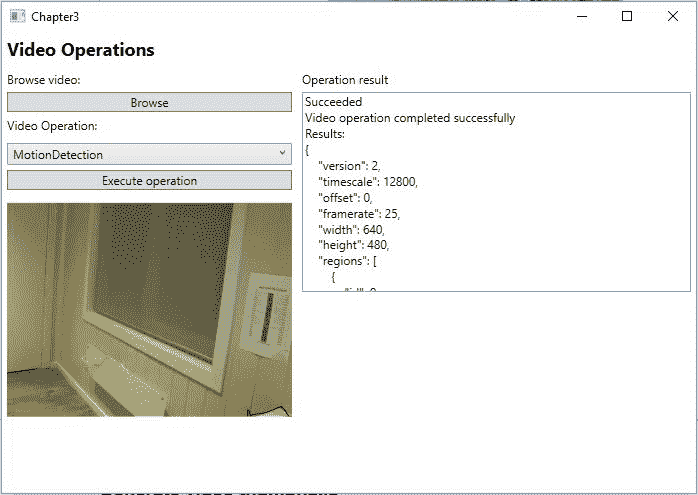

稳定抖动的视频

```py
    { 
        "version": 2, 
        "timescale": 12800, 
        "offset": 0, 
        "framerate": 25, 
        "width": 640, 
        "height": 480, 
        "regions": [ 
            "id": 0, 
            "type": "polygon", 
            "points": [ 
             { 
                 "x": 0.000000, 
                 "y": 0.000000 
             },}, 
             "fragments": [{ 
             "start": 0, 
             "duration": 143360 
        },{ 
            "start": 143360, 
            "duration": 20992, 
            "interval": 512, 
            "events": [ 
                "type": 2, 
                "typeName": "motion", 
                "locations": [{ 
                    "x": 0.004184, 
                    "y": 0.525140, 
                    "width": 0.558333, 
                    "height": 0.350000 
                }], 
                "regionId": 0 
            }], 
        } 
    } 
```

稳定抖动的视频要求视频的宽度和高度为偶数。它针对小型相机运动进行了优化，如手持静态相机和慢速行走。


# 这个操作的结果将不包含任何 JSON 数据，因为您将得到一个结果视频作为响应。

生成视频缩略图

生成视频缩略图不会产生任何 JSON 数据。结果将是一个视频，其持续时间在`VideoThumbnailOperationSettings`中设置为一个参数，或者默认选择。


# 处理算法将以下定义为最佳缩略图持续时间:

**视频时长**

< 3 min

| 3 min - 15 min | 15 min - 30 min | > 30 分钟 | **缩略图持续时间** | 15 秒 |
| 30 秒 | 60 秒 | 90 秒 | 分析视频中的情感 | 之前，我们看了分析图像中的情绪。我们也可以对视频进行同样的分析。 |


# 为了能够做到这一点，我们可以修改视频 API 的现有示例。

首先添加`Microsoft.ProjectOxford.Emotion`作为一个 NuGet 客户端包。

接下来，我们将`Emotion`添加到`AvailableOperations`枚举中。在`VideoOperations`类中，为`CreateVideoOperationSettings`中的值添加一个新案例。返回 null，因为我们不需要任何视频操作设置。

向`VideoOperations`添加一个私有成员:

使用您之前注册的 API 键，在构造函数中初始化它。

在`VideoOperationResultEventArgs`中，添加一个名为`EmotionResult`的新属性。这应该是`VideoAggregateRecognitionResult`的类型。

```py
    private EmotionServiceClient _emotionServiceClient; 
```

回到`VideoOperations`类，复制`GetVideoOperationResultAsync`函数。将其重命名为`GetVideoEmotionResultAsync`，并将接受的参数改为`VideoEmotionRecognitionOperation`。在函数内部，您需要将`while`循环中的第一行改为:

这将获得当前的操作状态，就像我们看到的视频 API 调用一样。

将`Succeeded`案例更改为以下内容:

```py
    var operationResult = await _emotionServiceClient.GetOperationResultAsync(videoOperation); 
```

如您所见，我们将`operationResult`转换成了`VideoOperationInfoResult<VideoAggregateRecognitionResult>`对象。这样我们就可以访问`ProcessingResult`，它包含了视频中情感的集合。

在写作的时候，当使用 NuGet API 时，结果将只是情感的集合。如果你直接调用 REST API，你可以指定你想要每一帧的情感。

```py
    case VideoOperationStatus.Succeeded:
        var result = operationResult as VideoOperationInfoResult<VideoAggregateRecognitionResult>; 
        RaiseVideoOperationCompleted(new VideoOperationResultEventArgs 
        { 
            Status = "Succeeded", 
            Message = "Video operation completed successfully", 
            EmotionResult = result.ProcessingResult, 
        }); 
       isCompleted = true; 
       break; 
```

在我们离开`VideoOperations`类之前，让我们添加一个新函数`ExecuteVideoEmotionAnalysis`。让它接受一个`Stream`作为参数，并让返回类型为`Task`。将该功能标记为`async`:

At the time of writing, when using the NuGet API, the result will only be an aggregate of the emotions. If you are calling the REST API directly, you can specify that you want emotions on a per-frame basis.

这里我们调用`_emotionServiceClient`中的`RecognizeInVideoAsync`函数。我们传递包含视频的`videoStream`进行分析。与视频 API 中的函数一样，它也有两个重载:一个接受 URL 作为`string`，另一个接受`byte`数组。

```py
    public async Task ExecuteVideoEmotionAnalysis(Stream videoStream) { 
        try 
        { 
            VideoEmotionRecognitionOperation operation = await _emotionServiceClient.RecognizeInVideoAsync(videoStream); 
```

结果是一个`VideoEmotionRecognitionOperation`对象，我们传递它以获得操作状态:

同样，我们检查操作是否包含任何内容。如果是，我们启动一个新线程，查询操作状态。

我们需要的最后一部分是修改视图模型中的`OnVideoOperationCompleted`事件处理程序。

```py
        if (operation == null) { 
            RaiseVideoOperationStatus(new VideoOperationStatusEventArgs("Failed", "Failed to analyze emotions in video")); 
            return; 
        } 
        await Task.Run(() => GetVideoEmotionResultAsync(operation)); 
    } 
```

在`if`之后，检查`ResourceLocation`并添加新的`if`:

我们检查是否有任何情绪结果。`EmotionResult`里有一些数据；但是，我们要循环通过`Fragments`，在这里可以找到情绪。

每个片段都包含一个`Event`，我们想要访问那些不为空的片段:

```py
    if(e.EmotionResult != null) { 
        sb.Append("Emotion results:\n");  
        foreach(var fragment in e.EmotionResult.Fragments) { 
            if (fragment.Events == null) continue; 
```

We check to see if we have any emotion results. There is some data in the `EmotionResult`; however, we want to loop through the `Fragments`, where the emotions can be found.

每个`Event`依次包含聚合体。我们不关心不存在的集合:

```py
    foreach(var aggregate in fragment.Events) { 
        if (aggregate == null) 
            continue; 
```

在每个集合中，都有一个情感，包含该片段的`WindowMeanScores`。我们得到这个数据的一个排序列表，并通过它循环打印出所有情绪的平均分数。

结果可能如下所示:

```py
    foreach(var emotion in aggregate) { 
        if (emotion == null) 
            continue; 
        var emotionScores = emotion.WindowMeanScores.ToRankedList(); 

        foreach(var score in emotionScores) { 
            sb.AppendFormat("Emotion: {0} / Score: {1}\n", score.Key, score.Value); 
        } 
    } 
```

使用视频索引器开启视频洞察力

视频索引器是一项允许您上传视频并从视频中获得见解的服务。这种洞察力可以用来使视频(以及你的内容)更容易被发现。它还可以用来提高用户的参与度。

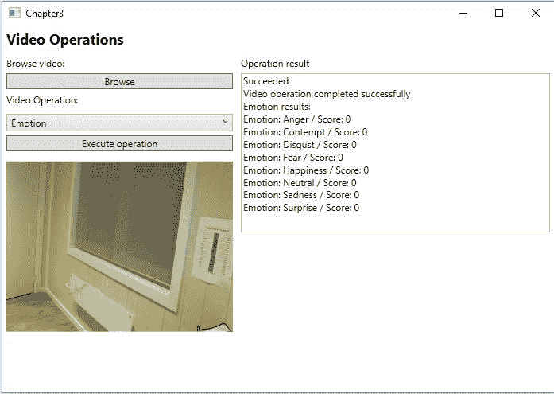

# 概述

使用人工智能技术，视频索引器使您能够提取大量信息。它可以从以下功能列表中获得洞察力:


# 音频抄本

人脸跟踪和识别

*   扬声器索引
*   可视文本识别
*   语音活动检测
*   场景检测
*   关键帧提取
*   情感分析
*   翻译
*   视觉内容审核
*   关键词提取
*   释文
*   典型场景
*   有几个可能需要使用视频索引器的典型场景:


# **搜索**:如果你有一个视频库，你可以使用获得的见解来索引每个视频。通过口语单词或两个特定的人在哪里一起出现来索引可以为用户提供更好的搜索体验。

**货币化**:利用洞察力可以提高每个视频的价值。例如，您可以通过使用视频洞察来展示上下文正确的广告，从而投放更多相关的广告。例如，通过使用 insights，您可以在足球比赛而不是游泳比赛中显示运动鞋广告。

*   **用户参与度**:利用洞察，你可以通过展示相关视频瞬间来提高用户参与度。如果你有一个 60 分钟的不同内容的视频，在这段时间内放置视频片段可以让用户直接跳到相关的部分。
*   关键概念
*   以下主题是讨论视频索引器时需要理解的重要概念。


# 故障

这是一个完整的列表，包含了所有见解的所有细节。这就是完整视频抄本的来源；但是，对于用户来说，它大多过于详细。相反，你会希望在查找更多的细目分类细节之前，使用总结的见解来获得有趣的知识。


# 概括的见解

人们可以使用汇总的见解，而不是遍历数千个时间范围并检查其中的给定数据。这将为您提供数据的汇总视图，如面孔、关键词和情绪，以及它出现的时间范围。


# 关键词

从视频中的任何转录音频，视频索引器将提取可能与视频相关的关键字和主题列表。


# 感悟

当一个视频被转录时，它也被分析情感。这意味着你可以判断视频是积极的还是消极的。


# 阻碍

块用于以更简单的方式在数据中移动。如果扬声器有变化或音频之间有长时间停顿，这些可能会被索引为单独的块。


# 如何使用视频索引器

我们将快速了解一下如何利用视频索引器。


# 通过门户网站

要使用微软的预建工具，请前往[https://www.videoindexer.ai/](https://www.videoindexer.ai/)。使用您的 Microsoft 帐户登录。登录后，会要求您填写一些信息来注册帐户，如下图所示:


# 登录后，您会发现自己在控制面板上，如下面的屏幕截图所示:

首先，您可以点击上传来上传您的视频。这将打开一个弹出窗口，可以上传视频或输入视频的 URL。或者，您可以通过点击菜单中的示例视频来选择示例视频，从而快速开始。

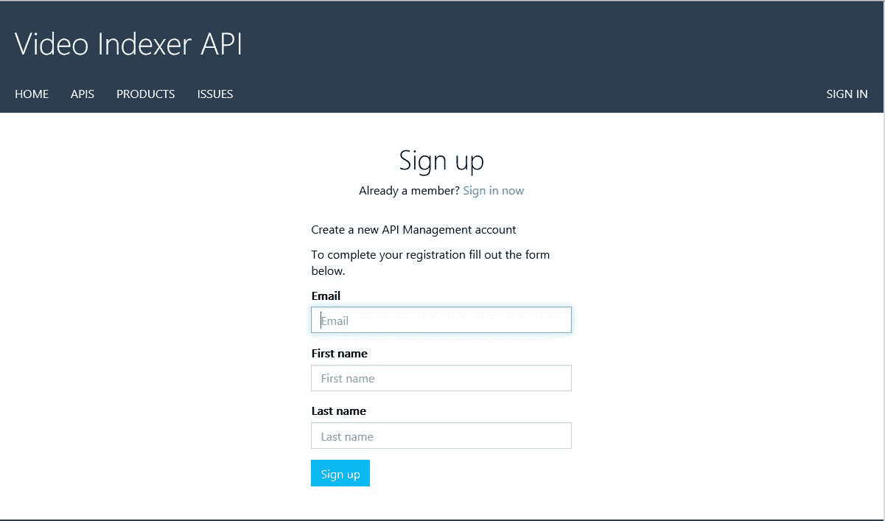

当您选择了一个视频，或者您上传的视频已经完成索引，您将被带到一个页面来查看见解。该页面将向您展示完整的视频，以及所发现的见解，如以下截图所示:

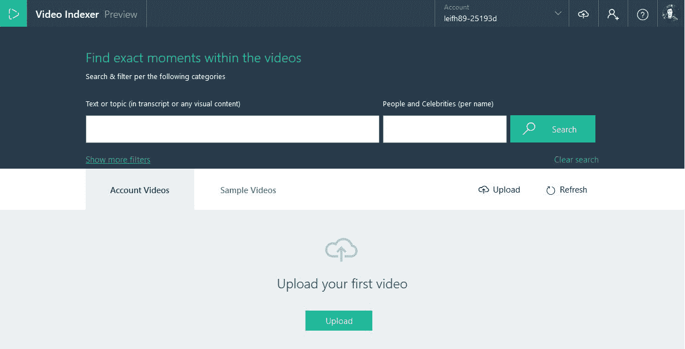

除了在视频中发现的关键词和人物，您还将获得整个视频中该演讲的注释和情感列表，如以下截图所示:

视频索引器还将创建视频中所有音频的副本，您可以通过选择 insights 框架顶部的副本来跟随，如以下屏幕截图所示:

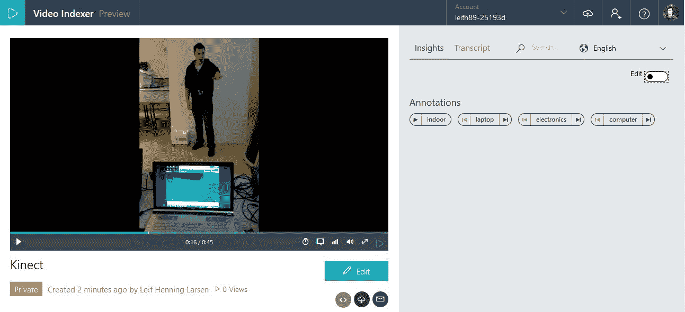

这个抄本会随着视频的前进而自动前进。

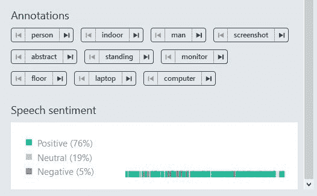

视频索引 API


除了预制的视频索引器站点，还有一个视频索引器 API。这允许您从自己的应用中获得与 web 工具完全相同的洞察力。


# 要开始使用 API，请前往 https://videobreakdown.portal.azure-api.net/。到达后，使用您的 Microsoft 帐户登录。您需要采取的第一步是订阅 API 产品。为此，您可以单击产品选项卡，选择生产，然后单击订阅:

一旦您订阅了该产品，您将被带到一个页面来查看 API 密钥，如下图所示。这可以通过转到“产品”选项卡并选择您订阅的产品来实现:

获得密钥后，选择 API 选项卡并选择您订阅的产品。这将显示所有可用的 API 调用。整个 API 都是基于 REST 的，因此只要提供正确的请求参数和 API 键，您就可以在任何应用中使用它。


摘要

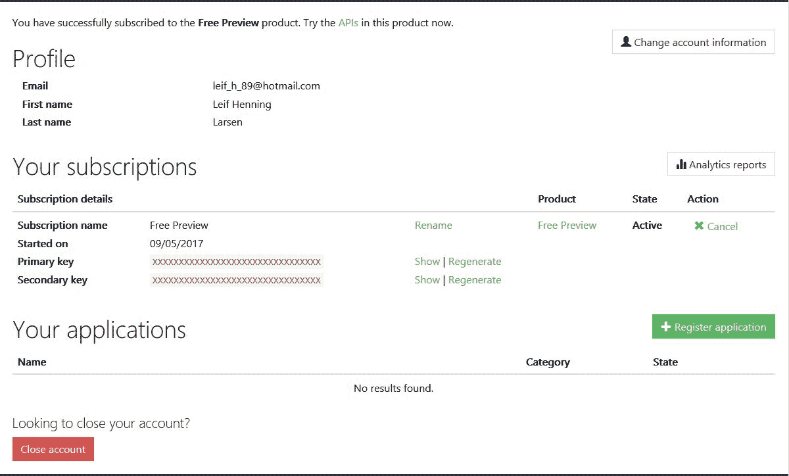

在本章中，我们讨论了情感 API 和视频 API。我们首先让智能房屋应用了解你的心情。接下来，我们深入学习了视频 API，在这里您可以学习如何检测和跟踪人脸、检测运动、稳定视频以及生成智能视频缩略图。接下来，我们回到 Emotion API，在这里您学习了如何对视频进行情感分析。最后，我们通过快速浏览视频索引器以及如何使用它从视频中获得洞察力来结束这一章。


# 在下一章，我们将从视觉 API 转移到第一语言 API。你将学习如何理解句子的意图，使用路易斯的力量。

Throughout this chapter, we covered the Emotion API and the Video API. We started by making the smart-house application see what kind of mood you are in. Following this, we dived deep into the Video API, where you learned how to detect and track faces, detect motion, stabilize videos, and generate intelligent video thumbnails. Next, we moved back to the Emotion API, where you learned how to do emotion analysis on videos. Finally, we closed the chapter by taking a quick look at the Video Indexer and how it can be used to gain insights from videos.

In the next chapter, we will move away from the Vision APIs and into the first Language API. You will learn how to understand intent in sentences, using the power of LUIS.