# 四、让应用理解命令

"在从原型到生产的过程中，路易斯节省了我们大量的时间."

Meekan 联合创始人兼首席技术官 Eyal Yavor

在前面的章节中，我们一直关注 Vision APIs。从本章开始，我们继续讨论语言 API，我们将从**语言理解智能服务** ( **路易斯**)开始。在本章中，你将看到如何创建和维护语言理解模型。最后，您将看到如何代表用户完成操作。

在本章结束时，我们将已经涵盖了以下主题:

*   创建语言理解模型
*   使用 Bing 和 Cortana 的预构建模型处理常见请求
*   基于意图执行操作


# 创建语言理解模型

通常，我们希望我们的计算机能够理解我们想要什么。随着我们日常业务的进行，我们希望能够使用常规句子与电脑或手机交谈。在没有任何帮助的情况下，这很难做到。

利用路易斯的力量，我们现在可以解决这个问题。通过创建语言理解模型，我们允许应用理解用户想要什么。我们还可以识别关键数据。这通常是您希望包含在查询或命令中的数据。如果你想了解最新的新闻，关键数据可能是你想获取新闻的主题。


# 注册帐户并获取许可证密钥

要开始了解路易斯，你应该前往 [https://www.luis.ai](https://www.luis.ai) 。这是我们将设置应用的地方。单击登录或创建帐户按钮开始。

一旦进入，我们要确保我们有一个订阅密钥。我们可以使用 Microsoft Azure 注册一个。在浏览器中打开一个新标签，指向[https://portal.azure.com](https://portal.azure.com)。如果您在这里没有帐户，请注册一个。如果您有帐户，请登录。

当你进入 Azure 门户时，点击左侧菜单中的+号。这将向你展示市场。搜索语言理解智能服务。您应该会看到如下屏幕截图所示的屏幕:

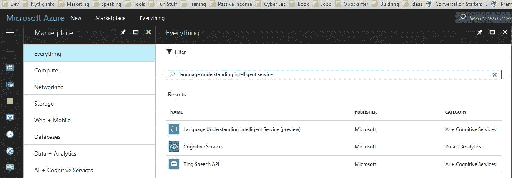

选择语言理解智能服务(预览)选项。点击创建按钮。输入所需的参数。

有两个价格等级可供选择。一种是标准的，每秒钟可以打 10 个电话。这需要每 1000 次通话支付一定的费用。另一个是免费的，每秒钟可以打五次电话，每月可以打一万次电话。

创建 API 帐户后，您可以通过单击资源管理类别中的密钥选项来获取订阅密钥，如下面的屏幕截图所示:

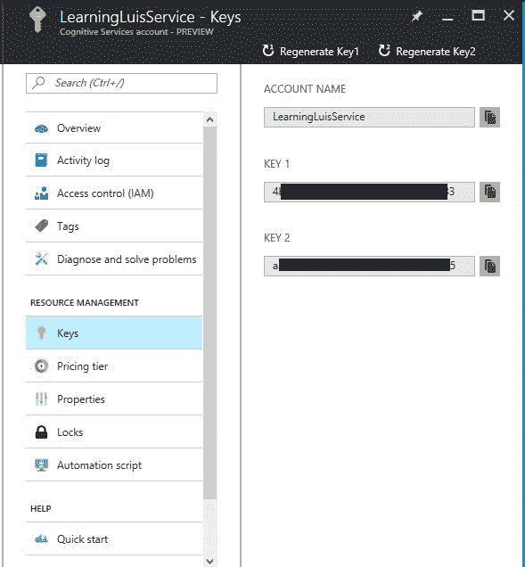

复制其中任何一个。

回到路易斯基地。点击右上角的帐户名称字段，然后进入用户设置。通过选择“我的密钥”选项卡，添加新创建的订阅密钥。单击 Add a new key，将新密钥粘贴到 Key Value 字段中，如下面的屏幕截图所示。给密钥取一个有意义的名称:

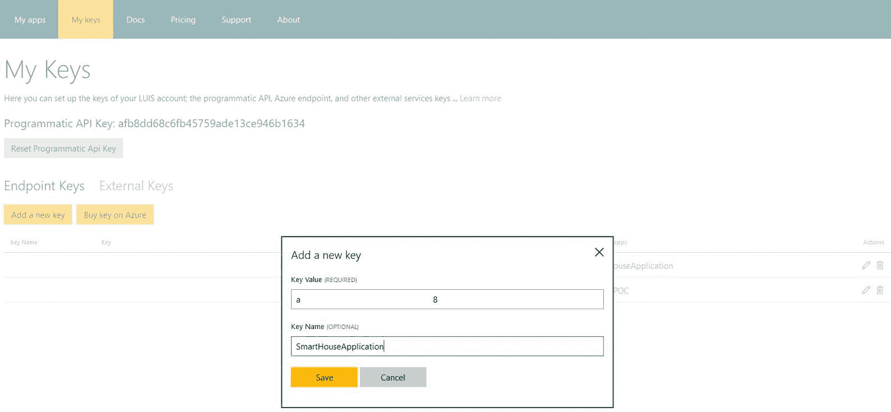

截屏中看到的编程 API 键允许我们以编程方式创建应用、意图和实体，以及训练模型。然而，我们不会在本书中涉及这一点。


# 创建应用

有了订阅密钥，我们就可以创建我们的第一个应用了。点击顶部菜单中的我的应用。这将带您回到应用列表，它应该是空的。点击新应用。

在显示的表格中，我们填写关于我们应用的给定信息。我们需要为应用命名。我们还需要指出一个非典型的使用场景，我们将设置为其他(请具体说明)。将它指定为 SmartHouseApplication。这个应用属于工具领域，我们选择使用英语应用文化。

其他可用的语言有巴西语、葡萄牙语、中文、法语、德语、意大利语、日语和西班牙语。

下面的屏幕截图显示了我们如何定义该应用:

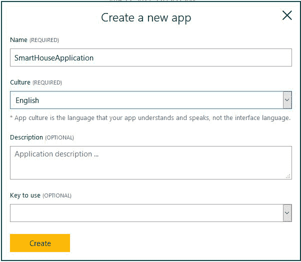

当您单击 Create 按钮时，应用将被创建。这个过程大约需要一分钟左右才能完成，所以请耐心等待。

创建应用后，您将被带到该应用的主页，如下面的屏幕截图所示:

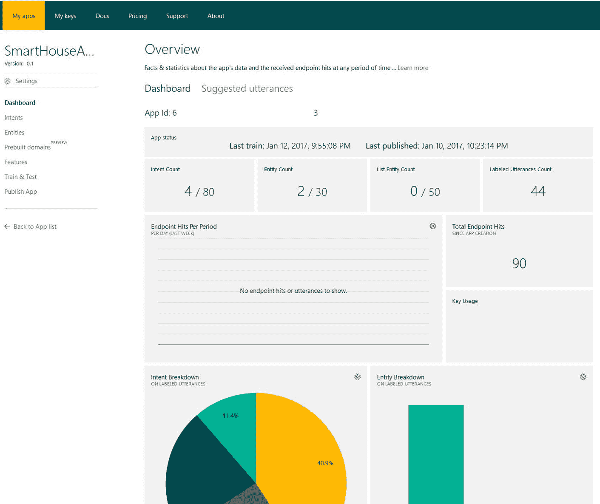

正如您所看到的，我们有各种各样的特性可以使用，我们将在这里讨论其中重要的特性。

我们将构建的应用将针对我们的智能房屋应用。我们将配置应用来识别设置不同房间温度的命令。此外，我们希望它能告诉我们不同房间的温度。


# 使用实体识别关键数据

LUIS 的一个关键特点是能够识别句子中的关键数据。这就是所谓的实体。在新闻应用中，实体的一个例子就是主题。如果我们请求获取最新的新闻，我们可以指定一个主题供服务识别。

对于我们的应用，我们想为房间添加一个实体。通过单击左侧窗格中的选择实体来完成此操作。然后点击添加自定义实体。

您将看到以下屏幕:

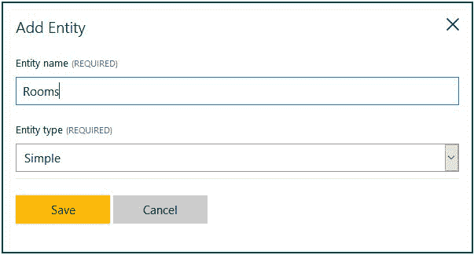

输入实体的名称，然后单击保存按钮。就这样，你现在已经创建了第一个实体。我们稍后会看到如何使用它。

您可能已经注意到，在实体创建表单中有一个名为**实体类型**的下拉列表。实体类型是创建分层实体的一种方式，它基本上是关于定义实体之间的关系。

例如，您可以想象在给定的时间范围内搜索新闻。通用顶级实体是`Date`。从这里开始，您可以定义两个子代，StartDate 和 EndDate。这些将被服务识别，其中将为实体及其子实体构建模型。

要添加分层子实体，请选中复选框并从选择中选择分层。对于您要添加的每个子项，单击实体子项旁边的+按钮，如下面的屏幕截图所示。输入孩子的名字:

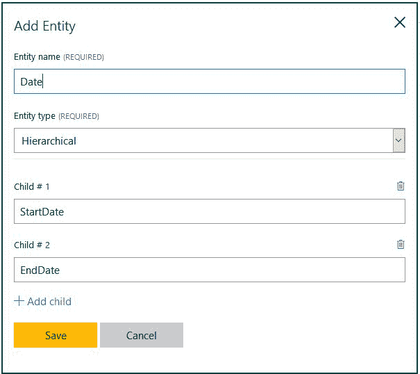

您可以添加的其他类型的实体称为**复合实体**。这是一种由一组现有实体组成的实体。这就是我们所说的 *has-a* 关系，因此组件是子组件，但不是父子关系。

复合实体不像分层实体那样具有共同的特征。删除顶级实体时，不会删除元件。使用复合实体，LUIS 可以识别实体组，然后将这些实体视为单个实体。

复合实体的一个例子是当您订购比萨饼时。你可以这样点菜:我想要一个有蘑菇和意大利香肠的大披萨。这里我们可以把大小看成一个实体，也可以把两个浇头看成实体。将这些组合在一起可以形成一个复合实体，称为订单。

您可以添加的最后一类实体称为**列表实体**。这是一个定制的实体值列表，用作话语中的关键字或标识符。

使用实体时，有时一个实体可能由几个词组成。对于我们的例子，对于实体`Rooms`，我们可能会要求客厅。为了能够识别这样的措辞，我们可以定义一个特性列表。这是一个逗号分隔的列表，可以包含一些或所有预期的短语。

让我们为我们的应用添加一个。在左侧窗格的底部，您会看到一些功能。选择此项并单击“添加短语列表”创建一个新列表。将其命名为`Rooms`,并添加不同的房间，如下面的截图所示:

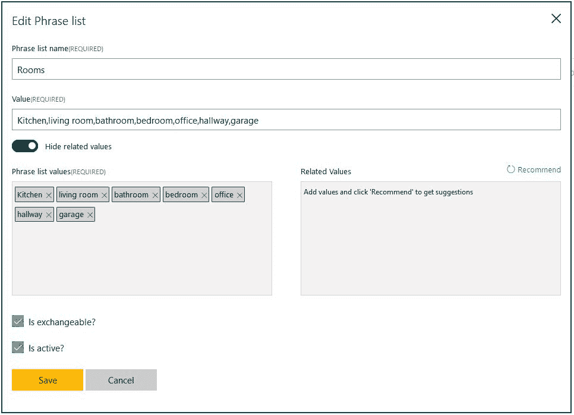

点击右侧的“推荐”, LUIS 将推荐更多与您已经输入的值相关的值。

我们将在后面看到如何利用这一点。

除了创建短语列表，我们还可以创建**模式特征**。典型的用例是当您有匹配模式的数据，但不适合作为短语列表输入时。通常，这可以是产品编号。


# 使用意图理解用户想要什么

现在我们已经定义了一个实体，是时候看看它如何符合意图了。意图基本上是一个句子的目的。

我们可以通过选择左侧窗格中的 intents 选项向我们的应用添加 Intents。点击添加意向。当我们添加一个意图时，我们希望给它一个名称。该名称应该描述其意图。我们想要添加一个名为`GetRoomTemperature`的意图，其目标是获取给定房间的温度，如下面的屏幕截图所示:

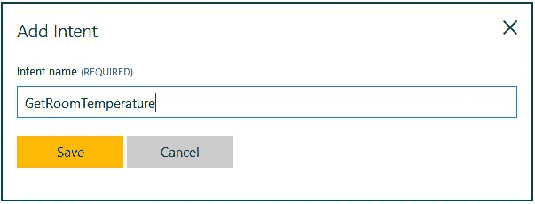

当您点击保存按钮时，您将被带到发言页面。在这里，我们可以添加句子，我们可以使用的意图，所以让我们添加一个。输入`what is the temperature in the kitchen?`并按下*输入*。句子(或称之为话语)将准备好进行标注。标记一个话语意味着我们定义它属于什么意图。我们还确保用正确的类型标记实体。

下面的截图显示了我们第一次发声的标注过程:

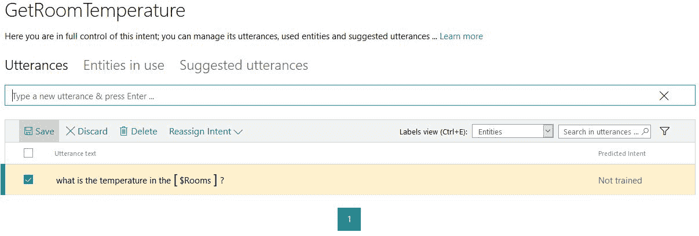

如您所见，实体被标记。你可以告诉 LUIS 一个单词是一个给定的实体，方法是将鼠标停留在这个单词上并点击它。这将弹出包含所有可用实体的菜单，然后您将选择正确的实体。另外，请注意如何在下拉列表中选择 GetRoomTemperature 意图。标记完话语后，单击保存按钮。

所有应用的创建都有一个名为 **None** 的默认意图。这个意图将得到根本不属于我们应用的句子。如果我们说，*点一份蘑菇和意大利辣香肠的大披萨*，结果将是没有。

当你在创造意图时，你应该定义至少三到五种表达方式。这将给 LUIS 一些工作，因此，它可以创建更好的模型。我们将在本章的后面看到如何提高性能。


# 使用预构建的模型简化开发

构建实体和意图可能很容易，也可能更高级。幸运的是，LUIS 提供了一组源于 Bing 的预建实体。这些实体将包括在应用中，以及在网络上，而做标记的过程。

下表描述了所有可用的预构建实体:

| **实体** | **示例** |
| `builtin.number` | 五/23.21 |
| `builtin.ordinal` | 第二/第三 |
| `builtin.temperature` | 2 摄氏度/104 华氏度 |
| `builtin.dimension` | 231 平方公里 |
| `builtin.age` | 27 岁 |
| `builtin.geography` | 城市/国家/名胜 |
| `builtin.encyclopedia` | 个人/组织/事件/电视节目/产品/电影(等等) |
| `builtin.datetime` | 日期/时间/持续时间/设置 |

最后三个有几个子实体，如示例字段中所述。

我们将添加其中一个预构建的实体，因此转到实体菜单选项。单击添加预建实体。从列表中选择温度，然后单击保存。

对于新创建的实体，我们希望添加一个名为 SetTemperature 的新意图。如果示例话语是*将厨房的温度设置为 22 摄氏度，*我们可以将该话语标记如下:

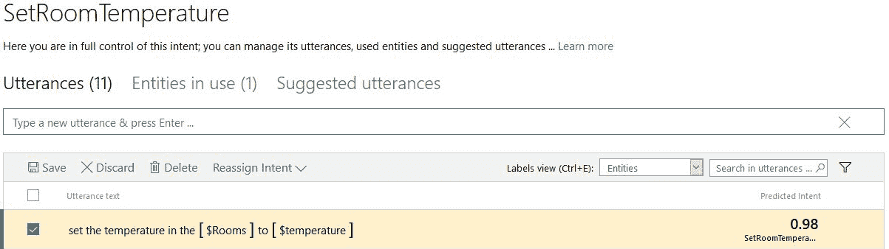

如您所见，我们有一个`room`实体。我们还清楚地标记了预构建的`temperature`实体。由于应该在下拉菜单中选择正确的意图，我们可以单击保存按钮来保存发言。


# 预构建的域

除了使用预构建的实体，还可以使用预构建的域。这些是已经存在的实体和意图，利用了来自不同领域的常用意图和实体。通过使用这些意图/实体，您可以使用通常在 Windows 中使用的模型。一个非常基本的例子是在日历中设置约会。

要使用 Cortana 的预构建域，您可以从左侧菜单中选择预构建域。这将打开一个可用域列表。通过选择任何一个，将询问您是否要将域添加到应用中，如下面的屏幕截图所示:

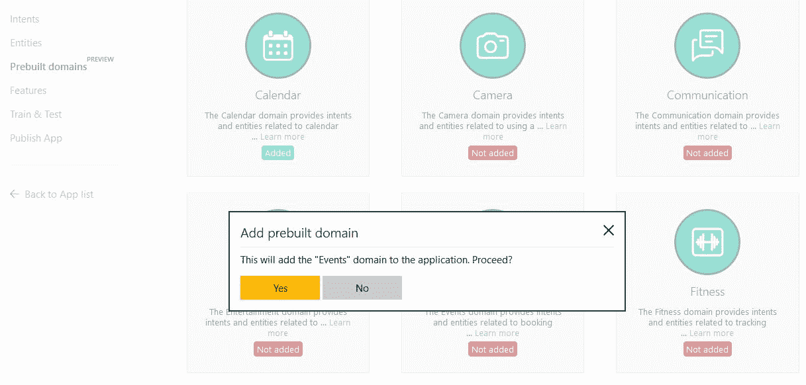

这将把该特定领域的意图和实体添加到已经定义的实体和意图列表中，如下面的屏幕截图所示:

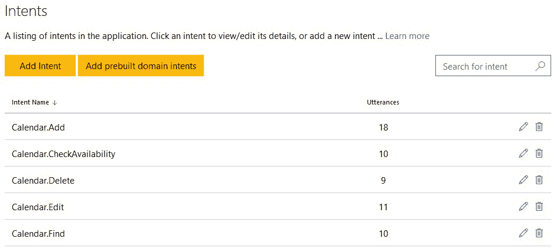

以下列表显示了 Cortana 预构建域中可用的顶级域。有关可用预建域名的完整列表，请参考附录 A 、 *LUIS 实体和意图*:

*   `Calendar`
*   `Camera`
*   `Communication`
*   `Entertainment`
*   `Events`
*   `Fitness`
*   `Gaming`
*   `HomeAutomation`
*   `MovieTickets`
*   `Music`
*   `Note`
*   ``OnDevice``
*   `Places`
*   `Reminder`
*   `RestaurantReservation`
*   `Taxi`
*   `Translate`
*   `Utilities`
*   `Weather`
*   `Web`


# 训练模型

现在我们有了一个工作模型，是时候将它付诸行动了。


# 训练和发布模型

使用该模型的第一步是确保该模型有一些要处理的话语。正如我们所看到的，我们现在已经为每个意图添加了一个话语。在部署应用之前，我们需要更多。

想出三到四种不同的方法来设置或获取室温，并添加它们，指定实体和意图。另外，添加几个符合`None`意图的话语，仅供参考。

当我们添加了新的话语，我们需要训练模型。这样做将使 LUIS 在将来开发代码来识别相关的实体和意图。这个过程周期性地进行；然而，在发布之前，当您已经做出更改时，这样做是明智的。这可以通过在左侧菜单中选择训练和测试来完成。点击训练申请。

要测试应用，只需在交互式测试选项卡中输入测试语句。这将向您显示任何给定的句子被标记为什么，以及服务发现了什么意图，如下面的屏幕截图所示:

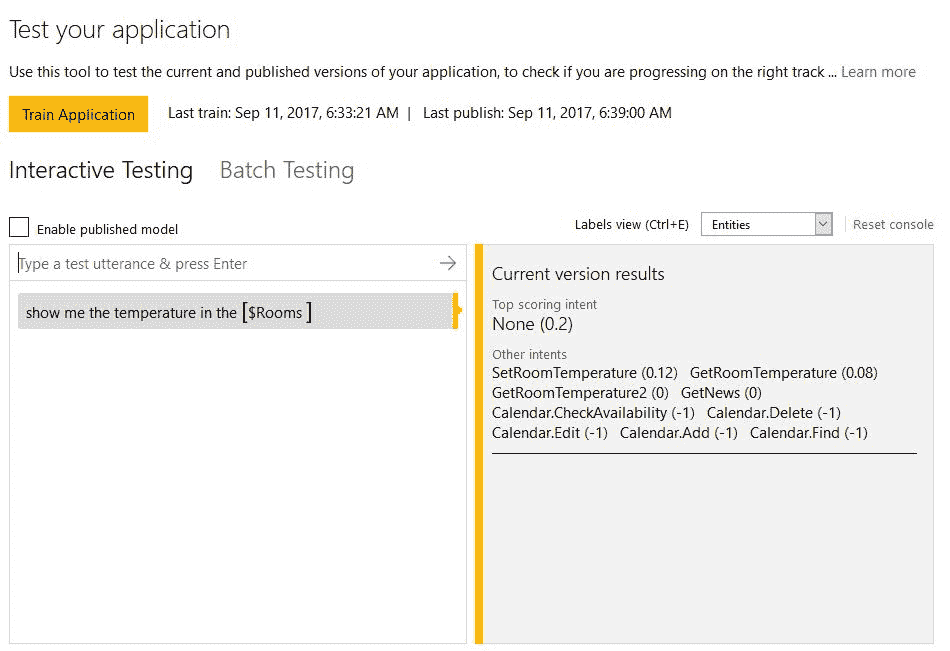

训练完成后，我们可以发布应用了。这将把模型部署到一个 HTTP 端点，它将解释我们发送给它的句子。

从左侧菜单中选择发布。这将向您显示以下屏幕:

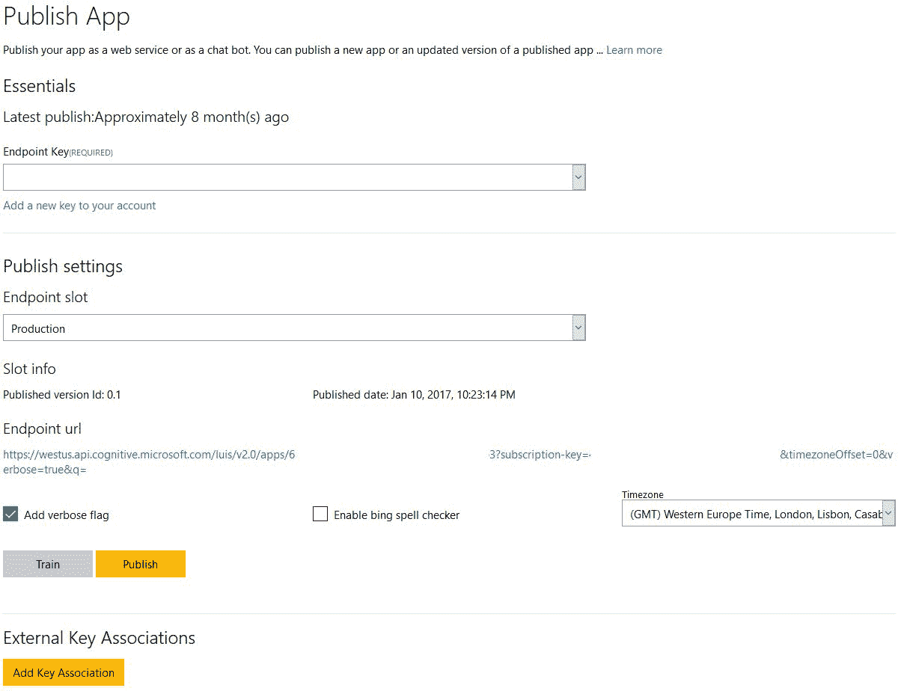

单击发布按钮部署应用。端点 url 字段下面的 URL 是部署模型的端点。如您所见，它指定了应用 ID 和订阅密钥。

在我们继续之前，我们可以验证端点是否真的工作。在文本字段中输入一个查询(例如，`get the bedroom temperature`)并点击链接。这应该会向您呈现类似于以下屏幕截图的内容:

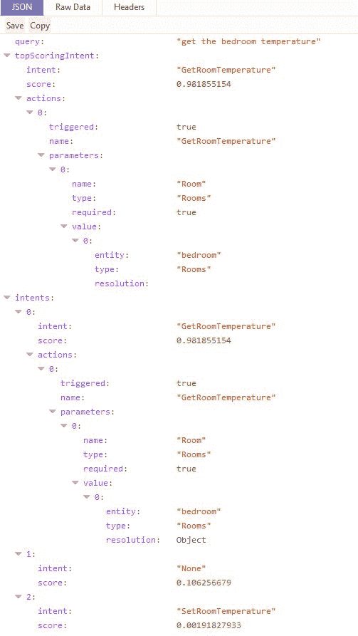

当模型发布后，我们可以继续通过代码访问它。


# 连接到智能家居应用

为了能够轻松地与 LUIS 一起工作，我们需要添加 NuGet 客户端包。在智能房屋应用中，进入 NuGet 包管理器并找到`Microsoft.Cognitive.LUIS`包。将它安装到项目中。

我们需要添加一个名为`Luis`的新类。将文件放在`Model`文件夹下。这个类将负责调用端点并处理结果。

因为我们需要测试这个类，所以我们需要添加一个视图和一个视图模型。将名为`LuisView.xaml`的文件添加到`View`文件夹，将`LuisViewModel.cs`添加到`ViewModel`文件夹。

视图应该相当简单。它应该包含两个`TextBox`元素，一个用于输入请求，另一个用于显示结果。我们也需要一个按钮来执行命令。

将视图作为`TabItem`添加到`MainView.xaml`文件中。

ViewModel 应该有两个`string`属性，每个属性对应一个`TextBox`元素。它还需要一个按钮命令的`ICommand`属性。

我们将首先创建`Luis`类，因此打开`Luis.cs`文件。制作班级`public`。

当我们发出请求并收到相应的结果时，我们希望触发一个事件来通知 UI。我们希望这个事件有一些额外的参数，所以在`Luis`类下面，创建一个从`EventArgs`类继承的`LuisUtteranceResultEventArgs`类，如下所示:

```
    public class LuisUtteranceResultEventArgs : EventArgs {
        public string Status { get; set; }
        public string Message { get; set; }
        public bool RequiresReply { get; set; }
    } 
```

这将包含一个`Status`字符串、一个状态`Message`和`Result`本身。回到类`Luis`，添加一个事件和一个私有成员，如下所示:

```
    public event EventHandler<LuisUtteranceResultEventArgs> OnLuisUtteranceResultUpdated;

    private LuisClient _luisClient; 
```

我们已经讨论了第一个问题。私有成员是 API 访问对象，我们从 NuGet:

```
    public Luis(LuisClientluisClient) {
        _luisClient = luisClient;
    } 
```

构造函数应该接受`LuisClient`对象作为参数，并将其分配给我们之前创建的成员。

让我们创建一个助手方法来引发`OnLuisUtteranceResultUpdated`事件，如下所示:

```
private void RaiseOnLuisUtteranceResultUpdated( LuisUtteranceResultEventArgsargs)
{
    OnLuisUtteranceResultUpdated?.Invoke(this, args);
} 
```

这纯粹是为了我们自己的方便。

为了能够发出请求，我们将创建一个名为`RequestAsync`的函数。这将接受一个`string`作为参数，并将`Task`作为返回类型。该功能应标记为`async`，如下所示:

```
    public async Task RequestAsync(string input) {
        try {
            LuisResult result = await _luisClient.Predict(input); 
```

在函数内部，我们调用了`_luisClient`的`Predict`函数。这将向我们之前发布的端点发送一个查询。一个成功的请求将产生一个包含一些数据的`LuisResult`对象，我们稍后将对此进行探讨。

我们在一个新的函数中使用结果，在那里我们处理它。我们确保捕捉到任何异常并通知所有侦听器:

```
            ProcessResult(result);
        }
        catch(Exception ex) {
            RaiseOnLuisUtteranceResultUpdated(new LuisUtteranceResultEventArgs
            {
                Status = "Failed",
                Message = ex.Message
            });
        }
    } 
```

在`ProcessResult`函数中，我们创建了一个`LuisUtteranceResultEventArgs`类型的新对象。这将在通知监听器任何结果时使用。在这个参数对象中，我们添加了状态`Succeeded`和`result`对象。我们还会写出一条消息，说明最重要的意图。我们还增加了这个意图成为我们所有意图中最重要的一个的可能性。最后，我们还添加了已识别的意图数量:

```
    private void ProcessResult(LuisResult result) {
        LuisUtteranceResultEventArgsargs = new LuisUtteranceResultEventArgs();

        args.Result = result;
        args.Status = "Succeeded";
        args.Message = $"Top intent is {result.TopScoringIntent.Name} with score {result.TopScoringIntent.Score}. Found {result.Entities.Count} entities.";

        RaiseOnLuisUtteranceResultUpdated(args);
    } 
```

有了这些，我们就可以进入视图模型了。打开`LuisViewModel.cs`文件。确保该类是`public`，并且它继承自`ObservableObject`类。

声明私有成员，如下所示:

```
    private Luis _luis; 
```

这将保存我们之前创建的`Luis`对象:

```
    public LuisViewModel() {
        _luis = new Luis(new LuisClient("APP_ID_HERE", "API_KEY_HERE")); 
```

我们的构造函数创建了`Luis`对象，确保它是用新的`LuisClient`初始化的。如您所见，这需要两个参数，应用 ID 和订阅 ID。还有第三个参数`preview`，但是我们现在不需要设置它。

可以通过查看发布步骤中的 URL 或者通过访问应用站点上的仪表板 https://www.luis.ai 来找到应用 ID。在那里，您将找到应用 Id，如下面的屏幕截图所示:

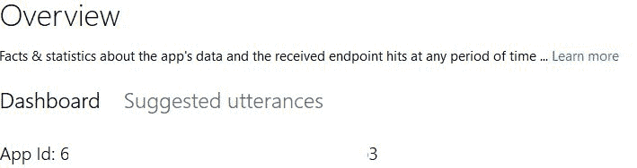

随着`Luis`对象的创建，我们完成了如下的构造函数:

```
    _luis.OnLuisUtteranceResultUpdated += OnLuisUtteranceResultUpdated;
    ExecuteUtteranceCommand = new DelegateCommand(ExecuteUtterance, CanExecuteUtterance);
} 
```

这将挂钩`OnLuisUtteranceResultUpdated`事件，并为我们的按钮创建一个新的`DelegateCommand`事件。为了让我们的命令能够运行，我们需要检查我们是否在输入字段中输入了任何文本。这在`CanExecuteUtterance`中完成。

命令`ExecuteUtterance`本身相当简单:

```
    private async void ExecuteUtterance(object obj) {
        await _luis.RequestAsync(InputText);
    } 
```

我们所做的就是调用`_luis`对象中的`RequestAsync`函数。我们不需要等待任何结果，因为这些将会从事件中产生。

事件处理程序`OnLuisUtteranceResultUpdated`将结果格式化并打印到屏幕上。

首先，我们确保调用当前调度程序线程中的方法。这是在另一个线程中触发事件时完成的。我们创建一个`StringBuilder`，它将用于连接所有结果:

```
private void OnLuisUtteranceResultUpdated(object sender, LuisUtteranceResultEventArgs e) {
    Application.Current.Dispatcher.Invoke(() => {
        StringBuilder sb = new StringBuilder(); 
```

首先，我们添加了`Status`和状态`Message`。然后，我们检查是否检测到任何实体，并附加实体的数量，如下所示:

```
    sb.AppendFormat("Status: {0}\n", e.Status);
    sb.AppendFormat("Summary: {0}\n\n", e.Message);

    if(e.Result.Entities != null&&e.Result.Entities.Count != 0) {
        sb.AppendFormat("Entities found: {0}\n", e.Result.Entities.Count);
        sb.Append("Entities:\n"); 
```

如果我们有任何实体，我们循环遍历每个实体，打印出实体名称和值:

```
        foreach(var entities in e.Result.Entities) {
            foreach(var entity in entities.Value) {
                sb.AppendFormat("Name: {0}\tValue: {1}\n", 
                                 entity.Name, entity.Value);
            }
        }
        sb.Append("\n");
    } 
```

最后，我们将`StringBuilder`添加到我们的`ResultText`字符串中，它应该会显示在屏幕上，如下所示:

```
            ResultText = sb.ToString();
        });
    } 
```

编译完成后，结果应该类似于下面的屏幕截图:

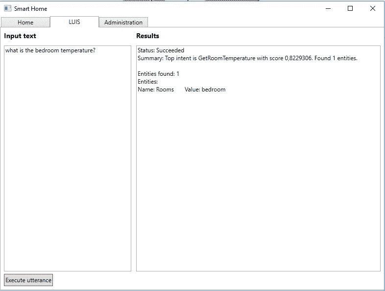

# 通过积极使用改进模型

LUIS 是一个机器学习服务。因此，我们创建的应用和生成的模型可以根据使用情况进行改进。通过开发，保持对性能的关注是一个好主意。你可能会注意到一些经常被误标的意图或难以识别的实体。


# 可视化性能

在 LUIS 网站上，控制面板显示有关意向和实体细分的信息。这基本上是关于意图和实体的分布如何来自已经使用的话语的信息。

下图显示了意图分解显示的外观:

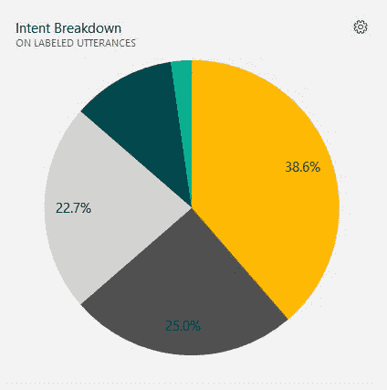

下图显示了实体分解的情况:

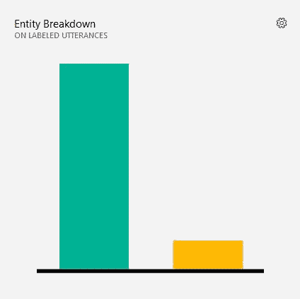

将鼠标悬停在不同的条形(或饼图的扇形)上，将显示意图/实体的名称。此外，还显示了正在使用的意图/实体总数的百分比。


# 解决性能问题

如果您注意到应用中有错误，通常有四种解决方法:

*   添加模型特征
*   添加带标签的话语
*   寻找不正确的话语标签
*   更改模式

我们现在将简要地研究一下其中的每一个。


# 添加模型特征

如果我们有应该被检测为实体而不是实体的短语，这通常是我们可以做的事情。我们已经看到了一个房间实体的例子，其中一个房间可以是起居室。

当然，解决方案是添加短语列表或正则表达式特性。这在三种情况下可能会有所帮助:

*   当路易斯看不到相似的单词或短语时。
*   当路易斯无法识别实体时。在短语列表中添加所有可能的实体值应该会有所帮助。
*   使用罕见或专有词汇时。


# 添加带标签的话语

添加和标记更多的话语总是会提高性能。这很可能在以下情况下有所帮助:

*   当路易斯不能区分两种意图时。
*   当 LUIS 未能发现周围单词之间的实体时。
*   如果路易斯系统地给一个意图打低分。


# 寻找不正确的话语标签

一个常见的错误是错误地标注话语或实体。在这种情况下，你需要找到不正确的话语并纠正它。这可能会解决以下情况中的问题:

*   如果路易斯不能区分两种意图，即使相似的话语已经被标记
*   如果路易斯一直错过一个实体


# 更改模式

如果前面的所有解决方案都失败了，并且您仍然对模型有疑问，那么您可以考虑更改模式，也就是合并、重组和/或删除意图和实体。

请记住，如果人类很难标记一个话语，那么机器就更难了。


# 主动学习

LUIS 的一个非常好的特点是主动学习的能力。当我们主动使用服务时，它会记录所有的查询，这样，我们就能够分析使用情况。这样做可以让我们快速纠正错误，并标记我们以前没有见过的话语。

使用我们已经构建的应用，智能房屋应用，如果我们运行带有语句`can you tell me the bedroom temperature?`的查询，模型可能不会识别它。如果我们调试流程，通过`ProcessResult`函数，我们可以看到以下返回的值:

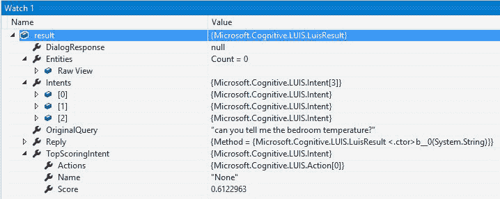

从前面的截图可以看出，得分意向最高的是`None`，得分为 0.61。也没有实体被识别，所以这不好。

回到路易斯的网站。转到 Intents 页面，它可以在左侧菜单中找到。选择任何意图并点击建议的话语。这里我们可以看到，我们刚刚尝试的话语已经被添加。我们现在可以正确标记意图和实体:

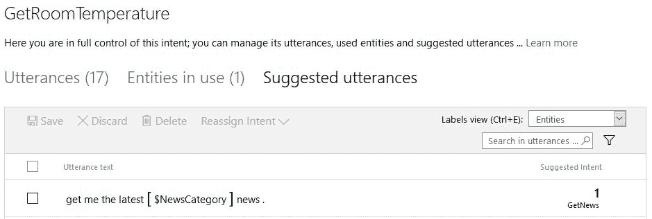

通过用正确的意图和实体标记话语，我们将在下次以这种方式查询时获得正确的结果，正如您在下面的屏幕截图中看到的:

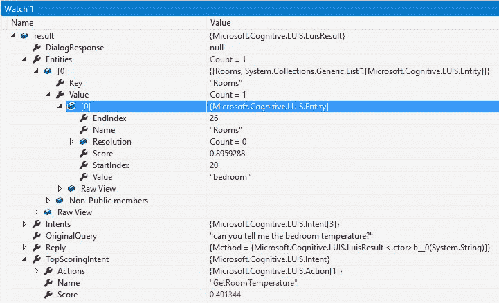

# 摘要

在本章中，我们创建了一个 LUIS 应用。您看到了如何创建语言理解模型，它可以识别句子中的实体。您学习了如何理解用户的意图，并看到了我们如何从中触发动作。重要的一步是看看如何以各种方式改进模型。

在下一章中，我们将利用您在这里学到的知识，当我们学习语音 API 时使用 LUIS，增加使用我们的应用说话的可能性。