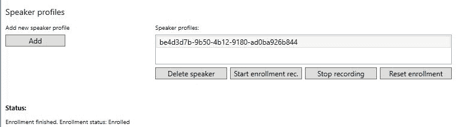
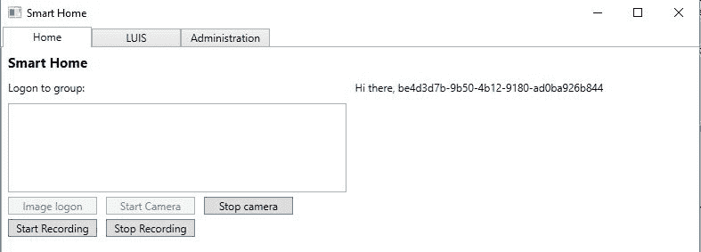
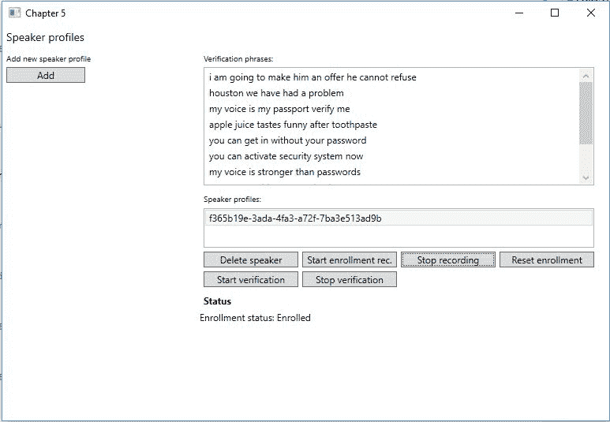
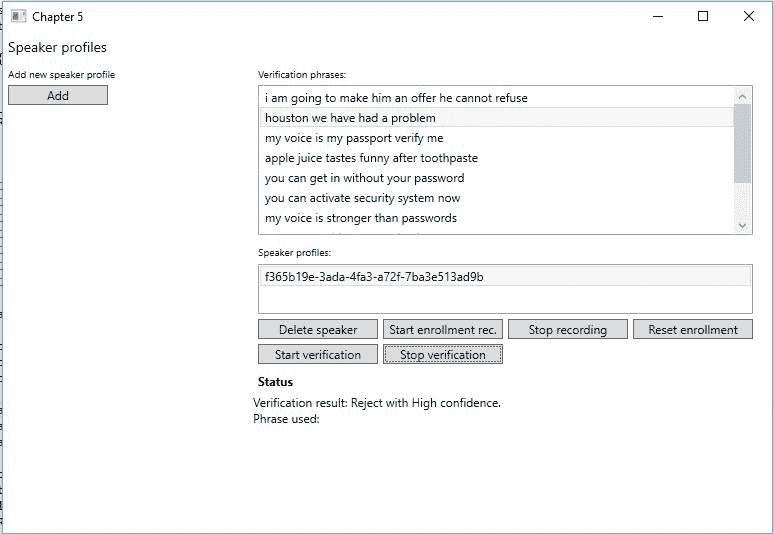

<title>Speaking with Your Application</title> 

# 用您的应用程序说话

在前一章中，我们学习了根据话语来发现和理解用户的意图。在本章中，我们将学习如何为我们的应用程序添加音频功能。我们将学习文本到语音和语音到文本的转换。我们将学习如何识别说话的人。在本章中，我们将学习如何利用语音来验证一个人。最后，我们将简要介绍如何定制语音识别，以使其适合您的应用程序的使用。

在本章结束时，我们将已经涵盖了以下主题:

*   将语音音频转换为文本以及将文本转换为语音音频
*   利用 LUIS 从语音中识别意图
*   验证说话者是他们所声称的那个人
*   识别说话者
*   定制识别 API 以识别定制的说话风格和环境

<title>Converting text to audio and vice versa</title> 

# 将文本转换为音频，反之亦然

在第 1 章、*微软认知服务入门*中，我们利用了 Bing 语音 API 的一部分。我们让示例应用程序能够向我们说出句子。我们现在将使用该示例中创建的代码，但是我们将更深入地研究细节。

我们还将介绍 Bing Speech API 的另一个特性，将语音转换成文本。这个想法是，我们可以与智能房屋应用程序对话，它会识别我们在说什么。使用文本输出，它将使用 LUIS 来获得我们的句子的意图。如果 LUIS 需要更多信息，应用程序会礼貌地用音频询问我们。

首先，我们要修改智能房屋应用程序的构建定义。我们需要指定我们是在 32 位还是 64 位操作系统上运行它。为了利用语音到文本的转换，我们希望安装 Bing 语音 NuGet 客户端包。搜索`Microsoft.ProjectOxford.SpeechRecognition`，根据您的系统安装 32 位版本或 64 位版本。

接下来，我们需要添加对`System.Runtime.Serialization`和`System.Web`的引用。这些是发出 web 请求和反序列化来自 API 的响应数据所必需的。

<title>Speaking to the application</title> 

# 与应用程序对话

在`Model`文件夹中添加一个新文件，名为`SpeechToText.cs`。在自动创建的`SpeechToText`类下面，我们想要添加一个名为`SttStatus`的`enum`类型变量。它应该有两个值，`Success`和`Error`。

此外，我们希望为我们将在执行过程中引发的事件定义一个`EventArgs`类。在文件底部添加以下类:

```
    public class SpeechToTextEventArgs : EventArgs 
    { 
        public SttStatus Status { get; private set; } 
        public string Message { get; private set; } 
        public List<string> Results { get; private set; } 

        public SpeechToTextEventArgs(SttStatus status,  
        string message, List<string> results = null) 
        { 
            Status = status; 
            Message = message; 
            Results = results; 
        } 
    } 
```

如您所见，`event`参数将保存操作状态、任何类型的消息和字符串列表。这将是一个潜在的语音到文本转换的列表。

`SpeechToText`类需要实现`IDisposable`。这样做是为了让我们能够清理用于录制语音的资源，并能够正确关闭应用程序。我们稍后将添加细节，所以现在，确保您添加了`Dispose`函数。

我们需要在类中定义一些私有成员，以及一个事件:

```
    public event EventHandler<SpeechToTextEventArgs> OnSttStatusUpdated; 

    private DataRecognitionClient _dataRecClient; 
    private MicrophoneRecognitionClient _micRecClient; 
    private SpeechRecognitionMode _speechMode = SpeechRecognitionMode.ShortPhrase; 

    private string _language = "en-US"; 
    private bool _isMicRecording = false; 
```

每当我们有新的操作状态时，就会触发`OnSttStatusUpdated`事件。`DataRecognitionClient`和`MicrophoneRecognitionClient`是我们可以用来调用 Bing 语音 API 的两个对象。我们一会儿将看看它们是如何被创建的。

我们将`SpeechRecognitionMode`定义为`ShortPhrase`。这意味着我们不希望任何口语句子超过 15 秒。另一种选择是`LongDictation`，这意味着我们可以转换长达 2 分钟的口语句子。

最后，我们指定语言为英语，并定义一个`bool`类型的变量，它指示我们当前是否正在记录任何东西。

在我们的构造函数中，我们接受 Bing 语音 API 键作为参数。我们将在创建 API 客户端时使用它:

```
    public SpeechToText(string bingApiKey) 
    { 
        _dataRecClient = SpeechRecognitionServiceFactory. CreateDataClientWithIntent (_language, bingApiKey, "LUIS_APP_ID", "LUIS_API_KEY"); 

        _micRecClient = SpeechRecognitionServiceFactory. CreateMicrophoneClient(_speechMode, _language, bingApiKey); 

        Initialize(); 
    } 
```

如你所见，我们通过调用`SpeechRecognitionServiceFactory`创建了`_dataRecClient`和`_micRecClient`。对于第一个客户端，我们声明我们也想使用意图识别。所需的参数是语言、Bing API 密钥、LUIS 应用程序 ID 和 LUIS API 密钥。通过使用一个`DataRecognitionClient`对象，我们需要上传带有语音的音频文件。

通过使用`MicrophoneRecognitionClient`，我们可以使用麦克风进行实时转换。为此，我们不想检测意图，所以我们调用`CreateMicrophoneClient`。在这种情况下，我们只需要指定语音模式、语言和 Bing 语音 API 键。

在离开构造函数之前，我们调用一个`Initialize`函数。在这种情况下，我们订阅每个客户端上的某些事件:

```
    private void Initialize() 
    { 
        _micRecClient.OnMicrophoneStatus += OnMicrophoneStatus; 
        _micRecClient.OnPartialResponseReceived += OnPartialResponseReceived; 
        _micRecClient.OnResponseReceived += OnResponseReceived; 
        _micRecClient.OnConversationError += OnConversationErrorReceived; 

        _dataRecClient.OnIntent += OnIntentReceived; 
        _dataRecClient.OnPartialResponseReceived += 
        OnPartialResponseReceived; 
        _dataRecClient.OnConversationError += OnConversationErrorReceived; 
        _dataRecClient.OnResponseReceived += OnResponseReceived; 
    } 
```

正如你所看到的，这两个客户有很多相似之处。两者的区别在于`_dataRecClient`通过`OnIntent`事件获得意图，`_micRecClient`通过`OnMicrophoneStatus`事件获得麦克风状态。

我们真的不在乎部分回应。然而，它们在某些情况下可能是有用的，因为它们将连续给出当前完成的转换:

```
    private void OnPartialResponseReceived(object sender, PartialSpeechResponseEventArgs e) 
    { 
        Debug.WriteLine($"Partial response received:{e.PartialResult}"); 
    }  
```

对于我们的应用程序，我们选择将其输出到调试控制台窗口。在这种情况下，`PartialResult`是包含部分转换文本的字符串:

```
private void OnMicrophoneStatus(object sender, MicrophoneEventArgs e) 
{ 
    Debug.WriteLine($"Microphone status changed to recording: {e.Recording}"); 
    } 
```

我们也不关心当前的麦克风状态。同样，我们将状态输出到调试控制台窗口。

在继续之前，添加一个助手函数，名为`RaiseSttStatusUpdated`。当被调用时，这将引发`OnSttStatusUpdated`。

当我们打电话给`_dataRecClient`时，我们可能会意识到 LUIS 的意图。在这些情况下，我们希望引发一个事件，在该事件中我们输出已识别的意图。这是通过以下代码完成的:

```
private void OnIntentReceived(object sender, SpeechIntentEventArgs e) 
{ 
    SpeechToTextEventArgs args = new SpeechToTextEventArgs(SttStatus.Success, $"Intent received: {e.Intent.ToString()}.\n Payload: {e.Payload}"); 
    RaiseSttStatusUpdated(args); 
} 
```

我们选择打印出意向信息，和`Payload`。这是一个包含识别的实体、意图和 LUIS 触发的动作的字符串。

如果在转换过程中出现任何错误，我们需要做几件事情。首先，我们希望停止任何可能正在运行的麦克风录音。如果当前操作已经失败，则尝试在当前操作中进行更多转换是没有意义的:

```
    private void OnConversationErrorReceived(object sender, SpeechErrorEventArgs e) 
    { 
        if (_isMicRecording) StopMicRecording(); 
```

我们稍后将创建`StopMicRecording`。

此外，我们希望通知所有订户转换失败。在这种情况下，我们希望给出有关错误代码和错误消息的详细信息:

```
        string message = $"Speech to text failed with status code:{e.SpeechErrorCode.ToString()}, and error message: {e.SpeechErrorText}"; 

        SpeechToTextEventArgs args = new SpeechToTextEventArgs(SttStatus.Error, message); 

        RaiseSttStatusUpdated(args); 
    } 
```

幸运的是，`OnConversationError`事件确实为我们提供了关于任何错误的详细信息。

现在让我们来看看`StopMicRecording`方法:

```
    private void StopMicRecording() 
    { 
        _micRecClient.EndMicAndRecognition(); 
        _isMicRecording = false; 
    } 
```

这是一个简单的函数，它在`_micRecClient MicrophoneRecognitionClient`对象上调用`EndMicAndRecognition`。当这个被调用时，我们停止客户端的任何记录。

我们需要创建的最后一个事件处理程序是`OnResponseReceived`处理程序。每当我们从服务接收到完整的转换响应时，就会触发此操作。

同样，如果我们目前正在录制，我们希望确保不再录制:

```
    private void OnResponseReceived(object sender, SpeechResponseEventArgs e) 
    { 
        if (_isMicRecording) StopMicRecording(); 
```

`SpeechResponseEventArgs`参数包含一个`PhraseResponse`对象。这包含了一个我们想要访问的`RecognizedPhrase`数组。这个数组中的每一项都包含正确转换的置信度。它还包含转换后的短语，如`DisplayText`。它使用反向文本规范化、正确的大写和标点符号，并用星号掩盖亵渎的话:

```
    RecognizedPhrase[] recognizedPhrases = e.PhraseResponse.Results; 
    List<string> phrasesToDisplay = new List<string>(); 

    foreach(RecognizedPhrase phrase in recognizedPhrases) 
    { 
        phrasesToDisplay.Add(phrase.DisplayText); 
    } 
```

我们还可能获得其他格式的转换短语，如下表所示:

| **格式** | **描述** |
| `LexicalForm` | 这是原始的、未处理的识别结果。 |
| `InverseTextNormalizationResult` | 这会将诸如*一二三四*之类的短语显示为 *1234* ，因此对于诸如*去第二条街*之类的用法非常理想。 |
| `MaskedInverseTextNormalizationResult` | 反向文本规范化和亵渎遮罩。没有应用大写或标点符号。 |

对于我们的使用，我们只是对`DisplayText`感兴趣。使用已识别短语的填充列表，我们引发状态更新事件:

```
        SpeechToTextEventArgs args = new SpeechToTextEventArgs(SttStatus.Success, $"STT completed with status: {e.PhraseResponse.RecognitionStatus.ToString()}", phrasesToDisplay); 

        RaiseSttStatusUpdated(args); 
    } 
```

为了能够使用这个类，我们需要几个公共函数来启动语音识别:

```
    public void StartMicToText() 
    { 
        _micRecClient.StartMicAndRecognition(); 
        _isMicRecording = true; 
    } 
```

`StartMicToText`方法将调用`_micRecClient`对象上的`StartMicAndRecognition`方法。这将允许我们使用麦克风来转换语音。这个函数将是我们访问这个 API 的主要方式:

```
    public void StartAudioFileToText(string audioFileName) { 
        using (FileStream fileStream = new FileStream(audioFileName, FileMode.Open, FileAccess.Read)) 
        { 
            int bytesRead = 0; 
            byte[] buffer = new byte[1024]; 
```

第二个函数需要一个音频文件的文件名，包含我们要转换的音频。我们以读取权限打开文件，并准备读取它:

```
    try { 
        do { 
            bytesRead = fileStream.Read(buffer, 0, buffer.Length); 
            _dataRecClient.SendAudio(buffer, bytesRead); 
        } while (bytesRead > 0); 
    } 
```

只要我们有可用的数据，我们就从文件中读取。我们将填充`buffer`，并调用`SendAudio`方法。这将触发服务中的识别操作。

如果发生任何异常，我们确保将异常消息输出到调试窗口。最后，我们需要调用`EndAudio`方法，以便服务不再等待更多数据:

```
    catch(Exception ex) { 
        Debug.WriteLine($"Exception caught: {ex.Message}"); 
    } 
    finally { 
        _dataRecClient.EndAudio(); 
    } 
```

在离开这个类之前，我们需要处理我们的 API 客户端。在`Dispose`功能中增加以下内容:

```
    if (_micRecClient != null) { 
        _micRecClient.EndMicAndRecognition(); 
        _micRecClient.OnMicrophoneStatus -= OnMicrophoneStatus; 
        _micRecClient.OnPartialResponseReceived -= OnPartialResponseReceived; 
        _micRecClient.OnResponseReceived -= OnResponseReceived; 
        _micRecClient.OnConversationError -= OnConversationErrorReceived; 

       _micRecClient.Dispose(); 
       _micRecClient = null; 
    } 

    if(_dataRecClient != null) { 
        _dataRecClient.OnIntent -= OnIntentReceived; 
        _dataRecClient.OnPartialResponseReceived -= OnPartialResponseReceived; 
        _dataRecClient.OnConversationError -= OnConversationErrorReceived; 
        _dataRecClient.OnResponseReceived -= OnResponseReceived; 

        _dataRecClient.Dispose(); 
        _dataRecClient = null; 
    } 
```

我们停止麦克风录音，取消订阅所有事件，并处置和清除客户端对象。

在继续之前，确保应用程序已经编译。稍后我们将看看如何使用这个类。

<title>Letting the application speak back</title> 

# 让应用程序回应

我们已经看到了如何让应用程序向我们反馈。我们将使用我们在第 1 章、*微软认知服务入门*中创建的相同类。将第 1 章、*微软认知服务入门、*中的示例项目中的`Authentication.cs`和`TextToSpeech.cs`复制到`Model`文件夹中。确保相应地更改名称空间。

因为我们已经看过了代码，所以我们不会再看一遍。相反，我们将看看第 1 章、*微软认知服务入门*中遗漏的一些细节。

<title>Audio output format</title> 

# 音频输出格式

音频输出格式可以是以下格式之一:

*   `raw-8khz-8bit-mono-mulaw`
*   `raw-16khz-16bit-mono-pcm`
*   `riff-8khz-8bit-mono-mulaw`
*   `riff-16khz-16bit-mono-pcm`

<title>Error codes</title> 

# 错误代码

在对 API 的调用中有四种可能的错误代码。下表对这些进行了描述:

| **代码** | **描述** |
| `400` / `BadRequest` | 所需参数缺失、为空或为 null。或者，参数无效。一个例子可能是长度超过允许长度的字符串。 |
| `401` / `Unauthorized` | 该请求未获授权。 |
| `413` / `RequestEntityTooLarge` | SSML 输入超出了支持的范围。 |
| `502` / `BadGateway` | 网络相关或服务器相关问题。 |

<title>Supported languages</title> 

# 支持的语言

支持以下语言:

英语(澳大利亚)、英语(英国)、英语(美国)、英语(加拿大)、英语(印度)、西班牙语、墨西哥西班牙语、德语、阿拉伯语(埃及)、法语、加拿大法语、意大利语、日语、葡萄牙语、俄语、中文(S)、中文(香港)和中文(T)。

<title>Utilizing LUIS based on spoken commands</title> 

# 基于口头命令利用 LUIS

为了利用我们刚刚添加的功能，我们将修改`LuisView`和`LuisViewModel`。在视图中添加一个新的`Button`，这将确保我们记录命令。在 ViewModel 中添加相应的`ICommand`。

我们还需要向类中添加一些成员:

```
    private SpeechToText _sttClient; 
    private TextToSpeech _ttsClient; 
    private string _bingApiKey = "BING_SPEECH_API_KEY"; 
```

前两个将用于语音和文本之间的转换。第三个是 Bing 语音 API 的 API 键。

让 ViewModel 实现`IDisposable`，并显式处理`SpeechToText`对象。

通过在构造函数中添加以下内容来创建对象:

```
_sttClient = new SpeechToText(_bingApiKey);
_sttClient.OnSttStatusUpdated += OnSttStatusUpdated;

_ttsClient = new TextToSpeech();
_ttsClient.OnAudioAvailable += OnTtsAudioAvailable;
_ttsClient.OnError += OnTtsError;
GenerateHeaders();
```

这将创建客户端对象并订阅所需的事件。最后，它将调用一个函数来为 REST API 调用生成身份验证令牌。这个函数应该是这样的:

```
private async void GenerateHeaders()
{
   if (await _ttsClient.GenerateAuthenticationToken(_bingApiKey))
   _ttsClient.GenerateHeaders();
}
```

如果我们从`_ttsClient`收到任何错误，我们希望将其输出到调试控制台:

```
    private void OnTtsError(object sender, AudioErrorEventArgs e) 
    { 
        Debug.WriteLine($"Status: Audio service failed - {e.ErrorMessage}"); 
    } 
```

我们不需要将它输出到 UI，因为这个特性是一个很好的特性。

如果我们有可用的音频，我们希望确保播放它:

```
    private void OnTtsAudioAvailable(object sender, AudioEventArgs e) 
    { 
        SoundPlayer player = new SoundPlayer(e.EventData); 
        player.Play(); 
        e.EventData.Dispose(); 
    } 
```

我们通过创建一个`SoundPlayer`对象来做到这一点。使用从事件参数中获得的音频流，我们可以向用户播放音频。

如果我们有来自`_sttClient`的状态更新，我们想在文本框中显示它。

如果我们已经成功地识别了语音，我们想要显示`Message`字符串，如果它可用的话:

```
    private void OnSttStatusUpdated(object sender, SpeechToTextEventArgs e) { 
        Application.Current.Dispatcher.Invoke(() =>  { 
            StringBuilder sb = new StringBuilder(); 

            if(e.Status == SttStatus.Success) { 
               if(!string.IsNullOrEmpty(e.Message)) { 
                   sb.AppendFormat("Result message: {0}\n\n", e.Message); 
                } 
```

我们还想显示所有已识别的短语。使用第一个可用短语，我们打电话给 LUIS:

```
        if(e.Results != null && e.Results.Count != 0) { 
            sb.Append("Retrieved the following results:\n"); 
                foreach(string sentence in e.Results) { 
                    sb.AppendFormat("{0}\n\n", sentence); 
                } 
                sb.Append("Calling LUIS with the top result\n");
                CallLuis(e.Results.FirstOrDefault()); 
            } 
        } 
```

如果识别失败，我们会打印出所有可能的错误消息。最后，我们确保用新数据更新了`ResultText`:

```
            else { 
                sb.AppendFormat("Could not convert speech to text:{0}\n", e.Message); 
            } 

            sb.Append("\n"); 
            ResultText = sb.ToString(); 
        }); 
    } 
```

新创建的`ICommand`需要具有启动识别过程的功能:

```
    private void RecordUtterance(object obj) { 
        _sttClient.StartMicToText(); 
    } 
```

该功能启动麦克风录音。

最后，我们需要对`OnLuisUtteranceResultUpdated`做一些修改。进行以下修改，其中我们输出任何`DialogResponse`:

```
    if (e.RequiresReply && !string.IsNullOrEmpty(e.DialogResponse)) 
    { 
        await _ttsClient.SpeakAsync(e.DialogResponse, CancellationToken.None); 
        sb.AppendFormat("Response: {0}\n", e.DialogResponse); 
        sb.Append("Reply in the left textfield"); 

        RecordUtterance(sender); 
    } 
    else 
    { 
        await _ttsClient.SpeakAsync($"Summary: {e.Message}", CancellationToken.None); 
    } 
```

这将播放`DialogResponse`，如果它存在的话。如果需要，应用程序会要求您提供更多信息。然后它将开始记录，所以我们可以回答没有点击任何按钮。

如果不存在`DialogResponse`，我们只需让应用程序向我们朗读摘要。这将包含 LUIS 的意图、实体和行动的数据。

<title>Knowing who is speaking</title> 

# 知道谁在说话

使用**说话人识别** API，我们可以识别谁在说话。通过定义一个或多个带有相应样本的说话者简档，我们可以识别这些简档中的任何一个是否在任何时间说话。

为了能够利用这一特性，我们需要经历几个步骤:

1.  我们向服务添加一个或多个扬声器配置文件。
2.  每个说话者简档登记几个口语样本。
3.  我们调用服务来根据音频输入识别说话者。

如果您还没有这样做，请在[https://portal.azure.com](https://portal.azure.com)为说话人识别 API 注册一个 API 密钥。

首先向您的智能房屋应用程序添加一个新的 NuGet 包。搜索并添加`Microsoft.ProjectOxford.SpeakerRecognition`。

将名为`SpeakerIdentification`的新类添加到项目的`Model`文件夹中。这个类将包含所有与说话人识别相关的功能。

在该类下面，我们添加了另一个类，包含用于状态更新的`EventArgs`:

```
    public class SpeakerIdentificationStatusUpdateEventArgs : EventArgs 
    { 
        public string Status { get; private set; } 
        public string Message { get; private set; } 
        public Identification IdentifiedProfile { get; set; } 

        public SpeakerIdentificationStatusUpdateEventArgs (string status, string message) 
       {  
           Status = status; 
           Message = message; 
       } 
    } 
```

前两个属性应该是不言自明的。最后一个是`IdentificationProfile`，将保存成功识别过程的结果。稍后我们将了解这包含了哪些信息。

我们还想发送错误事件，所以让我们为所需信息添加一个`EventArgs`类:

```
    public class SpeakerIdentificationErrorEventArgs : EventArgs { 
        public string ErrorMessage { get; private set; } 

        public SpeakerIdentificationErrorEventArgs(string errorMessage) 
        { 
            ErrorMessage = errorMessage; 
        } 
    } 
```

同样，属性应该是不言自明的。

在`SpeakerIdentification`类中，添加两个事件，并在类的顶部添加一个私有成员:

```
    public event EventHandler <SpeakerIdentificationStatusUpdateEventArgs> 
        OnSpeakerIdentificationStatusUpdated; 
    public event EventHandler <SpeakerIdentificationErrorEventArgs> 
        OnSpeakerIdentificationError; 

    private ISpeakerIdentificationServiceClient _speakerIdentificationClient; 
```

如果我们有任何状态更新、成功识别或错误，事件将被触发。`ISpeakerIdentificationServiceClient`对象是说话人识别 API 的访问点。通过构造函数注入这个对象。

为了更容易引发事件，添加两个助手函数，每个事件一个。把这些叫做`RaiseOnIdentificationStatusUpdated`和`RaiseOnIdentificationError`。它们应该接受相应的`EventArgs`对象作为参数，并触发相应的事件。

<title>Adding speaker profiles</title> 

# 添加扬声器配置文件

为了能够识别任何发言者，我们需要添加配置文件。每一个侧面可以被看作是一个独特的人，我们可以稍后识别。

在撰写本文时，每个订阅允许创建 1，000 个扬声器配置文件。这也包括为验证而创建的概要文件，我们将在后面看到。

为了便于创建概要文件，我们需要向我们的`AdministrationView`和`AdministrationViewModel`属性添加一些元素，所以打开这些文件。

在视图中，添加一个用于添加扬声器配置文件的新按钮。还添加了一个列表框，这将显示我们所有的个人资料。如何布局用户界面取决于你自己。

ViewModel 将需要一个新的按钮属性`ICommand`。它还需要一个`ObservableObject`属性用于我们的配置文件列表；确保其类型为`Guid`。我们还需要能够选择一个概要文件，所以为选择的概要文件添加一个`Guid`属性。

此外，我们需要向视图模型添加一个新成员:

```
    private SpeakerIdentification _speakerIdentification; 
```

这是对我们之前创建的类的引用。在构造函数中创建这个对象，传递一个通过 ViewModel 的构造函数注入的`ISpeakerIdentificationServiceClient`对象。在构造函数中，您还应该订阅我们创建的事件:

```
    _speakerIdentification.OnSpeakerIdentificationError += OnSpeakerIdentificationError; 
    _speakerIdentification.OnSpeakerIdentificationStatusUpdated += OnSpeakerIdentificationStatusUpdated; 
```

基本上，我们希望两个事件句柄都用它们携带的消息更新状态文本:

```
    Application.Current.Dispatcher.Invoke(() =>  
    { 
        StatusText = e.Message; 
    }); 
```

前面的代码是针对`OnSpeakerIdentificationStatusUpdated`的。同样应该用于`OnSpeakerIdentificationError`，但是将`StatusText`改为`e.ErrorMessage`。

在为我们的`ICommand`属性创建的函数中，我们执行以下操作来创建新的概要文件:

```
    private async void AddSpeaker(object obj) 
    { 
        Guid speakerId = await _speakerIdentification.CreateSpeakerProfile(); 
```

我们调用我们的`_speakerIdentification`对象的`CreateSpeakerProfile`函数。该函数将返回一个`Guid`，这是该发言者的唯一 ID。在我们的例子中，我们对此不做任何进一步的处理。在实际应用程序中，我建议以某种方式将这个 ID 映射到一个名称。稍后您将会看到，通过 GUIDs 识别人是机器的事，而不是人的事:

```
        GetSpeakerProfiles(); 
    } 
```

我们通过调用一个`GetSpeakerProfile`函数来完成这个函数，接下来我们将创建这个函数。这将获取所有创建的概要文件的列表，以便我们可以继续使用这些:

```
    private async void GetSpeakerProfiles() 
    { 
        List<Guid> profiles = await _speakerIdentification.ListSpeakerProfiles(); 

        if (profiles == null) return; 
```

在我们的`GetSpeakerProfiles`函数中，我们在`_speakerIdentification`对象上调用`ListSpeakerProfiles`。正如我们将在后面看到的，这将获取一个 GUIDs 列表，包含配置文件 id。如果这个列表为空，那么继续下去就没有意义了:

```
        foreach(Guid profile in profiles) 
        { 
            SpeakerProfiles.Add(profile); 
        } 
    } 
```

如果列表包含任何内容，我们将这些 id 添加到我们的`SpeakerProfiles`、`ObservableCollection`属性中。这将在 UI 中显示我们所有的配置文件。

这个函数也应该从`Initialize`函数中调用，所以我们在启动应用程序时填充列表。

回到`SpeakerIdentification`类，创建一个名为`CreateSpeakerProfile`的新函数。这应该具有返回类型`Task<Guid>`并标记为`async`:

```
    public async Task<Guid> CreateSpeakerProfile() 
    { 
        try 
        { 
            CreateProfileResponse response = await _speakerIdentificationClient.CreateProfileAsync("en-US"); 
```

我们在 API 对象上调用`CreateProfileAsync`。我们需要指定用于扬声器配置文件的语言环境。在撰写本文时，`en-US`是唯一有效的选项。

如果调用成功，我们得到一个`CreateProfileResponse`对象作为响应。这包含新创建的扬声器配置文件的 ID:

```
       if (response == null) 
      { 
         RaiseOnIdentificationError( 
            new SpeakerIdentificationErrorEventArgs 
               ("Failed to create speaker profile.")); 
         return Guid.Empty; 
      } 

      return response.ProfileId; 
   } 
```

如果`response`为空，我们将引发一个错误事件。如果它包含数据，我们将把`ProfileId`返回给调用者。

添加相应的`catch`子句完成该功能。

创建一个名为`ListSpeakerProfile`的新函数。这将返回`Task<List<Guid>>`并标记为`async`:

```
    public async Task<List<Guid>> ListSpeakerProfiles() 
    { 
        try 
        { 
            List<Guid> speakerProfiles = new List<Guid>(); 

            Profile[] profiles = await _speakerIdentificationClient.GetProfilesAsync(); 
```

我们创建了一个类型为`Guid`的列表，这是我们将返回的说话者资料列表。然后我们在我们的`_speakerIdentificationClient`对象上调用`GetProfilesAsync`方法。这将得到一个类型为`Profile`的数组，它包含每个概要文件的信息。这些信息包括创建时间、注册状态、上次修改时间等。我们对每个概要文件的 id 感兴趣:

```
            if (profiles == null || profiles.Length == 0) 
            { 
                RaiseOnIdentificationError(new SpeakerIdentificationErrorEventArgs("No profiles exist")); 
                return null; 
            } 

            foreach (Profile profile in profiles) 
            { 
                speakerProfiles.Add(profile.ProfileId); 
            } 

            return speakerProfiles; 
        } 
```

如果我们返回了任何概要文件，我们将遍历数组，并将每个`profileId`添加到之前创建的列表中。然后，这个列表被返回给调用者，在我们的例子中，调用者将是视图模型。

用相应的`catch`子句结束函数。在继续之前，确保代码按预期编译和执行。这意味着您现在应该能够将扬声器配置文件添加到服务中，并让创建的配置文件显示在 UI 中。

要删除一个扬声器配置文件，我们需要给`SpeakerIdentification`添加一个新功能。调用这个函数`DeleteSpeakerProfile`，让它接受一个`Guid`作为它的参数。这将是我们想要删除的给定配置文件的 ID。将该功能标记为`async`。该函数应该如下所示:

```
public async void DeleteSpeakerProfile(Guid profileId)
{
   try
   {
      await _speakerIdentificationClient.DeleteProfileAsync(profileId);
   }
   catch (IdentificationException ex)
   {
      RaiseOnIdentificationError(new SpeakerIdentificationErrorEventArgs($"Failed to
      delete speaker profile: {ex.Message}"));
   }
   catch (Exception ex)
   {
      RaiseOnIdentificationError(new SpeakerIdentificationErrorEventArgs($"Failed to
      delete speaker profile: {ex.Message}"));
   }
}
```

如您所见，对`DeleteProfileAsync`方法的调用需要一个`Guid`类型，`profileId`。没有返回值，因此，当我们调用这个函数时，我们需要在我们的 ViewModel 中调用`GetSpeakerProfile`方法。

为了便于删除 speaker profiles，在 UI 中添加一个新按钮，并在 ViewModel 中添加一个相应的`ICommand`属性。

<title>Enrolling a profile</title> 

# 注册个人资料

有了扬声器配置文件后，我们需要将语音音频与配置文件关联起来。我们通过一个叫做**注册**的过程来做到这一点。对于说话人识别，注册与文本无关。这意味着你可以使用任何你想注册的句子。一旦声音被记录下来，许多特征将被提取出来形成一个独特的声纹。

注册时，您使用的音频文件必须至少 5 秒，最多 5 分钟。最佳实践表明，你应该积累至少 30 秒的演讲。这是在静音被移除后的 30 秒*，因此可能需要几个音频文件。这个建议可以通过指定一个额外的参数来避免，我们马上就会看到。*

如何上传音频文件由您决定。在智能住宅应用中，我们将使用麦克风录制现场音频。为此，我们需要添加一个新的 NuGet 包，名为 **NAudio** 。这是一个音频库。NET，这简化了音频工作。

我们还需要一个处理录音的类，这超出了本书的范围。因此，我建议您将文件`Recording.cs`复制到`Model`文件夹中，该文件可以在示例项目中找到。

在`AdministrationViewModel`视图模型中，为新复制的类添加一个私有成员。创建类并订阅在`Initialize`函数中定义的事件:

```
    _recorder = new Recording(); 
    _recorder.OnAudioStreamAvailable += OnRecordingAudioStreamAvailable; 
    _recorder.OnRecordingError += OnRecordingError; 
```

我们有一个错误事件和一个可用音频流事件。让`OnRecordingError`将`ErrorMessage`打印到状态文本字段。

在`OnAudioStreamAvailable`中，添加以下内容:

```
    Application.Current.Dispatcher.Invoke(() =>  
    {                
        _speakerIdentification.CreateSpeakerEnrollment(e.AudioStream, SelectedSpeakerProfile); 
    }); 
```

这里我们在`_speakerIdentification`对象上调用`CreateSpeakerEnrollment`。我们稍后将介绍这个函数。我们传递的参数是录音中的`AudioStream`，以及所选概要文件的 ID。

为了能够获取用于注册的音频文件，我们需要开始和停止录制。这可以通过简单地添加两个新按钮来实现，一个用于开始，一个用于停止。然后，他们需要执行以下操作之一:

```
    _recorder.StartRecording(); 
    _recorder.StopRecording(); 
```

回到`SpeakerIdentification.cs`文件，我们创建了新函数`CreateSpeakerEnrollment`。这应该接受`Stream`和`Guid`作为参数，并标记为`async`:

```
    public async void CreateSpeakerEnrollment(Stream audioStream, Guid profileId) { 
        try { 
            OperationLocation location = await _speakerIdentificationClient.EnrollAsync(audioStream, profileId); 
```

在这个函数中，我们调用了`_speakerIdentificationClient`上的`EnrollAsync`函数。该功能需要`audioStream`和`profileId`作为参数。可选的第三个参数是一个`bool`类型变量，决定您是否想要使用推荐的语音长度。默认值是`false`，这意味着您使用推荐的至少 30 秒演讲的设置。

如果调用成功，我们将获得一个`OperationLocation`对象。这包含一个 URL，我们可以通过它查询注册状态，这正是我们要做的:

```
        if (location == null) { 
            RaiseOnIdentificationError(new SpeakerIdentificationErrorEventArgs("Failed to start enrollment process.")); 
            return; 
        } 

        GetEnrollmentOperationStatus(location); 
    } 
```

首先，我们确保我们有`location`数据。没有它，前进就没有意义。如果我们有`location`数据，我们调用函数`GetEnrollmentOperationStatus`，指定`location`作为参数。

添加相应的`catch`子句完成该功能。

`GetEnrollmentOperationStatus`方法接受`OperationLocation`作为参数。当我们进入该函数时，我们进入一个`while`循环，该循环将一直运行到操作完成。我们调用`CheckEnrollmentStatusAsync`，指定`location`为参数。如果该调用成功，将返回一个`EnrollmentOperation`对象，该对象包含状态、注册发言时间、估计注册剩余时间等数据:

```
    private async void GetEnrollmentOperationStatus(OperationLocation location) { 
        try { 
            while(true) {  
                EnrollmentOperation result = await _speakerIdentificationClient.CheckEnrollmentStatusAsync(location); 
```

当我们获得结果后，我们检查状态是否是正在运行。如果不是，则操作失败、成功或未开始。在任何情况下，我们都不想进一步检查，所以我们发送一个状态更新并退出循环:

```
                if(result.Status != Status.Running) 
                { 
                    RaiseOnIdentificationStatusUpdated(new SpeakerIdentificationStatusUpdateEventArgs(result.Status.ToString(), 
                    $"Enrollment finished. Enrollment status: {result.ProcessingResult.EnrollmentStatus.ToString()}")); 
                    break; 
                } 

                RaiseOnIdentificationStatusUpdated(new SpeakerIdentificationStatusUpdateEventArgs(result.Status.ToString(), "Enrolling...")); 
                await Task.Delay(1000); 
            } 
        } 
```

如果状态仍为“正在运行”,我们将更新状态并等待 1 秒钟，然后重试。

注册完成后，有时我们可能需要为给定的配置文件重置注册。我们可以通过在`SpeakerIdentification`中创建一个新函数来实现。命名为`ResetEnrollments`，让它接受一个`Guid`作为参数。这应该是要重置的扬声器配置文件的配置文件 ID。在一个`try`子句中执行以下内容:

```
        await _speakerIdentificationClient .ResetEnrollmentsAsync(profileId); 
```

这将删除与给定配置文件关联的所有音频文件，并重置注册状态。要调用这个函数，向 UI 添加一个新按钮，并在 ViewModel 中添加一个相应的`ICommand`属性。

如果您编译并运行该应用程序，您可能会得到类似于以下屏幕截图的结果:

<title>Identifying the speaker</title> 

# 识别说话者

最后一步是识别说话者，我们将在`HomeView`和相应的`HomeViewModel`中完成。我们不需要对 UI 做太多的修改，但是我们需要添加两个按钮来开始和停止记录。或者，如果你不使用麦克风，你可以一键浏览音频文件。无论哪种方式，都要在 ViewModel 中添加相应的`ICommand`属性。

我们还需要为`Recording`类和`SpeakerIdentification`类添加私有成员。两者都应该在构造函数中创建，我们也应该在其中注入`ISpeakerIdentificationServiceClient`。

在`Initialize`功能中，订阅所需的事件:

```
    _speakerIdentification.OnSpeakerIdentificationError += OnSpeakerIdentificationError;           
    _speakerIdentification.OnSpeakerIdentificationStatusUpdated += OnSpeakerIdentificationStatusReceived;  

    _recording.OnAudioStreamAvailable += OnSpeakerRecordingAvailable; 
    _recording.OnRecordingError += OnSpeakerRecordingError; 
```

对于两个错误事件处理程序`OnSpeakerRecordingError`和`OnSpeakerIdentificationError`，我们不希望在这里打印错误消息。为简单起见，我们只是将其输出到调试控制台窗口。

当我们录制一些音频时，将触发`OnSpeakerRecordingAvailable`事件。这是一个事件处理程序，它将触发识别说话者的尝试。

我们需要做的第一件事是获取一个扬声器配置文件 id 列表。我们通过调用前面提到的`ListSpeakerProfiles`来实现:

```
    private async void OnSpeakerRecordingAvailable(object sender, RecordingAudioAvailableEventArgs e) 
    { 
        try 
        { 
            List<Guid> profiles = await _speakerIdentification.ListSpeakerProfiles(); 
```

有了扬声器配置文件列表，我们就可以在`_speakerIdentification`对象上调用`IdentifySpeaker`方法。我们将录制的音频流和配置文件列表作为数组和参数传递给函数:

```
            _speakerIdentification.IdentifySpeaker(e.AudioStream, profiles.ToArray()); 
        } 
```

通过添加相应的`catch`子句来完成事件处理程序。

回到`SpeakerIdentification.cs`文件，我们添加了新函数`IdentifySpeaker`:

```
    public async void IdentifySpeaker(Stream audioStream, Guid[] speakerIds) 
    { 
        try 
        { 
            OperationLocation location = await _speakerIdentificationClient.IdentifyAsync(audioStream, speakerIds); 
```

该函数应标记为`async`，并接受一个`Stream`和一个`Guid`数组作为参数。为了识别说话者，我们调用了`_speakerIdentificationClient`对象上的`IdentifyAsync`函数。这需要一个音频文件，以`Stream`的形式，以及一个配置文件 id 数组。可选的第三个参数是一个`bool`，用于指示您是否想要偏离推荐的语音长度。

如果调用成功，我们将得到一个`OperationLocation`对象。这包含一个 URL，我们可以使用它来检索当前身份识别过程的状态:

```
        if (location == null) 
        {  
            RaiseOnIdentificationError(new SpeakerIdentificationErrorEventArgs ("Failed to identify speaker.")); 
            return; 
        } 
        GetIdentificationOperationStatus(location);                 
    } 
```

如果结果数据不包含任何内容，我们就不想再做其他事情了。如果它包含数据，我们将它作为参数传递给`GetIdentifiactionOperationStatus`方法:

```
     private async void GetIdentificationOperationStatus (OperationLocation location) 
     { 
         try 
         {  
             while (true) 
             { 
                 IdentificationOperation result = await _speakerIdentificationClient.CheckIdentificationStatusAsync(location); 
```

这个功能和`GetEnrollmentOperationStatus`挺像的。我们进入一个`while`循环，该循环将一直运行到操作完成。我们调用`CheckIdentificationStatusAsync`，将`location`作为参数传递，结果得到一个`IdentificationOperation`。这将包含数据，例如状态、识别的配置文件 ID 和正确结果的置信度。

如果操作没有运行，我们用状态消息和`ProcessingResult`引发事件。如果操作仍在运行，我们会更新状态并等待一秒钟，然后重试:

```
            if (result.Status != Status.Running) 
            { 
                RaiseOnIdentificationStatusUpdated(new SpeakerIdentificationStatusUpdateEventArgs(result.Status.ToString(), $"Enrollment finished with message:{result.Message}.") { IdentifiedProfile = result.ProcessingResult });
                break; 
            }  

            RaiseOnIdentificationStatusUpdated(new SpeakerIdentificationStatusUpdateEventArgs(result.Status.ToString(), "Identifying...")); 

            await Task.Delay(1000); 
        } 
    } 
```

在返回到`HomeViewModel`之前，添加相应的`catch`子句。

拼图的最后一块是创造`OnSpeakerIdentificationStatusReceived`。在其中添加以下内容:

```
    Application.Current.Dispatcher.Invoke(() =>  
    { 
        if (e.IdentifiedProfile == null) return; 

        SystemResponse = $"Hi there,{e.IdentifiedProfile.IdentifiedProfileId}"; 
    }); 
```

我们检查是否有一个确定的概要文件。如果没有，我们就离开这个函数。如果我们有一个已识别的配置文件，我们就给屏幕一个响应，说明它是谁。

与应用程序的管理端一样，这是一个方便使用名称到配置文件 ID 映射的地方。从下面的截图中可以看出，在众多的`GUID`中识别出一个并不容易:

<title>Verifying a person through speech</title> 

# 通过语音验证一个人

验证一个人是否是他们所声称的人的过程与识别过程非常相似。为了展示它是如何完成的，我们将创建一个新的示例项目，因为在我们的智能房屋应用程序中我们不需要这个功能。

将`Microsoft.ProjectOxford.SpeakerRecognition`和`NAudio` NuGet 包添加到项目中。我们将需要之前使用过的`Recording`类，所以从智能房屋应用程序的`Model`文件夹中复制这个类。

打开`MainView.xaml`文件。我们需要 UI 中的一些元素来运行这个例子。添加一个`Button`元素来添加扬声器配置文件。添加两个`Listbox`元素。一个将保存可用的验证短语，而另一个将列出我们的发言者概况。

添加`Button`删除配置文件、开始和停止注册记录、重置注册和开始/停止验证记录的元素。

在 ViewModel 中，您需要添加两个`ObservableCollection`属性:一个类型为`string`，另一个类型为`Guid`。一个将包含可用的验证短语，而另一个将包含发言者配置文件的列表。您还需要一个用于所选扬声器配置文件的属性，我们还需要一个字符串属性来显示状态。

ViewModel 还需要七个`ICommand`属性，每个按钮一个。

在`Model`文件夹中创建一个新类，命名为`SpeakerVerification`。在同一个文件中，在这个类下添加两个新类。

第一个参数是我们在引发状态更新事件时传递的事件参数。如果设置了`Verification`属性，它将保存验证结果，我们将在后面看到:

```
    public class SpeakerVerificationStatusUpdateEventArgs : EventArgs 
    { 
        public string Status { get; private set; } 
        public string Message { get; private set; } 
        public Verification VerifiedProfile { get; set; } 

       public SpeakerVerificationStatusUpdateEventArgs(string status,string message) 
       { 
           Status = status; 
           Message = message; 
       } 
    } 
```

下一个类是当我们引发错误事件时使用的通用事件参数。在`SpeakerVerification`本身中，添加以下事件:

```
    public class SpeakerVerificationErrorEventArgs : EventArgs 
    { 
        public string ErrorMessage { get; private set; } 

        public SpeakerVerificationErrorEventArgs(string errorMessage) 
        { 
            ErrorMessage = errorMessage; 
        } 
    } 
```

为了方便起见，添加助手函数来引发这些问题。称他们为`RaiseOnVerificationStatusUpdated`和`RaiseOnVerificationError`。在每个事件中引发正确的事件:

```
    public event EventHandler <SpeakerVerificationStatusUpdateEventArgs> OnSpeakerVerificationStatusUpdated; 

    public event EventHandler<SpeakerVerificationErrorEventArgs> OnSpeakerVerificationError; 
```

我们还需要添加一个私人成员，`ISpeakerVerificationServiceClient`。这将负责调用 API。我们通过构造函数注入它。

将以下函数添加到该类中:

*   `CreateSpeakerProfile`:无参数，`async`函数，返回类型`Task<Guid>`。
*   `ListSpeakerProfile`:无参数，`async`函数，返回类型`Task<List<Guid>>`。
*   `DeleteSpeakerProfile` : `Guid`为必选参数，`async`函数，无返回值。
*   `ResetEnrollments` : `Guid`为必选参数，`async`函数，无返回值。

这些功能的内容可以从智能家居应用程序中的相应功能复制，因为它们完全相同。唯一的区别是您需要将 API 调用从`_speakerIdentificationClient`改为`_speakerVerificationClient`。此外，引发事件将需要新创建的事件参数。

接下来，我们需要一个函数来列出验证短语。这些是支持用于验证的短语。注册个人资料时，您需要说出列表中的一句话。

创建一个名为`GetVerificationPhrase`的函数。让它返回`Task<List<string>>`，并标记为`async`:

```
    public async Task<List<string>> GetVerificationPhrase() 
    { 
        try 
        { 
            List<string> phrases = new List<string>(); 

            VerificationPhrase[] results = await _speakerVerificationClient.GetPhrasesAsync("en-US"); 
```

我们调用`GetPhrasesAsync`，指定我们希望短语使用的语言。在写作时，英语是唯一可能的选择。

如果这个调用成功，我们将得到一组`VerificationPhrases`作为回报。该数组中的每个元素都包含一个字符串，其短语为:

```
            foreach(VerificationPhrase phrase in results) { 
                phrases.Add(phrase.Phrase); 
            } 
            return phrases; 
        } 
```

我们遍历数组，将短语添加到列表中，然后返回给调用者。

因此，我们已经创建了一个配置文件，我们有一个可能的验证短语列表。现在我们需要注册。要注册，该服务要求每个演讲者至少注册三次。这意味着你选择一个短语并至少注册三次。

当您进行注册时，强烈建议您使用与验证时相同的记录设备。

创建一个新函数，名为`CreateSpeakerEnrollment`。这应该需要一个`Stream`和一个`Guid`。第一个参数是用于注册的音频。后者是我们正在注册的配置文件的 ID。该函数应该标记为`async`，没有返回值:

```
    public async void CreateSpeakerEnrollment(Stream audioStream, Guid profileId) { 
        try { 
            Enrollment enrollmentStatus = await _speakerVerificationClient.EnrollAsync(audioStream, profileId); 
```

当我们调用`EnrollAsync`时，我们传递`audioStream`和`profileId`参数。如果调用成功，我们将得到一个`Enrollment`对象。这包含注册的当前状态，并指定在完成流程之前需要添加的注册数量。

如果`enrollmentStatus`为空，我们退出该函数并通知任何订户。如果我们有状态数据，我们会引发事件来通知有状态更新，并指定当前状态:

```
            if (enrollmentStatus == null) { 
                RaiseOnVerificationError(new SpeakerVerificationErrorEventArgs("Failed to start enrollment process.")); 
                return; 
            } 

           RaiseOnVerificationStatusUpdate(new SpeakerVerificationStatusUpdateEventArgs("Succeeded", $"Enrollment status:{enrollmentStatus.EnrollmentStatus}")); 
       } 
```

添加相应的`catch`子句来完成该功能。

这个类中我们需要的最后一个函数是验证函数。要验证扬声器，您需要发送一个音频文件。该文件长度必须至少为 1 秒，最多为 15 秒。您需要记录注册时使用的相同短语。

调用`VerifySpeaker`函数，使其需要一个`Stream`和`Guid`。该流是我们将用于验证的音频文件。`Guid`是我们希望验证的配置文件的 ID。函数应该是`async`，没有返回类型:

```
    public async void VerifySpeaker(Stream audioStream, Guid speakerProfile) { 
        try { 
            Verification verification = await _speakerVerificationClient.VerifyAsync(audioStream, speakerProfile); 
```

我们从`_speakerVerificationClient`打电话给`VerifyAsync`。需要的参数是`audioStream`和`speakerProfile`。

成功的 API 调用将产生一个`Verification`对象作为响应。这将包含验证结果，以及结果正确的置信度:

```
            if (verification == null) { 
                RaiseOnVerificationError(new SpeakerVerificationErrorEventArgs("Failed to verify speaker.")); 
                return; 
            } 

            RaiseOnVerificationStatusUpdate(new SpeakerVerificationStatusUpdateEventArgs("Verified", "Verified speaker") { VerifiedProfile = verification });              
        } 
```

如果我们有一个验证结果，我们将引发状态更新事件。添加相应的`catch`子句以完成该功能。

回到视图模型，我们需要连接命令和事件处理程序。这是以与说话人识别类似的方式完成的，因此我们将不详细讨论代码。

代码编译并运行后，结果可能类似于下面的屏幕截图:



在这里，我们可以看到我们已经创建了一个扬声器配置文件。我们也完成了注册，并准备验证发言人。

验证扬声器配置文件可能会导致以下结果:


如您所见，我们非常有把握地接受了验证。

如果我们尝试使用不同的短语进行验证，或者让其他人尝试验证特定的说话者配置文件，我们可能会得到以下结果:



这里我们可以看到验证被拒绝。

<title>Customizing speech recognition</title> 

# 自定义语音识别

在撰写本文时，**自定义识别智能服务** ( **CRIS** )仍处于私有测试阶段。因此，我们不会在这上面花太多时间，除了浏览一些关键概念。

使用语音识别系统时，有几个组件协同工作。两个更重要的组件是声学和语言模型。第一种将音频的短片段标记为声音单元。第二个帮助系统根据给定单词在特定序列中出现的可能性来决定单词。

尽管微软在创建全面的声学和语言模型方面做得很好，但有时您仍需要定制这些模型。

假设您有一个应该在工厂环境中使用的应用程序。使用语音识别将需要该环境的声学训练，以便识别可以分离通常的工厂噪音。

另一个例子是如果你的应用程序被特定的人群使用。说一个搜索的应用，编程是主要话题。你通常会使用诸如*面向对象*、*点网*或*调试*这样的词语。这可以通过定制语言模型来识别。

<title>Creating a custom acoustic model</title> 

# 创建自定义声学模型

要创建自定义声学模型，您将需要音频文件和抄本。每个音频文件必须存储为 WAV，长度在 100 毫秒到 1 分钟之间。建议在文件的开头和结尾至少有 100 毫秒的静默。通常，这将在 500 毫秒和 1 秒之间。有很多背景噪音，建议在内容之间设置静音。

每个文件应该包含一个句子或话语。文件应该有唯一的名称，整个文件集最大可达 2 GB。这相当于大约 17 到 34 小时的音频，具体取决于采样速率。一组中的所有文件都应该放在一个压缩文件夹中，然后可以上传。

伴随音频文件的是一个带有抄本的文件。这应该命名文件，并在名称旁边有句子。文件名和句子应该用制表符分开。

上传音频文件和抄本会让 CRIS 处理这个。当这个过程完成后，您将得到一个报告，其中列出了失败或成功的句子。如果任何事情失败了，你会得到失败的原因。

上传数据集后，您可以创建声学模型。这将与您选择的数据集相关联。当模型创建后，您可以开始训练它的过程。培训完成后，您就可以部署模型了。

<title>Creating a custom language model</title> 

# 创建自定义语言模型

创建定制语言模型也需要数据集。这个集合是一个纯文本文件，包含您的模型特有的句子或语句。每一行都代表一种新的表达方式。最大文件大小为 2 GB。

上传文件将使 CRIS 处理它。一旦处理完成，您将得到一个报告，该报告将打印任何错误，以及失败的原因。

处理完成后，您可以创建一个定制的语言模型。每个模型都将与您选择的给定数据集相关联。创建后，您可以训练模型，当训练完成时，您可以部署它。

<title>Deploying the application</title> 

# 部署应用程序

要部署和使用定制模型，您需要创建一个部署。您将命名并描述该应用程序。可以选择声学模型和语言模型。请注意，每个部署的应用程序只能选择一个。

创建后，部署将开始。这个过程可能需要 30 分钟才能完成，请耐心等待。部署完成后，您可以通过单击应用程序名称来获取所需的信息。您将获得可以使用的 URL，以及可以使用的订阅密钥。

要使用 Bing Speech API 的定制模型，您可以重载`CreateDataClientWithIntent`和`CreateMicrophoneClient`。您想要使用的重载指定了主 API 键和辅助 API 键。你需要用 CRIS 提供的。此外，您需要将提供的 URL 指定为最后一个参数。

完成后，您就可以使用定制的识别模型了。

<title>Summary</title> 

# 摘要

在这一章中，我们一直关注演讲。我们从如何将语音转换成文本和文本转换成语音开始。利用这一点，我们修改了 LUIS 实现，以便我们可以说出命令并与智能房屋应用程序进行对话。从那以后，我们继续看如何使用说话者识别 API 来识别说话的人。使用相同的 API，我们还学习了如何验证一个人是不是他们所声称的那个人。最后，我们简要介绍了定制识别智能服务的核心功能。

在下一章，我们将回到文本 API，在那里我们将学习如何以不同的方式探索和分析文本。