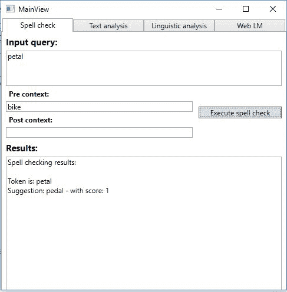
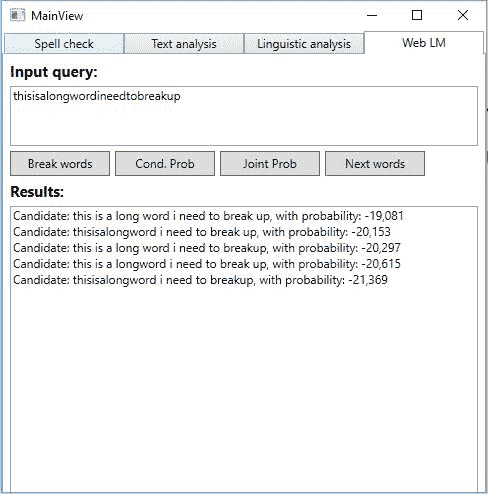
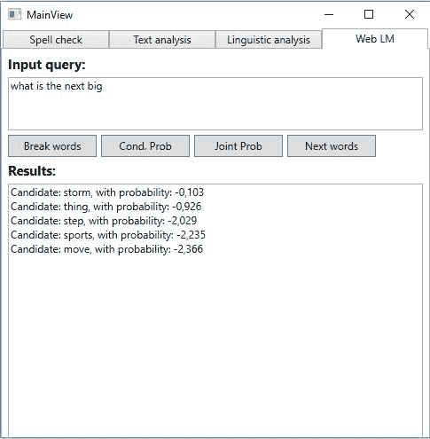
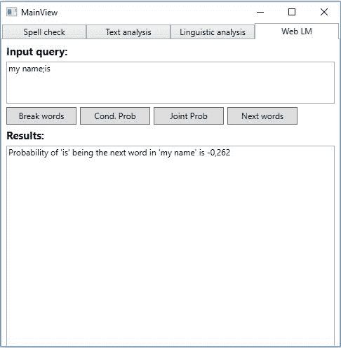
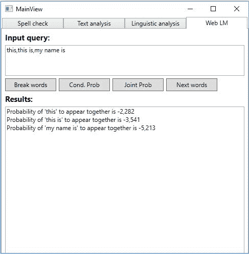
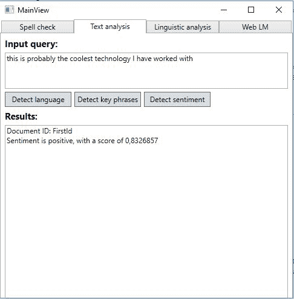
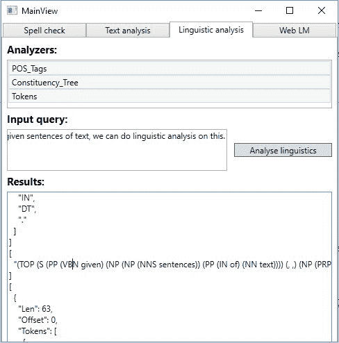

# 六、理解文本

前一章介绍了语音 API。在这一章中，我们将更深入地研究更多的语言 API。我们将学习如何使用拼写检查功能。接下来，我们将看到如何使用 web 语言模型来生成和查找下一个单词和序列。然后，我们将发现如何检测文本中的语言、关键短语和情感。最后，我们将简要地看一下语言分析。这样做将教会我们如何探索文本的结构，发现名词、动词等等。

在本章结束时，我们将已经涵盖了以下主题:

*   检查拼写并识别俚语和非正式语言、常用名、同音异义词和品牌
*   将单词(如标签和 URL)分解成几个单词
*   寻找一系列单词一起出现的可能性，或者一系列单词出现在给定单词之后的可能性
*   检测文本中的语言、关键短语和情感
*   执行文本的语言分析


# 建立一个公共核心

在我们进入细节之前，我们想为自己的成功做好准备。在撰写本文时，我们将要讨论的语言 API 都没有 NuGet 客户端包。因此，我们需要直接调用 REST 端点。因此，我们将预先做一些工作，以确保我们能够少写代码。


# 新项目

我们不会将 API 添加到我们的智能房屋应用中。继续创建一个新项目，使用在第 1 章、*微软认知服务入门*中创建的 MVVM 模板:

1.  进入 NuGet 包管理器并安装`Newtonsoft.Json`。这将帮助我们反序列化 API 响应和序列化请求体。
2.  右键单击引用。
3.  在“组件”选项卡中，选择“系统”。Web 和 System.Runtime.Serialization
4.  单击确定。
5.  在`MainView.xaml`文件中，添加一个`TabControl`元素。我们所有的附加视图将作为`TabItems`添加到主视图中。


# Web 请求

所有的 API 都遵循相同的模式。它们使用`POST`或`GET`请求访问各自的端点。接下来，它们将参数作为查询字符串传递，一些作为请求体传递。由于它们有这些相似之处，我们可以创建一个类来处理所有的 API 请求。

在`Model`文件夹中，添加一个新类，并将其命名为`WebRequest`。

我们需要一些私有变量:

```
    private const string JsonContentTypeHeader = "application/json"; 

    private static readonly JsonSerializerSettings _settings = new JsonSerializerSettings 
    { 
        DateFormatHandling = DateFormatHandling.IsoDateFormat, 
        NullValueHandling = NullValueHandling.Ignore, 
        ContractResolver = new CamelCasePropertyNamesContractResolver() 
    }; 

    private HttpClient _httpClient; 
    private string _endpoint; 
```

常量`JsonContentTypeHeader`定义了我们希望用于所有 API 调用的内容类型。`_settings`是一个`JsonSerializerSettings`对象，它指定了我们希望 JSON 数据如何被序列化(反序列化)。

`_httpClient`是将用于发出 API 请求的对象。最后一个成员`_endpoint`将持有 API 端点。

我们的构造函数将接受两个参数:一个字符串用于 URI，一个字符串用于 API 键:

```
    public WebRequest(string uri, string apiKey) 
    { 
        _endpoint = uri; 

        _httpClient = new HttpClient(); 
        _httpClient.DefaultRequestHeaders.Add("Ocp-Apim-Subscription-Key", apiKey); 
    } 
```

我们将`uri`分配给相应的成员。接下来，我们创建一个类型为`HttpClient`的新对象，并添加一个请求头。这是包含给定`apiKey`的标题。

该类将包含一个函数`MakeRequest`。这应该具有返回类型`Task<TResponse>`，意味着我们在调用函数时指定的类型。它应该接受三个参数:一个`HttpMethod`、一个查询`string`和一个`TRequest`，这意味着我们在调用中指定的请求体。该函数应该是异步的:

```
    public async Task <TResponse> MakeRequest <TRequest, TResponse (HttpMethod method, string queryString, TRequest requestBody = default(TRequest)) 
```

前面几行显示了完整的函数签名。注意我们为什么不需要指定请求体，因为在某些情况下它可能是空的。我们稍后会谈到`TRequest`和`TResponse`可能是什么。

我们输入一个`try`条款:

```
    try { 
        string url = $"{_endpoint}{queryString}"; 
        var request = new HttpRequestMessage(method, url); 

        if (requestBody != null) 
            request.Content = new StringContent (JsonConvert.SerializeObject(requestBody, _settings), Encoding.UTF8, JsonContentTypeHeader); 

        HttpResponseMessage response = await _httpClient.SendAsync(request); 
```

首先，我们创建一个`url`，由我们的`_endpoint`和`queryString`组成。使用这个和指定的`method`，我们创建一个`HttpRequestMessage`对象。

如果我们有一个`requestBody`，我们通过序列化`requestBody`将`Content`添加到`request`对象中。

随着请求的有序进行，我们在`_httpClient`对象上对`SendAsync`进行异步调用。这将调用 API 端点，返回包含响应的`HttpResponseMessage`。

如果`response`成功，我们希望得到作为字符串的`Content`。这是按如下方式完成的:

1.  对`ReadAsStringAsync`进行异步调用。这将返回一个字符串。
2.  将字符串反序列化为一个`TResponse`对象。
3.  将反序列化的对象返回给调用方。

如果`responseContent`中没有数据，我们返回一个默认的`TResponse`。这将包含所有属性的默认值:

```
    if (response.IsSuccessStatusCode) 
    { 
        string responseContent = null; 

        if (response.Content != null) 
            responseContent = await response.Content.ReadAsStringAsync(); 
        if (!string.IsNullOrWhiteSpace(responseContent)) 
            return JsonConvert.DeserializeObject<TResponse>(responseContent,_settings); 

        return default(TResponse); 
    } 
```

如果 API 响应包含任何错误代码，我们会尝试以字符串形式获取错误消息(`errorObjectString`)。在一个典型的应用中，您可能希望将它反序列化并传播给用户。然而，由于这是一个简单的示例应用，我们选择将其输出到`Debug`控制台窗口:

```
    else 
    { 
        if (response.Content != null && response.Content.Headers.ContentType.MediaType.Contains (JsonContentTypeHeader)) 
        { 
            var errorObjectString = await response.Content.ReadAsStringAsync(); 
            Debug.WriteLine(errorObjectString); 
        } 
    } 
```

确保添加相应的`catch`子句。将任何异常输出到`Debug`控制台窗口。此外，如果出现任何异常，请确保返回默认值`TResponse`。


# 数据契约

因为我们需要将 JSON 数据序列化为 API 请求和响应的一部分，所以我们需要创建数据契约。这些将作为在`WebRequest`类中使用的`TResponse`和`TRequest`对象。

将名为 Contracts 的新文件夹添加到项目中。典型的数据协定可能如下所示:

```
    [DataContract] 
    public class TextErrors { 
       [DataMember] 
       public string id { get; set; } 

       [DataMember] 
       public string message { get; set; } 
    } 
```

这与文本分析 API 中的错误相关。如您所见，它有两个字符串属性，分别用于`id`和`message`。两者都可能出现在 API 响应中。

在讨论每个 API 时，我们会看到所有的请求和响应参数都是表格形式或 JSON 格式。我们不会看这些是如何转换成数据契约的，但是它将采用与前面所示类似的形式。然后由您来创建所需的合同。

需要注意的最重要的一点是，属性名必须与相应的 JSON 属性相同。

在继续之前，请确保代码可以编译，并且您可以运行该应用。


# 纠正拼写错误

Bing 拼写检查 API 利用机器学习和统计机器翻译的能力来训练和发展高度上下文相关的拼写检查算法。这样做允许我们利用上下文来执行拼写检查。

典型的拼写检查将遵循基于字典的规则集。可以想象，这将需要持续的更新和扩展。

使用 Bing 拼写检查 API，我们可以识别和纠正俚语和非正式语言。它可以识别常见的命名错误，并纠正断词问题。它可以检测和纠正发音相同，但意义和拼写不同的单词(同音词)。它还可以检测和纠正品牌和流行的表达。

在`View`文件夹中创建一个新视图。调用文件`SpellCheckView.xaml`。为输入查询添加一个`TextBox`元素。我们还需要两个`TextBox`元素用于前后上下文。添加一个`TextBox`元素来显示结果，添加一个`Button`元素来执行拼写检查。

在名为`ViewModel`的文件夹中添加一个新的视图模型。调用文件`SpellCheckViewModel.cs`。将该类公开，并让它从`ObservableObject`类继承。添加以下私有成员:

```
    private WebRequest _webRequest; 
```

这是我们之前创建的`WebRequest`类。

我们需要与我们的视图相对应的属性。这意味着我们需要四个`string`属性和一个`ICommand`属性。

如果您还没有注册，请在[https://portal.azure.com](https://portal.azure.com)注册一个免费的 API 密匙。

构造函数应该如下所示:

```
    public SpellCheckViewModel() 
    { 
        _webRequest = new WebRequest ("https://api.cognitive.microsoft.com/bing/v5.0/spellcheck/?", "API_KEY_HERE"); 
        ExecuteOperationCommand = new DelegateCommand( 
        ExecuteOperation, CanExecuteOperation); 
    } 
```

我们创建一个类型为`WebRequest`的新对象，指定 Bing 拼写检查 API 端点和 API 键。我们还为我们的`ExecuteOperationCommand`、`ICommand`属性创建了一个新的`DelegateCommand`。

如果我们的输入查询被填充，`CanExecuteOperation`属性应该返回`true`，否则返回`false`。

为了执行对 API 的调用，我们执行以下操作:

```
    private async void ExecuteOperation(object obj) 
    { 
        var queryString = HttpUtility.ParseQueryString(string.Empty); 

        queryString["text"] = InputQuery; 
        queryString["mkt"] = "en-us"; 
        //queryString["mode"] = "proof"; 

        if (!string.IsNullOrEmpty(PreContext)) queryString["preContextText"] = PreContext; 

        if(!string.IsNullOrEmpty(PostContext)) 
      queryString["postContextText"] = PostContext; 
```

首先，我们使用`HttpUtility`创建一个`queryString`。这将格式化字符串，因此它可以在 URI 中使用。

因为我们将使用`GET`方法调用 API，所以我们需要在字符串中指定所有参数。必需的参数是`text`和`mkt`，分别是输入的查询和语言。如果我们输入了`PreContext`和/或`PostContext`，我们也会添加这些参数。我们稍后将讨论不同的参数。

要发出请求，我们需要进行以下调用:

```
        SpellCheckResponse response = await _webRequest.MakeRequest <object, SpellCheckResponse>(HttpMethod.Get, queryString.ToString()); 
        ParseResults(response); 
    } 
```

我们在`_webRequest`对象上调用`MakeRequest`。因为我们正在发出一个`GET`请求，所以我们不需要任何请求体，我们将`object`作为`TRequest`传递。我们期待一份`SpellCheckResponse`合同作为回报。这将包含结果数据，我们稍后将查看参数。

当我们得到一个响应时，我们将它传递给一个函数来解析它:

```
    private void ParseResults(SpellCheckResponse response) 
    { 
        if(response == null || response.flaggedTokens == null || response.flaggedTokens.Count == 0) 
        { 
            Result = "No suggestions found"; 
            return; 
        } 

        StringBuilder sb = new StringBuilder(); 
        sb.Append("Spell checking results:nn"); 
```

如果没有任何响应，我们将退出该功能。否则，我们创建一个`StringBuilder`来格式化结果:

```
    foreach (FlaggedTokens tokens in response.flaggedTokens) 
    { 
        if (!string.IsNullOrEmpty(tokens.token)) 
            sb.AppendFormat("Token is: {0}n", tokens.token); 

        if(tokens.suggestions != null || tokens.suggestions.Count != 0) 
        { 
            foreach (Suggestions suggestion in tokens.suggestions) 
            { 
                sb.AppendFormat("Suggestion: {0} - with score: {1}n", suggestion.suggestion, suggestion.score); 
            } 
            sb.Append("n"); 
        } 
    } 
    Result = sb.ToString(); 
```

如果我们有任何正确的拼写，我们循环通过这些。我们将所有建议添加到`StringBuilder`中，确保我们添加了建议正确的可能性。最后，我们确保将结果输出到 UI。

下表描述了我们可以添加到 API 调用中的所有参数:

| **参数** | **描述** |
| `text` | 我们要检查拼写和语法错误的文本。 |
| `mode` | 拼写检查的当前模式，如下所示:

*   **校样**:针对长查询的拼写纠正，通常在 MS Word 中使用
*   **拼写**:用于搜索引擎修正。可用于最多九个单词(标记)的查询

 |
| `preContextText` | 为文本提供上下文的字符串。*花瓣*有效，但如果在此参数中指定了 bike，则会修正为*踏板*。 |
| `postContextText` | 为文本提供上下文的字符串。*读取*有效，但如果在此参数中指定地毯，可能会修正为*红色*。 |
| `mkt` | 对于证明模式，必须指定语言。目前可以是`en-us`、`es-es`或`pt-br`。对于拼写模式，支持所有语言代码。 |

成功的响应将是 JSON 响应，包含以下内容:

```
    { 
        "_type": "SpellCheck", 
        "flaggedTokens": [ 
        { 
            "offset": 5, 
            "token": "Gatas", 
            "type": "UnknownToken", 
            "suggestions": [ 
            { 
                "suggestion": "Gates", 
                "score": 1 
            }] 
        }] 
    } 
```

`offset`是该单词在文本中出现的位置，而`token`是包含错误的单词，而`type`描述了错误的类型。`suggestions`包含一个数组，其中包含建议的更正及其正确的概率。

如前几章所述，当视图和视图模型被正确初始化后，我们应该能够编译和运行这个例子了。

运行拼写检查的输出示例可能会给出以下结果:



# 使用网络语言模型的自然语言处理

使用 **Web 语言模型** ( **Web LM** ) API，我们能够进行自然语言处理。使用 Bing 收集的数据，在网络规模上训练语言模型。

这个 API 提供了四个关键特性:

*   单词序列的联合概率
*   一个单词跟随一个单词序列的条件概率
*   最有可能遵循给定序列的单词
*   不带任何空格的字符串的断字

首先，在`View`文件夹中添加一个名为`WebLmView.xaml`的新文件。在这个视图中，我们希望有两个`TextBox`元素，一个用于输入查询，一个用于结果视图。此外，我们想要四个`Button`元素。其中的每一个都会触发一个 API 特性。

接下来，我们需要添加一个新的视图模型。将名为`WebLmViewModel.cs`的新文件添加到`ViewModel`文件夹中。添加两个`string`属性，对应视图中的输入和输出。我们还需要添加四个`ICommand`对象，当按钮被按下时会被触发。

为了能够调用 API，我们添加了一个`WebRequest`类型的私有成员。另外，确保 ViewModel 继承了`ObservableObject`。

如果您还没有这样做，请在[https://portal.azure.com](https://portal.azure.com)注册一个 API 密钥。

我们的构造函数确保我们创建了`ICommand`对象，以及`WebRequest`对象:

```
     public WebLmViewModel()
     {
         _webRequest = new WebRequest("https://api.projectoxford.ai/text/weblm/v1.0/", "API_KEY_HERE");
         BreakWordsCommand = new DelegateCommand(BreakWords, CanExecuteOperation);
         CondProbCommand = new DelegateCommand(CondProb, CanExecuteOperation);
         JointProbCommand = new DelegateCommand(JointProb, CanExecuteOperation);
         GenerateNextWordsCommand = new DelegateCommand(GenerateNextWords, CanExecuteOperation);
     }
```

当我们创建`WebRequest`对象时，我们指定 API 端点和 API 键。如果输入被输入，则`CanExecuteOperation`应返回`true`，否则返回`false`。


# 把一个词分成几个词

如果我们有一个分析网站或文本的应用，它可能会方便地分解单词。随着社交媒体的使用越来越多，我们有了标签，这些标签可能很难阅读。使用 Web LM API，我们可以将这些单词分解成几个单词。

标点符号和外来字符很难打破，所以尽量将输入字符串限制为小写字母数字字符。

为了利用这个特性，我们需要对 API 进行一个`POST`调用。但是，我们不需要传递请求体，因为所有参数都在 URL 中指定:

```
    private async void BreakWords(object obj) 
    { 
        var queryString = HttpUtility.ParseQueryString(string.Empty); 

       queryString["model"] = "body";  
       queryString["text"] = InputQuery; 
       //queryString["order"] = "5"; 
       //queryString["maxNumOfCandidatesReturned"] = "5"; 

       WebLmWordBreakResponse response = await _webRequest.MakeRequest<object, WebLmWordBreakResponse>(HttpMethod.Post, $"breakIntoWords?{queryString.ToString()}"); 
```

我们从一个空的基础上创建一个`queryString`。接下来，我们输入所需的参数。这其中的第一个就是`model`。这是用于中断的模型，它是一个字符串，可以是`title`、`anchor`、`query`或`body`。下一个需要的参数是`text`。文本中的任何空格都将保留在结果中。

可选的，我们可以输入 N-gram 的`order`。默认值为 5，支持的范围为 1-5。此外，我们可以输入要返回的候选人的数量。默认值是 5，这对我们来说没问题。

有了查询字符串，我们调用`MakeRequest`。因为我们不传递请求体，所以我们将`TRequest`留给`object`。我们期待一个`WebLmWordBreakResponse`的结果。注意，我们在`queryString`之前指定了`breakIntoWords`。这使得查询字符串的格式正确:

```
        if(response == null && response.candidates?.Length != 0) 
        { 
            Result = "Could not break into words"; 
            return; 
        } 

        StringBuilder sb = new StringBuilder(); 

        foreach (WebLmCandidates candidate in response.candidates) 
        { 
            sb.AppendFormat("Candidate: {0}, with probability: {1}n",candidate.words, candidate.probability); 
        } 

        Result = sb.ToString(); 
```

如果我们有一个成功的响应，我们循环通过所有的`candidates`。我们确保输出每个候选单词，并给出单词正确的概率。

成功的调用会导致以下 JSON 结果:

```
    { 
        "candidates" :[ 
        { 
            "words" : "test for word break", 
            "probability" :  -13.911 
        }] 
    } 
```

我们有一个`candidates`数组，其中每个候选者包含`words`和正确的`probability`。

成功的 API 调用会产生以下输出:



# 生成单词序列中的下一个单词

为了提高最终用户的书写可用性，我们可以添加下一个单词生成。通过利用这个特性，我们可以得到最有可能跟随一个序列的单词，并向我们的用户推荐这个单词。

执行这个操作是一个`POST`调用，没有请求体。与断字一样，我们传递查询字符串中的任何参数:

```
    private async void GenerateNextWords(object obj) { 
        var queryString = HttpUtility.ParseQueryString(string.Empty); 

       queryString["model"] = "body"; 
       queryString["words"] = InputQuery; 
       //queryString["order"] = "5"; 
       //queryString["maxNumOfCandidatesReturned"] = "5"; 

       WebLmNextWordResults response = await _webRequest.MakeRequest <object, WebLmNextWordResults>(HttpMethod.Post, $"generateNextWords?{queryString.ToString()}"); 
```

如您所见，这个调用所需的参数类似于断字调用。两个不同之处在于，我们在查询字符串中添加了`generateNextWords`作为 REST 端点，并且我们期望结果为`WebLmNextWordResults`:

```
        if (response == null && response.candidates?.Length == 0) { 
            Result = "Could not generate next words"; 
            return; 
        } 

        StringBuilder sb = new StringBuilder(); 

        foreach (WebLmNextWordCandidates candidate in response.candidates) { 
            sb.AppendFormat("Candidate: {0}, with probability: {1}n", candidate.word, candidate.probability); 
        } 

        Result = sb.ToString(); 
```

如果结果包含任何`candidates`，我们就遍历它们。每个候选词将包含一个`word`，以及这个词是序列中下一个词的`probability`。我们确保在 UI 中显示这一点。

成功的请求可以生成以下 JSON 结果:

```
    { 
        "candidates": [{ "word" : "range", "probability" :  -1.396 }] 
    } 
```

这转化为一个`candidates`数组，其中每个候选项包含一个`word`，而`probability`表示这是下一个单词。

成功完成此次通话可能会产生以下结果:



# 学习一个单词是否可能跟随一个单词序列

使用条件概率特性，我们可以在单词序列之后找到给定单词的条件概率。

与前两个功能一样，这是一个`POST`调用:

```
    private async void CondProb(object obj) 
    { 
        var queryString = HttpUtility.ParseQueryString(string.Empty); 

        queryString["model"] = "body"; 
        //queryString["order"] = "5"; 

        var input = InputQuery.Split(';'); 

        WebLmConditionalProbRequest request = new WebLmConditionalProbRequest 
        { 
            queries = new WebLmCondProbQueries[] {new WebLmCondProbQueries {word = input[1], words = input[0]}} 
        }; 
```

我们创建一个新的`queryString`，添加`model`用于计算。这些值可以是标题、锚点、正文或查询。可选地，我们可以传递 N-gram `order`，它可能在 1-5 的范围内。默认值为 5。

为了使这个例子的 UI 简单一点，我们以一种特殊的格式传递一个序列和给定的单词。输入的格式应该如下:

```
    "my name; is"
```

这将允许我们将字符串一分为二，允许我们指定`words`和`word`本身的顺序。这些应该添加到`WebLmCondProbQueries`对象中，在`WebLmConditionalProbRequest`请求契约中:

```
        WebLmCondProbResponse response = await _webRequest.MakeRequest <WebLmConditionalProbRequest, WebLmCondProbResponse>(HttpMethod.Post, $"calculateConditionalProbability?{queryString.ToString()}",request); 
```

我们调用`MakeRequest`，指定请求体的类型为`WebLmConditionalProbRequest`，并且我们期望返回一个`WebLmCondResponse`。我们在查询字符串前面加上`calculatedConditionalProbability`以确保我们联系到正确的 REST 端点:

```
    if (response == null && response.results?.Length == 0) { 
        Result = "Could not calculate the conditional probability"; 
        return; 
    } 

    StringBuilder sb = new StringBuilder(); 

    foreach (WebLmCondProbResult candidate in response.results) { 
        sb.AppendFormat("Probability of '{0}' being the next word in '{1}' is {2}n", candidate.word, candidate.words, candidate.probability); 
    } 

    Result = sb.ToString(); 
```

如果响应是成功的，并且包含`results`，我们就循环通过它。我们输出给定的`word`、`words`的序列，以及`word`是序列中的下一个的`probability`。

成功的结果应该会产生如下所示的 JSON:

```
    { 
        "results":[ { 
            "words": "hello world wide", 
            "word": "web", 
            "probability" :  -1.541 }]
    }
```

这是一个`results`的数组。每一项都包含了`words`的顺序，我们正在检查的`word`，它的`probability`是下一个单词。

如果呼叫成功，我们可能会得到以下结果:



# 学习某些单词是否可能一起出现

通过使用**联合概率**特征，我们可以确定某些单词是否会一起出现。

我们创建一个`queryString`，添加`model`和可选的 N-gram `order`作为参数。接下来，我们创建我们的`WebLmJointProbRequest`契约对象。这应该包含一个字符串数组，用作查询。正如你所看到的，我们采取了一种快速的方法来获取更多的样本，通过使用逗号分隔符:

```
    private async void JointProb(object obj) 
    { 
        var queryString = HttpUtility.ParseQueryString(string.Empty); 

        queryString["model"] = "body";  
        //queryString["order"] = "5"; 

        WebLmJointProbRequest request = new WebLmJointProbRequest 
        { 
            queries = InputQuery.Split(',') 
        }; 
```

随着请求体和查询字符串的创建，我们调用`MakeRequest`。我们指定请求体的类型为`WebLmJointProbRequest`，并期望得到类型为`WebLmJointProbResponse`的响应。查询字符串之前是该操作的 REST 端点，`calculateJointProbability`:

```
    WebLmJointProbResponse response = await _webRequest.MakeRequest <WebLmJointProbRequest, WebLmJointProbResponse>(HttpMethod.Post, $"calculateJointProbability?{queryString.ToString()}", request); 
```

如果调用成功并且包含任何`results`，我们就遍历它们。我们输出给定的序列`words`和它们一起出现的关节`probability`:

```
    if (response == null && response.results?.Length == 0) { 
        Result = "Could not calculate the joint probability"; 
        return; 
    } 

    StringBuilder sb = new StringBuilder(); 

    foreach (WebLmJointProbResults candidate in response.results) { 
        sb.AppendFormat("Probability of '{0}' to appear together is {1}n", candidate.words, candidate.probability); 
    } 

Result = sb.ToString(); 
```

成功的结果应该以 JSON 的形式给出，如下所示:

```
    { 
        "results": [{ 
             "words" : "this", 
             "probability " :  -3.541 
         }] 
    } 
```

这包含了一个`results`的数组。每个结果将包含`words`的序列，以及它们将一起出现的`probability`。

考虑到这一点，试运行可以为我们提供以下结果:



# 通过文本分析提取信息

使用**文本分析 API，**我们能够分析文本。我们将涵盖语言检测、关键短语分析和情感分析。此外，一个新的功能是检测话题的能力。然而，这确实需要大量的示例文本，因此，我们不会详细讨论这一点。

对于我们所有的文本分析任务，我们将使用一个新的视图。在`View`文件夹中添加一个名为`TextAnalysisView.xaml`的新视图。这应该包含一个用于输入查询的`TextBox`元素。它还应该有一个用于结果的`TextBox`元素。我们将需要三个`Button`元素，一个用于我们将要执行的每个检测分析。

我们还需要一个新的视图模型，所以将`TextAnalysisViewModel.cs`添加到`ViewModel`文件夹中。在这里我们需要两个`string`属性，每个属性对应一个`TextBox`。还要添加三个`ICommand`属性，每个按钮一个。

如果您还没有这样做，请在[https://portal.azure.com](https://portal.azure.com)注册一个 API 密钥。

添加一个私有成员，名为`_webRequest`，类型为`WebRequest`。有了这些，我们就可以创建我们的构造函数了:

```
    public TextAnalysisViewModel() 
    { 
        _webRequest = new WebRequest("https://westus.api.cognitive.microsoft.com/text/analytics/v2.0/","API_KEY_HERE"); 
        DetectLanguageCommand = new DelegateCommand(DetectLanguage, CanExecuteOperation); 
        DetectKeyPhrasesCommand = new DelegateCommand(DetectKeyPhrases, CanExecuteOperation); 
        DetectSentimentCommand = new DelegateCommand(DetectSentiment, CanExecuteOperation); 
    } 
```

构造函数创建一个新的`WebRequest`对象，指定 API 端点和 API 键。然后我们继续为我们的`ICommand`属性创建`DelegateCommand`对象。如果我们已经输入了输入查询，`CanExecuteOperation`函数应该返回`true`，否则返回`false`。


# 检测语言

该 API 可以从 120 多种不同的语言中检测出文本中使用的是哪种语言。

这是一个`POST`调用，所以我们需要发送一个请求体。请求体应该由`documents`组成。这基本上是一个包含每个`text`的唯一`id`的数组。它还需要包含文本本身:

```
    private async void DetectLanguage(object obj) 
    { 
        var queryString = HttpUtility.ParseQueryString("languages"); 
        TextRequests request = new TextRequests 
        { 
            documents = new List<TextDocumentRequest> 
            { 
                new TextDocumentRequest {id="FirstId", text=InputQuery}                             
            } 
        }; 

        TextResponse response = await _webRequest.MakeRequest<TextRequests, TextResponse>(HttpMethod.Post, queryString.ToString(), request); 
```

我们创建一个`queryString`，指定我们想要到达的 REST 端点。然后我们继续创建一个包含文档的`TextRequest`契约。由于我们只想检查一段文本，所以我们添加了一个`TextDocumentRequest`合同，指定一个`id`和`text`。

当请求被创建时，我们调用`MakeRequest`。我们期望响应类型为`TextResponse`，请求主体类型为`TextRequests`。我们传递`POST`作为调用方法、`queryString`和`request`主体。

如果响应成功，我们循环通过`detectedLanguages`。我们将语言添加到一个`StringBuilder`中，同时输出该语言正确的概率。这将显示在用户界面中:

```
    if(response.documents == null || response.documents.Count == 0) 
    { 
        Result = "No languages was detected."; 
        return; 
    } 

    StringBuilder sb = new StringBuilder(); 

    foreach (TextLanguageDocuments document in response.documents) 
    { 
        foreach (TextDetectedLanguages detectedLanguage in document.detectedLanguages) 
        { 
            sb.AppendFormat("Detected language: {0} with score {1}n", detectedLanguage.name, detectedLanguage.score); 
        } 
    } 

    Result = sb.ToString(); 
```

成功的响应将包含以下 JSON:

```
    { 
        "documents": [ 
        { 
            "id": "string", 
            "detectedLanguages": [ 
            { 
                "name": "string", 
                "iso6391Name": "string", 
                "score": 0.0 
            }] 
        }], 
        "errors": [ 
        { 
            "id": "string", 
            "message": "string" 
        }] 
    } 
```

这包含一个与请求中提供的一样多的`documents`和`-`的数组。每个文档将被标记一个唯一的`id`并包含一个`detectedLanguages`数组。这些语言将有`name`、`iso6391Name`，以及正确的概率(`score`)。

如果任何文档出现错误，我们将得到一个数组`errors`。每个错误将包含发生错误的文档的`id`，以及字符串形式的`message`。

成功的呼叫可能会产生以下结果:


# 从文本中提取关键短语

如果我们希望我们的应用知道关键的谈话点，从文本中提取关键短语可能是有用的。利用这一点，我们可以了解人们在文章、讨论或类似的文章中讨论什么。

这个调用也使用了`POST`方法，需要一个请求体。与语言检测一样，我们需要指定文档。每个文档都需要一个唯一的 ID、文本以及所使用的语言。在撰写本文时，仅支持英语、德语、西班牙语和日语。

为了提取关键短语，我们执行以下操作:

```
    private async void DetectKeyPhrases(object obj) 
    { 
        var queryString = HttpUtility.ParseQueryString("keyPhrases"); 
        TextRequests request = new TextRequests 
        { 
            documents = new List<TextDocumentRequest> 
            { 
                new TextDocumentRequest { id = "FirstId", text = InputQuery, language = "en" } 
            } 
        }; 

        TextKeyPhrasesResponse response = await _webRequest.MakeRequest<TextRequests, TextKeyPhrasesResponse>(HttpMethod.Post, queryString.ToString(), request); 
```

如你所见，这与检测语言非常相似。我们创建一个`queryString`，使用`keyPhrases`作为 REST 端点。我们创建一个类型为`TextRequests`的请求对象。我们添加文档列表，创建一个新的`TextDocumentRequest`。同样，我们需要`id`和`text`，但是我们也添加了一个`language`标签:

```
    if (response.documents == null || response.documents?.Count == 0) 
    { 
        Result = "No key phrases found."; 
        return; 
    } 

    StringBuilder sb = new StringBuilder(); 

    foreach (TextKeyPhrasesDocuments document in response.documents) 
    { 
        sb.Append("Key phrases found:n"); 
        foreach (string phrase in document.keyPhrases) 
        {  
            sb.AppendFormat("{0}n", phrase); 
        } 
    } 

    Result = sb.ToString(); 
```

如果响应包含任何关键短语，我们循环遍历它们，并将它们输出到 UI。成功的响应将提供以下 JSON:

```
    { 
        "documents": [{ 
            "keyPhrases": [ 
            "string" ], 
            "id": "string" 
        }], 
        "errors": [ 
        { 
            "id": "string", 
            "message": "string" 
        } ] 
    } 
```

这里我们有一个数组`documents`。每个文档都有一个唯一的`id`，对应于请求中的 ID。每个文档还包含一个字符串数组，带有`keyPhrases`。

与语言检测一样，任何错误也将被返回。


# 学习一篇文章是积极的还是消极的

使用情感分析，我们可以检测文本是否是正面的。如果您有一个用户可以提交反馈的商品网站，该功能可以自动分析反馈通常是积极的还是消极的。

情感得分以 0 到 1 之间的数字返回，其中较高的数字表示积极的情感。

与前两个分析一样，这是一个`POST`调用，需要一个请求体。同样，我们需要指定文档，每个文档都需要唯一的 ID、文本和语言:

```
    private async void DetectSentiment(object obj) 
    { 
        var queryString = HttpUtility.ParseQueryString("sentiment"); 
        TextRequests request = new TextRequests 
        { 
            documents = new List<TextDocumentRequest> 
            { 
                new TextDocumentRequest { id = "FirstId", text = InputQuery, language = "en" } 
            }  
        }; 

        TextSentimentResponse response = await _webRequest.MakeRequest <TextRequests, TextSentimentResponse>(HttpMethod.Post, queryString.ToString(), request); 
```

我们创建一个`queryString`，指向`sentiment`作为 REST 端点。数据契约为`TextRequests`，包含`documents`。我们传递的文档有一个唯一的`id`、`text`和`language`:

对`MakeRequest`的调用将需要类型为`TextSentimentRequests`的请求体，我们期望结果为类型`TextSentimentResponse`。

如果响应包含任何`documents`，我们将遍历它们。对于每个文档，我们检查`score`，并输出文本是肯定的还是否定的。这将显示在用户界面中:

```
    if(response.documents == null || response.documents?.Count == 0) 
    { 
        Result = "No sentiments detected"; 
        return; 
    } 

    StringBuilder sb = new StringBuilder(); 

    foreach (TextSentimentDocuments document in response.documents) 
    { 
        sb.AppendFormat("Document ID: {0}n", document.id); 

        if (document.score >= 0.5) 
            sb.AppendFormat("Sentiment is positive, with a score of{0}n", document.score); 
        else 
            sb.AppendFormat("Sentiment is negative with a score of {0}n", document.score); 
    } 

    Result = sb.ToString(); 
```

成功的响应将产生以下 JSON:

```
    { 
        "documents": [ 
        { 
            "score": 0.0, 
            "id": "string" 
        }], 
        "errors": [ 
        { 
            "id": "string", 
            "message": "string" 
        }] 
    } 
```

这是一个`documents`的数组。每个文档都会有一个相应的`id`作为请求，以及情感`score`。如果有任何`errors`发生，将被输入为语言和关键短语检测。

成功的测试可能如下所示:



# 使用语言分析探索文本

使用**语言分析 API** **，**我们可以探索文本的结构。我们可以访问词性标记和解析，这允许我们挖掘重要的概念和行为。通过使用这个 API，我们可以理解文本的结构。如果我们在挖掘客户反馈、解释用户命令或消费网络文本，这可以帮助我们。

由于语言分析是一个高级主题，我们不会深入研究它的所有细节。相反，我们将快速介绍一些关键概念，然后看看我们如何进行分析。我们不会花时间解析 UI 的结果数据，所以我们将简单地打印 JSON 结果。

有关语言分析和自然语言分析的更多信息，请参考维基百科在[https://en.wikipedia.org/wiki/Natural_language_processing](https://en.wikipedia.org/wiki/Natural_language_processing)的文章。


# 语言分析导论

在撰写本文时，API 中目前有三种可用的工具。这些措施如下:

*   句子切分和标记化
*   词性标注
*   选区分析

句子切分和标记化是第一步。这将把文本分解成句子，听起来可能很简单。然而，一个句子可能以不同的停止字符结尾。句号可能表示一个句子的结尾，但也可能表示缩写。

当我们从文本中分离出句子时，我们可以对其进行标记。最简单的形式是，这意味着根据空格分割所有句子(对于英语)。标点符号通常也会被拆分成唯一的标记，但如果它是缩写的一部分，它将是缩写标记的一部分。因此，单词`Mrs.`将是一个令牌，而`The end.`将是三个令牌。

下一步是识别所有单词的词性。这意味着我们识别诸如名词和动词之类的类别。根据上下文，不同的单词可能属于不同的类别。

文本中的单词将用词性标签来标记。这可能是名词的`NN`或动词的`VB`。词类标签的完整列表可以在附录 B 、*关于语言分析的附加信息*中找到。

最后一步是解析选区。这意味着识别文本中的短语，这使我们能够找到文本中的短语，并看到短语周围的修饰语。

在这些术语中，短语是一组单词，其中每个单词扮演一个特定的角色。在一个句子中，一组单词可以被移动或替换，而句子仍然应该保持流畅和符合语法。

我们给短语加标签，比如`ADJP`代表形容词短语，或者`NP`代表名词短语。所有短语类型的完整列表可在附录 B 、*关于语言分析的附加信息*中找到。

在撰写本文时，所有的分析都遵循宾树银行的规范([https://catalog.ldc.upenn.edu/docs/LDC95T7/cl93.html](https://catalog.ldc.upenn.edu/docs/LDC95T7/cl93.html))。


# 从语言学角度分析文本

简单介绍之后，我们现在可以在应用中添加语言分析。向`View`文件夹添加一个新视图，并将文件命名为`LinguisticView.xaml`。我们需要添加一个`ListBox`元素来包含我们想要从中选择的分析器。我们还应该为输入查询和结果视图添加`TextBox`元素。最后，我们将需要一个`Button`元素来执行分析。

接下来，我们添加视图模型。创建一个名为`LinguisticViewModel.cs`的新文件，并将其添加到`ViewModel`文件夹中。这将需要一个类型为`Analyzer`的`ObservableCollection`属性来保存我们的分析器。`Analyzer`类型是一个数据契约，一会儿就明白了。它还需要一个类型为`Analyzer`的`List`属性来保存所选择的分析器。最后，我们需要输入查询和结果视图的两个`string`属性，以及按钮的一个`ICommand`属性。

我们需要添加一个类型为`WebRequest`的私有成员来执行我们的 API 调用。我们的构造函数应该如下所示:

```
    public LinguisticViewModel() 
    { 
        _webRequest = new WebRequest("https://api.projectoxford.ai/linguistics/v1.0/", "API_KEY_HERE"); 
        ExecuteOperationCommand = new DelegateCommand( 
        ExecuteOperation, CanExecuteOperation); 

        GetAnalyzers(); 
    } 
```

我们创建一个新的`WebRequest`对象，指定正确的端点和 API 键。然后我们为我们的`ICommand`属性`ExecuteOperationCommand`创建一个新的`DelegateCommand`。和以前一样，如果输入了我们的输入查询，`CanExecuteOperation`应该返回`true`，否则返回`false`。

当我们创建这个视图模型时，我们需要获得分析器的列表。这将在`GetAnalyzers`中完成:

```
    private async void GetAnalyzers() 
    { 
        var queryString = HttpUtility.ParseQueryString("analyzers"); 

        Analyzer[] response = await _webRequest.MakeRequest<object, Analyzer[]>(HttpMethod.Get,queryString.ToString()); 
```

为了获得分析器，我们需要对 API 进行一个`GET`调用。我们创建一个`queryString`，它将`analyzers`指定为 REST 端点。不需要更多参数。当调用`MakeRequest`时，我们不需要任何请求体，所以我们将`TRequest`保留为`object`。我们期望结果是一个类型为`Analyzer`的数组。

如果我们得到一个成功的响应，我们通过数组循环。我们将把每个元素添加到我们的`Analyzer`属性中，这将在 UI 中显示它们:

```
    if (response == null || response.Length == 0) return; 

    foreach (Analyzer analyzer in response) { 
        Analyzers.Add(analyzer); 
    } 
```

成功的响应将返回一组可用的分析器。下表描述了每个分析仪的参数:

| **参数** | **描述** |
| `id` | 命名分析器 ID 的字符串。通常，这是 GUID 格式。 |
| `languages` | 每种语言可以支持一种或多种语言。这些将在该参数中可用。 |
| `kind` | 描述所提供的分析类型。 |
| `specification` | 每个分析仪都在此参数中命名的给定规格下运行。 |
| `implementation` | 给定分析器的实现的名称。 |

当我们运行一个分析时，我们可以同时使用多个分析器，所以在视图后面的代码中创建一个`SelectionChanged`事件处理程序。这样可以将选中的项目添加到 ViewModel 中的`List`属性中。

有了分析仪列表，我们现在可以执行分析:

```
    private async void ExecuteOperation(object obj) 
    { 
        var queryString = HttpUtility.ParseQueryString("analyze"); 

        LinguisticRequest request = new LinguisticRequest 
        { 
            language = "en", analyzerIds = SelectedAnalyzers.Select(x => x.id).ToArray(), text = InputQuery 
        }; 

        AnalyzerResults[] results = await _webRequest.MakeRequest<LinguisticRequest, AnalyzerResults[]>(HttpMethod.Post, queryString.ToString(), request); 
```

这是一个`POST`呼叫。我们首先创建一个`queryString`，指向我们的`analyze` REST 端点。我们需要添加一个请求体，一个类型为`LinguisticRequest`的数据契约。这应该包含当前的`language`，一个包含我们想要使用的所有分析器的 id 的数组，以及要分析的`text`。

调用`MakeRequest`假设我们传递了一个`LinguisticRequest`请求类型。它期望一个数组`AnalyzerResults`作为响应:

```
    if(results == null || results.Length == 0) { 
        Result = "Could not analyze text."; 
        return; 
    } 

    StringBuilder sb = new StringBuilder(); 

    foreach (AnalyzerResults analyzedResult in results) { 
        sb.AppendFormat("{0}n", analyzedResult.result.ToString()); 
    } 

    Result = sb.ToString(); 
```

如果结果包含数据，我们循环遍历它，并在 UI 中显示分析结果。

成功的结果将导致 JSON 响应，如下所示:

```
    [ { 
        "analyzerId" : "4fa79af1-f22c-408d-98bb-b7d7aeef7f04",  
        "result" : ["NNP",",","NNP","VBP","PRP","NN","."] 
    } ] 
```

我们将每个分析仪一个项目。正如您在`result`字段中看到的，这个分析器是选区分析类型，也称为短语结构分析。它显示检测到的所有短语类型。

选择了所有分析仪的测试运行可以为我们提供如下屏幕截图所示的结果:



# 摘要

在这一章中，我们主要关注语言 API。我们从创建执行对不同服务的 API 调用所需的部分开始。接下来，我们看了 Bing 拼写检查 API。接下来，我们学习了如何使用 web 语言模型来断词和计算单词序列的概率。我们转向了更具分析性的 API，在那里我们学会了如何检测语言、关键短语和情感。我们简要地看了一下语言分析，从而完成了这一章。

下一章将带我们从语言 API 进入知识 API。在本章中，我们将学习如何根据上下文来识别和确定实体。此外，我们将学习如何使用建议 API。