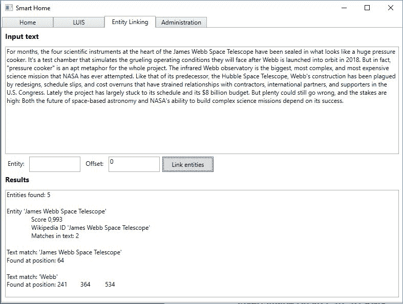
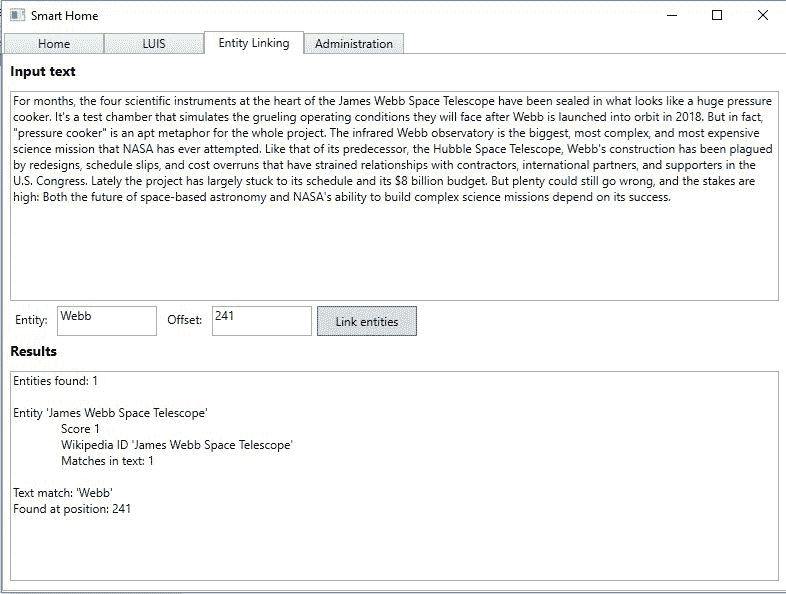
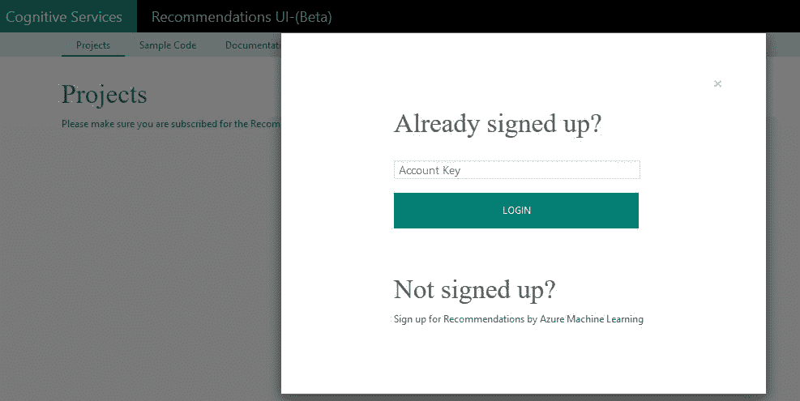
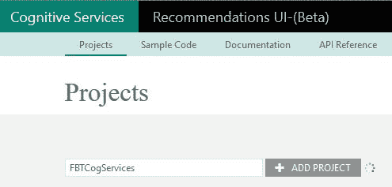
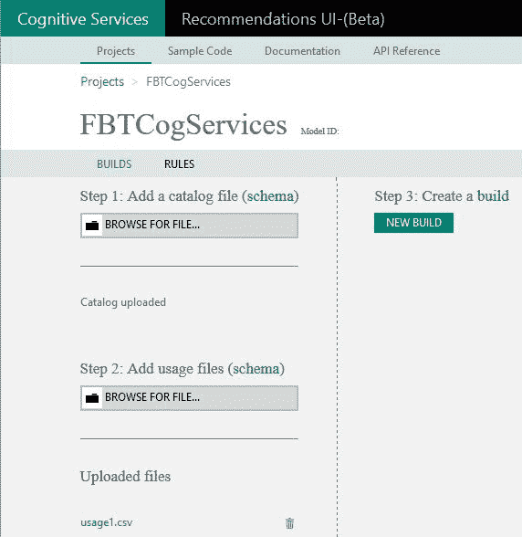
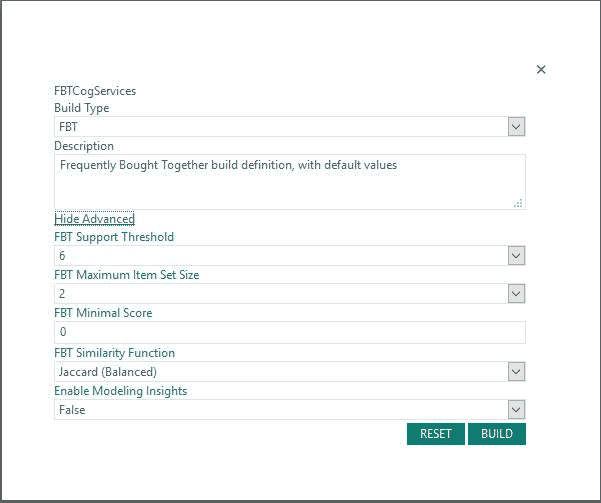
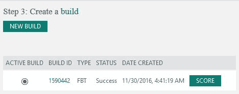
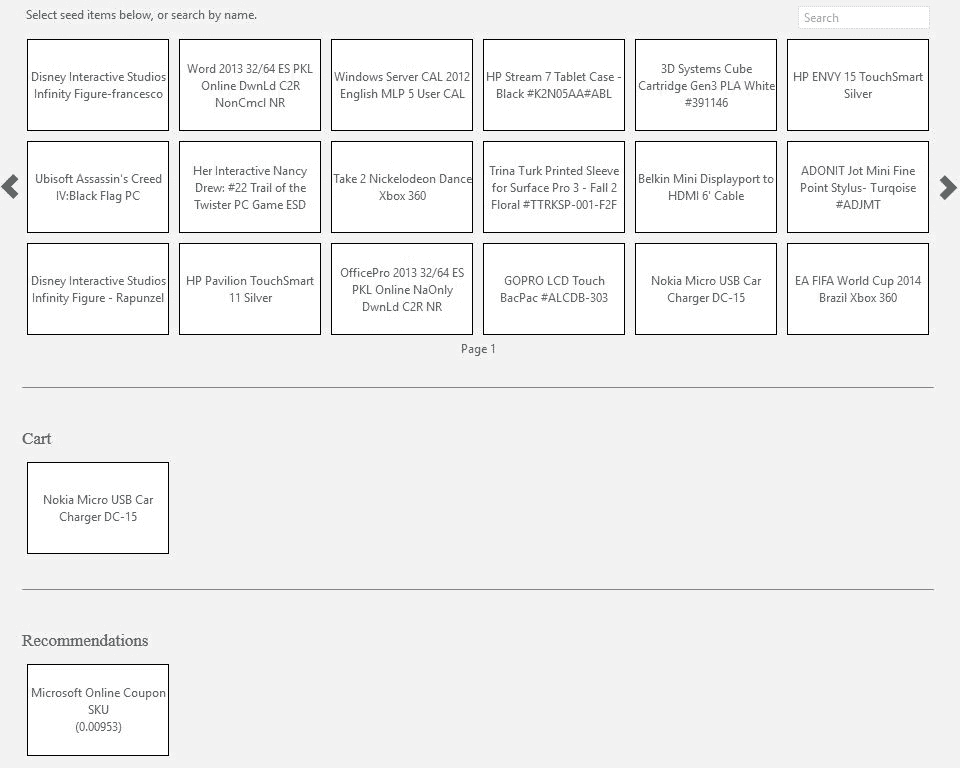
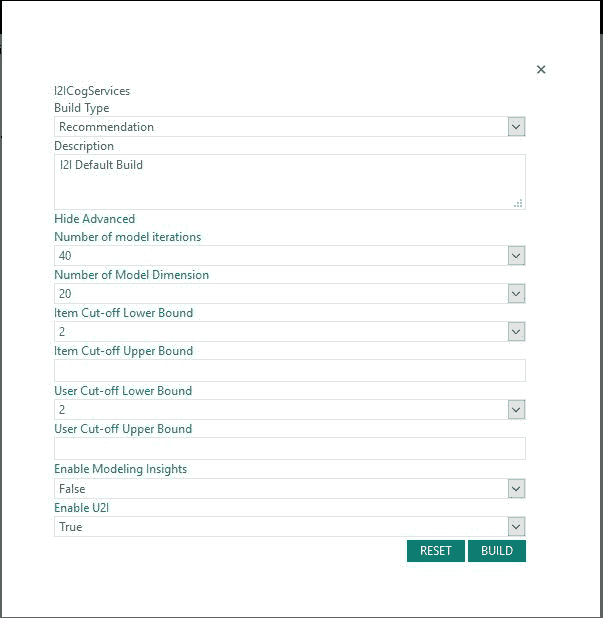
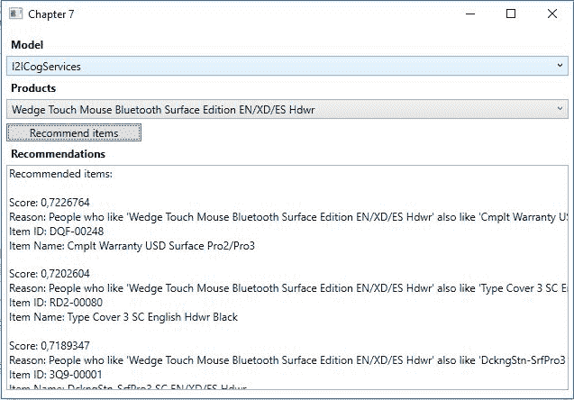

# 七、基于上下文扩展知识

“通过利用 Azure 机器学习和推荐 API，我们为零售商推出了一种新的个性化商务体验，这种体验可以提高任何渠道的购物者转化率和参与度。”

Orckestra 首席产品官 Frank Kouretas

在前一章中，我们介绍了其余的语言 API。在本章中，我们将研究前两个知识 API:实体链接 API 和建议 API。我们将从学习如何链接文本中的实体开始。使用实体链接 API，我们可以根据上下文识别文本中的不同实体。接下来，我们将研究一下建议 API。这非常适合电子商务应用，您可以根据不同的标准推荐不同的商品。

完成本章后，我们将涵盖以下主题:

*   基于上下文识别和标识文本中的独立实体
*   根据经常一起购买的商品推荐商品
*   基于购买了该商品的其他顾客购买了哪些商品来推荐商品
*   根据顾客之前的活动推荐商品


# 基于上下文链接实体

使用实体链接 API，我们可以基于上下文链接文本中的实体。这样做意味着我们可以根据给定文本中的用法来区分单词的意思。一个单词，比如 *times* ，可能是指报纸*纽约时报*。同样的词也可以用在地名中，`Times Square`。上下文决定两个实体*乘以*代表哪一个。API 检测给定文本中的实体，并将所有实体与维基百科条目相关联。

我们将为我们的智能房屋应用添加实体链接功能。现在，我们将只添加一个文本字段输入，但在后面的章节中，我们将看到如何利用它。

在 Visual Studio 中，将`Microsoft.ProjectOxford.EntityLinking` NuGet 包添加到项目中。这包含使用 API 所需的客户端库。

向`Model`文件夹添加一个新文件，即`EntityLinking.cs`文件。在类`EntityLinking`下面，添加一个名为`EntityLinkingErrorEventArgs`的新类。这将允许我们在发生错误时引发事件，并通知调用者。

让它看起来像下面这样:

```py
    public class EntityLinkingErrorEventArgs { 
        public string ErrorMessage { get; private set; } 
        public EntityLinkingErrorEventArgs(string errorMessage) { 
            ErrorMessage = errorMessage; 
        } 
    } 
```

回到`EntityLinking`类，我们定义我们的错误事件，以及链接客户端的实体的私有成员。此外，我们想添加一个助手函数来引发事件，名为`RaiseOnEntityLinkingError`。这应该接受先前接受的事件参数:

```py
    public event EventHandler<EntityLinkingErrorEventArgs> EntityLinkingError;

    private EntityLinkingServiceClient _entityLinkingServiceClient; 
```

我们在构造函数中创建了`EntityLinkingServiceClient`对象:

```py
    public EntityLinking(string apiKey) 
    { 
        _entityLinkingServiceClient = new EntityLinkingServiceClient(apiKey, "ROOT_URI"); 
    } 
```

当创建`EntityLinking`时，我们将 API 键作为参数传递。这在创建服务客户端时使用。我们还需要指定根 URI，就像我们在前面的一些 API 中看到的那样。

如果你还没有这样做，你可以在[https://portal.azure.com](https://portal.azure.com)注册实体链接 API。

我们需要这个类中的一个函数，`LinkEntities`。这应该接受两个`strings`和一个`int`作为参数。它应该具有返回类型`Task<EntityLink[]>`并标记为`async`:

```py
    public async Task<EntityLink[]> LinkEntities(string inputText, string selection = "", int offset = 0) 
    { 
        try { 
            EntityLink[] linkingResponse = await _entityLinkingServiceClient.LinkAsync(inputText, selection, offset); 

            return linkingResponse; 
        } 
```

`_entityLinkingServiceClient`上的`LinkAsync`功能唯一需要的参数是`inputText`。这是服务将尝试在其中分隔实体的文本。如果没有指定最后两个参数，服务将查找它能找到的所有实体。

如果我们在`selection`中输入一个单词，服务将链接具有该名称的实体。如果输入这个，还需要加上`offset`。这是单词第一个字符的位置，也是它在文本中首次出现的位置。

确保添加相应的`catch`条款。如果捕捉到任何异常，则引发错误事件，将异常消息用作事件参数中的参数。

接下来我们需要添加一个视图，所以在`View`文件夹中创建一个名为`EntityLinkingView.xaml`的新文件。

我们想添加四个`TextBox`元素。其中两个应该更大，因为它们是输入文本和结果文本。两个应该更小，因为它们将用于实体选择和偏移输入。此外，我们将需要一个`Button`元素来链接实体。

视图就位后，我们可以添加一个视图模型。将`EntityLinkingViewModel.cs`添加到`ViewModel`文件夹中。我们需要添加一个类型为`EntityLinking`的私有成员。我们还需要添加与我们的视图相对应的属性。添加三个`string`属性，分别对应于输入文本、结果文本和实体选择。为我们的偏移添加一个`int`属性。最后，但同样重要的是，我们需要为我们的`Button`设置一个`ICommand`属性:

```py
    public EntityLinkingViewModel() 
    { 
        LinkEntitiesCommand = new DelegateCommand(LinkEntities, CanLinkEntities); 

        _entityLinking = new EntityLinking("API_KEY_HERE"); 
        _entityLinking.EntityLinkingError += OnEntityLinkingError;
    } 
```

构造函数将`ICommand`属性创建为一个`DelegateCommand`对象。`CanLinkEntities`如果我们输入了文本，应该返回 true，否则返回 false。

接下来，构造函数创建我们的`EntityLinking`对象，指定 API 键。我们还订阅了错误事件。`OnEntityLinkingError`如果 API 调用失败，应在 UI 中输出错误消息。

`LinkEntities`函数将负责调用 API 并输出结果:

```py
    private async void LinkEntities(object obj) 
    { 
        EntityLink[] linkedEntities = await _entityLinking.LinkEntities (InputText, Selection, Offset); 

        if(linkedEntities == null || linkedEntities.Length == 0) { 
            ResultText = "No linked entities found"; 
            return; 
        } 
```

我们在`_entityLinking`上称`LinkEntities`。如前所述，参数为`InputText`、实体`Selection`和`Offset`。成功的结果将返回一个类型为`EntityLink`的数组。这个数组中的每一项都将包含名称、Wikipedia ID 和这个实体被正确识别的概率。

它还将包含一个匹配数组。在这个数组中，每一项都包含一个给定的文本，其中有给定的实体。它还将包含一个条目数组，每个条目表示文本中的一个位置，由第一个字符的位置标识。

知道了这一点，我们可以格式化并打印出结果:

```py
    StringBuilder sb = new StringBuilder(); 

    sb.AppendFormat("Entities found: {0}nn", linkedEntities.Length); 

    foreach (EntityLink entity in linkedEntities) 
    { 
        sb.AppendFormat("Entity '{0}'ntScore {1}ntWikipedia ID '{2}'ntMatches in text: {3}nn", entity.Name, entity.Score, entity.WikipediaID, entity.Matches.Count); 

        foreach (var match in entity.Matches) 
        { 
            sb.AppendFormat("Text match: '{0}'n", match.Text); 

            sb.Append("Found at position: "); 
            foreach (var entry in match.Entries) 
            { 
                sb.AppendFormat("{0}t", entry.Offset); 
            } 

            sb.Append("nn"); 
        } 
    } 

    ResultText = sb.ToString(); 
```

确保代码能够编译，并运行它。测试运行可能会产生以下结果:



在此测试运行中，没有指定给定的实体选择；我们可以识别文本中的所有实体。

在这种情况下，如果我们将`Webb`指定为一个实体，我们将得到以下结果:



# 提供个性化推荐

如果你经营一个电子商务网站，一个很好的功能就是推荐。使用推荐 API，您可以很容易地添加它。利用**微软 Azure 机器学习**，可以训练 API 来识别应该推荐的项目。

有三种常见的建议方案:

*   **(FBT)**:FBT 是推荐经常与其他物品一起购买的物品的场景。一个例子是，如果你买了一个鼠标；然后 API 会推荐一个键盘。
*   **项目到项目推荐(I2I)** : I2I 是某些项目经常在其他项目之后被观看的场景。通常，这将以*的形式出现，访问过这个项目的人也访问过这个其他项目*。
*   **顾客对商品的推荐(U2I)** : U2I 是利用顾客之前的行为来推荐商品的场景。如果你是卖电影的，你可以根据客户之前的电影选择推荐其他电影。

使用建议 API 的一般步骤如下:

1.  创建一个模型。
2.  导入目录数据(电子商务站点中的项目)。
3.  导入使用数据。
4.  建立推荐模型。
5.  消费推荐。

虽然您可以通过编程完成所有任务，但微软已经为前四个步骤创建了一个 web 界面。在撰写本文时，这仍处于测试阶段；然而，它确实起了作用。

如果你还没有这样做，在[https://portal.azure.com](https://portal.azure.com)注册一个 API 密钥。


# 创建模型

要开始创建模型，请前往[https://recommendations-portal.azurewebsites.net/](https://recommendations-portal.azurewebsites.net/)。使用创建的 API 密钥登录:



我们需要添加一个项目。一个项目将作为一个推荐方案。

我们首先为 FBT 场景添加一个项目:



# 导入目录数据

创建项目后，我们可以添加目录数据。这是您通常从数据库添加项目的地方。需要以文件格式上传，有特定的格式。

下表描述了目录中每个项目所需的数据:

| **名称** | **描述** |
| 项目 ID | 给定项目的唯一标识符 |
| 物品的名称 | 项目的名称 |
| 项目类别 | 项目的类别，如硬件、软件、图书类型等 |

此外，还有一些可选的数据字段。下表对这些进行了描述:

| **名称** | **描述** |
| 描述 | 项目的描述 |
| 特征表 | 逗号分隔的功能列表，可以增强推荐 |

包含所有数据的文件可能包含如下内容:

```py
C9F00168, Kiruna Flip Cover, Accessories, Description of item, compatibility = lumia, hardware type = mobile
```

添加特性通常更好，因为这可以改进推荐。任何新项目，很少使用，是不可能被推荐的，如果没有功能存在。

特征应该是明确的。这意味着一个特性可以是一个价格范围。价格本身并不是一个好的特征。

每个项目最多可以添加 20 个功能。当一个包含物品特征的目录上传后，你需要建立一个等级。这将对每个特性进行分级，其中等级越高的特性通常使用起来越好。

本章的代码示例包含一个样本目录。我们将在下面的例子中使用它。或者，你可以从微软下载一些数据，地址是 http://aka.ms/RecoSampleData。我们想使用来自`MsStoreData.zip`的数据。

下载文件后，我们可以将目录上传到我们的项目:



单击浏览文件字段。浏览到您下载的示例文件并选择`catalog.csv`文件。这将上传目录并对其进行处理。正如您在前面的屏幕截图中看到的，它将通过显示目录上传状态来告诉您目录何时上传和处理。

目录中的最大项目数是 100，000。任何给定的目录文件都不能大于 200 MB。如果您的文件较大，并且您还有更多项目，您可以上传多个文件。


# 导入使用数据

我们需要做的下一步是导入使用数据。这是一份描述你的客户过去所有交易的文件。该文件包含带有事务的行，其中每个事务是带有数据的逗号分隔的行。

所需数据如下:

| **名称** | **描述** |
| 用户标识 | 每个客户的唯一标识符 |
| 项目 ID | 项目的唯一标识符，与目录相关 |
| 时间 | 交易的时间 |

此外，还可能有一个名为**事件**的字段。这描述了交易的类型。允许的值有`Click`、`RecommendationClick`、`AddShopCart`、`RemoveShopCart`和`Purchase`。

给定目录中的上述示例，使用文件中的一行可能如下所示:

```py
    00030000D16C4237, C9F00168, 2015/08/04 T 11:02:37, Purchase
```

使用文件的最大文件大小为 200 MB。

推荐的质量依赖于使用数据的数量。通常，每个项目应该有大约 20 个注册的交易。这意味着，如果您在目录中有 100 个项目，您应该在使用文件中设定 2000 个交易。

请注意，API 当前接受的最大事务数是 500 万。如果在此之上添加新的事务，最早的数据将被删除。

同样，你可以在[http://aka.ms/RecoSampleData](http://aka.ms/RecoSampleData)找到一个示例使用文件。在我们的项目中，我们需要在步骤 2:添加使用文件中点击浏览文件字段。找到名为`usage1.csv`的文件并上传。一旦文件被上传和处理，它将出现在上传的文件下，如前面的截图所示。


# 建立模型

有了目录和使用数据之后，就该创建一个构建了。通过单击 NEW BUILD 按钮来完成，如前面的屏幕截图所示。这将导致以下对话框:



确保选择“FBT”作为构建类型。添加合适的描述，但注意描述不能超过 512 个字符。

FBT 建筑公司是一个保守的推荐者。这意味着它计算两个或三个产品一起购买(同时发生)的次数。然后根据相似度函数对结果进行排序。

您可以输入的高级参数可以是默认值。下表描述了每个参数:

| **参数** | **描述** |
| FBT 支持阈值 | 一个介于 3 - 50 之间的数字，用于描述模型的保守程度。这是建模时要考虑的项目的共现次数。 |
| FBT 最大项目集大小 | 一个数字(2 或 3 ),用于限制频繁集中的项目数。 |
| FBT 最低分 | 描述频繁集在推荐中必须返回的最低分数的数字。 |
| FBT 相似函数 | 定义用于推荐的相似性函数。可以是 Lift(有利于意外收获)、Co-occurrence(有利于可预测性)或 Jaccard(两者结合)。 |
| 启用建模洞察力 | 定义是否应打开离线评估。如果为真，则使用数据的子集将不会用于训练，而是保留用于测试。 |

设置好参数后，您需要单击 BUILD 按钮，如前面的屏幕截图所示。这将开始构建和训练模型的过程。请注意，此过程可能需要几分钟到几个小时，具体取决于您的使用数据的大小。

该过程完成后，状态将更新为如下所示:



点击“分数”按钮，您将进入一个页面，在这里您可以测试 API:



通过在顶部窗口中选择不同的项目，您将获得该项目的推荐。在将数据付诸行动之前，这是验证数据的好方法。

有了 FBT 模型后，我们想再添加一个。因此我们可以使用 I2I 和 U2I 建议。

使用与 FBT 模型相同的数据，经历我们刚刚经历过的相同过程。选择“建议”作为构建类型。这将向您显示以下屏幕:



作为构建类型的建议适用于 I2I 和 U2I 场景。第一个将预测客户可能感兴趣的商品，给定单个或多个商品作为输入。后者将基于给定用户的历史给出可能感兴趣的项目的推荐。

高级参数可以保留为默认值，下表对每个参数进行了描述:

| **参数** | **描述** |
| 模型迭代次数 | 10 - 50 之间的数字，决定模型的迭代次数。数值越大，推荐准确度越高，但计算时间会越长。 |
| 模型维数 | 10 - 40 之间的数字，描述模型将尝试在数据中查找的要素数量。较大的数字将允许对产生的建议进行更好的微调，但可能会阻止模型找到项目之间的相关性。 |
| 项目截止下限 | 0 - 30 之间的一个数字，用于定义每个项目在模型中必须考虑的最小使用次数。 |
| 项目截止上限 | 0 - 30 之间的一个数字，用于定义每个项目在模型中必须考虑的最大使用次数。 |
| 用户截止下限 | 0 - 10 之间的一个数字，定义用户必须执行的最小事务数，才能在模型中被考虑。 |
| 用户截止上限 | 0 - 10 之间的一个数字，定义用户必须执行的最大事务数，才能在模型中被考虑。 |
| 启用建模洞察力 | 定义是否应打开离线评估。如果为真，则使用数据的子集将不会用于训练，而是保留用于测试。 |
| 启用 U2I | 设定为 true 以启用 U2I 建议。 |

设置好所有参数后，单击 BUILD 按钮来构建和训练模型。考虑到与 FBT 模型相同的数据量，这应该需要更长的时间来执行。这也将受到定义的模型迭代次数的影响。

一旦该过程完成，您将再次有可能通过点击分数按钮来测试您的模型。

对于每个模型，您可以创建多个构件。默认情况下，最后创建的版本将被标记为活动版本。这将在获得推荐时使用。


# 消费推荐

为了使用我们刚刚创建的推荐模型，我们将创建一个新的示例应用。使用我们之前创建的 MVVM 模板来创建它。

在撰写本文时，还没有推荐 API 的客户机包。这意味着我们需要依赖 web 请求，正如我们在第六章、*理解文本*中看到的。为了加快开发时间，从第 6 章*理解文本*中的示例代码中复制`WebRequest.cs`文件。将该文件粘贴到`Model`文件夹中，并确保更新名称空间。

记得添加对`System.Web`和`System.Runtime.Serialization`的引用。

由于不需要太多的用户界面，我们将在`MainView.xaml`文件中添加所有内容。我们将需要两个`ComboBox`元素。这些将列出我们的推荐型号和目录项目。我们还需要一个`Button`元素来获取建议，一个`TextBox`元素来显示结果建议。

对应的 ViewModel`MainViewModel.cs`将需要属性来对应 UI 元素。添加类型为`RecommendationModel`的`ObservableCollection`，它将保存我们的模型。我们一会儿会看看类型。我们需要一个类型为`RecommendationModel`的属性，保存所选择的模型。添加一个类型为`Product`的`ObservableCollection`属性，以及一个对应于可用和选定属性的`Product`属性。我们还需要一个用于结果的`string`属性和一个用于按钮的`ICommand`属性。

添加一个私有成员，类型为`WebRequest`，这样我们就可以调用 API。

在`Model`文件夹中添加一个名为`Product`的新文件。为了使用我们目录中的商品，我们将把目录文件加载到应用中，为每个商品创建一个`Product`。让`Product`看起来如下:

```py
    public class Product { 
        public string Id { get; set; } 
        public string Name { get; set; } 
        public string Category { get; set; } 

        public Product(string id, string name, string category) { 
            Id = id; 
            Name = name; 
            Category = category; 
        } 
    } 
```

我们需要物品的`Id`、`Name`和`Category`。

构造函数应该创建一个`WebRequest`对象:

```py
    public MainViewModel() 
    { 
        _webRequest = new WebRequest ("https://westus.api.cognitive.microsoft.com/recommendations/v4.0/models/", "API_KEY_HERE"); 
        RecommendCommand = new DelegateCommand(RecommendBook, CanRecommendBook); 

        Initialize(); 
    } 
```

当我们创建`WebRequest`对象时，我们指定推荐端点和我们的 API 键。`RecommendCommand`是`ICommand`的对象，作为`DelegateCommand`。我们需要指定要执行的操作，以及允许我们执行命令的条件。如果我们已经选择了一个推荐模型和一个产品，我们应该被允许执行这个命令。

初始化将确保我们获取我们的推荐模型和产品:

```py
    private async void Initialize() { 
        await GetModels(); 
        GetProducts(); 
    } 
```

`GetModels`方法将调用 API。

```py
    private async Task GetModels() 
    { 
        RecommandationModels models = await _webRequest.MakeRequest <object, RecommandationModels>(HttpMethod.Get, string.Empty); 
```

这个调用是一个`GET`请求，所以我们在`MakeRequest`中指定它。我们不需要添加任何查询字符串或请求体，所以我们将这些参数留空。一个成功的调用应该产生一个 JSON 响应，我们将它反序列化为一个`RecommendationModels`对象。这是一个数据契约，所以在名为`Contracts`的文件夹中添加一个名为`Models.cs`的文件。

成功的结果将产生以下输出:

```py
    { 
        "models": [ 
        { 
            "id": "string", 
            "name": "string", 
            "description": "string", 
            "createdDateTime": "string", 
            "activeBuildId": 0, 
            "catalogDisplayName": "string" 
        }] 
    } 
```

我们有一个`models`数组。这个数组中的每个项目都有一个`id`、一个`name`、一个`description`、`createdDateTime`、`activeBuildId`和`catalogDisplayName`。确保类`RecommendationModels`包含这些数据。

如果呼叫成功，我们将型号添加到可用型号的`ObservableCollection`:

```py
        foreach (RecommandationModel model in models.models) { 
            AvailableModels.Add(model); 
        }          
        SelectedModel = AvailableModels.FirstOrDefault(); 
    } 
```

添加完所有项目后，我们将`SelectedModel`设置为第一个可用选项。

要从我们的目录中添加商品，我们需要从目录文件中读取。在随书提供的示例代码中，这个文件被添加到项目中，并被复制到输出目录中。`GetProducts`方法将如下所示:

```py
    private void GetProducts() { 
        try { 
            var reader = new StreamReader (File.OpenRead("catalog.csv")); 

            while(!reader.EndOfStream) { 
                string line = reader.ReadLine(); 
                var productInfo = line.Split(','); 

                AvailableProducts.Add(new Product(productInfo[0], productInfo[1], productInfo[2])); 
            } 

            SelectedProduct = AvailableProducts.FirstOrDefault(); 
        } 
        catch(Exception ex) { 
            Debug.WriteLine(ex.Message); 
        } 
    } 
```

这是一个基本的文件操作，从目录中读取每一行。对于每个项目，我们获得所需的信息，为每个项目创建一个`Product`。然后将其添加到`ObservableCollection`属性中的`AvailableProducts`中，并且`SelectedProduct`是第一个可用的。

现在我们有了我们的推荐模型和产品，我们可以执行推荐了:

```py
    private async void RecommendProduct(object obj) 
    { 
        var queryString = HttpUtility.ParseQueryString(string.Empty); 

        queryString["itemIds"] = SelectedProduct.Id; 
        queryString["numberOfResults"] = "10"; 
        queryString["minimalScore"] = "0"; 
        // queryString["includeMetadata"] = ""; 
        // queryString["buildId"] = ""; 

        Recommendations recommendations = await _webRequest.MakeRequest <object, Recommendations>(HttpMethod.Get, $"{SelectedModel.id}/recommend/item? {queryString.ToString()}"); 
```

获取建议的调用是一个`GET`请求。我们从创建一个`queryString`开始。这就需要我们加上`itemIds`、`numberOfResults`、`minimalScore`。

`itemIds`参数可以是所选产品的 ID。`numberOfResults`参数取决于您希望返回多少推荐。只有在这是 FBT 推荐的情况下，`minimalScore`参数才会被接受。

我们可以选择添加`includedMetadata`和`buildId`作为参数。第一个是为将来使用而创建的，因此在编写时不会影响任何东西。`buildId`是给定构建的编号，以防您想要使用一个不同于活动构建的构建。

我们在`_webRequest`对象上调用`MakeRequest`方法。这是一个`GET`请求，我们需要在查询字符串中指定`SelectedModel`的 ID。我们还需要在查询字符串中添加一些内容，这样我们就到达了正确的端点。成功的响应将产生 JSON 输出，如下所示:

```py
    { 
        "recommendedItems": [ { 
            "items": [ { 
                "id": "string", 
                "name": "string", 
                "metadata": "string" 
            }], 
            "rating": 0.0, 
            "reasoning": [ 
                "string" ] 
        }] 
    } 
```

结果由一个数组`recommendedItems`组成。每一项都会有一个`rating`，一个`reasoning`的字符串数组，一个`items`的数组。评级给出了客户想要给定商品的可能性的指示。每个`reasoning`为我们提供了建议的文本表示。在`items`数组中的每一个条目都对应于我们目录中的一个条目，包含`id`、`name`和`metadata`。

这个结果应该被反序列化成一个类型为`Recommandations`的数据契约，所以一定要把它添加到`Contracts`文件夹中。

对于 FBT 和 I2I 建议，我们可以使用相同的`GET`请求。不同之处在于查询字符串中的`itemIds`参数。对于 FBT 的建议，这只能是一个单项。对于 I2I，它可以是几个项目的逗号分隔列表。

当我们成功调用时，我们希望在 UI 中显示:

```py
        if(recommendations.recommendedItems.Length == 0) { 
            Recommendations = "No recommendations found"; 
            return; 
        } 

        StringBuilder sb = new StringBuilder(); 
        sb.Append("Recommended items:nn"); 
```

首先，我们查看是否有任何建议。如果我们没有，我们就不会前进。如果我们有任何条目，我们创建一个`StringBuilder`来格式化我们的输出:

```py
        foreach(Recommendeditem recommendedItem in recommendations.recommendedItems)  { 
            sb.AppendFormat("Score: {0}n", recommendedItem.rating); 

            foreach(string reason in recommendedItem.reasoning) { 
                sb.AppendFormat("Reason: {0}n", reason); 
            } 

            foreach(Item item in recommendedItem.items)  { 
                sb.AppendFormat("Item ID: {0}nItem Name: {1}n", item.id, item.name); 
            } 

            sb.Append("n"); 
        } 
        Recommendations = sb.ToString(); 
    } 
```

我们循环所有的`recommendedItems`。我们输出`rating`，以及每个项目的每个`reasoning`(通常，每个项目只能得到一个原因)。继续，我们循环所有的`items`，并输出`id`和`name`。这将在 UI 中打印出来。

成功的测试运行可能会产生以下结果:



有一些特殊情况需要注意:

*   如果项目列表包含目录中不存在的单个项目，则返回空结果
*   如果项目列表包含一些不在目录中的项目，这些项目将从查询中删除
*   如果项目列表只包含冷项目(没有与之关联的使用数据的项目)，则返回最受欢迎的推荐
*   如果项目列表包含一些冷项目，则为其他项目返回建议


# 根据之前的活动推荐商品

为了根据用户活动进行推荐，我们需要一个用户列表。因为这对于创建一个示例来说太麻烦了，所以我们将只看做这个建议需要什么。

这种用法的端点有点不同，因为它是另一个`GET`调用。在代码中，它将如下所示:

```py
    $"{SelectedModel.id}/recommend/user?{queryString.ToString()}" 
```

查询字符串中的参数如下:

| **参数** | **描述** |
| `userId`(必需) | 给定用户的唯一标识符。 |
| `numberOfResults`(必需) | 返回的建议数。 |
| `itemsIds`(可选) | 选定项目的列表或单个 id。 |
| `includeMetadata`(可选) | 如果为真，则包括项目的元数据。 |
| `buildId`(可选) | 标识我们要使用的版本的编号。如果没有指定，则使用活动版本。 |

成功的调用将产生与其他推荐模型相同的 JSON 输出。当然，推荐项目将基于用户过去的活动。

注意，为了能够使用它，U2I 必须在创建模型构建时设置为 true。


# 摘要

在本章中，我们已经第一次看了知识 API。我们从使用实体链接 API 链接实体开始。这样做可以让我们根据上下文识别实体，并链接文本中相同类型的所有实体。接下来，我们深入研究了推荐 API。我们学习了如何使用现有的目录和使用数据建立推荐模型。使用这些模型，我们学习了如何在一个简单的示例应用中利用它们。

在下一章，我们将继续知识 API。我们将学习如何构建自然语言查询和评估查询表达式。此外，我们将学习如何在自然语言查询中添加自动完成功能。