# 以自然的方式查询结构化数据

在前一章中，我们学习了如何利用当前的上下文来扩展我们对某一主题的知识。在本章中，我们将继续学习知识 API。更具体地说，我们将学习如何探索学术论文和期刊之间的关系。我们将看到如何解释自然语言查询，并得到查询表达式。使用这些表达，我们将学习如何找到学术实体。下一部分将更多地关注如何自己建立这种服务。最后，我们将研究 QnA Maker，看看我们如何从现有内容中创建 FAQ 服务。

完成本章后，我们将涵盖以下主题:

*   使用学术 API 解释自然语言用户查询
*   使用自动完成功能帮助用户进行查询
*   使用所述查询来检索学术实体
*   从查询中计算学术实体的分布
*   用您自己的模式托管知识探索服务
*   使用 QnA Maker 从现有内容创建 FAQ 服务


# 使用学术 API 挖掘学术内容

**微软学术图** ( **MAG** )是一个网络规模的异构实体图知识库。实体对学术活动进行建模，包含诸如研究领域、作者、机构等信息。

MAG 中包含的数据是从 Bing web 索引中索引的。因为这是连续索引的，所以数据总是最新的。

使用学术 API，我们可以利用这个知识库。结合搜索建议、研究论文图搜索结果和直方图分布，API 实现了知识驱动的交互式对话。

当用户搜索研究论文时，API 可以提供查询完成。它可以基于输入建议查询。有了完整的查询，我们就可以对查询表达式求值。这将从知识库中检索一组匹配的论文实体。


# 设置示例项目

为了能够测试学术 API，我们想要创建一个新的示例项目。根据在第 1 章、*微软认知服务入门*中创建的 MVVM 模板创建此模板。

学术 API 没有任何可用的客户端包。这意味着我们需要自己调用 API。将智能房屋应用程序的`Model`文件夹中的`WebRequest.cs`文件复制到新创建项目的`Model`文件夹中。请确保正确命名空间。

为了能够编译它，我们需要添加对`System.Web`和`System.Runtime.Serializable`的引用。我们也将使用 JSON，所以继续通过 NuGet 包管理器添加`Newtonsoft.Json`包。

由于这将是这个示例项目中唯一测试的 API，我们可以在`MainView.xaml`文件中添加 UI 元素。现在打开这个文件。

我们的视图应该有一个用于输入查询的`TextBox`元素。它应该有一个`ComboBox`元素来列出建议的查询表达式。我们需要三个`Button`元素，一个用于`Interpret`，一个用于`Evaluate`，一个用于`Histogram`，我们将执行所有的功能。最后，但同样重要的是，我们需要一个`TextBox`元素来显示我们的结果。

在`MainViewModel.cs`文件中，我们将需要添加相应的属性。添加三个`string`属性，一个用于输入查询，一个用于结果，一个用于选择的查询表达式。为我们可用的查询表达式添加一个类型为`string`的`ObservableCollection`属性。我们还需要三个`ICommand`属性，每个按钮一个。

为我们的`WebRequest`对象添加一个私有成员。使构造函数如下所示:

```
    public MainViewModel() 
    { 
        _webRequest = new WebRequest("https://api.projectoxford.ai/academic/v1.0/",  
        "API_KEY_HERE"); 

        InterpretCommand = new DelegateCommand(Interpret, CanInterpret); 
        EvaluateCommand = new DelegateCommand(Evaluate, CanExecuteCommands); 
        CalculateHistogramCommand = new DelegateCommand (CalculateHistogram,   
        CanExecuteCommands); 
    } 
```

如果您还没有这样做，请在[https://portal.azure.com](https://portal.azure.com)注册一个 API 密钥。

如果我们在查询文本框中输入了任何文本，参数`CanInterpret`应该返回 true。如果我们选择了一个查询表达式,`CanExecuteCommands`参数应该返回 true。我们将在接下来的页面中介绍`Interpret`、`Evaluate`和`CalculateHistogram`参数。

继续之前，请确保应用程序已编译并运行。


# 解释自然语言查询

API 期望评估查询的查询表达式不是自然语言格式。为了确保用户能够以自然的方式进行查询，我们需要解释他们的输入。

当调用 API 的解释特性时，它接受一个查询字符串。这将被返回，使用学术语法格式化以反映用户意图。此外，该功能可以在用户书写时调用，以提供交互式体验。

该请求是一个`GET`请求:

```
    private async void Interpret(object obj) 
    { 
        var queryString = HttpUtility.ParseQueryString(string.Empty); 

        queryString["query"] = InputQuery; 
        queryString["complete"] = "1"; 
        //queryString["count"] = "10"; 
        //queryString["offset"] = "0"; 
        //queryString["timeout"] = "1000"; 
        //queryString["model"] = "latest"; 
```

我们通过创建一个`queryString variable`来开始调用。下表中指定了我们可以输入的参数:

| **参数** | **描述** |
| `query`(必填) | 来自用户的查询。 |
| `complete`(可选) | 如果设置为 1，服务将使用查询作为前缀返回建议。0 表示没有自动完成。 |
| `count`(可选) | 要返回的解释的最大数量。 |
| `offset`(可选) | 第一次解释的索引。如果预期会有很多结果，并且您添加了分页，则该选项非常有用。 |
| `timeout`(可选) | 以毫秒为单位指定的超时。将只返回在此限制之前找到的结果。 |
| `model`(可选) | 要查询的模型的名称。默认为最新。 |

我们调用 API 来获得解释:

```
    InterpretResponse response = await _webRequest.MakeRequest<object,  
    InterpretResponse>(HttpMethod.Get, $"interpret?{queryString.ToString()}"); 

    if (response == null || response.interpretations.Length == 0) 
        return; 
```

由于这是一个`GET`请求，我们不需要指定任何请求体。然而，我们确实期望结果被序列化到一个`InterpretResponse`对象中。这是一个数据协定，包含结果的属性。

对 API 的成功调用将导致 JSON 响应，如下所示:

```
    { 
        "query": "papers by jaime", "interpretations": [ 
        { 
            "prob": 2.429e-006, 
            "parse": "<rule id="#GetPapers"> papers by <attr name="academic#AA.AuN"> 
            jaime teevan </attr></rule>", 
            "rules": [ 
            { 
                "name": "#GetPapers", 
                "output": { 
                    "type": "query", 
                    "value": "Composite(AA.AuN=='jaime teevan')" 
                } 
            }] 
        }] 
    } 
```

结果包含了原来的`query`。它还包含一个带有`interpretations`的数组。该数组中的每一项都由下表中显示的数据组成:

| **数据字段** | **描述** |
| `prob` | 当前解释正确的概率。范围从 0 到 1，其中 1 是最高的。 |
| `parse` | 这是一个 XML 字符串，显示了字符串每个部分的解释。 |
| `rules` | 定义了一个或多个规则的数组。学术 API 总是有一个规则。 |
| `rules[x].name` | 当前规则的名称。 |
| `rules[x].output` | 当前规则的输出。 |
| `rules[x].output.type` | 规则输出的类型。这将始终是学术 API 的“查询”。 |
| `rules[x].output.value` | 规则的输出值。这将是一个查询表达式字符串。 |

基于前面的 JSON 输出创建`InterpretResponse`数据契约。

我们对最后一个数据字段`rules[x].output.value`感兴趣。这是查询表达式字符串，我们将使用它来评估查询。

当 API 调用成功时，我们希望更新可用查询表达式的`ObservableCollection`类:

```
    ObservableCollection<string> tempList = new ObservableCollection<string>(); 

    foreach (Interpretation interpretation in response.interpretations) 
    { 
        foreach (Rule rule in interpretation.rules) { 
            tempList.Add(rule.output.value); 
        } 
    } 

    AvailableQueryExpressions = tempList; 
    QueryExpression = AvailableQueryExpressions.FirstOrDefault(); 
```

我们遍历所有的`interpretations`，将规则中的`output` `value`添加到我们的`AvailableQueryExpressions`中。

最后，我们将选择的`QueryExpression`设置为第一个可用的。这只是为了我们自己的方便。

成功的测试运行可以生成以下结果:

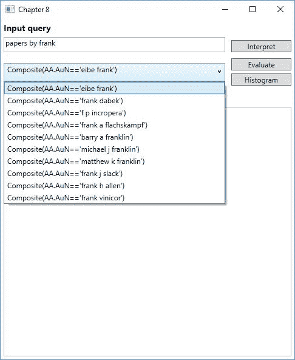

不成功的调用将产生一个错误响应代码。可以生成的响应代码如下:

| **响应代码** | **描述** |
| `400` | 错误的参数，缺少请求参数 |
| `401` | 无效的订阅密钥 |
| `403` | 已超过呼叫量配额 |
| `404` | 找不到请求的资源 |
| `500` | 内部服务器错误 |


# 从查询表达式中发现学术实体

现在我们有了一个可用的查询表达式，我们可以使用 **Evaluate** 端点检索一组学术实体。这是一个`GET`请求，我们需要为每个实体指定我们想要返回的属性。我们将在后面介绍可用的属性。

我们首先创建一个查询字符串:

```
    private async void Evaluate(object obj)
    { 
        string queryString = $"expr={QueryExpression} & 
        attributes=Id,Ti,Y,D,CC,AA.AuN"; 

        //queryString += "&model=latest"; 
        //queryString += "&count=10"; 
        //queryString += "&offset=0";5 
        //queryString += "&orderby=name:asc"; 
```

下表描述了我们可以添加的参数:

| **参数** | **描述** |
| `expr`(必填) | 在解释调用中找到的查询表达式。 |
| `attributes`(可选) | 要包含在响应中的逗号分隔的属性列表。每个属性都区分大小写。 |
| `model`(可选) | 您希望用于查询的模型。默认为*最新的*。 |
| `count`(可选) | 要返回的实体数。 |
| `offset`(可选) | 要返回的第一个结果的索引；对于分页非常有用。 |
| `orderby`(可选) | 指定实体的排序顺序。 |

注意，虽然`attributes`参数是可选的，但是您应该指定您想要的属性。如果没有指定，则只返回实体 ID。

我们称 API 为:

```
      EvaluateResponse response = await _webRequest.MakeRequest<object, 
      EvaluateResponse>(HttpMethod.Get, $"evaluate?{queryString}"); 

    if (response == null || response.entities.Length == 0) 
        return; 
```

由于这是一个`GET`请求，我们不需要任何请求体。调用成功后，我们期望返回一个`EvaluateResponse`对象。这是一个数据协定，将从 JSON 响应中反序列化。

成功的响应将给出如下的 JSON 响应(取决于指定的属性):

```
    { 
        "expr": "Composite(AA.AuN=='jaime teevan')", 
        "entities": [ 
        { 
            "prob": 2.266e-007, 
            "Ti": "personalizing search via automated analysis of interests and  
            activities", 
            "Y": 2005, 
            "CC": 372, 
            "AA": [ 
            { 
                "AuN": "jaime teevan", 
                "AuId": 1968481722 
            }, 
            { 
                "AuN": "susan t dumais", 
                "AuId": 676500258 
            }, 
            { 
                "AuN": "eric horvitz", 
                "AuId": 1470530979 
            }] 
        }] 
    } 
```

响应包含我们使用的查询表达式。它还包含一组实体。这个数组中的每一项都包含它正确的概率。它还将包含我们指定的所有属性，以字符串或数值的形式。它也可以是对象的形式，我们需要有数据契约。

对于我们的请求，我们指定了一些属性。这些是实体 ID、标题、出版年份和日期、引用计数和作者姓名。知道这一点后，我们可以执行以下操作来输出结果:

```
    StringBuilder sb = new StringBuilder();  
    sb.AppendFormat("Expression {0} returned {1} entities\n\n", response.expr,     
    response.entities.Length); 

    foreach (Entity entity in response.entities) 
    { 
        sb.AppendFormat("Paper title: {0}\n\tDate: {1}\n", entity.Ti, entity.D); 

        sb.Append("Authors:\n"); 
        foreach (AA author in entity.AA) 
        { 
            sb.AppendFormat("\t{0}\n", author.AuN); 
        } 

        sb.Append("\n"); 
    }  
    Results = sb.ToString(); 
```

成功的调用会产生以下输出:

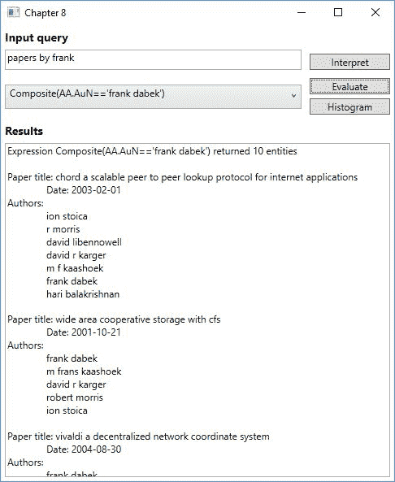

如前所述，任何错误响应都会产生响应代码。


# 计算学术实体的属性分布

学术 API 的另一个特性是可以为一组论文实体计算属性值的分布。这可以通过调用`calchistogram` API 端点来完成。

这是一个`GET`请求，所以我们首先创建一个查询字符串:

```
    string queryString = $"expr={QueryExpression}&attributes=Y,F.FN"; 

    //queryString += "&model=latest"; 
    //queryString += "&count=10"; 
    //queryString += "&offset=0"; 
```

我们可以指定的参数与`Evaluate`相同，只是我们没有`orderby`参数。对于这个调用，我们希望获得出版年份(`Y`)和研究领域名称(`F.FN`)。

我们调用 API，不指定任何请求体:

```
    HistogramResponse response = await _webRequest.MakeRequest<object,  
    HistogramResponse>(HttpMethod.Get, $"calchistogram?{queryString}"); 

    if (response == null || response.histograms.Length == 0) 
        return; 
```

如果调用成功，我们期望返回一个`HistogramResponse`对象。这是一个数据契约，它应该包含来自 JSON 响应的数据。

成功的请求应该给出以下 JSON 响应(取决于请求的属性):

```
    { 
        "expr": "And(Composite(AA.AuN=='jaime teevan'),Y>2012)", 
        "num_entities": 37, 
        "histograms": [ 
        { 
            "attribute": "Y", 
            "distinct_values": 3, 
            "total_count": 37, 
            "histogram": [ 
            { 
                "value": 2014, 
                "prob": 1.275e-07, 
                "count": 15 
            }, 
            {    
                "value": 2013, 
                "prob": 1.184e-07, 
                "count": 12 
            }, 
            {   
                "value": 2015, 
                "prob": 8.279e-08, 
                "count": 10 
            }] 
        }, 
        { 
            "attribute": "F.FN", 
            "distinct_values": 34, 
            "total_count": 53, 
            "histogram": [ 
            { 
                "value": "crowdsourcing", 
                "prob": 7.218e-08, 
            "count": 9 
        }, 
        { 
            "value": "information retrieval", 
            "prob": 4.082e-08, 
            "count": 4 
        }, 
        { 
            "value": "personalization", 
            "prob": 2.384e-08, 
            "count": 3 
        }, 
        { 
            "value": "mobile search", 
            "prob": 2.119e-08, 
            "count": 2 
        }] 
    }]  
} 
```

响应包含我们使用的原始查询表达式。它将为我们提供匹配实体的数量。还显示了直方图阵列。这将包含我们请求的每个属性的项目。下表描述了每个项目的数据:

| **数据字段** | **描述** |
| `attribute` | 属性名称。 |
| `distinct_values` | 与此属性的实体匹配的不同值的数量。 |
| `total_count` | 此属性的匹配实体中值实例的总数。 |
| `histogram` | 包含该属性直方图数据的数组。 |
| `histogram[x].value` | 当前直方图的值。 |
| `histogram[x].prob` | 实体与此属性值匹配的概率。 |
| `histogram[x].count` | 具有此值的匹配实体的数量。 |

有了成功的响应，我们遍历数据，在 UI 中显示它:

```
    StringBuilder sb = new StringBuilder(); 

    sb.AppendFormat("Totalt number of matching entities: {0}\n", 
    response.num_entities); 

    foreach (Histogram histogram in response.histograms) 
    { 
        sb.AppendFormat("Attribute: {0}\n", histogram.attribute); 
        foreach (HistogramY histogramY in histogram.histogram) 
        { 
            sb.AppendFormat("\tValue '{0}' was found {1} times\n", histogramY.value,
            histogramY.count); 
        } 

        sb.Append("\n"); 
    }  
    Results = sb.ToString(); 
```

一次成功的呼叫会给我们带来以下结果:

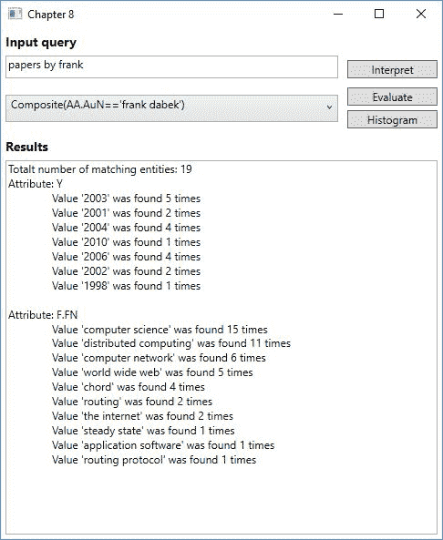

不成功的 API 调用将向我们提供一个错误，包含一个响应代码。这些与对`Interpret`特征的描述相同。


# 实体属性

这个 API 的一个相当重要的部分是属性的使用。您肯定希望从查询中获得一些数据，但不是全部。

我们看到了如何在每个请求中指定属性。下表描述了所有可用的属性。请确保请求中指定的所有属性大小写都正确:

| **属性** | **描述** |
| `Id` | 实体 ID |
| `Ti` | 论文标题 |
| `Y` | 纸质年度 |
| `D` | 纸质日期 |
| `CC` | 引用计数 |
| `ECC` | 估计引用计数 |
| `AA.AuN` | 作者姓名 |
| `AA.AuId` | 作者 ID |
| `AA.AfN` | 作者单位名称 |
| `AA.AfId` | 作者联系 ID |
| `F.FN` | 研究领域的名称 |
| `F.Fid` | 研究领域 ID |
| `J.JN` | 日志名称 |
| `J.JId` | 日记帐 ID |
| `C.CN` | 会议系列名称 |
| `C.Cid` | 会议系列 ID |
| `Rid` | 参考 ID |
| `W` | 用于全文搜索的论文标题/摘要中的单词 |
| `E` | 扩展元数据 |

下表描述了扩展元数据:

| **属性** | **描述** |
| `DN` | 纸张的显示名称 |
| `D` | 描述 |
| `S` | 来源(论文的网络来源，按静态排名排序) |
| `S.Ty` | 来源类型(HTML/Text/PDF/DOC/PPT/XLS/PS) |
| `S.U` | 源 URL |
| `VFN` | 地点全称——期刊或会议的全称 |
| `VSN` | 会场简称-期刊或会议的简称 |
| `V` | 日志卷 |
| `I` | 期刊发行 |
| `FP` | 论文的第一页 |
| `LP` | 论文的最后一页 |
| `DOI` | 数字对象标识符 |


# 使用知识探索服务创建后端

在某种程度上，知识探索服务是学术 API 的后台。它允许我们从结构化数据中构建压缩索引，编写语法来解释自然语言。

要开始使用 KES，我们需要在本地安装服务。

要下载 https://www.microsoft.com/en-us/download/details.aspx?的 KES 安装程序，请访问[id=51488](https://www.microsoft.com/en-us/download/details.aspx?id=51488) 。

随着安装而来的是一些示例数据，我们将使用这些数据。

拥有工作服务所需的步骤如下:

1.  定义一个模式。
2.  生成数据。
3.  建立索引。
4.  作者语法。
5.  编译语法。
6.  主机服务。


# 定义属性

模式文件定义了我们领域中的属性结构。当我们之前讨论学术 API 时，我们看到了不同实体属性的列表，我们可以通过查询检索这些属性。这是在模式中定义的。

如果您在安装 KES 的文件夹`Example`中打开文件`Academic.schema`，您会看到定义的属性。我们有标题、年份和关键字，这些都是基本的属性类型。此外，我们有一个`Composite`属性，用于作者。该属性包含更多与作者相关的属性。

每个属性将支持所有的属性操作。可能有不希望这样的情况。显式定义给定属性的操作可以减小索引大小。对于作者 ID，我们只想能够检查它是否等于某个值，这可以通过添加以下内容来实现:

```
    {"name":"Author.Id", "type":"Int32", "operations":["equals"]} 
```


# 添加数据

定义了模式后，我们可以添加一些数据。这个例子包含一个名为`Academic.data`的文件，它保存了所有的例子数据。打开文件以研究数据的外观。

数据文件中的每一行都指定了对象的属性值。它还可以包含一个`logprob`值，该值将指示匹配对象的返回顺序。


# 构建索引

有了属性模式和数据文件，我们就可以构建压缩的二进制索引了。这将保存我们所有的数据对象。

使用我们的示例文件，我们可以通过运行以下命令来构建索引:

```
kes.exe build_index Academic.schema Academic.data Academic.index
```

成功的执行应该会产生文件`Academic.index`，我们将在托管服务时使用它。

运行该命令时，应用程序将持续输出状态，如下所示:

```
    00:00:00 Input Schema: \Programs\KES\Example\Academic.schema
    00:00:00 Input Data: \Programs\KES\Example\Academic.data
    00:00:00 Output Index: \Programs\KES\Example\Academic.index
    00:00:00 Loading synonym file: Keyword.syn
    00:00:00 Loaded 3700 synonyms (9.4 ms)
    00:00:00 Pass 1 started
    00:00:00 Total number of entities: 1000
    00:00:00 Sorting entities
    00:00:00 Pass 1 finished (14.5 ms)
    00:00:00 Pass 2 started
    00:00:00 Pass 2 finished (13.3 ms)
    00:00:00 Processed attribute Title (20.0 ms)
    00:00:00 Processed attribute Year (0.3 ms)
    00:00:00 Processed attribute Author.Id (0.5 ms)
    00:00:00 Processed attribute Author.Name (10.7 ms)
    00:00:00 Processed attribute Author.Affiliation (2.3 ms)
    00:00:00 Processed attribute Keyword (20.6 ms)
    00:00:00 Pass 3 started
    00:00:00 Pass 3 finished (15.5 ms, 73 page faults)
    00:00:00 Post-processing started
    00:00:00 Optimized attribute Title (0.1 ms)
    00:00:00 Optimized attribute Year (0.0 ms)
    00:00:00 Optimized attribute Author.Id (0.0 ms)
    00:00:00 Optimized attribute Author.Name (0.5 ms)
    00:00:00 Optimized attribute Author.Affiliation (0.2 ms)
    00:00:00 Optimized attribute Keyword (0.6 ms)
    00:00:00 Global optimization
    00:00:00 Post-processing finished (17.2 ms)
    00:00:00 Finalizing index
    00:00:00 Total time: 157.6 ms
    00:00:00 Peak memory usage: 23 MB (commit) + 0 MB (data file) = 23 MB
```


# 理解自然语言

在我们建立了一个索引之后，我们可以开始创建我们的语法文件。这指定了服务可以理解什么样的自然语言，以及它们如何翻译成语义查询表达式。打开`academic.xml`文件来看看一个语法文件的例子。

这种语法是基于 W3C 的语音识别标准，叫做 SRGS。顶层元素是语法元素。这需要一个属性`root`来指定根规则，这是语法的起点。

为了允许属性引用，我们添加了`import`元素。这需要是`grammar`元素的子元素，并且应该放在其他元素之前。它包含两个必需的属性，一个是要导入的模式文件的名称，另一个是元素可以用来引用模式的名称。注意，模式文件必须与语法文件在同一个文件夹中。

接下来是`rule`元素。这定义了一个结构单元，它指定了服务可以解释什么样的查询表达式。一个`rule`元素需要一个`id`属性。可选地，您可以添加一个`example`元素，用于描述规则元素可能接受的短语。在这种情况下，这将是规则的子元素。

一个`rule`元素还包含一个`item`元素。这将一系列语法结构组合在一起，可以用来表示该序列的重复。或者，它可以用于指定替代项，以及其中一个元素。

One-of 元素指定其中一个 item 元素之间的扩展。由编写的项目*可以定义为一个元素，由*编写的*和由*创作的*作为扩展。*

使用`ruleref`元素允许我们通过使用更简单的规则来创建更复杂的表达式。它只是通过添加一个 URI 属性来引用其他规则。

`attrref`元素引用了一个`index`属性，这允许我们匹配索引中的属性。属性 URI 是必需的，它必须指定要引用的索引模式和属性名。这必须与通过`import`元素导入的模式相匹配。

标签元素定义了语法中的路径。这个元素允许你分配变量或者执行函数来帮助语法的流动。

一旦语法文件完成，我们就可以把它编译成二进制语法。这是通过运行以下命令完成的:

```
kes.exe build_grammar Academic.xml Academic.grammar
```

运行此命令将产生类似如下的输出:

```
Input XML: \Programs\KES\Example\Academic.xml
Output Grammar: \Programs\KES\Example\Academic.grammar
```


# 本地托管和测试

有了索引和语法，我们可以继续在本地测试服务。本地测试服务允许快速原型化，这允许我们快速定义方案和语法。

当我们在本地进行测试时，KES 只支持 10，000 个对象，每秒 10 个请求。它还会在总共执行了 1，000 个请求后终止。我们稍后将看到如何绕过这些限制。

要在本地托管 KES，请运行以下命令:

```
Kes.exe host_service Academic.grammar Academic.index -port 8080
```

这将启动服务，在端口`8080`上运行。要验证它是否按预期工作，请打开浏览器并转到`http://localhost:8080`。

这样做应该会出现以下屏幕:

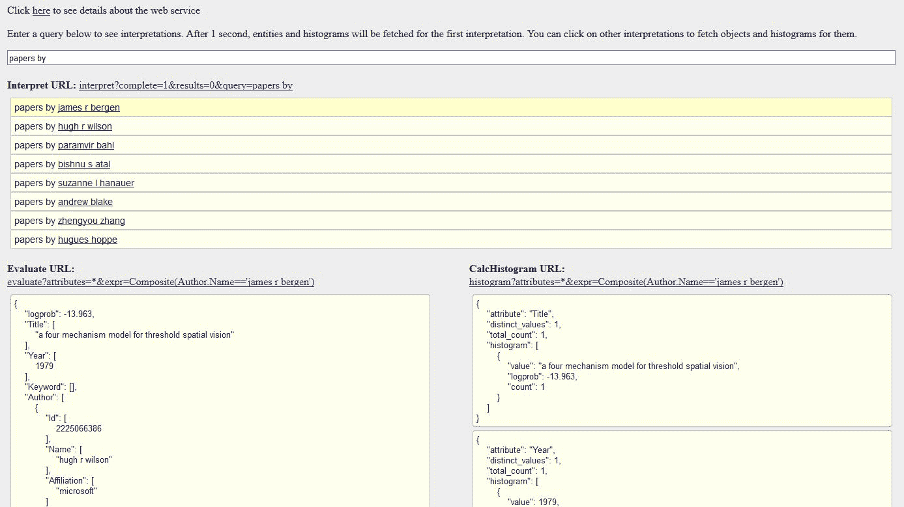

将 KES 作为本地服务运行还允许我们使用学术 API 进行测试。为了支持这一点，我们将对为学术 API 创建的示例应用程序进行一些修改。

首先，我们要修改`WebRequest.cs`文件。我们需要确保我们可以改变端点，所以将下面的函数添加到类中:

```
    public void SetEndpoint(string uri) { 
        _endpoint = uri; 
    } 
```

接下来，我们需要向`MainView.xaml`文件添加一个新的`TextBox`元素。这将允许我们输入一个 URL。这需要在`MainViewModel.cs`文件中有一个对应的字符串属性。当改变这个属性时，我们需要在`_webRequest`对象上调用`SetEndpoint`。这可能如下所示:

```
    private string _endpoint; 
    public string Endpoint { 
        get { return _endpoint; } 
        set { 
            _endpoint = value; 
            RaisePropertyChangedEvent("Endpoint"); 
            _webRequest?.SetEndpoint(value); 
        } 
    } 
```

最后，我们需要更新我们的`ViewModel`的构造函数。将第一行改为:

```
    Endpoint = "https://api.projectoxford.ai/academic/v1.0/"; 
    _webRequest = new WebRequest(Endpoint, "API_KEY_HERE"); 
```

这将使默认端点成为原始 API 地址，但允许我们使用应用程序在本地测试 KES。

通过使用本地端点测试应用程序，可以产生以下结果:

注意`evaluate`和`calchistogram`需要更新测试应用程序请求中的属性，以便与本地 KES 一起工作:

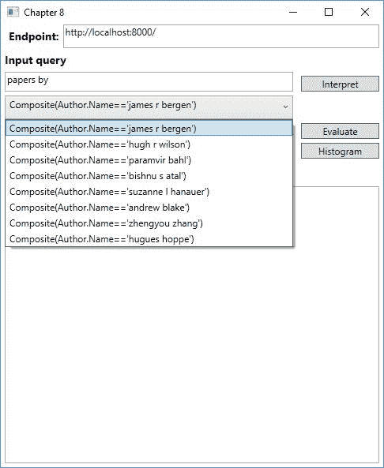

# 追求规模

虽然能够创建本地原型很好，但是这些限制确保我们需要将服务部署到其他地方进行生产。在这种情况下，这意味着将 KES 部署到微软 Azure。

我们将研究将 KES 部署到微软 Azure 所需的步骤。


# 连接到 Microsoft Azure

第一步是下载 **Azure 发布设置**文件。这需要保存为`AzurePublishSettings.xml`并存储在`kes.exe`运行的目录中。

你可以在 https://manage.windowsazure.com/publishsettings/[找到 Azure 发布设置文件。](https://manage.windowsazure.com/publishsettings/)

有两种方法可以无限制地建设和托管 KES。第一种方法是在 Azure 中启动一个 **Windows 虚拟机**。在这个虚拟机上，您将按照我们在本地完成的步骤进行操作。这允许快速原型制作，但是没有任何限制。

第二种方法是在本地运行`kes.exe`，但是添加`--remote`作为参数。这将创建一个临时 Azure VM，构建索引，并将索引上传到指定的目标 blob 存储。命令示例如下所示:

```
kes.exe build_index

http://<account>.blob.core.windows.net/<container>/Academic.schema http://<account>.blob.core.windows.net/<container>/Academic.full.data  http://<account>.blob.core.windows.net/<container>/Academic.full.index 

--remote Large
```

这个过程可能需要 5-10 分钟，所以理想情况下，原型应该在本地完成，或者通过 Azure VM 完成。


# 部署服务

语法和索引就绪，原型制作完成，我们就可以将服务部署到 Microsoft Azure 云服务。

要了解如何创建微软 Azure 云服务，请访问[https://Azure . Microsoft . com/en-us/documentation/articles/Cloud-services-how-to-create-deploy/](https://azure.microsoft.com/en-us/documentation/articles/cloud-services-how-to-create-deploy/)。

要将服务部署到临时插槽，请运行以下命令:

```
kes.exe deploy_service

http://<account>.blob.core.windows.net/<container>/Academic.grammar
http://<account>.blob.core.windows.net/<container>/Academic.index

<serviceName> large --slot Staging
```

这将允许我们在将服务部署到生产插槽之前执行基本测试。当测试完成后，我们可以通过再次运行相同的命令，将`Production`指定为最后一个参数，将其部署到生产环境中。

当服务被部署后，我们可以通过在浏览器中访问`http://<serviceName>.cloudapp.net`来测试它。


# 使用 QnA Maker 回答常见问题

QnA Maker 允许我们使用现有的**常见问题** ( **FAQ** )来创建一个回答这些问题的机器人。我们可以从现有的 FAQ 生成一个知识库，并从中训练一个模型。

首先，请访问 [https://qnamaker.ai](https://qnamaker.ai) 。通过单击右上角的登录来登录或注册。这将向您显示以下屏幕:

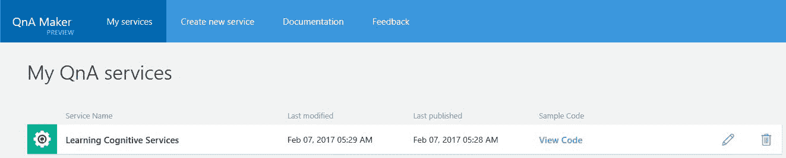

如果尚未创建任何服务，列表将为空。


# 根据常见问题创建知识库

如果尚未创建任何服务，我们可以通过单击“创建新服务”选项卡来创建一个服务。这将为我们呈现以下屏幕:

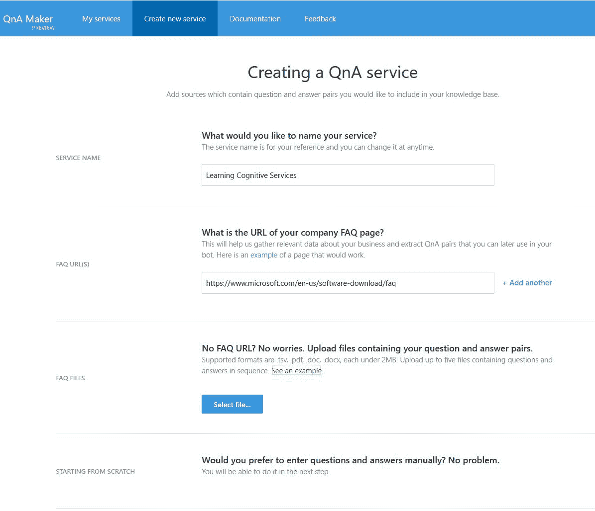

1.  输入服务的名称。
2.  输入要使用的基准常见问题。这可以是一个或多个 URL 的形式，也可以是包含问题和答案对的文件。对于我们的例子，我们将从 URL 生成一个知识库。

3.  让其余设置成为默认设置。
4.  单击创建。

如果你没有任何 FAQ 可以使用，你可以使用以下来自微软的:
[https://www.microsoft.com/en-us/software-download/faq](https://www.microsoft.com/en-us/software-download/faq)

创建知识库后，您将进入一个包含所有问题和答案对的页面。如下图所示:

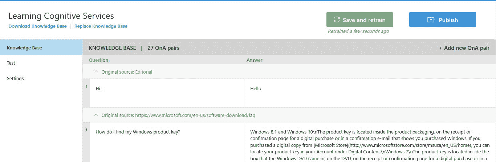

在这个页面上，我们可以浏览所有常见问题来源中的所有问题和答案对。我们还可以通过单击“添加新 QnA 对”来添加新对。

选择任何给定的问题都会在问题的右上角显示一个上下文菜单。这个上下文菜单让我们可以选择添加替代短语，或者完全删除这两个短语。如果一个问题可以用多种方式提问，这可能很有用。如下图所示:

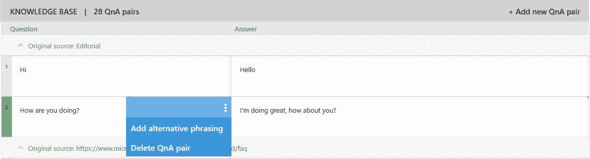

# 训练模型

每次我们对知识库进行更改时，单击保存并重新培训是明智的。这将确保我们的模型是最新的，具有最新的问题和答案对。

一旦我们重新训练了模型，我们就可以测试它。这可以通过转到左侧的测试选项卡来完成。这将向我们显示以下聊天窗口:

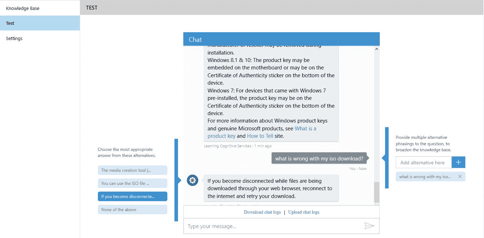

从这个聊天对话框中，我们可以测试我们的一些或所有问题，以验证我们得到了正确的答案。我们还可以通过不同的方式提问来改进模型。在某些情况下，这会给我们提供错误的答案。

如果我们得到了错误的答案，我们可以通过选择正确的来改变它。对于任何给定的问题，可能的答案将按概率排列在聊天窗口的左侧。选择正确的答案，并重新训练模型将确保以后问同样的问题时有正确的答案。


# 发布模型

一旦我们完成培训，就该发布服务了。我们可以通过点击右上角的发布来实现。这将为我们呈现以下屏幕:

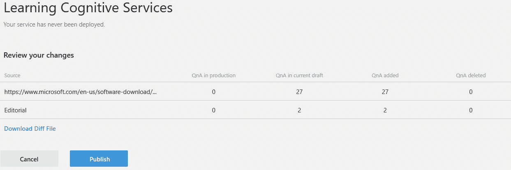

这告诉我们添加和/或删除了多少问答对。它还告诉我们有多少已经在生产中，以及我们是否已经出版了它们。这对于确保我们不会删除太多内容或导致服务中断非常有用。如果需要，我们可以下载一个文件来清楚地看到变化。

一旦我们对更改感到满意，我们就单击发布。这样做将为我们提供一个可以尝试的基本 HTTP 请求，如下面的屏幕截图所示:

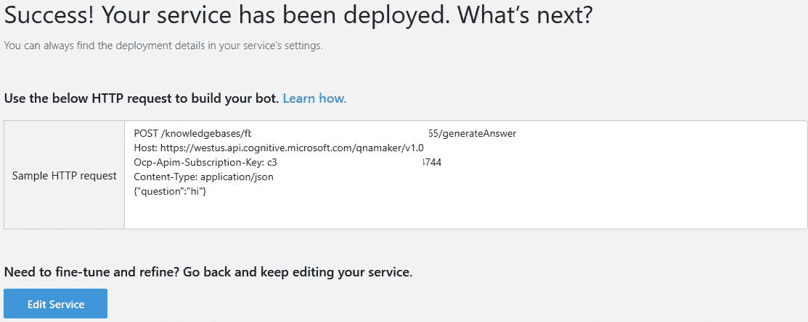

在前面的屏幕截图中，我们可以看到要使用的端点、所需的应用程序 ID、订阅密钥和请求正文中的一个示例问题。所有这些参数都是获得成功响应所必需的。

对服务的成功调用将为我们提供如下 JSON 响应:

```
{ "Answer": "Sample response", "Score": "0" } 
```

如果我们有一个应用程序使用这个，如果分数低于某个阈值，我们可以决定不使用答案。

通常，我们会使用不同种类的机器人来使用这项服务。例如，我们可以将它添加到 Skype 或 slackbot 中，或者简单地将其与客户支持网站上的聊天机器人集成。


# 改进模型

当模型发布后，向端点发出请求时，这些请求会被记录下来。这对于发现答案中的错误很有用。在 QnA Maker 网站的“聊天”窗口中，转到“测试”选项卡，我们可以下载聊天日志。这可以通过单击消息窗口正前面的下载聊天日志来完成。

如果我们上传这个文件，通过点击上传聊天记录，我们可以重放所有的问题。这使我们可以看到所有问题的答案，并纠正任何错误。聊天会自动找到被问问题的数量。上传聊天日志后，您可以使用出现的导航菜单在不同问题之间导航。

完成改进后，记得重新培训模型。


# 摘要

在本章中，我们学习了学术 API 和知识探索服务。我们研究了如何解释自然语言查询以获得用于评估的查询表达式。通过这一评估，我们从微软学术图表知识库中检索到了学术论文。从那里，我们学习了如何设置知识探索服务本身，从模式一直到将其部署到 Microsoft Azure 云服务。最后，我们学习了如何设置一个简单的 QnA Maker 服务。

在下一章，我们将进入搜索 API，学习如何利用 Bing 提供的不同搜索 API。