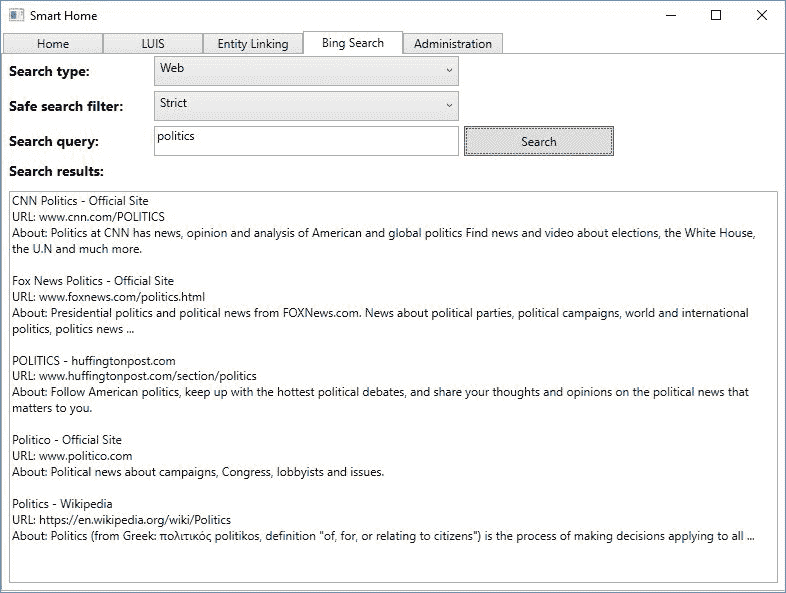
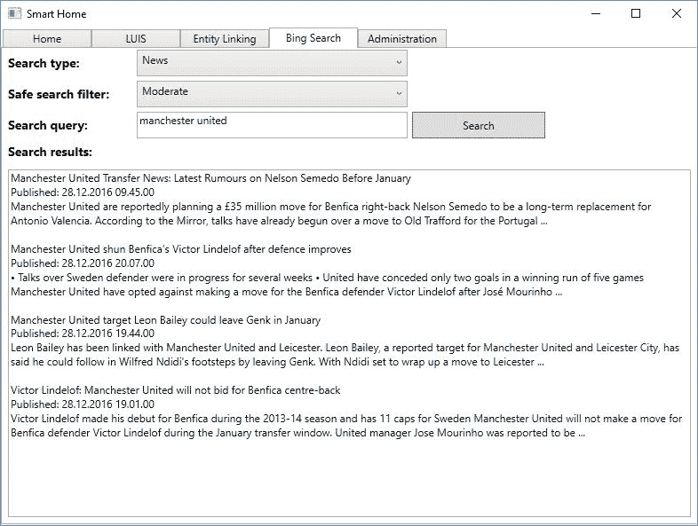
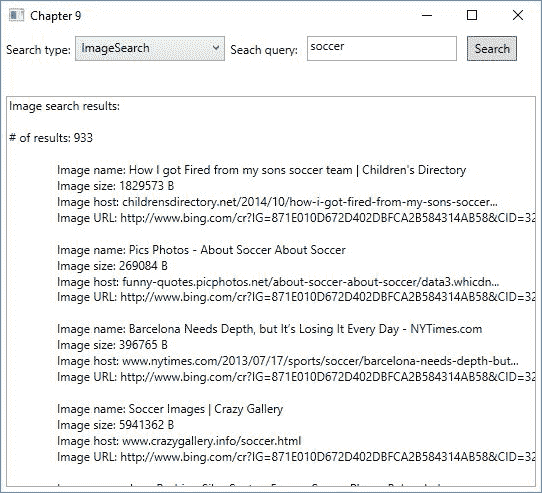
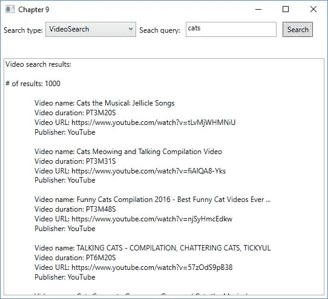

# 九、添加专业搜索

前一章探讨了学术论文和期刊的关系，学习了如何搜索学术论文。本章将带我们进入最后一个顶级 API，搜索。通过本章，我们将学习如何搜索网页内容。我们将看到如何搜索某些关键词或类别的最新新闻。接下来，我们将搜索图像和视频，并学习如何为最终用户自动建议搜索查询。

本章完成后，我们将会学到以下内容:

*   如何搜索网页和文档
*   如何搜索新闻文章
*   如何搜索图像和视频
*   如何在应用中添加自动建议
*   基于安全搜索策略过滤搜索结果


# 从智能家居应用中搜索网络

Bing 网络搜索 API 为我们提供了类似于我们在 http://bing.com/search 找到的搜索体验。它返回与任何查询相关的结果。

对这个 API 的任何请求的响应将包含网页、图像、视频和新闻文章。在典型的场景中，这是您将用于任何这些搜索的 API。

请注意，在实际场景中，所有请求都应该从服务器端应用发出，而不是像我们在示例中所做的那样，从客户端发出。

如果你还没有注册，请在 https://portal.azure.com 注册 Bing 网络搜索 API。你可以在[https://azure . Microsoft . com/en-us/services/cognitive-services/bing-we b-search-API/](https://azure.microsoft.com/en-us/services/cognitive-services/bing-web-search-api/)上阅读关于 API 的更多信息。


# 为网络搜索准备应用

在深入研究网络搜索所需的技术细节之前，我们将准备我们的智能房屋应用。

在`Views`文件夹中添加一个名为`BingSearchView.xaml`的新视图。至少，它应该包含两个`Combobox`元素，一个用于搜索类型，一个用于搜索过滤器。我们的搜索查询需要一个`TextBox`元素，以及一个`Button`元素来执行搜索。最后，我们需要一个`TextBox`元素来显示搜索结果。

为了配合搜索类型和搜索过滤器，我们在`Model`文件夹中添加了一个名为`BingSearchTypes.cs`的新文件。增加以下两条`enums`:

```
    public enum BingSearchType { 
        Web, News, NewsCategory 
    } 

    public enum SafeSearch { 
        Strict, Moderate, Off 
    } 
```

增加这个功能后，我们可以同时使用 Bing 网络搜索和 Bing 新闻搜索 API。后者将在后面讨论。第二个`enum``SafeSearch`，后面也会更详细的讨论。

我们需要一个新的视图模型。将名为`BingSearchViewModel.cs`的新文件添加到`ViewModels`文件夹中。在这里，我们需要为我们的搜索查询和搜索结果添加两个`string`属性。我们还需要一个类型为`BingSearchType`的属性来表示所选的搜索类型。还需要一个类型为`SafeSearch`的属性来表示所选择的安全搜索过滤器。我们的按钮需要一个`ICommand`属性。

此外，我们需要能够显示先前创建的`SafeSearch enums`的值。这可以通过添加以下属性来实现:

```
public IEnumerable<BingSearchType> AvailableSearchTypes  {  
    get {  
        return Enum.GetValues (typeof(BingSearchType)).Cast<BingSearchType>();  
    }  
} 

public IEnumerable<SafeSearch> SafeSearchFilter { 
    get {  
        return Enum.GetValues(typeof(SafeSearch)).Cast<SafeSearch>();  
    }  
} 
```

我们从每个`enum`中获取所有值，并将其作为`IEnumerable`返回。

在撰写本文时，没有一个搜索 API 有任何 NuGet 客户端包，所以我们需要自己发出 web 请求。将我们在前面章节中使用的`WebRequest.cs`文件复制到`Model`文件夹中。将文件重命名为`BingWebRequest.cs`，将类重命名为`BingWebRequest`。

由于所有的 API 调用都是`GET`请求，我们可以稍微简化这个类。从构造函数中移除 URL 参数，并完全移除`_endpoint`成员。这样做允许我们简化`MakeRequest`功能，如下所示:

```
public async Task<TResponse> MakeRequest<TResponse>(string url) { 
    try { 
        var request = new HttpRequestMessage(HttpMethod.Get, url); 

        HttpResponseMessage response = await _httpClient.SendAsync(request); 

        if (response.IsSuccessStatusCode) { 
            string responseContent = null; 

            if (response.Content != null) 
                responseContent = await response.Content.ReadAsStringAsync(); 

            if (!string.IsNullOrWhiteSpace(responseContent)) 
                return JsonConvert.DeserializeObject<TResponse> (responseContent, _settings); 

            return default(TResponse); 
        } 
```

我们不需要请求体，并且已经删除了`TRequest`和相应的代码。我们还对 HTTP 方法进行了硬编码，并说我们将在调用函数时指定完整的 URL 端点。其余的功能应该保持不变。

记得添加对`System.Web`和`System.Runtime.Serialization`的引用。

有了这些，我们就可以继续了。在继续之前，请确保代码已编译并执行。


# 搜索网页

为了能够使用 Bing 网络搜索，我们创建了一个新的类。将名为`BingSearch.cs`的新文件添加到`Models`文件夹中。

我们添加了一个类型为`BingWebRequest`的成员，它是在构造函数中创建的:

```
    private BingWebRequest _webRequest; 

    public BingSearch() { 
        _webRequest = new BingWebRequest("API_KEY_HERE"); 
    } 
```

创建一个名为`SearchWeb`的新函数。这应该接受两个参数，一个用于搜索查询的字符串和一个`SafeSearch`参数。该函数应标记为`async`并返回一个`Task<WebSearchResponse>`。`WebSearchResponse`是一种数据契约，我们稍后将详细了解:

```
public async Task<WebSearchResponse> SearchWeb(string query, SafeSearch safeSearch) 
{ 
    string endpoint = string.Format("{0}{1}&safeSearch={2} &count=5&mkt=en-US",
    "https://api.cognitive.microsoft.com/bing/v5.0/search?q=", query, safeSearch.ToString()); 
```

首先，我们构造端点，它将我们指向 web 搜索服务。我们确保指定了查询、`q`、选择和市场、`mkt`。后两者将在本章后面讨论。

唯一需要的参数是查询字符串。长度不应超过 1，500 个字符。下表描述了其他可选参数:

| **参数** | **描述** |
| `responseFilter` | **以逗号分隔的**包含在响应中的结果类型列表。如果未指定，结果将包含所有类型。合法值包括`Computation`、`Images`、`News`、`RelatedSearches`、`SpellSuggestions`、`TimeZone`、`Videos`、`WebPages`。 |
| `setLang` | 双字母语言代码，用于指定用户界面字符串的语言。 |
| `textDecorations` | 指定查询词是否在结果中突出显示。默认为 false。 |
| `textFormat` | 应用于显示字符串的格式类型。可以是 raw 或 HTML，默认为 Raw。 |

还有几个参数。然而，它们对于所有的搜索都是通用的，将在本章的最后讨论。

有了终点，我们可以继续前进:

有了新构造的端点，我们在`_webRequest`对象上调用`MakeRequest`。我们将 API 键和端点指定为该调用的参数，并期望一个`WebSearchResponse`对象作为响应。

```
    try { 
        WebSearchResponse response = await _webRequest.MakeRequest<WebSearchResponse>(endpoint); 

        return response; 
    } 
    catch (Exception ex) { 
        Debug.WriteLine(ex.Message); 
    } 

    return null; 
```

`WebSearchResponse`是一个数据契约，我们通过反序列化来自 API 服务的 JSON 响应得到它。顶级对象将包含具有不同结果类型的对象。在提供的代码样本中，在名为`BingSearchResponse.cs`的文件中，寻找一个完整的数据契约。

关于 Bing 网络搜索的响应对象的完整列表，请访问[https://msdn . Microsoft . com/en-us/library/dn 760794 . aspx # Search response](https://msdn.microsoft.com/en-us/library/dn760794.aspx#searchresponse)。

回到`BingSearchViewModel.cs`文件，我们可以添加`BingSearch`作为成员。让构造函数看起来如下:

如果我们在搜索查询文本字段中输入了任何文本，那么`CanSearch`参数应该返回 true。`Search`现在应该是这样的:

```
    public BingSearchViewModel() { 
        _bingSearch = new BingSearch();  
        SearchCommand = new DelegateCommand(Search, CanSearch); 
    } 
```

我们在`_bingSearch`对象上调用`SearchWeb`函数，将`SearchQuery`和`SelectedSafeSearchFilter`属性作为参数传递。有了成功的响应，我们将响应发送给一个新函数，`ParseWebSearch`:

```
    private async void Search(object obj) { 
        switch (SelectedSearchType) {  
            case BingSearchType.Web: 
                var webResponse = await _bingSearch.SearchWeb(SearchQuery, SelectedSafeSearchFilter); 
                ParseWebSearchResponse(webResponse as WebSearchResponse); 
                break; 
            default: 
                break; 
        } 
    } 
```

当我们解释网络搜索的结果时，我们对结果感兴趣。对于每个 web 页面，我们希望输出名称、显示 URL 和描述性片段。

```
private void ParseWebSearchResponse(WebSearchResponse webSearchResponse) { 
    StringBuilder sb = new StringBuilder(); 

    Webpages webPages = webSearchResponse.webPages; 

    foreach (WebValue website in webPages.value) 
    { 
        sb.AppendFormat("{0}\n", website.name); 
        sb.AppendFormat("URL: {0}\n", website.displayUrl); 
        sb.AppendFormat("About: {0}\n\n", website.snippet); 
    } 

    SearchResults = sb.ToString(); 
} 
```

web 搜索的成功测试应该会向我们呈现以下结果:

网络搜索的结果对象包含一个`RankingResponse`对象。这将确定结果通常如何显示在搜索网站上，在主线和侧边栏中排序。在生产系统中，您应该始终致力于按照`RankingResponse`指定的顺序显示结果。



这可以通过两种方式实现。一种是使用指定的 ID 字段对所有结果进行排序。另一种方式稍微复杂一点。它包括根据答案类型和结果索引分割结果。

除了我们到目前为止看到的查询，我们还可以查询计算(例如，2 + 2)、时区计算和相关搜索。这些查询将产生 JSON 响应，与常规的 web 搜索略有不同。

获取新闻


# 使用 Bing 新闻搜索 API，我们可以通过多种方式搜索新闻。我们为此 API 使用了三个端点:

`/news`:根据类别获取热门新闻文章

*   `/news/search`:基于搜索查询获取新闻文章
*   `/news/trendingtopics`:获取热门新闻话题
*   在我们的智能房屋应用中，我们将添加前两个，而理论上我们将只涵盖最后一个。

如果你还没有这样做，请在[https://portal.azure.com](https://portal.azure.com)注册必应新闻搜索 API。

来自查询的新闻


# 基于查询的新闻搜索的许多基础工作已经在 web 搜索示例中完成。为了根据给定的查询搜索新闻，我们需要在`BingSearch`类中添加一个新函数。

打开`BingSearch.cs`文件，添加一个名为`SearchNews`的新函数。这应该接受一个`string`和一个`SafeSearch`参数。该函数应标记为`async`，并返回一个`Task<BingNewsResponse>`对象:

我们构建一个端点，由 URL、搜索查询和`safeSearch`参数组成。注意我们如何指定市场，`mkt`，以及将`count`限制为 5。这两个参数将在本章后面介绍。

```
public async Task<BingNewsResponse> SearchNews(string query, SafeSearch safeSearch) 
{ 
    string endpoint = string.Format("{0}{1}&safeSearch={2}&count=5&mkt=en-US",
    "https://api.cognitive.microsoft.com/bing/v5.0/news/search?q=", query,
    safeSearch.ToString()); 
```

唯一需要的参数是查询字符串`q`。除了为网络搜索描述的参数(`setLang`、`textDecorations`和`textFormat`，我们还可以指定一个名为`originalImg`的参数。这是一个布尔值，如果设置为 true，将提供原始图像的 URL(针对文章中的任何图像)。如果默认设置为 false，则提供缩略图的 URL。

有了端点，我们可以调用 API:

我们在`_webRequest`对象上调用`MakeRequest`，将端点作为参数传递。

```
    try { 
        BingNewsResponse response = await _webRequest.MakeRequest<BingNewsResponse>(endpoint); 

        return response; 
    } 

    catch (Exception ex) { 
        Debug.WriteLine(ex.Message); 
    } 

    return null; 
```

一个成功的调用将产生一个 JSON 响应，我们将其反序列化为一个`BingNewsResponse`对象。此对象需要创建为数据协定。

对象将包含一组新闻文章。这个数组中的每一项都包含文章名称、URL、图片、描述、发布日期等等。

有关新闻文章阵列中每个项目的完整详细信息，请访问[https://msdn . Microsoft . com/en-us/library/dn 760793 . aspx # news article](https://msdn.microsoft.com/en-us/library/dn760793.aspx#newsarticle)。

准备就绪后，我们可以返回到`BingSearchViewModel.cs`文件并修改`Search`函数。为此，我们在`switch`语句中添加了一个`BingSearchType.News`案例:

成功的响应将被解析并显示在 UI 中:

```
    case BingSearchType.News: 
        var newsResponse = await _bingSearch.SearchNews(SearchQuery, SelectedSafeSearchFilter); 
        ParseNewsResponse(newsResponse as BingNewsResponse); 
        break; 
```

我们最感兴趣的是新闻文章的名称、发表日期和描述。

```
private void ParseNewsResponse(BingNewsResponse bingNewsResponse) { 
    StringBuilder sb = new StringBuilder(); 

    foreach(Value news in bingNewsResponse.value) {  
        sb.AppendFormat("{0}\n", news.name); 
        sb.AppendFormat("Published: {0}\n", news.datePublished); 
        sb.AppendFormat("{0}\n\n", news.description); 
    } 

    SearchResults = sb.ToString(); 
} 
```

对此进行一次良好的测试应该会给我们带来以下结果:

来自类别的新闻



# 当我们想获得某些类别的热门文章时，我们会经历一个与常规新闻查询类似的过程。区别在于我们构造的端点。

让我们在`BingSearch`类中创建一个新函数`SearchNewsCategory`:

Let us create a new function, `SearchNewsCategory`, in the `BingSearch` class:

```
public async Task<BingNewsResponse> SearchNewsCategory(string query) 
{ 
    string endpoint = string.Format("{0}{1}&mkt=en-US", "https://api.cognitive.microsoft.com/bing/v5.0/news?category=", query); 
```

这里我们有一个 category 参数，带有我们希望搜索的主题。这是一个可选参数。如果它是空的，我们将获得所有类别的头条新闻。

对于这个搜索，我们可以指定两个不同的市场，`en-GB`和`en-US`。其中每一个都附带了一个当前支持的预定义类别列表:

有关受支持类别的完整列表，请访问[https://msdn . Microsoft . com/en-us/library/dn 760793 . aspx # categories by market](https://msdn.microsoft.com/en-us/library/dn760793.aspx#categoriesbymarket)。

有了新构造的端点，我们在`_webRequest`对象上调用`MakeRequest`。这将产生与常规新闻查询相同的响应对象。在我们的视图模型中，我们在`Search`函数中为这个搜索类型添加了一个`case`。有了响应，我们利用已经创建的`ParseNewsResponse`来获得我们想要的数据。

```
    try { 
        BingNewsResponse response = await _webRequest.MakeRequest<BingNewsResponse>(endpoint); 

        return response; 
    } 

    catch (Exception ex) { 
        Debug.WriteLine(ex.Message); 
    } 

    return null; 
```

趋势新闻


# 趋势新闻搜索仅适用于`en-US`和`zh-CN`市场。要执行此搜索，请向以下 URL 发出请求:[https://API . cognitive . Microsoft . com/bing/v 5.0/news/trending topics](https://api.cognitive.microsoft.com/bing/v5.0/news/trendingtopics)

这个调用不需要任何参数，但是您可以添加过滤器，比如我们稍后将讨论的常见过滤器。唯一的例外是`freshness`过滤器，它不适合这个请求。

对该端点的成功调用将产生一个`TrendingTopicAnswer`对象，其中包含一组趋势主题。该数组中的每一项都将包含以下数据:

**数据字段**

| **描述** | `image` |
| 相关图像的链接 | `isBreakingNews` |
| 一个布尔值，指示此主题是否被视为突发新闻 | `name` |
| 题目的标题 | `query` |
| 将返回此主题的查询字符串 | `webSearchUrl` |
| 此主题的 Bing 搜索结果的 URL | `webSearchUrlPingSuffix` |
| 用于识别`webSearchUrl`的查询字符串片段 | 搜索图像和视频 |


# Bing 图像搜索 API 和 Bing 视频搜索 API 允许我们直接搜索图像或视频。这些 API 应该只在您只需要图像或视频内容时使用。调用这些 API 可能会对性能和相关性产生负面影响，因此，应该使用 Bing Web 搜索 API。

如果你还没有注册，请在[https://portal.azure.com](https://portal.azure.com)注册必应图片搜索 API 和必应视频搜索 API。

使用通用用户界面


# 由于我们的智能房屋应用不需要图像或视频搜索，我们将继续创建一个新项目。使用在第 1 章、*微软认知服务入门*中创建的 MVVM 模板创建这个项目。

这些 API 没有附带任何客户端包。和以前一样，我们应该真正从服务器端应用进行这些调用，而不是客户端应用。在任何情况下，我们都需要将`BingWebRequest.cs`文件从智能房屋应用复制到`Model`文件夹。请确保更改名称空间。

记住添加对`System.Web`和`System.Runtime.Serialization`的引用。

我们将需要安装`Newtonsoft.Json` NuGet 包来使我们的反序列化工作。通过 NuGet 包管理器来实现。

因为我们将以文本形式输出一些结果，所以我们可以使用一个通用的用户界面。

打开`MainView.xaml`文件。添加两个`TextBox`元素，一个用于搜索查询，一个用于结果。我们需要一个`ComboBox`元素来选择搜索类型。最后，我们需要为我们的搜索命令添加一个`Button`元素。

在`MainViewModel.xaml`文件中，我们需要添加一个带有搜索类型的`enum`。在文件底部的类下添加以下内容:

我们只对带有查询的图像和视频搜索感兴趣。除了这些搜索表单，这两个 API 都可以搜索趋势图像/视频。Bing 视频搜索 API 还允许我们获得更多已经搜索过的视频的细节。

```
    public enum SearchType { 
        ImageSearch, 
        VideoSearch, 
    }   
```

在`MainViewModel`类中，我们需要添加两个对应于`TextBox`元素的`string`属性。我们还需要一个类型为`SearchType`的属性来指示所选择的搜索类型。为了表明我们有哪些可用的搜索类型，我们添加了一个`IEnumerable`属性，如下所示:

我们需要添加到视图模型的最后一个属性是`ICommand`属性，它将被绑定到我们的`Button`元素。

```
public IEnumerable<SearchType> SearchTypes { 
    get {  
        return Enum.GetValues(typeof(SearchType)).Cast<SearchType>(); 
    } 
} 
```

现在我们需要创建一个新类，所以在`Model`文件夹中创建一个名为`BingSearch.cs`的新文件。这将负责构造正确的端点并执行两种搜索类型。

我们需要添加一个类型为`BingWebRequest`的成员。这应该在构造函数中创建:

这就是我们目前在那里需要做的一切。

```
private BingWebRequest _webRequest; 

public BingSearch() { 
    _webRequest = new BingWebRequest("API_KEY_HERE"); 
} 
```

回到视图模型，我们需要添加一个类型为`BingSearch`的成员。有了这些，我们就可以创建我们的构造函数了:

有了 ViewModel，我们可以进行一些搜索。

```
public MainViewModel() { 
    _bingSearch = new BingSearch(); 

    SearchCommand = new DelegateCommand(Search); 

    SelectedSearchType = SearchTypes.FirstOrDefault(); 
} 
```

搜索图像


# 对于我们的例子，我们将只执行基于用户查询的图像搜索。为此，我们需要在`BingSearch`类中添加一个函数。调用函数`SearchImages`，让它接受一个字符串作为参数。该函数应返回`Task<ImageSearchResponse>`并标记为`async`。在这种情况下，`ImageSearchResponse`将是一个数据契约对象，从我们的响应中反序列化数据:

For our example, we will only be executing the image search based on user queries. To allow this, we will need to add a function in the `BingSearch` class. Call the function `SearchImages`, and let it accept a string as parameter. The function should return `Task<ImageSearchResponse>` and be marked as `async`. `ImageSearchResponse` will, in this case, be a data contract object, with data deserialized from our response:

```
public async Task<ImageSearchResponse> SearchImages(string query) 
{ 
    string endpoint = string.Format("{0}{1}",
    "https://api.cognitive.microsoft.com/bing/v5.0/images/search?q=", query); 
```

我们从构造端点开始。在这种情况下，我们只指定查询参数`q`。这是一个必需参数。

除了常见的查询参数(我们将在后面看到)之外，我们还可以添加以下参数:

**参数**

| **描述** | `cab` |
| 要裁剪的区域的底部坐标，取值范围为 0.0 到 1.0。从左上角开始测量。 | `cal` |
| 要裁剪的区域的左侧坐标，取值范围为 0.0 到 1.0。 | `car` |
| 要裁剪的区域的右坐标，取值范围为 0.0 到 1.0。 | `cat` |
| 要裁剪的区域的顶部坐标，取值范围为 0.0 到 1.0。 | `ct` |
| 要使用的作物类型。目前唯一合法的值是 0 -矩形。 | The crop type to use. Currently the only legal value is 0 - Rectangular. |

此外，我们可以指定以下参数作为过滤器:

**过滤器名称**

| **描述** | `aspect` |
| 按纵横比过滤图像。合法值为`Square`、`Wide`、`Tall`和`All`。 | `color` |
| 按特定颜色过滤图像。 | `imageContent` |
| 按图像内容过滤图像。合法值为`Face`和`Portrait`。 | `imageType` |
| 按图像类型过滤图像。合法值为`AnimatedGif`、`Clipart`、`Line`、`Photo`和`Shopping`。 | `license` |
| 按适用于图像的许可证过滤图像。合法值有`Public`、`Share`、`ShareCommercially`、`Modify`、`ModifyCommercially`和 All。 | `size` |
| 按大小过滤图像。合法值为`Small` ( < 200x200 像素)、`Medium` (200x200 到 500x500 像素)、`Large` ( > 500x500 像素)、`Wallpaper`和`All`。 | `height` |
| 仅获得特定高度的结果。 | `width` |
| 仅获得特定宽度的结果。 | Only get results with a specific width. |

有了端点，我们就可以执行请求了:

我们在`_webRequest`对象上调用`MakeRequest`，将端点作为参数传递。成功的调用将从 JSON 响应中产生一个`ImageSearchResponse`，它是反序列化的数据契约对象。

```
    try { 
       ImageSearchResponse response = await _webRequest.MakeRequest<ImageSearchResponse>(endpoint); 

        return response; 
    }  
    catch (Exception ex) { 
        Debug.WriteLine(ex.Message); 
    } 

    return null; 
```

结果对象将包含大量数据。在这些数据中有一个数组，它包含关于图像的信息。数组中的每一项都包含数据，比如图像名称、发布日期、URL 和图像 ID。

有关响应中可用数据的完整列表，请访问[https://msdn . Microsoft . com/en-us/library/dn 760791 . aspx # images](https://msdn.microsoft.com/en-us/library/dn760791.aspx#images)。

转到`MainViewModel.cs`，我们现在可以创建`Search`函数:

Heading over to `MainViewModel.cs`, we can now create the `Search` function:

```
    private async void Search(object obj) { 
        SearchResult = string.Empty; 

        switch(SelectedSearchType) { 
            case SearchType.ImageSearch: 
                var imageResponse = await _bingSearch.SearchImages(SearchQuery); 
                ParseImageResponse(imageResponse); 
                break; 
            default: 
                break; 
        } 
    } 
```

有了成功的响应，我们解析`imageResponse`。通常，这意味着在列表中显示图像或类似的内容，但是我们将采用更简单的方法输出文本信息:

我们打印出搜索中匹配的数量。然后我们遍历图像数组，打印每个图像的名称、大小、主机和 URL。

```
private void ParseImageResponse(ImageSearchResponse imageResponse) 
{ 
    StringBuilder sb = new StringBuilder(); 
    sb.Append("Image search results:\n\n"); 
    sb.AppendFormat("# of results: {0}\n\n", imageResponse.totalEstimatedMatches); 

    foreach (Value image in imageResponse.value) { 
        sb.AppendFormat("\tImage name: {0}\n\tImage size: {1}\n\tImage host: {2}\n\tImage URL:
        {3}\t\n\n", image.name, image.contentSize, image.hostPageDisplayUrl, image.contentUrl); 
    } 

    SearchResult = sb.ToString(); 
} 
```

一次成功的测试运行应该会向我们呈现以下屏幕:

除了基于查询的图像搜索，我们还可以搜索趋势图像。为此，您必须调用以下端点:[https://API . cognitive . Microsoft . com/bing/v 5.0/images/trending。](https://api.cognitive.microsoft.com/bing/v5.0/images/trending)



目前这仅适用于以下市场:`en-US`、`en-CA`和`en-AU`。对该端点的成功调用将产生一组类别。这个数组中的每个项目将包含一个趋势图像数组，以及类别的标题。

搜索视频


# 搜索视频和搜索图像差不多。唯一真正的区别是我们如何构造端点，以及我们得到的响应。

我们将在`BingSearch`类中添加一个新功能，以配合视频搜索:

如您所见，只有一个必需的参数，即查询字符串`q`。我们还可以指定一些可选参数，这些参数对于所有的搜索 API 都是通用的，我们将在后面进行描述。

```
public async Task<VideoSearchResponse> SearchVideos(string query) 
{ 
    string endpoint = string.Format("{0}{1}", "https://api.cognitive.microsoft.com/bing/v5.0/videos/search?q=", query); 
```

除了常见的过滤器，视频还可以基于以下过滤器过滤结果:

**滤镜**

| **描述** | `pricing` |
| 按价格过滤视频。合法的价值是免费的，付费的，和所有的。 | `resolution` |
| 按分辨率过滤。合法值为 480 便士、720 便士、1080 便士和全部。 | `videoLength` |
| 按长度过滤视频。合法值为`Short` ( < 5 分钟)、`Medium` (5 到 20 分钟)、`Long` ( > 20 分钟)、以及`All`。 | Filter videos by length. Legal values is `Short` (< 5 minutes), `Medium` (5 to 20 minutes), `Long` (> 20 minutes), and `All`. |

有了端点之后，我们称 API 为:

With the endpoint in place, we call the API:

```
try { 
   VideoSearchResponse response = await _webRequest.MakeRequest<VideoSearchResponse>(endpoint); 

    return response; 
} 

catch (Exception ex) { 
    Debug.WriteLine(ex.Message); 
} 

return null; 
```

我们在`_webRequest`对象上调用`MakeRequest`，将端点作为参数传递。成功的调用将产生一个`VideoSearchResponse`对象。这是一个数据契约，从 JSON 响应反序列化而来。

在其他数据中，它将包含一组视频。该数组中的每一项都包含视频名称、描述、发布者、持续时间、URL 等等。

有关搜索响应中可用数据的完整列表，请访问[https://msdn . Microsoft . com/en-US/library/dn 760795 . aspx # videos](https://msdn.microsoft.com/en-US/library/dn760795.aspx#videos)。

为了能够搜索视频，我们在`MainViewModel`的`Search`功能中添加了一个新案例:

我们调用新创建的`SearchVideos`，将搜索查询作为参数传递。如果呼叫成功，我们继续解析视频:

```
case SearchType.VideoSearch: 
  var videoResponse = await _bingSearch.SearchVideos(SearchQuery); 
  ParseVideoResponse(videoResponse); 
  break; 
```

We call the newly created `SearchVideos`, passing on the search query as a parameter. If the call succeeds, we go on to parse the video:

```
private void ParseVideoResponse(VideoSearchResponse videoResponse) 
{ 
    StringBuilder sb = new StringBuilder(); 
    sb.Append("Video search results:\n\n"); 
    sb.AppendFormat("# of results: {0}\n\n", 
    videoResponse.totalEstimatedMatches); 

    foreach (VideoValue video in videoResponse.value) { 
        sb.AppendFormat("\tVideo name: {0}\n\tVideo duration: {1}\n\tVideo URL: {2}\t\n",
        video.name, video.duration, video.contentUrl); 

        foreach(Publisher publisher in video.publisher) {  
            sb.AppendFormat("\tPublisher: {0}\n", publisher.name); 
        } 

        sb.Append("\n"); 
    } 
    SearchResult = sb.ToString(); 
} 
```

至于图像，我们只是以文本形式显示视频信息。在我们的示例中，我们选择显示视频名称、持续时间、URL 和视频的所有发布者。

成功的视频搜索应该会产生以下结果:

除了基于查询的视频搜索，我们还可以搜索热门视频。为此，您必须调用以下端点:[https://API . cognitive . Microsoft . com/bing/v 5.0/videos/trending。](https://api.cognitive.microsoft.com/bing/v5.0/videos/trending)



目前，这仅适用于以下市场:`en-US`、`en-CA`和`en-AU`。对该端点的成功调用将产生一组类别和图块。类别数组中的每一项都包含一个标题和一个子类别数组。每个子类别将包含一个瓷砖阵列和标题。平铺数组中的每一项都将包含视频缩略图和用于获取特定视频的查询。

如果我们想获得任何视频的更多信息，可以查询以下端点:[https://API . cognitive . Microsoft . com/bing/v 5.0/videos/details。](https://api.cognitive.microsoft.com/bing/v5.0/videos/details)

这就需要我们指定一个`id`，来标识一个视频。我们也可以指定`modulesRequested`。这是我们需要的以逗号分隔的详细信息列表。目前，合法值为`All`、`RelatedVideos`和`VideoResult`。

有关详细信息查询响应中可用数据的完整列表，请访问[https://msdn . Microsoft . com/en-US/library/dn 760795 . aspx # video](https://msdn.microsoft.com/en-US/library/dn760795.aspx#video)。

帮助用户使用自动建议


# 自动建议是增强用户体验的好方法。典型的用例是，每当用户在文本字段中输入一些文本时，就会显示一个建议单词的列表。

如果你还没有这样做，请在[https://portal.azure.com](https://portal.azure.com)注册 Bing 自动建议 API。

将自动建议添加到用户界面


# 由于 WPF 的文本框不包含任何自动建议功能，我们需要自己添加一些。我们将使用第三方包，所以在我们的示例项目中，通过 NuGet 包管理器安装`WPFTextBoxAutoComplete`包。

在`MainView.xaml`文件中，将以下属性添加到起始`Window`标签中:

我们还需要确保每当用户输入数据时，搜索查询的`TextBox`绑定都会更新。这可以通过确保`Text`属性如下所示来实现:

```
    xmlns:behaviors="clr-namespace: WPFTextBoxAutoComplete;     assembly=WPFTextBoxAutoComplete" 
```

在同一个`TextBox`元素中，添加以下内容:

```
Text="{Binding SearchQuery, UpdateSourceTrigger=PropertyChanged}" 
```

在 ViewModel 的`MainViewModel.cs`文件中，我们需要相应的属性。这应该是一个`IEnumerable<string>`对象。这将使用我们稍后执行的自动建议查询的结果进行更新。

```
behaviors:AutoCompleteBehavior.AutoCompleteItemsSource = "{Binding Suggestions}" 
```

建议查询


# 为了获得自动建议，我们首先添加一个新类。将名为`BingAutoSuggest.cs`的新文件添加到`Model`文件夹中。`BingAutoSuggest`类应该有一个类型为`BingWebRequest`的成员，该成员应该在构造函数中创建。

创建一个新函数，名为`Suggest`。这应该接受一个`string`作为参数，返回一个`Task<List<string>>`对象。将该功能标记为`async`。

我们首先构建一个端点，在这里我们指定查询字符串`q`。此字段是必填的。我们还指定了市场，`mkt`，尽管这不是必需的。我们不需要任何其他参数。在我们执行 API 调用之前，我们创建一个建议列表，我们将把它返回给调用者:

我们在`_webRequest`对象上调用`MakeRequest`，将端点作为参数传递。如果调用成功，我们期望 JSON 响应反序列化为一个`BingAutoSuggestResponse`对象。这个对象将包含一个数组`suggestionGroups`，其中每一项包含一个数组`SearchSuggestions`。

```
public async Task<List<string>> Suggest(string query) { 
    string endpoint = string.Format("{0}{1}&mkt=en-US", "https://api.cognitive.microsoft.com/bing/v5.0/suggestions/?q=", query); 

    List<string> suggestionResult = new List<string>(); 
```

`SearchSuggestion`的每一项都包含一个 URL、显示文本、一个查询字符串和一个搜索种类。我们对显示文本感兴趣，我们将它添加到`suggestionResult`列表中。该列表将返回给呼叫者:

有关响应数据的完整描述，请访问[https://msdn . Microsoft . com/en-us/library/mt 711395 . aspx #建议](https://msdn.microsoft.com/en-us/library/mt711395.aspx#suggestions)。

```
try  { 
    BingAutoSuggestResponse response = await _webRequest.MakeRequest<BingAutoSuggestResponse>(endpoint); 

    if (response == null || response.suggestionGroups.Length == 0) 
        return suggestionResult; 

    foreach(Suggestiongroup suggestionGroup in response.suggestionGroups) { 

        foreach(Searchsuggestion suggestion in suggestionGroup.searchSuggestions) { 

            suggestionResult.Add(suggestion.displayText); 
        } 
    } 
}  

catch(Exception ex) { 
    Debug.WriteLine(ex.Message); 
} 

return suggestionResult;
```

在`MainViewModel.cs`文件中，我们希望在打字时得到建议。我们创建一个新函数，如下所示:

In the `MainViewModel.cs` file, we want to get suggestions as we type. We create a new function, as follows:

```
private async void GetAutosuggestions() { 

    var results = await _autoSuggest.Suggest(SearchQuery); 

    if (results == null || results.Count == 0) return; 

    Suggestions = results; 
} 
```

这将使用`SearchQuery`的当前值调用新创建的`Suggest`函数。如果返回任何结果，我们将其分配给我们之前创建的`SuggestionsIEnumerable`。我们确保在设置`SearchQuery`属性的值时调用这个函数。

在 UI 中，第一个建议会自动填充到搜索查询字段中。这对于用户来说并不理想，但是对于我们的测试示例来说就够了。

搜索共性


# 对于我们讨论的所有 API，都有一些相似之处。我们现在将讨论这些内容。

语言


# 强烈建议指定您想要哪个市场的结果。基于当前位置，搜索通常会返回用户当地市场和语言的结果。可以想象，这并不总是用户想要的。通过指定市场，您可以为用户定制搜索结果。

您选择如何从技术上解决这个问题取决于您的应用的需求。对于智能住宅应用，您可能会允许用户在设置中设置市场。对于一个只为在法国的法国用户创建的 web 应用，您可能不允许用户改变市场。

通过向`GET`请求添加一个`mkt`参数来指定市场。这应该指定市场代码，例如，`en-US`，表示美国的英语。

虽然任何 API 都可能支持特定的市场，但有些功能可能不支持给定的市场。

支持的语言子集包括英语、西班牙语、德语、荷兰语、法语、葡萄牙语、繁体中文、意大利语、俄语和阿拉伯语。

此外，我们可以为`GET`请求指定一个`cc`参数。这指定了一个国家；通常是用户所在的国家。该参数应该采用两个字母的国家代码形式，例如，GB 代表英国。

可以指定各种各样的国家，并且列表会不断发生变化。

页码


# 一些搜索可能会产生大量结果。在这些情况下，您可能需要进行分页。这可以通过在 GET 请求中指定`count`和`offset`参数来实现。

如果您希望每页有 10 个结果，那么首先应该将第一页的 count 设置为 10，offset 设置为 0。当用户导航到下一页时，您将保持`count`为 10，但是将`offset`增加到 10。对于下一页，您可以将`offset`增加到 20，依此类推。

每个查询中返回的最大结果数(count 参数)因 API 而异。有关每个 API 的当前最大计数，请参见下表:

**API**

| **最大搜索结果** | **默认搜索结果** | 必应新闻搜索 |
| 100 | 10 | Bing 网络搜索 |
| 50 | 10 | 必应图片搜索 |
| 150 | 35 | 必应视频搜索 |
| 105 | 35 | 过滤 |


# 我们已经看到了一些针对单个 API 的过滤器。除此之外，还有几个可以应用于所有搜索的过滤器。

安全搜索


# 安全搜索过滤器可用于过滤成人内容的搜索结果。该参数被添加到请求 URL 中。

`safeSearch`参数可以是下列值之一:

**关**:返回所有结果项。

*   **中度**:结果项可以包含成人文本，但不包含成人图片或视频。
*   **严格**:结果项中不包含成人文本、图像或视频。
*   请注意，如果用户的 IP 地址指示需要严格安全搜索的位置，此设置将被忽略。在这种情况下，Bing 将默认为严格策略。

如果未设置该参数，则默认为中等。

新鲜


# 通过向请求添加`freshness`参数，您可以根据结果项的年龄过滤搜索结果。可以指定的值如下:

**日**:过去 24 小时的结果。

*   **周**:最近 7 天的结果。
*   **月**:最近 30 天的结果。
*   错误


# 在我们讨论的所有 API 中，对于每个请求，您可能会收到一些可能的响应代码。下表描述了所有可能的响应代码:

**代号**

| **描述** | `200` |
| 请求成功。 | `400` |
| 缺少一个或多个必需的查询参数，或者其中一个参数无效。更多细节在`ErrorResponse`字段中描述。 | `401` |
| 提供的订阅密钥无效或缺失。 | `403` |
| 通常在超过每月配额时返回。如果调用方无权访问所请求的资源，也可以使用。 | `410` |
| 使用 HTTP 协议代替 HTTPS，后者是唯一支持的协议。 | `429` |
| 已超过每秒配额。 | The quota per second has been exceeded. |

摘要


# 在这一章中，我们看了不同的 Bing 搜索 API。我们从如何使用 Bing 网络搜索来搜索各种内容开始。接下来，我们根据查询字符串和类别找到了最新的新闻。从那里，我们转移到图像和视频搜索。除此之外，我们还研究了如何通过使用 Bing 自动建议 API 添加自动建议来增强用户体验。

在下一章，也是最后一章，我们将总结一些东西。我们将通过连接各个部分来完成我们的智能房屋应用；我们也会看看前方的路。

In the next, and final, chapter, we will wrap things up. We will complete our Smart House application by connecting the pieces; we will also take a look at the road ahead.