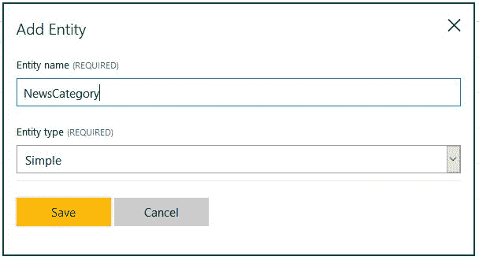
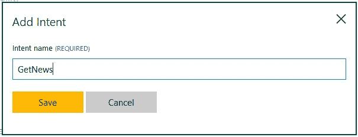
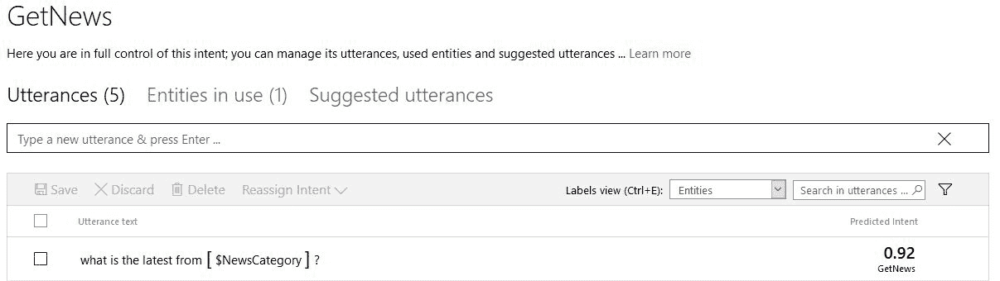
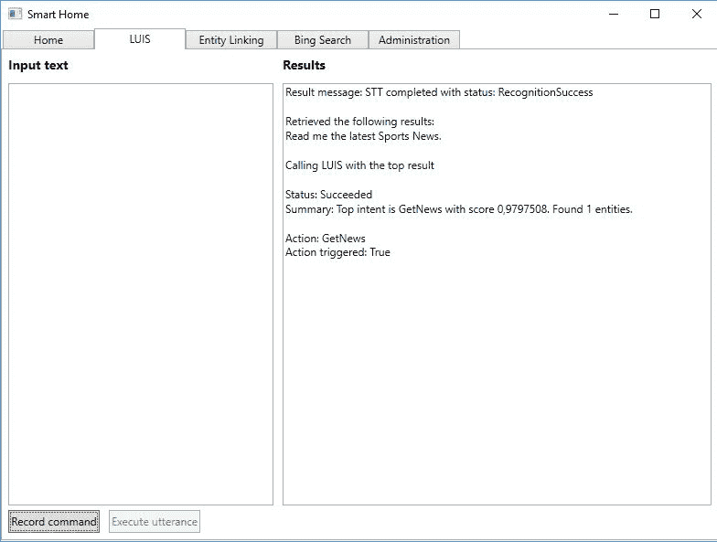

# 十、连接零件

前一章关注的是最后一个 API，包括 Bing 搜索 API。在这一章中，我们将把各个部分联系起来。我们的智能房屋应用目前可以使用几个 API，但大多数是单独使用。我们将看到如何将 LUIS、图像分析、Bing 新闻搜索和 Bing 语音 API 连接在一起。我们还将看看在完成这本书之后你可以采取的下一步措施。

完成本章后，我们将了解以下主题:

*   通过连接多个 API 使应用更加智能
*   利用微软认知服务的现实生活应用
*   后续步骤


# 连接零件

到目前为止，我们已经看到了所有不同的 API，大部分是单独的 API。智能房屋应用背后的整个想法是同时利用几个 API。

在这一章中，我们将在路易斯中加入一个新的意图。这是为了获取最新的新闻，可以选择不同的主题。

接下来，我们想使用 Bing 新闻 API 搜索新闻。我们将通过允许终端用户使用 Bing Speech API 说出一个命令，将语音转换成文本。

当我们有一些新闻文章时，我们希望得到标题、发表日期和描述。如果文章有相应的图片，我们希望得到图片的描述。我们将通过添加计算机视觉 API 来实现这一点。

有了所有的新闻文章信息之后，我们希望将这些信息返回给我们。我们将通过将文本转换为语音来实现这一点。


# 创建意图

让我们从添加我们的新意图开始。前往 [https://www.luis.ai](https://www.luis.ai) ，使用在第 4 章、*中创建的凭证登录，让应用理解命令*。从首页，进入你的智能房屋应用。

在我们开始创建意图之前，我们需要添加一个新的实体。由于我们希望能够获得特定主题的新闻更新，我们将添加一个`NewsCategory`实体，如下面的屏幕截图所示:



我们不需要有任何孩子，因为这个实体会自己工作。

现在我们可以添加一个新的意图。转到左侧的意向，然后单击添加意向。这将打开意图创建对话框。输入意图的管接头名称，例如 GetNews:



我们还需要添加一个示例命令:



再举五六个例子来说明你将如何表达这个意图。请确保在继续之前训练模型。

您可以通过进入左侧菜单中的训练和测试来验证用于测试的模型。


# 更新代码

有了新的意图，我们可以开始更新智能房屋应用。


# 从意图执行操作

我们需要做的第一步是添加一个包含意图的`enum`变量。在`Model`文件夹中创建一个名为`LuisActions.cs`的新文件，并添加以下内容:

```py
    public enum LuisActions { 
        None, GetRoomTemperature, SetRoomTemperature, GetNews 
    } 
```

如果您定义了任何其他意图，也要添加它们。

稍后将使用这个`enum`,来查看被触发时执行哪个动作。例如，如果我们要求获得最新的体育新闻，将触发`GetNews`，它将继续检索新闻。

为了让事情变得简单一点，我们将在本章的剩余部分使用现有的 LUIS 示例。另一种方法是将它添加到`HomeView`中，在那里我们可以不断地听到来自用户的口头命令。

现在我们需要更新`LuisViewModel.cs`文件。找到`OnLuisUtteranceResultUpdated`功能。让我们将其更新为以下内容:

```py
    private void OnLuisUtteranceResultUpdated(object sender, LuisUtteranceResultEventArgs e) 
    { 
        Application.Current.Dispatcher.Invoke(async () => { 
            StringBuilder sb = new StringBuilder(ResultText); 

            _requiresResponse = e.RequiresReply; 

            sb.AppendFormat("Status: {0}\n", e.Status); 
            sb.AppendFormat("Summary: {0}\n\n", e.Message); 
```

此时，我们没有添加任何新内容。我们已经删除了实体的输出，因为我们不再需要它了。

这是新的。如果我们发现有什么动作被触发了，我们就想做点什么。我们调用一个新函数`TriggerActionExecution`，将意图的名称作为参数传递:

```py
    if (!string.IsNullOrEmpty(e.IntentName)) 
        await TriggerActionExectution(e.IntentName, e.EntityName); 
```

我们将很快回到这个函数。

通过添加以下代码完成`OnLuisUtteranceResultUpdated`:

```py
            ResultText = sb.ToString(); 
        });  
    } 
```

同样，您应该看到没有新的特性。但是，我们删除了最后一个`else`条款。我们不希望应用再向我们讲述摘要。

创建新的`TriggerActionExecution`函数。让它接受一个`string`作为参数，并让它返回一个`Task`。将该功能标记为`async`:

```py
    private async Task TriggerActionExectution(string intentName) { 
        LuisActions action; 
        if (!Enum.TryParse(intentName, true, out action)) 
            return; 
```

首先我们解析`actionName`(意图名)。如果我们还没有定义动作，我们就不会做其他任何事情。

定义了一个动作后，我们进入一个`switch`语句来决定做什么。因为我们只对`GetNews`案例感兴趣，所以我们跳出其他选项:

```py
        switch(action) { 
            case LuisActions.GetRoomTemperature: 
            case LuisActions.SetRoomTemperature: 
            case LuisActions.None: 
            default: 
                break; 
            case LuisActions.GetNews: 
          break; 
        } 
    } 
```

在继续之前，请确保代码已编译。


# 根据命令搜索新闻

接下来，我们需要修改`Luis.cs`文件。因为我们已经为新闻主题定义了一个实体，所以我们希望确保从 LUIS 响应中获得这个值。

向`LuisUtteranceResultEventArgs`添加新属性:

```py
    public string EntityName { get; set; } 
```

这将允许我们添加新闻主题值，如果收到的话。

我们需要添加这个值。在`Luis`类中找到`ProcessResult`。修改`if`检查，如下所示:

```py
        if (!string.IsNullOrEmpty(result.TopScoringIntent.Name)) {
            var intentName = result.TopScoringIntent.Name;
            args.IntentName = intentName;
        }

        else {
            args.IntentName = string.Empty;
        }

        if(result.Entities.Count > 0) {
        var entity = result.Entities.First().Value;

        if(entity.Count > 0)  {
            var entityName = entity.First().Value;
            args.EntityName = entityName;
        }
    }
```

我们确保设置了得分最高的意图的名称，并将其作为参数传递给事件。我们还检查是否有任何实体集，如果有，就传递第一个。在实际应用中，您可能还会检查其他实体。

回到`LuisViewModel.cs`文件，我们现在可以考虑这个新的属性。让`TriggerActionExecution`方法接受第二个`string`参数。在调用该函数时，我们可以添加以下参数:

```py
    await TriggerActionExectution(e.IntentName, e.EntityName); 
```

为了能够搜索新闻，我们需要添加一个`BingSearch`类型的新成员。这是我们在上一章中创建的类:

```py
    private BingSearch _bingSearch; 
```

在构造函数中创建对象。

现在我们可以创建一个新函数，名为`GetLatestsNews`。这应该接受一个`string`作为参数，并返回`Task`。将该功能标记为`async`:

```py
private async Task GetLatestNews(string queryString) 
{ 
    BingNewsResponse news = await _bingSearch.SearchNews (queryString, SafeSearch.Moderate); 

    if (news.value == null || news.value.Length == 0) 
        return; 
```

当这个函数被调用时，我们在新创建的`_bingSearch`对象上`SearchNews`。我们将作为动作参数的`queryString`作为参数传递。我们还将安全搜索设置为`Moderate`。

一个成功的 API 调用将产生一个`BingNewsResponse`对象，其中包含一组新闻文章。我们不会对这个职业进行更多的描述，因为我们已经在第 9 章、*添加特殊搜索*中介绍过了。

如果没有找到新闻，我们就从函数返回。如果我们找到了新闻，我们会做以下事情:

```py
    await ParseNews(news.value[0]); 
```

我们调用一个函数，`ParseNews`，稍后我们将回到这个函数。我们传递第一篇新闻文章，它将被解析。理想情况下，我们应该检查所有的结果，但是对于我们的情况，这足以说明问题。

`ParseNews`方法应该标记为`async`。它应该具有返回类型`Task`，并接受类型`Value`的参数:

```py
private async Task ParseNews(Value newsArticle)  { 
    string articleDescription = $"{newsArticle.name}, published {newsArticle.datePublished}. Description:
    {newsArticle.description}. "; 

    await _ttsClient.SpeakAsync(articleDescription, CancellationToken.None); 
} 
```

我们创建一个包含标题、出版日期和新闻描述的字符串。使用这个，我们在`_ttsClient`上调用`SpeakAsync`，让应用将信息读回给我们。

有了这个函数，我们就可以执行动作了。在`TriggerActionExecuted`中，从`GetNews`箱中调用`GetLatestsNews`。一定要等电话。

随着应用的编译，我们可以进行测试运行了:



自然，图像中的效果不如真实生活中的效果好。通过连接麦克风、扬声器或耳机，我们可以使用音频询问最新新闻，并通过音频将新闻读给我们听。


# 描述新闻图像

新闻文章通常也配有相应的图片。作为对我们已有内容的补充，我们可以添加图像分析。

我们需要做的第一步是添加一个新的 NuGet 包。搜索`Microsoft.ProjectOxford.Vision`包，并使用 NuGet 包管理器安装它。

在`LuisViewModel.cs`文件中，添加以下新成员:

```py
private IVisionServiceClient _visionClient; 
```

这可以在构造函数中创建:

```py
_visionClient = new VisionServiceClient("FACE_API_KEY", "ROOT_URI"); 
```

这个成员将是我们对计算机视觉 API 的访问点。

我们想在`ParseNews`函数中得到一个描述图像的字符串。我们可以通过添加一个名为`GetImageDescription`的新函数来实现这一点。这应该接受一个`string`参数，它将是图像的 URL。该函数应具有返回类型`Task<string>`并标记为`async`:

```py
private async Task<string> GetImageDescription(string contentUrl) 
{ 
    try { 
        AnalysisResult imageAnalysisResult = await _visionClient.AnalyzeImageAsync(contentUrl, new List<VisualFeature>() { VisualFeature.Description }); 
```

在这个函数中，我们调用`_visionClient`上的`AnalyzeImageAsync`。我们需要图像描述，所以我们在列表`VisualFeature`中指定它。如果调用成功，我们期待一个类型为`AnalysisResult`的对象。这应该包含图像描述，按正确概率排序。

如果我们没有得到任何描述，我们返回`none`。如果我们有任何描述，我们返回第一个描述的文本:

```py
    if (imageAnalysisResult == null || imageAnalysisResult.Description?.Captions?.Length == 0)  
        return "none"; 
    return imageAnalysisResult.Description.Captions.First().Text; 
} 
```

如果发生任何异常，我们将异常消息打印到调试控制台。我们也把`none`还给来电者:

```py
        catch(Exception ex) { 
            Debug.WriteLine(ex.Message); 
            return "none"; 
        } 
    } 
```

在`ParseNews`中，我们可以通过在函数顶部添加以下内容来获得图像描述:

```py
string imageDescription = await GetImageDescription (newsArticle.image.thumbnail.contentUrl); 
```

有了图像描述，我们可以将`articleDescription`字符串修改如下:

```py
    string articleDescription = $"{newsArticle.name}, published 
           {newsArticle.datePublished}. Description: 
           {newsArticle.description}. Corresponding image is       
           {imageDescription}"; 
```

运行应用和要求新闻现在也将描述任何图像。这就结束了我们的智能房屋应用。


# 使用微软认知服务的现实生活应用

有一些目前利用微软认知服务的应用的例子。我们将在这里看看其中的一些。


# 优步

你们大多数人可能已经听说过优步。对于那些没有，这里有一个简短的总结。

优步是一款为司机和寻找搭车者牵线搭桥的应用。人们可以打开应用，请求搭车。位于附近的司机(注册的优步司机)可以搭载请求搭车的人。骑行后，司机通过应用付款。

为了确保更安全的体验，司机的照片会发送给乘客。这样，乘客可以放心，司机就是他们所说的那个人。这可能会引起问题，因为司机可能不总是看起来像他们的照片。他们可能长了胡子，或者剃掉了胡子，或者可能发生了类似的变化。

考虑到这一点，优步决定增加一个新功能。每个司机在使用应用时都需要登录。这样做会定期要求他们自拍。然后，这个图像被发送到 Face API 进行验证。如果由于眼镜眩光或类似原因导致验证失败，则要求驾驶员移除这些物品。

据优步称，他们花了大约 3 周的时间将 Face API 应用到他们的系统中。


# 荷兰工匠

DutchCrafters 是一家销售手工家具的美国公司。他们确实有实体店，但更重要的是，他们有电子商务网站。该网站包含 10，000 多种产品，其中每种产品都可以定制。

他们网站的转化率很低，为了改善这一点，他们使用了人工推荐。为每个产品手动添加推荐产品相当耗时。在研究他们的选项时，他们发现了来自微软认知服务的推荐 API。

他们已经依赖于 REST APIs，因此实现推荐 API 很快。DutchCrafters 表示，他们总共花了 5 天时间来实现所需的功能。

由于他们的网站已经用 ASP.NET 构建并运行在 IIS 上，他们决定将一切都转移到云上。这样做改善了他们的站点，而且随着推荐 API 的加入，他们的基础也有所改善。

在撰写本文时，他们正在利用*你可能会喜欢这个*功能，为每种产品推荐 10 件商品。他们也在考虑添加基于用户历史的实时推荐，我们已经看到使用推荐 API 是可能的。

实现推荐 API 的直接结果是转换率的提高。他们看到转化率增加了三倍，约 15%的销售额来自推荐的产品。


# CelebsLike.me

**celes like . me**是微软的一款网络应用。它主要是为了展示微软认知服务的一些特性而创建的。

申请的目的是找到你的名人二重身。你可以上传一张照片，或者使用网上找到的照片，该应用会将找到的面孔与相似的名人进行匹配。

该应用利用了 Bing 图像搜索 API、计算机视觉 API 和人脸 API。它能识别网络图像中的名人面孔。当有人上传自己的照片时，面部特征将被用来寻找匹配的名人。


# 头戴式眼镜

Pivothead 是一家从事可穿戴技术的公司。他们将眼镜与高质量相机相结合，提供静态图像和视频。这些眼镜允许人们捕捉他们所看到的生动的观点内容。Pivothead 目前在消费者市场和商业市场都有客户。

随着时间的推移，Pivothead 取得了越来越多的成功，但似乎无法创造出一种帮助视力受损和/或盲人的设备。他们在技术上苦苦挣扎，因为机器学习本身可能相当复杂。当他们了解到微软认知服务时，他们能够实现突破。

如果一个人戴着眼镜，他们可以沿着听筒滑动手指。这将捕捉人面前的图像。这款眼镜利用了微软认知服务的五个 API。这些是计算机视觉、情感、面部、语音和路易斯。

利用一个人面前的任何东西的图像，对图像进行分析。戴眼镜的人将通过耳机获得描述的图像。如果一个人被检测到，他们的性别，长相，他们在做什么，他们的年龄，以及他们的情绪都会被检测和描述。如果检测到文本，它将被读回给该人。

根据 Pivothead 的说法，他们花了大约 3 个月的时间开发这些眼镜的原型。他们还表示，如果他们全职工作，他们可以在 3 周内完成。


# 零键盘

应用 **Zero Keyboard** 由一家名为 **Blucup** 的芬兰公司开发。该公司发现了销售人员的一个普遍问题。他们希望销售人员能够在旅途中捕捉客户数据并挖掘销售线索。

他们开始为 iOS、Android 和 Windows Phone 开发应用，以帮助解决这个问题。该应用背后的想法是记录客户信息，然后自动存储在**客户关系管理** ( **CRM** )系统中。

在开发的时候，微软认知服务出现了，Blucup 决定试一试。早些时候，他们已经尝试了一些开源的语音识别软件和图像分析软件。没有一个能提供所需的质量和功能。

使用计算机视觉 API，该应用可以拍摄名片或身份徽章的照片，并识别文本。这些数据直接上传到他们的 CRM 系统。通过使用语音 API，销售代表还可以为每个联系人录制语音备忘录。

Blucup 表示，微软认知服务提供非常准确的数据。此外，他们已经能够快速实现所需的 API，因为从开发人员的角度来看，这些 API 是很好的匹配。


# 共同的主题

从所有这些例子中可以看出，微软认知服务提供了良好的质量。它实现起来也很快，这在考虑新的 API 时很重要。

API 的另一个优点是，使用它们不需要成为数据科学家。尽管驱动 API 的技术很复杂，但是作为开发人员，我们不需要考虑它。我们可以专注于我们最擅长的事情。


# 从这里去哪里

到目前为止，您应该已经了解了 Microsoft 认知服务的基础知识，足以开始构建自己的应用。

一种自然的方法是尝试不同的 API。API 会不断改进和完善。浏览 API 文档，跟上变化并了解更多信息是值得的。此外，微软一直在为这些服务添加新的 API。通过这本书的写作过程，我看到增加了三个新的 API。这些可能会很有意思。

另一种可能性是建立在我们已经开始的智能房屋应用之上。我们已经打下了一些基础，但仍然有很多机会。也许你可以努力改进我们已经得到的。也许你可以看到一些混合在其他 API 中的机会，我们已经讨论过了。

通读这本书可能会给你一些自己的想法。一个很好的前进方式是实施它们。

正如我们已经看到的，有许多可能使用 API 的领域。只有想象力限制了使用。

或许这本书引发了人们对机器学习更深层次的兴趣。目前我们看到的都是机器学习。尽管它比仅仅使用 API 更复杂，但还是值得探索的。


# 摘要

通过这一章，我们已经完成了我们的旅程。我们为新闻检索创造了一个新的意图。我们学会了如何处理由这个意图引发的行动。基于语音命令，我们设法获取一个主题的最新新闻，并让智能房屋应用读给我们听。接下来，我们继续看看今天什么样的现实生活中的应用正在利用微软的认知服务。最后，我们通过看一些你在完成这本书后可以采取的自然的后续步骤来结束这一章。