# 机器学习和多智能体简介

随着新技术和新兴技术的出现，我们对学习和智力的认知每天都在受到挑战。从自动驾驶汽车、下围棋和象棋，到电脑能够在经典的雅达利游戏中击败人类，一组我们俗称为机器学习的技术的出现主宰了技术增长的新时代——一个与发现电同等重要的新增长时代，已经被归类为下一个人类技术时代。

这本书旨在通过使用 Unity 的机器学习代理平台 ML-Agents，以有趣和丰富的方式向您介绍这个新时代的一小部分。我们将首先探索机器学习和 ML-agent 的一些基础知识。然后，我们将讨论培训，特别是强化学习和 Q 学习。在此之后，我们将学习如何使用 Keras 来建立一个神经网络，我们将演变成一个深度 Q 网络。从那里，我们将研究用不同的训练策略来改进深度 Q 网络的各种方法。这将把我们带到第一个例子，我们训练一个代理玩一个更复杂的游戏。最后，我们将看一个多代理的例子，它允许代理之间相互竞争。

机器学习是一个很大的课题，肯定需要很多年才能掌握。你当然不会从这本书里学到你需要知道的一切。这本书仅仅是对一个复杂而令人沮丧的话题的有趣介绍。我们将尝试指出其他领域来学习更多关于某些技术或背景的知识。

在第一章中，我们将逐步介绍 ML 和 ML-agent。以下是我们将在本章中介绍的内容:

*   机器学习
*   ML-代理
*   运行示例
*   创造环境
*   学院、代理和大脑

让我们开始吧，在下一节，我们将介绍什么是机器学习，以及我们计划在本书中关注的 ML 的特定方面。

如果你还没有这样做，一定要下载并安装最新版本的 Unity[(https://unity3d.com/](https://unity3d.com/))。确保你有最新版本的软件，避免任何测试版本。我们将在本书中使用个人版本，但任何版本的 Unity 都应该可以。


# 机器学习

游戏和模拟对人工智能技术来说并不陌生，Unity 开发者可以使用许多资产来提供模拟的机器智能。这些技术包括行为树、有限状态机、导航网格、`A*`等内容，以及游戏开发者用来模拟智能的其他启发式方法。那么，为什么是机器学习，为什么是现在？毕竟，许多基本的 ML 技术，像神经网络，我们将在本书后面使用，已经在游戏中使用过了。

原因在很大程度上是由于 OpenAI 倡议，这是一项鼓励学术界和行业研究分享人工智能和人工智能的想法和研究的倡议。这导致了新思想、方法和研究领域的爆炸式增长。这意味着对于游戏和模拟，我们不再需要伪造或模拟智能。现在，我们可以建造从环境中学习的智能体，甚至可以学习击败他们的人类建造者。

机器学习是人工智能的一种实现。这是计算机吸收数据或状态并提供学习解决方案或响应的一种方式。我们现在经常认为 AI 是一个更广泛的术语，反映了一个“智能”系统。举例来说，一个完整的游戏人工智能系统可能包含 ML 工具和更经典的人工智能，如行为树，以模拟更丰富、更不可预测的人工智能。我们将用 AI 来描述一个系统，用 ML 来描述实现。


# 培训模型

机器学习之所以被如此恰当地命名，是因为它使用各种形式的训练来分析数据或状态，并提供经过训练的响应。这些方法值得一提，我们将重点介绍一种目前表现良好的学习方法。在我们开始之前，为了后面的章节，让我们来分解一下我们在 ML 中经常看到的三种类型的培训:

*   **无监督训练**:这种训练方法自行检查数据集并执行分类。分类可以基于某些度量，并且可以由训练本身发现。大多数人过去认为所有的人工智能或人工智能都是这样工作的，但当然，事实并非如此:
    *   ESRI 是地理信息系统软件和数据的主要地图提供商，它提供了一个名为 T2 的人口数据集。该数据集来自美国人口普查数据和其他资源的组合。它通过 ML 算法进行处理，该算法使用无监督训练将数据分类为 68 个消费者细分。Tapestry 数据不是免费的，但是对于任何为消费者或零售应用程序构建 ML 的人来说都是无价的。
*   **监督训练**:这是大多数数据科学 ML 方法用来执行预测或分类的典型训练方法。这是一种需要标记输入和输出数据的训练。因此，它需要一组训练数据来建立模型。通常，根据特定的 ML 技术，可能需要大量数据:
    *   **Google Inception** 是一个免费提供的图像分类 ML 模型。它已经被数百万张图像训练成各种训练好的分类。初始模型足够小，可以安装在移动设备上，以便提供实时图像分类。
*   **强化学习**:这是基于控制理论，提供了一种无需任何初始状态或环境模型的学习方法。这是一个强大的概念，因为它消除了对环境建模或进行监督训练经常需要的繁琐数据标记的需要。相反，代理在环境中建模，并根据他们的行为获得奖励。当然，这也意味着这种先进的训练方法并非没有陷阱和挫折。我们将在[第二章](part0037.html#1394Q0-c0290fc391a247b5ae9c3b6066c9fb32)、*老虎机和强化学习*中开始学习 RL 的细节:
    *   DeepMind 制造了一个能够比人类更好地玩经典 Atari 2600 游戏的机器人。

*   **模仿学习**:这是一种通过观看期望动作的演示然后模仿它们来训练代理的技术。这是一种强大的技术，有很多应用。我们将在[第 4 章](part0072.html#24L8G0-c0290fc391a247b5ae9c3b6066c9fb32)、*通过深度学习*深入探讨这种类型的培训。
*   **课程学习**:这是一种高级的学习形式，通过将问题分解成不同的复杂程度来工作，这使得代理或 ML 能够在进入更高级的活动之前克服每一个复杂程度。例如，代理服务员可能首先需要学会平衡托盘，然后托盘与一盘食物，然后带着托盘和食物行走，最后将食物送到一张桌子上。我们将在[第 5 章](part0087.html#2IV0U0-c0290fc391a247b5ae9c3b6066c9fb32)、*玩游戏*中探讨这种训练形式。
*   **深度学习**:这是利用各种形式的内部训练机制来训练一个多层神经网络。我们会在[第三章](part0051.html#1GKCM0-c0290fc391a247b5ae9c3b6066c9fb32)、*用 Python 进行深度强化学习*中花更多的时间在神经网络和深度学习上。

你可能已经注意到 ML 和 agent 这两个术语的互换，用来表示正在学习的事物。现在用这些术语来思考事情是有帮助的。在这一章的后面，我们将开始区分一个代理和他们的大脑或 ML 之间的区别。不过现在，让我们回到一些基础知识，在下一节探索一个简单的 ML 示例。


# 机器学习的例子

为了以实用的方式演示这些概念，让我们看一个使用 ML 解决游戏问题的示例场景。在我们的游戏中，我们有一门大炮，在基于物理的世界中以特定的速度发射弹丸。游戏的目标是选择在特定距离击中目标的速度。我们已经开炮十次，并将结果记录在表格和图表中，如下面的截图所示:

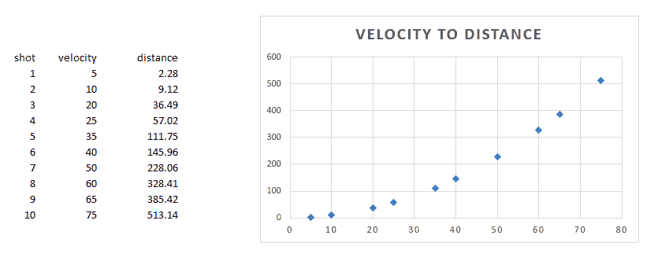

Record and chart of cannon shots

由于数据已经被标记，这个问题非常适合监督训练。我们将使用一种称为线性回归的非常简单的方法，以便为我们提供一个模型，该模型可以预测在特定距离击中目标的速度。通过添加趋势线，Microsoft Excel 为我们提供了一种在图表上建立线性回归模型的快速方法，如下所示:

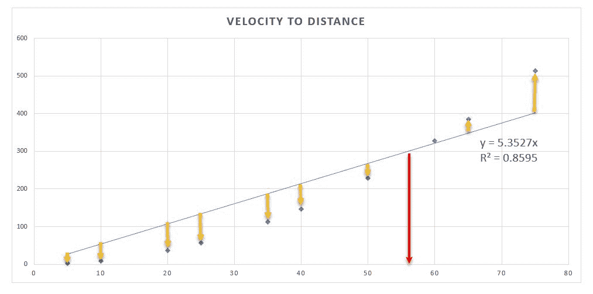

Linear Regression applied with a trendline

通过在 Excel 中使用这个简单的功能，您可以快速分析您的数据，并查看最适合该数据的方程。现在，这是数据科学的一个基本例子，但希望你能理解这是如何简单地用于预测复杂的环境，仅仅基于数据。虽然线性回归模型可以为我们提供答案，但它显然不是很好，R ² 反映了这一点。我们的模型存在的问题是，我们使用线性模型来尝试解决非线性问题。这反映在指向各点的箭头上，其中距离显示了与趋势线的误差量。我们使用任何 ML 方法的目标都是最小化误差，以便找到最佳拟合的解。在大多数情况下，这就是最大似然法的全部内容，找到一个方程来最好地预测/分类一个值或行为。

回到我们之前的问题，我们现在可以使用一些简单的代数替换来求解速度，如下式所示:

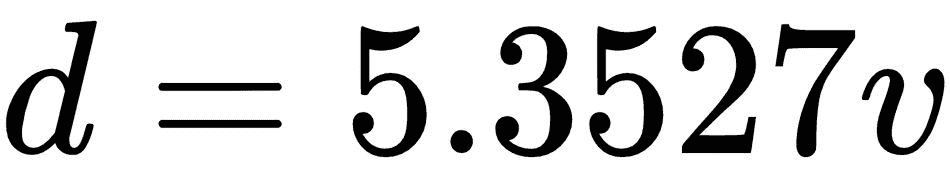

其中 *d* =距离 *v* =速度:

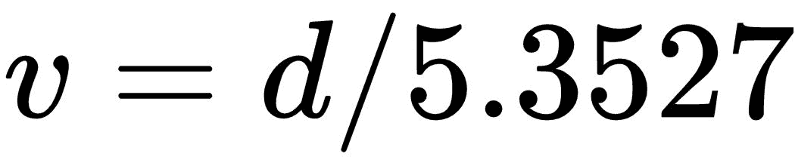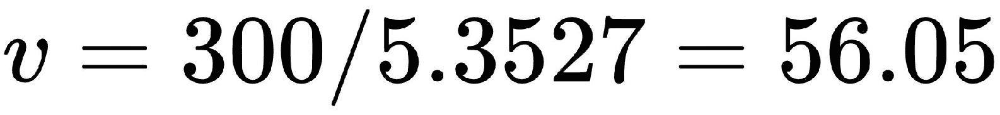

我们的最终答案将是`56.05`的答案，但是正如我们已经提到的，我们仍然可能错过，因为我们的模型并不完全准确。然而，如果你看一下图表，我们的误差似乎在距离`300`附近最小化。因此，在我们的具体例子中，我们的模型非常适合。不过，仔细观察图表，你会发现在大约`100`的距离处，我们的误差变得相当大，不太可能达到我们的目标。

*R²* or *R* squared is an error value between `0` and `1`, with 1 being the highest or best fit. *R²* attempts to summarize the quality of fit. In some cases, it works well and in others there are other measures of fit that work better. We will use different measures of quality of fitness, but the concepts are similar.

我们刚刚看到的例子非常简单，没有考虑到许多其他因素，如海拔差异或移动速度等。如果我们想添加这些输入，我们只需在表中添加更多的列。每个新列都会扩展我们的数据空间，从而增加模型的复杂性。正如您可以很快看到的，我们的模型可能会迅速扩展，变得不切实际。这本质上是游戏产业在世纪之交实现游戏人工智能时已经经历的使用 ML 技术的缺点。这也是任何其他行业在实施基于监管的模式时面临的一个缺点。这就需要不断地重新采样和重新标记数据，从而重新训练模型，这就是强化学习和其他学习方法变得如此重要的原因。它们提供了一种学习方法，通过这种方法，事先没有环境知识的自主代理或 ML 可以成功地探索。


# ML 在游戏中的应用

Unity 已经接受了将 ML 整合到其产品的所有方面的想法，而不仅仅是作为一个游戏 AI 使用。虽然大多数开发人员可能会尝试将 ML 用于游戏，但它确实在以下方面有助于游戏开发:

*   地图/关卡生成:已经有很多开发人员使用 ML 自动生成从地下城到真实地形的例子。做好这一点可以为游戏提供无限的可玩性，但这可能是最具挑战性的 ML 开发。
*   **纹理/着色器生成**:另一个引起 ML 注意的领域是纹理和着色器生成。这些技术正因高级生成对抗网络(GAN)的关注而得到推动。这种技术在实践中有很多很棒很有趣的例子；只要在你最喜欢的搜索引擎中搜索深层假货就行了。
*   **模型生成**:在这个领域有几个项目即将取得成果，它们可以通过增强的扫描和/或自动生成大大简化 3D 对象的构建。想象一下，能够以文本形式描述一个简单的模型，并让 ML 为你实时构建它，例如，在游戏或其他 *AR* /VR/MR 应用程序中。
*   **音频生成**:能够实时生成音频音效或音乐的功能已经被应用于其他领域，不仅仅是游戏。然而，想象一下能够为你的游戏定制一个由 ML 开发的配乐。

*   **人造玩家**:这包括许多用途，从玩家自己使用 ML 代表他们玩游戏，到开发者使用人造玩家作为增强的测试代理或作为在低活动期间吸引玩家的一种方式。如果你的游戏足够简单，这也可以是一种自动测试关卡的方式。我们将在[第五章](part0087.html#2IV0U0-c0290fc391a247b5ae9c3b6066c9fb32)、*玩游戏*中探讨一个使用 ML 玩游戏的例子。
*   **NPC 或游戏 AI** :目前，有更好的模式以行为树的形式来模拟基本的行为智能。虽然 BTs 或其他类似模式不太可能很快消失，但想象一下，如果能够模拟一个 NPC，它可能会做出不可预测但相当酷的行为。这开启了各种可能性，不仅让开发者兴奋，也让玩家兴奋。我们将在[第 6 章](part0099.html#2UD7M0-c0290fc391a247b5ae9c3b6066c9fb32)、*参观玻璃容器——构建多智能体生态系统*中探讨使用 ML 建模行为模式的方法。

我们对这本书的兴趣将在人工玩家和游戏人工智能领域，因为它往往是范围最广的话题。鼓励读者自行搜索前面列表中提到的其他领域，以及与他们自己的项目相关的领域。

强烈建议你参加**数据科学**的课程，阅读一本书，或者看一个视频。数据科学领域主要处理针对已知数据集的监督和非监督 ML 训练。然而，你将会或者应该学习数据清理、数据标记、ML 的数学、计算误差等等一些重要的概念。拥有数据科学背景将有助于您对问题进行建模，并在事情不按预期运行时帮助您发现可能的问题。

对 ML 的概述当然不会与任何数据科学课程相提并论，但它应该让我们从下一节开始的其他好东西开始，在下一节中，我们将开始研究使用 Unity ML-Agents 的 ML。


# ML-代理

在本书的其余部分，我们将使用 ML-Agents 平台和 Unity 来构建 ML 模型，我们可以学习在各种环境中进行游戏和模拟。不过，在此之前，我们需要使用 git 从 GitHub 下载 ML-Agents 包。跳到您的计算机上，打开一个命令提示符或 shell 窗口，然后按照以下步骤操作:

如果你以前从未使用过 git，确保从[https://git-scm.com/](https://git-scm.com/)安装它。在继续下面的练习以及本书的其余部分之前，您需要安装 git。

1.  导航到您的工作或根文件夹(在 Windows 上，我们假设这是 C:\):

```
 cd/
```

2.  执行以下命令:

```
 mkdir ML-Agents
```

3.  这将创建文件夹`ML-Agents`。现在，执行以下命令:

```
 cd ML-Agents
 git clone https://github.com/Unity-Technologies/ml-agents.git
```

4.  它使用 git 将 ML-Agents 所需的文件下载到一个名为`ml-agents. git`的新文件夹中，当文件被下载到这个文件夹中时，它会显示这些文件。您可以通过切换到新文件夹并执行以下命令来验证文件是否已成功下载:

```
 cd ml-agents
 dir
```

5.  现在，我们这样做是为了确保这里有任何文件。我们稍后将讨论具体细节。

很好——这应该是相当无痛的。如果你下载代码有问题，你可以访问 GitHub 上的 ML-Agents 页面，地址是[https://github.com/Unity-Technologies/ml-agents](https://github.com/Unity-Technologies/ml-agents)，手动下载代码。当然，我们将更多地使用 git 来管理和提取文件，所以您应该解决您可能遇到的任何问题。

如果您不熟悉 GitHub 和 git，那么您真的应该熟悉。git 现在在软件开发的所有领域中完全主导了源代码控制，并被广泛使用，甚至在微软，他们放弃了自己的源代码控制。帮自己一个忙，即使你只是为自己开发代码:使用源代码控制。

现在我们已经安装了 ML-Agents，我们将在下一节看看 Unity 的一个样例项目，它附带了一个工具包。


# 运行样本

Unity 提供了 ML-Agents 包，其中包含了大量演示学习和培训场景各个方面的准备样本。让我们打开 Unity 并加载一个示例项目，通过下面的练习感受一下 ML-agent 是如何运行的:

1.  打开 Unity 编辑器，进入启动项目对话框。

2.  单击对话框顶部的打开按钮，导航到并选择`ML-Agents/ml-agents/unity-environment`文件夹，如以下屏幕截图所示:

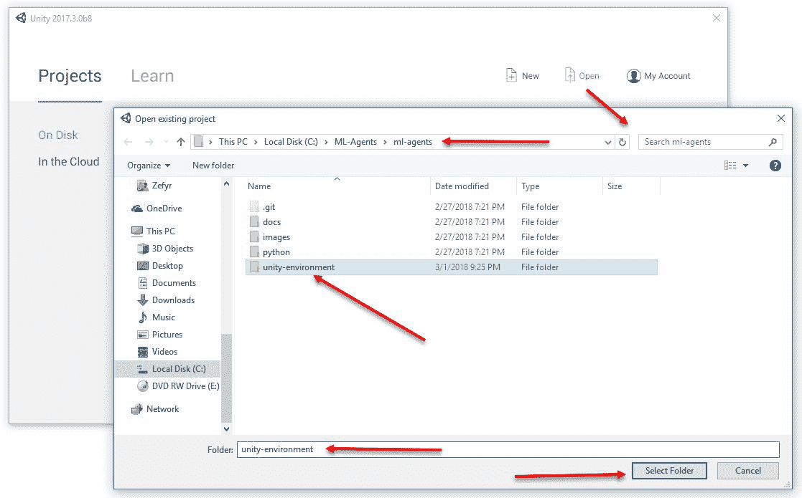

将 unity-environment 项目载入编辑器

3.  这将把`unity-environment`项目加载到 Unity 编辑器中。根据您使用的 Unity 版本，您可能会收到需要升级版本的警告。只要您使用的是 Unity 的最新版本，您只需点击“继续”即可。如果您遇到问题，请尝试升级或降级您的 Unity 版本。
4.  在项目窗口的`Assets/ML-Agents/Examples/3DBall`文件夹中找到`Scene`文件，如下图所示:

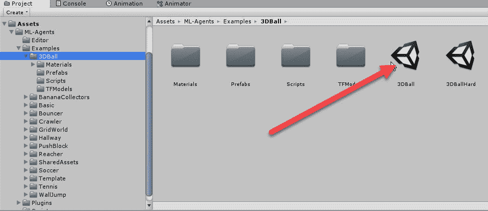

在 3DBall 文件夹中定位示例场景文件

5.  双击`3DBall`场景文件，在编辑器中打开场景。
6.  按下编辑器顶部中间的播放按钮来运行场景。你会看到场景开始运行，球被扔下，但球只是从平台上掉下来。这是因为场景在玩家模式下启动，这意味着你可以通过键盘输入来控制平台。尝试使用键盘上的箭头键来平衡平台上的球。
7.  运行完场景后，再次单击播放按钮停止场景。


# 设置智能体大脑

正如你所看到的，场景目前已经设定为玩家控制，但显然我们想看看一些 ML-Agents 的东西是如何工作的。为了做到这一点，我们需要改变代理使用的大脑类型。跟随切换 3D 球代理中的大脑类型:

1.  在层次窗口中找到`Ball3DAcademy`对象，将其展开以显示 **Ball3DBrain** 对象。
2.  选择 **Ball3DBrain** 对象，然后查看检查器窗口，如下图所示:

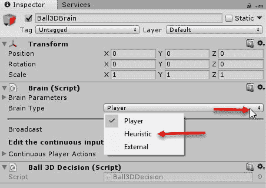

在 Ball3DBrain 对象上切换大脑

3.  如前面摘录所示，将大脑组件切换到**启发式**设置。启发式大脑设置用于以启发式方式在 Unity 脚本中内部编码的**ML-agent**。启发式编程无非是选择一个更简单更快的解决方案，而经典的，在我们的情况下，ML 算法，可能需要更长的时间。写一个启发式大脑通常可以帮助你更好地定义一个问题，这是一个我们将在本章后面使用的技术。当前大多数游戏人工智能都属于使用启发式算法的范畴。

4.  按播放来运行场景。现在，你会看到平台平衡每个球——对于启发式算法来说，这非常令人印象深刻。接下来，我们想用启发式大脑打开这个脚本，看看其中的一些代码。

您可能需要在球 3D 决策(脚本)上上下调整旋转速度属性。如果启发式大脑似乎无法有效地平衡球，请尝试使用`.5`值作为旋转速度。旋转速度隐藏在前面的屏幕摘录中。

5.  点击**球 3D 决策**(脚本)旁边的齿轮图标，从上下文菜单中选择编辑脚本，如以下截图所示:

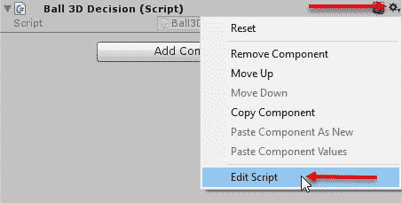

编辑球 3D 决策脚本

6.  看看脚本中的`Decide`方法，如下所示:

```
      public float[] Decide(
              List<float> vectorObs,
              List<Texture2D> visualObs,
              float reward,
              bool done,
              List<float> memory)
          {
              if 
              (gameObject.GetComponent<Brain()
              .brainParameters.vectorActionSpaceType
                 == SpaceType.continuous)
              {
                  List<float> act = new List<float>();

        // state[5] is the velocity of the ball in the x orientation. 
        // We use this number to control the Platform's z axis rotation 
         speed, 
        // so that the Platform is tilted in the x orientation 
        correspondingly. 
          act.Add(vectorObs[5] * rotationSpeed);

        // state[7] is the velocity of the ball in the z orientation. 
        // We use this number to control the Platform's x axis rotation 
        speed, 
        // so that the Platform is tilted in the z orientation 
        correspondingly. 
          act.Add(-vectorObs[7] * rotationSpeed);

          return act.ToArray();
          }

          // If the vector action space type is discrete, then we don't do 
          anything. 
          return new float[1] { 1f };
          }
```

7.  我们将在后面详细介绍这个方法的输入和输出意味着什么。但是现在，看看代码有多简单。这是启发式大脑，它在平台上平衡球，当你看到代码时，这是相当令人印象深刻的。你可能会想到的问题是:那么，我们为什么要为 ML 编程而烦恼呢？简单的答案是，3D 球问题看似简单，可以很容易地用八个状态来建模。再看一下代码，可以看到只使用了八种状态(`0`到`7`)，每种状态代表球移动的方向。正如你所看到的，这对于这个问题很有效，但是当我们遇到更复杂的例子时，我们可能有数以百万计的状态——几乎没有什么我们可以使用启发式方法轻松解决的。

**启发式**大脑不应与**内部**大脑混淆，后者我们将在[第六章](part0099.html#2UD7M0-c0290fc391a247b5ae9c3b6066c9fb32)、*重新参观玻璃容器——构建多智能体生态系统*中讨论。虽然您可以用 ML 算法替换 3D ball 示例中的启发式代码，但这并不是运行高级 ML(如深度学习算法)的最佳实践，我们将在[第 3 章](part0051.html#1GKCM0-c0290fc391a247b5ae9c3b6066c9fb32)、*使用 Python 进行深度强化学习*中发现。

在下一节中，我们将修改基本示例，以便更好地了解 ML-Agents 组件如何协同工作。


# 创造环境

在查看上一个示例时，您可能已经注意到，ML-Agent 环境需要一些定制设置。Unity 文档建议 ML 环境由学院、代理和大脑对象以及相关脚本构成。在 ML-Agents 项目中有一个模板文件夹，我们将使用它来配置和设置一个简单的环境。让我们跳回 Unity 编辑器，开始设置我们的第一个简单的 ML 环境:

1.  在编辑器的项目窗口的`ML-Agents`文件夹中找到`Template`文件夹。
2.  在`Template`文件夹上右击(*命令*点击 macOS)并从上下文菜单中选择在浏览器中显示。这将打开一个带有文件的浏览器窗口。
3.  选择并复制`Template`文件夹。
4.  向上导航两级到`Assets`文件夹，粘贴复制的文件夹。这将把`Template`文件夹添加到根`Assets`文件夹中。
5.  将`Template`文件夹重命名为`Simple`。

当您返回到编辑器时，您将会看到由于重复的模板脚本而导致的一些名称空间错误。我们会尽快解决这个问题。

6.  返回 Unity 编辑器，确认文件夹和文件已经复制到新的`Simple`文件夹，如以下截图所示:

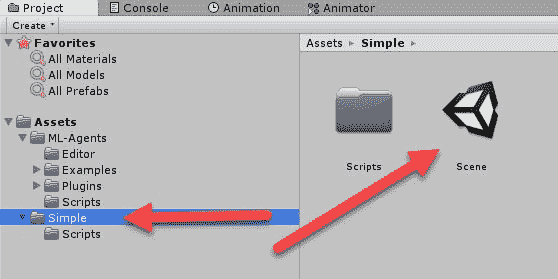

验证简单文件夹是否已创建

7.  双击场景，在编辑器中打开它。


# 重命名脚本

这建立了一个简单的场景，但是你可能已经注意到仍然有一些重复的命名错误。我们需要重命名`Simple/Scripts`文件夹中的模板脚本。按照下一个练习来重命名每个脚本:

1.  打开`Scripts`文件夹。
2.  将每个文件从`Template`重命名为`Simple`，如以下项目窗口摘录所示:

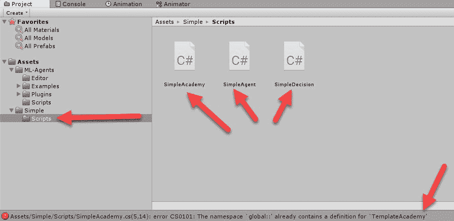

将模板脚本重命名为简单

3.  双击`SimpleAcademy`脚本文件，在代码编辑器中打开它。将该类从`TemplateAcademy`重命名为`SimpleAcademy`，使其与文件名匹配，如以下代码所示:

```
       public class SimpleAcademy : Academy {
```

4.  对代理和决策脚本重复此过程。场景中的对象仍然指向模板脚本，所以我们接下来将更新它。在返回编辑器之前，请确保保存所有的脚本和您的更改。如果所有文件都被正确重命名，命名错误就会消失。
5.  在层级窗口中选择 Ball3DAcademy 并将其重命名为`Academy`。
6.  在**层级**窗口中选择`Academy`对象。在 Inspector 窗口中点击`TemplateAcademy`组件旁边的齿轮图标，并选择 Remove Componen **t** 删除脚本。

7.  点击 Add Component 按钮，在组件搜索栏中输入`Simple`，如下图所示:

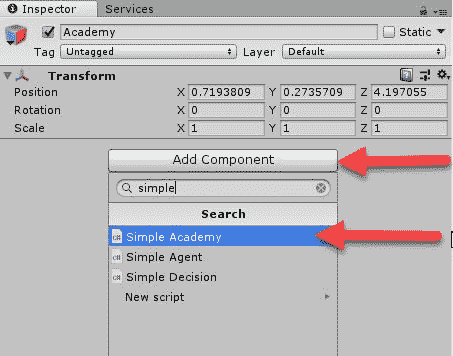

将 SimpleAcademy 对象添加到 Academy 对象

8.  点击 **Simple Academy** 项，如前面摘录所示，将组件添加到`Academy`对象中。
9.  对`Agent`对象重复该过程，删除`TemplateAgent`脚本并添加`SimpleAgent`脚本。
10.  完成后，请确保保存场景和项目。

令人惊讶的是，Unity 没有提供一套更好的编辑器工具来构建一个新的 ML 代理环境，至少在写这本书的时候没有。在本书的源代码下载中(`Chapter_1/Editor_Tools`)，提供了一个资源包，可以为您自动完成这个设置。我们可能会决定将这个包和这本书的其他一些包放在资产商店中。

这为我们建立了一个新的 ML 环境，开始实现我们自己的学院、代理和决策(大脑)脚本。当我们设置第一个学习问题时，我们将在下一节讨论这些脚本的细节。


# 学院、代理和大脑

为了演示每个主要组件(学院、代理和大脑/决策)的概念，我们将基于经典的多臂老虎机问题构建一个简单的示例。老虎机问题之所以如此命名，是因为它类似于在拉斯维加斯俗称为“一个武装老虎机”的老虎机。之所以这样命名，是因为这些机器因收取玩它们的穷人游客的钱而臭名昭著。虽然传统的吃角子老虎机只有一只手臂，但我们的示例将展示玩家可以采取的四只手臂或动作，每个动作为玩家提供给定的奖励。将 Unity 开放给我们在上一节开始的简单的项目**:**

1.  从菜单中选择游戏对象| 3D 对象|立方体，并重命名新对象`Bandit`。
2.  单击 Transform 组件旁边的齿轮图标，并从上下文菜单中选择 Reset。这会将我们的对象重置为`(0,0,0)`，这很好，因为它是我们场景的中心。
3.  展开**网格渲染器**组件上的**材质**部分，并单击目标图标。选择**网垫**材料，如下截图所示:

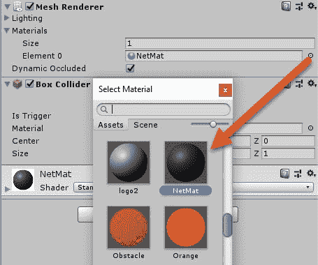

为老虎机选择网垫材料

4.  在项目窗口中打开`Assets/Simple/Scripts`文件夹。
5.  在窗口的空白区域右键单击(*命令*点击 macOS ),并从**上下文**菜单中选择创建| C#脚本。将脚本命名为`Bandit`，并用以下代码替换:

```
      public class Bandit : MonoBehaviour
      {
        public Material Gold;
        public Material Silver;
        public Material Bronze;
        private MeshRenderer mesh;
        private Material reset;

        // Use this for initialization
        void Start () {
        mesh = GetComponent<MeshRenderer>();
        reset = mesh.material;
        } 

        public int PullArm(int arm)
        {
         var reward = 0;
         switch (arm)
          {
           case 1:
             mesh.material = Gold;
             reward = 3;
             break;
            case 2:
              mesh.material = Bronze;
              reward = 1;
              break;
            case 3:
             mesh.material = Bronze;
             reward = 1;
             break;
           case 4:
             mesh.material = Silver;
             reward = 2;
             break;
          }
          return reward;
        }

        public void Reset()
        {
          mesh.material = reset;
        }
      }
```

6.  这个代码只是简单地实现了我们的四个武装老虎机。第一部分将该类声明为从`MonoBehaviour`扩展而来的 **Bandit** 。Unity 中所有的**游戏对象**都是从`MonoBehaviour`扩展而来。接下来，我们定义一些**公共**属性，这些属性定义了我们将用来向我们显示奖励值的材料。然后，我们有几个**私有**字段，它们是被称为**网格**的`MeshRenderer`和原始**材质**的占位符，我们称之为**重置**。
    接下来我们将实现 **Start** 方法，这是一个默认的 Unity 方法，在对象启动时运行。这是我们根据对象的`MeshRenderer`设置两个私有字段的地方。接下来是 **PullArm** 方法，它只是一个简单的开关语句，用于设置适当的材料和奖励。最后，我们将使用 **Reset** 方法来结束，我们只是重置了原始属性。
7.  当您输入完代码后，请务必保存文件并返回 Unity。
8.  将 **Bandit** 脚本从**项目**窗口的`Assets/Simple/Scripts`文件夹中拖放到**层次**窗口的`Bandit`对象上。这将把 **Bandit** 组件添加到对象中。
9.  在**层次**窗口中选择**老虎机**对象，然后在**检查器**窗口中点击**目标**图标，选择每个材料槽(**金、银、铜**)，如下图所示:

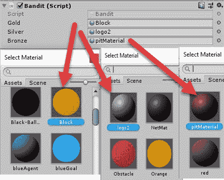

将金、银、铜材料固定在老虎机身上

这将把我们的 **Bandit** 对象设置为可视占位符。当然，你可以添加手臂，让它看起来更像一个多臂吃角子老虎机，但对于我们的目的来说，当前的对象将工作良好。记住我们的**老虎机**有 4 个武器，每个都有不同的奖励。


# 建立学院

一个 **Academy** 对象和组件代表了我们为代理定义培训配置的培训环境。你可以把学院想象成训练我们特工的学校或教室。打开 Unity 编辑器，在**层次**窗口中选择**学院**对象。然后，按照以下步骤配置**学院**组件:

1.  为**学院**组件设置属性，如以下截图所示:

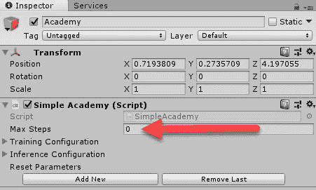

设置学院对象的学院组件的属性

2.  以下是我们将涉及的初始**学院**属性的快速总结:
    *   最大步数:这限制了你的**学院**在重置自己之前让每个**代理**执行的动作数量。在我们当前的例子中，我们可以将它设置为 0，因为我们只做了一步。通过将其设置为零，我们的代理将永远继续，直到调用 **Done** 为止。
    *   **训练配置**:在任何一个 ML 问题中，我们经常会把问题分解成一个训练和测试集。这允许我们在训练环境或数据集上构建 ML 或 agent 模型。然后，我们可以采用经过训练的 ML，并使用推理在真实数据集上对其进行练习。*培训配置*部分是我们配置培训环境的地方。
    *   **推理配置**:推理是指我们根据以前未见过的环境或数据集来推断或运用我们的模型。当我们的 ML 在这种类型的环境中运行时，这个配置区域是我们设置参数的地方。

对于这个简单的例子来说，学院的设置非常简单。我们将在后面的章节中讨论更复杂的选项，但是请随意扩展选项并查看属性。


# 设置代理

代理代表的是我们正在训练的参与者，他们学习执行一些任务或一组基于任务的命令，并获得一些报酬。当我们在第二章、*老虎机和强化学习*中更多地讨论强化学习时，我们会涉及到更多的演员、动作、状态和奖励。现在，我们需要做的就是设置代理将要使用的大脑。打开编辑器，按照以下步骤操作:

1.  在**层次**窗口中找到**代理**对象并选中它。

2.  在**简单代理**组件上，点击**大脑**属性旁边的**目标**图标，选择场景中的大脑对象，如下图所示:

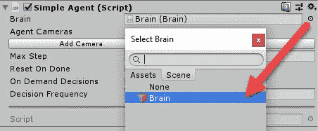

设置智能体大脑

3.  点击**简单代理**组件上的**目标**图标，并从上下文菜单中选择**编辑脚本**。代理脚本是我们用来观察环境和收集观察结果的。在我们当前的例子中，我们总是假设没有先前的观察。
4.  在`CollectObservations`方法中输入高亮显示的代码，如下所示:

```
      public override void CollectObservations()
      {
        AddVectorObs(0);
      }
```

5.  `CollectObservations`是被调用来设置**代理**观察环境的方法。每个代理步骤或动作都会调用此方法。我们使用`AddVectorObs`将单个浮点值 **0** 添加到代理的观察集合中。在这一点上，我们目前没有使用任何观察，并将假设我们的老虎机没有提供任何视觉线索，什么手臂拉。
    代理还需要评估奖励以及何时领取奖励。我们将需要添加四个插槽，每个插槽用于代理的一只手臂，以便在手臂被拉动时表示奖励。
6.  在`SimpleAgent`类中输入以下代码:

```
      public Bandit bandit;
      public override void AgentAction(float[] vectorAction, 
      string textAction)
      {
        var action = (int)vectorAction[0];
        AddReward(bandit.PullArm(action));
        Done();
      }

      public override void AgentReset()
      {
        bandit.Reset();
      }
```

7.  我们的`AgentStep`方法中的代码只是采用当前动作，并通过`PullArm`方法将该动作应用于**老虎机**，传入手臂进行拉动。老虎机返回的奖励通过`AddReward`添加。之后，我们在`AgentReset`方法中实现一些代码。这段代码只是将 Bandit 重置回它的起始状态。`AgentReset`在代理完成、完成或退出步骤时被调用。注意我们如何在每一步之后调用方法**Done**；这是因为我们的老虎机只是一个单一的国家或行动。
8.  将以下代码添加到最后一部分的正下方:

```
      public Academy academy;
      public float timeBetweenDecisionsAtInference;
      private float timeSinceDecision;

      public void FixedUpdate()
      {
        WaitTimeInference();
      }

      private void WaitTimeInference()
      {
        if (!academy.GetIsInference())
        {
          RequestDecision();
        }
        else
        {
          if (timeSinceDecision >= timeBetweenDecisionsAtInference)
          {
            timeSinceDecision = 0f;
            RequestDecision();
          }
          else
          {
            timeSinceDecision += Time.fixedDeltaTime;
          }
        }
      }
```

9.  我们需要添加前面的代码，以便我们的大脑等待足够长的时间来接受玩家的决定。我们将构建的第一个示例将使用玩家输入。不要太担心这段代码，因为我们只需要它允许玩家输入。当我们开发我们的智能体大脑时，我们不需要延迟。
10.  完成编辑后保存脚本。
11.  返回编辑器并在简单代理上设置属性，如下面的屏幕截图所示:

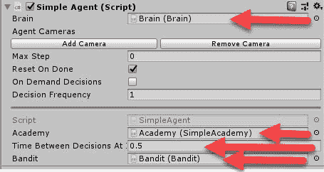

设置简单代理属性

我们差不多完成了。代理现在能够解释我们的动作，并在 **Bandit** 上执行它们。动作从**大脑**发送给代理。大脑**负责做决定，我们将在下一节介绍它的设置。**


# 设置大脑

当我们查看早期的 Unity 示例时，我们已经看到了`Brain`的基本功能。从**玩家**、**启发式**、**内部**和**外部**有许多不同类型的大脑。对于我们这个简单的例子，我们将设置一个`Player`大脑。按照以下步骤配置**大脑**对象以接受玩家的输入:

1.  在`Hierarchy`窗口中找到`Brain`对象；它是`Academy`的孩子。
2.  选择`Brain`对象，设置`Player`输入，如下图所示:

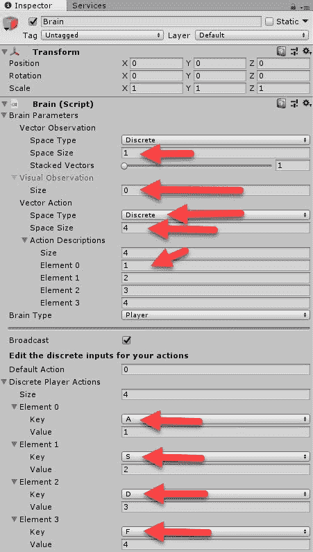

在大脑中设置玩家输入

3.  保存场景和项目。
4.  按播放来运行场景。键入任意键 *A* 、 *S* 、 *D* 或 *F* 将每个臂从`1`拉至`4`。当你拉手臂时，**老虎机**会根据奖励改变颜色。这是一个非常简单的游戏，一个人每次拉右臂应该是一个相当简单的练习。

现在，我们有一个简单的**玩家**大脑，让我们测试我们简单的四臂老虎机。我们可以更进一步，实现一个**启发式**大脑，但是我们将把它作为一个练习留给读者。不过现在，在我们进入下一章之前，你应该已经掌握了足够多的知识来熟悉 ML-agent 的一些基本概念。


# 练习

请自行完成这些练习，以获得更多知识:

1.  更改代理用来表示奖励的材料——如果您创建了新材料，将获得奖励积分。
2.  给老虎机增加一个额外的手臂。
3.  在我们之前的 cannon 示例中，我们使用线性回归 ML 算法来预测特定距离所需的速度。正如我们所看到的，我们的卡农问题可能更适合另一种算法。你能选择一个更好的方法来做这个回归吗？

访问 **Excel** 可以让这变得相当简单。

4.  实现一个`SimpleDecision`脚本，它使用一个**启发式**算法来总是挑选最佳解决方案。

你可以看看我们之前看过的 3DBall 的例子。您需要将`SimpleDecision`脚本添加到**大脑**中，以便设置启发式大脑。


# 摘要

在本章中，我们通过介绍机器学习和更常见的学习模型，包括强化学习，讲述了机器学习和 ML-agent 的基础知识。在那之后，我们看了一个有大炮的游戏例子，其中简单的 ML 可以用来求解打击特定距离所需的速度。接下来，我们很快引入了 ML-Agents，并从 GitHub 下载了所需的代码。这让我们可以运行本书中一个更有趣的例子，探索启发式大脑的内部工作方式。然后，我们为一个简单的场景打下了基础，并设置了我们将在接下来的几章中使用的环境。最后，我们通过建立一个简单的学院、代理和大脑来完成这一章，它们用于使用玩家大脑来操作多臂老虎机。

在下一章，我们将继续我们的 bandit 示例，并将问题扩展到上下文 Bandit，这是我们走向强化学习和构建 ML 算法的第一步。