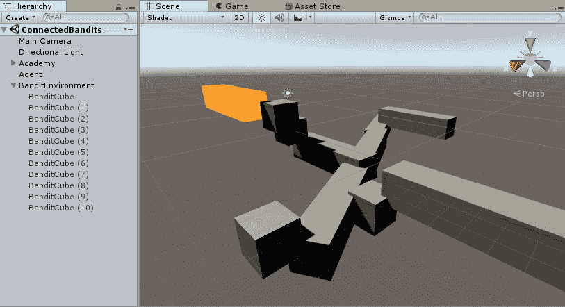

# 二、老虎机和强化学习

在前一章中，我们介绍了机器学习和 ML 中使用的学习或训练类型(无监督训练、有监督训练、强化学习、模仿学习和课程学习)。正如我们所讨论的，各种形式的学习各有利弊。虽然使用监督训练的 ML 早在 20 年前就已经在游戏中成功使用，但它从未真正找到任何吸引力。直到强化学习的成功应用被证明能够玩经典的 Atari 游戏，并且比人类走得更好，对 ML 在游戏和模拟中的兴趣才被重新点燃。现在，RL 是 ML 研究中最热门的话题之一，并显示出构建一些真正的持续学习人工智能的潜力。我们将用这一章的大部分时间来理解 RL，以及它是如何被应用到游戏和模拟中的。

强化学习和其他形式的高级学习并不是没有批评，一般来说，设置起来也不简单。在你阅读这本书的过程中，请记住这一点，并最终建立自己的 ML 或大脑。许多 RL 的批评者列举了设置和配置超参数的困难，这就是为什么我们将探索几种不同的有用策略来克服这些问题。Unity ML-Agents 在默认情况下包含了这些策略中的几个，我们将在本书的后面探讨这些策略。

在这一章中，我们将探讨 RL 的许多方面和其他相关原则，如上下文老虎机。以下是我们将在本章中涉及的主要主题的总结:

*   强化学习
*   背景老虎机和国家
*   勘探和开发
*   MDP 和贝尔曼方程
*   Q 学习和连接的老虎机
*   练习

如果你错过了第一章，一定要下载这本书的源代码，并加载`Chapter_1_End`的资源包。你首先需要从 GitHub 获取 ML-agent 的代码，相关步骤可以在[第 1 章](part0021.html#K0RQ0-c0290fc391a247b5ae9c3b6066c9fb32)、*介绍机器学习和 ML-agent*中找到。


# 强化学习

强化学习植根于动物和行为心理学，它被用于机器学习的许多应用中，从游戏和模拟到控制优化，信息论，统计学，以及每天更多的领域。在最基本的层面上，RL 描述了一个主体在一个环境中的行为，这个环境基于这些行为接受积极或消极的回报。下图显示了无状态 RL 模型:


Stateless Reinforcement Learning

方便的是，我们在上一章中构建的多臂老虎机问题非常适合这种更简单的 RL 形式。那个问题只有一个状态，或者我们称之为单步 RL 问题。由于代理不需要担心状态，我们可以大大简化 RL 方程，只需使用以下方程写出每个动作的值:


请考虑以下情况:

*   每个动作的值的向量(例如，`1.2`、`2.2`、`3`、`4`)
*   行动
*   学习率，取值从 0 到 1。值为 0 表示没有学习，而较高的值会增加学习的速率
*   对行动观察到的奖励

我们这里的等式被称为*值*函数，我们用它来确定代理行为的值。理解这个等式的工作原理是很有用的，因此让我们通过下面的练习将价值函数添加到我们之前的 bandit 问题中:

1.  打开 Unity 编辑器，回到上一章我们离开的地方。使用**玩家**的大脑，确保**老虎机**正确运行。

如果你跳过了最后一章，你可以从本书的源代码文件夹中的`Chapter_1_End.unitypackag`中找到`Chapter01`的代码。包加载后，一定要测试项目，以确保一切正常。您可能需要重新配置 Bandit 对象，因此请确保该对象附加了 Bandit 脚本，并且设置了金、银和铜材质。

2.  选择`Brain`对象，然后在`Brain`组件上，将大脑类型设置为启发式。点击添加组件按钮，搜索`SimpleDecision`脚本，并将其添加到对象中。
3.  单击新组件旁边的齿轮图标，然后选择编辑脚本。在脚本中输入以下代码:

```
      using System.Collections.Generic;
      using UnityEngine;
      public class SimpleDecision : MonoBehaviour, Decision
      {
          private int action;
          private int lastAction;
          public float learningRate;
          public float[] values = new float[4];

          public float[] Decide(
              List<float> vectorObs,
              List<Texture2D> visualObs,
              float reward,
              bool done,
              List<float> memory)
          {
              lastAction = action-1;
              if (++action > 4) action = 1;
              if (lastAction > -1)
              {
               values[lastAction] = values[lastAction] + learningRate * 
               (reward - 
               values[lastAction]);
              }
              return new float[] { action };
          }

          public List<float> MakeMemory(
              List<float> vectorObs,
              List<Texture2D> visualObs,
              float reward,
              bool done,
              List<float> memory)
          {
              return new List<float>();
          }
      }
```

4.  `SimpleDecision`脚本是动作发生的地方，而`Decide`方法是我们需要设置动作的地方。在这个例子中，我们只是在手臂间循环，并确定手臂划水的价值函数。在`Decide`方法里面，我们首先抓取大脑的最后一个动作。然后，我们使用一些简单的循环代码来递增当前动作，当动作大于`4`时，我们将其重置回`1`。这将使我们的代理现在有系统地循环通过老虎机武器。随着每只手臂被拉动，我们使用从先前动作返回的**奖励**来为我们的价值函数计算新的值。我们将这些值存储在一个数组中，方便地称为值。在`MakeMemory`中，我们将在此时返回相同的内存。完成编辑后，保存文件并返回编辑器。

请记住，在这种状态下，我们不评估任何状态。我们的代理就是这个例子，我们以重复的方式尝试所有的动作，并且将一直运行，直到我们停止模拟。我们几乎可以运行样本；我们只需要配置代理的新参数。


# 配置代理

返回 Unity 编辑器，按照以下步骤配置代理:

1.  在层级窗口中选择`Brain`对象。
2.  设置简单决策组件参数，如下面的屏幕截图所示:


代理运行旁边的代理配置

3.  输入参数后，保存项目和场景。
4.  按 Play 运行场景，在选择了`Brain`对象的情况下，观察每个动作的值(`0`表示动作`1`)如何快速收敛到每次手臂拉动的`reward`值。前面的截图也显示了这一点。请记住，在上一章中，我们将这些设置为以下内容:
    *   `Arm 1 = Gold = 3 reward`
    *   `Arms 2 and 3 = Bronze = 1 reward`
    *   `Arm 4 = Silver = 2 reward`

如果运行模拟时遇到观测误差，不用担心；重新加载项目时，有时会出现这种情况。选择大脑对象，并在`Brain`组件上，删除所有摄像机观察。换句话说，将长度设置为 0。

在这一点上，我们还没有作出任何决定，但希望你能意识到有一个可验证的等式是多么有用，我们可以用它来确定一个行动的价值。当然，您可以添加一些决策代码来使用 value 函数。这样，大脑可以评估下一个最好的行动，从而解决多臂老虎机问题...或者可能吗？想想看:在代理的第一个动作后，手臂拉动`1`，他们将获得最大奖励`3`。在这一点上，代理可以在收到最大奖励后停止，继续探索，或继续拉同一只手臂。这就是所谓的探索/利用困境，我们将在下一节关于上下文相关的老虎机和状态中花更多的时间来讨论这些问题和其他问题。


# 背景老虎机和国家

我们理解 RL 的下一步将是看上下文中的 bandit 问题。背景老虎机是多武器老虎机问题，多个老虎机每个产生不同的奖励。这种类型的问题在在线广告中有许多应用，其中每个用户被认为是不同的老虎机，目标是为该用户呈现最好的广告。为了模拟老虎机的背景，以及老虎机是谁，我们添加了状态的概念。我们现在将状态解释为代表不同的老虎机。下图显示了情境老虎机问题中状态的添加，以及它在我们通往荣耀之路上的位置:


Stateless, Contextual and Full RL models

您可以在上图中看到，我们现在需要在评估操作之前确定状态。如果您回想一下前面的内容，Value 函数只接受一个动作，但是现在我们还需要评估 state。让我们重写我们的值，或 V，函数来接受行为和状态的输入，作为质量的函数。我们可以根据质量重写 V 函数，如下所示:


考虑以下情况:

*    Isa 值的表格或矩阵。我们用`[]`代替`()`来表示不同
*   状态
*   行动
*   学习率，从`0`到`1`取值
*   对观察到的状态和行动的奖励

这为我们提供了质量或 Q 函数，它将状态和动作作为输入，并返回带有状态或观察的给定动作的质量。虽然 Q 和 V 函数相似，但 Unity 中的代码实现是不同的，值得更仔细地研究。跟随我们将多臂老虎机问题转化为上下文老虎机问题:

1.  在`Project`窗口中打开`Assets/Simple/Scripts`文件夹。在窗口中右键单击(*命令* +点击 macOS)，从上下文菜单中选择`Create -> C# Script`。
2.  将新脚本命名为`SimpleArm`，双击它打开您的代码编辑器。
3.  将脚本简化为以下代码:

```
      using UnityEngine;

      public class SimpleArm : MonoBehaviour {
        public Material material;
        public int rewardValue; 
      }
```

4.  `SimpleArm`是`Material`和`rewardValue`的简单容器。完成编辑后保存文件。
5.  在`Hierarchy`窗口中找到`Bandit`对象。点击`Inspector`窗口中`Bandit`组件旁边的`Gear`图标，并从上下文菜单中选择`Edit Script`。
6.  用以下代码替换`Bandit.cs`脚本中的金、银和青铜材质字段:

```
      public SimpleArm[] arms;
```

7.  我们现在将使用一个名为`arms`的`SimpleArm`数组。
8.  用以下代码替换`PullArm`方法的全部内容:

```
      if (arm < 0 || arm > arms.Length) return 0;
      mesh.material = arms[arm - 1].material;
      return arms[arm-1].rewardValue;
```

9.  正如你所看到的，像这样抽象手臂大大简化了我们现在的`PullArm`方法。保存文件并返回 Unity。

现在我们已经完成了`Bandit.cs`和`SimpleArm.cs`脚本，我们可以返回 Unity 并在场景中设置游戏对象。

通常，在构建场景时，您可能希望首先从派生脚本或场景对象切换。你如何做到这一点可能取决于你正在解决的问题，或者只是成为个人偏好。Unity 的伟大之处在于它允许你在场景中构建那些可视的占位符，然后再填充逻辑。


# 构建情境老虎机

现在，有了更新后的`Bandit`和`SimpleArm`类的逻辑，我们可以继续配置我们的场景对象。按照以下步骤创建多个老虎机:

1.  从菜单中选择`GameObject -> Create Empty`。重命名新对象`Arms`。我们将为老虎机们共享的所有老虎机武器做一个容器。共享手臂将使设置这个任务更简单。
2.  在层级窗口中选择新的`Arms`对象，然后从菜单中选择`GameObject -> Create Empty`。这将创建一个新的子对象`Arms`。重命名新的子对象`GoldArm`。
3.  选择`GoldArm`，将其`Material`和`rewardValue`设置为您选择的一个。
4.  选择**金臂**，按下 *Ctrl* + *D* ( *命令* + *D on* macOS)复制手臂。重命名新手臂`SilverArm`，并适当调整其属性。
5.  对另一个名为`BronzeArm`的手臂重复步骤 4。您可以自行决定创建更多手臂。尝试不同的材料和奖励值。
6.  选择`Bandit`对象，在 Inspector 窗口中赋予 Bandit 组件四只手臂，如下图所示:


设置老虎机武器

7.  选择**老虎机**对象，键入 *Ctrl* + *D* ( *命令* + *D on* macOS)复制老虎机。给这个物体重新命名`Bandit_2,`，然后按照你喜欢的方式重新配置手臂，但是要确保每个老虎机都有四只手臂。
8.  重复步骤 7，再添加两个名为`Bandit_3`和`Bandit_4`的老虎机。一定要重新配置每个老虎机的武器位置，使他们不同。
9.  设置每个老虎机的**变换位置 X** ，使他们排成一行，每个老虎机之间留有空间。
10.  完成后，保存场景和项目。

完成后，你现在应该有四个老虎机，每个都有四只手臂，这给了我们一个 Q 函数，它代表一个 4 X 4 的状态表，动作值。如果您还记得，我们将`V`函数放在了`SimpleDecision` **、**中，这意味着接下来我们必须更新决策代码。


# 创建上下文决策脚本

我们现在需要将决策代码从多臂老虎机问题升级到上下文老虎机问题。继续前进，进入编辑器并遵循以下步骤:

1.  在`Assets/Simple/Scripts`文件夹中找到`SimpleDecision`脚本。选择脚本并键入 *Ctrl* + *D(在 macOS 上为 Command + D* )复制脚本。这将复制脚本并导致错误。不用担心；该错误只是一个重复的名称，我们将很快修复。
2.  重命名新脚本`ContextualDecision`，然后双击它，在代码编辑器中打开它。

3.  将该类重命名为`ContextualDecision`，如下所示:

```
      public class ContextualDecision : MonoBehaviour, Decision
```

4.  在脚本顶部添加或修改变量声明，如下所示:

```
      private int action;
      private int lastAction, lastState; 
      public float[][] q; 
      public float learningRate;
```

5.  接下来，我们将添加一个新的`Awake`方法来初始化我们的`q`表，如下所示:

```
      public void Awake()
      {
        q = new float[4][];
        for (int i = 0; i < 4; i++)
        {
          q[i] = new float[4];
        }
      }
```

6.  `Decide`方法也需要更新如下:

```
      public float[] Decide(
        List<float> vectorObs,
        List<Texture2D> visualObs,
        float reward,
        bool done,
        List<float> memory)
      {
        lastAction = action-1;
        if (++action > 4) action = 1;
        if (lastAction > -1)
        {
          q[lastState][lastAction] = q[lastState][lastAction] + 
          learningRate * (reward           - q[lastState][lastAction]);
        }
          lastState = (int)vectorObs[0];
          return new float[] { action };
        }
```

7.  注意我们是如何用`q`函数替换上一个例子中使用的`Value`函数的。记住，`q`或`Q`功能跟踪状态和动作。注意，最后我们将`vectorObs[0]`值保存为我们的状态。观察与捕获或观察状态相同。在这个例子中，我们的状态将代表代理正在拉手臂的当前老虎机。
8.  确保保存脚本并返回到编辑器。在继续之前，请确保没有编译错误。接下来，我们需要替换大脑上的决策脚本。
9.  在`Hierarchy`窗口中找到`Brain`对象并选择它。移动到`Inspector`窗口，用`Context Decision`组件替换`Simple Decision`组件。

你已经在第一章中交换了一些组件/脚本。同样，确保将`Contextual Decision`组件上的`learningRate`设置为`.9`值，就像我们在上一个例子中所做的一样。

这就完成了新的`ContextDecision`脚本，现在我们可以继续更新代理脚本了。


# 更新代理

我们差不多完成了。我们需要做的最后一件事是设置代理来感知老虎机，并返回当前老虎机的观察结果。在编辑器中打开`SimpleAgent`脚本，按照以下步骤更新脚本:

1.  将以下字段声明替换为:

```
 public Bandit bandit; //delete me
      public Bandit currentBandit;
      public Bandit[] bandits;
```

2.  接下来，我们需要更新`CollectObservations`方法，如下所示:

```
      public override void CollectObservations()
      {
        var bandit = Random.Range(0, bandits.Length);
        currentBandit = bandits[bandit];
        AddVectorObs(bandit);
      } 
```

3.  这里，我们返回对当前代理所处状态的观察。我们通过随机选择一个`bandit` 索引来确定状态，我们使用该索引从`bandits`的数组中选取`currentBandit`。我们通过使用`AddVectorObs(bandit)`调用返回观察或状态。

4.  修改`AgentAction`方法如下:

```
      public override void AgentAction(float[] vectorAction, 
      string textAction)
      {
        int action = (int)vectorAction[0];
        AddReward(currentBandit.PullArm(action));
      }
```

5.  在`AgentStep`中，我们再次提取动作。然后，执行`currentBandit`上的动作，领取奖励。
6.  最后，我们需要用下面的代码更新`AgentReset`方法:

```
      public override void AgentReset()
      {
        if(currentBandit) currentBandit.Reset();
      }
```

7.  我们只想确保在调用`Reset`之前`currentBandit`已经设置好。完成编辑后，保存文件并返回 Unity。
8.  在**层次**窗口中选择**代理**对象，在**简单代理**组件上设置**盗匪**，如下图所示:


把老虎机放在代理上

我们的代理现在已经配置好了，如前面的屏幕截图所示。我们现在需要用一种方法或算法来更新**大脑**和`SimpleDecision`脚本，使我们能够探索并利用环境。我们将在下一节讨论探索和开发。


# 勘探和开发

我们在 RL 中面临的一个困境是在探索所有可能的行动和利用最佳可能的行动之间的平衡。在多臂老虎机问题中，我们的搜索空间足够小，可以用蛮力来完成这个任务，基本上只需要一个接一个地拉动每个臂。然而，在更复杂的问题中，状态的数量可能会超过已知宇宙中的原子数量。是的，你没看错。在这种情况下，我们需要建立一种政策或方法来平衡勘探和开发的困境。有几种方法可以做到这一点，以下是最常见的方法:

*   **贪婪乐观**:代理最初从其 q 表中的高值开始。这迫使代理至少探索所有状态一次，因为代理总是贪婪地选择最佳动作。
*   **贪婪于噪声**:对于每一步，我们随机地将噪声添加到估计值中。随机噪声将在最佳动作值和当前值之间变化。这允许动作值收敛到最佳值。
*   在这种情况下，我们设置一个固定的或收敛的概率，代理将随机探索。在每一步，我们测试看看是否有机会代理随机探索或只是贪婪地选择当前的最佳行动。

在这个例子中，我们将使用 **Epsilon-greedy** 探索/开发方法，但是我们鼓励您构建并尝试其他两个选项。在下一节中，我们将研究如何添加这种形式的探索。


# 用简单的决策做决策

为了简单起见，我们忽略了在多臂老虎机问题中添加任何决策逻辑。既然我们对 RL 和探索与开发的两难境地有了更好的理解，我们可以添加**ε-贪婪**探索方法。ε-贪婪探索是一种方法，通过该方法，随着代理随时间探索，代理的随机探索机会减少。这允许代理在早期经常探索，但是随着代理学习，它随机行动的机会减少。在代码编辑器中打开`ContextualDecision`脚本，并遵循以下步骤:

1.  将下面的`using`语句添加到文件的顶部:

```
      using System.Linq;
```

2.  将 epsilon exploration 字段添加到该类，声明如下:

```
      public float explorationEpsilon;
```

3.  `explorationEpsilon`字段将用于确定大脑/决策想要探索的可能性有多大，其中该阈值确定代理想要搜索的随机程度。就是我们`Epsilon-greedy`法中的ε。稍后训练大脑时，我们会将其设置为从`0`到`1.0`的值。
4.  将`Decide`方法的最后一行修改如下:

```
return new float[] { action }; //replace this line
      return DecideAction(q[lastState].ToList());
```

5.  使用以下代码添加新方法`DecideAction`:

```
      public float[] DecideAction(List<float> state)
      {
        var r = Random.Range(0.0f, 1.0f);
        explorationEpsilon = Mathf.Min(explorationEpsilon-.001,.1f);
        if(r < explorationEpsilon)
        {
          action = RandomAction(state) + 1;
        } else {
          action = GetAction(state) + 1;
        }
        return new float[] { action };
      }
```

6.  在`Decide`中，我们随机生成一个从`0.0f`到`1.0f`的值。然后将该值`r`与`explorationEpsilon`变量进行比较。如果`r`小于`explorationEpsilon`，我们随机选取一个动作；否则，我们调用`GetAction`返回动作。然后，我们用选择的`action`返回一个数组，就像我们之前做的一样。请注意，在每次呼叫决定后，我们是如何减少`explorationEpsilon`的。同样，我们这样做是为了鼓励早期探索，但随着时间的推移，我们的期望是，我们的代理人将对环境有足够的了解，能够做出自信的决定。我们将由您来添加最小`explorationEpsilon`值的属性，因为它当前被硬编码到`.1f`中，或者设置为`.01f`的下降率的属性。

7.  接下来，我们将创建如下的`RandomAction`方法:

```
      private int RandomAction(List<float> states)
      {
        return Random.Range(0, states.Count);
      }
```

8.  然后，创建`GetAction`方法，如下所示:

```
      private int GetAction(List<float> values)
      {
        float maxValue = values.Max();
        return values.ToList().IndexOf(maxValue);
      }
```

9.  在`GetAction`中，我们首先使用`Linq`找到所有状态的`maxValue`。然后，我们返回`maxValue`的索引位置，这也正好是我们的**动作**索引。这是一种贪婪的方法，通过选择奖励最高的行动来挑选最佳行动。
10.  保持`MakeMemory`不变，并在返回 Unity 前保存文件。
11.  选择**学院**下的**大脑**并进行配置，如下截图所示:


设置大脑配置

12.  我们将为`.5`的**探索ε**使用高初始值。这将允许我们观看我们的代理探索更多。保存场景和项目。
13.  按**播放**运行项目，观看代理探索拉武器。在某些时候，你应该看到你的最高奖励手臂(在我们的例子中是黄金)出现得更频繁了。

14.  等待几秒钟，或最多一分钟，你的代理人应该让你的每一个老虎机在最大奖励显示突出的材料。现在，有时，您的代理可能会忙于拉其他老虎机的手臂，以至于可能会错过一个老虎机，您会看到它卡在青铜或白银手臂上，如以下截图所示:


一个已经学会最大化老虎机回报的特工

15.  看看是否可以通过修改 **Brain** 对象的**context decision**属性来复制前面的截图。试试看有什么办法能让所有的**老虎机**显摆**黄金**。然后，尝试相反的方法，看看你能让代理运行到什么程度。

现在，您应该对 RL 中 exploration 的重要性和一些权衡有了更好的理解。正如你可能已经注意到的，在你的代理人探索的程度和虚假的信心如何使他们失明之间可能存在微妙的平衡。虚假自信在 ML 和 RL 整体上可能是个大问题。数据科学家和其他 ML 实践者已经通过针对训练数据集开发他们自己的算法，然后针对看不见的测试或推理数据集测试他们的算法来解决这个问题。在 ML-Agents 中，我们将使用训练环境进行所有的训练。您可以在以后自己使用推理环境进行进一步的训练。

我们刚刚使用的学习率和探索ε参数将被归类为超参数。这些参数往往需要我们的大脑或 ML 算法来调整，以学习最佳的全局解。在某些情况下，就像我们前面看到的，为这些参数选择不好的值可能只能找到局部最优解。

在之前的练习中，我们介绍了探索的重要性和平衡，以鼓励我们的情境式 RL 代理进行探索并做出自信的决策。在下一节中，我们将讨论完整的 RL 问题，并学习如何构建一个代理来处理更复杂的问题。


# MDP 和贝尔曼方程

如果你以前学习过强化学习，你可能已经遇到过 MDP 这个术语，它指的是马尔可夫决策过程和贝尔曼方程。MDP 被定义为离散时间随机控制([【https://en.wikipedia.org/wiki/Stochastic】](https://en.wikipedia.org/wiki/Stochastic))[过程，但是，更简单地说，它是基于一定量的不确定性结合数学做出决策的任何过程。这种相当模糊的描述仍然非常符合我们如何使用 RL 来做决策。事实上，本章我们一直在开发 MDP 过程，现在你应该对这个概念相当熟悉了。](https://en.wikipedia.org/wiki/Optimal_control_theory)

到目前为止，我们只对部分 RL 或单步问题建模。我们对状态的观察只针对一个步骤或一个动作，这意味着代理人总是会收到即时的奖励或惩罚。在一个完全 RL 问题中，一个代理可能需要采取几个行动才能收到一个积极的回报。为了模拟这种提前或延迟的奖励，我们必须使用贝尔曼方程，如下所示:


请考虑以下情况:

*   
*   
*   

贝尔曼方程用于预测未来的最大回报。我们可以将其与之前的 Q 函数相结合，得出以下等式:


记住这一点:


这产生了一个新的 Q 学习方程，它与我们在前面的练习中已经使用的方程没有太大的不同。通过添加贝尔曼方程，我们现在考虑了未来奖励的一个步骤，并可以注意到方程的细微变化。特别是，这包括如何将未来状态作为 Q 函数的输入，从而允许计算下一个状态的最大奖励。这个等式的基本工作原理是为每个状态和动作对设置值面包屑。代理了解这些价值面包屑的价值何时最大化。然后，代理使用这些价值面包屑导航到最大的回报。下图显示了一个游戏区域网格，其中代理已经运行了 100 次迭代，并确定了许多值和 Q 值:


网格上显示的值和 Q 值

值为`1.0`和`-1.0`的方块代表结束方块的最终奖励，而所有其他方块的奖励值为`-1`。如果你把手指放在格子上的任何一个方格里，然后沿着最大 Q 值给你指出的方向走，你就会找到获得最大回报的路径，就像 Q 学习代理一样。

代理人选择的路径是最优的吗？还能更好吗？

在下一节中，我们将通过在代理迷宫中将我们的老虎机连接在一起来进一步演示 Q 学习。


# q-学习和连接代理

通常，Q 学习是使用网格问题来教授的，就像我们在上一节中看到的那样。然而，在这里，我们想要一些稍微复杂和抽象的东西，也允许你，读者，在它的基础上进一步探索。我们已经收集了一个有趣的例子，在这个例子中，我们把我们的老虎机表现为房间或有许多出口选择的物体。这个例子也可以很容易地代表一个地牢或另一个相连的房间结构，你需要通过导航代理。按照以下步骤开始构建连接代理练习:

1.  从菜单中选择`Assets -> Import Package -> Custom Package...`，然后导航到该书下载的源代码并导入`Chapter_2_Connected_Bandits_unitypackage`。这是一个例子，它已经为你完全构建好了。对于那些想要更多 Unity 游戏经验的人，我提前道歉，但是我们想尽可能多的花时间在 ML 上。
2.  导入所有资产，然后打开可以在`Assets/Simple`文件夹中找到的 ConnectedBandits 场景。打开场景后，您应该会看到类似于以下截图的内容:



连接老虎机场景

3.  每个立方体或扩展矩形代表一个房间或连接的对象。该代理将被随机放入其中一个立方体，然后有望进入最终的黄金立方体，该立方体有`1.0`奖励。所有其他立方体都有`-.1`奖励。
4.  按下**播放**让场景运行。您应该看到蓝色物质代表的代理人占据每个立方体，试图找到到达终点的路(**金色**立方体)。让代理运行一段时间，您应该会看到它最终会很好地找到回家的路。当你对代理的进展感到满意时，停止该场景。

迷宫是使用`BanditCubes`构建的。这些立方体只是用碰撞器设置的对象，允许立方体自动检测它们接触的其他立方体。这将允许你通过使用*Ctrl+D*[*Command+D*在 macOS 上]添加新的立方体或者以任何方式移动立方体来自己修改迷宫。只要立方体接触，代理就有一条路径可循。随意做一个超级复杂的迷宫，看看训练你的代理需要多长时间。


# 查看 Q 学习 ConnectedDecision 脚本

在立方体的自动连接中有一些特殊的代码处理，但是我们不会详细讨论。鼓励那些想扩展这个例子的读者进一步研究这个代码。然而，就我们的目的而言，我们唯一需要关注的是决策脚本中的变化。在`Assets/Simple`文件夹中找到 ConnectedDecision 脚本，双击它，在编辑器中打开它，按照以下步骤操作:

1.  在顶部，我们有以下声明:

```
      public float learningRate = .9f;
      public float gamma = .9f;
      public float explorationEpsilon = .9f;
      private float[][] q; 
      private int lastAction, lastState;
      private int action;
```

2.  你可以看到我们引入了一个新的术语，`gamma`，我们将用它来贴现未来的奖励。

3.  向下滚动到`Q`属性或功能:

```
      public float[][] Q {
        get{
          if (q == null)
          {
             var connectedAcademy = 
             Object.FindObjectOfType<ConnectedAcademy>() as 
             ConnectedAcademy; 
             q = new float[connectedAcademy.bandits.Length][];
             foreach(var bandit in connectedAcademy.bandits)
             {
               if (bandit.Connections.Count == 0)
               {
                 q = null;
                 return q;
              }
              q[bandit.index] = new float[bandit.Connections.Count];
            } 
          }
        return q;
        }
      } 
```

4.  为了方便和处理，我们将`Q`写成一个属性。在里面，我们根据 bandit 连接设置初始值。`ConnectedAcademy`持有对`BanditEnvironment`的引用，T5 是`BanditCubes`的容器。注意我们是如何构造一个交错的数组的，因为每个 bandit 的连接数可能不同。

我们刚刚导出的 Q 学习方程属于 RL 算法家族，我们将在接下来的章节中进一步探索，以及许多其他使用它们的技术。我们才刚刚开始探索 RL 和其他形式的学习，我们将在后面的章节中探索更多。

5.  最后，主要的变化是在`Decide`方法中，正如您可以从这段代码中看到的:

```
      public float[] Decide(List<float> vectorObs, List<Texture2D> 
      visualObs, float 
      reward, bool done,                   List<float> memory)
      {
        if (Q == null) return new float[] { 0 };
        lastAction = action-1; 
        var state = (int)vectorObs[0];
        if (lastAction > -1)
        { 
          Q[lastState][lastAction] = Q[lastState][lastAction] + 
          learningRate * (reward 
          + gamma * Q[state].Max()) - Q[lastState][lastAction];
        }
        lastState = state;
        return DecideAction(Q[state].ToList());
      }
```

6.  我们已经在 Decide 方法中介绍了大部分代码，所以我们不需要再重复一遍。只要确定并理解这个 Q 函数和我们在前面练习中看到的以前版本的区别。

这涵盖了我们需要检查的大部分相关代码。如前所述，为了使这个版本自动运行，还需要做大量的代码修改。虽然您可能会发现其他代码很有趣，但对于我们目前学习 ML 的旅程来说，这并不是必需的。

示例中唯一的其他主要变化是将代理的最大步数从 0 设置为 100。如果代理没有找到目标，它会告诉代理在重新启动前最多移动 100 步。如果你建造大而复杂的迷宫，你可能需要调整这个更高的值。请记住，代理可能需要徘徊一段时间，才能找到有用的线索。

许多关于强化学习的课程花了更多的时间讲述 MDP 的基础知识和基于观察状态的回报最大化的概念。然而，它们通常无法涵盖我们刚刚详细介绍过的具体实现细节。因此，建议读者观看由几所被认可的大学提供的许多关于 RL 和 MDP 的免费在线讲座系列中的一个。你可能还会发现，学习这些课程所涉及的复杂数学现在变得更容易了，因为你已经学会了这些算法的实际用途。

有了 RL 的基础知识，你应该有足够的把握在后面的章节中深入研究更复杂的任务。不过现在，请务必自己尝试下一部分的练习。


# 练习

“对于我们在做之前必须学习的东西，我们通过做来学习。”

–arits tole

请务必独立完成以下问题或练习:

1.  用你自己的设计扩展上一节中的 bandit cube 迷宫。确保所有立方体都保持连接，以便代理有一条清晰的路径到达终点。
2.  想想游戏、模拟或其他方面的另一个问题，您可以使用 RL 和 Q 学习算法来帮助代理学习解决这个问题。这只是一个思考练习，但是如果您构建了一个演示，请给自己一个大大的鼓励。
3.  为探索ε最小值和每个决策步骤的变化量添加新属性。请记住，这些是我们硬编码的参数，目的是降低ε贪婪探索值。
4.  添加显示单个`BanditCube`对象上的`Q`值的功能。如果您可以将值视为属性，那也可以。确保显示每个连接的`Q`值。
5.  探索 Unity ML 的另一个例子，并尝试开发一个使用 Q 学习算法的启发式大脑。


# 摘要

在这一章中，我们通过开发一个启发式大脑，使用一种叫做强化学习的 ML 技术来解决各种基本的学习问题，从而开始使用 ML-Agents 框架。为了首先介绍 RL 的概念，我们首先探索了经典的多臂老虎机问题。然后，我们通过添加上下文或状态感来扩展这个问题。这要求我们通过添加状态来修改我们的价值函数，并将我们的函数变成 Q 函数。虽然这种算法很好地解决了我们简单的学习问题，但它不足以解决更复杂的延迟奖励问题。引入延迟奖励需要我们查看贝尔曼方程，并理解我们如何在代理人的步骤中贴现奖励，从而为代理人提供 Q 值面包屑，作为一种找到回家路的方式。最后，我们加载了一个复杂的、相互关联的老虎机问题，要求我们的代理使用 Q 学习来导航复杂的迷宫。

在下一章中，我们将通过介绍 Python 和一些能给我们带来强大的 ML 工具的库，在学习 ML 的过程中迈出新的一步。我们将在下一章开始探索这些 Python 强大的工具。