<title>Deep Reinforcement Learning with Python</title> 

# 用 Python 进行深度强化学习

在过去的几章中，我们学习了 ML 的基础——当然，特别是 RL——使用 Unity 编辑器，一切都很好。不幸的是，RL 问题中的状态数可能会很快超过数十亿。例如，围棋游戏中的状态数已经超过了可观测宇宙中的原子数量。现在，处理这些深不可测的状态数并对这些类型的问题进行数学计算并不简单。事实上，由于谷歌和其他公司发布了一些功能强大的 ML 工具，统称为 TensorFlow，我们直到最近才能够处理这些数字。TensorFlow 是一个数学执行库，由于它提供的强大功能，它已经成为 ML 研究的基石。现在，使用 TensorFlow 时首选的工具集是 Python。Unity 不想重新发明一个巨大的轮子，决定围绕 Python 和 TensorFlow 建立 ML-agent。因此，在这一章中，我们将学习如何设置 Python 并使用这些工具开发更高级的 ML 代理。

在这一章中，我们将深入研究 Python 和许多其他 ML 工具和库的使用。以下是我们将在本章中关注的主要领域:

*   安装 Python 和工具
*   多智能体外部大脑
*   神经网络基础
*   深度 Q 学习
*   最近策略优化

当在 ML 中工作时，Python 已经成为首选的标准语言/环境。老实说，对于 Python 来说，有这么多免费且强大的 ML 工具可用，使用任何其他语言或平台都是没有意义的。

<title>Installing Python and tools</title> 

# 安装 Python 和工具

在这一节中，我们将介绍 Python 的一些基础知识，但是我们没有足够的时间来深入介绍这种语言。如果你是 Python 的新手，但有丰富的 C#编程经验，你应该可以继续学习。对于那些有 Python 经验的人来说，可能仍然需要特别注意设置，因为在撰写本文时，只有 Python 3.5 支持 ML-Agents。

如果你是编程新手，Python 是一门很好的学习语言。然而，对于更有经验的 C#开发人员来说，可以说，学习一门家族之外的新语言/框架是令人生畏的。毕竟，Python 不仅仅是一种语言:它是一种多重编程范式，也支持函数式、面向方面和元编程。如果你不确定要不要学习一门新语言，帮自己一个大忙，试试 Python——你可能会惊喜不止。

<title>Installation</title> 

# 装置

继续为您的操作系统进行相关的设置，如下面两个方法所示。

<title>Mac/Linux installation</title> 

# Mac/Linux 安装

以下设置指南是我们在[第 1 章](part0021.html#K0RQ0-c0290fc391a247b5ae9c3b6066c9fb32)、*介绍机器学习和 ML-Agents* 中克隆的 Unity ML-Agents 源代码随附指南的概述。为了完整起见，我们包括了本指南，但是如果您使用 Linux，您可能已经安装了 Python。完成以下步骤来安装 Python 和工具:

1.  从[https://www.python.org/downloads/](https://www.python.org/downloads/)下载并安装 Python 3。
2.  确保也安装了 pip。如果你不确定，可以查看[https://packaging . python . org/guides/installing-using-Linux-tools/# installing-pip-setup tools-wheel-with-Linux-package-manager](https://packaging.python.org/guides/installing-using-linux-tools/#installing-pip-setuptools-wheel-with-linux-package-managers)。
3.  导航到我们之前克隆的`ML-Agents`文件夹。
4.  导航到`python`文件夹并键入以下命令:

```
 pip3 install .
```

您应该看到安装了所需的依赖项。

如果您有任何问题，请务必查阅 Unity 文档以获取任何特殊说明。总的来说，在 macOS/Linux 上安装 Python 和所需的依赖项比在 Windows 上安装要简单得多，这一点我们将在下面介绍。

<title>Windows installation</title> 

# Windows 安装

Unity ML-Agents 的当前版本仅适用于 Windows 10。您可以尝试使用早期的操作系统，但预计会遇到问题。如果这样做，请使用以下指南来安装用于 ML 代理的 Python 环境:

1.  从 https://www.anaconda.com/download/[安装 Anaconda 3.6 (64 位)。](https://www.anaconda.com/download/)
2.  遵循安装程序的说明。确保使用高级选项，并按如下所示设置路径:

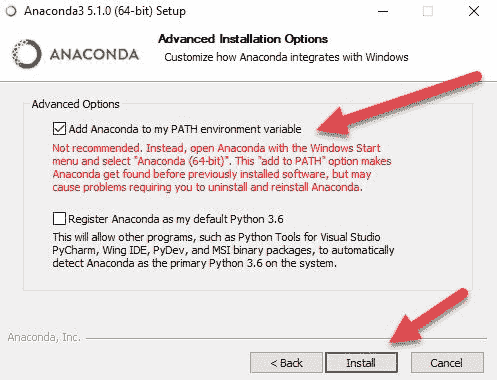

3.  虽然不建议这样做，但是设置这个选项对我们在本书的后面部分会很有用。Anaconda 将在安装完成后提示您安装 Visual Studio 代码。如果您还没有 VS 代码，一定要选择这个选项来下载并安装它。我们将在本书后面的章节中使用 VS 代码，现在安装它将为您节省一步时间。

4.  通过启动 Anaconda Navigator 来测试 Anaconda 的安装。按 Windows 键，然后输入 anaconda navigator，快速找到并启动应用程序。让应用程序保持打开，因为我们很快就会回来。

5.  通过在搜索栏中输入 anaconda 提示符(按 Windows 键)打开一个新的 Anaconda 提示符。
6.  在提示窗口中输入以下命令:

```
      conda create -n ml-agents python=3.5
```

7.  该命令将创建一个名为`[-n] ml-agents`的新 3.5 Python 环境。按照要求您下载依赖项的任何提示进行操作，当然，您需要连接到互联网。ML-Agents 目前依赖于 Python 3.5 因此，我们需要明确声明我们希望使用 Python 3.5。
8.  通过输入以下命令激活环境:

```
      conda activate ml-agents
```

9.  通过运行以下命令安装 TensorFlow:

```
      pip install tensorflow==1.4.0
```

10.  这将安装一些必需的软件包，但我们还需要一些。
11.  导航到`ml-agents`源文件夹中的 python 文件夹。如果你记得，我们把它下载到了`C:\ML-Agents\ml-agents\`，如果你按照`Chapter01`中的说明从 GitHub 下载 ML-Agents 源代码:

```
      cd c:\ML-Agents\ml-agents\python
```

12.  通过运行以下命令，安装 ML 代理所需的 Python 依赖项:

```
      pip install .
```

13.  在运行前面的命令之前，请仔细检查文件夹。一旦安装了库，您的环境就完成了，您可以继续前进了。

如果您遇到问题，您可以再次运行整个安装，只需选择不同的文件夹进行安装。您可能还会发现设置几个不同的环境来运行和测试是很有用的。

<title>Docker installation</title> 

# 码头设备

如果你熟悉 Docker，这也是另一个很棒的选择。这里我们不会涉及使用 Docker 的具体细节，你应该查阅你所需要的操作系统的指南。

<title>GPU installation</title> 

# GPU 安装

TensorFlow 支持使用 GPU 来开发高度计算的应用程序，就像我们使用 ML-agent 进行构建一样。虽然使用 GPU 对于数值复杂的问题是必不可少的，但 ML-Agents 目前不需要受支持的 GPU 来运行 TensorFlow。这意味着我们目前可以绕过安装对 GPU 驱动程序的支持。如果您想将 TensorFlow 与 GPU 一起使用，请确保检查 Unity 的内部坞站以及您的硬件和操作系统的正确设置指南。

<title>Testing the install</title> 

# 测试安装

安装 Python 和操作系统所需的依赖项后，确保所有东西都安装正确。幸运的是，对于当前支持的所有操作系统，运行测试的命令本质上是相同的。完成以下快速步骤来测试安装:

1.  像前面一样，打开命令 shell 或 Anaconda 提示符窗口。
2.  导航到`ml-agents/python`文件夹。如果您继续上一个练习，您应该已经在那里了。

3.  在 shell 或 Anaconda 提示符窗口中输入以下命令:

```
      jupyter notebook
```

4.  这将打开带有 Jupyter 笔记本窗口的默认浏览器，如下面的屏幕截图所示:

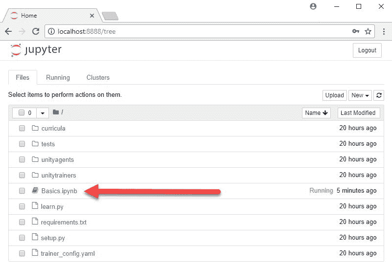

从 python 文件夹运行的 Jupyter 笔记本

5.  点击`Basics.ipynb`文件，如前面的截图所示。如果您的浏览器无法打开该页面，您可以打开浏览器并输入`http://localhost:8888`访问该页面。如果页面显示其他内容，请确保您输入的地址正确，并且其他服务没有使用端口`8888`。

6.  这将加载基础笔记本。基础知识是一个介绍性的测试笔记本，您可以使用它来测试 Unity 测试环境的正确设置。

这就是我们目前需要覆盖的所有内容。我们将在下一节开始设置你的第一个 ML-Agents 外部大脑。

<title>ML-Agents external brains</title> 

# 外部大脑

到目前为止，我们所有的实验都是使用启发式大脑，使用一种叫做 Q-learning 的内部 RL 算法。既然我们意识到 C#脚本只能到此为止，我们可以看看使用 Python 开发的 ML-Agent 外部大脑。Unity 的首选方法是在外部运行一个 Jupyter Python 笔记本来控制 Unity 训练环境。这就需要我们构建一个特殊的团结环境。完成以下步骤，了解如何为外部训练配置 3D 球环境:

1.  打开 Unity 编辑器并加载 ML-Agents 演示`unityenvironment`项目。如果你从上一章开始就一直打开着它，那也可以。
2.  打开`ML-Agents/Examples/3DBall`文件夹中的`3DBall.scene`。
3.  在层级窗口中找到`Brain3DBrain`对象并选择它。在检查器窗口设置大脑类型为外部。
4.  从菜单中，选择编辑|项目设置|播放器。在“检查器”窗口中，设置属性，如下图所示:

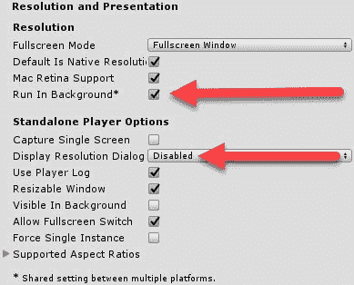

5.  设置播放器分辨率属性

6.  从菜单中，选择文件|构建设置。单击“添加开放场景”按钮，并确保只有 3DBall 场景处于活动状态，如以下对话框所示:

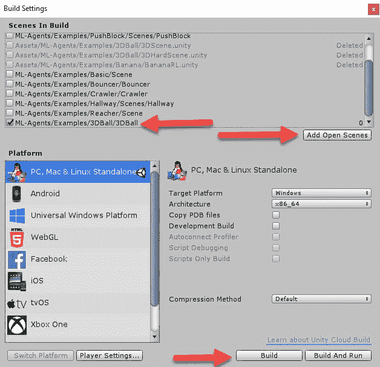

设置 Unity 环境的构建设置

7.  将目标平台设置为您选择的桌面操作系统(在本例中为 Windows ),然后单击对话框底部的 Build 按钮。
8.  系统将提示您选择一个文件夹来构建。在 ml-agents 文件夹的底部选择 python 文件夹。
9.  If you are prompted to enter a name for the file, enter 3DBall. On newer versions of Unity, from 2018 onward, the name of the folder will be set by the name of the Unity environment build folder, which will be python.

    确保您知道 Unity 将构建放在哪里，并确保文件在 python 文件夹中。在编写本文时，在 Windows 上，Unity 将可执行文件命名为`python.exe`，而不是`3DBall.exe`。当我们开始设置 Python 笔记本时，记住这一点很重要。

随着环境的构建，我们可以继续针对应用程序运行基础笔记本。在下一节中，我们将通过运行 Jupyter 笔记本来控制环境。

<title>Running the environment</title> 

# 运行环境

再次打开基本的 Jupyter 笔记本；请记住，在测试 Python 安装之后，我们希望让它保持开放。如果您有使用 Python 和 Jupyter 的经验，您可能只想自己浏览一下笔记本。对于那些想要更多帮助的人，请完成以下步骤:

1.  确保使用您的环境名称更新第一个代码块，如下所示:

```
      env_name = "python" # Name of the Unity environment binary to launch
      train_mode = True # Whether to run the environment in training or 
      inference mode
```

2.  我们在这里将环境名称设置为`'python'`,因为这是构建到 python 文件夹中的可执行文件的名称。您可以包括文件扩展名，但这不是必须的。如果您不确定文件名是什么，请检查文件夹。这真的会让你少受些挫折。
3.  进入第一个代码块，然后单击工具栏上的 Run 按钮。单击 Run 将运行当前光标所在的代码块。这是笔记本的一个非常强大的功能；在构建复杂算法时，能够在代码块之间来回移动并执行您需要的内容非常有用。

4.  在第二个代码块中单击，然后单击 Run。第二个代码块负责加载代码依赖项。请注意第二个代码块中的以下行:

```
      from unityagents import UnityEnvironment
```

5.  这一行是我们导入`unityagents` UnityEnvironment 类的地方。这个类是我们运行环境的控制器。
6.  运行第三个代码块。请注意 Unity 窗口将如何启动，显示环境。您还应该注意到显示成功启动和大脑统计的输出。如果您在这一点上遇到错误，请返回并确保使用正确的文件名设置了`env_name`变量。
7.  运行第四个代码块。您应该再次看到更多的输出，但不幸的是，使用这种控制方法，您看不到交互活动。我们将在后面的章节中尝试解决这个问题。
8.  运行第五个代码块。这将通过一些随机动作来运行，以便生成一些随机输出。
9.  最后，运行第六个代码块。这将关闭 Unity 环境。

请随意查看基础知识笔记本并使用代码。利用修改代码或进行微小更改并快速重新运行代码块的能力。如果代码看起来很复杂，不要太担心；有很多很好的例子，我们还有很多章节要读。

此时，您可能还在挠头问“为什么是 Python？”。事实上，我们也可以用 C#非常简洁地编写同样的例子。Python 为我们提供了一套为解决复杂的 ML 问题而开发的高级算法。我们使用的一种算法或工具被称为神经网络，我们将在下一节探讨如何使用它。

<title>Neural network foundations</title> 

# 神经网络基础

神经网络为我们近年来看到的一些最令人印象深刻的 AI/ML 算法提供了基础。它们也已经成为人工智能几个领域的基石或标准，从图像和语音识别到玩雅达利游戏。这听起来真的很吓人，但实际上，神经网络是模仿我们人类大脑的一个非常简单而优雅的结构。我们大脑和神经系统的基础是单个神经元，如下图所示，旁边是一个模拟的计算机神经元:

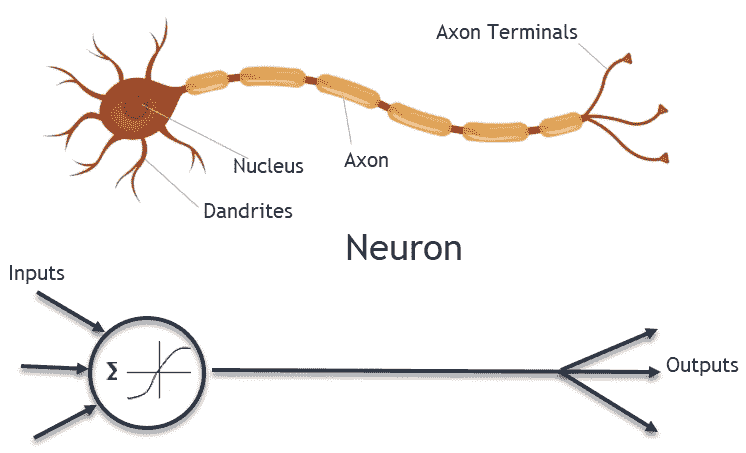

A neuron

上图中模拟的神经元代表单个神经元的结构。进入神经元的输入或信号通常被求和，然后根据某种形式的激活函数进行评估。您可以在图中看到一个示例激活功能。当一个神经元被激活或激发时，它会发出一个输出，这个输出可以被送入更多的神经元，也可以作为一个最终输出。下图显示了一个多层神经网络:

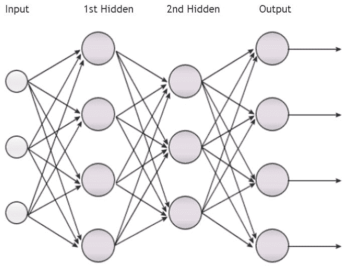

A multiple-layered neural network

上图显示了一个典型的简单神经网络，它具有一个输入和一个输出以及两个隐藏的神经元层。我们称输入和输出之间的神经元层为隐藏层，因为我们通常不与这些层进行交互。最后一层，即输出层，是网络给出答案的地方。起初，这个答案是垃圾，因为网络没有受过训练，不知道正确答案应该是什么。为了变得特别有用，神经网络需要被训练以判断正确或者错误的答案是什么。有许多方法可以做到这一点，但更常用的方法是通过网络从输出反向传播误差。

反向传播是神经网络和深度学习中的一个基本概念。这是一种方法，其中每个神经元的激活函数根据其对总误差量的贡献进行加权。为了找到最佳匹配，我们通常以非常缓慢、迭代的方式来做这件事。这意味着一个典型的神经网络需要暴露于成千上万的样本或迭代才能有效地发展。

我们没有时间详细讨论反向传播、梯度下降和激活函数。建议你花一个小时左右的时间，在有时间的时候学习这些基础知识，也许是在章节之间。网上有很多很棒的资源，可以按照你需要的任何深度深入研究神经网络的细节。

<title>But what does it do?</title> 

# 但是它有什么用呢？

本质上，神经网络只是非常好的非线性函数逼近器，这意味着它们只是擅长解方程。如果你回想一下我们在[第一章](part0021.html#K0RQ0-c0290fc391a247b5ae9c3b6066c9fb32)、*介绍机器学习和 ML 代理*中的第一个例子，我们使用了一个简单的线性 ML 算法，称为线性回归，来预测火炮速度。虽然我们能够用线性方法合理地估计事物，但我们真正需要的是非线性解决方案。虽然我们可以使用各种其他非线性方法，但神经网络让我们能够开发更一般化和更适合的解决方案，而无需所有的数学运算。

对我们来说，这意味着神经网络——或者我们将称之为深度网络——将被用作解决 Q 学习方程和其他更复杂问题的工具。在下一节中，我们将看看如何使用神经网络来解决 Q 学习问题。

<title>Deep Q-learning</title> 

# 深度 Q 学习

既然我们已经了解了神经网络的一些基础，那么看一看 Python 中演示其用法的一个非常基本的例子将会非常有帮助。通过以下步骤来建立一个神经网络，该网络通过深度 Q 学习来训练代理。Windows 用户，确保打开 Anaconda 提示符，并使用`activate ml-agents`切换到`ml-agents`环境，就像我们之前做的那样。

1.  打开命令提示符或 shell 窗口，打开一个空文件夹，并输入以下内容:

```
      git clone https://github.com/matthiasplappert/keras-rl.git
      cd keras-rl
      python setup.py install
```

2.  这将安装 Keras RL，Keras 的强化学习包。Keras 是一个用于构建神经网络和其他 ML 任务的流行库。可以背靠 TensorFlow 或者 Theano。因为我们已经安装了 TensorFlow，所以我们很好。
3.  输入以下内容:

```
 pip install h5py
      pip install gym
```

4.  `h5py`代码短语是 HDF5 格式的 Pythonic 接口，允许您处理大型数值数据集。下一行安装`gym`，是 Python ML 测试环境。
5.  下载并安装 Visual Studio 代码。这将是我们首选的 Python 编辑器，但是如果您是有经验的 Python 开发人员，可以随意使用您喜欢的其他 IDE 或编辑器。

这将安装我们快速示例所需的所有依赖项。接下来，我们将看看如何编写 Python 代码来构建这个示例。

互联网上有数百个示例演示了使用 Keras 进行 Q-learning，但是许多示例非常复杂，或者提供了复杂的统计代码。我们在这里要看的例子之所以被选中，是因为它简洁而快速。你可以自己随意探索许多其他的例子。

<title>Building the deep network</title> 

# 构建深层网络

通常，在介绍了神经网络之后，我们会从一个简单的例子开始，也许是单个神经元或层。然而，这种类型的样本不会给人留下深刻的印象，与构建一个有效的深度 Q 学习示例相比，这是微不足道的。这意味着，为了构建一个工作示例，我们需要跳入深水区，这是双关语。完成以下练习以构建示例:

1.  打开 Visual Studio 代码，点击 File | New File，创建一个名为`DeepQLearning.py`的新文件。
2.  这第一部分代码导入我们需要的各种库，输入下面的代码

```
      import numpy as np
      import gym

      from keras.models import Sequential
      from keras.layers import Dense, Activation, Flatten
      from keras.optimizers import Adam

      from rl.agents.dqn import DQNAgent
      from rl.policy import EpsGreedyQPolicy
      from rl.memory import SequentialMemory
```

3.  然后我们设置一些基本变量如下:

```
      ENV_NAME = 'CartPole-v0'

      env = gym.make(ENV_NAME)
      np.random.seed(123)
      env.seed(123)
      nb_actions = env.action_space.n
```

4.  我们将使用`gym`库中的手推车-杆子问题，这就是为什么我们将`ENV_NAME`设置为`CartPole-v0`。然后我们用`gym.make`创建`env`环境。完成后，我们创建一个带有设定种子值的随机种子。这使我们能够创建一个可重复的随机序列，让我们能够重现结果。

5.  接下来，我们使用以下内容构建神经网络:

```
      model = Sequential()
      model.add(Flatten(input_shape=(1,) + env.observation_space.shape))
      model.add(Dense(16))
      model.add(Activation('relu'))
      model.add(Dense(nb_actions))
      model.add(Activation('linear'))
      print(model.summary())
```

6.  我们首先创建一个顺序网络。顺序网络是有序的层堆叠，与我们之前看到的神经网络的图像没有什么不同。为了建立一个有序的网络，我们增加了几层相互连接的神经元。我们添加的第一层是用`Flatten`展平的输入层，这意味着它创建了一个对应于观察数量的神经元输入层。接下来，我们使用一个`relu`激活函数创建一个有 16 个神经元的普通`Dense`层。最后，我们用另一个带有`linear`激活功能的`Dense`输出层完成。
    我们正在构建的模型由我们输入的张量形状定义。在这种情况下，该形状是一个简单的 1 x 4 输入数组。模型的输入将是代理的观察状态，最终输出代表观察状态的最佳动作。
7.  保存文件。在 Keras 文档网站上可以在线找到`relu`或`ReLu`、激活功能和其他详细信息。
8.  通过从菜单中选择 Debug | Start Debugging 来调试示例。这将运行我们到目前为止拥有的代码，并且应该输出模型(神经网络)的摘要，如下面的代码所示:

```
      _________________________________________________________________
      Layer (type) Output Shape Param #
      =================================================================
      flatten_1 (Flatten) (None, 4) 0
      _________________________________________________________________
      dense_1 (Dense) (None, 16) 80
      _________________________________________________________________
      activation_1 (Activation) (None, 16) 0
      _________________________________________________________________
      dense_2 (Dense) (None, 2) 34
      _________________________________________________________________
      activation_2 (Activation) (None, 2) 0
      =================================================================
      Total params: 114
      Trainable params: 114
      Non-trainable params: 0
      _________________________________________________________________
```

看一下输出，你会看到我们已经建立了一个 4 输入，16 隐藏层，2 输出的神经网络。这是一个非常简单的网络，我们将用它来拟合我们的 Q 学习方程。这意味着我们不必写我们的方程，因为我们使用神经网络作为我们的方程解算器。

<title>Training the model</title> 

# 训练模型

为了让我们的神经网络符合我们的 Q 学习方程，我们需要迭代地训练它，通常要经过数千次迭代。我们这样做是为了让我们的模型(网络)能够逐渐使方程适合我们的学习问题，而不会陷入局部最小值或最大值。我们可以为训练调整的参数很多，并且可能很复杂，但是不要担心。完成以下练习以完成示例并训练模型:

1.  在最后一部分的正下方输入以下代码:

```
      policy = EpsGreedyQPolicy()
      memory = SequentialMemory(limit=50000, window_length=1)
      dqn = DQNAgent(model=model, nb_actions=nb_actions, memory=memory,
      nb_steps_warmup=10,
      target_model_update=1e-2, policy=policy)
      dqn.compile(Adam(lr=1e-3), metrics=['mae'])
      dqn.fit(env, nb_steps=5000, visualize=True, verbose=2)
```

2.  我们首先创建一个`EpsGreedyQPolicy`类型的策略，它是我们已经在使用的 epsilon greedy 策略的变体。接下来，我们使用限制为`50000`的`SequentialMemory`来设置内存。这是我们将存储代理的状态观察用于培训的地方。接下来，我们用`nb_actions`模型的内存和策略构建一个`DQNAgent`。这个代理本质上是一个大脑(用 Unity 术语来说),处理输入和训练。
    接下来，我们用 Adam 优化器编译`dqn`。Adam 引入了一种更新的训练形式，而不是使用经典的随机梯度下降。之后，我们通过调用 fit 来结束，这实际上是在`env `环境中用`5000`步骤可视化地运行培训。
3.  通过输入以下内容完成脚本:

```
      dqn.test(env, nb_episodes=5, visualize=True)
```

4.  这最后一行将测试环境中的代理/大脑。

5.  保存文件。
6.  通过单击调试|开始调试来调试脚本。在菜单中选择选项后，您可能还需要选择 Python 环境。当脚本运行时，您将看到显示有 cart-pole 问题运行的`gym`环境，如下面的屏幕截图所示:

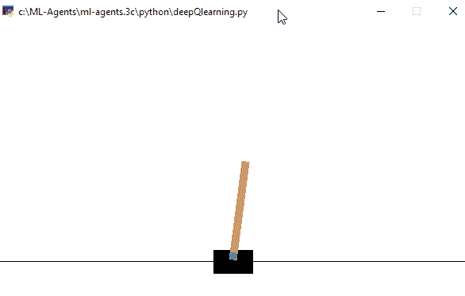

健身房环境运行的车杆问题与 DQN

7.  随着脚本的运行，您将看到培训输出。

脚本运行后，评估结果并确定是否需要增加训练运行次数或网络本身。尝试一下这个例子，看看你如何改进它。

<title>Exploring the tensor</title> 

# 探索张量

Python 让开发人员望而却步的一点是松散的类型。如果没有合适的工具，或者使用合适的松散类型的工具，也很难调试应用程序。当我们开始研究复杂的数学类型时，比如代码中的张量，这就变得更加复杂了。幸运的是，Visual Studio 代码提供了一个简单的 Python 调试器，可以在运行时公开类型检查。让我们通过下面的练习来看看这是如何工作的:

1.  打开 Visual Studio 代码，回到上一个练习。
2.  通过在编辑器的空白处单击来设置断点，如下图所示:

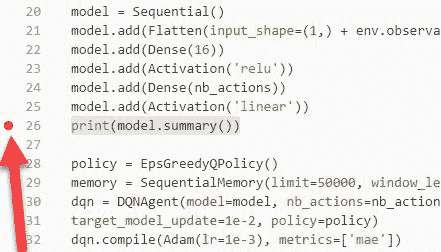

在 Visual Studio 代码中设置断点

3.  从菜单中，选择调试|开始调试。让代码开始运行。模型建立后，代码将在设置的断点处中断。
4.  将鼠标悬停在模型文本上，如下面的屏幕截图所示:

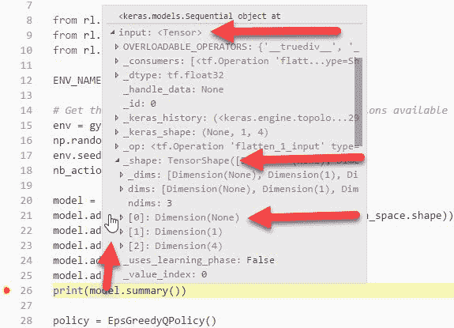

检验神经网络模型和张量类型

5.  大约一秒钟后，将弹出“类型检查器”窗口，允许您检查各种属性。
6.  点击`input: <Tensor>`旁边的箭头展开输入属性。
7.  同样展开`_shape`属性。
8.  您应该会看到一个分别为`0`、`1`和`4`维度的三维输入形状。这也恰好代表了输入张量的形状。在这种情况下，输入张量是一个平面的 1 x 4 输入数组，您也可以将其视为单行矩阵或向量。我们可以将单个值表示为(`0,1,1`)形状，或者用张量表示任何维度的值。
9.  您可以通过这种方式继续探索 NN 模型和其他变量。

由于张量作为输入的概念对新手来说可能相当混乱，所以让我们复习一下张量和张量形状的概念。在下图中，我们展示了表示单个值的一维张量，以及表示多个值的六维张量:

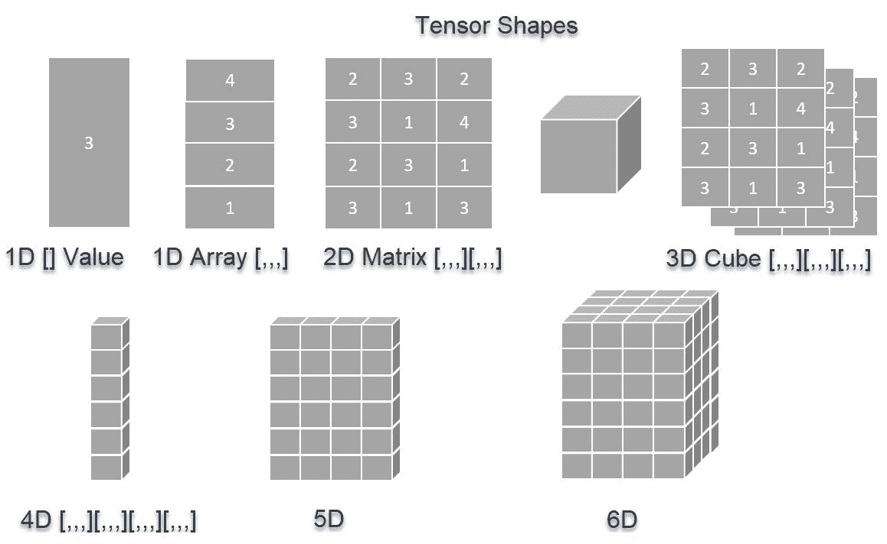

The many shapes of tensor

在我们最后的例子中，车极问题，张量可以用多种方式定义:作为 1D 阵列；1×4 或 4×1 值的 2D 阵列/矩阵；作为(`0,1,4`)维的 3D 立方体；诸如此类。从中得出的结论是，我们可以用张量的形式来表示任何形状的数据。你只需要确保你的数据是正确的形式；事实上，当你继续使用 Keras 建立自己的新网络时，这可能是你最大的问题。

TensorFlow，我们的后端数学引擎，当然是以张量命名的。对于大多数引擎，您不一定要知道内部如何工作才能使用它们，TensorFlow 也不例外。因此，我们让读者自己去进一步了解 TensorFlow 和 Keras 或其他 NN 库的内部工作方式。Packt 有许多关于这个主题的写得很好的书和视频。

在这个例子中有很多工作要做，希望您能够理解 Keras 为我们节省的工作量。我们选择这个例子是因为它的特点是构建了一个模型(网络),而没有很多其他的管道。我们不会对这个例子进行更多的探究，但是您可以自己随意探究这个代码或其他 DQN 代理。对我们来说幸运的是，Unity 已经把对状态和行为的观察映射到适当的形状。接下来，我们将使用更多的高级 Unity Python 代码来构建模型，在下一节中从最接近的策略优化开始。

<title>Proximal policy optimization</title> 

# 最近策略优化

到目前为止，我们对 RL 的讨论已经着眼于用 bottons 和 Q-learning 构建代理的更简单的技术。Q-learning 是一种流行的算法，正如我们所了解的，深度 Q 神经网络为我们提供了一个很好的基础来解决更困难的问题，例如推车平衡杆子。下表总结了各种 RL 算法、它们能够在什么条件下工作以及它们如何工作:

| **算法** | **型号** | **政策** | **动作** | **观察** | **操作员** |
| q 学习 | 无模型 | 不符合政策 | 分离的 | 分离的 | 蜕变能 |
| SARSA–州行动奖励州行动 | 无模型 | 政策上的 | 分离的 | 分离的 | 蜕变能 |
| DQN-深度 Q 网络 | 无模型 | 不符合政策 | 分离的 | 连续的 | 蜕变能 |
| DDPG——深度确定性政策梯度 | 无模型 | 不符合政策 | 连续的 | 连续的 | 蜕变能 |
| TRPO–信任区域策略优化 | 无模型 | 不符合政策 | 连续的 | 连续的 | 优势 |
| PPO–最接近的策略优化 | 无模型 | 不符合政策 | 连续的 | 连续的 | 优势 |

从上表可以看出，我们从 Q-learning 的基础加速到 PPO，这是 Unity 开发的首选培训方法。这个表中有几个术语我们没有解释，所以现在让我们更详细地介绍一下，这样您就可以理解各种算法之间的区别。以下是表中提供的术语的简短词汇表:

*   **无模型**:算法不依赖于已定义的模型。相反，该算法使用试错法来制定其政策或行动方针。我们将讨论的所有算法都是无模型的。
*   **偏离策略**:指大脑/代理如何决定其下一步行动。如果不符合策略，代理将根据另一个策略(如 epsilon greedy 或另一种方法)来决定操作。对于 Q-learning 示例，我们使用 greedy 作为我们的非策略决策。
*   **On-policy** :指大脑/智能体基于当前的策略，本质上是动作的价值，做出决策。SARSA 是唯一使用基于策略的算法的算法。策略决定代理的行为。
*   **离散**:表示空间，无论是动作还是观察，如何被分成离散的步骤或格。我们在 Q-learning bandit 示例中查看了离散空间。
*   **连续**:动作或观察空间可以是连续的。在我们的 DQN 例子中，我们的行动空间是离散的，但状态或观察空间是连续的。这给了我们将标准化的连续值输入模型的优势，正如我们在 cart-pole 问题中看到的。在这个例子中，观察到的状态是连续的，这为我们提供了更好的微调。离散算法在学习上存在差距，因为它们总是需要被分成一组已知的值。
*   **Q 值**:原始 Q 值用于做出决策，要么最大化，要么通过某种策略。
*   **优势**:将 Q 值与一系列动作的其他值进行比较，以确定哪个动作提供了更好的优势。这与国际象棋的 a 局没有什么不同，在 a 局中，根据你对其他棋步的评估，你试图将你的棋子移动到一个有利的位置。

一个更正式的介绍将会详细介绍每个算法的细节。当然，每种算法都有自己的优点和缺点，但最终最好的算法将是 PPO，它可以解决我们未来要解决的大部分问题。因此，让我们来看看 PPO 的运行情况，以便在下一节中了解它的表现。

<title>Implementing PPO</title> 

# 实施 PPO

Unity 为培训提供的 PPO 的实现已经在一个脚本中设置好了，我们可以很快地将它组合起来。打开 Unity 到`unityenvironment`示例项目，并完成以下步骤:

1.  在`Assets/ML-Agents/Examples/GridWorld`文件夹中找到`GridWorld`场景。双击它将其打开。

2.  找到`GridWorldBrain`并将其设置为外部。
3.  如果您已经将项目设置为最小化运行，那么继续下一步。如果没有，您需要返回到 *ML-Agents 外部大脑*部分学习所需的设置。
4.  从菜单中，选择文件|构建设置....
5.  取消选中任何早期场景，并确保点击添加开放场景，将`GridWorld`场景添加到构建中。
6.  单击 Build 构建项目，并再次确保将输出放在`python`文件夹中。同样，如果你迷路了，参考 *ML-Agents 外部大脑*部分。
7.  打开 Python shell 或 Anaconda 提示窗口。确保导航到`root`源文件夹`ml-agents`。
8.  使用以下命令激活`ml-agents`环境:

```
      activate ml-agents
```

9.  从`ml-agents`文件夹中，运行以下命令:

```
      python python/learn.py python/python.exe --run-id=grid1 --train
```

10.  根据您的 Python 引擎，您可能必须使用 Python 3。这将针对`python` / `python.exe`环境执行`learn.py`脚本；如果您不在 Windows 上，请确保输入您的可执行文件名称。然后我们设置一个有用的`run-id`,我们可以用它来识别以后的运行。最后，我们设置`--train `开关，以便`agent/brain`也被训练。

11.  当脚本运行时，您应该看到 Unity 环境启动，shell 窗口或提示符将开始显示训练统计数据，如控制台窗口的以下屏幕截图所示:

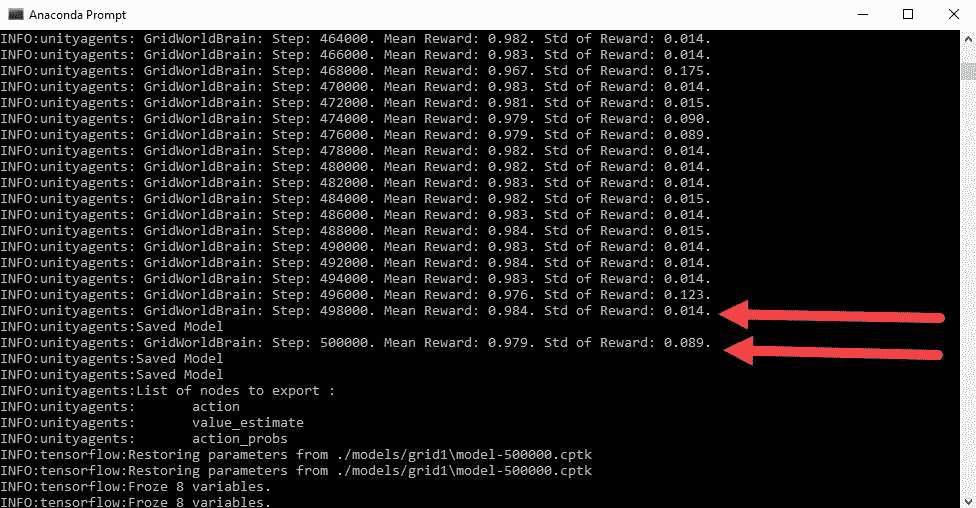

从 learn.py 生成的培训输出

让训练运行到它需要的时候。根据您的机器和迭代次数，您可能会看到几个小时的培训——是的，您没看错。随着环境的训练，您将会看到代理不断地移动和重置。在下一节中，我们将仔细看看统计数据告诉我们什么。

<title>Understanding training statistics with TensorBoard</title> 

# 使用 TensorBoard 了解训练统计数据

本质上，最大似然法植根于统计学、统计分析和概率论。虽然我们不会像某些 ML 算法那样严格使用统计方法来训练我们的模型，但我们将使用统计来评估训练性能。希望你对高中的统计数据有一些记忆，但如果没有，快速复习肯定会有帮助。

我们将使用的 Unity PPO 和其他 RL 算法使用一个名为 TensorBoard 的工具，它允许我们在代理/环境运行时评估统计数据。在观看 TensorBoard 培训的同时，我们运行另一个网格环境，完成以下步骤:

1.  在 Visual Studio 代码或另一个文本编辑器中打开`trainer_config.yaml`文件。该文件包含我们用来训练模型的各种训练参数。
2.  找到`GridWorldBrain`的配置，如以下代码所示:

```
      GridWorldBrain:
        batch_size: 32
        normalize: false
        num_layers: 3
        hidden_units: 256
        beta: 5.0e-3
        gamma: 0.9
        buffer_size: 256
        max_steps: 5.0e5
        summary_freq: 2000
        time_horizon: 5
```

3.  将`num_layers`参数从`1`更改为`3`，如高亮代码所示。此参数设置神经网络将具有的层数。添加更多的层可以让我们的模型更好地泛化，这是一件好事。但是，这会降低我们的培训绩效，或者减少我们的代理学习的时间。有时，如果你有 CPU/GPU 来训练，这并不是一件坏事，但不是所有人都有，所以评估训练性能将是必不可少的。
4.  在`ml-agents`文件夹中打开命令提示符或 shell，运行以下命令:

```
      python python/learn.py python/python.exe --run-id=grid2 --train
```

5.  请注意我们是如何将`--run-id`参数从`grid1`更新为`grid2`的。这将允许我们添加另一轮数据，并实时将其与上一轮数据进行比较。这将运行新的培训课程。如果您在启动会话时遇到问题，请确保一次只运行一个环境。

6.  在同一个`ml-agents`文件夹中打开一个新的命令提示符或 shell 窗口。保持你的另一个训练窗口运行。
7.  运行以下命令:

```
      tensorboard --logdir=summaries
```

8.  这将启动 TensorBoard web 服务器，它将提供一个 web UI 来查看我们的培训结果。
9.  复制托管端点——通常是`http://localhost:6006,`或机器名——并将其粘贴到 web 浏览器中。过一会儿，你应该会看到 TensorBoard UI，如下图截图所示:

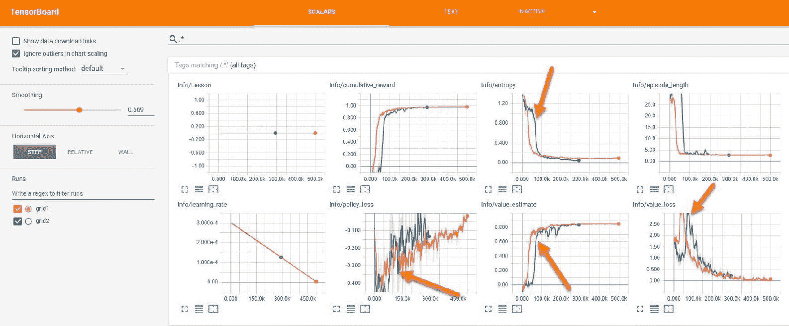

显示 GridWorld 上训练结果的 TensorBoard UI

您需要等待一段时间才能看到第二次训练的进度。但是，当您这样做时，正如上图所示，您会注意到新模型(`grid2`)在训练方面落后了。请注意每幅图上的蓝线是如何经过数千次迭代才追上的。这是更一般的多层网络的结果。在这个例子中，这没什么大不了的，但是对于更复杂的问题，这种滞后可能会产生巨大的影响。虽然一些图显示了改进的潜力，如熵图，但总体而言，我们没有看到显著的改进。对于这个例子，使用单层网络可能就足够了。

我们将在后面的章节中详细探讨这些情节，因为我们将探索构建更复杂的训练/学习模拟。现在，花些时间来完成下一部分的练习。

<title>Exercises</title> 

# 练习

独立完成以下练习:

1.  更改`trainer_config.yaml`文件中的`GridWorldBrain`参数，并运行进一步的培训课程，探索更改参数的效果。
2.  构建`3DBalls`环境，并使用外部大脑使用`learn.py` PPO 算法对其进行训练。
3.  为`Ball3DBrain`更改`trainer_config.yaml`文件的参数，再次运行模拟，并用 TensorBoard 查看结果。

请务必花些时间浏览几个示例，并配置一些培训参数。了解这些超参数对模型训练的影响有什么作用，对于成功训练工作模型至关重要。

<title>Summary</title> 

# 摘要

在这一章中，我们深入探讨了更复杂的 RL 算法的内部工作原理，例如 DQN 和 PPO。我们从 Python 工具和依赖项的安装开始，在那里我们学习了如何使用更基本的工具，比如 Jupyter Notebook。然后，我们构建了一个使用外部 Python 代理大脑的工作 ML-Agents 示例。之后，我们讲述了神经元和神经网络的基础知识。从那里，我们看了看 DQN 和一个使用 Keras 的基本深度 Q 学习代理。我们通过研究另一种叫做 PPO 的 RL 算法完成了这一章。正如我们所了解的，PPO 将成为我们许多复杂情况下的主力。

我们这一章的旅程或多或少是为下一章做准备，在下一章，我们开始深入挖掘，并在本章奠定的基础上继续前进。在下一章中，我们将更深入地研究 PPO 以及它如何驱动其他更复杂的学习场景。