# 四、通过深度学习走得更远

在上一章的最后，我们看了一眼使用一种叫做 PPO 的高级 RL 算法的神经网络。我们没有涉及的是这段代码如何工作的细节以及它的能力。虽然教你关于这个模型的所有细节本身需要一本书，但我们将尝试在这一章中介绍基本特性。此外，请记住，虽然我们将讨论 Unity 特定的训练实施，但许多概念可以应用到其他深度学习模型中。

在这一章中，我们将通过探索 Unity ML-Agents 示例，来了解使用 PPO 的`learn.py`训练脚本的几个内部概念。以下是我们将在本章中涉及的内容:

*   代理训练问题
*   卷积神经网络
*   体验回放
*   部分可观测性、记忆和循环网络
*   演员-评论家训练
*   练习

需要注意的一点是，我们使用神经网络或深度学习解决了一个非常具体的问题。然而，这并不意味着你学到的许多相同的概念不能应用于其他问题。当你阅读这一章时，请记住这一点。

在这一章中，我们将从我们停止的地方继续，所以在继续之前，请确保您已经完成了第 3 章、*使用 Python 进行深度强化学习*的结尾部分。


# 代理训练问题

在我们进入 Unity 的训练脚本中使用的更先进的技术之前，我们想多了解一点关于代理人的训练可以如何中断。让我们打开 Unity，回到上一章停止的地方，看看我们如何使用以下步骤轻松中断代理的训练:

1.  将 Unity 开放给 GridWorld 示例练习。如果你在这方面需要帮助，回到上一章并复习练习。
2.  在“检查器”窗口中找到 GridAcademy 对象和组件，并设置值，如以下摘录所示:

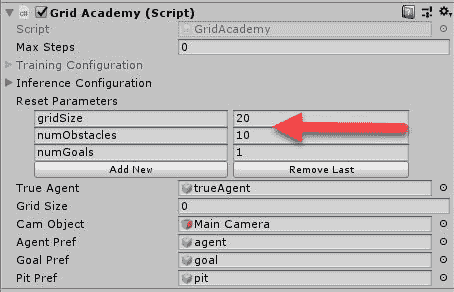

为网格示例设置参数

3.  将 gridSize 设置为`20`，将 numObstacles 设置为`10`，将 numGoals 设置为`1`，如前面的截图所示。

4.  将 GridWorldBrain 设置为使用播放器或启发式大脑。
5.  按 Play 运行示例，并查看游戏。你应该注意到一个更大的网格，有很多额外的障碍。如果你把大脑设置为玩家，那就继续玩几次这个游戏。很有可能你会用完时间，我们的代理也会，这意味着我们也需要增加最大步长。

请记住，我们限制代理的步长，以避免代理无休止地运行。如果我们不这样做，我们可能会以代理运行很长时间而没有什么进展而告终，或者如果代理的步长阻止他们完成游戏，则根本没有进展。相反，过大的步长只会减慢训练速度。所以为了减少训练次数，我们总是尽量减少代理的步长。

6.  按播放停止场景运行。
7.  在“检查器”窗口中找到网格代理(脚本)对象和组件，如以下屏幕截图所示:

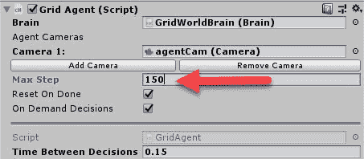

在网格代理上设置最大步长

8.  将最大步长设置为`150`，如前面的截图所示。
9.  将 GridWorldBrain 设置回使用外部大脑，为外部代理训练构建 Unity 环境，就像你在上一章[第三章](part0051.html#1GKCM0-c0290fc391a247b5ae9c3b6066c9fb32)、*用 Python 进行深度强化学习*最后所做的一样。

10.  如有必要，再次参考上一章，运行`learn.py`训练脚本。您可能希望稍后将`run-id`参数更改为`grid3`或其他参数，以便在 TensorBoard 中可视化结果。
11.  让代理运行大约`16 000`到`20 000`次迭代，如下图所示:

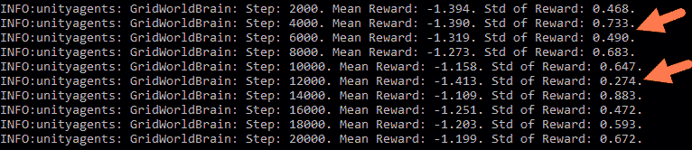

代理训练结果

我们在这里看到的是不一致的训练收敛，这表明我们的模型或场景有问题。我们将在下一节看看如何解决这个问题。


# 当训练出错时

毫不奇怪，我们很容易陷入训练出错的境地。不幸的是，这些情况不是大爆发的那种，而是我们的代理将不会逐步学习或改进的那种。这通常是由以下原因造成的:

*   **奖励不对(稀疏奖励)**:一般你希望停留在`-1.0`到`+1.0`的范围内，有现成的奖励。
*   **观察值错误**:观察值过多或过少都可能是个问题，具体取决于型号。
*   **超参数**:这包括许多参数，不了解如何调整这些参数会导致挫败感。当然，我们将花一些时间学习如何正确调整这些参数。

我们将在接下来的几节中更详细地讨论前两个问题。我们将在余下的一章中详细讨论第三个问题。


# 固定稀疏奖励

当你试图将奖励定得太高或太低，或者获得奖励的机会很少或很少时，奖励问题就会发生。在我们的上一个例子中，当我们将网格从 5 x 5 的区域扩展到 20 x 20 的区域时，我们也使我们的奖励非常稀疏或稀少。这意味着一个特工需要特别幸运才能偶然发现奖励。我们可以通过增加可用目标的数量来改善这一点。通过以下步骤纠正奖励不多的问题:

1.  打开 Unity 编辑器，在检查器窗口中找到 Grid Academy 对象和组件。
2.  将 numGoals 属性设置为`10`。增加目标的数量应该让代理更容易发现积极的奖励。
3.  使用`learn.py`构建环境并运行训练课程。你应该看到代理的训练很快收敛。

奖励问题通常很容易解决，如果你的代理训练缓慢，这应该是你首先要解决的问题。在下一节中，我们将看看如何解决不正确的观察空间的问题。


# 固定状态观察

确保您为您的代理捕捉相关的状态观察对于成功训练代理是至关重要的。在大多数早期的例子中，我们建立状态观察的方式是非常简单的，但是正如你现在可以理解的，一个代理的状态可以是非常实际的。事实上，目前正在解决的一些 RL 问题的状态超过了已知宇宙中的原子数量——是的，你没看错。我们在上一章提到了这个主题，在那里我们演示了如何将代理人的观察结果作为输入映射到神经网络上。设置 Unity 外部大脑训练器时，您必须了解代理需要如何观察或观察什么。

为了解决我们当前的问题，或者使我们的代理在训练方面做得更好，我们将扩展我们代理的状态。在扩展我们代理的状态时，我们的代理应该能够中断更多的细节。毕竟，我们的代理人正在使用对游戏区的视觉观察作为其状态感。以下练习展示了我们如何通过扩展座席代表的状态或视觉观察来改进训练:

1.  定位 GridWorldBrain 并调整视觉观察空间，如以下截图所示:


调整代理的视觉观察空间

2.  GridWorldBrain 使用视觉观察作为状态视图。从本质上讲，代理使用一个单独的摄像头来拍摄游戏区域的截图，并将这些截图解释为状态。

3.  选择场景中的 agentcam。这将向您显示代理看到的视图。代理人使用这个相机在每一步拍摄场景的快照，并将它们作为原始图像传输到大脑。以前使用颜色的 84 x 84 区域的设置不够大，不足以捕捉网格大小增加的细节。因此，我们需要提高分辨率，但是因为我们的对象是用形状来表示的，所以我们也可以去掉颜色。以下是 84 x 84 彩色图像与 128 x 128 黑白图像的对比示例:

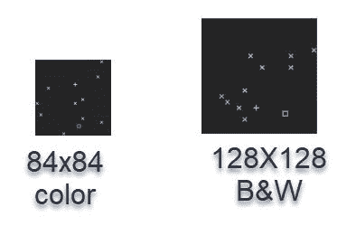

视觉观察空间的比较

4.  该代理将图像中的每个像素和颜色通道作为内部神经网络的归一化输入。归一化输入被编码到范围`0–1.0`。
5.  确保大脑设置为外部并构建项目。
6.  使用`learn.py`使用 PPO 模型再次运行环境。根据您选择的 Python 环境，您可能必须使用`python3`而不是`python`来启动:

```
      python python/learn.py python/python.exe --run-id=largegrid1 --
      train
```

7.  再次观看代理运行。你会注意到有轻微的改善，但不多。
8.  将 GridWorldBrain 视觉观察空间从之前的 128 x 128 增加到 256 x 256，并确保取消选中黑白。
9.  再次构建并运行环境。你现在应该会看到更好的训练结果，因为你的代理会显示出一些收敛的迹象。继续玩这个模型，看看如何进一步改进它。

通过使用颜色并将观察空间从 84 x 84 增加到 256 x 256，我们能够使用更大的视觉状态来创建一个工作/学习代理，尽管速度要慢得多。看看你能否猜测出`84 -> 256`值之间的最佳视觉观察尺寸。测试完尺寸后，看看启用/禁用颜色对学习过程有什么影响。

如果您发现训练仍有困难，请再次增加`numGoals`参数。在最初的例子中，我们对 5 x 5 网格中的每 25 个单元都有奖励。当我们将网格尺寸增加到 20 x 20，有 10 个目标时，面积与奖励的比率仍然是 40 个网格单元比 1 个奖励`(400/10 = 40)`。

对经典的 80 年代 Atari 游戏所做的研究使用 RL 来教代理比人类玩得更好，使用相同的方法来捕捉状态。然而，我们不能不经过一点预处理就从图像中解读状态。幸运的是，Unity 训练器已经以卷积神经网络的形式整合了这一特性，我们将在下一节介绍。


# 卷积神经网络

多年来，在使用神经网络执行图像识别方面已经做了大量的工作，同时，开发了一种称为卷积神经网络的技术，以提供更好的识别图像特征的方法。该技术通过在图像上运行卷积步骤来实现，如下图所示:

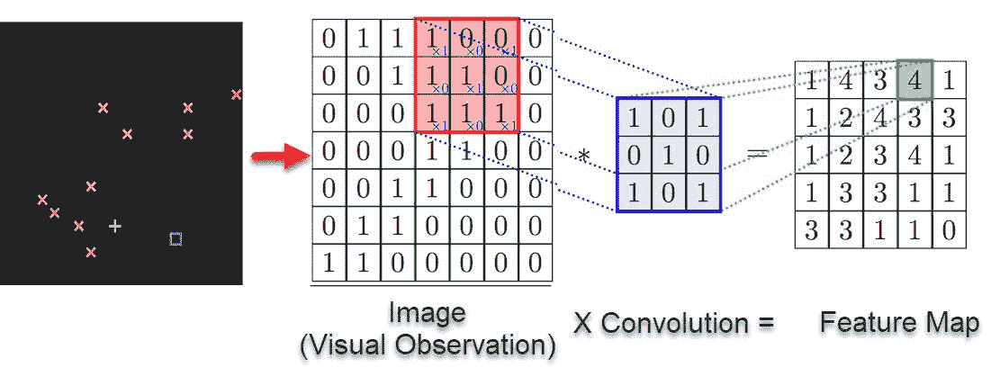

CNN operation extracting features from an image

这里所发生的是使用卷积步骤在图像上乘以由步幅设置的卷积矩阵，以便生成特征图。我们这样做是为了通过隔离像素部分和应用分组过滤器来隔离图像中的特征。如果我们不这样做，我们的网络将评估图像的原始像素，这将使识别图像中的重要特征变得困难。这就像看一张太近的照片一样。在使用神经网络识别图像的应用中，我们通常使用相应的池层，然后是另一个卷积层，接着是另一个池层。但是，这会极大地简化图像，从而从数据中移除空间信息。因此，在需要空间感知的游戏和模拟中，我们放弃了池层，而只使用卷积层。通过以下练习，了解`learn.py`训练师如何使用 CNN 层:

1.  将 GridWorld 示例恢复为使用 5 x 5 的网格，以及一个目标和一个障碍。像你以前多次做过的那样构建环境。
2.  打开外壳或资源管理器窗口，导航到`ml-agents`文件夹中的`python`文件夹。
3.  在 Visual Studio 代码或您喜欢的 Python 编辑器中找到并打开`unitytrainers`文件夹中的`models.py`文件。
4.  向下滚动直到找到`create_visual_encoder`功能:

```
      def create_visual_encoder(self, image_input, h_size, activation, 
      num_layers):
       """
       Builds a set of visual (CNN) encoders.
       :param image_input: The placeholder for the image input to use.
       :param h_size: Hidden layer size.
       :param activation: What type of activation function to 
       use for layers.
       :param num_layers: number of hidden layers to create.
       :return: List of hidden layer tensors.
       """
          conv1 = tf.layers.conv2d(image_input, 16, kernel_size=[8, 8], 
          strides=[4, 4], activation=tf.nn.elu)
          conv2 = tf.layers.conv2d(conv1, 32, kernel_size=[4, 4], 
          strides=[2, 2], activation=tf.nn.elu)
          hidden = c_layers.flatten(conv2)
          for j in range(num_layers):
              hidden = tf.layers.dense(hidden, h_size, use_bias=False, 
              activation=activation)
          return hidden
```

5.  该函数创建两个卷积层，首先是一个 8 x 8 内核，然后是一个 4 x 4 内核，接着是一个`flatten`操作，该操作在`num_layers`参数中为每个层展平为一个隐藏层。这是一个相当标准的配置，但是我们也可以使用它来看看它对训练有什么影响。我们将添加另一层卷积，以便有希望识别更多的特征。
6.  修改`create_visual_encoder`方法中的代码，如下面的代码所示:

```
      conv1 = tf.layers.conv2d(image_input, 16, kernel_size=[8,8], 
      strides=[4, 4],         
      activation=tf.nn.elu) conv2 = tf.layers.conv2d(conv1, 32, 
      kernel_size=[4, 4], strides=[2, 2], activation=tf.nn.elu) conv3 =   
      tf.layers.conv2d(conv2, 64, kernel_size=[2, 2], strides=[1, 1], 
      activation=tf.nn.elu) hidden = c_layers.flatten(conv3)
```

7.  我们在这里所做的只是在另一个卷积层中加入链，将输入数量增加一倍，大小减少一半，就像我们在前一层中所做的那样。理想情况下，这可以让我们提取更多的特征来帮助我们进行训练。现在，我们有了三个卷积图层，一个接一个地逐步提取要素地图。
8.  将更改保存在文件中。
9.  使用以下命令运行`learn.py`:

```
      python python/learn.py python/python.exe --run-id=gridconv1 --train
```

10.  希望在本章结束时，你能在睡梦中运行`learn.py`。观看训练，并尝试了解这一新层如何提高训练绩效。是吗？看来你得试一下样品才能知道。

这包括了 CNN 图层的基础知识。我们运行的大多数其他 Unity 示例不会使用视觉观察来捕捉状态。然而，我们将在最后一章[第六章](part0099.html#2UD7M0-c0290fc391a247b5ae9c3b6066c9fb32)、*重新审视 Terrarium ——ML 智能体生态系统*中重新审视 CNN。在那之前，网上有很多关于如何设置内核大小和步幅的信息，感兴趣的读者可以谷歌一下 CNN。

在下一节中，我们将仔细了解什么是体验回放，以及 Unity 训练师如何使用它进行训练。


# 体验回放

自从我们在 DQN 的第一个例子以来，我们一直在内部使用经验回放来更有效地训练代理。ER 只不过是以填充缓冲区的`<state,action,reward,next state>`元组的形式存储代理的经验。然后，代理在训练中随机遍历或采样这个经验缓冲区。这有利于保持代理更加一般化，并避免本地化模式。下面是添加体验回放后我们的学习流程的更新图:

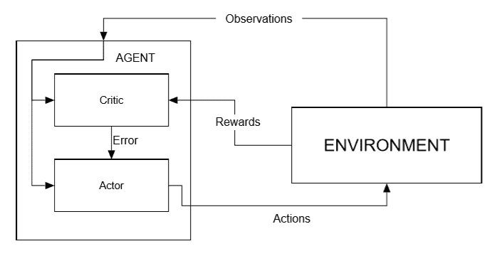

Diagram of RL with experience replay added

在上图中，您可以看到代理如何将经验存储在缓冲存储器中，然后在每个步骤中随机从中取样。随着缓冲区的填满，旧的体验被丢弃。这可能看起来很违反直觉，因为我们的目标是找到最佳或最优路径，所以让我们通过下面的练习来进一步探索这个概念:

1.  打开 Unity 到 ML-Agents 示例项目，并在`Assets/ML-Agents/Examples/Hallway/Scenes`文件夹中打开走廊示例场景。
2.  在“检查器”窗口中找到“走廊大脑”大脑类型，并将其设置为“外部”。

3.  从菜单中，选择文件|构建设置....
4.  确保取消选中或移除所有场景，走廊场景除外。如果当前场景不在列表中，可以使用“添加开放场景”按钮添加当前场景。
5.  像外部训练一样构建场景。
6.  打开您的`Python` shell 或 Anaconda 提示符。
7.  使用激活 ml 代理激活 Ml 代理环境。
8.  导航到`ml-agents`源文件夹并执行以下命令:

```
 python python/learn.py python/python.exe --run-id=hallway1 --train
```

这将运行 Unity 用示例配置的默认训练。记住，我们可以访问`python`文件夹中的`trainer_config.yaml`文件中的训练参数。

在运行默认示例时，请注意代理的功能有多差。出现这种情况的原因是代理当前的经验缓冲太小。如果您选择 Unity environment 窗口，您将看到代理倾向于停留在走廊的一端，很少能够找到达到目标(奖励)的最佳路径。我们可以通过增加经验缓冲区的大小来缓解这个问题，从本质上来说，就是增加代理人的短期记忆。


# 借鉴经验

当代理训练时，经验缓冲器回收旧的记忆并用新的代替它们。正如我们所讨论的，这样做的目的是打破任何本地化的模式，或者说，从本质上讲，打破代理只是重复自己的情况。然而，这样做的缺点是代理可能会忘记最终结果是什么，这就是上一个例子中发生的情况。我们可以通过增加经验缓冲区的大小来解决这个问题，我们将在下一个练习中进行:

1.  打开 Visual Studio 代码或您喜欢的文本编辑器。
2.  在`python`文件夹中找到`trainer_config.yaml`文件并打开它。
3.  找到`HallwayBrain`的配置，如下面的代码所示:

```
      HallwayBrain:
       use_recurrent: true
       sequence_length: 64
       num_layers: 2
       hidden_units: 128
       memory_size: 256
       beta: 1.0e-2
       gamma: 0.99
       num_epoch: 3
       buffer_size: 1024
       batch_size: 128
       max_steps: 5.0e5
       summary_freq: 1000
       time_horizon: 64
```

4.  `buffer_size`参数代表体验缓冲区的大小。我们希望增加这个值，以便我们的代理可以从更大的缓冲区或更大的状态或一组体验中进行采样。这与我们之前看到的代理无法探索整个游戏区域的问题非常相似。在这种情况下，我们增加了代理在一集或训练课程中可以采取的步骤数。
5.  将`buffer_size`增加到`4096`，实质上是将其增加四倍，如下面的代码所示:

```
 buffer_size: 4096
```

6.  保存文件并再次运行训练器，但是将`--run-id`改为`hallway2`，如以下代码所示:

```
      python python/learn.py python/python.exe --run-id=hallway2 --train
```

7.  这将运行代理，几个小时后，在新的命令提示符下使用以下命令打开 TensorBoard:

```
      tensorboard --logdir=summaries
```

8.  比较不同经验缓冲区大小的结果，如以下代码所示:

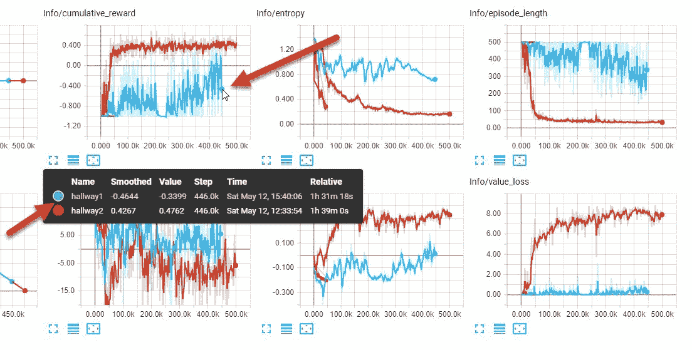

使用不同经验缓冲区大小的训练运行比较

9.  将鼠标悬停在图表上，查看训练对比，如前面的屏幕截图所示。如你所见，训练的差异是显著的。通过增加缓冲区的大小，代理人能够很快达到一个良好的累积奖励。但是代理很快就达到了最大值`0.5-ish` ( `0.4267 hallway2`)左右，也就是说表现不错但不算很棒。事实上，我们可能矫枉过正了。

比较训练示例——就像我们刚刚通过调整单个参数所做的那样——是了解更多关于它们对每个模型或参数的影响的好方法。训练的一个过程是选择一个参数的最小/最大参数值，并对每个极值进行训练以观察效果。在我们的上一个练习中，我们可能已经为经验缓冲选择了一个最大值，但是如果我们不确定，我们可以用一个更大的值运行另一个训练会话。找到最小/最大范围后，我们可以尝试在该范围内优化参数。

如果你使用最小/最大训练方法，只要记住你一次只能改变一个参数。当另一个参数改变时，你可能会发现一个最优参数并不是最优的。当你第一次开始的时候，这可能是有挑战性的，所以尽你最大的努力保持耐心，训练，训练，训练。

正如我们已经看到的，使用经验缓冲区有其局限性，理想情况下，我们需要一种更好的方法来代表代理人的长期记忆。与我们第一次看到的相比，`Hallway`的例子有更多的变化，我们将在下一节讨论这个大的变化。


# 部分可观测性、记忆和循环网络

`Hallway`和`GridWorld`例子之间的一个主要区别是他们对状态的感知，或观察。我们已经知道`GridWorld`代理使用了视觉观察，但是我们从来没有真正了解过`Hallway`代理使用了什么状态输入。事实证明，`Hallway`代理以不同的方式收集状态观察。理解其中的区别对我们来说很重要，因此打开 Unity 并完成以下练习:

1.  确保`Hallway`示例场景已加载。如果需要帮助，请回到上一个练习。
2.  在层级窗口中找到`Agent`对象。您可以使用窗口顶部的搜索栏更快地找到它。
3.  在检查器窗口中找到`Hallway Agent`组件/脚本。
4.  单击组件旁边的目标图标，然后选择编辑脚本....这将打开您先前设置的代码编辑器。
5.  在如下代码所示的脚本中找到`CollectObservation`方法:

```
      public override void CollectObservations()
      {  
        float rayDistance = 12f;
        float[] rayAngles = { 20f, 60f, 90f, 120f, 160f };
        string[] detectableObjects = { "orangeGoal", "redGoal", 
        "orangeBlock",     
         "redBlock", "wall" };
        AddVectorObs((float)GetStepCount() / 
       (float)agentParameters.maxStep);
        AddVectorObs(rayPer.Perceive(rayDistance, rayAngles, 
        detectableObjects, 0f, 
        0f));
      }
```

6.  希望其中一些代码有点熟悉，因为我们之前已经编写了自己的`CollectObservations`版本。记住对`AddVectorObs`的调用是给我们的代理的大脑添加状态的。第一个调用设置了一个浮点数，表示代理正在进行的计算的进度。对`AddVectorObs`的下一个调用是动作发生的地方，需要仔细查看。
7.  将鼠标悬停在`rayPer.Percieve`文本上，注意注释创建了感知向量，用作对代理的观察的一部分。这个调用是基于代理的光线投射来建立状态观察的。下面是一个简单的画面，向您展示了正在发生的事情:

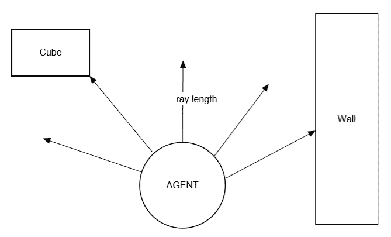

代理使用光线投射来观察状态

8.  这里发生的是 Unity 正在使用它的物理光线投射系统来探测特定的物体。它为想要检测的每种类型的对象投射光线，并且以每个角度投射。当检测到一个物体时，我们还想提供它有多远的信息。我们还想知道什么时候没有检测到物体。如果你看一下`rayPer.Percieve`的代码，你会发现它创建了一个数组，大小和`angles X (the number of object types +2)`一样。额外的`+2`用于说明编码距离和缺失。在我们的例子中，这创建了一个数组`5 (angles) x (5 object types +2) = 35 cells`。当我们将之前的调用添加到`AddVectorObs`时，我们可以看到我们的代理使用了 36 个浮点的状态。

您可以返回 Unity 并确认走廊大脑上的向量观察大小设置为使用大小为`36`的连续。如果您想要将对象类型添加到此示例中，您将需要重新计算此参数。当然，这里还有更多。你想明白了吗？也许下一节会有所帮助。


# 部分可观测性

首先要注意的一件事可能不太明显，那就是我们的代理不再依赖于对其环境的全面了解，就像在我们所有其他的例子中一样。例如，在 GridWorld 中，代理人用摄像机观察整个游戏区域，并使用获得的图像作为其状态观察。但是，假设一个智能体需要了解一个世界的整个游戏区域，这现实吗？不太可能，这在我们的首选参考《自然》中肯定不会发生。在自然界，动物当然不知道世界的一切——远非如此。动物只与它周围环境的局部视图互动，这是由它的视觉、听觉、触觉等感官决定的。这使得动物能够更好地将其行为归纳到各种情况和环境中。这听起来确实像是我们的特工需要做的事情。

幸运的是，当一个代理只能看到他们世界的一部分时，PPO 训练器为部分可观察性问题提供了强大的支持。然而，为了更好地理解这一点，让我们重温一下`Hallway`的例子，并关闭一个允许我们的代理仅使用世界的局部视图进行学习的功能。打开 Visual Studio 代码并完成以下步骤:

1.  打开`trainer_config.yaml`并编辑如下截图所示的高亮值:

```
      HallwayBrain:
        use_recurrent: false
        sequence_length: 64
        num_layers: 2
        hidden_units: 128
        memory_size: 256
        beta: 1.0e-2
        gamma: 0.99
        num_epoch: 3
        buffer_size: 4096
        batch_size: 128
        max_steps: 5.0e5
        summary_freq: 1000
        time_horizon: 64
```

2.  如果您愿意，可以使用您在之前的经验缓冲练习中测试过的更优的`buffer_size`值。
3.  打开 Python 环境到`python`文件夹，激活 ml-agents 环境。
4.  使用以下内容启动训练师:

```
      python python/learn.py python/python.exe --run-id=hallway3 --
       train
```

5.  仔细观察控制台训练输出。您可能会看到代理在短时间内学得很好，但随后似乎忘记了一切。其中一些与经验缓冲有关，但其余的发生是因为我们的代理忘记了它所学到的东西。

我们已经将我们的问题从马尔可夫决策过程转换为部分观察的马尔可夫决策过程，或简称为 POMDP。

让整个训练环节跑起来做对比，一定要用 TensorBoard 监控结果。通过关闭`use_recurrent`选项，我们基本上禁用了代理对递归网络层的使用。这些循环层充当另一种形式的扩展内存，我们将在下一节中讨论。


# 记忆和循环网络

通过剥夺代理的全面观察的全知能力，我们需要允许我们的代理更好地概括，从而能够长期学习。我们通过添加由长短期记忆细胞或 LSTM 层组成的循环层或块来做到这一点。

这些层/单元为我们的代理提供了临时内存，其工作方式如下图所示:

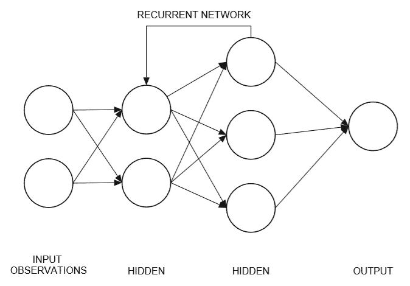

Recurrent networks

循环网络本质上是网络中几个隐藏层之间的桥梁，通过网络强化好的或坏的经历。我们可以通过下面的练习来看看这在代码中是如何工作的:

1.  打开 Visual Studio 代码。
2.  在`**python/unitytrainers**`文件夹中找到`models.py`文件。确保文件中的类是`LearningModel`而不是`PPOModel`。
3.  向下滚动到`create_recurrent_encoder`方法，如下面的代码所示:

```
      def create_recurrent_encoder(self, input_state, memory_in, 
      name='lstm'):
          """
          Builds a recurrent encoder for either state or observations 
          (LSTM).
          :param input_state: The input tensor to the LSTM cell.
          :param memory_in: The input memory to the LSTM cell.
          :param name: The scope of the LSTM cell.
          """
          s_size = input_state.get_shape().as_list()[1]
          m_size = memory_in.get_shape().as_list()[1]
          lstm_input_state = tf.reshape(input_state, shape=[-1, 
          self.sequence_length, 
          s_size])
          _half_point = int(m_size / 2)
          with tf.variable_scope(name):
              rnn_cell = tf.contrib.rnn.BasicLSTMCell(_half_point)
              lstm_vector_in = tf.contrib.rnn.LSTMStateTuple(memory_in[:, 
              :_half_point], memory_in[:, _half_point:])
              recurrent_state, lstm_state_out = tf.nn.dynamic_rnn(rnn_cell, 
              lstm_input_state, 
              initial_state=lstm_vector_in,time_major=False,
              dtype=tf.float32)
              recurrent_state = tf.reshape(recurrent_state, 
              shape=[-1, _half_point])
              return recurrent_state, tf.concat([lstm_state_out.c, 
              lstm_state_out.h], 
              axis=1)
```

4.  现在，这段代码有点超出了我们想在本书中探究的范围，但是希望仅仅看一下这段代码就能让你对它是如何工作的有所了解。我们在这里可以看到，代码使用 LSTM 细胞来存储内存，然后反馈给网络。与随机抽样的经验缓冲记忆不同，我们保持事件的有序状态。你可能经常听到这被称为时间记忆。时间记忆让我们的代理人更有空间感，这对于大多数游戏和模拟来说是一件非常好的事情。
5.  再次打开`trainer_config.yaml`文件，并修改参数，如以下代码所示:

```
      HallwayBrain:
        use_recurrent: true
        sequence_length: 128
        num_layers: 2
        hidden_units: 128
        memory_size: 1024
        beta: 1.0e-2
        gamma: 0.99
        num_epoch: 3
        buffer_size: 4096
        batch_size: 128
        max_steps: 5.0e5
        summary_freq: 1000
 time_horizon: 128
```

6.  在这部分配置中，我们将重新打开循环网络并增加内存大小。请记住，我们之前的代理训练课程仍然没有达到 1.0 的全额奖励。因此，我们将借此机会增加代理人的时间记忆。我们将`use_recurrent`设置为真、`sequence_length`设置为`128`、`memory_size`设置为`1024`、`buffer_size`设置为`4096`、`time_horizon`设置为`128`。这设置了一个递归网络，其内存大小为`1024`，序列长度为`128`。序列长度设置代理记住的步数。随后，我们将经验缓冲区大小更新为`4096`，将采样步数更新为`128`。
7.  打开 Unity 到走廊示例场景。你现在应该可以在睡觉的时候做这个了。
8.  在“层次”和“检查器”窗口中找到 HallwayBrain 对象。
9.  设置矢量观测堆叠矢量滑块，如下图所示:

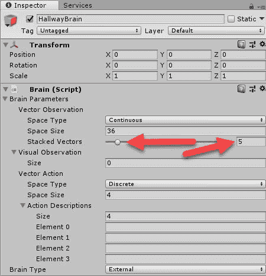

设置矢量观测堆栈大小

10.  这设置了我们希望代理记住的时间步数。我们还需要调整`memory_size`参数来解决这个问题。我们之前已经这样做过了。
11.  构建训练环境，并将输出放在`python`文件夹中。
12.  打开 Python 或 Anaconda 提示符，如果尚未打开的话。导航到`ml-agents`文件夹并激活`ml-agents`。
13.  使用以下内容运行训练器:

```
      python python/learn.py python/python.exe --run-id=hallway4 --train
```

14.  仔细观察控制台输出。您最初可能会注意到代理似乎只是在徘徊，并不比我们最初的运行更好。然而，在某些时候，代理会点击几次奖励，然后它会利用记忆快速学习模式。然后，代理将很快超过我们以前的训练努力大约 50，000 次迭代，可能更快。

请随意返回并进一步优化这个示例。如果你对更多关于循环神经网络和 LSTM 细胞的信息感兴趣，网上总有很多。请记住，这是一个高级主题，需要你理解比本书所涵盖的更多的关于神经网络的内部细节。

在上一个例子中，通过理解如何最好地使用递归神经网络，我们看到了部分可观察性的力量，并为我们的代理提供了时间记忆。在你训练完最后一个例子后，你可能还会注意到代理还在纠结。看看是否可以增加时间向量状态的数量和内存量，以进一步优化代理。

在下一节中，我们将深入探究 PPO 对 DQN 的另一项重大改进——一种叫做演员-评论家训练的技术。


# 异步演员-评论家训练

到目前为止，我们假设 PPO 的内部训练结构反映了我们第一次研究神经网络和 DQN 时所学到的东西。然而，事实并非如此。PPO 算法使用了一种被称为行动者-批评家的技术，而不是使用一个单一的网络来获得 *Q* 值或某种形式的政策。这种方法本质上是计算值和策略的结合。在演员-评论家，或 A3C，我们训练两个网络。一个网络充当 *Q-* 价值评估或批评家，另一个网络决定行动者或代理人的政策或行动。

我们在下面的等式中比较这些值，以确定优势:

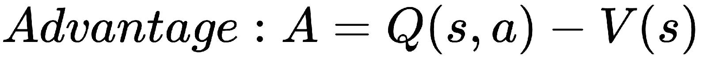

然而，网络不再计算 Q 值，所以我们用它来代替对奖励的估计:

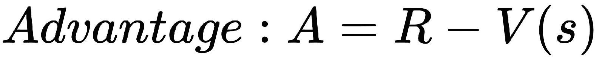

现在我们的环境看起来像下面的截图:


Diagram of actor–critic network

评论家和演员之间交流的误差项是从以下等式中得出的:

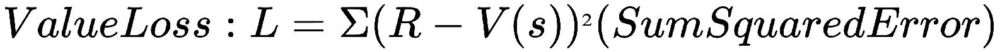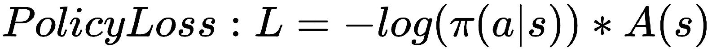

我们的目的是将误差降至最低，但更好的术语/等式是熵的计算:

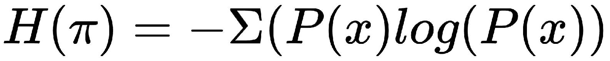

熵(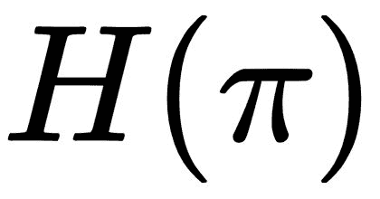)衡量的是概率的分布，而高熵代表一个代理有多个相似的动作，这使得代理的决策变得困难。熵值越小，代理人就能做出更明智的决策。这将我们的损失函数更新为:

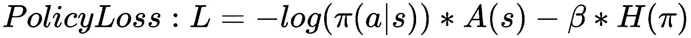

最后，当我们结合价值和策略这两个损失函数时，我们得到损失的最终等式，如下所示:

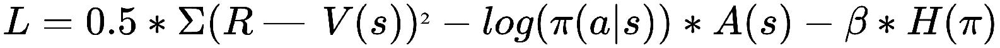

这个损失函数是我们的网络(代理)试图最小化的函数。虽然这是我们从开始使用 PPO 以来一直使用的训练形式，但我们忽略了另一个重要的改进。行动者-评论家训练是为了与多个异步代理一起工作而衍生的，每个代理都在自己的环境中工作。我们将在下一节探讨训练的异步方面。


# 多异步代理训练

我们刚刚看到的 A3C 算法是由 Google DeepMind 开发的，作为一种将多个异步代理同时训练到全球监督网络中的方法。现在已经为多个异步训练设置了`Hallway`示例，我们可以相对快速地启动它。打开 Unity 并完成以下练习，以启用多代理训练:

1.  打开走廊示例场景。

2.  定位并选择**走廊(1)** 到**走廊(15)** 对象，如下图所示:

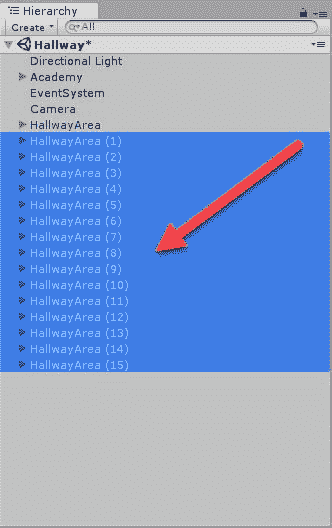

选择禁用的走廊对象

3.  通过选中“检查器”窗口中的“启用”框来启用所有这些对象。你应该看到所有的对象在激活时都从淡色变成了纯色。我们刚刚启用了另外 15 个训练环境，全部围绕走廊环境设置。

4.  缩小你的相机，你会看到 16 个走廊环境，如下图所示:


打开所有走廊环境和代理

5.  打开构建设置并构建环境。我们仍将构建一个单一的 Unity 播放器来运行所有的环境。
6.  在`trainer_config.yaml`文件中设置`HallwayBrain`的配置参数，如以下代码所示:

```
      HallwayBrain:
        use_recurrent: true
        sequence_length: 256
        num_layers: 2
        hidden_units: 128
        memory_size: 4096
        beta: 1.0e-2 
        gamma: 0.99
        num_epoch: 3
        buffer_size: 4096
        batch_size: 128
        max_steps: 5.0e5
        summary_freq: 500
        time_horizon: 64
```

7.  打开一个`Python`或者蟒蛇提示。激活`ml-agents`并导航至`ml-agents`文件夹。
8.  使用以下内容运行训练器:

```
      python python/learn.py python/python.exe --run-id=hallwayA3C --train
```

9.  当训练器运行时，您将只看到 1 个环境，这没问题，但实际上，有 16 个环境和代理在运行。

添加额外的内存和代理将使训练慢得多，尽管一开始您可能不会注意到太大的差异。这样做的原因是，代理人的记忆需要解决许多一致的良好记忆。一旦代理能够始终如一地做到这一点，您将会发现训练有所改进。看看下面的张量板输出，注意熵的收敛:


Convergence of entropy showing the agent making better decisions more quickly

在这个图中需要注意的是，熵图清楚地表明训练进行得很好。还记得我们是如何最小化方程中的熵的吗，较小的值意味着代理人做出了更好的决策？下面的代码显示了`Hallway`示例的一个更好、更优雅的配置:

```
HallwayBrain:
  use_recurrent: true
  sequence_length: 32
 num_layers: 1
  hidden_units: 128
  memory_size: 512
  beta: 1.0e-2
  gamma: 0.99
  num_epoch: 3
  buffer_size: 1024
  batch_size: 128
  max_steps: 5.0e5
  summary_freq: 500
  time_horizon: 64
```

前面的配置比我们之前运行的要精简得多。我们减少了层数、内存量、序列、缓冲区和时间范围参数。和往常一样，您可以随意返回并使用上一个示例，进一步探索其他训练课程中的参数。或者，您可以回顾并执行下一节中的练习，以获得更多经验。


# 练习

使用以下练习来提高您对 RL 和 PPO 训练师的理解。

1.  将 Unity 示例之一转换为仅使用视觉观察。提示，使用 GridWorld 示例作为指导，并记住代理可能需要自己的摄像机。
2.  以三种不同的方式使用目视观察改变代理的 CNN 配置。你可以添加更多的层，删除它们，或者改变内核过滤器。运行训练课程，并比较与 TensorBoard 的差异。
3.  将 GridWorld 示例转换为使用矢量观测和带记忆的递归网络。提示，您可以从`Hallway`示例中借用几段代码。

4.  再次查看`Ball3D`示例，并设置它使用多个异步代理训练。
5.  设置 crawler 示例，并通过多个异步代理训练来运行它。

如果您在运行这些示例时遇到问题，请务必在线查看。这些样品可能会被磨损，许多其他人会进一步调整或增强它们。


# 摘要

在本章中，我们详细了解了 Unity PPO 训练器。这个训练模型最初是在 OpenAI 开发的，是当前的高级模型，也是我们开始构建更复杂的训练场景的重点。我们首先回顾了`GridWorld`的例子，以了解当训练出错时会发生什么。从那以后，我们看了一些训练表现不佳的例子，我们学会了如何解决这些问题。然后，我们学习了代理如何使用视觉观察作为我们模型的输入，前提是首先处理数据。我们了解到，使用视觉观察的代理需要使用 CNN 层来处理和提取图像的特征。之后，我们研究了使用体验回放的价值，以便进一步推广我们的模型。这告诉我们，经验和记忆对特工的训练很有价值，以至于我们研究了一种更高级的记忆形式，叫做循环神经网络。随着 LSTM 细胞块的反复出现，我们的代理人也不再需要观察整个游戏区。相反，我们的代理人现在可以使用一种叫做部分可观察性的技术来管理状态和意识。最后，我们通过研究一种叫做异步行动者-批评家，或 A3C，训练的高级技术来结束这一章。这种形式的训练使用一个内部的评论家和演员来管理跨多个异步代理的错误最小化。

在下一章中，我们将介绍使用多种配置的多个代理的进一步训练技术，其中我们将让代理相互竞争或相互合作来解决学习问题。