# 再访玻璃容器——一个多主体生态系统

2002 年，微软开发了一个有趣的小游戏，名为 Terrarium，演示了。NET 框架。那时候 C#和。NET 只是新来者，微软很难推销；毕竟，它正在废黜 VBA 和 Visual Basic，并试图偷走 Java 开发人员。该游戏允许开发人员构建微小的可编程生物，这些生物可以在玻璃容器中出生、进食、睡眠、繁殖和死亡。它还具有允许微小程序感染其他连接的水族箱的能力。事实上，微软有一场比赛，让这些微小的生物程序相互竞争，获胜的开发者是拥有最成功生物的人。虽然我们不会去建立一个连接的玻璃缸基础设施，但我们会尽最大努力复制一些使原始游戏如此有趣的更酷的功能(无论如何，作为一个开发者)。

这一章的重点将是开发一个类似的玻璃容器游戏，让我们的代理人生存和死亡，但有一些曲折。虽然神经网络和其他人工智能技术在当时是可用的，但实际上所有的玻璃容器生物都是基于开发者创造的`A*`和启发式方法。现在，我们有能力让小玻璃容器生物自己编程，发展自己的获胜行为，可能是以我们从未想过的方式。这将是激动人心的一章，以下是我们将要讲述的内容:

*   什么是玻璃容器
*   构建代理生态系统
*   基本的玻璃容器——植物和食草动物
*   食肉动物:猎人
*   后续步骤
*   练习

在这一章中，我们有很多内容要讲，我们需要快速复习一些高级的 Unity 概念。如果您发现自己遇到了麻烦，请下载该书的源代码并查看完整的示例。

如果在玻璃容器中培养你自己的可编程小生物的概念没有让你兴奋，那么你可能是偶然拿起这本书的。请物归原主，谢谢。


# 什么是玻璃容器？

玻璃容器是一个可能超越其时代的概念。虽然游戏确实允许开发者在父母和后代之间转移某种形式的状态，但这是一个从未在成功的代理中使用的功能。相反，开发人员只是为一组特定的固定策略优化了他们的代码，这在很多情况下会产生大量代码。以下是在生态系统模式下运行的 Terrarium 客户端的示例屏幕截图:

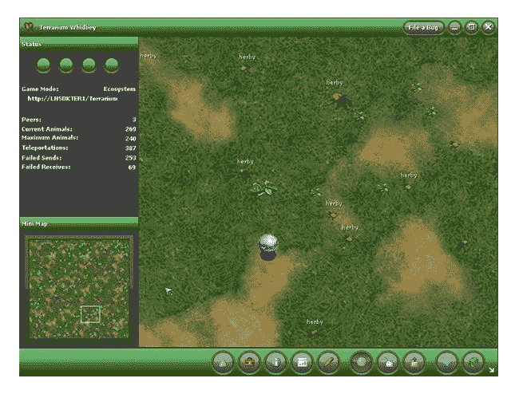

Original Microsoft Terrarium

现在，底线是我们不能在一章中复制整个连接生态系统的概念。优雅的玻璃容器网络生态系统基础设施可能需要几个章节来解释。相反，我们的目标是建立一个多智能体多大脑生态系统，旨在教你更多关于建立多智能体环境和深度强化学习的知识。也许像微软或 Unity 这样的人会将互联生态系统的概念推进一步——谁知道呢。

玻璃容器游戏的规则相当简单，其中一个基本规则是你的代码必须在 x 时间内无故障运行，否则生物就会死亡。还有其他方面可以让你给生物的能力加分，比如大小、速度、韧性等等，我们将会重点介绍。开发人员有 100 分，他们可以应用于食肉动物和食草动物类型的生物的各种类别，如以下示例表所示:

| **属性** | **食草动物** | **食肉动物** | **描述** |
| 最大能量 | `20` | `10` | 决定该生物可以为动作储存多少能量。食肉动物通过吃其他生物来消耗能量。食草动物吃植物。 |
| 进食速度 | `2` | `6` | 决定该生物消耗其他生物能量的速度。 |
| 攻击伤害 | `0` | `14` | 另一个生物在攻击中造成的伤害量。 |
| 防御损害 | `10` | `10` | 决定生物防御攻击的效果。拥有更高防御力的生物会对攻击者造成伤害。 |
| 最大速度 | `8` | `10` | 决定生物移动的速度。 |
| 伪装 | `25` | `5` | 看到这种生物有多难。 |
| 视力 | `5` | `20` | 一个生物能探测到多远的其他生物。 |
| 成熟尺寸 | `30` | `20` | 我们在原有的参数上增加了成熟的尺寸，希望能让游戏更加平衡。 |
| 增长率 | `5` | `5` | 这是另一个增加的参数，可以更清晰的管理生物的成长。最初的游戏处理生物生长有点像黑盒。 |

最重要的是，所有生物都有一个成熟的大小属性，可以从`24`到`48`变化，这与原始游戏中图标的图像大小相对应。当我们构建示例时，我们会将所有这些属性映射到各种游戏机制，但是为了执行强化学习，我们还需要应用某种形式的奖励结构。

以前，我们所有的奖励都是以目标为导向的；到达目标并获得奖励。然而，用玻璃容器，我们的目标过去是，现在仍然是让我们的代理人尽可能长时间地生活和繁殖。因此，我们想推出一个奖励系统，也模仿这一点。为此，我们将根据以下事件给予奖励:

| **事件** | **奖励** | **描述** |
| 老死 | `+1` | 我们的目标是让生物特工尽可能长时间地生存下去。 |
| 繁殖 | `+1` | 我们想鼓励生育；对其他人来说，更多的代理意味着更多的学习和食物。 |
| 吃 | `+energy eaten/100` | 我们给予这种微奖励是为了鼓励生物进食。没有它，他们可能会意识到他们不需要这样做，只是不断饿死。另外，每个人都喜欢吃，对吗？ |
| 病死 | `-1` | 在最初的游戏中，如果代码崩溃或代理无法移动，则生物会因病死亡。增加这一负面奖励有望减少拥挤。 |

最初的游戏是实时运行的，但本质上是基于回合的，在每个回合中，代理将根据其当前状态运行一系列事件或功能，如下所示:

| **事件** | **功能** |
| `BornEvent` | 在生物出生后触发。 |
| `LoadEvent` | 在一个生物被载入环境后触发。 |
| `IdleEvent` | 当代理需要做出决策时触发，我们可以将其转换为按需决策。 |
| `ReproduceCompletedEvent` | 代理复制后激发；这将是我们的奖励活动。 |
| `EatCompletedEvent` | 在特工吃东西后开火。又一次给予奖励的机会。 |
| `DefendCompletedEvent` | 代理需要明确地执行防御操作。该事件将在代理进行自我辩护后触发。 |
| `AttackCompletedEvent` | 当代理完成攻击时触发。 |
| `AttackedEvent` | 在生物受到攻击后开火。 |
| `MoveCompletedEvent` | 在代理移动后激发。 |

现在，在最初的游戏中，开发者的工作是在之前的每个事件中实现他们自己的代码，以控制代理。出于我们的目的，我们将使用一个基于物理的实时系统，该系统将根据代理计时激活这些事件。代理人执行的每一个动作都需要一定的时间，时间长短取决于生物的速度或进食速度。这就是为什么代理能够快速移动和消耗资源(其他生物)是至关重要的。

在一个回合中，代理可以执行以下操作:

**动作**

| **描述** | 等待 |
| 一个生物可以等待和保持空闲，从而保存能量。 | 移动 |
| 每次移动动作消耗`.01 x`生物当前大小的能量。 | 攻击 |
| 攻击消耗`.01 x`生物大小的能量。一次攻击造成的伤害等于攻击强度乘以生物体型，再减去任何防御生物的防御`x`生物体型。如果一只食草动物不防守，攻击者会全力攻击。 | 保护 |
| 防御消耗`.005 x`生物大小的能量。为了阻挡攻击，生物必须明确地保护自己。 | 吃 |
| 吃东西消耗能量的速度是每时间尺度的进食速度。生物不能吃活跃的食草动物或食肉动物，但可以吃活的植物。 | 繁殖 |
| 繁殖消耗生物 1/2 的能量。为了繁殖，这种生物必须有超过其最大能量 50%的能量，并且是成熟的体型。 | Reproduction consumes 1/2 the creature's energy. In order to reproduce, the creature must have greater than 50% of its maximum energy and be of mature size. |

除了上述动作，生物在成长和死亡时也会经历各种各样的转变，如下表所示:

**终身大事**

| **描述** | **出生** |
| 每当一个成熟的生物达到最大尺寸并有能量剩余时，就会产生一个新的生物，`energy > max energy + 1`。 | **成长** |
| 当一个生物的能量等级增加 50%时，它就会成长。一次生长爆发会立刻减少一个生物当前 25%的能量。如果你愿意，你也可以在这里增加一点奖励来鼓励生物成长。 | **老死** |
| 这种生物已经活得够长了。生物的寿命取决于它的大小，因此较大的生物活得更长。 | **饿死或病死** |
| 这个生物耗尽了所有的`energy < 0`，然后死亡。能量为零的生物可以无所事事地活到老年，但如果它试图移动、防御或攻击，它就会死亡。可以想象另一种生物会给它带来食物，但是我们将会看到这种情况如何发展。 | **被杀** |
| 当一个生物被另一个生物杀死时，它会死亡但不会被消灭。死去的生物剩下最大的能量供食肉动物消耗。 | When a creature is killed by another creature, it dies but is not destroyed. The dead creature is left with max energy for carnivore creatures to consume. |

前面的生命周期事件将随着代理的存在而自动发生，并且将由我们将开发来控制训练场景的学院对象来控制。有了所有这些规则，我们可以在下一部分继续构建一个代理环境。

构建代理生态系统


# 现在我们有了一套核心规则，我们可以在 Unity 中从头开始构建我们的多代理生态系统。之前，我们花了相当多的时间查看 Unity 罐装样品，但这对于在如此短的时间内涵盖所有材料来说是必不可少的。了解了所有的核心知识后，我们现在可以通过下面的练习构建一个更复杂的示例:

从**项目**窗口，在`Assets`下创建一个名为`Terrarium`的新文件夹。

1.  创建五个新文件夹，分别叫做`Materials`、`Prefabs`、`Scenes`、`Scripts`和`TFModels`、**。**
2.  在`Scenes`文件夹中新建一个名为`Terrarium`的场景。
3.  打开新的**玻璃容器**场景，从菜单中选择`GameObject -> Create Empty`。将对象重命名为`Academy`。
4.  在**项目**窗口中打开`Scripts`文件夹。创建一个名为`TerrariumAcademy`的新 C#脚本。编辑脚本，使其包含以下代码:
5.  我们不需要太多代码，因为我们是从标准的 ML-Agents **学院**脚本扩展而来。完成编辑后保存脚本并返回 Unity。等待脚本编译无误。

```
      using UnityEngine;
        public class TerrariumAcademy : Academy {
          public override void AcademyReset() {
          }
          public override void AcademyStep() {
          }
        }
```

6.  将 **TerrariumAcademy** 脚本拖到 **Academy** 对象上，将其作为组件附加。设置**玻璃容器学院**组件参数如下:

7.  设置学院训练配置参数

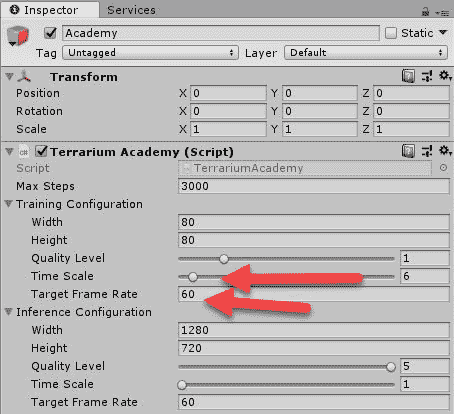

设置这些参数将确保我们可以使用教练参数`--slow`运行训练课程并查看模拟运行。

8.  这建立了我们项目的第一部分，但是我们还有几个步骤要做。在下一部分，我们将导入一些丰富多彩的资源，让我们的玻璃容器更有趣。

导入 Unity 资产


# Unity 最引人注目的方面之一是资产存储。商店里有如此多的高质量内容，以至于你可以不用任何代码就开发出一个完整的游戏。当然，我们不会有这种奢侈，但我们将利用许多免费资产来丰富我们的玻璃容器。打开 Unity back up 并跟随导入项目资产:

从菜单中选择**窗口** | **资产存储**。在撰写本文时,**资产商店**目前正在过渡中，一些截图可能看起来很不一样，否则资产将会消失。无论哪种方式，任何低多边形生物或动物包都可以。

1.  在搜索栏中输入搜索文本`gloomy animal`并点击搜索或点击回车。您将看到一些搜索结果出现。选择名为`Free Low_Polygon Animal` pack 的资产，如下图所示:
2.  导入低多边形动物包

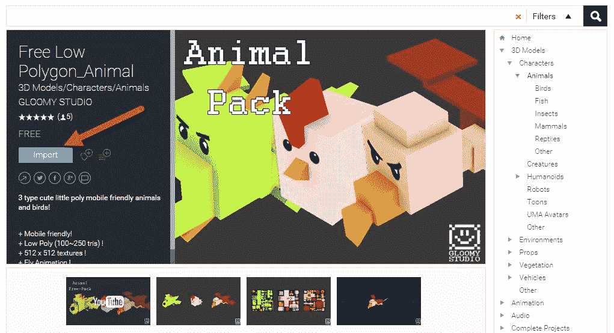

点击**下载**，然后点击导入按钮，如前面截图所示。这将把资产导入到项目中。系统将提示您选择要导入的资产。确保所有项目都被选中，然后点击导入对话框上的**导入**。

3.  返回**资产商店**窗口，搜索`low poly toon` **。**选择资产，如下图所示:

4.  将低聚卡通资产导入到项目中

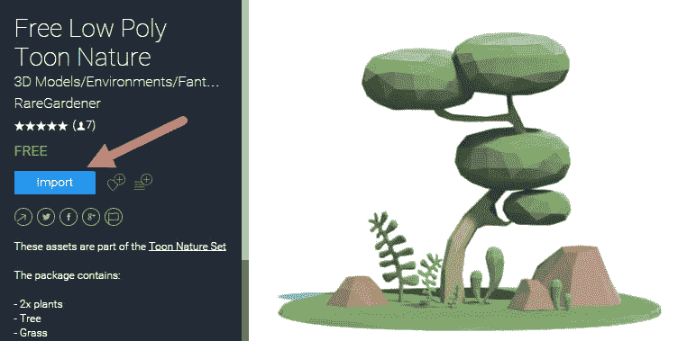

下载资产并将其导入到项目中。

5.  Unity 有各种各样优秀和不那么优秀的资产可供选择。要小心，因为并不是所有的有偿资产都像它们看起来的那样，可能经常会给你带来更多的痛苦。同样，有许多优秀的免费资产，就像我们正在使用的，但也有许多不太好的免费资产。如果你在一项资产上投资任何时间或金钱，确保它对你和你的项目有用。许多项目遭受了资产膨胀，因为这在当时看起来是个好主意。记住，即使是免费的资产也是有代价的:时间。

随着我们的新资产的导入，我们可以在下一部分向我们的项目添加环境。

营造环境


# 最初的玻璃容器游戏是在 2D，因为那时候更容易，但现在我们制作 3D 版本实际上更容易。除了这个改进，我们将使用动物和植物代替 2D 图标。首先，我们需要通过以下练习来构建我们的世界:

加载玻璃容器场景。

1.  从菜单中选择**游戏对象** | **创建空的**。重命名新对象**环境**。
2.  右键单击(macOS 上的*命令*点击)新的**环境**对象，并从上下文菜单中选择 **3D 对象** | **平面**。如有必要，将飞机的位置重置为`0,0,0`。将**变换** | **比例**设置为`(5,1,5)`。
3.  在**层次**窗口中选择新的**平面**对象，然后将**网格渲染器**组件的**材质**属性更改为`brown_01`，如下图所示:
4.  更改平面的渲染材质

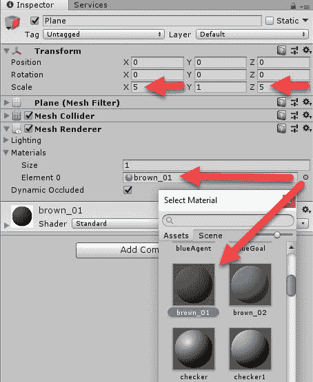

在脚本文件夹中创建一个名为`LookCamera`的新脚本，并编辑其内容，如下所示:

5.  这是一个基本的 **LookCamera** 脚本，允许你在场景中自由移动和旋转相机。如果你想要额外的特性，这个脚本有很多变化。阅读脚本，以便弄清楚控件和特殊的复位键。

```
      using UnityEngine;
      using System.Collections;

      public class LookCamera : MonoBehaviour 
      { 
        public float mouseSensitivityX = 5.0f;
        public float mouseSensitivityY = 5.0f;

        float rotY = 0.0f;

        void Start()
        {
          if (GetComponent<Rigidbody>())
            GetComponent<Rigidbody>().freezeRotation = true;
        }
        void Update()
        { 
          if (Input.GetMouseButton(1)) 
          {
            float rotX = transform.localEulerAngles.y + 
            Input.GetAxis("Mouse X") * 
             mouseSensitivityX;
            rotY += Input.GetAxis("Mouse Y") * mouseSensitivityY;
            rotY = Mathf.Clamp(rotY, -89.5f, 89.5f);
            transform.localEulerAngles = new Vector3(-rotY, rotX, 0.0f);
          }
          if (Input.GetKey(KeyCode.W) || Input.GetKey(KeyCode.UpArrow))
          {
            transform.position += transform.forward * .1f;
          }
          else if (Input.GetKey(KeyCode.S) || 
          Input.GetKey(KeyCode.DownArrow))
          {
            transform.position -= transform.forward * .1f;
          }
          if (Input.GetKey(KeyCode.U))
          {
            gameObject.transform.localPosition = new Vector3(0.0f, 50.0f, 
            0.0f);
            transform.localEulerAngles = new Vector3(90f, 0.0f, 0.0f);
          }
        }
      }
```

6.  将 **LookCamera** 脚本附加到场景的**主摄像机**，并在**检查器**中修改对象属性，如下所示:
7.  设置主摄像机属性和脚本

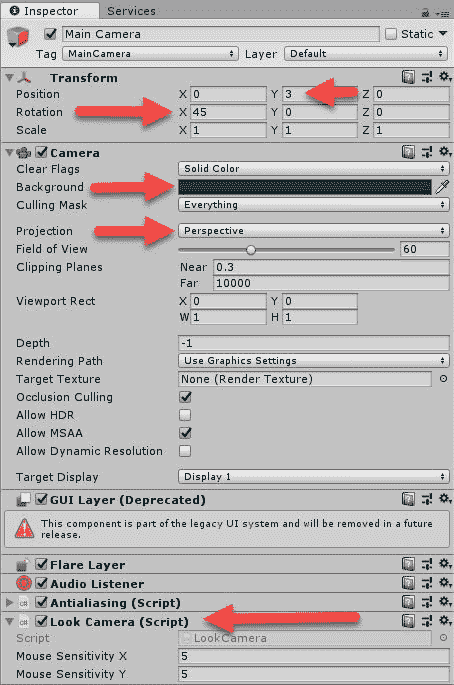

按下播放按钮运行场景。使用 **LookCamera** 脚本输入控件在场景中移动相机。试着按特殊键看看会发生什么；如果你不确定什么键起什么作用，请再读一遍脚本。这个脚本的当前版本是无限的，这意味着您可以去任何地方。随意添加自己的限制相机的边界框。

8.  现在我们已经建立了基本的代理环境，我们想在下一节开始添加植物和动物。

基本的玻璃容器——植物和食草动物


# 在建立我们的玻璃容器时，我们的大部分工作将是建造植物、吃植物的代理(食草动物)和吃吃植物的代理(食肉动物)。我们将从最基本的玻璃容器居民——植物开始。盆栽植物与它们的自然表亲没有什么不同；他们仅仅通过存在而不断增加能量。当它们长到一定大小时，它们也开始释放种子，产生更多的植物等等。打开 Unity 并跟随创建我们的第一个玻璃容器居民，植物:

打开我们上次离开的玻璃容器场景，从菜单中选择游戏对象|创建空白。重命名新对象`Plant`。

1.  将`Plant`对象拖到`Environment -> Plane`上，将其附加为子对象。确保将`Transform Position`重置为`(0,0,0)`。
2.  打开`Assets/Free Low Poly Toon Nature/Prefabs`文件夹，将`tree_F08`预设拖到场景中的**植物**对象上。确保子预设的变换位置是`0,0,0`。
3.  在`Assets/Terrarium/Scripts`文件夹中创建一个新的 **C#** 脚本，并将其命名为 **Plant** 。在您选择的编辑器中打开脚本，并替换为:
4.  在大多数情况下，前面的代码应该足够简单易懂；稍后我们将仔细研究**重现**的方法。刚接触 Unity 的人应该记得，当对象启动时会调用 **Start** ，每个渲染帧都会调用 **Update** 。如果你更详细地看一看**更新**方法，你会看到植物的整个生命周期。我们为各种编辑器字段准备的部分想要公开并使用 **Header** 属性。完成编辑后保存脚本并返回 Unity，确保没有出现编译错误。

```
      using UnityEngine;
      public class Plant : MonoBehaviour {
        [Header("Plant Points (30 Max)")] 
        public float MaxEnergy;
        public float MatureSize;
        public float GrowthRate;
        public float SeedSpreadRadius;

        [Header("Monitoring")]
        public float Energy;
        public float Size; 
        public float Age;

        [Header("Seedling")]
        public GameObject SeedlingSpawn;

        [Header("Species Parameters")]
        public float EnergyGrowthRate = .01f;
        public float AgeRate = .001f;
        private Transform Environment;

        private void Start()
        {
          Size = 1;
          Energy = 1;
          Age = 0;
          Environment = transform.parent;
          TransformSize();
        }

        void Update ()
        { 
          if (CanGrow) Grow();
          if (CanReproduce) Reproduce();
          if (Dead) Destroy(this);
          Age += AgeRate;
          Energy += EnergyGrowthRate;     
        }

        void TransformSize()
        {
          transform.localScale = Vector3.one * Size;
        }

        bool CanGrow
        {
          get
          {
            return Energy > ((MaxEnergy / 2) + 1);
          }
       }

       bool CanReproduce
       {
         get
         {
           if (Size >= MatureSize && CanGrow) return true;
           else return false;
         }
       }

       bool Dead
       {
         get
         {
           return Energy < 0 || Age > MatureSize;
         }
       }

       void Grow()
       {
         if (Size > MatureSize) return;
         Energy = Energy / 2;
         Size += GrowthRate * Random.value; 
         TransformSize();
       }

        void Reproduce()
        {
          var vec = Random.insideUnitCircle * SeedSpreadRadius + new 
          Vector2(transform.position.x, transform.position.z);
          Instantiate(SeedlingSpawn, new Vector3(vec.x,0,vec.y), 
          Quaternion.identity, 
          Environment);
          Energy = Energy / 2;
         }
      }
```

5.  将**植物**脚本附加到**植物**对象上。你可以通过拖拽脚本或者使用**添加组件**来完成；这是你的选择。同时，还要添加一个**刚体**和**胶囊碰撞器**组件。编辑各种脚本组件的属性，使它们与下面的屏幕截图相匹配:
6.  设置工厂组件属性

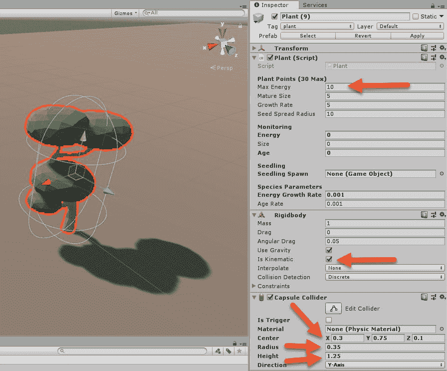

打开你的代码编辑器到**植物**脚本，向下滚动到**重现**方法。当这个方法被调用时，植物通过调用**实例化**产生新的幼苗。**实例化**基于 Unity 中一个名为**预设**的模板对象在场景中创建新的游戏对象。预设是 Unity 开发的基石，为所有形式的开发活动创建可重用的对象。

7.  接下来的部分很棘手，可能需要你全神贯注。如果你感到沮丧，看看本书源代码中的这个例子。

从**层次**窗口中选择**植物**对象，并将其拖动到**项目**窗口中的**资产/玻璃容器/预置**文件夹中，以创建一个新的**植物**预置。

8.  将新的**植物**预设拖到**检查员**窗口中的**植物-幼苗产卵**游戏对象区域。这就创建了一个与**植物**及其自身或繁殖的递归关系，这意味着**植物**将总是繁殖其自身的一个副本。
9.  点击窗口顶部**预置**部分的**应用**按钮，更新**植物**预置，具有递归关系。由于我们的玻璃容器中只有一株植物，我们现在可以继续运行一个示例。
10.  按下播放按钮，观看植物如何及时变成多个植物，然后逐渐接管玻璃容器，如以下截图所示:
11.  玻璃容器中过度生长的植物

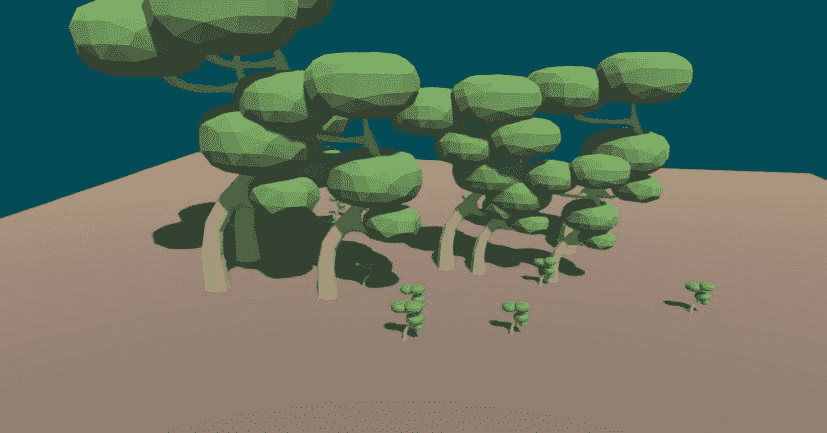

在这一点上，您可以使用我们刚刚制作的单个植物，或者使用我们下载的聚卡通自然预设创建其他植物类型。如果你这样做了，确保你给每一种新植物的分数都不一样。

既然我们已经确定了我们有一个植物问题，这在我们的情况下是一件好事，因为我们的第一个生物代理，食草动物，将需要消耗植物才能生存，我们将在下一节中着手建造食草动物。

食草动物来救援了


# 食草动物将是我们最基本的代理人，它们将学会在玻璃容器中生活。食草动物将通过食用植物而茁壮成长，这将给它们生长和繁殖提供能量。在创建食草动物代理脚本时，我们可以遵循一些与构建植物脚本相同的基本模式。打开 Unity，按照本练习编写食草动物代理脚本:

在`Assets/Terrarium/Scripts`文件夹中创建一个名为`CreatureAgent`的新脚本，并在您选择的编辑器中打开它。幸运的是，如果我们把事情归纳成一个单一的`CreatureAgent`脚本，我们就不需要为每个不同类型的代理创建不同的脚本。

1.  我们将在构建这个脚本时介绍它的每一部分。输入以下代码行:
2.  所有前面的代码主要是公共和私有字段，但是请注意开头的 CreatureType 枚举。设定生物类型也会控制特定于不同生物类型的特殊逻辑。当然，你可以在以后添加其他生物类型。然后，我们将从 Agent 扩展 CreatureAgent，因为我们希望 Academy 自动注册和控制这个代理。最后是`Awake`方法，它在对象启动时被调用，负责重置代理。

```
      using UnityEngine;
      public enum CreatureType
      {
        Herbivore,
        Carnivore
      }
      public class CreatureAgent : Agent
      {
       [Header("Creature Type")]
       public CreatureType CreatureType;
       [Header("Creature Points (100 Max)")]
       public float MaxEnergy;
       public float MatureSize;
       public float GrowthRate;
       public float EatingSpeed;
       public float MaxSpeed;
       public float AttackDamage;
       public float DefendDamage;
       public float Eyesight;

       [Header("Monitoring")]
       public float Energy;
       public float Size;
       public float Age;
       public string currentAction;

       [Header("Child")]
       public GameObject ChildSpawn;

       [Header("Species Parameters")] 
       public float AgeRate = .001f;
       private GameObject Environment;
       private Rigidbody agentRB;
       private float nextAction;
       private bool died;
       private RayPerception rayPer; 
       //private TerrariumAcademy academy;
       private int count;
       private Vector2 bounds;

       private void Awake()
       {
       AgentReset();
       }
```

3.  接下来，我们将添加覆盖代理所需的所有方法，如下所示:
4.  关于前面的代码，有几件重要的事情需要注意，那就是`CollectObservations`和`AgentAction`方法。`CollectObservations`是我们使用以前见过的技术收集代理状态的地方。在`AgentAction`中，我们正在检查七个可能的动作值，以确定代理在做出决定后将采取什么动作。

```
      public override void AgentReset()
      {
        Size = 1;
        Energy = 1;
        Age = 0;
        bounds = GetEnvironmentBounds();
        var x = Random.Range(-bounds.x, bounds.x);
        var z = Random.Range(-bounds.y, bounds.y);
        transform.position = new Vector3(x, 1, z);
        TransformSize();
        InitializeAgent();
      }

      public override void AgentOnDone()
      {}

      public override void InitializeAgent()
      {
        base.InitializeAgent();
        rayPer = GetComponent<RayPerception>();
        agentRB = GetComponent<Rigidbody>();
        currentAction = "Idle";
      }

      public override void CollectObservations()
      {
        float rayDistance = Eyesight;
        float[] rayAngles = { 20f, 90f, 160f, 45f, 135f, 70f, 110f };
        string[] detectableObjects = { "plant", "herbivore", "carnivore" };
        AddVectorObs(rayPer.Perceive(rayDistance, rayAngles, 
        detectableObjects, 0f, 0f));
        Vector3 localVelocity = 
        transform.InverseTransformDirection(agentRB.velocity);
        AddVectorObs(localVelocity.x);
        AddVectorObs(localVelocity.z);
        AddVectorObs(Energy);
        AddVectorObs(Size);
        AddVectorObs(Age);
        AddVectorObs(Float(CanEat));
        AddVectorObs(Float(CanReproduce));
      }

      private float Float(bool val)
      {
        if (val) return 1.0f;
        else return 0.0f;
      }

      public override void AgentAction(float[] vectorAction, 
      string textAction)
      {
        //Action Space 7 float
        // 0 = Move
        // 1 = Eat
        // 2 = Reproduce
        // 3 = Attack
        // 4 = Defend
        // 5 = move orders
        // 6 = rotation
        if (vectorAction[0] > .5)
        {
          MoveAgent(vectorAction);
        }
        else if (vectorAction[1] > .5)
        {
          Eat();
        }
        else if (vectorAction[2] > .5)
        {
          Reproduce();
        }
        else if (vectorAction[3] > .5)
        {
          //Attack();
        }
        else if (vectorAction[4] > .5)
        {
          //Defend();
        }
      }
```

5.  接下来，我们将添加`Update`和`FixedUpate`方法，如下所示:
6.  `Update`方法类似于`Plant Update`方法，只是涵盖了代理的生命周期。`FixedUpdate`方法不断检查代理是否准备好做出另一个决定。回想一下，我们这样做是为了模拟决策时间，并通过调用`RequestDecsion`使用按需决策来提高我们的模拟性能。

```
      void Update()
      {
        if (OutOfBounds)
        {
          AddReward(-1f);
          Done();
          return;
        }
        if (Buried)
        {
          Done();
        }
        if (Dead) return;
        if (CanGrow) Grow();
        if (CanReproduce) Reproduce(); 
        Age += AgeRate; 
        MonitorLog();
      }

      public void FixedUpdate()
      {
        if (Time.timeSinceLevelLoad > nextAction)
        {
          currentAction = "Deciding";
          RequestDecision();
        }
      }
```

7.  接下来，我们添加了另一个叫做`MonitorLog`的方法，它将允许我们可视化我们的生物在活着时的状态。输入以下代码:
8.  Unity 团队为我们提供了一个用`Monitor.Log`快速查看代理统计数据的好方法。查看 Unity 文档，了解如何使用此监控功能的更多信息。

```
      public void MonitorLog()
      {
        Monitor.Log("Action", currentAction, MonitorType.text, transform);
        Monitor.Log("Size", Size / MatureSize, MonitorType.slider, 
        transform);
        Monitor.Log("Energy", Energy / MaxEnergy, MonitorType.slider, 
        transform);
        Monitor.Log("Age", Age / MatureSize, MonitorType.slider, 
        transform);
      }
```

9.  最后，我们将转储剩余的代码，如下所示:
10.  这是一大块代码，虽然看起来令人生畏，但相对来说都很简单。这不是我们需要的所有代码，但现在已经足够了。

```
      public bool OutOfBounds
      {
      get
        {
          if (transform.position.y < 0) return true;
          if (transform.position.x > bounds.x || transform.position.x 
          < -bounds.x ||             transform.position.y > bounds.y || 
          transform.position.y < -bounds.y) return 
          true;
          else return false;
        }
      }
      void TransformSize()
      {
        transform.localScale = Vector3.one * Mathf.Pow(Size,1/2);
      }

      bool CanGrow
      {
        get
        {
          return Energy > ((MaxEnergy / 2) + 1);
        }
      }

      bool CanEat
      {
        get
        {
          if(CreatureType == CreatureType.Herbivore)
          {
            if (FirstAdjacent("plant") != null) return true;
          }
          return false;
        }
      }

      private GameObject FirstAdjacent(string tag)
      {
        var colliders = Physics.OverlapSphere(transform.position, 1.2f * 
        Size);
        foreach (var collider in colliders)
        {
          if (collider.gameObject.tag == tag)
          {
            return collider.gameObject;
          }
        }
          return null;
      }

      bool CanReproduce
      {
        get
        {
          if (Size >= MatureSize && CanGrow) return true;
          else return false;
        }
      }

      bool Dead
      {
        get
        {
          if (died) return true;
          if (Age > MatureSize )
          {
            currentAction = "Dead"; 
            died = true;
            Energy = Size; //creature size is converted to energy
            AddReward(.2f);
            Done();
            return true;
           }
         return false;
        }
      }

      bool Buried
      {
        get
        {
          Energy -= AgeRate;
          return Energy < 0;
        }
      }

      void Grow()
      {
        if (Size > MatureSize) return;
        Energy = Energy / 2;
        Size += GrowthRate * Random.value;
        nextAction = Time.timeSinceLevelLoad + (25 / MaxSpeed);
        currentAction ="Growing";
        TransformSize();
      }
      void Reproduce()
      {
        if (CanReproduce)
        {
          var vec = Random.insideUnitCircle * 5;
          var go = Instantiate(ChildSpawn, new Vector3(vec.x, 0, vec.y), 
          Quaternion.identity, Environment.transform);
          go.name = go.name + (count++).ToString();
          var ca = go.GetComponent<CreatureAgent>();
          ca.AgentReset();
          Energy = Energy / 2;
          AddReward(.2f); 
          currentAction ="Reproducing";
          nextAction = Time.timeSinceLevelLoad + (25 / MaxSpeed);
        }
      }

      public void Eat()
      {
        if (CreatureType == CreatureType.Herbivore)
        {
          var adj = FirstAdjacent("plant");
          if (adj != null)
          {
            var creature = adj.GetComponent<Plant>();
            var consume = Mathf.Min(creature.Energy, 5);
            creature.Energy -= consume;
            if (creature.Energy < .1) Destroy(adj);
            Energy += consume;
            AddReward(.1f);
            nextAction = Time.timeSinceLevelLoad + (25 / EatingSpeed);
            currentAction = "Eating";
          } 
        }
      }

      public void MoveAgent(float[] act)
      { 
        Vector3 rotateDir = Vector3.zero; 
        rotateDir = transform.up * Mathf.Clamp(act[6], -1f, 1f);
        if(act[5] > .5f)
        { 
          transform.position = transform.position + transform.forward;
        }
        Energy -= .01f;
        transform.Rotate(rotateDir, Time.fixedDeltaTime * MaxSpeed); 
        currentAction = "Moving"; 
        nextAction = Time.timeSinceLevelLoad + (25 / MaxSpeed);
      }
      private Vector2 GetEnvironmentBounds()
      {
        Environment = transform.parent.gameObject;
        var xs = Environment.transform.localScale.x;
        var zs = Environment.transform.localScale.z;
        return new Vector2(xs, zs) * 10;
      }
```

`MoveAgent`方法是从 Unity samples 借鉴来的，所以可能比较熟悉；不同的是，物理代码被删除，以使事情更简单。Eat 和`FirstAdjacent`方法是所有动作发生的地方。当一个`Herbivore`类型的生物决定吃东西时，它会寻找第一个相邻的物体，也就是它的碰撞器正在碰撞的物体。如果它检测到一个相邻的`'plant'`类型的物体，它会开心地吃东西。`FirstAdjacent`方法是碰撞检测，它使用一个`SphereCast`来确定任何相邻的物体。

11.  保存脚本并返回 Unity 以确保没有编译器错误。
12.  这就完成了我们的`CreatureAgent`脚本中的食草动物部分。一定要仔细阅读代码，以便对它的工作原理有一个很好的了解。在下一节中，我们将把食草动物添加到场景中并开始训练。

建造食草动物


# 在 2002 版的 Terrarium 中，开发人员必须自己给大脑编码，这有时会增长到数千行代码。然而，我们知道，有了 ML-Agents 工具，我们可以让生物使用 DRL 编程或构建自己的最佳解决方案。打开 Unity 到玻璃容器场景，并跟随以建造食草动物:

右键单击*层级窗口中的**学院**对象。从上下文菜单中，选择**创建空的**。重命名新对象`HerbivoreBrain`。*

1.  向对象添加一个**大脑**组件，并设置如下属性:

2.  设置植食性动物的属性

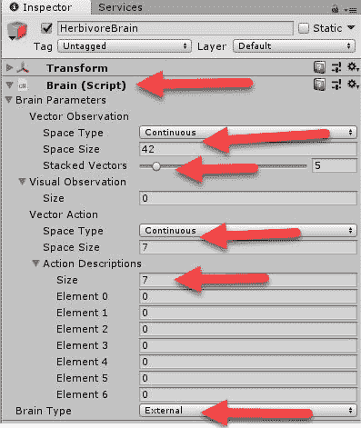

从**环境**对象中创建一个新的空对象，并将其命名为`Herbivore`。

3.  从`Assets/_Gloomy_Animal/Meshes`文件夹中拖动**小鸡**模型，并将其作为**食草动物**对象的子对象放到**层次**窗口中。
4.  给**食草动物**对象添加一个**箱式碰撞器**、**刚体**和**光线感知**组件并配置，如下图所示:

5.  向小鸡介绍物理规则

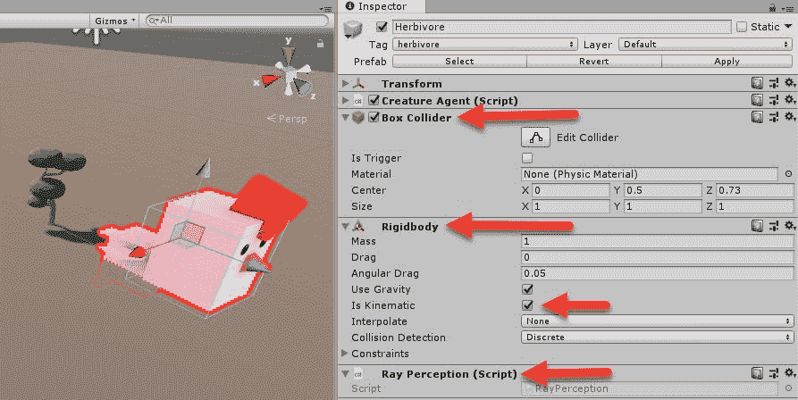

这将向小鸡介绍物理学的规则。为了简单起见，我们在这个版本中使用了**运动学**设置。在这个版本中，我们使用物理学是为了让我们在确定物体是否相邻时更加简单。

6.  在 3Dology 中，运动学是物理模拟中固定或静止的另一种说法。当然，这个对象可以在代码中或者在 Unity 物理领域之外移动。

继续物理学，点击检查器窗口顶部的**标签**下拉菜单，创建新的**食草动物**、**食肉动物**和**植物**标签。将**食草动物**标签设置为 on，如下图所示:

7.  为生物添加标签

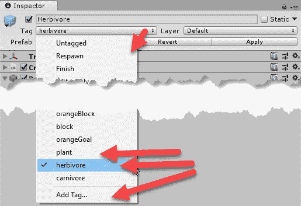

标签在物理引擎中用于根据对象类型快速过滤。如果我们不这样做，大多数物理查询将需要为每次检查运行整个对象列表，这不是很有效。

8.  将 **CreatureAgent** 脚本添加到**食草动物**中，并将属性设置为如下截图所示:
9.  设置生物代理组件属性

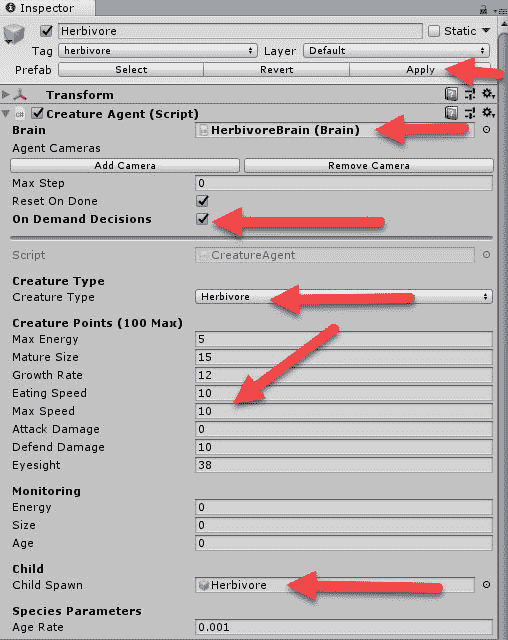

按照你将**植物**变成**食草动物**的预设的相同步骤，确保在将**子代**设置到自身后再次应用预设。

10.  这创造了基本的食草动物。现在，你可以回头修改这个生物，尝试不同的点，模型，或者任何你想要的东西。在下一部分，我们将对食草动物进行训练。

训练食草动物


# 在本书的这个阶段进行训练应该是你的第二天性，我们会很快复习一遍。打开 Unity，回到我们上次离开的地方，让我们开始训练:

确保您的**玻璃容器**场景和项目已保存。

1.  从菜单中选择**文件** | **构建设置...**。确保**玻璃容器**场景是构建环境中唯一用于外部训练的场景。只要你使用的是同一个 Unity ML-Agents 项目，你就可以开始了。
2.  一如既往地将外部训练的游戏构建到`'python'`文件夹中。
3.  打开 Visual Studio 代码或您喜欢的其他文本编辑器，打开在`ml-agents/python`文件夹中找到的`trainer_config.yaml`文件。
4.  添加一个新的大脑配置`HerbivoreBrain`，并将此处显示的文本添加到文件的底部:
5.  食草动物的大脑本质上是 HallwayBrain 的克隆。

```
      HerbivoreBrain:
        use_recurrent: true
        sequence_length: 64
        num_layers: 1
        hidden_units: 128
        memory_size: 512
        beta: 1.0e-2
        gamma: 0.99
        num_epoch: 3
        buffer_size: 1024
        batch_size: 128
        max_steps: 5.0e5
        summary_freq: 500
        time_horizon: 128
```

6.  打开你的 Python 或 Anaconda 提示符并激活`ml-agents`。然后，对`cd ml-agents`文件夹做同样的操作。

7.  使用以下命令运行训练器:
8.  使用 **LookCamera** 和那些特殊的键，在食草动物训练时在场景中移动。下面是一个截图，显示了一个玻璃容器中的几只鸡和植物:

```
      python python/learn.py python/python.exe --run-id=terrarium1 --train 
      --slow
```

9.  看起来我们现在有一个鸡(食草动物)的问题

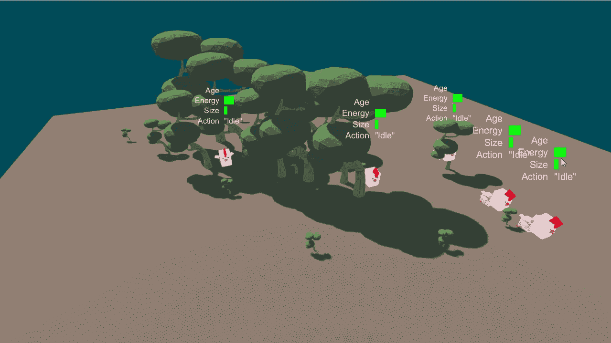

根据你让你的植物生长的速度，你可以看到一个真正的大问题很快发生。观察当食草动物扩张并迅速将自己吞噬至灭绝时会发生什么。如果不是因为其他的制衡，比如食肉动物，灾难等等，自然界也会发生这种情况。在下一节，当我们添加食肉动物的时候，我们将会看到更多的自然生活平衡。

食肉动物:猎人


# 试图在创造一个繁荣的世界中找到平衡是你最初在最初的玻璃容器中面临的挑战之一。事实上，毫无疑问，最具挑战性的生物是食肉动物。食肉动物处于食物链的顶端，它的目的是吃掉食草动物。与现实世界没有什么不同，这实际上有助于我们对两个代理的训练。为了添加我们的食肉动物，我们首先需要在我们的`CreatureAgent`脚本中添加一些代码。按照这个练习修改食肉动物的`CreatureAgent`脚本:

在您喜欢的编码编辑器中打开`CreatureAgent`脚本。

1.  修改`AgentAction`方法，取消**攻击**和**防御**动作的注释如下:
2.  接下来，`Attack`方法需要处理两种生物的攻击和防御动作。将攻击方法编码如下:

```
      public override void AgentAction(float[] vectorAction, 
      string textAction) {
        //Action Space 7 float
        // 0 = Move
        // 1 = Eat 
        // 2 = Reproduce 
        // 3 = Attack 
        // 4 = Defend 
        // 5 = move orders 
        // 6 = rotation
        if (vectorAction[0] > .5)
        {
          MoveAgent(vectorAction);
        }
        else if (vectorAction[1] > .5)
        {
          Eat();
        }
        else if (vectorAction[2] > .5)
        {
          Reproduce();
        }
        else if (vectorAction[3] > .5)
        {
          Attack();
        }
        else if (vectorAction[4] > .5)
        {
          Defend();
        }
      }      
```

3.  前面的大部分逻辑相当简单，但是有几个部分需要注意。首先，注意食草动物和食肉动物的损失计算的不同。食草动物只有在防御时才能使用防御，而食肉动物不攻击时可以使用防御，攻击时可以攻击。第二，当一个生物杀死另一个生物时，我们会增加一个相当可观的奖励。虽然这看起来相当残忍，但为了训练杀手，我们需要这样做。如果你想要一个更和平的环境，请随意使用这个奖励。

```
      void Attack() 
      { 
        float damage = 0f;
        currentAction = "Attack";
        nextAction = Time.timeSinceLevelLoad + (25 / MaxSpeed);
        var vic = FirstAdjacent("herbivore").GetComponent<CreatureAgent>();
        if (vic != null)
        {
          if (vic.currentAction == "Defend")
          {
            damage = ((AttackDamage * Size) - (vic.DefendDamage * 
            vic.Size)) / (Size * 
            vic.Size); 
          }
          else
          {
            damage = ((AttackDamage * Size) - (1 * vic.Size)) / (Size * 
            vic.Size);
          }
        } else {
          vic = FirstAdjacent("carnivore").GetComponent<CreatureAgent>();
          if (vic != null)
          {
            if (vic.currentAction == "Attack")
            {
              damage = ((AttackDamage * Size) - (vic.AttackDamage * 
              vic.Size)) / (Size 
              * vic.Size);
            } else {
              damage = ((AttackDamage * Size) - (vic.DefendDamage 
              * vic.Size)) / 
              (Size * vic.Size);
            }
          }
        }
        if(damage > 0)
        {
          vic.Energy -= damage;
          if (vic.Energy < 0)
          { AddReward(.25f); }
         } else if(damage < 0) {
           Energy -= damage;
```

```
         }
         Energy -= .1f;
      }
```

4.  这里的规则计算是任意的，因为无法找到 Microsoft Terrarium 的原始源。如果您拥有原始代码，请联系作者。

最后，添加新的`Defend`方法，如下所示:

5.  `Defend`方法非常简单，它所做的就是将生物设定为`Defend`。

```
      void Defend()
      {
        currentAction = "Defend";
        nextAction = Time.timeSinceLevelLoad + (25 / MaxSpeed);
      }
```

6.  完成编辑后，请务必保存文件并返回 Unity。确保没有编译器错误。
7.  现在我们已经在`CreatureAgent`文件中做了必要的代码修改来支持`CreatureType`食肉动物，在下一节中，我们将在玻璃容器中构建食肉动物代理。

建造食肉动物


# 建造食肉动物将遵循许多我们用于植物和食草动物的相同模式。打开 Unity，按照以下练习将食肉动物放入场景中:

在**层次**窗口中选择**食草恐龙**，键入*Ctrl*+*D*(MAC OS 上为*命令* + *D* )复制对象。重命名新对象`CarnivoreBrain`。

1.  复制**食草动物**生物代理对象，并将新对象重命名为**食肉动物**。

2.  打开**食肉动物**物体，选择**鸡**模型。键入`Delete`删除模型。
3.  从`Assets/_Gloomy_Animal/Meshes`文件夹中拖动**龙**预设，并将其放到**层级**窗口中的**食肉动物**对象上。
4.  设置所有**食肉动物**组件的属性，如下图所示:
5.  设定龙(食肉动物)的属性

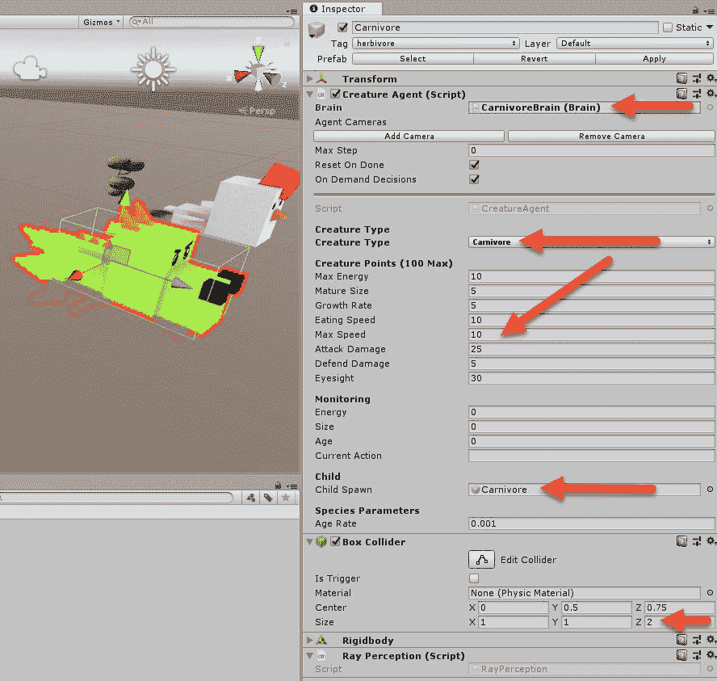

确保在`Assets/Terrarium/Prefabs`文件夹中创建**食肉动物**预设，并设置**子代**属性。

6.  为了保持平衡，我们的食肉动物需要吃不止一种食草动物。因此，在场景中复制更多的食草动物和植物。五种食草动物、五种植物和一种食肉动物是一个很好的开始平衡。
7.  启动“构建设置”对话框，为外部训练构建场景。
8.  鉴于你已经进行了一些练习，将食肉动物放入玻璃容器的整个过程应该会很快。这就剩下我们的下一部分来训练食肉动物，并在全模式下运行我们的玻璃容器。

训练食肉动物


# 你可能已经猜到了，食肉动物的训练和我们对食草动物的训练非常接近。按照这个练习来训练食肉动物:

打开 Visual Studio 代码或另一个文本编辑器并加载`trainer_config.yaml`文件。

1.  将**食肉动物大脑**设置添加到文件末尾，本质上是**食草动物大脑**设置的克隆，如以下代码所示:
2.  完成编辑后保存文件。

```
      CarnivoreBrain:
        use_recurrent: true
        sequence_length: 64 
        num_layers: 1
        hidden_units: 128
        memory_size: 512
        beta: 1.0e-2
        gamma: 0.99
        num_epoch: 3
        buffer_size: 1024
        batch_size: 128
        max_steps: 5.0e5
        summary_freq: 500
        time_horizon: 128
```

3.  打开 Python 或 Anaconda 提示符并激活`ml-agents`。转到`ml-agents`文件夹。
4.  使用以下命令运行训练器:

5.  你会注意到事情可能不会很快平衡。这是因为食肉动物需要更多的训练和智力。自然界也是如此，我们经常看到掠食者有更高的思考能力。

```
      python python/learn.py python/python.exe --run-id=terrarium2 --train 
      --slow
```

6.  切换镜头，观察龙(食肉动物)如何捕捉猎物。这可能需要一段时间，他们可能会死几次。下面的屏幕截图显示了一个正在运行的样本玻璃容器:
7.  食草动物学习新的动作来躲避食肉动物

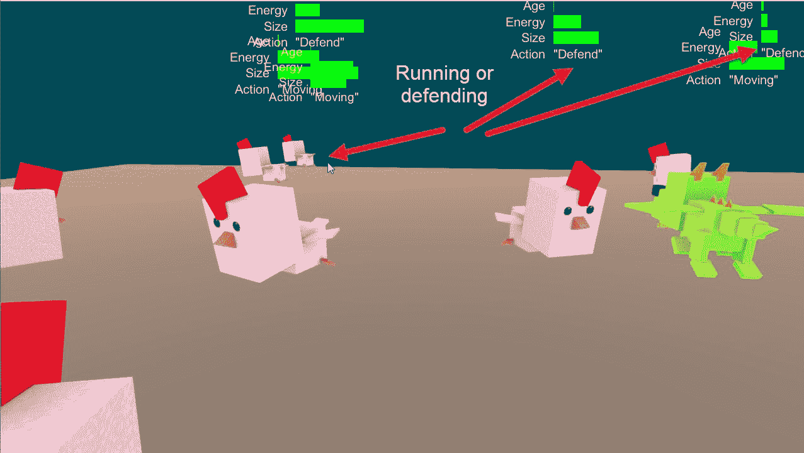

你也会注意到食草动物开始选择新的策略来避免被吃掉。在前面的摘录中，你可以看到他们是如何逃离可怕的龙的。

这就结束了我们对这个例子的所有讨论，但是它还远远没有结束。请随意添加到这个项目中，并与您的朋友分享。你甚至可以创建竞赛来训练和竞争鱼缸中的代理，就像以前的微软鱼缸竞赛一样。在最后一部分，我们将讨论如何继续学习，以及如何利用新发现的知识拓展其他领域。

后续步骤


# 你接下来要做的当然是确保完成本章末尾和前几章建议的几个练习。除了实践，没有更好的方法来强化学习；从我们的学习代理那里得到启示。如果您有时间，可以利用 ML-Agents 构建或使用另一个新的示例。

在您的学习和本书之外，您刚刚开始了新一轮编程之旅。在不久的将来(25 年左右)，编程成为一门失传的艺术也就不足为奇了。毕竟，你是愿意写一堆代码，还是愿意写一个能更好、更快、甚至能自动测试代码的代理呢？是啊，真的没有比赛。因此，如果你还不到 30 岁，并且正在阅读这本书，不要计划在你的余生中从事编程，而是去教编程代理。

记住这一点，为了让你真正掌握强化学习和你的 ML 职业生涯，你应该追求什么技能？以下列出了最需要的技能，这些技能可以让你得到一份教特工的工作:

**数学**:可能很难，但这是通往 ML 荣耀的道路。至少，你应该具备以下方面的知识:

*   概率与统计(基础)
    *   结石
    *   三维（three dimension 的缩写）
    *   张量微积分和先决条件
    *   **数据科学**:网上有很多免费的课程和资料，从基础知识一直到构建复杂的模型。你可能会减少购买课程或书籍的时间，所以也考虑一下这个选择。
*   **神经网络和深度学习**:同样，网上有很多免费资料可以教你基础知识，但同样，你会得到你所支付的和你愿意投入学习的东西。
*   **强化学习**:强化学习正在快速发展，这本书里的一些技术很可能会很快过时。因此，相信在 RL 工作需要不断学习新技术和创新。
*   提高你的技能需要一生的时间，所以永远要计划学习。与此同时，如果你正在寻找一些新的项目来投资 ML-agent，这里有一些想法:

自动驾驶和机器人技术:为什么我们仍然让机器人制造商驾驶他们自己的机器人？说真的，更大的挑战不也是增加智力吗？也许机器人战争人工智能？无论如何，Unity 提供了在多种场景下模拟训练机器人代理的能力。

*   游戏:当然，但是那些训练特工的游戏呢？或许与 90 年代随身携带的小型塔玛歌奇设备没有什么不同。
*   AR/VR/MR :将这些技术与现实体验相结合，可以为增强智能体提供帮助人们日常活动的方法。
*   **工业模拟/增强**:企业不仅发现了 3D 的力量，还发现了 Unity 无缝支持多种多样平台的能力。这导致了从仓库到医院的内部商业/工业应用程序的全新增长趋势。所有这些都是某种形式的智能代理场景的潜在候选对象。
*   前面的例子只是可能的开始，这里的限制只是你的想象。剩下的就交给你了，我们希望你能享受你的学习之旅。

这本书的作者总是很兴奋地听到读者开发的项目。请务必在 LinkedIn 上查找**迈克尔·兰哈姆**(注意名字的拼写)并分享您的内容。

练习


# 试着独立完成下列练习中的至少一项。使用你刚刚学到的技能只会强化你的学习，现在你应该真正理解这个概念了。做一个练习；你的大脑稍后会感谢你:

创造各种不同的**植物**物种，每个都有不同的点数。如果你很有野心，建造不同的预制体，用其他模型来代表不同的物种。

1.  创造出各种不同的**食草动物**物种，每种都有不同的点，或许还有不同的模型。你的新动物表现更好还是更差？
2.  用不同的点数和其他模型再次创建各种不同的**食肉动物**物种。请自行下载其他免费的 poly 模型并使用它们。

3.  鼓励你的朋友或同事建造代理，看看谁能建造和训练最好的生物。您可以通过从 Unity 导出您的生物预置，然后将其导入另一个游戏来共享。
4.  将代理从他们正在使用的向量观察转换为使用视觉观察。这会给训练增加多少难度？
5.  最初的玻璃容器也允许代理人交流。由于时间原因，我们省略了这一点，但增加了相似物种以某种方式交流的能力。
6.  建立一个完全连接的对等玻璃容器，允许生物在对等之间跳跃。如果你能做到这一点，你的技能将远远超出这本书，你现在可能在 Unity 工作。
7.  摘要


# 在我们的最后一章中，我们一起建立了一个更大的多代理训练场景，称为 Terrarium，模仿最初的 Microsoft Terrarium，这是一个由 Microsoft 在 2002 年开发的开发者游戏，作为促进. NET 安全功能的一种方式。我们首先花时间了解原始游戏的旧规则和主题，以及我们的生物代理在建立我们的模拟时需要遵循的规则。从那里，我们拉下一些有用的资产，使我们的模拟更像游戏。然后，我们建立了我们的玻璃容器的基础，创造了我们的第一个生物，植物。这种植物对于我们的高级特工的生活和训练是必不可少的，比如食草动物，它是我们建造的下一个生物，在我们的场景中作为超级特工开始训练。在建造了食草动物之后，我们开始建造食肉动物来平衡和完成我们的玻璃容器。最后，我们看了对你下一步训练的建议，以及一些令人兴奋的使用 ML-agent 的项目的其他可能的想法。

我们希望这本书能给你信心，在你的知识基础上，创造出令人惊叹的模拟、游戏和应用程序，最大限度地发挥多智能体的潜力。这本书的这个版本只针对测试版，但是你已经建立的知识基础将会带着你去进行你在 AI 方面的其他追求。

It is our hope that this book gives you the confidence to build on your knowledge and create stunning simulations, games, and apps that use ML-Agents to their full potential. This version of the book is only for the beta version, but the foundations of knowledge you have built will carry with you to your other pursuits in AI.