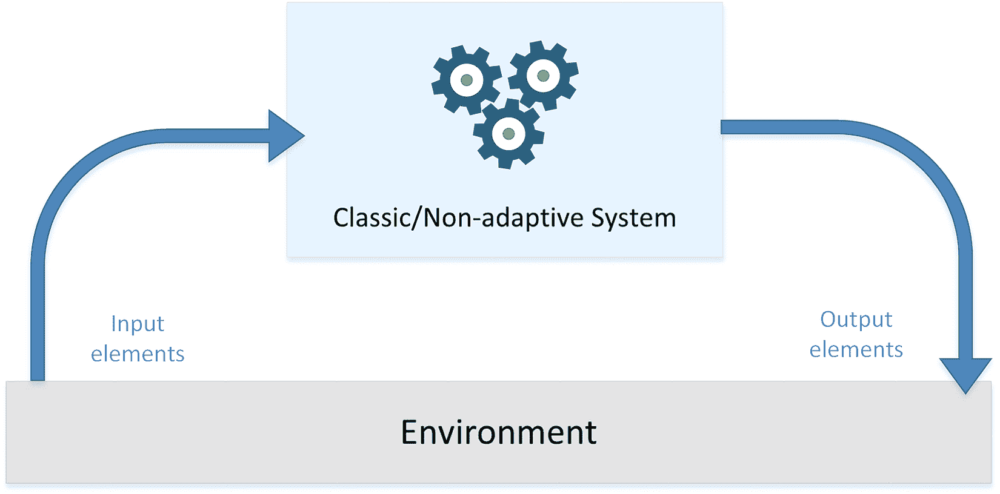
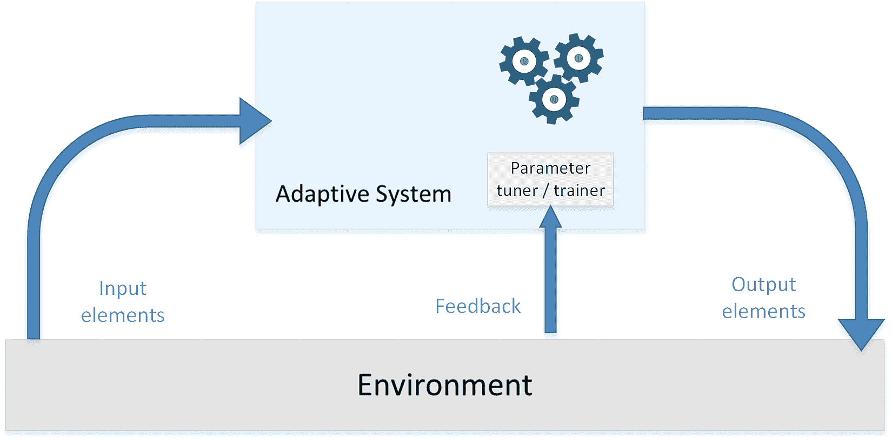
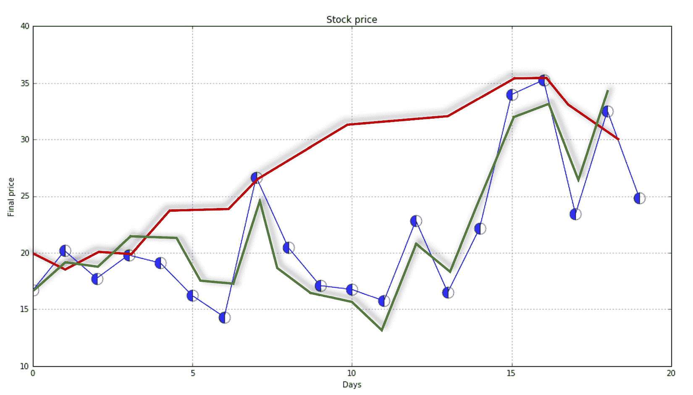
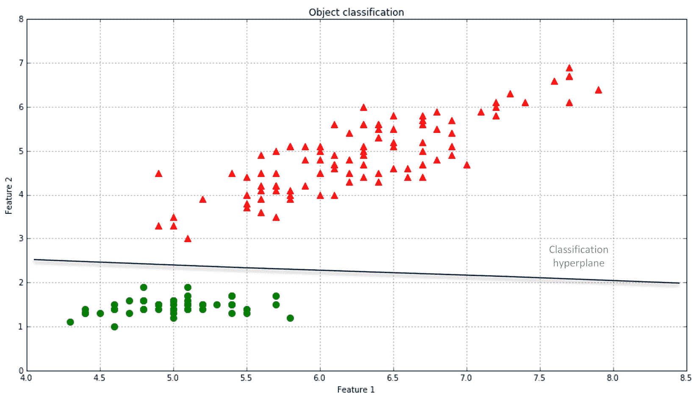
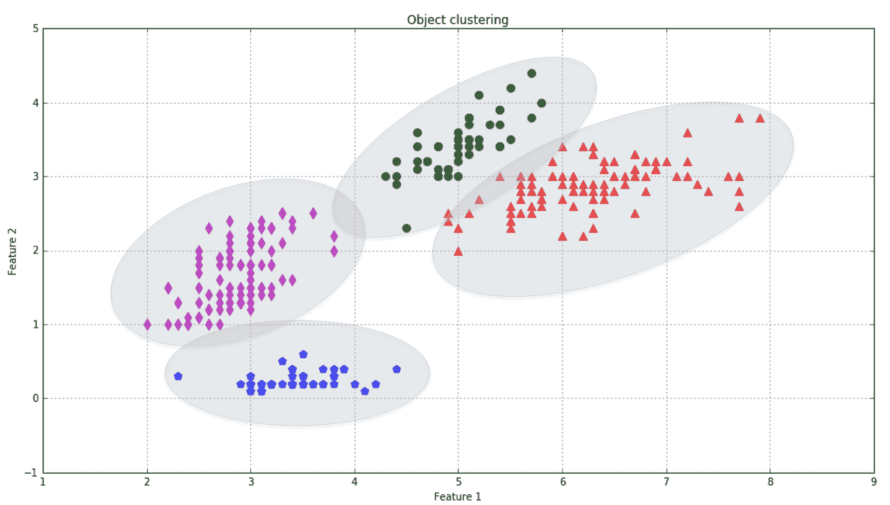
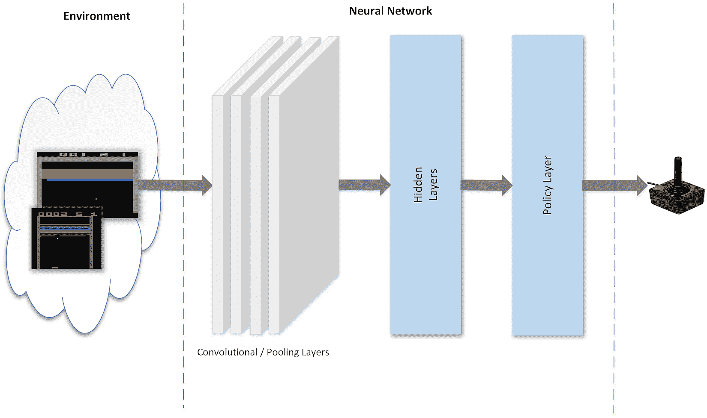

# 一、机器学习的简明介绍

在过去的几年里，机器学习已经成为 IT 和人工智能领域最重要和最丰富的分支之一。不足为奇的是，它的应用在每个商业领域日益广泛，总是有新的更强大的工具和结果。开源、生产就绪的框架，以及每月发布的数百篇论文，正在促成 IT 史上最普遍的民主化进程之一。但是为什么机器学习如此重要和有价值呢？

在本章中，我们将讨论以下内容:

*   经典系统和适应性系统的区别
*   学习的一般概念，提供几个不同方法的例子
*   为什么受生物启发的系统和计算神经科学能够显著提高性能
*   大数据和机器学习之间的关系

# 简介–经典和适应性机器

自古以来，人类已经制造了工具和机器来简化他们的工作，并减少完成许多不同任务所需的总体努力。即使不知道任何物理定律，他们也发明了杠杆(阿基米德第一次正式描述)、仪器和更复杂的机器来执行更长和更复杂的程序。由于一个简单的技巧，钉钉子变得更加容易和不费力，用手推车移动沉重的石头或木头也是如此。但是，这两个例子有什么区别呢？即使后者仍然是一个简单的机器，但它的复杂性允许一个人执行一个复合任务，而无需考虑每一步。一些基本的机械定律在允许水平力有效对抗重力方面起着主要作用，但是无论是人类，还是马和牛，对它们一无所知。原始人只是观察到一个亲切的把戏(轮子)如何能改善他们的生活。

我们得到的教训是，如果没有切实可行的实用主义，一台机器永远不会高效或时尚。如果一台机器的使用者能够很容易地理解哪些任务可以用较少的努力或自动完成，那么这台机器就会立即被认为是有用的，并且注定会被不断改进。在后一种情况下，一些智能似乎出现在齿轮、轮子或车轴旁边。因此，我们的进化清单上可以增加一步:自动机器，建造(现在，我们可以说编程)通过将能量转化为工作来完成特定的目标。风力或水车是一些基本工具的例子，这些工具能够在最少(与直接活动相比)人工控制的情况下执行完整的任务。

在下图中，有一个经典系统的一般表示，该系统接收一些输入值，对它们进行处理，并产生输出结果:

经典/非自适应系统的交互图

但是，工厂成功的关键是什么？说人类自技术出现以来就试图将一些智能转移到他们的工具中，一点也不草率。河里的水和风都表现出一种行为，我们可以简单地称之为流动。他们有很多能量可以免费提供给我们，但一台机器应该有一些意识来促进这一过程。一个轮子可以绕着一个固定的轴转几百万次，但是风必须找到一个合适的表面来推动。答案似乎是显而易见的，但你应该试着想想没有任何知识或经验的人；即使是含蓄的，他们开始了一种全新的技术方法。如果你更喜欢把智能这个词保留到最近的结果中，可以说这条道路是从工具开始的，首先移动到简单的机器，然后移动到更智能的机器。

没有进一步的中间(但同样重要)步骤，我们可以进入我们的时代，改变我们讨论的范围。可编程计算机是普遍的、灵活的、越来越强大的工具；此外，互联网的普及使我们能够毫不费力地分享软件应用和相关信息。我正在使用的文字处理软件、我的电子邮件客户端、网络浏览器以及在同一台机器上运行的许多其他常用工具，都是这种灵活性的例子。不可否认，It 革命极大地改变了我们的生活，有时还改善了我们的日常工作，但如果没有**机器学习**(及其所有应用)，仍然有许多任务似乎远远超出了计算机领域。垃圾邮件过滤、**自然语言处理** ( **NLP** )、使用网络摄像头或智能手机进行视觉跟踪以及预测分析，这些只是彻底改变人机交互并提高我们期望的几个应用。在许多情况下，他们将我们的电子工具转化为实际的认知扩展，改变了我们与许多日常情况互动的方式。他们通过填补人类感知、语言、推理以及模型和人工仪器之间的差距来实现这一目标。

这是一个适应性系统的示意图:

适应系统的相互作用图

这种系统不是基于静态或永久的结构(模型参数和架构)，而是基于持续的能力来适应外部信号(数据集或实时输入)，并像人类一样，利用不确定和零碎的信息预测未来。

在进行更具体的讨论之前，让我们简要地定义一下可以执行的不同种类的系统分析。这些技术通常由一系列特定的操作构成，其目标是增加总体领域知识并允许回答特定的问题，但是，在某些情况下，为了满足特定的业务需求，可以将流程限制为一个步骤。我总是建议把它们都简单地考虑一下，因为许多特定的操作只有在需要某些条件时才有意义。清楚地了解问题及其影响是做出正确决定的最佳途径，同时考虑到未来可能的发展。

# 描述性分析

在尝试任何机器学习解决方案之前，有必要创建上下文的抽象描述。实现这个目标的最好方法是定义一个数学模型，它的优点是任何人都能立即理解(假设有基本的知识)。然而,**描述性分析**的目标是找出对观察到的现象的准确描述，并验证所有假设。假设我们的任务是优化一家大型商店的供应链。我们开始收集有关购买和销售的数据，在与经理讨论后，我们定义了一般假设，即销售量在周末前一天增加。这意味着我们的模型应该基于周期性。描述性分析的任务是验证它，但也要发现所有那些最初被忽略的特殊特征。

在这个阶段结束时，我们应该知道，例如，时间序列(假设我们只考虑一个变量)是否是周期性的，是否有趋势，是否有可能找出一套标准规则，等等。下一步(我更愿意把它作为一个整体来考虑)是定义一个**诊断模型**，它必须能够将所有的结果与精确的原因联系起来。这一过程似乎走向相反的方向，但它的目标非常接近描述性分析。事实上，每当我们描述一个现象时，我们自然会被驱使去寻找一个合理的理由来证明每一个具体的步骤。让我们假设，在观察了我们的时间序列中的周期性之后，我们发现一个不遵守这个规则的序列。诊断分析的目标是给出一个合适的答案(也就是周日开店)。这条新信息丰富了我们的知识，并使其专门化:现在，我们可以说，只有在休息日，这个系列才是周期性的，因此(显然，这是一个微不足道的例子)我们不期望在工作日之前销售额增加。由于许多机器学习模型都有特定的先决条件，描述性分析可以让我们立即了解一个模型是否会表现不佳，或者考虑到所有已知因素，它是否是最佳选择。在我们将要查看的所有示例中，我们将通过定义每个数据集的特征以及我们可以观察到的内容来执行简短的描述性分析。由于本书的目标是关注自适应系统，我们没有足够的空间进行完整的描述，但我总是邀请读者想象新的可能场景，在定义模型之前进行*虚拟*分析。

# 预测分析

机器学习的目标几乎和这个精确的阶段有关。事实上，一旦我们定义了我们系统的模型，我们需要在给定一些初始条件的情况下推断它的未来状态。这个过程是基于发现现象背后的规则，以便*及时推动它们*(在时间序列的情况下)并观察结果。当然，预测模型的目标是考虑所有可能的干扰因素，使实际值和预测值之间的误差最小化。

在大型商店的例子中，一个好的模型应该能够预测休息日之前的高峰，以及所有其他情况下的正常行为。此外，一旦预测模型被定义和训练，它可以被用作基于决策的过程的基本部分。在这种情况下，预测必须变成建议的**药方**。例如，自动驾驶汽车的物体检测器可以极其精确，并按时检测到障碍物。然而，为了达到一个特定的目标，最好的行动是什么？根据预测(位置、大小、速度等)，另一个模型必须能够选择最小化损坏风险和最大化安全移动概率的动作。这是强化学习中的一项常见任务，但当经理必须在有许多因素的背景下做出决策时，它也非常有用。因此，生成的模型是一个管道，输入原始输入，并使用单一结果作为后续模型的输入。回到我们最初的例子，商店经理对发现隐藏的波动不感兴趣，而是对他每天必须订购的正确数量的商品感兴趣。因此，第一步是预测分析，而第二步是规定分析，它可以考虑到许多被以前的模型丢弃的因素(即，不同的供应商可以有更短或更长的交货时间，或者他们可以根据数量应用折扣)。

因此，经理可能会根据最大化(或最小化)的函数定义一个目标，该模型必须找到订购商品的最佳数量，以满足主要需求(当然，这是可用性，它取决于销售预测)。在本书的剩余部分，我们将讨论具体问题的许多解决方案，重点是预测阶段。但是，为了继续前进，我们需要定义学习的含义，以及为什么它在越来越多不同的商业环境中如此重要。

# 只有学习才重要

学习到底是什么意思？简单来说，我们可以说，学习是根据外界刺激而改变，并记住我们以前大部分经历的能力。因此，机器学习是一种工程方法，它最大限度地重视每一种增加或改善适应性变化倾向的技术。例如，机械表是一种非凡的人工制品，但它的结构遵循静止定律，如果外部的东西发生变化，它就变得毫无用处。这种能力是动物所特有的，尤其是人类；根据达尔文的理论，它也是所有物种生存和进化的关键成功因素。机器，即使没有自主进化，似乎也遵守同样的规律。

因此，机器学习的主要目标是研究、设计和改进数学模型，这些模型可以用上下文相关的数据(由通用环境提供)训练(一次或连续)，以推断未来，并在不完全了解所有影响因素(外部因素)的情况下做出决策。换句话说，一个代理(它是一个软件实体，从环境中接收信息，选择最佳行动以达到特定目标，并观察其结果)采用统计学习方法，试图确定正确的概率分布，并使用它们来计算最有可能成功(错误最少)的行动(值或决策)。

我确实更喜欢使用术语**推理**而不是**预测**，但这只是为了避免机器学习是一种现代魔法的怪异(但并不罕见)想法。此外，可以引入一个基本陈述:算法可以推断一般规律，并以相对较高的精度学习它们的结构，但前提是它们影响实际数据。因此，术语*预测*可以自由使用，但与物理或系统理论中采用的含义相同。即使在最复杂的情况下，如使用卷积神经网络进行图像分类，每条信息(几何形状、颜色、特殊特征、对比度等)都已经存在于数据中，模型必须足够灵活，以便永久提取和学习。

在接下来的章节中，我们将简要介绍一些机器学习的常用方法。数学模型、算法和实例将在后面的章节中讨论。

# 监督学习

监督场景的特征在于教师或监督者的概念，教师或监督者的主要任务是向代理提供其误差的精确度量(直接与输出值进行比较)。对于实际的算法，这个函数是由成对(输入和预期输出)的训练集提供的。从该信息开始，代理可以校正其参数，以便降低全局损失函数的幅度。在每次迭代之后，如果算法足够灵活，并且数据元素是一致的，则总体精度增加，并且预测值和期望值之间的差变得接近于零。当然，在监督场景中，目标是训练一个系统，该系统还必须能够处理从未见过的样本。因此，有必要允许模型开发泛化能力，并避免一个称为**过度拟合**、的常见问题，该问题会由于容量过大而导致*过度学习*(我们将在以下章节中更详细地讨论这一点，但是，我们可以说，这种问题的主要影响之一是只能正确预测用于训练的样本，而其余样本的错误率总是非常高)。

在下图中，一些训练点用圆圈标记，蓝色细线表示完美的概括(在这种情况下，连接是一个简单的线段):

用不同插值曲线回归股票价格的例子

用相同的数据集训练两个不同的模型(对应于两条较大的线)。前者是不可接受的，因为它不能概括和捕捉最快的动态(就频率而言)，而后者似乎是原始趋势之间的一个非常好的折衷，并且具有在预测分析中正确概括的剩余能力。

形式上，前面的例子被称为**回归**，因为它基于连续的输出值。相反，如果只有离散数量的可能结果(称为**分类**，这个过程就变成了**分类。**有时候，与其预测实际的类别，不如确定它的概率分布。例如，可以训练一个算法来识别手写的字母，所以它的输出是分类的(在英语中，将有 26 个允许的符号)。另一方面，即使对人类来说，当一个字母的视觉表现不够清晰，无法归入单一类别时，这样的过程也可能导致不止一种可能的结果。这意味着实际的输出可以用离散的概率分布来更好地描述(例如，用 26 个连续的标准化值，这样它们的总和总是 1)。

在下图中，有一个具有两个特征的元素分类示例。大多数算法试图通过施加不同的条件来寻找最佳分离超平面(在这种情况下，这是一个线性问题)。然而，目标总是相同的:减少错误分类的数量和增加噪声鲁棒性。比如看离平面最近的三角点(它的坐标大概是*【5.1-3.0】*)。如果第二特征的幅度受到噪声的影响，因此该值比 *3.0* 小得多，稍高的超平面可能会将其错误分类。我们将在后面的章节中讨论一些解决这些问题的强大技术:

线性分类示例

常见的监督学习应用包括:

*   基于回归或分类的预测分析
*   垃圾邮件检测
*   模式检测
*   自然语言处理
*   情感分析
*   自动图像分类
*   自动序列处理(例如，音乐或语音)

# 无监督学习

这种方法是基于没有任何监督，因此绝对误差的措施。当有必要了解如何根据相似性(或距离度量)对一组元素进行分组(聚类)时，这很有用。例如，看前面的图表，一个人可以立即识别两个集合，而不用考虑颜色或形状。事实上，圆形点(以及三角形点)决定了一个连贯的集合；它与另一个的分离程度远远超过它的点是如何被内部分离的。用一个比喻来说，一个理想的场景是一个有几个岛屿的海洋，这些岛屿可以彼此分开，只考虑它们的相互位置和内部凝聚力。显然，无监督学习提供了隐式描述性分析，因为聚类算法发现的所有信息都可以用于获得对数据集的完整了解。事实上，所有对象共享一个特征子集，而在其他视点下它们是不同的。聚合过程还旨在将一些点的特征扩展到它们的邻居，假设相似性不限于一些特定特征。例如，在推荐引擎中，可以根据对某些书籍表达的偏好来聚集一组用户。如果选择的标准检测到用户 *A* 和 *B* 之间的一些相似性，我们可以在用户之间共享不重叠的元素。所以，如果 *A* 看过一本可以适合 *B* 的书，我们就被隐性授权推荐了。在这种情况下，通过考虑目标(共享功能)和描述性分析来做出决定。然而，由于该模型也可以(并且应该)管理未知用户，因此其目的也是可预测的。

在下图中，每个椭圆代表一个聚类，其区域内的所有点都可以用相同的方式进行标注。还有一些边界点(如与圆形区域重叠的三角形)需要特定的标准(通常是一种折衷的距离度量)来确定相应的聚类。正如具有歧义的分类( *P* 和畸形的 *R* )一样，一个好的聚类方法应该考虑异常值的存在并处理它们，以便增加内部一致性(视觉上，这意味着选择一个最大化局部密度的细分)和聚类之间的分离。

例如，可以优先考虑单个点和质心之间的距离，或者属于同一聚类和不同聚类的点之间的平均距离。在这个图中，所有的边界三角形都彼此靠近，所以最近的邻居是另一个三角形。但是，在实际问题中，经常会有部分重叠的边界区域，这意味着某些点由于其特征值而具有高度的不确定性:

二维数据集分成四个*自然*聚类的聚类示例

另一种解释可以用概率分布来表达。如果你看一下椭圆，它们代表最小和最大方差之间的多元高斯区域。考虑到整个领域，一个点(例如，一颗蓝色的星)可能属于所有的聚类，但是第一个(左下角)给出的概率是最高的，因此这决定了成员资格。一旦所有高斯分布的方差和均值(换句话说，形状)变得稳定，每个边界点就会被单个高斯分布自动捕获(等概率的情况除外)。从技术上讲，我们说这种方法最大化了给定特定数据集的高斯混合的可能性。这是一个非常重要的统计学习概念，它跨越了许多不同的应用，因此将在下一章进行更深入的研究，[第 2 章](dd32b61f-bc53-4e94-8c17-d5910a8e528d.xhtml)，*机器学习中的重要元素*。此外，我们将讨论一些常见的聚类方法，考虑其优缺点，并比较它们在各种测试分布中的性能。

其他重要的技术包括使用标记和未标记的数据。因此，这种方法被称为半监督，当需要用几个完整的(带标签的)示例对大量数据进行分类时，或者当需要对聚类算法施加一些约束时(例如，将一些元素分配给特定的聚类或排除其他元素)，可以采用这种方法。

公共无监督应用包括以下内容:

*   对象分段(例如，用户、产品、电影、歌曲等等)
*   相似性检测
*   自动标记
*   推荐引擎

# 半监督学习

与元素的潜在数量相比，标记样本的数量非常少，这存在许多问题。直接监督方法是不可行的，因为用于训练模型的数据不能代表整个分布，因此有必要在监督和非监督策略之间找到一种折衷。为了解决这类问题，人们主要研究了半监督学习。题目稍微高级一点，本书不会涉及(有兴趣的读者可以查阅*掌握机器学习算法*、 *Bonaccorso G* 。， *Packt 出版*)。然而，半监督学习方法追求的主要目标如下:

*   考虑到整个数据集的图形，将标记传播到未标记的样本。带有标签的样本成为*吸引子*，将它们的影响扩展到邻居，直到达到一个平衡点。
*   执行分类训练模型(通常，**支持向量机**(**SVM**)；更多信息参见[第 7 章](f0008ecc-15b7-4f9b-8576-05e1d4d12ecf.xhtml)、*支持向量机*、*、*)使用标记样本来实施良好分离的必要条件，同时试图利用未标记样本作为*平衡器*，其影响必须通过标记样本来调节。当数据集仅包含少量标记样本时，半监督支持向量机可以表现得非常好，并显著降低构建和管理大型数据集的负担。
*   考虑数据集图形结构的非线性降维。由于高维数据集(即图像)中存在的限制，这是最具挑战性的问题之一。找到代表原始分布的低维分布以最小化差异是可视化具有多于三维的结构所必需的基本任务。此外，当需要处理更简单的模型时，在不显著损失信息的情况下降低维度的能力是一个关键要素。在本书中，我们将讨论一些常见的线性技术(如**主成分分析** ( **PCA** )，读者将能够理解何时可以删除一些特征而不影响最终精度，但可以提高训练速度。

现在应该清楚的是，半监督学习利用了找出分离超平面(分类)以及自动发现结构关系(聚类)的能力。不失一般性，我们可以说，在这种情况下，真正的管理者是数据图(表示关系),它根据底层信息层来纠正决策。为了更好地理解其中的逻辑，我们可以想象我们有一组用户，但是其中只有 1%的用户被标记过(为了简单起见，我们假设他们是均匀分布的)。我们的目标是为剩余部分找到最准确的标签。聚类算法可以根据相似性重新排列结构(由于标记样本是一致的，我们可以期望找到中心是标记样本的未标记邻居)。在一些假设下，我们可以将中心的标签传播到邻居，重复这个过程，直到每个样本变得稳定。在这一点上，整个数据集被标记，并有可能采用其他算法来执行特定的操作。显然，这只是一个例子，但在现实生活中，考虑到半监督方法实现的准确性，标记数百万个样本的成本不合理的情况非常普遍。

# 强化学习

即使没有实际的监督者，强化学习也是基于环境提供的反馈。然而，在这种情况下，信息更多的是定性的，并不能帮助代理确定其误差的精确度量。在强化学习中，这种反馈通常被称为**奖励**(有时，负面的反馈被定义为惩罚)，了解在某个状态下执行的某个动作是否是正面的非常有用。最有用的行动序列是代理人必须学习的策略，以便能够总是根据最高的即时和累积(未来)回报做出最佳决策。换句话说，一个行动也可能是不完美的，但就全球政策而言，它必须提供最高的总回报。这个概念是基于这样一个想法，即一个理性的代理人总是追求可以增加他/她的财富的目标。能够*看到远处地平线上的*是高级特工的显著标志，而目光短浅的特工通常无法正确评估他们眼前行动的后果，因此他们的策略总是次优的。

当环境不完全确定时，当环境经常非常动态时，当不可能有精确的误差测量时，强化学习特别有效。在过去几年中，许多经典算法已被应用于深度神经网络，以学习玩 Atari 视频游戏的最佳策略，并教会代理如何将正确的动作与代表状态的输入相关联(通常，这是截图或内存转储)。

在下图中，有一个深度神经网络的示意图，该网络已被训练来玩一个著名的 Atari 游戏:

深度强化学习架构的一般结构

作为输入，有一个或多个后续截图(这通常也足以捕捉时间动态)。使用不同的层(稍后将简要讨论)对它们进行处理，以产生表示特定状态转换的策略的输出。在应用这个策略之后，游戏产生一个反馈(作为奖励-惩罚)，并且这个结果被用来改进输出，直到它变得稳定(因此状态被正确地识别并且建议的动作总是最好的一个)并且总奖励超过预定义的阈值。

我们将在[第 15 章](40fb6ddf-fc70-4689-80c0-a899a559f0fd.xhtml)、*介绍神经网络*和[第 16 章](0ebe6902-df77-445c-91fa-fbb9e77aee5b.xhtml)、*高级深度学习模型*中讨论一些强化学习的例子，专门介绍深度学习和 TensorFlow。然而，一些常见的例子如下:

*   自动机器人控制
*   游戏求解
*   基于反馈信号的股票交易分析

# 计算神经科学

由于计算神经科学领域的研究贡献，许多机器学习算法得到了定义和完善，这并不奇怪。另一方面，最广泛的适应系统是动物，由于它们的神经系统，它们可以与环境进行有效的互动。从机械论的角度来看，我们需要假设在巨大的神经元网络中工作的所有过程都负责所有的计算功能，从低级别的感知开始，直到最高的抽象，如语言、逻辑推理、艺术创作等等。

1900 年初，拉蒙·y·卡哈尔和高尔基发现了神经细胞的结构，即神经元，但有必要完全理解它们的行为纯粹是计算性的。两位科学家都绘制了代表输入单元(树突)、身体(体细胞)、主通道(轴突)和输出门(突触)的草图，然而，细胞群的动态和学习机制都没有被完全理解。神经科学界确信学习等同于持续的结构性变化，但他们无法准确定义学习过程中的变化。1949 年，加拿大心理学家唐纳德·赫布(Donald Hebb)提出了他著名的规则(更广泛的讨论可以在*掌握机器学习算法*、 *Bonaccorso G* 中找到。、 *Packt 出版*、 *2018* 和*理论神经科学*、*大研 P* 。，*雅培 L* 。 *F* 。，*麻省理工学院出版社*， *2005* )即专注于神经元的突触可塑性。换句话说，变化的元素是连接一个单元和大量其他神经元的输出门的数量和性质。赫布明白，如果一个神经元产生一个尖峰信号，突触将它传播给另一个以同样方式表现的神经元，连接就会加强，否则，连接就会减弱。这似乎是一个非常简单的解释，但它使您能够理解基本神经聚合如何执行操作，如检测对象的边界、去噪信号，甚至找到最大方差(PCA)的维度。

该领域的研究一直持续到今天，许多公司和高水平的大学一起，目前正在利用现有的最先进的神经成像技术研究大脑的计算行为。这些发现有时令人惊讶，因为它们证实了那些只是想象而从未观察到的东西。特别是，大脑的一些区域可以轻松管理监督和无监督的问题，而其他区域则利用强化学习来预测最有可能的未来感知。例如，动物很快学会将脚步声与面对捕食者的可能性联系起来，并学会如何相应地行动。以同样的方式，来自眼睛的输入被处理，以便提取所有那些对检测物体有用的信息。这种去噪过程在机器学习中非常常见，令人惊讶的是，许多算法实现了与动物大脑相同的目标！当然，人类思维的复杂性超出了任何完整的解释，但使用计算机软件来复核这些直觉的可能性极大地提高了研究速度。在这本书的最后，我们将讨论深度学习的基础知识，这是机器学习的最高级分支。然而，我邀请读者尝试理解所有的动态(即使它们看起来非常抽象),因为潜在的逻辑总是基于非常简单和自然的机制，并且你的大脑很可能执行你在阅读时正在学习的相同操作！

# 超越机器学习——深度学习和生物启发的自适应系统

在过去几年中，由于更强大和更便宜的计算机，许多研究人员开始采用复杂(深度)的神经架构来实现仅在二十年前不可想象的目标。自 1957 年 Rosenblatt 发明第一台感知器以来，人们对神经网络的兴趣越来越大。然而，许多限制(关于内存和 CPU 速度)阻止了大规模的研究，并隐藏了这类算法的许多潜在应用。

在过去的十年里，许多研究人员开始训练越来越大的模型，用几个不同的层构建(这就是为什么这种方法被称为**深度学习**)，以解决新的挑战性问题。廉价快速的计算机的出现使他们能够在可接受的时间框架内获得结果，并使用非常大的数据集(由图像、文本和动画组成)。这项工作取得了令人印象深刻的成果，特别是基于照片元素的分类和使用强化学习的实时智能交互。

这些技术背后的想法是创建像大脑一样工作的算法，由于神经科学和认知心理学的贡献，该领域已经取得了许多重要进展。特别是，人们对模式识别和联想记忆越来越感兴趣，这些记忆的结构和功能与新大脑皮层中发生的事情相似。这种方法也允许更简单的算法，称为**无模型**；这些不是基于任何特定问题的数学物理公式，而是基于一般的学习技巧和重复的经验。

当然，测试不同的架构和优化算法比定义一个复杂的模型要简单得多(并且可以通过并行处理来完成)，而定义一个复杂的模型也更难适应不同的环境。此外，深度学习表现出比其他方法更好的性能，即使没有基于上下文的模型。这表明，在许多情况下，在不确定的情况下做出不太精确的决策，比通过非常复杂的模型(通常没有这么快)的输出做出精确的决策要好。对动物来说，这往往是生死攸关的事情，如果它们成功了，那是因为它们含蓄地放弃了某种精确性。

常见的深度学习应用包括:

*   图像分类
*   实时视觉跟踪
*   自动驾驶汽车
*   机器人控制
*   物流优化
*   生物信息学
*   语音识别和**自然语言理解** ( **NLU** )
*   **自然语言生成** ( **NLG** )和语音合成

这些问题中的许多也可以通过使用经典方法来解决，这些方法有时要复杂得多，但深度学习胜过了所有这些方法。此外，它允许将它们的应用扩展到最初被认为极其复杂的环境，如自动驾驶汽车或实时视觉对象识别。

这本书只详细介绍了一些经典算法；然而，有许多资源既可以作为介绍，也可以作为更深入的见解。

谷歌 DeepMind 团队([https://deepmind.com](https://deepmind.com))已经取得了许多有趣的成果，我建议你访问他们的网站，了解更多关于他们的最新研究和目标。另一个非常有用的资源是 open ai(【https://openai.com/】T2)，那里也有一个虚拟健身房，有许多强化学习环境可供使用。

# 机器学习和大数据

另一个可以利用机器学习的领域是大数据。Apache Hadoop 第一次发布后，实现了高效的 MapReduce 算法，不同业务环境中管理的信息量呈指数级增长。与此同时，将它用于机器学习的机会出现了，一些应用如大规模协同过滤成为了现实。

想象一个有 100 万用户，只有 1000 种商品的网店。考虑一个矩阵，其中每个用户通过隐式或显式排名与每个产品相关联。这个矩阵将包含 1，000，000 x 1，000 个单元，即使乘积的数量非常有限，对其执行的任何操作都将是缓慢且消耗内存的。取而代之的是，使用聚类以及并行算法，这样的问题消失了，并且可以在非常短的时间内执行具有更高维度的操作。

想想用一百万个样本训练一个图像分类器。单个实例需要迭代几次，处理小批量的图片。即使这个问题可以使用流方法(使用有限的内存量)来执行，在模型开始很好地执行之前等待几天也不足为奇。相反，采用大数据方法，可以异步训练几个本地模型，定期共享更新，并与主模型重新同步。这种技术也被用来解决一些强化学习问题，许多代理(通常由不同的线程管理)玩同一个游戏，为一个*全局*智能提供周期性的贡献。

不是每一个机器学习问题都适合大数据，也不是所有的大数据集在训练模型的时候都是真正有用的。然而，它们在特定情况下的结合可以通过消除经常影响较小场景的许多限制而导致非凡的结果。不幸的是，机器学习和大数据都是持续炒作的主题，因此工程师/科学家必须完成的任务之一是理解何时特定技术真正有用，何时其负担可能大于好处。现代计算机通常有足够的资源来处理数据集，几年前，这些数据集很容易被认为是大数据。因此，我邀请读者仔细分析每种情况，并从商业角度思考问题。火花簇的成本有时是完全不合理的。我曾亲眼见过两台中型机器组成的聚类运行任务，而笔记本电脑甚至可以更快地完成这些任务。因此，请始终对问题和数据进行描述性/规范性分析，尽量关注以下几点:

*   时势
*   目标(我们需要实现什么？)
*   数据和维度(我们处理批量数据吗？我们有输入流吗？)
*   可接受的延迟(我们需要实时吗？可以每天/每周处理一次吗？)

大数据解决方案是合理的，例如，在以下情况下:

*   数据集无法容纳在高端计算机的内存中
*   传入的数据流是巨大的、连续的，并且需要即时计算(例如，点击流、web 分析、消息分发等等)
*   不可能将数据分割成小块，因为可接受的延迟是最小的(这条信息必须用数学方法量化)
*   操作可以有效地并行化(现在，许多重要的算法已经在分布式框架中实现，但是仍然有一些任务不能通过使用并行架构来处理)

在专门介绍推荐系统的章节中，[第 12 章](aeaa410b-5375-4274-8957-a931dfa96747.xhtml)，*推荐系统介绍，*我们将讨论如何使用 Apache Spark 实现协同过滤。对于朴素贝叶斯分类的例子，也将采用相同的框架。

如果你想更多地了解整个 Hadoop 生态系统，请访问[http://hadoop.apache.org](http://hadoop.apache.org)。Apache Mahout(【http://mahout.apache.org】)是一个专用的机器学习框架，Spark(【http://spark.apache.org】)是最快的计算引擎之一，它有一个名为**机器学习库** ( **MLlib** )的模块，实现了许多受益于并行处理的常见算法。

# 摘要

在这一章中，我们介绍了适应系统的概念；他们可以从自己的经历中学习，改变自己的行为，以最大限度地实现特定目标。机器学习是一组技术的名称，这些技术允许您实现自适应算法来进行预测，并根据它们的共同特征自动组织输入数据。

三种主要的学习策略是监督、非监督和强化。第一种假设有老师在场，老师会对错误提供精确的反馈。因此，该算法可以将其输出与正确的输出进行比较，并相应地校正其参数。在无监督的场景中，没有外部教师，所以一切都是直接从数据中学习的。算法会试图找出一组元素共有的所有特征，以便能够将新样本与正确的聚类相关联。前一种类型的例子是通过根据一些已知特征将对象自动分类到特定类别中来提供的，而无监督学习的常见应用是通过随后的标记或处理对项目进行自动分组。第三种学习类似于受监督的学习，但它只接收关于其行动质量的环境反馈。它不知道到底是哪里出了问题，也不知道错误的大小，但它会收到一般性的信息，这些信息有助于它决定是继续采用某项政策，还是选择另一项政策。

在下一章[第 2 章](dd32b61f-bc53-4e94-8c17-d5910a8e528d.xhtml)，*机器学习的重要元素*中，我们将讨论机器学习的一些基本元素，特别关注数学符号和我们在其余章节中需要的主要定义。我们还将讨论重要的统计学习概念和一些关于可学性及其极限的理论。