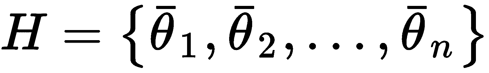
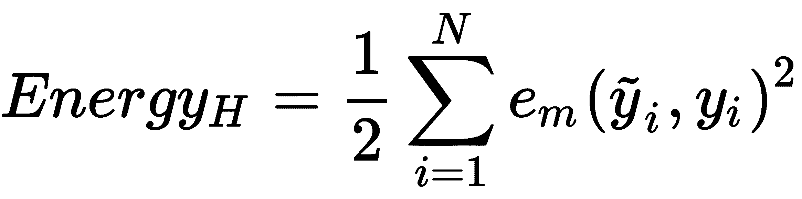
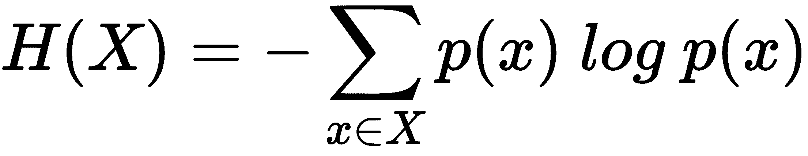

# 二、机器学习的重要元素

在这一章中，我们将讨论一些贯穿所有机器学习主题的重要元素和方法，并为许多常见技术创建一个哲学基础。首先，理解数据格式和预测函数的数学基础是很有用的。在大多数算法中，这些概念以不同的方式处理，但目标总是相同的。最近的技术，如深度学习，广泛使用能量/损失函数，就像本章中描述的那样，即使有轻微的差异，一个好的机器学习结果通常与最佳损失函数的选择和使用正确的算法来最小化它有关。

特别是，我们将讨论以下主题:

*   机器学习问题的一般结构和使用的数据
*   机器学习模型的性质及其对性能的影响
*   阶级平衡
*   统计学习的要素(**最大后验概率** ( **图**)和**最大似然估计** ( **MLE** 估计)
*   介绍信息论，重点介绍最重要的机器学习工具


# 数据格式

在有监督和无监督的学习问题中，总会有一个数据集，定义为实数向量的有限集合，每个向量具有 *m* 个特征:


考虑到我们的方法总是概率性的，我们需要假设每个 *X* 来自一个统计多元分布 *D* ，也就是通常所说的**数据生成过程**(概率密度函数通常表示为 *p [数据] (x)* )。出于我们的目的，在整个数据集 *X* 上添加一个非常重要的条件也是有用的:我们期望所有的样本都是**独立的和**同分布的(**I . I . d .**)。这意味着所有变量都属于相同的分布， *D* ，并且考虑到 *k* 值的任意子集，发生以下情况:


理解所有机器学习任务都基于使用定义明确的分布(即使它们可能部分未知)的假设是很重要的，实际数据集是由从中提取的样本组成的。在前一章第 1 章，一个*机器学习的温和介绍*中，我们定义了学习的概念，考虑了一个代理和一个未知情境之间的交互。这是可能的，因为能够学习分布的表示，而不是数据集本身！因此，从现在开始，无论何时使用有限的数据集，读者都必须考虑处理共享相同分布的新样本的可能性。

相应的输出值可以是数值连续的，也可以是分类的。在第一种情况下，该过程被称为**回归**，而在第二种情况下，它被称为**分类**。数字输出的示例如下:


当标签可以假设有限数量的值时(例如，它是二进制的或双极性的)，问题是离散的(也称为分类的，考虑到每个标签通常与一个明确定义的类或类别相关联)，而当 *y [i] ∈ ℜ* 时，问题被称为连续的。

其他分类示例如下:


我们定义了一个一般的**回归变量**，一个向量值函数 *r()，*，它将一个输入值关联到一个连续输出和一般的**分类器**，以及一个向量值函数*c()*，它的预测输出是分类的(离散的)。如果它们也依赖于确定通用预测器实际实例的内部参数向量，这种方法称为**参数学习** **g** :


向量θ是所有模型参数的汇总，一般来说，这是我们要学习的唯一元素。事实上，大多数模型假设了一个不能修改的标准结构(即使有一些特定的动态神经网络允许添加或删除计算单元)，并且适应性仅依赖于可能的参数范围。

另一方面，**非参数学习**不会对预测器家族做出初始假设(例如，定义一个通用参数化版本的*r()*和*c()*)。一个非常常见的非参数族被称为**基于实例的学习**，它基于仅由训练样本(实例集)确定的假设进行实时预测(无需预先计算参数值)。一种简单而广泛的方法是采用邻域的概念(具有固定的半径)。在一个分类问题中，一个新的样本被分类的训练元素自动包围，并且考虑邻域中占优势的一个来确定输出类。在本书中，我们将讨论属于这一类的另一个非常重要的算法家族:**基于核的支持向量机**。

内部动态和所有元素的解释对于每一个算法都是独特的，因此，我们不喜欢谈论阈值或概率，而是试图用一个抽象的定义来工作。在给定特定训练数据集的情况下，通用参数训练过程必须找到使回归/分类误差最小化的最佳参数向量，并且它还应该生成在提供未知样本时能够正确概括的预测器。

另一种解释可以用附加噪声来表示:


出于我们的目的，我们可以期待零均值和低方差高斯噪声被添加到一个完美的预测。训练任务必须通过优化参数来提高信噪比。当然，只要这样一个术语没有空值(独立于其他 *X* 值)，它就可能意味着必须考虑到一个隐藏的趋势(可能是一个被过早丢弃的特性)。另一方面，高噪声方差意味着 *X* 极度恶化，其测量不可靠。

在无监督学习中，我们通常只有一个输入集 *X* 和 *m* 长度的向量，我们用下面的表达式定义聚类函数*cl()*(和 *n* 目标聚类):


正如上一章所解释的，第 1 章，*机器学习的温和介绍，*聚类算法试图发现样本之间的相似性，并相应地将它们分组；因此*cl()*将总是输出一个在 *0* 和 *n-1* 之间(或者，在 *1* 和 *n* 之间)的标签，代表最匹配样本 *x* 的聚类。由于假定 *x* 来自于训练阶段使用的相同数据生成过程，我们在数学上被授权在已经达到的精度限度内接受可靠的结果。另一方面(每个机器学习问题都是如此)，如果从完全不同的分布中抽取 *x* ，那么任何预测都将与随机预测无法区分。这个概念非常重要，读者必须理解它(以及所有可能的含义)。假设我们对一级方程式赛车和军用飞机的图像进行分类，最终准确率为 95%。这意味着只有五张代表真实汽车或飞机的照片被错误分类。这可能是由于细节，照片的质量，物体的形状，噪音的存在，等等。相反，如果我们试图对 SUV 和大型货机的照片进行分类，所有的结果都是没有意义的(即使它们可能是正确的)。这是因为分类器很少输出 50%的分类概率(意味着不确定性是最大的)，最终的类总是两者之一。然而，分类器的*意识*与扔硬币的神谕没有太大的不同。因此，每当我们需要处理特定的样本时，我们必须确保使用来自相同分布的元素来训练模型。在前面的例子中，可以对所有类型的汽车和飞机重新训练分类器，同时尝试达到相同的原始精度。

在大多数 scikit-learn 模型中，有一个包含所有训练参数的`coef_`实例变量。例如，在单参数线性回归中(我们将在接下来的章节中广泛讨论)，输出如下:

`model = LinearRegression()`
`model.fit(X, Y)`
`print(model.coef_)`


# 多类策略

到目前为止，我们一直假设回归和分类都在长度为 *m* 的向量上操作，但是产生单个值或单个标签(换句话说，输入向量总是只与一个输出元素相关联)。当输出类的数量大于 1 时，管理分类问题主要有两种可能性:

*   一对多
*   一对一

在这两种情况下，选择都是透明的，返回给用户的输出总是最终的值或类。然而，了解不同的动态以优化模型并总是选择最佳替代方案是很重要的(scikit-learn 可以自动管理这些选项，以避免在不必要时进行显式选择)。


# 一对多

这可能是最常见的策略，并且被 scikit-learn 的大多数算法广泛采用。如果有 *n* 个输出类，则考虑到实际类和剩余类之间总是有间隔，将并行训练 *n* 个分类器。这种方法相对来说是轻量级的(最多需要 *n-1* 次检查来找到正确的类，所以它有一个 *O(n)* 的复杂度),由于这个原因，它通常是默认的选择，所以不需要进一步的操作。


# 一对一

一对一的替代方法是为每一对类训练一个模型。复杂度不再是线性的(确实是 *O(n ² )* )，正确的类由多数投票决定。一般来说，这种选择成本更高，只有在不适合进行完整数据集比较时才应采用。

如果你想了解更多关于 scikit-learn 实施的多班级策略，请访问 http://scikit-learn.org/stable/modules/multiclass.html。


# 可学性

参数模型可以分为两部分:静态结构和动态参数集。前者由特定算法的选择决定，并且通常是不可变的(除非模型提供一些重塑功能)，而后者是我们优化的目标。考虑到 *n* 无界参数，他们生成了一个 *n* 维空间(在我们的讨论中，施加边界导致子空间没有相关变化)，其中每个点，连同估计函数的不可变部分，代表一个学习假设 *H* (与一组特定参数相关联):



参数学习过程的目标是找到最佳假设，其对应的预测误差最小，并且剩余的泛化能力足以避免过拟合。在下图中，我们可以看到一个数据集的示例，其点必须分类为红色(**A 类**)或蓝色(**B 类**)。显示了三个假设:第一个(从左边开始的中间线)错误分类了 3 个样本，而下面和上面的分别错误分类了 14 和 24 个样本:


基于 3 种不同假设的分类器示例

当然，第一种假设几乎是最优的，应该选择；然而，理解一个可以决定潜在过度拟合的基本概念是很重要的。想一个 *n* 维的二元分类问题。我们说数据集 *X* 是线性可分的(没有变换),如果存在一个超平面，它将空间分成两个子空间，这两个子空间只包含属于同一类的元素。除去线性的限制，通过使用一般的超曲面，我们有无限的选择。然而，参数模型仅采用一族非周期和近似函数，其振荡和拟合数据集的能力由参数的数量决定(有时以非常复杂的方式)。

考虑下图所示的示例:


线性和非线性分类器的例子

蓝色的分类器是线性的，而红色的是立方的。乍一看，非线性策略似乎表现得更好，因为它可以捕捉更多的表现力，这要归功于它的凹度。然而，如果新的样本是按照最后四个样本(从右边开始)定义的趋势添加的，它们将完全被错误分类。事实上，虽然线性函数在整体上更好，但无法捕捉到 **0** 和 **4** 之间的初始振荡，三次方法可以几乎完美地拟合该数据，但同时失去了保持整体线性趋势的能力。因此，有两种可能性:

*   如果我们希望未来的数据作为训练样本准确分布，为了捕捉较低级别模型将丢弃的小变化，更复杂的模型可能是一个不错的选择。在这种情况下，线性(或较低级别)模型将导致拟合不足，因为它无法捕捉适当级别的表现力。
*   如果我们认为未来数据可以局部不同地分布，但保持全局趋势，则最好具有更高的剩余误分类误差以及更精确的泛化能力。使用只关注训练数据的更大模型会导致过度拟合。


# 欠拟合和过拟合

机器学习模型的目的是逼近将输入元素与输出元素相关联的未知函数(对于分类器，我们称之为类)。然而，训练集通常是全局分布的表示，但它不能包含所有可能的元素，否则，问题可以通过一对一的关联来解决。同样，我们不知道可能的基础函数的解析表达式，因此，在训练时，有必要考虑拟合模型，但在出现未知输入时保持其自由泛化。在这点上，引入模型的**表示能力**的概念是有用的，它是学习数据集上少量/大量可能分布的能力。很明显，低容量通常与较简单的模型相关，例如，不能解决非线性问题，而高容量，是基础模型和参数数量的函数，导致更复杂的分离超平面。考虑到上一节中的最后一个例子，很容易理解线性分类器相当于一条直线的方程:


在这种情况下，有两个参数， *m* 和 *q* ，曲线永远不能改变它的斜率(由 *m* 定义)。相反，第二个分类器可以想象成一个三次方程:


现在，我们有四个参数和输入值的两个幂。这些条件允许对可以改变其斜率两次的函数进行建模，并且可以适用于更复杂的情况。显然，我们可以通过考虑一个一般的多项式函数来继续这种分析:


复杂度(以及容量)与度 p 成正比。结合多项式和非线性函数，我们可以获得极其复杂的表示(如使用神经网络实现的表示)，这些表示足够灵活，可以捕捉非平凡数据集的细节。但是，重要的是要记住，增加容量通常是一个不可逆的操作。换句话说，更复杂的模型总是更复杂，即使更简单的模型更好。学习过程可以*拉伸*或*弯曲*曲线，但永远无法去除斜率变化(关于更正式的解释，请查看*掌握机器学习算法*、 *Bonaccorso G* )。、*帕克特出版*、 *2018* )。这种情况会导致两种不同的潜在危险:

*   **欠拟合**:这意味着该模型无法捕捉同一训练集显示的动态(可能是因为其容量太有限)。
*   **过度拟合**:考虑到训练集提供的原始动态，该模型具有过剩的能力，不再能有效地进行概括。它可以几乎完美地将所有已知样本与相应的输出值相关联，但是当出现未知输入时，相应的预测误差可能非常高。

在下图中，有低容量(欠拟合)、正常容量(正常拟合)和过量容量(过拟合)的插值示例:


欠拟合(左)、过拟合(右)和正常拟合(中间)的示例

欠拟合模型通常具有较高的**偏差**，其定义为参数θ估计的期望值与真实值之间的差值:


当偏差为零时，模型被定义为**无偏**。另一方面，偏差的存在意味着算法不能学习θ的可接受表示。在上图的第一个示例中，直线仅在两个点的邻域中有可忽略的误差(大约 *0.3* 和 *0.8* ),由于它不能改变斜率，偏差将迫使所有其他区域中的误差增加。相反，过度拟合通常与高**方差**相关，其定义如下:


高方差通常是高容量的结果。该模型现在具有多次改变其斜率的振荡能力，但它不能再像一个更简单的模型那样表现了。上图中右侧的例子显示了一条极其复杂的曲线，该曲线可能无法对大多数从未见过的样本进行分类。考虑到预测误差，欠拟合更容易检测，而过拟合可能更难发现，因为它最初可能被认为是完美拟合的结果。事实上，在分类任务中，高方差模型可以很容易地学习训练阶段使用的数据集的结构，但是，由于过于复杂，它可能会变得*冻结*和高度专门化。这通常意味着它将以较低的准确度管理从未见过的样本，因为它们的特征不能被识别为属于某个类别的样本的变体。每一个小的修改都被模型捕获，模型现在可以更自由地调整其分离表面，因此相似性(这是泛化能力的基础)更难检测。我们将在接下来的章节中讨论的交叉验证和其他技术可以很容易地展示我们的模型如何与在训练阶段从未见过的测试样本一起工作。这样，就有可能在更广泛的背景下评估泛化能力(请记住，我们不是在处理所有可能的值，而是始终处理应该反映原始分布的子集)，并做出最合理的决策。读者必须记住，机器学习模型的真正目标不是过度适应训练集(我们将在下一章[第 3 章](c43b2999-ed88-4fba-a9f8-baad11aa7cea.xhtml)、*特征选择和特征工程*中讨论这一点)，而是使用从未见过的样本，因此在进入生产阶段之前，有必要关注性能指标。


# 误差度量和成本函数

一般来说，当使用监督场景时，我们定义一个非负误差度量 *e [m]* ，它采用两个参数(预期和预测输出)并允许我们计算整个数据集(由 *N* 个样本组成)的总误差值:


该值还通过参数集隐含地依赖于特定的假设 *H* ，因此优化误差意味着找到一个最佳假设(考虑到许多优化问题的难度，这不是绝对最佳的假设，而是可接受的近似)。在许多情况下，考虑**均方误差** ( **MSE** )是有用的:


它的初始值代表一个 *n* 变量函数表面上的起点。一般的训练算法必须找到全局最小值或非常接近它的点(总是有一个公差来避免过多的迭代次数和随之而来的过度拟合的风险)。这个度量也被称为**损失函数**(或**成本函数**)，因为它的值必须通过优化问题最小化。当很容易确定必须最大化的元素时，相应的损失函数将是它的倒数。

另一个有用的损失函数叫做**零一损失**，它对于二进制分类特别有效(对于一对其余多类策略也是如此):


该函数隐含地是一个指示符，并且可以容易地在基于错误分类概率的损失函数中采用。

通用(和连续)损失函数的有用解释可以用势能来表示:



预测器就像粗糙表面上的球:从能量(即误差)通常相当高的随机点开始，它必须移动，直到到达其能量(相对于全局最小值)为零的稳定平衡点。在下图中，有一些不同情况的示意图:


具有一些特殊点的能量曲线

就像在物理情况下，起点是稳定的，没有任何外部扰动，所以要开始这个过程，需要提供初始动能。但是，如果这样的能量足够强大，那么在下坡之后，球就不能停在全局最小值。剩余动能可以足够克服脊，到达右手谷(高原)。如果没有其他能源，球就会被困在平原山谷中，再也无法移动。有许多技术被设计来解决这个问题并避免局部极小值。另一个常见问题(特别是在处理深度模型时)由鞍点表示，鞍点的特征是零梯度和半正定 Hessian 矩阵。这意味着该点既不是局部最小值，也不是最大值，但它可以像最小值一样在一个方向上移动，也像最大值一样在另一个方向上移动。在下图中，我们可以看到这种情况的三维示例:


鞍点的示例

每种情况都必须仔细分析，以了解什么水平的剩余能量(或误差)是可接受的，或者是否采用不同的策略更好。特别是，所有明确基于损失/成本函数的模型通常可以使用不同的优化算法来训练，这些算法可以克服更简单的解决方案无法解决的问题。我们将在接下来的章节中讨论其中的一些。


# PAC 学习

在许多情况下，机器学习似乎可以无缝地工作，但有没有什么方法可以正式确定一个概念的可学性？1984 年，计算机科学家 L. Valiant 提出了一种数学方法来确定一个问题是否可以被计算机学习。这个技术的名字叫**大概是近似正确的** ( **PAC** )。原来的提法(你可以在*中读到一个可学的理论*， *Valiant L* 。ACM 的*通信，第 27 卷，第 11 期，1984 年 11 月)是基于特定的假设，然而，在没有相当大的精度损失的情况下，我们可以考虑一个分类问题，其中算法 *A* 必须学习一组概念*。*特别是，概念是确定相同输出元素的输入模式 *X* 的子集。因此，学习一个概念(参数化地)意味着最小化限制于特定类的相应损失函数，而学习所有可能的概念(属于同一论域)意味着找到一个全局损失函数的最小值。*

然而，给定一个问题，我们有许多可能的(有时，理论上是无限的)假设，一个概率性的权衡往往是必要的。由于这个原因，我们接受基于多项式时间内产生的有限数量的输入元素的高概率的良好近似。因此，如果算法 *A* 能够用过程 *O(n ^k )* 找到一个假设 *H* ，那么算法*A*就能够学习所有概念的类别 *C* (使它们成为 PAC 可学习的),从而使得 *A* 能够以概率 *p* 以最大允许误差 *m [e] 对所有模式进行正确分类这必须对 *X* 上的所有统计分布有效，并且对于必须大于或等于仅取决于 *p* 和*m[e]的最小值的多个训练样本有效。**

对计算复杂性的限制不是次要问题。事实上，当问题相当复杂时，我们期望我们的算法在合理的时间内高效地学习。当数据集太大或者优化起点离可接受的最小值很远时，指数时间可能导致计算爆炸。此外，重要的是要记住所谓的**维数灾难**，这是一些模型中经常出现的一种效应，在这些模型中，训练或预测时间与维数成比例(不总是线性的)，因此当特征数量增加时，模型的性能(当输入维数较小时，这可能是合理的)会显著降低。此外，在许多情况下，为了捕捉完整的表现力，有必要拥有一个非常大的数据集。然而，如果没有足够的训练数据，这种近似可能会出现问题(这被称为**休斯现象**)。由于这些原因，寻找多项式时间算法不仅仅是一项简单的工作，因为它可以决定机器学习问题的成败。出于这些原因，在接下来的章节中，我们将介绍一些技术，这些技术可以用来有效地降低数据集的维度，而不会造成有问题的信息损失。


# 统计学习概念介绍

假设您需要设计一个垃圾邮件过滤算法，从基于两个参数的初始(过于简单的)分类开始:

| **参数** | **垃圾邮件(X [1] )** | **普通邮件(X [2] )** |
| *p [1]* | 80 | 20 |
| *p[2]*-消息长度< 20 个字符 | 75 | 25 |

我们已经收集了 200 封电子邮件消息( *X)* (为了简单起见，我们认为*p[1]和*p*2 为* )，我们需要找到几个概率假设(用 *p [1]* 和 *p [2]* 表示)，以确定以下内容:


我们还假设这两个术语的条件独立性(这意味着*h[P1]和*h[p2]以与它们单独存在时相同的方式共同导致垃圾邮件)。**

例如，我们可以这样考虑规则(假设):“如果黑名单中的单词超过五个”或“如果消息长度小于 20 个字符”，那么“垃圾邮件的概率很高”(例如，大于 50%)。但是，如果不分配概率，就很难概括数据集何时发生变化(就像现实世界中的反垃圾邮件过滤器一样)。我们还想确定一个划分阈值(比如绿色、黄色和红色信号)，以帮助用户决定保留什么，丢弃什么。

由于假设是通过数据集 *X* 确定的，我们还可以(以离散形式)写出以下内容:


在这个例子中，很容易确定每一项的值。但是，一般情况下，有必要介绍贝叶斯公式(将在第六章、*朴素贝叶斯和判别分析*中讨论):


比例性对于避免引入边际概率 *P(X)* 是必要的，边际概率仅作为归一化因子(记住，在离散随机变量中，所有可能的概率结果之和必须等于 1)。

在前面的等式中，第一项被称为**后验**(后一项)概率，因为它是由边际**先验**(先一项)概率乘以一个称为**可能性**的因子确定的。为了理解这种方法的哲学，举一个简单的例子是有用的:扔一枚公平的硬币。大家都知道每张脸的边际概率等于 0.5，但是谁决定的呢？这是逻辑和概率公理的理论结果(一个好的物理学家会说它永远不会是 0.5，因为我们简单地丢弃了几个因素)。在投掷硬币 100 次后，我们观察结果，令人惊讶的是，我们发现正面和反面的比率略有不同(例如，0.46)。如何才能修正我们的估计？这个术语叫做似然性，衡量的是我们的实际实验在多大程度上证实了先验假设，并确定了另一个概率(后验)，这个概率反映了实际情况。因此，这种可能性有助于我们动态地修正我们的估计，克服固定概率的问题。

在第 6 章、*朴素贝叶斯和判别分析*中，我们将深入讨论这些主题，并使用 scikit-learn 实现几个示例，然而，介绍两种非常分散的统计学习方法是有用的。

地图学习


# 当选择正确的假设时，贝叶斯方法通常是最佳选择之一，因为它考虑了所有的因素，正如我们将看到的，即使它是基于条件独立性，当一些因素部分依赖时，这种方法也能完美地工作。然而，它的复杂性(就概率而言)很容易增加，因为必须始终考虑所有的项。例如，一个真正的硬币是一个非常短的圆柱体，所以，在投掷硬币时，我们还应该考虑偶数的概率(当硬币位于其边缘时)。假设是 0.001。意味着我们有三种可能的结果: *P(头部)* = *P(尾部)* = (1.0 - 0.001)/2.0 和 *P(偶数)* = 0.001。后一种情况显然不太可能，但是，在贝叶斯学习中，它必须被考虑(即使它会被其他项的强度挤压)。

另一种方法是根据后验概率选择最可能的假设:


这种方法被称为 MAP ，它确实可以简化某些假设不太可能发生的情况(例如，在掷硬币时，MAP 假设将丢弃 *P(偶数)*)。然而，它仍然有一个重要的缺点:它依赖于先验概率(记住，最大化后验意味着也要考虑先验)。正如 Russel 和 Norvig ( *人工智能:现代方法*，Russel S .，Norvig P .，Pearson)指出的，这通常是推理过程中微妙的一部分，因为总是有一个理论背景可以导致特定的选择并排除其他选择。为了只依赖数据，有必要采用不同的方法。

最大似然学习


# 我们已经将似然性定义为贝叶斯公式中的过滤项。一般来说，它具有以下形式:


这里，第一项表示假设的实际可能性，给定数据集 *X* 。你可以想象，在这个公式中，没有更多的先验概率，因此，最大化它并不意味着接受理论上的优先假设，也不考虑不可能的假设。一种非常常见的方法，被称为**期望最大化** ( **EM** )，在许多算法中使用(我们将在逻辑回归中看到一个例子)，分为两个主要部分:

基于模型参数确定对数似然表达式(它们将被相应地优化)。这通常是依赖于在时间*t*t*θ[t]t*计算的一组参数的代理。

*   最大化它直到剩余误差足够小。此操作是相对于*θ[t]进行的。因此，在下一次迭代中，用新的参数集计算代理。*

*   这是一个著名的同名通用算法(EM)的特例。完整的解释很复杂，超出了本书的范围(可以在*掌握机器学习算法*、 *Bonaccorso G* 中找到)。、 *Packt 出版*、 *2018* )，但是，很容易抓到主要概念。

对数似然(通常称为 **L** )是一个有用的技巧，可以简化梯度计算。一般的可能性表达式如下:


由于所有参数都在 *h [i]* 中进行了总结，梯度是一个复杂的表达式，不太容易管理。然而，我们的目标是最大化可能性，但更容易的是最小化其倒数:


这可以通过应用自然对数(单调)转化为一个非常简单的表达式:


最后一项是求和项，可以很容易地推导出来并用于大多数优化算法中。与直接算法相反，EM 以迭代方式工作，交替进行使用当前参数估计计算似然性的步骤和选择这些参数以最大化预期对数似然性的另一个步骤。在这个过程的最后，我们可以找到一组参数，这些参数提供了**最大似然** ( **ML** )而没有任何关于先验分布的有力陈述。这种方法看起来很有技术含量，但是它的逻辑非常简单和直观。为了理解它是如何工作的，我提出了一个简单的练习，这是高斯混合技术的一部分，也在*掌握机器学习算法*、 *Bonaccorso G* 中讨论。、 *Packt 发布*、 *2018* 。

让我们考虑从均值为零且标准差等于 2.0 的高斯分布中抽取的 100 个点(高斯噪声由独立样本组成):

该图如下图所示:

```py
import numpy as np

np.random.seed(1000)

nb_samples = 100
X_data = np.random.normal(loc=0.0, scale=np.sqrt(2.0), size=nb_samples)
```

从高斯分布中采样的点


在这种情况下，不需要深入研究(我们知道它们是如何生成的)，但是，在将假设空间限制为高斯族(仅考虑图形是最合适的)之后，我们希望找到均值和方差的最佳值。首先，我们需要计算对数似然(由于指数函数，这相当简单):


接下来提供了一个简单的 Python 实现(为了便于使用，只有一个包含均值(`0`)和方差(`1`)的数组):

然后，我们需要用任何可用的方法(梯度下降或另一种数值优化算法)找到它的最小值(根据均值和方差)。例如，使用`scipy`最小化函数，我们可以很容易地得到如下结果:

```py
def negative_log_likelihood(v):
  l = 0.0
  f1 = 1.0 / np.sqrt(2.0 * np.pi * v[1]) 
  f2 = 2.0 * v[1]

  for x in X_data:
    l += np.log(f1 * np.exp(-np.square(x - v[0]) / f2))

 return -l
```

接下来绘制了`negative_log_likelihood`函数的图形。该函数的全局最小值对应于给定特定分布的最佳可能性。这并不意味着问题已经完全解决，因为这个算法的第一步是确定一个期望，这个期望必须总是现实的。然而，似然函数对错误的分布非常敏感，因为当概率较低时，它很容易接近零。由于这个原因，最大似然学习通常比需要先验分布的映射学习更可取，并且当它们没有以最合适的方式被选择时可能会失败:

```py
from scipy.optimize import minimize

minimize(fun=negative_log_likelihood, x0=np.array([0.0, 1.0]))

 fun: 181.6495875832933
 hess_inv: array([[ 0.01959881, -0.00035322],
       [-0.00035322, 0.09799955]])
      jac: array([ 1.90734863e-06, 0.00000000e+00])
  message: 'Optimization terminated successfully.'
     nfev: 40
      nit: 8
     njev: 10
   status: 0
  success: True
        x: array([ 0.08052498, 2.21469485])
```

来自两个不同起点和 MLE 目标的轨迹


这种方法已经被应用于一个特定的分布族(这确实非常容易管理)，但是当模型更复杂时，它也能完美地工作。当然，总是需要对如何确定可能性有一个初步的认识，因为不止一个可行的家族可以生成相同的数据集。在所有这些情况下，**奥卡姆剃刀**是最好的方法:应该首先考虑最简单的假设。如果不符合，我们的模型会增加额外的复杂性。正如我们将看到的，在许多情况下，最简单的解决方案是获胜的方案，增加参数数量或使用更详细的模型只能增加噪声和更高的过拟合可能性。

SciPy([https://www.scipy.org](https://www.scipy.org))是一套适用于 Python 的高端科学和面向数据的库。它包括 NumPy、Pandas 和许多其他有用的框架。如果想了解更多关于 Python 科学计算的内容，请参考*数值与科学计算学习 SciPy 第二版*、*Rojas S* 。 *J* 。 *R. G* 。，*克里斯滕森 E. A* 。，*布兰科-席尔瓦 F. J* 。，*帕克特出版，2017* 。

阶级平衡


# 当使用大多数机器学习算法(特别是有监督的算法)时，使用包含几乎相同数量的每个类元素的数据集来训练模型是很重要的。请记住，我们的目标是训练能够以最佳方式对所有可能的类进行归纳的模型，并假设我们有一个包含 1，000 个样本的二进制数据集，样本比例为(0.95，0.05)。这个比例在很多情况下都很常见。例如，垃圾邮件检测器可以收集大量的垃圾邮件，但要访问个人接受的邮件要困难得多。然而，我们可以假设一些用户(非常小的百分比)决定共享匿名的常规消息，因此我们的数据集包含 5%的非垃圾邮件条目。

现在，让我们考虑一个总是输出标签 0 的静态算法(例如，由于一个 bug)。最终精度是哪个？在类似的情况下，我们会期待类似于基于抛硬币的随机预言的行为，但是，毫不奇怪，我们发现这种算法达到了 95%的准确率！这怎么可能？原因很简单，因为数据集是不平衡的，标签为 1 的样本数量相对于总数据集大小来说可以忽略不计。出于这个原因，在任何训练过程之前，对数据进行基本的描述性分析是很重要的，试图纠正平衡问题。

替换重采样


# 解决这个问题最常见的方法是基于重采样过程。这种方法非常简单，但不幸的是，它有许多缺点。考虑到前面的例子，我们可以决定对类别`1`进行上采样，以便匹配属于类别`0`的样本数量。然而，我们只能使用现有数据，并且在每个采样步骤之后，我们从原始数据集(替换)重新开始。为了更好地理解这个过程，让我们假设我们通过使用 scikit-learn `make_classification`函数来生成数据集(我们将在接下来的章节中多次使用它):

我们可以像这样检查两个子阵列的形状:

```py
from sklearn.datasets import make_classification

nb_samples = 1000
weights = (0.95, 0.05)

X, Y = make_classification(n_samples=nb_samples, n_features=2, n_redundant=0, weights=weights, random_state=1000)
```

正如预期的那样(我们已经施加了一个类权重)，第一个类占主导地位。在使用替换的上采样中，我们从被限制为次要类(1)的数据集中进行采样，直到我们达到期望的元素数量。当我们执行替换操作时，它可以迭代任意次，但是结果数据集将总是包含从 54 个可能值中采样的点。在 scikit-learn 中，可以通过使用内置的`resample`函数来执行该操作:

```py
print(X[Y==0].shape)
print(X[Y==1].shape)

(946, 2)

(54, 2)
```

该函数从子数组`X[Y==1]`中采样，生成通过`n_samples`参数选择的样本数(在我们的例子中，我们选择创建两个元素数相同的类)。最后，需要将包含标签为`0`的样本的子数组连接到上采样的子数组(标签也是如此)。如果我们检查新的形状，我们会得到以下结果:

```py
import numpy as np

from sklearn.utils import resample

X_1_resampled = resample(X[Y==1], n_samples=X[Y==0].shape[0], random_state=1000)

Xu = np.concatenate((X[Y==0], X_1_resampled))
Yu = np.concatenate((Y[Y==0], np.ones(shape=(X[Y==0].shape[0], ), dtype=np.int32)))
```

不出所料，这些职业现在已经平衡了。显然，可以通过对主类进行下采样来完成相同的过程，但是应该仔细分析这种选择，因为在这种情况下，存在信息损失。每当数据集包含许多冗余样本时，这种操作就不太危险，但是，正如经常发生的那样，移除有效样本会对最终精度产生负面影响，因为有些特征值在训练阶段永远不会被植入。即使替换重采样不是非常强大(因为它不能生成新的样本)，我通常建议将上采样作为默认选择。只有当样本的方差非常小时(平均值附近有许多样本)，才对主类进行缩减采样，对于均匀分布来说，这几乎总是一个不可接受的选择。

```py
print(Xu[Yu==0].shape)
print(Xu[Yu==1].shape)

(946, 2)

(946, 2)
```

SMOTE 重采样


# Chawla 等人(在*SMOTE:Synthetic Minority Over-sampling Technique*、*、*、*Chawla n . V .*中)提出了一种更强的方法。，*鲍耶 K* 。 *W* 。，*厅 L* 。【阿 。，*凯格尔迈耶 W* 。 *P* 。，*人工智能研究杂志*， *16/2002* )。该算法被称为**合成少数过采样技术** ( **SMOTE** )，与之前的算法相反，它被设计为生成与少数类分布一致的新样本。该算法的完整描述超出了本书的范围(可以在前述论文中找到)，但是，主要思想是考虑样本之间存在的关系，并沿着连接一组邻居的线段创建新的合成点。让我们考虑下图:

包含三个点(x [1] ，x [2] ，x [3] )和两个合成点的邻域示例


三个点 *(x [1] ，x [2] ，x [3] )* 属于一个小类，是同一个邻域的成员(如果读者不熟悉这个概念，可以想到一组相互距离在固定阈值以下的点)。SMOTE 可以通过生成样本*x[1u]和*x[2u]并将它们放置在片段上，连接原始样本，从而对类进行上采样。通过假设样本的属性在某个邻域半径以下不变，可以更好地理解这一过程，因此可以创建属于同一原始分布的合成变体。然而，与替换重采样相反，新数据集具有更高的方差，并且通用分类器可以更好地找到合适的分离超曲面。**

为了展示 SMOTE 是如何工作的，我们将使用一个名为 unbalanced-learn 的 scikit-learn 扩展(见本节末尾的方框)，它实现了许多算法来处理这类问题。平衡数据集(基于我们之前生成的数据集)可以通过使用`SMOTE`类的实例来获得:

`fit_sample`方法分析原始数据集，并从 minor 类自动生成合成样本。最重要的参数如下:

```py
from imblearn.over_sampling import SMOTE

smote = SMOTE(random_state=1000)
X_resampled, Y_resampled = smote.fit_sample(X, Y)
```

`ratio`(默认为`'auto'`):决定必须对哪个类进行重采样(可接受的值为`'minority'`、`'majority'`、`'all'`、`'not minority'`)。每个选项的含义都很直观，但一般来说，我们通过对`minority`类进行上采样来工作，或者，更罕见的是，通过对整个数据集进行重采样(和平衡)来工作。

*   `k_neighbors`(默认为`5`):要考虑的邻居数量。更大的值产生更密集的重新采样，因此我邀请读者通过使用等于`2`、`10`和`20`的`k_neighbors`来重复这个过程，并比较结果。请记住，基本的几何结构通常基于欧几里得距离，因此斑点通常比线框数据集更可取。根据生成过程中的 SMOTE，值`5`通常是该条件和*自由度*之间的一个很好的折衷。
*   通过观察下图，我们可以更好地理解这种行为(我们用`5`邻居对`minority`类进行了上采样):

不平衡数据集(左)和 SMOTE 平衡数据集(右)


可以看到，原始数据集只有几个属于类 **2** 的点，它们都在图表的上部。带替换的重采样能够增加样本的数量，但结果图将完全相同，因为值始终取自现有集合。另一方面，SMOTE 通过考虑邻域生成了相同数量的样本(在这种情况下，原始数据集中也有重叠)。最终结果显然是可以接受的，并且与数据生成过程一致。此外，它可以帮助分类器找出最佳分离曲线，该曲线可能比与不平衡数据集相关联的曲线更居中(可以是穿过 *x [1] =0* 的水平线)。

使用`pip install -U imbalanced-learn`命令可以安装 unbalanced-learn([http://contrib . sci kit-learn . org/unbalanced-learn/stable/index . html](http://contrib.scikit-learn.org/imbalanced-learn/stable/index.html))。它需要 scikit-learn 0.19 或更高版本，并且是一个不断发展的项目，所以我建议读者查看网站以发现它的所有特性和错误修复。

信息论的要素


# 机器学习问题也可以从信息传递或交换的角度来分析。我们的数据集由 *n* 个特征组成，这些特征被认为是独立的(为了简单起见，即使这通常是一个现实的假设),并且从 *n* 个不同的统计分布中提取。所以有 *n* 概率密度函数 *p [i] (x)* 必须通过其他*n**q**[I](x)*函数来近似。在任何机器学习任务中，理解两个对应的分布如何发散以及在逼近原始数据集时我们丢失的信息量是非常重要的。

熵


# 信息论(以及机器学习)中最有用的度量被称为**熵**:



该值与 *X* 的不确定度成比例，并以**位**来衡量(如果对数有另一个底数，该单位也可以改变)。出于许多目的，高熵是更可取的，因为这意味着某个特征包含更多的信息。例如，在抛硬币(两种可能的结果)中， *H(X) = 1* 位，但如果结果的数量增加，即使概率相同， *H(X)* 也会因为不同值的数量增加而增加，因此具有增加的可变性。对于高斯分布，可以证明(使用自然对数):


因此，熵与方差成正比，方差是单个特征携带的信息量的度量。在下一章，[第三章](c43b2999-ed88-4fba-a9f8-baad11aa7cea.xhtml)，*特征选择和特征工程，*我们将讨论一种基于方差阈值的特征选择方法。高斯分布非常普遍，因此这个例子可以被认为是特征过滤的一般方法:低方差意味着低信息水平，模型通常可以丢弃所有这些特征。

在下图中，有一个用 **nats** 表示的高斯分布的 *H(X)* 图(这是使用自然对数时对应的单位度量):

作为标准偏差函数的正态分布的熵


例如，如果一个数据集由一些方差(这里，更方便的说法是标准差)介于 **8** 和 **10** 之间的特征和一些具有 **STD** < **1.5** 的特征组成，那么后者可以在信息损失有限的情况下被丢弃。当大型数据集必须以有效的方式进行清理和处理时，这些概念在实际问题中非常重要。另一个与熵相关的重要度量叫做**困惑**:


如果熵是通过使用*log[2]来计算的，那么这个度量可以立即与具有相同概率的可能结果的总数相关联。每当使用自然对数时，度量仍然与这个量成比例。困惑对于评估分布中的不确定性数量非常有用(它可以是数据分布或模型的输出)。例如，如果我们有一枚公平硬币 *(p [头] = p [尾] = 0.5)* ，熵等于如下:*


困惑度等于 *2* ，意味着我们期望 *2* 等概率的结果。由于类的总数是 *2* ，这种情况是不可接受的，因为我们没有办法决定正确的结果(这是实验的整个目标)。另一方面，如果我们已经执行了之前的分析(假设模型已经完成了)，并且 *p [head] = 0.8* ，熵变成如下:


困惑下降到大约 1.38 ，因为很明显，一个结果并不比另一个更有可能。

交叉熵和互信息


# 如果我们有一个目标概率分布 *p(x)* ，它由另一个分布 *q(x)* 近似，一个有用的度量是 *p* 和 *q* 之间的**交叉熵**(我们使用离散定义，因为我们的问题必须通过使用数值计算来解决):


如果对数底数是 *2* ，它测量使用针对 *Q* 优化的代码时，解码从 *P* 提取的事件所需的位数。在许多机器学习问题中，我们有一个源分布，我们需要训练一个估计器，以便能够正确识别样本的类别。如果误差为零， *P = Q* ，交叉熵最小(对应熵 *H(P)* )。然而，当使用 *Q* 时，空错误几乎是不可能的，我们需要*向*支付 *H(P，Q)* 位的代价来从预测开始确定正确的类。我们的目标通常是将其最小化，以便将这个*价格*降低到一个阈值之下，如果不支付，该阈值不会改变预测的产量。换句话说，考虑一个二进制输出和一个 sigmoid 函数:我们有一个阈值 *0.5* (这是我们可以支付的最大*价格*)来使用一个阶跃函数( *0.6 - > 1，0.1 - > 0，0.4999 - > 0* 等等)识别正确的类。由于我们无法支付这个*价格*，由于我们的分类器不知道原始分布，因此有必要将交叉熵降低到可容忍的噪声鲁棒性阈值(总是最小的可实现阈值)之下。

为了理解机器学习方法是如何执行的，在已知 *Y* 的情况下，引入**条件**熵或 *X* 的不确定性也是有用的:


通过这个概念，可以引入**互信息**的概念，互信息是由两个变量共享的信息量，因此，由 *Y* 的知识提供的关于 *X* 的不确定性的减少:


直观来看，当 *X* 和 *Y* 独立时，它们不共享任何信息。然而，在机器学习任务中，原始特征与其预测之间存在非常紧密的相关性，因此我们希望最大化两种分布共享的信息。如果条件熵足够小(因此 *Y* 能够很好地描述 *X* )，那么互信息就接近边际熵 *H(X)* ，它衡量我们想要学习的信息量。

一种基于信息论的有趣的学习方法，称为**最小描述长度** ( **MDL** )，在*编码和建模中的最小描述长度原则*， *Barron A* 中讨论。， *Rissanen J* 。，*余 B* 。， *IEEE 信息论汇刊*，*第 44/6 卷*， *10/1998* 。

两个概率分布之间的散度度量


# 让我们假设你有一个离散数据生成过程 *p [数据] (x)* 和一个输出概率质量函数 *q(x)* 的模型。在许多机器学习任务中，目标是调整参数，使得 *q(x)* 变得尽可能类似于 *p [数据]* 。一个非常有用的衡量标准是库尔贝克-莱布勒散度:


这个量(也称为**信息增益**)表示通过使用近似 *q(x)* 而不是原始数据生成过程获得的增益。很快就可以看出，如果 *q(x) = p [数据](x)D[KL](p[数据] ||q) = 0* ，当出现不匹配时，它大于 *0* (无界)。操纵前面的表达，有可能获得更深的理解:


第一项是数据生成过程的负熵，是一个常数。相反，第二个是两个分布之间的交叉熵。因此，如果我们将其最小化，我们也将最小化 Kullback-Leibler 散度。在接下来的章节中，我们将基于这个损失函数来分析一些模型，它在多标签分类中非常有用。因此，我邀请不熟悉这些概念的读者在继续之前充分理解它们的基本原理。

在某些情况下，最好使用对称的有界测量。**詹森-香农散度**定义如下:


即使它看起来更复杂，它的行为也等同于 Kullback-Leibler 散度，主要区别是这两种分布现在可以交换，最重要的是，*0≤D[JS](p[data]| | q)≤log(2)*。因为它被表示为 *D [KL] (p [数据] ||q)* 的函数，所以很容易证明它的最小化与交叉熵减少成比例。Jensen-Shannon 散度在高级模型中使用(如**生成对抗网络** ( **GANs** )，但了解它是有帮助的，因为它在 Kullback-Leibler 散度可能导致溢出的一些任务中是有用的(即，当两个分布没有重叠并且 *q(x) → 0)* 。

摘要


# 在这一章中，我们介绍了机器学习的一些主要概念。我们从一些基本的数学定义开始，以便对数据格式、标准和某些类型的函数有一个清晰的认识。这种符号将在本书的其余章节中被采用，它也是技术出版物中最普遍的符号。我们还讨论了 scikit-learn 如何无缝地处理多类问题，以及何时一种策略优于另一种策略。

下一步是介绍一些关于可学性的基本理论概念。我们试图回答的主要问题是:我们如何决定一个问题是否可以通过算法来学习，以及我们可以达到的最大精度是多少？PAC 学习是一个通用但强大的定义，在定义算法的边界时可以采用。事实上，PAC 可学习问题不仅可以通过合适的算法来处理，而且速度足够快，可以在多项式时间内计算出来。然后，我们介绍了一些常见的统计学习概念，特别是 MAP 和 ML 学习方法。前者试图挑选最大化后验概率的假设，而后者优化可能性，寻找最符合数据的假设。这种策略是许多机器学习问题中最普遍的策略之一，因为它不受先验概率的影响，并且非常容易在许多不同的上下文中实现。我们还给出了损失函数作为能量函数的物理解释。训练算法的目标是总是试图找到全局最小点，该点对应于误差面中最深的谷。在这一章的最后，有一个信息理论的简要介绍，以及我们如何根据信息增益和熵来重新解释我们的问题。每一种机器学习方法都应该尽量减少从预测开始并恢复原始(预期)结果所需的信息量。

在下一章，[第 3 章](c43b2999-ed88-4fba-a9f8-baad11aa7cea.xhtml)，*特征选择和特征工程，*我们将讨论特征工程的基本概念，这几乎是每个机器学习管道的第一步。我们将向您展示如何管理不同种类的数据(数值型和分类型)，以及如何在不显著丢失信息的情况下降低维度。

In the next chapter, [Chapter 3](c43b2999-ed88-4fba-a9f8-baad11aa7cea.xhtml), *Feature Selection and Feature Engineering,* we're going to discuss the fundamental concepts of feature engineering, which is the first step in almost every machine learning pipeline. We're going to show you how to manage different kinds of data (numerical and categorical) and how it's possible to reduce dimensionality without a dramatic loss of information.