<title>Feature Selection and Feature Engineering</title>  

# 特征选择和特征工程

特征工程是机器学习管道中的第一步，涉及清洗现有数据集、增加其信噪比和降低其维数所采用的所有技术。大多数算法对输入数据有很强的假设，当使用原始数据集时，它们的性能会受到负面影响。此外，数据很少是各向同性的；通常有一些特征决定了样本的一般行为，而其他相关的特征并不提供任何额外的信息。因此，对数据集有一个清晰的了解并了解用于减少要素数量或仅选择最佳要素的最常用算法非常重要。

特别是，我们将讨论以下主题:

*   如何使用 scikit——了解内置数据集，并将它们分成训练集和测试集
*   如何管理缺失和分类特征
*   如何根据不同的标准筛选和选择特征
*   如何标准化、缩放和白化数据集
*   如何使用**主成分分析** ( **PCA** )降低数据集的维度
*   如何对非线性数据集执行主成分分析
*   如何提取独立成分并创建原子字典
*   如何使用 t-SNE 算法可视化高维数据集

<title>scikit-learn toy datasets</title>  

# sci kit-学习玩具数据集

scikit-learn 提供了一些内置的数据集，可以用于原型制作，因为它们不需要很长的训练过程，并且提供了不同级别的复杂性。它们都可以在`sklearn.datasets`包中获得，并且有一个共同的结构:数据实例变量包含整个输入集`X`，而目标包含分类的标签或回归的目标值。例如，考虑波士顿房价数据集(用于回归)，我们有以下内容:

```
from sklearn.datasets import load_boston

boston = load_boston()
X = boston.data
Y = boston.target

print(X.shape)
(506, 13)

print(Y.shape)
(506,)
```

在这种情况下，我们有具有`13`特征和单个目标值的`506`样本。在本书中，我们将使用它进行回归，并使用 MNIST 手写数字数据集(`load_digits()`)进行分类任务。scikit-learn 还提供了从头创建虚拟数据集的函数:`make_classification()`、`make_regression()`和`make_blobs()`(这对测试集群算法特别有用)。它们非常易于使用，并且在许多情况下，它是测试模型而无需加载更复杂数据集的最佳选择。

访问 http://scikit-learn.org/stable/datasets/[了解更多信息。
由于显而易见的原因，scikit-learn 提供的 MNIST 数据集是有限的。如果你想用原版做实验，可以参考 Y. LeCun，C. Cortes，C. Burges 管理的网站:](http://scikit-learn.org/stable/datasets/)[http://yann.lecun.com/exdb/mnist/](http://yann.lecun.com/exdb/mnist/)。在这里，你可以下载由 70，000 个手写数字组成的完整版本，这些数字已经被分成训练集和测试集。

<title>Creating training and test sets</title>  

# 创建训练集和测试集

当数据集足够大时，最好将其分为训练集和测试集，前者用于训练模型，后者用于测试模型的性能。下图是该过程的示意图:


训练/测试集拆分流程架构

执行这样的操作有两个主要规则:

*   两个数据集都必须反映原始分布
*   原始数据集必须在分割阶段之前被随机打乱，以避免后续元素之间的相关性

使用 scikit-learn，这可以通过使用`train_test_split()`功能来实现:

```
from sklearn.model_selection import train_test_split

X_train, X_test, Y_train, Y_test = train_test_split(X, Y, test_size=0.25, random_state=1000)
```

`test_size`参数(以及`training_size`)允许您指定要放入测试/训练集中的元素的百分比。在这种情况下，培训阶段的比率是 75%，测试阶段的比率是 25%。在经典的机器学习任务中，这是一个常见的比例，然而，在深度学习中，将训练集扩展到总数据的 98%可能是有用的。正确的分割百分比取决于具体的场景。一般来说，经验法则是训练集(以及测试集)必须代表整个数据生成过程。有时，有必要重新平衡这些类，如前一章所示，第 2 章，*机器学习中的重要元素，*但是不要从训练阶段排除潜在的样本是极其重要的-否则，模型将永远无法正确地概括。

另一个重要的参数是`random_state`，它可以接受一个 NumPy `RandomState`生成器或一个整数种子。在许多情况下，为实验提供可重复性很重要，因此也有必要避免使用不同的种子，从而避免不同的随机分裂:

在机器学习项目中，我总是建议使用相同的随机种子(也可以是`0`或者完全省略)或者定义一个全局的`RandomState`，可以传递给所有需要的函数。这样就保证了重现性。

这样，如果种子保持相等，所有的实验都必须导致相同的结果，并且可以很容易地被其他科学家在不同的环境中复制。

有关 NumPy 随机数生成的更多信息，请访问[https://docs . scipy . org/doc/NumPy/reference/generated/NumPy . random . random state . html](https://docs.scipy.org/doc/numpy/reference/generated/numpy.random.RandomState.html)。

管理分类数据

在许多分类问题中，目标数据集是由分类标签组成的，这些标签不能被每个算法立即处理。需要一种编码，scikit-learn 至少提供了两种有效的选择。让我们考虑一个非常小的数据集，它由分别具有`2`个特征的`10`个分类样本组成:

```
from sklearn.utils import check_random_state

rs = check_random_state(1000)

X_train, X_test, Y_train, Y_test = train_test_split(X, Y, test_size=0.25, random_state=rs)
```

第一种选择是使用`LabelEncoder`类，它采用面向字典的方法，将每个类别标签与一个渐进的整数相关联，也就是一个名为`classes_`的实例数组的索引:

逆变换可以用这种简单的方法获得:

<title>Managing categorical data</title>  

# 这种方法很简单，而且在很多情况下都能很好地工作，但是它有一个缺点:所有的标签都被转换成了序列号。处理真实值的分类器将根据它们的距离考虑相似的数字，而不考虑任何语义。因此，通常最好使用所谓的一键编码，将数据二进制化。对于标签，这可以通过使用`LabelBinarizer`类来实现:

在这种情况下，每个分类标签首先被转换成一个正整数，然后被转换成一个向量，其中只有一个特征是`1`，而所有其他特征都是`0`。这意味着，例如，使用峰值对应于主类的 softmax 分布可以很容易地转换为离散向量，其中唯一的非空元素对应于正确的类。例如，考虑以下代码:

```
import numpy as np

X = np.random.uniform(0.0, 1.0, size=(10, 2))
Y = np.random.choice(('Male', 'Female'), size=(10))

print(X[0])
array([ 0.8236887 ,  0.11975305])

print(Y[0])
'Male'
```

当分类特征的结构像字典列表时(不一定是密集的；它们可以有值，但仅限于少数特征)。例如:

```
from sklearn.preprocessing import LabelEncoder

le = LabelEncoder()
yt = le.fit_transform(Y)

print(yt)
[0 0 0 1 0 1 1 0 0 1]

le.classes_array(['Female', 'Male'], dtype='|S6')
```

在这种情况下，scikit-learn 提供了`DictVectorizer`和`FeatureHasher`类；它们都产生可以输入任何机器学习模型的实数稀疏矩阵。后者具有有限的内存消耗，并采用 **MurmurHash3** (参考[https://en.wikipedia.org/wiki/MurmurHash](https://en.wikipedia.org/wiki/MurmurHash)了解更多信息)，它是通用的(非加密的，因此具有 32 位输出的非防冲突散列函数)。这两种方法的代码如下:

```
output = [1, 0, 1, 1, 0, 0]
decoded_output = [le.classes_[int(i)] for i in output]
print(decoded_output)
['Male', 'Female', 'Male', 'Male', 'Female', 'Female']
```

在这两种情况下，我建议您阅读最初的 scikit-learn 文档，以便了解所有可能的选项和参数。

```
from sklearn.preprocessing import LabelBinarizer

lb = LabelBinarizer()
Yb = lb.fit_transform(Y)
array([[1],
       [0],
       [1],
       [1],
       [1],
       [1],
       [0],
       [1],
       [1],
       [1]])

lb.inverse_transform(Yb)
array(['Male', 'Female', 'Male', 'Male', 'Male', 'Male', 'Female', 'Male',
       'Male', 'Male'], dtype='|S6')
```

当处理分类特征(通常通过`LabelEncoder`转换为正整数)时，也可以通过使用`OneHotEncoder`类过滤数据集以应用一键编码。在下面的例子中，第一个特征是指示`'Male'`或`'Female'`的二进制索引:

```
import numpy as np

Y = lb.fit_transform(Y)
array([[0, 1, 0, 0, 0],
       [0, 0, 0, 1, 0],
       [1, 0, 0, 0, 0]])

Yp = model.predict(X[0])
array([[0.002, 0.991, 0.001, 0.005, 0.001]])

Ypr = np.round(Yp)
array([[ 0.,  1.,  0.,  0.,  0.]])

lb.inverse_transform(Ypr)
array(['Female'], dtype='|S6')
```

考虑到这些方法增加了值的数量(对于二进制版本也是指数级的)，所有的类都采用了基于 SciPy 实现的稀疏矩阵。更多信息请参见[https://docs . scipy . org/doc/scipy-0 . 18 . 1/reference/sparse . html](https://docs.scipy.org/doc/scipy-0.18.1/reference/sparse.html)。

```
data = [
   { 'feature_1': 10.0, 'feature_2': 15.0 },
   { 'feature_1': -5.0, 'feature_3': 22.0 },
   { 'feature_3': -2.0, 'feature_4': 10.0 }
]
```

管理缺失的功能

```
from sklearn.feature_extraction import DictVectorizer, FeatureHasher

dv = DictVectorizer()
Y_dict = dv.fit_transform(data)

Y_dict.todense()
matrix([[ 10.,  15.,   0.,   0.],
        [ -5.,   0.,  22.,   0.],
        [  0.,   0.,  -2.,  10.]])

dv.vocabulary_
{'feature_1': 0, 'feature_2': 1, 'feature_3': 2, 'feature_4': 3}

fh = FeatureHasher()
Y_hashed = fh.fit_transform(data)

Y_hashed.todense()
matrix([[ 0.,  0.,  0., ...,  0.,  0.,  0.],
        [ 0.,  0.,  0., ...,  0.,  0.,  0.],
        [ 0.,  0.,  0., ...,  0.,  0.,  0.]])
```

有时，数据集可能包含缺失的要素，因此有几个选项可以考虑:

拆卸整个管路

```
from sklearn.preprocessing import OneHotEncoder

data = [
   [0, 10],
   [1, 11],
   [1, 8],
   [0, 12],
   [0, 15]
]

oh = OneHotEncoder(categorical_features=[0])
Y_oh = oh.fit_transform(data)

>>> Y_oh.todense()
matrix([[  1.,   0.,  10.],
        [  0.,   1.,  11.],
        [  0.,   1.,   8.],
        [  1.,   0.,  12.],
        [  1.,   0.,  15.]])
```

创建子模型来预测这些特征

<title>Managing missing features</title>  

# 使用自动策略根据其他已知值输入它们

第一个选项是最激烈的选项，仅当数据集非常大、缺失要素的数量很高并且任何预测都有风险时才应考虑。第二个选项要困难得多，因为需要确定一个监督策略来训练每个特征的模型，并最终预测它们的值。考虑到所有的利弊，第三种选择可能是最好的选择。scikit-learn 提供了`Imputer`类，它负责使用基于均值(默认选择)、中值或频率(最频繁的条目将用于所有缺失的条目)的策略来填补漏洞。

*   下面的代码片段展示了一个使用这三种方法的示例(缺失特性条目的默认值是`NaN`，但是，可以通过`missing_values`参数使用不同的占位符):
*   数据缩放和标准化
*   一个通用数据集(我们这里假设它总是数值型的)由不同的值组成，这些值可以从不同的分布中提取，具有不同的范围，有时还会有异常值。机器学习算法自然无法区分这些不同的情况，因此，在处理数据集之前对其进行标准化总是更可取的。一个非常常见的问题来自于非零均值和大于 1 的方差。在下图中，对原始数据集和经过缩放和居中的相同数据集进行了比较:

原始数据集(左)和缩放后的数据集(右)

这个结果可以通过使用`StandardScaler`类来实现(它实现了基于特性的缩放):

```
from sklearn.preprocessing import Imputer

data = np.array([[1, np.nan, 2], [2, 3, np.nan], [-1, 4, 2]])

imp = Imputer(strategy='mean')
imp.fit_transform(data)
array([[ 1\. ,  3.5,  2\. ],
       [ 2\. ,  3\. ,  2\. ],
       [-1\. ,  4\. ,  2\. ]])

imp = Imputer(strategy='median')
imp.fit_transform(data)
array([[ 1\. ,  3.5,  2\. ],
       [ 2\. ,  3\. ,  2\. ],
       [-1\. ,  4\. ,  2\. ]])

imp = Imputer(strategy='most_frequent')
imp.fit_transform(data)
array([[ 1.,  3.,  2.],
       [ 2.,  3.,  2.],
       [-1.,  4.,  2.]])
```

<title>Data scaling and normalization</title>  

# 通过使用`with_mean=True/False`和`with_std=True/False`参数，可以指定缩放过程是否必须包括平均值和标准偏差(默认情况下，它们都是活动的)。如果您需要一个更强大的缩放功能，对异常值有更好的控制，并且可以选择分位数范围，还有`RobustScaler`类。以下是一些不同分位数的例子:

结果如下图所示:

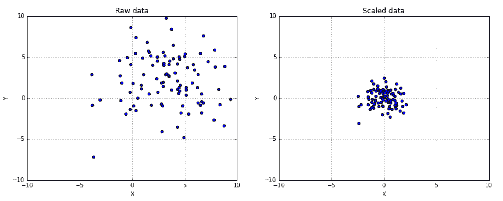

原始数据集(左上)，以及不同的分位数缩放图

其他选项包括`MinMaxScaler`和`MaxAbsScaler`，它们通过删除不属于给定范围的元素(前者)或考虑最大绝对值(后者)来缩放数据。

```
from sklearn.preprocessing import StandardScaler

ss = StandardScaler()
scaled_data = ss.fit_transform(data)
```

scikit-learn 库还提供了一个用于每样本标准化的类，`Normalizer`。它可以对数据集的每个元素应用*最大*、 *L1* 和 *L2* 规范。在欧几里得空间中，这些变换以下列方式定义:

```
from sklearn.preprocessing import RobustScaler

rb1 = RobustScaler(quantile_range=(15, 85))
scaled_data1 = rb1.fit_transform(data)

rb1 = RobustScaler(quantile_range=(25, 75))
scaled_data1 = rb1.fit_transform(data)

rb2 = RobustScaler(quantile_range=(30, 60))
scaled_data2 = rb2.fit_transform(data)
```

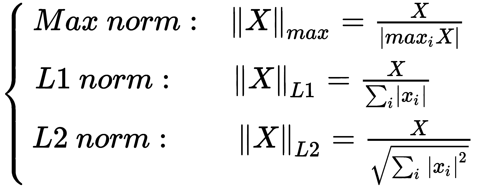

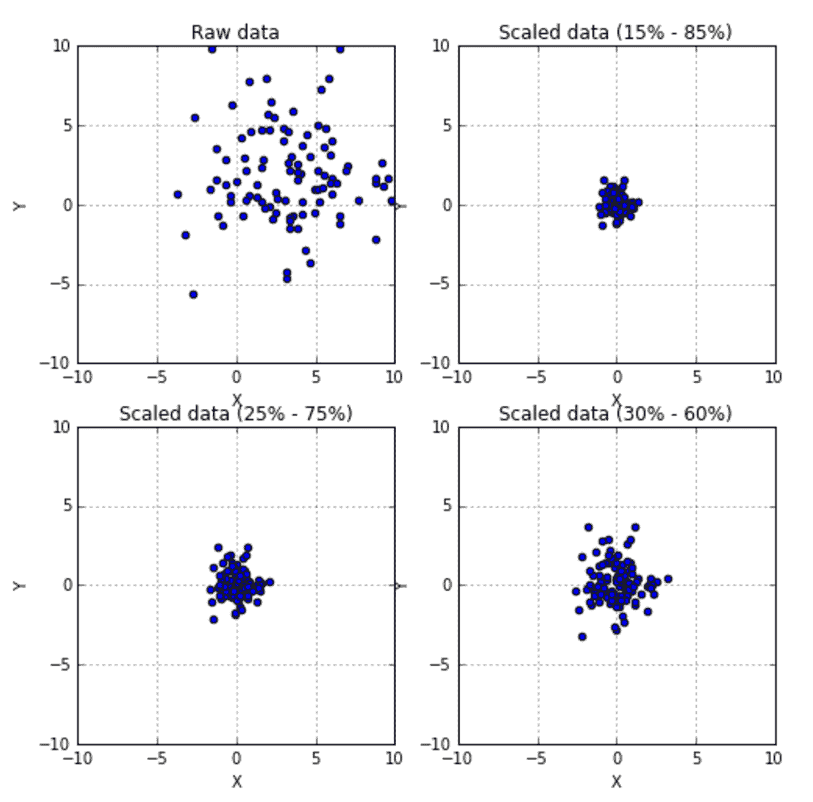

下面的代码片段显示了每个规范化的示例:

白粉

`StandardScaler`类以一种基于特征的方式运行，然而，有时，转换整个数据集以便强制它具有一个单位协方差矩阵是有用的(以提高许多对独立分量的数量敏感的算法的性能):

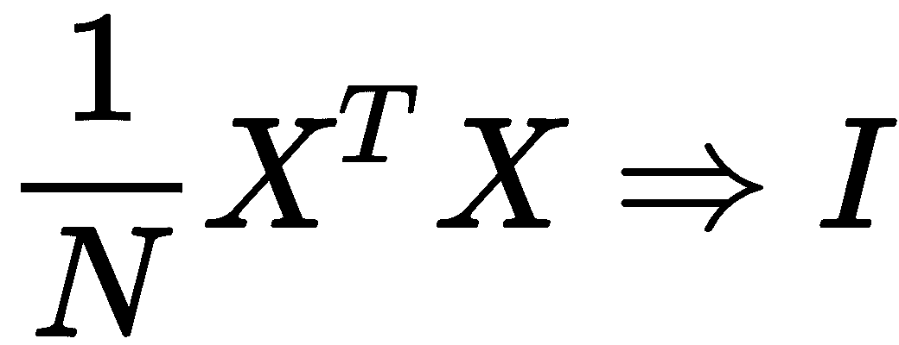

目标是找到一个变换矩阵 *A* (称为**白化矩阵**)，使得新的数据集*X^'= XA^T*具有一个恒等协方差 *C'* (我们假设 *X* 以零为中心，或者，它具有零均值)。程序相当简单(可以在*掌握机器学习算法*、 *Bonaccorso G* 中找到)。、 *Packt 出版*、 *2018* )，但是需要一些线性代数的操作。在这种情况下，我们直接提供最终结果。可以证明*C '∝X '^TX ' = AX^TXA^T*的**奇异值分解** ( **SVD** )(见 PCA 部分)为:

```
from sklearn.preprocessing import Normalizer

data = np.array([1.0, 2.0])

n_max = Normalizer(norm='max')
n_max.fit_transform(data.reshape(1, -1))
[[ 0.5, 1\. ]]

n_l1 = Normalizer(norm='l1')
n_l1.fit_transform(data.reshape(1, -1))
[[ 0.33333333,  0.66666667]]

n_l2 = Normalizer(norm='l2')
n_l2.fit_transform(data.reshape(1, -1))
[[ 0.4472136 ,  0.89442719]]
```

<title>Whitening</title>  

# ω是包含*C’*特征值的对角矩阵，而 *V* 的列是特征向量(不熟悉这个概念的读者可以简单地把这个技巧看作是分解一个矩阵的方法)。考虑最后一个等式，我们获得白化矩阵:

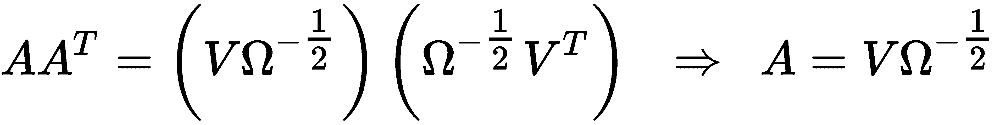

这是数据集 *X* 的白化矩阵。因为ω是对角线，所以倒数的平方根如下:


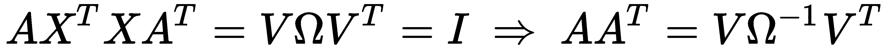

执行此操作的 Python 代码(基于 NumPy 提供的 SVD)如下:

在下图中，有一个基于具有非对角协方差矩阵的原始数据集的示例:

原始数据集(左)和白化数据集(右)

可以看出，白化数据集是对称的，其协方差矩阵近似为恒等式(`Xw`是变换的输出):

为了更好地理解这种影响，我邀请读者用其他数据集测试这个函数，比较相同算法的性能。重要的是要记住，白化过程对整个数据集起作用，因此无论何时在线执行训练过程，白化过程都可能是不可接受的。然而，在大多数情况下，它可以不受限制地使用，并且可以为训练速度和准确性提供具体的好处。

```
import numpy as np

def zero_center(X):
    return X - np.mean(X, axis=0)

def whiten(X, correct=True):
    Xc = zero_center(X)
    _, L, V = np.linalg.svd(Xc)
    W = np.dot(V.T, np.diag(1.0 / L))
    return np.dot(Xc, W) * np.sqrt(X.shape[0]) if correct else 1.0
```

特征选择和过滤


具有许多要素的非标准化数据集包含与所有要素的独立性及其方差成比例的信息。让我们考虑一个由随机高斯分布生成的具有三个要素的小型数据集:

包含具有不同标准差的三个高斯要素的样本数据集

```
import numpy as np

print(np.cov(Xw.T))

[[1.00100100e+00 5.26327952e-16]

 [5.26327952e-16 1.00100100e+00]]
```

即使没有进一步的分析，很明显中心线(具有最低方差)几乎是恒定的，并且不提供任何有用的信息。回想来自第二章、*机器学习中的重要元素*，熵 *H(X)* 相当小，而另外两个变量携带的信息更多。因此，方差阈值是一种有用的方法，可以去除所有那些贡献(就可变性和信息而言)低于预定水平的元素。scikit-learn 库提供了可以轻松解决这个问题的`VarianceThreshold`类。通过将其应用于之前的数据集，我们得到以下结果:

<title>Feature selection and filtering</title>  

# 第三个特征已被完全移除，因为其方差低于所选阈值(在本例中为`1.5`)。

还有许多单变量方法可用于根据基于 f 检验和 p 值的特定标准选择最佳特征，例如卡方或**方差分析** ( **ANOVA** )。然而，他们的讨论超出了本书的范围，读者可以在*机器学习统计*、 *Dangeti P* 中找到更多信息。、 *Packt 出版*、 *2017* 。

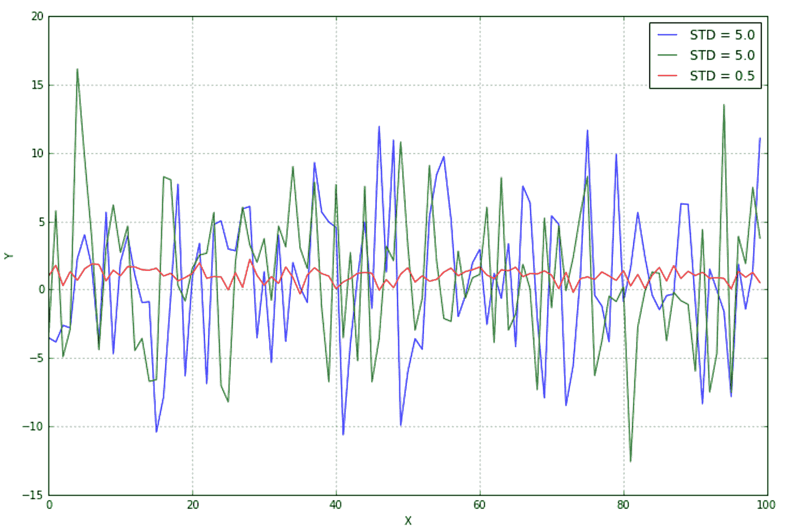

接下来显示了使用`SelectKBest`类(选择最好的 *K* 高分特征)和`SelectPercentile`类(仅选择属于特定百分位的特征子集)的两个特征选择示例。可以将它们应用于回归和分类数据集，注意选择适当的得分函数:

有关所有 scikit-learn 得分函数及其用法的更多详细信息，请访问[http://scikit-learn . org/stable/modules/feature _ selection . html # univariate-feature-selection](http://scikit-learn.org/stable/modules/feature_selection.html#univariate-feature-selection)。

```
from sklearn.feature_selection import VarianceThreshold

X[0:3, :]
array([[-3.5077778 , -3.45267063,  0.9681903 ],
       [-3.82581314,  5.77984656,  1.78926338],
       [-2.62090281, -4.90597966,  0.27943565]])

vt = VarianceThreshold(threshold=1.5)
X_t = vt.fit_transform(X)

X_t[0:3, :]
array([[-0.53478521, -2.69189452],
       [-5.33054034, -1.91730367],
       [-1.17004376,  6.32836981]])
```

主成分分析

在许多情况下，输入数据集 *X* 的维数很高，每个相关的机器学习算法的复杂性也很高。此外，信息很少均匀地分布在所有特征上，如前一章所述，第 2 章，*机器学习中的重要元素，*将会有高熵特征和低熵特征，当然，它们不会对最终结果产生显著影响。这个概念也可以通过考虑半监督学习的一个基本假设来表达，称为**流形假设**。它指出(没有正式的证明，因为这是一个经验假设)高维数据通常位于低维流形上。如果读者不熟悉流形的概念，我们就没有必要给出一个完整的严格定义。说一个流形是一个局部行为像欧几里得空间的非欧几里得空间就足够了。最简单的例子是球面。选择一个点，有可能找到一个曲率可以忽略的圆，因此它类似于二维欧几里得空间中的圆。在许多机器学习和数据科学任务中，n 维向量通常均匀分布在所有*ℜ^nt37】上。这意味着有些维度的关联信息几乎为空。然而，这并不是一个错误或坏情况，因为在许多情况下，添加维度可以更简单地更好地汇总数据。另一方面，算法对这种描述性选择是不可知的，并且在许多情况下，当维数减少到其最小值(cfr)时，它表现得更好。休斯现象)。*

一般来说，如果我们考虑一个欧几里得空间，我们得到如下:

```
from sklearn.datasets import load_boston, load_iris
from sklearn.feature_selection import SelectKBest, SelectPercentile, chi2, f_regression

regr_data = load_boston()
print(regr_data.data.shape)
(506L, 13L)

kb_regr = SelectKBest(f_regression)
X_b = kb_regr.fit_transform(regr_data.data, regr_data.target)

print(X_b.shape)
(506L, 10L)

print(kb_regr.scores_)
array([  88.15124178,   75.2576423 ,  153.95488314,   15.97151242,
        112.59148028,  471.84673988,   83.47745922,   33.57957033,
         85.91427767,  141.76135658,  175.10554288,   63.05422911,
        601.61787111])

class_data = load_iris()
print(class_data.data.shape)
(150L, 4L)

perc_class = SelectPercentile(chi2, percentile=15)
X_p = perc_class.fit_transform(class_data.data, class_data.target)

print(X_p.shape)
(150L, 1L)

print(perc_class.scores_)
array([  10.81782088,    3.59449902,  116.16984746,   67.24482759])
```

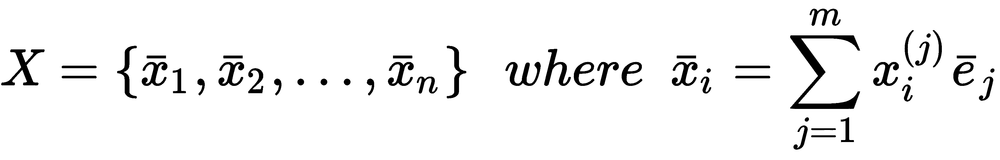

<title>Principal Component Analysis</title>  

# 所以，每个点都用一个由 *m* 个线性无关向量组成的标准正交基来表示(一般来说，这是与*ℜ^mt5】相关的标准正交基)。现在，考虑一个数据集 *X* ，一个自然的问题出现了:如何可能减少 *m* 而没有信息的急剧损失？*

让我们考虑下图(没有任何特别的解释):

具有较大水平方差的二维数据集样本

生成了哪些分布 *X=(x，y)* 并不重要，但是，水平分量的方差明显高于垂直分量的方差。如前所述，这意味着第一分量提供的信息量高于第二分量，例如， *x 轴*水平拉伸，保持垂直轴固定，因此分布变得类似于深度重要性越来越低的片段。

为了评估每个组件携带了多少信息以及它们之间的相关性，一个有用的工具是协方差矩阵(如果数据集具有零均值，我们可以使用相关矩阵):

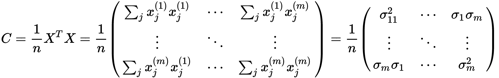

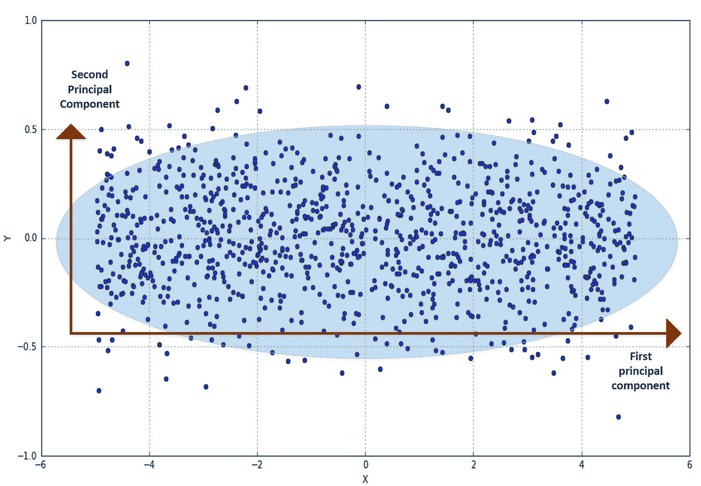

*C* 是对称的，是半正定的，所以所有的特征值都是非负的，但是每个值的意义是什么？在对角线上，有每个分量的方差*σ[I]2其编码了平均值周围的偏差。更大的方差意味着更多的价差成分，而*σ[I]2= 0*相当于所有值都等于均值的情况。元素*σ[I]σ[j]是分量之间的互方差(或互相关)，它们的值由线性相关性决定。通过仿射变换，可以找到所有这些元素都为空的新基，如下图所示:**

具有非零交叉协方差的数据集(左)和旋转(具有零协方差)版本(右)

在第一种情况下，数据集被旋转，因此组件*x[1]和*x[2]相对于规范基变得相互依赖。应用仿射变换并获得新的基，分量变得不相关。考虑前面的例子(没有旋转)，协方差矩阵如下:**


正如所料，水平方差比垂直方差高很多。此外，其他值接近于零。如果你还记得这个定义，并且为了简单起见，去掉了中间项，它们就代表了各组分之间的互相关。很明显，在我们的例子中， *X* 和 *Y* 是不相关的(它们是正交的)，但在现实生活中的例子中，可能存在呈现残差互相关的特征。用信息论的话来说，就是知道 *Y* 给了我们一些关于 *X* 的信息(我们已经知道了)，所以他们分享的信息确实是翻倍的。因此，我们的目标是在试图减少其维数的同时也去相关 *X* 。 *C* 的特征值的大小与被引用分量携带的信息量成正比，相关的特征向量为我们提供了这样一个分量的方向。因此，让我们假设我们计算一组有序的特征值*λ*:

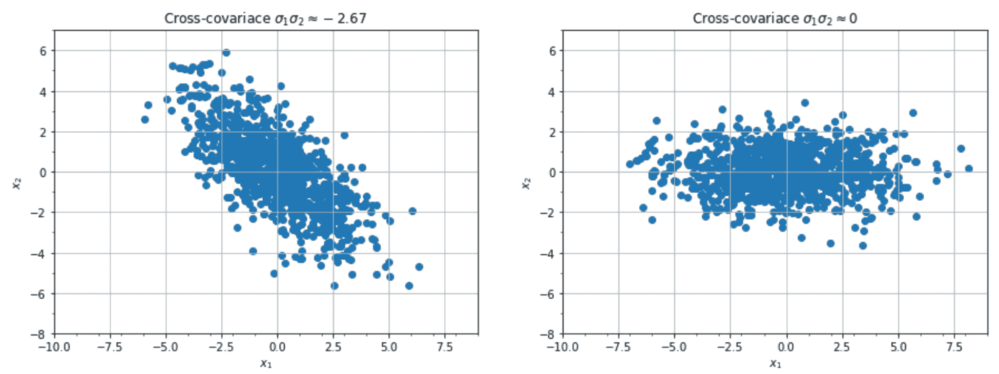

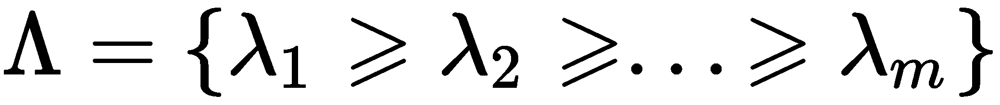

如果我们选择 *g < m* 值，对于相对子空间*λ[g]来说，以下关系成立:*

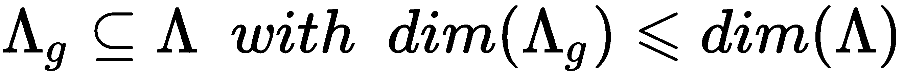

此时，我们可以基于第一个 g 特征向量构建一个变换矩阵:

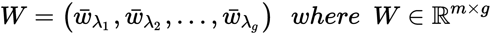

当*x∈ℜ^(n×m)时，我们用矩阵乘法得到投影:*

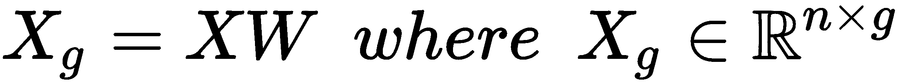

因此，可以将原始特征向量投影到这个新的(子)空间中，其中每个分量携带总方差的一部分，并且新的协方差矩阵是去相关的，以减少不同特征之间无用的信息共享(就相关性而言)。换句话说，当我们考虑与顶部 *g* 特征值相关联的特征向量时，变换后的数据集将被旋转，使得 *W* 现在是标准基，并且所有非对角线分量被强制为零。在展示实际例子之前，简单讨论一下如何执行 *C* 的特征分解是很有用的。显然，这个操作可以直接完成，但是使用 SVD 更简单。对于一般矩阵 *A ∈ ℜ ^(m × n)* (同样的结果适用于复数矩阵，但在我们的例子中，我们将只使用实值矩阵)，SVD 是一种分解，以如下方式表示 *A* :

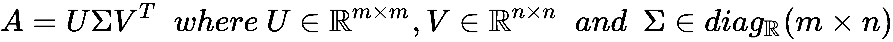

我们将在其他上下文中使用这种变换，但现在足以说明的是，*σ*的元素(称为奇异值)是*AA^T和 *A ^T A* 的特征值的平方根，并且 *V* 的列(称为右奇异向量)是 *A ^T A 的特征向量因此，我们不需要计算协方差矩阵。如果我们将 SVD 应用于数据集 *X* ，我们可以立即获得转换矩阵。scikit-learn 库提供了一个名为`TruncatedSVD`的实现，它执行 SVD，仅限于第一个最高特征值，这是执行 PCA 的最有效方式。然而，为了简单起见，还有一个`PCA`类，它可以以一种非常平滑的方式完成所有这些(不需要任何进一步的操作):**

下面是一张截图，上面有几个随机的 MNIST 手写数字:

MNIST 数字的例子

每个图像是 64 个无符号 int (8 位)数(0，255)的向量，因此组件的初始数量实际上是 64。然而，黑色像素的总量通常占主导地位，并且写入 10 位数字所需的基本符号是相似的，因此可以合理地假设几个分量具有高互相关性和低方差。尝试使用 36 个主成分，我们得到以下结果:

为了提高性能，所有整数值都被归一化到范围*【0，1】*内，并且通过`whiten=True`参数，每个对角线分量的方差被缩放到 1(协方差矩阵已经去相关)。正如 scikit-learn 官方文档所说，当许多算法需要各向同性分布才能高效执行时，这个过程特别有用。可以通过`explained_variance_ratio_`实例变量访问解释的差异比率，它显示了总差异的哪一部分由每个单个组件承载:

```
from sklearn.datasets import load_digits
from sklearn.decomposition import PCA

digits = load_digits()
```

下面显示了 MNIST 数字的示例图。左图表示**方差比**，右图表示**累积方差**。可以立即看出，就信息而言，第一部分通常是最重要的部分，而下面的部分提供了分类器也可以丢弃的细节:

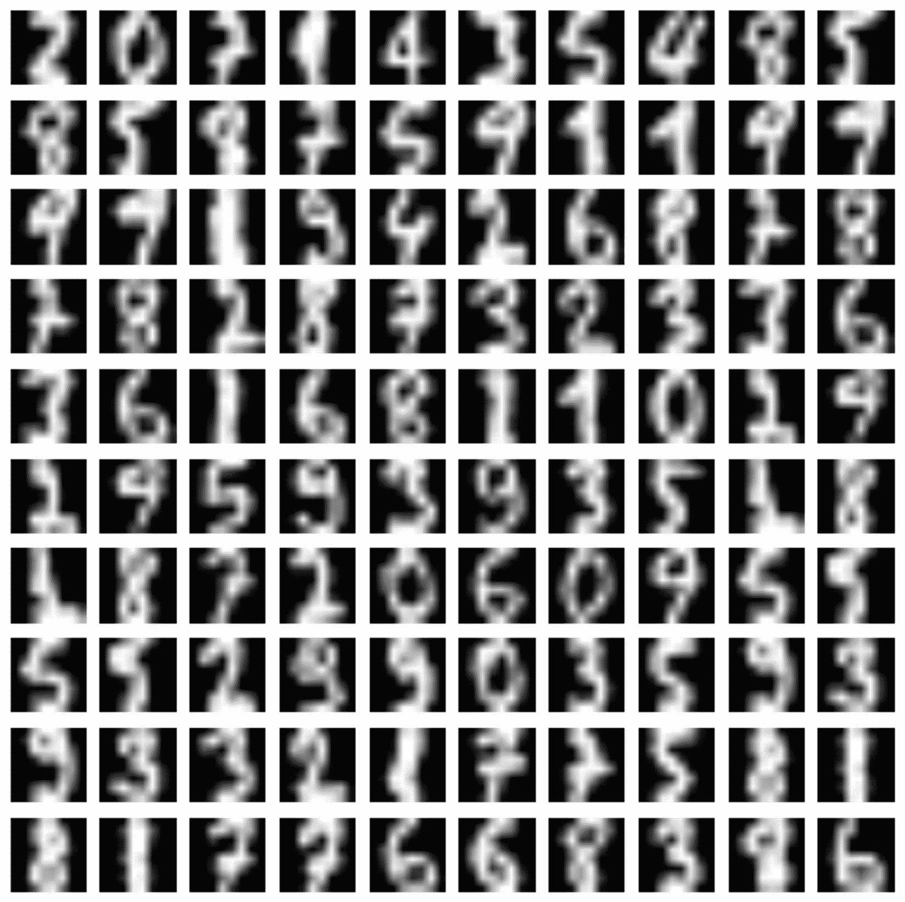

每个成分的解释方差(左)和累积方差(右)

正如预期的那样，从第五个分量开始，对总方差的贡献急剧下降，因此有可能在没有不可接受的信息损失的情况下减少原始维度，这可能会导致算法学习不正确的类。在前面的图表中，您可以看到相同的手写数字，但是通过使用前 36 个部分在 *0* 和 *1* 之间进行白化和归一化来重建。为了获得原始图像，我们需要对所有新向量进行逆变换，并将它们投影到原始空间中:

```
pca = PCA(n_components=36, whiten=True)
X_pca = pca.fit_transform(digits.data / 255)
```

结果如以下截图所示:

```
print(pca.explained_variance_ratio_)
array([ 0.14890594,  0.13618771,  0.11794594,  0.08409979,  0.05782415,
        0.0491691 ,  0.04315987,  0.03661373,  0.03353248,  0.03078806,
        0.02372341,  0.02272697,  0.01821863,  0.01773855,  0.01467101,
        0.01409716,  0.01318589,  0.01248138,  0.01017718,  0.00905617,
        0.00889538,  0.00797123,  0.00767493,  0.00722904,  0.00695889,
        0.00596081,  0.00575615,  0.00515158,  0.00489539,  0.00428887,
        0.00373606,  0.00353274,  0.00336684,  0.00328029,  0.0030832 ,
        0.00293778])
```

由主成分重建得到的 MNIST 数字

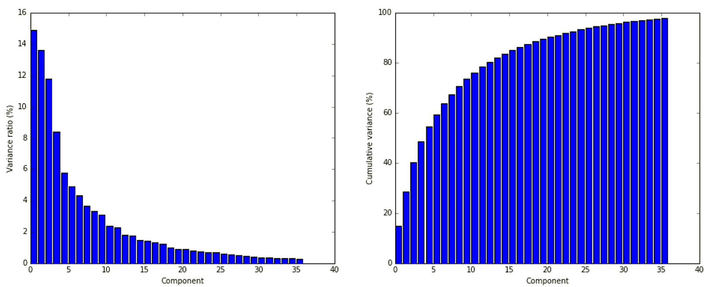

该过程还可以通过去除残余方差来对原始图像进行部分去噪，残余方差通常与噪声或不想要的贡献相关联(几乎每种书法都扭曲了用于识别的一些结构元素)。

我建议读者尝试不同数量的组件(使用解释的方差数据)和`n_components='mle'`，这使用基于贝叶斯模型选择的技术实现了最佳维度的自动选择(有关更多信息，请参考*PCA 的维度自动选择*、 *Minka T.P* 、 *NIPS 2000* : *598-604、2000* )。

```
X_rebuilt = pca.inverse_transform(X_pca)
```

如前所述，scikit-learn 用 SVD 解决了 PCA 问题。可以通过参数`svd_solver`控制算法，其值为`'auto', 'full', 'arpack', 'randomized'`。 **ARnoldi 包** ( **ARPACK** )实现了一个截断的 SVD。`randomized`基于一种近似算法，该算法删除了许多奇异向量，可以在实际组件数量明显较少的高维数据集上实现非常好的性能。

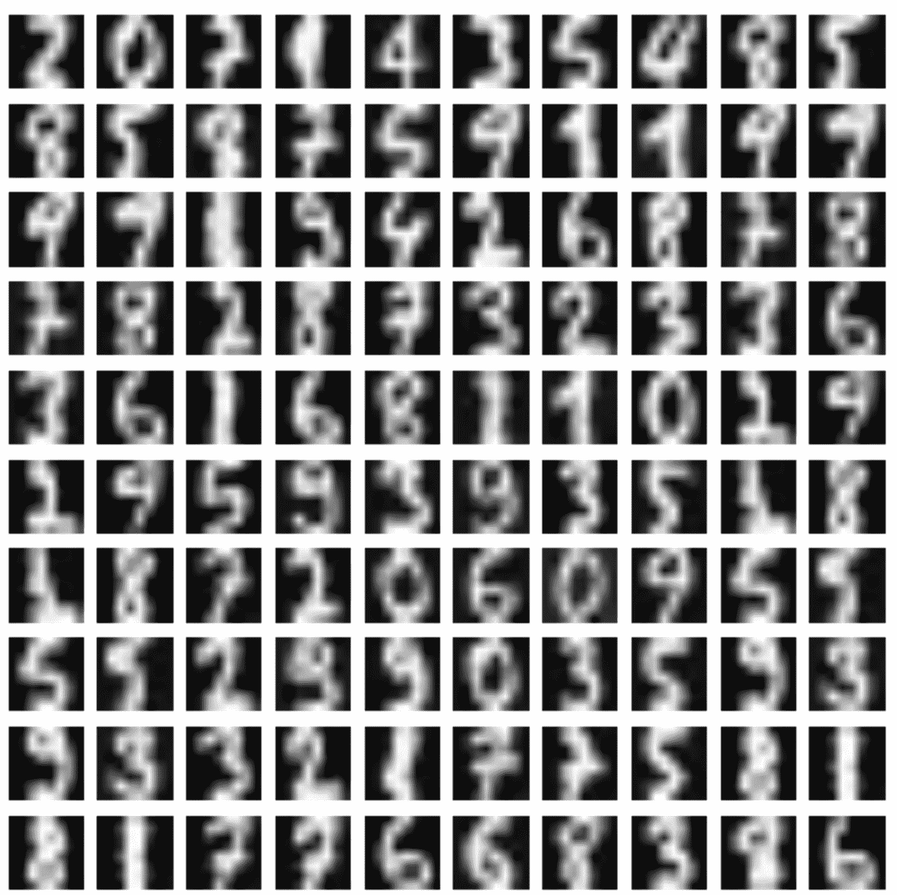

非负矩阵分解

当数据集 *X* 由非负元素组成时，可以使用**非负矩阵分解** ( **NNMF** )代替标准 PCA。该算法基于 Frobenius 范数优化损失函数(交替在 *W* 和 *H* 上):

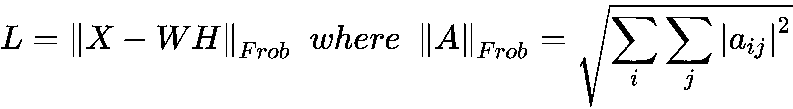

如果 *dim(X) = n × m* ，则 *dim(W) = n × p* 和 *dim(H) = p × m* ，其中 *p* 等于所请求的元件数量(`n_components`参数)，其通常小于原始尺寸 *n* 和*m*。在一些实现中，损失函数是平方的并且 *L1* /

*<title>Non-Negative Matrix Factorization</title>  

# 正如我们将在下一章中讨论的，[第 4 章](220f66cf-aeee-4e3e-8d1c-cda7e74d814b.xhtml)、*回归算法、*正则化项可以通过选择所有大于零的元素并强制所有其他元素变为零来提高精度并增加 *W* 和 *H* ( *L1* 罚值)的稀疏性。最终的重建完全是相加的，并且已经表明它对于通常没有非负元素的图像或文本特别有效。算法首先为 *W* 和 *H* 设置随机值，然后在两个优化步骤之间交替进行:

*W* 保持恒定， *L* 相对于 *H* 最小化

*H* 保持恒定， *L* 相对于 *W* 最小

重复该过程，直到 *W* 和 *H* 都变得稳定。显然，目标是找到一个基础， *H* ，这样 *X ≈ WH* 。PCA 的主要区别在于，我们对解释的方差没有任何约束，但是矩阵必须是非负的。

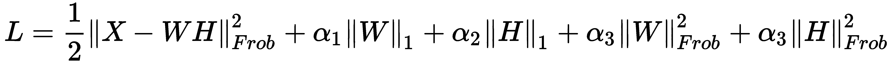

在下面的代码片段中，有一个使用 Iris 数据集的示例。`init`参数可以采用不同的值(见文档),这些值决定了数据矩阵最初是如何处理的。一个随机选择是针对仅缩放的非负矩阵(不执行 SVD):

1.  NNMF 和其他因子分解方法对于更高级的技术非常有用，比如推荐系统和主题建模，因此我邀请读者理解这些方法的逻辑。矩阵的因式分解允许你把它表达成两个实体的乘积，这两个实体共享一个维度。例如，如果 *X* 由用户向量组成，其中每个组件指的是一个产品， *W* 会将用户与一些未知的(称为潜在的)因素相关联， *H* 会将潜在的因素与产品相关联。正如我们将在[第 12 章](aeaa410b-5375-4274-8957-a931dfa96747.xhtml)、*推荐系统简介*中讨论的，这个假设成为一个基本概念。潜在因子在线性代数中起着基础的作用。因此，这是一个参考系统，可以找到特定子空间中任意点的分量。
2.  NNMF 对其参数非常敏感(特别是初始化和正则化)，所以我建议阅读原始文档以了解更多信息:[http://sci kit-learn . org/stable/modules/generated/sk learn . decomposition . NMF . html .](http://scikit-learn.org/stable/modules/generated/sklearn.decomposition.NMF.html)

稀疏主成分分析

scikit-learn 库提供了不同的 PCA 变体，可以解决特定的问题。我建议阅读原始文档。然而，我想提一下`SparsePCA`，它允许在提取主成分的同时利用数据的自然稀疏性。如果您考虑手写数字或其他必须分类的图像，它们的初始维数可能相当高(10 x 10 的图像有 100 个特征)。然而，应用标准 PCA 仅选择平均最重要的特征，假设每个样本可以使用相同的成分来重建。简化来说，这相当于以下内容:

```
from sklearn.datasets import load_iris
from sklearn.decomposition import NMF

iris = load_iris()
print(iris.data.shape)
(150L, 4L)

nmf = NMF(n_components=3, init='random', l1_ratio=0.1)
Xt = nmf.fit_transform(iris.data)

print(nmf.reconstruction_err_)
1.8819327624141866

print(iris.data[0])
array([ 5.1,  3.5,  1.4,  0.2])

print(Xt[0])
array([ 0.20668461,  1.09973772,  0.0098996 ])

print(nmf.inverse_transform(Xt[0]))
array([ 5.10401653,  3.49666967,  1.3965409 ,  0.20610779])
```

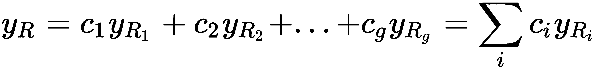

另一方面，我们总是可以使用有限数量的组件，但没有密集投影矩阵的限制。这可以通过使用稀疏矩阵(或向量)来实现，其中非零元素的数量非常少。这样，每个元素都可以使用其特定的组件(在大多数情况下，它们总是最重要的)来重建，这些组件可以包括通常被密集 PCA 丢弃的元素。先前的表达式现在变成如下:

<title>Sparse PCA</title>  

# 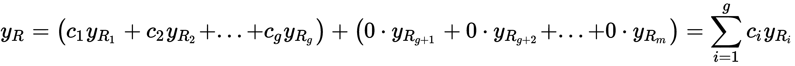

这里，非空分量已经放入第一个块中(它们的顺序与前面的表达式不同)，而所有其他零项都已被分离。就线性代数而言，向量空间现在有了原来的维数。然而，使用稀疏矩阵的力量(由`scipy.sparse`提供)，scikit-learn 可以比传统的 PCA 更有效地解决这个问题。

下面的代码片段显示了一个带有`60`组件的`SparsePCA`。在这种情况下，它们通常被称为*原子*，稀疏度可以通过*L1*-范数正则化来控制(更高的`alpha`参数值导致更稀疏的结果)。这种方法在分类算法中非常常见，将在接下来的*原子提取和字典学习*部分以及后续章节中讨论:

正如我们将要讨论的，当需要从有限的特征子集开始重建每个样本时，稀疏成分的提取非常有用。在这种特殊情况下，我们不再考虑解释的差异，而是专注于找出所有那些可以用作独特原子的元素。例如，我们可以对 MNIST 数据集使用一个`SparsePCA`(相当于字典学习 scikit-learn)，以便找到几何基础组件(如垂直/水平线)，而不关心实际的维度减少(在这种情况下，这成为一个次要目标)。


有关 SciPy 稀疏矩阵的更多信息，请访问[https://docs . SciPy . org/doc/SciPy-0 . 18 . 1/reference/sparse . html](https://docs.scipy.org/doc/scipy-0.18.1/reference/sparse.html)。

核主成分分析

```
from sklearn.decomposition import SparsePCA

spca = SparsePCA(n_components=60, alpha=0.1)
X_spca = spca.fit_transform(digits.data / 255)

print(spca.components_.shape)
(60L, 64L)
```

我们将在第 7 章、*支持向量机*中讨论内核方法，然而，提及`KernelPCA`类是有用的，它使用非线性可分离数据集执行 PCA。这种方法类似于具有特定预处理步骤的标准 PCA。与许多人的预期相反，当投影到特殊的高维空间时，非线性低维数据集通常会变成线性可分的。另一方面，我们不喜欢引入可能导致无法解决的问题的主要复杂性。内核技巧可以帮助我们实现这一目标，而不用承担艰难的非线性操作的负担。完整的数学证明超出了本书的范围，但是，我们可以将一个**核**定义为一个具有以下性质的实值向量函数:

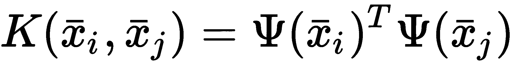

具体来说，如果*x[I]∈ℜ^n，向量变换*ψ(x[I])*将原向量投影到更大的子空间上。实际上，它的密码子通常是ℜ*p^pt17】与 p*n*。内核 *K(x [i] ，x [j] )* 的优势在于用两个值*x[I]和 *x [j]* 对其进行计算，其输出对应于变换向量的点积，因此不需要额外的计算。现在，让我们考虑单个样本的标准 PCA 变换*(x[I]∈ℜ^(n×1))*:***

<title>Kernel PCA</title>  

# 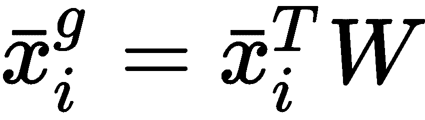

当使用核 PCA 时，我们需要使用投影*W^g=ψ(x)v^g*重新表示基矩阵 *W* ，其中 *v ^g* 是考虑核变换 *K* 而不是协方差矩阵 *C* 计算的特征向量(记住标量的点积相当于标准乘法因此，内核 PCA 变换如下:

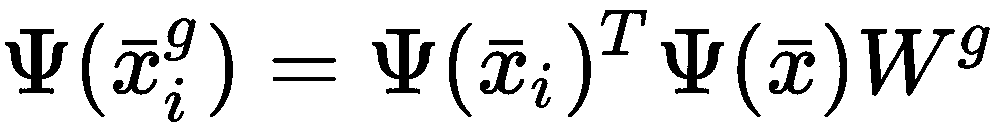

然而，使用核技巧可以有效地计算点积，因此最终的计算对应于提取投影到高维子空间上的数据集的分量(在高维子空间中它可能是线性可分的)。换句话说，我们假设在一个不同的(高维)空间中，有一些组件的解释方差相对于其他组件可以忽略不计。为了理解这个概念，让我们考虑一个由一个内部有一个斑点的圆组成的数据集:

下图显示了图形表示。在这种情况下，经典的 PCA 方法不能捕捉现有组件的非线性相关性(读者可以验证投影是否等同于原始数据集)。然而，观察样本并使用极坐标，很容易将两组分开，仅考虑半径(在这种情况下，解释的方差不再是两个分量的函数，因为半径几乎是常数):

一个非线性可分数据集，包含一个被圆形集包围的密集斑点

考虑到数据集的结构，可以使用径向基函数核(对离原点的距离敏感)来研究 PCA 的行为:


```
from sklearn.datasets import make_circles

Xb, Yb = make_circles(n_samples=500, factor=0.1, noise=0.05)
```

由于`gamma`的默认值是`1.0`/特征数(现在，考虑这个参数与高斯分布的方差成反比 *σ ²* )，我们需要增加它来捕捉外圆。一个`1.0`的值就够了:

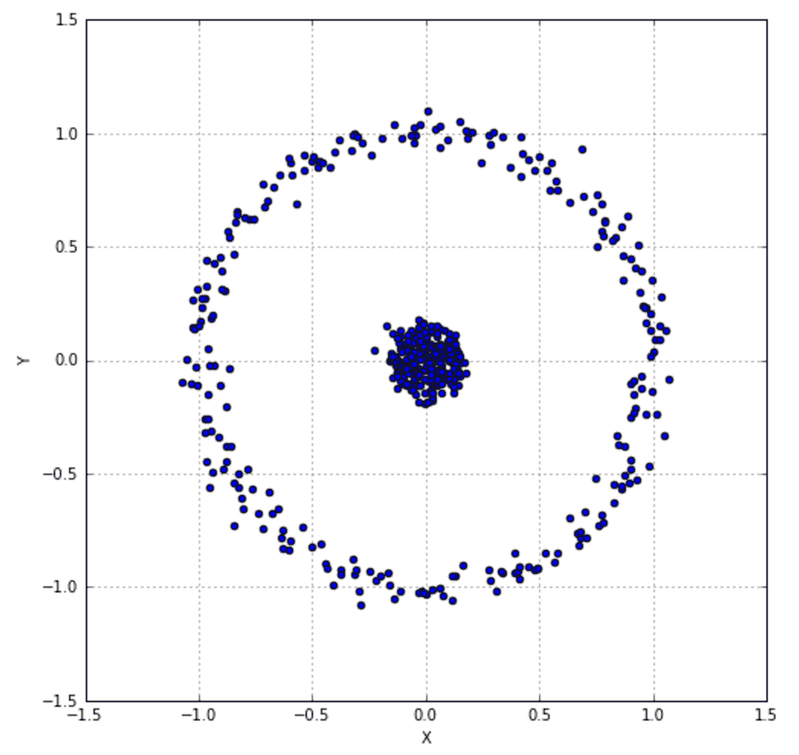

`X_transformed_fit_`实例变量将包含我们的数据集到新空间的投影。绘制它，我们得到以下结果:

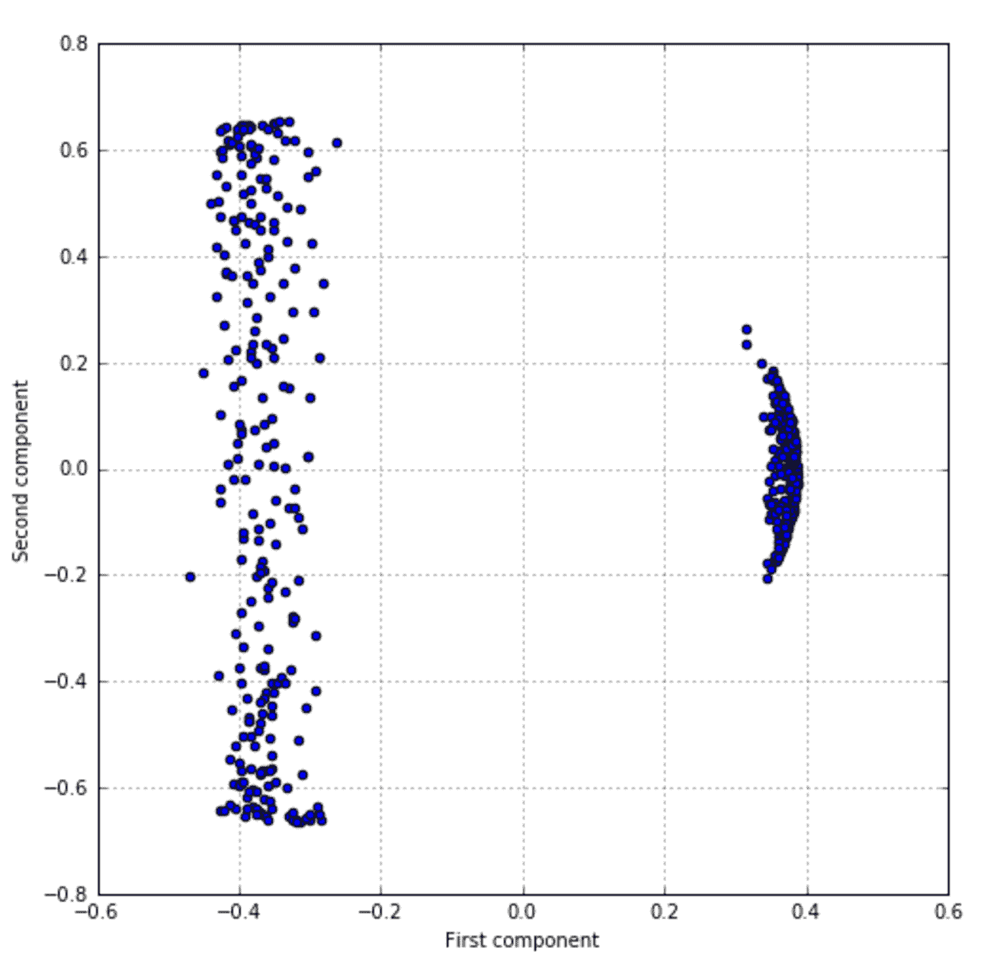

核主成分分析图，其中左边的条带表示外部圆圈，而较小的半月形表示内部斑点

该图显示了预期的分离，并且还可以看到属于中心斑点的点具有曲线分布，因为它们对距中心的距离更敏感。

```
from sklearn.decomposition import KernelPCA

kpca = KernelPCA(n_components=2, kernel='rbf', fit_inverse_transform=True, gamma=1.0)
X_kpca = kpca.fit_transform(Xb)
```

当我们认为我们的数据集是由可以是分量的函数(特别是径向基或多项式)的元素组成时，核 PCA 是一个强大的工具，但我们无法确定它们之间的线性关系。

有关 scikit-learn 支持的不同内核的更多信息，请访问[http://scikit-learn . org/stable/modules/metrics . html # linear-kernel](http://scikit-learn.org/stable/modules/metrics.html#linear-kernel)。

独立成分分析

有时，为了提取不相关和独立的成分，处理数据是有用的。为了更好地理解这个场景，让我们假设我们记录两个人唱不同的歌。结果显然非常嘈杂，但我们知道随机信号可以分解为以下内容:

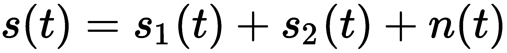

前两项是单个音乐源(建模为随机过程)，而 *n(t)* 是加性高斯噪声。我们的目标是找到*s[1](t)+n[1](t)*和*s[2](t)+n[1]**(t)*以便去除两个源中的一个(带有一部分无法滤除的加性噪声)。使用标准 PCA 执行这项任务非常困难，因为对元件的独立性没有限制。这个问题已经被 hyv rinen 和 Oja 广泛研究过(请参考*独立分量分析:算法与应用*， *Hyvarinen A* 。， *Oja E* 。，*神经网络 13/2000* )，他们考虑了为了提取独立分量而必须实施的条件。最重要的是，我们不能假设高斯分布，相反，我们需要寻找更峰化的分布(具有重尾)。原因是基于高斯分布的统计性质，特别是我们知道如果一些随机变量*s[I]∞N(μ，σ)* 是独立的，它们也是联合正态分布(即 *(s [1] ，s [2] ，...，s[I])**∞N(μ，σ)*)。

<title>Independent Component Analysis</title>  

# 考虑到前面的例子，这个结果意味着如果假设*s[1]和*s[2]是独立的和正态的，则加性信号将由多元正态分布表示。不幸的是，这个结果使得独立组件的研究成为不可能。由于这本书更具介绍性，我省略了证明(这可能相当复杂，但可以在前述论文和*掌握机器学习算法*、 *Bonaccorso G* 中找到)。、 *Packt 发布*、 *2018* )。然而，为了理解这种逻辑，考虑一个称为**峰度**(对应于四阶矩)的统计指标是有帮助的:**

这个测度通常被称为正态分布，其值为 *Kurt(N) = 3* 。峰度大于 *3* 的所有分布都被称为超高斯分布，它们在平均值附近非常突出。这意味着概率很高，但只是在很小的区域，在其他地方接近于零。下图显示了一个例子:

高斯分布与拉普拉斯分布

拉普拉斯分布是超高斯分布的一个例子，峰度= 6 。正如可能看到的，它在平均值附近非常尖，尾部很重。概率密度函数如下:

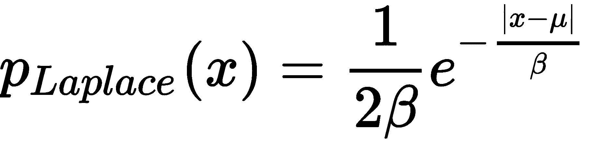

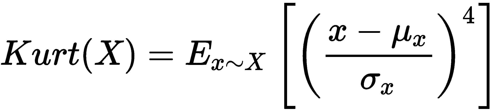

因此，指数现在具有次数 *1* (而高斯是平方的)，并且不同分量的联合概率永远不能被表示为高斯分布。假设源是用这种分布建模的(有许多其他的选择)意味着我们隐含地说它们是可分的和独立的(这也迫使稀疏)。因此，如果最终样本是用超高斯加性贡献获得的，这种方法可以帮助我们识别和隔离源，因为它们不再是联合正态分布，而且，单个分量的概率分布具有潜在的较小重叠。


然而，即使这种测量非常强大，它对异常值也非常敏感(由于四次方)，因此作者提出了一种替代算法，他们称之为**快速独立分量分析** ( **FastICA** )。对数学背景的完整描述超出了本书的范围，但我想展示如何从原始 MNIST 数据集中提取 256 个独立分量(可以使用 scikit-learn 内置`fetch_mldata('MNIST original')`函数下载)。

第一步是加载数据集并以零为中心(该算法对对称数据非常敏感):

此时，我们可以实例化`FastICA`类，选择`n_components=256`和`max_iter=5000`(有时，需要提高这个值以保证收敛)，并训练模型:

在流程结束时，`components_`实例变量包含所有提取的值。在下面的屏幕截图中，我们可以看到前 64 个独立组件的表示:

从 MNIST 数据集中提取 64 个独立分量

与 PCA 相反，我们现在可以检测到许多小的*构件*，它们代表可以在许多构件之间共享的数字部分。例如，可以检测小的水平笔划，以及不同位置的几个圆角。这些组成部分几乎是独立的，样本可以被重建为它们的加权和。特别是，当组件的数量非常大时，得到的权重向量将是稀疏的，因为许多组件不会在所有样本中使用。我邀请读者用不同的`n_component`值重复这个练习，试图理解组件何时包含重叠(因此它们由一组独立的部分组成)以及何时它们开始成为*基本元素*。从神经科学的角度来看，大脑解码图像的基本机制是基于只接受特定模式的神经元。因此，使用这种算法，可以实现一种过滤机制，将一个复杂的源(例如，一幅图像)分割成能够引起选择性响应的块。例如，可以分析数据集并排除所有特定成分权重较大的样本(如背景噪声或回声)，或者相反，可以只选择那些对特定任务有帮助的元素(例如，包含强垂直成分)。

```
import numpy as np

from sklearn.datasets import fetch_mldata

def zero_center(Xd):
    return Xd - np.mean(Xd, axis=0)

digits = fetch_mldata('MNIST original')
X = zero_center(digits['data'].astype(np.float64))
np.random.shuffle(X)
```

原子提取和字典学习

```
from sklearn.decomposition import FastICA

fastica = FastICA(n_components=256, max_iter=5000, random_state=1000)
fastica.fit(X)
```

字典学习是一种允许您从原子的稀疏字典开始重建样本的技术(类似于主成分，但没有关于独立性的约束)。按照惯例，当字典包含的元素数量小于样本的维数 *m* 时，称为*欠完备*，另一方面，当原子数量大于(有时大得多)m 时，称为*过完备*。

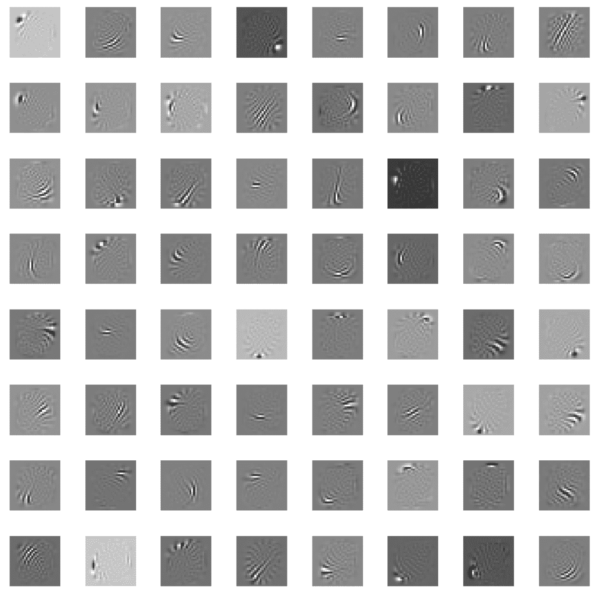

在*在线字典学习进行稀疏编码*， *Mairal J* 。，*巴赫 F* 。，*庞塞 J* 。，*萨皮罗 G* 。，*2009 年第 29 届国际机器学习会议论文集，*sci kit-learn 采用的相同在线策略有一个描述，可以概括为一个双重优化问题。

假设我们有一个数据集， *X* :

<title>Atom extraction and dictionary learning</title>  

# 

我们的目标是为每个样本找到一个字典 *D* (即包含 *m* k 维向量的矩阵)和一组向量权重:

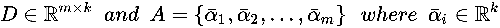

在训练过程之后，输入向量*x[I]可以计算如下:*

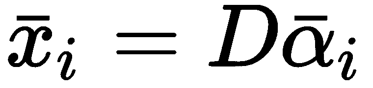

读者可以认识到一种与我们讨论的 PCA 非常相似的方法。实际上，每个样本*x[I]都是使用一个变换矩阵和一个投影*α[I]重新表示的。**

优化问题(涉及 *D* 和α矢量)可以表示为以下损失函数的最小化:

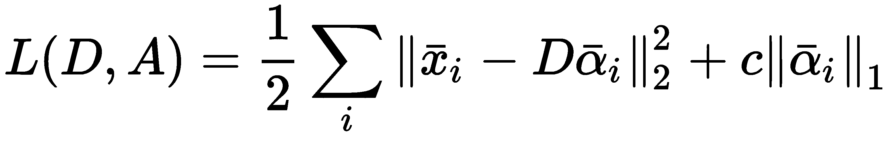

这里，参数 *c* 控制稀疏度的级别(它与 *L1* 归一化的强度成比例)。类似于 NNMF，这个问题可以通过改变最小二乘变量直到达到稳定点来解决。字典学习可以用于执行稀疏 PCA，但是，在某些情况下，它可以有助于考虑具有更复杂数据集的过完备字典。比如一组代表汽车的图片，考虑到单个样本必须使用大量原子(甚至*k>m*)重建，可以分解成所有可能的成分。事实上，当 *k < < n* 时，组件被强制表示更复杂的部分，而 *k > > n* 允许提取所有的基本组成元素。

要考虑的一个非常重要的因素是 L1 归一化。不幸的是，很难证明为什么这个术语强制稀疏(我们将在下一章展示一些其他的例子)，然而，考虑到 L0 范数，可以获得一个非常简单的解释，它(相当非正式地)是向量的非空元素的数量。最小化 L0 范数意味着迫使所有分量降低幅度，直到它们尽可能接近零。不幸的是，这种规范是不可微的，它不能用于优化过程。因此，L1 范数是最佳候选，因为使用 Lp 范数，稀疏度*减少，而 *p* 增加。这不是一个严格的证明，但它可以有助于理解这种方法的逻辑。在许多其他算法中， *L1* 罚值的存在表明希望特定的量是稀疏的。*

在 scikit-learn 中，我们可以用`DictionaryLearning` 类(使用通常的 MNIST 数据集)实现这样的算法，其中`n_components`像往常一样确定原子的数量:

每个原子(组件)的绘图显示在下面的屏幕截图中:

从 MNIST 数据集中提取的一组原子

在这个例子中，组件的数量小于维度，原子包含更复杂的形状。我邀请读者用不同的值重复这个练习，观察结果图并比较特性的粒度。

这个过程在低端机器上可能会很长。在这种情况下，我建议将样本数量限制在 20 或 30 个，或者使用较小的数据集。

```
from sklearn.decomposition import DictionaryLearning

dl = DictionaryLearning(n_components=36, fit_algorithm='lars', transform_algorithm='lasso_lars')
X_dict = dl.fit_transform(digits.data)
```

使用 t-SNE 可视化高维数据集

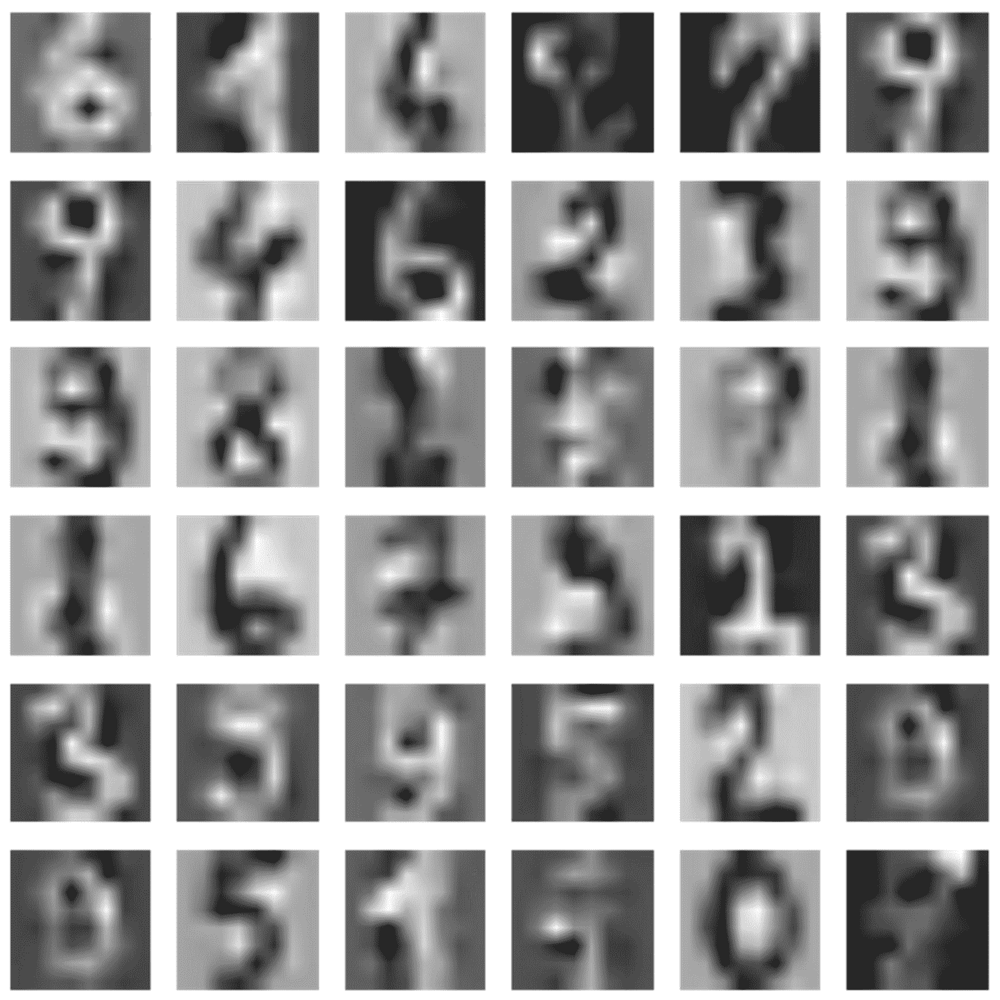

在结束本章之前，我想向读者介绍一种非常强大的算法，称为**t-分布式随机邻居嵌入** ( **t-SNE** )，它可以用来可视化 2D 图中的高维数据集。事实上，每个数据科学家不得不面对的最困难的问题之一是在没有图形支持的情况下理解复杂数据集的结构。该算法由范德马滕和辛顿提出(在*中使用 t-SNE* 、*范德马滕 L* 可视化高维数据)。 *J* 。 *P* 。，*辛顿 G.E* 。，*《机器学习研究杂志》9(11 月)*， *2008* )，并可用于降低维度试图保留内部关系。完整的讨论超出了本书的范围(但读者可以查阅前述论文和*掌握机器学习算法*、*博纳科索 G* 。、 *Packt Publishing* 、 *2018* )然而，关键的概念是找到一个低维分布，从而最小化它与数据生成过程之间的 Kullback-Leibler 散度。显然，需要一些数学技巧来有效地完成这项任务，但是对初学者唯一有用的基本概念是*困惑*，其定义如下:


换句话说，困惑与分布的熵成正比(当使用 *log [2] (x)* 计算时，它变成一种逆运算)，并且通过最小化它，我们减少了关于目标分布的不确定性，给定原始数据生成过程。因此，所有 t-SNE 实现都要求您指定目标复杂度(通常在 10 ÷ 30 的范围内)，计算时间成反比增长。

<title>Visualizing high-dimensional datasets using t-SNE</title>  

# 为了展示这种算法的强大功能，让我们假设我们想要在二维图中可视化 MNIST 数据集的数字，以检查相似的数字是否比不同的数字更接近。让我们从加载和规范化数据集开始:

此时，我们可以用`n_components=2`和`perplexity=20`实例化 scikit-learn `TSNE`类，并用原始数据集(有 64 个维度)拟合它:

最终结果如下面的截图所示(其中显示了 400 个样本):

MNIST 数据集的 t-SNE 图(限于 400 位)

正如可能看到的那样，数字与其原始分布一致地分组(聚集),只有几个错误，这可能是由于过度变形(不同的`random_state`值可以产生略有不同的最终配置)。然而，t-SNE 非常强大，当前的大多数实现都足够快，可以在很短的时间内处理非常大的高维数据集。因此，我建议只要有助于数据的图形化表示，就使用它。该算法属于流形学习算法家族，隐含地证实了流形假设。事实上，即使我们有 64 个原始维度，样本被分组为密集的块，可以用更少的维度来表示。在这种特殊情况下，我们还获得了隐式聚类，因为许多块不仅非常密集，而且它们与其他块是分开的，考虑到中心点(质心)，可以通过计算距中心的距离来预测一个数字是否属于该组。一般来说，这并不总是如此简单，但我们进一步证实了降维具有强大的数学原理，并且它主要得益于真实数据集的内部结构。

```
import numpy as np

from sklearn.datasets import load_digits

digits = load_digits()
X = digits['data'] / np.max(digits['data'])
```

摘要

```
from sklearn.manifold import TSNE

tsne = TSNE(n_components=2, perplexity=20, random_state=1000)
X_tsne = tsne.fit_transform(X)
```

特征选择是机器学习管道中的第一步(有时也是最重要的一步)。并非所有这些特性都对我们的目的有用，其中一些用不同的符号表示，所以在任何进一步的操作之前，通常有必要对数据集进行预处理。

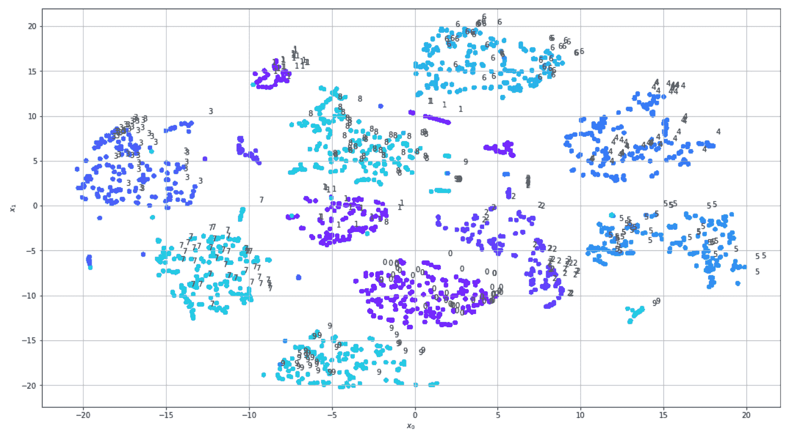

我们看到了如何使用随机洗牌将数据分成训练集和测试集，以及如何管理缺失的元素。另一个非常重要的部分介绍了用于管理分类数据或标签的技术，这在某个特征仅采用一组离散值时非常常见。

然后，我们分析了维数问题。一些数据集包含许多相互关联的特征，因此它们不提供任何新信息，但增加了计算复杂性并降低了整体性能。PCA 是一种仅选择包含最大总方差的特征子集的方法。这种方法及其变体允许您去相关特征并减少维度，而不会在准确性方面有很大损失。字典学习是另一种技术，用于从数据集中提取有限数量的构建块，以及重建每个样本所需的信息。当数据集由不同版本的相似元素(如图像、字母或数字)组成时，这种方法特别有用。

<title>Summary</title>  

# 在下一章中，[第 4 章](220f66cf-aeee-4e3e-8d1c-cda7e74d814b.xhtml)，*回归算法，*我们将讨论线性回归，这是预测连续值的最广泛和最简单的监督方法。我们还将分析如何克服一些限制，以及如何使用相同的算法解决非线性问题。

Feature selection is the first (and sometimes the most important) step in a machine learning pipeline. Not all of these features are useful for our purposes, and some of them are expressed using different notations, so it's often necessary to preprocess our dataset before any further operations. 

We saw how we can split the data into training and test sets using a random shuffle and how to manage missing elements. Another very important section covered the techniques used to manage categorical data or labels, which are very common when a certain feature only assumes a discrete set of values.

Then, we analyzed the problem of dimensionality. Some datasets contain many features that are correlated with each other, so they don't provide any new information but increase the computational complexity and reduce the overall performances. The PCA is a method to select only a subset of features that contain the largest amount of total variance. This approach, together with its variants, allows you to decorrelate the features and reduce the dimensionality without a drastic loss in terms of accuracy. Dictionary learning is another technique that's used to extract a limited number of building blocks from a dataset, together with the information needed to rebuild each sample. This approach is particularly useful when the dataset is made up of different versions of similar elements (such as images, letters, or digits).

In the next chapter, [Chapter 4](220f66cf-aeee-4e3e-8d1c-cda7e74d814b.xhtml), *Regression Algorithms, *we're going to discuss linear regression, which is the most diffused and simplest supervised approach to predicting continuous values. We'll also analyze how to overcome some limitations and how to solve non-linear problems using the same algorithms.*