<title>Regression Algorithms</title>  

# 回归算法

**线性模型**是最简单的参数方法，总是值得关注，因为许多问题，甚至本质上是非线性的问题，都可以用这些模型轻松解决。如前所述，*回归*是一种预测，其中目标是连续的，它有多种应用，因此了解线性模型如何拟合数据、其优缺点以及何时选择替代方案是更可取的，这一点很重要。在本章的最后一部分，我们将讨论一个有趣的方法，使用相同的模型有效地处理非线性数据。

特别是，我们将讨论以下内容:

*   标准线性回归
*   正则化回归(岭回归、套索和弹性网)
*   稳健回归(**随机样本一致性** ( **RANSAC** )和 Huber 回归)
*   多项式回归
*   贝叶斯回归(这个题目比较高级，开头可以跳过)
*   保序回归
*   回归评估指标

<title>Linear models for regression</title>  

# 回归的线性模型

让我们考虑从数据生成过程 *p [data]* 中提取的实值向量的数据集:


每个输入向量都与一个实数值*y[I]相关联:*

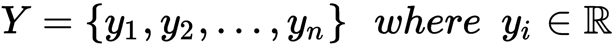

线性模型基于这样的假设，即可以通过基于以下规则的回归过程来逼近输出值:

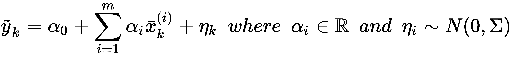

换句话说，强有力的假设是，我们的数据集和所有其他未知点位于由超平面和依赖于单个点的随机正态噪声定义的体积中。很多情况下，协方差矩阵是*σ=σ²I[m](即*同方差*噪声)；因此，噪声对所有特性都有相同的影响。每当这种情况不发生时(即噪声为*异方差*时)，就不可能简化*σ*的表达式。了解这种情况比预期的更常见是有帮助的，这意味着某些要素的不确定性更高，模型无法以足够的精度解释它们。一般来说，最大误差与训练质量和原始数据集的适应性都成比例，原始数据集的适应性与随机噪声的方差成比例。在下图中，有两种可能情况的示例:*

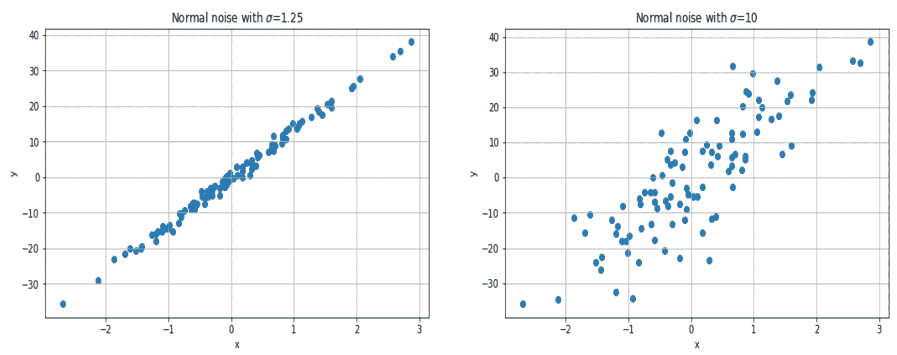

低随机噪声的时间序列(左)。具有高随机噪声的时间序列(右)。

线性回归方法基于*平面*结构(线、平面、超平面)；因此，它不能适应高度分散的数据集。当数据集明显是非线性的并且必须考虑其他模型(例如**多项式回归**、**神经网络**或**核支持向量机**)时，最常见的问题之一就会出现。在这一章中，我们将分析不同的情况，展示如何衡量算法的性能，以及如何做出最合适的决定来解决特定的问题。

<title>A bidimensional example</title>  

# 二维例子

让我们考虑一个小数据集，该数据集是通过向属于在 **-6** 和 **6** 之间界定的片段的点添加一些均匀噪声而构建的。原方程为 *y = x + 2 + η* ，其中 *η* 为噪声项。

在下图中，有一个带有*候选*回归函数的图:

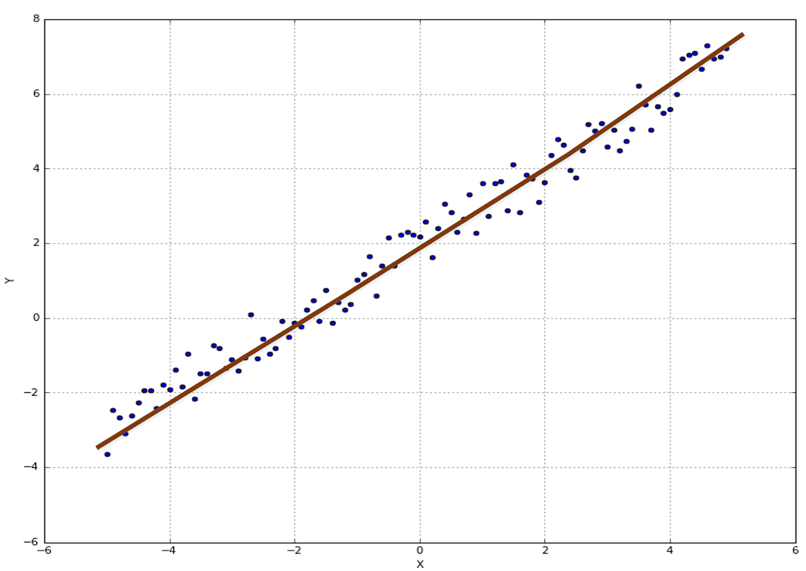

带有候选回归线的简单二维数据集

数据集定义如下:

```
import numpy as np

nb_samples = 200

X = np.arange(-5, 5, 0.05)

Y = X + 2
Y += np.random.normal(0.0, 0.5, size=nb_samples)
```

当我们在一个平面上工作时，我们寻找的回归量是只有两个参数(截距和唯一的乘法系数)的函数，带有与每个数据点 *x* [*i*] 相关联的附加随机正态噪声项(形式上，所有 *η [i]* 都是**独立且同分布的** ( **i.i.d** )变量):

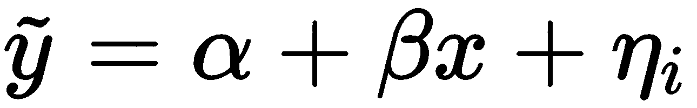

为了拟合我们的模型，我们必须找到最佳参数，我们从基于已知数据点的**普通最小二乘法** ( **OLS** )方法开始(*x[I]T21、*y[I]T25)。最小化的成本函数如下:**

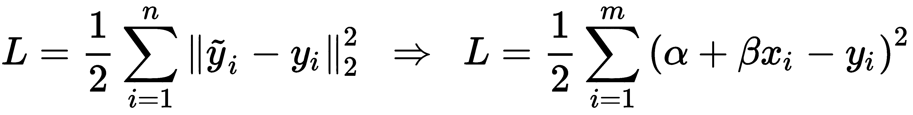

通过分析方法，为了找到全局最小值，我们必须使两个导数都等于 *0* (在一般情况下，必须使用梯度 *∇L = 0* 来做同样的事情):

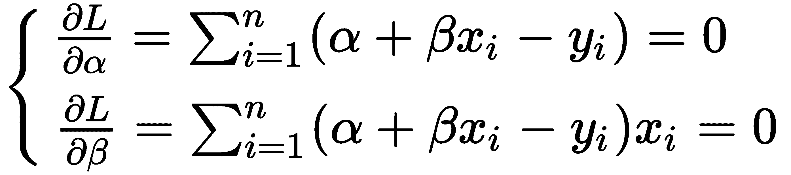

因此，我们可以使用包含α和β的输入向量在 Python 中定义函数:

```
import numpy as np

def loss(v):
   e = 0.0
   for i in range(nb_samples):
      e += np.square(v[0] + v[1]*X[i] - Y[i])
   return 0.5 * e
```

并且梯度可以定义如下:

```
import numpy as np

def gradient(v):
   g = np.zeros(shape=2)
   for i in range(nb_samples):
     g[0] += (v[0] + v[1]*X[i] - Y[i])
     g[1] += ((v[0] + v[1]*X[i] - Y[i]) * X[i])
   return g
```

现在可以使用 SciPy 解决优化问题:

```
from scipy.optimize import minimize

minimize(fun=loss, x0=[0.0, 0.0], jac=gradient, method='L-BFGS-B')

fun: 25.224432728145842
 hess_inv: <2x2 LbfgsInvHessProduct with dtype=float64>
      jac: array([ -8.03369622e-07, 3.60194360e-06])
  message: b'CONVERGENCE: NORM_OF_PROJECTED_GRADIENT_<=_PGTOL'
     nfev: 8
      nit: 7
   status: 0
  success: True
        x: array([ 1.96534464, 0.98451589])
```

正如所料，回归去除了数据集的噪声，重建了原始方程: *y = x + 2* (近似误差可以忽略不计)。这个程序是绝对可以接受的；不过也不难理解，问题可以一步到位的封闭形式解决。首先要做的是通过添加一个等于 *1* 的额外特性来消除截距:

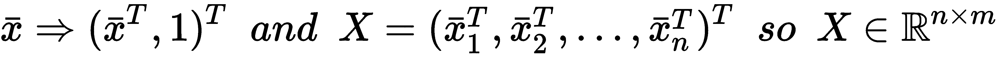

在这一点上，一般问题可以用系数向量θ用向量符号表示:

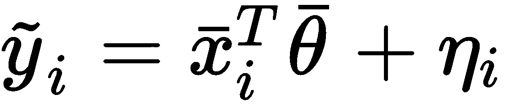

在二维情况下 *θ = (β，α)* 因为截距总是对应于最后一个值。如果我们假设噪声是方差等于 *σ ²* (即*η∾N(0，σ ² I)* )的均方误差，成本函数可以改写如下:

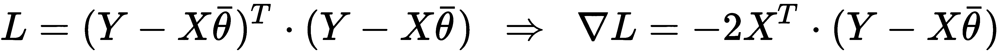

如果矩阵 *X ^T X* 有*满秩*(即 *det(X ^T X) ≠ 0* )，使用摩尔-彭罗斯伪逆(是形状不是正方形时矩阵求逆的一种扩展)很容易找到解 *∇L = 0* :

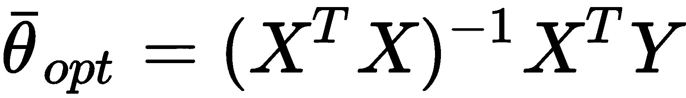

前面的例子变成了这样:

```
import numpy as np

Xs = np.expand_dims(X, axis=1)
Ys = np.expand_dims(Y, axis=1)
Xs = np.concatenate((Xs, np.ones_like(Xs)), axis=1)

result = np.linalg.inv(np.dot(Xs.T, Xs)).dot(Xs.T).dot(Y)

print('y = %.2fx + %2.f' % (result[0], result[1]))
y = 0.98x +  2
```

显然，这种方法效率更高，并且利用了 NumPy 提供的矢量化功能(大型数据集上的计算速度极快，并且不再需要多次梯度计算)。根据**高斯-马尔可夫定理**，这是**最佳线性无偏估计量** ( **蓝**)，意思是没有其他系数方差更小的解。我们省略了证明(应用标准公式很容易得到)，但是我们有*E[θ[opt]= 0*和*Var[θ[opt]]=σ²(X^TX)^(-1)*它依赖于 *σ ²* 和 *X 的逆对于我们的示例，系数协方差矩阵如下:*

```
import numpy as np

covariance = (0.5 ** 2) * np.linalg.inv(np.dot(Xs.T, Xs))

print(covariance)
[[ 1.50003750e-04 3.75009375e-06]
 [ 3.75009375e-06 1.25009375e-03]]
```

协方差矩阵是去相关的(所有非对角项都接近 *0* )，系数和截距的方差非常小(这也是由于问题的简单性)。有趣的是，截距的方差比系数的方差大十倍。这是由于我们期望一半的点在回归线之上，另一半在回归线之下。因此，小的垂直移动减少了 50%点的误差，并增加了剩余部分的误差。另一方面，斜率的微小变化会对所有点产生影响，总会增加均方误差。

考虑到 *m 个*样本和 *m 个* i.i.d .正态噪声项，给定样本集 *X* ，参数向量 *θ [opt]* ，噪声方差 *σ ²* 的输出 *Y* 的概率是高斯的，其密度函数等于:

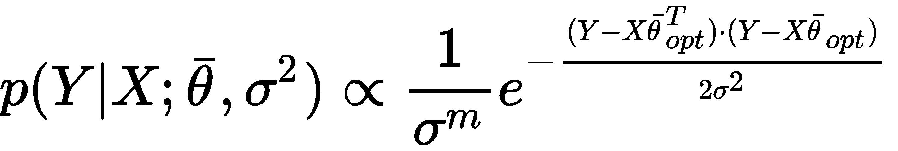

这意味着，一旦训练了模型并且找到了*θ[opt]，我们期望所有样本都具有以回归超平面为中心的高斯分布。在下图中，有一个这个概念的二维例子:*

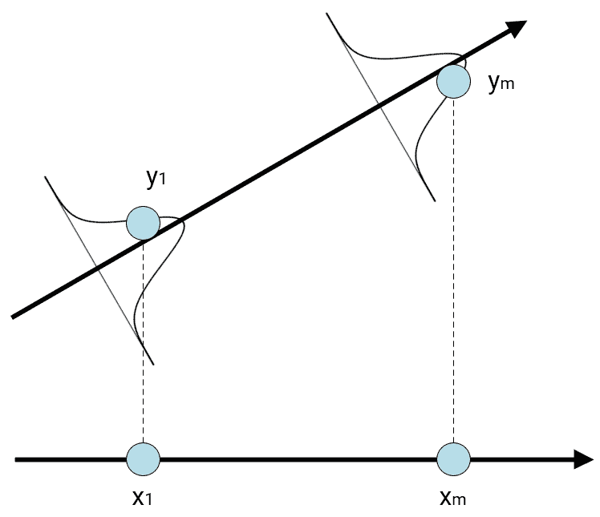

回归线周围输出 *y* 的预期分布

在异方差噪声的一般情况下，我们可以将噪声协方差矩阵表示为*σ=σ²C，*其中 *C* 是一般的平方可逆矩阵，其值通常有界在 *0* 和 *1* 之间。这不是一个限制，因为，如果我们选择 *σ* ^(*2*) 作为最大方差，那么一个类属元素 *C [ij]* 就成为参数特征 *θ [i]* 和 *θ* [*j* 之间协方差的一个权重]

成本函数略有不同，因为我们必须考虑噪声对单个特征的不同影响:

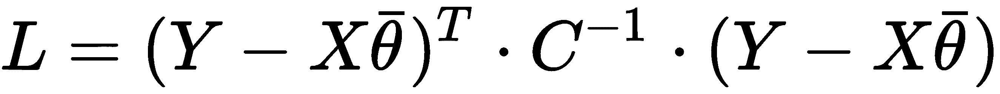

很容易计算梯度并导出参数的表达式，类似于我们在前面的案例中获得的结果:

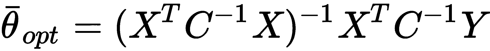

对于基于平方误差最小化的一般线性回归问题，可以证明新样本的 *x [j]* 的最佳预测(即，具有最小方差)对应于:

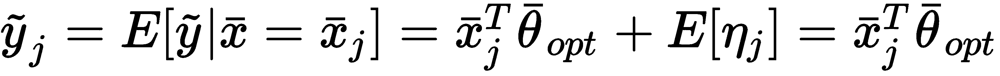

这个结果证实了我们的预期:最佳回归变量将总是预测因变量 *y* 的期望值，该因变量受输入*x[j]的约束。因此，考虑到前面的图，高斯分布被优化以使它们的均值尽可能接近每个训练样本(当然，具有全局线性的约束)。*

<title>Linear regression with scikit-learn and higher dimensionality</title>  

# 具有 scikit-learn 和更高维度的线性回归

scikit-learn 库提供了用于 n 维空间的`LinearRegression`类。为此，我们将使用波士顿数据集:

```
from sklearn.datasets import load_boston

boston = load_boston()

print(boston.data.shape)
(506L, 13L)

print(boston.target.shape)
(506L,)
```

它具有带有`13`输入特征的`506`个样本和一个输出。在下图中，收集了前 12 个特征的曲线图:

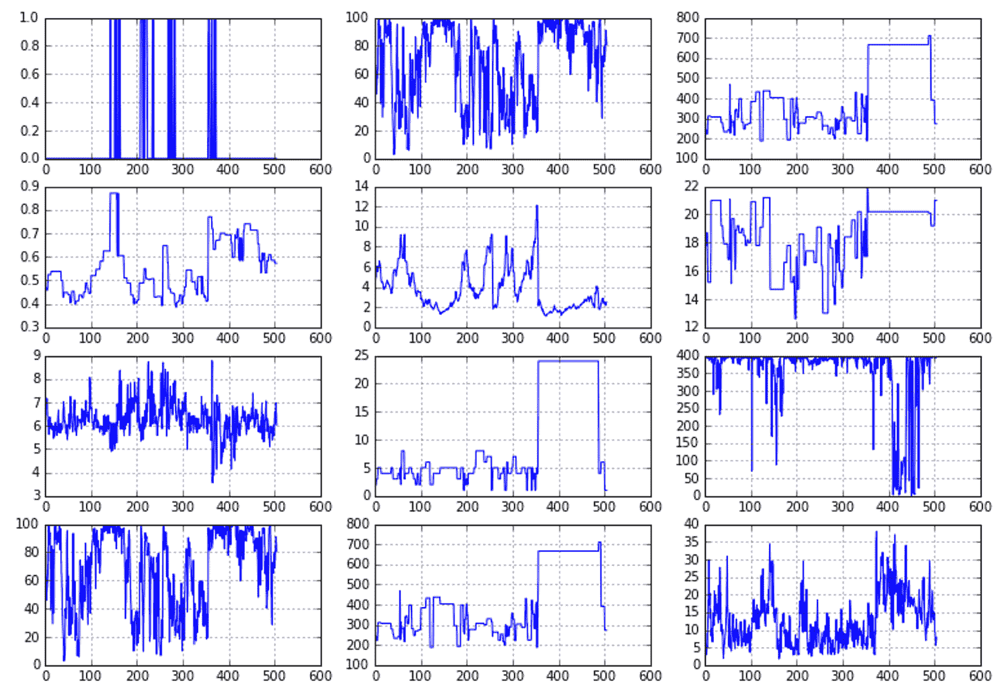

波士顿数据集的前 12 个要素的图

使用数据集时，使用表格视图来操作数据非常有用。 **Pandas** 是完成这项任务的完美框架，尽管这超出了本书的范围，但我建议您使用`pandas.DataFrame(boston.data, columns=boston.feature_names)`命令创建一个数据框，并使用 Jupyter 将其可视化。有关更多信息，请参考*学习 pandas -使 Python 数据发现和分析变得简单*、 *Heydt M* 。、*帕克特出版*、 *2017* 。

存在不同的标度和异常值(可以使用前面章节中研究的方法移除)，因此最好在处理数据之前要求模型对数据进行归一化(设置`normalize=True`参数)。此外，出于测试目的，我们将原始数据集分为训练集(90%)和测试集(10%):

```
from sklearn.linear_model import LinearRegression
from sklearn.model_selection import train_test_split

X_train, X_test, Y_train, Y_test = train_test_split(boston.data, boston.target, test_size=0.1)

lr = LinearRegression(normalize=True)
lr.fit(X_train, Y_train)

LinearRegression(copy_X=True, fit_intercept=True, n_jobs=1, normalize=True)
```

当原始数据集不够大时，将其拆分为定型集和测试集可能会减少可用于拟合模型的样本数量。因为我们假设数据集代表一个底层的数据生成过程，所以绝对有必要让训练集和测试集都遵守这个规则。小型数据集可能恰好只有少量样本代表数据生成过程的特定区域，因此将它们包含在训练集中很重要，以避免缺乏泛化能力。

**K 倍交叉验证**可以用不同的策略帮助解决这个问题。整个数据集被分成 *k* 个褶皱，始终使用 *k-1* 个褶皱用于训练，剩余的一个用于验证模型。将执行 K 次迭代，总是使用不同的验证折叠。在下图中，有一个包含三个折叠/迭代的示例:

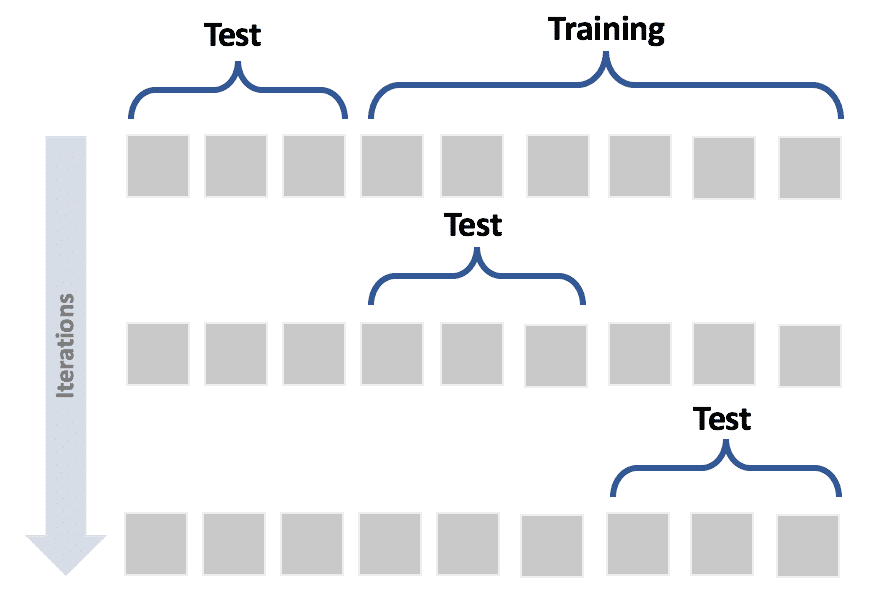

k 重交叉验证模式

这样就可以确定最终得分为所有值的平均值，选取所有样本训练 *k-1* 次。只要训练时间不是特别长，这种方法就是评估模型性能(尤其是泛化能力)的最佳方式，当训练集中不存在某些样本时，泛化能力可能会受到影响。

为了检查回归的准确性，scikit-learn 提供了内部方法`score(X, y)`方法，该方法使用*R²分数来评估测试数据上的模型(参见下一节):*

```
print(lr.score(X_test, Y_test))
0.77371996006718879
```

因此，总体精度约为 77%，考虑到原始数据集的非线性，这是一个可接受的结果，但它也会受到由`train_test_split` 进行的细分的影响(如我们的情况)。事实上，测试集可以包含在整体精度不可接受的情况下也可以很容易预测的点。出于这个原因，最好不要立即相信这个方法，默认交叉验证( **CV** )评估。

为了执行 k-fold 交叉验证，我们可以使用`cross_val_score()`函数，它适用于所有的分类器。`scoring`参数非常重要，因为它决定了测试将采用哪个指标。由于`LinearRegression`使用普通的最小二乘法，我们更喜欢负的均方误差，这是一个累积的度量，必须根据实际值来评估(它不是相对的):

```
from sklearn.model_selection import cross_val_score

scores = cross_val_score(lr, boston.data, boston.target, cv=7, scoring='neg_mean_squared_error')
array([ -11.32601065,  -10.96365388,  -32.12770594,  -33.62294354,
        -10.55957139, -146.42926647,  -12.98538412])

print(scores.mean())
-36.859219426420601

print(scores.std())
45.704973900600457
```

高标准差证实了该数据集对分割策略非常敏感。在某些情况下，训练集和测试集的概率分布相当相似，但在其他情况下(至少有三个七倍)，它们是不同的；因此，算法无法学会正确预测。

<title>R2 score</title>  

# R2 分数

回归中使用的另一个非常重要的指标叫做**决定系数**或 ***R ²*** 。它测量由数据集解释的预测的方差。换句话说，给定数据生成过程 *p [数据]* 的方差，该度量与预测实际属于 *p [数据]* 的新样本的概率成比例。直观上，如果回归超平面以低于固定阈值的误差逼近大多数样本，我们可以假设未来值将被正确估计。另一方面，例如，如果斜率仅允许数据集的一部分有小误差，则未来错误预测的概率会增加，因为模型无法捕捉完整的动态。

为了引入该度量，让我们将下面的量定义为**剩余**:

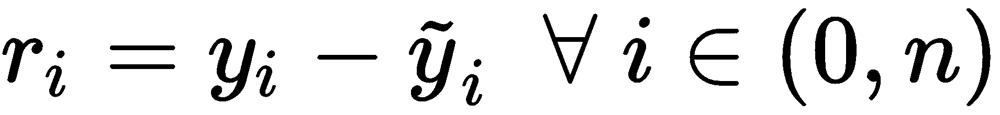

换句话说，就是样本和预测的差异。所以，*R²定义如下:*

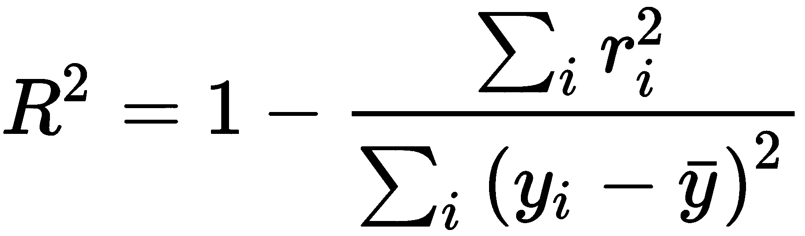

术语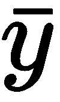代表对所有样本计算的平均值。出于我们的目的，接近于 *1* 的*R²值意味着近乎完美的回归，而接近于 *0* 的值(或负值)意味着模型不好。将这一指标与 CV 一起使用非常简单:*

```
print(cross_val_score(lr, X, Y, cv=10, scoring='r2').mean())
0.2
```

结果很低，这意味着该模型很容易在未来预测中失败(与`score()`方法提供的结果相反)。事实上，考虑到标准偏差，我们可以进行确认:

```
print(cross_val_score(lr, X, Y, cv=10, scoring='r2').std())
0.599
```

考虑到原始数据集的差异和几个*异常*的存在，这并不奇怪。CV 方法的最大优点是最小化只选择接近回归超平面的点的风险。

读者应该意识到，这样的模型很可能产生不准确的预测，不应该试图找到更好的训练/测试分割。一个合理的解决方案的特点是高 CV 分数均值和低标准差。另一方面，当 CV 标准偏差较高时，应采用另一种解决方案，因为该算法对结构训练集非常敏感。我们将在本章末尾分析一些更强大的模型；然而，选择通常必须限于非线性解决方案，它能够捕捉复杂的动态(因此，解释更多的变化)。

<title>Explained variance</title>  

# 解释方差

在线性回归问题中(以及在**主成分分析** ( **PCA** ))，了解模型可以解释多少原始方差是有帮助的。这个概念有助于理解我们通过近似数据集而丢失的信息量。当该值较小时，意味着数据生成过程具有强烈的振荡，而线性模型无法捕捉它们。一个非常简单但有效的措施(与*R²没有太大区别)定义如下:*

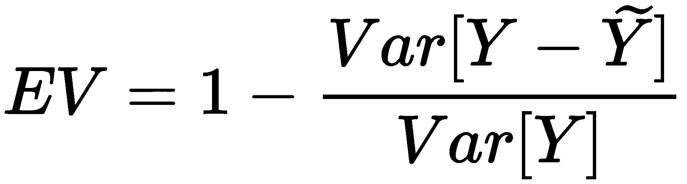

当 *Y* 被很好地逼近时，分子接近于 *0* 和 *EV → 1* ，为最优值。在所有其他情况下，指数代表误差方差和原始过程方差之间的比率。我们可以使用之前采用的相同 CV 策略来计算本例的得分:

```
print(cross_val_score(lr, X, Y, cv=10, scoring='explained_variance').mean())
0.271
```

类似于*R²的值是不可接受的，即使它稍微高一点。很明显，不能使用线性系统对数据集的动态进行建模，因为只有少数要素表现出可表示为带有加性高斯噪声的一般线的行为。一般来说，当 *R ²* 不可接受时，计算其他度量是没有意义的，因为模型的精度通常会很低。相反，最好是分析数据，以便更好地理解单个时间序列。在波士顿数据集中，许多值表现出极其非线性的行为，并且最规则的要素似乎不是静止的。这意味着有(通常未知的)事件会戏剧性地改变动态。如果时间窗口很短，可以想象振荡和季节性的存在，但是当样本在足够长的时间内收集时，更有可能假设模型中没有包括的因素的存在。例如，在一场自然灾害之后，房屋的价格会发生巨大的变化，这种情况显然是不可预测的。每当不规则样本的数量很少时，可以将它们视为异常值，并使用特定的算法将其过滤掉，但当它们更频繁时，最好采用可以学习非线性动力学的模型。在本章以及本书的其余部分，我们将讨论可以解决或减轻这些问题的方法。*

<title>Regressor analytic expression</title>  

# 回归分析表达式

如果我们想要一个模型(超平面)的解析表达式，`LinearRegression`提供了两个实例变量，`intercept_`和`coef_`:

```
print('y = ' + str(lr.intercept_) + ' ')
for i, c in enumerate(lr.coef_):
    print(str(c) + ' * x' + str(i))

y = 38.0974166342 
-0.105375005552 * x0
0.0494815380304 * x1
0.0371643549528 * x2
3.37092201039 * x3
-18.9885299511 * x4
3.73331692311 * x5
0.00111437695492 * x6
-1.55681538908 * x7
0.325992743837 * x8
-0.01252057277 * x9
-0.978221746439 * x10
0.0101679515792 * x11
-0.550117114635 * x12
```

对于任何其他模型，可以通过`predict(X)`方法进行预测。作为一个实验，我们可以尝试向我们的训练数据添加一些高斯噪声，并预测值:

```
X = boston.data[0:10] + np.random.normal(0.0, 0.1)

lr.predict(X)
array([ 29.5588731 ,  24.49601998,  30.0981552 ,  28.01864586,
        27.28870704,  24.65881135,  22.46335968,  18.79690943,
        10.53493932,  18.18093544])

print(boston.target[0:10])
[ 24\. ,  21.6,  34.7,  33.4,  36.2,  28.7,  22.9,  27.1,  16.5,  18.9]
```

很明显，该模型并没有以理想的方式运行，有许多可能的原因，最主要的是非线性和异常值的存在。一般来说，线性回归模型并不是一个非常稳健的解决方案。然而，在这种情况下，一个常见的威胁是由导致低秩 *X* 矩阵的共线性表示的。这决定了病态矩阵对噪声特别敏感，导致一些参数爆炸。为了降低这种风险并提供更可靠的解决方案，我们研究了以下方法。

<title>Ridge, Lasso, and ElasticNet</title>  

# 脊、套索和弹性网

在本节中，我们将分析最常见的正则化方法，以及它们如何影响线性回归器的性能。在现实生活中，处理*脏*数据集是很常见的，包含离群值、相互依赖的特征和对噪声的不同敏感度。这些方法可以帮助数据科学家缓解问题，产生更有效和准确的解决方案。

<title>Ridge</title>  

# 山脉

**岭**回归(也称为**吉洪诺夫正则化**)对普通最小二乘成本函数施加额外的收缩惩罚，以限制其平方*L[2]范数:*

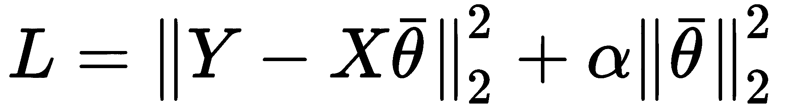

*X* 是包含所有样本行的矩阵，θ项代表权重向量。附加项(通过阿尔法系数——如果大，则意味着更强的正则化和更小的值)迫使损失函数不允许 *w* 的无限增长，这可能是由多重共线性或病态造成的。

在下图中，有一个应用山脊惩罚时发生的情况的表示:

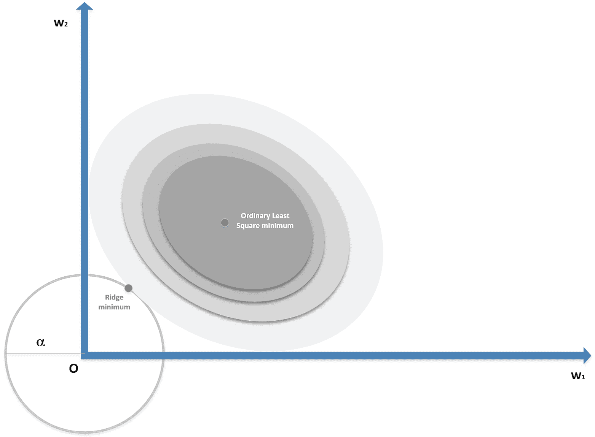

使用岭惩罚的二维解决方案(灰色表面代表成本函数)

灰色表面表示成本函数(这里，为了简单起见，我们只使用两个权重)，而圆心 **O** 是由脊条件施加的边界。最小值将具有更小的 *w* 值，避免了潜在的爆炸。在这种情况下，很容易验证最佳系数向量是标准线性回归公式的略微不同的版本:

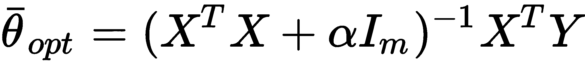

所以，只要α选择正确，*det(X^TX+**αI[m])≠0*和解总是可以找到的。通常，当数据集包含线性相关的要素时(在某种程度上，这种情况非常常见)，收缩项起着重要作用。在这种情况下，矩阵 *X ^T X* 可能是病态的(例如， *det(X ^T X) ≈ 0，*)，并且逆可能对值的微小变化非常敏感，因此，系数方差可能变得非常高。对它们的增长施加约束保证了更稳定的解决方案和对噪声更强的鲁棒性。

在下面的代码片段中，我们将通过交叉验证来比较`LinearRegression`和`Ridge` :

```
from sklearn.datasets import load_boston
from sklearn.linear_model import LinearRegression, Ridge

boston = load_boston()

lr = LinearRegression(normalize=True)
rg = Ridge(0.05, normalize=True)

lr_scores = cross_val_score(lr, boston.data, boston.target, cv=10)
print(lr_scores.mean())
0.200138

rg_scores = cross_val_score(rg, boston.data, boston.target, cv=10)
print(rg_scores.mean())
0.287476
```

由于房屋定价是基于 13 个很可能是部分相关的变量(例如，无人居住房屋的数量和犯罪率)，我们可以观察到在施加 *L [2]* 惩罚时 CV 分数的明显增加。

有时，找到 alpha(脊系数)的正确值并不容易。scikit-learn 库提供了`RidgeCV`类，该类允许在集合中执行自动网格搜索并返回最佳估计:

```
from sklearn.linear_model import RidgeCV

rg = RidgeCV(alphas=(1.0, 0.1, 0.01, 0.005, 0.0025, 0.001, 0.00025), normalize=True)
rg.fit(boston.data, boston.target)

print(rg.alpha_)
0.010
```

<title>Lasso</title>  

# 套索

一个**套索**回归器对 *w* 的*L[1]范数施加惩罚，以确定一个潜在的更大数量的零系数:*

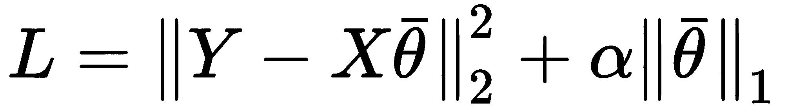

稀疏性是惩罚项的结果(数学证明是重要的，但是我们已经在第 2 章、*机器学习的重要元素*中提供了直观的解释)。套索约束也会产生收缩，但是动力学与山脊略有不同。当使用一个*L[1]范数时，根据*θ[I]的符号，对系数计算的偏导数只能是+1 或-1。因此，该约束迫使最小的分量以更高的速度向零移动，因为对最小化的影响与系数的大小无关。相反， *L [2]* 范数的导数与参数的大小成比例，并且对于小值，其影响减小。这就是为什么 Lasso 通常用于通过隐式特征选择来诱导稀疏性。当特征的数量很大时，Lasso 选择一个子集，丢弃(即设置 *θ [i] ≈ 0* )其他特征，这些特征在未来的预测中不被考虑。在下图中，有一个套索正则化效果的表示:**

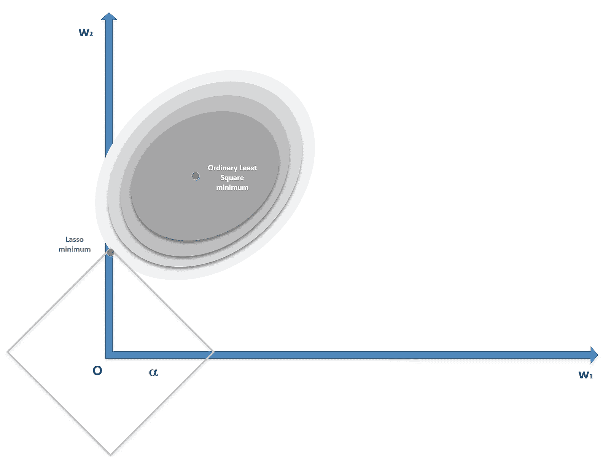

使用套索惩罚的二维解决方案(灰色表面代表成本函数)

在这种情况下，存在这样的顶点，其中一个分量为非空，而所有其他权重为零。与顶点相交的概率与 *w，*的维数成正比，因此，在训练套索回归器后发现一个相当稀疏的模型是正常的。

在以下代码片段中，波士顿数据集用于拟合套索模型:

```
from sklearn.linear_model import Lasso

ls = Lasso(alpha=0.01, normalize=True)
ls_scores = cross_val_score(ls, boston.data, boston.target, cv=10)

print(ls_scores.mean())
0.270937
```

同样，对于 Lasso，有可能运行网格搜索来寻找最佳的`alpha`参数。在这种情况下，这个类是`LassoCV`，它的内部动态类似于我们已经看到的 Ridge。Lasso 还可以有效地处理通过`scipy.sparse`类生成的稀疏数据，允许训练更大的模型，而不需要部分拟合:

```
from scipy import sparse

ls = Lasso(alpha=0.001, normalize=True)
ls.fit(sparse.coo_matrix(boston.data), boston.target)

Lasso(alpha=0.001, copy_X=True, fit_intercept=True, max_iter=1000,
   normalize=True, positive=False, precompute=False, random_state=None,
   selection='cyclic', tol=0.0001, warm_start=False)
```

当处理大量数据时，一些模型无法完全适应内存，因此不可能训练它们。scikit-learn 库提供了一些模型，如**随机梯度下降** ( **SGD** )，其工作方式与使用脊/套索的`LinearRegression`非常相似；然而，它们也实现了`partial_fit()`方法，该方法也允许通过 Python 生成器进行连续训练。详见[http://sci kit-learn . org/stable/modules/linear _ model . html # random-gradient-descent-SGD](http://scikit-learn.org/stable/modules/linear_model.html#stochastic-gradient-descent-sgd)。

<title>ElasticNet</title>  

# 弹性网

最后一个选项被称为 **ElasticNet** ，它将套索和脊结合成一个具有两个惩罚因子的单一模型:一个与*L[1]范数成比例，另一个与*L[2]*[范数成比例。这样，生成的模型将像纯套索一样稀疏，但具有与 Ridge 提供的相同的正则化能力。由此产生的损失函数如下:]*

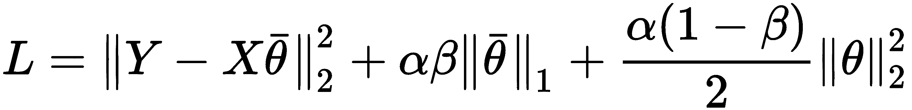

`ElasticNet`类提供了一个实现，其中`alpha`参数与`l1_ratio`(公式 **)** 协同工作。由于*L[1]和*L[2]规范的平衡作用，`ElasticNet`的主要特点是避免选择性排除相关特征。**

在下面的代码片段中，有一个同时使用了`ElasticNet`和`ElasticNetCV`类的示例:

```
from sklearn.linear_model import ElasticNet, ElasticNetCV

en = ElasticNet(alpha=0.001, l1_ratio=0.8, normalize=True)
en_scores = cross_val_score(en, boston.data, boston.target, cv=10)

print(en_scores.mean())
0.324458

encv = ElasticNetCV(alphas=(0.1, 0.01, 0.005, 0.0025, 0.001), l1_ratio=(0.1, 0.25, 0.5, 0.75, 0.8), normalize=True)
encv.fit(boston.data, boston.target)

ElasticNetCV(alphas=(0.1, 0.01, 0.005, 0.0025, 0.001), copy_X=True, cv=None,
       eps=0.001, fit_intercept=True, l1_ratio=(0.1, 0.25, 0.5, 0.75, 0.8),
       max_iter=1000, n_alphas=100, n_jobs=1, normalize=True,
       positive=False, precompute='auto', random_state=None,
       selection='cyclic', tol=0.0001, verbose=0)

print(encv.alpha_)
0.005

print(encv.l1_ratio_)
0.7500
```

正如所料，`ElasticNet`的性能优于 Ridge 和 Lasso，因为它结合了前者的收缩效果和后者的特征选择。然而，由于这两种惩罚的相互作用更难预测，我总是建议用大范围的参数进行网格搜索。必要时，可以通过*将*放大到包含先前选择的参数的范围来重复该过程，从而找到可能的最佳组合。

<title>Robust regression</title>  

# 稳健回归

在本节中，我们将考虑当数据集包含异常值时可以采用的两种解决方案。不幸的是，线性回归对它们非常敏感，因为系数被强制最小化平方误差，因此超平面被强制向离群值移动(这产生更高的误差)。然而，在大多数实际应用中，我们期望有很好的能力来区分属于数据生成过程的点和离群点。本节介绍的算法旨在缓解这一问题。

<title>RANSAC</title>  

# 兰萨克

线性回归的一个常见问题是异常值的存在。普通的最小二乘法会将它们考虑在内，因此结果(就系数而言)会有偏差。下图是这种行为的一个示例:

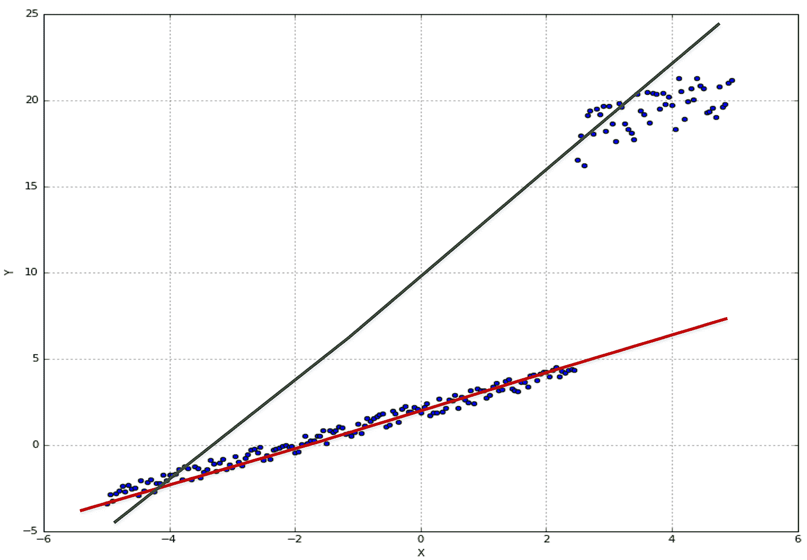

包含异常值的数据集示例

较浅的斜线表示丢弃异常值的可接受回归，而另一条则受异常值影响。RANSAC 提供了一种避免这个问题的有趣方法，它在将数据集分成内点和外点后，通过后续迭代处理每个回归变量。该模型仅使用有效样本进行训练(内部评估或通过可调用的`is_data_valid()`)，并且所有样本都被重新评估，以验证它们是否仍然是内联者或者它们是否已经变成了外联者。在固定数量的迭代之后，或者当达到期望的分数时，该过程结束。

在下面的代码片段中，有一个简单的线性回归示例应用于上图中显示的数据集:

```
from sklearn.linear_model import LinearRegression

lr = LinearRegression(normalize=True)
lr.fit(X.reshape((-1, 1)), Y.reshape((-1, 1)))

print(lr.intercept_)
5.500572

print(lr.coef_)
2.53688672
```

正如想象的那样，由于异常值的存在，斜率很高。得到的回归量是 *y = 5.5 + 2.5x* (比图表中显示的斜率稍小)。现在我们将 RANSAC 与同一个线性回归器一起使用:

```
from sklearn.linear_model import RANSACRegressor

rs = RANSACRegressor(lr)
rs.fit(X.reshape((-1, 1)), Y.reshape((-1, 1)))

print(rs.estimator_.intercept_)
2.03602026

print(es.estimator_.coef_)
0.99545348
```

在这种情况下，回归量大约为 *y = 2 + x* (这是没有异常值的原始干净数据集)。

如果想有进一步的了解，建议访问页面[http://sci kit-learn . org/stable/modules/generated/sk learn . linear _ model。RANSACRegressor.html](http://scikit-learn.org/stable/modules/generated/sklearn.linear_model.RANSACRegressor.html)。有关其他稳健回归技术，请访问[http://sci kit-learn . org/stable/modules/linear _ model . html # robustness-regression-outliers-and-modeling-errors](http://scikit-learn.org/stable/modules/linear_model.html#robustness-regression-outliers-and-modeling-errors)。

<title>Huber regression</title>  

# 胡伯回归

另一种方法基于稍微修改的损失函数，称为 **Huber 损失**(针对单个样本):

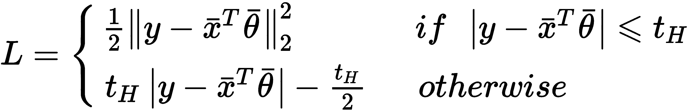

参数 *t [H] 通过这种方式，当点被认为是异常值时，损失的大小相应地改变，从二次行为变成线性行为。以这种方式，它们对全局成本函数的贡献被减少，并且超平面将保持更接近大多数点，即使存在异常值。当然，参数 *t [H]* 必须选择适当，事实上，一个非常小的值(以及一个非常大的值)将使损失函数几乎总是偏好一个度量(二次或线性)，排除由于两个项的共同存在而产生的影响。*

让我们考虑一个由 500 个点和 50 个异常值(非正态分布)组成的简单二维示例:

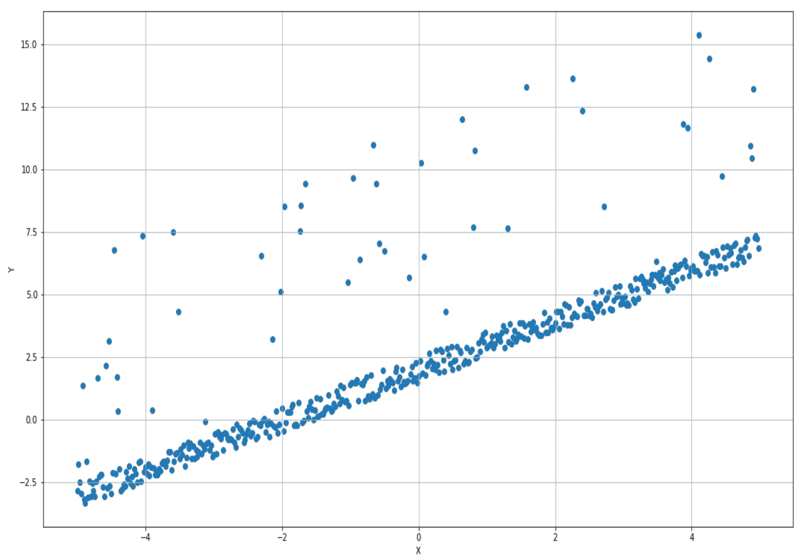

 A dataset with a linear structure and some outliers

数据集的线性部分可以通过 *y = x + 2* 函数成功插值；然而，我们预计异常值的存在会对斜率和截距产生影响。让我们用标准的线性回归来检验我们的假设:

```
from sklearn.linear_model import LinearRegression

lr = LinearRegression(normalize=True)
lr.fit(X.reshape((-1, 1)), Y.reshape((-1, 1)))

print(lr.intercept_)
2.550

print(lr.coef_)
0.978
```

斜率显示最小(可忽略)影响，因为异常值均匀分布在同一侧；然而，截距现在比预期的要高。这显然是由于由异常值确定的较大误差。为了使其最小化，回归器将直线推向异常值，对所有其他样本产生较高的相对误差。事实上，还记得我们期望它们沿着回归线呈高斯分布吗？在这种情况下，它们中的大多数都在线下，并且它们的概率低于最优概率。

现在让我们使用`HuberRegressor`类和一个`epsilon=1.25`参数来重复回归:

```
from sklearn.linear_model import HuberRegressor

hr = HuberRegressor(epsilon=1.25)
hr.fit(X.reshape(-1, 1), Y)

print(hr.intercept_)
2.033

print(hr.coef_)
1.001
```

在这种情况下，插值几乎是完美的，离群值的影响已被过滤掉。我总是建议使用网格搜索来找到最佳的`epsilon`值，其策略可以基于没有异常值的模型的评估(考虑到方差阈值，可以很容易地去除异常值)和基于具有不同参数的 Huber 回归器的一些评估(例如，使用*R²分数)。真实场景通常比前面讨论的例子更复杂；然而，强异常值通常很容易被检测到，并且它们的影响可以被最小化。*

<title>Bayesian regression</title>  

# 贝叶斯回归

在本章的开始，我们讨论了线性回归模型拟合后样本是如何分布的:


显然，高斯本身对于系数的确定方式是*不可知的*，通过采用标准方法，如 OLS 或封闭形式的表达式，我们隐含地只依赖数据集。我们的假设是，我们有足够的样本来正确地表示底层数据生成过程，并且必须以最小化平方误差的方式来选择系数。然而，我们可能对所有参数的分布有一些先验信念(例如，我们可以想象θ [i] 来自高斯分布),我们希望在我们的模型中包含这些信息。正如我们将要在第六章、*中讨论的[朴素贝叶斯和判别分析](99be831f-aab0-4f44-b47c-159405fe5f44.xhtml)*(更多细节，也请参考*掌握机器学习算法*、*博纳科索 G* 。， *Packt Publishing* ， *2018* )，采用贝叶斯框架背后的主要概念是，我们可以推导出基于数据可能性和先验信念的后验分布。

在我们的具体例子中，我们总是假设因变量*y[I]是正态分布的:*

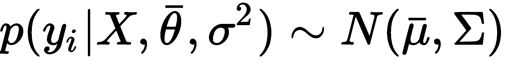

均值向量和协方差矩阵是数据集 *X* 、系数向量 *θ* 和噪声方差的函数。我们的目标是估计参数，考虑它们的先验分布。利用条件概率的规则，我们可以将联合先验概率分布写成两个分布的因子:

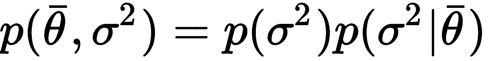

正确分布的选择通常是很重要的，在许多情况下，这样做是为了使问题在封闭形式下易于处理。由于这个主题超出了本书的范围，我们不打算定义所有的细节，但是考虑一下**共轭优先**的概念是有用的。在[第 6 章](https://cdp.packtpub.com/machine_learning_algorithms__second_edition/wp-admin/post.php?post=27&action=edit#post_29)、*朴素贝叶斯和判别分析*、*、*中，一切都会更清楚，但对于没有背景知识的读者来说，展示一下通用贝叶斯公式还是很有帮助的:

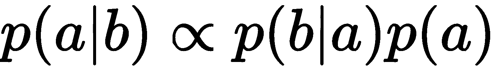

后验概率 *p(a|b)* 与可能性 *p(b|a)* 和先验分布 *p(a)* 成比例(达到归一化因子)。在我们的例子中，术语 *a* 代表参数，而 *b* 是独立变量 *X* 的集合。给定一个可能性 *p(b|a)* ，如果后验分布与先验分布相同，则称先验与其共轭。这个*绝招*可以让我们简化计算，得到闭合形式的表达式。

在我们的具体问题中，让我们考虑一个势 *p(θ|σ ² )* 。可能性*p(Y | X；θ，σ ² )* 是高斯的，并且先验的*p(θ|σ²**)*可以被选择为高斯的(在这种情况下，它与其自身共轭)，因为在 *θ* 中可能性是二次的。主要问题出现在 *p(σ ² )* 。事实上，这一项出现在指数的分母和乘法因子中(总是作为倒数)；因此，先验不可能是高斯的。方差最合适的分布是反伽马分布，其概率密度函数(在支持下，*σ²0*，始终为真)定义如下:

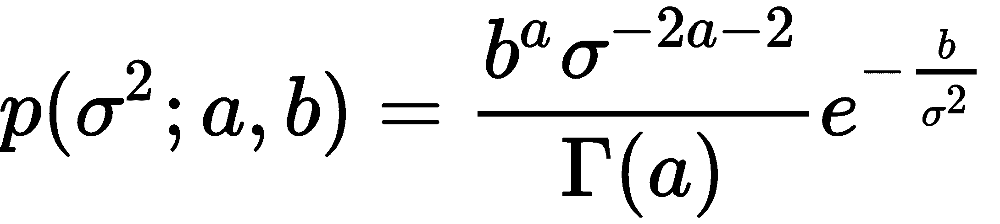

有了这个选择，我们可以得到一个可以分析计算的后验分布。事实上， *σ* 变量既出现在乘法因子中(如 *σ ^(-k)* )，也出现在指数的分母中。或者，也可以考虑方差的倒数，称为*精度*:

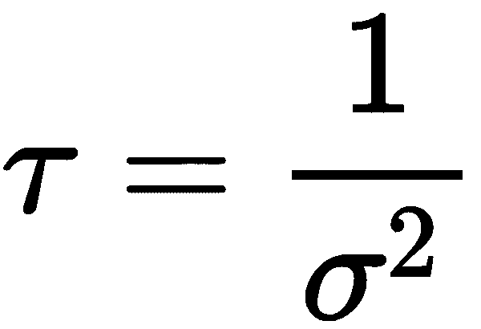

在这种情况下， *τ* 出现在指数的分子处，作为乘法因子，共轭先验是伽马分布。然而，这一选择相当于前一个选择，它只是出于教学目的而被包括在内。

后验概率的一般表达式(不替换单项)是这样的:

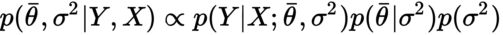

此时，我们如何估计参数呢？在贝叶斯框架中，这可以通过最大化关于所有参数的边际似然 *p(Y|model)* (有时称为**模型证据**)来完成。模型效用变量将可能性和先验分组到一个项中。因此，通过最大化模型证据，我们将寻找允许我们找到最佳描述特定问题的模型的参数，或者其 *p(Y|model)* 是最大值的参数。换句话说，给定为参数选择的可能性和先验，我们希望找到与数据生成过程的距离最小的最佳分布。在下图中，有一个过程的表示，该过程导致给定先验的参数的后验分布:

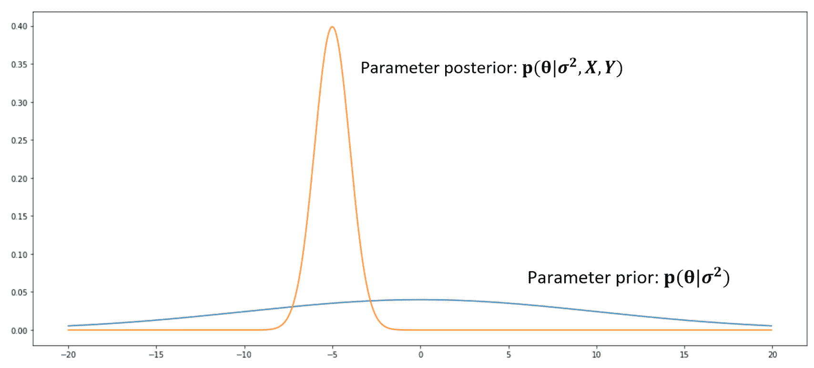

参数的先验分布(非常高的方差)，后验分布(平均值附近的峰值)

通常，先验分布被选择为无信息的或者具有非常高的熵(这种情况可以与适当的共轭先验相容)。这样就没有具体的数值有更高的几率被选中(也就是分布非常平坦)。相反，由于可能性的贡献，我们预期一个非常尖峰的后验概率。正如 D .麦凯(在*贝叶斯插值*，*麦凯 D* 中所指出的。 *J* 。 *C* 。，*神经计算*， *1991* ，这个过程类似于**奥卡姆剃刀**概念，因为它排除了所有那些更不确定的假设，只关注最简单的(也是最有可能的)假设。

这种方法在很多情况下是非常有效的(特别是当我们想要用新的样本更新模型的时候)，但是它对于推理部分需要更复杂的计算。事实上，为了计算输出的概率，我们需要对所有可能的值 *θ* 和 *σ* *²* 进行积分，考虑独立变量 *X* 的当前数据集:

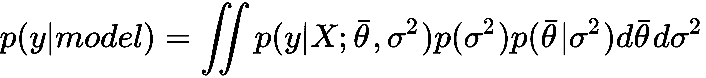

通过之前所做的选择，该二重积分可以以封闭形式求解，但是其值取决于伽马函数*γ(x)*并且需要一些行列式的计算。因此，它显然比本章介绍的所有其他解决方案在计算上更昂贵。

scikit-learn 库通过`BayesianRidge`类实现了基于岭惩罚的贝叶斯回归。在下一个示例中，我们将把它用于波士顿数据集:

```
from sklearn.linear_model import BayesianRidge

br = BayesianRidge(n_iter=1000)
br.fit(X_train, Y_train)

print(br.score(X_test, Y_test))
0.702
```

`n_iter`参数允许我们指定参数估计的最大迭代次数。固定训练/测试分割的分数与用标准线性回归获得的分数相当。现在让我们计算平均*CV R²分数:*

```
r2_scores = cross_val_score(br, boston.data, boston.target, cv=10, scoring='r2')

print(r2_scores.mean())
0.257
```

该值略高于用线性回归获得的值(但仍然很小)。原因是由于脊罚的存在和参数的优越适应性。作为练习，我邀请读者用其他数据集来测试这个模型(与标准的岭回归相比较)。scikit-learn 提供了一些可能性，但一个非常有用的资源是 UCI 机器学习知识库([https://archive.ics.uci.edu/ml/datasets.html](https://archive.ics.uci.edu/ml/datasets.html))，在那里可以找到针对任何类型问题的不同复杂程度的免费数据集。

<title>Polynomial regression</title>  

# 多项式回归

多项式回归是一种基于技巧的技术，即使数据集具有很强的非线性，该技巧也允许使用线性模型。想法是添加一些从现有变量计算的额外变量，并且只使用(在这种情况下)多项式组合:

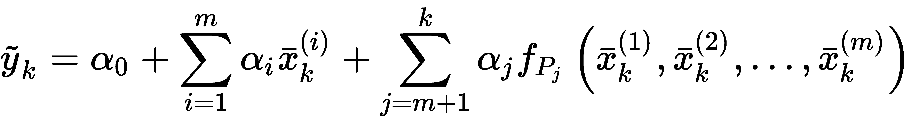

在前面的表达式中，每个*f[Pj]()*都是单个特征的多项式函数。例如，对于两个变量，可以通过将初始向量(其维数等于 *m* )转换为另一个具有更高维度的向量(其维数为 *k* > *m* )来扩展到二次问题:

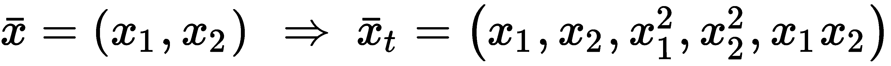

在这种情况下，模型保持外部线性，但它可以捕捉内部非线性。为了展示 scikit-learn 如何实现这一技术，让我们考虑下图中显示的数据集:

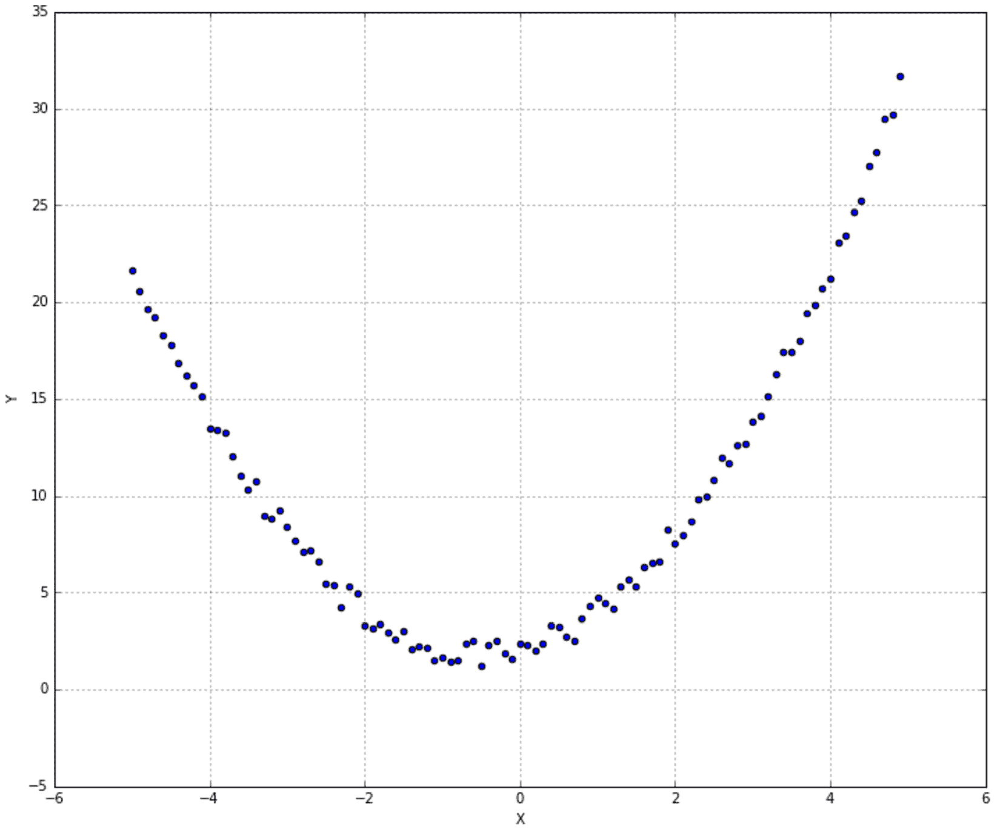

可使用抛物线回归进行有效插值的非线性数据集示例

这显然是一个非线性数据集，任何仅基于原始二维点的线性回归都无法捕捉到动态。为了尝试这一点，我们可以训练一个简单的模型(在同一个数据集上测试):

```
from sklearn.linear_model import LinearRegression

lr = LinearRegression(normalize=True)
lr.fit(X.reshape((-1, 1)), Y.reshape((-1, 1)))

print(lr.score(X.reshape((-1, 1)), Y.reshape((-1, 1))))
0.10888218817034558
```

精度极差，不出所料。然而，看着图表，我们可能会认为二次回归可以很容易地解决这个问题。scikit-learn 库提供了`PolynomialFeatures`类，它根据`degree`参数将原始集合转换为扩展集合:

```
from sklearn.preprocessing import PolynomialFeatures

pf = PolynomialFeatures(degree=2)
Xp = pf.fit_transform(X.reshape(-1, 1))

print(Xp.shape)
(100L, 3L)
```

不出所料，旧的*x[1]坐标已经被一个三联体取代，其中也包含了二次项和混合项。此时，可以训练线性回归模型:*

```
lr.fit(Xp, Y.reshape((-1, 1)))

print(lr.score(Xp, Y.reshape((-1, 1))))
0.99692778265941961
```

分数要高得多，我们付出的唯一代价是功能的增加。总的来说，这是可行的；然而，如果这个数字超过了一个可接受的阈值，尝试降维是有用的，或者作为一个极端的解决方案，转向非线性模型(如**支持向量机-核**(**SVM-核**))。通常，一个好的方法是使用`SelectFromModel`类让 scikit-learn 根据它们的重要性选择最佳特性。事实上，当特征的数量增加时，所有特征具有相同重要性的概率降低。这是主要趋势和次要趋势相互关联或共同存在的结果，它们就像噪音一样，没有改变超平面斜率的感知能力。此外，当使用多项式展开时，一些弱特征(不能用于线性分离)被它们的函数代替，因此强特征的实际数量减少。

在下面的代码片段中，有一个先前使用的波士顿数据集的示例。`threshold`参数用于设置最低重要性级别。如果缺少，该类将尝试通过移除尽可能多的要素来最大化效率:

```
from sklearn.feature_selection import SelectFromModel

boston = load_boston()

pf = PolynomialFeatures(degree=2)
Xp = pf.fit_transform(boston.data)

print(Xp.shape)
(506L, 105L)

lr = LinearRegression(normalize=True)
lr.fit(Xp, boston.target)

print(lr.score(Xp, boston.target))
0.91795268869997404

sm = SelectFromModel(lr, threshold=10)
Xt = sm.fit_transform(Xp, boston.target)

print(sm.estimator_.score(Xp, boston.target))
0.91795268869997404

print(Xt.shape)
(506L, 8L)
```

仅选择最佳特征(阈值设置为`10`)后，分数保持大致相同，维度减少一致(仅`8`特征被认为对预测重要)。而且总体 *R* ^(*2*) 分数(不是 CV one)现在还是比较高的。我邀请读者测试一下简历的分数，看看这个解决方案是否可以接受。在后一种情况下，使用更高的学位是否可能获得更好的结果？

如果在任何其他处理步骤之后，有必要返回到原始数据集，可以使用逆变换:

```
Xo = sm.inverse_transform(Xt)

print(Xo.shape)
(506L, 105L)
```

<title>Isotonic regression</title>  

# 保序回归

有些情况下，我们需要为可能出现低水平振荡(如噪声)的非递减点数据集找到一个回归量。线性回归可以很容易地获得非常高的分数(考虑到斜率大约是常数)，但它的工作方式就像一个降噪器，产生的线无法捕捉我们想要建模的内部动态。对于这些情况，scikit-learn 提供了`IsotonicRegression`类，它产生一个分段插值函数，最大限度地减少了以下泛函:

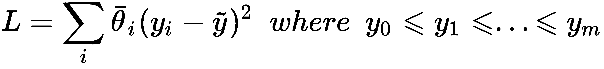

接下来提供了一个示例(带有玩具数据集):

```
import numpy as np

X = np.arange(-5, 5, 0.1)
Y = X + np.random.uniform(-0.5, 1, size=X.shape)
```

下图显示了数据集的绘图。正如大家所见，可以通过线性回归器轻松建模，但如果没有高度非线性函数，则很难捕捉斜率的轻微(和局部)变化:

[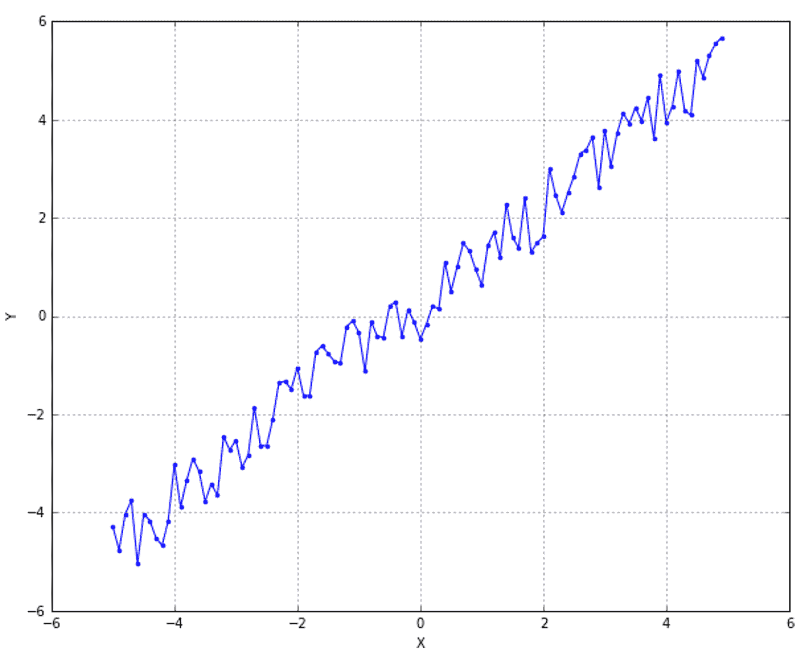]

等渗数据集的示例

`IsotonicRegression`类需要知道 *y [min]* 和 *y [max]* (分别对应损失函数中的 *y* [*0*] 和 *y* [*n*] 变量)。在这种情况下，我们选择施加由`−6`和`10`限定的范围:

```
from sklearn.isotonic import IsotonicRegression

ir = IsotonicRegression(-6, 10)
Yi = ir.fit_transform(X, Y)
```

结果通过三个实例变量提供:

```
print(ir.X_min_)
-5.0

print(ir.X_max_)
4.8999999999999648

print(ir.f_)
<scipy.interpolate.interpolate.interp1d at 0x126edef8>
```

最后一个，`(ir.f_)`，是可以在域[ *x [最小]* ， *x [最大]* ]中求值的插值函数，例如:

```
print(ir.f_(2))
1.7294334618146134
```

下图显示了此函数(绿色实线)以及原始数据集的曲线图:

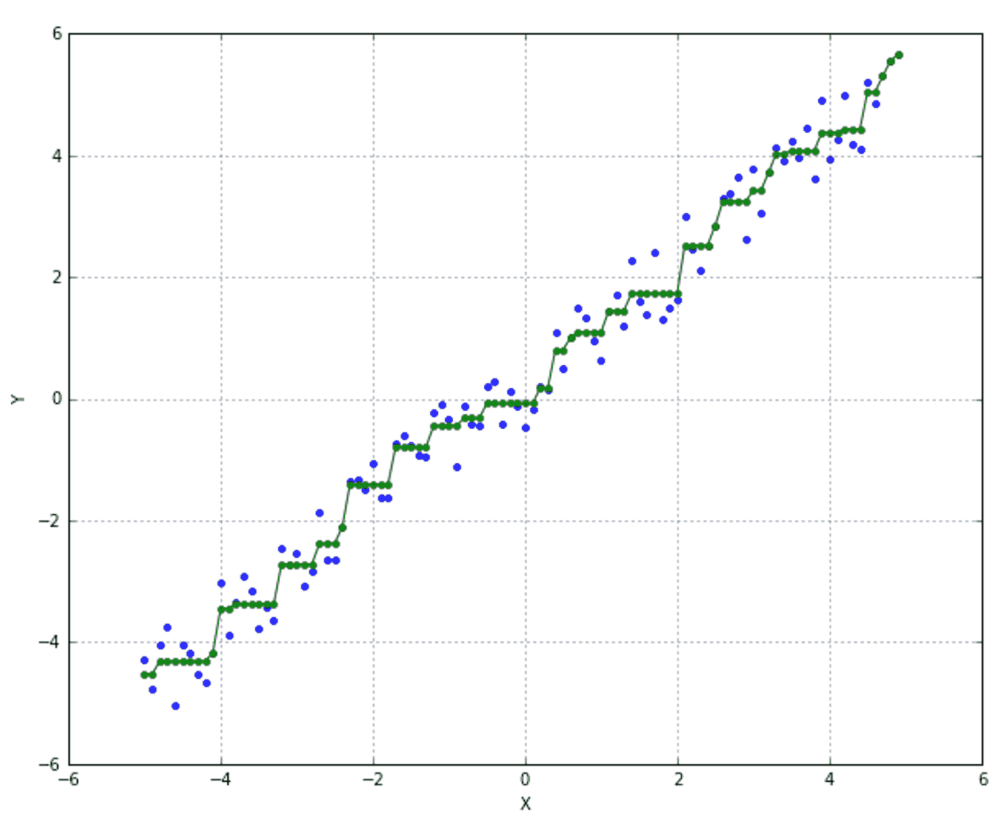

使用保序回归进行插值

有关 SciPy 插值的更多信息，请访问[https://docs . SciPy . org/doc/SciPy-0 . 18 . 1/reference/interpolate . html](https://docs.scipy.org/doc/scipy-0.18.1/reference/interpolate.html)。

<title>Summary</title>  

# 摘要

在本章中，我们介绍了线性模型的重要概念，并描述了线性回归的工作原理。特别是，我们把重点放在了基本模型及其主要变体上:Lasso、Ridge 和 ElasticNet。它们不修改内部动态，但作为权重的归一化器，以避免数据集包含未缩放样本时的常见问题。这些处罚有其独特之处。当 Lasso 促进稀疏性时，Ridge 试图找到一个最小值，其约束条件是权重必须位于以原点为中心的圆内(其半径被参数化以增加/减少归一化强度)。ElasticNet 是这两种技术的混合，它试图在权重足够小的地方找到一个最小值，并实现一定程度的稀疏性。

我们还讨论了高级技术，如 RANSAC，它使我们能够以非常稳健的方式处理异常值，以及多项式回归，这是一种非常智能的方法，可以在我们的模型中包括虚拟非线性要素，并继续以相同的线性方法处理它们。这样，就可以创建另一个数据集，包含原始列以及它们的多项式组合。这个新数据集可用于训练线性回归模型，然后可以只选择那些有助于实现良好性能的特征。我们看到的最后一种方法是保序回归，当要插值的函数从不减少时，这种方法特别有用。此外，它还能捕捉到被一般线性回归拉平的小波动。

在下一章，[第 5 章](12eae5a4-4216-4bb2-a195-337a64743f01.xhtml)，*线性分类算法，*我们将讨论一些用于分类的线性模型。特别是，我们将把注意力集中在逻辑回归和 SGD 算法上。此外，我们将引入一些有用的度量来评估分类系统的准确性，以及一种自动找到最佳超参数的强大技术。