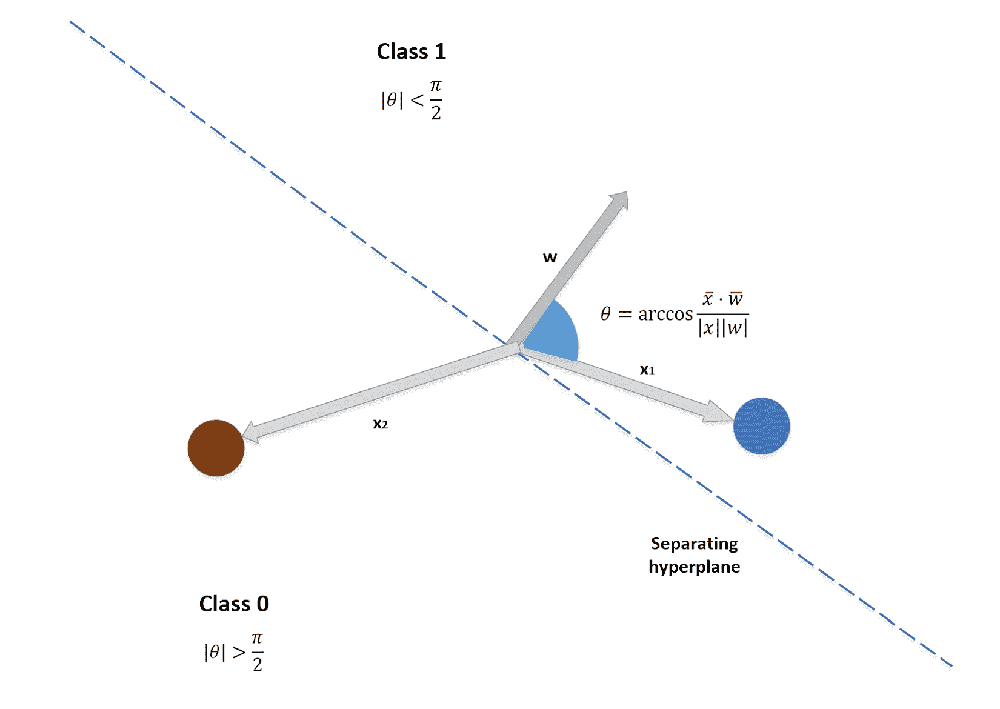

# 线性分类算法

本章从分析线性分类问题开始，特别关注**逻辑回归**(尽管它的名字是分类算法)和**随机梯度下降** ( **SGD** )方法。即使这些策略看起来过于简单，它们仍然是许多分类任务的主要选择。

说起来，记住一个很重要的哲学原理还是很有用的:**奥卡姆剃刀**。

在我们的上下文中，它指出第一选择必须总是最简单的，只有当它不适合时，才有必要转向更复杂的模型。在本章的第二部分，我们将讨论一些在评估分类任务时有用的通用指标。它们并不局限于线性模型，所以我们在讨论不同的策略时也会用到它们。

特别是，我们将讨论以下内容:

*   线性分类问题的一般结构
*   逻辑回归(有和没有正则化)
*   SGD 算法和感知器
*   被动攻击算法
*   最优超参数的网格搜索
*   最重要的分类指标
*   **接收机工作特性** ( **ROC** )曲线


# 线性分类

让我们考虑一个具有两个类的一般线性分类问题。在下图中，有一个例子:


线性分类问题的二维情形

我们的目标是找到一个最优的超平面，将这两个类分开。在多类问题中，通常采用一对一策略，因此讨论只能集中在二元分类上。假设我们有以下由 *n* *m* 维样本组成的数据集:


此数据集与以下目标集相关联:


一般有两个等价的选项；二进制和双极性输出以及不同的算法都是基于前者或后者，没有任何实质性的区别。通常，这种选择是为了简化计算，对结果没有影响。

我们现在可以定义一个由 *m* 个连续分量组成的权重向量:


我们还可以定义数量， *z* :


如果 *x* 是变量， *z* 就是超平面方程确定的值。因此，在双极性场景中，如果已经确定的系数集合 *w* 是正确的，则发生以下情况:


使用二进制输出时，通常根据阈值做出决定。例如，如果输出 *z ∈ (0，1)* ，先前的条件变成如下:


现在必须想办法优化 *w* 来减少分类误差。如果这样的组合存在(有一定的误差阈值)，我们说我们的问题是**线性可分**。另一方面，当不可能找到线性分类器时，问题被定义为**非线性可分**。

属于第二类的一个非常简单但著名的例子由`XOR`逻辑运算符给出:


表示二进制异或非线性可分问题的模式

如您所见，任何一行都会包含错误的样本。因此，为了解决这个问题，有必要涉及包含高阶曲线(例如，两个抛物线)的非线性技术。然而，在许多实际情况下，在接受可容忍的分类错误的条件下，也可以使用线性技术(通常更简单、更快速)来解决非线性问题。


# 逻辑回归

即使称为回归，这也是一种基于样本属于某一类的概率的分类方法。由于我们的概率在 *ℜ* 中必须是连续的，并且在 *(0，1)* 之间有界，所以有必要引入一个阈值函数来过滤 *z* 项。就像线性回归一样，我们可以通过在每个输入向量的末尾添加一个 *1* 元素来去掉与截距相对应的额外参数:

[]

这样，我们可以考虑包含 *m + 1* 个元素的单个参数向量 *θ* ，并用点积计算 *z* 值:


现在，假设我们引入一个元素属于类 1 的概率 *p(x [i] )* 。显然，相同的元素以概率 *1 - p(x [i] )* 属于 0 类。逻辑回归主要基于使用指数函数对属于类别 *1* 的概率建模的思想:


这个函数在 *ℜ* 上是连续可微的，总是正的，当自变量 *x → ∞时*趋于无穷大。这些条件是正确表示赔率的必要条件，因为当 *p → 0* 、*赔率→ 0* 时，但当 *p → 1* 、*赔率→ ∞时*。如果我们取 logit(它是赔率的自然对数)，我们得到一个关于*z[I]结构的表达式:*


在 *ℜ* 上有一个支撑，介于 *0* 和 *1* 之间，并且满足上式的函数是 sigmoid(或 logistic)函数:


下图显示了该函数的部分曲线图:


sigmoid 函数的绘图；当 x → -∞时σ(x) → 0，当 x → ∞时σ(x) → 1

可以看出，该函数在纵坐标 *0.5* 处与 *x=0* 相交，对于 *x < 0* 与 *y > 0.5* 相交，对于 *x > 0* 相交。此外，可以对每一个 *x* 计算它，并且它在 *0* 附近几乎是线性的(当使用收缩时，这个元素非常有用，因为当 *x* 接近 *0* 时，函数更加敏感)。因此，如果我们使用 sigmoid 对概率分布进行建模，我们将获得以下结果:

 

所以，我们可以定义一个样本属于一个类的概率(从现在开始，我们将称它们为 *0* 和 *1* )如下:


此时，在给定目标输出类的情况下，找到最佳参数相当于最大化对数似然:


每个事件都基于伯努利分布；因此，使用指示符号，优化问题可以表示为损失函数的最小化:


如果 *y=0* ，第一项变为空，第二项变为 *log(1-x)* ，这是类 *0* 的对数概率。另一方面，如果 *y=1* ，第二项是 *0* ，第一项代表 *x* 的对数概率。这样，两种情况都嵌入在一个表达式中。可以通过计算相对于参数的梯度 *∇L* 并将其设置为等于 *0* 来实现优化。完整的推导并不复杂，但需要几个操作；因此，它留给读者作为练习。

从信息论的角度来说，它等价于最小化目标分布 *p(x)* 和近似分布 *q(x)* 之间的交叉熵:


特别是，如果采用*log[2]，该函数表示用预测分布编码原始分布所需的额外比特数。很明显当 *L* *= 0* 时，两个分布相等。因此，当目标分布是分类的时，最小化交叉熵是优化预测误差的优雅方式。*


# 实施和优化

scikit-learn 实现了`LogisticRegression`类，可以使用优化的算法解决这个问题。让我们考虑一个由 500 个样本组成的玩具数据集:


用于测试逻辑回归的数据集

圆点属于类别 **0** ，而三角形属于类别 **1** 。为了立即测试我们分类的准确性，将数据集分成训练集和测试集是有用的:

```
from sklearn.model_selection import train_test_split

X_train, X_test, Y_train, Y_test = train_test_split(X, Y, test_size=0.25)
```

现在，我们可以使用这些默认参数来训练模型:

```
from sklearn.linear_model import LogisticRegression

lr = LogisticRegression()
lr.fit(X_train, Y_train)

LogisticRegression(C=1.0, class_weight=None, dual=False, fit_intercept=True,
          intercept_scaling=1, max_iter=100, multi_class='ovr', n_jobs=1,
          penalty='l2', random_state=None, solver='liblinear', tol=0.0001,
          verbose=0, warm_start=False)

print(lr.score(X_test, Y_test))
0.95199999999999996
```

也可以通过交叉验证来检查质量(如线性回归):

```
from sklearn.model_selection import cross_val_score

print(cross_val_score(lr, X, Y, scoring='accuracy', cv=10))
array([ 0.96078431,  0.92156863,  0.96      ,  0.98      ,  0.96      ,
        0.98      ,  0.96      ,  0.96      ,  0.91836735,  0.97959184])

```

分类任务在没有任何进一步操作的情况下成功完成(也通过交叉验证进行了确认),并且还可以检查生成的超平面参数:

```
print(lr.intercept_)
-0.64154943

print(lr.coef_)
[ 0.34417875,  3.89362924]
```

在下图中，有一个这个超平面的表示(一条线)，在这里可以看到分类是如何工作的，以及哪些样本被错误分类。考虑到两个块的局部密度，很容易看出对于异常值和一些边界样本发生了错误分类。后者可以通过调整超参数来控制，即使经常需要折衷。例如，如果我们想在分隔线上包含四个右边的点，这可能会排除右边部分的一些元素。稍后，我们将看到如何找到最优解。然而，当一个线性分类器可以很容易地找到一个分离超平面(即使有几个离群点)，我们可以说这个问题是线性建模的；否则，必须考虑更复杂的非线性技术:


分隔线和分类区域

就像线性回归一样，可以对权重施加范数条件。具体来说，实际功能是这样的:


行为与[第 4 章](220f66cf-aeee-4e3e-8d1c-cda7e74d814b.xhtml)、*回归算法*中的解释相同。两者都产生收缩，但*L[1]力量稀疏。这可以使用参数罚值(其值可以是*L[1]或 *L [2]* )和 *C* 来控制，这是逆正则化因子( *α ^(-1)* )，因此较大的值会降低强度，而较小的值(特别是小于 *1* 的值)会迫使权重更靠近原点。而且， *L [1]* 会优先选择顶点(其中除了一个组件外其他都为空)，所以在收缩后应用`SelectFromModel`来优化实际特征是个不错的主意。**


# 随机梯度下降算法

在讨论了逻辑回归的基础之后，介绍一下`SGDClassifier`类是很有用的，它实现了一个非常通用的算法，可以应用于几种不同的损失函数。SGD 背后的思想是通过迭代基于梯度的权重更新来最小化成本函数:


然而，更新程序不是考虑整个数据集，而是应用于从中随机抽取的批次(因此，它通常也被称为**小型批次梯度下降**)。在前面的公式中， *L* 是我们希望最小化的关于参数(如在第 2 章、*机器学习中的重要元素*中所讨论的)的成本函数，而*γ*(【scikit-learn 中的`eta0`)是学习速率，一个在学习过程中可以是常数或衰减的参数。`learning_rate`超参数也可以保留其默认值(`optimal`)，根据正则化因子在内部计算。下图是该流程的示意图:


梯度下降的例子；步长与学习速率γ成比例

当权重停止修改或者它们的变化保持在选定的阈值之下时，该过程应该结束。这意味着已经达到了最佳值。在最简单的场景中，我们可以确定 *θ [opt]* 是全局最小值；然而，在更复杂的模型中(例如，深度神经网络)，次优平衡点的风险非常高。在这些情况下，必须实施更复杂的策略以达到最大精度(有关优化算法的更多详细信息，请阅读*掌握机器学习算法*、 *Bonaccorso G* 的*第 9 章*。、 *Packt 发布*、 *2018* )。scikit-learn 实现使用`n_iter`参数来定义期望迭代的最大数量和允许指定参数修改率阈值的`tol`容差。

有许多可能的损失函数，但在本章中我们只考虑 log(对应于交叉熵)和感知器。其他替代方案(如铰链损耗)将在下一章讨论。前者实现了逻辑回归，而后者(也可用作`Perceptron`自治类)是最简单的神经网络，由单层权重 *θ* 、一个称为*偏差* ( *b* )的固定常数和一个二进制输出函数组成:


输出函数(分为两类)如下:


感知器和逻辑回归之间的区别是输出函数(符号对 sigmoid)和训练模型(带有损失函数)。事实上，感知器通常是通过最小化实际值和预测值之间的均方距离来训练的:


就像任何其他线性分类器一样，感知器不能解决复杂的非线性问题。因此，我们的示例将使用内置的`make_classification`函数生成:

```
from sklearn.datasets import make_classification

nb_samples = 500

X, Y = make_classification(n_samples=nb_samples, n_features=2, n_informative=2, n_redundant=0, n_clusters_per_class=1)
```

这样，我们可以将生成的`500`样本分成两类:


用于测试感知器的二维数据集

这个问题，在一个确定的精度阈值下(即，假设一小部分样本总是被错误分类)，可以线性解决，所以我们的期望对于感知器和逻辑回归是等价的。在后一种情况下，训练策略集中于最大化概率分布的可能性。考虑到数据集，红色样本属于类 0 的概率必须大于 0.5(当 *z = 0* 时等于 0.5，因此当点位于分离超平面上时)，反之亦然。另一方面，感知器会根据类别调整超平面，使样本和权重之间的点积为正或负。在下图中，有一个感知器的几何表示(其中偏差为 0):



学习阶段调整分离超平面的几何表示

权重向量与**分离超平面**正交，从而可以仅考虑点积的符号来进行区分。有`perceptron`损失(无*L[1]/*L[2]*约束)的 SGD 示例如下:*

```
from sklearn.linear_model import SGDClassifier

sgd = SGDClassifier(loss='perceptron', learning_rate='optimal', n_iter=10)

cross_val_score(sgd, X, Y, scoring='accuracy', cv=10).mean()
0.98595918367346935
```

直接使用`Perceptron`类可以获得相同的结果:

```
from sklearn.linear_model import Perceptron

perc = Perceptron(n_iter=10)

cross_val_score(perc, X, Y, scoring='accuracy', cv=10).mean()
0.98195918367346935
```

感知器是第一个神经网络，由 F. Rosenblatt 在 1957 年提出。然而，它被许多研究者(尤其是马文·明斯基)批评，因为它不能解决`XOR`问题。我邀请读者在这个简单的数据集(由四个二维值组成)上测试这个模型，以更好地理解线性可分性的限制。


# 被动攻击算法

在本节中，我们将分析一种可有效用于在线线性分类的算法。事实上，其他方法的一个问题是，当收集新样本时，整个模型必须重新训练。Crammer 等人提出的主要思想(在*在线被动攻击算法*， *Crammer K* )。， *Dekel O* 。，*克谢特 J* 。，*沙莱夫-施瓦兹 S* 。，*歌手 Y* 。，*Journal of Machine Learning Research 7(2006)551–585*)是增量地训练模型，只允许在需要时修改参数，同时丢弃所有不改变平衡的更新。在最初的论文中，提出了三种变体。在这个描述中，我们考虑的是一个叫做 *PA-II* (这是最灵活的)。

为简单起见，在本描述中，我们假设双极性输出 *(-1，+1)；*然而，对标记没有特别的限制(在前述论文中，讨论了一些更复杂的方法；但是，总的逻辑不变)。该算法基于特定损失函数的最小化(在这种情况下，我们只考虑单个值；因此，我们采用命名惯例*损失*而不是*成本*)称为铰链(我们将在讨论 SVM 时重用它):


值 *z [i]* 是参数向量 *θ* 和样本*x[I]*之间的点积，所以可以是正的，空的，也可以是负的。分类器的实际输出如下获得:


我们假设期望类是*y[I]=+1；*因此，每当 *z [i] ≥ 0* 时，正确的分类发生(习惯上，零被认为是 *+1* 类的一部分)。在这种情况下，当*y[I]z[I]≥1*， *L = 0* (对应高置信度的匹配)，而*L = 1-y[I]z[I]*(即 *0 < L < 1* )分类正确但置信度低(a 另一方面，如果*y[I]**=-1*和 *z [i] ≥ 0* ，当*y[I]z[I]≥0*， *L = 1 - y [i] z* [因此，我们的目标始终是最小化损失函数，以便获得高置信度的正确预测。正如我们将在[第 7 章](f0008ecc-15b7-4f9b-8576-05e1d4d12ecf.xhtml)、*支持向量机*中看到的，该策略相当于搜索一个分离超平面，使得属于不同类别的两个最近点之间的距离大于一个最小阈值(由条件*y[I]z[I]= 1*满足)。]

该算法处理一系列假设不同时出现的配对 *(x [i] ，y [i] )* 。因此，从随机或空参数向量*θ[0]开始，单步的更新规则如下:*


不是强加 *L = 0* ，这可能导致过于严格的分类，而是采用松弛变量 *ζ* (使得 *L ≤ ζ* )。通过这个技巧，该模型变得更加灵活，并且即使属于一个类的一些样本位于另一个类的空间中，也可以收敛。现在让我们分析规则是如何工作的(为简单起见，设置 *ζ = 0* )。如果*(θ[I]^Tx[I])= y[I]*，分类正确(置信度高)，损失函数为零，最优新参数向量为 *θ [i]* 。这意味着不需要改变，算法保持被动(当分类正确并且 *L > 0* 时，行为类似于错误分类所采用的行为，具有中等效果)。

相反，如果*(θ**[I]^Tx[I])≠y[I]*(例如，假设 *y [i] = +1* )，则发生了错误分类，并且 *x [i] 之间的角度 *γ* 下图显示了这种情况:*


样本分类错误(y [i] = +1，γ > 90)

在前一种情况下，问题的解是在损失函数最小的条件下，尽可能接近 *θ [i，]* 的新的参数向量。由于这个特定的原因，该算法被定义为积极的。下一个参数向量 *θ [i+1]* 的研究受到两个条件的约束:第一个是它与前一个值的接近程度(显然我们不想完全丢弃已经获得的知识)，第二个是 *L* 的最小化。松弛变量 *ζ* 的引入具有缓解效果，可通过选择参数*α*(scikit-learn 中的`C`)的值进行调节。小值( *α < < 1* )对应于与没有松弛变量的情况非常相似的情况。相反，较大的正值通过减少施加在损失函数上的约束的大小和增加参数向量的长度来增加积极性。因此，问题可以更容易地解决，而不会出现类别之间的较大分离(对应于 *L = 0* ，因此，会出现部分类别重叠的容差)以及*θ[I+1]的幅度的突然变化。更新过程如下图所示:*


错误分类后计算θ[I+1](y[I]=+1)

几何上，前一种情况的更新规则对应于旋转 *θ，*直到角度 *γ* 变得小于 90°(因此点积变为正)。在松弛变量和大的 *α* 的情况下，新的参数向量 *θ [i+1]* 将被强制接近 *x [i]* 并且其幅度被放大(然而，整体动态保持不变)。这可能导致类的部分重叠(这是一种非常常见的情况)，但也会降低对噪声的鲁棒性。事实上，一个强异常值可以破坏模型的稳定性，但同时它的影响可以通过使用几个正常样本来迅速减轻。

通过一些数学运算，可以解决封闭形式的优化问题:


该公式简化了计算，提高了算法速度。如果*x[I]∈ℜ^m*，由于点积和范数，算法的运算时间大约为 *O(m ² )* 。但是考虑到现代框架(比如 NumPy)的向量化特性，实际的计算复杂度几乎是常数。

为了测试这个算法，我们将使用 Iris 数据集的`PassiveAggressiveClassifier`类。想法是从使用 66%的训练样本(启动集)的初始拟合开始，并继续使用剩余的样本，在每个增量步骤评估测试集的准确性:

```
from sklearn.datasets import load_iris
from sklearn.preprocessing import StandardScaler
from sklearn.model_selection import train_test_split

iris = load_iris()

ss = StandardScaler()

X = ss.fit_transform(iris['data'])
Y = iris['target']

X_train, X_test, Y_train, Y_test = train_test_split(X, Y, test_size=0.3, random_state=1000)

nb_initial_samples = int(X_train.shape[0] / 1.5)
```

我们对数据集进行了缩放，因为这种算法对量值差异非常敏感；因此，最好有一个单位方差和一个零均值。此时，我们可以实例化模型并开始初始训练:

```
from sklearn.linear_model import PassiveAggressiveClassifier

pac = PassiveAggressiveClassifier(C=0.05, loss='squared_hinge', max_iter=2000, random_state=1000)
pac.fit(X_train[0:nb_initial_samples], Y_train[0:nb_initial_samples])
```

我们选择通过设置一个小的`C`(默认值为`1.0`)来降低攻击性。此外，我们已经指定了`loss='squared_hinge'`，它对应于之前定义的`loss`函数(PA-II)和使用 SGD 优化方法时的最大迭代次数`max_iter=2000`。一旦用初始数量的样本对模型进行了训练，我们就可以使用`partial_fit()`方法逐步进行，该方法也需要(至少对于第一次调用)类标签的数组(通过`classes`参数):

```
import numpy as np

validation_accuracies = []

for (x, y) in zip(X_train[nb_initial_samples:], Y_train[nb_initial_samples:]):
    pac.partial_fit(x.reshape(1, -1), y.ravel(), classes=np.unique(iris['target']))
    validation_accuracies.append(pac.score(X_test, Y_test))
```

在每一次迭代中，我们都使用测试集来计算验证的准确性。最终曲线如下图所示:


增量样本部分拟合后的验证准确性

正如可能看到的，新的样本不会改变现有的平衡，振荡总是非常小，平均精度约为 87%。我邀请读者用不同的数据集、更高的`C`值和更小的启动集来测试该算法。


# 被动-主动回归

我们在第四章中讨论了最常见的回归算法，*回归算法；然而，被动-主动策略也可以用来获得有效的逐步回归算法。我们不打算讨论所有的理论细节(可以在上述论文中找到)，但介绍 *ε不敏感*损耗是有帮助的:*


这个损失函数类似于标准的铰链损失，但它被设计成处理连续数据。参数 *ε* 的作用是允许预测误差的低容差。事实上，以下条件成立:


在第一种情况下，预测误差太高，损失函数为正，无法强制调整(激进行为)。在第二种情况下，误差是可容忍的，而损失函数被强制为零(被动行为)。参数的更新规则类似于分类规则:


考虑到线性回归和被动-主动分类的一般逻辑，就不难理解，当一个新的样本出现时，算法的目标是找到新的参数向量*θ[I+1]*；才 *L > 0* (当 *L = 0* ，*θ[I+1]=θ[I]*)。在这种情况下，在将预测误差降低到阈值 *ε* 以下的条件下， *θ [i+1]* 将被选择为尽可能接近 *θ [i]* 。

为了测试这种方法，我们将使用`5`特征和`300`样本创建一个合成回归数据集:

```
from sklearn.datasets import make_regression

nb_samples = 300

X, Y = make_regression(n_samples=nb_samples, n_features=5, random_state=1000)
```

现在，我们可以实例化`PassiveAggressiveRegressor`类，设置`C = 0.01`(我们希望避免过度正则化，因为任务非常容易)；`epsilon = 0.001`(更新的门槛)；`loss='squared_epsilon_insensitive'`，对应于 *ε不敏感的*铰链损耗，其行为类似于 PA-II 分类变体；还有`max_iter = 2000`。然而，在这种情况下，我们使用`partial_fit()`直接拟合模型，并在每次更新后测量误差:

```
from sklearn.linear_model import PassiveAggressiveRegressor

par = PassiveAggressiveRegressor(C=0.01, loss='squared_epsilon_insensitive', epsilon=0.001, max_iter=2000, random_state=1000)

squared_errors = []

for (x, y) in zip(X, Y):
    par.partial_fit(x.reshape(1, -1), y.ravel())
    y_pred = par.predict(x.reshape(1, -1))
    squared_errors.append(np.power(y_pred - y, 2))
```

下图显示了误差平方图:


每次被动-主动更新后的平方误差

刚开始算法不确定，有些修正被后续的抵消；然而，在大约 **100 个**样本之后，误差下降到大约零，并保持恒定，直到最后一个样本。有趣的是，与标准线性回归相反，在这种情况下，当新数据点改变现有趋势时，该算法能够改变插值函数(无需已经获得的知识)。不幸的是，这种灵活性必须以振荡阶段和第二稳态之间的延迟为代价，由于之前的趋势，第二稳态比第一稳态更嘈杂。例如，我们可以考虑这个数据集:

```
import numpy as np

from sklearn.datasets import make_regression

nb_samples = 500

X1, Y1 = make_regression(n_samples=nb_samples, n_features=5, random_state=1000)
X2, Y2 = make_regression(n_samples=nb_samples, n_features=5, random_state=1000)

X2 += np.max(X1)
Y2 += 0.5

X = np.concatenate((X1, X2))
Y = np.concatenate((Y1, Y2))
```

第一个`500`样本作为基本回归集生成。接下来的每一个都通过添加`0.5`来垂直移动。如果我们重复前面的练习，我们会得到下面的平方误差图:


在 500 个样本后发生突变的回归中，每次被动-主动更新后的平方误差

第一部分和预期完全一样。然而，当 501 ^(st) 样本出现时，之前的模型无法正确预测。所有后续样本迫使模型重新调整其参数；但是，由于被动-主动策略是有状态的，第一个样本的影响会继续影响结果。另一方面，使用线性回归无法轻松解决此类问题，因为第二个数据集中的步长需要调整系数和截距。显然，这种修改对性能有负面影响。此外，相对于以前的知识，被动攻击算法往往是保守的 T42，一旦他们学会了长期的依赖性，他们几乎无法完全忘记它。我邀请读者重复这个练习，将这个结果与在整个数据集 *(X，Y)* 上训练的线性回归所获得的结果进行比较。由于之前解释的原因，我预计在 *(X，Y)* 上评估的 *R ²* 分数将远低于`0.5`。


# 通过网格搜索寻找最佳超参数

寻找最佳超参数(之所以这样称呼是因为它们会影响在训练阶段学习到的参数)并不总是容易的，而且很少有好的方法可以开始。个人经验(一个基本元素)必须得到有效工具的辅助，例如`GridSearchCV`，它可以自动完成不同模型的训练过程，并使用交叉验证为用户提供最佳值。

作为一个例子，我们展示了如何使用网格搜索来基于 Iris 数据集找到逻辑回归的最佳罚因子和强度因子:

```
import multiprocessing

from sklearn.datasets import load_iris
from sklearn.model_selection import GridSearchCV

iris = load_iris()

param_grid = [
   { 
      'penalty': [ 'l1', 'l2' ],
      'C': [ 0.5, 1.0, 1.5, 1.8, 2.0, 2.5]
   }
]

gs = GridSearchCV(estimator=LogisticRegression(), param_grid=param_grid,
   scoring='accuracy', cv=10, n_jobs=multiprocessing.cpu_count())

gs.fit(iris.data, iris.target)

GridSearchCV(cv=10, error_score='raise',
       estimator=LogisticRegression(C=1.0, class_weight=None, dual=False, fit_intercept=True,
          intercept_scaling=1, max_iter=100, multi_class='ovr', n_jobs=1,
          penalty='l2', random_state=None, solver='liblinear', tol=0.0001,
          verbose=0, warm_start=False),
       fit_params={}, iid=True, n_jobs=8,
       param_grid=[{'penalty': ['l1', 'l2'], 'C': [0.1, 0.2, 0.4, 0.5, 1.0, 1.5, 1.8, 2.0, 2.5]}],
       pre_dispatch='2*n_jobs', refit=True, return_train_score=True,
       scoring='accuracy', verbose=0)

print(gs.best_estimator_)
LogisticRegression(C=1.5, class_weight=None, dual=False, fit_intercept=True,
          intercept_scaling=1, max_iter=100, multi_class='ovr', n_jobs=1,
          penalty='l1', random_state=None, solver='liblinear', tol=0.0001,
          verbose=0, warm_start=False)

print(cross_val_score(gs.best_estimator_, iris.data, iris.target, scoring='accuracy', cv=10).mean())
0.96666666666666679
```

可以将模型支持的任何参数插入到带有值列表的`param`字典中。`GridSearchCV`将并行处理并返回最佳估计值(通过`best_estimator_`实例变量，它是通过`estimator`参数指定的同一分类器的一个实例)。

当使用并行算法时，scikit-learn 提供了`n_jobs`参数，它允许我们指定必须使用多少个线程。设置`n_jobs=multiprocessing.cpu_count()`有助于利用当前机器上所有可用的 CPU 内核。

在下一个例子中，我们将找到用`perceptron`损失训练的`SGDClassifier`的最佳参数。数据集绘制在下图中:


网格搜索测试的样本数据集

此时，我们可以创建参数网格并执行研究:

```
import multiprocessing

from sklearn.model_selection import GridSearchCV

param_grid = [
   { 
       'penalty': [ 'l1', 'l2', 'elasticnet' ],
       'alpha': [ 1e-5, 1e-4, 5e-4, 1e-3, 2.3e-3, 5e-3, 1e-2],
       'l1_ratio': [0.01, 0.05, 0.1, 0.15, 0.25, 0.35, 0.5, 0.75, 0.8]
   }
]

sgd = SGDClassifier(loss='perceptron', learning_rate='optimal')
gs = GridSearchCV(estimator=sgd, param_grid=param_grid, scoring='accuracy', cv=10, n_jobs=multiprocessing.cpu_count())

gs.fit(X, Y)

GridSearchCV(cv=10, error_score='raise',
       estimator=SGDClassifier(alpha=0.0001, average=False, class_weight=None, epsilon=0.1,
       eta0=0.0, fit_intercept=True, l1_ratio=0.15,
       learning_rate='optimal', loss='perceptron', n_iter=5, n_jobs=1,
       penalty='l2', power_t=0.5, random_state=None, shuffle=True,
       verbose=0, warm_start=False),
       fit_params={}, iid=True, n_jobs=8,
       param_grid=[{'penalty': ['l1', 'l2', 'elasticnet'], 'alpha': [1e-05, 0.0001, 0.0005, 0.001, 0.0023, 0.005, 0.01], 'l1_ratio': [0.01, 0.05, 0.1, 0.15, 0.25, 0.35, 0.5, 0.75, 0.8]}],
       pre_dispatch='2*n_jobs', refit=True, return_train_score=True,
       scoring='accuracy', verbose=0)

print(gs.best_score_)
0.89400000000000002

print(gs.best_estimator_)
SGDClassifier(alpha=0.001, average=False, class_weight=None, epsilon=0.1,
       eta0=0.0, fit_intercept=True, l1_ratio=0.1, learning_rate='optimal',
       loss='perceptron', n_iter=5, n_jobs=1, penalty='elasticnet',
       power_t=0.5, random_state=None, shuffle=True, verbose=0,
       warm_start=False)
```


# 分类指标

分类任务可以通过多种不同的方式进行评估，以实现特定的目标。当然，最重要的指标是准确性，通常表示如下:


对于本例，我们将使用如下获得的二进制测试数据集:

```
from sklearn.datasets import make_classification
from sklearn.model_selection import train_test_split

X, Y = make_classification(n_samples=nb_samples, n_features=2, n_informative=2, n_redundant=0,
 n_clusters_per_class=1, random_state=1000)

X_train, X_test, Y_train, Y_test = train_test_split(X, Y, test_size=0.25, random_state=1000)
```

在 scikit-learn 中，可使用内置的`accuracy_score()`功能评估精度:

```
from sklearn.metrics import accuracy_score

print(accuracy_score(Y_test, lr.predict(X_test)))
0.968
```

另一种非常常见的方法是基于零一损失函数，我们在第 2 章、*机器学习的重要元素*中看到了这种方法。它被定义为所有样本的 *L [0/1]* (其中 *1* 被指定为误分类)的归一化平均值。在下面的例子中，我们显示了一个标准化的分数(如果它接近零，那就更好)，然后是相同的非标准化值(这是错误分类的实际数量):

```
from sklearn.metrics import zero_one_loss

print(zero_one_loss(Y_test, lr.predict(X_test)))
0.032

print(zero_one_loss(Y_test, lr.predict(X_test), normalize=False))
4.000
```

一个相似但相反的度量是 **Jaccard 相似系数**，定义如下:


该指标衡量两个集合之间的相似性， *A* 和*B*(*| |*运算符是集合的基数)并且限制在 *0* (最差性能)和 *1* (最佳性能)之间。在前一种情况下，交集是空的，而在后一种情况下，交集和并集是相等的，因为没有错误分类。在 scikit-learn 中，实现如下:

```
from sklearn.metrics import jaccard_similarity_score

print(jaccard_similarity_score(Y_test, lr.predict(X_test)))
0.968
```

这些措施为我们的分类算法提供了很好的洞察力。然而，在许多情况下，有必要能够区分不同种类的错误分类(我们正在考虑使用传统符号的二进制情况:0-负，1-正)，因为相对权重非常不同。由于这个原因，给定分别包含真和假样本的基础事实集合 *P* 和 *N* ，我们引入以下定义:

*   **真阳性(TP)** :正确分类的阳性样本。
*   **假阳性(FP)** :归类为阳性的阴性样本。在统计学术语中，这被称为**类型 I** 错误，因为被检查的假设(在这种情况下，是否定的)是真的，但它被拒绝。在许多情况下，它代表一个*错误警报*，它总是可以被取消而没有特别的含义。
*   **真阴性(TN)** :正确分类的阴性样本。
*   **假阴性(FN)** :归类为阴性的阳性样本。与 *FP* 的情况相反，这被称为**第二类** *错误*，因为被检验(否定)的假设是假的，但并没有被正确地拒绝。在这种情况下，问题通常更难解决，因为这相当于一个不容易恢复的失误(例如，一个生病的病人可以被宣布健康，但没有立即采取对策)。

很明显， *P = TP + FN* ，而 *N = TN + FP* 。按照这种约定，先前定义的精度度量变为:


# 混淆矩阵

乍一看，假阳性和假阴性可以被认为是类似的错误，但想想一个医学预测:虽然假阳性可以通过进一步的测试很容易地发现，但假阴性经常被忽略，并因此产生影响。因此，引入混淆矩阵的概念是很有用的:


二元混淆矩阵的标准结构

在 scikit-learn 中，可以使用`confusion_matrix`内置函数构建混淆矩阵。让我们考虑对带有`Y`标签的数据集`X`的一般逻辑回归:

```
X_train, X_test, Y_train, Y_test = train_test_split(X, Y, test_size=0.25, random_state=1000)

lr = LogisticRegression()
lr.fit(X_train, Y_train)

LogisticRegression(C=1.0, class_weight=None, dual=False, fit_intercept=True,
          intercept_scaling=1, max_iter=100, multi_class='ovr', n_jobs=1,
          penalty='l2', random_state=None, solver='liblinear', tol=0.0001,
          verbose=0, warm_start=False)
```

现在我们可以计算我们的混淆矩阵，并立即看到分类器是如何工作的:

```
from sklearn.metrics import confusion_matrix

cm = confusion_matrix(y_true=Y_test, y_pred=lr.predict(X_test))

print(cm[::-1, ::-1])
[[61  1]
 [ 3 60]]
```

最后一个操作(`cm[::-1, ::-1]`)是必需的，因为 scikit-learn 采用反轴(这是将类标记为`0`和`1`的结果:负数放在第一行，正数放在第二行)。然而，在许多书中，混淆矩阵在主对角线上有真值，所以我更喜欢反转坐标轴。

为了避免错误，我建议读者访问[http://sci kit-learn . org/stable/modules/generated/sk learn . metrics . confusion _ matrix . html](http://scikit-learn.org/stable/modules/generated/sklearn.metrics.confusion_matrix.html)并检查真/假正/负位置。

所以，我们有五个假阴性和两个假阳性。如果需要，进一步的分析可以检测错误分类，以决定如何处理它们(例如，如果它们的方差超过预定义的阈值，则可以将它们视为异常值并将其删除)。现在让我们使用葡萄酒数据集和逻辑回归来计算多类混淆矩阵:

```
from sklearn.datasets import load_wine
from sklearn.linear_model import LogisticRegression
from sklearn.model_selection import train_test_split

wine = load_wine()

X_train, X_test, Y_train, Y_test = train_test_split(wine['data'], wine['target'], test_size=0.25)

lr = LogisticRegression()
lr.fit(X_train, Y_train)
```

该数据集由 178 个样本组成，其中 13 个特征描述了每种葡萄酒的化学成分，并有三个目标类别。在这个特殊的例子中，我们不关心准确性；然而，具有*L[2]罚分的标准逻辑回归在固定分割的情况下实现了大约 88%。现在让我们计算混淆矩阵(我已经提供了 matplotlib 代码):*

```
import matplotlib.cm as cm
import matplotlib.pyplot as plt

from sklearn.metrics import confusion_matrix

def plot_confusion_matrix(Y_test, Y_pred, targets):
    cmatrix = confusion_matrix(y_true=Y_test, y_pred=Y_pred)
    cm_fig, cm_ax = plt.subplots(figsize=(8.0, 8.0))
    cm_ax.matshow(cmatrix, cmap=cm.GnBu)

    cm_ax.set_xticklabels([''] + targets)
    cm_ax.set_yticklabels([''] + targets)

    for i in range(len(targets)):
        for j in range(len(targets)):
            cm_ax.text(x=j, y=i, s=cmatrix[i, j], va='center', ha='center', size='x-large')

    plt.title('Confusion matrix')
    plt.show()

plot_confusion_matrix(lr.predict(X_test), Y_test, list(wine['target_names']))
```

结果如以下截图所示:


使用逻辑回归分类的葡萄酒数据集的混淆矩阵

对角线包含分配到正确类别的样本数，而所有其他元素表示错误分类(在这种情况下，考虑真/假阳性/阴性没有意义)。例如， **class_0** 最难分离，有三个样本被错误地分配到 **class_1** 。此外，我们可以观察到错误分类总是在一个类中。这可能是由于化学成分的差异，比例不同(即 **class_0** 更类似于 **class_1** 而不是 **class_1** 更类似于 **class_2** 等等)。一般来说，混淆矩阵是一个非常强大的工具，可以帮助数据科学家确定可能的关键区域，以检查*混淆*是否是由于共线性、强相似性或异常值造成的。我邀请读者使用之前显示的其他数据集(例如，MNIST)的函数，尝试了解哪些样本类更难分离，以及其他模型是否可以解决这个问题。


# 精确

另一个有用的直接测量是*精度*(或**阳性预测值**):


这与捕捉决定样本阳性的特征的能力直接相关，以避免错误分类为阴性。在 scikit-learn 中，实现基于前面的二进制示例:

```
from sklearn.metrics import precision_score

print(precision_score(Y_test, lr.predict(X_test)))
0.953
```

如果您不翻转混淆矩阵，但是想要获得相同的度量，那么有必要将`pos_label=0`参数添加到所有度量得分函数中。


# 回忆

在所有潜在阳性(包括假阴性)中检测真阳性样本的能力可以使用另一种称为*召回*(有时定义为**灵敏度**)的方法进行评估:


scikit-learn 实现如下:

```
from sklearn.metrics import recall_score

print(recall_score(Y_test, lr.predict(X_test)))
0.984
```

毫不奇怪，我们有 98%的召回率和 95%的精确度，因为假阴性(直接影响召回率)的数量(1)比假阳性(3)的数量(影响精确度)成比例地低。

读者应该理解这两种度量之间的细微差别，因为它们会极大地影响算法的有效性。在一般情况下， *FP* 和 *FN* 的权重相等，因此目标是最大化精度和召回率。但是有很多情况下 *FN* 的重要性极高。让我们假设我们正在开发一个欺诈检测系统:很明显，虚警( *FP* )比漏警( *FN* )更可取。在前一种情况下，进一步的检查可以解决问题而不会产生任何后果，而如果欺诈性交易被授权，在许多情况下就没有什么可做的了。同样的情况也发生在医疗诊断中，一个 *FN* 可能导致病人死亡(想想被误归类为消化不良的心脏病发作)。显然，在这些场景中，拥有高召回率比拥有高精度(例如 98%)但 *FN > FP* (例如*召回率= 85%* )的系统具有更高的优先级。


# f-β

*精度*和*召回*之间的加权调和平均值如下:


一个等于 *1* 的 beta 值决定了所谓的*F[1]分数，这是两个度量之间的完美平衡。小于 *1* 的β值更重视*精度*，大于 *1* 的β值更重视*召回*。下面的代码片段展示了如何用 scikit-learn 实现这一点:*

```
from sklearn.metrics import fbeta_score

print(fbeta_score(Y_test, lr.predict(X_test), beta=1))
0.968

print(fbeta_score(Y_test, lr.predict(X_test), beta=0.75))
0.964

print(fbeta_score(Y_test, lr.predict(X_test), beta=1.25))
0.972
```

对于一个*F[1]分数，scikit-learn 提供了`f1_score()`函数，相当于`fbeta_score()`加`beta=1`。*

最高分是通过给予精确度更高的重要性而获得的，而最低分对应于回忆优势。 *F [Beta]* 因此，作为高精度和有限数量的假阴性之间的折衷，具有精度的紧凑画面是有用的。


# 科恩的卡帕

该指标不同于本节讨论的其他指标，因为它的目标是衡量两个评定者之间的一致程度(例如，基本事实、人类标记和评估者)，考虑到评定者在没有完全意识到的情况下(通常是偶然的)同意的可能性。其计算方法如下:


这两个值分别代表评价人之间观察到的一致和偶然一致的概率。系数 *κ* 有界在 *0* (不一致)和 *1* (完全一致)之间。事实上，如果 *p [观测到] = 1* 和 *p [几率] = 0* ， *κ = 1* ，而 *p [观测到] = 0* 和 *p* *[几率]*= 0， *k = 0* 。所有中间值表示可能由特定选择或机会引起的不一致。因此，当有必要评估标准精度计算中随机选择的可能影响时，此指标非常有用。例如，一个分类器可以显示 90%的准确性，但我们知道 60%的预测是随机的。术语 *p [几率]* 考虑了正确几率预测的可能性，并按比例修正了估计值。在下面的片段中，我们展示了如何使用基本事实和逻辑回归来计算 Cohen's Kappa 系数(与前面的指标一样):

```
from sklearn.metrics import cohen_kappa_score

print(cohen_kappa_score(Y_test, lr.predict(X_test)))
0.936
```

该值表明偶然协议的概率几乎可以忽略不计；因此，我们可以完全信任估计者。一般来说，当 *κ > 0.8* 时，符合度极高，而在 *0.4* 和 *0.8* 之间的一个值则表示离散的符合度，具有一定的不确定性。较低的结果显示几乎完全不一致，估计值不可信。

这个度量和二进制混淆矩阵之间有很强的关系。事实上，在这种情况下我们已经获得了这样的结果:

```
[[61  1]
 [ 3 60]]
```

我们有 *TP* = *61* ， *FN* = *1* ， *FP* = *3* ，以及 *TN* = *60* 。科恩卡帕的参数计算如下:


偶然约定的概率必须拆分为 *p [正]和 *p [负]。观察混淆矩阵并应用一些基本的概率规则，很容易理解在这两种情况下，我们都需要考虑两个评分者输出随机正/负标签的概率的乘积。**

在第一种情况下，我们得到这个:


对于没有详细概率论知识的读者，*p[posit][ive]= p¹[正]p²[*正*] (上标表示评分者)。因此，考虑相对于估计量的地面真实情况，第一项表示总真阳性的概率 *(TP + FN)* ，而第二项是总预测阳性的概率 *(TP + FP)* 。*

同样，我们得到 *p [负]:*


因此科恩的卡帕系数变成了这样:


# 全球分类报告

scikit-learn 提供了一个有用的内置功能，可以根据最常见的评估指标生成全球分类报告。这是一个使用二元逻辑回归的例子:

```
from sklearn.metrics import classification_report

print(classification_report(Y_test, lr.predict(X_test)))

              precision recall  f1-score support

0             0.98     0.95     0.97     63
1             0.95     0.98     0.97     62

avg / total   0.97     0.97     0.97     125
```

第一列表示类别，并为每个类别计算`precision`、`recall`、`f1-score`和`support`(分配的样本数)。最后一行显示了对应于每一列的平均值。我强烈推荐这个函数，而不是单一的指标，因为它的紧凑性和完整性。


# 学习曲线

在许多任务中，检查样本数量如何影响训练表现是很有帮助的。这可以通过绘制**学习曲线**来实现，该曲线通常基于培训和验证分数(最好是 CV 分数)。让我们考虑葡萄酒数据集和一个简单的逻辑回归。scikit-learn 提供了内置的`learning_curve()`函数，可以自动计算不同数量的训练样本的分数:

```
import numpy as np

from sklearn.datasets import load_wine
from sklearn.model_selection import learning_curve
from sklearn.linear_model import LogisticRegression
from sklearn.utils import shuffle

wine = load_wine()

X, Y = shuffle(wine['data'], wine['target'])

tsize, training_score, test_score = learning_curve(LogisticRegression(), X, Y, cv=20, random_state=1000)

avg_tr_scores = np.mean(training_score, axis=1)
avg_test_scores = np.mean(test_score, axis=1)
```

该函数需要一个估计器(在我们的例子中是一个`LogisticRegression`实例)、`X`、`Y`数组和可选的交叉验证折叠数(我还建议指定一个固定的`random_state`以保证可重复性)。它返回三个数组，分别包含每次评估的训练样本数、训练精度和交叉验证。当我们想要绘制平均曲线时，我们需要计算训练和测试分数的平均值。

结果图如下图所示:


训练和 CV 学习曲线

正如你所看到的，训练精度在少量样本的情况下几乎是平坦的，而当添加其他样本时，它会略有下降。这主要是由于数据结构复杂性的增加；然而，我们可以观察到良好的模型稳定性，因为训练精度饱和到大约 0.97 的几乎稳定的值。相反，CV 精度通常会提高，因为大量的训练样本保证了更好的泛化能力。然而，该图显示 CV 分数从 **140** 个样本开始保持不变。这意味着更多的样本是多余的，它们的贡献不能改变最终的配置。在数据集非常大的更复杂的情况下，学习曲线是一种很有价值的工具，可以用来检查限制样本数量是更可取的，还是有必要增加样本数量以达到所需的精度。该图对于检测过度拟合也非常有帮助。事实上，当训练精度不断提高，而 CV 精度在一定数量的样本后开始下降时，这意味着模型的方差变得越来越大，从而丧失了泛化能力(即，模型正在学习仅完美预测训练样本)。在这种情况下，解决方案可以是增加训练样本的数量，或者采用前面讨论的标准正则化策略。


# 受试者工作特征曲线

**ROC 曲线**是比较不同分类器的有价值的工具，这些分类器可以给它们的预测打分。一般来说，这个分数可以解释为一个概率，所以它在 **0** 和 **1** 之间有界。该平面的结构如下图所示:


摇摆飞机的标准结构

*x 轴*代表增加的**假阳性率** ( *1 - FPR* )，也称为 *1 -特异性*，定义如下:


*y 轴*代表**真阳性率** ( **TPR** )也称为*灵敏度*:


上图中的斜虚线表示完全随机的分类器(在二进制场景中，它相当于投掷一枚公平的硬币来做出每个预测)，因此低于该阈值的所有曲线的性能都比随机选择差，而高于该阈值的曲线则表现更好。当然，最好的分类器有一个 ROC 曲线，它被分割成段*【0，0】【0，1】*和*【0，1】【1，1】*。这相当于一个 *FPR = 0* 和 *TPR = 1* 的分类器。因此，我们的目标是找到一个性能尽可能接近这个极限的算法。

为了展示如何使用 scikit-learn 创建 ROC 曲线，我们将训练一个模型来确定预测的得分(这可以使用`decision_function()`或`predict_proba()`方法来实现):

```
X_train, X_test, Y_train, Y_test = train_test_split(X, Y, test_size=0.25)

lr = LogisticRegression()
lr.fit(X_train, Y_train)

LogisticRegression(C=1.0, class_weight=None, dual=False, fit_intercept=True,
          intercept_scaling=1, max_iter=100, multi_class='ovr', n_jobs=1,
          penalty='l2', random_state=None, solver='liblinear', tol=0.0001,
          verbose=0, warm_start=False)

Y_scores = lr.decision_function(X_test)
```

现在，我们可以计算 ROC 曲线:

```
from sklearn.metrics import roc_curve

fpr, tpr, thresholds = roc_curve(Y_test, Y_scores)
```

输出由增加的真阳性率和假阳性率以及降低的阈值组成(通常不用于绘制曲线)。在继续之前，计算曲线 ( **AUC)** 下的 **A** **rea 也是有用的，其值介于 *0* (最差性能)和 *1* (最佳性能)之间，具有对应于 *0.5* (两个直角三角形之一的面积)的完全随机值:**

```
from sklearn.metrics import auc

print(auc(fpr, tpr))
0.97
```

我们已经知道我们的表现相当好，因为 AUC 接近 1，所以 *FPR < < TPR* 。现在我们可以使用 matplotlib 绘制 ROC 曲线。由于本书并不专门讨论这个框架，所以我将使用几个例子中的一个片段:

```
import matplotlib.pyplot as plt

plt.figure(figsize=(8, 8))
plt.plot(fpr, tpr, color='red', label='Logistic regression (AUC: %.2f)' % auc(fpr, tpr))
plt.plot([0, 1], [0, 1], color='blue', linestyle='--')
plt.xlim([0.0, 1.0])
plt.ylim([0.0, 1.01])
plt.title('ROC Curve')
plt.xlabel('False Positive Rate')
plt.ylabel('True Positive Rate')
plt.legend(loc="lower right")

plt.show()
```

得到的 ROC 曲线如下图所示:


二元逻辑回归的 ROC 曲线

正如 AUC 所证实的，我们的 ROC 曲线显示了几乎最佳的性能。在后面的章节中，我们将使用 ROC 曲线直观地比较不同的算法，这可能是 ROC 曲线最有帮助的应用。最后一个公开的问题是:ROC 曲线是如何生成的？在本节开始时，我们说过我们需要能够将概率与预测关联起来的分类器(例如，逻辑回归)。正常情况下，输出类 0 或 1 的阈值 *λ* 为 *0.5* ，所以如果 *p(x) < 0.5 → y = 0* 反之亦然。为简单起见(即使这是一个常见的标准)，我们假设输出 *0* 的概率密度函数是 *p(x)* ，输出 *1* 的概率密度函数是 *1 - p(x)* 。曲线被计算为用阈值 *λ* 参数化的离散积分:


因此，对于每个 *λ ∈ {0.0，1.0}* ，我们可以计算确定曲线上一点的两个值(它们明显地位于 *0.0* 和 *1.0* 之间，因为它们都是概率密度函数的积分)。实际上，积分用和来近似，并且 *λ* 值的集合是有限的。作为练习，我邀请读者尝试同一模型的不同参数，并绘制所有 ROC 曲线，以立即了解哪个全局设置更好。

我建议访问[http://matplotlib.org](http://matplotlib.org)[获取更多信息和教程。一个非凡的工具是 Jupyter(](http://matplotlib.org)[http://jupyter.org](http://jupyter.org)[)，它允许你使用交互式笔记本工作，在那里你可以立即尝试你的代码并可视化内联图。](http://matplotlib.org)


# 摘要

线性模型使用分离超平面对样本进行分类，因此，如果有可能找到精度超过预定阈值的线性模型，则问题是线性可分离的。逻辑回归是最著名的线性分类器之一，基于最大化样本属于正确类别的概率的原则。SGD 分类器是一个更通用的算法家族，通过采用不同的损失函数来识别。SGD 允许部分拟合，特别是当数据量太大而无法加载到内存中时。感知器是 SGD 的一个特殊实例，代表无法解决`XOR`问题的线性神经网络(为此，多层感知器成为非线性分类的首选)。然而，总的来说，它的性能与逻辑回归模型相当。

所有分类器的性能必须使用不同的方法来衡量，以便能够优化它们的参数，或者在结果不符合我们的要求时改变它们。我们讨论了不同的指标，特别是 ROC 曲线，它以图形方式显示了不同分类器的表现。

在下一章，[第六章](99be831f-aab0-4f44-b47c-159405fe5f44.xhtml)，*朴素贝叶斯和判别分析，*我们将讨论**朴素贝叶斯分类器**，这是另一个非常著名和强大的算法家族。由于这种简单的方法，有可能建立垃圾邮件过滤系统，并解决明显复杂的问题，只使用概率和结果的质量。即使在几十年后，它仍然优于，或者至少可以与更复杂的解决方案相媲美。