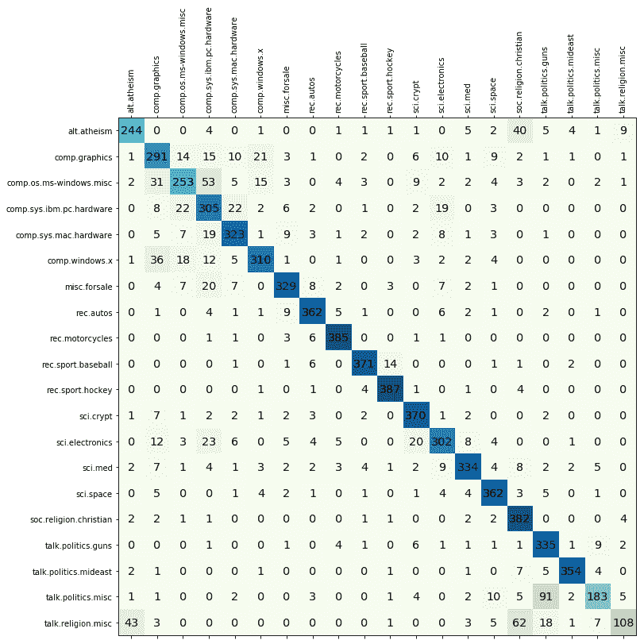
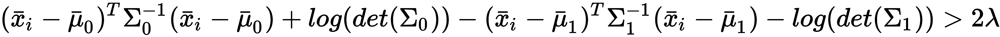

# 六、朴素贝叶斯和判别分析

朴素贝叶斯算法是一系列功能强大且易于训练的分类器，在给定一组条件的情况下，使用贝叶斯定理确定结果的概率。这种动态是基于条件概率(与原因相关)的反演，因此查询可以表示为可测量数量的函数。这种方法很简单，形容词 *naive* 被归因于不是因为这些算法有限或效率较低，而是因为关于我们将要讨论的因果因素的一个基本假设。朴素贝叶斯算法是多用途分类器，很容易在许多不同的上下文中找到它们的应用。然而，在所有这些情况下，它们的性能特别好，在这些情况下，类的概率是由一些因果因素的概率决定的。许多理想的例子来源于**自然语言处理** ( **NLP** )，其中一段文本可以被视为字典的一个特定实例，所有术语的相对频率提供了足够的信息来推断所属的类别。

在本章中，我们将讨论以下内容:

*   贝叶斯定理及其应用
*   朴素贝叶斯分类器(伯努利、多项式和高斯)
*   判别分析(线性和二次)


# 贝叶斯定理

让我们考虑两个概率事件， *A* 和 *B* 。我们可以使用乘积规则将边际概率 *P(A)* 和 *P(B)* 与条件概率 *P(A|B)* 和*P(B | A)*相关联:


考虑到交集是可交换的，第一个成员是相等的，所以我们可以推导出贝叶斯定理:


在一般的离散情况下，考虑到随机变量 *A* 的所有可能结果，公式可以重新表达:


由于分母是归一化因子，该公式通常表示为比例关系:


这个公式有非常深刻的哲学含义，它是统计学习的一个基本要素。首先我们来考虑边际概率， *P(A)。*这通常是一个确定目标事件发生概率的值，如 *P(垃圾)*或 *P(下雨)*。由于没有其他因素，这种概率被称为**先验**，因为它通常由数学或上下文考虑因素决定。例如，假设我们想要实现一个非常简单的垃圾邮件过滤器，我们已经收集了 100 封电子邮件。我们知道 30 封是垃圾邮件，70 封是普通邮件。所以，我们可以说 *P(垃圾)* = *0.3* 。

然而，我们希望使用一些标准进行评估(为了简单起见，让我们考虑一个标准)——例如，电子邮件文本短于 50 个字符*。因此，我们的查询变成如下:*


第一项类似于 *P(垃圾邮件)*，因为它是给定特定条件下垃圾邮件的概率。正因如此，它被称为**后验**(换句话说，它是我们在知道一些附加元素后可以估计的概率)。在右边，我们需要计算缺失值，但这很简单。我们假设 35 封邮件的文本短于 50 个字符，那么*P(Text<50 chars)**= 0.35*。只查看我们的`spam`文件夹，我们发现只有 25 封垃圾邮件有简短的文本，因此*P(Text<50 chars | Spam)= 25/30 = 0.83*。结果是这样的:


所以，收到一封很短的邮件后，有 71%的概率是垃圾邮件。现在，我们可以理解*P(Text<50 chars | Spam)*的作用了；由于我们有实际的数据，我们可以衡量我们的假设给定查询的可能性有多大。换句话说，我们已经定义了一个似然性(将这个概念与逻辑回归进行比较)，它是先验概率和后验概率之间的一个权重:


归一化因子通常用字母α表示，因此原始公式为:


最后一步是考虑有更多并发条件的情况(这在现实问题中更现实):


通常，当考虑联合先验概率时，这个问题会变得非常复杂。事实上，考虑单个因素的影响很容易，但当问题以下列方式表达时，就会变得棘手:


因此，一个常见的假设是，当这些原因涉及到引起相同的结果时，就认为它们是相互独立的。形式上，这个假设被称为**条件独立性**，它允许使用一个简化的表达式:


很明显，计算单打 *P(C [i] |A)* 并相乘比考虑联合概率更容易。例如，考虑到垃圾邮件检测问题，我们可以以这种形式设想一个联合概率:


即使问题非常简单，我们也需要考虑所有文本长度小于 50 个字符且包含单词 s *hop* 的电子邮件的交集。在更复杂的情况下，由于各种因素之间的交叉影响，很难确定这个概率。条件独立性仅仅是建立在零(或完全可以忽略)交叉影响的基础上，正如我们将要讨论的，即使当我们期望不同原因之间的相互作用时，这样的条件也是经常遇到的。


# 朴素贝叶斯分类器

朴素贝叶斯分类器之所以被称为朴素贝叶斯分类器，是因为它基于一个朴素的条件，这意味着原因的条件独立性。在许多特定特征的概率与另一个特征严格相关的情况下，这似乎很难接受。例如，在垃圾邮件过滤中，短于 50 个字符的文本可能会增加图像出现的概率，或者如果该域已经因为向数百万用户发送相同的垃圾邮件而被列入黑名单，它可能会找到特定的关键字。换句话说，一个原因的存在通常不会独立于其他原因的存在。然而，在*朴素贝叶斯的最优性*、*1*、*2(2004):3*、*张 H.* 中，作者证明了在特定的条件下(并非很少发生)，不同的依赖关系相互清除，并且即使条件独立性不确定，朴素贝叶斯分类器也能成功地实现非常高的性能。

让我们考虑一个数据集:


为简单起见，每个特征向量将表示如下:


我们还需要一个目标数据集(带有 *P* 个可能的类):


这里，每个 *y* 可以属于 *P-1* 不同类别中的一个。考虑条件独立下的贝叶斯定理，我们可以写出如下:


边际先验概率 *P(y [i] )* 和条件概率*P(x[I](j)| y[I])*的值一般是通过频数或最大似然估计得到的，因此，给定一个输入向量 *x* ，预测的类别就是后验概率最大的类别。然而，在许多实现中(包括 scikit-learn)，也可以为每个类指定一个先验 *P(y [i] )，*，以便将训练集中在给定可能性的后验分布的优化上。


# scikit-learn 中的朴素贝叶斯

scikit-learn 基于相同数量的不同概率分布实现了三种朴素贝叶斯变体:伯努利分布、多项式分布和高斯分布。第一种是二元分布，当一个特征存在或不存在时很有用。第二种是离散分布，每当一个特征必须用整数表示时使用(例如，在 NLP 中，它可以是一个词的频率)，而第三种是以其均值和方差为特征的连续分布。


# 伯努利朴素贝叶斯

如果 *X* 是一个伯努利分布的随机变量，它只能有两种可能的结果(为简单起见，我们称它们为 *0* 和 *1* )，它们的概率是这样的:


通常，输入向量*x[I]被假设为多元伯努利分布，并且每个特征是二元且独立的。根据频率计数学习模型的参数。因此，如果存在具有 *m* 特征的 *n* 个样本，则第 *i ^第第*个特征的概率是这样的(*N[x^((I))]*计算第 *i ^第 = 1* )个特征的次数:*


为了用 scikit-learn 测试这个算法，我们将生成一个虚拟数据集。伯努利朴素贝叶斯期望二元特征向量；然而，`BernoulliNB`类有一个`binarize`参数，它允许我们指定一个阈值，该阈值将在内部用于转换特性:

```
from sklearn.datasets import make_classification

nb_samples = 300

X, Y = make_classification(n_samples=nb_samples, n_features=2, n_informative=2, n_redundant=0)
```

我们已经生成了下图所示的二维数据集:


伯努利朴素贝叶斯检验的数据集

我们决定使用`0.0`作为二进制阈值，这样每个点都可以通过它所在的象限来表征。当然，对于我们的数据集来说，这是一个合理的选择，但伯努利朴素贝叶斯适用于二进制特征向量或连续值，它们可以用预定义的阈值精确分割:

```
from sklearn.naive_bayes import BernoulliNB
from sklearn.model_selection import train_test_split

X_train, X_test, Y_train, Y_test = train_test_split(X, Y, test_size=0.25)

bnb = BernoulliNB(binarize=0.0)
bnb.fit(X_train, Y_train)

print(bnb.score(X_test, Y_test))
0.85333333333333339
```

分数相当不错，但如果我们想了解二进制分类器是如何工作的，了解数据是如何在内部二进制化的是很有用的:


二值化数据集的结构

现在，检查朴素贝叶斯预测，我们得到以下结果:

```
data = np.array([[0, 0], [0, 1], [1, 0], [1, 1]])

print(bnb.predict(data))
[0, 0, 1, 1]
```


# 多项式朴素贝叶斯

多项式分布有助于对特征向量进行建模，其中每个值代表例如某个术语的出现次数或其相对频率。如果特征向量具有 *n 个*元素，并且它们中的每一个可以以概率*p[k]假定 *k* 个不同的值，则:*


条件概率*P(x*^([(I)])*| y[j])*是用频率计数计算的(这对应于应用最大似然法)，但在这种情况下，重要的是还要考虑校正参数α(称为**拉普拉斯**或**李德斯通平滑因子**)，以避免零概率:


在前面的表达式中，分子类似于伯努利情况(加上了α)，实际上它统计的是输入样本的第 *i ^(th)* 特征中 *y [j]* 类的出现次数。相反，分母是*y[j]j*类(在所有特征中)出现的总次数加上与输入维数成比例的校正因子。在空计数的情况下，概率默认为一个常数值。当评估其特征不包括在训练集中的样本时，这种校正非常有用。即使这是一种应该被适当管理的情况，如果没有纠正，它们的概率将是零。例如，在 NLP 中，通常从文档语料库开始构建字典，然后分割矢量化数据集(其中每个元素包含 n 个特征，代表特定单词的出现次数(或其函数)。如果某个单词没有出现在属于训练集的任何文档中，则在大多数情况下，非平滑模型将无法正确管理该文档(也就是说，仅考虑已知元素来分配最可能的类别)。

*α* 的默认值是 *1.0* (在这种情况下，它被称为拉普拉斯因子)，它防止模型在频率为零时设置零概率。可以给所有非负值赋值；但是，较大的值会将较高的概率分配给缺失的要素，这种选择可能会改变模型的稳定性。当 *α < 1.0* 时，通常称为**滑动系数**。很明显，如果 *α → 0* ，效果变得越来越可以忽略，回到非常类似于伯努利朴素贝叶斯的场景。在我们的例子中，我们将考虑默认值 *1.0* 。

出于我们的目的，我们将使用已经在第 2 章中分析过的`DictVectorizer`，*机器学习中的重要元素*。有自动工具来计算术语的频率，但我们将在以后讨论它们。让我们只考虑两个记录:第一个代表城市，第二个代表乡村。我们的字典包含假设的频率，就好像这些术语是从文本描述中提取的一样:

```
from sklearn.feature_extraction import DictVectorizer

data = [
   {'house': 100, 'street': 50, 'shop': 25, 'car': 100, 'tree': 20},
   {'house': 5, 'street': 5, 'shop': 0, 'car': 10, 'tree': 500, 'river': 1}
]

dv = DictVectorizer(sparse=False)
X = dv.fit_transform(data)
Y = np.array([1, 0])

print(X)
[[ 100.,  100.,    0.,   25.,   50.,   20.],
 [  10.,    5.,    1.,    0.,    5.,  500.]]
```

请注意，第一组中缺少了术语`'river'`，因此让α等于`1.0`以给出一个小概率是有用的。城市的输出等级为`1`，农村的输出等级为`0`。现在我们可以训练一个`MultinomialNB`实例:

```
from sklearn.naive_bayes import MultinomialNB

mnb = MultinomialNB()
mnb.fit(X, Y)

MultinomialNB(alpha=1.0, class_prior=None, fit_prior=True)
```

为了测试这个模型，我们创建了一个带有`river`的虚拟城市和一个没有`river`的虚拟乡村:

```
test_data = data = [
   {'house': 80, 'street': 20, 'shop': 15, 'car': 70, 'tree': 10, 'river': 1},
   {'house': 10, 'street': 5, 'shop': 1, 'car': 8, 'tree': 300, 'river': 0}
]

print(mnb.predict(dv.fit_transform(test_data)))
[1, 0]
```

不出所料，预测是正确的。稍后，当讨论 NLP 的一些元素时，我们将使用一个**多项朴素贝叶斯**用于具有较大语料库的文本分类。即使多项式分布是基于出现的次数，它也可以成功地用于频率或更复杂的函数。


# 多项式朴素贝叶斯文本分类的一个例子

在这个例子中，我们想要展示如何使用多项式朴素贝叶斯模型来有效地对文本数据进行分类。数据集被称为 *20 新闻组*(【http://qwone.com/~jason/20Newsgroups/】T21)，它已经内置在 scikit-learn 中(所有预处理步骤都已经执行)。有 20，000 个职位分成 20 个类别，训练集包含 11，314 个职位，测试集包含 7，532 个职位。在[第 13 章](5afb3604-3bdd-49d1-aea7-df0e414e34ff.xhtml)、*自然语言处理简介*中，我们将讨论将文本转换成数字向量所必需的最常见的技术，然而，对于这个例子，知道字典包含 130，107 个单词并且每个文档是一个向量*x[I]∈ℜ^(130107)t32 就足够了，其中每个特征代表一个特定单词的频率。由于帖子通常很短(相对于字典而言)，向量非常稀疏，大多数值等于 *0.0* (意味着一个单词不在文档中)。我们的目标是训练一个模型，能够将未知的帖子分配到正确的类别。换句话说，我们想要检查多项式分布是否能够有效地表示数据集。*

让我们开始使用`fetch_20newsgroups_vectorized()`函数加载训练和测试数据块(已经矢量化)，并将`subset`参数设置为等于`'train'`和`'test'`:

```
from sklearn.datasets import fetch_20newsgroups_vectorized

train_data = fetch_20newsgroups_vectorized(subset='train')
test_data = fetch_20newsgroups_vectorized(subset='test')
```

此时，我们可以实例化和训练多项式朴素贝叶斯模型(由于向量非常稀疏，我们更倾向于设置 Lidstone 系数，`alpha=0.01`，因为缺少一个单词会产生错误的分类结果。较高的值可以平滑向量，但是在这种情况下，许多不太可能的单词会对准确性产生负面影响):

```
from sklearn.naive_bayes import MultinomialNB

mnb = MultinomialNB(alpha=0.01)
mnb.fit(train_data['data'], train_data['target'])

print(mnb.score(test_data['data'], test_data['target']))
0.835103558152
```

验证准确性相当高(83%)，证实了文档可以使用多项式分布来建模，并且不令人惊讶的是，特定单词的组成足以在大多数情况下确定正确的类别。为了进一步确认，让我们绘制混淆矩阵:



使用多项式朴素贝叶斯分类的 20 个新闻组数据集的混淆矩阵

以最小的混乱正确地检测到大量的类别。此外，我们还可以观察到很大比例的错误是由于非常相似的类别(例如， **sci.electronics** 和 **comp.sys.ibm.pc.hardware** 或 **comp.sys.mac.hardware** )。即使不分析每个帖子的内容，我们也可以假设在所有这些情况下都很有可能观察到高度的相似性，并且分类可能只依赖于非常小的区分词子集。我邀请读者使用不同的拉普拉斯/李德斯通系数值和伯努利朴素贝叶斯来重复这个练习。在这种情况下，有必要使用略高于`0.0`的阈值`binarize`数据集(以便移除所有那些概率非常低的元素)，例如:

```
from sklearn.preprocessing import binarize

X_train_binary = binarize(train_data['data'], threshold=0.01)
X_test_binary = binarize(test_data['data'], threshold=0.01)
```


# 高斯朴素贝叶斯

高斯朴素贝叶斯在处理连续值时非常有用，连续值的概率可以使用高斯分布来建模，高斯分布的均值和方差与每个特定的类相关联(在这种情况下，假设 *j=1，2，...P* ):


我们的目标是使用最大似然法估计每个条件分布的均值和方差，考虑到高斯分布的数学本质，这是非常容易的。整个数据集的可能性如下所示:


现在，扩展最后一项，我们得到下面的表达式(为了避免混淆，由于均值和方差与*y[I]类相关联，我们将使用索引 *j* 来表示它们，因此它们被排除在总和之外):*


为了最大化可能性，我们需要计算关于*μ[j]和*σ[j]的偏导数(第一项是常数，可以去掉):**


设偏导数等于零，我们得到平均值*μ[j]的公式:*


类似地，我们可以计算关于*σ[j]的导数:*


因此，方差*σ[j]2的表达式为:*


重要的是要记住，索引 *j* 是作为一个辅助术语引入的，但在实际的可能性计算中，它指的是分配给样本*x[I]的标签。*

作为一个例子，我们使用 ROC 曲线比较高斯朴素贝叶斯和逻辑回归。该数据集包含 300 个样本，具有两个特征。每个样本属于一个类别:

```
from sklearn.datasets import make_classification

nb_samples = 300

X, Y = make_classification(n_samples=nb_samples, n_features=2, n_informative=2, n_redundant=0)
```

下图显示了数据集的曲线图:


高斯朴素贝叶斯检验数据集

现在我们可以训练这两个模型并生成 ROC 曲线(朴素贝叶斯的`Y`得分通过`predict_proba`方法获得):

```
from sklearn.naive_bayes import GaussianNB
from sklearn.linear_model import LogisticRegression
from sklearn.metrics import roc_curve, auc
from sklearn.model_selection import train_test_split

X_train, X_test, Y_train, Y_test = train_test_split(X, Y, test_size=0.25)

gnb = GaussianNB()
gnb.fit(X_train, Y_train)
Y_gnb_score = gnb.predict_proba(X_test)

lr = LogisticRegression()
lr.fit(X_train, Y_train)
Y_lr_score = lr.decision_function(X_test)

fpr_gnb, tpr_gnb, thresholds_gnb = roc_curve(Y_test, Y_gnb_score[:, 1])
fpr_lr, tpr_lr, thresholds_lr = roc_curve(Y_test, Y_lr_score)
```

生成的 ROC 曲线(以与上一章相同的方式生成)如下图所示:


比较朴素贝叶斯和逻辑回归得分的 ROC 曲线

朴素贝叶斯的性能略好于逻辑回归。然而，这两个分类器具有相似的准确度和曲线下面积 ( **AUC** )。用 MNIST 数字数据集比较高斯和多项式朴素贝叶斯的性能是很有趣的。每个样本(属于 10 个类)是一个编码为无符号整数(0-255)的 8×8 图像；因此，即使每个特征不代表实际的计数，它也可以被认为是一种幅度或频率:

```
from sklearn.datasets import load_digits
from sklearn.model_selection import cross_val_score

digits = load_digits()

gnb = GaussianNB()
mnb = MultinomialNB()

cross_val_score(gnb, digits.data, digits.target, scoring='accuracy', cv=10).mean()
0.81035375835678214

cross_val_score(mnb, digits.data, digits.target, scoring='accuracy', cv=10).mean()
0.88193962163008377
```

多项式朴素贝叶斯比高斯变量表现更好，结果并不令人惊讶。事实上，每个样本可以被认为是从 64 个符号的字典中导出的特征向量，拉普拉斯系数的影响可以减轻在相同数字类别的子集中观察到的变形。每个要素(强度介于 0 和 16 之间的像素)的值与每次出现的次数成比例，因此多项式分布可以更好地拟合数据，而高斯分布受其均值和方差的限制稍大。


# 判别分析

让我们假设考虑一个多类分类问题，其中样本 *x [i] ∈ ℜ ^m* 属于 *y [j]* 类的条件概率可以建模为多元高斯分布( *X* 被假设为由具有极低共线性的**独立且同分布的** ( **i.i.d** )变量组成


在这种情况下，类 *j* 完全由均值向量*μ[j]和协方差矩阵*σ[j]决定。如果应用贝叶斯定理，我们可以得到后验概率*p(y[j]| x[I])*:**


考虑到高斯朴素贝叶斯的讨论，不难理解如何使用训练集来估计*μ[j]和*σ[j]的可能性，事实上，它们对应于样本均值和协方差，并且可以容易地以封闭形式计算。**

现在，为了简单起见，我们来考虑一个二元问题使得参数为( *μ [0]* ，*σ[0]*)和( *μ [1]* ，*σ[1]*)。在**二次判别分析** ( **QDA** )中，我们通过比较对数似然性来预测 a 类样本 *x [i]* ，如果比值小于预先设定的阈值 *λ* ，则将其分配给 0 类，如果比值大于阈值，则分配给 1 类:


换句话说，一旦确定了参数，就将样本分配给对应于最高对数似然性的类别:



前面的表达式可以快速计算并扩展到多类问题。如果我们没有任何可以增加对一个类的偏好的先验信息，阈值也可以被设置为零。当协方差矩阵*σ[0]=σ[1]=**σ*相等时，该问题称为**线性判别分析** ( **LDA** )，计算可以进一步简化。事实上，考虑到前面的表述，我们可以展开所有的产品:


由于协方差矩阵是埃尔米特矩阵(在实际情况下，它仅仅意味着*σ=σ^T*)，我们重新组合这些项并取消一些元素:


如果我们只在左侧保留依赖于*x[I]的项，我们将获得更实用的表达式:*


因此，这个问题变得类似于感知器(只是形式上)；其实可以表示为点积*a x[I]b*，其中 *a* 和 *b* 项为常数，只需要计算一次。现在让我们用二维数据集检查这两种算法，其中类的方差分别为 *1.0* 和 *100.0* :

```
from sklearn.datasets import make_blobs

nb_samples = 1000

X, Y = make_blobs(n_samples=nb_samples, n_features=2, centers=2, cluster_std=[1.0, 10.0], random_state=1000)
```

下图显示了数据集的曲线图:


用于判别分析的数据集

两个类别的协方差矩阵如下:

```
import numpy as np

print(np.cov(X[Y==0].T))
[[ 1.00845543  0.0231022 ]

 [ 0.0231022   0.99716302]]

print(np.cov(X[Y==1].T))
[[ 109.48898805   -0.84146872]

 [  -0.84146872  104.89575589]]
```

由于协方差之间有很大的差异(即使它们都是去相关的)，我们期望使用 QDA 获得更高的精度。让我们使用类`LinearDiscriminantAnalysis`和`QuadraticDiscriminantAnalysis`以及 10 重交叉验证来检查这两种方法:

```
from sklearn.discriminant_analysis import LinearDiscriminantAnalysis, QuadraticDiscriminantAnalysis

lda = LinearDiscriminantAnalysis()
print(cross_val_score(lda, X, Y, cv=10).mean())
0.831

qda = QuadraticDiscriminantAnalysis()
print(cross_val_score(qda, X, Y, cv=10).mean())
0.98
```

正如所料，QDA 达到 98%的准确率(而线性变量约为 83%)。我邀请读者理解关于其他分类器(例如，逻辑回归)的判别分析的动态。在标准的线性模型中，我们通常寻找一个分离的超平面，在 LDA 和 QDA 中，我们考虑属于每个类的可能性。这个概念如下图所示(针对二元问题):


使用多元高斯分布对数据集进行建模的二元分类问题

一个点*x[I]相对于两个高斯函数总是具有非负的可能性，但是 *y=1* 的可能性比 *y=0* 的可能性高得多(记住概率必须作为 *-∞* 和 *x [i]* 之间的定积分来计算)。通过这种方式，数据集也可以由部分(甚至完全)重叠的子集组成，如果满足假设，模型总是能够以很高的置信度进行区分。显然，有一些缺点。首先，共线性的存在极大地降低了性能。此外，数据集的高斯性通常是一个很难满足的要求。最后，即使我们有一个完美的数据集(就假设而言)，如果两个类的同质性不同，似然比也会产生错误的估计。如果我们考虑前面的例子，并想象一个属于类别 1 并与类别 0 重叠的密集斑点，则该子集中的所有点被分类为 *y=0，*并且对最终精度的影响可能是显著的。为了更好地理解特性和限制，我邀请读者重复修改数据集的示例(例如，可以创建非常密集的重叠区域或在其他区域添加许多样本，以便条件概率不再是高斯分布)。*


# 摘要

在这一章中，我们从贝叶斯定理及其内在原理出发，揭示了一般的朴素贝叶斯方法。这种算法的天真是由于选择假设所有的原因是条件独立的。这意味着，在每种组合中，每种贡献都是相同的，特定原因的存在不会改变其他原因的概率。这通常是不现实的；然而，在某些假设下，有可能显示内部依赖关系相互清除，因此结果概率看起来不受它们之间关系的影响。

scikit-learn 提供了三种朴素贝叶斯实现:伯努利、多项式和高斯。它们之间唯一的区别是采用的概率分布。第一个是二进制算法，当一个特征存在或不存在时，它特别有用。多项式假设具有特征向量，其中每个元素代表它出现的次数(或者，通常是它的频率)。这种技术在 NLP 中或者从公共字典开始合成样本时非常有效。相反，高斯是基于连续分布的，它适合于更一般的分类任务。

在下一章，[第 7 章](f0008ecc-15b7-4f9b-8576-05e1d4d12ecf.xhtml)，*支持向量机*我们将介绍一种新的分类技术，叫做**支持向量机**。这些算法对于解决线性和非线性问题都非常有效。它们通常是更复杂场景的首选，因为尽管它们效率很高，但内部动力学非常简单，并且它们可以在很短的时间内得到训练。