# 七、支持向量机

在这一章中，我们将介绍另一种使用一系列算法进行分类的方法，这些算法被称为**支持向量机** ( **支持向量机**)。它们可以在线性和非线性场景中工作，允许在许多不同的环境中实现高性能。与神经网络一起，支持向量机可能是许多不容易找到好的分离超平面的任务的最佳选择。例如，长期以来，支持向量机是 MNIST 数据集分类的最佳选择，因为它们可以使用数学技巧捕捉非常高的非线性动态，而无需对算法进行复杂的修改。在这一章的第一部分，我们将讨论线性 SVM 的基础知识，这将用于它们的非线性扩展。我们还将讨论一些控制参数数量的技术，最后讨论支持向量算法在回归问题中的应用。

特别是，我们将讨论以下内容:

*   最大间隔距离问题和线性 SVM
*   内核 SVM
*   软利润、C-SVM 和ν-SVM
*   **支持向量回归** ( **SVR** )
*   **S**EMI 监督支持向量机介绍( **S ³ VM**


# 线性 SVM

让我们考虑我们想要分类的特征向量的数据集:


为了简单起见，我们假设我们正在使用一个双极分类(在所有其他情况下，可以自动使用一对全部策略)，我们将我们的类标签设置为 *-1* 和 *1* :

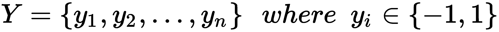

我们的目标是找到最佳分离超平面，其方程如下:


在下图中，有这样一个超平面的二维表示:

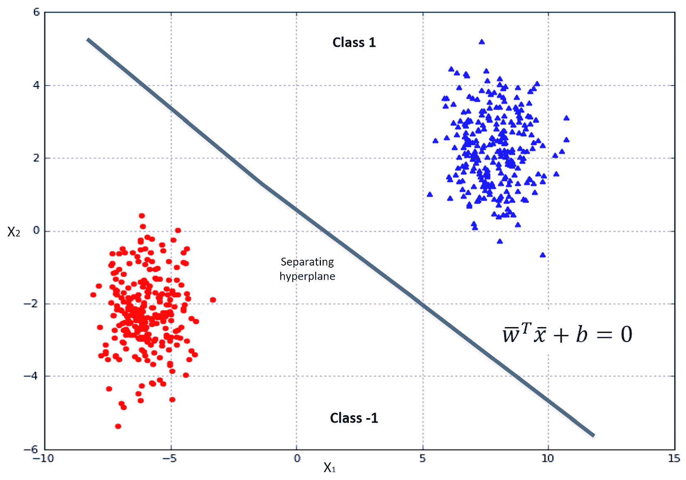

线性 SVM 双极问题的结构

这样，我们的分类器可以写成如下形式:

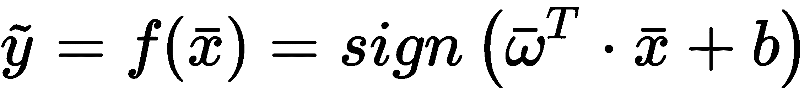

在现实场景中，这两个类通常由一个边界分隔开，边界上有一些元素。这些元素被称为**支持向量**，该算法的名称源于它们的特殊作用。对于更一般的数学表达式，最好对我们的数据集进行重正化，使支持向量位于两个超平面上，公式如下:

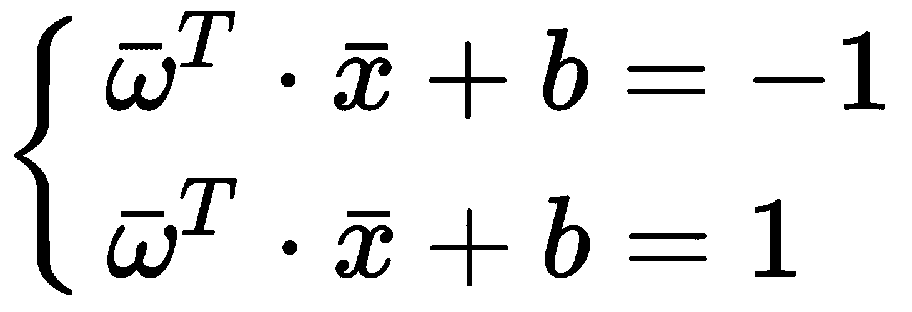

在下图中，有一个带有两个支持向量的示例。虚线是原始分离超平面:

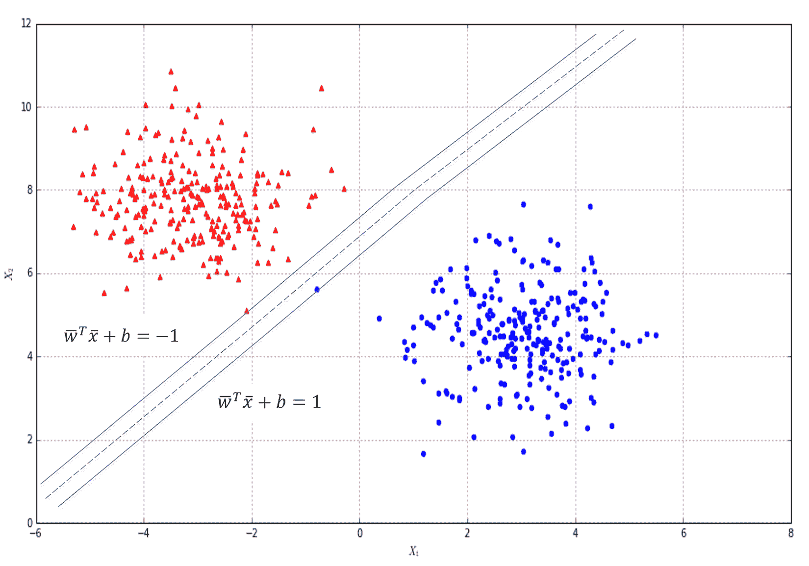

分离超平面(虚线)和支持向量超平面(实线)

我们的目标是最大化这两个边界超平面之间的距离，以减少错误分类的概率(当距离很短时，错误分类的概率更高，并且没有像上图中那样的两个明确定义的斑点)。

考虑到边界是平行的，它们之间的距离由垂直于两者并连接两点的线段的长度来定义:

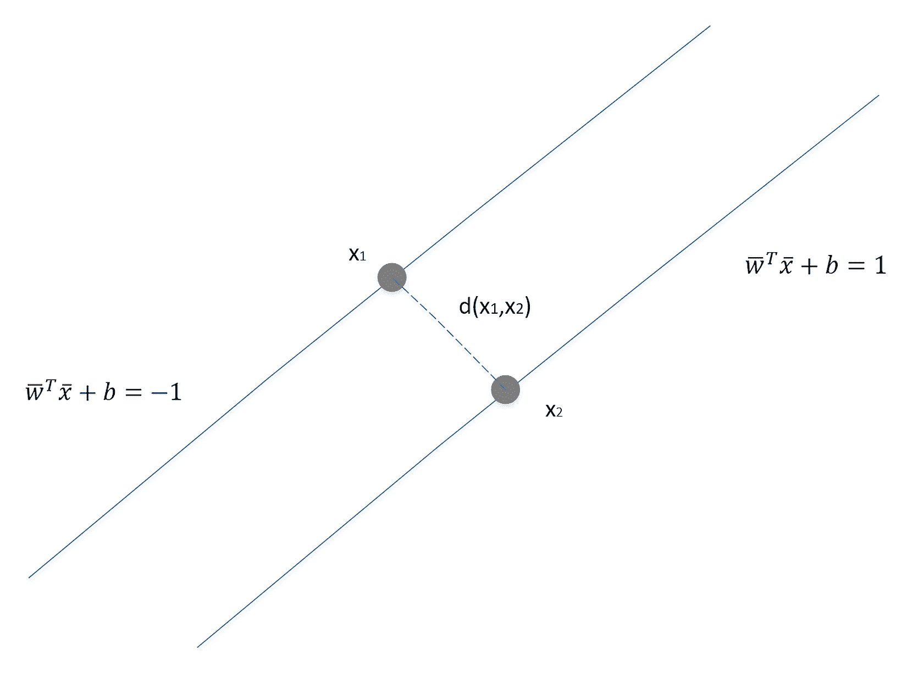

支持向量超平面之间的距离

因此，将这些点视为矢量，我们得到如下结果:

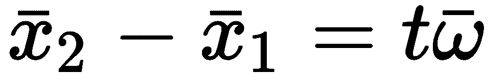

现在，操纵边界超平面方程，我们得到这个:

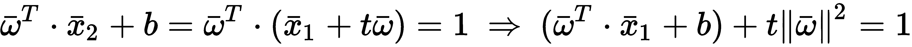

最后一部分的第一项等于 *-1* ，所以我们求解 *t，*得到这个等式:

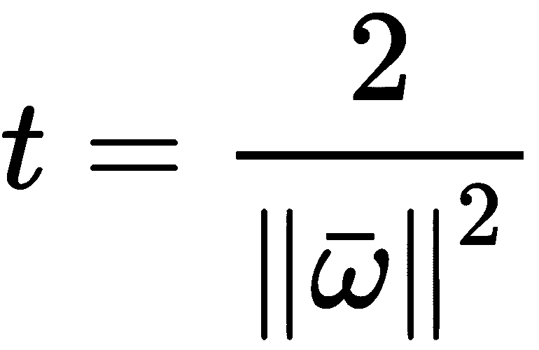

*x[1]T3 与*x[2]之间的距离为线段 *t 的长度*1*；*代入前面的表达式，我们可以推导出另一个等式:**

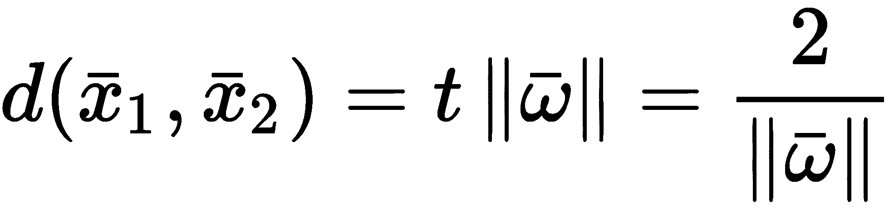

现在，考虑数据集的所有点，我们可以施加以下约束:

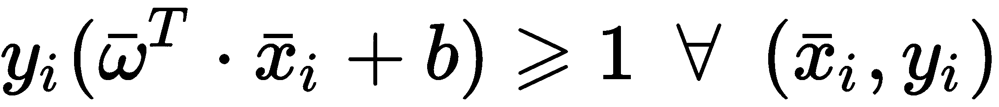

这通过使用 *-1* 、 *1* 作为类别标签和边界来保证。该等式仅适用于支持向量，而对于所有其他点，该等式将大于 *1* 。重要的是要考虑到模型没有考虑超过这个界限的向量。在许多情况下，这可以产生一个非常健壮的模型，但是在许多数据集中，这也可能是一个严重的限制。在下一段中，我们将使用一个技巧来避免这种僵化，同时保持相同的优化技术。

此时，我们可以定义函数以最小化(连同约束)来训练 SVM(这相当于最大化距离):

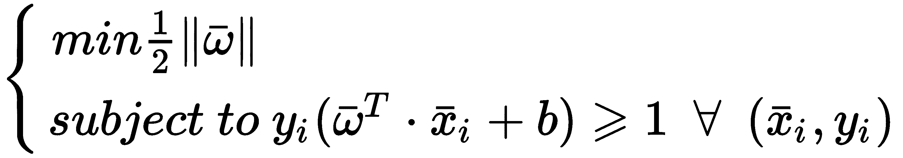

这可以在下面的二次规划问题中进一步简化(通过从范数中去除平方根):

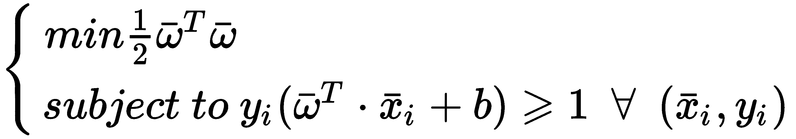

这个问题相当于铰链损失函数的最小化(如被动-主动算法中已经看到的):

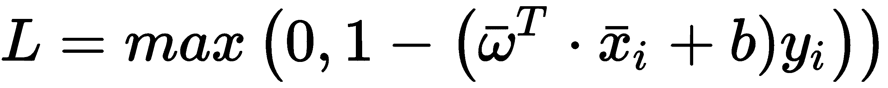

事实上，我们的目标不仅是找到最优的分离超平面，而且是当样本*x[I]被正确分类但其与超平面的距离小于 *1* ， *L > 0* 并且算法被迫更新参数向量 *ω* 时，最大化支持向量(即*极限定界符*)之间的距离， 而如果 *L = 0* (所有正确分类的样本与分离超平面的距离大于 *1* )则保持被动。 在一定程度上，支持向量机是非常经济的模型，因为它们利用了数据集的几何属性。由于支持向量是最近的不同点(就类别而言)，所以没有必要关心所有其他样本。当已经找到最佳超平面时(只有支持向量有助于其调整)， *L = 0* ，并且不需要其他校正。*


# 带 scikit 的支持向量机-学习

为了允许模型具有更灵活的分离超平面，所有 scikit-learn 实现都基于一个简单的变体，该变体在函数中包括所谓的**松弛变量***ζ**[I]***以最小化(有时称为**C-支持向量机**):

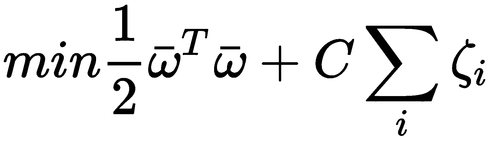

在这种情况下，约束条件如下:

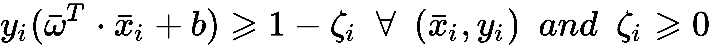

松弛变量的引入允许我们创建一个灵活的裕度，使得属于一个类的一些向量也可以在超空间的相对部分找到，并可以包含在模型训练中。这种灵活性的强度可以使用 *C* 参数进行设置。较小的值(接近于零)会带来非常硬的余量，而大于或等于 *1* 的值允许越来越大的灵活性(同时也会增加错误分类率)。等效地，当 *C → 0* 时，支持向量的数量最小化，而更大的 *C* 值增加支持向量的数量。

*C* 的正确选择并不直接，但是通过使用网格搜索可以自动找到最佳值，如前几章所述。在我们的例子中，我们通常保持默认值 *1* ，即使在某些情况下我们要减少它，以增加选择性。


# 线性分类

我们的第一个例子基于线性 SVM，如前一节所述。我们首先创建一个虚拟数据集，将`500`向量细分为两类:

```py
from sklearn.datasets import make_classification

nb_samples = 500

X, Y = make_classification(n_samples=nb_samples, n_features=2, n_informative=2, n_redundant=0, n_clusters_per_class=1)
```

在下图中，有一个我们的数据集的图。请注意，一些点与两个主要斑点重叠。由于这个原因，正的 *C* 值需要允许模型捕捉更复杂的动态:

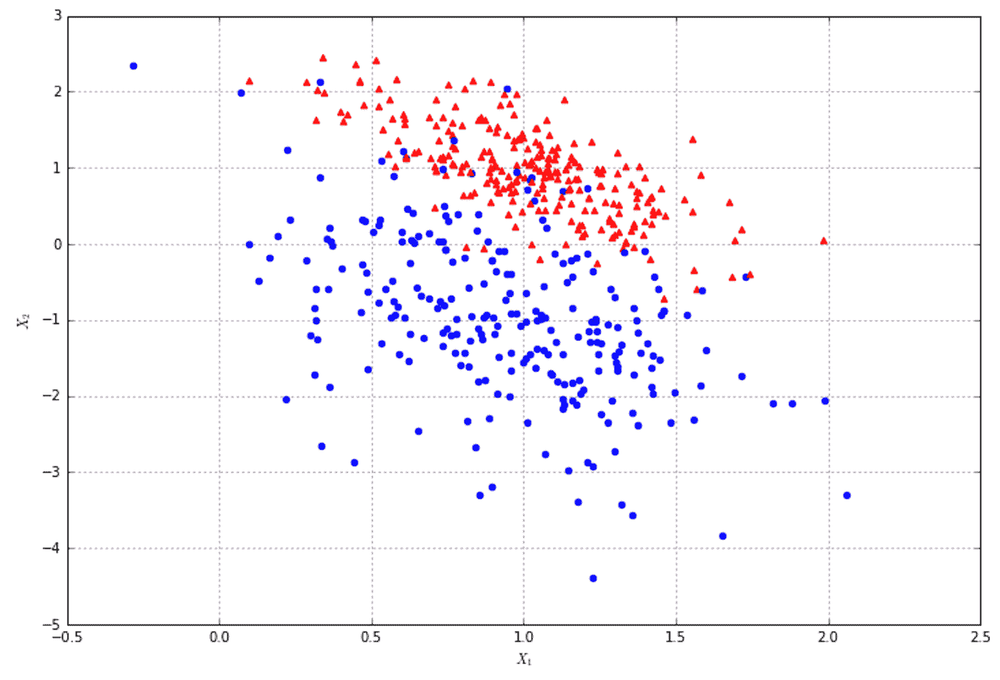

线性 SVM 的测试数据集

Scikit-learn 提供了`SVC`类，这是一个非常有效的实现，可以在大多数情况下使用。我们将结合交叉验证来验证性能:

```py
from sklearn.svm import SVC
from sklearn.model_selection import cross_val_score

svc = SVC(kernel='linear')
print(cross_val_score(svc, X, Y, scoring='accuracy', cv=10).mean())
0.93191356542617032
```

在本例中，`kernel`参数必须设置为`'linear'`。在下一节中，我们将讨论它是如何工作的，以及它如何在非线性情况下显著提高 SVM 的性能。正如预期的那样，精确度与逻辑回归相当，因为该模型试图找到最佳的线性分隔符。在训练一个模型之后，通过`support_vectors_`实例变量，可以得到一个支持向量数组。

对于我们的示例，下图显示了它们的曲线图:

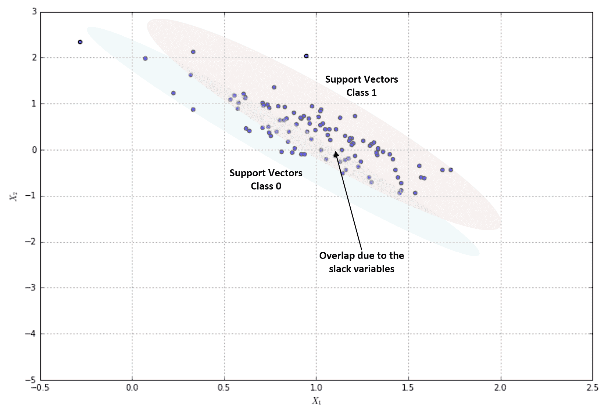

两类支持向量

可以看到，它们沿着分隔线排成一条条。`C`的效果和松弛变量决定了部分捕捉现有重叠的可移动余量。当然，用线性分类器不可能以完美的方式分离这些集合，而且大多数现实生活中的问题都是非线性的；因此，有必要采用一种基于核函数的更复杂的策略。


# 基于核的分类

当处理非线性问题时，通过将原始向量投影到一个(通常是更高维度的)空间来对它们进行线性分离是很有用的。假设我们考虑从输入样本空间 *X* 到另一个样本空间 *V* 的映射函数:

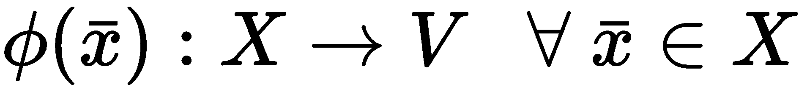

当我们讨论多项式回归时，我们看到了类似的方法。支持向量机也采用相同的策略，假设当样本被投影到 *V* 上时，它们可以很容易地被分离。然而，现在有一个我们需要克服的复杂性问题。事实上，数学公式如下:

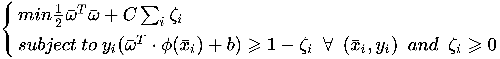

每个特征向量现在都被一个非线性函数过滤，该函数可以完全重塑场景。然而，引入这样的函数通常会增加计算的复杂性，这可能会阻碍您使用这种方法。为了理解发生了什么，有必要使用**拉格朗日乘数**来表达二次问题。整个过程超出了本书的范围；然而，最终的公式如下:

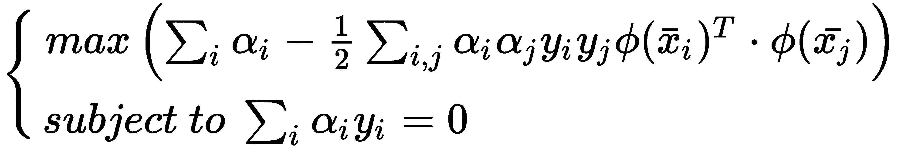

因此，对于每一对向量，有必要计算以下点积:

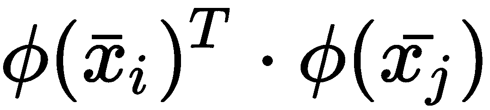

这个过程可能是一个瓶颈，这对于大问题来说是不可接受的。然而，现在所谓的**内核把戏**发生了。有一些特定的函数(称为内核)具有以下属性:

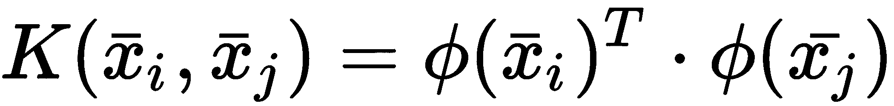

换句话说，两个特征向量的核的值是两个投影向量的乘积。好消息是，根据 **Mercer 定理**，每当内核满足 *X* 上的特定条件(称为 **Mercer 条件**)时，*φ(X)*函数总是存在。如果我们将 *K* 视为一个矩阵(这是一种非常常见的情况)，则有必要:

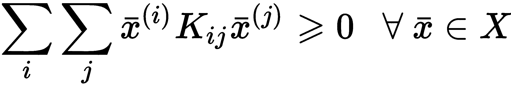

这仅仅意味着 *K* 必须是半正定的。对于连续函数也有一个类似的条件，但是在这种情况下，知道寻找核并没有想象的那么复杂是很有用的；因此，它们的应用越来越广泛。使用内核技巧，计算复杂性几乎保持不变，但它可能受益于非线性投影的能力，即使在非常大量的维度中。

除了线性内核这种简单的产品，scikit-learn 支持三种不同的内核，可以解决许多现实生活中的问题。


# 径向基函数

**径向基函数** ( **RBF** )内核是 SVC 的默认值，基于以下函数:

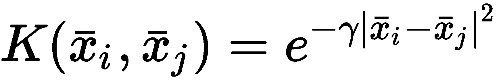

参数 *γ* 决定函数的幅度，不受方向影响，只受离原点的距离影响。当集合是凹的且相交时，例如，当属于一个类的子集被属于另一个类的子集包围时，这个核特别有用。


# 多项式核

多项式核基于以下函数:

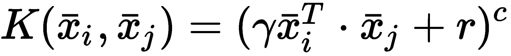

指数 *c* 通过参数 degree 指定，常数项 *r* 称为`coef0`。该函数可以使用大量支持变量轻松扩展维度，并克服非常非线性的问题。资源方面的要求通常更高，但考虑到非线性函数通常可以很好地近似为一个有界区域(通过采用多项式)，许多复杂的问题使用此内核变得容易解决也就不足为奇了。


# Sigmoid 内核

sigmoid 内核基于以下函数:

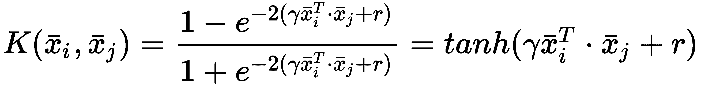

常数项 *r* 通过`coef0`参数指定。如*一篇关于 sigmoid 核的研究和用式方法训练非 PSD 核的文章*、*林*、*玄天*、*和林志仁*、*提交给神经计算 3 (2003): 1-32* 、if *γ < < 1* 和*r<0*因此，在尝试这种方法之前，最好先测试前两种方法。**


# 自定义内核

通常，内置内核可以有效地解决大多数现实生活中的问题；然而，scikit-learn 允许我们像普通 Python 函数一样创建自定义内核:

```py
import numpy as np 

def custom_kernel(x1, x2): 
    return np.square(np.dot(x1, x2) + 1)
```

该函数可以通过`kernel`参数传递给 SVC，该参数可以采用固定的字符串值(`'linear'`、`'rbf'`、`'poly'`、`'sigmoid'`)或可调用的(如`kernel=custom_kernel`)。


# 非线性示例

为了展示内核支持向量机的强大功能，我们将解决两个问题。第一种更简单，但完全是非线性的，数据集是通过`make_circles()`内置函数生成的:

```py
from sklearn.datasets import make_circles 

nb_samples = 500 
X, Y = make_circles(n_samples=nb_samples, noise=0.1)
```

下图显示了该数据集的曲线图:

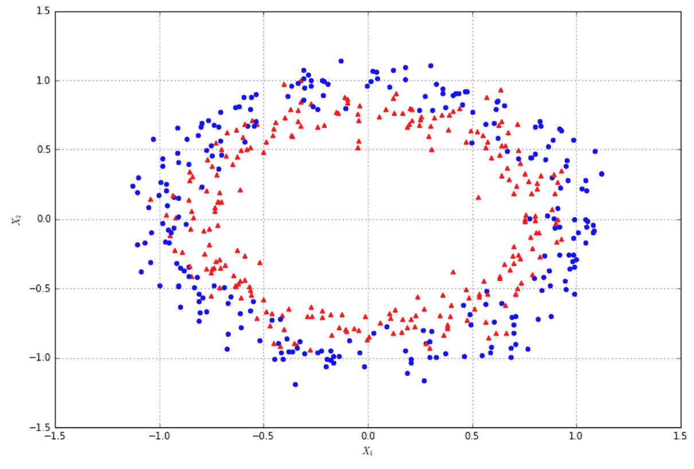

RBF SVM 的测试数据集

正如可能看到的，线性分类器永远无法分离这两个集合，每个近似将包含平均 50%的误分类。逻辑回归示例如下所示:

```py
from sklearn.linear_model import LogisticRegression 

lr = LogisticRegression() 
print(cross_val_score(lr, X, Y, scoring='accuracy', cv=10).mean()) 
0.438
```

正如所料，准确率低于 50%，没有其他优化可以大幅提高它。相反，让我们考虑使用 SVM 和不同内核的网格搜索(保留每个内核的默认值):

```py
import multiprocessing 
from sklearn.model_selection import GridSearchCV 

param_grid = [ 
    {  
        'kernel': ['linear', 'rbf', 'poly', 'sigmoid'], 
        'C': [ 0.1, 0.2, 0.4, 0.5, 1.0, 1.5, 1.8, 2.0, 2.5, 3.0 ] 
    } 
] 

gs = GridSearchCV(estimator=SVC(), param_grid=param_grid, 
                  scoring='accuracy', cv=10, n_jobs=multiprocessing.cpu_count()) 

gs.fit(X, Y) 

GridSearchCV(cv=10, error_score='raise', 
       estimator=SVC(C=1.0, cache_size=200, class_weight=None, coef0=0.0, 
  decision_function_shape=None, degree=3, gamma='auto', kernel='rbf', 
  max_iter=-1, probability=False, random_state=None, shrinking=True, 
  tol=0.001, verbose=False), 
       fit_params={}, iid=True, n_jobs=8, 
       param_grid=[{'kernel': ['linear', 'rbf', 'poly', 'sigmoid'], 'C': [0.1, 0.2, 0.4, 0.5, 1.0, 1.5, 1.8, 2.0, 2.5, 3.0]}], 
       pre_dispatch='2*n_jobs', refit=True, return_train_score=True, 
       scoring='accuracy', verbose=0) 

print(gs.best_estimator_) 
SVC(C=2.0, cache_size=200, class_weight=None, coef0=0.0, 
  decision_function_shape=None, degree=3, gamma='auto', kernel='rbf', 
  max_iter=-1, probability=False, random_state=None, shrinking=True, 
  tol=0.001, verbose=False) 

print(gs.best_score_) 
0.87
```

正如我们的数据集的几何形状所预期的，最好的核是 RBF，它产生 87%的准确率。对`gamma`的进一步改进可能会稍微增加这个值，但是由于两个子集之间有部分重叠，很难达到接近 100%的精确度。然而，我们的目标是不要过度拟合我们的模型；这是为了保证适当的概括水平。因此，考虑到形状，有限数量的错误分类是可以接受的，以确保模型捕捉到边界表面的亚振荡。

另一个有趣的例子是 MNIST 手写数字数据集。我们已经看到了，并使用线性模型对其进行了分类。现在，我们可以尝试找到具有 SVM 的最佳内核:

```py
from sklearn.datasets import load_digits 

digits = load_digits() 

param_grid = [ 
    {  
        'kernel': ['linear', 'rbf', 'poly', 'sigmoid'], 
        'C': [ 0.1, 0.2, 0.4, 0.5, 1.0, 1.5, 1.8, 2.0, 2.5, 3.0 ] 
    } 
] 

gs = GridSearchCV(estimator=SVC(), param_grid=param_grid, 
                  scoring='accuracy', cv=10, n_jobs=multiprocessing.cpu_count()) 

gs.fit(digits.data, digits.target) 

GridSearchCV(cv=10, error_score='raise', 
       estimator=SVC(C=1.0, cache_size=200, class_weight=None, coef0=0.0, 
  decision_function_shape=None, degree=3, gamma='auto', kernel='rbf', 
  max_iter=-1, probability=False, random_state=None, shrinking=True, 
  tol=0.001, verbose=False), 
       fit_params={}, iid=True, n_jobs=8, 
       param_grid=[{'kernel': ['linear', 'rbf', 'poly', 'sigmoid'], 'C': [0.1, 0.2, 0.4, 0.5, 1.0, 1.5, 1.8, 2.0, 2.5, 3.0]}], 
       pre_dispatch='2*n_jobs', refit=True, return_train_score=True, 
       scoring='accuracy', verbose=0) 

print(gs.best_estimator_)

SVC(C=0.1, cache_size=200, class_weight=None, coef0=0.0, 
  decision_function_shape=None, degree=3, gamma='auto', kernel='poly', 
  max_iter=-1, probability=False, random_state=None, shrinking=True, 
  tol=0.001, verbose=False) 

print(gs.best_score_) 
0.97885364496382865
```

因此，最好的分类器(具有几乎 98%的准确度)是基于多项式核和非常低的`C`值。这意味着具有非常硬的余量的非线性变换可以容易地捕捉所有数字的动态。事实上，支持向量机(具有各种内部选择)在这个数据集上一直表现出优异的性能，并且它们的使用可以很容易地扩展到类似的问题。

另一个有趣的例子是基于 Olivetti 人脸数据集，它不是 scikit-learn 的一部分，但可以自动下载并使用内置的`fetch_olivetti_faces()`函数进行设置:

```py
from sklearn.datasets import fetch_olivetti_faces

faces = fetch_olivetti_faces(data_home='/ML/faces/')
```

通过可选的`data_home`参数，可以指定数据集必须放在哪个本地文件夹中。示例的子集显示在下面的屏幕截图中:

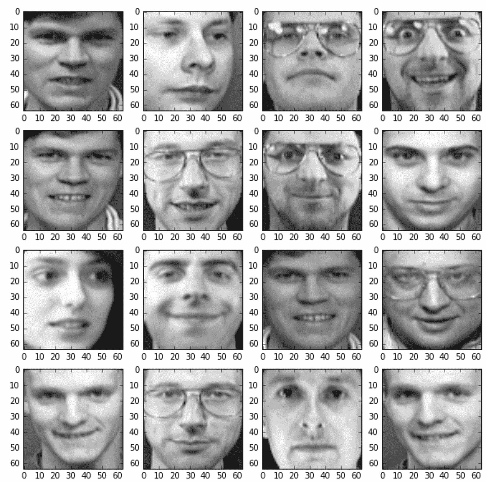

Olivetti 人脸数据集的子集

有 40 个不同的人，每个人都由 10 张 64 x 64 像素的灰度图片表示。类别数(40)并不高，但考虑到很多照片的相似性，一个好的分类器应该能够捕捉到一些特定的解剖细节。使用非线性内核执行网格搜索，我们得到以下结果:

```py
param_grid = [
 { 
   'kernel': ['rbf', 'poly'],
   'C': [ 0.1, 0.5, 1.0, 1.5 ],
   'degree': [2, 3, 4, 5],
   'gamma': [0.001, 0.01, 0.1, 0.5]
 }
]

gs = GridSearchCV(estimator=SVC(), param_grid=param_grid, scoring='accuracy', cv=8,  n_jobs=multiprocessing.cpu_count())

gs.fit(faces.data, faces.target)

GridSearchCV(cv=8, error_score='raise',
       estimator=SVC(C=1.0, cache_size=200, class_weight=None, coef0=0.0,
  decision_function_shape=None, degree=3, gamma='auto', kernel='rbf',
  max_iter=-1, probability=False, random_state=None, shrinking=True,
  tol=0.001, verbose=False),
       fit_params={}, iid=True, n_jobs=8,
       param_grid=[{'kernel': ['rbf', 'poly'], 'C': [0.1, 0.5, 1.0, 1.5], 'gamma': [0.001, 0.01, 0.1, 0.5], 'degree': [2, 3, 4, 5]}],
       pre_dispatch='2*n_jobs', refit=True, return_train_score=True,
       scoring='accuracy', verbose=0)

print(gs.best_estimator_)
SVC(C=0.1, cache_size=200, class_weight=None, coef0=0.0,
  decision_function_shape=None, degree=2, gamma=0.1, kernel='poly',
  max_iter=-1, probability=False, random_state=None, shrinking=True,
  tol=0.001, verbose=False)
```

因此，最好的估计器是基于多项式的`degree=2`，相应的精度如下:

```py
print(gs.best_score_)
0.96999999999999997
```

这证实了支持向量机捕捉非线性动态的能力，即使是简单的核也可以在非常有限的时间内计算出来。对于读者来说，尝试不同的参数组合或预处理数据并应用**主成分分析** ( **PCA** )来降低其维度将会很有趣。


# ν-支持向量机

对于真实数据集，支持向量机可以提取大量的支持向量来提高精度，这种策略会降低整个过程的速度。为了在精度和支持向量的数量之间找到一个平衡点，可以使用一个稍微不同的模型，称为ν-SVM。问题(具有内核支持和由*x[I]表示的 *n* 个样本)变成如下:*

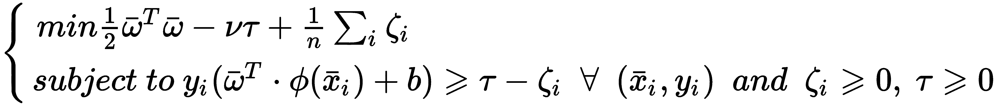

参数 *ν* 介于 *0* (排除)和 *1* 之间，可用于同时控制支持向量的数量(较大的值将增加其数量)和训练误差(较低的值减少误差的分数)。这些结果的正式证明要求我们用一个拉格朗日量来表达问题；然而，考虑到边界情况，直观地理解动力学是可能的。当 *ν → 0* 时， *τ* 变量对目标函数不再有影响。如果 *n > 1* ，则松弛变量被扣分，就像 C-SVM 中的 *C < 1* 一样。在这种情况下，支持向量的数量变得最小，同时，误差增加。另一方面，当 *ν > 0* 时，目标函数的罚函数变成如下:

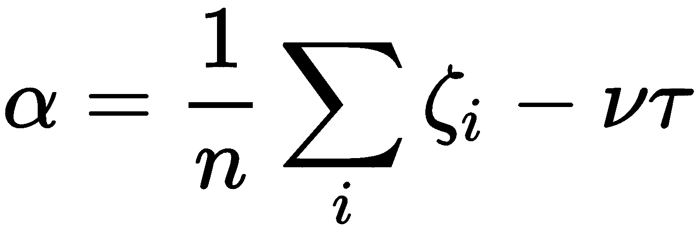

由于*ζ[I]和 *τ* 都是非负的，如果有一个 final *τ > 0* ，就可以证明这个问题等价于 C-SVM 与 *C=1/nτ* (形式证明省略)；因此，当*τ<n^(-1)C>1*并且支持向量的数量成比例增加时，ν-SVM 的主要优点之一是可以调整单个有界参数而不是无界参数。因此，网格搜索可以更好地探索整个空间，让数据科学家只关注支持向量的数量和误差之间的权衡是最佳的区域。*

Scikit-learn 提供了一个名为`NuSVC`的实现，其中参数ν称为`nu`。为了测试这个模型，让我们考虑一个具有线性内核和简单数据集的例子，其中有不可忽略的重叠。

在下图中，我们的集合有一个散点图:

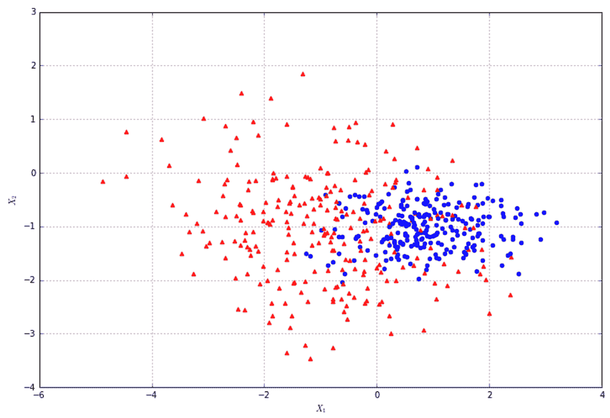

受控 SVM 的测试数据集

让我们开始检查标准 SVM 的支持向量的数量:

```py
svc = SVC(kernel='linear') 
svc.fit(X, Y) 

print(svc.support_vectors_.shape) 
(242L, 2L)
```

所以，模型找到了`242`支持向量。现在让我们尝试使用交叉验证来优化这个数字。ν的默认值是`0.5`，这是一个可接受的折衷:

```py
from sklearn.svm import NuSVC 

nusvc = NuSVC(kernel='linear', nu=0.5) 
nusvc.fit(X, Y) 

print(nusvc.support_vectors_.shape) 
(251L, 2L) 

print(cross_val_score(nusvc, X, Y, scoring='accuracy', cv=10).mean()) 
0.80633213285314143
```

正如所料，其行为类似于标准的 SVC。现在让我们降低`nu`的价值:

```py
nusvc = NuSVC(kernel='linear', nu=0.15) 
nusvc.fit(X, Y) 

print(nusvc.support_vectors_.shape) 
(78L, 2L) 

print(cross_val_score(nusvc, X, Y, scoring='accuracy', cv=10).mean()) 
0.67584393757503003
```

在这种情况下，支持向量的数量比以前少，精度也受到这种选择的影响。我们可以通过网格搜索来寻找最佳选择，而不是尝试不同的值:

```py
import numpy as np 

param_grid = [ 
    {  
        'nu': np.arange(0.05, 1.0, 0.05) 
    } 
] 

gs = GridSearchCV(estimator=NuSVC(kernel='linear'), param_grid=param_grid, 
                  scoring='accuracy', cv=10, n_jobs=multiprocessing.cpu_count()) 
gs.fit(X, Y) 

GridSearchCV(cv=10, error_score='raise', 
       estimator=NuSVC(cache_size=200, class_weight=None, coef0=0.0, 
   decision_function_shape=None, degree=3, gamma='auto', kernel='linear', 
   max_iter=-1, nu=0.5, probability=False, random_state=None, 
   shrinking=True, tol=0.001, verbose=False), 
       fit_params={}, iid=True, n_jobs=8, 
       param_grid=[{'nu': array([ 0.05,  0.1 ,  0.15,  0.2 ,  0.25,  0.3 ,  0.35,  0.4 ,  0.45, 
        0.5 ,  0.55,  0.6 ,  0.65,  0.7 ,  0.75,  0.8 ,  0.85,  0.9 ,  0.95])}], 
       pre_dispatch='2*n_jobs', refit=True, return_train_score=True, 
       scoring='accuracy', verbose=0) 

print(gs.best_estimator_) 
NuSVC(cache_size=200, class_weight=None, coef0=0.0, 
   decision_function_shape=None, degree=3, gamma='auto', kernel='linear', 
   max_iter=-1, nu=0.5, probability=False, random_state=None, 
   shrinking=True, tol=0.001, verbose=False) 

print(gs.best_score_) 
0.80600000000000005 

print(gs.best_estimator_.support_vectors_.shape) 
(251L, 2L)
```

因此，在这种情况下，`0.5`的默认值产生了最准确的结果。通常，这种方法工作得很好，但是当需要减少支持向量的数量时，它可以是一个很好的起点，用于逐渐减少`nu`的值，直到结果可以接受。


# 支持向量回归

支持向量机也可以有效地用于回归任务。但是，有必要考虑一个稍微不同的损失函数，它可以考虑预测值和目标值之间的最大差异。最常见的选择是ε不敏感损失(我们已经在被动-主动回归中看到过):

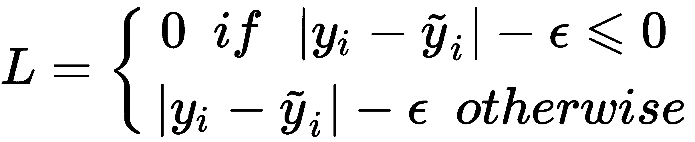

在这种情况下，我们将该问题视为一个标准的 SVM，其中分离超平面和(软)边缘被顺序构建以最小化预测误差。在下图中，有一个表示该过程的模式:

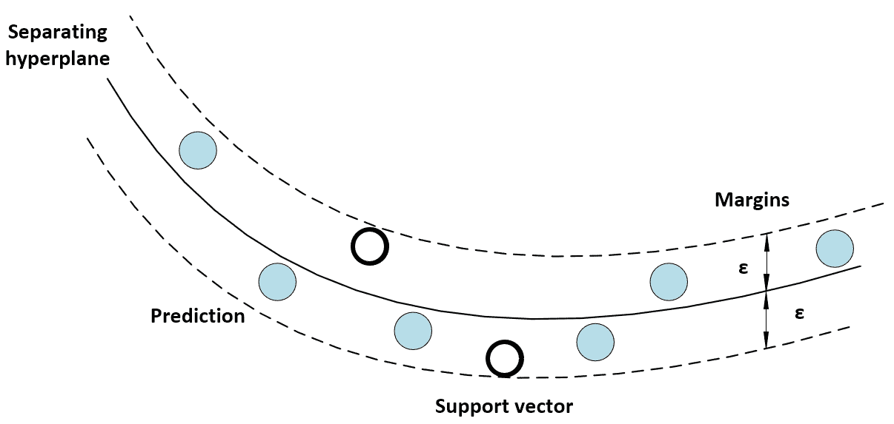

支持向量回归的例子；空心圆代表两个支持向量

目标是找到最佳参数，使所有预测都位于裕量内(由参数 **ε** 控制)。这个条件使ε不敏感损失最小，并保证目标值和预测值之间的绝对误差可以容许。然而，正如已经讨论过的分类问题，硬边界的选择往往过于严格。因此，最好引入两组松弛变量，如果绝对误差超过ε，它们也允许预测被认为是正确的。因此，问题的表述变成如下:


Scikit-learn 提供了基于该算法的 SVR。这种方法的真正优势(相对于许多其他技术)在于使用非线性核(特别是 RBF 和多项式)。但是，建议用户逐步评估多项式次数，因为复杂度会随着训练时间的增加而快速增长。

对于我们的第一个示例，我们将采用基于二阶噪声函数的虚拟数据集:

```py
import numpy as np

nb_samples = 50 

X = np.arange(-nb_samples, nb_samples, 1) 
Y = np.zeros(shape=(2 * nb_samples,)) 

for x in X: 
    Y[int(x)+nb_samples] = np.power(x*6, 2.0) / 1e4 + np.random.uniform(-2, 2)
```

数据集绘制在下图中:

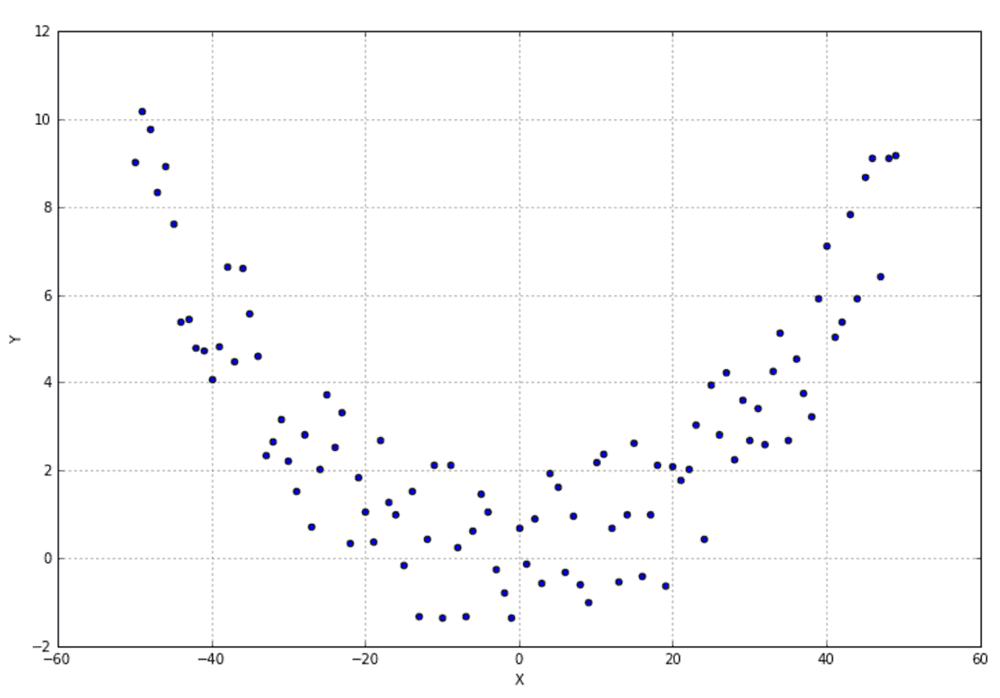

多项式支持向量回归机的非线性噪声数据集

为了避免非常长的训练过程，模型评估时将`degree`设置为`2`。`epsilon`参数允许我们为预测指定一个软余量；如果预测值包含在以目标值为中心的球中，并且半径等于`epsilon`，则不会对要最小化的函数施加惩罚。默认值为`0.1`:

```py
from sklearn.svm import SVR 

svr = SVR(kernel='poly', degree=2, C=1.5, epsilon=0.5) 

print(cross_val_score(svr, X.reshape((nb_samples*2, 1)), Y, scoring='neg_mean_squared_error', cv=10).mean()) 
-1.4641683636397234
```

可以看出，CV 负均方误差低于噪声的标准差。为了得到确认，我们可以预测所有样本的回归值(必须拟合模型，因为`cross_val_score`函数创建内部实例):

```py
svr.fit(X.reshape(-1, 1), Y.ravel())
Y_pred = svr.predict(X.reshape(-1, 1))
```

结果如下图所示:

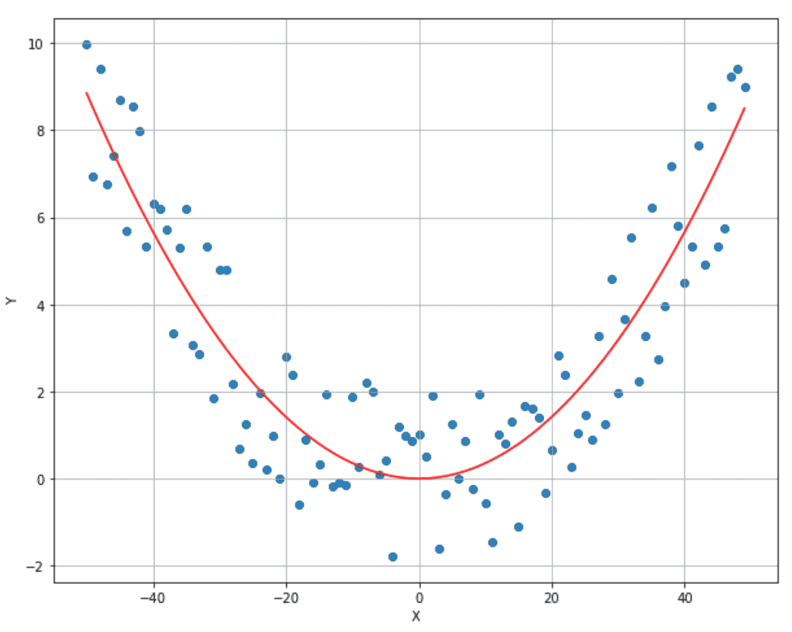

带有插值线的数据集

正如所料，插值线是一条抛物线，描述了数据的高电平振荡。采用更高的度数允许我们也捕获子振荡，但是这种选择有两个潜在的缺点:计算成本增加，并且模型更容易过度拟合训练集。通常，超参数的最佳选择应始终考虑验证集以及训练准确性和泛化能力之间的权衡。特别是，在处理时间序列(以及许多非平稳回归)时，了解全球趋势、周期性和季节性非常重要。仅在一小部分上训练模型可能会隐藏重要的信息，从而导致不被全球接受的过度专门化。下一个例子更好地揭示了这个问题。


# 翼型自噪声数据集的支持向量回归机实例

在这个例子中，我们将采用由布鲁克斯、波普、马科利尼和洛佩兹通过 UCI 网站免费提供的翼型自噪声数据集(有关下载信息，请阅读本节末尾的信息框)。数据集由 1503 个样本(*x[I])组成，其中五个参数描述了风洞配置，一个因变量(*y[I])代表了缩放后的声压(单位为 dB)。在这种情况下，我们希望用 1，203 个样本训练一个回归变量，并使用剩余的样本进行测试。数据集存储在单个 TSV 文件中；因此，我们可以使用`pandas`轻松加载和检查它:**

```py
import pandas as pd

file_path = '<DATA_PATH>\airfoil_self_noise.dat'

df = pd.read_csv(file_path, sep='\t', header=None)

```

第一个操作检查统计属性:

```py
print(df.describe())
```

上一个命令的输出如下表所示:

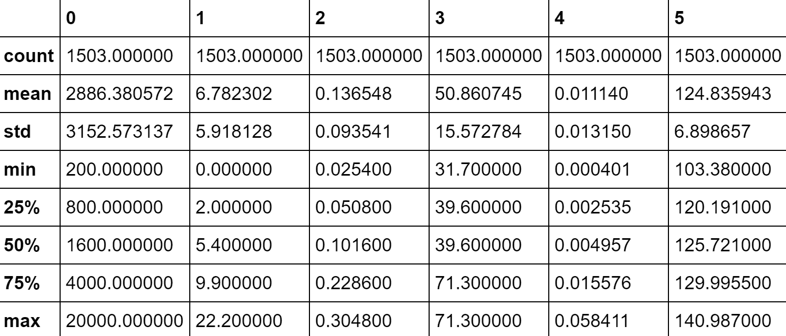

翼型自噪声数据集的统计特性

这六个属性具有非常不同的均值和标准差；因此，最好在训练模型之前对它们进行缩放(零均值和一元标准差):

```py
from sklearn.preprocessing import StandardScaler

X = df.iloc[:, 0:5].values
Y = df.iloc[:, 5].values

ssx, ssy = StandardScaler(), StandardScaler()

Xs = ssx.fit_transform(X)
Ys = ssy.fit_transform(Y.reshape(-1, 1))
```

此时，我们可以分割数据集并训练 SVM。在这个例子中，我们将使用一个具有`gamma=0.75`、`C=2.8`、`cache_size=500`(这个值也可以保持默认值，但是性能会稍微差一些)和`epsilon=0.1`的 RBF SVR。参数的选择是通过评估不同的配置做出的，但是我邀请读者使用网格搜索重复这个例子。此外，我们选择使用`train_test_split`来打乱样本，因为这不是一个时间序列。在`split`函数中设置`shuffle=False`后，读者可以尝试仅使用数据的初始部分并预测剩余部分:

```py
from sklearn.model_selection import train_test_split
from sklearn.svm import SVR

X_train, X_test, Y_train, Y_test = train_test_split(Xs, Ys.ravel(), test_size=300, random_state=1000)

svr = SVR(kernel='rbf', gamma=0.75, C=2.8, cache_size=500, epsilon=0.1)

svr.fit(X_train, Y_train)
```

训练完 SVR 后，计算训练集和测试集的*R²分数会很有帮助:*

```py
print(svr.score(X_train, Y_train))
0.896817214182

print(svr.score(X_test, Y_test))
0.871901045625
```

由于我们不执行 CV，随机种子会影响*R²分数。我建议测试不同的值，并使用`cross_val_score()`函数来更深入地理解随机性对最终性能的影响。*

在训练集上的表现相当不错，在测试集上只差 2%。这证实了模型已经成功地学习了数据集的动态。原始数据集和预测数据集的图如下图所示(使用`StandardScaler`函数`inverse_transform()`将值重新转换为原始值):

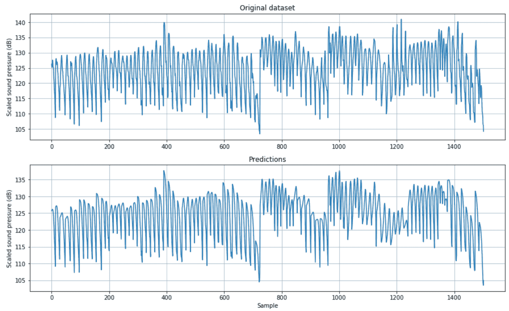

原始数据集(上图)和 SVR 预测(下图)

正如可能看到的，预测非常可靠，只有在样本 **1200** 附近有较大的差异(观察到的下降子趋势被三个尖峰改变)。为了进一步确认，可以画出绝对误差:

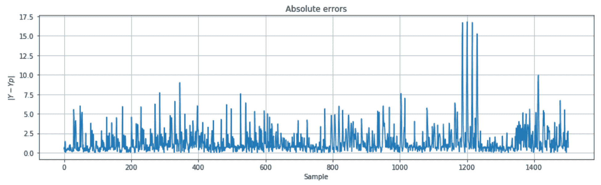

预测绝对误差

在大多数情况下，误差低于 **5.0** ，约为声压的百分之三(其平均值约为 125)。样本 **1200** 周围的三个尖峰产生约 **17.5** 的误差，即声压的 *12 ÷ 14%* 。我邀请读者测试其他超参数配置，减少和增加测试集的大小。

翼型自噪声数据集可以从 https://archive.ics.uci.edu/ml/datasets/Airfoil+Self-Noise 的 UCI 网站下载。`data`文件夹包含一个单独的**T**ab 分隔值 ( **TSV** )文件，其扩展名为`.dat`，可以使用 pandas 或任何其他标准方法轻松解析。由于 Dua d .*和* Karra Taniskidou，E. (2017) *的贡献，UCI 网站才成为可能。*http://archive.ics.uci.edu/ml UCI 机器学习库。加州欧文:加州大学信息与计算机科学学院。


# 引入半监督支持向量机(S3VM)

假设我们有一个由 *N* 个标记点和 *M* (通常是 *M > > N* )个未标记点组成的数据集(当标记成本非常高时会出现这种非常常见的情况)。在半监督学习框架中(更多细节请参考*掌握机器学习算法*， *Bonaccorso G* 。、 *Packt Publishing* 、 *2018* )，可以假设标记样本提供的信息足以理解底层数据生成过程的结构。显然，这并不总是正确的，特别是当标记只在特定样品的一部分上完成时。然而，在许多情况下，这种假设是现实的，因此，询问是否有可能仅使用标记不良的数据集来执行完整的分类是合理的。当然，读者必须记住，我们不希望只使用标记样本来训练模型(这种情况默认为标准 SVM)，但是我们希望将标记样本的*强*贡献与未标记样本的结构合并在一起。我们将要展示的模型(没有太多的细节，因为它们超出了本书的范围)被称为 S ³ VM，它已经被提出来解决这种问题。

不失一般性地，让我们考虑一个双极分类，使得标记样本 *x [i] (i=1..N)* 有标签的 *y [i] ∈ {-1，+1}* ，而无标签的样本*x[I]**(I = N+1...N+M)* 简单的用 *y [i] = 0* 来标识。目标函数的结构与我们已经分析过的线性 SVM 非常相似:

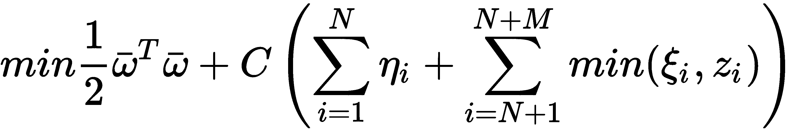

在这种情况下，我们有三组松弛变量。第一个( *η [i]* )定义了软边距的结构，只考虑带标签的样本。另外两个( *ξ [j] ，z [j]* )仅影响未标记的样本，并使用 min*()*函数进行选择，因为我们的目标是在误差最小时将样本分类在半平面中。通过考虑以下约束条件，可以更好地理解这一策略:

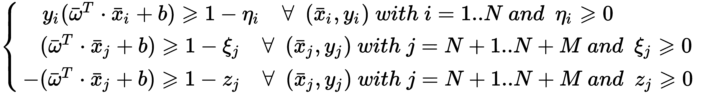

第一个约束与标准 SVM 相同。剩下的人负责选择最佳的半平面。实际上，如果我们考虑一个样本 *x [j]* 其最优半平面由标签 *y [j] = +1* ，那么第二个约束就变成了*1-ξ[j]≤K(K>0)*，所以 *ξ [j] ≥ 1 - K* 第三个反而变成了*1-z[j]**≤-K*，导致 *z [j] ≥ 1 + K* 。于是，作为*z[j]>ξ*[*j*]，要最小化的松弛变量变成 *min(ξ [j] ，z [j] ) = ξ [j]* ，对应 *+1* 标签。

可惜 scikit-learn 没有实现这个算法，所以我们需要使用 SciPy 来优化目标函数。由于问题是非凸的，计算成本很高，这可能会限制其在小数据集的使用。然而，结合使用本地库和现代个人计算机的计算能力，我们可以在合理的时间内解决中型到大型的问题(但总是比标准的 SVM 要长一些)。

为了测试该算法，我们将构建一个简单的数据集(以限制计算成本),其中包含 50 个标记样本和`150`个未标记样本:

```py
from sklearn.datasets import make_classification

nb_samples = 200
nb_unlabeled = 150

X, Y = make_classification(n_samples=nb_samples, n_features=2, n_redundant=0, random_state=1000)
Y[Y == 0] = -1
Y[nb_samples - nb_unlabeled:nb_samples] = 0
```

下图显示了数据集的曲线图:

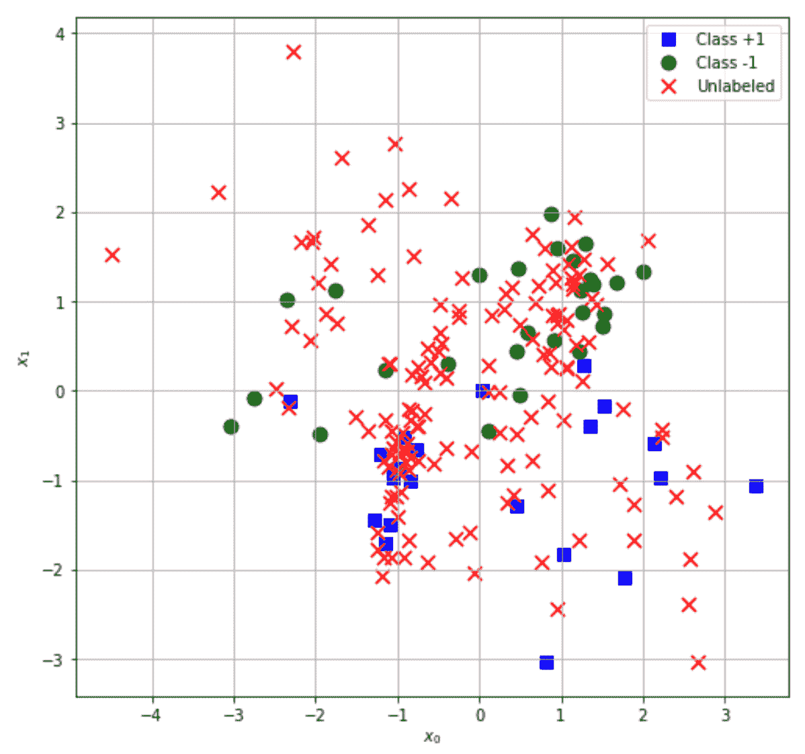

S ³ 虚拟机数据集；十字代表未标记的样品

为了优化目标函数，我们使用 SciPy `minimize()`函数和**序列最小二乘编程** ( **SLSQP** )算法。因此，我们需要初始化所有的变量(我们已经决定设置`C=0.5`，但我邀请读者测试不同的配置并比较结果)，将它们堆叠到一个向量中，并创建一个实用的矢量化函数来获得两个数组之间的元素最小值:

```py
import numpy as np

w = np.random.uniform(-0.1, 0.1, size=X.shape[1])
eta = np.random.uniform(0.0, 0.1, size=nb_samples - nb_unlabeled)
xi = np.random.uniform(0.0, 0.1, size=nb_unlabeled)
zi = np.random.uniform(0.0, 0.1, size=nb_unlabeled)
b = np.random.uniform(-0.1, 0.1, size=1)
C = 0.5

theta0 = np.hstack((w, eta, xi, zi, b))

vmin = np.vectorize(lambda x1, x2: x1 if x1 <= x2 else x2)
```

`minimize()`函数对初始条件、底层本地库、操作系统和随机种子非常敏感。因此，我总是建议测试不同的值，并为每个特定环境选择最佳配置。

此时，我们可以创建`svm_target`函数和所有约束条件(三个用于主要不等式，三个用于松弛变量的非负性):

```py
import numpy as np

def svm_target(theta, Xd, Yd):
    wt = theta[0:2].reshape((Xd.shape[1], 1))

    s_eta = np.sum(theta[2:2 + nb_samples - nb_unlabeled])
    s_min_xi_zi = np.sum(vmin(theta[2 + nb_samples - nb_unlabeled:2 + nb_samples],
                              theta[2 + nb_samples:2 + nb_samples + nb_unlabeled]))

    return C * (s_eta + s_min_xi_zi) + 0.5 * np.dot(wt.T, wt)

def labeled_constraint(theta, Xd, Yd, idx):
    wt = theta[0:2].reshape((Xd.shape[1], 1))

    c = Yd[idx] * (np.dot(Xd[idx], wt) + theta[-1]) + \
        theta[2:2 + nb_samples - nb_unlabeled][idx] - 1.0

    return (c >= 0)[0]

def unlabeled_constraint_1(theta, Xd, idx):
    wt = theta[0:2].reshape((Xd.shape[1], 1))

    c = np.dot(Xd[idx], wt) - theta[-1] + \
        theta[2 + nb_samples - nb_unlabeled:2 + nb_samples][idx - nb_samples + nb_unlabeled] - 1.0

    return (c >= 0)[0]

def unlabeled_constraint_2(theta, Xd, idx):
    wt = theta[0:2].reshape((Xd.shape[1], 1))

    c = -(np.dot(Xd[idx], wt) - theta[-1]) + \
        theta[2 + nb_samples:2 + nb_samples + nb_unlabeled][idx - nb_samples + nb_unlabeled] - 1.0

    return (c >= 0)[0]

def eta_constraint(theta, idx):
    return theta[2:2 + nb_samples - nb_unlabeled][idx] >= 0

def xi_constraint(theta, idx):
    return theta[2 + nb_samples - nb_unlabeled:2 + nb_samples][idx - nb_samples + nb_unlabeled] >= 0

def zi_constraint(theta, idx):
    return theta[2 + nb_samples:2 + nb_samples+nb_unlabeled ][idx - nb_samples + nb_unlabeled] >= 0
```

因为我们处理的是包含所有变量的单个向量，所以我们总是需要对它进行切片，以便只选择适当的值。`minimize()`函数允许我们使用字典添加任意数量的约束。在我们的例子中，它们都是不等式，所以它们都有`'type': 'ineq'`属性，以及要传递的函数和参数:

```py
svm_constraints = []

for i in range(nb_samples - nb_unlabeled):
    svm_constraints.append({
        'type': 'ineq',
        'fun': labeled_constraint,
        'args': (X, Y, i)
    })
    svm_constraints.append({
            'type': 'ineq',
            'fun': eta_constraint,
            'args': (i,)
        })

for i in range(nb_samples - nb_unlabeled, nb_samples):
    svm_constraints.append({
        'type': 'ineq',
        'fun': unlabeled_constraint_1,
        'args': (X, i)
    })
    svm_constraints.append({
        'type': 'ineq',
        'fun': unlabeled_constraint_2,
        'args': (X, i)
    })
    svm_constraints.append({
        'type': 'ineq',
        'fun': xi_constraint,
        'args': (i,)
    })
    svm_constraints.append({
        'type': 'ineq',
        'fun': zi_constraint,
        'args': (i,)
    })
```

此时，我们运行优化，将(`tol`)容差设置为等于`0.0001`，最大迭代次数为`1000`:

```py
from scipy.optimize import minimize

result = minimize(fun=svm_target,
                  x0=theta0,
                  constraints=svm_constraints,
                  args=(X, Y),
                  method='SLSQP',
                  tol=0.0001,
                  options={'maxiter': 1000})
```

这个操作(不是很优化)在样本数很大的情况下可能会相当长，所以我建议从较小的数开始，逐步增加。收敛后，我们需要从`theta`向量(作为`result['x']`返回)中提取所有最终参数，并基于点积的符号，使用标准 SVM 方法标记所有未标记的样本:

```py
theta_end = result['x']
w = theta_end[0:2]
b = theta_end[-1]

Xu = X[nb_samples - nb_unlabeled:nb_samples]
yu = -np.sign(np.dot(Xu, w) + b)
```

最终结果(与原始数据集相比)如下图所示:

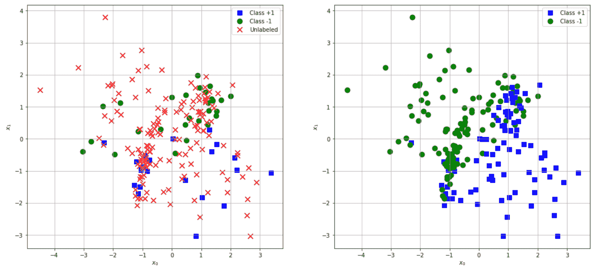

原始数据集(左)；完全分类的数据集(右)

正如你所看到的，该算法已经成功地以最合理的方式标记了所有未标记的样本，并且大多数潜在的错误分类是由于现有的原始重叠。由于大量的约束(对于 *n* 个样本，有 *6n* 个不等式)和 SciPy 提供的有限优化级别，该算法不是非常有效。我邀请对这项技术感兴趣的读者去看看 NLopt 库([https://nlopt.readthedocs.io/en/latest/](https://nlopt.readthedocs.io/en/latest/))，它为大多数操作系统提供了本机优化功能。从这个例子开始，使用更高性能的框架来重现问题的结构并不困难。


# 摘要

在本章中，我们讨论了 SVM 在线性和非线性情况下的工作原理，从基本的数学公式开始。主要概念是通过使用最接近分离边缘的有限数量的样本(称为支持向量)来找到使类之间的距离最大化的超平面。

我们看到了如何使用核函数来转换非线性问题，核函数允许将原始空间重新映射到另一个高维空间，在这个高维空间中，问题变得线性可分。我们还看到了如何控制支持向量的数量，以及如何使用支持向量机来解决回归问题。

在下一章[第八章](778dc47a-b405-47de-a41a-75c7024023b3.xhtml)、*决策树和集成学习、*我们要介绍另一种分类方法，叫做**决策树**，这也是本书最后解释的一种。